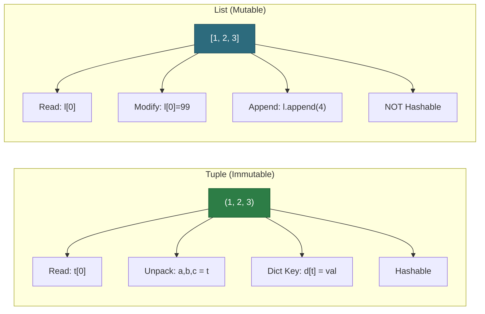
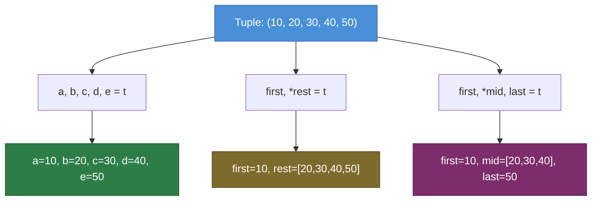

# Python Tuples — Junior Level

## Table of Contents

1. [Introduction](#introduction)
2. [Prerequisites](#prerequisites)
3. [Glossary](#glossary)
4. [Core Concepts](#core-concepts)
5. [Real-World Analogies](#real-world-analogies)
6. [Mental Models](#mental-models)
7. [Pros & Cons](#pros--cons)
8. [Use Cases](#use-cases)
9. [Code Examples](#code-examples)
10. [Clean Code](#clean-code)
11. [Product Use / Feature](#product-use--feature)
12. [Error Handling](#error-handling)
13. [Security Considerations](#security-considerations)
14. [Performance Tips](#performance-tips)
15. [Metrics & Analytics](#metrics--analytics)
16. [Best Practices](#best-practices)
17. [Edge Cases & Pitfalls](#edge-cases--pitfalls)
18. [Common Mistakes](#common-mistakes)
19. [Common Misconceptions](#common-misconceptions)
20. [Tricky Points](#tricky-points)
21. [Test](#test)
22. [Tricky Questions](#tricky-questions)
23. [Cheat Sheet](#cheat-sheet)
24. [Summary](#summary)
25. [What You Can Build](#what-you-can-build)
26. [Further Reading](#further-reading)
27. [Related Topics](#related-topics)
28. [Diagrams & Visual Aids](#diagrams--visual-aids)

---

## Introduction

> Focus: "What is it?" and "How to use it?"

A **tuple** is an ordered, **immutable** sequence in Python. Once created, you cannot add, remove, or change its elements. Tuples are defined with parentheses `()` or simply by separating values with commas. They are used when you want to group related data that should not be modified — such as coordinates, database rows, or function return values.

Tuples are one of Python's four built-in collection types (along with lists, sets, and dictionaries). If lists are like shopping carts (add/remove freely), tuples are like sealed envelopes — once you put the data in, it stays put.

---

## Prerequisites

What you should know before studying this topic:

- **Required:** Basic Python syntax — you need to know how to write and run Python scripts
- **Required:** Variables and data types — understanding how Python stores values (int, str, float, bool)
- **Required:** Lists — tuples are closely related; understanding lists makes tuples intuitive
- **Helpful but not required:** Functions — tuples are often used as return values from functions

---

## Glossary

Key terms used in this topic:

| Term | Definition |
|------|-----------|
| **Tuple** | An ordered, immutable sequence of elements enclosed in parentheses `()` |
| **Immutable** | Cannot be changed after creation — elements cannot be added, removed, or modified |
| **Packing** | Creating a tuple by grouping values together: `t = 1, 2, 3` |
| **Unpacking** | Extracting tuple elements into individual variables: `a, b, c = t` |
| **Index** | An integer position of an element in a tuple (starts at 0) |
| **Named Tuple** | A tuple subclass with named fields, created via `collections.namedtuple` |
| **Hashable** | An object that has a fixed hash value during its lifetime; tuples of hashable items are hashable |
| **Singleton Tuple** | A tuple with exactly one element, created with a trailing comma: `(42,)` |

---

## Core Concepts

### Concept 1: Creating Tuples

You can create tuples in several ways. Parentheses are optional — it is the **comma** that makes a tuple:

```python
# Using parentheses (most common)
colors = ("red", "green", "blue")

# Without parentheses (tuple packing)
coordinates = 10, 20, 30

# Empty tuple
empty = ()
empty2 = tuple()

# From other iterables
from_list = tuple([1, 2, 3])       # (1, 2, 3)
from_range = tuple(range(5))       # (0, 1, 2, 3, 4)
from_string = tuple("hello")       # ('h', 'e', 'l', 'l', 'o')
```

### Concept 2: Single-Element Tuple (Trailing Comma)

This is one of the most common beginner mistakes. A single value in parentheses is **not** a tuple — you need a trailing comma:

```python
# NOT a tuple — just an integer in parentheses
not_a_tuple = (42)
print(type(not_a_tuple))   # <class 'int'>

# THIS is a single-element tuple
single = (42,)
print(type(single))        # <class 'tuple'>
print(len(single))         # 1

# Without parentheses — still works with a trailing comma
also_single = 42,
print(type(also_single))   # <class 'tuple'>
```

### Concept 3: Indexing and Slicing

Tuples support the same indexing and slicing as lists:

```python
fruits = ("apple", "banana", "cherry", "date", "elderberry")

# Indexing
print(fruits[0])      # apple
print(fruits[-1])     # elderberry

# Slicing
print(fruits[1:3])    # ('banana', 'cherry')
print(fruits[:2])     # ('apple', 'banana')
print(fruits[::2])    # ('apple', 'cherry', 'elderberry')
```

### Concept 4: Tuple Unpacking

Unpack tuple elements into individual variables in a single statement:

```python
# Basic unpacking
point = (10, 20, 30)
x, y, z = point
print(x, y, z)  # 10 20 30

# Swap variables (uses tuple packing/unpacking internally)
a, b = 1, 2
a, b = b, a
print(a, b)  # 2 1

# Star unpacking — catch remaining elements
first, *rest = (1, 2, 3, 4, 5)
print(first)  # 1
print(rest)   # [2, 3, 4, 5]  (note: rest is a list!)

first, *middle, last = (1, 2, 3, 4, 5)
print(first)   # 1
print(middle)  # [2, 3, 4]
print(last)    # 5
```

### Concept 5: Tuple Methods

Tuples have only **two** methods (because they are immutable):

```python
numbers = (1, 3, 5, 3, 7, 3, 9)

# count() — how many times a value appears
print(numbers.count(3))    # 3
print(numbers.count(99))   # 0

# index() — position of first occurrence
print(numbers.index(5))    # 2
print(numbers.index(3))    # 1  (first occurrence)
# numbers.index(99)        # ValueError: tuple.index(x): x not in tuple
```

### Concept 6: Immutability

Tuples cannot be changed after creation:

```python
t = (1, 2, 3)

# These will all raise TypeError:
# t[0] = 99          # TypeError: 'tuple' object does not support item assignment
# t.append(4)        # AttributeError: 'tuple' object has no attribute 'append'
# del t[0]           # TypeError: 'tuple' object doesn't support item deletion

# But you CAN create new tuples from existing ones
t2 = t + (4, 5)      # (1, 2, 3, 4, 5)
t3 = t * 2           # (1, 2, 3, 1, 2, 3)
```

---

## Real-World Analogies

Everyday analogies to help you understand tuples intuitively:

| Concept | Analogy |
|---------|--------|
| **Tuple** | A sealed envelope — once you seal it, you cannot change the contents inside |
| **Immutability** | A printed receipt — the data is fixed; you can read it but not alter it |
| **Tuple Unpacking** | Opening a gift box with multiple compartments — each item goes to a specific person |
| **Named Tuple** | A form with labeled fields — like a passport with Name, DOB, Nationality clearly marked |

---

## Mental Models

How to picture tuples in your head:

**The intuition:** Think of a tuple as a **frozen list** — it holds an ordered sequence of items, but once created, the container is sealed. You can look at the items (read), but you cannot add, remove, or swap them.

**Why this model helps:** When you see `()` instead of `[]`, your mind should immediately think "this data is not meant to be changed." This prevents accidental modifications and signals intent to other developers reading your code.

---

## Pros & Cons

| Pros | Cons |
|------|------|
| Immutable — safer, no accidental modifications | Cannot add/remove/change elements after creation |
| Faster than lists (less memory, optimized in CPython) | Only 2 built-in methods (count, index) |
| Hashable — can be used as dictionary keys and set elements | Converting to list for modification, then back, is verbose |
| Clearly signals intent: "this data should not change" | Confusion with single-element syntax `(42,)` |
| Supports packing/unpacking for elegant code | Less beginner-friendly than lists |

### When to use:
- Function return values with multiple items
- Dictionary keys (e.g., coordinate pairs)
- Data that should not be modified (database rows, configuration records)

### When NOT to use:
- When you need to add/remove elements frequently
- When the collection size changes over time
- When you need list methods like `sort()`, `append()`, `extend()`

---

## Use Cases

When and where you would use tuples in real projects:

- **Use Case 1:** Function return values — `return (status_code, message, data)` to return multiple values
- **Use Case 2:** Dictionary keys — `cache[(x, y)] = result` for coordinate-based lookups
- **Use Case 3:** Database rows — `cursor.fetchall()` returns tuples by default
- **Use Case 4:** Configuration constants — `ALLOWED_HOSTS = ("localhost", "127.0.0.1")`
- **Use Case 5:** Unpacking in loops — `for name, age in [("Alice", 30), ("Bob", 25)]: ...`

---

## Code Examples

### Example 1: RGB Color Representation

```python
# Tuples are perfect for representing fixed-structure data like colors

def rgb_to_hex(color: tuple[int, int, int]) -> str:
    """Convert an RGB tuple to a hex color string."""
    r, g, b = color  # tuple unpacking
    return f"#{r:02x}{g:02x}{b:02x}"


def blend_colors(c1: tuple[int, int, int], c2: tuple[int, int, int]) -> tuple[int, int, int]:
    """Blend two RGB colors by averaging their components."""
    r1, g1, b1 = c1
    r2, g2, b2 = c2
    return ((r1 + r2) // 2, (g1 + g2) // 2, (b1 + b2) // 2)


if __name__ == "__main__":
    red = (255, 0, 0)
    blue = (0, 0, 255)

    print(f"Red in hex: {rgb_to_hex(red)}")       # #ff0000
    print(f"Blue in hex: {rgb_to_hex(blue)}")      # #0000ff
    print(f"Blended: {blend_colors(red, blue)}")   # (127, 0, 127)
```

**What it does:** Uses tuples to represent immutable RGB colors and demonstrates unpacking for clean component access.
**How to run:** `python rgb_colors.py`

### Example 2: Student Records with Named Tuples

```python
from collections import namedtuple

# Create a named tuple class
Student = namedtuple("Student", ["name", "age", "grade", "gpa"])

# Create instances
alice = Student("Alice", 20, "A", 3.9)
bob = Student(name="Bob", age=22, grade="B", gpa=3.5)

# Access by name (readable) or by index
print(f"{alice.name} is {alice.age} years old")   # Alice is 20 years old
print(f"Grade: {alice[2]}, GPA: {alice[3]}")       # Grade: A, GPA: 3.9

# Named tuples are still tuples — immutable and iterable
print(isinstance(alice, tuple))  # True

# Unpacking works too
name, age, grade, gpa = alice
print(f"{name}: {gpa}")  # Alice: 3.9

# _replace() creates a NEW named tuple (original unchanged)
alice_updated = alice._replace(gpa=4.0)
print(alice.gpa)          # 3.9 (unchanged)
print(alice_updated.gpa)  # 4.0
```

**What it does:** Shows how `namedtuple` gives tuples readable field names while keeping immutability.
**How to run:** `python student_records.py`

### Example 3: Tuples as Dictionary Keys

```python
# Tuples are hashable, so they can be dictionary keys (lists cannot!)

def build_distance_cache() -> dict[tuple[str, str], float]:
    """Build a cache of distances between city pairs."""
    distances: dict[tuple[str, str], float] = {}

    # Tuple keys represent city pairs
    distances[("New York", "London")] = 5570.0
    distances[("London", "Tokyo")] = 9560.0
    distances[("Tokyo", "Sydney")] = 7820.0
    distances[("New York", "Tokyo")] = 10840.0

    return distances


if __name__ == "__main__":
    cache = build_distance_cache()

    # Look up by tuple key
    route = ("New York", "London")
    print(f"{route[0]} -> {route[1]}: {cache[route]} km")

    # Iterate over tuple keys with unpacking
    for (city1, city2), distance in cache.items():
        print(f"  {city1} -> {city2}: {distance} km")
```

**What it does:** Demonstrates tuples as dictionary keys — something lists cannot do because they are not hashable.
**How to run:** `python distance_cache.py`

---

## Clean Code

Basic clean code principles when working with tuples in Python:

### Naming (PEP 8 conventions)

```python
# Bad — unclear what the tuple contains
d = (10, 20)
p = ("Alice", 30, "A")

# Good — descriptive names
coordinates = (10, 20)
student_record = ("Alice", 30, "A")

# Better — use named tuples for complex structures
from collections import namedtuple
Point = namedtuple("Point", ["x", "y"])
position = Point(10, 20)
```

### Unpacking for Clarity

```python
# Bad — accessing by index is cryptic
record = ("Alice", 30, "Engineering")
print(f"Name: {record[0]}, Dept: {record[2]}")

# Good — unpacking gives meaning to each value
name, age, department = record
print(f"Name: {name}, Dept: {department}")
```

### Use Type Hints

```python
# Good — type hints document the tuple structure
def get_min_max(numbers: list[int]) -> tuple[int, int]:
    """Return the (minimum, maximum) of a list."""
    return (min(numbers), max(numbers))

lo, hi = get_min_max([3, 1, 4, 1, 5])
```

---

## Product Use / Feature

How tuples are used in real-world products and tools:

### 1. Django ORM

- **How it uses tuples:** `INSTALLED_APPS`, `MIDDLEWARE`, and `ALLOWED_HOSTS` are often defined as tuples in `settings.py`
- **Why it matters:** Using tuples signals that these configurations should not be modified at runtime

### 2. Python's `os.path` and `pathlib`

- **How it uses tuples:** `os.path.splitext("file.txt")` returns `("file", ".txt")` as a tuple
- **Why it matters:** The result has a fixed structure (base, extension), so a tuple is the right choice

### 3. SQLite3 / Database Cursors

- **How it uses tuples:** `cursor.fetchall()` returns rows as a list of tuples
- **Why it matters:** Each row is a fixed-size record — tuples prevent accidental mutation of database results

---

## Error Handling

How to handle errors when working with tuples:

### Error 1: TypeError — Trying to Modify a Tuple

```python
t = (1, 2, 3)
try:
    t[0] = 99
except TypeError as e:
    print(f"Error: {e}")
    # Error: 'tuple' object does not support item assignment
    # Fix: create a new tuple or convert to list first
    t_list = list(t)
    t_list[0] = 99
    t = tuple(t_list)
    print(t)  # (99, 2, 3)
```

### Error 2: ValueError — Unpacking Mismatch

```python
point = (10, 20, 30)
try:
    x, y = point  # Too few variables
except ValueError as e:
    print(f"Error: {e}")
    # Error: too many values to unpack (expected 2)
    # Fix: match the number of variables, or use * to catch extras
    x, y, z = point
    # or: x, *rest = point
```

### Error 3: ValueError — index() Not Found

```python
t = (1, 2, 3)
try:
    pos = t.index(99)
except ValueError as e:
    print(f"Error: {e}")
    # Fix: check membership first
    if 99 in t:
        pos = t.index(99)
    else:
        pos = -1  # sentinel value
```

---

## Security Considerations

- **Immutability is not deep:** A tuple containing a mutable object (like a list) does NOT prevent that inner object from changing
- **Pickle safety:** Tuples, like other Python objects, can carry malicious payloads when unpickled from untrusted sources. Never `pickle.loads()` data from untrusted inputs
- **Use tuples for constant config:** Defining sensitive configurations as tuples prevents accidental modification in code

```python
# Immutability caveat: inner mutable objects CAN change!
t = ([1, 2], [3, 4])
t[0].append(99)      # This works! The list inside can be modified
print(t)              # ([1, 2, 99], [3, 4])
# t[0] = [5, 6]      # TypeError — cannot reassign the slot itself
```

---

## Performance Tips

- **Tuples are faster than lists** for creation and iteration (CPython stores small tuples in a free list cache)
- **Use tuples for fixed data** to benefit from smaller memory footprint
- **Tuple creation is optimized:** CPython caches small tuples and reuses empty tuples

```python
import sys

# Memory comparison
list_size = sys.getsizeof([1, 2, 3, 4, 5])
tuple_size = sys.getsizeof((1, 2, 3, 4, 5))
print(f"List:  {list_size} bytes")    # typically 104 bytes
print(f"Tuple: {tuple_size} bytes")   # typically 80 bytes
```

---

## Metrics & Analytics

Key characteristics of tuples:

| Operation | Time Complexity | Notes |
|-----------|:--------------:|-------|
| Create `tuple(iterable)` | O(n) | Copies all elements |
| Index `t[i]` | O(1) | Direct pointer lookup |
| Slice `t[a:b]` | O(b-a) | Creates a new tuple |
| `in` membership | O(n) | Linear scan |
| `count(x)` | O(n) | Scans entire tuple |
| `index(x)` | O(n) | Scans until found |
| `len(t)` | O(1) | Stored as attribute |
| Concatenation `t1 + t2` | O(n+m) | Creates new tuple |

---

## Best Practices

1. **Use tuples for fixed-size collections** — coordinates, RGB values, database rows
2. **Use named tuples instead of plain tuples** when the tuple has 3+ fields, for readability
3. **Always use the trailing comma for single-element tuples:** `(42,)` not `(42)`
4. **Prefer unpacking over indexing:** `x, y = point` is clearer than `point[0], point[1]`
5. **Use tuples as dictionary keys** when you need composite keys
6. **Return tuples from functions** for multiple return values
7. **Use type hints** to document tuple structure: `tuple[str, int, float]`

---

## Edge Cases & Pitfalls

### Pitfall 1: Single-Element Tuple

```python
# This is NOT a tuple
x = (42)
print(type(x))  # <class 'int'>

# This IS a tuple
x = (42,)
print(type(x))  # <class 'tuple'>
```

### Pitfall 2: Mutable Elements Inside Tuples

```python
t = ([1, 2], "hello")
t[0].append(3)      # Works! The list is mutable
print(t)             # ([1, 2, 3], 'hello')
# But: hash(t)       # TypeError — unhashable because it contains a list
```

### Pitfall 3: Concatenation Creates New Objects

```python
t1 = (1, 2)
t2 = t1
t1 = t1 + (3,)       # Creates a NEW tuple; t2 still points to (1, 2)
print(t1)             # (1, 2, 3)
print(t2)             # (1, 2)
```

---

## Common Mistakes

### Mistake 1: Forgetting the Comma in Single-Element Tuples

```python
# Wrong
single = (5)       # This is int 5, not a tuple
# Right
single = (5,)      # This is a tuple containing 5
```

### Mistake 2: Trying to Sort a Tuple In-Place

```python
t = (3, 1, 2)
# t.sort()           # AttributeError: 'tuple' object has no attribute 'sort'
sorted_t = tuple(sorted(t))  # (1, 2, 3)  — creates a new tuple
```

### Mistake 3: Unpacking Mismatch

```python
# Wrong — mismatched count
# a, b = (1, 2, 3)   # ValueError: too many values to unpack

# Right — use star to capture extras
a, *b = (1, 2, 3)    # a=1, b=[2, 3]
```

---

## Common Misconceptions

| Misconception | Reality |
|--------------|---------|
| "Parentheses create tuples" | **Commas** create tuples; parentheses are just for grouping. `1, 2, 3` is a tuple. |
| "Tuples are completely immutable" | The tuple container is immutable, but mutable objects inside it can still change |
| "Tuples are slower because they are immutable" | Tuples are actually **faster** than lists due to CPython optimizations |
| "You can't use tuples as dict keys" | You **can**, as long as all elements are hashable |

---

## Tricky Points

### Tricky 1: Tuple Packing Precedence

```python
# What does this produce?
result = 1, 2 + 3
print(result)     # (1, 5) — NOT (1, 2, 3)!
# The comma has LOWER precedence than +
# Python evaluates: result = (1, (2+3)) = (1, 5)
```

### Tricky 2: Empty Tuple vs Empty Parentheses

```python
# Empty tuple
empty = ()
print(type(empty))  # <class 'tuple'>
print(len(empty))   # 0

# BUT: () in expressions is just grouping
result = (3 + 4)    # This is 7, not a tuple
result = (3 + 4,)   # This is (7,), a tuple
```

---

## Test

Test your understanding of Python tuples:

### Question 1
What is the output?
```python
t = (1, 2, 3)
print(t[1:2])
```

<details>
<summary>Answer</summary>

`(2,)` — A slice of a tuple returns a tuple. Even with one element, it is a tuple (with trailing comma in repr).

</details>

### Question 2
What is the type?
```python
x = (1)
y = 1,
z = (1,)
print(type(x), type(y), type(z))
```

<details>
<summary>Answer</summary>

`<class 'int'> <class 'tuple'> <class 'tuple'>` — `(1)` is just `1` (an integer). The comma makes a tuple.

</details>

### Question 3
What happens?
```python
t = (1, [2, 3], 4)
t[1].append(5)
print(t)
```

<details>
<summary>Answer</summary>

`(1, [2, 3, 5], 4)` — The tuple itself is immutable (you cannot reassign `t[1]`), but the list object at `t[1]` is mutable and can be modified in place.

</details>

### Question 4
What is the output?
```python
a, *b, c = (10, 20, 30, 40, 50)
print(a, b, c)
```

<details>
<summary>Answer</summary>

`10 [20, 30, 40] 50` — `a` gets the first element, `c` gets the last, and `*b` catches everything in between as a **list**.

</details>

### Question 5
Is this valid?
```python
d = {}
d[(1, 2)] = "point A"
d[(3, [4])] = "point B"
```

<details>
<summary>Answer</summary>

The first assignment works fine. The second raises `TypeError: unhashable type: 'list'` because a tuple containing a mutable (unhashable) element cannot be used as a dictionary key.

</details>

---

## Tricky Questions

### Q1: What is `tuple(tuple((1, 2, 3)))`?

<details>
<summary>Answer</summary>

`(1, 2, 3)` — `tuple()` of a tuple returns the **same object** (no copy is made). This is an optimization because tuples are immutable.

```python
a = (1, 2, 3)
b = tuple(a)
print(a is b)  # True — same object!
```

</details>

### Q2: Can you use `+=` on a tuple?

<details>
<summary>Answer</summary>

Yes, but it creates a **new** tuple (rebinding the variable):

```python
t = (1, 2)
original_id = id(t)
t += (3,)
print(t)                      # (1, 2, 3)
print(id(t) == original_id)   # False — it's a new object
```

</details>

### Q3: What happens with `+=` on a tuple element that is a list?

<details>
<summary>Answer</summary>

This is a famous Python gotcha:

```python
t = ([1, 2],)
try:
    t[0] += [3, 4]
except TypeError as e:
    print(f"Error: {e}")
print(t)  # ([1, 2, 3, 4],)  — the list WAS modified despite the error!
```

The `+=` on a list first calls `list.extend()` (which succeeds), then tries to assign the result back to `t[0]` (which fails). So you get **both** a mutation and an exception!

</details>

---

## Cheat Sheet

```python
# ===================== TUPLE CHEAT SHEET =====================

# --- Creating ---
t = (1, 2, 3)                # parentheses
t = 1, 2, 3                  # packing (no parens needed)
t = ()                       # empty tuple
t = (42,)                    # single element — COMMA required!
t = tuple([1, 2, 3])         # from iterable

# --- Accessing ---
t[0]                         # first element
t[-1]                        # last element
t[1:3]                       # slice -> new tuple

# --- Unpacking ---
a, b, c = (1, 2, 3)          # basic unpacking
a, *rest = (1, 2, 3, 4)      # star unpacking: a=1, rest=[2,3,4]
a, b = b, a                  # swap variables

# --- Methods ---
t.count(3)                   # count occurrences of 3
t.index(3)                   # index of first 3

# --- Operations ---
t1 + t2                      # concatenation -> new tuple
t * 3                        # repetition -> new tuple
len(t)                       # length
3 in t                       # membership test
sorted(t)                    # returns sorted LIST

# --- Named Tuples ---
from collections import namedtuple
Point = namedtuple("Point", ["x", "y"])
p = Point(10, 20)
p.x, p.y                    # access by name

# --- Conversion ---
list(t)                      # tuple -> list
tuple([1, 2, 3])             # list -> tuple
```

---

## Summary

- A **tuple** is an ordered, immutable sequence defined with commas (parentheses optional)
- Single-element tuples require a **trailing comma**: `(42,)` not `(42)`
- Tuples support **indexing**, **slicing**, and **unpacking** just like lists
- Only **two methods**: `count()` and `index()`
- Tuples are **immutable** — you cannot add, remove, or change elements
- Tuples are **hashable** (if all elements are hashable) and can be used as **dictionary keys**
- **Named tuples** add readable field names: `Point(x=10, y=20)`
- Tuples use **less memory** and are **faster** than lists
- Use tuples for fixed-structure data; use lists for dynamic collections

---

## What You Can Build

With tuple knowledge, you can build:

- **Coordinate systems** — represent 2D/3D points as tuples
- **Color palettes** — define RGB colors as immutable tuples
- **Database record processors** — work with rows from SQL queries
- **Multi-value function returns** — `return status, message, data`
- **Configuration registries** — store allowed values as tuples
- **Lookup tables with composite keys** — `cache[(x, y)] = result`

---

## Further Reading

- [Python Official Docs — Tuples](https://docs.python.org/3/tutorial/datastructures.html#tuples-and-sequences)
- [Python Official Docs — collections.namedtuple](https://docs.python.org/3/library/collections.html#collections.namedtuple)
- [Real Python — Python Tuples](https://realpython.com/python-tuples/)
- [PEP 484 — Type Hints for Tuples](https://peps.python.org/pep-0484/)

---

## Related Topics

- **Lists** — mutable alternative to tuples
- **Named Tuples** — tuples with named fields
- **Dataclasses** — modern alternative to named tuples with more features
- **Sets** — unordered, unique collections (also immutable variant: `frozenset`)
- **Dictionaries** — key-value pairs where tuples can serve as keys

---

## Diagrams & Visual Aids

### Diagram 1: Tuple vs List — Key Differences



### Diagram 2: Tuple Creation Decision Flow

```mermaid
flowchart TD
    A["Need to store a sequence?"] --> B{"Will the data change?"}
    B -->|"Yes"| C["Use a list []"]
    B -->|"No"| D{"Need named fields?"}
    D -->|"Yes"| E["Use namedtuple or NamedTuple"]
    D -->|"No"| F{"Use as dict key?"}
    F -->|"Yes"| G["Use tuple — must be hashable"]
    F -->|"No"| H["Use tuple for safety & speed"]

    style A fill:#4a90d9,stroke:#2a6cb9,color:#fff
    style C fill:#d94a4a,stroke:#b92a2a,color:#fff
    style E fill:#2d7d46,stroke:#1a5c30,color:#fff
    style G fill:#2d7d46,stroke:#1a5c30,color:#fff
    style H fill:#2d7d46,stroke:#1a5c30,color:#fff
```



### Diagram 3: Tuple Unpacking Visualization


