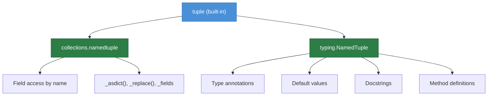
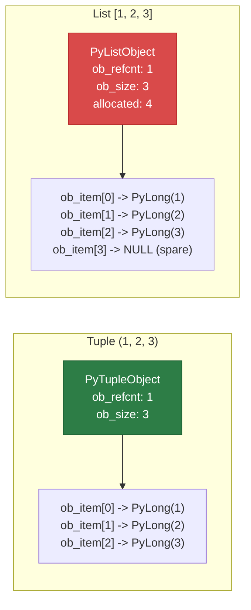
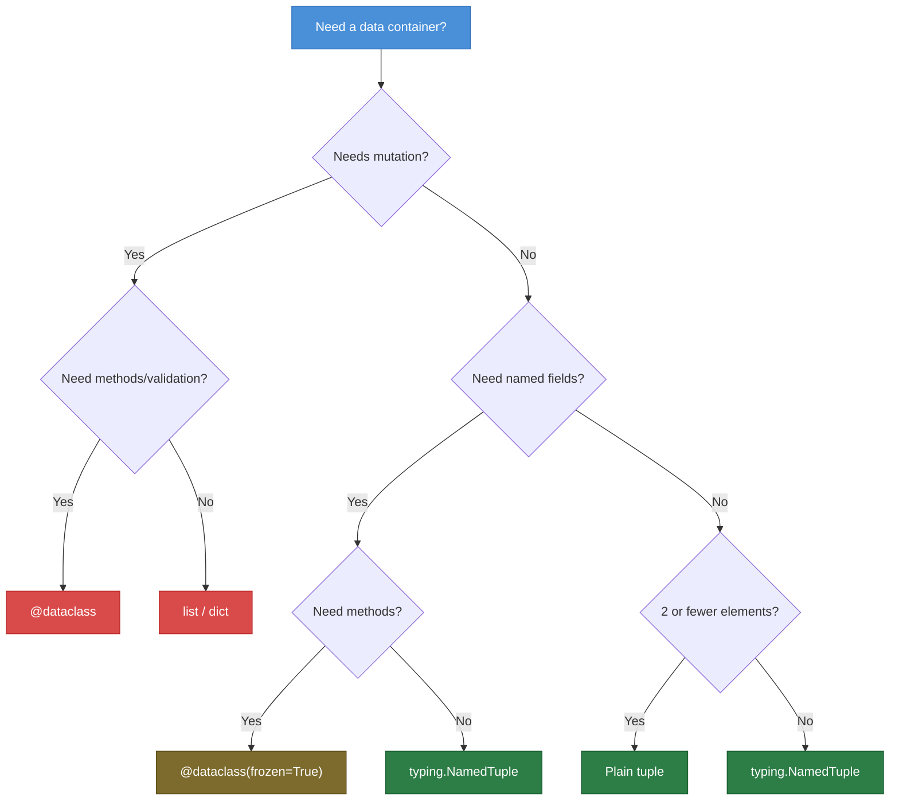

# Python Tuples — Middle Level

## Table of Contents

1. [Introduction](#introduction)
2. [Core Concepts](#core-concepts)
3. [Evolution & Historical Context](#evolution--historical-context)
4. [Pros & Cons](#pros--cons)
5. [Alternative Approaches](#alternative-approaches)
6. [Code Examples](#code-examples)
7. [Coding Patterns](#coding-patterns)
8. [Clean Code](#clean-code)
9. [Product Use / Feature](#product-use--feature)
10. [Error Handling](#error-handling)
11. [Security Considerations](#security-considerations)
12. [Performance Optimization](#performance-optimization)
13. [Comparison with Other Languages](#comparison-with-other-languages)
14. [Debugging Guide](#debugging-guide)
15. [Best Practices](#best-practices)
16. [Edge Cases & Pitfalls](#edge-cases--pitfalls)
17. [Test](#test)
18. [Tricky Questions](#tricky-questions)
19. [Cheat Sheet](#cheat-sheet)
20. [Summary](#summary)
21. [Further Reading](#further-reading)
22. [Diagrams & Visual Aids](#diagrams--visual-aids)

---

## Introduction

> Focus: "Why?" and "When to use?"

Assumes you already know how to create, index, slice, and unpack tuples. This level covers:
- How tuples differ from lists at the CPython level (memory layout, allocation)
- Named tuples (`collections.namedtuple` and `typing.NamedTuple`) for production code
- Tuple packing/unpacking patterns in real-world code
- When tuples are the right (and wrong) data structure
- Performance characteristics compared to lists, dataclasses, and dicts

---

## Core Concepts

### Concept 1: Tuple Memory Layout in CPython

A Python tuple is a **fixed-size array of pointers** to PyObject structs. Unlike lists, tuples do **not** over-allocate — the array is exactly the size needed. This makes tuples more memory-efficient:

```python
import sys

# Compare memory usage
lst = [1, 2, 3, 4, 5]
tup = (1, 2, 3, 4, 5)

print(f"List:  {sys.getsizeof(lst)} bytes")   # ~96-104 bytes
print(f"Tuple: {sys.getsizeof(tup)} bytes")   # ~80 bytes
# Difference: list has extra space for ob_item pointer + over-allocation buffer
```

CPython caches small tuples (length 0-20) in a **free list** — when a small tuple is garbage collected, its memory is reused instead of freed. This makes creating small tuples nearly instant.

### Concept 2: Named Tuples — `collections.namedtuple`

Named tuples add field names to regular tuples, creating self-documenting, lightweight data containers:

```python
from collections import namedtuple

# Define the type
Color = namedtuple("Color", ["name", "hex_code", "rgb"])

# Create instances
red = Color("Red", "#FF0000", (255, 0, 0))
blue = Color(name="Blue", hex_code="#0000FF", rgb=(0, 0, 255))

# Access by name or index
print(red.name)       # Red
print(red[1])         # #FF0000

# Useful built-in methods
print(red._asdict())        # {'name': 'Red', 'hex_code': '#FF0000', 'rgb': (255, 0, 0)}
print(red._fields)          # ('name', 'hex_code', 'rgb')
updated = red._replace(name="Crimson")  # Color(name='Crimson', ...)

# Default values (Python 3.6.1+)
Employee = namedtuple("Employee", ["name", "dept", "salary"], defaults=["Engineering", 50000])
e = Employee("Alice")       # Employee(name='Alice', dept='Engineering', salary=50000)
```

### Concept 3: Typed Named Tuples — `typing.NamedTuple`

The modern, class-based syntax with type annotations:

```python
from typing import NamedTuple

class Point(NamedTuple):
    """A 2D point with optional label."""
    x: float
    y: float
    label: str = "origin"

p1 = Point(3.0, 4.0)
p2 = Point(1.0, 2.0, "A")

print(p1)          # Point(x=3.0, y=4.0, label='origin')
print(p1.x)        # 3.0
print(p1.label)    # origin

# Type checkers (mypy, pyright) understand these annotations
def distance(a: Point, b: Point) -> float:
    return ((a.x - b.x) ** 2 + (a.y - b.y) ** 2) ** 0.5

print(distance(p1, p2))  # 2.8284271247461903
```

### Concept 4: Tuple Packing and Unpacking Patterns

Tuple packing/unpacking is used extensively in idiomatic Python:

```python
# Multiple assignment (tuple packing on the right)
x, y, z = 1, 2, 3

# Swap without temp variable
a, b = 10, 20
a, b = b, a  # Python evaluates RHS tuple first, then unpacks to LHS

# Unpacking in for loops
students = [("Alice", 90), ("Bob", 85), ("Charlie", 92)]
for name, score in students:
    print(f"{name}: {score}")

# Unpacking in function arguments
def greet(name: str, age: int) -> str:
    return f"Hello, {name}! You are {age}."

data = ("Alice", 30)
print(greet(*data))  # Unpack tuple as positional args

# Nested unpacking
matrix_row = (1, (2, 3), 4)
a, (b, c), d = matrix_row
print(a, b, c, d)   # 1 2 3 4
```

### Concept 5: Tuples as Dict Keys and Hashability

A tuple is hashable **only if all its elements are hashable**:

```python
# Hashable — all elements are immutable
hash((1, 2, 3))           # Works
hash(("a", "b", "c"))     # Works
hash((1, (2, 3)))         # Works — nested tuple of immutables

# NOT hashable — contains mutable element
try:
    hash((1, [2, 3]))
except TypeError as e:
    print(e)  # unhashable type: 'list'

# Practical use: composite dictionary keys
grid_cache: dict[tuple[int, int], str] = {}
grid_cache[(0, 0)] = "origin"
grid_cache[(1, 2)] = "point A"

# Multi-dimensional lookup
memo: dict[tuple[int, ...], int] = {}  # variable-length tuple keys
memo[(1, 2, 3)] = 42
```

---

## Evolution & Historical Context

| Version | Feature | Significance |
|---------|---------|-------------|
| Python 1.0 (1994) | Tuples introduced | Part of the original language design |
| Python 2.6 (2008) | `collections.namedtuple` | Named fields for tuples |
| Python 3.0 (2008) | Extended unpacking `*rest` | PEP 3132 — star unpacking |
| Python 3.5 (2015) | Type hints for tuples | PEP 484 — `Tuple[int, str]` |
| Python 3.6 (2016) | `typing.NamedTuple` class syntax | PEP 526 — variable annotations |
| Python 3.6.1 (2017) | `namedtuple` defaults | `defaults` parameter added |
| Python 3.9 (2020) | `tuple[int, str]` lowercase | PEP 585 — no need for `typing.Tuple` |
| Python 3.11 (2022) | `typing.NamedTuple` improvements | Better error messages, `__slots__` |

---

## Pros & Cons

| Pros | Cons |
|------|------|
| Immutable — thread-safe without locks | Cannot modify in place; must create new tuples |
| ~16 bytes smaller per object than lists | No built-in sorting (need `sorted()` returning a list) |
| Hashable (if elements are) — dict keys, set elements | Plain tuples lack field names — `t[0]` is cryptic |
| CPython caches small tuples for reuse | Named tuples add import overhead |
| `typing.NamedTuple` supports type checking | `_replace()` creates new objects (no in-place mutation) |
| Tuple unpacking makes code concise | Single-element syntax `(x,)` trips up beginners |

---

## Alternative Approaches

### Tuple vs. Dataclass vs. Dict

```python
from collections import namedtuple
from typing import NamedTuple
from dataclasses import dataclass

# 1. Plain tuple — lightweight but cryptic
user1 = ("Alice", 30, "alice@example.com")
print(user1[0])  # Needs context to understand what [0] means

# 2. Named tuple — lightweight + readable
User = namedtuple("User", ["name", "age", "email"])
user2 = User("Alice", 30, "alice@example.com")
print(user2.name)  # Self-documenting

# 3. typing.NamedTuple — named tuple + type hints
class TypedUser(NamedTuple):
    name: str
    age: int
    email: str
user3 = TypedUser("Alice", 30, "alice@example.com")

# 4. Dataclass — mutable, more features
@dataclass
class DataUser:
    name: str
    age: int
    email: str
user4 = DataUser("Alice", 30, "alice@example.com")
user4.age = 31  # Mutable!

# 5. Frozen dataclass — immutable like named tuple, but more features
@dataclass(frozen=True)
class FrozenUser:
    name: str
    age: int
    email: str
user5 = FrozenUser("Alice", 30, "alice@example.com")
```

**Decision matrix:**

| Feature | tuple | namedtuple | NamedTuple | dataclass | frozen dataclass |
|---------|:-----:|:----------:|:----------:|:---------:|:----------------:|
| Immutable | Yes | Yes | Yes | No | Yes |
| Named fields | No | Yes | Yes | Yes | Yes |
| Type hints | No | No | Yes | Yes | Yes |
| Hashable | Yes* | Yes* | Yes* | No | Yes |
| Default values | No | Yes | Yes | Yes | Yes |
| Methods | No | No | Yes | Yes | Yes |
| Memory | Lowest | Low | Low | Medium | Medium |

*If all fields are hashable

---

## Code Examples

### Example 1: Configuration Registry with Named Tuples

```python
from typing import NamedTuple


class DatabaseConfig(NamedTuple):
    """Immutable database configuration."""
    host: str
    port: int
    database: str
    user: str
    password: str
    pool_size: int = 5
    timeout: int = 30


class RedisConfig(NamedTuple):
    """Immutable Redis configuration."""
    host: str
    port: int = 6379
    db: int = 0
    password: str = ""


def create_connection_string(config: DatabaseConfig) -> str:
    """Build a PostgreSQL connection string from config."""
    return (
        f"postgresql://{config.user}:{config.password}"
        f"@{config.host}:{config.port}/{config.database}"
        f"?pool_size={config.pool_size}&timeout={config.timeout}"
    )


if __name__ == "__main__":
    db = DatabaseConfig(
        host="localhost",
        port=5432,
        database="myapp",
        user="admin",
        password="secret",
    )
    redis = RedisConfig(host="localhost")

    print(create_connection_string(db))
    print(f"Redis: {redis.host}:{redis.port}/{redis.db}")

    # Immutability prevents accidental changes
    # db.port = 3306  # AttributeError!

    # _replace creates a new config for testing
    test_db = db._replace(database="myapp_test", port=5433)
    print(f"Test DB: {create_connection_string(test_db)}")
```

### Example 2: Memoization with Tuple Keys

```python
from functools import lru_cache
from typing import NamedTuple


class GridPosition(NamedTuple):
    row: int
    col: int


def count_paths_memo(grid: list[list[int]]) -> int:
    """Count paths from top-left to bottom-right in a grid.
    0 = passable, 1 = blocked. Uses tuple keys for memoization.
    """
    rows, cols = len(grid), len(grid[0])
    memo: dict[tuple[int, int], int] = {}

    def dp(r: int, c: int) -> int:
        if r >= rows or c >= cols or grid[r][c] == 1:
            return 0
        if r == rows - 1 and c == cols - 1:
            return 1

        key = (r, c)  # tuple key for memoization
        if key in memo:
            return memo[key]

        memo[key] = dp(r + 1, c) + dp(r, c + 1)
        return memo[key]

    return dp(0, 0)


if __name__ == "__main__":
    grid = [
        [0, 0, 0, 0],
        [0, 1, 0, 0],
        [0, 0, 0, 1],
        [0, 0, 0, 0],
    ]
    print(f"Paths: {count_paths_memo(grid)}")  # 4
```

### Example 3: Tuple Unpacking in Data Processing

```python
from typing import NamedTuple
from collections import Counter


class LogEntry(NamedTuple):
    timestamp: str
    level: str
    message: str
    source: str


def parse_log_line(line: str) -> LogEntry:
    """Parse a log line into a structured LogEntry."""
    parts = line.strip().split(" | ")
    timestamp, level, message, source = parts  # tuple unpacking
    return LogEntry(timestamp, level, message, source)


def analyze_logs(lines: list[str]) -> dict[str, int]:
    """Analyze log entries and return counts by level."""
    entries = [parse_log_line(line) for line in lines]

    # Tuple unpacking in comprehension
    level_counts = Counter(entry.level for entry in entries)

    # Group errors by source using tuple as grouping key
    error_sources: dict[tuple[str, str], int] = {}
    for entry in entries:
        if entry.level == "ERROR":
            key = (entry.level, entry.source)  # composite tuple key
            error_sources[key] = error_sources.get(key, 0) + 1

    print("Error sources:")
    for (level, source), count in error_sources.items():  # nested unpacking
        print(f"  {source}: {count} errors")

    return dict(level_counts)


if __name__ == "__main__":
    log_lines = [
        "2024-01-15 10:00:01 | INFO | Server started | main",
        "2024-01-15 10:00:05 | ERROR | Connection refused | database",
        "2024-01-15 10:00:10 | WARNING | High memory usage | monitor",
        "2024-01-15 10:00:15 | ERROR | Timeout | database",
        "2024-01-15 10:00:20 | ERROR | File not found | storage",
        "2024-01-15 10:00:25 | INFO | Request handled | api",
    ]
    result = analyze_logs(log_lines)
    print(f"\nLevel counts: {result}")
```

---

## Coding Patterns

### Pattern 1: Multiple Return Values

```python
from typing import NamedTuple


class ParseResult(NamedTuple):
    """Structured result from URL parsing."""
    scheme: str
    host: str
    port: int
    path: str


def parse_url(url: str) -> ParseResult:
    """Parse a simple URL into components."""
    # Strip scheme
    if "://" in url:
        scheme, rest = url.split("://", 1)
    else:
        scheme, rest = "http", url

    # Split host and path
    if "/" in rest:
        host_port, path = rest.split("/", 1)
        path = "/" + path
    else:
        host_port, path = rest, "/"

    # Split host and port
    if ":" in host_port:
        host, port_str = host_port.split(":", 1)
        port = int(port_str)
    else:
        host = host_port
        port = 443 if scheme == "https" else 80

    return ParseResult(scheme, host, port, path)


if __name__ == "__main__":
    result = parse_url("https://api.example.com:8443/v2/users")
    print(f"Scheme: {result.scheme}")
    print(f"Host:   {result.host}")
    print(f"Port:   {result.port}")
    print(f"Path:   {result.path}")

    # Can also unpack directly
    scheme, host, port, path = parse_url("http://localhost/health")
    print(f"\n{scheme}://{host}:{port}{path}")
```

### Pattern 2: Tuple as Immutable Record

```python
from typing import NamedTuple
from datetime import datetime


class Transaction(NamedTuple):
    """Immutable financial transaction record."""
    id: str
    amount: float
    currency: str
    timestamp: datetime
    status: str


def process_transactions(
    transactions: list[Transaction],
) -> tuple[float, float, int]:
    """Process transactions and return (total, average, count)."""
    if not transactions:
        return (0.0, 0.0, 0)

    completed = [t for t in transactions if t.status == "completed"]
    total = sum(t.amount for t in completed)
    count = len(completed)
    average = total / count if count else 0.0

    return (total, average, count)  # return tuple of results


if __name__ == "__main__":
    txns = [
        Transaction("T001", 100.0, "USD", datetime.now(), "completed"),
        Transaction("T002", 250.0, "USD", datetime.now(), "completed"),
        Transaction("T003", 75.0, "USD", datetime.now(), "failed"),
        Transaction("T004", 300.0, "USD", datetime.now(), "completed"),
    ]

    total, avg, count = process_transactions(txns)
    print(f"Total: ${total:.2f}, Average: ${avg:.2f}, Count: {count}")
```

### Pattern 3: Enum-like Constants with Tuples

```python
# Tuples as immutable constant containers
HTTP_SUCCESS_CODES = (200, 201, 202, 204)
HTTP_REDIRECT_CODES = (301, 302, 303, 307, 308)
HTTP_CLIENT_ERROR_CODES = (400, 401, 403, 404, 405, 409, 422, 429)

ALLOWED_EXTENSIONS = (".jpg", ".jpeg", ".png", ".gif", ".webp")


def is_success(status_code: int) -> bool:
    return status_code in HTTP_SUCCESS_CODES


def is_valid_image(filename: str) -> bool:
    return filename.lower().endswith(ALLOWED_EXTENSIONS)


if __name__ == "__main__":
    print(is_success(200))              # True
    print(is_success(404))              # False
    print(is_valid_image("photo.PNG"))  # True
    print(is_valid_image("doc.pdf"))    # False
```

---

## Clean Code

### Named Tuples Over Plain Tuples

```python
# Bad — magic indices, impossible to understand
def get_user() -> tuple:
    return ("Alice", 30, "alice@example.com", True)

user = get_user()
if user[3]:  # What is [3]? Active? Verified? Admin?
    send_email(user[2])

# Good — self-documenting with named tuple
from typing import NamedTuple

class User(NamedTuple):
    name: str
    age: int
    email: str
    is_active: bool

user = User("Alice", 30, "alice@example.com", True)
if user.is_active:
    send_email(user.email)
```

### Type Hints for Tuple Returns

```python
# Bad — unclear what the tuple contains
def analyze(data):
    return min(data), max(data), sum(data) / len(data)

# Good — explicit return type
def analyze(data: list[float]) -> tuple[float, float, float]:
    """Return (min, max, average) of the data."""
    return min(data), max(data), sum(data) / len(data)

lo, hi, avg = analyze([1.0, 2.0, 3.0, 4.0, 5.0])
```

---

## Product Use / Feature

### 1. Flask / FastAPI — Response Tuples

- **How:** Flask allows returning `(body, status_code)` or `(body, status_code, headers)` tuples from view functions
- **Why:** Concise way to specify HTTP response components

```python
# Flask-style response tuples
def get_user(user_id):
    user = db.find(user_id)
    if user is None:
        return {"error": "Not found"}, 404  # tuple: (body, status)
    return {"user": user}, 200
```

### 2. NumPy — Array Shape as Tuple

- **How:** `array.shape` returns a tuple of dimensions: `(rows, cols, channels)`
- **Why:** Shape is fixed metadata; using a tuple prevents accidental modification

### 3. Python Standard Library — `os.stat()`, `time.localtime()`

- **How:** Many stdlib functions return named tuples (`os.stat_result`, `time.struct_time`)
- **Why:** Fixed-structure results with named access for readability

---

## Error Handling

### Handling Unpacking Errors Gracefully

```python
def safe_unpack(data: tuple, expected: int) -> tuple:
    """Safely unpack a tuple, padding with None if too short."""
    if len(data) < expected:
        data = data + (None,) * (expected - len(data))
    return data[:expected]


# Usage
record = ("Alice", 30)  # Missing email
name, age, email = safe_unpack(record, 3)
print(f"{name}, {age}, {email}")  # Alice, 30, None
```

### Handling Missing namedtuple Fields

```python
from typing import NamedTuple, Optional


class Config(NamedTuple):
    host: str
    port: int = 8080
    debug: bool = False
    secret: Optional[str] = None


# Partial construction with defaults
dev = Config(host="localhost", debug=True)
prod = Config(host="api.example.com", port=443, secret="prod-secret-key")
print(dev)   # Config(host='localhost', port=8080, debug=True, secret=None)
print(prod)  # Config(host='api.example.com', port=443, ...)
```

---

## Security Considerations

- **Tuples are not encrypted:** Immutability does not mean security. Sensitive data in tuples (passwords, tokens) is still in plaintext memory
- **Named tuple `__repr__` exposes all fields:** Be careful logging named tuples that contain sensitive information

```python
from typing import NamedTuple


class Credentials(NamedTuple):
    username: str
    password: str

    def __repr__(self) -> str:
        """Override repr to hide password."""
        return f"Credentials(username={self.username!r}, password='***')"


cred = Credentials("admin", "super-secret-password")
print(cred)  # Credentials(username='admin', password='***')
```

---

## Performance Optimization

### Tuple vs List Creation Benchmarks

```python
import timeit

# Tuple creation is faster than list creation
tuple_time = timeit.timeit("(1, 2, 3, 4, 5)", number=10_000_000)
list_time = timeit.timeit("[1, 2, 3, 4, 5]", number=10_000_000)

print(f"Tuple creation: {tuple_time:.3f}s")
print(f"List creation:  {list_time:.3f}s")
print(f"Tuple is {list_time / tuple_time:.1f}x faster")
# Typical result: Tuple is 3-5x faster (constant folding optimization)

# Iteration speed comparison
setup = "data_t = tuple(range(1000)); data_l = list(range(1000))"
tuple_iter = timeit.timeit("sum(data_t)", setup=setup, number=100_000)
list_iter = timeit.timeit("sum(data_l)", setup=setup, number=100_000)

print(f"\nTuple iteration: {tuple_iter:.3f}s")
print(f"List iteration:  {list_iter:.3f}s")
# Typically similar — iteration cost dominated by element access
```

### When to Convert Between Tuple and List

```python
# Pattern: Convert to list only when modification is needed
data = (5, 3, 1, 4, 2)

# Bad — unnecessary conversions
temp = list(data)
temp.sort()
sorted_data = tuple(temp)

# Good — use sorted() directly (returns a list, convert once)
sorted_data = tuple(sorted(data))

# Good — if you need multiple modifications, convert once
temp = list(data)
temp.append(6)
temp.remove(3)
temp.sort()
result = tuple(temp)
```

---

## Comparison with Other Languages

| Feature | Python tuple | Java | Go | Rust | TypeScript |
|---------|:----------:|:----:|:--:|:----:|:----------:|
| Built-in tuple type | `(1, 2, 3)` | No (use records/arrays) | No (use structs) | `(i32, String)` | `[number, string]` |
| Immutable by default | Yes | N/A | N/A | Yes | Readonly only |
| Named fields | `namedtuple` | Records (Java 16+) | Structs | Named fields | Interfaces |
| Unpacking | `a, b = t` | No | No | `let (a, b) = t` | `const [a, b] = t` |
| Hashable | Yes (if elements are) | N/A | N/A | Derive Hash | N/A |
| Pattern matching | Python 3.10+ | Java 21+ | No | Yes | No |

---

## Debugging Guide

### Problem: "Why is my tuple unhashable?"

```python
# Diagnosis: check for mutable elements
t = (1, [2, 3], "hello")

# Check which element is unhashable
for i, elem in enumerate(t):
    try:
        hash(elem)
        print(f"  t[{i}] = {elem!r} -> hashable")
    except TypeError:
        print(f"  t[{i}] = {elem!r} -> NOT hashable (mutable type: {type(elem).__name__})")

# Fix: convert mutable elements to immutable equivalents
t_fixed = (1, tuple([2, 3]), "hello")
print(hash(t_fixed))  # Works!
```

### Problem: "Why did `+=` on a tuple-inside-list work but raised an error?"

```python
# The famous tuple += gotcha
t = ([1, 2],)
import dis

# Bytecode reveals the issue:
# 1. BINARY_ADD extends the list (succeeds)
# 2. STORE_SUBSCR tries to assign back to t[0] (fails)
try:
    t[0] += [3]
except TypeError:
    print(f"Error raised, but t = {t}")  # t = ([1, 2, 3],)
    # The list was mutated BEFORE the assignment failed!
```

---

## Best Practices

1. **Use `typing.NamedTuple`** over `collections.namedtuple` for new code — better IDE support and type checking
2. **Prefer named tuples** when a tuple has 3+ fields — `Point(x=10, y=20)` beats `(10, 20)`
3. **Use tuples for function return values** when returning 2-3 related values
4. **Switch to dataclasses** when you need methods, mutability, or complex behavior
5. **Use `tuple[int, ...]`** for variable-length homogeneous tuples in type hints
6. **Use `tuple[int, str, float]`** for fixed-length heterogeneous tuples in type hints
7. **Never use `tuple()` on a tuple** — it returns the same object (no copy needed)
8. **Prefer `frozenset`** over tuples when order does not matter and uniqueness is needed

---

## Edge Cases & Pitfalls

### Pitfall 1: The `+=` Gotcha with Mutable Elements

```python
# This is a well-known CPython behavior
t = ([],)
try:
    t[0] += [1, 2]  # Raises TypeError but ALSO mutates t[0]!
except TypeError:
    pass
print(t)  # ([1, 2],)

# Workaround: mutate directly without +=
t[0].extend([3, 4])  # No error
print(t)  # ([1, 2, 3, 4],)
```

### Pitfall 2: Tuple Comparison is Lexicographic

```python
# Tuples compare element by element, left to right
print((1, 2, 3) < (1, 2, 4))   # True  (first difference: 3 < 4)
print((1, 2, 3) < (1, 3, 0))   # True  (first difference: 2 < 3)
print((1, 2, 3) < (2, 0, 0))   # True  (first difference: 1 < 2)
print((1, 2) < (1, 2, 0))      # True  (shorter tuple is "less")
```

### Pitfall 3: Named Tuple Inheritance

```python
from typing import NamedTuple

class Base(NamedTuple):
    x: int
    y: int

# This does NOT work as expected — cannot extend a NamedTuple
# class Extended(Base):
#     z: int  # This creates a regular class, not a NamedTuple!

# Instead, define a new NamedTuple with all fields
class Extended(NamedTuple):
    x: int
    y: int
    z: int
```

---

## Test

### Question 1
What is the difference between `collections.namedtuple` and `typing.NamedTuple`?

<details>
<summary>Answer</summary>

Both create named tuple classes. Key differences:
- `typing.NamedTuple` uses class syntax with type annotations — better for type checkers and IDE support
- `collections.namedtuple` uses function syntax — `Point = namedtuple("Point", ["x", "y"])`
- `typing.NamedTuple` allows adding docstrings and default values more naturally
- Both produce identical runtime behavior — instances are regular tuples with named access

```python
# collections.namedtuple
from collections import namedtuple
Point1 = namedtuple("Point1", ["x", "y"])

# typing.NamedTuple
from typing import NamedTuple
class Point2(NamedTuple):
    x: float
    y: float
```

</details>

### Question 2
Why is `tuple(some_tuple)` essentially free?

<details>
<summary>Answer</summary>

Because `tuple()` on an existing tuple returns the **same object** (not a copy). Since tuples are immutable, there is no reason to copy them:

```python
t = (1, 2, 3)
t2 = tuple(t)
print(t is t2)  # True — same object in memory
```

This is a CPython optimization: `PyTuple_Type.tp_new` checks if the input is already a tuple and returns it directly.

</details>

### Question 3
Can you have a named tuple with mutable default values?

<details>
<summary>Answer</summary>

Yes, but it is dangerous — the default is shared across all instances (same problem as mutable default arguments in functions):

```python
from typing import NamedTuple

class Config(NamedTuple):
    tags: list[str] = []  # WARNING: shared mutable default!

c1 = Config()
c2 = Config()
c1.tags.append("dev")
print(c2.tags)  # ['dev'] — c1 and c2 share the same list!
```

Use `None` as default and handle it in application logic, or use immutable defaults (tuples, frozensets).

</details>

---

## Tricky Questions

### Q1: What does this print?

```python
a = (1, 2)
b = (1, 2)
print(a is b)
```

<details>
<summary>Answer</summary>

It depends on context! In the REPL or compiled module, CPython may intern small constant tuples, making `a is b` return `True`. But this is an implementation detail — never rely on `is` for tuple comparison. Always use `==`.

```python
# At module level (constant folding): likely True
# In dynamic context: likely False
a = tuple([1, 2])
b = tuple([1, 2])
print(a is b)  # False — dynamically created
print(a == b)  # True — always correct
```

</details>

### Q2: What is the output?

```python
def f():
    return 1, 2, 3

x = f()
print(type(x), x)
```

<details>
<summary>Answer</summary>

`<class 'tuple'> (1, 2, 3)` — `return 1, 2, 3` is tuple packing. The function returns a single tuple, not three separate values.

</details>

---

## Cheat Sheet

```python
# =============== MIDDLE-LEVEL TUPLE CHEAT SHEET ===============

# --- Named Tuples (collections) ---
from collections import namedtuple
Point = namedtuple("Point", ["x", "y"])
p = Point(10, 20)
p._asdict()                    # {'x': 10, 'y': 20}
p._replace(x=99)               # Point(x=99, y=20)
Point._fields                   # ('x', 'y')
Point._make([10, 20])           # Point(x=10, y=20)

# --- Named Tuples (typing) ---
from typing import NamedTuple
class Point(NamedTuple):
    x: float
    y: float
    label: str = "origin"

# --- Type Hints ---
tuple[int, str, float]          # fixed: (1, "a", 3.14)
tuple[int, ...]                 # variable-length: (1, 2, 3, ...)
tuple[()]                       # empty tuple only

# --- Advanced Unpacking ---
first, *mid, last = (1,2,3,4,5)  # first=1, mid=[2,3,4], last=5
(a, (b, c)), d = (1, (2, 3)), 4  # nested unpacking

# --- Hashability Check ---
try:
    hash(my_tuple)
    print("Hashable")
except TypeError:
    print("Not hashable — contains mutable element")

# --- Convert for Modification ---
t = (3, 1, 2)
t = tuple(sorted(t))           # (1, 2, 3)
```

---

## Summary

- Tuples use a **fixed-size pointer array** in CPython — no over-allocation, less memory than lists
- **`typing.NamedTuple`** is the modern way to create named tuples with type hints and defaults
- **Tuple packing/unpacking** is fundamental to idiomatic Python — swaps, multiple returns, loop destructuring
- Tuples are **hashable** (if elements are) — essential for dict keys and set membership
- The **`+=` gotcha** with mutable elements inside tuples is a classic interview question
- **Prefer named tuples** for 3+ field structures; switch to **dataclasses** when mutability or methods are needed
- CPython **caches small tuples** and applies **constant folding** for literal tuples at compile time

---

## Further Reading

- [Python Docs — collections.namedtuple](https://docs.python.org/3/library/collections.html#collections.namedtuple)
- [Python Docs — typing.NamedTuple](https://docs.python.org/3/library/typing.html#typing.NamedTuple)
- [PEP 3132 — Extended Iterable Unpacking](https://peps.python.org/pep-3132/)
- [PEP 484 — Type Hints](https://peps.python.org/pep-0484/)
- [Real Python — Named Tuples](https://realpython.com/python-namedtuple/)
- [CPython Source — tupleobject.c](https://github.com/python/cpython/blob/main/Objects/tupleobject.c)

---

## Diagrams & Visual Aids

### Diagram 1: Named Tuple Hierarchy



### Diagram 2: Tuple vs List Memory Layout



### Diagram 3: When to Use What


