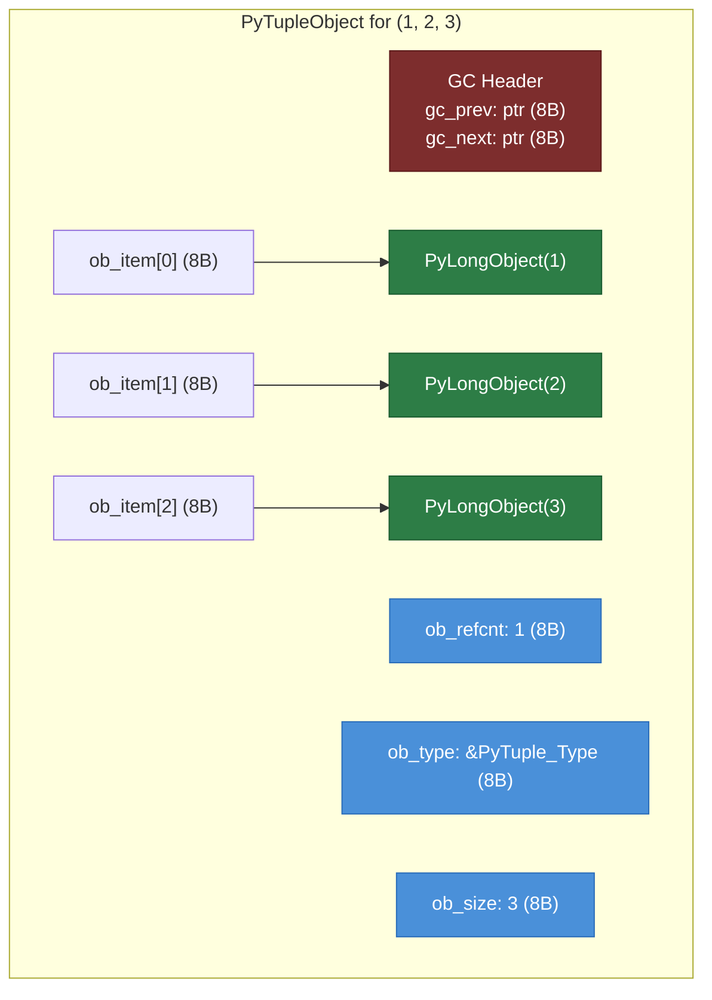
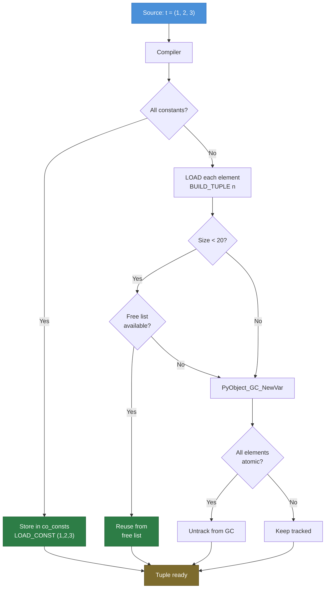
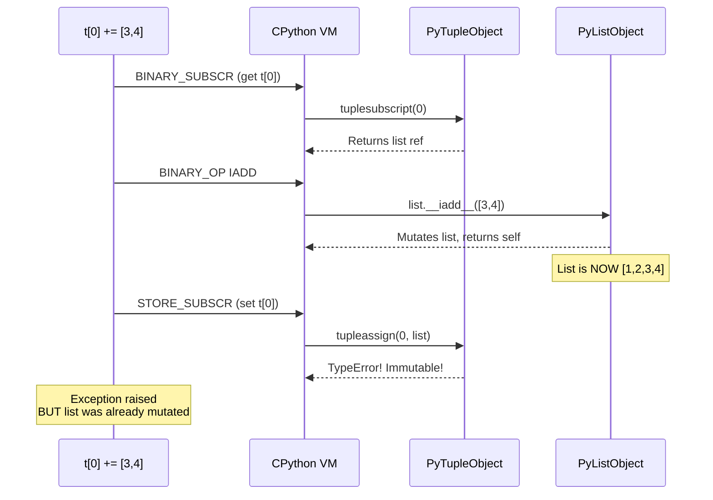

# Python Tuples — Under the Hood

## Table of Contents

1. [Introduction](#introduction)
2. [How It Works Internally](#how-it-works-internally)
3. [CPython Bytecode](#cpython-bytecode)
4. [PyTupleObject Structure](#pytupleobject-structure)
5. [Tuple Free List & Caching](#tuple-free-list--caching)
6. [Memory Management & Reference Counting](#memory-management--reference-counting)
7. [GIL Internals](#gil-internals)
8. [CPython Source Walkthrough](#cpython-source-walkthrough)
9. [Hashing Internals](#hashing-internals)
10. [Performance Internals](#performance-internals)
11. [Edge Cases at the Lowest Level](#edge-cases-at-the-lowest-level)
12. [Test](#test)
13. [Summary](#summary)
14. [Further Reading](#further-reading)
15. [Diagrams & Visual Aids](#diagrams--visual-aids)

---

## Introduction

> Focus: "What happens under the hood?"

This document explores what CPython does internally when you use Python tuples.
For developers who want to understand:
- The C structure `PyTupleObject` and how it manages memory
- What bytecode the Python compiler generates for tuple operations (`dis` module)
- How the GIL affects tuple operations
- How reference counting and cyclic GC handle tuples
- The free list optimization that makes small tuple allocation nearly free
- The hashing algorithm that makes tuples usable as dict keys
- Constant folding and peephole optimizations for tuples

---

## How It Works Internally

Step-by-step breakdown of what happens when CPython creates a tuple:

1. **Source code** -> `my_tuple = (1, 2, 3)`
2. **AST** -> `ast.Assign(targets=[ast.Name('my_tuple')], value=ast.Tuple(elts=[...]))`
3. **Bytecode Compiler** -> Since all elements are constants, the compiler creates the tuple at compile time and stores it in `co_consts`
4. **Bytecode** -> `LOAD_CONST 0 ((1, 2, 3))` — single instruction
5. **CPython VM** -> `ceval.c` pushes the pre-built tuple onto the stack
6. **STORE_NAME** -> Binds the name `my_tuple` to the tuple object

For non-constant tuples (e.g., containing variables):
1. **Bytecode** -> `LOAD_NAME` for each element, then `BUILD_TUPLE n`
2. **CPython VM** -> `ceval.c` dispatches to `_PyTuple_FromArraySteal()` in `tupleobject.c`
3. **C code** -> Checks the free list first, allocates `PyTupleObject` + array of `PyObject*` pointers

```python
import dis
import ast

# Constant tuple — folded at compile time
code1 = compile("t = (1, 2, 3)", "<string>", "exec")
print("=== Constant tuple ===")
dis.dis(code1)
# LOAD_CONST               0 ((1, 2, 3))
# STORE_NAME               0 (t)

# Non-constant tuple — built at runtime
code2 = compile("x = 1; y = 2; t = (x, y)", "<string>", "exec")
print("\n=== Non-constant tuple ===")
dis.dis(code2)
# LOAD_NAME                0 (x)
# LOAD_NAME                1 (y)
# BUILD_TUPLE              2
# STORE_NAME               2 (t)
```

---

## CPython Bytecode

### BUILD_TUPLE Instruction

The `BUILD_TUPLE` opcode pops `n` values from the stack and creates a new tuple:

```python
import dis

def create_dynamic_tuple(a, b, c):
    return (a, b, c)

def create_constant_tuple():
    return (1, 2, 3)

def create_mixed_tuple(x):
    return (1, x, 3)

print("=== Dynamic (all variables) ===")
dis.dis(create_dynamic_tuple)
# LOAD_FAST     0 (a)
# LOAD_FAST     1 (b)
# LOAD_FAST     2 (c)
# BUILD_TUPLE   3
# RETURN_VALUE

print("\n=== Constant (all literals) ===")
dis.dis(create_constant_tuple)
# LOAD_CONST    1 ((1, 2, 3))     <- pre-built!
# RETURN_VALUE

print("\n=== Mixed (literal + variable) ===")
dis.dis(create_mixed_tuple)
# LOAD_CONST    1 (1)
# LOAD_FAST     0 (x)
# LOAD_CONST    2 (3)
# BUILD_TUPLE   3                  <- built at runtime
# RETURN_VALUE
```

### Tuple Unpacking Bytecode

```python
import dis

def unpack_basic():
    t = (1, 2, 3)
    a, b, c = t

def unpack_star():
    t = (1, 2, 3, 4, 5)
    a, *b, c = t

print("=== Basic unpacking ===")
dis.dis(unpack_basic)
# LOAD_CONST      1 ((1, 2, 3))
# STORE_FAST      0 (t)
# LOAD_FAST       0 (t)
# UNPACK_SEQUENCE 3              <- unpacks exactly 3 elements
# STORE_FAST      1 (a)
# STORE_FAST      2 (b)
# STORE_FAST      3 (c)

print("\n=== Star unpacking ===")
dis.dis(unpack_star)
# LOAD_CONST        1 ((1, 2, 3, 4, 5))
# STORE_FAST        0 (t)
# LOAD_FAST         0 (t)
# UNPACK_EX         257          <- 1 before + 1 after (encoded as 256*1 + 1)
# STORE_FAST        1 (a)
# STORE_FAST        2 (b)
# STORE_FAST        3 (c)
```

### Constant Folding for Tuples

```python
import dis

# CPython folds constant expressions involving tuples
def constant_folding_examples():
    # These are ALL folded at compile time:
    a = (1, 2) + (3, 4)        # -> (1, 2, 3, 4)
    b = (0,) * 5               # -> (0, 0, 0, 0, 0)
    c = (True, False, None)    # -> already a constant

dis.dis(constant_folding_examples)
# Only LOAD_CONST instructions — no runtime computation!

# Verify: check co_consts
code = compile("x = (1, 2) + (3, 4)", "<string>", "exec")
print(f"\nco_consts: {code.co_consts}")
# ((1, 2, 3, 4), ...) — already folded
```

---

## PyTupleObject Structure

The C structure for tuples in CPython (`Include/cpython/tupleobject.h`):

```c
// Simplified from CPython source
typedef struct {
    PyObject_VAR_HEAD          // ob_refcnt, ob_type, ob_size
    PyObject *ob_item[1];      // Variable-length array of pointers
} PyTupleObject;

// Memory layout for tuple (1, 2, 3):
// +-------------------+
// | ob_refcnt: 1      |  8 bytes (Py_ssize_t)
// | ob_type: tuple     |  8 bytes (PyTypeObject*)
// | ob_size: 3         |  8 bytes (Py_ssize_t)
// | ob_item[0]: ->1    |  8 bytes (PyObject* to PyLong 1)
// | ob_item[1]: ->2    |  8 bytes (PyObject* to PyLong 2)
// | ob_item[2]: ->3    |  8 bytes (PyObject* to PyLong 3)
// +-------------------+
// Total: 24 + 3*8 = 48 bytes (struct only, not counting pointed-to objects)
```

```python
import sys
import ctypes

# Verify the structure
t = (1, 2, 3)

# sys.getsizeof returns the full size including GC header
size = sys.getsizeof(t)
print(f"sys.getsizeof((1,2,3)) = {size} bytes")

# Calculate: base overhead + 8 bytes per element
base_size = sys.getsizeof(())  # empty tuple overhead
per_element = 8  # pointer size on 64-bit
calculated = base_size + 3 * per_element
print(f"Calculated: {base_size} + 3*{per_element} = {calculated} bytes")

# Show sizes for different tuple lengths
for n in range(11):
    t = tuple(range(n))
    print(f"  tuple(range({n:2d})): {sys.getsizeof(t):4d} bytes "
          f"(overhead={sys.getsizeof(t) - n*8} bytes)")
```

---

## Tuple Free List & Caching

CPython maintains a **free list** for small tuples to avoid repeated `malloc`/`free` calls:

```python
# CPython source (simplified from tupleobject.c):
#
# #define PyTuple_MAXSAVESIZE 20      // cache tuples up to length 20
# #define PyTuple_MAXFREELIST 2000    // max free list size per length
#
# static PyTupleObject *free_list[PyTuple_MAXSAVESIZE];
# static int numfree[PyTuple_MAXSAVESIZE];

# The empty tuple is a SINGLETON — always the same object
a = ()
b = ()
c = tuple()
print(f"() is (): {a is b}")           # True
print(f"() is tuple(): {a is c}")       # True
print(f"id(()): {id(a)}")

# Small integer tuples may be cached as constants
x = (1,)
y = (1,)
print(f"(1,) is (1,): {x is y}")       # May be True (constant interning)

# But dynamically created tuples use the free list
def show_free_list_reuse():
    """Demonstrate memory reuse from the free list."""
    ids = []
    for i in range(5):
        t = (i, i+1)   # Create a 2-element tuple
        ids.append(id(t))
        del t           # Return to free list

    new_ids = []
    for i in range(5):
        t = (i*10, i*10+1)  # Create another 2-element tuple
        new_ids.append(id(t))
        del t

    reused = set(ids) & set(new_ids)
    print(f"Addresses reused from free list: {len(reused)}/{len(ids)}")

show_free_list_reuse()
```

### How the Free List Works

```python
# When a tuple of size N (0 <= N < 20) is deallocated:
# 1. If numfree[N] < 2000: tuple is added to free_list[N]
# 2. Otherwise: memory is freed with PyObject_GC_Del
#
# When a new tuple of size N is requested:
# 1. If free_list[N] is not empty: reuse it (just update ob_item pointers)
# 2. Otherwise: allocate new memory with PyObject_GC_NewVar
#
# This avoids malloc/free overhead for common tuple sizes.

import gc

# Force garbage collection to populate free lists
gc.collect()

# Benchmark: free list hit vs miss
import timeit

# Small tuples (likely free list hit)
small_time = timeit.timeit("(1, 2, 3)", number=10_000_000)

# Large tuples (no free list, size >= 20)
large_time = timeit.timeit(
    "tuple(range(25))",
    number=1_000_000,
)

print(f"Small tuple (3 elem, 10M): {small_time:.3f}s")
print(f"Large tuple (25 elem, 1M): {large_time:.3f}s")
# Small tuples benefit from both constant folding and free list
```

---

## Memory Management & Reference Counting

### Reference Counting for Tuples

```python
import sys
import ctypes


def get_refcount(obj):
    """Get the actual refcount (sys.getrefcount adds 1 for the argument)."""
    return sys.getrefcount(obj) - 1


# Creating a tuple increments refcounts of its elements
a = 42
print(f"Refcount of 42 before tuple: {get_refcount(a)}")

t = (a, a, a)  # Three references to the same object
print(f"Refcount of 42 after tuple:  {get_refcount(a)}")

del t
print(f"Refcount of 42 after del:    {get_refcount(a)}")
```

### Cyclic GC and Tuples

```python
import gc

# Tuples CAN participate in reference cycles (if they contain mutable objects)
# CPython's cyclic GC handles this

# Example: indirect cycle via tuple -> list -> tuple
def create_cycle():
    lst = []
    t = (lst,)     # tuple references the list
    lst.append(t)  # list references the tuple -> CYCLE
    return t

gc.set_debug(gc.DEBUG_STATS)
gc.collect()

t = create_cycle()
del t

# GC will detect and clean up the cycle
collected = gc.collect()
print(f"Objects collected by GC: {collected}")

gc.set_debug(0)


# IMPORTANT: Tuples containing ONLY immutable objects are NOT tracked by GC
# CPython has an optimization: if all elements are atomic (int, str, float, bool, None),
# the tuple is untracked from GC to reduce overhead.

import gc

t_immutable = (1, 2, "hello", True)
t_mutable = (1, [2, 3])

print(f"Immutable tuple tracked by GC: {gc.is_tracked(t_immutable)}")  # False!
print(f"Mutable-element tuple tracked: {gc.is_tracked(t_mutable)}")     # True
```

---

## GIL Internals

### How the GIL Affects Tuple Operations

```python
# Tuple operations and the GIL:
#
# 1. CREATING a tuple: GIL is held throughout PyTuple_New + element assignment
#    -> Thread-safe: no other thread can see a partially-constructed tuple
#
# 2. READING a tuple element (t[i]): Single bytecode instruction (BINARY_SUBSCR)
#    -> Thread-safe: atomic under GIL
#
# 3. UNPACKING (a, b = t): UNPACK_SEQUENCE is a single bytecode operation
#    -> Thread-safe: GIL protects the entire unpack
#
# 4. SHARING a tuple reference: Assignment is a single STORE instruction
#    -> Thread-safe: reference swap is atomic under GIL

import threading
import dis

# Verify that tuple access is a single bytecode instruction
def access_tuple(t):
    return t[0]

print("Tuple access bytecode:")
dis.dis(access_tuple)
# LOAD_FAST    0 (t)
# LOAD_CONST   1 (0)
# BINARY_SUBSCR           <- single instruction, protected by GIL

# IMPORTANT: While individual tuple operations are atomic,
# COMPOUND operations (check-then-act) are NOT:

shared = (1, 2, 3)

def unsafe_pattern():
    global shared
    # NOT atomic: check and replace are separate bytecodes
    if len(shared) == 3:        # GIL may release here
        shared = shared + (4,)  # Another thread may have changed shared

# For compound operations, use a lock:
lock = threading.Lock()
def safe_pattern():
    global shared
    with lock:
        if len(shared) == 3:
            shared = shared + (4,)
```

---

## CPython Source Walkthrough

### PyTuple_New (tupleobject.c)

```c
// Simplified from CPython 3.12+ source
// https://github.com/python/cpython/blob/main/Objects/tupleobject.c

PyObject *
PyTuple_New(Py_ssize_t size)
{
    PyTupleObject *op;

    // Empty tuple is a singleton
    if (size == 0) {
        return Py_NewRef(&_Py_SINGLETON(tuple_empty));
    }

    // Try the free list first (for sizes 1-19)
    #if PyTuple_MAXSAVESIZE > 0
    if (size < PyTuple_MAXSAVESIZE) {
        op = free_list[size];
        if (op != NULL) {
            // Reuse from free list
            free_list[size] = (PyTupleObject *) op->ob_item[0];
            numfree[size]--;
            // Initialize the reused tuple
            Py_SET_SIZE(op, size);
            Py_SET_TYPE(op, &PyTuple_Type);
            _Py_NewReference((PyObject *)op);
            return (PyObject *)op;
        }
    }
    #endif

    // Allocate new memory
    op = PyObject_GC_NewVar(PyTupleObject, &PyTuple_Type, size);
    if (op == NULL)
        return NULL;

    // Initialize all items to NULL
    memset(op->ob_item, 0, size * sizeof(PyObject *));

    // Track by GC (may be untracked later if all elements are atomic)
    _PyObject_GC_TRACK(op);
    return (PyObject *)op;
}
```

### tuple_dealloc (tupleobject.c)

```c
// Simplified deallocation
static void
tuple_dealloc(PyTupleObject *op)
{
    Py_ssize_t len = Py_SIZE(op);

    // Untrack from GC
    PyObject_GC_UnTrack(op);

    // Decref all elements
    Py_TRASHCAN_BEGIN(op, tuple_dealloc)
    for (Py_ssize_t i = 0; i < len; i++) {
        Py_XDECREF(op->ob_item[i]);
    }

    // Try to add to free list
    #if PyTuple_MAXSAVESIZE > 0
    if (len < PyTuple_MAXSAVESIZE && numfree[len] < PyTuple_MAXFREELIST) {
        // Save to free list for reuse
        op->ob_item[0] = (PyObject *) free_list[len];
        free_list[len] = op;
        numfree[len]++;
        goto done;
    }
    #endif

    // Free memory
    Py_TYPE(op)->tp_free((PyObject *)op);

done:
    Py_TRASHCAN_END
}
```

---

## Hashing Internals

### How CPython Hashes Tuples

```python
# Since CPython 3.8+, tuple hashing uses a variant of xxHash/SipHash
# The algorithm combines hashes of individual elements

# Simplified view of the C implementation:
# static Py_uhash_t
# tuplehash(PyTupleObject *v)
# {
#     Py_uhash_t acc = _PyHASH_XXPRIME_5;
#     for each element:
#         lane = hash(element)
#         acc += lane * _PyHASH_XXPRIME_2
#         acc = _PyHASH_XXROTATE(acc)
#         acc *= _PyHASH_XXPRIME_1
#     acc += len ^ (_PyHASH_XXPRIME_5 ^ 3527539)
#     return acc
# }

# Demonstrate hash properties:
print(f"hash((1, 2, 3)):    {hash((1, 2, 3))}")
print(f"hash((1, 3, 2)):    {hash((1, 3, 2))}")   # Different! Order matters
print(f"hash((3, 2, 1)):    {hash((3, 2, 1))}")   # Different!
print(f"hash((1, 2, 3)) == hash((1, 2, 3)): {hash((1, 2, 3)) == hash((1, 2, 3))}")

# Hash caching: unlike strings, tuples do NOT cache their hash
# Each call to hash() recomputes it
import timeit

t = tuple(range(100))
s = "a" * 100

tuple_hash = timeit.timeit(lambda: hash(t), number=1_000_000)
string_hash = timeit.timeit(lambda: hash(s), number=1_000_000)
print(f"\nhash() benchmark (1M calls):")
print(f"  Tuple (100 elem): {tuple_hash:.3f}s")
print(f"  String (100 char): {string_hash:.3f}s")
# Strings are faster because they cache the hash value


# Empty tuple hash
print(f"\nhash(()): {hash(())}")  # Fixed value based on algorithm constants
```

### Hashability Rules

```python
# A tuple is hashable if and only if ALL its elements are hashable.
# CPython checks this at hash time, not at creation time.

def check_hashable(obj, name: str) -> None:
    try:
        h = hash(obj)
        print(f"  {name}: hashable (hash={h})")
    except TypeError as e:
        print(f"  {name}: NOT hashable ({e})")

check_hashable((1, 2, 3), "(1, 2, 3)")              # hashable
check_hashable((1, (2, 3)), "(1, (2, 3))")           # hashable (nested tuple)
check_hashable((1, frozenset({2})), "(1, frozenset)") # hashable
check_hashable((1, [2, 3]), "(1, [2, 3])")           # NOT hashable
check_hashable((1, {2: 3}), "(1, {2: 3})")           # NOT hashable
check_hashable((1, {2, 3}), "(1, {2, 3})")           # NOT hashable
```

---

## Performance Internals

### Tuple vs List at the Bytecode Level

```python
import dis

# Tuple indexing vs list indexing — same bytecode, different C paths
def tuple_access():
    t = (1, 2, 3)
    return t[1]

def list_access():
    l = [1, 2, 3]
    return l[1]

print("=== Tuple access ===")
dis.dis(tuple_access)

print("\n=== List access ===")
dis.dis(list_access)

# Both use BINARY_SUBSCR, but the C implementation differs:
# - tuple: tuplesubscript() in tupleobject.c — direct pointer lookup
# - list:  list_subscript() in listobject.c — bounds check + pointer lookup
# Tuple is slightly faster because the size is fixed (no growth checks needed)
```

### Tuple Concatenation Internals

```python
import dis

# + operator on tuples
def concat_tuples():
    a = (1, 2)
    b = (3, 4)
    return a + b

dis.dis(concat_tuples)

# The C function tupleconcat() in tupleobject.c:
# 1. Allocates a new tuple of size len(a) + len(b)
# 2. Copies all pointers from a, then from b
# 3. Increfs each element
# Result: O(n+m) time and space

# This is why tuple concatenation in loops is O(n^2):
import timeit

def build_concat(n):
    result = ()
    for i in range(n):
        result = result + (i,)  # O(n) each iteration -> O(n^2) total
    return result

def build_from_list(n):
    items = list(range(n))
    return tuple(items)  # O(n) total

for n in [1000, 5000, 10000]:
    t1 = timeit.timeit(lambda: build_concat(n), number=1)
    t2 = timeit.timeit(lambda: build_from_list(n), number=1)
    print(f"  n={n:5d}: concat={t1:.4f}s, from_list={t2:.6f}s, ratio={t1/t2:.0f}x")
```

### `in` Operator — Linear Scan

```python
import dis

def membership_test():
    t = (1, 2, 3, 4, 5)
    return 3 in t

dis.dis(membership_test)

# CONTAINS_OP uses tuplecontains() in tupleobject.c:
# - Iterates through all elements calling PyObject_RichCompareBool
# - Returns as soon as a match is found (short-circuits)
# - Worst case: O(n) for element not in tuple

import timeit

# Membership test: tuple vs set vs frozenset
data_tuple = tuple(range(10000))
data_set = set(range(10000))
data_frozenset = frozenset(range(10000))

for target in [0, 5000, 9999, -1]:
    tt = timeit.timeit(lambda: target in data_tuple, number=10000)
    ts = timeit.timeit(lambda: target in data_set, number=10000)
    tf = timeit.timeit(lambda: target in data_frozenset, number=10000)
    print(f"  target={target:5d}: tuple={tt:.4f}s, set={ts:.4f}s, frozenset={tf:.4f}s")
```

---

## Edge Cases at the Lowest Level

### Edge Case 1: The += Gotcha Internals

```python
import dis

# The famous tuple += gotcha explained at bytecode level
def tuple_iadd_gotcha():
    t = ([1, 2],)
    t[0] += [3, 4]

# Let's look at the bytecode:
dis.dis(tuple_iadd_gotcha)

# Key bytecodes for t[0] += [3, 4]:
# 1. LOAD_FAST       t           <- load the tuple
# 2. LOAD_CONST      0           <- load index 0
# 3. BINARY_SUBSCR                <- get t[0] (the list) -> succeeds
# 4. LOAD_CONST      [3, 4]      <- load the RHS list
# 5. BINARY_OP       IADD (+=)   <- calls list.__iadd__([3, 4]) -> MUTATES the list, succeeds
# 6. STORE_SUBSCR                 <- tries t[0] = result -> FAILS with TypeError!
#
# Step 5 mutates the list BEFORE step 6 fails.
# This is why the list is modified even though an exception is raised.

# Demonstrate:
t = ([1, 2],)
try:
    t[0] += [3, 4]
except TypeError:
    pass
print(f"After failed +=: {t}")  # ([1, 2, 3, 4],) — list was mutated!
```

### Edge Case 2: Tuple of Tuples and GC Tracking

```python
import gc

# CPython optimization: tuples containing only immutable elements
# are UNTRACKED from the cyclic garbage collector

# This reduces GC overhead significantly for data-heavy applications

t1 = (1, 2, 3)              # All ints -> untracked
t2 = ("a", "b", "c")        # All strings -> untracked
t3 = ((1, 2), (3, 4))       # Nested immutable tuples
t4 = (1, [2, 3])            # Contains a list -> TRACKED
t5 = (1, 2, None, True)     # All atomic -> untracked

for name, obj in [("ints", t1), ("strings", t2), ("nested", t3),
                   ("with_list", t4), ("mixed_atomic", t5)]:
    print(f"  {name:15s}: gc.is_tracked = {gc.is_tracked(obj)}")

# The untracking happens in _PyTuple_MaybeUntrack()
# Called after all elements are set during tuple creation
```

### Edge Case 3: `sys.intern` Does Not Work on Tuples

```python
import sys

# Strings can be interned, but tuples cannot
s1 = sys.intern("hello")
s2 = sys.intern("hello")
print(f"Interned strings: {s1 is s2}")  # True

# No tuple interning API exists
# But CPython does intern some constant tuples via constant folding:
def f():
    return (1, 2, 3)

def g():
    return (1, 2, 3)

# Same module: constant folding may share the tuple
print(f"Same constant tuple: {f() is g()}")  # Likely True (shared co_consts)

# Different modules or dynamic creation: no sharing
t1 = tuple([1, 2, 3])
t2 = tuple([1, 2, 3])
print(f"Dynamic tuples: {t1 is t2}")  # False — different objects
print(f"Equal: {t1 == t2}")           # True — same content
```

---

## Test

### Question 1
Why does `sys.getsizeof(())` return 40 on a 64-bit system, not 24?

<details>
<summary>Answer</summary>

The 40 bytes include:
- `ob_refcnt`: 8 bytes (Py_ssize_t)
- `ob_type`: 8 bytes (pointer to PyTuple_Type)
- `ob_size`: 8 bytes (Py_ssize_t, number of elements)
- GC header: 16 bytes (two pointers for the GC doubly-linked list)

Total: 8 + 8 + 8 + 16 = 40 bytes for the empty tuple.

Note: The empty tuple is actually untracked from GC, but the GC header space is still allocated because `PyObject_GC_NewVar` is used.

Actually, in recent CPython, the empty tuple singleton may have a different allocation path, but the principle holds: the overhead comes from the PyObject header fields plus GC tracking infrastructure.

</details>

### Question 2
Why is `gc.is_tracked((1, 2, 3))` `False` but `gc.is_tracked((1, []))` `True`?

<details>
<summary>Answer</summary>

CPython has an optimization called `_PyTuple_MaybeUntrack()` that removes tuples from the cyclic GC's tracking list if all their elements are "atomic" (non-container) types — int, float, str, bytes, bool, None, etc.

Tuples that contain only atomic types **cannot** participate in reference cycles, so tracking them is wasteful overhead. By untracking them, CPython reduces the number of objects the GC must scan during collection.

`(1, [])` contains a list (a container type), so it **could** participate in a cycle (e.g., if the list stores a reference back to the tuple). Therefore it remains tracked.

</details>

### Question 3
What happens internally when you do `tuple(some_tuple)`?

<details>
<summary>Answer</summary>

When `tuple()` receives a tuple as argument, CPython's `tuple_new()` in `tupleobject.c` detects that the argument is already a tuple and returns it directly (with an incremented reference count):

```c
// Simplified
if (PyTuple_CheckExact(arg)) {
    Py_INCREF(arg);
    return arg;  // No copy!
}
```

This means `tuple(t)` for a tuple `t` is O(1) and returns the **same object**:

```python
t = (1, 2, 3)
t2 = tuple(t)
print(t is t2)  # True
```

This optimization is safe because tuples are immutable.

</details>

---

## Summary

- **PyTupleObject** is a variable-length C struct: header (24 bytes) + GC header (16 bytes) + N pointers (8 bytes each)
- **Constant folding:** CPython pre-builds literal tuples at compile time as `co_consts` entries — zero runtime cost
- **Free list:** CPython caches deallocated tuples of size 0-19 (up to 2000 per size) for instant reuse
- **Empty tuple singleton:** `()` is always the same object — `id(()) == id(tuple())`
- **GC untracking:** Tuples containing only atomic types are removed from GC tracking, reducing collection overhead
- **Hashing:** Uses xxHash-based algorithm combining element hashes; NOT cached (recomputed each call, unlike strings)
- **`tuple(tuple)` optimization:** Returns the same object (no copy) because tuples are immutable
- **GIL protection:** Individual tuple operations (create, access, unpack) are atomic under GIL; compound operations need locks
- **The += gotcha:** `BINARY_OP IADD` mutates a mutable element before `STORE_SUBSCR` fails on the tuple

---

## Further Reading

- [CPython Source — tupleobject.c](https://github.com/python/cpython/blob/main/Objects/tupleobject.c)
- [CPython Source — tupleobject.h](https://github.com/python/cpython/blob/main/Include/cpython/tupleobject.h)
- [CPython Source — ceval.c (BUILD_TUPLE)](https://github.com/python/cpython/blob/main/Python/ceval.c)
- [PEP 3132 — Extended Iterable Unpacking](https://peps.python.org/pep-3132/)
- [Python Dev Guide — Garbage Collector Design](https://devguide.python.org/internals/garbage-collector/)
- [Python Docs — dis module](https://docs.python.org/3/library/dis.html)

---

## Diagrams & Visual Aids

### Diagram 1: PyTupleObject Memory Layout



### Diagram 2: Tuple Creation Pipeline



### Diagram 3: The += Gotcha Step by Step


