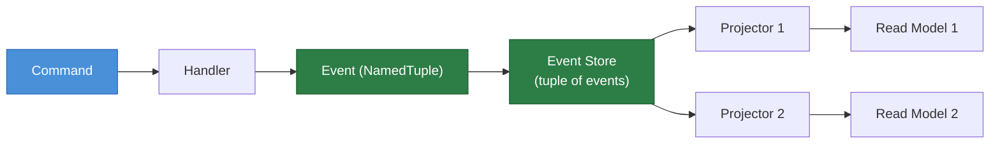
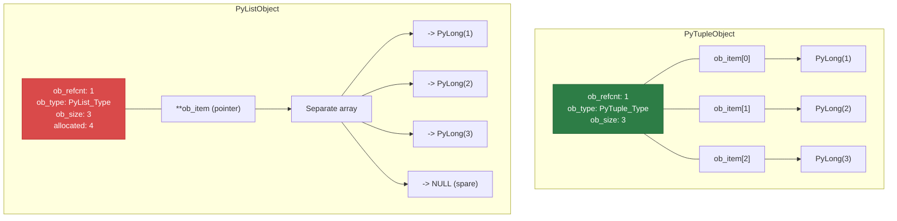
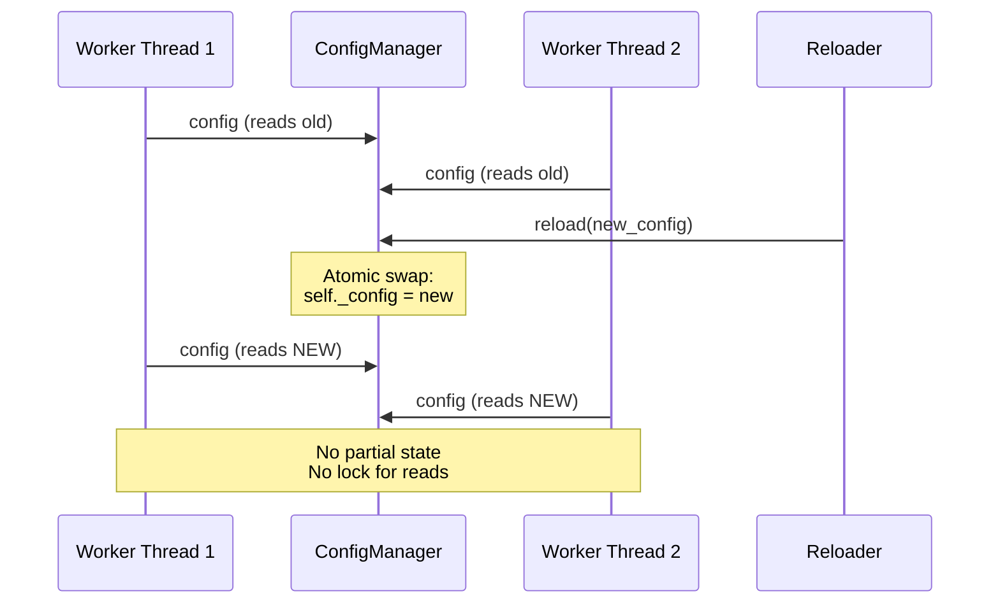

# Python Tuples — Senior Level

## Table of Contents

1. [Introduction](#introduction)
2. [Architecture Patterns](#architecture-patterns)
3. [Advanced Internals](#advanced-internals)
4. [Benchmarks](#benchmarks)
5. [Production Patterns](#production-patterns)
6. [Thread Safety & Concurrency](#thread-safety--concurrency)
7. [Memory Profiling](#memory-profiling)
8. [Best Practices](#best-practices)
9. [Edge Cases at Scale](#edge-cases-at-scale)
10. [Test](#test)
11. [Summary](#summary)
12. [Further Reading](#further-reading)
13. [Diagrams & Visual Aids](#diagrams--visual-aids)

---

## Introduction

> Focus: "How to optimize?" and "How to architect?"

This document is for developers who already understand tuple operations, named tuples, and their time complexity. Here we focus on:
- Architectural decisions involving tuples in high-performance systems
- Benchmarking tuple operations vs alternatives (dataclasses, dicts, slots)
- Thread safety and immutability guarantees
- Memory-efficient patterns for production systems
- Advanced patterns with structural pattern matching and protocols

---

## Architecture Patterns

### Pattern 1: Immutable Event Sourcing

In event-sourced architectures, events should be immutable. Tuples and named tuples are natural fits:

```python
from typing import NamedTuple, Any
from datetime import datetime
from collections import defaultdict
import hashlib
import json


class Event(NamedTuple):
    """Immutable domain event."""
    event_id: str
    event_type: str
    aggregate_id: str
    payload: tuple[tuple[str, Any], ...]  # immutable key-value pairs
    timestamp: datetime
    version: int

    @property
    def checksum(self) -> str:
        """Compute integrity hash for the event."""
        data = f"{self.event_id}:{self.event_type}:{self.aggregate_id}:{self.version}"
        return hashlib.sha256(data.encode()).hexdigest()[:16]


class EventStore:
    """Append-only event store using tuples for immutability."""

    def __init__(self) -> None:
        self._events: tuple[Event, ...] = ()
        self._index: dict[str, tuple[int, ...]] = defaultdict(tuple)

    def append(self, event: Event) -> "EventStore":
        """Return a new EventStore with the event appended."""
        new_events = self._events + (event,)
        new_store = EventStore()
        new_store._events = new_events
        # Update index: aggregate_id -> event positions
        new_store._index = dict(self._index)
        existing = new_store._index.get(event.aggregate_id, ())
        new_store._index[event.aggregate_id] = existing + (len(new_events) - 1,)
        return new_store

    def get_events(self, aggregate_id: str) -> tuple[Event, ...]:
        """Get all events for an aggregate."""
        indices = self._index.get(aggregate_id, ())
        return tuple(self._events[i] for i in indices)

    @property
    def count(self) -> int:
        return len(self._events)


if __name__ == "__main__":
    store = EventStore()

    e1 = Event(
        event_id="evt-001",
        event_type="UserCreated",
        aggregate_id="user-123",
        payload=(("name", "Alice"), ("email", "alice@example.com")),
        timestamp=datetime.now(),
        version=1,
    )
    store = store.append(e1)

    e2 = Event(
        event_id="evt-002",
        event_type="UserUpdated",
        aggregate_id="user-123",
        payload=(("email", "alice@newdomain.com"),),
        timestamp=datetime.now(),
        version=2,
    )
    store = store.append(e2)

    events = store.get_events("user-123")
    for e in events:
        print(f"[{e.event_type}] v{e.version} checksum={e.checksum}")
```

### Pattern 2: Flyweight Pattern with Tuple Interning

Use tuples as flyweight keys to share immutable state across many objects:

```python
from typing import NamedTuple
import sys


class Style(NamedTuple):
    """Immutable text style — shared via flyweight."""
    font: str
    size: int
    bold: bool
    italic: bool
    color: tuple[int, int, int]


class StyleRegistry:
    """Flyweight registry — deduplicates identical styles."""

    def __init__(self) -> None:
        self._cache: dict[Style, Style] = {}

    def get(self, font: str, size: int, bold: bool = False,
            italic: bool = False, color: tuple[int, int, int] = (0, 0, 0)) -> Style:
        """Return a cached style instance."""
        style = Style(font, size, bold, italic, color)
        if style not in self._cache:
            self._cache[style] = style
        return self._cache[style]

    @property
    def unique_count(self) -> int:
        return len(self._cache)


if __name__ == "__main__":
    registry = StyleRegistry()

    # These return the same object
    s1 = registry.get("Arial", 12, bold=True)
    s2 = registry.get("Arial", 12, bold=True)
    print(f"Same object: {s1 is s2}")    # True
    print(f"Unique styles: {registry.unique_count}")  # 1

    s3 = registry.get("Arial", 14, bold=False)
    print(f"Unique styles: {registry.unique_count}")  # 2
```

### Pattern 3: Structural Pattern Matching with Tuples (Python 3.10+)

```python
from typing import NamedTuple


class Command(NamedTuple):
    action: str
    args: tuple[str, ...]


def handle_command(cmd: Command) -> str:
    """Handle commands using structural pattern matching."""
    match cmd:
        case Command(action="create", args=(name,)):
            return f"Creating resource: {name}"
        case Command(action="delete", args=(name, "--force")):
            return f"Force deleting: {name}"
        case Command(action="delete", args=(name,)):
            return f"Deleting: {name} (use --force to skip confirmation)"
        case Command(action="list", args=()):
            return "Listing all resources"
        case Command(action="list", args=(pattern,)):
            return f"Listing resources matching: {pattern}"
        case Command(action=action, args=args):
            return f"Unknown command: {action} with args {args}"


if __name__ == "__main__":
    commands = [
        Command("create", ("my-service",)),
        Command("delete", ("old-data", "--force")),
        Command("delete", ("temp-file",)),
        Command("list", ()),
        Command("list", ("*.log",)),
        Command("migrate", ("v2",)),
    ]
    for cmd in commands:
        print(f"  {cmd.action} {cmd.args} -> {handle_command(cmd)}")
```

---

## Advanced Internals

### Tuple Constant Folding

CPython's peephole optimizer folds constant tuple expressions at compile time:

```python
import dis


def with_tuple():
    return (1, 2, 3)


def with_list():
    return [1, 2, 3]


print("=== Tuple (constant folded) ===")
dis.dis(with_tuple)
# LOAD_CONST (1, 2, 3)     <- single instruction! Tuple is pre-built
# RETURN_VALUE

print("\n=== List (built at runtime) ===")
dis.dis(with_list)
# LOAD_CONST 1
# LOAD_CONST 2
# LOAD_CONST 3
# BUILD_LIST 3              <- built every time
# RETURN_VALUE
```

### Tuple Free List (CPython Optimization)

```python
import sys


def demonstrate_free_list():
    """Show that CPython reuses memory for small tuples."""
    # Create and destroy many small tuples
    ids_first_run = []
    for i in range(5):
        t = (i,)
        ids_first_run.append(id(t))

    # These IDs may be reused due to the free list
    ids_second_run = []
    for i in range(5):
        t = (i,)
        ids_second_run.append(id(t))

    # Check for memory reuse
    reused = set(ids_first_run) & set(ids_second_run)
    print(f"Memory addresses reused: {len(reused)}/{len(ids_first_run)}")


def empty_tuple_singleton():
    """The empty tuple is a singleton in CPython."""
    a = ()
    b = ()
    c = tuple()
    print(f"() is (): {a is b}")         # True — always the same object
    print(f"() is tuple(): {a is c}")     # True
    print(f"id: {id(a)}")


if __name__ == "__main__":
    demonstrate_free_list()
    empty_tuple_singleton()
```

### Tuple Hashing Algorithm

```python
def manual_tuple_hash(t: tuple) -> int:
    """
    Approximate CPython's tuple hash algorithm.
    CPython uses xxHash (since 3.11) or a custom FNV-like hash.
    """
    # Simplified version — actual CPython uses xxHash
    mult = 1000003
    h = 0x345678
    length = len(t)
    for item in t:
        y = hash(item)
        h = (h ^ y) * mult
        mult += 82520 + length + length
        length -= 1
    h += 97531
    if h == -1:
        h = -2  # -1 is reserved for errors in CPython
    return h


if __name__ == "__main__":
    t = (1, 2, 3)
    print(f"CPython hash:  {hash(t)}")
    print(f"Manual hash:   {manual_tuple_hash(t)}")
    # Note: won't match exactly due to xxHash vs simplified algorithm
```

---

## Benchmarks

### Tuple vs List vs Dict vs Dataclass — Creation and Access

```python
import timeit
from collections import namedtuple
from typing import NamedTuple
from dataclasses import dataclass


# Define types
NT = namedtuple("NT", ["x", "y", "z"])

class TypedNT(NamedTuple):
    x: int
    y: int
    z: int

@dataclass
class DC:
    x: int
    y: int
    z: int

@dataclass(frozen=True)
class FDC:
    x: int
    y: int
    z: int

@dataclass(slots=True, frozen=True)
class SlotFDC:
    x: int
    y: int
    z: int


N = 1_000_000

benchmarks = {
    "tuple":          lambda: (1, 2, 3),
    "namedtuple":     lambda: NT(1, 2, 3),
    "NamedTuple":     lambda: TypedNT(1, 2, 3),
    "dataclass":      lambda: DC(1, 2, 3),
    "frozen_dc":      lambda: FDC(1, 2, 3),
    "slots_frozen_dc": lambda: SlotFDC(1, 2, 3),
    "dict":           lambda: {"x": 1, "y": 2, "z": 3},
}

print("=== Creation Benchmark ===")
for name, func in benchmarks.items():
    t = timeit.timeit(func, number=N)
    print(f"  {name:20s}: {t:.3f}s")


print("\n=== Attribute Access Benchmark ===")
objects = {
    "tuple":          (1, 2, 3),
    "namedtuple":     NT(1, 2, 3),
    "NamedTuple":     TypedNT(1, 2, 3),
    "dataclass":      DC(1, 2, 3),
    "frozen_dc":      FDC(1, 2, 3),
    "slots_frozen_dc": SlotFDC(1, 2, 3),
    "dict":           {"x": 1, "y": 2, "z": 3},
}

for name, obj in objects.items():
    if name == "dict":
        t = timeit.timeit(lambda: obj["x"], number=N)
    elif name == "tuple":
        t = timeit.timeit(lambda: obj[0], number=N)
    else:
        t = timeit.timeit(lambda: obj.x, number=N)
    print(f"  {name:20s}: {t:.3f}s")


print("\n=== Memory Benchmark ===")
import sys
for name, obj in objects.items():
    print(f"  {name:20s}: {sys.getsizeof(obj)} bytes")
```

### Tuple as Dict Key vs String Key

```python
import timeit

N = 1_000_000

# Build dictionaries with different key types
tuple_dict = {(i, j): i * j for i in range(100) for j in range(100)}
string_dict = {f"{i},{j}": i * j for i in range(100) for j in range(100)}

# Lookup benchmark
tuple_time = timeit.timeit(lambda: tuple_dict[(50, 75)], number=N)
string_time = timeit.timeit(lambda: string_dict["50,75"], number=N)

print(f"Tuple key lookup: {tuple_time:.3f}s")
print(f"String key lookup: {string_time:.3f}s")
print(f"Ratio: {string_time / tuple_time:.2f}x")
# Tuple keys are typically faster — no string formatting overhead
```

---

## Production Patterns

### Pattern 1: Configuration with Validation

```python
from typing import NamedTuple, Optional
import re


class ServerConfig(NamedTuple):
    """Validated, immutable server configuration."""
    host: str
    port: int
    workers: int
    debug: bool
    allowed_origins: tuple[str, ...]
    ssl_cert: Optional[str] = None
    ssl_key: Optional[str] = None

    @classmethod
    def from_env(cls, env: dict[str, str]) -> "ServerConfig":
        """Create config from environment variables with validation."""
        host = env.get("HOST", "0.0.0.0")
        port = int(env.get("PORT", "8000"))
        workers = int(env.get("WORKERS", "4"))
        debug = env.get("DEBUG", "false").lower() == "true"
        origins = tuple(env.get("ALLOWED_ORIGINS", "*").split(","))

        if port < 1 or port > 65535:
            raise ValueError(f"Invalid port: {port}")
        if workers < 1 or workers > 32:
            raise ValueError(f"Invalid workers: {workers}")
        if not re.match(r"^[\d.]+$|^localhost$", host):
            raise ValueError(f"Invalid host: {host}")

        return cls(
            host=host,
            port=port,
            workers=workers,
            debug=debug,
            allowed_origins=origins,
            ssl_cert=env.get("SSL_CERT"),
            ssl_key=env.get("SSL_KEY"),
        )


if __name__ == "__main__":
    env = {
        "HOST": "0.0.0.0",
        "PORT": "8443",
        "WORKERS": "8",
        "DEBUG": "false",
        "ALLOWED_ORIGINS": "https://app.example.com,https://admin.example.com",
        "SSL_CERT": "/etc/ssl/cert.pem",
        "SSL_KEY": "/etc/ssl/key.pem",
    }
    config = ServerConfig.from_env(env)
    print(f"Server: {config.host}:{config.port} ({config.workers} workers)")
    print(f"Origins: {config.allowed_origins}")
    print(f"SSL: {config.ssl_cert is not None}")
```

### Pattern 2: Immutable State Machine

```python
from typing import NamedTuple, Callable


class State(NamedTuple):
    name: str
    transitions: tuple[tuple[str, str], ...]  # (event, next_state)


class StateMachine:
    """Immutable state machine using tuples for transitions."""

    def __init__(self, states: tuple[State, ...], initial: str) -> None:
        self._states = {s.name: s for s in states}
        self._current = initial
        self._history: tuple[str, ...] = (initial,)

    @property
    def current(self) -> str:
        return self._current

    @property
    def history(self) -> tuple[str, ...]:
        return self._history

    def trigger(self, event: str) -> "StateMachine":
        """Transition to next state. Returns new machine (immutable pattern)."""
        state = self._states[self._current]
        for evt, next_state in state.transitions:
            if evt == event:
                new_machine = StateMachine.__new__(StateMachine)
                new_machine._states = self._states
                new_machine._current = next_state
                new_machine._history = self._history + (next_state,)
                return new_machine
        raise ValueError(f"No transition for event '{event}' from state '{self._current}'")


if __name__ == "__main__":
    states = (
        State("idle", (("start", "running"), ("configure", "configuring"))),
        State("configuring", (("done", "idle"), ("cancel", "idle"))),
        State("running", (("pause", "paused"), ("stop", "idle"), ("error", "failed"))),
        State("paused", (("resume", "running"), ("stop", "idle"))),
        State("failed", (("reset", "idle"),)),
    )

    sm = StateMachine(states, "idle")
    sm = sm.trigger("start")
    sm = sm.trigger("pause")
    sm = sm.trigger("resume")
    sm = sm.trigger("stop")

    print(f"Current: {sm.current}")
    print(f"History: {' -> '.join(sm.history)}")
    # idle -> running -> paused -> running -> idle
```

---

## Thread Safety & Concurrency

### Tuples Are Thread-Safe for Reads

```python
import threading
import time
from typing import NamedTuple


class SharedConfig(NamedTuple):
    """Immutable config — safe to share across threads without locks."""
    max_connections: int
    timeout: float
    endpoints: tuple[str, ...]


# No lock needed — tuple is immutable
config = SharedConfig(
    max_connections=100,
    timeout=30.0,
    endpoints=("https://api1.example.com", "https://api2.example.com"),
)


def worker(worker_id: int, cfg: SharedConfig) -> None:
    """Simulated worker reading shared config."""
    for _ in range(1000):
        # Safe: reading immutable tuple fields
        _ = cfg.max_connections
        _ = cfg.timeout
        for ep in cfg.endpoints:
            _ = ep


threads = [threading.Thread(target=worker, args=(i, config)) for i in range(10)]
start = time.perf_counter()
for t in threads:
    t.start()
for t in threads:
    t.join()
elapsed = time.perf_counter() - start

print(f"10 threads x 1000 iterations: {elapsed:.3f}s — no locks needed")
```

### Config Hot-Reload with Atomic Tuple Swap

```python
import threading
from typing import NamedTuple


class AppConfig(NamedTuple):
    db_url: str
    cache_ttl: int
    feature_flags: tuple[str, ...]


class ConfigManager:
    """Thread-safe config manager using atomic reference swap."""

    def __init__(self, initial: AppConfig) -> None:
        self._config = initial
        self._lock = threading.Lock()

    @property
    def config(self) -> AppConfig:
        """Read is lock-free — reference assignment is atomic in CPython."""
        return self._config

    def reload(self, new_config: AppConfig) -> None:
        """Atomic swap — readers never see partial state."""
        with self._lock:
            self._config = new_config


if __name__ == "__main__":
    mgr = ConfigManager(AppConfig(
        db_url="postgresql://localhost/prod",
        cache_ttl=300,
        feature_flags=("dark_mode", "beta_api"),
    ))

    print(f"Before: {mgr.config.feature_flags}")

    mgr.reload(mgr.config._replace(
        feature_flags=mgr.config.feature_flags + ("new_checkout",),
    ))

    print(f"After:  {mgr.config.feature_flags}")
```

---

## Memory Profiling

### Comparing Memory Footprint

```python
import sys
from collections import namedtuple
from typing import NamedTuple
from dataclasses import dataclass


# Define types
PlainTuple = tuple  # just use tuple directly
NT = namedtuple("NT", ["x", "y", "z", "w"])

class TypedNT(NamedTuple):
    x: int
    y: int
    z: int
    w: int

@dataclass
class DC:
    x: int
    y: int
    z: int
    w: int

@dataclass(slots=True)
class SlotDC:
    x: int
    y: int
    z: int
    w: int


def measure_memory(name: str, obj: object) -> None:
    size = sys.getsizeof(obj)
    print(f"  {name:25s}: {size:4d} bytes")


print("=== Single Object Size ===")
measure_memory("tuple (4 ints)", (1, 2, 3, 4))
measure_memory("namedtuple (4 fields)", NT(1, 2, 3, 4))
measure_memory("NamedTuple (4 fields)", TypedNT(1, 2, 3, 4))
measure_memory("dataclass (4 fields)", DC(1, 2, 3, 4))
measure_memory("slots dataclass (4 fields)", SlotDC(1, 2, 3, 4))
measure_memory("dict (4 keys)", {"x": 1, "y": 2, "z": 3, "w": 4})

print("\n=== 100,000 Objects Total ===")
import tracemalloc

for name, factory in [
    ("tuples", lambda: [(i, i+1, i+2, i+3) for i in range(100_000)]),
    ("namedtuples", lambda: [NT(i, i+1, i+2, i+3) for i in range(100_000)]),
    ("dataclasses", lambda: [DC(i, i+1, i+2, i+3) for i in range(100_000)]),
    ("slots_dc", lambda: [SlotDC(i, i+1, i+2, i+3) for i in range(100_000)]),
    ("dicts", lambda: [{"x": i, "y": i+1, "z": i+2, "w": i+3} for i in range(100_000)]),
]:
    tracemalloc.start()
    data = factory()
    current, peak = tracemalloc.get_traced_memory()
    tracemalloc.stop()
    print(f"  {name:20s}: {current / 1024 / 1024:.1f} MB (peak: {peak / 1024 / 1024:.1f} MB)")
    del data
```

---

## Best Practices

1. **Use `typing.NamedTuple` for all structured data** that does not need mutability — it is the sweet spot of safety, performance, and readability
2. **Use `@dataclass(frozen=True, slots=True)`** when you need methods, validators, or post-init processing
3. **Avoid tuple concatenation in loops** — each `+` creates a new tuple (O(n) per step, O(n^2) total)
4. **Use tuples for hashable composite keys** — `(user_id, timestamp)` as a cache key
5. **Prefer `tuple[int, ...]` in type hints** for variable-length sequences; use `tuple[int, str, float]` for fixed-length
6. **Profile before optimizing** — the memory difference between tuple and dataclass matters only at scale (100k+ objects)
7. **Use structural pattern matching** (Python 3.10+) with named tuples for clean command/event dispatch
8. **Never build large tuples via repeated concatenation** — use a list and convert once at the end

---

## Edge Cases at Scale

### Edge Case 1: Tuple Concatenation is O(n) per Step

```python
import timeit

def build_tuple_concat(n: int) -> tuple:
    """O(n^2) — each += copies the entire tuple."""
    result = ()
    for i in range(n):
        result += (i,)
    return result

def build_tuple_from_list(n: int) -> tuple:
    """O(n) — build list, convert once."""
    result = []
    for i in range(n):
        result.append(i)
    return tuple(result)

def build_tuple_genexpr(n: int) -> tuple:
    """O(n) — generator expression."""
    return tuple(i for i in range(n))

N = 50_000
for name, func in [
    ("concat (O(n^2))", build_tuple_concat),
    ("list+convert (O(n))", build_tuple_from_list),
    ("generator (O(n))", build_tuple_genexpr),
]:
    t = timeit.timeit(lambda: func(N), number=1)
    print(f"  {name:25s}: {t:.3f}s")
```

### Edge Case 2: Very Large Tuples and Memory

```python
import sys

# Tuple overhead: 40 bytes base + 8 bytes per element (pointer)
for size in [0, 1, 10, 100, 1000, 10_000, 100_000]:
    t = tuple(range(size))
    actual = sys.getsizeof(t)
    estimated = 40 + 8 * size  # approximate formula
    print(f"  tuple(range({size:>7d})): {actual:>10,d} bytes (est: {estimated:>10,d})")
```

---

## Test

### Question 1
You need to store 10 million coordinate pairs. What is the most memory-efficient approach?

<details>
<summary>Answer</summary>

For 10M coordinate pairs, use a flat `array.array` or `numpy` array instead of tuples:

```python
import sys
import array
import numpy as np

N = 10_000_000

# Approach 1: List of tuples — ~800 MB
# tuples = [(float(i), float(i+1)) for i in range(N)]

# Approach 2: Two arrays — ~160 MB
x = array.array('d', range(N))
y = array.array('d', range(N))

# Approach 3: NumPy 2D array — ~160 MB
coords = np.column_stack([np.arange(N, dtype=np.float64),
                          np.arange(N, dtype=np.float64)])

print(f"NumPy array: {coords.nbytes / 1024 / 1024:.0f} MB")
```

Tuples add ~100 bytes of overhead per pair (PyTupleObject + two PyFloat objects). NumPy stores raw doubles contiguously.

</details>

### Question 2
Why is `(1, 2, 3)` faster to create than `[1, 2, 3]`?

<details>
<summary>Answer</summary>

Two reasons:
1. **Constant folding:** The CPython compiler pre-builds constant tuples at compile time. `(1, 2, 3)` is stored as a single constant in the bytecode (one `LOAD_CONST` instruction). `[1, 2, 3]` requires three `LOAD_CONST` + one `BUILD_LIST` at runtime.
2. **No over-allocation:** Tuples allocate exactly the right amount of memory. Lists over-allocate for future growth.

```python
import dis
dis.dis(compile("(1,2,3)", "", "eval"))
# LOAD_CONST  0 ((1, 2, 3))   <- single instruction

dis.dis(compile("[1,2,3]", "", "eval"))
# LOAD_CONST  0 (1)
# LOAD_CONST  1 (2)
# LOAD_CONST  2 (3)
# BUILD_LIST  3               <- built at runtime
```

</details>

### Question 3
Is it safe to share a named tuple across threads without locks?

<details>
<summary>Answer</summary>

**Yes for reads.** Named tuples are immutable, so concurrent reads are always safe. No lock is needed because:
1. The tuple's data cannot change after creation
2. Python's reference counting is protected by the GIL for reference increments/decrements

**Caveat:** If a named tuple contains a mutable object (e.g., a list field), that inner object is NOT thread-safe. Use only immutable types in named tuple fields when sharing across threads.

</details>

---

## Summary

- **Architecture:** Tuples enable immutable event sourcing, flyweight patterns, and structural pattern matching
- **Constant folding:** CPython pre-compiles literal tuples as constants — zero runtime cost
- **Free list:** CPython caches small tuples (0-20 elements) for reuse
- **Thread safety:** Immutable tuples are inherently thread-safe for reads; use atomic reference swap for hot-reload patterns
- **Memory:** Tuples use ~40 + 8n bytes vs lists at ~56 + 8n bytes (no over-allocation)
- **Scale:** Avoid tuple concatenation in loops (O(n^2)); build a list and convert once
- **Production patterns:** `typing.NamedTuple` with `from_env()` classmethod for validated configs; immutable state machines; memoization with tuple keys

---

## Further Reading

- [CPython Source — tupleobject.c](https://github.com/python/cpython/blob/main/Objects/tupleobject.c)
- [PEP 635 — Structural Pattern Matching: Motivation and Rationale](https://peps.python.org/pep-0635/)
- [Python Performance Tips — Tuples vs Lists](https://wiki.python.org/moin/PythonSpeed/PerformanceTips)
- [Raymond Hettinger — Transforming Code into Beautiful, Idiomatic Python](https://www.youtube.com/watch?v=OSGv2VnC0go)

---

## Diagrams & Visual Aids

### Diagram 1: Immutable Event Sourcing Architecture



### Diagram 2: Tuple Memory Layout vs List



### Diagram 3: Thread-Safe Config Hot-Reload Pattern


