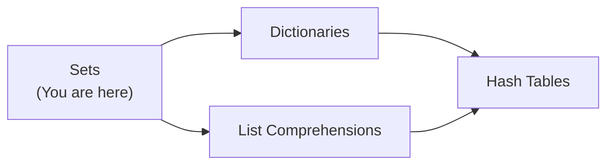
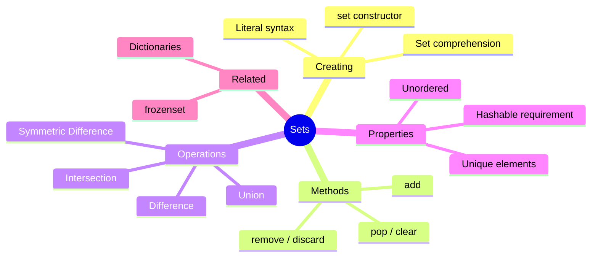
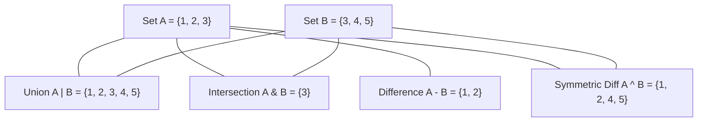
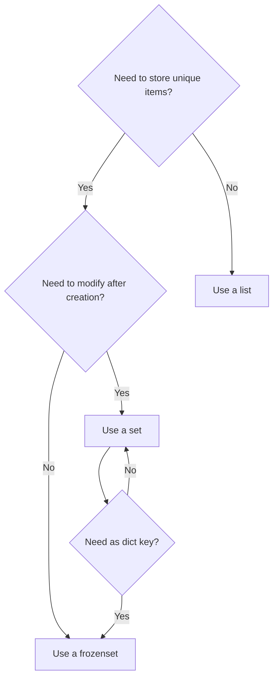

# Sets — Junior Level

## Table of Contents

1. [Introduction](#introduction)
2. [Prerequisites](#prerequisites)
3. [Glossary](#glossary)
4. [Core Concepts](#core-concepts)
5. [Real-World Analogies](#real-world-analogies)
6. [Mental Models](#mental-models)
7. [Pros & Cons](#pros--cons)
8. [Use Cases](#use-cases)
9. [Code Examples](#code-examples)
10. [Clean Code](#clean-code)
11. [Product Use / Feature](#product-use--feature)
12. [Error Handling](#error-handling)
13. [Security Considerations](#security-considerations)
14. [Performance Tips](#performance-tips)
15. [Metrics & Analytics](#metrics--analytics)
16. [Best Practices](#best-practices)
17. [Edge Cases & Pitfalls](#edge-cases--pitfalls)
18. [Common Mistakes](#common-mistakes)
19. [Common Misconceptions](#common-misconceptions)
20. [Tricky Points](#tricky-points)
21. [Test](#test)
22. [Tricky Questions](#tricky-questions)
23. [Cheat Sheet](#cheat-sheet)
24. [Summary](#summary)
25. [What You Can Build](#what-you-can-build)
26. [Further Reading](#further-reading)
27. [Related Topics](#related-topics)
28. [Diagrams & Visual Aids](#diagrams--visual-aids)

---

## Introduction

> Focus: "What is it?" and "How to use it?"

A **set** is an unordered collection of unique elements in Python. Sets automatically remove duplicate values, making them ideal for membership testing, removing duplicates from sequences, and performing mathematical set operations like union and intersection. If you have ever used a Venn diagram, you already understand the core idea behind sets.

---

## Prerequisites

What you should know before studying this topic:

- **Required:** Variables and Data Types — you need to understand basic Python types (int, str, float)
- **Required:** Lists — sets are often compared to lists, and you frequently convert between them
- **Helpful but not required:** Loops — iterating over sets uses the same `for` loop syntax

---

## Glossary

| Term | Definition |
|------|-----------|
| **Set** | An unordered collection of unique, hashable elements |
| **Element / Member** | A single item stored inside a set |
| **Hashable** | An object that has a fixed hash value during its lifetime (e.g., int, str, tuple) |
| **Mutable** | An object whose contents can be changed after creation (sets are mutable) |
| **Frozenset** | An immutable version of a set that can itself be used as a set element or dict key |
| **Union** | A set containing all elements from two or more sets |
| **Intersection** | A set containing only elements common to two or more sets |
| **Difference** | A set containing elements in one set but not in another |
| **Symmetric Difference** | A set containing elements in either set but not in both |

---

## Core Concepts

### Concept 1: Creating Sets

You can create sets using curly braces `{}` or the `set()` constructor. An empty set **must** use `set()` because `{}` creates an empty dictionary.

```python
# Using curly braces
fruits = {"apple", "banana", "cherry"}

# Using set() constructor
numbers = set([1, 2, 3, 2, 1])  # duplicates removed -> {1, 2, 3}

# Empty set — NOT {} (that's a dict!)
empty = set()
```

### Concept 2: Uniqueness

Sets automatically discard duplicate values. When you add an element that already exists, nothing happens.

```python
colors = {"red", "blue", "red", "green", "blue"}
print(colors)  # {'red', 'blue', 'green'} — duplicates removed
```

### Concept 3: Set Methods

Sets have built-in methods for adding, removing, and querying elements.

- `add(x)` — adds element x
- `remove(x)` — removes x; raises `KeyError` if not found
- `discard(x)` — removes x; does nothing if not found
- `pop()` — removes and returns an arbitrary element
- `clear()` — removes all elements

### Concept 4: Set Operations

Sets support mathematical operations either through methods or operators.

```python
a = {1, 2, 3}
b = {3, 4, 5}

print(a | b)   # Union: {1, 2, 3, 4, 5}
print(a & b)   # Intersection: {3}
print(a - b)   # Difference: {1, 2}
print(a ^ b)   # Symmetric difference: {1, 2, 4, 5}
```

### Concept 5: Set Comprehensions

Like list comprehensions, you can build sets with a compact expression.

```python
squares = {x**2 for x in range(10)}
print(squares)  # {0, 1, 4, 9, 16, 25, 36, 49, 64, 81}
```

### Concept 6: Frozenset

A frozenset is an immutable set. It cannot be modified after creation and can be used as a dictionary key or as an element of another set.

```python
fs = frozenset([1, 2, 3])
# fs.add(4)  # AttributeError — frozensets are immutable
```

---

## Real-World Analogies

| Concept | Analogy |
|---------|--------|
| **Set** | A bag of unique marbles — you can have one red, one blue, one green, but never two reds |
| **Union** | Combining two guest lists for a party — everyone from both lists gets an invitation, but no duplicates |
| **Intersection** | Finding mutual friends — only people who appear on both friend lists |
| **Frozenset** | A sealed bag of marbles — you can look at them but cannot add or remove any |

---

## Mental Models

**The intuition:** Think of a set as a **checklist of unique items**. When you try to check off an item that is already checked, nothing changes. The set only cares about *whether* something is present, not *how many times* or *in what order*.

**Why this model helps:** This prevents the common mistake of expecting sets to maintain insertion order or to store duplicates. It also explains why membership testing (`in`) is so fast — the set just checks one box.

---

## Pros & Cons

| Pros | Cons |
|------|------|
| O(1) average membership testing | Unordered — cannot index or slice |
| Automatic duplicate removal | Elements must be hashable (no lists or dicts) |
| Built-in mathematical set operations | Uses more memory per element than lists |
| Clean, readable syntax with operators | No way to store duplicate values |

### When to use:
- Checking if an item exists in a collection (membership testing)
- Removing duplicates from a list
- Finding common or different elements between collections

### When NOT to use:
- When you need to preserve insertion order (use a list or dict)
- When you need to store mutable objects like lists or dicts as elements
- When you need to access elements by index

---

## Use Cases

- **Use Case 1:** Removing duplicates — `unique_emails = set(email_list)` to deduplicate user emails
- **Use Case 2:** Membership testing — checking if a username is in a set of banned users
- **Use Case 3:** Finding common tags — intersection of tag sets between two blog posts
- **Use Case 4:** Tracking visited URLs in a web scraper

---

## Code Examples

### Example 1: Basic Set Operations

```python
# Creating and manipulating sets
students_math = {"Alice", "Bob", "Charlie", "Diana"}
students_science = {"Bob", "Diana", "Eve", "Frank"}

# Students in both classes
both = students_math & students_science
print(f"In both classes: {both}")  # {'Bob', 'Diana'}

# Students in either class
all_students = students_math | students_science
print(f"All students: {all_students}")

# Students only in math
math_only = students_math - students_science
print(f"Math only: {math_only}")  # {'Alice', 'Charlie'}

# Students in exactly one class
one_class = students_math ^ students_science
print(f"Exactly one class: {one_class}")  # {'Alice', 'Charlie', 'Eve', 'Frank'}
```

**What it does:** Demonstrates all four main set operations using student enrollment data.
**How to run:** `python sets_demo.py`

### Example 2: Removing Duplicates from a List

```python
# Remove duplicates while keeping original order
def remove_duplicates(items: list) -> list:
    """Remove duplicates from a list while preserving order."""
    seen = set()
    result = []
    for item in items:
        if item not in seen:
            seen.add(item)
            result.append(item)
    return result


emails = [
    "alice@example.com",
    "bob@example.com",
    "alice@example.com",
    "charlie@example.com",
    "bob@example.com",
]
unique = remove_duplicates(emails)
print(unique)
# ['alice@example.com', 'bob@example.com', 'charlie@example.com']
```

**What it does:** Uses a set to track seen items while building an order-preserving unique list.
**How to run:** `python dedup.py`

### Example 3: Set Comprehension

```python
# Extract unique file extensions from a file list
files = ["report.pdf", "data.csv", "notes.txt", "backup.csv", "image.png", "readme.txt"]
extensions = {f.rsplit(".", 1)[-1] for f in files}
print(extensions)  # {'pdf', 'csv', 'txt', 'png'}
```

**What it does:** Builds a set of unique file extensions using a set comprehension.

### Example 4: Subset and Superset Checks

```python
required_permissions = {"read", "write"}
user_permissions = {"read", "write", "delete", "admin"}

# Check if user has all required permissions
if required_permissions.issubset(user_permissions):
    print("Access granted!")

# Alternative operator syntax
if required_permissions <= user_permissions:
    print("Access granted (operator syntax)!")

# Check if two sets share no common elements
guests = {"Alice", "Bob"}
banned = {"Charlie", "Dave"}
if guests.isdisjoint(banned):
    print("No banned guests on the list.")
```

---

## Clean Code

### Naming (PEP 8 conventions)

```python
# ❌ Bad
s = {1, 2, 3}
x = s & {2, 3, 4}

# ✅ Clean Python naming
active_user_ids = {1, 2, 3}
common_ids = active_user_ids & premium_user_ids
```

### Short Functions

```python
# ❌ Long function doing multiple things
def process(data):
    unique = set(data)
    filtered = {x for x in unique if x > 0}
    return sorted(filtered)

# ✅ Each function does one thing
def deduplicate(items: list) -> set:
    return set(items)

def filter_positive(numbers: set) -> set:
    return {n for n in numbers if n > 0}

def sorted_positive_unique(items: list) -> list:
    return sorted(filter_positive(deduplicate(items)))
```

---

## Product Use / Feature

### 1. Django ORM

- **How it uses Sets:** `QuerySet.values_list("field", flat=True)` results are often converted to sets for fast lookups and set operations between different querysets.
- **Why it matters:** Efficiently compare groups of users, permissions, or tags.

### 2. Web Scraping (Scrapy)

- **How it uses Sets:** Tracks visited URLs in a set to avoid crawling the same page twice.
- **Why it matters:** Prevents infinite loops and redundant network requests.

### 3. pandas

- **How it uses Sets:** `df.column.unique()` returns unique values; internally uses hash-based structures similar to sets.
- **Why it matters:** Data deduplication is a fundamental data cleaning step.

---

## Error Handling

### Error 1: `TypeError` — Unhashable Type

```python
# This raises TypeError
my_set = {[1, 2, 3]}  # lists are not hashable
```

**Why it happens:** Set elements must be hashable. Lists and dicts are mutable and therefore unhashable.
**How to fix:**

```python
# Convert list to tuple (which is hashable)
my_set = {(1, 2, 3)}

# Or use frozenset for a set of sets
my_set = {frozenset([1, 2, 3])}
```

### Error 2: `KeyError` — Element Not Found

```python
s = {1, 2, 3}
s.remove(4)  # KeyError: 4
```

**Why it happens:** `remove()` raises `KeyError` if the element is not in the set.
**How to fix:**

```python
# Use discard() instead — no error if element missing
s.discard(4)  # no error

# Or check first
if 4 in s:
    s.remove(4)
```

### Error 3: `KeyError` — `pop()` on Empty Set

```python
s = set()
s.pop()  # KeyError: 'pop from an empty set'
```

**Why it happens:** You cannot pop from an empty set.
**How to fix:**

```python
if s:
    element = s.pop()
```

---

## Security Considerations

### 1. Hash Collision Attacks

```python
# ❌ Using user-provided strings as set keys without validation
user_tags = set(request.form.getlist("tags"))

# ✅ Validate and limit input
MAX_TAGS = 50
raw_tags = request.form.getlist("tags")[:MAX_TAGS]
user_tags = {tag.strip()[:100] for tag in raw_tags if tag.strip()}
```

**Risk:** An attacker could craft inputs that produce hash collisions, degrading O(1) to O(n).
**Mitigation:** Python 3.3+ uses randomized hashing (`PYTHONHASHSEED`) by default to prevent this.

### 2. Timing Attacks on Membership Checks

```python
# ❌ Potential timing leak for sensitive checks
if token in valid_tokens_set:
    grant_access()

# ✅ Use hmac.compare_digest for security-sensitive comparisons
import hmac
for valid in valid_tokens_set:
    if hmac.compare_digest(token, valid):
        grant_access()
        break
```

**Risk:** Set `in` returns immediately on match, leaking timing information.
**Mitigation:** Use constant-time comparison for security-sensitive values.

---

## Performance Tips

### Tip 1: Use Sets for Membership Testing

```python
# ❌ Slow — O(n) membership test in a list
banned_list = ["user1", "user2", "user3", ...]
if username in banned_list:  # O(n)
    block()

# ✅ Fast — O(1) membership test in a set
banned_set = {"user1", "user2", "user3", ...}
if username in banned_set:  # O(1)
    block()
```

**Why it's faster:** Sets use a hash table internally, providing O(1) average lookup.

### Tip 2: Use Set Operations Instead of Loops

```python
# ❌ Manual intersection with nested loops
common = []
for item in list_a:
    if item in list_b:
        common.append(item)

# ✅ Set intersection — faster and cleaner
common = set(list_a) & set(list_b)
```

**Why it's faster:** Built-in set operations are implemented in C and highly optimized.

---

## Metrics & Analytics

### What to Measure

| Metric | Why it matters | Tool |
|--------|---------------|------|
| **Lookup time** | Sets should give O(1) lookups | `timeit` |
| **Memory usage** | Sets use more memory than lists | `sys.getsizeof` |

### Basic Instrumentation

```python
import time
import sys

data = set(range(1_000_000))

start = time.perf_counter()
result = 999_999 in data
elapsed = time.perf_counter() - start
print(f"Lookup took {elapsed:.6f}s")
print(f"Set memory: {sys.getsizeof(data):,} bytes")
```

---

## Best Practices

- **Use `discard()` over `remove()`** when you are not sure the element exists — avoids `KeyError`
- **Use set literals `{1, 2, 3}`** instead of `set([1, 2, 3])` — it is faster and more readable
- **Convert to set early** when performing multiple membership checks against the same collection
- **Use frozenset for immutable sets** — when you need sets as dict keys or elements of other sets
- **Prefer set operators** (`|`, `&`, `-`, `^`) over method calls for readability when both operands are sets

---

## Edge Cases & Pitfalls

### Pitfall 1: Empty Set vs Empty Dict

```python
a = {}      # This is a dict, NOT a set!
b = set()   # This is an empty set

print(type(a))  # <class 'dict'>
print(type(b))  # <class 'set'>
```

**What happens:** `{}` creates a dictionary, not a set.
**How to fix:** Always use `set()` for empty sets.

### Pitfall 2: Sets Are Unordered

```python
s = {3, 1, 4, 1, 5, 9, 2, 6}
print(s)  # Order is not guaranteed!
# You cannot do s[0] — sets don't support indexing
```

**What happens:** The print order may vary between runs and Python versions.
**How to fix:** If you need ordered unique values, use `dict.fromkeys(items)` or `sorted(set(items))`.

---

## Common Mistakes

### Mistake 1: Trying to Add Mutable Objects

```python
# ❌ Wrong — lists are not hashable
s = set()
s.add([1, 2, 3])  # TypeError

# ✅ Correct — use tuples instead
s = set()
s.add((1, 2, 3))
```

### Mistake 2: Modifying a Set During Iteration

```python
# ❌ Wrong — RuntimeError
s = {1, 2, 3, 4, 5}
for item in s:
    if item % 2 == 0:
        s.remove(item)  # RuntimeError: Set changed size during iteration

# ✅ Correct — iterate over a copy or use comprehension
s = {item for item in s if item % 2 != 0}
```

### Mistake 3: Expecting Order from a Set

```python
# ❌ Wrong assumption
s = {3, 1, 2}
first = list(s)[0]  # You don't know what "first" will be!

# ✅ Use min/max or sorted if you need a specific element
smallest = min(s)
```

---

## Common Misconceptions

### Misconception 1: "Sets preserve insertion order like dicts"

**Reality:** Unlike dicts (which preserve insertion order since Python 3.7), sets do NOT guarantee any order.

**Why people think this:** Dicts and sets both use hash tables, and dict order preservation leads people to assume sets do the same.

### Misconception 2: "You can store any Python object in a set"

**Reality:** Only hashable objects can be stored in a set. Lists, dicts, and other sets cannot be set elements.

**Why people think this:** Lists can contain any object, so people assume sets work the same way.

---

## Tricky Points

### Tricky Point 1: Boolean and Integer Overlap

```python
s = {True, 1, 0, False}
print(s)  # {True, 0} or {0, True}
```

**Why it's tricky:** In Python, `True == 1` and `False == 0`, so they are considered the same element.
**Key takeaway:** Booleans and integers share hash values when equal.

### Tricky Point 2: Frozenset as Dict Key

```python
d = {frozenset({1, 2}): "pair"}
print(d[frozenset({2, 1})])  # "pair" — order doesn't matter
```

**Why it's tricky:** The frozenset `{1, 2}` and `{2, 1}` are the same because sets are unordered.
**Key takeaway:** Frozensets are compared by content, not construction order.

---

## Test

### Multiple Choice

**1. What is the correct way to create an empty set in Python?**

- A) `s = {}`
- B) `s = set()`
- C) `s = set([])`
- D) Both B and C

<details>
<summary>Answer</summary>

**D)** — Both `set()` and `set([])` create empty sets. `{}` creates an empty dictionary, not a set.
</details>

**2. What does `{1, 2, 3} & {2, 3, 4}` return?**

- A) `{1, 2, 3, 4}`
- B) `{2, 3}`
- C) `{1, 4}`
- D) `{1}`

<details>
<summary>Answer</summary>

**B)** — The `&` operator computes the intersection, returning elements common to both sets.
</details>

### True or False

**3. You can add a list as an element to a Python set.**

<details>
<summary>Answer</summary>

**False** — Lists are mutable and therefore unhashable. Only hashable objects can be set elements. Use a tuple instead.
</details>

**4. Sets in Python maintain the order in which elements were added.**

<details>
<summary>Answer</summary>

**False** — Sets are unordered collections. There is no guaranteed order of elements.
</details>

### What's the Output?

**5. What does this code print?**

```python
s = {True, 1, 2, 0, False}
print(len(s))
```

<details>
<summary>Answer</summary>

Output: `3`

Explanation: `True == 1` and `False == 0`, so `True` and `1` are the same element, as are `False` and `0`. The set contains three unique values: `{True, 2, 0}` (or `{0, True, 2}`).
</details>

**6. What does this code print?**

```python
a = {1, 2, 3}
b = {3, 4, 5}
print(a ^ b)
```

<details>
<summary>Answer</summary>

Output: `{1, 2, 4, 5}`

Explanation: `^` is the symmetric difference operator — elements in either set but not in both.
</details>

**7. What does this code print?**

```python
s = {1, 2, 3}
s.discard(10)
s.add(2)
print(len(s))
```

<details>
<summary>Answer</summary>

Output: `3`

Explanation: `discard(10)` does nothing (10 is not in the set). `add(2)` does nothing (2 is already in the set). Length remains 3.
</details>

---

## Tricky Questions

**1. What is the output?**

```python
print({1, 2, 3} == {3, 2, 1})
```

- A) `False`
- B) `True`
- C) `TypeError`
- D) Depends on Python version

<details>
<summary>Answer</summary>

**B)** — Sets are compared by content, not order. Both sets contain the same elements, so they are equal.
</details>

**2. What happens when you run this?**

```python
s = set("hello")
print(s)
```

- A) `{'hello'}`
- B) `{'h', 'e', 'l', 'o'}`
- C) `{'h', 'e', 'l', 'l', 'o'}`
- D) `TypeError`

<details>
<summary>Answer</summary>

**B)** — `set()` iterates over the string, adding each character. Duplicates (`l`) are removed. The result is `{'h', 'e', 'l', 'o'}`.
</details>

---

## Cheat Sheet

| What | Syntax / Command | Example |
|------|-----------------|---------|
| Create set | `{a, b, c}` or `set(iterable)` | `s = {1, 2, 3}` |
| Empty set | `set()` | `s = set()` |
| Add element | `s.add(x)` | `s.add(4)` |
| Remove (error if missing) | `s.remove(x)` | `s.remove(2)` |
| Remove (no error) | `s.discard(x)` | `s.discard(99)` |
| Pop arbitrary | `s.pop()` | `val = s.pop()` |
| Clear all | `s.clear()` | `s.clear()` |
| Union | `a \| b` or `a.union(b)` | `{1,2} \| {3,4}` |
| Intersection | `a & b` or `a.intersection(b)` | `{1,2,3} & {2,3,4}` |
| Difference | `a - b` or `a.difference(b)` | `{1,2,3} - {2}` |
| Symmetric diff | `a ^ b` or `a.symmetric_difference(b)` | `{1,2} ^ {2,3}` |
| Subset check | `a <= b` or `a.issubset(b)` | `{1,2} <= {1,2,3}` |
| Superset check | `a >= b` or `a.issuperset(b)` | `{1,2,3} >= {1,2}` |
| Disjoint check | `a.isdisjoint(b)` | `{1,2}.isdisjoint({3,4})` |
| Set comprehension | `{expr for x in iterable}` | `{x**2 for x in range(5)}` |
| Frozenset | `frozenset(iterable)` | `fs = frozenset([1,2,3])` |

---

## Self-Assessment Checklist

### I can explain:
- [ ] What a set is and how it differs from a list
- [ ] Why set elements must be hashable
- [ ] The difference between `remove()` and `discard()`
- [ ] All four set operations (union, intersection, difference, symmetric difference)

### I can do:
- [ ] Create sets using literals and the `set()` constructor
- [ ] Use set comprehensions
- [ ] Remove duplicates from a list using a set
- [ ] Use `frozenset` when immutability is needed

---

## Summary

- A set is an **unordered collection of unique, hashable elements**
- Use sets for **fast membership testing** (O(1)), **deduplication**, and **set algebra**
- Set elements must be **hashable** — no lists or dicts allowed
- Use `frozenset` when you need an **immutable set**
- `{}` creates a dict, not a set — use `set()` for empty sets

**Next step:** Learn about Dictionaries, which also use hash tables but store key-value pairs.

---

## What You Can Build

### Projects you can create:
- **Tag Manager:** Store and compare tags using set operations
- **Duplicate Finder:** Scan a list of files and find duplicates by content hash
- **Permission Checker:** Model role-based access control with sets of permissions

### Technologies / tools that use this:
- **Django / FastAPI** — permission sets, queryset comparisons
- **pandas** — unique value extraction, index operations
- **Graph algorithms** — tracking visited nodes during traversal

### Learning path:



---

## Further Reading

- **Official docs:** [Python Sets](https://docs.python.org/3/library/stdtypes.html#set-types-set-frozenset)
- **Tutorial:** [Python Sets Tutorial](https://docs.python.org/3/tutorial/datastructures.html#sets)
- **Book chapter:** Fluent Python (Ramalho), Chapter 3 — Dictionaries and Sets
- **PEP 218:** [Adding a Built-In Set Object Type](https://peps.python.org/pep-0218/) — the proposal that brought sets to Python

---

## Related Topics

- **[Dictionaries](../11-dictionaries/)** — also hash-based; stores key-value pairs
- **[Lists](../08-lists/)** — ordered, allows duplicates; compare with sets
- **[Tuples](../09-tuples/)** — immutable sequences; can be set elements

---

## Diagrams & Visual Aids

### Mind Map



### Set Operations Diagram



### Decision Flowchart


