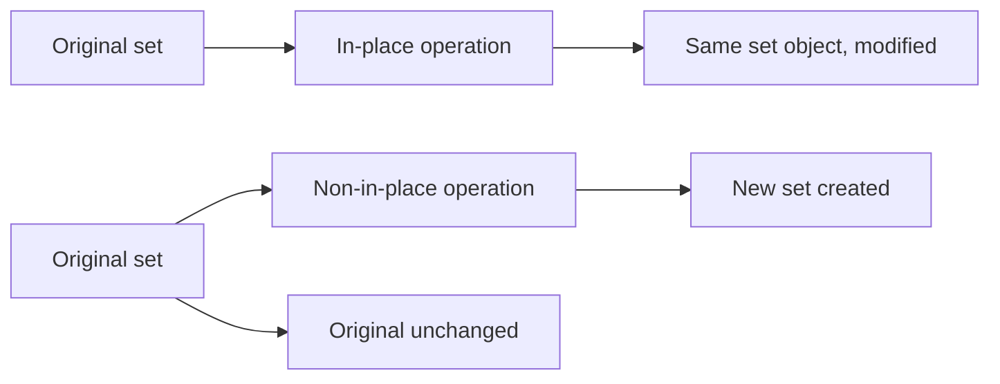
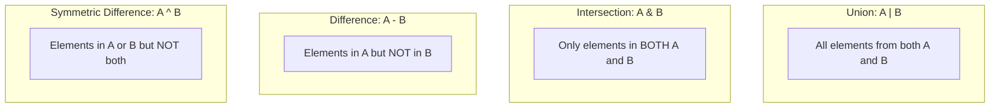
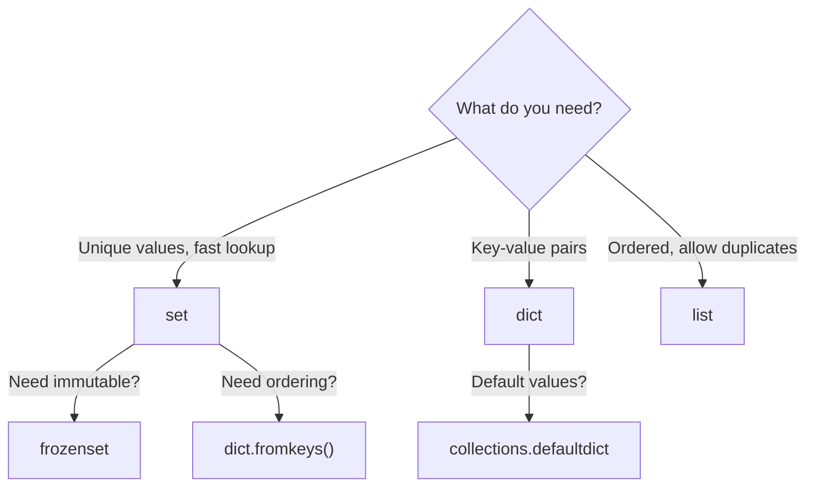

# Sets — Middle Level

## Table of Contents

1. [Introduction](#introduction)
2. [Core Concepts](#core-concepts)
3. [Evolution & Historical Context](#evolution--historical-context)
4. [Pros & Cons](#pros--cons)
5. [Alternative Approaches](#alternative-approaches)
6. [Use Cases](#use-cases)
7. [Code Examples](#code-examples)
8. [Coding Patterns](#coding-patterns)
9. [Performance Optimization](#performance-optimization)
10. [Comparison with Other Languages](#comparison-with-other-languages)
11. [Debugging Guide](#debugging-guide)
12. [Best Practices](#best-practices)
13. [Edge Cases & Pitfalls](#edge-cases--pitfalls)
14. [Test](#test)
15. [Diagrams & Visual Aids](#diagrams--visual-aids)

---

## Introduction

> Focus: "Why?" and "When to use?"

This level goes beyond basic set syntax. You will learn how sets work internally (hash tables), when to choose sets over other data structures, advanced patterns with type hints and decorators, and production-level performance considerations.

---

## Core Concepts

### Concept 1: Hash Table Internals

Sets in CPython are implemented as hash tables. When you add an element, Python computes its hash, finds an open slot in the internal array, and stores the element there. This is why:

- Lookup/add/remove are O(1) average
- Elements must be hashable
- Memory usage is higher than lists (the table has empty slots for performance)

```python
# Every set element must implement __hash__ and __eq__
print(hash(42))        # Some integer
print(hash("hello"))   # Some integer
print(hash((1, 2)))    # Tuples are hashable
# hash([1, 2])         # TypeError — lists are unhashable
```

### Concept 2: The `__hash__` and `__eq__` Contract

For a set to work correctly, if `a == b` then `hash(a) == hash(b)` must also hold. Violating this contract produces silent bugs.

```python
class BadPoint:
    def __init__(self, x, y):
        self.x, self.y = x, y

    def __eq__(self, other):
        return self.x == other.x and self.y == other.y

    # Missing __hash__! Python sets __hash__ = None when you define __eq__
    # This makes BadPoint unhashable

class GoodPoint:
    def __init__(self, x: int, y: int):
        self.x, self.y = x, y

    def __eq__(self, other: object) -> bool:
        if not isinstance(other, GoodPoint):
            return NotImplemented
        return self.x == other.x and self.y == other.y

    def __hash__(self) -> int:
        return hash((self.x, self.y))
```

### Concept 3: Set Algebra with Methods vs Operators

Operators (`|`, `&`, `-`, `^`) require both operands to be sets. Methods accept any iterable.

```python
s = {1, 2, 3}

# Operator — both must be sets
result = s | {4, 5}  # OK
# result = s | [4, 5]  # TypeError!

# Method — accepts any iterable
result = s.union([4, 5])       # OK
result = s.union(range(4, 6))  # OK
result = s.union("abc")        # {'a', 'b', 'c', 1, 2, 3}
```

### Concept 4: In-Place Set Operations

In-place operators modify the set rather than creating a new one.

```python
s = {1, 2, 3}
s |= {4, 5}       # s.update({4, 5})       — union update
s &= {2, 4}       # s.intersection_update   — keep only common
s -= {4}           # s.difference_update     — remove elements
s ^= {1, 5}       # s.symmetric_difference_update
```



### Concept 5: Typed Sets with Type Hints

```python
from typing import Set, FrozenSet

def find_common_tags(
    article_tags: set[str],
    user_interests: set[str],
) -> set[str]:
    """Find tags that match user interests."""
    return article_tags & user_interests

# Python 3.9+ allows set[str] directly
# Python 3.7-3.8 requires Set[str] from typing
```

---

## Evolution & Historical Context

**Before sets (Python < 2.4):**
- Developers used dicts with dummy values: `seen = {item: True for item in data}`
- Or sorted lists with bisect for O(log n) lookups
- No clean syntax for set operations

**How sets changed things:**
- **PEP 218** (Python 2.4): Added the `set` and `frozenset` built-in types
- **PEP 3100** (Python 3.0): Set literals `{1, 2, 3}` and set comprehensions `{x for x in data}`
- **Python 3.9+**: `set[str]` for type hints (no import needed)

---

## Pros & Cons

| Pros | Cons |
|------|------|
| O(1) average lookup, insert, delete | ~4x more memory than a list for the same number of elements |
| Rich set algebra API (union, intersect, etc.) | Elements must be hashable — no nested lists or dicts |
| Clean operator syntax (`\|`, `&`, `-`, `^`) | Unordered — cannot rely on iteration order |
| In-place update operators for efficiency | Hash collisions degrade to O(n) in worst case |

### Trade-off analysis:
- **Memory vs Speed:** Sets use more memory than lists but provide O(1) lookups vs O(n)
- **Flexibility vs Constraints:** The hashability requirement limits what you can store but enables performance

---

## Alternative Approaches

| Alternative | How it works | When you might use it |
|-------------|--------------|------------------------------------|
| **`dict.fromkeys()`** | Creates a dict with None values from an iterable | When you need ordered unique elements (Python 3.7+) |
| **Sorted list + bisect** | Binary search on a sorted list | When memory is critical and data is sorted |
| **Bloom filter** | Probabilistic set membership | When you have millions of elements and can tolerate false positives |
| **bitarray / bitmap** | Bit-level set for integers in a range | When elements are dense integers in a known range |

---

## Use Cases

- **Use Case 1:** API rate limiting — track active API keys in a set for O(1) lookup
- **Use Case 2:** Graph traversal — `visited: set[Node]` to track explored nodes in BFS/DFS
- **Use Case 3:** Feature flags — `enabled_features: set[str]` with `issubset()` checks
- **Use Case 4:** Data pipeline deduplication — deduplicate streaming records by ID

---

## Code Examples

### Example 1: Production-Ready Permission System

```python
from __future__ import annotations
from dataclasses import dataclass, field
from typing import ClassVar


@dataclass
class Role:
    name: str
    permissions: frozenset[str]

    # Pre-defined roles
    ADMIN: ClassVar[Role]
    EDITOR: ClassVar[Role]
    VIEWER: ClassVar[Role]


Role.ADMIN = Role("admin", frozenset({"read", "write", "delete", "admin"}))
Role.EDITOR = Role("editor", frozenset({"read", "write"}))
Role.VIEWER = Role("viewer", frozenset({"read"}))


@dataclass
class User:
    username: str
    roles: set[Role] = field(default_factory=set)

    @property
    def permissions(self) -> frozenset[str]:
        """Aggregate permissions from all roles."""
        all_perms: set[str] = set()
        for role in self.roles:
            all_perms |= role.permissions
        return frozenset(all_perms)

    def has_permission(self, perm: str) -> bool:
        return perm in self.permissions

    def has_all_permissions(self, required: set[str]) -> bool:
        return required <= self.permissions


# Usage
user = User("alice", {Role.EDITOR, Role.VIEWER})
print(user.permissions)                          # frozenset({'read', 'write'})
print(user.has_permission("write"))              # True
print(user.has_all_permissions({"read", "delete"}))  # False
```

### Example 2: Set-Based Graph Algorithm (Connected Components)

```python
from typing import Dict, Set, List


def connected_components(graph: Dict[str, Set[str]]) -> List[Set[str]]:
    """Find all connected components in an undirected graph."""
    visited: set[str] = set()
    components: list[set[str]] = []

    for node in graph:
        if node not in visited:
            component: set[str] = set()
            stack = [node]
            while stack:
                current = stack.pop()
                if current not in visited:
                    visited.add(current)
                    component.add(current)
                    stack.extend(graph[current] - visited)
            components.append(component)

    return components


# Usage
graph = {
    "A": {"B", "C"},
    "B": {"A"},
    "C": {"A"},
    "D": {"E"},
    "E": {"D"},
    "F": set(),
}
print(connected_components(graph))
# [{'A', 'B', 'C'}, {'D', 'E'}, {'F'}]
```

### Example 3: Context Manager for Temporary Set Membership

```python
from contextlib import contextmanager
from typing import TypeVar, Set

T = TypeVar("T")


@contextmanager
def temporary_member(s: set[T], element: T):
    """Temporarily add an element to a set, remove on exit."""
    already_present = element in s
    s.add(element)
    try:
        yield s
    finally:
        if not already_present:
            s.discard(element)


# Usage
active_features = {"dark_mode", "notifications"}
with temporary_member(active_features, "beta_feature") as features:
    print("beta_feature" in features)  # True

print("beta_feature" in active_features)  # False — cleaned up
```

---

## Coding Patterns

### Pattern 1: Two-Set Partitioning

Split data into two groups using set operations.

```python
def partition_users(
    all_users: set[str],
    premium_users: set[str],
) -> tuple[set[str], set[str]]:
    """Partition into premium and free users."""
    free_users = all_users - premium_users
    actual_premium = all_users & premium_users  # Only count those in all_users
    return actual_premium, free_users
```

### Pattern 2: Incremental Set Building with Validation

```python
def collect_unique_valid_emails(raw_emails: list[str]) -> set[str]:
    """Collect unique emails, validating each one."""
    import re
    pattern = re.compile(r"^[\w.+-]+@[\w-]+\.[\w.]+$")
    return {
        email.lower().strip()
        for email in raw_emails
        if pattern.match(email.strip())
    }
```

### Pattern 3: Set-Based State Machine

```python
VALID_TRANSITIONS: dict[str, set[str]] = {
    "draft": {"review", "archived"},
    "review": {"approved", "rejected", "draft"},
    "approved": {"published"},
    "rejected": {"draft", "archived"},
    "published": {"archived"},
    "archived": set(),
}

def can_transition(current: str, target: str) -> bool:
    return target in VALID_TRANSITIONS.get(current, set())
```

### Pattern 4: Difference-Based Change Detection

```python
def detect_changes(
    old_tags: set[str],
    new_tags: set[str],
) -> dict[str, set[str]]:
    """Detect added, removed, and unchanged tags."""
    return {
        "added": new_tags - old_tags,
        "removed": old_tags - new_tags,
        "unchanged": old_tags & new_tags,
    }

changes = detect_changes({"python", "flask"}, {"python", "fastapi"})
# {'added': {'fastapi'}, 'removed': {'flask'}, 'unchanged': {'python'}}
```

### Pattern 5: Multi-Set Intersection (Common Across All)

```python
from functools import reduce

def common_to_all(*sets: set[str]) -> set[str]:
    """Find elements common to ALL provided sets."""
    if not sets:
        return set()
    return reduce(set.intersection, sets)

# Students enrolled in ALL three courses
math = {"Alice", "Bob", "Charlie"}
physics = {"Bob", "Charlie", "Diana"}
cs = {"Bob", "Diana", "Eve"}
print(common_to_all(math, physics, cs))  # {'Bob'}
```

---

## Performance Optimization

### Benchmark: Set vs List Lookup

```python
import timeit

setup = """
data_list = list(range(100_000))
data_set = set(range(100_000))
target = 99_999
"""

list_time = timeit.timeit("target in data_list", setup=setup, number=1000)
set_time = timeit.timeit("target in data_set", setup=setup, number=1000)

print(f"List lookup: {list_time:.4f}s")
print(f"Set lookup:  {set_time:.4f}s")
print(f"Set is {list_time / set_time:.0f}x faster")
# Typical output: Set is ~1000x faster for worst-case lookups
```

### Memory Comparison

```python
import sys

n = 10_000
lst = list(range(n))
st = set(range(n))

print(f"List: {sys.getsizeof(lst):>10,} bytes")
print(f"Set:  {sys.getsizeof(st):>10,} bytes")
print(f"Ratio: {sys.getsizeof(st) / sys.getsizeof(lst):.1f}x")
```

### Set Creation: Literal vs Constructor

```python
import timeit

# Literal is faster — compiled to BUILD_SET opcode
literal = timeit.timeit("{1, 2, 3, 4, 5}", number=1_000_000)
constructor = timeit.timeit("set([1, 2, 3, 4, 5])", number=1_000_000)
print(f"Literal:     {literal:.4f}s")
print(f"Constructor: {constructor:.4f}s")
```

```mermaid
graph LR
    subgraph "O(1) Operations"
        A["add()"]
        B["remove()"]
        C["in / not in"]
        D["discard()"]
    end
    subgraph "O(n) Operations"
        E["iteration"]
        F["copy()"]
        G["set creation from list"]
    end
    subgraph "O(min(len(a), len(b)))""
        H["intersection"]
    end
```

---

## Comparison with Other Languages

| Feature | Python `set` | Java `HashSet` | JavaScript `Set` | C++ `std::unordered_set` | Rust `HashSet` |
|---------|:------------:|:--------------:|:-----------------:|:------------------------:|:--------------:|
| Syntax | `{1, 2, 3}` | `new HashSet<>()` | `new Set([1,2,3])` | `{1, 2, 3}` (C++11) | `HashSet::from([1,2,3])` |
| Set operators | `\|`, `&`, `-`, `^` | No (methods only) | No native | No native | `\|`, `&`, `-`, `^` (via traits) |
| Comprehension | `{x for x in ...}` | Stream API | No | No | `.collect()` |
| Frozen/immutable | `frozenset` | `Collections.unmodifiableSet` | No built-in | `const` | Ownership system |
| Ordered variant | No (use dict) | `LinkedHashSet` | Insertion order | No | `IndexSet` (crate) |
| Null elements | Can contain `None` | Can contain `null` | Can contain `null` | N/A | `Option<T>` |

---

## Debugging Guide

### Debugging Hash Collisions

```python
# Check hash distribution
data = ["apple", "banana", "cherry", "date", "elderberry"]
for item in data:
    print(f"{item:>12} -> hash: {hash(item)} -> slot: {hash(item) % 8}")
```

### Debugging Custom `__hash__`

```python
class DebugHashPoint:
    def __init__(self, x: int, y: int):
        self.x, self.y = x, y

    def __hash__(self) -> int:
        h = hash((self.x, self.y))
        print(f"  __hash__({self.x}, {self.y}) = {h}")
        return h

    def __eq__(self, other: object) -> bool:
        if not isinstance(other, DebugHashPoint):
            return NotImplemented
        result = self.x == other.x and self.y == other.y
        print(f"  __eq__({self.x},{self.y}) == ({other.x},{other.y}) -> {result}")
        return result

s = {DebugHashPoint(1, 2), DebugHashPoint(3, 4)}
print(DebugHashPoint(1, 2) in s)
```

---

## Best Practices

- **Use frozenset for dict keys and set elements** — when you need sets inside sets or as dict keys
- **Prefer set operators for readability** — `a & b` reads better than `a.intersection(b)` when both are sets
- **Use methods when mixing types** — `my_set.union(some_list)` works; `my_set | some_list` does not
- **Avoid creating sets for single lookups** — converting a list to a set for one check is slower than a linear scan
- **Use `isdisjoint()` for "no overlap" checks** — it short-circuits and is more readable than `not (a & b)`

---

## Edge Cases & Pitfalls

### Pitfall 1: Hash Randomization Across Runs

```python
# This output changes between program runs (PYTHONHASHSEED)
s = {"a", "b", "c"}
print(list(s))  # Different order each run!
```

**Impact:** Tests that depend on set iteration order will be flaky.
**Fix:** Use `sorted()` when order matters, or set `PYTHONHASHSEED=0` for reproducible testing.

### Pitfall 2: Mutating Objects After Adding to Set

```python
class MutableKey:
    def __init__(self, val):
        self.val = val
    def __hash__(self):
        return hash(self.val)
    def __eq__(self, other):
        return self.val == other.val

obj = MutableKey(1)
s = {obj}
obj.val = 2        # Mutated! Hash changed but set doesn't know
print(obj in s)    # Might be False! The object is "lost" in the set
```

### Pitfall 3: Set of Floats — NaN Behavior

```python
import math
s = {float("nan"), float("nan")}
print(len(s))  # 2! NaN != NaN, so each is treated as unique
print(math.nan in s)  # Implementation-dependent
```

---

## Test

### Multiple Choice

**1. What is the time complexity of `x in my_set` on average?**

- A) O(n)
- B) O(log n)
- C) O(1)
- D) O(n log n)

<details>
<summary>Answer</summary>

**C)** — Hash table lookup is O(1) amortized. Worst case (all collisions) is O(n).
</details>

**2. Which of these can NOT be a set element?**

- A) `(1, 2, 3)` (tuple)
- B) `frozenset({1, 2})`
- C) `{"a": 1}` (dict)
- D) `None`

<details>
<summary>Answer</summary>

**C)** — Dicts are mutable and unhashable. Tuples, frozensets, and None are all hashable.
</details>

**3. What does `{1, 2}.union([3, 4])` return?**

- A) `TypeError`
- B) `{1, 2, 3, 4}`
- C) `{1, 2, [3, 4]}`
- D) `[1, 2, 3, 4]`

<details>
<summary>Answer</summary>

**B)** — The `.union()` method accepts any iterable, not just sets.
</details>

**4. What is the output?**

```python
a = {1, 2, 3}
b = a
b.add(4)
print(len(a))
```

- A) 3
- B) 4
- C) TypeError
- D) 1

<details>
<summary>Answer</summary>

**B)** — `b = a` creates an alias, not a copy. Both names refer to the same set object.
</details>

**5. Which operator performs symmetric difference?**

- A) `|`
- B) `&`
- C) `-`
- D) `^`

<details>
<summary>Answer</summary>

**D)** — `^` is symmetric difference (elements in either but not both). `|` is union, `&` is intersection, `-` is difference.
</details>

**6. What is the output?**

```python
s = set()
s.add((1, [2, 3]))
```

- A) `{(1, [2, 3])}`
- B) `{1, [2, 3]}`
- C) `TypeError`
- D) `{(1, 2, 3)}`

<details>
<summary>Answer</summary>

**C)** — The tuple `(1, [2, 3])` contains a list, making it unhashable. `TypeError: unhashable type: 'list'`.
</details>

### What's the Output?

**7. What does this code print?**

```python
a = {1, 2, 3}
b = {2, 3, 4}
a -= b
print(a)
```

<details>
<summary>Answer</summary>

Output: `{1}`

Explanation: `-=` is in-place difference update. It removes from `a` all elements that are in `b`.
</details>

**8. What does this code print?**

```python
s = {1, 2, 3}
t = s.copy()
t.add(4)
print(len(s), len(t))
```

<details>
<summary>Answer</summary>

Output: `3 4`

Explanation: `.copy()` creates a shallow copy. Modifying `t` does not affect `s`.
</details>

**9. What does this code print?**

```python
print({True, 1, 1.0})
```

<details>
<summary>Answer</summary>

Output: `{True}`

Explanation: `True == 1 == 1.0` and `hash(True) == hash(1) == hash(1.0)`, so they are all considered the same element. The first one added (`True`) is kept.
</details>

**10. What does this code print?**

```python
a = frozenset({1, 2})
b = frozenset({1, 2})
print(a == b, a is b)
```

<details>
<summary>Answer</summary>

Output: `True False` (typically)

Explanation: They are equal in value but are separate objects in memory. (CPython may intern small frozensets in some cases.)
</details>

---

## Diagrams & Visual Aids

### Hash Table Internal Structure

```
Index:  0     1     2     3     4     5     6     7
      +-----+-----+-----+-----+-----+-----+-----+-----+
      |     |"b"  |     |"a"  |     |     |"c"  |     |
      +-----+-----+-----+-----+-----+-----+-----+-----+
              ^           ^                 ^
              hash("b")%8 hash("a")%8      hash("c")%8
```

### Set Operations Venn Diagram



### Decision: Set vs Dict vs List


