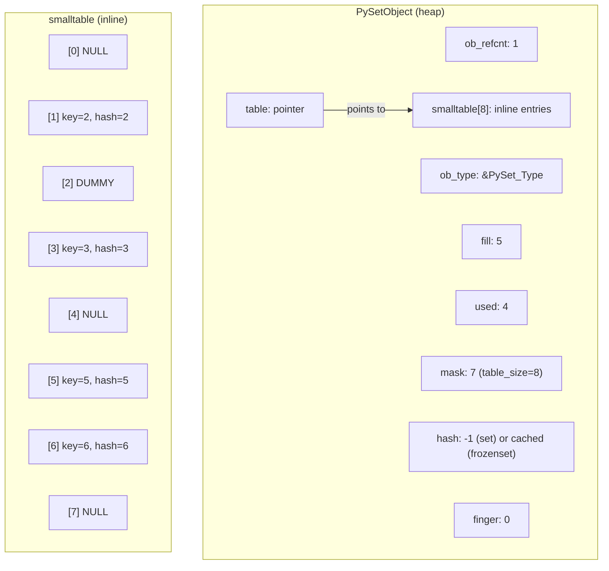
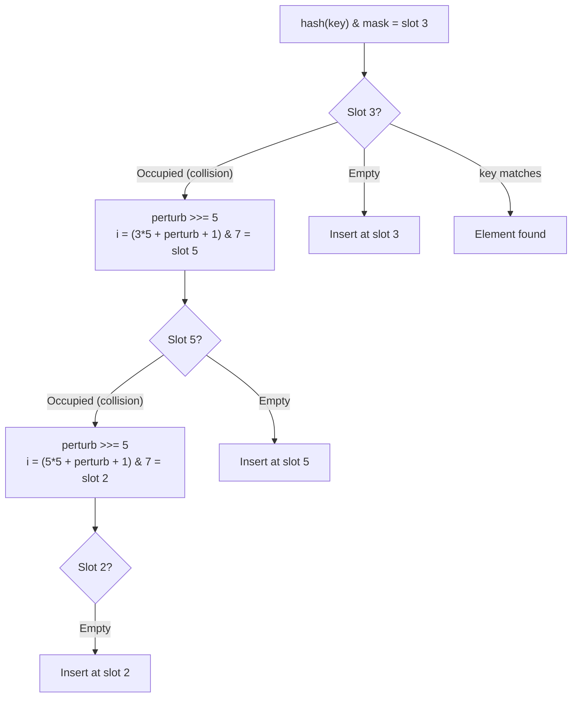

# Sets — Professional Level

## Table of Contents

1. [Introduction](#introduction)
2. [CPython Set Implementation](#cpython-set-implementation)
3. [Hash Table Internals](#hash-table-internals)
4. [Open Addressing & Probing](#open-addressing--probing)
5. [Hash Function Internals](#hash-function-internals)
6. [Memory Layout & Allocation](#memory-layout--allocation)
7. [Resize Strategy](#resize-strategy)
8. [Bytecode Analysis](#bytecode-analysis)
9. [Performance at the C Level](#performance-at-the-c-level)
10. [Frozenset Optimizations](#frozenset-optimizations)
11. [GIL & Thread Safety Internals](#gil--thread-safety-internals)
12. [Diagrams & Visual Aids](#diagrams--visual-aids)

---

## Introduction

> Focus: "What happens under the hood?"

This level examines how CPython implements sets at the C source level. We analyze the hash table structure, open addressing with linear probing, the resize algorithm, bytecode generation for set operations, and how the GIL interacts with set mutations. Understanding these internals helps you make informed decisions about performance, memory, and correctness.

---

## CPython Set Implementation

### Source Files

The CPython set implementation lives in:
- **`Objects/setobject.c`** — Core set implementation (~2,500 lines of C)
- **`Include/cpython/setobject.h`** — Set object structure definition
- **`Lib/collections/__init__.py`** — Python-level set utilities

### PySetObject Structure

```c
/* From Include/cpython/setobject.h */
typedef struct {
    PyObject_HEAD
    Py_ssize_t fill;            /* # Active + Dummy entries */
    Py_ssize_t used;            /* # Active entries (== len(set)) */
    Py_ssize_t mask;            /* Table size - 1 (always 2^n - 1) */
    setentry *table;            /* Pointer to the hash table */
    Py_hash_t hash;             /* Only used by frozenset */
    Py_ssize_t finger;          /* Search start for pop() */
    setentry smalltable[PySet_MINSIZE]; /* Inline table for small sets */
    PyObject *weakreflist;      /* Weak reference support */
} PySetObject;

typedef struct {
    PyObject *key;              /* The element (or NULL/dummy) */
    Py_hash_t hash;             /* Cached hash of the key */
} setentry;
```

Key observations:
- **`PySet_MINSIZE`** is 8 — sets with <= 5 elements use the inline `smalltable` (no heap allocation)
- **`mask`** is always `2^n - 1`, enabling fast modulo via `hash & mask`
- **`fill`** tracks active + dummy slots; `used` tracks only active entries
- **`finger`** tracks where `pop()` should start searching

```python
# Verify PySet_MINSIZE behavior
import sys

small = {1, 2, 3}
medium = {1, 2, 3, 4, 5, 6, 7, 8, 9}
print(f"Small set (3 items):  {sys.getsizeof(small)} bytes")
print(f"Medium set (9 items): {sys.getsizeof(medium)} bytes")
# The jump happens when items exceed what smalltable can hold
```

---

## Hash Table Internals

### Slot States

Each slot in the hash table can be in one of three states:

| State | `key` value | Description |
|-------|------------|-------------|
| **Unused** | `NULL` | Slot has never been used |
| **Active** | `PyObject*` | Slot contains a live element |
| **Dummy** | `dummy` sentinel | Element was deleted; slot is marked for probing |

The dummy sentinel is crucial: without it, deletion would break probe chains. When searching for an element, CPython must continue probing past dummy slots.

```python
# Demonstrate dummy slot behavior
import dis

s = {1, 2, 3, 4, 5}
s.remove(3)  # Slot for 3 becomes "dummy"
# Now 'in' checks must probe past the dummy when looking for elements
# that had the same probe chain as 3
print(4 in s)  # True — probing continues past dummy
```

### Load Factor and Resize Trigger

CPython keeps the hash table at most **2/3 full** (load factor ~0.67). When `fill * 5 >= (mask + 1) * 3`, the table is resized.

```python
# The resize threshold
def will_resize(fill: int, table_size: int) -> bool:
    """Check if adding one more element triggers a resize."""
    return (fill + 1) * 5 >= table_size * 3

# Table size 8: resizes when fill > 4 (8 * 3 / 5 = 4.8)
# Table size 16: resizes when fill > 9
# Table size 32: resizes when fill > 19
for size in [8, 16, 32, 64, 128]:
    threshold = size * 3 // 5
    print(f"Table size {size:>4}: resize when fill > {threshold}")
```

---

## Open Addressing & Probing

### Probe Sequence

CPython uses **open addressing** (not chaining). When a collision occurs, it probes the next slot using a perturbation-based scheme:

```c
/* From Objects/setobject.c — simplified */
static setentry *
set_lookkey(PySetObject *so, PyObject *key, Py_hash_t hash)
{
    setentry *table = so->table;
    Py_ssize_t mask = so->mask;
    size_t i = (size_t)hash & mask;  /* Initial slot */
    setentry *entry = &table[i];

    /* Fast path: slot is empty or contains our key */
    if (entry->key == NULL || entry->key == key)
        return entry;

    size_t perturb = hash;
    while (1) {
        /* Perturbation-based probing */
        perturb >>= 5;
        i = (i * 5 + perturb + 1) & mask;
        entry = &table[i];

        if (entry->key == NULL)
            return entry;
        if (entry->hash == hash && entry->key == key)
            return entry;
        if (entry->hash == hash) {
            /* Full equality check (calls __eq__) */
            int cmp = PyObject_RichCompareBool(entry->key, key, Py_EQ);
            if (cmp > 0)
                return entry;
        }
    }
}
```

The probe sequence is:
```
i_0 = hash & mask
i_1 = (i_0 * 5 + perturb + 1) & mask      perturb >>= 5
i_2 = (i_1 * 5 + perturb + 1) & mask      perturb >>= 5
...
```

After `perturb` is shifted to 0, this degrades to `(i * 5 + 1) & mask`, which visits every slot in a power-of-2 table (since `gcd(5, 2^n) = 1`).

```python
def simulate_probe_sequence(hash_val: int, table_size: int, max_steps: int = 20) -> list[int]:
    """Simulate CPython's set probe sequence."""
    mask = table_size - 1
    i = hash_val & mask
    perturb = hash_val
    sequence = [i]

    for _ in range(max_steps - 1):
        perturb >>= 5
        i = (i * 5 + perturb + 1) & mask
        sequence.append(i)
        if perturb == 0 and len(set(sequence)) == table_size:
            break

    return sequence

# Example: hash=42 in table of size 8
print(simulate_probe_sequence(42, 8))
# Shows how CPython distributes probes across the table
```

---

## Hash Function Internals

### Integer Hashing

For integers, CPython uses the identity function for small values:

```python
# Small integers: hash(x) == x
print(hash(42))    # 42
print(hash(-1))    # -2 (special case: -1 is reserved for errors in C)
print(hash(0))     # 0

# Large integers use a more complex hash
import sys
print(hash(sys.maxsize + 1))  # Different from the value itself
```

### String Hashing (SipHash)

Since Python 3.4, strings use **SipHash-2-4** for security against hash collision attacks:

```python
# String hashes change between runs (PYTHONHASHSEED randomization)
import os
print(f"PYTHONHASHSEED = {os.environ.get('PYTHONHASHSEED', 'random')}")
print(f"hash('hello') = {hash('hello')}")
# Run twice — different results each time (unless PYTHONHASHSEED is fixed)
```

### Custom Object Hashing

```python
import dis

class Point:
    __slots__ = ("x", "y")

    def __init__(self, x: int, y: int):
        self.x = x
        self.y = y

    def __hash__(self) -> int:
        return hash((self.x, self.y))

    def __eq__(self, other: object) -> bool:
        if not isinstance(other, Point):
            return NotImplemented
        return self.x == other.x and self.y == other.y

# Analyze the bytecode of hash computation
dis.dis(Point.__hash__)
```

---

## Memory Layout & Allocation

### Set Memory Model

```
PySetObject (on heap):
+========================================+
| ob_refcnt    (8 bytes)                 |  Reference counter
| ob_type      (8 bytes)                 |  -> PySet_Type
| fill         (8 bytes)                 |  Active + dummy count
| used         (8 bytes)                 |  Active count (len)
| mask         (8 bytes)                 |  table_size - 1
| table        (8 bytes)                 |  -> setentry array
| hash         (8 bytes)                 |  Frozenset cache
| finger       (8 bytes)                 |  pop() search start
| smalltable   (8 * 16 = 128 bytes)     |  8 entries inline
| weakreflist  (8 bytes)                 |
+========================================+
Total base: ~200 bytes (64-bit system)

When table overflows smalltable, a separate allocation:
+========================================+
| setentry[0]: hash (8B) + key (8B)      |  16 bytes per slot
| setentry[1]: hash (8B) + key (8B)      |
| ...                                     |
| setentry[N-1]                           |
+========================================+
Total: table_size * 16 bytes
```

```python
import sys
import ctypes


def set_memory_breakdown(n: int) -> None:
    """Analyze memory usage at different set sizes."""
    s = set(range(n))
    set_size = sys.getsizeof(s)

    # Each element is also a Python object
    element_overhead = sum(sys.getsizeof(x) for x in s)

    print(f"Elements:         {n:>10,}")
    print(f"Set object:       {set_size:>10,} bytes")
    print(f"Element objects:  {element_overhead:>10,} bytes")
    print(f"Total:            {set_size + element_overhead:>10,} bytes")
    print(f"Per element:      {(set_size + element_overhead) / n:>10.1f} bytes")
    print()


for n in [10, 100, 1000, 10000]:
    set_memory_breakdown(n)
```

---

## Resize Strategy

### Growth Algorithm

```c
/* Simplified from set_table_resize in Objects/setobject.c */
static int
set_table_resize(PySetObject *so, Py_ssize_t minused)
{
    Py_ssize_t newsize;

    /* Find the smallest power of 2 greater than 4x minused */
    for (newsize = PySet_MINSIZE;
         newsize <= minused && newsize > 0;
         newsize <<= 1)
        ;

    /* Allocate new table */
    /* Rehash all active entries into new table */
    /* Free old table (if not smalltable) */
}
```

Key points:
- New size is always a power of 2
- Resize up: when `fill > table_size * 2/3`
- Resize down: when used drops significantly (e.g., after many deletions)
- All entries are rehashed — O(n) operation

```python
import sys


def track_set_resizes():
    """Track when the set internally resizes."""
    s = set()
    prev_size = sys.getsizeof(s)
    resizes = []

    for i in range(200):
        s.add(i)
        curr_size = sys.getsizeof(s)
        if curr_size != prev_size:
            resizes.append({
                "n_elements": len(s),
                "old_bytes": prev_size,
                "new_bytes": curr_size,
                "ratio": curr_size / prev_size if prev_size else 0,
            })
            prev_size = curr_size

    for r in resizes:
        print(
            f"At {r['n_elements']:>4} elements: "
            f"{r['old_bytes']:>6} -> {r['new_bytes']:>6} bytes "
            f"({r['ratio']:.1f}x)"
        )


track_set_resizes()
```

---

## Bytecode Analysis

### Set Literal vs Constructor

```python
import dis

# Set literal — uses BUILD_SET opcode
def create_literal():
    return {1, 2, 3}

# set() constructor — function call overhead
def create_constructor():
    return set([1, 2, 3])

print("=== Set Literal ===")
dis.dis(create_literal)
print("\n=== Set Constructor ===")
dis.dis(create_constructor)
```

Expected output analysis:
```
=== Set Literal ===
  LOAD_CONST    1
  LOAD_CONST    2
  LOAD_CONST    3
  BUILD_SET     3        # Direct set construction opcode
  RETURN_VALUE

=== Set Constructor ===
  LOAD_GLOBAL   set      # Load the 'set' builtin
  LOAD_CONST    (1, 2, 3)
  BUILD_LIST    ...      # Build a temporary list
  CALL_FUNCTION 1        # Call set() — overhead
  RETURN_VALUE
```

### Set Comprehension Bytecode

```python
import dis

def set_comp():
    return {x**2 for x in range(10)}

print("=== Set Comprehension ===")
dis.dis(set_comp)
# Creates a nested code object with SET_ADD opcode
```

### Membership Test Bytecode

```python
import dis

def membership_test(s, x):
    return x in s

dis.dis(membership_test)
# CONTAINS_OP 0  (for 'in')
# This eventually calls set.__contains__ -> set_lookkey in C
```

---

## Performance at the C Level

### Why Set Lookup Is O(1)

The critical path for `x in my_set`:

1. **Compute hash** — `hash(x)` calls `tp_hash` slot (e.g., for `int`, it is just the value itself)
2. **Find initial slot** — `hash & mask` (bitwise AND, single CPU instruction)
3. **Compare key** — First checks pointer equality (`entry->key == key`), then hash equality, then `__eq__`
4. **Probe if collision** — Perturbation-based probing

The fast path (no collision, pointer match) is just ~5 C operations.

```python
import timeit

# Benchmark: int lookup (fastest — hash is identity)
s_int = set(range(1_000_000))
t_int = timeit.timeit(lambda: 999_999 in s_int, number=1_000_000)

# Benchmark: string lookup (slower — SipHash computation)
s_str = {str(i) for i in range(1_000_000)}
t_str = timeit.timeit(lambda: "999999" in s_str, number=1_000_000)

print(f"int lookup:    {t_int:.4f}s per 1M lookups")
print(f"string lookup: {t_str:.4f}s per 1M lookups")
print(f"string/int ratio: {t_str/t_int:.1f}x")
```

### Intersection Optimization

CPython optimizes intersection by iterating over the **smaller** set:

```c
/* Simplified from set_intersection in Objects/setobject.c */
static PyObject *
set_intersection(PySetObject *so, PyObject *other)
{
    PySetObject *result;
    PyObject *key;
    Py_hash_t hash;

    /* Optimization: iterate over the smaller set */
    if (PySet_GET_SIZE(other) > PySet_GET_SIZE(so)) {
        /* Swap: iterate over 'so' (smaller), check 'other' (larger) */
    }

    /* For each element in smaller set, check if it's in larger set */
    ...
}
```

```python
import timeit

small = set(range(100))
large = set(range(1_000_000))

# Both directions are equally fast due to optimization
t1 = timeit.timeit(lambda: small & large, number=10_000)
t2 = timeit.timeit(lambda: large & small, number=10_000)
print(f"small & large: {t1:.4f}s")
print(f"large & small: {t2:.4f}s")
# Nearly identical — CPython swaps internally
```

---

## Frozenset Optimizations

### Cached Hash

Frozensets cache their hash value after first computation:

```c
/* frozenset __hash__ — from Objects/setobject.c */
static Py_hash_t
frozenset_hash(PyObject *self)
{
    PySetObject *so = (PySetObject *)self;

    if (so->hash != -1)
        return so->hash;  /* Return cached value */

    /* Compute hash using XOR of element hashes with mixing */
    Py_uhash_t hash = 0;
    setentry *entry;
    for (entry = ...) {
        Py_uhash_t h = entry->hash;
        hash ^= ((h ^ 89869747UL) ^ (h << 16)) * 3644798167UL;
    }
    /* ... additional mixing ... */

    so->hash = (Py_hash_t)hash;
    return so->hash;
}
```

```python
import timeit

fs = frozenset(range(10_000))

# First hash computation (slower)
hash(fs)

# Subsequent calls use cached value
t = timeit.timeit(lambda: hash(fs), number=1_000_000)
print(f"Cached frozenset hash: {t:.4f}s per 1M calls")
# Nearly zero cost after first computation
```

### Empty Frozenset Singleton

CPython caches the empty frozenset as a singleton:

```python
a = frozenset()
b = frozenset()
print(a is b)  # True — same object in memory
```

---

## GIL & Thread Safety Internals

### What the GIL Protects

The GIL ensures that only one thread executes Python bytecode at a time. For sets:

| Operation | Atomic under GIL? | Why |
|-----------|:------------------:|-----|
| `x in s` | Yes | Single `CONTAINS_OP` bytecode |
| `s.add(x)` | Yes | Single `CALL_METHOD` bytecode |
| `s.remove(x)` | Yes | Single bytecode |
| `len(s)` | Yes | Reads `used` field directly |
| `s \|= other` | **No** | Multiple bytecodes (load, operate, store) |
| `if x not in s: s.add(x)` | **No** | Two separate bytecodes |

### The Danger of Compound Operations

```python
import dis

def check_and_add(s: set, x: int) -> None:
    if x not in s:   # CONTAINS_OP — GIL can release after this
        s.add(x)     # CALL_METHOD — another thread may have added x

dis.dis(check_and_add)
# Multiple bytecodes — NOT atomic
```

### Resize During Iteration

```python
# CPython prevents this with a RuntimeError
s = {1, 2, 3, 4, 5}
try:
    for item in s:
        s.add(item * 10)  # RuntimeError: Set changed size during iteration
except RuntimeError as e:
    print(f"Caught: {e}")

# Internal mechanism: set iterator stores a version counter
# If set's version changes during iteration, RuntimeError is raised
```

---

## Diagrams & Visual Aids

### CPython Set Object Structure



### Probe Sequence Visualization



### Set vs Frozenset Comparison

```
+---------------------------+---------------------------+
|        set (mutable)      |    frozenset (immutable)  |
+---------------------------+---------------------------+
| ob_refcnt                 | ob_refcnt                 |
| ob_type -> PySet_Type     | ob_type -> PyFrozen_Type  |
| fill                      | fill                      |
| used                      | used                      |
| mask                      | mask                      |
| table                     | table                     |
| hash = -1 (not used)      | hash = cached_value       |
| finger (for pop)          | finger (not used)         |
| smalltable[8]             | smalltable[8]             |
| weakreflist               | weakreflist               |
+---------------------------+---------------------------+
| add(), remove(), pop()    | NO mutation methods       |
| discard(), clear()        | Can be dict key           |
| Cannot be dict key        | Can be set element        |
| Cannot be set element     | Singleton for empty       |
+---------------------------+---------------------------+
```
