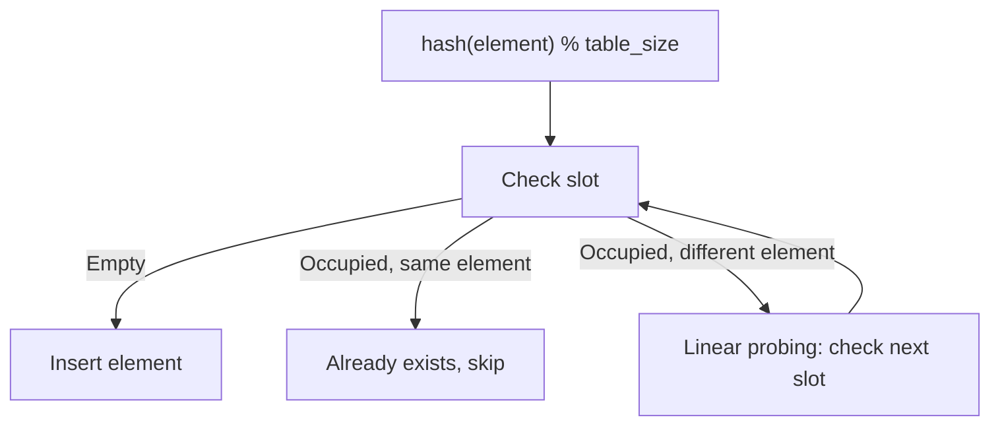
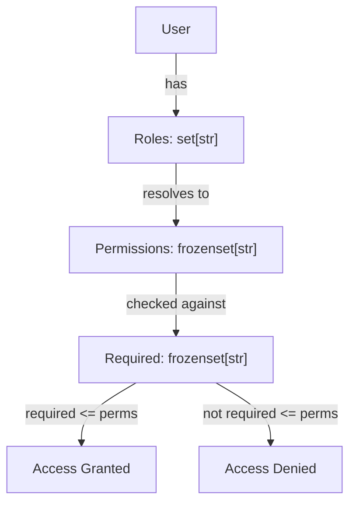

# Sets — Senior Level

## Table of Contents

1. [Introduction](#introduction)
2. [Architecture Patterns](#architecture-patterns)
3. [Advanced Set Techniques](#advanced-set-techniques)
4. [Benchmarks & Profiling](#benchmarks--profiling)
5. [Best Practices for Production](#best-practices-for-production)
6. [Memory Optimization](#memory-optimization)
7. [Concurrency & Thread Safety](#concurrency--thread-safety)
8. [Testing Strategies](#testing-strategies)
9. [Test](#test)
10. [Diagrams & Visual Aids](#diagrams--visual-aids)

---

## Introduction

> Focus: "How to optimize?" and "How to architect?"

At the senior level, you must understand when sets are the right architectural choice, how to profile their performance in production, thread safety concerns, and how to design systems that leverage set operations at scale. This level covers performance profiling, advanced patterns, and architectural decisions.

---

## Architecture Patterns

### Pattern 1: Event-Driven Permission System with Sets

```python
from __future__ import annotations
from dataclasses import dataclass, field
from typing import Callable, Protocol


class PermissionChecker(Protocol):
    def has_permissions(self, required: frozenset[str]) -> bool: ...


@dataclass(frozen=True)
class Permission:
    """Immutable permission with namespace."""
    namespace: str
    action: str

    def __str__(self) -> str:
        return f"{self.namespace}:{self.action}"


@dataclass
class PermissionRegistry:
    """Centralized permission registry with hierarchical resolution."""
    _hierarchy: dict[str, frozenset[str]] = field(default_factory=dict)
    _listeners: list[Callable[[str, frozenset[str]], None]] = field(
        default_factory=list
    )

    def register_role(self, role: str, permissions: frozenset[str]) -> None:
        self._hierarchy[role] = permissions
        for listener in self._listeners:
            listener(role, permissions)

    def resolve_permissions(self, roles: set[str]) -> frozenset[str]:
        """Resolve all permissions for a set of roles."""
        all_perms: set[str] = set()
        for role in roles:
            all_perms |= self._hierarchy.get(role, frozenset())
        return frozenset(all_perms)

    def check_access(
        self,
        user_roles: set[str],
        required: frozenset[str],
    ) -> bool:
        """Check if user roles grant all required permissions."""
        resolved = self.resolve_permissions(user_roles)
        return required <= resolved

    def on_change(self, callback: Callable[[str, frozenset[str]], None]) -> None:
        self._listeners.append(callback)


# Usage
registry = PermissionRegistry()
registry.register_role("admin", frozenset({"read", "write", "delete", "admin"}))
registry.register_role("editor", frozenset({"read", "write"}))

assert registry.check_access({"editor"}, frozenset({"read", "write"}))
assert not registry.check_access({"editor"}, frozenset({"delete"}))
```

### Pattern 2: Set-Based Feature Flag System

```python
from __future__ import annotations
import threading
from dataclasses import dataclass, field
from typing import Optional


@dataclass
class FeatureFlagService:
    """Thread-safe feature flag service using sets."""
    _global_flags: set[str] = field(default_factory=set)
    _user_flags: dict[str, set[str]] = field(default_factory=dict)
    _lock: threading.RLock = field(default_factory=threading.RLock)

    def enable_global(self, flag: str) -> None:
        with self._lock:
            self._global_flags.add(flag)

    def disable_global(self, flag: str) -> None:
        with self._lock:
            self._global_flags.discard(flag)

    def enable_for_user(self, user_id: str, flag: str) -> None:
        with self._lock:
            self._user_flags.setdefault(user_id, set()).add(flag)

    def is_enabled(self, flag: str, user_id: Optional[str] = None) -> bool:
        with self._lock:
            if flag in self._global_flags:
                return True
            if user_id:
                return flag in self._user_flags.get(user_id, set())
            return False

    def active_flags(self, user_id: str) -> frozenset[str]:
        """Get all active flags for a user (global + user-specific)."""
        with self._lock:
            user_specific = self._user_flags.get(user_id, set())
            return frozenset(self._global_flags | user_specific)
```

### Pattern 3: Dependency Resolver with Topological Sort

```python
from __future__ import annotations
from collections import defaultdict


class DependencyResolver:
    """Resolve dependency order using sets for visited/processing tracking."""

    def __init__(self) -> None:
        self._deps: dict[str, set[str]] = defaultdict(set)

    def add_dependency(self, item: str, depends_on: str) -> None:
        self._deps[item].add(depends_on)
        if depends_on not in self._deps:
            self._deps[depends_on] = set()

    def resolve(self) -> list[str]:
        """Topological sort — returns items in dependency order."""
        visited: set[str] = set()
        processing: set[str] = set()  # For cycle detection
        result: list[str] = []

        def dfs(node: str) -> None:
            if node in processing:
                raise ValueError(f"Circular dependency detected: {node}")
            if node in visited:
                return

            processing.add(node)
            for dep in self._deps.get(node, set()):
                dfs(dep)
            processing.discard(node)
            visited.add(node)
            result.append(node)

        for item in self._deps:
            dfs(item)

        return result


# Usage
resolver = DependencyResolver()
resolver.add_dependency("app", "database")
resolver.add_dependency("app", "cache")
resolver.add_dependency("database", "config")
resolver.add_dependency("cache", "config")
print(resolver.resolve())  # ['config', 'database', 'cache', 'app']
```

---

## Advanced Set Techniques

### Custom Hashable Container

```python
from __future__ import annotations
from typing import Iterator, Generic, TypeVar

T = TypeVar("T")


class ImmutableSet(Generic[T]):
    """A custom immutable set with caching and efficient comparison."""

    __slots__ = ("_data", "_hash_cache")

    def __init__(self, items: frozenset[T]) -> None:
        self._data = items
        self._hash_cache: int | None = None

    def __contains__(self, item: T) -> bool:
        return item in self._data

    def __iter__(self) -> Iterator[T]:
        return iter(self._data)

    def __len__(self) -> int:
        return len(self._data)

    def __hash__(self) -> int:
        if self._hash_cache is None:
            self._hash_cache = hash(self._data)
        return self._hash_cache

    def __eq__(self, other: object) -> bool:
        if not isinstance(other, ImmutableSet):
            return NotImplemented
        if hash(self) != hash(other):  # Fast rejection
            return False
        return self._data == other._data

    def __and__(self, other: ImmutableSet[T]) -> ImmutableSet[T]:
        return ImmutableSet(self._data & other._data)

    def __or__(self, other: ImmutableSet[T]) -> ImmutableSet[T]:
        return ImmutableSet(self._data | other._data)

    def __repr__(self) -> str:
        return f"ImmutableSet({self._data!r})"
```

### Bloom Filter (Probabilistic Set)

```python
import hashlib
import math
from typing import Any


class BloomFilter:
    """Space-efficient probabilistic set membership test.

    False positives are possible; false negatives are not.
    """

    def __init__(self, expected_items: int, fp_rate: float = 0.01) -> None:
        self.size = self._optimal_size(expected_items, fp_rate)
        self.hash_count = self._optimal_hashes(self.size, expected_items)
        self.bit_array = bytearray(self.size)
        self._count = 0

    @staticmethod
    def _optimal_size(n: int, p: float) -> int:
        return int(-n * math.log(p) / (math.log(2) ** 2))

    @staticmethod
    def _optimal_hashes(m: int, n: int) -> int:
        return max(1, int(m / n * math.log(2)))

    def _hashes(self, item: Any) -> list[int]:
        h = hashlib.sha256(str(item).encode()).hexdigest()
        return [int(h[i:i+8], 16) % self.size for i in range(0, 8 * self.hash_count, 8)]

    def add(self, item: Any) -> None:
        for idx in self._hashes(item):
            self.bit_array[idx] = 1
        self._count += 1

    def __contains__(self, item: Any) -> bool:
        return all(self.bit_array[idx] for idx in self._hashes(item))

    @property
    def estimated_fp_rate(self) -> float:
        if self._count == 0:
            return 0.0
        return (1 - math.exp(-self.hash_count * self._count / self.size)) ** self.hash_count


# Usage — track 1 million URLs in ~1.2 MB
bf = BloomFilter(expected_items=1_000_000, fp_rate=0.01)
bf.add("https://example.com")
print("https://example.com" in bf)    # True (definitely)
print("https://other.com" in bf)      # False (probably)
```

---

## Benchmarks & Profiling

### Comprehensive Benchmark Suite

```python
import timeit
import sys
from typing import Callable


def benchmark(name: str, func: Callable, number: int = 100_000) -> float:
    """Run a benchmark and return elapsed time."""
    elapsed = timeit.timeit(func, number=number)
    print(f"{name:40s} {elapsed:.4f}s ({number:,} iterations)")
    return elapsed


def run_benchmarks() -> None:
    """Compare set operations at different scales."""
    for size in [100, 10_000, 1_000_000]:
        print(f"\n{'='*60}")
        print(f"Size: {size:,}")
        print(f"{'='*60}")

        s = set(range(size))
        lst = list(range(size))
        target = size - 1  # Worst case for list

        n = max(1, 1_000_000 // size)

        benchmark(
            f"  set  'in' (worst case)",
            lambda: target in s,
            number=n,
        )
        benchmark(
            f"  list 'in' (worst case)",
            lambda: target in lst,
            number=n,
        )

        other = set(range(size // 2, size + size // 2))
        benchmark(
            f"  intersection",
            lambda: s & other,
            number=max(1, n // 10),
        )
        benchmark(
            f"  union",
            lambda: s | other,
            number=max(1, n // 10),
        )

        print(f"  Memory — set:  {sys.getsizeof(s):>12,} bytes")
        print(f"  Memory — list: {sys.getsizeof(lst):>12,} bytes")


if __name__ == "__main__":
    run_benchmarks()
```

### Profiling Set Operations with cProfile

```python
import cProfile
import pstats
from io import StringIO


def profile_set_operations() -> None:
    """Profile common set patterns."""
    data = [str(i) for i in range(100_000)]

    # Profile deduplication
    pr = cProfile.Profile()
    pr.enable()

    # Pattern 1: set() constructor
    unique = set(data)

    # Pattern 2: Intersection of large sets
    a = set(range(50_000))
    b = set(range(25_000, 75_000))
    common = a & b

    # Pattern 3: Iterative add
    result = set()
    for item in data:
        result.add(item)

    pr.disable()
    stream = StringIO()
    stats = pstats.Stats(pr, stream=stream).sort_stats("cumulative")
    stats.print_stats(10)
    print(stream.getvalue())


if __name__ == "__main__":
    profile_set_operations()
```

### Load Factor Analysis

```python
import sys


def analyze_set_growth() -> None:
    """Analyze how sets grow and resize."""
    s = set()
    prev_size = sys.getsizeof(s)
    print(f"{'Elements':>10} {'Memory (bytes)':>15} {'Bytes/elem':>12} {'Resized':>8}")

    for i in range(10_001):
        s.add(i)
        current_size = sys.getsizeof(s)
        resized = current_size != prev_size

        if resized or i in {0, 1, 2, 3, 4, 8, 16, 32, 64, 100, 1000, 10000}:
            per_elem = current_size / max(len(s), 1)
            print(f"{len(s):>10,} {current_size:>15,} {per_elem:>12.1f} {'  YES' if resized else ''}")

        prev_size = current_size


if __name__ == "__main__":
    analyze_set_growth()
```

---

## Best Practices for Production

### 1. Use Frozenset for Immutable Configuration

```python
# ❌ Mutable set can be accidentally modified
ALLOWED_ORIGINS = {"https://example.com", "https://api.example.com"}

# ✅ Frozenset prevents accidental mutation
ALLOWED_ORIGINS: frozenset[str] = frozenset({
    "https://example.com",
    "https://api.example.com",
})
```

### 2. Defensive Copies at API Boundaries

```python
class UserService:
    def __init__(self) -> None:
        self._active_sessions: set[str] = set()

    @property
    def active_sessions(self) -> frozenset[str]:
        """Return a frozen copy — callers cannot modify internal state."""
        return frozenset(self._active_sessions)

    def add_session(self, session_id: str) -> None:
        self._active_sessions.add(session_id)
```

### 3. Type-Safe Set Wrappers

```python
from __future__ import annotations
from typing import NewType, Set

UserId = NewType("UserId", int)
TagName = NewType("TagName", str)


def find_users_with_tags(
    user_tags: dict[UserId, set[TagName]],
    required_tags: frozenset[TagName],
) -> set[UserId]:
    """Find users who have ALL required tags."""
    return {
        uid
        for uid, tags in user_tags.items()
        if required_tags <= tags
    }
```

### 4. Logging Set Operations for Audit

```python
import logging
from functools import wraps
from typing import Callable, TypeVar

logger = logging.getLogger(__name__)
T = TypeVar("T")


def audit_set_change(operation_name: str):
    """Decorator to log set modifications."""
    def decorator(func: Callable) -> Callable:
        @wraps(func)
        def wrapper(self, *args, **kwargs):
            before = frozenset(self._data)
            result = func(self, *args, **kwargs)
            after = frozenset(self._data)
            added = after - before
            removed = before - after
            if added or removed:
                logger.info(
                    "%s: added=%s removed=%s",
                    operation_name,
                    added or "none",
                    removed or "none",
                )
            return result
        return wrapper
    return decorator
```

---

## Memory Optimization

### Set vs Dict for Membership Only

```python
import sys

n = 100_000

# Standard set
s = set(range(n))
print(f"set:         {sys.getsizeof(s):>12,} bytes")

# frozenset — same size but immutable
fs = frozenset(range(n))
print(f"frozenset:   {sys.getsizeof(fs):>12,} bytes")

# dict with None values — wastes memory
d = dict.fromkeys(range(n))
print(f"dict:        {sys.getsizeof(d):>12,} bytes")

# For large integer ranges, consider bitarray
from array import array
bits = array("b", [0] * n)
for i in range(n):
    bits[i] = 1
print(f"bitarray:    {sys.getsizeof(bits):>12,} bytes")
```

### Compact Integer Sets with Ranges

```python
class RangeSet:
    """Memory-efficient set for contiguous integer ranges."""

    def __init__(self) -> None:
        self._ranges: list[range] = []

    def add_range(self, start: int, stop: int) -> None:
        self._ranges.append(range(start, stop))

    def __contains__(self, item: int) -> bool:
        return any(item in r for r in self._ranges)

    def __len__(self) -> int:
        return sum(len(r) for r in self._ranges)


# Stores 1 million integers in a few bytes
rs = RangeSet()
rs.add_range(0, 1_000_000)
print(999_999 in rs)  # True
print(sys.getsizeof(rs._ranges))  # Tiny compared to a set of 1M integers
```

---

## Concurrency & Thread Safety

### Thread-Safe Set Wrapper

```python
import threading
from typing import TypeVar, Iterator, Generic

T = TypeVar("T")


class ThreadSafeSet(Generic[T]):
    """A thread-safe set implementation using RLock."""

    def __init__(self) -> None:
        self._data: set[T] = set()
        self._lock = threading.RLock()

    def add(self, item: T) -> None:
        with self._lock:
            self._data.add(item)

    def discard(self, item: T) -> None:
        with self._lock:
            self._data.discard(item)

    def __contains__(self, item: T) -> bool:
        with self._lock:
            return item in self._data

    def snapshot(self) -> frozenset[T]:
        """Return an immutable snapshot for safe iteration."""
        with self._lock:
            return frozenset(self._data)

    def __len__(self) -> int:
        with self._lock:
            return len(self._data)

    def update_atomic(self, to_add: set[T], to_remove: set[T]) -> None:
        """Atomically add and remove multiple elements."""
        with self._lock:
            self._data |= to_add
            self._data -= to_remove
```

### GIL Considerations

```python
"""
The GIL protects individual set operations (add, remove, in) from
data corruption, but NOT compound operations.

Safe under GIL (atomic):
    x in my_set
    my_set.add(x)

NOT safe (check-then-act race):
    if x not in my_set:  # another thread might add x here
        my_set.add(x)
        process(x)       # might process twice

Always use explicit locks for compound set operations.
"""
```

---

## Testing Strategies

### Property-Based Testing with Hypothesis

```python
from hypothesis import given, strategies as st


@given(st.frozensets(st.integers(min_value=-100, max_value=100)))
def test_set_union_identity(s):
    """Union with empty set returns the same set."""
    assert s | frozenset() == s
    assert frozenset() | s == s


@given(
    st.frozensets(st.integers()),
    st.frozensets(st.integers()),
)
def test_intersection_is_subset_of_both(a, b):
    """Intersection is always a subset of both operands."""
    result = a & b
    assert result <= a
    assert result <= b


@given(
    st.frozensets(st.integers()),
    st.frozensets(st.integers()),
)
def test_symmetric_difference_identity(a, b):
    """Symmetric difference equals union minus intersection."""
    assert a ^ b == (a | b) - (a & b)


@given(
    st.frozensets(st.integers()),
    st.frozensets(st.integers()),
    st.frozensets(st.integers()),
)
def test_union_associativity(a, b, c):
    """Union is associative."""
    assert (a | b) | c == a | (b | c)
```

### Parametrized Test for Set Operations

```python
import pytest


@pytest.mark.parametrize(
    "a, b, op, expected",
    [
        ({1, 2, 3}, {3, 4, 5}, "|", {1, 2, 3, 4, 5}),
        ({1, 2, 3}, {3, 4, 5}, "&", {3}),
        ({1, 2, 3}, {3, 4, 5}, "-", {1, 2}),
        ({1, 2, 3}, {3, 4, 5}, "^", {1, 2, 4, 5}),
        (set(), {1, 2}, "|", {1, 2}),
        (set(), {1, 2}, "&", set()),
        ({1}, {1}, "^", set()),
    ],
)
def test_set_operations(a, b, op, expected):
    ops = {"|": set.__or__, "&": set.__and__, "-": set.__sub__, "^": set.__xor__}
    assert ops[op](a, b) == expected


@pytest.mark.parametrize(
    "a, b, expected",
    [
        ({1, 2}, {1, 2, 3}, True),
        ({1, 2, 3}, {1, 2}, False),
        (set(), {1, 2, 3}, True),
        (set(), set(), True),
    ],
)
def test_subset(a, b, expected):
    assert a.issubset(b) == expected
    assert (a <= b) == expected
```

---

## Test

### Multiple Choice

**1. What is the time complexity of set intersection for sets of size m and n?**

- A) O(m + n)
- B) O(min(m, n))
- C) O(m * n)
- D) O(max(m, n))

<details>
<summary>Answer</summary>

**B)** — CPython iterates over the smaller set and checks membership in the larger one. Each membership check is O(1), so total is O(min(m, n)).
</details>

**2. What happens when you define `__eq__` without `__hash__` in Python 3?**

- A) Python auto-generates `__hash__`
- B) `__hash__` is set to `None`, making instances unhashable
- C) It raises a `SyntaxError`
- D) Hash uses `id()` by default

<details>
<summary>Answer</summary>

**B)** — In Python 3, defining `__eq__` without `__hash__` sets `__hash__ = None`, making the class unhashable. This prevents broken hash/eq contracts.
</details>

**3. Which is more memory-efficient for tracking 10 million integers in range [0, 10M)?**

- A) `set(range(10_000_000))`
- B) `bytearray(10_000_000)` as a bitmap
- C) `list(range(10_000_000))`
- D) `frozenset(range(10_000_000))`

<details>
<summary>Answer</summary>

**B)** — A bytearray uses 1 byte per slot (~10 MB). A set uses ~28 bytes per element (~280 MB). A bitarray (1 bit per slot) would be even better at ~1.25 MB.
</details>

**4. What is the output?**

```python
a = {1, 2, 3}
b = a.copy()
a.add(4)
print(a.issuperset(b))
```

<details>
<summary>Answer</summary>

Output: `True`

`b` is `{1, 2, 3}`, `a` is `{1, 2, 3, 4}`. `a` contains all elements of `b`, so it is a superset.
</details>

**5. In a multi-threaded Python program, is `my_set.add(x)` atomic?**

- A) Yes, always
- B) No, never
- C) Yes, due to the GIL, but compound operations are not
- D) Only for integer elements

<details>
<summary>Answer</summary>

**C)** — The GIL ensures single bytecode operations are atomic, so `set.add()` is safe. But check-then-act patterns (`if x not in s: s.add(x)`) are NOT atomic and require explicit locking.
</details>

**6. What does this print?**

```python
s = frozenset({frozenset({1, 2}), frozenset({3, 4})})
print(len(s))
print(frozenset({2, 1}) in s)
```

<details>
<summary>Answer</summary>

Output:
```
2
True
```

Frozensets are hashable and can be elements of other sets. `frozenset({2, 1}) == frozenset({1, 2})` because sets are unordered.
</details>

**7. What is the worst-case time complexity of `x in my_set`?**

- A) O(1)
- B) O(log n)
- C) O(n)
- D) O(n log n)

<details>
<summary>Answer</summary>

**C)** — If all elements hash to the same slot (pathological case), lookup degrades to O(n). Python's hash randomization (`PYTHONHASHSEED`) mitigates this in practice.
</details>

**8. Which pattern is NOT safe without locking in multi-threaded code?**

```python
# Pattern A
x in my_set

# Pattern B
my_set.add(x)

# Pattern C
if x not in my_set:
    my_set.add(x)
    do_something(x)

# Pattern D
my_set.discard(x)
```

<details>
<summary>Answer</summary>

**Pattern C** — This is a check-then-act race condition. Between `x not in my_set` and `my_set.add(x)`, another thread could add `x`.
</details>

**9. What is the output?**

```python
import sys
a = set()
b = frozenset()
print(sys.getsizeof(a) == sys.getsizeof(b))
```

<details>
<summary>Answer</summary>

Output: `False` (typically)

Empty `set` and `frozenset` have different internal structures. `set` reserves space for mutation; `frozenset` is more compact.
</details>

**10. Given sets A and B, which expression is equivalent to `A ^ B`?**

- A) `(A | B) - (A & B)`
- B) `(A - B) | (B - A)`
- C) Both A and B
- D) Neither

<details>
<summary>Answer</summary>

**C)** — Both expressions are mathematically equivalent to symmetric difference. `A ^ B` = elements in A or B but not both.
</details>

**11. What does this code print?**

```python
class Foo:
    def __init__(self, val):
        self.val = val
    def __hash__(self):
        return 1  # All instances hash to same slot
    def __eq__(self, other):
        return isinstance(other, Foo) and self.val == other.val

s = {Foo(i) for i in range(100)}
print(len(s))
```

<details>
<summary>Answer</summary>

Output: `100`

Even though all elements hash to the same slot (causing collisions), `__eq__` distinguishes them. The set contains 100 elements but lookup is O(n) due to collisions.
</details>

**12. What is the output?**

```python
a = {1, 2, 3}
b = {1, 2, 3}
print(a == b, a is b)
```

<details>
<summary>Answer</summary>

Output: `True False`

Equal in value but different objects in memory. Python does not intern set objects.
</details>

---

## Diagrams & Visual Aids

### Hash Table Collision Resolution



### Set Architecture in a Permission System



### Memory Layout of a Set

```
PySetObject:
+---------------------+
| ob_refcnt: Py_ssize |  Reference count
| ob_type: *PyTypeObj  |  Pointer to 'set' type
| fill: Py_ssize_t    |  Active + dummy entries
| used: Py_ssize_t    |  Active entries (len)
| mask: Py_ssize_t    |  table_size - 1
| table: *setentry    |  Pointer to hash table
| hash: Py_hash_t     |  Cached hash (frozenset)
| finger: Py_ssize_t  |  Search finger for pop()
| smalltable[8]       |  Inline table for small sets
+---------------------+

setentry:
+---------------------+
| hash: Py_hash_t     |  Cached hash value
| key: *PyObject      |  Pointer to element
+---------------------+
```
