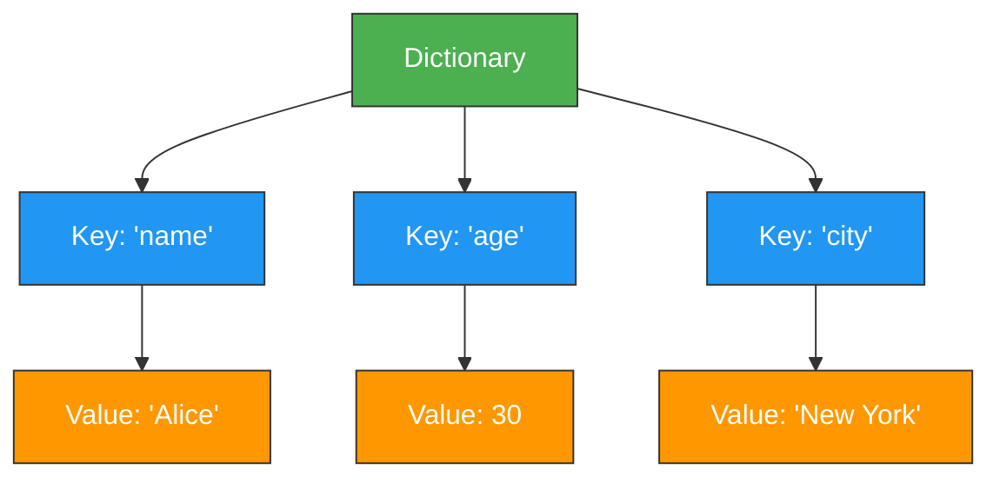
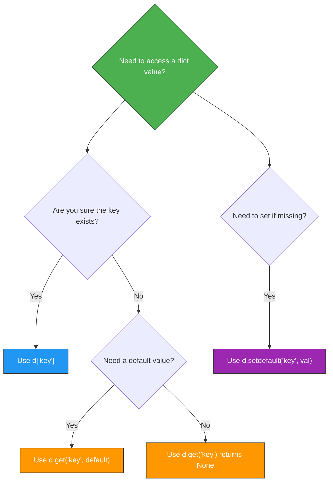
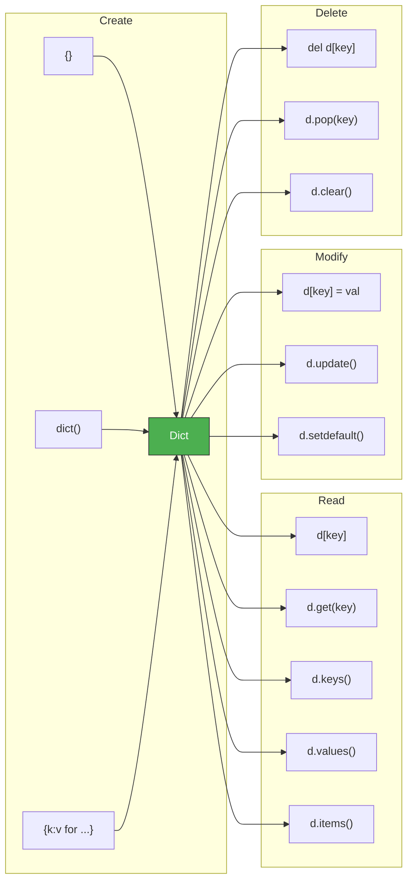

# Dictionaries — Junior Level

## Table of Contents

1. [Introduction](#introduction)
2. [Prerequisites](#prerequisites)
3. [Glossary](#glossary)
4. [Core Concepts](#core-concepts)
5. [Real-World Analogies](#real-world-analogies)
6. [Mental Models](#mental-models)
7. [Pros & Cons](#pros--cons)
8. [Use Cases](#use-cases)
9. [Code Examples](#code-examples)
10. [Clean Code](#clean-code)
11. [Product Use / Feature](#product-use--feature)
12. [Error Handling](#error-handling)
13. [Security Considerations](#security-considerations)
14. [Performance Tips](#performance-tips)
15. [Metrics & Analytics](#metrics--analytics)
16. [Best Practices](#best-practices)
17. [Edge Cases & Pitfalls](#edge-cases--pitfalls)
18. [Common Mistakes](#common-mistakes)
19. [Common Misconceptions](#common-misconceptions)
20. [Tricky Points](#tricky-points)
21. [Test](#test)
22. [Tricky Questions](#tricky-questions)
23. [Cheat Sheet](#cheat-sheet)
24. [Summary](#summary)
25. [What You Can Build](#what-you-can-build)
26. [Further Reading](#further-reading)
27. [Related Topics](#related-topics)
28. [Diagrams & Visual Aids](#diagrams--visual-aids)

---

## Introduction

> Focus: "What is it?" and "How to use it?"

A **dictionary** (`dict`) is Python's built-in mapping type that stores data as **key-value pairs**. Think of it like a real-world dictionary: you look up a word (key) and get its definition (value). Dictionaries provide O(1) average-time lookups, inserts, and deletes, making them one of the most powerful and frequently used data structures in Python. Since Python 3.7, dictionaries preserve insertion order.

---

## Prerequisites

What you should know before studying this topic:

- **Required:** Variables and Data Types — you need to understand basic Python types (int, str, float, bool)
- **Required:** Lists — dicts are often compared to lists and used together
- **Helpful but not required:** Loops — iterating over dicts uses `for` loop syntax
- **Helpful but not required:** Functions — many dict examples involve functions

---

## Glossary

| Term | Definition |
|------|-----------|
| **Dictionary (dict)** | An unordered (before 3.7) / insertion-ordered (3.7+) collection of key-value pairs |
| **Key** | The unique identifier used to access a value in a dict (must be hashable) |
| **Value** | The data associated with a key (can be any type) |
| **Key-Value Pair** | A single entry in a dict, like `"name": "Alice"` |
| **Hashable** | An object with a fixed hash value during its lifetime (e.g., str, int, tuple) |
| **Mapping** | A data structure that maps keys to values; dict is Python's main mapping type |
| **Dict Literal** | Creating a dict using curly braces: `{"key": "value"}` |
| **Dict Comprehension** | A concise way to create dicts: `{k: v for k, v in iterable}` |

---

## Core Concepts

### Concept 1: Creating Dictionaries

There are multiple ways to create a dictionary in Python:

```python
# Method 1: Dict literal (most common)
person = {"name": "Alice", "age": 30, "city": "New York"}

# Method 2: dict() constructor
person = dict(name="Alice", age=30, city="New York")

# Method 3: From a list of tuples
pairs = [("name", "Alice"), ("age", 30)]
person = dict(pairs)

# Method 4: Empty dict
empty = {}
also_empty = dict()

print(person)  # {'name': 'Alice', 'age': 30, 'city': 'New York'}
print(type(person))  # <class 'dict'>
```

### Concept 2: Accessing Values

You can access dict values using square brackets `[]` or the `.get()` method:

```python
user = {"name": "Bob", "age": 25, "email": "bob@example.com"}

# Square bracket access — raises KeyError if key missing
print(user["name"])   # Bob

# .get() method — returns None (or default) if key missing
print(user.get("name"))       # Bob
print(user.get("phone"))      # None
print(user.get("phone", "N/A"))  # N/A (default value)
```

### Concept 3: Adding and Modifying Values

```python
user = {"name": "Charlie"}

# Add a new key-value pair
user["age"] = 28
user["email"] = "charlie@example.com"

# Modify an existing value
user["age"] = 29

print(user)  # {'name': 'Charlie', 'age': 29, 'email': 'charlie@example.com'}
```

### Concept 4: Removing Items

```python
user = {"name": "Diana", "age": 30, "city": "London", "email": "diana@example.com"}

# del — removes a specific key (raises KeyError if missing)
del user["email"]

# pop() — removes and returns value (can set default)
age = user.pop("age")
print(age)  # 30

# pop() with default — no error if key missing
phone = user.pop("phone", "not found")
print(phone)  # not found

# popitem() — removes and returns last inserted pair (Python 3.7+)
last = user.popitem()
print(last)  # ('city', 'London')

# clear() — removes all items
user.clear()
print(user)  # {}
```

### Concept 5: Iterating Over Dictionaries

```python
scores = {"Alice": 95, "Bob": 87, "Charlie": 92}

# Iterate over keys (default)
for name in scores:
    print(name)

# Iterate over values
for score in scores.values():
    print(score)

# Iterate over key-value pairs
for name, score in scores.items():
    print(f"{name}: {score}")

# Iterate over keys explicitly
for key in scores.keys():
    print(key)
```

### Concept 6: Common Dict Methods

```python
config = {"host": "localhost", "port": 8080}

# keys(), values(), items()
print(list(config.keys()))    # ['host', 'port']
print(list(config.values()))  # ['localhost', 8080]
print(list(config.items()))   # [('host', 'localhost'), ('port', 8080)]

# update() — merge another dict
config.update({"port": 3000, "debug": True})
print(config)  # {'host': 'localhost', 'port': 3000, 'debug': True}

# setdefault() — get value or set default if missing
config.setdefault("timeout", 30)
print(config["timeout"])  # 30
config.setdefault("port", 9999)  # port already exists, not changed
print(config["port"])  # 3000

# copy() — shallow copy
backup = config.copy()
```

---

## Real-World Analogies

| Concept | Analogy |
|---------|--------|
| **Dictionary** | A real dictionary: look up a word (key) to find its definition (value) |
| **Key** | A locker number at school — each locker has a unique number that gives you access to its contents |
| **Key-Value Pair** | A contact in your phone — the name (key) maps to a phone number (value) |
| **Nested Dict** | A filing cabinet with folders inside folders — each level narrows down the search |

---

## Mental Models

**The intuition:** Think of a Python dictionary as a **phone book** — given a name (key), you can instantly find the phone number (value). You don't need to scan through every entry; you go directly to the right place.

**Why this model helps:** It explains why keys must be unique (two people can't share the same entry), why lookup is fast (you jump to the right page), and why keys must be immutable (if a name changed, you'd lose track of its entry).

---

## Pros & Cons

| Pros | Cons |
|------|------|
| O(1) average lookup, insert, delete | Uses more memory than lists or tuples |
| Keys provide meaningful access (vs. index) | Keys must be hashable (no lists or dicts as keys) |
| Preserves insertion order (3.7+) | Not ideal for ordered numeric sequences |
| Highly flexible value types | Slightly slower creation than lists |
| Built-in and optimized in CPython | No duplicate keys allowed |

### When to use:
- When you need to map labels/names to values
- When you need fast lookups by key
- When working with JSON data

### When NOT to use:
- When you need ordered numeric indexing (use a list)
- When you only need unique values without keys (use a set)
- When memory is extremely constrained and data is simple

---

## Use Cases

- **Use Case 1:** Storing user profiles — `{"name": "Alice", "age": 30, "role": "admin"}`
- **Use Case 2:** Counting word frequencies in a text
- **Use Case 3:** Configuration settings — `{"debug": True, "port": 8080}`
- **Use Case 4:** Caching/memoization — store computed results for reuse
- **Use Case 5:** JSON data handling — Python dicts map directly to JSON objects

---

## Code Examples

### Example 1: Word Frequency Counter

```python
def count_words(text: str) -> dict[str, int]:
    """Count the frequency of each word in a text."""
    words = text.lower().split()
    frequency = {}
    for word in words:
        frequency[word] = frequency.get(word, 0) + 1
    return frequency


text = "the cat sat on the mat the cat"
result = count_words(text)
print(result)
# {'the': 3, 'cat': 2, 'sat': 1, 'on': 1, 'mat': 1}
```

**What it does:** Counts how many times each word appears in a string.
**How to run:** `python word_counter.py`

### Example 2: Simple Phone Book

```python
def phone_book():
    """A simple interactive phone book using a dictionary."""
    contacts: dict[str, str] = {}

    # Add contacts
    contacts["Alice"] = "555-0101"
    contacts["Bob"] = "555-0102"
    contacts["Charlie"] = "555-0103"

    # Look up a contact
    name = "Bob"
    if name in contacts:
        print(f"{name}'s number: {contacts[name]}")
    else:
        print(f"{name} not found")

    # List all contacts
    print("\nAll contacts:")
    for name, phone in contacts.items():
        print(f"  {name}: {phone}")

    # Remove a contact
    removed = contacts.pop("Charlie", None)
    print(f"\nRemoved Charlie: {removed}")
    print(f"Remaining contacts: {len(contacts)}")


phone_book()
```

**What it does:** Demonstrates a basic phone book with add, lookup, list, and remove operations.
**How to run:** `python phone_book.py`

### Example 3: Dict Comprehension

```python
# Create a dict of squares
squares = {x: x ** 2 for x in range(1, 6)}
print(squares)  # {1: 1, 2: 4, 3: 9, 4: 16, 5: 25}

# Filter a dict — keep only passing scores
scores = {"Alice": 95, "Bob": 45, "Charlie": 72, "Diana": 38}
passing = {name: score for name, score in scores.items() if score >= 50}
print(passing)  # {'Alice': 95, 'Charlie': 72}

# Swap keys and values
inverted = {v: k for k, v in scores.items()}
print(inverted)  # {95: 'Alice', 45: 'Bob', 72: 'Charlie', 38: 'Diana'}
```

**What it does:** Shows how to create and filter dictionaries using comprehensions.

---

## Clean Code

### Naming (PEP 8 conventions)

```python
# Bad — unclear names
d = {"n": "Alice", "a": 30}
x = d["n"]

# Good — descriptive names
user_profile = {"name": "Alice", "age": 30}
user_name = user_profile["name"]
```

### Use `.get()` for safe access

```python
# Bad — crashes if key missing
def get_email(user: dict) -> str:
    return user["email"]  # KeyError if no "email"

# Good — safe with default
def get_email(user: dict) -> str:
    return user.get("email", "no-email@example.com")
```

---

## Product Use / Feature

### Feature: User Settings System

```python
DEFAULT_SETTINGS = {
    "theme": "light",
    "language": "en",
    "notifications": True,
    "font_size": 14,
}


def get_user_settings(user_prefs: dict) -> dict:
    """Merge user preferences with defaults."""
    settings = DEFAULT_SETTINGS.copy()
    settings.update(user_prefs)
    return settings


# User only overrides what they want
user_prefs = {"theme": "dark", "font_size": 18}
final = get_user_settings(user_prefs)
print(final)
# {'theme': 'dark', 'language': 'en', 'notifications': True, 'font_size': 18}
```

---

## Error Handling

```python
data = {"name": "Alice", "age": 30}

# KeyError — accessing missing key with []
try:
    print(data["email"])
except KeyError as e:
    print(f"Key not found: {e}")  # Key not found: 'email'

# TypeError — using unhashable key
try:
    bad_dict = {[1, 2]: "value"}  # Lists can't be keys
except TypeError as e:
    print(f"Type error: {e}")  # unhashable type: 'list'

# Safe patterns
email = data.get("email", "unknown")
print(email)  # unknown

# Check before access
if "email" in data:
    print(data["email"])
else:
    print("No email on file")
```

---

## Security Considerations

- **Never use user input as dict keys directly** in security-sensitive contexts without validation
- **Be careful with `eval()`** — never eval user-provided strings to create dicts
- **Avoid exposing internal dict structure** in API responses without filtering sensitive fields

```python
# Bad — exposes everything
user = {"name": "Alice", "password_hash": "abc123", "ssn": "123-45-6789"}
# return user  # Don't return the whole dict!

# Good — filter sensitive fields
SAFE_FIELDS = {"name", "email", "age"}

def safe_user_data(user: dict) -> dict:
    return {k: v for k, v in user.items() if k in SAFE_FIELDS}
```

---

## Performance Tips

- **Use `in` for membership testing** — `key in my_dict` is O(1)
- **Use `.get()` instead of try/except** for missing keys — it's cleaner and slightly faster
- **Pre-allocate with dict comprehension** instead of building in a loop when possible
- **Use `dict.fromkeys()`** to create dicts with default values efficiently

```python
# Fast membership check
config = {"debug": True, "port": 8080}
if "debug" in config:  # O(1)
    print("Debug mode")

# fromkeys for initialization
keys = ["a", "b", "c", "d"]
zeroed = dict.fromkeys(keys, 0)
print(zeroed)  # {'a': 0, 'b': 0, 'c': 0, 'd': 0}
```

---

## Metrics & Analytics

```python
import sys

# Memory usage of a dict
data = {i: i * 2 for i in range(100)}
print(f"Dict size: {sys.getsizeof(data)} bytes")  # ~4,704 bytes

# Compare to a list of tuples
pairs = [(i, i * 2) for i in range(100)]
print(f"List of tuples: {sys.getsizeof(pairs)} bytes")  # ~920 bytes (but O(n) lookup)

# len() for entry count
print(f"Number of entries: {len(data)}")  # 100
```

---

## Best Practices

1. **Use `.get()` for optional keys** — avoids KeyError
2. **Use dict comprehensions** for transformations — cleaner than loops
3. **Use meaningful key names** — `"user_name"` not `"un"`
4. **Use `in` to check membership** — `if key in my_dict` (not `if key in my_dict.keys()`)
5. **Use `dict.update()` or `|` (3.9+)** to merge dicts
6. **Don't modify a dict while iterating** — iterate over a copy or collect changes first

---

## Edge Cases & Pitfalls

```python
# Pitfall 1: {} creates an empty dict, not a set
empty = {}
print(type(empty))  # <class 'dict'>

# Pitfall 2: Mutable default argument
def add_item(item, registry={}):  # BAD — shared between calls!
    registry[item] = True
    return registry

print(add_item("a"))  # {'a': True}
print(add_item("b"))  # {'a': True, 'b': True} — 'a' persists!

# Fix: Use None as default
def add_item_fixed(item, registry=None):
    if registry is None:
        registry = {}
    registry[item] = True
    return registry

# Pitfall 3: Boolean and integer key collision
d = {True: "yes", 1: "one"}
print(d)  # {True: 'one'} — True == 1, so they are the same key!
```

---

## Common Mistakes

```python
# Mistake 1: Modifying dict during iteration
scores = {"Alice": 95, "Bob": 45, "Charlie": 72}
# for name, score in scores.items():
#     if score < 50:
#         del scores[name]  # RuntimeError!

# Fix: iterate over a copy
for name, score in list(scores.items()):
    if score < 50:
        del scores[name]
print(scores)  # {'Alice': 95, 'Charlie': 72}

# Mistake 2: Using [] on potentially missing key
data = {"name": "Alice"}
# print(data["age"])  # KeyError!
print(data.get("age", "unknown"))  # Safe

# Mistake 3: Forgetting dict keys must be hashable
# bad = {[1, 2]: "list key"}  # TypeError!
good = {(1, 2): "tuple key"}  # Tuples are hashable
```

---

## Common Misconceptions

| Misconception | Reality |
|---------------|---------|
| "Dicts are unordered" | Since Python 3.7, dicts preserve insertion order |
| "`{}` creates an empty set" | `{}` creates an empty dict; use `set()` for empty set |
| "Keys can be any type" | Keys must be hashable (no lists, no dicts, no sets) |
| "`.get()` is slower than `[]`" | `.get()` is negligibly slower; the safety is worth it |
| "Dicts use a lot of memory" | CPython dicts are heavily optimized; compact since 3.6 |

---

## Tricky Points

- **`True`, `1`, and `1.0` are the same key** — `hash(True) == hash(1) == hash(1.0)`
- **`dict.fromkeys()` shares mutable default values** — all keys reference the same object
- **Nested dict access** can chain KeyErrors — use nested `.get()` or `try/except`

```python
# fromkeys pitfall
d = dict.fromkeys(["a", "b", "c"], [])
d["a"].append(1)
print(d)  # {'a': [1], 'b': [1], 'c': [1]} — all share the same list!

# Fix: use dict comprehension
d = {k: [] for k in ["a", "b", "c"]}
d["a"].append(1)
print(d)  # {'a': [1], 'b': [], 'c': []}
```

---

## Test

### Questions

1. What is the time complexity of looking up a key in a Python dictionary?
2. What happens when you access a missing key with `[]`?
3. How do you create an empty dictionary?
4. What is the difference between `.get()` and `[]` access?
5. Can a list be used as a dictionary key? Why or why not?
6. What does `dict.pop("key", default)` return if the key exists?
7. Are Python 3.7+ dicts ordered or unordered?
8. What does `dict.setdefault(key, value)` do?
9. What is a dict comprehension?
10. What happens if you use `True` and `1` as separate keys?

<details>
<summary>Answers</summary>

1. **O(1)** average time complexity (hash table lookup).
2. It raises a **KeyError**.
3. `empty = {}` or `empty = dict()`.
4. `[]` raises KeyError on missing key; `.get()` returns `None` or a default value.
5. **No** — lists are unhashable (mutable), and dict keys must be hashable.
6. It returns the **value associated with the key** and removes the key from the dict.
7. **Ordered** — they preserve insertion order as a language specification since 3.7.
8. If key exists, returns its value. If not, inserts `key: value` and returns `value`.
9. A concise syntax to create dicts: `{k: v for k, v in iterable}`.
10. `True == 1` so they are treated as the **same key**; the last assigned value wins.

</details>

---

## Tricky Questions

**Q1:** What is the output?
```python
d = {}
d[1] = "one"
d[True] = "true"
d[1.0] = "float_one"
print(d)
```

<details>
<summary>Answer</summary>

```
{1: 'float_one'}
```
`1`, `True`, and `1.0` all have the same hash and are equal to each other, so they map to the same key. The key stays as the first inserted (`1`), but the value gets overwritten each time.

</details>

**Q2:** What is the output?
```python
a = {"x": 1, "y": 2}
b = a
b["z"] = 3
print(a)
```

<details>
<summary>Answer</summary>

```
{'x': 1, 'y': 2, 'z': 3}
```
`b = a` does **not** copy the dict. Both variables reference the same dict object.

</details>

**Q3:** What is the output?
```python
d = dict.fromkeys(["a", "b"], [])
d["a"].append(1)
print(d["b"])
```

<details>
<summary>Answer</summary>

```
[1]
```
`dict.fromkeys` assigns the **same list object** to all keys. Mutating one affects all.

</details>

---

## Cheat Sheet

```python
# Create
d = {"key": "value"}
d = dict(key="value")
d = dict([("key", "value")])
d = {k: v for k, v in pairs}
d = dict.fromkeys(["a", "b"], 0)

# Access
d["key"]               # KeyError if missing
d.get("key")           # None if missing
d.get("key", default)  # default if missing

# Add / Modify
d["new_key"] = value
d.update({"k1": v1, "k2": v2})
d.setdefault("key", default)

# Remove
del d["key"]           # KeyError if missing
d.pop("key")           # KeyError if missing
d.pop("key", default)  # default if missing
d.popitem()            # Remove last item (3.7+)
d.clear()              # Remove all

# Views
d.keys()               # dict_keys([...])
d.values()             # dict_values([...])
d.items()              # dict_items([(k, v), ...])

# Check
"key" in d             # True/False
len(d)                 # Number of items

# Copy
shallow = d.copy()
import copy
deep = copy.deepcopy(d)

# Merge (3.9+)
merged = d1 | d2
d1 |= d2               # In-place merge
```

---

## Summary

- Dictionaries store **key-value pairs** with O(1) average lookup
- Keys must be **hashable** (str, int, tuple); values can be anything
- Use `[]` for access when you're sure the key exists; use `.get()` for safe access
- Since Python 3.7, dicts **preserve insertion order**
- Common methods: `keys()`, `values()`, `items()`, `update()`, `pop()`, `setdefault()`
- Dict comprehensions offer concise creation: `{k: v for k, v in iterable}`
- Never modify a dict while iterating over it

---

## What You Can Build

- A **contact manager** — store and search for contacts by name
- A **word frequency analyzer** — count occurrences of each word in a document
- A **student grade tracker** — map student names to their grades
- A **simple cache** — store expensive computation results for reuse
- A **configuration loader** — read settings from files into a dict

---

## Further Reading

- [Python Docs: Dictionaries](https://docs.python.org/3/tutorial/datastructures.html#dictionaries)
- [Python Docs: dict type](https://docs.python.org/3/library/stdtypes.html#mapping-types-dict)
- [Real Python: Dictionaries in Python](https://realpython.com/python-dicts/)
- [PEP 584: Add Union Operators To dict](https://peps.python.org/pep-0584/)

---

## Related Topics

- **Lists** — ordered sequences accessed by numeric index
- **Sets** — unordered collections of unique values (like dict keys without values)
- **Tuples** — immutable sequences, often used as dict keys
- **collections.defaultdict** — dict subclass with automatic default values
- **collections.OrderedDict** — dict that remembers insertion order (pre-3.7 necessity)
- **collections.Counter** — dict subclass for counting hashable objects
- **JSON** — dicts map directly to JSON objects

---

## Diagrams & Visual Aids

### Diagram 1: Dictionary Structure



### Diagram 2: Dict Access Methods Decision Tree



### Diagram 3: Dict Operations Overview


