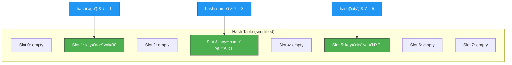
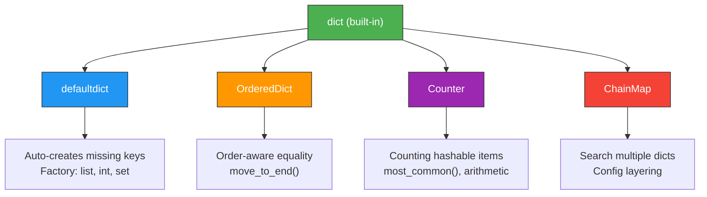
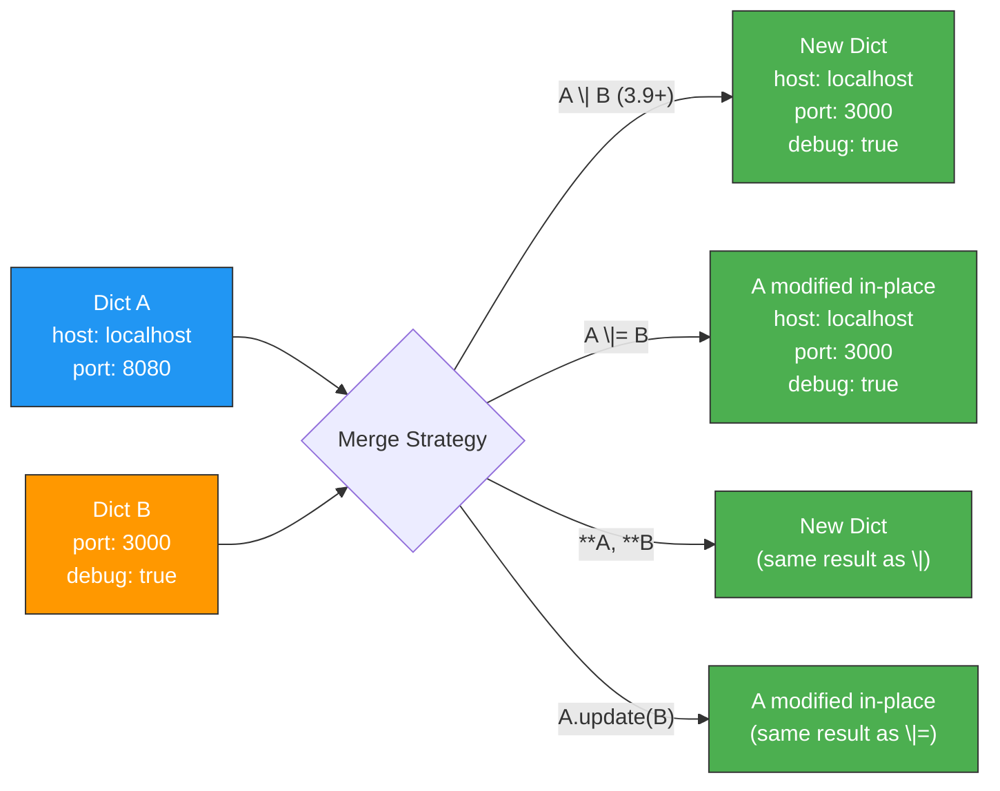

# Dictionaries — Middle Level

## Table of Contents

1. [Introduction](#introduction)
2. [Core Concepts](#core-concepts)
3. [Evolution & Historical Context](#evolution--historical-context)
4. [Pros & Cons](#pros--cons)
5. [Alternative Approaches](#alternative-approaches)
6. [Use Cases](#use-cases)
7. [Code Examples](#code-examples)
8. [Coding Patterns](#coding-patterns)
9. [Performance Optimization](#performance-optimization)
10. [Comparison with Other Languages](#comparison-with-other-languages)
11. [Debugging Guide](#debugging-guide)
12. [Best Practices](#best-practices)
13. [Edge Cases & Pitfalls](#edge-cases--pitfalls)
14. [Test](#test)
15. [Diagrams & Visual Aids](#diagrams--visual-aids)

---

## Introduction

> Focus: "Why?" and "When to use?"

This level goes beyond basic dict syntax. You will learn how dictionaries work internally (hash tables with open addressing), when to choose dicts over other data structures, advanced patterns like `defaultdict`, `Counter`, `OrderedDict`, dict merging operators, and production-level performance considerations with type hints and design patterns.

---

## Core Concepts

### Concept 1: Hash Table Internals

Dicts in CPython are implemented as hash tables with open addressing. When you insert a key, Python:
1. Computes `hash(key)`
2. Maps the hash to a slot index: `index = hash(key) & mask` (where mask = table_size - 1)
3. Handles collisions via probing (checking the next slot)

This is why:
- Lookup/insert/delete are O(1) amortized
- Keys must be hashable
- Memory usage is higher than plain arrays

```python
# Hash values determine storage location
print(hash("name"))    # Some integer
print(hash(42))        # 42 (ints hash to themselves for small values)
print(hash((1, 2)))    # Tuples are hashable

# These all hash the same — they are equal
print(hash(1) == hash(True) == hash(1.0))  # True
```

### Concept 2: The `__hash__` and `__eq__` Contract

For a custom object to be used as a dict key, it must implement both `__hash__` and `__eq__`:

```python
class Point:
    def __init__(self, x: int, y: int):
        self.x = x
        self.y = y

    def __hash__(self) -> int:
        return hash((self.x, self.y))

    def __eq__(self, other: object) -> bool:
        if not isinstance(other, Point):
            return NotImplemented
        return self.x == other.x and self.y == other.y

    def __repr__(self) -> str:
        return f"Point({self.x}, {self.y})"


# Now Point can be used as a dict key
distances: dict[Point, float] = {
    Point(0, 0): 0.0,
    Point(3, 4): 5.0,
    Point(1, 1): 1.414,
}
print(distances[Point(3, 4)])  # 5.0
```

**Contract rule:** If `a == b`, then `hash(a) == hash(b)`. The reverse is not required (collisions are allowed).

### Concept 3: `collections.defaultdict`

`defaultdict` auto-creates missing keys with a factory function, eliminating the need for `setdefault()` or `get()` patterns:

```python
from collections import defaultdict

# Group items by first letter
words = ["apple", "banana", "avocado", "blueberry", "cherry", "apricot"]

# Without defaultdict
groups_manual: dict[str, list[str]] = {}
for word in words:
    letter = word[0]
    if letter not in groups_manual:
        groups_manual[letter] = []
    groups_manual[letter].append(word)

# With defaultdict — much cleaner
groups: defaultdict[str, list[str]] = defaultdict(list)
for word in words:
    groups[word[0]].append(word)

print(dict(groups))
# {'a': ['apple', 'avocado', 'apricot'], 'b': ['banana', 'blueberry'], 'c': ['cherry']}
```

### Concept 4: `collections.Counter`

`Counter` is a dict subclass for counting hashable objects:

```python
from collections import Counter

# Count character frequencies
text = "mississippi"
freq = Counter(text)
print(freq)  # Counter({'s': 4, 'i': 4, 'p': 2, 'm': 1})

# Most common elements
print(freq.most_common(2))  # [('s', 4), ('i', 4)]

# Arithmetic with counters
a = Counter("aabbc")
b = Counter("abcdd")
print(a + b)   # Counter({'a': 3, 'b': 3, 'c': 2, 'd': 2})
print(a - b)   # Counter({'a': 1, 'b': 1}) — only positive counts
print(a & b)   # Counter({'a': 1, 'b': 1, 'c': 1}) — min of each
print(a | b)   # Counter({'a': 2, 'b': 2, 'd': 2, 'c': 1}) — max of each

# Count from any iterable
votes = ["yes", "no", "yes", "yes", "no", "abstain"]
result = Counter(votes)
print(result)  # Counter({'yes': 3, 'no': 2, 'abstain': 1})
```

### Concept 5: `collections.OrderedDict`

While regular dicts preserve insertion order since Python 3.7, `OrderedDict` has additional features:

```python
from collections import OrderedDict

# OrderedDict equality considers order; regular dict does not
d1 = {"a": 1, "b": 2}
d2 = {"b": 2, "a": 1}
print(d1 == d2)  # True — regular dicts ignore order for equality

od1 = OrderedDict(a=1, b=2)
od2 = OrderedDict(b=2, a=1)
print(od1 == od2)  # False — OrderedDict considers order

# move_to_end — useful for LRU caches
od = OrderedDict(a=1, b=2, c=3)
od.move_to_end("a")        # Move to end
print(list(od))             # ['b', 'c', 'a']
od.move_to_end("a", last=False)  # Move to beginning
print(list(od))             # ['a', 'b', 'c']
```

### Concept 6: Dict Merging (Python 3.9+)

```python
defaults = {"color": "blue", "size": "medium", "theme": "light"}
user_prefs = {"color": "red", "font": "Arial"}

# Merge operator | (creates new dict)
merged = defaults | user_prefs
print(merged)
# {'color': 'red', 'size': 'medium', 'theme': 'light', 'font': 'Arial'}

# In-place merge |=
defaults |= user_prefs
print(defaults)
# {'color': 'red', 'size': 'medium', 'theme': 'light', 'font': 'Arial'}

# Pre-3.9 alternatives
merged_old = {**defaults, **user_prefs}    # Unpacking
# or
merged_old2 = defaults.copy()
merged_old2.update(user_prefs)
```

### Concept 7: Dict Unpacking

```python
def create_user(name: str, age: int, email: str) -> dict:
    return {"name": name, "age": age, "email": email}


# Unpack dict as keyword arguments
user_data = {"name": "Alice", "age": 30, "email": "alice@example.com"}
user = create_user(**user_data)
print(user)

# Merge multiple dicts with unpacking
base = {"host": "localhost", "port": 8080}
overrides = {"port": 3000, "debug": True}
extra = {"timeout": 30}

config = {**base, **overrides, **extra}
print(config)
# {'host': 'localhost', 'port': 3000, 'debug': True, 'timeout': 30}
```

---

## Evolution & Historical Context

| Python Version | Dict Feature |
|:-:|---|
| 2.0 | Dict comprehensions via `dict()` on generator expressions |
| 2.7 / 3.0 | Dict comprehension syntax `{k: v for ...}` |
| 3.1 | `OrderedDict` added to `collections` |
| 3.6 | Compact dict implementation (CPython, insertion-ordered as implementation detail) |
| 3.7 | Insertion order preservation guaranteed by language spec |
| 3.8 | Walrus operator can be used with dict access |
| 3.9 | `|` and `|=` merge operators (PEP 584) |
| 3.10 | Structural pattern matching works with dicts |
| 3.12 | Per-interpreter GIL (affects dict thread safety) |

---

## Pros & Cons

| Pros | Cons |
|------|------|
| O(1) average lookup, insert, delete | Higher memory overhead than lists/tuples |
| Very flexible value types | Keys restricted to hashable types |
| Clean syntax with comprehensions | Hash collisions can degrade to O(n) worst case |
| Rich ecosystem (`defaultdict`, `Counter`, etc.) | Not thread-safe for concurrent mutations |
| Direct JSON mapping | `fromkeys()` shares mutable default values |

---

## Alternative Approaches

| Need | Use Instead of `dict` |
|------|----------------------|
| Counting items | `collections.Counter` |
| Auto-creating missing keys | `collections.defaultdict` |
| Order-aware equality | `collections.OrderedDict` |
| Immutable mapping | `types.MappingProxyType` |
| Named fields with dot access | `dataclasses.dataclass` or `typing.TypedDict` |
| Sorted keys | `sortedcontainers.SortedDict` (third-party) |

---

## Use Cases

- **Use Case 1:** API response handling — parse JSON into dicts, validate fields, merge with defaults
- **Use Case 2:** Caching / memoization — `functools.lru_cache` uses dicts internally
- **Use Case 3:** Graph representation — adjacency list: `{node: [neighbors]}`
- **Use Case 4:** Configuration management — layer defaults, environment, and user overrides
- **Use Case 5:** Database row mapping — map column names to values (like `cursor.fetchone()`)

---

## Code Examples

### Example 1: Nested Dict Processing (API Response)

```python
from typing import Any


def extract_user_info(api_response: dict[str, Any]) -> dict[str, Any]:
    """Safely extract user info from a nested API response."""
    user = api_response.get("data", {}).get("user", {})
    address = user.get("address", {})

    return {
        "name": user.get("name", "Unknown"),
        "email": user.get("email", ""),
        "city": address.get("city", ""),
        "country": address.get("country", "Unknown"),
        "verified": user.get("is_verified", False),
    }


response = {
    "status": 200,
    "data": {
        "user": {
            "name": "Alice",
            "email": "alice@example.com",
            "address": {"city": "London", "country": "UK"},
            "is_verified": True,
        }
    },
}

info = extract_user_info(response)
print(info)
# {'name': 'Alice', 'email': 'alice@example.com', 'city': 'London', 'country': 'UK', 'verified': True}

# Handles missing data gracefully
empty_response: dict[str, Any] = {"status": 404}
print(extract_user_info(empty_response))
# {'name': 'Unknown', 'email': '', 'city': '', 'country': 'Unknown', 'verified': False}
```

### Example 2: Graph with Adjacency Dict

```python
from collections import defaultdict, deque


def build_graph(edges: list[tuple[str, str]]) -> dict[str, list[str]]:
    """Build an adjacency list from edge pairs."""
    graph: defaultdict[str, list[str]] = defaultdict(list)
    for u, v in edges:
        graph[u].append(v)
        graph[v].append(u)  # Undirected graph
    return dict(graph)


def bfs(graph: dict[str, list[str]], start: str) -> list[str]:
    """Breadth-first search returning visited order."""
    visited: set[str] = set()
    queue: deque[str] = deque([start])
    order: list[str] = []

    while queue:
        node = queue.popleft()
        if node not in visited:
            visited.add(node)
            order.append(node)
            for neighbor in graph.get(node, []):
                if neighbor not in visited:
                    queue.append(neighbor)
    return order


edges = [("A", "B"), ("A", "C"), ("B", "D"), ("C", "D"), ("D", "E")]
graph = build_graph(edges)
print(graph)
# {'A': ['B', 'C'], 'B': ['A', 'D'], 'C': ['A', 'D'], 'D': ['B', 'C', 'E'], 'E': ['D']}
print(bfs(graph, "A"))
# ['A', 'B', 'C', 'D', 'E']
```

### Example 3: Configuration Layering with Merge

```python
import os
from typing import Any


def load_config(
    defaults: dict[str, Any],
    env_overrides: dict[str, Any] | None = None,
    cli_overrides: dict[str, Any] | None = None,
) -> dict[str, Any]:
    """Layer configuration: defaults < env < CLI."""
    config = defaults.copy()
    if env_overrides:
        config |= env_overrides
    if cli_overrides:
        config |= cli_overrides
    return config


defaults = {
    "host": "0.0.0.0",
    "port": 8080,
    "debug": False,
    "log_level": "INFO",
    "workers": 4,
}

env = {
    "port": int(os.environ.get("APP_PORT", 8080)),
    "debug": os.environ.get("APP_DEBUG", "").lower() == "true",
}

cli = {"log_level": "DEBUG"}

final_config = load_config(defaults, env, cli)
print(final_config)
# {'host': '0.0.0.0', 'port': 8080, 'debug': False, 'log_level': 'DEBUG', 'workers': 4}
```

---

## Coding Patterns

### Pattern 1: Grouping with `defaultdict`

```python
from collections import defaultdict


def group_by(items: list[dict], key: str) -> dict[str, list[dict]]:
    """Group list of dicts by a given key."""
    groups: defaultdict[str, list[dict]] = defaultdict(list)
    for item in items:
        groups[item[key]].append(item)
    return dict(groups)


employees = [
    {"name": "Alice", "dept": "Engineering"},
    {"name": "Bob", "dept": "Marketing"},
    {"name": "Charlie", "dept": "Engineering"},
    {"name": "Diana", "dept": "Marketing"},
    {"name": "Eve", "dept": "Engineering"},
]

by_dept = group_by(employees, "dept")
for dept, members in by_dept.items():
    print(f"{dept}: {[m['name'] for m in members]}")
# Engineering: ['Alice', 'Charlie', 'Eve']
# Marketing: ['Bob', 'Diana']
```

### Pattern 2: Dispatch Table (Strategy Pattern)

```python
from typing import Callable


def add(a: float, b: float) -> float:
    return a + b

def sub(a: float, b: float) -> float:
    return a - b

def mul(a: float, b: float) -> float:
    return a * b

def div(a: float, b: float) -> float:
    if b == 0:
        raise ValueError("Division by zero")
    return a / b


# Dict as dispatch table — replaces long if/elif chains
operations: dict[str, Callable[[float, float], float]] = {
    "+": add,
    "-": sub,
    "*": mul,
    "/": div,
}


def calculate(a: float, op: str, b: float) -> float:
    func = operations.get(op)
    if func is None:
        raise ValueError(f"Unknown operator: {op}")
    return func(a, b)


print(calculate(10, "+", 5))   # 15.0
print(calculate(10, "/", 3))   # 3.333...
```

### Pattern 3: Inverse/Bidirectional Mapping

```python
def create_bimap(mapping: dict) -> tuple[dict, dict]:
    """Create a bidirectional mapping (forward and reverse)."""
    forward = dict(mapping)
    reverse = {v: k for k, v in mapping.items()}
    return forward, reverse


http_codes = {200: "OK", 404: "Not Found", 500: "Internal Server Error"}
code_to_msg, msg_to_code = create_bimap(http_codes)

print(code_to_msg[404])         # Not Found
print(msg_to_code["OK"])        # 200
```

---

## Performance Optimization

### Benchmark: `get()` vs `try/except` vs `in` check

```python
import timeit

data = {i: i * 2 for i in range(10_000)}
missing_key = 99_999

# Method 1: .get()
def with_get():
    return data.get(missing_key, -1)

# Method 2: try/except
def with_try():
    try:
        return data[missing_key]
    except KeyError:
        return -1

# Method 3: in check
def with_in():
    if missing_key in data:
        return data[missing_key]
    return -1

n = 1_000_000
t1 = timeit.timeit(with_get, number=n)
t2 = timeit.timeit(with_try, number=n)
t3 = timeit.timeit(with_in, number=n)

print(f".get():      {t1:.3f}s")
print(f"try/except:  {t2:.3f}s")
print(f"in + []:     {t3:.3f}s")
# .get() is typically fastest for missing keys
# try/except is fastest when key usually exists (no exception overhead)
```

### When to use `setdefault` vs `defaultdict`

```python
import timeit
from collections import defaultdict

words = ["apple", "banana", "avocado", "blueberry"] * 10_000


def with_setdefault():
    groups: dict[str, list[str]] = {}
    for w in words:
        groups.setdefault(w[0], []).append(w)
    return groups


def with_defaultdict():
    groups: defaultdict[str, list[str]] = defaultdict(list)
    for w in words:
        groups[w[0]].append(w)
    return groups


t1 = timeit.timeit(with_setdefault, number=100)
t2 = timeit.timeit(with_defaultdict, number=100)

print(f"setdefault:  {t1:.3f}s")
print(f"defaultdict: {t2:.3f}s")
# defaultdict is typically 10-20% faster for this pattern
```

---

## Comparison with Other Languages

| Feature | Python `dict` | JavaScript `Object`/`Map` | Java `HashMap` | Go `map` |
|---------|:---:|:---:|:---:|:---:|
| Ordered | Yes (3.7+) | `Map`: Yes, `Object`: implementation-defined | No (`LinkedHashMap`: Yes) | No |
| Key types | Any hashable | `Map`: Any, `Object`: string/symbol | Any (with `hashCode`) | Comparable types |
| Null keys | Yes (`None`) | Yes | Yes (one `null`) | Yes (zero value) |
| Thread-safe | No | No | No (`ConcurrentHashMap`: Yes) | No (`sync.Map`: Yes) |
| Comprehension | `{k:v for ...}` | No native | No native | No native |
| Default values | `.get()`, `defaultdict` | `??`, `Map.get()` | `getOrDefault()` | Second return value |

---

## Debugging Guide

### Problem 1: KeyError in production

```python
import logging

logger = logging.getLogger(__name__)

def safe_dict_access(data: dict, path: list[str], default=None):
    """Safely navigate nested dict with dot-path logging."""
    current = data
    for i, key in enumerate(path):
        if not isinstance(current, dict):
            logger.warning(f"Expected dict at path {'.'.join(path[:i])}, got {type(current)}")
            return default
        if key not in current:
            logger.debug(f"Key '{key}' not found at path {'.'.join(path[:i+1])}")
            return default
        current = current[key]
    return current


# Usage
config = {"database": {"host": "localhost", "port": 5432}}
print(safe_dict_access(config, ["database", "host"]))    # localhost
print(safe_dict_access(config, ["database", "name"], "mydb"))  # mydb
```

### Problem 2: Unexpected mutation

```python
import copy

# Shallow copy pitfall
original = {"users": [{"name": "Alice"}]}
shallow = original.copy()
shallow["users"].append({"name": "Bob"})
print(original["users"])  # [{'name': 'Alice'}, {'name': 'Bob'}] — mutated!

# Fix: deep copy
original2 = {"users": [{"name": "Alice"}]}
deep = copy.deepcopy(original2)
deep["users"].append({"name": "Bob"})
print(original2["users"])  # [{'name': 'Alice'}] — safe!
```

---

## Best Practices

1. **Use type hints** — `dict[str, int]` or `dict[str, Any]` for clarity
2. **Prefer `defaultdict`** over manual `setdefault` / `if key not in` patterns
3. **Use `Counter`** for counting — don't reinvent the wheel
4. **Use `|` merge (3.9+)** — cleaner than `{**d1, **d2}` for simple merges
5. **Deep copy nested dicts** — `dict.copy()` is shallow and can cause bugs
6. **Use `TypedDict`** for dicts with fixed schemas — better IDE support and validation
7. **Avoid string keys that look like code** — use enums or constants instead
8. **Profile before optimizing** — dict operations are already very fast in CPython

---

## Edge Cases & Pitfalls

```python
# Pitfall 1: Mutable default in function args
def register(name: str, registry: dict = {}):  # BAD!
    registry[name] = True
    return registry

r1 = register("Alice")
r2 = register("Bob")
print(r1 is r2)  # True — same dict object!

# Pitfall 2: Dict views are live references
d = {"a": 1, "b": 2}
keys = d.keys()
d["c"] = 3
print(list(keys))  # ['a', 'b', 'c'] — keys view reflects changes!

# Pitfall 3: NaN as dict key
nan = float("nan")
d = {nan: "value"}
print(nan in d)     # True (by identity)
print(d[nan])       # "value"
# But NaN != NaN, so lookup works only by identity, not equality

# Pitfall 4: Dict size changes during iteration
d = {"a": 1, "b": 2, "c": 3}
# for k in d:
#     if d[k] < 3:
#         del d[k]  # RuntimeError: dictionary changed size during iteration

# Fix:
for k in list(d):
    if d[k] < 3:
        del d[k]
print(d)  # {'c': 3}
```

---

## Test

### Questions

1. What happens internally when you do `d["key"] = value` in CPython?
2. What is the difference between `dict.copy()` and `copy.deepcopy(dict)`?
3. When would you choose `defaultdict` over a regular dict?
4. How does `Counter` arithmetic work (`+`, `-`, `&`, `|`)?
5. What is the difference between `dict` and `OrderedDict` equality?
6. How do `|` and `|=` differ for dict merging?
7. What is the `__hash__`/`__eq__` contract for custom dict keys?
8. Why are dict views (`.keys()`, `.values()`, `.items()`) not lists?
9. How does `setdefault()` differ from `defaultdict`?
10. What happens if you unpack `(**d)` a dict into a function that does not accept those keyword args?

<details>
<summary>Answers</summary>

1. CPython computes `hash(key)`, maps it to a slot index, handles collisions via probing, and stores the key-value pair.
2. `copy()` is shallow — nested mutable objects are shared. `deepcopy()` recursively copies everything.
3. When you frequently need to initialize missing keys with a default type (list, int, set).
4. `+` sums counts, `-` subtracts (keeps only positive), `&` takes min, `|` takes max of each count.
5. Regular dict `==` ignores order; `OrderedDict ==` considers order when comparing two OrderedDicts.
6. `|` creates a new dict; `|=` modifies the left dict in place.
7. If `a == b`, then `hash(a)` must equal `hash(b)`. The reverse is not required.
8. Views are lazy, live references — they don't copy data and reflect changes to the original dict.
9. `setdefault` is a per-call method; `defaultdict` applies the factory to every missing key access automatically.
10. It raises `TypeError: unexpected keyword argument`.

</details>

---

## Diagrams & Visual Aids

### Diagram 1: Dict Internal Hash Table



### Diagram 2: collections Module Dict Variants



### Diagram 3: Dict Merge Strategies


