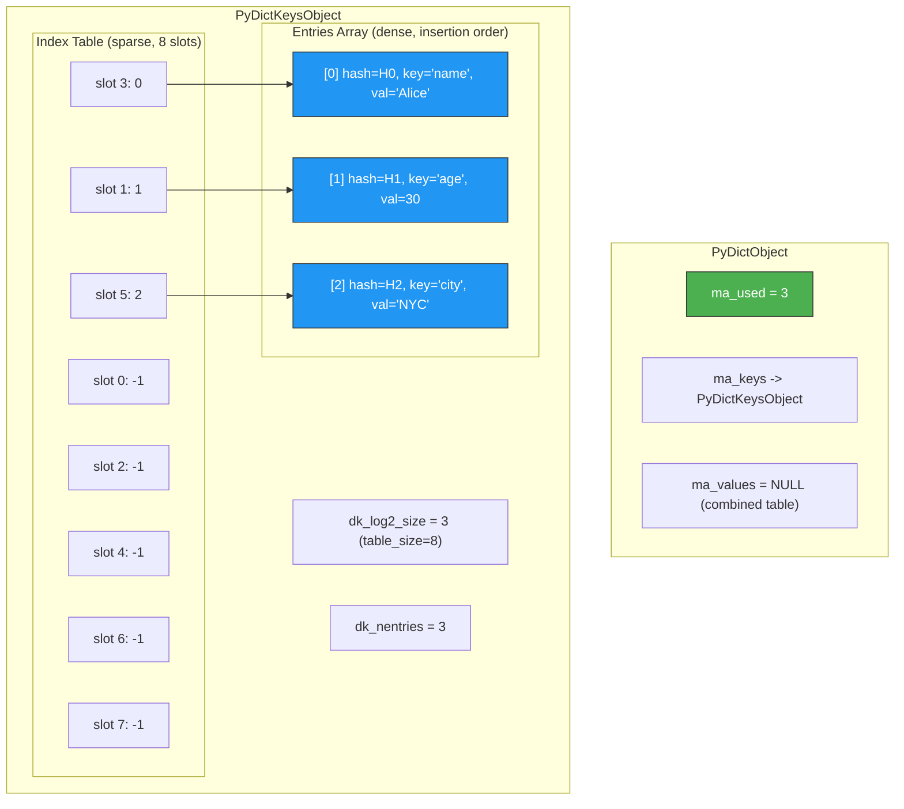
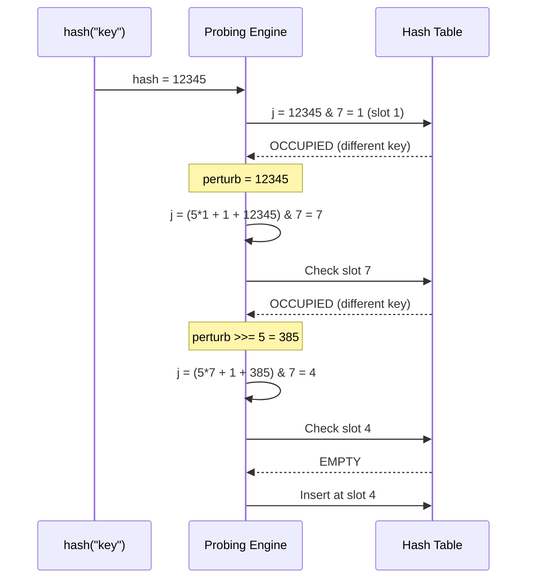
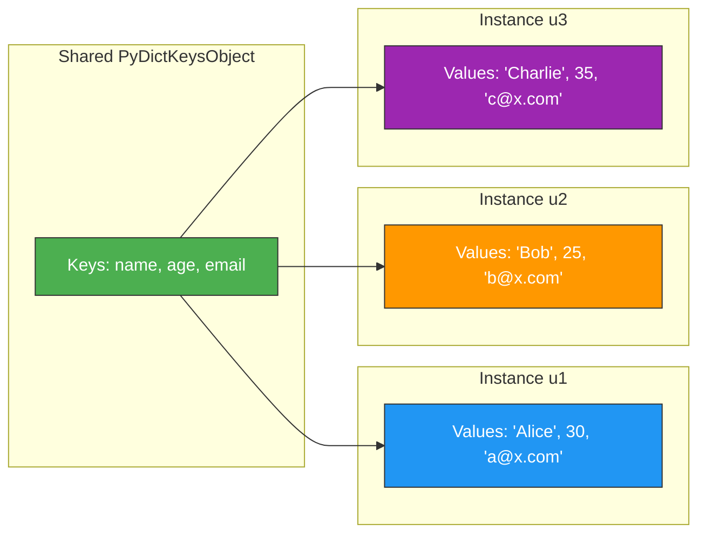

# Dictionaries — Professional Level

## Table of Contents

1. [Introduction](#introduction)
2. [CPython Dict Implementation](#cpython-dict-implementation)
3. [Hash Table Internals](#hash-table-internals)
4. [Compact Dict Layout](#compact-dict-layout)
5. [Hash Function Internals](#hash-function-internals)
6. [Collision Resolution](#collision-resolution)
7. [Resize Strategy](#resize-strategy)
8. [Bytecode Analysis](#bytecode-analysis)
9. [Memory Layout & Allocation](#memory-layout--allocation)
10. [GIL & Thread Safety Internals](#gil--thread-safety-internals)
11. [Key Sharing Dict (Split Table)](#key-sharing-dict-split-table)
12. [Diagrams & Visual Aids](#diagrams--visual-aids)

---

## Introduction

> Focus: "What happens under the hood?"

This level examines how CPython implements dictionaries at the C source level. We analyze the `PyDictObject` structure, the compact dict layout introduced in Python 3.6, the hash function for different types, open addressing with perturbation-based probing, the resize algorithm, bytecode generation for dict operations, key-sharing dicts for instance `__dict__`, and how the GIL interacts with dict mutations. Understanding these internals enables informed decisions about performance, memory, and correctness.

---

## CPython Dict Implementation

### Source Files

The CPython dict implementation lives in:
- **`Objects/dictobject.c`** — Core dict implementation (~5,000 lines of C)
- **`Include/cpython/dictobject.h`** — Dict object structure definition
- **`Objects/odictobject.c`** — OrderedDict implementation
- **`Lib/collections/__init__.py`** — `defaultdict`, `Counter`, `ChainMap`
- **`Python/ceval.c`** — Bytecode interpreter with dict opcodes

### PyDictObject Structure

```c
/* From Include/cpython/dictobject.h (simplified) */
typedef struct {
    PyObject_HEAD
    Py_ssize_t ma_used;        /* Number of items (== len(dict)) */
    uint64_t ma_version_tag;   /* Version counter for watchers */
    PyDictKeysObject *ma_keys; /* Pointer to keys table */
    PyObject **ma_values;      /* Pointer to values array (split table) or NULL */
} PyDictObject;

typedef struct {
    Py_ssize_t dk_refcnt;      /* Reference count for key sharing */
    uint8_t dk_log2_size;      /* Log2 of hash table size */
    uint8_t dk_log2_index_bytes; /* Log2 of index entry size */
    Py_ssize_t dk_nentries;    /* Number of used entries in dk_entries */
    Py_ssize_t dk_usable;      /* Remaining usable entries before resize */
    /* Variable-length index table follows */
    /* Variable-length entries array follows */
} PyDictKeysObject;

typedef struct {
    Py_hash_t me_hash;     /* Cached hash value */
    PyObject *me_key;      /* Key object */
    PyObject *me_value;    /* Value object (NULL for split table) */
} PyDictKeyEntry;
```

### Key Insight: Version Tag

```python
# The ma_version_tag increments on every dict modification
# Used by the specializing adaptive interpreter (PEP 659) for inline caching

import dis

def lookup_demo(d):
    return d["key"]

# Python 3.11+ generates LOAD_ATTR_DICT for known dict patterns
dis.dis(lookup_demo)
```

---

## Hash Table Internals

### Two-Table Architecture (Python 3.6+)

Before Python 3.6, dicts used a single sparse table. Since 3.6, CPython uses a **compact layout** with two arrays:

1. **Index table** (sparse): Maps hash slots to entry indices. Uses 1, 2, 4, or 8 bytes per entry depending on table size.
2. **Entries array** (dense): Stores `(hash, key, value)` tuples in insertion order.

```python
import sys

# Demonstrating compact dict behavior
d = {}
print(f"Empty dict: {sys.getsizeof(d)} bytes")

for i in range(1, 20):
    d[f"key_{i}"] = i
    size = sys.getsizeof(d)
    print(f"After {i:2d} inserts: {size:5d} bytes")
    # Notice jumps at resize thresholds
```

### Why Compact Layout is Better

```python
# Old layout (pre-3.6): Each slot stores (hash, key, value) or is empty
# For a table of size 8 with 3 entries, 5 slots are wasted
# Each slot = 24 bytes (hash + key_ptr + value_ptr) on 64-bit
# Total: 8 * 24 = 192 bytes (but only 3 used)

# New compact layout (3.6+):
# Index table: 8 * 1 byte = 8 bytes (just indices)
# Entries array: 3 * 24 bytes = 72 bytes (packed, no holes)
# Total: 8 + 72 = 80 bytes — significant savings!

# Additional benefit: entries array is in insertion order
# This is how dict preserves insertion order "for free"
```

---

## Compact Dict Layout

```python
# Visualizing the compact dict layout
def visualize_dict_structure(d: dict) -> None:
    """Show how CPython stores dict entries internally."""
    print(f"Dict: {d}")
    print(f"len(d) = {len(d)}")
    print(f"sys.getsizeof(d) = {sys.getsizeof(d)} bytes")
    print()

    # Entries are stored in insertion order
    print("Entries (insertion order):")
    for i, (k, v) in enumerate(d.items()):
        h = hash(k)
        print(f"  [{i}] hash={h:20d}  key={k!r:15s}  value={v!r}")

    print()
    # Index table maps hash -> entry index
    # table_size is always a power of 2
    table_size = 8  # minimum
    while table_size * 2 // 3 < len(d):
        table_size *= 2

    print(f"Index table (size={table_size}):")
    for slot in range(table_size):
        mask = table_size - 1
        for i, k in enumerate(d.keys()):
            if hash(k) & mask == slot:
                print(f"  slot[{slot}] -> entry[{i}] (key={k!r})")
                break
        else:
            print(f"  slot[{slot}] -> EMPTY")


import sys
visualize_dict_structure({"name": "Alice", "age": 30, "city": "NYC"})
```

---

## Hash Function Internals

### How Python Hashes Different Types

```python
# Integers: hash(n) == n for small values, modified for large
print(f"hash(0) = {hash(0)}")       # 0
print(f"hash(42) = {hash(42)}")     # 42
print(f"hash(-1) = {hash(-1)}")     # -2 (CPython avoids -1 as sentinel)
print(f"hash(2**61) = {hash(2**61)}")  # Different due to modular reduction

# Strings: SipHash (randomized per-process since 3.3)
import os
print(f"PYTHONHASHSEED = {os.environ.get('PYTHONHASHSEED', 'random')}")
print(f"hash('hello') = {hash('hello')}")  # Different each run!

# Tuples: hash based on contained elements
print(f"hash((1, 2, 3)) = {hash((1, 2, 3))}")

# Bool/int collision
print(f"hash(True) = {hash(True)}")   # 1
print(f"hash(1) = {hash(1)}")         # 1
print(f"hash(1.0) = {hash(1.0)}")     # 1
print(f"True == 1 == 1.0: {True == 1 == 1.0}")  # True
```

### SipHash for Strings

```c
/* CPython uses SipHash-1-3 (reduced rounds for speed) for strings.

   Key features:
   - Keyed hash: uses a random 128-bit key set at process startup
   - Prevents hash flooding DoS attacks (CVE-2012-1150)
   - PYTHONHASHSEED=0 disables randomization (for debugging only)

   The algorithm processes 8 bytes at a time with 4 state variables.
*/
```

```python
# Demonstrate hash randomization
import subprocess
import sys

for i in range(3):
    result = subprocess.run(
        [sys.executable, "-c", "print(hash('hello'))"],
        capture_output=True, text=True
    )
    print(f"Run {i+1}: hash('hello') = {result.stdout.strip()}")
# Each run produces a different hash value
```

---

## Collision Resolution

### Perturbation-Based Open Addressing

CPython does **not** use simple linear probing. It uses a perturbation-based scheme:

```c
/* From Objects/dictobject.c (simplified) */
/*
    j = hash & mask;           // Initial slot
    perturb = hash;

    while (slot_is_occupied) {
        j = (5 * j + 1 + perturb) & mask;
        perturb >>= 5;        // Shift perturb to mix in more hash bits
    }
*/
```

```python
def simulate_probing(hash_val: int, table_size: int, occupied: set[int]) -> list[int]:
    """Simulate CPython's perturbation-based probing sequence."""
    mask = table_size - 1
    j = hash_val & mask
    perturb = hash_val
    sequence = [j]

    while j in occupied:
        j = ((5 * j) + 1 + perturb) & mask
        perturb >>= 5
        sequence.append(j)

    return sequence


# Example: table_size=8, slots 3 and 5 occupied
table_size = 8
occupied = {3, 5}

for key_hash in [3, 11, 19, 27]:
    seq = simulate_probing(key_hash, table_size, occupied)
    print(f"hash={key_hash:3d}: probe sequence = {seq}")

# The perturbation ensures all hash bits are used, not just the low bits
# This prevents clustering that simple linear probing suffers from
```

### Why Perturbation Matters

```python
# Without perturbation: keys with same low bits cluster
# hash=3, hash=11, hash=19 all map to slot 3 (3 & 7 = 11 & 7 = 19 & 7 = 3)
# Linear probing: 3, 4, 5, 6, 7, 0, 1, 2 — predictable clustering
# Perturbation: 3, (5*3+1+11)>>... — uses upper hash bits for spread

# This is why Python dicts perform well even with hash collisions
# on the lower bits
```

---

## Resize Strategy

```python
def simulate_resize_thresholds(max_items: int = 200) -> None:
    """Show when CPython dicts resize."""
    # CPython resizes when used > 2/3 of table size
    # Minimum table size is 8
    # Table size is always a power of 2

    table_size = 8
    load_factor = 2 / 3

    print(f"{'Items':>6} | {'Table Size':>10} | {'Threshold':>9} | {'Action':>12}")
    print("-" * 45)

    for n in range(1, max_items + 1):
        threshold = int(table_size * load_factor)
        if n > threshold:
            # Resize: at least 2x, but 4x if small
            if table_size <= 50_000:
                table_size *= 2
            else:
                table_size *= 4
            threshold = int(table_size * load_factor)
            print(f"{n:6d} | {table_size:10d} | {threshold:9d} | RESIZE")
        elif n == 1 or n % 50 == 0:
            print(f"{n:6d} | {table_size:10d} | {threshold:9d} |")


simulate_resize_thresholds(200)
```

```python
import sys

# Observe resize jumps in practice
d = {}
prev_size = sys.getsizeof(d)
for i in range(100):
    d[i] = i
    curr_size = sys.getsizeof(d)
    if curr_size != prev_size:
        print(f"After {i+1:3d} items: {prev_size} -> {curr_size} bytes (grew {curr_size/prev_size:.1f}x)")
        prev_size = curr_size
```

---

## Bytecode Analysis

### Dict Creation Bytecodes

```python
import dis

# Dict literal
def create_literal():
    return {"a": 1, "b": 2, "c": 3}

print("=== Dict Literal ===")
dis.dis(create_literal)
# BUILD_MAP or BUILD_CONST_KEY_MAP (optimized for constant keys)

# Dict comprehension
def create_comprehension():
    return {k: v for k, v in [("a", 1), ("b", 2)]}

print("\n=== Dict Comprehension ===")
dis.dis(create_comprehension)
# MAKE_FUNCTION + CALL for the inner comprehension

# Dict constructor
def create_constructor():
    return dict(a=1, b=2, c=3)

print("\n=== Dict Constructor ===")
dis.dis(create_constructor)
# CALL with keyword arguments — slower than literal!
```

### Dict Access Bytecodes

```python
import dis

def access_patterns(d):
    # Subscript access
    x = d["key"]        # BINARY_SUBSCR
    # .get() access
    y = d.get("key")    # LOAD_ATTR + CALL
    # 'in' check
    z = "key" in d      # CONTAINS_OP
    return x, y, z

print("=== Access Patterns ===")
dis.dis(access_patterns)
```

### Specialized Opcodes (Python 3.11+)

```python
import dis
import sys

print(f"Python version: {sys.version}")

def specialize_demo():
    d = {"x": 1, "y": 2}
    # Python 3.11+ specializes BINARY_SUBSCR to BINARY_SUBSCR_DICT
    return d["x"]

print("=== Specialization ===")
dis.dis(specialize_demo)
# In 3.11+: BINARY_SUBSCR is adaptively specialized to
# BINARY_SUBSCR_DICT when the operand is always a dict
```

---

## Memory Layout & Allocation

### Detailed Memory Breakdown

```python
import sys
import ctypes


def analyze_dict_memory(d: dict) -> None:
    """Detailed memory analysis of a dict object."""
    obj_size = sys.getsizeof(d)
    obj_id = id(d)

    print(f"Dict: {d}")
    print(f"  id: {obj_id}")
    print(f"  sys.getsizeof: {obj_size} bytes")
    print(f"  len: {len(d)}")
    print(f"  refcount: {sys.getrefcount(d) - 1}")

    # PyDictObject base size (without table):
    # PyObject_HEAD (16 bytes on 64-bit) + ma_used (8) + ma_version_tag (8)
    # + ma_keys (8) + ma_values (8) = 48 bytes
    base_size = 48
    table_size = obj_size - base_size
    print(f"  Base struct: ~{base_size} bytes")
    print(f"  Table data: ~{table_size} bytes")

    if len(d) > 0:
        # Estimate: each entry = hash(8) + key_ptr(8) + value_ptr(8) = 24 bytes
        # Plus index table entries
        entry_bytes = len(d) * 24
        index_bytes = table_size - entry_bytes
        print(f"  Entries: ~{entry_bytes} bytes ({len(d)} x 24)")
        print(f"  Index table: ~{max(0, index_bytes)} bytes")


analyze_dict_memory({})
print()
analyze_dict_memory({"a": 1, "b": 2, "c": 3})
print()
analyze_dict_memory({i: i for i in range(100)})
```

### PyMalloc vs System Malloc

```python
# CPython uses PyMalloc for small objects (< 512 bytes)
# Dict objects themselves are allocated from PyMalloc
# Large hash tables fall back to system malloc (PyMem_Malloc)

# The PyMalloc arena structure:
# Arena (256 KB) -> Pool (4 KB) -> Block (8, 16, 24, ..., 512 bytes)

import sys

sizes = [0, 1, 5, 10, 50, 100, 500, 1000, 5000]
for n in sizes:
    d = {i: i for i in range(n)}
    size = sys.getsizeof(d)
    allocator = "PyMalloc" if size < 512 else "system malloc (likely)"
    print(f"n={n:5d}: {size:8d} bytes -> {allocator}")
```

---

## GIL & Thread Safety Internals

### What the GIL Protects (and What It Doesn't)

```python
import dis


def demonstrate_non_atomic():
    """Show that d[k] += 1 is NOT atomic even with the GIL."""
    d = {"count": 0}
    d["count"] += 1

dis.dis(demonstrate_non_atomic)
# The += operation compiles to multiple bytecodes:
# 1. BINARY_SUBSCR  (read d["count"])    <- GIL can release here
# 2. LOAD_CONST 1
# 3. BINARY_OP +=
# 4. STORE_SUBSCR   (write d["count"])
# Between steps 1 and 4, another thread can read the old value
```

### When Does the GIL Release?

```python
# The GIL is released:
# 1. Every N bytecodes (sys.getswitchinterval(), default 5ms)
# 2. During I/O operations
# 3. During C extensions that release it explicitly

import sys
print(f"Switch interval: {sys.getswitchinterval()}s")

# This means ANY multi-bytecode dict operation can be interrupted:
# - d[k] += 1  (read + compute + write)
# - d.update(other)  (multiple insertions, but single C call = atomic)
# - d.pop(k)  (single C call = atomic for the operation itself)

# Safe single-bytecode operations (atomic due to GIL):
# - d[k] = v           (STORE_SUBSCR — single bytecode)
# - x = d[k]           (BINARY_SUBSCR — single bytecode)
# - k in d             (CONTAINS_OP — single bytecode)
# - del d[k]           (DELETE_SUBSCR — single bytecode)
```

### Dict Version Tag and Watchers

```python
# Python 3.12+ introduced dict watchers (PEP 689)
# Used by the specializing interpreter to invalidate inline caches

# The ma_version_tag is a uint64_t that increments on every mutation
# When a function is specialized to assume d["key"] is at a certain slot,
# the version tag is checked; if changed, the specialization is invalidated

# This is why global dict modifications can impact performance:
# every modification increments the version tag, potentially
# invalidating cached attribute lookups across the interpreter

# You can observe this effect:
import sys

def tight_loop(d, key, n):
    """Accessing same key in tight loop — benefits from specialization."""
    total = 0
    for _ in range(n):
        total += d[key]
    return total

d = {"x": 1}
import timeit
t = timeit.timeit(lambda: tight_loop(d, "x", 100_000), number=10)
print(f"Specialized loop: {t:.4f}s")
```

---

## Key Sharing Dict (Split Table)

### Instance `__dict__` Optimization

```python
import sys


class User:
    def __init__(self, name: str, age: int, email: str):
        self.name = name
        self.age = age
        self.email = email


# CPython uses "split table" (key-sharing) dicts for instance __dict__
# All instances of the same class share the SAME keys object
# Only the values array is per-instance

u1 = User("Alice", 30, "alice@x.com")
u2 = User("Bob", 25, "bob@x.com")
u3 = User("Charlie", 35, "charlie@x.com")

print(f"u1.__dict__: {sys.getsizeof(u1.__dict__)} bytes")
print(f"u2.__dict__: {sys.getsizeof(u2.__dict__)} bytes")

# Key sharing breaks when instances get different attributes
u1.extra = "custom"
print(f"u1.__dict__ after adding 'extra': {sys.getsizeof(u1.__dict__)} bytes")
# May increase — split table converted to combined table

# This is why __slots__ saves even more memory — no __dict__ at all
class UserSlots:
    __slots__ = ("name", "age", "email")
    def __init__(self, name: str, age: int, email: str):
        self.name = name
        self.age = age
        self.email = email

u_slots = UserSlots("Alice", 30, "alice@x.com")
print(f"UserSlots instance: {sys.getsizeof(u_slots)} bytes (no __dict__)")
# hasattr(u_slots, '__dict__') is False
```

### When Split Table Breaks

```python
import sys


class Config:
    def __init__(self):
        self.host = "localhost"
        self.port = 8080


# All Config instances share keys
c1 = Config()
c2 = Config()

# Adding attribute to one instance breaks key sharing for that instance
c1.debug = True  # c1 now has a combined (non-shared) table

# Deleting an attribute also breaks key sharing
c3 = Config()
del c3.port  # c3 now has a combined table

# Best practice: set all attributes in __init__ and don't add/remove later
# This maximizes key sharing and memory efficiency
```

---

## Diagrams & Visual Aids

### Diagram 1: Compact Dict Layout (Two-Table Architecture)



### Diagram 2: Collision Resolution with Perturbation



### Diagram 3: Key Sharing (Split Table) for Instances


