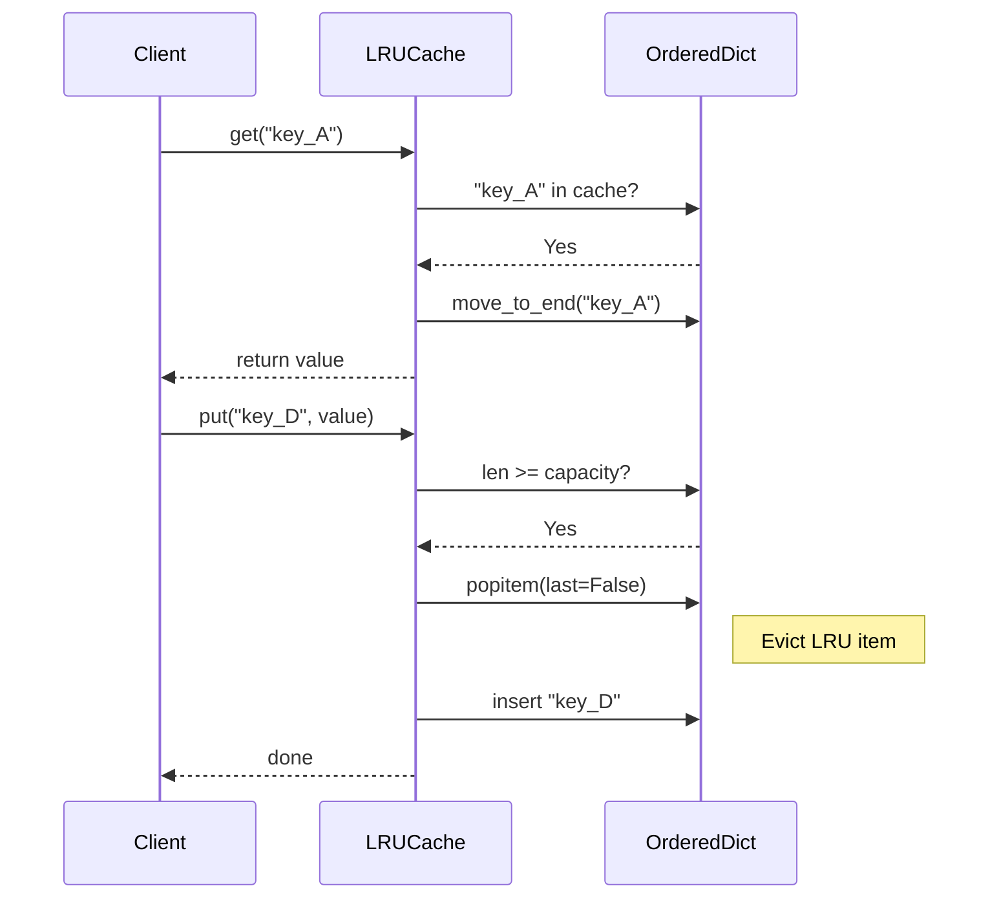
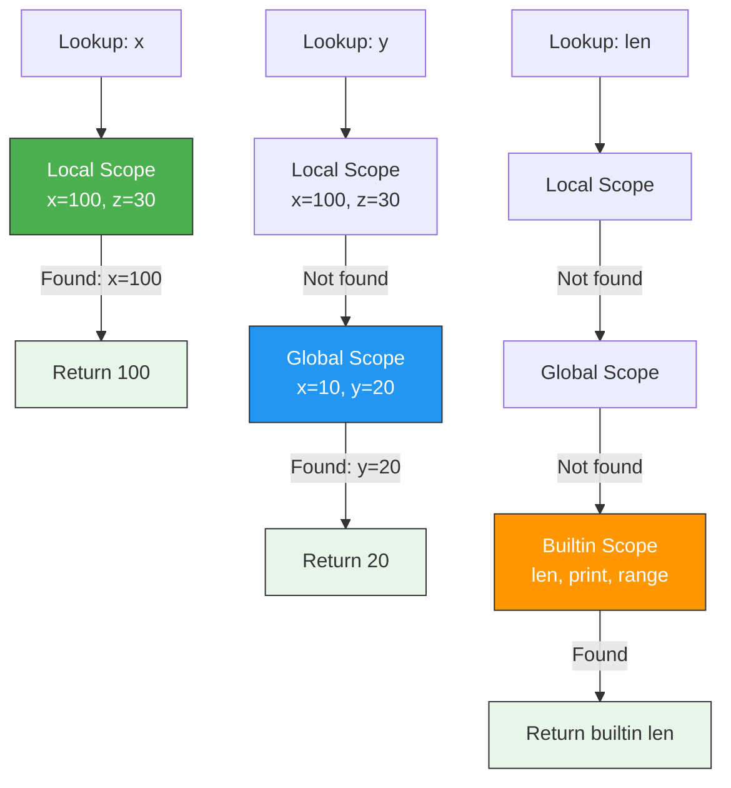
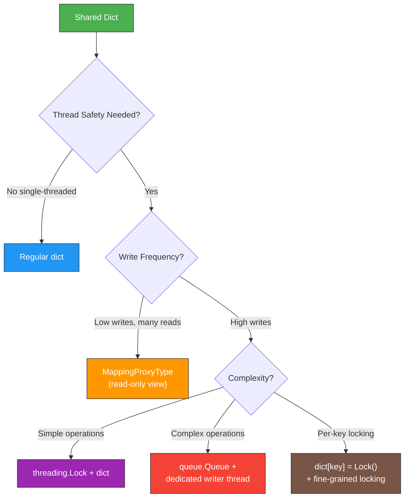

# Dictionaries — Senior Level

## Table of Contents

1. [Introduction](#introduction)
2. [Architecture Patterns](#architecture-patterns)
3. [Advanced Dict Techniques](#advanced-dict-techniques)
4. [Benchmarks & Profiling](#benchmarks--profiling)
5. [Best Practices for Production](#best-practices-for-production)
6. [Memory Optimization](#memory-optimization)
7. [Concurrency & Thread Safety](#concurrency--thread-safety)
8. [Testing Strategies](#testing-strategies)
9. [Test](#test)
10. [Diagrams & Visual Aids](#diagrams--visual-aids)

---

## Introduction

> Focus: "How to optimize?" and "How to architect?"

At the senior level, you must understand when dicts are the right architectural choice, how to profile their performance in production, thread safety concerns, and how to design systems that leverage dict operations at scale. This level covers advanced patterns like `ChainMap`, `MappingProxyType`, `TypedDict`, custom dict subclasses, memory profiling, concurrent dict access, and architectural decisions for large-scale applications.

---

## Architecture Patterns

### Pattern 1: Registry Pattern with Dict

```python
from __future__ import annotations
from typing import Callable, TypeVar, Any
from functools import wraps

T = TypeVar("T")


class ServiceRegistry:
    """A dict-based service registry for dependency injection."""

    def __init__(self) -> None:
        self._services: dict[str, Callable[..., Any]] = {}
        self._singletons: dict[str, Any] = {}

    def register(
        self, name: str, factory: Callable[..., Any], singleton: bool = False
    ) -> None:
        self._services[name] = (factory, singleton)

    def get(self, name: str, **kwargs: Any) -> Any:
        if name not in self._services:
            raise KeyError(f"Service '{name}' not registered")

        factory, is_singleton = self._services[name]

        if is_singleton:
            if name not in self._singletons:
                self._singletons[name] = factory(**kwargs)
            return self._singletons[name]

        return factory(**kwargs)

    def decorator(
        self, name: str, singleton: bool = False
    ) -> Callable[[Callable[..., T]], Callable[..., T]]:
        def wrapper(func: Callable[..., T]) -> Callable[..., T]:
            self.register(name, func, singleton)
            return func
        return wrapper


# Usage
registry = ServiceRegistry()


@registry.decorator("db_connection", singleton=True)
def create_db_connection(host: str = "localhost", port: int = 5432):
    print(f"Connecting to {host}:{port}")
    return {"host": host, "port": port, "connected": True}


@registry.decorator("logger")
def create_logger(name: str = "app"):
    return {"logger_name": name, "level": "INFO"}


# Same connection instance (singleton)
conn1 = registry.get("db_connection", host="prod-db", port=5432)
conn2 = registry.get("db_connection")
print(conn1 is conn2)  # True

# New logger each time
log1 = registry.get("logger", name="auth")
log2 = registry.get("logger", name="api")
print(log1 is log2)  # False
```

### Pattern 2: LRU Cache with OrderedDict

```python
from collections import OrderedDict
from typing import TypeVar, Generic, Hashable

K = TypeVar("K", bound=Hashable)
V = TypeVar("V")


class LRUCache(Generic[K, V]):
    """Thread-unsafe LRU cache using OrderedDict."""

    def __init__(self, capacity: int) -> None:
        self._capacity = capacity
        self._cache: OrderedDict[K, V] = OrderedDict()
        self._hits = 0
        self._misses = 0

    def get(self, key: K) -> V | None:
        if key in self._cache:
            self._hits += 1
            self._cache.move_to_end(key)
            return self._cache[key]
        self._misses += 1
        return None

    def put(self, key: K, value: V) -> None:
        if key in self._cache:
            self._cache.move_to_end(key)
            self._cache[key] = value
        else:
            if len(self._cache) >= self._capacity:
                self._cache.popitem(last=False)  # Remove least recently used
            self._cache[key] = value

    @property
    def hit_rate(self) -> float:
        total = self._hits + self._misses
        return self._hits / total if total > 0 else 0.0

    def __repr__(self) -> str:
        return (
            f"LRUCache(capacity={self._capacity}, size={len(self._cache)}, "
            f"hit_rate={self.hit_rate:.2%})"
        )


# Usage
cache: LRUCache[str, int] = LRUCache(capacity=3)
cache.put("a", 1)
cache.put("b", 2)
cache.put("c", 3)
print(cache.get("a"))  # 1 (moves 'a' to end)
cache.put("d", 4)      # Evicts 'b' (least recently used)
print(cache.get("b"))   # None (evicted)
print(cache)            # LRUCache(capacity=3, size=3, hit_rate=50.00%)
```

### Pattern 3: Immutable Config with MappingProxyType

```python
from types import MappingProxyType
from typing import Any


def load_config(overrides: dict[str, Any] | None = None) -> MappingProxyType:
    """Load configuration and return a read-only view."""
    defaults: dict[str, Any] = {
        "database": {
            "host": "localhost",
            "port": 5432,
            "name": "myapp",
            "pool_size": 10,
        },
        "cache": {
            "backend": "redis",
            "ttl": 3600,
        },
        "debug": False,
    }

    if overrides:
        # Deep merge
        for key, value in overrides.items():
            if isinstance(value, dict) and isinstance(defaults.get(key), dict):
                defaults[key].update(value)
            else:
                defaults[key] = value

    return MappingProxyType(defaults)


config = load_config({"debug": True, "database": {"host": "prod-db"}})
print(config["debug"])                # True
print(config["database"]["host"])     # prod-db

# Cannot modify — raises TypeError
try:
    config["debug"] = False
except TypeError as e:
    print(f"Immutable: {e}")
# 'mappingproxy' object does not support item assignment
```

---

## Advanced Dict Techniques

### ChainMap for Scoped Lookups

```python
from collections import ChainMap


def resolve_variable(scopes: list[dict[str, int]], name: str) -> int | None:
    """Resolve a variable name through a chain of scopes (like Python's LEGB)."""
    chain = ChainMap(*scopes)
    return chain.get(name)


# Simulating Python's scope resolution
builtin_scope = {"len": 1, "print": 1, "range": 1}
global_scope = {"x": 10, "y": 20}
local_scope = {"x": 100, "z": 30}

# Local scope searched first, then global, then builtin
scopes = [local_scope, global_scope, builtin_scope]
chain = ChainMap(*scopes)

print(chain["x"])      # 100 (local overrides global)
print(chain["y"])      # 20 (from global)
print(chain["len"])    # 1 (from builtin)

# New child scope (like entering a nested function)
inner = chain.new_child({"x": 999, "w": 42})
print(inner["x"])      # 999
print(inner["y"])      # 20 (falls through to global)
```

### TypedDict for Schema Enforcement

```python
from typing import TypedDict, Required, NotRequired


class UserCreate(TypedDict):
    name: str
    email: str
    age: int
    role: NotRequired[str]


class UserResponse(TypedDict):
    id: int
    name: str
    email: str
    age: int
    role: str
    created_at: str


def create_user(data: UserCreate) -> UserResponse:
    """Create a user with typed dict schema."""
    return {
        "id": 1,
        "name": data["name"],
        "email": data["email"],
        "age": data["age"],
        "role": data.get("role", "user"),
        "created_at": "2025-01-01T00:00:00Z",
    }


# Type checker (mypy/pyright) validates this
user_data: UserCreate = {"name": "Alice", "email": "alice@example.com", "age": 30}
response = create_user(user_data)
print(response)
```

### Custom Dict with Validation

```python
from typing import Any


class ValidatedDict(dict):
    """Dict subclass that validates keys and values on insertion."""

    def __init__(
        self,
        key_type: type,
        value_type: type,
        *args: Any,
        **kwargs: Any,
    ) -> None:
        self._key_type = key_type
        self._value_type = value_type
        super().__init__()
        # Validate initial data
        temp = dict(*args, **kwargs)
        for k, v in temp.items():
            self[k] = v  # Goes through __setitem__

    def __setitem__(self, key: Any, value: Any) -> None:
        if not isinstance(key, self._key_type):
            raise TypeError(
                f"Key must be {self._key_type.__name__}, got {type(key).__name__}"
            )
        if not isinstance(value, self._value_type):
            raise TypeError(
                f"Value must be {self._value_type.__name__}, got {type(value).__name__}"
            )
        super().__setitem__(key, value)

    def update(self, other=(), **kwargs):
        if isinstance(other, dict):
            for k, v in other.items():
                self[k] = v
        for k, v in kwargs.items():
            self[k] = v


# Usage
scores = ValidatedDict(str, int)
scores["Alice"] = 95     # OK
scores["Bob"] = 87       # OK

try:
    scores[123] = 100     # TypeError: Key must be str
except TypeError as e:
    print(e)

try:
    scores["Charlie"] = "high"  # TypeError: Value must be int
except TypeError as e:
    print(e)

print(scores)  # {'Alice': 95, 'Bob': 87}
```

---

## Benchmarks & Profiling

### Dict Creation Benchmarks

```python
import timeit


def bench_dict_literal():
    return {"a": 1, "b": 2, "c": 3, "d": 4, "e": 5}


def bench_dict_constructor():
    return dict(a=1, b=2, c=3, d=4, e=5)


def bench_dict_comprehension():
    keys = ["a", "b", "c", "d", "e"]
    return {k: i for i, k in enumerate(keys, 1)}


def bench_dict_fromkeys():
    return dict.fromkeys(["a", "b", "c", "d", "e"], 0)


n = 1_000_000
results = {
    "literal":       timeit.timeit(bench_dict_literal, number=n),
    "constructor":   timeit.timeit(bench_dict_constructor, number=n),
    "comprehension": timeit.timeit(bench_dict_comprehension, number=n),
    "fromkeys":      timeit.timeit(bench_dict_fromkeys, number=n),
}

for method, time in sorted(results.items(), key=lambda x: x[1]):
    print(f"{method:15s}: {time:.3f}s")
# Typical order: literal < fromkeys < constructor < comprehension
```

### Memory Profiling

```python
import sys
from collections import defaultdict, OrderedDict, Counter


def measure_dict_memory(n: int = 10_000) -> dict[str, int]:
    """Compare memory usage of different dict types."""
    data = {str(i): i for i in range(n)}

    regular = dict(data)
    ordered = OrderedDict(data)
    default = defaultdict(int, data)
    counter = Counter(data)

    return {
        "dict":         sys.getsizeof(regular),
        "OrderedDict":  sys.getsizeof(ordered),
        "defaultdict":  sys.getsizeof(default),
        "Counter":      sys.getsizeof(counter),
    }


mem = measure_dict_memory(10_000)
for name, size in mem.items():
    print(f"{name:15s}: {size:,} bytes")
```

### Lookup Performance at Scale

```python
import timeit
import random


def bench_lookup_scaling():
    """Benchmark dict lookup at various sizes."""
    sizes = [100, 1_000, 10_000, 100_000, 1_000_000]

    for size in sizes:
        d = {i: i for i in range(size)}
        keys_to_lookup = [random.randint(0, size - 1) for _ in range(1000)]

        def lookup():
            for k in keys_to_lookup:
                _ = d[k]

        t = timeit.timeit(lookup, number=100)
        print(f"Size {size:>10,}: {t:.4f}s for 100k lookups")


bench_lookup_scaling()
# All sizes should be approximately the same — O(1) lookup
```

---

## Best Practices for Production

### 1. Use `TypedDict` for API boundaries

```python
from typing import TypedDict


class APIResponse(TypedDict):
    status: int
    data: dict
    message: str


def format_response(status: int, data: dict, message: str = "OK") -> APIResponse:
    return {"status": status, "data": data, "message": message}
```

### 2. Freeze configuration after loading

```python
from types import MappingProxyType
from typing import Any
import json


def freeze_dict(d: dict[str, Any]) -> MappingProxyType:
    """Recursively freeze a dict (shallow freeze for nested)."""
    return MappingProxyType(d)


with open("config.json", "r") as f:
    raw_config = json.load(f) if False else {"port": 8080}  # Demo fallback

CONFIG = freeze_dict(raw_config)
```

### 3. Use `__slots__` dict pattern for high-performance classes

```python
class FastPoint:
    """Using __slots__ eliminates __dict__ per-instance overhead."""
    __slots__ = ("x", "y")

    def __init__(self, x: float, y: float) -> None:
        self.x = x
        self.y = y


class RegularPoint:
    def __init__(self, x: float, y: float) -> None:
        self.x = x
        self.y = y


import sys
fast = FastPoint(1.0, 2.0)
regular = RegularPoint(1.0, 2.0)
print(f"FastPoint: {sys.getsizeof(fast)} bytes (no __dict__)")
print(f"RegularPoint: {sys.getsizeof(regular)} + {sys.getsizeof(regular.__dict__)} bytes")
```

---

## Memory Optimization

### Compact Dict Layout (Python 3.6+)

```python
import sys


def compare_memory_growth():
    """Show dict memory at various sizes."""
    for n in [0, 1, 5, 10, 50, 100, 500, 1000]:
        d = {i: i for i in range(n)}
        size = sys.getsizeof(d)
        per_item = size / n if n > 0 else 0
        print(f"n={n:5d}: {size:8,} bytes ({per_item:.1f} bytes/item)")


compare_memory_growth()
# Per-item cost decreases as dict grows (amortized resize overhead)
```

### Reducing Memory with `__slots__` + Dict of Slots Objects

```python
import sys
from typing import NamedTuple


class UserTuple(NamedTuple):
    name: str
    age: int
    email: str


class UserSlots:
    __slots__ = ("name", "age", "email")
    def __init__(self, name: str, age: int, email: str):
        self.name = name
        self.age = age
        self.email = email


# Compare storage approaches for 10,000 records
n = 10_000

# Approach 1: List of dicts
list_of_dicts = [{"name": f"user_{i}", "age": 25, "email": f"u{i}@x.com"} for i in range(n)]
dict_mem = sum(sys.getsizeof(d) for d in list_of_dicts)

# Approach 2: List of NamedTuples
list_of_tuples = [UserTuple(f"user_{i}", 25, f"u{i}@x.com") for i in range(n)]
tuple_mem = sum(sys.getsizeof(t) for t in list_of_tuples)

# Approach 3: List of __slots__ objects
list_of_slots = [UserSlots(f"user_{i}", 25, f"u{i}@x.com") for i in range(n)]
slots_mem = sum(sys.getsizeof(s) for s in list_of_slots)

print(f"List of dicts:       {dict_mem:>12,} bytes")
print(f"List of NamedTuples: {tuple_mem:>12,} bytes")
print(f"List of __slots__:   {slots_mem:>12,} bytes")
```

---

## Concurrency & Thread Safety

### Problem: Race Conditions with Shared Dicts

```python
import threading
from collections import defaultdict


def unsafe_counter_demo():
    """Demonstrate race condition with shared dict."""
    counts: dict[str, int] = {"total": 0}

    def increment(n: int) -> None:
        for _ in range(n):
            # This is NOT atomic — read, modify, write
            counts["total"] = counts["total"] + 1

    threads = [threading.Thread(target=increment, args=(100_000,)) for _ in range(4)]
    for t in threads:
        t.start()
    for t in threads:
        t.join()

    print(f"Expected: 400,000 | Got: {counts['total']:,}")
    # May be less than 400,000 due to race condition


unsafe_counter_demo()
```

### Solution: Thread-Safe Dict Access

```python
import threading
from typing import Any


class ThreadSafeDict:
    """A dict wrapper with lock-based thread safety."""

    def __init__(self) -> None:
        self._data: dict[str, Any] = {}
        self._lock = threading.RLock()

    def get(self, key: str, default: Any = None) -> Any:
        with self._lock:
            return self._data.get(key, default)

    def set(self, key: str, value: Any) -> None:
        with self._lock:
            self._data[key] = value

    def increment(self, key: str, amount: int = 1) -> int:
        with self._lock:
            self._data[key] = self._data.get(key, 0) + amount
            return self._data[key]

    def __repr__(self) -> str:
        with self._lock:
            return f"ThreadSafeDict({self._data})"


# Safe usage
safe_dict = ThreadSafeDict()


def worker(n: int) -> None:
    for _ in range(n):
        safe_dict.increment("total")


threads = [threading.Thread(target=worker, args=(100_000,)) for _ in range(4)]
for t in threads:
    t.start()
for t in threads:
    t.join()

print(f"Expected: 400,000 | Got: {safe_dict.get('total'):,}")
# Always 400,000
```

---

## Testing Strategies

### Testing Dict-Heavy Code

```python
import pytest
from collections import Counter, defaultdict
from typing import Any


# --- Function to test ---
def merge_configs(*configs: dict[str, Any]) -> dict[str, Any]:
    """Merge multiple configs, later ones override earlier."""
    result: dict[str, Any] = {}
    for config in configs:
        for key, value in config.items():
            if (
                isinstance(value, dict)
                and isinstance(result.get(key), dict)
            ):
                result[key] = {**result[key], **value}
            else:
                result[key] = value
    return result


# --- Tests ---
def test_merge_empty():
    assert merge_configs() == {}


def test_merge_single():
    assert merge_configs({"a": 1}) == {"a": 1}


def test_merge_override():
    result = merge_configs({"a": 1}, {"a": 2})
    assert result == {"a": 2}


def test_merge_nested():
    base = {"db": {"host": "localhost", "port": 5432}}
    override = {"db": {"host": "prod-db"}}
    result = merge_configs(base, override)
    assert result == {"db": {"host": "prod-db", "port": 5432}}


def test_merge_preserves_types():
    result = merge_configs({"x": [1, 2]}, {"x": [3, 4]})
    assert result == {"x": [3, 4]}  # List replaced, not merged


def test_counter_word_frequency():
    text = "hello world hello python world hello"
    freq = Counter(text.split())
    assert freq["hello"] == 3
    assert freq["world"] == 2
    assert freq["python"] == 1
    assert freq["missing"] == 0  # Counter returns 0 for missing


def test_defaultdict_grouping():
    data = [("a", 1), ("b", 2), ("a", 3), ("b", 4)]
    groups: defaultdict[str, list[int]] = defaultdict(list)
    for key, val in data:
        groups[key].append(val)
    assert dict(groups) == {"a": [1, 3], "b": [2, 4]}


# Run tests
if __name__ == "__main__":
    test_merge_empty()
    test_merge_single()
    test_merge_override()
    test_merge_nested()
    test_merge_preserves_types()
    test_counter_word_frequency()
    test_defaultdict_grouping()
    print("All tests passed!")
```

---

## Test

### Questions

1. How does `ChainMap` differ from merging dicts with `|`?
2. What is `MappingProxyType` and when would you use it?
3. How does `OrderedDict.move_to_end()` work and what is its time complexity?
4. Why is dict not thread-safe even with the GIL?
5. What is the memory difference between a dict and `__slots__` class for storing records?
6. How does `TypedDict` differ from a regular dict at runtime?
7. What is the resize strategy of CPython dicts?
8. How would you implement an LRU cache using dict primitives?
9. When should you use `ChainMap` vs dict merging?
10. What happens when you subclass `dict` and override `__setitem__`?

<details>
<summary>Answers</summary>

1. `ChainMap` keeps dicts separate and searches them in order — no data is copied. `|` creates a new merged dict.
2. A read-only wrapper around a dict. Use it to expose config or state that should not be modified.
3. Moves a key to the beginning or end of the OrderedDict. Time complexity is O(1).
4. The GIL protects CPython internals but does not make Python-level operations atomic. `d[k] += 1` involves separate read and write steps.
5. `__slots__` objects eliminate per-instance `__dict__`, saving ~100-200 bytes per instance depending on the number of attributes.
6. `TypedDict` has no runtime effect — it's purely for static type checkers (mypy, pyright). At runtime it's just a regular dict.
7. CPython resizes dicts when they're 2/3 full, doubling (or quadrupling for small dicts) the table size.
8. Use `OrderedDict` with `move_to_end()` on access and `popitem(last=False)` for eviction, as shown in the Pattern 2 example.
9. Use `ChainMap` when scopes change dynamically (e.g., variable resolution) and you need to add/remove scopes. Use merging when you need a flat, final result.
10. `__setitem__` is called for `d[key] = value` but **not** by `__init__` or `update()` in the C implementation. You must also override `update()` and `__init__`.

</details>

---

## Diagrams & Visual Aids

### Diagram 1: LRU Cache Operations



### Diagram 2: ChainMap Scope Resolution



### Diagram 3: Thread Safety Architecture


