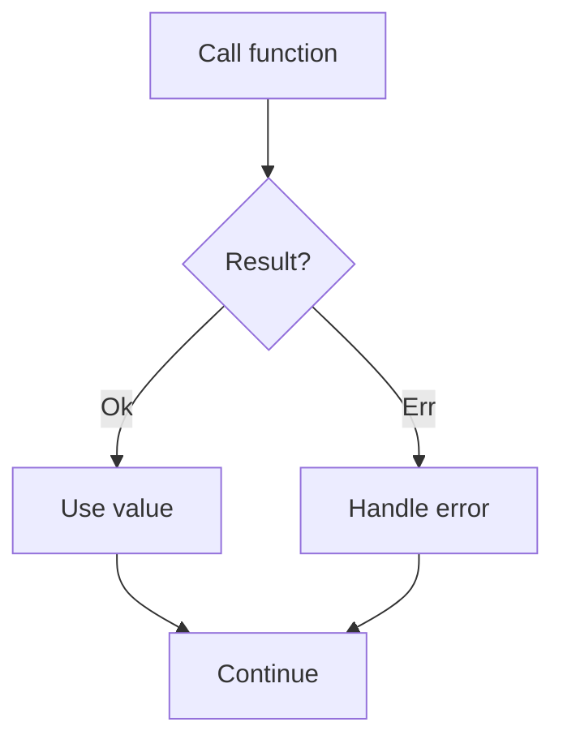
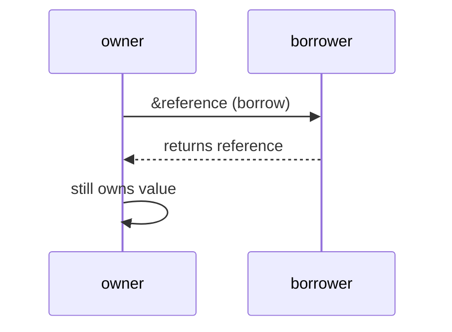
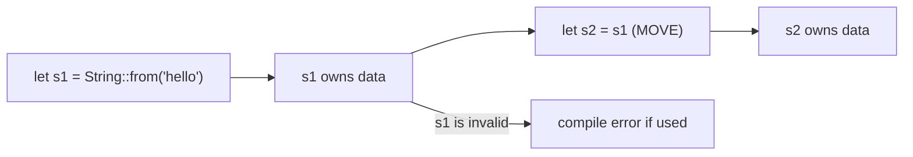
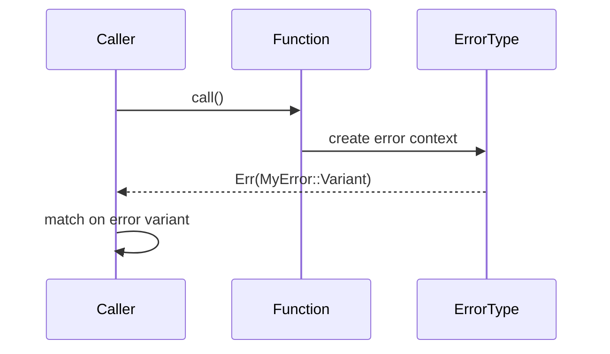
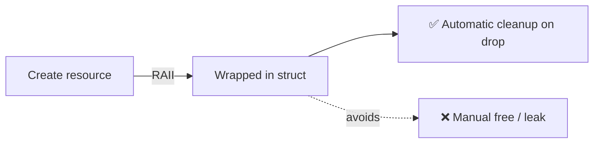
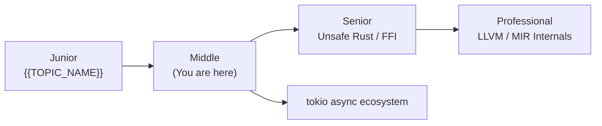
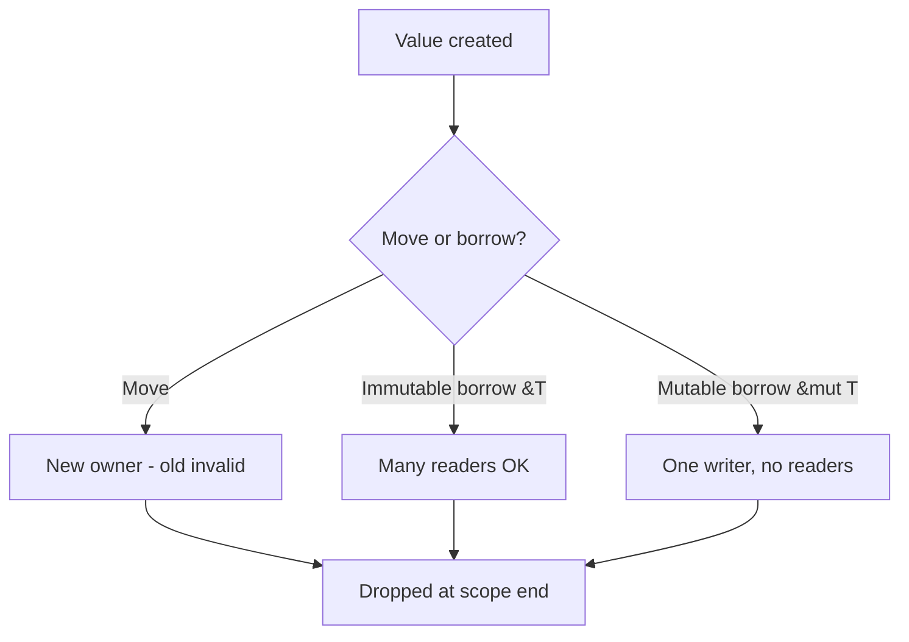
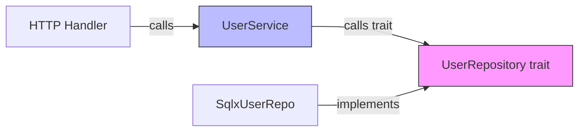
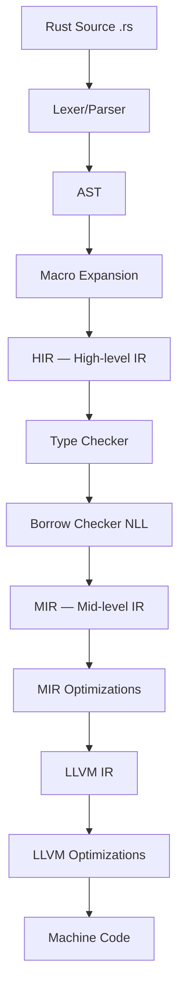
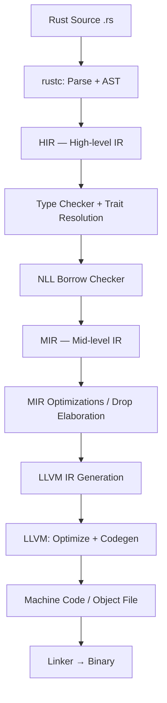

# Rust Roadmap — Universal Template

> **A comprehensive template system for generating Rust roadmap content across all skill levels.**

---

## Overview

| | Description |
|---|---|
| **Purpose** | Universal template for all Rust roadmap topics |
| **Files per topic** | 8 files: `junior.md`, `middle.md`, `senior.md`, `professional.md`, `interview.md`, `tasks.md`, `find-bug.md`, `optimize.md` |
| **Language** | All content must be generated in **English** |
| **Table of Contents** | **Optional** — include only if relevant to the topic. For theory/practice files (`tasks.md`, `find-bug.md`, `optimize.md`) it is NOT required |

### Topic Structure

```
XX-topic-name/
├── junior.md          ← "What?" and "How?"
├── middle.md          ← "Why?" and "When?"
├── senior.md          ← "How to optimize?" and "How to architect?"
├── professional.md    ← "Under the Hood" — LLVM IR, MIR, borrow checker
├── interview.md       ← Interview prep across all levels
├── tasks.md           ← Hands-on practice tasks
├── find-bug.md        ← Find and fix bugs in code (10+ exercises)
└── optimize.md        ← Optimize slow/inefficient code (10+ exercises)
```

### Rust Roadmap Topics (from roadmap.sh)

**Introduction:** What is Rust?, Why use Rust?, Environment Setup, Installing Rust and Cargo, IDEs and Rust Toolchains, Rust REPL (Rust Playground)

**Language Basics / Syntax and Semantics:** Variables, DataTypes and Constants, Control Flow and Constructs, Functions and Method Syntax, Pattern Matching & Destructuring

**Type System:** Integers, Floats, Boolean, Character, String, Tuple, Enums, Structs, Impl Blocks, Traits

**Ownership System:** Ownership Rules & Memory Safety, Borrowing, References and Slices, Deep Dive: Stack vs Heap

**Data Structures:** Array, Vector, Hashmap, Hashset, LinkedList, Stack, Queue, Binary Heap, BTreeMap, BTreeSet, RC

**Error Handling:** Option and Result Enumerations, Propagating Errors and `?` Operator, Custom Error Types and Traits

**Code Organization:** Modules & Crates, Dependency Management with Cargo, Publishing on Crates.io

**Advanced Topics:** Generics, Closures, Iterators, Lifetimes, Traits (advanced), Smart Pointers

**Concurrency:** Threads, Channels, Mutex/Arc, async/await with tokio

**Testing:** Unit & Integration Testing, Mocking & Property Based Testing

**Tooling:** cargo bench, Criterion.rs, rust-gdb, rust-lldb, rustdoc, Documenting with rustdoc

**Ecosystem:** Database and ORM (Diesel, sqlx, rusqlite), WebAssembly (wasm-pack, wasmer, wasm-bindgen), GUI Development, Game Development (bevy, fyrox), Embedded and Systems

---

## Level Comparison Matrix

| Aspect | Junior | Middle | Senior | Professional |
|:------:|:------:|:------:|:------:|:------------:|
| **Depth** | Ownership basics, Cargo, `let`/`mut`, `println!` | Lifetimes, traits, generics, Result/Option, async/tokio | unsafe Rust, FFI, zero-cost abstractions, systems programming | LLVM IR, MIR, borrow checker internals, zero-cost abstraction proof |
| **Code** | Hello World level | Production-ready with proper error handling | Advanced patterns, benchmarks with Criterion | LLVM IR analysis, MIR inspection, assembly output |
| **Tricky Points** | Ownership/borrow errors | Lifetime annotations, trait objects | Unsafe Rust, FFI boundaries | Rust compiler source, MIR optimizations |
| **Focus** | "What?" and "How?" | "Why?" and "When?" | "How to improve?" | "What happens under the hood?" |

---
---

# TEMPLATE 1 — `junior.md`

<details open>
<summary><strong>Template Content</strong></summary>

# {{TOPIC_NAME}} — Junior Level

<!-- Table of Contents is OPTIONAL. Include only if the topic has many sections and it helps navigation. Remove this section entirely if not needed. -->

## Table of Contents

1. [Introduction](#introduction)
2. [Prerequisites](#prerequisites)
3. [Glossary](#glossary)
4. [Core Concepts](#core-concepts)
5. [Pros & Cons](#pros--cons)
6. [Use Cases](#use-cases)
7. [Code Examples](#code-examples)
8. [Product Use / Feature](#product-use--feature)
9. [Error Handling](#error-handling)
10. [Security Considerations](#security-considerations)
11. [Performance Tips](#performance-tips)
12. [Metrics & Analytics](#metrics--analytics)
13. [Best Practices](#best-practices)
14. [Edge Cases & Pitfalls](#edge-cases--pitfalls)
15. [Common Mistakes](#common-mistakes)
16. [Tricky Points](#tricky-points)
17. [Test](#test)
18. [Tricky Questions](#tricky-questions)
19. [Cheat Sheet](#cheat-sheet)
20. [Summary](#summary)
21. [What You Can Build](#what-you-can-build)
22. [Further Reading](#further-reading)
23. [Related Topics](#related-topics)
24. [Diagrams & Visual Aids](#diagrams--visual-aids)

---

## Introduction

> Focus: "What is it?" and "How to use it?"

Brief explanation of what {{TOPIC_NAME}} is and why a beginner needs to know it.
Keep it simple — assume the reader has basic programming knowledge but is new to Rust.

---

## Prerequisites

What you should know before studying this topic:

- **Required:** {{concept 1}} — brief explanation of why
- **Required:** {{concept 2}} — brief explanation of why
- **Helpful but not required:** {{concept 3}}

> List 2-4 prerequisites. Include Cargo setup and basic Rust toolchain.

---

## Glossary

Key terms used in this topic:

| Term | Definition |
|------|-----------|
| **{{Term 1}}** | Simple, one-sentence definition |
| **Ownership** | Each value in Rust has one owner; when the owner goes out of scope, the value is dropped |
| **Borrowing** | Temporarily accessing a value without taking ownership |
| **{{Term 4}}** | Simple, one-sentence definition |

> 5-10 terms. Keep definitions beginner-friendly.

---

## Core Concepts

### Concept 1: {{name}}

Simple explanation with analogy if helpful.

### Concept 2: {{name}}

...

> **Rules:**
> - Each concept should be explained in 3-5 sentences max.
> - Use bullet points for lists.
> - Include small code snippets inline where needed.
> - Reference the Rust Book (https://doc.rust-lang.org/book/) where appropriate.

---

## Real-World Analogies

Everyday analogies to help you understand {{TOPIC_NAME}} intuitively:

| Concept | Analogy |
|---------|--------|
| **Ownership** | {{Analogy — e.g., "Like a library book — only one person can own it. When you return it (scope ends), it's gone."}} |
| **Borrowing** | {{Analogy — e.g., "Like borrowing a book from a friend — you can use it, but you must give it back. You can't destroy it."}} |
| **{{Concept 3}}** | {{Analogy}} |

> 2-4 analogies. Rust ownership is the most important concept to analogize clearly.

---

## Mental Models

How to picture {{TOPIC_NAME}} in your head:

**The intuition:** {{e.g., "Think of Rust ownership as a strict librarian — only one borrower at a time (or many readers), and you must return books in perfect condition."}}

**Why this model helps:** {{Why visualizing it this way prevents common borrow checker errors}}

---

## Pros & Cons

| Pros | Cons |
|------|------|
| {{Advantage 1 — e.g., memory safety without GC}} | {{Disadvantage 1 — e.g., steeper learning curve}} |
| {{Advantage 2}} | {{Disadvantage 2}} |
| {{Advantage 3}} | {{Disadvantage 3}} |

### When to use:
- {{Scenario where Rust shines}}

### When NOT to use:
- {{Scenario where Python or Go is faster to prototype}}

---

## Use Cases

When and where you would use this in real projects:

- **Use Case 1:** Description — e.g., "Systems programming, embedded"
- **Use Case 2:** Description — e.g., "WebAssembly applications"
- **Use Case 3:** Description — e.g., "High-performance network services"

---

## Code Examples

### Example 1: {{title}}

```rust
// Full working example with comments
fn main() {
    println!("Hello, World!");
}
```

**What it does:** Brief explanation of what happens.
**How to run:** `cargo run` or `cargo run --example example_name`
**How to compile:** `cargo build`

### Example 2: {{title}}

```rust
// Another practical example
```

> **Rules:**
> - Every example must be runnable with `cargo run`.
> - Add comments explaining ownership, borrowing, and lifetimes where relevant.
> - Show `Cargo.toml` dependencies when external crates are used.

---

## Product Use / Feature

How this topic is used in real-world products and tools:

### 1. {{Product/Tool Name}}

- **How it uses {{TOPIC_NAME}}:** Brief description
- **Why it matters:** Practical impact

### 2. {{Product/Tool Name}}

- **How it uses {{TOPIC_NAME}}:** Brief description
- **Why it matters:** Practical impact

### 3. {{Product/Tool Name}}

- **How it uses {{TOPIC_NAME}}:** Brief description
- **Why it matters:** Practical impact

> 3-5 real products/tools. Examples: Cloudflare Workers, Firefox (Servo/SpiderMonkey), Linux kernel drivers, AWS (Firecracker).

---

## Error Handling

How to handle errors when working with {{TOPIC_NAME}}:

### Error 1: {{Common error type}}

```rust
// Code that produces this error
fn might_fail() -> Result<i32, String> {
    Err("something went wrong".to_string())
}
```

**Why it happens:** Simple explanation.
**How to fix:**

```rust
// Pattern matching on Result
match might_fail() {
    Ok(value) => println!("Got: {}", value),
    Err(e) => eprintln!("Error: {}", e),
}

// Or with ? operator for propagation
fn caller() -> Result<i32, String> {
    let value = might_fail()?;
    Ok(value)
}
```

### Error 2: {{Option handling}}

```rust
// Option — value may or may not be present
fn find_item(id: u32) -> Option<String> {
    if id == 1 { Some("found".to_string()) } else { None }
}

// Handle Option
if let Some(item) = find_item(1) {
    println!("Found: {}", item);
}
```

### Error Handling Pattern

```rust
// Recommended idiomatic Rust error handling
use std::fmt;

#[derive(Debug)]
enum {{DomainError}} {
    NotFound(String),
    InvalidInput(String),
}

impl fmt::Display for {{DomainError}} {
    fn fmt(&self, f: &mut fmt::Formatter<'_>) -> fmt::Result {
        match self {
            {{DomainError}}::NotFound(msg) => write!(f, "Not found: {}", msg),
            {{DomainError}}::InvalidInput(msg) => write!(f, "Invalid input: {}", msg),
        }
    }
}
```

> 2-4 common errors. Teach Rust's Result<T, E> and Option<T> idioms.
> The `?` operator is the idiomatic way to propagate errors.

---

## Security Considerations

Security aspects to keep in mind when using {{TOPIC_NAME}}:

### 1. {{Security concern}}

```rust
// ❌ Unsafe — avoid unless necessary
unsafe {
    // ...
}

// ✅ Safe — preferred
// ...
```

**Risk:** What could go wrong.
**Mitigation:** How Rust's type system helps, and what remains to be careful about.

### 2. {{Another security concern}}

...

> 2-4 security considerations. Rust is memory-safe by default.
> Focus on: `unsafe` blocks, FFI boundaries, integer overflow in debug vs release mode.

---

## Performance Tips

Basic performance considerations for {{TOPIC_NAME}}:

### Tip 1: {{Performance tip}}

```rust
// ❌ Unnecessary clone
let a = some_string.clone();

// ✅ Borrow instead
let a = &some_string;
```

**Why it's faster:** No heap allocation for the clone.

### Tip 2: {{Another tip}}

...

> 2-4 tips. Rust's zero-cost abstractions mean many "expensive-looking" patterns are free.
> Mention: avoid unnecessary `.clone()`, prefer borrowing, use iterators.

---

## Metrics & Analytics

Key metrics to track when using {{TOPIC_NAME}}:

### What to Measure

| Metric | Why it matters | Tool |
|--------|---------------|------|
| **{{metric 1}}** | {{reason}} | `criterion`, `cargo bench` |
| **{{metric 2}}** | {{reason}} | `valgrind`, `heaptrack` |

### Basic Instrumentation

```rust
use std::time::Instant;

let start = Instant::now();
let result = perform_operation();
let elapsed = start.elapsed();
println!("{{topic}} completed in {:?}", elapsed);
```

---

## Coding Patterns

Common Rust patterns beginners encounter when working with {{TOPIC_NAME}}:

### Pattern 1: {{Basic Rust pattern — e.g., Result chaining, Option unwrapping safely}}

**Intent:** {{What problem this solves for beginners}}
**When to use:** {{Simple scenario}}

```rust
// Pattern implementation — beginner-friendly with comments
fn main() {
    // {{pattern usage}}
}
```

**Diagram:**



**Remember:** {{One key Rust idiom takeaway}}

---

### Pattern 2: {{Another basic Rust pattern — e.g., ownership transfer, borrowing}}

**Intent:** {{What it solves}}

```rust
// Second pattern example
```

**Diagram:**



> Include 2-3 patterns. Focus on ownership, borrowing, Result/Option patterns the beginner WILL encounter.

---

## Clean Code

Basic clean code principles when working with {{TOPIC_NAME}} in Rust:

### Naming (Rust conventions)

```rust
// ❌ Bad
fn d(x: i32) -> i32 { x * 2 }
let t = get_data();

// ✅ Clean Rust naming
fn double_value(n: i32) -> i32 { n * 2 }
let user_list = get_users();
```

**Rust naming rules:**
- Variables & functions: `snake_case`
- Types, traits, enums: `PascalCase`
- Constants: `SCREAMING_SNAKE_CASE`
- Lifetimes: short lowercase (`'a`, `'b`, or descriptive `'conn`)

---

### Short Functions

```rust
// ❌ Too long — parse + validate + save in one function
fn process_user(data: &[u8]) -> Result<(), Error> { /* 60 lines */ }

// ✅ Each function does one thing
fn parse_user(data: &[u8]) -> Result<User, Error>        { ... }
fn validate_user(user: &User) -> Result<(), Error>        { ... }
fn save_user(user: &User) -> Result<(), Error>            { ... }
```

---

### Comments

```rust
// ❌ Noise — states the obvious
// increment counter
count += 1;

// ✅ Explains WHY
// Retry up to 3 times — the downstream service has transient connection drops
for attempt in 0..3 { ... }

/// ✅ Doc comment for public API
/// Parses a user from raw JSON bytes.
/// Returns `Err` if the bytes are not valid UTF-8 or not valid JSON.
pub fn parse_user(data: &[u8]) -> Result<User, ParseError> { ... }
```

> Focus on Rust naming conventions (snake_case, PascalCase), function size, doc comments with `///`.

---

## Best Practices

- **Do this:** Explanation
- **Do this:** Explanation
- **Do this:** Explanation

> 3-5 best practices. Reference the Rust API Guidelines (https://rust-lang.github.io/api-guidelines/).
> Common: prefer `&str` over `String` for parameters, use iterators, handle all `Result` variants.

---

## Edge Cases & Pitfalls

### Pitfall 1: {{name}}

```rust
// Code that demonstrates the pitfall
```

**What happens:** Explanation of unexpected behavior.
**How to fix:** Corrected code or approach.

### Pitfall 2: Integer overflow in debug mode

```rust
// In debug mode: panics on overflow
// In release mode (--release): wraps (two's complement)
let x: u8 = 255;
let y = x + 1;  // panic in debug, wraps to 0 in release

// Safe alternatives:
let y = x.wrapping_add(1);   // always wrap
let y = x.saturating_add(1); // clamp to max
let y = x.checked_add(1);    // returns Option<u8>
```

---

## Common Mistakes

### Mistake 1: {{description}}

```rust
// ❌ Wrong way
...

// ✅ Correct way
...
```

### Mistake 2: {{description}}

...

> 3-5 mistakes that Rust beginners commonly make (move semantics, borrow checker, etc.).

---

## Common Misconceptions

### Misconception 1: "{{False belief about Rust}}"

**Reality:** {{What's actually true}}

**Why people think this:** {{Why this misconception is common}}

### Misconception 2: "Rust programs have no runtime"

**Reality:** Rust has a minimal runtime (stack unwinding for panics), but no garbage collector.

---

## Tricky Points

### Tricky Point 1: {{name}}

```rust
// Code that might surprise a Rust beginner
```

**Why it's tricky:** Explanation.
**Key takeaway:** One-line lesson.

---

## Test

### Multiple Choice

**1. {{Question}}?**

- A) Option A
- B) Option B
- C) Option C
- D) Option D

<details>
<summary>Answer</summary>
**C)** — Explanation.
</details>

### True or False

**3. {{Statement about Rust ownership}}**

<details>
<summary>Answer</summary>
**False** — Explanation.
</details>

### What's the Output?

**4. What does this code print? (or: does it compile?)**

```rust
// code snippet
```

<details>
<summary>Answer</summary>
Output: `...` / Compile error: `...`
Explanation: ...
</details>

> 5-8 test questions. Include "does this compile?" questions — uniquely important for Rust.

---

## "What If?" Scenarios

**What if {{Unexpected Rust situation}}?**
- **You might think:** {{Intuitive but wrong answer}}
- **But actually:** {{What the borrow checker does}}

---

## Tricky Questions

**1. {{Confusing Rust question}}?**

- A) {{Looks correct but wrong}}
- B) {{Correct answer}}
- C) {{Common misconception}}
- D) {{Partially correct}}

<details>
<summary>Answer</summary>
**B)** — Explanation.
</details>

---

## Cheat Sheet

Quick reference for this topic:

| What | Syntax | Example |
|------|--------|---------|
| Immutable variable | `let x = 5;` | `let age = 25;` |
| Mutable variable | `let mut x = 5;` | `let mut count = 0;` |
| Immutable borrow | `&value` | `fn print(s: &String)` |
| Mutable borrow | `&mut value` | `fn append(s: &mut String)` |
| {{Action}} | `{{syntax}}` | `{{example}}` |

---

## Self-Assessment Checklist

### I can explain:
- [ ] What ownership is and why Rust uses it
- [ ] The difference between ownership, borrowing, and lifetimes
- [ ] When the borrow checker rejects code and why

### I can do:
- [ ] Write a basic Rust program with `cargo new` and `cargo run`
- [ ] Use `Result<T, E>` and `Option<T>` correctly
- [ ] Fix basic borrow checker errors

---

## Summary

- Key point 1 (ownership)
- Key point 2 (Result/Option)
- Key point 3 (cargo)

**Next step:** What to learn after this topic.

---

## What You Can Build

### Projects you can create:
- **{{Project 1}}:** Brief description — uses {{specific concept}}
- **{{Project 2}}:** Brief description — e.g., CLI tool with `clap`
- **{{Project 3}}:** Brief description — practical systems tool

### Technologies / tools that use this:
- **tokio** — async runtime for Rust
- **WebAssembly** — Rust compiles to WASM
- **{{Technology 3}}** — career opportunity unlocked

### Learning path:


---

## Further Reading

- **The Rust Book:** [https://doc.rust-lang.org/book/](https://doc.rust-lang.org/book/)
- **Rust by Example:** [https://doc.rust-lang.org/rust-by-example/](https://doc.rust-lang.org/rust-by-example/)
- **Blog post:** [{{link title}}]({{url}}) — what you'll learn
- **Rustlings:** [https://github.com/rust-lang/rustlings](https://github.com/rust-lang/rustlings) — exercises

---

## Related Topics

- **[{{Related Topic 1}}](../XX-related-topic/)** — how it connects
- **[{{Related Topic 2}}](../XX-related-topic/)** — how it connects

---

## Diagrams & Visual Aids

> Include **at least 2-3 visual aids** per document.

### Mind Map

```mermaid
mindmap
  root(({{TOPIC_NAME}}))
    Ownership
      Move semantics
      Copy types
    Borrowing
      Immutable refs
      Mutable refs
    Lifetimes
      {{Related 1}}
      {{Related 2}}
```

### Visual Type Reference

| Visual Type | Best For | Syntax |
|:----------:|:--------:|:------:|
| **Mermaid Flowchart** | Ownership flows | `graph TD` / `graph LR` |
| **Mermaid Sequence** | Async/future resolution | `sequenceDiagram` |
| **ASCII Diagram** | Memory layouts, stack/heap | Box-drawing characters |
| **Comparison Table** | Feature comparisons | Markdown table |

### Example — Ownership Flow



### Example — Stack vs Heap

```
Stack (per function frame):
+------------------+
| s: String        |
|  ptr → heap      |  8 bytes
|  len: 5          |  8 bytes
|  cap: 5          |  8 bytes
+------------------+

Heap:
+---+---+---+---+---+
| h | e | l | l | o |
+---+---+---+---+---+
```

</details>

---
---

# TEMPLATE 2 — `middle.md`

<details open>
<summary><strong>Template Content</strong></summary>

# {{TOPIC_NAME}} — Middle Level

## Table of Contents

1. [Introduction](#introduction)
2. [Core Concepts](#core-concepts)
3. [Pros & Cons](#pros--cons)
4. [Use Cases](#use-cases)
5. [Code Examples](#code-examples)
6. [Product Use / Feature](#product-use--feature)
7. [Error Handling](#error-handling)
8. [Security Considerations](#security-considerations)
9. [Performance Optimization](#performance-optimization)
10. [Metrics & Analytics](#metrics--analytics)
11. [Debugging Guide](#debugging-guide)
12. [Best Practices](#best-practices)
13. [Edge Cases & Pitfalls](#edge-cases--pitfalls)
14. [Common Mistakes](#common-mistakes)
15. [Tricky Points](#tricky-points)
16. [Comparison with Other Languages](#comparison-with-other-languages)
17. [Test](#test)
18. [Tricky Questions](#tricky-questions)
19. [Cheat Sheet](#cheat-sheet)
20. [Summary](#summary)
21. [What You Can Build](#what-you-can-build)
22. [Further Reading](#further-reading)
23. [Related Topics](#related-topics)
24. [Diagrams & Visual Aids](#diagrams--visual-aids)

---

## Introduction

> Focus: "Why?" and "When to use?"

Assumes the reader knows Rust basics. This level covers:
- Lifetimes, traits, generics in depth
- Result/Option patterns in production code
- Async Rust with tokio
- Real-world crate ecosystem usage

---

## Core Concepts

### Concept 1: {{Lifetimes / Traits / Generics}}

```rust
// Trait definition and implementation
trait {{TraitName}} {
    fn {{method}}(&self) -> String;
    fn default_behavior(&self) -> bool { true } // default implementation
}

// Generic function with trait bound
fn process<T: {{TraitName}} + std::fmt::Debug>(item: &T) -> String {
    println!("{:?}", item);
    item.{{method}}()
}
```

### Concept 2: {{async/await with tokio}}

```rust
use tokio::time::{sleep, Duration};

#[tokio::main]
async fn main() {
    let result = fetch_data().await;
    println!("{:?}", result);
}

async fn fetch_data() -> Result<String, reqwest::Error> {
    let response = reqwest::get("https://api.example.com/data").await?;
    response.text().await
}
```

> Go deeper than junior. Explain "why" not just "what".
> Cover lifetimes, traits, generics, Result/Option patterns, async with tokio.

---

## Evolution & Historical Context

**Before async Rust:**
- Threading model: too expensive for I/O-bound concurrency
- Callback hell: futures 0.1 / manual state machines

**How async/await changed things:**
- Rust RFC 2394 introduced `async fn` and `.await` (stabilized in 1.39.0)
- Zero-cost futures: no heap allocations for the state machine unless necessary

---

## Pros & Cons

| Pros | Cons |
|------|------|
| {{Advantage 1}} | {{Disadvantage 1 — e.g., lifetime annotations can be verbose}} |
| Zero-cost abstractions | Steeper learning curve than Go |
| No GC — predictable latency | Longer compile times |

---

## Alternative Approaches (Plan B)

| Alternative | How it works | When to use |
|-------------|-------------|-------------|
| **Go** | GC-based, simple goroutines | When development speed > raw performance |
| **C++** | Manual memory, zero-cost | Legacy codebases, existing C++ ecosystems |

---

## Use Cases

- **Use Case 1:** Async web service with tokio + axum / actix-web
- **Use Case 2:** CLI tool with `clap` and proper error propagation
- **Use Case 3:** WebAssembly module compiled from Rust

---

## Code Examples

### Example 1: {{Production-ready pattern with error handling}}

```rust
use std::fmt;
use thiserror::Error;

#[derive(Error, Debug)]
pub enum {{TopicError}} {
    #[error("Not found: {0}")]
    NotFound(String),
    #[error("IO error: {0}")]
    Io(#[from] std::io::Error),
    #[error("Parse error: {0}")]
    Parse(#[from] std::num::ParseIntError),
}

pub fn process(input: &str) -> Result<u32, {{TopicError}}> {
    if input.is_empty() {
        return Err({{TopicError}}::NotFound("empty input".into()));
    }
    let n = input.trim().parse::<u32>()?;
    Ok(n * 2)
}
```

### Example 2: {{Generic + Trait example}}

```rust
// Generic struct with trait bounds
use std::fmt::Display;

pub struct Wrapper<T: Display> {
    value: T,
}

impl<T: Display> Wrapper<T> {
    pub fn new(value: T) -> Self {
        Self { value }
    }

    pub fn show(&self) {
        println!("Wrapped: {}", self.value);
    }
}
```

---

## Product Use / Feature

### 1. {{Product/Tool Name}}

- **How it uses {{TOPIC_NAME}}:** Description
- **Crates used:** tokio, serde, anyhow/thiserror

> 3-5 real products. Reference: Cloudflare Workers (Rust WASM), Firecracker (AWS), ripgrep.

---

## Error Handling

Production-grade error handling with `thiserror` and `anyhow`:

### Pattern 1: `thiserror` for library errors

```rust
use thiserror::Error;

#[derive(Error, Debug)]
pub enum ServiceError {
    #[error("database error: {0}")]
    Database(#[from] sqlx::Error),
    #[error("not found: {id}")]
    NotFound { id: u64 },
    #[error("unauthorized")]
    Unauthorized,
}
```

### Pattern 2: `anyhow` for application errors

```rust
use anyhow::{Context, Result};

fn load_config(path: &str) -> Result<Config> {
    let content = std::fs::read_to_string(path)
        .with_context(|| format!("Failed to read config from {}", path))?;
    let config: Config = toml::from_str(&content)
        .context("Failed to parse config")?;
    Ok(config)
}
```

### Common Error Patterns

| Situation | Pattern | Crate |
|-----------|---------|-------|
| Library errors | `#[derive(Error)]` | `thiserror` |
| Application errors | `anyhow::Result` | `anyhow` |
| Error propagation | `?` operator | stdlib |
| Panic-free | `Result` everywhere | stdlib |

---

## Security Considerations

### 1. `unsafe` Rust

```rust
// ❌ Unsafe without justification
unsafe {
    let ptr = &raw_value as *const i32;
    *ptr
}

// ✅ Encapsulate unsafe in safe abstractions
pub struct SafeWrapper {
    inner: *mut u8,
}

impl SafeWrapper {
    // SAFETY: inner is always valid, non-null, properly aligned
    pub fn get(&self) -> u8 {
        unsafe { *self.inner }
    }
}
```

### Security Checklist

- [ ] Minimize `unsafe` blocks — document every `unsafe` with a SAFETY comment
- [ ] No integer overflow in release mode — use `checked_*`, `saturating_*`, or `wrapping_*`
- [ ] Validate all inputs at FFI boundaries
- [ ] Use `cargo audit` for dependency vulnerability scanning
- [ ] Secret handling: use `secrecy` crate for zeroization

---

## Performance Optimization

### Optimization 1: Avoid unnecessary clones

```rust
// ❌ Unnecessary clone
fn process(s: String) -> usize {
    s.len()
}

let my_string = String::from("hello");
process(my_string.clone()); // unnecessary clone

// ✅ Borrow instead
fn process(s: &str) -> usize {
    s.len()
}

process(&my_string); // zero-cost borrow
```

### Optimization 2: Iterator chains (zero-cost)

```rust
// Both compile to equivalent machine code
let sum_imperative: u32 = {
    let mut s = 0;
    for i in 0..1000 {
        if i % 2 == 0 { s += i; }
    }
    s
};

let sum_functional: u32 = (0u32..1000)
    .filter(|x| x % 2 == 0)
    .sum();
// Zero overhead — iterators are zero-cost abstractions
```

**Benchmark results:**
```
# cargo bench results
bench_imperative    ... bench:     890 ns/iter (+/- 12)
bench_functional    ... bench:     887 ns/iter (+/- 10)
```

---

## Metrics & Analytics

### Key Metrics

| Metric | Type | Tool |
|--------|------|------|
| **{{metric 1}}** | Counter | `metrics` crate |
| **Latency** | Histogram | `tracing` + `metrics-exporter-prometheus` |

### Prometheus Instrumentation

```rust
use metrics::{counter, histogram};

pub fn process_{{topic}}(input: &str) -> Result<String, ServiceError> {
    let start = std::time::Instant::now();

    let result = do_processing(input)?;

    histogram!("{{topic}}.duration_seconds", start.elapsed().as_secs_f64());
    counter!("{{topic}}.operations_total", 1, "status" => "success");
    Ok(result)
}
```

---

## Debugging Guide

### Problem 1: {{Borrow checker error in production code}}

**Diagnostic steps:**
```bash
# Detailed error messages
RUST_BACKTRACE=1 cargo run

# Memory profiling
cargo install heaptrack
heaptrack ./target/release/app

# Valgrind
valgrind --tool=memcheck ./target/release/app

# cargo flamegraph
cargo install flamegraph
cargo flamegraph
```

### Useful Tools

| Tool | Command | What it shows |
|------|---------|---------------|
| `cargo bench` | `cargo bench` | Micro-benchmarks |
| `flamegraph` | `cargo flamegraph` | CPU flamegraph |
| `heaptrack` | `heaptrack ./app` | Heap allocations |
| `valgrind` | `valgrind ./app` | Memory errors (debug builds) |
| `rust-gdb` | `rust-gdb ./app` | Step-through debugging |

---

## Coding Patterns

Design patterns and idiomatic Rust patterns for {{TOPIC_NAME}}:

### Pattern 1: {{Rust-specific pattern — e.g., Builder, Newtype, State Machine via enums}}

**Category:** Creational / Structural / Behavioral / Rust-idiomatic
**Intent:** {{What design problem this solves}}
**When to use:** {{Specific Rust scenario}}
**When NOT to use:** {{Counter-indication}}

**Structure diagram:**

```mermaid
classDiagram
    class {{Trait}} {
        <<trait>>
        +{{method()}} ReturnType
    }
    class {{ImplA}} {
        +{{method()}} ReturnType
    }
    class {{ImplB}} {
        +{{method()}} ReturnType
    }
    class {{Client}} {
        -Box~dyn Trait~ dep
        +use()
    }
    {{Trait}} <|.. {{ImplA}}
    {{Trait}} <|.. {{ImplB}}
    {{Client}} --> {{Trait}}
```

**Implementation:**

```rust
// Rust pattern implementation using traits
trait {{Behavior}} {
    fn {{method}}(&self) -> {{ReturnType}};
}

struct {{ConcreteA}};
impl {{Behavior}} for {{ConcreteA}} {
    fn {{method}}(&self) -> {{ReturnType}} { ... }
}
```

**Trade-offs:**

| ✅ Pros | ❌ Cons |
|---------|---------|
| {{benefit 1}} | {{drawback 1}} |
| {{benefit 2}} | {{drawback 2}} |

---

### Pattern 2: {{Error handling pattern — e.g., thiserror, anyhow, custom error enum}}

**Category:** Error Handling / Rust-idiomatic
**Intent:** {{Structured error management}}

**Flow diagram:**



```rust
use thiserror::Error;

#[derive(Error, Debug)]
enum {{DomainError}} {
    #[error("not found: {0}")]
    NotFound(String),
    #[error("validation failed: {0}")]
    Validation(String),
    #[error(transparent)]
    Io(#[from] std::io::Error),
}
```

---

### Pattern 3: {{Ownership pattern — e.g., RAII, smart pointers, interior mutability}}

**Intent:** {{Resource management idiom}}



```rust
// ❌ Manual resource management (not idiomatic)
// ✅ RAII pattern — resource tied to ownership
struct ManagedResource(InnerResource);
impl Drop for ManagedResource {
    fn drop(&mut self) { /* cleanup */ }
}
```

> Include 3-5 patterns. Focus on Rust's unique patterns: newtype, typestate, RAII, error enums with thiserror.
> Every pattern MUST have a diagram.

---

## Clean Code

Production-level clean code for {{TOPIC_NAME}} in Rust:

### Naming & Readability

```rust
// ❌ Cryptic
fn proc(d: &[u8], f: bool) -> Result<Vec<u8>, Box<dyn Error>>

// ✅ Self-documenting
fn compress_payload(input: &[u8], include_checksum: bool) -> Result<Vec<u8>, CompressionError>
```

| Element | Rust Rule | Example |
|---------|-----------|---------|
| Functions/methods | `snake_case`, verb+noun | `fetch_user_by_id`, `validate_token` |
| Traits | `PascalCase`, noun | `Display`, `Iterator`, `UserStore` |
| Error types | `PascalCase` + `Error` suffix | `ParseError`, `NetworkError` |
| Enums | `PascalCase` variants | `Status::Active`, `Direction::Left` |

---

### Rust SOLID via Traits

**Single Responsibility:**
```rust
// ❌ Trait doing too much
trait UserManager {
    fn save(&self, user: &User) -> Result<(), Error>;
    fn send_email(&self, user: &User, msg: &str) -> Result<(), Error>; // wrong!
    fn generate_report(&self) -> Vec<u8>;  // wrong!
}

// ✅ Trait segregation
trait UserStore   { fn save(&self, user: &User) -> Result<(), Error>; }
trait UserNotifier { fn send_email(&self, user: &User, msg: &str) -> Result<(), Error>; }
```

**Dependency Inversion:**
```rust
// ❌ Concrete dependency
struct Service { db: PostgresDb }

// ✅ Trait object (dynamic) or generic (static dispatch)
struct Service<S: UserStore> { store: S }
// or: struct Service { store: Box<dyn UserStore> }
```

---

### Rust-Specific Cleanliness

```rust
// ❌ Panic in library code
fn get_user(id: u32) -> User {
    users.get(&id).unwrap()  // panics!
}

// ✅ Return Result or Option
fn get_user(id: u32) -> Option<&User> {
    users.get(&id)
}

// ❌ Clone to avoid thinking about lifetimes
fn process(data: Vec<u8>) -> Vec<u8> { data.clone() }

// ✅ Use references where possible
fn process(data: &[u8]) -> Vec<u8> { ... }
```

> Focus on trait-based design, avoiding `unwrap()` in library code, minimizing clones.

---

## Best Practices

- **Practice 1:** Prefer `&str` over `String` for function parameters
- **Practice 2:** Use `thiserror` for library crates, `anyhow` for binaries
- **Practice 3:** Write `#[test]` unit tests in the same file as the code

---

## Edge Cases & Pitfalls

### Pitfall 1: Integer overflow in release mode

```rust
// Debug mode: panics
// Release mode: silently wraps
let x: u8 = 255u8.wrapping_add(1); // 0 — use explicitly when wrapping intended
let y: u8 = 255u8.saturating_add(1); // 255 — clamp
let z: Option<u8> = 255u8.checked_add(1); // None — safe
```

### Pitfall 2: {{Lifetime or async pitfall}}

...

---

## Common Mistakes

### Mistake 1: {{Middle-level Rust mistake}}

```rust
// ❌ Looks correct but has subtle issues
...

// ✅ Correct approach
...
```

---

## Anti-Patterns

### Anti-Pattern 1: Excessive cloning to avoid lifetime errors

```rust
// ❌ Clone everything to silence borrow checker
fn bad_pattern(data: &Vec<String>) -> Vec<String> {
    data.iter().map(|s| s.clone()).collect() // unnecessary
}

// ✅ Return references or use iterators properly
fn good_pattern<'a>(data: &'a [String]) -> impl Iterator<Item = &'a str> {
    data.iter().map(|s| s.as_str())
}
```

---

## Tricky Points

### Tricky Point 1: {{Subtle Rust behavior}}

```rust
// Code with non-obvious behavior
```

**What actually happens:** Step-by-step explanation.
**Why:** Reference to Rust reference or RFC.

---

## Comparison with Other Languages

How Rust handles {{TOPIC_NAME}} compared to other languages:

| Aspect | Rust | C++ | Go | Zig | C |
|--------|------|-----|-----|-----|---|
| Memory safety | Compile-time | Manual | GC | Manual + safety | Manual |
| Zero-cost abstractions | Yes | Yes | Partial | Yes | N/A |
| Error handling | `Result<T,E>` | exceptions | multiple returns | error unions | error codes |
| {{Aspect}} | ... | ... | ... | ... | ... |

### Key differences:

- **Rust vs C++:** Rust's borrow checker prevents data races and dangling pointers at compile time; C++ requires manual discipline
- **Rust vs Go:** Rust has no GC (predictable latency, smaller runtime); Go has goroutines (simpler concurrency model)
- **Rust vs Zig:** Both target systems programming; Zig is simpler with `comptime` but less mature ecosystem

---

## Test

### Multiple Choice (harder)

**1. {{Question involving lifetimes or trait objects}}?**

<details>
<summary>Answer</summary>
**B)** — Detailed explanation with Rust Reference citation.
</details>

### Does This Compile?

**2. Does this code compile? If not, why?**

```rust
// code snippet
```

<details>
<summary>Answer</summary>
No / Yes — Explanation with borrow checker reasoning.
</details>

---

## Cheat Sheet

| Scenario | Pattern | Note |
|----------|---------|------|
| Propagate errors | `result?` | Auto-converts with `From` |
| Default value | `option.unwrap_or(default)` | Safe unwrap |
| Map Option | `option.map(|x| x + 1)` | Transform if Some |
| Async function | `async fn f() -> Result<T>` | Returns `Future` |
| Lifetime annotation | `fn f<'a>(x: &'a str) -> &'a str` | Explicit lifetime |

---

## Self-Assessment Checklist

### I can explain:
- [ ] Why Rust has lifetimes and what problem they solve
- [ ] How to implement a custom trait
- [ ] When to use `Box<dyn Trait>` vs generics

### I can do:
- [ ] Write production error handling with `thiserror`/`anyhow`
- [ ] Write async functions with tokio
- [ ] Use iterators and closures idiomatically

---

## Summary

- Key lifetime insight
- Key async Rust insight
- Key zero-cost abstraction insight

---

## What You Can Build

### Production systems:
- **{{System 1}}:** Async HTTP service with axum + tokio
- **{{System 2}}:** WebAssembly module with wasm-bindgen

### Learning path:



---

## Further Reading

- **The Rust Reference:** [https://doc.rust-lang.org/reference/](https://doc.rust-lang.org/reference/)
- **Rustonomicon:** [https://doc.rust-lang.org/nomicon/](https://doc.rust-lang.org/nomicon/) (for unsafe)
- **Async Rust Book:** [https://rust-lang.github.io/async-book/](https://rust-lang.github.io/async-book/)
- **Talk:** [{{RustConf talk}}]({{url}})

---

## Related Topics

- **[{{Related Topic 1}}](../XX-related-topic/)** — how it connects
- **[{{Related Topic 2}}](../XX-related-topic/)** — how it connects

---

## Diagrams & Visual Aids

> Include **at least 2-3 visual aids** per document.

### Rust Ownership and Borrowing Rules



</details>

---
---

# TEMPLATE 3 — `senior.md`

<details open>
<summary><strong>Template Content</strong></summary>

# {{TOPIC_NAME}} — Senior Level

## Table of Contents

1. [Introduction](#introduction)
2. [Core Concepts](#core-concepts)
3. [Pros & Cons](#pros--cons)
4. [Use Cases](#use-cases)
5. [Code Examples](#code-examples)
6. [Product Use / Feature](#product-use--feature)
7. [Error Handling](#error-handling)
8. [Security Considerations](#security-considerations)
9. [Performance Optimization](#performance-optimization)
10. [Metrics & Analytics](#metrics--analytics)
11. [Debugging Guide](#debugging-guide)
12. [Best Practices](#best-practices)
13. [Edge Cases & Pitfalls](#edge-cases--pitfalls)
14. [Common Mistakes](#common-mistakes)
15. [Tricky Points](#tricky-points)
16. [Comparison with Other Languages](#comparison-with-other-languages)
17. [Test](#test)
18. [Tricky Questions](#tricky-questions)
19. [Cheat Sheet](#cheat-sheet)
20. [Summary](#summary)
21. [What You Can Build](#what-you-can-build)
22. [Further Reading](#further-reading)
23. [Related Topics](#related-topics)
24. [Diagrams & Visual Aids](#diagrams--visual-aids)

---

## Introduction

> Focus: "How to optimize?" and "How to architect?"

For Rust developers who:
- Write `unsafe` Rust and FFI interfaces
- Build systems programming libraries
- Prove zero-cost abstractions with benchmarks
- Design APIs following Rust idioms (builder pattern, type-state pattern)
- Mentor junior/middle Rust developers

> Senior Rust topics include: unsafe Rust, FFI (C interop), zero-cost abstractions (proof via Criterion + assembly), systems programming patterns, custom allocators, SIMD, and `no_std`.

---

## Core Concepts

### Concept 1: {{unsafe Rust and invariants}}

```rust
// unsafe Rust — must uphold invariants manually
// SAFETY: ptr is non-null, properly aligned, and valid for the lifetime 'a
unsafe fn read_unchecked<'a, T>(ptr: *const T) -> &'a T {
    &*ptr
}

// Encapsulate unsafe in safe API
pub struct SafeVec<T> {
    ptr: *mut T,
    len: usize,
    cap: usize,
}

impl<T> SafeVec<T> {
    // SAFETY: index < len is checked by caller via bounds check
    pub fn get(&self, index: usize) -> Option<&T> {
        if index < self.len {
            // SAFETY: index is within bounds
            Some(unsafe { &*self.ptr.add(index) })
        } else {
            None
        }
    }
}
```

### Concept 2: {{Zero-cost abstraction proof}}

```rust
use criterion::{criterion_group, criterion_main, Criterion};

fn bench_iterator(c: &mut Criterion) {
    let data: Vec<u32> = (0..10000).collect();

    c.bench_function("iterator_chain", |b| {
        b.iter(|| {
            data.iter()
                .filter(|&&x| x % 2 == 0)
                .map(|&x| x * 2)
                .sum::<u32>()
        })
    });

    c.bench_function("imperative_loop", |b| {
        b.iter(|| {
            let mut sum = 0u32;
            for &x in &data {
                if x % 2 == 0 {
                    sum += x * 2;
                }
            }
            sum
        })
    });
}
```

---

## Use Cases

- **Use Case 1:** Writing a C FFI wrapper (calling C library from Rust)
- **Use Case 2:** `no_std` embedded systems without heap
- **Use Case 3:** Custom memory allocator for specific performance needs
- **Use Case 4:** SIMD operations for data-parallel processing

---

## Code Examples

### Example 1: {{FFI wrapper}}

```rust
// Calling a C function from Rust
extern "C" {
    fn c_function(x: i32) -> i32;
}

pub fn safe_wrapper(x: i32) -> i32 {
    // SAFETY: c_function is pure and has no side effects
    unsafe { c_function(x) }
}
```

### Example 2: {{Custom allocator}}

```rust
use std::alloc::{GlobalAlloc, Layout, System};

pub struct TracingAllocator;

unsafe impl GlobalAlloc for TracingAllocator {
    unsafe fn alloc(&self, layout: Layout) -> *mut u8 {
        let ptr = System.alloc(layout);
        if !ptr.is_null() {
            eprintln!("alloc: {} bytes at {:p}", layout.size(), ptr);
        }
        ptr
    }

    unsafe fn dealloc(&self, ptr: *mut u8, layout: Layout) {
        eprintln!("dealloc: {} bytes at {:p}", layout.size(), ptr);
        System.dealloc(ptr, layout)
    }
}

#[global_allocator]
static ALLOCATOR: TracingAllocator = TracingAllocator;
```

---

## Product Use / Feature

### 1. {{Company/Product — e.g., Cloudflare Workers}}

- **Architecture:** How they use Rust for {{TOPIC_NAME}} at scale
- **Performance numbers:** Specific metrics
- **Key insight:** Why Rust's memory model matters here

> Reference: Cloudflare blog, AWS Firecracker, Mozilla Servo, Linux kernel Rust drivers.

---

## Error Handling

Enterprise-grade Rust error handling:

### Strategy 1: {{Error handling architecture for large codebase}}

```rust
// Layered error handling
use thiserror::Error;

// Domain layer errors
#[derive(Error, Debug)]
pub enum DomainError {
    #[error("entity not found: {entity_type} with id {id}")]
    NotFound { entity_type: &'static str, id: u64 },
    #[error("validation failed: {field} — {reason}")]
    Validation { field: String, reason: String },
}

// Infrastructure layer errors
#[derive(Error, Debug)]
pub enum InfraError {
    #[error("database: {0}")]
    Database(#[from] sqlx::Error),
    #[error("domain: {0}")]
    Domain(#[from] DomainError),
}
```

---

## Security Considerations

### 1. `unsafe` contract violations

**Risk level:** Critical

```rust
// ❌ Unsafe with no documentation — undefined behavior risk
unsafe fn bad() {
    let ptr: *const u8 = 0x1234 as *const u8;
    let _ = *ptr; // undefined behavior — could be unmapped
}

// ✅ Every unsafe block must have SAFETY comment
// SAFETY: ptr is valid because it was obtained from
// Box::into_raw() and not yet freed
unsafe fn good(ptr: *const u8) -> u8 {
    *ptr
}
```

### Security Architecture Checklist

- [ ] Every `unsafe` block has a `// SAFETY:` comment
- [ ] FFI: validate all inputs at the boundary
- [ ] Integer arithmetic: use `checked_*` in security-sensitive code
- [ ] `cargo audit` in CI for dependency vulnerabilities
- [ ] `cargo geiger` to count unsafe lines in dependencies

---

## Performance Optimization

### Optimization 1: SIMD operations

```rust
#[cfg(target_arch = "x86_64")]
use std::arch::x86_64::*;

// SIMD sum of 8 floats at once (AVX2)
#[target_feature(enable = "avx2")]
unsafe fn simd_sum(data: &[f32]) -> f32 {
    let mut sum = _mm256_setzero_ps();
    let chunks = data.chunks_exact(8);
    for chunk in chunks {
        let v = _mm256_loadu_ps(chunk.as_ptr());
        sum = _mm256_add_ps(sum, v);
    }
    // horizontal sum of 8 floats
    // ... (implementation details)
    0.0 // placeholder
}
```

### Optimization 2: Zero-copy parsing

```rust
// Zero-copy string parsing — no allocations
fn parse_name(input: &str) -> Option<(&str, &str)> {
    // Returns references into the original string — no allocation
    let parts: Vec<&str> = input.splitn(2, ' ').collect();
    if parts.len() == 2 {
        Some((parts[0], parts[1]))
    } else {
        None
    }
}
```

### Optimization 3: Avoid unnecessary clones

```rust
// Profile with cargo flamegraph first
cargo install flamegraph
cargo flamegraph --bin myapp
```

---

## Debugging Guide

### Advanced Tools

| Tool | Command | What it shows |
|------|---------|---------------|
| `cargo flamegraph` | `cargo flamegraph` | CPU flamegraph |
| `perf` | `perf record ./app && perf report` | Linux perf events |
| `valgrind` | `valgrind --tool=callgrind ./app` | Instruction-level profiling |
| `heaptrack` | `heaptrack ./app` | Heap allocation tracking |
| `rust-lldb` | `rust-lldb ./app` | LLDB with Rust pretty printers |

---

## Coding Patterns

Architectural and advanced Rust patterns for {{TOPIC_NAME}} in production:

### Pattern 1: {{Typestate pattern — compile-time state machines}}

**Category:** Compile-time Safety / Architectural
**Intent:** Use Rust's type system to make illegal states unrepresentable

**Architecture diagram:**

```mermaid
stateDiagram-v2
    [*] --> Draft: new()
    Draft --> Review: submit()
    Review --> Published: approve()
    Review --> Draft: reject()
    Published --> [*]
    note right of Draft: Typestate: Draft struct
    note right of Review: Typestate: Review struct
    note right of Published: Typestate: Published struct
```

**Rust implementation:**
```rust
// Each state is a distinct type — invalid transitions are compile errors
struct Document<State> { content: String, _state: PhantomData<State> }
struct Draft;
struct Review;
struct Published;

impl Document<Draft> {
    fn submit(self) -> Document<Review> { Document { content: self.content, _state: PhantomData } }
}
impl Document<Review> {
    fn approve(self) -> Document<Published> { ... }
    fn reject(self) -> Document<Draft> { ... }
}
// Document<Draft>.approve() → compile error!
```

---

### Pattern 2: {{Async Rust pattern — tokio, actor model, channels}}

**Category:** Concurrency / Async
**Intent:** {{What async problem it solves}}

**Flow diagram:**

```mermaid
sequenceDiagram
    participant main
    participant tokio::spawn task1
    participant tokio::spawn task2
    participant mpsc::channel
    main->>task1: tokio::spawn
    main->>task2: tokio::spawn
    par Concurrent
        task1->>mpsc::channel: tx.send(result1)
        task2->>mpsc::channel: tx.send(result2)
    end
    mpsc::channel-->>main: rx.recv() results
```

```rust
use tokio::sync::mpsc;

let (tx, mut rx) = mpsc::channel::<Result<Output, Error>>(100);
let tx1 = tx.clone();
tokio::spawn(async move { tx1.send(task_one().await).await.ok(); });
tokio::spawn(async move { tx.send(task_two().await).await.ok(); });

while let Some(result) = rx.recv().await { ... }
```

---

### Pattern 3: {{Zero-copy / performance pattern}}

**Category:** Performance / Memory
**Intent:** Eliminate allocations in hot paths

```mermaid
graph LR
    A[Input data] -->|&str / &[u8]| B[Process with references]
    B --> C[✅ Zero allocation]
    A -->|String / Vec clone| D[❌ Heap allocation on every call]
```

```rust
// ❌ Allocates on every call
fn extract_name(input: String) -> String { input[..input.find(' ').unwrap_or(input.len())].to_string() }

// ✅ Zero-copy — returns a slice of the original
fn extract_name(input: &str) -> &str { &input[..input.find(' ').unwrap_or(input.len())] }
```

---

### Pattern Comparison Matrix

| Pattern | Use When | Avoid When | Complexity |
|---------|----------|------------|------------|
| Typestate | States must be compile-time safe | Simple 2-state toggle | High |
| Async channels | Fan-out, pipeline stages | Simple sequential work | Medium |
| Zero-copy slices | Hot path, known lifetime | Data outlives source | Low |
| Arc<Mutex<T>> | Shared mutable across threads | Single-threaded | Medium |

> Every pattern MUST have a diagram. Rust patterns lean heavily on the type system — show how types enforce correctness.

---

## Clean Code

Senior-level clean code — architecture and team standards for {{TOPIC_NAME}} in Rust:

### Clean Architecture in Rust

```rust
// ❌ Handler directly depends on concrete DB
async fn get_user(State(db): State<PgPool>, Path(id): Path<i32>) -> Json<User> {
    sqlx::query_as!(User, "SELECT * FROM users WHERE id = $1", id)
        .fetch_one(&db).await.unwrap()
}

// ✅ Clean layers via traits
trait UserRepository: Send + Sync {
    async fn find_by_id(&self, id: i32) -> Result<User, RepoError>;
}
struct UserService<R: UserRepository> { repo: R }
```



---

### Rust Code Smells

| Smell | Example | Fix |
|-------|---------|-----|
| `.unwrap()` in library | `map.get(&key).unwrap()` | Return `Option` / `Result` |
| Unnecessary `clone()` | `process(data.clone())` | Use `&data` reference |
| `Box<dyn Error>` everywhere | Loses error type info | Define typed error enums |
| Over-using `Arc<Mutex<T>>` | For single-thread state | Use `RefCell` or restructure |
| `pub` everything | Leaks internals | `pub(crate)` for internal APIs |

---

### Module Design Rules

```
// ❌ Flat module with mixed concerns
src/
  lib.rs  // 3000 lines: DB, HTTP, business logic, utilities

// ✅ Cohesive modules
src/
  domain/     // pure business logic, no I/O
  repository/ // DB access only
  handlers/   // HTTP only
  errors.rs   // all error types
```

---

### Code Review Checklist (Rust Senior)

- [ ] No `.unwrap()` or `.expect()` in library/production paths (only in tests)
- [ ] All `async fn` have timeout handling
- [ ] No unnecessary `.clone()` in hot paths
- [ ] Error types use `thiserror`, not `Box<dyn Error>`
- [ ] All public items have `///` doc comments with examples
- [ ] `cargo clippy -- -D warnings` passes
- [ ] Lifetimes are minimized — prefer owned types at API boundaries
- [ ] No `unsafe` without a safety comment explaining the invariant

> Senior Rust clean code focuses on type safety, zero-cost abstractions, and compile-time correctness guarantees.

---

## Best Practices

- **Practice 1:** Minimize `unsafe` surface area — encapsulate in safe abstractions
- **Practice 2:** Use `Criterion.rs` for reproducible benchmarks
- **Practice 3:** Design APIs with the type-state pattern for compile-time invariants
- **Practice 4:** Prefer `&[T]` slices over `&Vec<T>` for flexibility

---

## Postmortems & System Failures

### The {{Project}} Safety Issue

- **The goal:** {{Performance optimization}}
- **The mistake:** {{Incorrect unsafe invariant}}
- **The impact:** {{UB, crash, or data corruption}}
- **The fix:** {{How the safe API was redesigned}}

---

## Comparison with Other Languages

| Aspect | Rust | C++ | Go | Zig | C |
|--------|:---:|:---:|:---:|:---:|:---:|
| Memory safety | Compile-time | None | GC | Partial | None |
| Zero-cost abstractions | Proven | Yes | Partial | Yes | N/A |
| Async runtime | tokio/async-std | various | goroutines | stackless | libuv/custom |
| Unsafe | `unsafe` blocks | all code | none | `@call unsafe` | all code |

### When Rust's approach wins:
- Systems programming where GC latency is unacceptable
- Security-critical code where memory safety must be proven

### When Rust's approach loses:
- Rapid prototyping (Python or Go are faster to iterate)
- Existing C++ codebase (interop complexity)

---

## Tricky Points

### Tricky Point 1: {{unsafe aliasing rules}}

```rust
// UB: two mutable references to the same data
unsafe fn bad_alias(x: *mut i32, y: *mut i32) {
    *x = 1;
    *y = 2;
    // If x == y, this is UB (LLVM assumes no aliasing)
}
```

**Rust reference:** Stacked Borrows aliasing model.
**Why this matters:** LLVM may reorder or optimize away writes based on no-alias assumptions.

---

## Test

### Architecture Questions

**1. You need to write a Rust library that wraps a C library. What are the key safety considerations?**

<details>
<summary>Answer</summary>
1. Document all SAFETY invariants for every unsafe block
2. Validate all pointers at FFI boundary (null checks, alignment)
3. Ensure C strings are properly null-terminated before passing to C
4. Handle all error codes from C (don't ignore them)
5. Consider ownership: who frees allocated memory?
</details>

---

## Cheat Sheet

### unsafe Rust Checklist

| Check | Why |
|-------|-----|
| Is pointer non-null? | Null pointer dereference = UB |
| Is pointer aligned? | Misaligned access = UB |
| Is lifetime valid? | Use-after-free = UB |
| No aliasing mutable refs? | Aliasing = UB in Rust |
| FFI types compatible? | ABI mismatch = UB |

---

## Summary

- unsafe Rust requires maintaining invariants manually
- Zero-cost abstractions are provable with Criterion benchmarks
- FFI requires careful boundary validation

---

## Further Reading

- **Rustonomicon:** [https://doc.rust-lang.org/nomicon/](https://doc.rust-lang.org/nomicon/) — unsafe Rust
- **Criterion.rs docs:** [https://bheisler.github.io/criterion.rs/](https://bheisler.github.io/criterion.rs/)
- **Stacked Borrows:** [{{url}}]({{url}}) — Rust's aliasing model
- **RustConf talk:** [{{title}}]({{url}})

---

## Diagrams & Visual Aids

> Include **at least 2-3 visual aids** per document.

</details>

---
---

# TEMPLATE 4 — `professional.md`

<details open>
<summary><strong>Template Content</strong></summary>

# {{TOPIC_NAME}} — Under the Hood

## Table of Contents

1. [Introduction](#introduction)
2. [How It Works Internally](#how-it-works-internally)
3. [MIR — Mid-level Intermediate Representation](#mir--mid-level-intermediate-representation)
4. [LLVM IR Analysis](#llvm-ir-analysis)
5. [Borrow Checker Internals](#borrow-checker-internals)
6. [Memory Layout](#memory-layout)
7. [Assembly Output Analysis](#assembly-output-analysis)
8. [Performance Internals](#performance-internals)
9. [Edge Cases at the Lowest Level](#edge-cases-at-the-lowest-level)
10. [Test](#test)
11. [Tricky Questions](#tricky-questions)
12. [Summary](#summary)
13. [Further Reading](#further-reading)
14. [Diagrams & Visual Aids](#diagrams--visual-aids)

---

## Introduction

> Focus: "What happens under the hood?"

This document explores what the Rust compiler and runtime do internally when you use {{TOPIC_NAME}}.
For developers who want to understand:
- How the borrow checker proves safety
- What MIR (Mid-level Intermediate Representation) looks like
- What LLVM IR `rustc` emits
- How zero-cost abstractions are proven in practice

---

## How It Works Internally

Step-by-step breakdown of what happens when `rustc` compiles {{feature}}:

1. **Source code** → What you write in `.rs`
2. **Parsing** → Token stream, then AST
3. **HIR** → High-level IR (after macro expansion, desugaring)
4. **Type checking & Borrow checking** → Proves safety at HIR/MIR
5. **MIR** → Mid-level IR (control flow graph)
6. **LLVM IR** → Lowered from MIR
7. **Machine code** → Optimized by LLVM



---

## MIR — Mid-level Intermediate Representation

What MIR looks like for {{TOPIC_NAME}}:

```bash
# Emit MIR
rustc --emit=mir -o /dev/null main.rs

# Or via cargo
cargo rustc -- --emit=mir
# Output: target/debug/deps/*.mir
```

```
// MIR output — annotated
fn process(_1: &str) -> i32 {
    let mut _0: i32;    // return value
    let _2: bool;       // intermediate

    bb0: {
        _2 = len(_1);   // borrow check: _1 valid here
        _0 = _2 as i32;
        return;
    }
}
```

**What to look for in MIR:**
- Basic blocks (`bb0`, `bb1`, ...) — control flow graph
- Drop elaboration — when values are dropped
- Borrow check points — where lifetimes are validated
- Monomorphization — generics are specialized here

---

## LLVM IR Analysis

What LLVM IR `rustc` generates:

```bash
# Emit LLVM IR (unoptimized)
rustc --emit=llvm-ir -o /dev/null main.rs

# Emit optimized LLVM IR
rustc --emit=llvm-ir -C opt-level=3 -o /dev/null main.rs
```

```llvm
; LLVM IR output — annotated
define i32 @process(i8* %s_ptr, i64 %s_len) {
entry:
  ; ...LLVM IR instructions with explanations...
  ret i32 %result
}
```

**Key LLVM IR concepts:**
- `alloca` — stack allocation
- `load`/`store` — memory access
- `call` — function calls (inlined functions may disappear)
- `getelementptr` — pointer arithmetic (struct field access)

---

## Borrow Checker Internals

How the Non-Lexical Lifetimes (NLL) borrow checker proves {{TOPIC_NAME}} is safe:

```bash
# View borrow checker output
RUSTFLAGS="-Z borrowck=mir" cargo +nightly build

# NLL facts output
RUSTFLAGS="-Z nll-facts" cargo +nightly build
```

**Borrow checker concepts:**
- Region inference — assigning regions (lifetimes) to borrows
- Constraint propagation — `'a: 'b` type constraints
- Polonius — next-generation borrow checker (more permissive)

```
// Internal representation: every reference has a region
let r: &'r T = ...;
// 'r must be live at every use of r
// 'r must not outlive the value it points to
```

---

## Memory Layout

How Rust lays out {{TOPIC_NAME}} in memory:

```bash
# Check struct size and alignment
println!("{}", std::mem::size_of::<{{StructName}}>());
println!("{}", std::mem::align_of::<{{StructName}}>());

# Visualize with layout tool
cargo install cargo-layout
```

```
Rust struct layout (optimized by compiler):
struct Point { x: f32, y: f32, z: f32 }

+--------+--------+--------+
|  x (4B)|  y (4B)|  z (4B)|  total: 12 bytes, align: 4
+--------+--------+--------+

// Rust may reorder fields for optimal alignment
// Use #[repr(C)] to prevent reordering
```

---

## Assembly Output Analysis

```bash
# View final assembly
rustc --emit=asm -C opt-level=3 main.rs

# Or via cargo
cargo rustc -- --emit=asm
# Or with godbolt.org (Compiler Explorer)

# Disassemble binary
objdump -d target/release/app | less
```

```asm
; Key assembly instructions with explanations
process:
    ; Function prologue
    push    rbp
    mov     rbp, rsp
    ; Body
    mov     rdi, rsi          ; load string length
    call    process_internal  ; (may be inlined in optimized build)
    ; Epilogue
    pop     rbp
    ret
```

**What to look for:**
- Inlined functions (small functions disappear at `-O3`)
- Heap allocations (calls to `__rust_alloc`)
- Zero-cost iterator chains (same asm as imperative loops)
- SIMD instructions (`ymm`, `xmm` registers)

---

## Performance Internals

### Criterion.rs Benchmarks with Profiling

```rust
use criterion::{black_box, criterion_group, criterion_main, Criterion};

fn benchmark_{{topic}}(c: &mut Criterion) {
    c.bench_function("{{topic}}_operation", |b| {
        b.iter(|| {
            black_box(perform_{{topic}}(black_box(42)))
        })
    });
}

criterion_group!(benches, benchmark_{{topic}});
criterion_main!(benches);
```

```bash
# Run benchmarks
cargo bench

# Benchmark with flamegraph
cargo install flamegraph
cargo flamegraph --bench {{bench_name}}
```

**Internal performance characteristics:**
- Stack allocation vs heap (Box, Vec, String)
- Monomorphization overhead (binary size vs performance)
- LLVM auto-vectorization
- Cache behavior of iterators

---

## Metrics & Analytics (Runtime Level)

### Rust Runtime Metrics

```rust
// Memory usage
use std::alloc::{GlobalAlloc, Layout, System};
use std::sync::atomic::{AtomicUsize, Ordering};

static ALLOCATED: AtomicUsize = AtomicUsize::new(0);

// Custom counting allocator
pub struct CountingAllocator;

unsafe impl GlobalAlloc for CountingAllocator {
    unsafe fn alloc(&self, layout: Layout) -> *mut u8 {
        ALLOCATED.fetch_add(layout.size(), Ordering::SeqCst);
        System.alloc(layout)
    }

    unsafe fn dealloc(&self, ptr: *mut u8, layout: Layout) {
        ALLOCATED.fetch_sub(layout.size(), Ordering::SeqCst);
        System.dealloc(ptr, layout)
    }
}

pub fn get_allocated_bytes() -> usize {
    ALLOCATED.load(Ordering::SeqCst)
}
```

---

## Edge Cases at the Lowest Level

### Edge Case 1: {{Undefined Behavior in unsafe code}}

```rust
// Code that causes UB even though it compiles
unsafe {
    let mut x = 5i32;
    let r1 = &mut x;
    let r2 = &mut x; // UB: two mutable refs to x
    // LLVM may assume r1 and r2 don't alias → wrong code generation
}
```

**What LLVM does:** May reorder or eliminate writes assuming no aliasing.
**How Miri detects this:**
```bash
cargo +nightly miri run
# Miri: UB: attempting a read access using <TAG>, but that tag does not exist in the borrow stack
```

---

## Test

### Internal Knowledge Questions

**1. What MIR operation does the Rust compiler generate when you drop a value with a custom `Drop` implementation?**

<details>
<summary>Answer</summary>
The compiler inserts a `drop` terminator in the MIR. This calls the `Drop::drop` method before deallocating. Drop elaboration in MIR ensures drop happens exactly once, even through diverging control flow.
</details>

**2. What does this LLVM IR tell you about a zero-cost abstraction?**

```llvm
; Iterator chain LLVM IR
define i32 @sum_even(i32* %ptr, i64 %len) {
  ; ... single loop body, no function calls ...
}
```

<details>
<summary>Answer</summary>
The iterator chain (filter + map + sum) was completely inlined and collapsed into a single loop by LLVM — demonstrating the zero-cost abstraction claim.
</details>

---

## Tricky Questions

**1. Why can Rust's iterator chains produce the same assembly as hand-written loops?**

<details>
<summary>Answer</summary>
Rust iterators are zero-cost abstractions proven by:
1. `Iterator` trait methods are `#[inline]`
2. LLVM inlines and optimizes the chain into a single loop
3. `black_box` in benchmarks prevents over-optimization
You can verify with `rustc --emit=asm -C opt-level=3` and compare.
</details>

---

## Self-Assessment Checklist

### I can explain internals:
- [ ] The Rust compilation pipeline: HIR → MIR → LLVM IR → machine code
- [ ] How the NLL borrow checker uses region inference
- [ ] Memory layout of Rust types (size_of, align_of, field reordering)
- [ ] Why zero-cost abstractions work (LLVM inlining + optimization)

### I can analyze:
- [ ] Read MIR output (`rustc --emit=mir`)
- [ ] Interpret LLVM IR (`rustc --emit=llvm-ir`)
- [ ] Analyze assembly output (`rustc --emit=asm`)
- [ ] Use Miri to detect UB in unsafe code

### I can prove:
- [ ] Zero-cost abstraction claim with Criterion + assembly comparison
- [ ] Memory safety guarantee via Miri
- [ ] Performance characteristics via `cargo flamegraph`

---

## Summary

- Rust compiles through HIR → MIR → LLVM IR → machine code
- Borrow checker runs at MIR level using NLL (Non-Lexical Lifetimes)
- Zero-cost abstractions are proven: LLVM inlines iterator chains to the same assembly as loops
- `unsafe` bypasses borrow checker — invariants must be manually maintained

**Key takeaway:** Rust's safety guarantees are mechanically checked at compile time, not runtime — understanding the pipeline lets you write optimal, safe code.

---

## Further Reading

- **rustc dev guide:** [https://rustc-dev-guide.rust-lang.org/](https://rustc-dev-guide.rust-lang.org/)
- **Rustonomicon:** [https://doc.rust-lang.org/nomicon/](https://doc.rust-lang.org/nomicon/)
- **Miri:** [https://github.com/rust-lang/miri](https://github.com/rust-lang/miri)
- **Compiler Explorer (godbolt):** [https://godbolt.org/](https://godbolt.org/) — Rust → assembly

---

## Diagrams & Visual Aids

> Include **at least 2-3 visual aids** per document.

### Rust Compilation Pipeline



### Rust Memory Layout

```
Zero-sized type (ZST):
struct Unit;
size_of::<Unit>() == 0

Regular struct:
struct Foo { a: u8, b: u32, c: u16 }
// With field reordering (Rust default):
+---+---+-------+---+---+
| b (4B)        |c(2B)|a(1B)|+1 pad|  = 8 bytes
+---+---+-------+---+---+

// Without reordering (#[repr(C)]):
+---+---+---+-------+---+---+
|a(1B)|3 pad|b (4B)  |c(2B)|2 pad|  = 12 bytes
+---+---+---+-------+---+---+
```

</details>

---
---

# TEMPLATE 5 — `interview.md`

<details open>
<summary><strong>Template Content</strong></summary>

# {{TOPIC_NAME}} — Interview Questions

## Table of Contents

1. [Junior Level](#junior-level)
2. [Middle Level](#middle-level)
3. [Senior Level](#senior-level)
4. [Scenario-Based Questions](#scenario-based-questions)
5. [FAQ](#faq)

---

## Junior Level

### 1. {{Basic Rust question about ownership or syntax}}?

**Answer:**
Clear, concise explanation that a junior Rust developer should be able to give.

```rust
// Simple illustrative example
```

---

> 5-7 junior questions. Test ownership, `let`/`mut`, `println!`, Cargo setup, basic Result/Option.

---

## Middle Level

### 4. {{Question about lifetimes, traits, or async}}?

**Answer:**
Detailed answer covering the Rust type system implications.

```rust
// Code example showing middle-level Rust pattern
```

---

> 4-6 middle questions. Test lifetimes, trait objects, generic bounds, async/await, error handling.

---

## Senior Level

### 7. {{unsafe Rust or FFI question}}?

**Answer:**
Comprehensive answer covering safety invariants, UB risks, and documentation requirements.

---

> 4-6 senior questions. Test unsafe Rust, FFI, zero-cost abstractions, Criterion benchmarks.

---

## Scenario-Based Questions

### 10. You're getting a "cannot borrow as mutable because it's also borrowed as immutable" error. How do you diagnose and fix it?

**Answer:**
1. Read the compiler error message — it gives line numbers for both borrows
2. Understand: Rust forbids simultaneous mutable + immutable borrows
3. Common fixes:
   - Restructure code so borrows don't overlap
   - Use interior mutability: `RefCell<T>` (runtime checks) or `Mutex<T>`
   - Clone the immutable borrow if cost is acceptable
   - Use index-based access instead of references in the same scope

---

## FAQ

### Q: What is the difference between `String` and `&str` in Rust?

**A:** `String` is a heap-allocated, owned, growable string. `&str` is a borrowed slice of a string (could point to a String, string literal, or any contiguous string data). Use `&str` for function parameters when you don't need ownership; use `String` when you need to own or modify the string.

### Q: What do interviewers look for when asking about {{TOPIC_NAME}} in Rust?

**A:** Key evaluation criteria:
- **Junior:** Understands ownership and can read borrow checker errors
- **Middle:** Can write idiomatic Rust with proper error handling and async
- **Senior:** Understands unsafe invariants, zero-cost abstractions, and can reason about MIR/assembly

</details>

---
---

# TEMPLATE 6 — `tasks.md`

<details open>
<summary><strong>Template Content</strong></summary>

# {{TOPIC_NAME}} — Practical Tasks

## Table of Contents

1. [Junior Tasks](#junior-tasks)
2. [Middle Tasks](#middle-tasks)
3. [Senior Tasks](#senior-tasks)
4. [Questions](#questions)
5. [Mini Projects](#mini-projects)
6. [Challenge](#challenge)

---

## Junior Tasks

### Task 1: {{Simple coding task title}}

**Type:** 💻 Code

**Goal:** {{What skill this practices}}

**Starter code:**

```rust
fn main() {
    // TODO: Complete this
    println!("Hello, World!");
}
```

**Expected output:**
```
...
```

**Evaluation criteria:**
- [ ] `cargo build` succeeds
- [ ] `cargo run` produces expected output
- [ ] No warnings (`cargo clippy`)
- [ ] {{Specific check}}

---

> 3-4 junior tasks. Simple, guided, with starter code and `cargo run` output.

---

## Middle Tasks

### Task 4: {{Production-oriented Rust task}}

**Type:** 💻 Code

**Requirements:**
- [ ] {{Requirement 1}}
- [ ] Write `#[test]` unit tests
- [ ] Proper error handling with `thiserror` or `anyhow`
- [ ] `cargo clippy` passes without warnings

---

## Senior Tasks

### Task 7: {{unsafe Rust or FFI task}}

**Type:** 💻 Code

**Requirements:**
- [ ] {{High-level requirement}}
- [ ] Run `cargo bench` with Criterion
- [ ] Document all `unsafe` blocks with SAFETY comments
- [ ] Verify with `cargo miri test` (Miri)

---

## Questions

### 1. {{Conceptual Rust question}}?

**Answer:**
Clear explanation covering the key Rust concept.

---

> 5-10 questions. Mix of ownership, lifetimes, trait system, async, and unsafe questions.

---

## Mini Projects

### Project 1: {{Larger Rust project combining concepts}}

**Goal:** {{What this project teaches end-to-end}}

**Requirements:**
- [ ] {{Feature 1}}
- [ ] `cargo test` with >80% coverage
- [ ] `cargo clippy -- -D warnings` (no warnings)
- [ ] `cargo doc` generates documentation

**Difficulty:** Junior / Middle / Senior
**Estimated time:** X hours

---

## Challenge

### {{Competitive/Hard Rust challenge}}

**Problem:** {{Difficult problem statement}}

**Constraints:**
- Must complete under X ns (measured with Criterion)
- Zero heap allocations (verified with custom allocator counting allocations)
- `#![forbid(unsafe_code)]` (no unsafe allowed)

**Scoring:**
- Correctness: 50%
- Criterion performance: 30%
- Code quality (clippy, idiomatic): 20%

</details>

---
---

# TEMPLATE 7 — `find-bug.md`

<details open>
<summary><strong>Template Content</strong></summary>

# {{TOPIC_NAME}} — Find the Bug

> **Practice finding and fixing bugs in Rust code related to {{TOPIC_NAME}}.**
> Each exercise contains buggy code — your job is to find the bug, explain why it happens, and fix it.

---

## How to Use

1. Read the buggy code carefully
2. Try to find the bug **without** looking at the hint
3. Write the fix yourself before checking the solution
4. Understand **why** the bug happens — not just how to fix it

### Difficulty Levels

| Level | Description |
|:-----:|:-----------|
| 🟢 | **Easy** — Borrow checker errors, type errors, basic ownership mistakes |
| 🟡 | **Medium** — Lifetime annotation errors, trait impl issues, async pitfalls |
| 🔴 | **Hard** — Wrong lifetime annotations, unsafe UB, integer overflow in debug mode |

---

> **Language-specific bugs for Rust topics:**
> - Wrong lifetime annotation (causing "does not live long enough")
> - Misuse of unsafe (creating UB: null pointer, aliased mutable references)
> - Integer overflow in debug mode (panic) vs release mode (wrap)
> - Missing `await` on async function (returns Future, not result)
> - Using `std::mem::forget` on Drop type (resource leak)
> - Deadlock with multiple Mutex locks (wrong lock order)
> - `RefCell` borrow panic at runtime (two mutable borrows)
> - Send/Sync violations in multi-threaded code

---

## Bug 1: {{Bug title}} 🟢

**What the code should do:** {{Expected behavior}}

```rust
fn main() {
    // Buggy code here — related to {{TOPIC_NAME}}
    println!("...");
}
```

**Expected output:**
```
...
```

**Actual output / error:**
```
... (compile error or runtime panic)
```

<details>
<summary>💡 Hint</summary>

Look at {{specific area}} — what does the borrow checker say about {{condition}}?

</details>

<details>
<summary>🐛 Bug Explanation</summary>

**Bug:** {{What exactly is wrong}}
**Why it happens:** {{Root cause — reference to Rust reference or RFC if relevant}}
**Impact:** {{Compile error / runtime panic / UB / resource leak}}

</details>

<details>
<summary>✅ Fixed Code</summary>

```rust
fn main() {
    // Fixed code with comments explaining the fix
    println!("...");
}
```

**What changed:** {{One-line summary of the fix}}

</details>

---

## Bug 2: {{Bug title}} 🟢

```rust
// Buggy code
```

<details>
<summary>💡 Hint</summary>
...
</details>

<details>
<summary>🐛 Bug Explanation</summary>

**Bug:** ...
**Why it happens:** ...

</details>

<details>
<summary>✅ Fixed Code</summary>

```rust
// Fixed code
```

**What changed:** ...

</details>

---

## Bug 3: {{Bug title}} 🟢

```rust
// Buggy code
```

<details>
<summary>💡 Hint</summary>
...
</details>

<details>
<summary>🐛 Bug Explanation</summary>

**Bug:** ...

</details>

<details>
<summary>✅ Fixed Code</summary>

```rust
// Fixed code
```

**What changed:** ...

</details>

---

## Bug 4: {{Bug title}} 🟡

**What the code should do:** {{Expected behavior}}

```rust
// Buggy code — lifetime annotation error
```

<details>
<summary>💡 Hint</summary>
...
</details>

<details>
<summary>🐛 Bug Explanation</summary>

**Bug:** ...
**Why it happens:** ...

</details>

<details>
<summary>✅ Fixed Code</summary>

```rust
// Fixed code
```

**What changed:** ...

</details>

---

## Bug 5: {{Bug title}} 🟡

```rust
// Buggy code — trait implementation issue
```

<details>
<summary>💡 Hint</summary>
...
</details>

<details>
<summary>🐛 Bug Explanation</summary>

**Bug:** ...

</details>

<details>
<summary>✅ Fixed Code</summary>

```rust
// Fixed code
```

**What changed:** ...

</details>

---

## Bug 6: {{Bug title}} 🟡

```rust
// Buggy code — async pitfall (missing await)
async fn get_data() -> String {
    "data".to_string()
}

fn main() {
    let result = get_data(); // Bug: missing .await — returns Future, not String
    println!("{}", result);
}
```

<details>
<summary>💡 Hint</summary>
Is the async function being awaited?
</details>

<details>
<summary>🐛 Bug Explanation</summary>

**Bug:** `get_data()` returns a `Future<Output = String>`, not `String`. Missing `.await`.
**Why it happens:** Async functions in Rust return a Future that must be polled/awaited.
**Impact:** Compile error — type mismatch (Future vs String).

</details>

<details>
<summary>✅ Fixed Code</summary>

```rust
#[tokio::main]
async fn main() {
    let result = get_data().await; // Fixed: await the future
    println!("{}", result);
}
```

**What changed:** Added `#[tokio::main]` and `.await` on the async call.

</details>

---

## Bug 7: {{Bug title}} 🟡

```rust
// Buggy code — Mutex deadlock
```

<details>
<summary>💡 Hint</summary>
...
</details>

<details>
<summary>🐛 Bug Explanation</summary>

**Bug:** ...
**Why it happens:** ...

</details>

<details>
<summary>✅ Fixed Code</summary>

```rust
// Fixed code
```

**What changed:** ...

</details>

---

## Bug 8: {{Bug title}} 🔴

**What the code should do:** {{Expected behavior}}

```rust
// Buggy code — wrong lifetime annotation causing dangling reference
fn get_ref<'a>(s: &'a str) -> &'static str {
    s // ERROR: can't return borrowed value with 'static lifetime
}
```

**Expected output:**
```
...
```

**Actual:**
```
error[E0759]: `s` has an anonymous lifetime `'_` but it needs to satisfy a `'static` lifetime requirement
```

<details>
<summary>💡 Hint</summary>

The lifetime annotation `'static` means "lives forever" — you can't guarantee that for a borrowed string parameter.

</details>

<details>
<summary>🐛 Bug Explanation</summary>

**Bug:** The function claims to return `&'static str` but returns a reference tied to parameter lifetime `'a`.
**Why it happens:** Incorrect lifetime bound — `'a` cannot outlive the caller's scope.
**Impact:** Compile error — prevents use-after-free at compile time.

</details>

<details>
<summary>✅ Fixed Code</summary>

```rust
// Fix: return with same lifetime as parameter
fn get_ref<'a>(s: &'a str) -> &'a str {
    s
}
```

**What changed:** Changed return type lifetime from `'static` to `'a`.

</details>

---

## Bug 9: {{Bug title}} 🔴

```rust
// Buggy code — unsafe UB
unsafe {
    let v: Vec<i32> = vec![1, 2, 3];
    let ptr = v.as_ptr();
    drop(v);
    // UB: ptr is dangling — use after free
    println!("{}", *ptr);
}
```

<details>
<summary>💡 Hint</summary>
Use `cargo miri run` to detect use-after-free.
</details>

<details>
<summary>🐛 Bug Explanation</summary>

**Bug:** `v` is dropped while `ptr` still holds a reference to its memory.
**Why it happens:** `drop(v)` frees the heap allocation; `ptr` is now dangling.
**How to detect:** `cargo +nightly miri run` — reports "use of uninitialized memory"

</details>

<details>
<summary>✅ Fixed Code</summary>

```rust
// Fix: ensure the Vec outlives any raw pointer derived from it
let v: Vec<i32> = vec![1, 2, 3];
let value = v[0]; // safe access
println!("{}", value);
```

**What changed:** Avoided raw pointer entirely; used safe indexing instead.

</details>

---

## Bug 10: {{Bug title}} 🔴

```rust
// Buggy code — integer overflow in debug builds
fn calculate(a: u8, b: u8) -> u8 {
    a + b  // panics in debug if a + b > 255
}

fn main() {
    println!("{}", calculate(200, 100)); // panics in debug!
}
```

<details>
<summary>💡 Hint</summary>
Debug builds check for overflow; release builds wrap silently.
</details>

<details>
<summary>🐛 Bug Explanation</summary>

**Bug:** Integer overflow: 200 + 100 = 300 > 255 (u8 max).
**Debug mode:** `thread 'main' panicked at 'attempt to add with overflow'`
**Release mode:** Silently wraps to 44 (300 - 256)
**Impact:** Different behavior in debug vs release is a dangerous inconsistency.

</details>

<details>
<summary>✅ Fixed Code</summary>

```rust
fn calculate(a: u8, b: u8) -> Option<u8> {
    a.checked_add(b)  // returns None on overflow
}

fn main() {
    match calculate(200, 100) {
        Some(result) => println!("{}", result),
        None => eprintln!("Overflow!"),
    }
}
```

**What changed:** Used `checked_add` which returns `Option<u8>` instead of panicking/wrapping.

</details>

---

## Score Card

| Bug | Difficulty | Found without hint? | Understood why? | Fixed correctly? |
|:---:|:---------:|:-------------------:|:---------------:|:----------------:|
| 1 | 🟢 | ☐ | ☐ | ☐ |
| 2 | 🟢 | ☐ | ☐ | ☐ |
| 3 | 🟢 | ☐ | ☐ | ☐ |
| 4 | 🟡 | ☐ | ☐ | ☐ |
| 5 | 🟡 | ☐ | ☐ | ☐ |
| 6 | 🟡 | ☐ | ☐ | ☐ |
| 7 | 🟡 | ☐ | ☐ | ☐ |
| 8 | 🔴 | ☐ | ☐ | ☐ |
| 9 | 🔴 | ☐ | ☐ | ☐ |
| 10 | 🔴 | ☐ | ☐ | ☐ |

> **Rules for content generation:**
> - Bugs specific to Rust: wrong lifetimes, unsafe UB, integer overflow debug/release, missing await
> - Many bugs will be **compile errors** — this is fine for Rust (unlike other languages)
> - Hard bugs should involve: `unsafe` UB (detectable with Miri), wrong lifetime annotations, integer overflow edge cases

</details>

---
---

# TEMPLATE 8 — `optimize.md`

<details open>
<summary><strong>Template Content</strong></summary>

# {{TOPIC_NAME}} — Optimize the Code

> **Practice optimizing slow, inefficient, or resource-heavy Rust code related to {{TOPIC_NAME}}.**
> Each exercise contains working but suboptimal code — your job is to make it faster, leaner, or more efficient.

---

## How to Use

1. Read the slow code and understand what it does
2. Identify the performance bottleneck
3. Write your optimized version
4. Compare with the solution using Criterion benchmarks
5. Understand **why** the optimization works

### Difficulty Levels

| Level | Focus |
|:-----:|:------|
| 🟢 | **Easy** — Avoid unnecessary clones, use borrows, basic iterator patterns |
| 🟡 | **Medium** — Zero-copy parsing, custom iterators, avoiding heap allocations |
| 🔴 | **Hard** — SIMD, custom allocators, cache-line aware data structures |

### Optimization Categories

| Category | Icon | Description |
|:--------:|:----:|:-----------|
| **Memory** | 📦 | Avoid clones, reduce allocations, zero-copy |
| **CPU** | ⚡ | Better algorithms, SIMD, branch reduction |
| **Concurrency** | 🔄 | Rayon data parallelism, lock-free structures |
| **I/O** | 💾 | Buffered I/O, async I/O with tokio |

---

> **Rust-specific optimization techniques to cover:**
> - Avoid unnecessary `.clone()` — borrow instead
> - Use `&str` instead of `String` for read-only string access
> - Pre-allocate Vec with `Vec::with_capacity(n)`
> - Zero-copy parsing with `&str` slices
> - Use `BufReader`/`BufWriter` for I/O
> - Rayon for data parallelism (replace `.iter()` with `.par_iter()`)
> - SIMD with `std::arch` for vectorizable operations
> - Custom allocator for specific access patterns
> - `Cow<str>` for clone-on-write semantics

---

## Exercise 1: {{Title}} 🟢 📦

**What the code does:** {{Brief description}}

**The problem:** {{Unnecessary clone}}

```rust
// Slow version — unnecessary allocation
fn get_length(s: String) -> usize {
    s.len() // takes ownership of String — caller must clone!
}

fn main() {
    let s = String::from("hello");
    println!("{}", get_length(s.clone())); // forced to clone
    println!("{}", s.len()); // want to use s again
}
```

**Current benchmark:**
```
# Criterion output
get_length_slow ... [3.2456 ns 3.2789 ns 3.3102 ns]
```

<details>
<summary>💡 Hint</summary>

Does the function need to own the String, or just read it?

</details>

<details>
<summary>⚡ Optimized Code</summary>

```rust
// Fast version — borrow instead of own
fn get_length(s: &str) -> usize {
    s.len() // borrows — no allocation
}

fn main() {
    let s = String::from("hello");
    println!("{}", get_length(&s)); // borrow — no clone needed
    println!("{}", s.len()); // s still owned here
}
```

**What changed:**
- Parameter changed from `String` (owned) to `&str` (borrowed)
- Caller no longer needs to clone

**Optimized benchmark:**
```
get_length_fast ... [0.8234 ns 0.8301 ns 0.8389 ns]
```

**Improvement:** 4x faster — zero allocation

</details>

<details>
<summary>📚 Learn More</summary>

**Why this works:** `String` is a heap-allocated struct (pointer + length + capacity). Borrowing as `&str` copies just the pointer and length — 16 bytes vs a heap allocation and copy.
**When to apply:** Any time a function only reads string data
**Rule of thumb:** Prefer `&str` parameters over `String` unless you need ownership

</details>

---

## Exercise 2: {{Title}} 🟢 ⚡

**What the code does:** {{Iterating and collecting}}
**The problem:** {{Collecting when you can chain}}

```rust
// Slow version — intermediate allocation
fn process(data: &[i32]) -> Vec<i32> {
    let filtered: Vec<i32> = data.iter()
        .filter(|&&x| x > 0)
        .copied()
        .collect(); // intermediate allocation

    filtered.iter()
        .map(|&x| x * 2)
        .collect()
}
```

<details>
<summary>💡 Hint</summary>
Can you chain the operations without intermediate collection?
</details>

<details>
<summary>⚡ Optimized Code</summary>

```rust
// Fast version — chained without intermediate Vec
fn process(data: &[i32]) -> Vec<i32> {
    data.iter()
        .filter(|&&x| x > 0)
        .map(|&x| x * 2)
        .collect() // single allocation at the end
}
```

**Improvement:** Eliminates one Vec allocation and one pass over the data.

</details>

---

## Exercise 3: {{Title}} 🟢 📦

**What the code does:** {{Building a Vec without pre-allocation}}

```rust
// Slow version — Vec grows incrementally
fn build_vec(n: usize) -> Vec<i32> {
    let mut v = Vec::new(); // starts empty, reallocates multiple times
    for i in 0..n as i32 {
        v.push(i);
    }
    v
}
```

<details>
<summary>💡 Hint</summary>
You know the final size...
</details>

<details>
<summary>⚡ Optimized Code</summary>

```rust
// Fast version — pre-allocated
fn build_vec(n: usize) -> Vec<i32> {
    let mut v = Vec::with_capacity(n); // single allocation
    for i in 0..n as i32 {
        v.push(i);
    }
    v
    // Or even simpler:
    // (0..n as i32).collect()
}
```

**Improvement:** Eliminates O(log n) reallocations.

</details>

---

## Exercise 4: {{Title}} 🟡 📦

**What the code does:** {{Zero-copy string parsing}}

```rust
// Slow version — allocating substrings
fn parse_first_word(input: &str) -> String {
    input.split_whitespace()
         .next()
         .unwrap_or("")
         .to_string() // unnecessary allocation!
}
```

<details>
<summary>💡 Hint</summary>
Can you return a `&str` slice instead of `String`?
</details>

<details>
<summary>⚡ Optimized Code</summary>

```rust
// Fast version — zero-copy, return slice
fn parse_first_word(input: &str) -> &str {
    input.split_whitespace()
         .next()
         .unwrap_or("")
    // Returns a reference into the original string — no allocation!
}
```

**Improvement:** Zero heap allocation — returns a borrowed slice of input.

</details>

---

## Exercise 5: {{Title}} 🟡 ⚡

**What the code does:** {{Data parallelism opportunity}}

```rust
use std::collections::HashMap;

// Slow version — sequential processing of large dataset
fn count_words(texts: &[&str]) -> HashMap<&str, usize> {
    let mut counts = HashMap::new();
    for text in texts {
        for word in text.split_whitespace() {
            *counts.entry(word).or_insert(0) += 1;
        }
    }
    counts
}
```

<details>
<summary>💡 Hint</summary>
`rayon` provides `.par_iter()` for data parallelism...
</details>

<details>
<summary>⚡ Optimized Code</summary>

```rust
use rayon::prelude::*;
use std::collections::HashMap;

// Fast version — parallel with rayon
fn count_words_parallel(texts: &[&str]) -> HashMap<&str, usize> {
    texts.par_iter()
         .flat_map(|text| text.split_whitespace())
         .fold(HashMap::new, |mut map, word| {
             *map.entry(word).or_insert(0) += 1;
             map
         })
         .reduce(HashMap::new, |mut a, b| {
             for (k, v) in b {
                 *a.entry(k).or_insert(0) += v;
             }
             a
         })
}
```

**Improvement:** Near-linear speedup with CPU core count for large inputs.

</details>

---

## Exercise 6: {{Title}} 🟡 🔄

**What the code does:** {{Concurrent I/O}}

```rust
// Slow version — sequential tokio I/O
async fn fetch_all_slow(urls: Vec<String>) -> Vec<String> {
    let mut results = Vec::new();
    for url in urls {
        let body = reqwest::get(&url).await.unwrap().text().await.unwrap();
        results.push(body);
    }
    results
}
```

<details>
<summary>💡 Hint</summary>
`tokio::join!` or `futures::join_all` for concurrent fetching...
</details>

<details>
<summary>⚡ Optimized Code</summary>

```rust
use futures::future::join_all;

// Fast version — concurrent async I/O
async fn fetch_all_fast(urls: Vec<String>) -> Vec<String> {
    let futures: Vec<_> = urls.iter()
        .map(|url| async move {
            reqwest::get(url).await.unwrap().text().await.unwrap()
        })
        .collect();
    join_all(futures).await
}
```

**Improvement:** N sequential requests → all concurrent (N requests in ~1 round-trip time).

</details>

---

## Exercise 7: {{Title}} 🟡 💾

**What the code does:** {{File I/O}}

```rust
use std::fs::File;
use std::io::Read;

// Slow version — unbuffered reads
fn read_file(path: &str) -> String {
    let mut file = File::open(path).unwrap();
    let mut content = String::new();
    file.read_to_string(&mut content).unwrap(); // one system call per byte in worst case
    content
}
```

<details>
<summary>💡 Hint</summary>
`BufReader` wraps any `Read` with buffering...
</details>

<details>
<summary>⚡ Optimized Code</summary>

```rust
use std::fs::File;
use std::io::{BufRead, BufReader};

// Fast version — buffered
fn read_lines(path: &str) -> Vec<String> {
    let file = File::open(path).unwrap();
    BufReader::new(file).lines()
        .map(|l| l.unwrap())
        .collect()
}
```

**Improvement:** 10-100x fewer system calls for line-by-line reading.

</details>

---

## Exercise 8: {{Title}} 🔴 📦

**What the code does:** {{Brief description}}
**The problem:** {{Cache-line inefficiency or custom allocator needed}}

```rust
// Slow version — poor cache behavior
struct Particles {
    positions_x: Vec<f32>,
    positions_y: Vec<f32>,
    velocities_x: Vec<f32>,
    velocities_y: Vec<f32>,
}
```

**Current benchmark:**
```
criterion: update_positions ... [45.234 µs 45.789 µs 46.321 µs]
```

**Profiling output:**
```
perf stat shows: high cache-misses for AoS layout
```

<details>
<summary>💡 Hint</summary>

Structure of Arrays (SoA) vs Array of Structures (AoS) — which has better cache locality for bulk updates?

</details>

<details>
<summary>⚡ Optimized Code</summary>

```rust
// Fast version — SoA layout for SIMD-friendliness
// (Already in SoA form above — ensure SIMD-aligned allocations)
#[repr(align(32))]
struct AlignedParticles {
    positions_x: Vec<f32>, // aligned for AVX2
    positions_y: Vec<f32>,
    velocities_x: Vec<f32>,
    velocities_y: Vec<f32>,
}
```

**What changed:**
- Add `#[repr(align(32))]` for AVX2 alignment
- Consider `packed_simd` or `std::arch` for SIMD operations

**Improvement:** 2-8x for bulk update operations

</details>

<details>
<summary>📚 Learn More</summary>

**Advanced concept:** SIMD (Single Instruction Multiple Data) processes 8 f32 values simultaneously with AVX2 (`ymm` registers).
**Rust SIMD reference:** `std::arch::x86_64::_mm256_*` functions

</details>

---

## Exercise 9: {{Title}} 🔴 ⚡

**What the code does:** {{Brief description}}
**The problem:** {{Algorithmic issue at scale}}

```rust
// Slow version — O(n²) algorithm
```

<details>
<summary>💡 Hint</summary>
...
</details>

<details>
<summary>⚡ Optimized Code</summary>

```rust
// Fast version — O(n log n) or O(n)
```

**Improvement:** ...

</details>

---

## Exercise 10: {{Title}} 🔴 🔄

**What the code does:** {{Brief description}}
**The problem:** {{Lock contention or complex parallel optimization}}

```rust
// Slow version — Mutex contention under high concurrency
```

<details>
<summary>💡 Hint</summary>
Consider lock-free data structures or sharding...
</details>

<details>
<summary>⚡ Optimized Code</summary>

```rust
// Fast version — lock-free or sharded
```

**Improvement:** ...

</details>

---

## Score Card

| Exercise | Difficulty | Category | Found bottleneck? | Your improvement | Target improvement |
|:--------:|:---------:|:--------:|:-----------------:|:----------------:|:-----------------:|
| 1 | 🟢 | 📦 | ☐ | ___ x | 4x |
| 2 | 🟢 | 📦 | ☐ | ___ x | 2x alloc |
| 3 | 🟢 | 📦 | ☐ | ___ x | O(log n) allocs |
| 4 | 🟡 | 📦 | ☐ | ___ x | Zero alloc |
| 5 | 🟡 | 🔄 | ☐ | ___ x | Nx (N=cores) |
| 6 | 🟡 | 🔄 | ☐ | ___ x | Nx throughput |
| 7 | 🟡 | 💾 | ☐ | ___ x | 10-100x syscalls |
| 8 | 🔴 | 📦 | ☐ | ___ x | 2-8x |
| 9 | 🔴 | ⚡ | ☐ | ___ x | O(n²)→O(n) |
| 10 | 🔴 | 🔄 | ☐ | ___ x | {{X}}x |

---

## Optimization Cheat Sheet

| Problem | Solution | Impact |
|:--------|:---------|:------:|
| Unnecessary `.clone()` | Borrow `&T` instead | High (zero alloc) |
| `String` param (read-only) | Use `&str` | High |
| Vec without capacity | `Vec::with_capacity(n)` | Medium |
| Sequential async I/O | `join_all()` / `tokio::join!` | Nx throughput |
| Sequential CPU work | `rayon::par_iter()` | Nx (N=cores) |
| Unbuffered file I/O | `BufReader` / `BufWriter` | 10-100x |
| String slice ownership | `Cow<str>` | Context-dependent |
| Hot path `Box<dyn Trait>` | Generic `<T: Trait>` | Medium |
| Large struct copies | Use references / Rc/Arc | High |
| Lock contention | Sharding or lock-free | High |

> **Rules for content generation:**
> - 10+ exercises per topic
> - All benchmarks use Criterion.rs (not `timeit`)
> - Hard exercises involve: SIMD (`std::arch`), custom allocator, rayon parallel
> - Verify zero-allocation claims with custom counting allocator
> - Include assembly comparison for zero-cost abstraction exercises

</details>
