# SQL Roadmap — Universal Template

> **A comprehensive template system for generating SQL roadmap content across all skill levels.**

---

## Overview

| | Description |
|---|---|
| **Purpose** | Universal template for all SQL roadmap topics |
| **Files per topic** | 8 files: `junior.md`, `middle.md`, `senior.md`, `professional.md`, `interview.md`, `tasks.md`, `find-bug.md`, `optimize.md` |
| **Language** | All content must be generated in **English** |
| **Table of Contents** | **Optional** — include only if relevant to the topic. For theory/practice files (`tasks.md`, `find-bug.md`, `optimize.md`) it is NOT required |

### Topic Structure

```
XX-topic-name/
├── junior.md          ← "What?" and "How?"
├── middle.md          ← "Why?" and "When?"
├── senior.md          ← "How to optimize?" and "How to architect?"
├── professional.md    ← "Under the Hood" — query planner, storage engine, OS level
├── interview.md       ← Interview prep across all levels
├── tasks.md           ← Hands-on practice tasks
├── find-bug.md        ← Find and fix bugs in queries (10+ exercises)
└── optimize.md        ← Optimize slow/inefficient queries (10+ exercises)
```

---

## Level Comparison Matrix

| Aspect | Junior | Middle | Senior | Professional |
|:------:|:------:|:------:|:------:|:------------:|
| **Depth** | Basic queries, simple examples | Practical usage, real-world cases | Architecture, optimization | Query planner, storage, OS level |
| **Queries** | SELECT/INSERT/UPDATE/DELETE | Production-ready, window functions, CTEs | Advanced optimization, partitioning | EXPLAIN ANALYZE deep dive, source code analysis |
| **Tricky Points** | Syntax errors, NULL handling | Subquery pitfalls, index misuse | Query planner limitations | MVCC internals, WAL, buffer pool |
| **Focus** | "What?" and "How?" | "Why?" and "When?" | "How to improve?" | "What happens under the hood?" |

---
---

# TEMPLATE 1 — `junior.md`

<details open>
<summary><strong>Template Content</strong></summary>

# {{TOPIC_NAME}} — Junior Level

<!-- Table of Contents is OPTIONAL. Include only if the topic has many sections and it helps navigation. Remove this section entirely if not needed. -->

## Table of Contents

1. [Introduction](#introduction)
2. [Prerequisites](#prerequisites)
3. [Glossary](#glossary)
4. [Core Concepts](#core-concepts)
5. [Pros & Cons](#pros--cons)
6. [Use Cases](#use-cases)
7. [Query Examples](#query-examples)
8. [Product Use / Feature](#product-use--feature)
9. [Error Handling and Transaction Management](#error-handling-and-transaction-management)
10. [Security Considerations](#security-considerations)
11. [Performance Tips](#performance-tips)
12. [Metrics & Analytics](#metrics--analytics)
13. [Best Practices](#best-practices)
14. [Edge Cases & Pitfalls](#edge-cases--pitfalls)
15. [Common Mistakes](#common-mistakes)
16. [Tricky Points](#tricky-points)
17. [Test](#test)
18. [Tricky Questions](#tricky-questions)
19. [Cheat Sheet](#cheat-sheet)
20. [Summary](#summary)
21. [What You Can Build](#what-you-can-build)
22. [Further Reading](#further-reading)
23. [Related Topics](#related-topics)
24. [Diagrams & Visual Aids](#diagrams--visual-aids)

---

## Introduction

> Focus: "What is it?" and "How to use it?"

Brief explanation of what {{TOPIC_NAME}} is and why a beginner needs to know it.
Keep it simple — assume the reader understands basic programming concepts but is new to SQL and relational databases.

---

## Prerequisites

What you should know before studying this topic:

- **Required:** {{concept 1}} — brief explanation of why
- **Required:** {{concept 2}} — brief explanation of why
- **Helpful but not required:** {{concept 3}}

> List 2-4 prerequisites. Link to related roadmap topics if available.

---

## Glossary

Key terms used in this topic:

| Term | Definition |
|------|-----------|
| **{{Term 1}}** | Simple, one-sentence definition |
| **{{Term 2}}** | Simple, one-sentence definition |
| **{{Term 3}}** | Simple, one-sentence definition |

> 5-10 terms. Keep definitions beginner-friendly.
> These terms will appear throughout the document.

---

## Core Concepts

### Concept 1: {{name}}

Simple explanation with analogy if helpful.

### Concept 2: {{name}}

...

> **Rules:**
> - Each concept should be explained in 3-5 sentences max.
> - Use bullet points for lists.
> - Include small inline query snippets where needed.

---

## Real-World Analogies

Everyday analogies to help you understand {{TOPIC_NAME}} intuitively:

| Concept | Analogy |
|---------|--------|
| **{{Concept 1}}** | {{Analogy — e.g., "A table is like a spreadsheet — rows are records, columns are fields"}} |
| **{{Concept 2}}** | {{Analogy — e.g., "A JOIN is like combining two spreadsheets by a matching column"}} |
| **{{Concept 3}}** | {{Analogy}} |

> 2-4 analogies. Use everyday objects and situations.
> Avoid over-stretching analogies — mention where the analogy breaks down.

---

## Mental Models

How to picture {{TOPIC_NAME}} in your head:

**The intuition:** {{A simple mental model — e.g., "Think of SELECT as a filter that picks rows matching your conditions from a table."}}

**Why this model helps:** {{Why visualizing it this way prevents common mistakes}}

> 1-2 mental models. Strong mental models help juniors write queries intuitively rather than memorizing syntax.

---

## Pros & Cons

| Pros | Cons |
|------|------|
| {{Advantage 1}} | {{Disadvantage 1}} |
| {{Advantage 2}} | {{Disadvantage 2}} |
| {{Advantage 3}} | {{Disadvantage 3}} |

### When to use:
- {{Scenario where this approach shines}}

### When NOT to use:
- {{Scenario where another approach is better}}

> 3-5 pros and cons each. Be honest — every feature has trade-offs.

---

## Use Cases

When and where you would use this in real projects:

- **Use Case 1:** Description — e.g., "Retrieving user orders from an e-commerce database"
- **Use Case 2:** Description
- **Use Case 3:** Description

> Keep it practical — things a junior developer would encounter.

---

## Query Examples

### Example 1: {{title}}

```sql
-- Full working example with comments
-- Selecting all active users ordered by registration date
SELECT
    id,
    username,
    email,
    created_at
FROM users
WHERE is_active = TRUE
ORDER BY created_at DESC;
```

**What it does:** Brief explanation of what the query returns.
**How to run:**
```bash
psql -U postgres -d mydb -c "SELECT id, username FROM users WHERE is_active = TRUE;"
```

### Example 2: {{title}}

```sql
-- Another practical example with INSERT, UPDATE, or DELETE
```

### Example 3: Basic JOIN

```sql
-- INNER JOIN example combining two tables
SELECT
    o.id         AS order_id,
    u.username,
    o.total_amount
FROM orders o
INNER JOIN users u ON o.user_id = u.id
WHERE o.status = 'completed';
```

**What it does:** Returns completed orders with the associated username.

> **Rules:**
> - Every example must be runnable against a realistic schema.
> - Add comments explaining each important clause.
> - Show at least one SELECT, one data-modification (INSERT/UPDATE/DELETE), and one JOIN example.

---

## Coding Patterns

Common patterns beginners encounter when working with {{TOPIC_NAME}}:

### Pattern 1: Filter → Aggregate

**Intent:** Count or sum rows that match a condition.
**When to use:** Reporting queries, dashboard metrics.

```sql
-- Count orders per status
SELECT
    status,
    COUNT(*) AS order_count
FROM orders
GROUP BY status
ORDER BY order_count DESC;
```

**Diagram:**

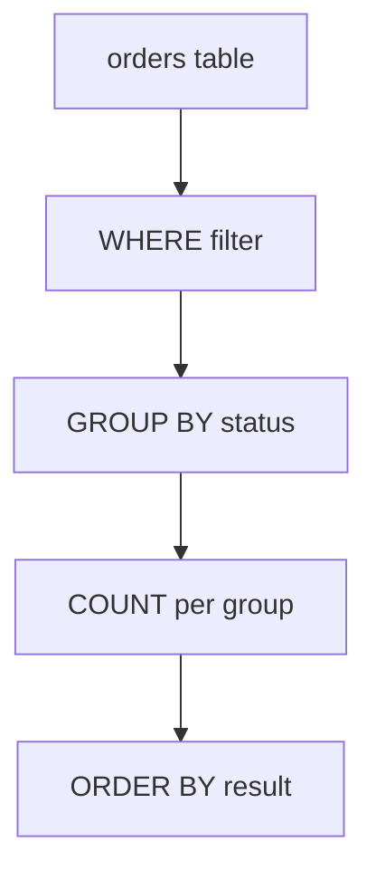

**Remember:** GROUP BY columns must appear in SELECT (unless inside an aggregate function).

---

### Pattern 2: Lookup with JOIN

**Intent:** Enrich rows by joining a reference table.

```sql
-- Attach category name to products
SELECT
    p.name       AS product_name,
    c.name       AS category_name,
    p.price
FROM products p
LEFT JOIN categories c ON p.category_id = c.id;
```

**Diagram:**

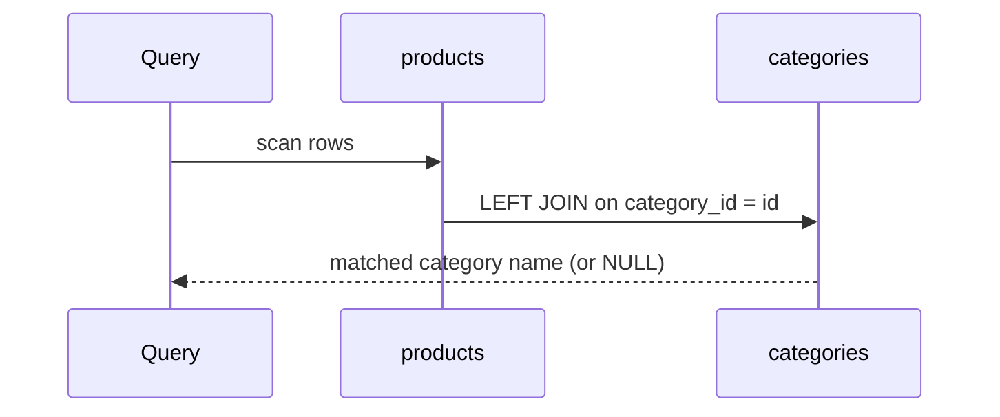

> Include 2-3 patterns at this level. Keep diagrams simple.
> Focus on patterns the beginner WILL encounter, not advanced ones.

---

## Clean Code

Basic clean code principles when writing SQL for {{TOPIC_NAME}}:

### Naming

```sql
-- ❌ Bad naming — cryptic aliases and no formatting
select u.n, count(o.i) from usr u join ord o on u.i=o.u group by u.n;

-- ✅ Clean naming — descriptive aliases, proper formatting
SELECT
    u.username,
    COUNT(o.id) AS total_orders
FROM users u
JOIN orders o ON u.id = o.user_id
GROUP BY u.username;
```

**Rules:**
- Table aliases: use meaningful short forms (`u` for `users`, `o` for `orders`)
- Column aliases: use `AS` keyword, name the result clearly (`total_orders` not `cnt`)
- Keywords: UPPERCASE for SQL keywords (SELECT, FROM, WHERE, JOIN)

---

### Query Structure

```sql
-- ❌ One-liner — hard to read, impossible to review
SELECT u.id, u.name, COUNT(o.id) FROM users u LEFT JOIN orders o ON u.id = o.user_id WHERE u.is_active=1 GROUP BY u.id, u.name HAVING COUNT(o.id)>5 ORDER BY 2;

-- ✅ Formatted — each clause on its own line
SELECT
    u.id,
    u.username,
    COUNT(o.id) AS order_count
FROM users u
LEFT JOIN orders o ON u.id = o.user_id
WHERE u.is_active = TRUE
GROUP BY u.id, u.username
HAVING COUNT(o.id) > 5
ORDER BY order_count DESC;
```

**Rule:** One clause per line. Indent column lists. This makes queries reviewable and diff-friendly.

---

### Comments

```sql
-- ❌ Noise comment (states the obvious)
-- Select all users
SELECT * FROM users;

-- ✅ Explains WHY, not WHAT
-- Include soft-deleted users only in admin reports, not in public-facing queries
SELECT * FROM users WHERE deleted_at IS NOT NULL;
```

**Rule:** Comments should explain business logic or non-obvious decisions, not re-state the SQL.

---

## Product Use / Feature

How this topic is used in real-world products and tools:

### 1. {{Product/Tool Name}}

- **How it uses {{TOPIC_NAME}}:** Brief description
- **Why it matters:** Practical impact

### 2. {{Product/Tool Name}}

- **How it uses {{TOPIC_NAME}}:** Brief description
- **Why it matters:** Practical impact

### 3. {{Product/Tool Name}}

- **How it uses {{TOPIC_NAME}}:** Brief description
- **Why it matters:** Practical impact

> 3-5 real products/tools. Show how the topic is applied in industry.

---

## Error Handling and Transaction Management

How to handle errors and use transactions when working with {{TOPIC_NAME}}:

### Error 1: `ERROR: column "x" does not exist`

```sql
-- ❌ Typo in column name
SELECT usernaem FROM users;
```

**Why it happens:** The column name doesn't exist in the table — check spelling and table aliases.
**How to fix:**

```sql
-- ✅ Correct column name
SELECT username FROM users;
```

### Error 2: `ERROR: operator does not exist: integer = text`

```sql
-- ❌ Type mismatch — comparing integer column to string literal
SELECT * FROM orders WHERE user_id = '42';
```

**Why it happens:** PostgreSQL enforces strict type matching; use the correct literal type.
**How to fix:**

```sql
-- ✅ Correct type — integer literal
SELECT * FROM orders WHERE user_id = 42;
```

### Basic Transaction Pattern

```sql
-- Wrap related changes in a transaction to keep data consistent
BEGIN;

UPDATE accounts SET balance = balance - 100 WHERE id = 1;
UPDATE accounts SET balance = balance + 100 WHERE id = 2;

-- If everything is correct, commit
COMMIT;

-- If something goes wrong, roll back
-- ROLLBACK;
```

**Rule:** Use `BEGIN / COMMIT / ROLLBACK` whenever multiple statements must succeed or fail together.

> 2-4 common errors. Show the error message, explain why, and provide the fix.
> Introduce transactions early — juniors must learn this from day one.

---

## Security Considerations

Security aspects to keep in mind when using {{TOPIC_NAME}}:

### 1. SQL Injection

```sql
-- ❌ Insecure — concatenating user input directly
query = "SELECT * FROM users WHERE username = '" + userInput + "'";
-- Attacker input: ' OR '1'='1  → returns all rows

-- ✅ Secure — parameterized query (shown in psql driver style)
SELECT * FROM users WHERE username = $1;
-- Pass userInput as a parameter, not as part of the query string
```

**Risk:** Full database compromise, data exfiltration, authentication bypass.
**Mitigation:** Always use parameterized queries / prepared statements. Never concatenate user input.

### 2. Overly Broad SELECT *

```sql
-- ❌ Returns all columns including sensitive ones (password_hash, ssn)
SELECT * FROM users WHERE id = $1;

-- ✅ Explicit column list — only expose what the feature needs
SELECT id, username, email FROM users WHERE id = $1;
```

**Risk:** Accidental exposure of sensitive fields to logs, APIs, or frontends.
**Mitigation:** Always specify the columns you need.

> 2-4 security considerations. Even juniors should learn secure SQL habits from the start.

---

## Performance Tips

Basic performance considerations for {{TOPIC_NAME}}:

### Tip 1: Avoid `SELECT *` in Production

```sql
-- ❌ Fetches all columns — wastes I/O and memory
SELECT * FROM orders WHERE user_id = 42;

-- ✅ Fetch only needed columns — faster, less network traffic
SELECT id, status, total_amount FROM orders WHERE user_id = 42;
```

**Why it's faster:** Fewer bytes transferred from database to application, less memory pressure.

### Tip 2: Filter Early with WHERE

```sql
-- ❌ Scan all rows, then filter in application code
SELECT * FROM events;  -- returns 10 million rows

-- ✅ Filter in the database — return only what you need
SELECT id, type, created_at FROM events WHERE created_at >= NOW() - INTERVAL '7 days';
```

**Why it's faster:** The database can use indexes and avoids sending irrelevant rows over the network.

### Tip 3: Use LIMIT for Exploration

```sql
-- When exploring data or testing queries, always add LIMIT
SELECT * FROM large_table LIMIT 100;
```

> 2-4 tips. Keep explanations simple.
> Avoid premature optimization advice — only include tips that are always applicable.

---

## Metrics & Analytics

Key metrics to track when using {{TOPIC_NAME}}:

### What to Measure

| Metric | Why it matters | Tool |
|--------|---------------|------|
| **Query execution time** | Slow queries degrade user experience | `EXPLAIN ANALYZE`, `pg_stat_statements` |
| **Rows returned** | Too many rows signals missing WHERE clause | `EXPLAIN ANALYZE` rows estimate |
| **Sequential scans on large tables** | Missing index — should be index scan | `pg_stat_user_tables` |

### Basic Instrumentation

```sql
-- Check slow queries (PostgreSQL)
SELECT query, mean_exec_time, calls
FROM pg_stat_statements
ORDER BY mean_exec_time DESC
LIMIT 10;
```

> **What to track at junior level:** query time, row count, whether an index is used.
> Keep it simple — 2-3 metrics that tell you "is the query performing reasonably?".

---

## Best Practices

- **Always use explicit column lists in SELECT:** Avoid `SELECT *` — specify what you need.
- **Use meaningful table aliases:** `u` for `users` is fine; `a` for everything is not.
- **Test with LIMIT first:** Before running a query on the full table, add `LIMIT 100` to validate the logic.
- **Use transactions for multi-step writes:** Wrap related INSERT/UPDATE/DELETE in BEGIN...COMMIT.
- **Handle NULL explicitly:** Use `IS NULL` / `IS NOT NULL`; never `= NULL`.

> 3-5 best practices. Keep them actionable and specific to juniors.

---

## Edge Cases & Pitfalls

### Pitfall 1: NULL Comparisons

```sql
-- ❌ This returns NO rows — NULL != NULL in SQL
SELECT * FROM users WHERE deleted_at = NULL;

-- ✅ Correct NULL check
SELECT * FROM users WHERE deleted_at IS NULL;
```

**What happens:** `= NULL` always evaluates to UNKNOWN (not TRUE), so no rows match.
**How to fix:** Always use `IS NULL` or `IS NOT NULL`.

### Pitfall 2: HAVING vs WHERE

```sql
-- ❌ Using WHERE to filter aggregates — syntax error
SELECT department, COUNT(*) FROM employees WHERE COUNT(*) > 5 GROUP BY department;

-- ✅ Use HAVING to filter aggregate results
SELECT department, COUNT(*) AS headcount
FROM employees
GROUP BY department
HAVING COUNT(*) > 5;
```

**What happens:** WHERE filters individual rows before aggregation; HAVING filters groups after aggregation.

---

## Common Mistakes

### Mistake 1: Forgetting GROUP BY columns

```sql
-- ❌ Wrong — selects username but doesn't group by it
SELECT username, COUNT(order_id) FROM orders GROUP BY user_id;

-- ✅ Include all non-aggregate columns in GROUP BY
SELECT user_id, username, COUNT(order_id) AS total
FROM orders
GROUP BY user_id, username;
```

### Mistake 2: Using ORDER BY column number instead of name

```sql
-- ❌ Fragile — breaks if column order changes
SELECT id, username, email FROM users ORDER BY 2;

-- ✅ Explicit — always use column name or alias
SELECT id, username, email FROM users ORDER BY username;
```

> 3-5 mistakes that juniors commonly make with SQL.

---

## Common Misconceptions

### Misconception 1: "SELECT * is fine for quick queries"

**Reality:** Even in development, `SELECT *` can accidentally expose sensitive columns (passwords, tokens) and creates fragile code that breaks when schema changes.

**Why people think this:** It's shorter to type and works correctly in terms of data retrieval.

### Misconception 2: "JOINs are always slow"

**Reality:** A properly indexed JOIN is extremely fast. JOINs become slow only when indexes are missing or the query planner has stale statistics.

**Why people think this:** They've seen slow JOINs on tables without indexes, then generalized incorrectly.

> 2-4 misconceptions. Directly address false beliefs beginners commonly hold.

---

## Tricky Points

Things that look simple but have subtle behavior:

### Tricky Point 1: NULL in aggregate functions

```sql
-- COUNT(*) counts all rows; COUNT(column) skips NULLs
SELECT
    COUNT(*)             AS total_rows,
    COUNT(email)         AS rows_with_email,
    COUNT(DISTINCT email) AS unique_emails
FROM users;
```

**Why it's tricky:** The three COUNT variants behave differently — many beginners expect them to be equivalent.
**Key takeaway:** `COUNT(column)` ignores NULL values; `COUNT(*)` never does.

---

## Test

### Multiple Choice

**1. Which JOIN type returns all rows from the left table, even if there is no match in the right table?**

- A) INNER JOIN
- B) RIGHT JOIN
- C) LEFT JOIN
- D) CROSS JOIN

<details>
<summary>Answer</summary>
**C)** — LEFT JOIN returns all rows from the left table. Unmatched rows from the right side appear as NULL. INNER JOIN would exclude those rows entirely.
</details>

**2. What does `WHERE deleted_at = NULL` return?**

- A) All rows where deleted_at is NULL
- B) An error
- C) Zero rows
- D) All rows

<details>
<summary>Answer</summary>
**C)** — Comparing any value to NULL with `=` always evaluates to UNKNOWN, not TRUE. Use `IS NULL` instead.
</details>

### True or False

**3. `HAVING` can be used without `GROUP BY`.**

<details>
<summary>Answer</summary>
**True** — HAVING without GROUP BY treats the entire result set as one group. Rarely useful, but syntactically valid. E.g., `SELECT COUNT(*) FROM users HAVING COUNT(*) > 0`.
</details>

### What's the Output?

**4. What does this query return if the `orders` table is empty?**

```sql
SELECT COUNT(*) FROM orders;
```

<details>
<summary>Answer</summary>
Output: `0` (one row containing the integer 0).
Explanation: COUNT(*) always returns a row, even on an empty table. This is different from SUM or AVG, which return NULL on empty input.
</details>

**5. What is the difference between these two queries?**

```sql
-- Query A
SELECT * FROM users WHERE department = 'Sales' OR department = 'Marketing';

-- Query B
SELECT * FROM users WHERE department IN ('Sales', 'Marketing');
```

<details>
<summary>Answer</summary>
Both return the same result set. Query B with IN is more readable and slightly easier for the query planner to optimize when the list is long.
</details>

> 5-8 test questions total. Mix of multiple choice, true/false, and "what's the output".

---

## "What If?" Scenarios

**What if you forget the WHERE clause in an UPDATE?**
- **You might think:** The query will fail with an error.
- **But actually:** The UPDATE modifies every row in the table. This is a common and devastating mistake — always double-check your WHERE clause before running UPDATE or DELETE.

**What if you JOIN two tables with no matching rows?**
- **You might think:** It returns an error.
- **But actually:** INNER JOIN returns zero rows (no match = no output). LEFT JOIN returns all left-table rows with NULLs for right-side columns.

---

## Tricky Questions

**1. Which statement correctly inserts a row with a NULL value for `email`?**

- A) `INSERT INTO users (name, email) VALUES ('Alice', '')`
- B) `INSERT INTO users (name, email) VALUES ('Alice', 'NULL')`
- C) `INSERT INTO users (name) VALUES ('Alice')`
- D) Both C and `INSERT INTO users (name, email) VALUES ('Alice', NULL)`

<details>
<summary>Answer</summary>
**D)** — Option A inserts an empty string (not NULL). Option B inserts the literal text 'NULL'. Option C omits the column (defaults to NULL if the column has no DEFAULT). Explicit `NULL` literal in option D is the clearest approach.
</details>

**2. What does `SELECT 1/0` return in PostgreSQL?**

- A) 0
- B) NULL
- C) Infinity
- D) An error

<details>
<summary>Answer</summary>
**D)** — PostgreSQL raises `ERROR: division by zero`. MySQL returns NULL. This behavior differs by database engine.
</details>

> 3-5 tricky questions. Each should have at least one very convincing wrong answer.

---

## Cheat Sheet

Quick reference for this topic:

| What | Syntax | Example |
|------|--------|---------|
| Select rows | `SELECT cols FROM tbl WHERE cond` | `SELECT id, name FROM users WHERE active = TRUE` |
| Insert a row | `INSERT INTO tbl (cols) VALUES (vals)` | `INSERT INTO users (name, email) VALUES ('Alice', 'a@x.com')` |
| Update rows | `UPDATE tbl SET col = val WHERE cond` | `UPDATE users SET email = 'b@x.com' WHERE id = 1` |
| Delete rows | `DELETE FROM tbl WHERE cond` | `DELETE FROM users WHERE id = 1` |
| Inner join | `FROM a INNER JOIN b ON a.id = b.a_id` | `FROM orders o INNER JOIN users u ON o.user_id = u.id` |
| Left join | `FROM a LEFT JOIN b ON a.id = b.a_id` | `FROM users u LEFT JOIN orders o ON u.id = o.user_id` |
| Group & count | `SELECT col, COUNT(*) FROM tbl GROUP BY col` | `SELECT status, COUNT(*) FROM orders GROUP BY status` |
| Filter groups | `HAVING COUNT(*) > n` | `GROUP BY dept HAVING COUNT(*) > 5` |
| NULL check | `col IS NULL` / `col IS NOT NULL` | `WHERE deleted_at IS NULL` |
| Transaction | `BEGIN; ...; COMMIT;` | `BEGIN; UPDATE ...; COMMIT;` |

---

## Self-Assessment Checklist

### I can explain:
- [ ] What a relational table is and how rows and columns relate
- [ ] The difference between INNER JOIN, LEFT JOIN, and RIGHT JOIN
- [ ] When to use WHERE vs HAVING
- [ ] Why `= NULL` doesn't work and what to use instead

### I can do:
- [ ] Write SELECT queries with WHERE, ORDER BY, LIMIT
- [ ] Use GROUP BY with COUNT, SUM, AVG, MAX, MIN
- [ ] Join two tables with INNER JOIN and LEFT JOIN
- [ ] Write INSERT, UPDATE, DELETE with proper WHERE clauses
- [ ] Wrap multiple writes in a transaction

### I can answer:
- [ ] All multiple choice questions in this document
- [ ] "What's the output?" questions correctly

---

## Summary

- SQL queries follow a logical order: FROM → WHERE → GROUP BY → HAVING → SELECT → ORDER BY → LIMIT
- Always specify columns in SELECT; avoid `SELECT *` in production code
- NULL requires special handling: use `IS NULL` / `IS NOT NULL`, never `= NULL`
- JOINs combine tables by matching column values; LEFT JOIN preserves unmatched rows from the left table
- Wrap related writes in `BEGIN / COMMIT / ROLLBACK` transactions

**Next step:** Learn window functions, subqueries, and query optimization at the Middle level.

---

## What You Can Build

Now that you understand {{TOPIC_NAME}}, here's what you can build or use it for:

### Projects you can create:
- **Simple reporting dashboard:** Pull aggregated counts and sums from an orders or analytics table
- **User management CRUD:** Build the SQL layer for registering, updating, and soft-deleting users
- **Data exploration scripts:** Query logs or event tables to answer business questions

### Technologies / tools that use this:
- **PostgreSQL / MySQL / SQLite** — all use standard SQL syntax covered here
- **ORMs (SQLAlchemy, ActiveRecord, GORM)** — understanding raw SQL makes ORM debugging straightforward
- **BI tools (Metabase, Grafana)** — dashboards are built on top of SQL queries

### Learning path — what to study next:

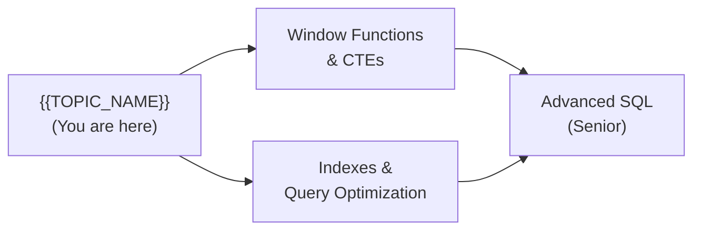

---

## Further Reading

- **Official docs:** [PostgreSQL SELECT documentation](https://www.postgresql.org/docs/current/sql-select.html)
- **Blog post:** [SQL for beginners — Mode Analytics SQL Tutorial](https://mode.com/sql-tutorial/) — interactive exercises covering all basics
- **Book:** *Learning SQL* by Alan Beaulieu, Chapters 1-7 — foundations of querying
- **Interactive practice:** [SQLZoo](https://sqlzoo.net/) — hands-on exercises for every concept in this level

---

## Related Topics

Topics to explore next or that connect to this one:

- **[Indexes & Query Optimization](../indexes/)** — how to make the queries you learned faster
- **[Database Design & Normalization](../normalization/)** — how to design the tables your queries run against
- **[Window Functions](../window-functions/)** — powerful analytical queries beyond GROUP BY

---

## Diagrams & Visual Aids

> Include **at least 2-3 visual aids** per document.

### Mind Map

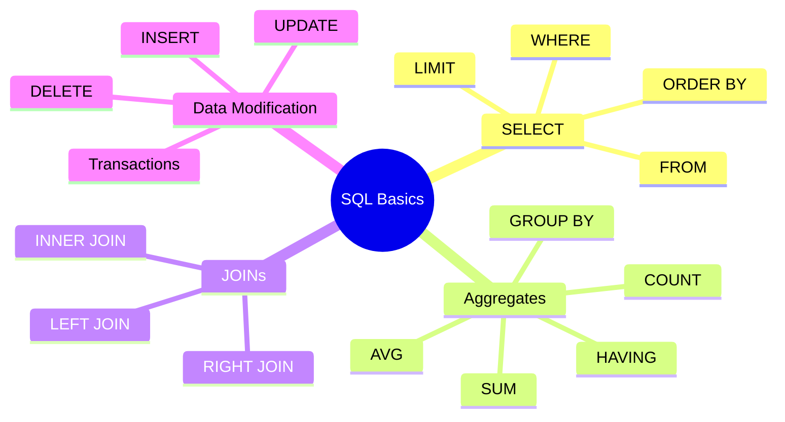

### JOIN Types Visual

```
INNER JOIN            LEFT JOIN             FULL OUTER JOIN
  ┌──┬──┐              ┌──┬──┐              ┌──┬──┐
  │  │██│              │██│██│              │██│██│
  │  │██│              │██│██│              │██│██│
  └──┴──┘              └──┴──┘              └──┴──┘
 Only matching         All left +           All rows from
    rows               matches              both tables
```

### Query Execution Order


</details>

---
---

# TEMPLATE 2 — `middle.md`

<details open>
<summary><strong>Template Content</strong></summary>

# {{TOPIC_NAME}} — Middle Level

<!-- Table of Contents is OPTIONAL. Include only if the topic has many sections and it helps navigation. Remove this section entirely if not needed. -->

## Table of Contents

1. [Introduction](#introduction)
2. [Core Concepts](#core-concepts)
3. [Pros & Cons](#pros--cons)
4. [Use Cases](#use-cases)
5. [Query Examples](#query-examples)
6. [Product Use / Feature](#product-use--feature)
7. [Error Handling and Transaction Management](#error-handling-and-transaction-management)
8. [Security Considerations](#security-considerations)
9. [Performance Optimization](#performance-optimization)
10. [Metrics & Analytics](#metrics--analytics)
11. [Debugging Guide](#debugging-guide)
12. [Best Practices](#best-practices)
13. [Edge Cases & Pitfalls](#edge-cases--pitfalls)
14. [Common Mistakes](#common-mistakes)
15. [Tricky Points](#tricky-points)
16. [Comparison with NoSQL Databases (MongoDB, Redis, Elasticsearch, Cassandra)](#comparison-with-nosql-databases)
17. [Test](#test)
18. [Tricky Questions](#tricky-questions)
19. [Cheat Sheet](#cheat-sheet)
20. [Summary](#summary)
21. [What You Can Build](#what-you-can-build)
22. [Further Reading](#further-reading)
23. [Related Topics](#related-topics)
24. [Diagrams & Visual Aids](#diagrams--visual-aids)

---

## Introduction

> Focus: "Why?" and "When to use?"

Assumes the reader already knows basic SELECT/JOIN/GROUP BY. This level covers:
- Deeper understanding of how {{TOPIC_NAME}} works internally
- Window functions, CTEs, and subqueries for real-world analytical queries
- Query optimization basics using EXPLAIN ANALYZE
- Index types and when to use them
- Normalization and database design patterns

---

## Core Concepts

### Concept 1: Window Functions

Unlike GROUP BY (which collapses rows), window functions compute values across a set of rows while keeping each row intact.

```sql
-- ROW_NUMBER: rank employees by salary within each department
SELECT
    name,
    department,
    salary,
    ROW_NUMBER() OVER (PARTITION BY department ORDER BY salary DESC) AS dept_rank
FROM employees;
```

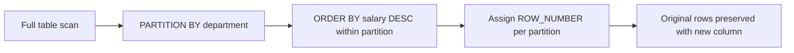

### Concept 2: Common Table Expressions (CTEs)

CTEs (`WITH` clauses) name an intermediate result set, making complex queries readable and reusable within the same query.

```sql
WITH monthly_revenue AS (
    SELECT
        DATE_TRUNC('month', created_at) AS month,
        SUM(amount) AS revenue
    FROM orders
    WHERE status = 'paid'
    GROUP BY 1
)
SELECT
    month,
    revenue,
    LAG(revenue) OVER (ORDER BY month) AS prev_month_revenue,
    revenue - LAG(revenue) OVER (ORDER BY month) AS delta
FROM monthly_revenue
ORDER BY month;
```

### Concept 3: Index Types

| Index Type | Best For | Notes |
|-----------|---------|-------|
| **B-tree** (default) | Equality, range, ORDER BY | The default for most columns |
| **Hash** | Equality only (`=`) | Slightly faster for exact match; not WAL-logged in older PG versions |
| **Partial** | Subset of rows (e.g., `WHERE active = TRUE`) | Smaller index, faster for filtered queries |
| **Composite** | Multi-column filter/sort | Column order matters — leftmost prefix rule |
| **GIN** | JSONB, arrays, full-text search | Expensive to build; fast for containment queries |

> **Rules:**
> - Go deeper than junior. Explain "why" not just "what".
> - Compare different approaches and their trade-offs.
> - Include EXPLAIN ANALYZE output where relevant.

---

## Evolution & Historical Context

Why does {{TOPIC_NAME}} exist? What problem does it solve?

**Before window functions (pre-SQL:2003):**
- Ranking and running totals required self-joins or correlated subqueries — O(n²) complexity, slow and hard to read.

**How window functions changed things:**
- Introduced in SQL:2003, window functions allow row-level analytical computations without collapsing the result set, enabling clean and efficient analytical SQL.

> Understanding the history helps developers appreciate *why* things are designed the way they are.

---

## Pros & Cons

| Pros | Cons |
|------|------|
| {{Advantage 1 with production context}} | {{Disadvantage 1 with impact analysis}} |
| {{Advantage 2}} | {{Disadvantage 2}} |
| {{Advantage 3}} | {{Disadvantage 3}} |

### Trade-off analysis:

- **CTEs vs subqueries:** CTEs improve readability and can be referenced multiple times; in PostgreSQL pre-12 they act as optimization fences (the planner cannot push predicates through them).
- **Partial indexes vs full indexes:** Partial indexes are smaller and faster for filtered queries but only help when the query matches the index's WHERE condition exactly.

### Comparison with alternatives:

| Approach | Pros | Cons | Best for |
|----------|------|------|----------|
| Window function | Keeps all rows, clean syntax | Requires understanding of OVER clause | Analytics, ranking, running totals |
| Self-join | Works in any SQL dialect | Quadratic complexity, hard to read | Legacy systems without window functions |
| Subquery | Familiar, widely supported | Can be slower; correlated subqueries are O(n²) | Simple lookups |

---

## Alternative Approaches (Plan B)

| Alternative | How it works | When you might be forced to use it |
|-------------|--------------|------------------------------------|
| **Application-side aggregation** | Pull raw rows, compute in code | When the database is a legacy system without window function support |
| **Materialized views** | Pre-compute expensive aggregations, refresh on schedule | When real-time window function queries are too slow |

---

## Use Cases

Real-world, production scenarios:

- **Use Case 1:** Leaderboard / ranking — ROW_NUMBER or RANK over a score column
- **Use Case 2:** Running totals and moving averages for financial dashboards — SUM OVER, AVG OVER
- **Use Case 3:** Detecting gaps and duplicates — LAG/LEAD to compare consecutive rows
- **Use Case 4:** Sessionization — group user events into sessions using time gaps

---

## Query Examples

### Example 1: Running total with window function

```sql
-- Running total of revenue by day
SELECT
    sale_date,
    daily_revenue,
    SUM(daily_revenue) OVER (ORDER BY sale_date) AS running_total
FROM (
    SELECT DATE(created_at) AS sale_date, SUM(amount) AS daily_revenue
    FROM orders WHERE status = 'paid'
    GROUP BY 1
) daily
ORDER BY sale_date;
```

**Why this pattern:** The outer window SUM preserves each row while accumulating the total — impossible with GROUP BY alone.

### Example 2: Top-N per group

```sql
-- Top 3 products by revenue in each category
WITH ranked AS (
    SELECT
        category_id,
        product_id,
        SUM(quantity * price) AS revenue,
        RANK() OVER (PARTITION BY category_id ORDER BY SUM(quantity * price) DESC) AS rnk
    FROM order_items oi
    JOIN products p ON oi.product_id = p.id
    GROUP BY category_id, product_id
)
SELECT category_id, product_id, revenue
FROM ranked
WHERE rnk <= 3;
```

**When to use which:** Use RANK when ties should share the same rank; ROW_NUMBER when you strictly need exactly N rows per group.

> **Rules:**
> - Code should be production-quality. Include proper aliasing and formatting.
> - Show comparisons between approaches (CTE vs subquery, RANK vs ROW_NUMBER).

---

## Coding Patterns

Design patterns for {{TOPIC_NAME}} in production SQL:

### Pattern 1: CTE Chain (Pipeline Pattern)

**Category:** Structural / Readability
**Intent:** Break a complex multi-step transformation into named, readable stages.
**When to use:** When a query has 3+ transformation steps.
**When NOT to use:** Pre-PostgreSQL 12 when CTE optimization fences cause performance issues.

```sql
WITH
  raw_events AS (
      SELECT user_id, event_type, created_at
      FROM events
      WHERE created_at >= NOW() - INTERVAL '30 days'
  ),
  session_starts AS (
      SELECT user_id, created_at,
             LAG(created_at) OVER (PARTITION BY user_id ORDER BY created_at) AS prev_event
      FROM raw_events
  ),
  sessions AS (
      SELECT user_id,
             COUNT(*) FILTER (WHERE prev_event IS NULL OR created_at - prev_event > INTERVAL '30 minutes') AS session_count
      FROM session_starts
      GROUP BY user_id
  )
SELECT u.username, s.session_count
FROM sessions s
JOIN users u ON s.user_id = u.id
ORDER BY session_count DESC;
```

**Trade-offs:**

| Pros | Cons |
|------|------|
| Readable, self-documenting | PostgreSQL < 12: each CTE is a separate optimization boundary |
| Easy to debug step-by-step | Can generate more intermediate materializations than a flat query |

---

### Pattern 2: FILTER aggregate (conditional aggregation)

**Intent:** Count/sum subsets without multiple queries or subqueries.

```sql
-- Count orders by status in a single pass
SELECT
    COUNT(*) FILTER (WHERE status = 'pending')   AS pending,
    COUNT(*) FILTER (WHERE status = 'paid')      AS paid,
    COUNT(*) FILTER (WHERE status = 'cancelled') AS cancelled
FROM orders
WHERE created_at >= NOW() - INTERVAL '7 days';
```

---

## Clean Code

Production-level clean code principles for SQL:

### Naming & Readability

```sql
-- ❌ Cryptic
SELECT u.n, COUNT(o.i) c FROM usr u JOIN ord o ON u.i=o.u WHERE o.s='p' GROUP BY u.n;

-- ✅ Self-documenting
SELECT
    u.username,
    COUNT(o.id) AS paid_order_count
FROM users u
JOIN orders o ON u.id = o.user_id
WHERE o.status = 'paid'
GROUP BY u.username;
```

| Element | Rule | Example |
|---------|------|---------|
| Table aliases | Match table name initials | `u` for `users`, `oi` for `order_items` |
| Column aliases | Describe the result | `paid_order_count`, not `cnt` |
| CTEs | Named as nouns describing their content | `monthly_revenue`, `ranked_products` |
| Constants | Use named CTEs or comments for magic values | `-- 30 day lookback` |

---

### DRY vs WET

```sql
-- ❌ WET — same date truncation repeated 3 times
SELECT DATE_TRUNC('month', created_at), SUM(amount) FROM orders GROUP BY DATE_TRUNC('month', created_at);

-- ✅ DRY — define once in a CTE
WITH monthly AS (
    SELECT DATE_TRUNC('month', created_at) AS month, amount FROM orders
)
SELECT month, SUM(amount) FROM monthly GROUP BY month;
```

---

## Product Use / Feature

### 1. {{Product/Tool Name}}

- **How it uses {{TOPIC_NAME}}:** Description with architectural context
- **Scale:** Numbers, traffic, data volume
- **Key insight:** What can be learned from their approach

### 2. {{Product/Tool Name}}

- **How it uses {{TOPIC_NAME}}:** Description
- **Why this approach:** Trade-offs they made

> 3-5 real products. Focus on production-scale usage and architectural decisions.

---

## Error Handling and Transaction Management

Production-grade error and transaction patterns for {{TOPIC_NAME}}:

### Pattern 1: Savepoints for partial rollback

```sql
BEGIN;

INSERT INTO orders (user_id, total) VALUES (1, 150.00);
SAVEPOINT after_order;

INSERT INTO order_items (order_id, product_id, quantity) VALUES (currval('orders_id_seq'), 99, 1);
-- If the item insert fails, roll back only the item, keep the order
ROLLBACK TO SAVEPOINT after_order;

-- Continue with alternative item
INSERT INTO order_items (order_id, product_id, quantity) VALUES (currval('orders_id_seq'), 100, 1);

COMMIT;
```

**When to use:** Complex multi-step writes where partial failure is acceptable.

### Pattern 2: Transaction isolation levels

| Level | Dirty Read | Non-repeatable Read | Phantom Read | Use When |
|-------|-----------|--------------------|-----------| ---------|
| READ COMMITTED (default) | No | Yes | Yes | Most OLTP workloads |
| REPEATABLE READ | No | No | No (in PG) | Consistent snapshots, report queries |
| SERIALIZABLE | No | No | No | Financial transactions, inventory |

```sql
-- Use REPEATABLE READ for consistent monthly report
BEGIN TRANSACTION ISOLATION LEVEL REPEATABLE READ;
SELECT SUM(amount) FROM orders WHERE DATE_TRUNC('month', created_at) = '2024-01-01';
COMMIT;
```

---

## Security Considerations

### 1. Privilege escalation via public schema

**Risk level:** High

```sql
-- ❌ Granting broad access
GRANT ALL ON ALL TABLES IN SCHEMA public TO app_user;

-- ✅ Least privilege — grant only what the application needs
GRANT SELECT, INSERT, UPDATE ON orders, users TO app_user;
GRANT USAGE ON SEQUENCE orders_id_seq TO app_user;
```

**Mitigation:** Apply principle of least privilege at the database role level.

### Security Checklist

- [ ] Application DB user has only necessary privileges (no DROP, no TRUNCATE)
- [ ] Parameterized queries used everywhere (no string concatenation)
- [ ] Sensitive columns (passwords, tokens, SSNs) not returned in generic SELECT *
- [ ] Row-level security (RLS) enabled for multi-tenant tables

---

## Performance Optimization

### Optimization 1: Index on filtered columns

```sql
-- ❌ Slow — sequential scan on 10M row table
SELECT * FROM events WHERE user_id = 42 AND event_type = 'purchase';

-- ✅ Add composite index matching the query's filter
CREATE INDEX idx_events_user_type ON events (user_id, event_type);
-- Then re-run the query — index scan replaces seq scan
```

**EXPLAIN ANALYZE before:**
```text
Seq Scan on events  (cost=0.00..245000.00 rows=1 width=128)
                    (actual time=0.042..1823.441 rows=1 loops=1)
```

**EXPLAIN ANALYZE after:**
```text
Index Scan using idx_events_user_type on events
                    (cost=0.56..8.58 rows=1 width=128)
                    (actual time=0.032..0.034 rows=1 loops=1)
```

**When to optimize:** When `pg_stat_statements` shows high `mean_exec_time` and EXPLAIN shows Seq Scan on large tables.

### Performance Decision Matrix

| Scenario | Approach | Why |
|----------|----------|-----|
| Low-traffic admin query | No index needed | Maintenance cost outweighs benefit |
| High-traffic filtered read | Composite index | Eliminates sequential scan |
| JSONB attribute queries | GIN index | Standard B-tree can't search inside JSON |

---

## Metrics & Analytics

### Key Metrics

| Metric | Type | Description | Alert threshold |
|--------|------|-------------|-----------------|
| **Mean query time** | Gauge | Average execution time per query | > 100ms for OLTP |
| **Cache hit ratio** | Gauge | % of blocks served from shared_buffers | < 95% needs investigation |
| **Index scan ratio** | Gauge | % of table scans using index vs seq scan | Seq scans on large tables = alert |

### Prometheus / pg_stat_statements

```sql
-- Top 10 slowest queries
SELECT
    LEFT(query, 80) AS query_snippet,
    calls,
    ROUND(mean_exec_time::numeric, 2) AS avg_ms,
    ROUND(total_exec_time::numeric / 1000, 2) AS total_sec
FROM pg_stat_statements
ORDER BY mean_exec_time DESC
LIMIT 10;
```

---

## Debugging Guide

### Problem 1: Query suddenly slow after data growth

**Symptoms:** A query that ran in 10ms now takes 5 seconds.

**Diagnostic steps:**
```sql
-- Step 1: Check if statistics are stale
ANALYZE table_name;

-- Step 2: Run EXPLAIN ANALYZE to see the actual plan
EXPLAIN (ANALYZE, BUFFERS) SELECT ...;

-- Step 3: Check for sequential scans
SELECT schemaname, tablename, seq_scan, idx_scan
FROM pg_stat_user_tables
ORDER BY seq_scan DESC;
```

**Root cause:** Table grew past the threshold where the planner switches from index scan to seq scan, often because statistics are stale.
**Fix:** `ANALYZE` or `VACUUM ANALYZE` the table; consider adding an index.

### Useful Tools

| Tool | Command | What it shows |
|------|---------|---------------|
| EXPLAIN ANALYZE | `EXPLAIN (ANALYZE, BUFFERS) <query>` | Actual rows, actual time, buffer hits |
| pg_stat_statements | `SELECT * FROM pg_stat_statements` | Historical query performance |
| pg_stat_user_tables | `SELECT * FROM pg_stat_user_tables` | Seq scans, index scans, dead tuples |

---

## Best Practices

- **Use EXPLAIN ANALYZE before deploying any new query to production:** Validate the query plan.
- **Create indexes based on actual query patterns:** Don't index every column speculatively.
- **Prefer CTEs for readability, but benchmark them:** PostgreSQL 12+ allows CTE inlining; pre-12 CTEs are optimization fences.
- **Use RETURNING in INSERT/UPDATE:** Avoid a second round-trip to fetch the generated ID.
- **Avoid N+1 queries:** Batch lookups in a single JOIN or `WHERE id IN (...)` instead of looping.

---

## Edge Cases & Pitfalls

### Pitfall 1: CTEs as optimization fences (PostgreSQL < 12)

```sql
-- In PostgreSQL < 12, the planner cannot push predicates into CTEs
WITH all_users AS (
    SELECT * FROM users  -- This materializes ALL users first
)
SELECT * FROM all_users WHERE id = 42;
-- Becomes a full table scan + filter, not an index seek
```

**Impact:** Severe performance regression on large tables.
**Fix:** In PG 12+, CTEs are inlined by default. In older versions, convert to a subquery or use `NOT MATERIALIZED`.

### Pitfall 2: DISTINCT is not a performance optimization

```sql
-- ❌ Using DISTINCT to "fix" a query that returns duplicates
SELECT DISTINCT u.id FROM users u JOIN orders o ON u.id = o.user_id;

-- ✅ Fix the root cause — use EXISTS or a subquery
SELECT u.id FROM users u WHERE EXISTS (SELECT 1 FROM orders o WHERE o.user_id = u.id);
```

**Impact:** DISTINCT forces a sort/hash on the full result set; fixing the JOIN is almost always faster.

---

## Common Mistakes

### Mistake 1: Implicit type cast blocking index use

```sql
-- ❌ Casting a column — prevents index use
SELECT * FROM users WHERE CAST(id AS TEXT) = '42';

-- ✅ Cast the literal, not the column
SELECT * FROM users WHERE id = 42;
```

**Why it's wrong:** Applying a function or cast to an indexed column forces a sequential scan — the index on `id` cannot be used.

---

## Common Misconceptions

### Misconception 1: "More indexes = better performance"

**Reality:** Each index slows down INSERT, UPDATE, and DELETE because all indexes must be maintained. Over-indexing wastes disk space and hurts write-heavy workloads.

**Evidence:**
```sql
-- Check index bloat and unused indexes
SELECT indexrelname, idx_scan, pg_size_pretty(pg_relation_size(indexrelid)) AS size
FROM pg_stat_user_indexes
WHERE idx_scan = 0
ORDER BY pg_relation_size(indexrelid) DESC;
```

### Misconception 2: "EXPLAIN and EXPLAIN ANALYZE show the same thing"

**Reality:** EXPLAIN shows the *estimated* plan based on statistics; EXPLAIN ANALYZE *actually runs* the query and shows real row counts and timings. The two often differ significantly for skewed data distributions.

---

## Anti-Patterns

### Anti-Pattern 1: SELECT * in application queries

```sql
-- ❌ Fetches all columns including large TEXT/JSONB fields
SELECT * FROM products WHERE id = $1;
```

**Why it's bad:** As the schema evolves, new large columns are silently included, increasing payload size and breaking serialization.
**The refactoring:** Always enumerate columns. Add a view if many queries need the same subset.

### Anti-Pattern 2: Correlated subqueries in SELECT list

```sql
-- ❌ Executes a subquery for EVERY row — O(n) queries
SELECT
    id,
    (SELECT COUNT(*) FROM orders WHERE user_id = u.id) AS order_count
FROM users u;

-- ✅ One JOIN — single pass
SELECT u.id, COUNT(o.id) AS order_count
FROM users u
LEFT JOIN orders o ON u.id = o.user_id
GROUP BY u.id;
```

---

## Tricky Points

### Tricky Point 1: RANK vs DENSE_RANK vs ROW_NUMBER

```sql
SELECT name, score,
    RANK()        OVER (ORDER BY score DESC) AS rank_val,
    DENSE_RANK()  OVER (ORDER BY score DESC) AS dense_rank_val,
    ROW_NUMBER()  OVER (ORDER BY score DESC) AS row_num
FROM leaderboard;
-- If scores are: 100, 100, 90
-- RANK:        1, 1, 3  (gap after tie)
-- DENSE_RANK:  1, 1, 2  (no gap)
-- ROW_NUMBER:  1, 2, 3  (arbitrary tie-breaking)
```

**Why it's tricky:** All three look similar but behave differently on ties — using the wrong one corrupts rankings.

---

## Comparison with NoSQL Databases

How SQL handles {{TOPIC_NAME}} compared to NoSQL alternatives:

| Aspect | PostgreSQL (SQL) | MongoDB | Redis | Cassandra |
|--------|:---------------:|:-------:|:-----:|:---------:|
| **Window functions** | Native, rich | Limited ($setWindowFields in v5.0+) | None | None |
| **JOIN support** | Full (any topology) | `$lookup` (limited) | None | None |
| **Aggregation** | GROUP BY + HAVING | Aggregation pipeline | Sorted sets (simple) | Materialized via Spark |
| **Schema** | Enforced | Flexible (schemaless) | Key-value | Wide-column, fixed partition key |
| **ACID transactions** | Full multi-row | Multi-document (v4.0+) | Lua scripts / MULTI | Lightweight transactions |

### Key differences:

- **SQL vs MongoDB:** SQL enforces schema and referential integrity; MongoDB trades these for flexible schema and horizontal sharding ease.
- **SQL vs Redis:** Redis is a cache/data structure store; SQL is a query engine. They complement each other rather than compete.
- **SQL vs Cassandra:** Cassandra sacrifices JOIN and flexible querying for linear horizontal write scalability; design your queries before your schema.

---

## Test

### Multiple Choice (harder)

**1. You run `EXPLAIN ANALYZE` and see `rows=1000` in the estimate but `rows=1` in actual. What is the most likely cause?**

- A) The query has a bug
- B) Table statistics are stale — run ANALYZE
- C) The index is corrupted
- D) PostgreSQL always underestimates row counts

<details>
<summary>Answer</summary>
**B)** — A large discrepancy between estimated and actual rows almost always means stale statistics. Run `ANALYZE table_name` or `VACUUM ANALYZE table_name` to refresh them.
</details>

### Code Analysis

**2. This query is called 10,000 times per second. What is the problem?**

```sql
SELECT * FROM products WHERE LOWER(name) = LOWER($1);
```

<details>
<summary>Answer</summary>
The `LOWER()` function on the column prevents index use. The index on `name` is useless here. Fix: Create a functional index: `CREATE INDEX idx_products_name_lower ON products (LOWER(name));` and query without the cast on the column side.
</details>

### Debug This

**3. This CTE query returns inconsistent results on PostgreSQL 11. Find the issue.**

```sql
WITH recent_orders AS (
    SELECT * FROM orders WHERE created_at > NOW() - INTERVAL '1 day'
)
SELECT * FROM recent_orders WHERE user_id = $1;
```

<details>
<summary>Answer</summary>
On PostgreSQL 11 and earlier, CTEs are optimization fences — `recent_orders` is fully materialized (all rows for the last day) before the `WHERE user_id = $1` filter is applied. This can be orders of magnitude slower than expected. Fix: In PG 12+, this inlines automatically. In PG 11, rewrite as a subquery: `SELECT * FROM (SELECT * FROM orders WHERE created_at > NOW() - INTERVAL '1 day') r WHERE user_id = $1`.
</details>

---

## Tricky Questions

**1. ROW_NUMBER() OVER (ORDER BY score DESC) guarantees a stable order for tied scores.**

- A) True — ROW_NUMBER is deterministic
- B) False — without a tiebreaker, the order of tied rows is non-deterministic
- C) True — PostgreSQL always breaks ties by physical row order
- D) It depends on the index used

<details>
<summary>Answer</summary>
**B)** — ROW_NUMBER assigns unique numbers, but without a secondary sort key (e.g., `ORDER BY score DESC, id ASC`), tied rows can appear in any order across executions. The result is deterministic within a single query execution but may differ between runs.
</details>

---

## Cheat Sheet

| Scenario | Pattern | Key consideration |
|----------|---------|-------------------|
| Top-N per group | `RANK() OVER (PARTITION BY g ORDER BY v) <= N` | Use ROW_NUMBER for strict N, RANK for ties |
| Running total | `SUM(v) OVER (ORDER BY date)` | Default frame is ROWS UNBOUNDED PRECEDING |
| Compare to previous row | `LAG(v, 1) OVER (ORDER BY date)` | Returns NULL for first row |
| Avoid CTE fence (PG 11) | Use subquery instead of CTE | Or use `WITH ... AS NOT MATERIALIZED` in PG 12+ |
| Conditional count | `COUNT(*) FILTER (WHERE cond)` | Cleaner than `SUM(CASE WHEN ...)` |

### Decision Matrix

| If you need... | Use... | Because... |
|----------------|--------|------------|
| Unique rank with gaps on ties | RANK() | Standard competition ranking |
| Unique rank no gaps | DENSE_RANK() | Consecutive numbering |
| Arbitrary unique row number | ROW_NUMBER() | Strict pagination |
| Pre-computed expensive aggregate | Materialized view | Query hits prebuilt result |

---

## Self-Assessment Checklist

### I can explain:
- [ ] Why window functions preserve rows while GROUP BY collapses them
- [ ] When a CTE is an optimization fence and what to do about it
- [ ] The difference between RANK, DENSE_RANK, and ROW_NUMBER
- [ ] How to read EXPLAIN ANALYZE output and identify the bottleneck

### I can do:
- [ ] Write a top-N-per-group query using a window function
- [ ] Create a composite index for a multi-column filter query
- [ ] Use EXPLAIN ANALYZE to diagnose a slow query
- [ ] Design a normalized schema (at least 3NF) for a given domain

---

## Summary

- Window functions (ROW_NUMBER, RANK, LAG, LEAD, SUM OVER) enable analytical queries without collapsing rows
- CTEs improve readability; be aware of optimization fence behavior in PostgreSQL < 12
- EXPLAIN ANALYZE is the essential tool for query optimization at this level
- Index selection (B-tree vs hash vs partial vs composite) directly determines query performance
- Fix the JOIN before adding DISTINCT; fix the query before adding indexes

**Key difference from Junior:** The middle developer understands WHY a query is slow and uses EXPLAIN to prove it.
**Next step:** Partitioning, replication, connection pooling, and DBA operations at Senior level.

---

## What You Can Build

### Production systems:
- **Analytics service:** Complex reporting queries using CTEs and window functions
- **Search and filter API:** Properly indexed queries supporting multi-column filters

### Technologies that become accessible:
- **Metabase / Superset** — custom SQL for dashboards using CTEs and window functions
- **dbt (data build tool)** — production SQL transformations use exactly these patterns

### Learning path:

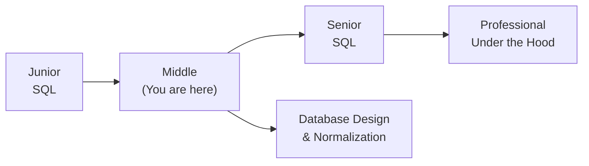

---

## Further Reading

- **Official docs:** [PostgreSQL Window Functions](https://www.postgresql.org/docs/current/functions-window.html)
- **Blog post:** [Use the Index, Luke](https://use-the-index-luke.com/) — deep dive on indexes and query optimization
- **Conference talk:** [EXPLAIN explained — PostgreSQL conference](https://www.pgcon.org/) — how to read execution plans
- **Book:** *SQL Performance Explained* by Markus Winand — production-focused index strategy

---

## Related Topics

- **[Indexes & Query Optimization](../indexes/)** — the full index strategy at middle level
- **[Database Design & Normalization](../normalization/)** — schema design that makes queries fast
- **[Stored Procedures & Functions](../functions/)** — encapsulating business logic in the database

---

## Diagrams & Visual Aids

### Window Function vs GROUP BY

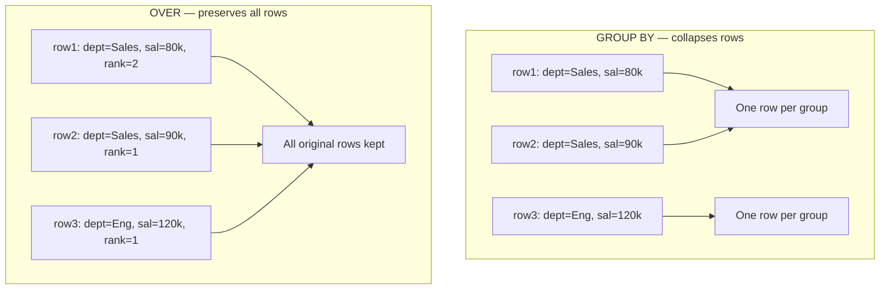

### EXPLAIN ANALYZE Output Anatomy

```text
Index Scan using idx_orders_user_id on orders  (cost=0.43..8.45 rows=5 width=128)
                                                (actual time=0.021..0.031 rows=3 loops=1)
  Index Cond: (user_id = 42)
  Buffers: shared hit=4
Planning Time: 0.152 ms
Execution Time: 0.058 ms
  ^              ^         ^            ^
  |              |         |            actual rows returned
  |              |         estimated rows
  |              actual execution time
  cost estimate (startup..total)
```

</details>

---
---

# TEMPLATE 3 — `senior.md`

<details open>
<summary><strong>Template Content</strong></summary>

# {{TOPIC_NAME}} — Senior Level

<!-- Table of Contents is OPTIONAL. Include only if the topic has many sections and it helps navigation. Remove this section entirely if not needed. -->

## Table of Contents

1. [Introduction](#introduction)
2. [Core Concepts](#core-concepts)
3. [Pros & Cons](#pros--cons)
4. [Use Cases](#use-cases)
5. [Query Examples](#query-examples)
6. [Product Use / Feature](#product-use--feature)
7. [Error Handling and Transaction Management](#error-handling-and-transaction-management)
8. [Security Considerations](#security-considerations)
9. [Performance Optimization](#performance-optimization)
10. [Metrics & Analytics](#metrics--analytics)
11. [Debugging Guide](#debugging-guide)
12. [Best Practices](#best-practices)
13. [Edge Cases & Pitfalls](#edge-cases--pitfalls)
14. [Common Mistakes](#common-mistakes)
15. [Tricky Points](#tricky-points)
16. [Comparison with NoSQL Databases (MongoDB, Redis, Elasticsearch, Cassandra)](#comparison-with-nosql-databases)
17. [Test](#test)
18. [Tricky Questions](#tricky-questions)
19. [Cheat Sheet](#cheat-sheet)
20. [Summary](#summary)
21. [What You Can Build](#what-you-can-build)
22. [Further Reading](#further-reading)
23. [Related Topics](#related-topics)
24. [Diagrams & Visual Aids](#diagrams--visual-aids)

---

## Introduction

> Focus: "How to optimize?" and "How to architect?"

For developers who:
- Design database schemas for systems handling millions of rows
- Optimize queries that need to run under 10ms at 10K rps
- Manage replication, connection pooling, and DBA operations
- Mentor junior/middle developers and conduct query reviews
- Architect migration strategies for evolving schemas

---

## Core Concepts

### Concept 1: Partitioning Strategies

Table partitioning divides a large table into smaller physical segments while appearing as one logical table to queries.

```sql
-- Range partitioning by month (PostgreSQL declarative partitioning)
CREATE TABLE events (
    id          BIGINT GENERATED ALWAYS AS IDENTITY,
    user_id     INT NOT NULL,
    event_type  TEXT NOT NULL,
    created_at  TIMESTAMPTZ NOT NULL DEFAULT NOW()
) PARTITION BY RANGE (created_at);

CREATE TABLE events_2024_01 PARTITION OF events
    FOR VALUES FROM ('2024-01-01') TO ('2024-02-01');

CREATE TABLE events_2024_02 PARTITION OF events
    FOR VALUES FROM ('2024-02-01') TO ('2024-03-01');
```

**Partition pruning:** When a query filters on `created_at`, PostgreSQL skips irrelevant partitions entirely.

### Concept 2: Materialized Views

```sql
-- Pre-compute expensive aggregation
CREATE MATERIALIZED VIEW monthly_revenue AS
SELECT
    DATE_TRUNC('month', created_at) AS month,
    SUM(amount) AS revenue,
    COUNT(DISTINCT user_id) AS unique_buyers
FROM orders
WHERE status = 'paid'
GROUP BY 1;

CREATE UNIQUE INDEX ON monthly_revenue (month);

-- Refresh concurrently (no lock)
REFRESH MATERIALIZED VIEW CONCURRENTLY monthly_revenue;
```

> **Rules:**
> - Every performance claim must be backed by EXPLAIN ANALYZE output.
> - Discuss trade-offs: query latency vs maintenance complexity vs storage cost.

---

## Pros & Cons

### Strategic analysis for architectural decisions:

| Pros | Cons | Impact |
|------|------|--------|
| Partitioning eliminates irrelevant I/O | Schema complexity increases | Critical for multi-TB tables |
| Replication enables horizontal read scaling | Replication lag introduces stale reads | High impact on read-heavy APIs |
| Connection pooling reduces connection overhead | Adds a layer to monitor and tune | Prevents connection exhaustion at scale |

### When partitioning is the RIGHT choice:
- Tables growing beyond 100GB with time-range queries — partition pruning eliminates most I/O
- Data archival — drop old partitions instead of slow DELETE

### When partitioning is the WRONG choice:
- OLTP tables under 10GB — maintenance overhead exceeds benefits
- Random-access lookups by primary key — partition pruning doesn't apply

---

## Use Cases

Architectural and system-level scenarios:

- **Use Case 1:** Migrating a monolith schema to a partitioned time-series design for an IoT events table growing 50GB/month
- **Use Case 2:** Implementing read replicas and routing read-heavy analytics queries away from the primary
- **Use Case 3:** Setting up PgBouncer in transaction mode to support 10K concurrent application threads on a PostgreSQL instance with `max_connections = 200`
- **Use Case 4:** Zero-downtime migration — adding a NOT NULL column to a 500M-row table without locking

---

## Query Examples

### Example 1: Advanced EXPLAIN ANALYZE — identifying buffer bottlenecks

```sql
EXPLAIN (ANALYZE, BUFFERS, FORMAT TEXT)
SELECT
    u.username,
    COUNT(o.id)        AS total_orders,
    SUM(o.amount)      AS lifetime_value
FROM users u
LEFT JOIN orders o ON u.id = o.user_id
WHERE u.created_at >= NOW() - INTERVAL '90 days'
GROUP BY u.id, u.username
ORDER BY lifetime_value DESC NULLS LAST
LIMIT 100;
```

**Architecture decisions:** The `BUFFERS` option reveals whether data is being served from shared memory or disk — critical for tuning `shared_buffers`.

### Example 2: JSONB query with GIN index

```sql
-- Schema: products table with JSONB attributes column
CREATE INDEX idx_products_attrs_gin ON products USING GIN (attributes);

-- Query: find products where attributes contains a specific tag
SELECT id, name
FROM products
WHERE attributes @> '{"tags": ["organic"]}'::jsonb;
```

**EXPLAIN ANALYZE result:**
```text
Bitmap Heap Scan on products  (cost=28.00..156.00 rows=50 width=64)
  (actual time=0.321..0.891 rows=47 loops=1)
  Recheck Cond: (attributes @> '{"tags": ["organic"]}'::jsonb)
  Buffers: shared hit=38
  ->  Bitmap Index Scan on idx_products_attrs_gin
        (actual time=0.298..0.298 rows=47 loops=1)
```

---

## Coding Patterns

Architectural and advanced patterns for {{TOPIC_NAME}}:

### Pattern 1: Read/Write Splitting

**Category:** Architectural / Scalability
**Intent:** Route SELECT queries to read replicas, writes to primary.
**Problem it solves:** Primary under read pressure when analytics and OLTP compete for the same connection pool.

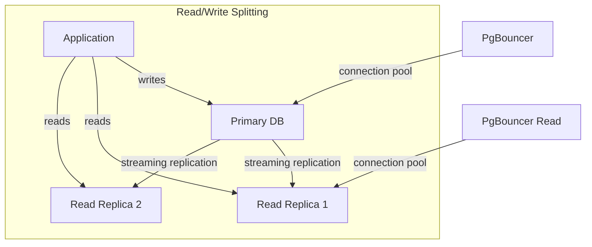

```sql
-- Application-side routing example (pseudocode in SQL comment form)
-- Write connection: always go to primary
BEGIN; -- primary
INSERT INTO orders ...;
COMMIT;

-- Read connection: can go to replica (accept slight lag)
SET SESSION CHARACTERISTICS AS TRANSACTION READ ONLY;
SELECT * FROM reporting_view WHERE ...;
```

**When this pattern wins:**
- Read:write ratio > 10:1
- Analytics queries consuming > 30% of primary CPU

---

### Pattern 2: Partial Index for Soft-Delete Pattern

**Category:** Performance / Storage
**Intent:** Index only the rows the application actually queries.

```sql
-- Only index non-deleted users — 80% smaller index if 80% of users are deleted
CREATE INDEX idx_users_email_active
ON users (email)
WHERE deleted_at IS NULL;

-- Query MUST match the partial index condition to use it
SELECT id FROM users WHERE email = $1 AND deleted_at IS NULL;
```

---

### Pattern 3: Upsert with ON CONFLICT

**Category:** Concurrency / Idempotency
**Intent:** Insert or update atomically — safe for concurrent writes.

```sql
INSERT INTO user_stats (user_id, event_date, page_views)
VALUES ($1, CURRENT_DATE, 1)
ON CONFLICT (user_id, event_date)
DO UPDATE SET
    page_views = user_stats.page_views + EXCLUDED.page_views,
    updated_at = NOW();
```

**State diagram:**

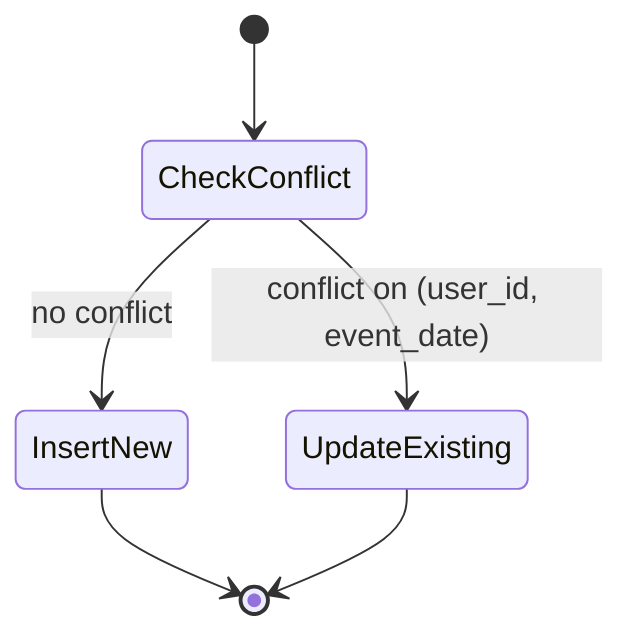

### Pattern Comparison Matrix

| Pattern | Use When | Avoid When | Complexity |
|---------|----------|------------|------------|
| Partitioning | Table > 100GB, time-range queries | Small tables, random PK access | High |
| Read replica routing | Read:write > 10:1 | Strong consistency required | Medium |
| Materialized view | Expensive aggregation, acceptable staleness | Real-time data required | Low |
| Partial index | Large table, queries always filter same column | Queries don't always include the partial condition | Low |

---

## Clean Code

Senior-level clean code — schema design, migration safety, team standards:

### Clean Schema Design

```sql
-- ❌ Schema smell: no foreign keys, nullable everything, no defaults
CREATE TABLE orders (
    id INT,
    user TEXT,
    amt FLOAT,
    ts TEXT
);

-- ✅ Proper schema: types, constraints, defaults, FK
CREATE TABLE orders (
    id          BIGINT GENERATED ALWAYS AS IDENTITY PRIMARY KEY,
    user_id     INT NOT NULL REFERENCES users(id) ON DELETE RESTRICT,
    amount      NUMERIC(12,2) NOT NULL CHECK (amount > 0),
    status      TEXT NOT NULL DEFAULT 'pending'
                    CHECK (status IN ('pending','paid','cancelled')),
    created_at  TIMESTAMPTZ NOT NULL DEFAULT NOW()
);
```

### Code Review Checklist (Senior SQL)

- [ ] No unbounded queries (always has LIMIT or time-range filter)
- [ ] All new indexes justified by EXPLAIN ANALYZE evidence
- [ ] Migrations are backward-compatible (no DROP COLUMN without a two-phase rollout)
- [ ] Transactions used for any multi-statement write
- [ ] No implicit type casts on indexed columns in WHERE clauses

---

## Best Practices

### Must Do

1. **Vacuum and autovacuum tuning** — Dead tuples from MVCC accumulate and cause table bloat and seq scan degradation.
   ```sql
   -- Check tables needing manual VACUUM
   SELECT relname, n_dead_tup, n_live_tup, last_autovacuum
   FROM pg_stat_user_tables
   ORDER BY n_dead_tup DESC;
   ```

2. **Use `CONCURRENT` index creation** — Building an index without locking writes.
   ```sql
   CREATE INDEX CONCURRENTLY idx_events_user_id ON events (user_id);
   ```

3. **Connection pooling is mandatory at scale** — PostgreSQL has a hard limit on `max_connections`; each connection costs ~5-10MB RAM.

### Never Do

1. **Never run DDL in production without a migration plan** — `ALTER TABLE ... ADD COLUMN NOT NULL DEFAULT x` locks the entire table in old PostgreSQL versions.
2. **Never TRUNCATE without a transaction** — Unlike DELETE, TRUNCATE is auto-committed in some contexts.
3. **Never rely on implicit column ordering** — Always name columns explicitly in INSERT statements.

---

## Product Use / Feature

### 1. Shopify

- **Architecture:** Horizontally sharded MySQL with Vitess; each shop's data lives in a specific shard determined by shop_id.
- **Scale:** Billions of rows per shard; query routing is transparent to application code.
- **Lessons learned:** Removed cross-shard JOINs entirely — all lookups are single-shard or denormalized.

### 2. GitLab

- **Architecture:** PostgreSQL with database decomposition — migrating from a monolithic DB to domain-specific databases.
- **Trade-offs:** Distributed transactions replaced with eventual consistency patterns for cross-domain data.

> 3-5 real-world examples from companies at scale.

---

## Error Handling and Transaction Management

### Strategy 1: Advisory locks for distributed coordination

```sql
-- Acquire a session-level advisory lock (key = hash of resource identifier)
SELECT pg_advisory_lock(hashtext('process_job_' || job_id::text));

-- Do the work...
UPDATE jobs SET status = 'processing' WHERE id = job_id;

-- Release lock
SELECT pg_advisory_unlock(hashtext('process_job_' || job_id::text));
```

**When to use:** Distributed cron jobs, exactly-once processing without a queue.

### Error Handling Architecture

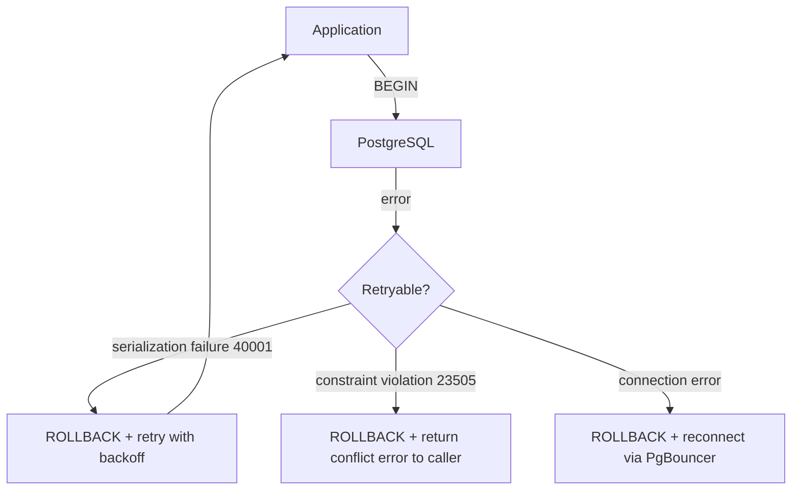

---

## Security Considerations

### 1. Row-Level Security (RLS)

**Risk level:** Critical — multi-tenant data isolation

```sql
-- ❌ Application-side tenant filtering — misses a WHERE clause = data leak
SELECT * FROM orders WHERE tenant_id = current_setting('app.tenant_id');

-- ✅ Database-enforced via RLS
ALTER TABLE orders ENABLE ROW LEVEL SECURITY;

CREATE POLICY orders_tenant_isolation ON orders
    USING (tenant_id = current_setting('app.tenant_id')::int);
```

**Attack scenario:** If a developer forgets the WHERE clause, RLS prevents the data leak at the database layer.

### Threat Model

| Threat | Likelihood | Impact | Mitigation |
|--------|:---------:|:------:|------------|
| SQL injection via ORM bypass | Medium | Critical | Parameterized queries + WAF |
| Privilege escalation via superuser | Low | Critical | Dedicated app role, no superuser in app code |
| Data exfiltration via missing WHERE | Medium | High | Row-level security + audit logging |

---

## Performance Optimization

### Optimization 1: Partition pruning validation

```sql
-- Verify partition pruning is active
EXPLAIN SELECT * FROM events WHERE created_at >= '2024-01-01' AND created_at < '2024-02-01';
```

**EXPLAIN ANALYZE before partitioning (10B rows):**
```text
Seq Scan on events  (cost=0.00..2400000.00 rows=83333 width=128)
                    (actual time=0.044..18432.211 rows=83000 loops=1)
```

**EXPLAIN ANALYZE after partitioning:**
```text
Append  (cost=0.00..240000.00 rows=83333 width=128)
        (actual time=0.021..184.321 rows=83000 loops=1)
  ->  Seq Scan on events_2024_01
        (actual time=0.020..183.101 rows=83000 loops=1)
-- Only the January partition is scanned
```

**pgbench results:**
```
pgbench -c 20 -T 60 ...
Before: TPS = 423
After (partitioned): TPS = 4,280  (~10x improvement)
```

### Performance Architecture

| Layer | Optimization | Impact | Cost |
|:-----:|:------------|:------:|:----:|
| **Schema** | Partitioning | Highest | Schema redesign |
| **Index** | Partial + composite indexes | High | Moderate |
| **Connection** | PgBouncer transaction pooling | Medium | Infra addition |
| **Query** | Materialized views for reporting | High | Staleness trade-off |

---

## Metrics & Analytics

### SLO / SLA Definition

| SLI | SLO Target | Measurement window | Consequence if breached |
|-----|-----------|-------------------|------------------------|
| **OLTP p99 query latency** | < 10ms | 5 min rolling | PagerDuty alert |
| **Replication lag** | < 1s | 1 min rolling | Route reads back to primary |
| **Connection pool wait time** | < 5ms | 5 min rolling | Scale PgBouncer pool |
| **Autovacuum completion rate** | > 99% | 1 day | Manual VACUUM + tuning |

### Capacity Planning Metrics

| Signal | Indicates | Action |
|--------|-----------|--------|
| `pg_stat_bgwriter.buffers_clean = 0` | `shared_buffers` too small | Increase `shared_buffers` |
| Replication lag > 10s | Replica falling behind | Check replica CPU / disk I/O |
| `pg_stat_statements` showing plan changes | Statistics drift | `ANALYZE` + check `default_statistics_target` |

---

## Debugging Guide

### Problem 1: Sudden replication lag spike

**Symptoms:** Grafana alert: replication lag > 30 seconds; read replica queries returning stale data.

**Diagnostic steps:**
```sql
-- On primary: check WAL sender
SELECT pid, state, sent_lsn, write_lsn, flush_lsn, replay_lsn,
       (sent_lsn - replay_lsn) AS replication_lag_bytes
FROM pg_stat_replication;

-- On replica: check recovery progress
SELECT NOW() - pg_last_xact_replay_timestamp() AS replication_lag;
```

**Root cause:** Long-running transaction on primary holding WAL that replica must apply.
**Fix:** Kill long transactions; tune `max_wal_size`; check replica disk I/O.

### Advanced Tools

| Tool | Command | What it shows |
|------|---------|---------------|
| `pg_stat_activity` | `SELECT * FROM pg_stat_activity WHERE state = 'active'` | Running queries, wait events |
| `pg_locks` | `SELECT * FROM pg_locks l JOIN pg_stat_activity a ON l.pid = a.pid` | Lock contention |
| `pg_stat_replication` | Built-in view | Replication lag, WAL positions |
| `pgbench` | `pgbench -c 20 -T 60 -f query.sql mydb` | TPS benchmark |

---

## Best Practices

- **Practice 1:** Use `VACUUM ANALYZE` proactively after large bulk loads — prevents planner from using outdated statistics.
- **Practice 2:** Always use `CREATE INDEX CONCURRENTLY` in production — non-concurrent index builds take an exclusive lock.
- **Practice 3:** Never share superuser credentials with applications — create dedicated roles with minimal privileges.
- **Practice 4:** Schema migrations must be backward-compatible — use a two-phase approach (add column nullable → backfill → add NOT NULL constraint).
- **Practice 5:** Set `statement_timeout` and `lock_timeout` for all application connections — prevents runaway queries from blocking others.

---

## Edge Cases & Pitfalls

### Pitfall 1: Lock escalation during schema migration

```sql
-- ❌ Locks the entire table for the duration of the backfill on 500M rows
ALTER TABLE users ADD COLUMN last_login TIMESTAMPTZ NOT NULL DEFAULT NOW();
```

**At what scale it breaks:** Any table with active writes; even 1 second of lock = connection queue buildup.
**Solution:** Two-phase migration:
1. `ALTER TABLE users ADD COLUMN last_login TIMESTAMPTZ;` (nullable, instant)
2. Backfill in batches: `UPDATE users SET last_login = created_at WHERE id BETWEEN $start AND $end;`
3. `ALTER TABLE users ALTER COLUMN last_login SET NOT NULL;` (fast constraint check if column is already filled)

---

## Postmortems & System Failures

### The Autovacuum Bloat Incident

- **The goal:** High-frequency UPDATE of a status column on a 200M-row orders table.
- **The mistake:** Autovacuum was disabled on the table by a developer who thought it was "slowing things down."
- **The impact:** Table grew from 40GB to 400GB in 2 weeks; sequential scan time increased 10x; production slowdown.
- **The fix:** Re-enable autovacuum; run `VACUUM FULL` during a maintenance window; add `toast` monitoring.

**Key takeaway:** MVCC dead tuples accumulate with every UPDATE. Autovacuum is not optional — it is the mechanism that reclaims dead tuple space.

---

## Common Mistakes

### Mistake 1: Using `DELETE` for time-series data archival

```sql
-- ❌ DELETE on 100M rows — long transaction, heavy WAL, table bloat
DELETE FROM events WHERE created_at < NOW() - INTERVAL '1 year';

-- ✅ Drop the partition — instant, no bloat
DROP TABLE events_2023_01;  -- if using declarative partitioning
```

**Why seniors still make this mistake:** The table wasn't partitioned from the start; partitioning requires schema migration.

---

## Common Misconceptions

### Misconception 1: "Read replicas guarantee strong read-your-own-writes consistency"

**Reality:** Streaming replication in PostgreSQL is asynchronous by default. A write committed on the primary may not be visible on the replica for milliseconds to seconds. Applications that write and immediately read from a replica can see stale data.

**Real-world impact:** E-commerce "order placed" confirmation queries showing "no order found" when hitting a lagging replica.

### Misconception 2: "Partitioning always improves performance"

**Reality:** Partitioning adds planning overhead and only helps when the query's filter enables partition pruning. A query without a filter on the partition key scans ALL partitions.

---

## Tricky Points

### Tricky Point 1: HOT updates

```sql
-- HOT (Heap Only Tuple) update: possible only when the updated column is NOT indexed
UPDATE users SET last_seen = NOW() WHERE id = 42;
-- If `last_seen` has no index, PostgreSQL uses HOT — no index page update needed
-- If `last_seen` IS indexed, PostgreSQL must update the index too — 2x I/O
```

**Why this matters:** Removing unnecessary indexes on high-UPDATE columns significantly reduces write amplification.

---

## Comparison with NoSQL Databases

Deep architectural comparison:

| Aspect | PostgreSQL | MongoDB | Cassandra | Elasticsearch |
|--------|:---------:|:-------:|:---------:|:-------------:|
| **Partitioning** | Declarative (range, list, hash) | Sharding (hash on shard key) | Consistent hashing (partition key) | Shards (index-level) |
| **Replication** | Streaming + logical | Replica sets (Raft) | Multi-master (eventual) | Primary + replicas |
| **Full-text search** | `tsvector` + GIN | Text index | SOLR integration | Native (Lucene) |
| **JSONB** | Native, indexed | Native (BSON) | User-defined types | Native |
| **ACID** | Full multi-row | Multi-document (4.0+) | LWT (lightweight) | None |

### When PostgreSQL wins:
- Complex queries with JOINs across 5+ tables, strong consistency requirements, rich analytical queries.

### When PostgreSQL loses:
- Write throughput > 1M writes/sec (Cassandra); full-text search with relevance scoring (Elasticsearch); sub-millisecond key lookups (Redis).

---

## Test

### Architecture Questions

**1. You have a 2TB events table with 80% of queries filtering by `user_id` and `created_at`. Which strategy gives the biggest performance improvement?**

- A) Add a composite index on `(user_id, created_at)`
- B) Partition by `user_id` hash
- C) Partition by `created_at` range + composite index on `(user_id, created_at)` within each partition
- D) Move the table to a columnar store

<details>
<summary>Answer</summary>
**C)** — Range partitioning on `created_at` enables partition pruning for time-range queries (the most common filter). A composite index within each partition handles the `user_id` filter efficiently. The combination eliminates irrelevant partitions AND uses indexes within the relevant partition. Option B would require querying all partitions for time-range queries.
</details>

### Performance Analysis

**2. This query runs in 8 seconds on a 50M row table. How would you diagnose and fix it?**

```sql
SELECT * FROM logs WHERE TO_CHAR(created_at, 'YYYY-MM') = '2024-01';
```

<details>
<summary>Answer</summary>
The problem: `TO_CHAR()` on `created_at` prevents index use — any function on an indexed column bypasses the index.
Fix: Rewrite to use a range comparison that the index can satisfy:
```sql
SELECT * FROM logs
WHERE created_at >= '2024-01-01'
  AND created_at <  '2024-02-01';
```
Or create a functional index: `CREATE INDEX ON logs (TO_CHAR(created_at, 'YYYY-MM'))` — but this is rarely better than rewriting the query.
</details>

---

## Tricky Questions

**1. You add `LIMIT 1` to a query and it gets dramatically faster. The EXPLAIN shows it was already using an index. What explains the speedup?**

<details>
<summary>Answer</summary>
PostgreSQL uses different cost models for queries with and without LIMIT. Without LIMIT, it optimizes for total cost (all rows). With LIMIT 1, it optimizes for startup cost — it may choose a different plan (e.g., index scan instead of bitmap scan) that delivers the first row faster even if the total cost would be higher. This is called "startup cost optimization."
</details>

---

## Cheat Sheet

### Architecture Decision Matrix

| Scenario | Recommended pattern | Avoid | Why |
|----------|-------------------|-------|-----|
| Time-series > 100GB | Range partitioning | Full table index | Partition pruning eliminates I/O |
| High write throughput | Remove unused indexes | Over-indexing | Every index = write overhead |
| 10K concurrent users | PgBouncer transaction pooling | Direct connections | max_connections exhaustion |
| Expensive report query | Materialized view | Running ad-hoc | Pre-computation vs staleness |

### Heuristics & Rules of Thumb

- **The 100GB Rule:** Partition tables once they exceed 100GB and queries filter on the partition key.
- **The 5% Rule:** If a query returns more than ~5% of a table's rows, the planner may prefer a seq scan over an index scan — this is correct behavior.
- **The Dead Tuple Rule:** If `n_dead_tup / n_live_tup > 20%`, run `VACUUM ANALYZE` manually.

---

## Self-Assessment Checklist

### I can architect:
- [ ] Design a partitioning strategy for a multi-TB time-series table
- [ ] Set up streaming replication and configure read replica routing
- [ ] Size a PgBouncer connection pool for a given workload
- [ ] Write a zero-downtime migration plan for adding a NOT NULL column

### I can lead:
- [ ] Review a query and identify all performance anti-patterns
- [ ] Diagnose replication lag and prescribe a fix
- [ ] Create an autovacuum tuning plan for a high-UPDATE table

---

## Summary

- Partitioning is the highest-leverage performance tool for large tables — but only when queries filter on the partition key
- Replication enables read scaling; connection pooling prevents connection exhaustion
- Zero-downtime migrations require a two-phase approach and careful lock management
- Autovacuum is not optional — MVCC dead tuples are a slow-burning performance killer
- EXPLAIN (ANALYZE, BUFFERS) is the definitive source of truth for query performance

**Senior mindset:** Not just "does the query work?" but "does it scale to 10x data, 100x queries, and zero downtime migrations?"

---

## What You Can Build

### Architect and lead:
- **Multi-tenant SaaS database layer:** RLS + connection pooling + read replicas
- **High-throughput event pipeline:** Partitioned events table with automated partition management

### Career impact:
- **Staff/Principal Engineer** — database architecture is a core system design interview topic
- **DBA / Data Infrastructure Lead** — this knowledge is directly required

---

## Further Reading

- **Official docs:** [PostgreSQL Partitioning](https://www.postgresql.org/docs/current/ddl-partitioning.html)
- **Blog post:** [Citus: When to Partition](https://www.citusdata.com/blog/) — production partitioning decisions
- **Conference talk:** [PGConf: Zero Downtime Migrations](https://pgconf.org/) — schema migration patterns at scale
- **Book:** *PostgreSQL: Up and Running* by Regina Obe & Leo Hsu — senior-level operational topics

---

## Related Topics

- **[Replication & High Availability](../replication/)** — architectural connection
- **[Connection Pooling & PgBouncer](../connection-pooling/)** — performance connection
- **[Full-Text Search](../full-text-search/)** — GIN indexes, tsvector, tsquery

---

## Diagrams & Visual Aids

### Partitioning Architecture

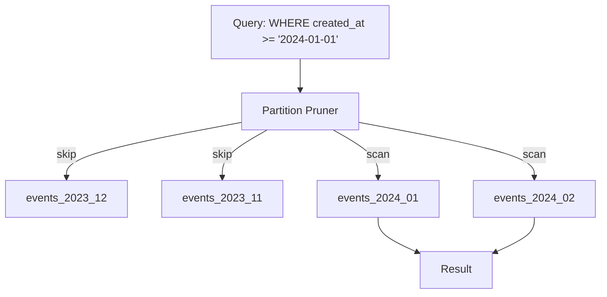

### Connection Pooling Architecture

```
Applications (10,000 threads)
        |
        v
  PgBouncer (transaction mode)
  pool_size = 200
        |
        v
  PostgreSQL (max_connections = 250)
  ~200 active connections at peak
```

</details>

---
---

# TEMPLATE 4 — `professional.md`

<details open>
<summary><strong>Template Content</strong></summary>

# {{TOPIC_NAME}} — Under the Hood

<!-- Table of Contents is OPTIONAL. Include only if the topic has many sections and it helps navigation. Remove this section entirely if not needed. -->

## Table of Contents

1. [Introduction](#introduction)
2. [How It Works Internally](#how-it-works-internally)
3. [Query Execution Plan Analysis (EXPLAIN ANALYZE output interpretation)](#query-execution-plan-analysis)
4. [Query Planner and Optimizer Internals](#query-planner-and-optimizer-internals)
5. [Storage Engine and Transaction Manager Internals](#storage-engine-and-transaction-manager-internals)
6. [I/O and Memory Management at the OS Level](#io-and-memory-management-at-the-os-level)
7. [On-Disk Data Format](#on-disk-data-format)
8. [PostgreSQL Source Code Walkthrough](#postgresql-source-code-walkthrough)
9. [Performance Internals](#performance-internals)
10. [Edge Cases at the Lowest Level](#edge-cases-at-the-lowest-level)
11. [Test](#test)
12. [Tricky Questions](#tricky-questions)
13. [Summary](#summary)
14. [Further Reading](#further-reading)
15. [Diagrams & Visual Aids](#diagrams--visual-aids)

---

## Introduction

> Focus: "What happens under the hood?"

This document explores what PostgreSQL does internally when you execute {{TOPIC_NAME}}.
For developers who want to understand:
- How the query planner chooses execution plans
- How MVCC and the transaction manager guarantee isolation
- How data is stored on disk (pages, tuple headers, TOAST)
- How WAL, fsync, and shared_buffers interact at the OS level

---

## How It Works Internally

Step-by-step breakdown of what happens when PostgreSQL executes a query:

1. **Wire protocol** → Client sends query string over TCP (libpq protocol)
2. **Parser** → Tokenizes and builds a raw parse tree
3. **Rewriter** → Expands views, applies rules
4. **Planner/Optimizer** → Generates possible plans, estimates costs, selects the cheapest
5. **Executor** → Executes the plan node tree, fetches tuples from heap/index
6. **Result** → Serializes rows back to client

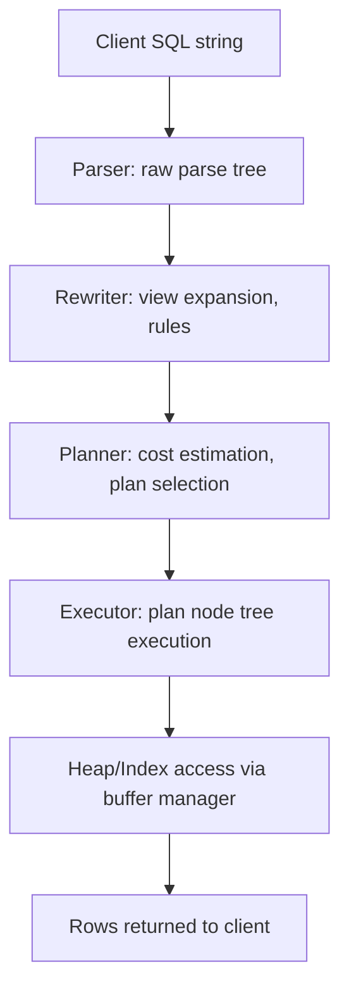

---

## Query Execution Plan Analysis

### EXPLAIN ANALYZE Output — Full Anatomy

```text
Hash Join  (cost=1234.00..5678.00 rows=1000 width=128)
           (actual time=12.345..45.678 rows=987 loops=1)
  Hash Cond: (o.user_id = u.id)
  Buffers: shared hit=450 read=120 dirtied=0 written=0
  ->  Seq Scan on orders o  (cost=0.00..2400.00 rows=100000 width=64)
                             (actual time=0.012..18.234 rows=100000 loops=1)
        Buffers: shared hit=350 read=100
  ->  Hash  (cost=800.00..800.00 rows=34720 width=64)
             (actual time=9.123..9.123 rows=34720 loops=1)
        Buckets: 65536  Batches: 1  Memory Usage: 4096kB
        Buffers: shared hit=100 read=20
        ->  Seq Scan on users u  (cost=0.00..800.00 rows=34720 width=64)
                                  (actual time=0.008..4.567 rows=34720 loops=1)
Planning Time: 0.452 ms
Execution Time: 46.123 ms
```

**Reading each field:**

| Field | Meaning |
|-------|---------|
| `cost=start..total` | Planner's estimate: startup cost and total cost in arbitrary units |
| `rows=N` (estimate) | Planner's row count estimate from statistics |
| `actual time=start..end` | Real wall-clock time in milliseconds |
| `rows=N` (actual) | Real rows processed — compare to estimate to detect bad statistics |
| `loops=N` | How many times this node executed (for nested loops) |
| `shared hit=N` | Blocks served from shared_buffers (in-memory) |
| `shared read=N` | Blocks read from disk — high value indicates I/O bottleneck |

**Key red flags:**
- Large discrepancy between estimated and actual rows → stale statistics → run `ANALYZE`
- `shared read` >> `shared hit` → working set doesn't fit in `shared_buffers` → increase it or add indexes
- `loops=N` in a nested loop with a large outer table → missing index on the inner table

---

## Query Planner and Optimizer Internals

### Cost Model

PostgreSQL assigns a cost to every plan node. The cost is dimensionless but calibrated around disk page reads:

| GUC Parameter | Default | Meaning |
|---------------|---------|---------|
| `seq_page_cost` | 1.0 | Cost of reading one sequential page from disk |
| `random_page_cost` | 4.0 | Cost of reading one random page (4x penalty for random I/O) |
| `cpu_tuple_cost` | 0.01 | Cost per row processed |
| `cpu_index_tuple_cost` | 0.005 | Cost per index entry |
| `effective_cache_size` | 4GB | Planner's estimate of OS + PG cache available — affects index cost |

```sql
-- Tune for SSDs (random I/O is cheaper)
ALTER SYSTEM SET random_page_cost = 1.1;
ALTER SYSTEM SET effective_cache_size = '24GB';  -- set to ~75% of RAM
SELECT pg_reload_conf();
```

### Statistics and pg_statistic

The planner uses column statistics to estimate row counts. Statistics are stored in `pg_statistic` and exposed via `pg_stats`:

```sql
-- Check statistics for a column
SELECT
    tablename,
    attname,
    n_distinct,
    correlation,  -- 1.0 = perfectly ordered, -1.0 = reverse, ~0 = random
    most_common_vals,
    most_common_freqs
FROM pg_stats
WHERE tablename = 'orders' AND attname = 'status';
```

**Source code:** `src/backend/optimizer/util/plancat.c` — `get_relation_statistics()`

### Join Order Selection

For N tables, there are N! possible join orders. PostgreSQL uses dynamic programming for N ≤ `join_collapse_limit` (default 8), and genetic query optimizer (GEQO) for larger N.

**Source code:** `src/backend/optimizer/path/joinrels.c`

---

## Storage Engine and Transaction Manager Internals

### MVCC (Multi-Version Concurrency Control)

PostgreSQL never overwrites tuples in place. Every UPDATE creates a new tuple version:

```
Original tuple (xmin=100, xmax=0):
┌─────────────────────────────────────────┐
│ xmin=100 │ xmax=0 │ t_ctid │ data...   │
└─────────────────────────────────────────┘

After UPDATE (transaction 200):
Old tuple (xmin=100, xmax=200):          New tuple (xmin=200, xmax=0):
┌──────────────────────────┐             ┌──────────────────────────┐
│ xmin=100 │ xmax=200 │... │             │ xmin=200 │ xmax=0 │ ... │
└──────────────────────────┘             └──────────────────────────┘
    (dead tuple — invisible              (live tuple — visible to
     to transactions > 200)              transactions starting >= 200)
```

**Visibility rule:** A tuple version is visible to a transaction T if:
- `xmin` is committed and `xmin < T.snapshot_xmin`
- `xmax` is either 0 (not yet updated) or uncommitted, or `xmax > T.snapshot_xmax`

**Source code:** `src/backend/access/heap/heapam_visibility.c` — `HeapTupleSatisfiesMVCC()`

### Dead Tuple Accumulation

Every UPDATE leaves a dead tuple. VACUUM scans the heap, marks dead tuples as free space, and removes their index entries. Without VACUUM:
- Table grows indefinitely (bloat)
- Index scans must skip dead tuples (performance degradation)
- Transaction ID wraparound (XID wraparound) becomes a risk after 2^31 transactions

```sql
-- Check vacuum age and dead tuple accumulation
SELECT relname, age(relfrozenxid) AS xid_age, n_dead_tup
FROM pg_class
JOIN pg_stat_user_tables USING (relname)
WHERE age(relfrozenxid) > 100000000
ORDER BY xid_age DESC;
```

---

## I/O and Memory Management at the OS Level

### Shared Buffers and the Buffer Manager

PostgreSQL maintains a shared memory buffer pool (`shared_buffers`, default 128MB, recommended 25% of RAM). All disk I/O goes through this pool:

```
Query Executor
      │
      ▼
Buffer Manager (shared_buffers)
  ┌─────────────────────────────────┐
  │  Buffer 1: page 42 of orders   │◄── cache hit (shared hit++)
  │  Buffer 2: page 43 of orders   │
  │  Buffer 3: dirty page → WAL    │
  └─────────────────────────────────┘
      │ miss (shared read++)
      ▼
OS Page Cache (managed by kernel)
      │
      ▼
  Physical Disk (fsync on commit)
```

### WAL (Write-Ahead Log)

Every change is written to the WAL before the heap page is modified:
1. WAL record written to `pg_wal/` (sequential write — fast)
2. Heap page modified in shared_buffers (random write — deferred)
3. On `COMMIT`, WAL is flushed to disk via `fsync` (durability guarantee)

This is why `synchronous_commit = off` improves write throughput but risks losing the last few transactions on crash.

**Source code:** `src/backend/access/transam/xlog.c` — `XLogInsert()`, `XLogFlush()`

---

## On-Disk Data Format

### Heap Page Layout (8KB default)

```
┌─────────────────────────────────────────────────────────────────┐
│ PageHeaderData (24 bytes)                                        │
│  pd_lsn: WAL position of last change to this page               │
│  pd_flags: has free space, all visible (for VACUUM), etc.       │
├─────────────────────────────────────────────────────────────────┤
│ ItemIdData array (4 bytes per slot)                              │
│  [0] offset=120, length=64  ← points to tuple 1                 │
│  [1] offset=184, length=72  ← points to tuple 2                 │
│  ...                                                             │
├─────────────────────────────────────────────────────────────────┤
│ Free space (grows from both ends toward middle)                  │
├─────────────────────────────────────────────────────────────────┤
│ Tuple N (variable length)                                        │
│  HeapTupleHeader (23 bytes): xmin, xmax, t_ctid, natts, ...    │
│  NULL bitmap (if any NULLable columns)                           │
│  Column data (fixed + variable length attributes)                │
├─────────────────────────────────────────────────────────────────┤
│ Tuple 2 ...                                                      │
│ Tuple 1 ...                                                      │
└─────────────────────────────────────────────────────────────────┘
```

**Source code:** `src/include/storage/bufpage.h`, `src/include/access/htup_details.h`

### TOAST (The Oversized-Attribute Storage Technique)

Attributes larger than ~2KB are automatically compressed and/or stored out-of-line in a TOAST table:

```sql
-- Check TOAST table for a large-column table
SELECT relname, reltoastrelid::regclass AS toast_table
FROM pg_class
WHERE relname = 'documents';

-- Check TOAST storage strategy per column
SELECT attname, attstorage
FROM pg_attribute
WHERE attrelid = 'documents'::regclass AND attnum > 0;
-- 'x' = extended (compress + out-of-line), 'e' = external (out-of-line only)
```

---

## PostgreSQL Source Code Walkthrough

**File:** `src/backend/optimizer/path/costsize.c`

The cost estimation functions for all node types live here. Key functions:
- `cost_seqscan()` — `seq_page_cost * pages + cpu_tuple_cost * tuples`
- `cost_index()` — accounts for `random_page_cost * pages_fetched` + correlation adjustment
- `cost_hashjoin()` — hash build cost + probe cost

**File:** `src/backend/executor/nodeSeqscan.c`

Sequential scan executor:
```c
/* Fetch next tuple from the heap */
static TupleTableSlot *
SeqNext(SeqScanState *node)
{
    /* ... */
    slot = node->ss.ss_ScanTupleSlot;
    tuple = heap_getnext(scandesc, ForwardScanDirection);
    /* MVCC visibility check happens inside heap_getnext */
    /* ... */
}
```

**File:** `src/backend/access/heap/heapam.c`

Core heap access functions:
- `heap_insert()` — writes new tuple, sets `xmin = current XID`
- `heap_update()` — creates new tuple version, sets `xmax` on old tuple
- `heap_delete()` — sets `xmax` on existing tuple (no physical deletion)

> Reference PostgreSQL 16. Source available at: https://github.com/postgres/postgres

---

## Performance Internals

### Connection Overhead

Each PostgreSQL connection forks a backend process (~5-10MB RAM). The connection overhead is:
- TCP handshake + TLS negotiation: ~1-2ms
- Authentication: ~0.5-1ms
- Backend process fork: ~5-10ms (expensive!)

This is why PgBouncer in transaction pooling mode is essential — it reuses backend processes across many application threads.

### Query Plan Caching

Prepared statements cache the query plan after 5 executions (configurable via `plan_cache_mode`):

```sql
-- Prepared statements in psql
PREPARE get_user (int) AS SELECT * FROM users WHERE id = $1;
EXECUTE get_user(42);
-- After 5 executions, the plan is cached — parameter sniffing risk
-- if data distribution is highly skewed
```

**Source code:** `src/backend/utils/cache/plancache.c`

### Parallel Query

PostgreSQL can parallelize sequential scans and aggregates when `max_parallel_workers_per_gather > 0`:

```sql
-- Enable parallel query (already default in PG 14+)
SET max_parallel_workers_per_gather = 4;

-- Check if a query uses parallel workers
EXPLAIN SELECT SUM(amount) FROM orders;
-- Look for: Gather  (cost=...) with workers=N
```

**pgbench TPS before parallel:**
```
pgbench -c 1 -T 30 -f aggregate.sql
TPS = 12
```
**pgbench TPS after (4 parallel workers):**
```
TPS = 43  (3.6x improvement on 4-core machine)
```

---

## Metrics & Analytics (Runtime Level)

### PostgreSQL Internal Metrics

```sql
-- Buffer cache hit ratio (should be > 99% in steady state)
SELECT
    sum(heap_blks_hit)  AS heap_hit,
    sum(heap_blks_read) AS heap_read,
    ROUND(100.0 * sum(heap_blks_hit) /
          NULLIF(sum(heap_blks_hit) + sum(heap_blks_read), 0), 2) AS cache_hit_ratio
FROM pg_statio_user_tables;

-- Checkpoint frequency (too frequent = I/O bottleneck)
SELECT checkpoints_timed, checkpoints_req, buffers_checkpoint
FROM pg_stat_bgwriter;
```

| Metric | What it measures | Impact |
|--------|-----------------|--------|
| `shared hit / (shared hit + shared read)` | Buffer cache hit ratio | < 95% = add RAM or indexes |
| `n_dead_tup` | Dead tuples waiting for VACUUM | > 20% of live = run VACUUM |
| `checkpoints_req / checkpoints_timed` | Checkpoint pressure | > 0.5 = increase `max_wal_size` |

---

## Edge Cases at the Lowest Level

### Edge Case 1: XID Wraparound

PostgreSQL uses 32-bit transaction IDs. After ~2 billion transactions, XIDs wrap around. PostgreSQL prevents this with aggressive VACUUM (freezing old XIDs), but:

```sql
-- Check oldest unfrozen XID — must VACUUM before age > 2 billion
SELECT datname, age(datfrozenxid) AS xid_age
FROM pg_database
ORDER BY age(datfrozenxid) DESC;
```

**Internal behavior:** `VACUUM FREEZE` marks old tuples with `FrozenTransactionId` (special XID = 2), making them visible to all future transactions regardless of XID wraparound.

**Why it matters:** A database that hasn't been vacuumed for 2 billion transactions will shut itself down in read-only mode to prevent data corruption.

---

## Test

### Internal Knowledge Questions

**1. What PostgreSQL function is called to check MVCC visibility for a heap tuple?**

<details>
<summary>Answer</summary>
`HeapTupleSatisfiesMVCC()` in `src/backend/access/heap/heapam_visibility.c`. It takes the tuple header and the current transaction's snapshot, and returns whether the tuple is visible according to MVCC rules (checking xmin committed, xmax not committed, etc.).
</details>

**2. What does this EXPLAIN ANALYZE output tell you?**

```text
Seq Scan on orders  (cost=0.00..24000.00 rows=1000 width=128)
                    (actual time=0.044..1823.441 rows=987654 loops=1)
```

<details>
<summary>Answer</summary>
The planner estimated 1,000 rows but 987,654 were actually returned — a 987x underestimate. This almost certainly means statistics are severely stale (run `ANALYZE orders`). The query planner chose a sequential scan partly because it believed only 1,000 rows would be returned; with accurate statistics it might choose an index scan or a different join strategy.
</details>

**3. A table's `shared read` count in EXPLAIN BUFFERS is very high. What does this mean and how do you fix it?**

<details>
<summary>Answer</summary>
`shared read` counts blocks that were NOT found in `shared_buffers` and had to be fetched from the OS page cache or disk. High `shared read` means the working set for this query doesn't fit in PostgreSQL's buffer pool. Solutions: (1) Increase `shared_buffers` (up to 25-40% of RAM); (2) Add an index to reduce the number of blocks accessed; (3) Use a covering index so heap access is avoided entirely.
</details>

---

## Tricky Questions

**1. WHY does PostgreSQL's default `random_page_cost = 4.0` cause it to prefer sequential scans over index scans more than you'd expect on modern SSDs?**

<details>
<summary>Answer</summary>
The default was calibrated for spinning disks where random I/O is ~50x slower than sequential. On SSDs, the ratio is closer to 1.1-2x. When `random_page_cost` is too high, the planner overestimates the cost of index scans (which involve random page access) and incorrectly favors sequential scans. On SSD-backed storage, set `random_page_cost = 1.1` to help the planner correctly prefer index scans.
</details>

**2. A VACUUM FULL dramatically improved query performance but caused 30 minutes of downtime. What happened internally and how do you avoid the downtime next time?**

<details>
<summary>Answer</summary>
`VACUUM FULL` rewrites the entire table to a new heap file, reclaiming bloat. It holds an `AccessExclusiveLock` for the duration — blocking all reads AND writes. It also rebuilds all indexes. The correct approach for production is `pg_repack` (an extension) which rewrites the table online using triggers, or regular `VACUUM` (not FULL) to prevent bloat from accumulating in the first place.
</details>

---

## Self-Assessment Checklist

### I can explain internals:
- [ ] How MVCC creates and manages tuple versions on UPDATE
- [ ] What xmin, xmax, and the visibility check function do
- [ ] How WAL guarantees durability and enables replication
- [ ] How shared_buffers, the buffer manager, and the OS page cache interact

### I can analyze:
- [ ] Read EXPLAIN ANALYZE BUFFERS output and identify each bottleneck
- [ ] Interpret `pg_stats` column statistics and spot stale statistics
- [ ] Explain why `random_page_cost` affects plan selection
- [ ] Predict the performance impact of HOT vs non-HOT updates

### I can prove:
- [ ] Reference relevant PostgreSQL source files for any internals claim
- [ ] Demonstrate MVCC behavior with concurrent transactions in psql
- [ ] Show the impact of `shared_buffers` tuning with pgbench

---

## Summary

- PostgreSQL's query pipeline: parse → rewrite → plan → execute → buffer manager → disk/WAL
- The planner uses cost models and column statistics to choose plans; stale statistics are the #1 cause of bad plans
- MVCC stores multiple tuple versions on disk — dead tuples are reclaimed by VACUUM
- WAL provides durability: every change is logged sequentially before heap modification
- Every 8KB heap page stores tuples with xmin/xmax headers enabling MVCC visibility

**Key takeaway:** Understanding these internals lets you diagnose any performance or correctness issue in PostgreSQL without guessing.

---

## Further Reading

- **PostgreSQL source:** [src/backend/optimizer/](https://github.com/postgres/postgres/tree/master/src/backend/optimizer) — planner internals
- **PostgreSQL source:** [src/backend/access/heap/](https://github.com/postgres/postgres/tree/master/src/backend/access/heap) — heap access and MVCC
- **Book:** *PostgreSQL Internals* by Egor Rogov (free online at postgrespro.com/blog/pgsql/5969301)
- **Blog:** [Explaining the Postgres Query Optimizer](https://momjian.us/main/writings/pgsql/optimizer.pdf) — Bruce Momjian
- **Conference talk:** [PGCon: MVCC Unmasked](https://www.pgcon.org/2010/schedule/events/218.en.html)

---

## Diagrams & Visual Aids

### MVCC Tuple Chain

```
Transaction 100: INSERT row
  ┌─────────────────────────┐
  │ xmin=100, xmax=0        │  ← visible to all T > 100
  │ data: name='Alice'      │
  └─────────────────────────┘

Transaction 200: UPDATE name='Bob'
  ┌─────────────────────────┐   ┌─────────────────────────┐
  │ xmin=100, xmax=200      │──►│ xmin=200, xmax=0        │
  │ data: name='Alice'      │   │ data: name='Bob'        │
  └─────────────────────────┘   └─────────────────────────┘
  (dead — visible only to T      (live — visible to T >= 200)
   with snapshot before 200)

VACUUM runs: removes the dead tuple, frees page space
```

### WAL Write Path

```mermaid
sequenceDiagram
    participant App
    participant Executor
    participant WAL Buffer
    participant WAL File (pg_wal/)
    participant Heap Page (shared_buffers)
    App->>Executor: BEGIN; UPDATE orders ...
    Executor->>WAL Buffer: XLogInsert(change record)
    Executor->>Heap Page: modify tuple in buffer
    App->>Executor: COMMIT
    Executor->>WAL File (pg_wal/): XLogFlush() → fsync
    Note over WAL File (pg_wal/): Durability guaranteed here
    Heap Page-->>WAL File (pg_wal/): checkpoint writes dirty pages later
```

</details>

---
---

# TEMPLATE 5 — `interview.md`

<details open>
<summary><strong>Template Content</strong></summary>

# {{TOPIC_NAME}} — Interview Questions

## Table of Contents

1. [Junior Level](#junior-level)
2. [Middle Level](#middle-level)
3. [Senior Level](#senior-level)
4. [DBA / Architecture Level](#dba--architecture-level)
5. [Scenario-Based Questions](#scenario-based-questions)
6. [FAQ](#faq)

---

## Junior Level

### 1. What is the difference between WHERE and HAVING?

**Answer:**
`WHERE` filters individual rows *before* grouping and aggregation. `HAVING` filters *groups* after aggregation. You cannot use aggregate functions (COUNT, SUM, etc.) in a WHERE clause — use HAVING instead.

```sql
-- WHERE filters rows before GROUP BY
SELECT department, COUNT(*) FROM employees
WHERE salary > 50000
GROUP BY department;

-- HAVING filters groups after GROUP BY
SELECT department, COUNT(*) FROM employees
GROUP BY department
HAVING COUNT(*) > 5;
```

---

### 2. What is a NULL value and how do you check for it?

**Answer:**
NULL represents a missing or unknown value. It is not equal to anything, including another NULL. Use `IS NULL` or `IS NOT NULL` — never `= NULL` or `!= NULL`, which always evaluate to UNKNOWN (not TRUE or FALSE).

---

### 3. What are the types of JOINs?

**Answer:**
- **INNER JOIN:** Returns only rows that have matching values in both tables.
- **LEFT JOIN:** Returns all rows from the left table; unmatched right-side rows appear as NULL.
- **RIGHT JOIN:** Returns all rows from the right table; unmatched left-side rows appear as NULL.
- **FULL OUTER JOIN:** Returns all rows from both tables; NULLs where there is no match.
- **CROSS JOIN:** Cartesian product of both tables (every row paired with every row).

---

### 4. What is the difference between COUNT(*), COUNT(column), and COUNT(DISTINCT column)?

**Answer:**
- `COUNT(*)` counts all rows including those with NULLs.
- `COUNT(column)` counts rows where the column is NOT NULL.
- `COUNT(DISTINCT column)` counts the number of unique non-NULL values in the column.

---

### 5. What is a PRIMARY KEY and how does it differ from UNIQUE?

**Answer:**
A PRIMARY KEY uniquely identifies each row and implicitly adds UNIQUE + NOT NULL constraints. A UNIQUE constraint enforces uniqueness but permits NULL values (in most databases, multiple NULLs are allowed since NULL != NULL).

---

### 6. What is a transaction and why does it matter?

**Answer:**
A transaction is a group of SQL statements that execute as a single unit — either all succeed (COMMIT) or all fail (ROLLBACK). Transactions guarantee ACID properties: Atomicity, Consistency, Isolation, Durability. Without transactions, a partial failure leaves data in an inconsistent state.

---

### 7. What does SELECT DISTINCT do and what is its cost?

**Answer:**
`SELECT DISTINCT` removes duplicate rows from the result set. The cost is significant: PostgreSQL must sort or hash the entire result to detect duplicates. If you see DISTINCT in a query, it often signals a broken JOIN rather than a genuine need for deduplication — fix the JOIN first.

> 5-7 junior questions. Test basic understanding and terminology.

---

## Middle Level

### 8. What is the difference between a correlated subquery and a non-correlated subquery?

**Answer:**
A non-correlated subquery executes once and its result is reused. A correlated subquery references columns from the outer query and re-executes for each outer row — O(n) subquery executions, which is the N+1 problem in SQL.

```sql
-- Non-correlated: executes once
SELECT * FROM products WHERE category_id IN (SELECT id FROM categories WHERE active = TRUE);

-- Correlated: executes once per user row — avoid on large tables
SELECT username, (SELECT COUNT(*) FROM orders WHERE user_id = u.id) AS order_count
FROM users u;

-- Better: rewrite as JOIN
SELECT u.username, COUNT(o.id) AS order_count
FROM users u
LEFT JOIN orders o ON u.id = o.user_id
GROUP BY u.id, u.username;
```

---

### 9. What does EXPLAIN ANALYZE show and how do you read it?

**Answer:**
`EXPLAIN ANALYZE` executes the query and shows the actual execution plan with real row counts and timing. Key things to look for:
- Estimated rows vs actual rows: large discrepancy means stale statistics.
- Seq Scan on a large table with a WHERE clause: likely a missing index.
- `shared read` >> `shared hit`: data not in buffer cache.
- `loops=N` in a nested loop join: may indicate missing index on the inner table.

---

### 10. What is the difference between RANK(), DENSE_RANK(), and ROW_NUMBER()?

**Answer:**
All three assign numbers to rows. On ties:
- `ROW_NUMBER()` assigns a unique number for every row (arbitrary tie-breaking).
- `RANK()` gives tied rows the same rank and skips the next rank (1, 1, 3).
- `DENSE_RANK()` gives tied rows the same rank without skipping (1, 1, 2).

---

### 11. What is a covering index?

**Answer:**
A covering index includes all columns needed by a query so the engine can satisfy the query from the index alone without touching the heap. This eliminates the heap fetch step and dramatically reduces I/O.

```sql
-- Covering index: all needed columns included
CREATE INDEX idx_orders_covering ON orders (user_id) INCLUDE (status, created_at);
-- Query uses "Index Only Scan" — no heap access
SELECT status, created_at FROM orders WHERE user_id = 42;
```

---

### 12. What is normalization and what are the first three normal forms?

**Answer:**
Normalization reduces data redundancy and ensures referential integrity.
- **1NF:** No repeating groups; each cell holds a single atomic value.
- **2NF:** 1NF + no partial dependency on a composite primary key.
- **3NF:** 2NF + no transitive dependency (non-key columns depend only on the primary key).
- **BCNF:** Stricter — every determinant is a candidate key.

> 4-6 middle questions. Test practical experience and decision-making.

---

## Senior Level

### 13. How do you design a zero-downtime migration to add a NOT NULL column to a 500M-row table?

**Answer:**
Adding `NOT NULL DEFAULT` in one step locks the table for the entire backfill. The safe two-phase approach:

1. Add the column as nullable (instant, no lock held):
   ```sql
   ALTER TABLE orders ADD COLUMN notes TEXT;
   ```
2. Backfill in batches:
   ```sql
   UPDATE orders SET notes = '' WHERE id BETWEEN $start AND $end AND notes IS NULL;
   ```
3. After backfill, add the NOT NULL constraint (fast in PG 12+ if no NULLs remain):
   ```sql
   ALTER TABLE orders ALTER COLUMN notes SET NOT NULL;
   ```

---

### 14. What is MVCC and how does it enable concurrent reads and writes without locks?

**Answer:**
Multi-Version Concurrency Control stores multiple versions of each row. When a transaction updates a row, it creates a new tuple version rather than overwriting. Each transaction sees a snapshot of the database consistent with its start time. Readers never block writers and writers never block readers. Dead (obsolete) versions are later reclaimed by VACUUM.

---

### 15. How does PgBouncer transaction pooling work and when should you use it?

**Answer:**
In transaction pooling mode, PgBouncer assigns a server connection to a client only for the duration of a transaction. After COMMIT/ROLLBACK, the connection returns to the pool. This allows thousands of application threads to share a PostgreSQL pool sized to max_connections (e.g., 200). Avoid it when the application uses session-scoped features (advisory locks, prepared statements, SET LOCAL variables) between transactions.

> 4-6 senior questions. Test deep understanding and leadership ability.

---

## DBA / Architecture Level

### 16. How do you detect and respond to XID (transaction ID) wraparound risk?

**Answer:**
PostgreSQL uses 32-bit XIDs. After ~2.1 billion transactions, the database shuts down in read-only mode to prevent corruption. Detect and prevent:

```sql
-- Check databases approaching wraparound
SELECT datname, age(datfrozenxid) AS xid_age
FROM pg_database
ORDER BY age(datfrozenxid) DESC;
-- Alert threshold: > 1.5 billion

-- Prevent wraparound
VACUUM FREEZE tablename;
```

Monitor `xid_age` in Grafana with an alert at 1.5B.

---

### 17. How would you tune autovacuum for a table receiving 10,000 UPDATEs per second?

**Answer:**
Default autovacuum thresholds are too conservative for high-UPDATE tables. Tune per-table:

```sql
ALTER TABLE high_update_table SET (
    autovacuum_vacuum_scale_factor = 0.01,
    autovacuum_vacuum_cost_delay   = 2,
    autovacuum_vacuum_cost_limit   = 400
);
```

Monitor `n_dead_tup` in `pg_stat_user_tables` to verify autovacuum is keeping up.

---

## Scenario-Based Questions

### 18. A dashboard query that took 50ms yesterday now takes 8 seconds. How do you diagnose it?

**Answer:**
1. Run `EXPLAIN ANALYZE` on the query to see the current plan.
2. Compare estimated vs actual rows — large discrepancy = stale statistics.
3. Check `pg_stat_user_tables` for high `n_dead_tup` or low `last_autovacuum`.
4. Fix: `VACUUM ANALYZE tablename;` and re-run EXPLAIN to confirm plan improvement.
5. Long-term: investigate why autovacuum did not run — check autovacuum settings and cost thresholds.

---

### 19. You need to rename a heavily-used column with zero downtime. How?

**Answer:**
1. Add a new column with the new name (nullable).
2. Deploy a version that writes to BOTH old and new columns.
3. Backfill the new column from the old column.
4. Deploy a version that reads from the new column.
5. Remove the old column after confirming no references remain.

---

### 20. An application sees intermittent "ERROR: deadlock detected". How do you investigate and fix it?

**Answer:**
1. Check PostgreSQL logs — the deadlock detail shows which PIDs held which locks.
2. Identify the two transactions and the resources they competed for.
3. Fix: ensure all transactions acquire locks in the same canonical order (e.g., always lock `users` before `orders`).
4. Alternatively, use `SELECT ... FOR UPDATE SKIP LOCKED` for work-queue patterns.

---

## FAQ

### Q: What do interviewers look for in SQL answers?

**A:** Key evaluation criteria:
- **Junior:** Correct syntax, NULL awareness, understands basic JOINs.
- **Middle:** Uses EXPLAIN ANALYZE to justify decisions; knows window functions; can normalize a schema.
- **Senior:** Thinks in terms of lock contention, MVCC, replication lag, connection pooling; designs zero-downtime migrations; quantifies claims with EXPLAIN output.

### Q: What is the most common SQL performance mistake interviewers ask about?

**A:** The top three are:
1. Missing indexes on columns used in WHERE, JOIN ON, or ORDER BY.
2. Using a function on an indexed column in a WHERE clause (e.g., `WHERE LOWER(email) = ...`) — prevents index use.
3. The N+1 query problem — executing one query per row instead of one JOIN.

</details>

---
---

# TEMPLATE 6 — `tasks.md`

<details open>
<summary><strong>Template Content</strong></summary>

# {{TOPIC_NAME}} — Practical Tasks

## Table of Contents

1. [Junior Tasks](#junior-tasks)
2. [Middle Tasks](#middle-tasks)
3. [Senior Tasks](#senior-tasks)
4. [Questions](#questions)
5. [Mini Projects](#mini-projects)
6. [Challenge](#challenge)

---

## Junior Tasks

### Task 1: Write basic CRUD queries for a blog database

**Type:** Code

**Goal:** Practice SELECT, INSERT, UPDATE, DELETE with WHERE clauses and proper formatting.

**Schema:**
```sql
CREATE TABLE posts (
    id         SERIAL PRIMARY KEY,
    title      TEXT NOT NULL,
    content    TEXT,
    author_id  INT NOT NULL,
    published  BOOLEAN NOT NULL DEFAULT FALSE,
    created_at TIMESTAMPTZ NOT NULL DEFAULT NOW()
);
```

**Instructions:**
1. Select all published posts ordered by `created_at` descending, returning only `id`, `title`, and `created_at`.
2. Insert a new draft post with title "My First Post" for `author_id = 1`.
3. Update the post you just inserted to set `published = TRUE`.
4. Delete all unpublished posts older than 30 days.

**Expected output for step 1:**
```text
 id |      title       |         created_at
----+------------------+----------------------------
  3 | Advanced SQL     | 2024-02-15 10:30:00+00
  1 | Getting Started  | 2024-01-20 08:00:00+00
```

**Evaluation criteria:**
- [ ] All four queries run without errors
- [ ] SELECT uses explicit column list (no SELECT *)
- [ ] DELETE includes a WHERE clause (no accidental full-table delete)
- [ ] Queries are properly formatted (keywords uppercase, one clause per line)

---

### Task 2: Aggregate sales data

**Type:** Code

**Goal:** Practice GROUP BY, HAVING, and aggregate functions (COUNT, SUM, AVG).

**Schema:**
```sql
CREATE TABLE sales (
    id          SERIAL PRIMARY KEY,
    product     TEXT NOT NULL,
    region      TEXT NOT NULL,
    amount      NUMERIC(10,2) NOT NULL,
    sale_date   DATE NOT NULL
);
```

**Instructions:**
1. Find the total sales amount and number of transactions per region, ordered by total amount descending.
2. Find regions where the total sales amount exceeds 10,000.
3. Find the average sale amount per product, but only for products with more than 5 sales.

**Evaluation criteria:**
- [ ] Correct use of GROUP BY, HAVING, and aggregate functions
- [ ] HAVING used (not WHERE) to filter aggregated results
- [ ] Results ordered meaningfully

---

### Task 3: Design a schema for a library system

**Type:** Design

**Goal:** Practice table design, data types, primary keys, and foreign keys.

**Instructions:**
1. Design tables for: `books`, `members`, `loans` (a member borrows a book).
2. Each book has: ISBN (unique), title, author, year published.
3. Each member has: id, name, email (unique), join date.
4. Each loan records: which book, which member, checkout date, return date (nullable if not returned yet).
5. Include appropriate PRIMARY KEY, FOREIGN KEY, and NOT NULL constraints.

**Deliverable:** SQL CREATE TABLE statements with constraints.

**Evaluation criteria:**
- [ ] All three tables defined with appropriate types
- [ ] Primary keys on all tables
- [ ] Foreign keys linking loans to books and members
- [ ] NOT NULL on required fields; nullable where appropriate

---

> 3-4 junior tasks. Mix of Code and Design tasks.

---

## Middle Tasks

### Task 4: Write window function queries for an e-commerce dataset

**Type:** Code

**Goal:** Practice window functions (ROW_NUMBER, RANK, LAG, SUM OVER) for real analytics.

**Scenario:** You have an `orders` table with columns: `id`, `user_id`, `amount`, `status`, `created_at`.

**Requirements:**
- [ ] Write a query that ranks users by their total spending (lifetime value) using RANK().
- [ ] Write a query that calculates each user's running total of spending over time using SUM OVER.
- [ ] Write a query that shows each order's amount and the amount of the user's previous order (using LAG), returning NULL for the first order.
- [ ] Write a query that returns only the top-1 most recent order per user (using ROW_NUMBER).
- [ ] All queries must use window functions — no subqueries in place of OVER clauses.

**Hints:**
<details>
<summary>Hint 1</summary>
For top-1 per user: wrap the ROW_NUMBER in a CTE or subquery, then filter WHERE rn = 1.
</details>
<details>
<summary>Hint 2</summary>
LAG(amount, 1) OVER (PARTITION BY user_id ORDER BY created_at) gives the previous order's amount within the same user's partition.
</details>

**Evaluation criteria:**
- [ ] All four queries return correct results
- [ ] Window functions used correctly (PARTITION BY, ORDER BY within OVER)
- [ ] Queries are readable with clear aliases

---

### Task 5: Optimize a slow query using EXPLAIN ANALYZE

**Type:** Code

**Goal:** Practice the full cycle: identify slow query → diagnose with EXPLAIN → add index → verify improvement.

**Scenario:** The following query runs in 3 seconds on a table with 5 million rows:

```sql
SELECT u.username, COUNT(o.id) AS order_count
FROM users u
LEFT JOIN orders o ON u.id = o.user_id
WHERE o.status = 'paid'
  AND o.created_at >= NOW() - INTERVAL '30 days'
GROUP BY u.id, u.username
ORDER BY order_count DESC
LIMIT 50;
```

**Requirements:**
- [ ] Run `EXPLAIN (ANALYZE, BUFFERS)` and identify which nodes are the bottleneck.
- [ ] Identify which index(es) would help and explain why.
- [ ] Write the CREATE INDEX statement(s).
- [ ] Run EXPLAIN ANALYZE again and document the improvement (actual time before vs after).
- [ ] Write a brief explanation (3-5 sentences) of why the index helps.

**Evaluation criteria:**
- [ ] Correct diagnosis of the slow node (Seq Scan or Hash Join)
- [ ] Index choice matches the query's WHERE and JOIN columns
- [ ] Measurable improvement demonstrated with EXPLAIN ANALYZE output

---

### Task 6: Design a normalized schema for a university enrollment system

**Type:** Design

**Goal:** Practice 3NF normalization and foreign key design for a realistic domain.

**Scenario:** Design a schema for a university where students enroll in courses taught by professors.

**Requirements:**
- [ ] Draw (or write CREATE TABLE for): `students`, `professors`, `courses`, `enrollments`.
- [ ] A student can enroll in many courses; a course can have many students.
- [ ] A professor teaches one or more courses; a course has exactly one professor.
- [ ] Enrollment tracks grade (nullable until graded) and enrollment date.
- [ ] Achieve at least 3NF — no transitive dependencies.
- [ ] Document any design decisions (why a junction table, why certain NOT NULL constraints).

**Deliverable:** CREATE TABLE statements + brief written justification of design choices.

**Evaluation criteria:**
- [ ] Correct many-to-many handled via junction table
- [ ] All foreign key relationships defined
- [ ] Schema is in 3NF (justified in writing)

---

> 2-3 middle tasks. Mix of Code and Design tasks.

---

## Senior Tasks

### Task 7: Design and implement a partitioning strategy

**Type:** Code

**Goal:** Practice declarative table partitioning and validate partition pruning.

**Scenario:** You have an `events` table that currently holds 500GB of data and grows 20GB/month. 95% of queries filter on `created_at` within the last 3 months. Old data is archived after 12 months.

**Requirements:**
- [ ] Convert `events` to a range-partitioned table by `created_at` (monthly partitions).
- [ ] Create partitions for the last 6 months and the next 2 months.
- [ ] Write a query that should benefit from partition pruning and verify it with EXPLAIN ANALYZE (confirm only 1 partition is scanned).
- [ ] Write the SQL to drop the oldest partition (archival).
- [ ] Benchmark the same query before partitioning and after — document the improvement in execution time.
- [ ] Document trade-offs: what queries will NOT benefit from partitioning on `created_at`?

**Provided schema to start with:**
```sql
CREATE TABLE events (
    id          BIGINT GENERATED ALWAYS AS IDENTITY,
    user_id     INT NOT NULL,
    event_type  TEXT NOT NULL,
    payload     JSONB,
    created_at  TIMESTAMPTZ NOT NULL DEFAULT NOW()
);
-- Assume 500GB of data, ~5B rows
```

**Evaluation criteria:**
- [ ] Partitioned table definition is correct (PARTITION BY RANGE)
- [ ] EXPLAIN ANALYZE confirms partition pruning (only targeted partition scanned)
- [ ] Archival strategy (DROP TABLE on partition) documented
- [ ] Trade-offs clearly explained (queries without created_at filter scan all partitions)

---

### Task 8: Design a high-availability PostgreSQL architecture

**Type:** Design

**Goal:** Practice designing a production-ready database system for a B2B SaaS product.

**Scenario:** Design the database architecture for a SaaS application with 50,000 users, 10,000 daily active users, and the following requirements:
- 99.95% uptime SLA
- OLTP queries: p99 < 10ms
- Reporting queries run nightly (complex, long-running)
- Zero-downtime deployments
- Data retained for 7 years (regulatory requirement)

**Requirements:**
- [ ] Architecture diagram showing primary, replicas, and connection pooler.
- [ ] Explanation of read/write routing strategy.
- [ ] Connection pooling configuration (PgBouncer: pool size, mode, why transaction vs session mode).
- [ ] Backup and recovery strategy (RTO and RPO targets).
- [ ] Schema migration strategy for zero-downtime deploys.
- [ ] Data archival strategy for the 7-year retention requirement.

**Deliverable:**
- Architecture diagram (Mermaid or ASCII)
- Written design document covering all six requirements
- Trade-off analysis: what did you sacrifice and why?

**Evaluation criteria:**
- [ ] Architecture handles the described scale
- [ ] Read/write split is correct and trade-offs (replication lag) acknowledged
- [ ] Connection pooling correctly sized
- [ ] All six requirements addressed

---

> 2-3 senior tasks. Mix of Code and Design.

---

## Questions

### 1. Why is a composite index on (a, b) not the same as two separate indexes on (a) and (b)?

**Answer:**
A composite index on `(a, b)` stores entries sorted by `a` first, then `b` within each `a` group. It can satisfy queries filtering on `a` alone (leftmost prefix rule), on `a AND b` together, and ORDER BY on `(a, b)`. Two separate indexes cannot be used together efficiently for AND conditions — the planner would have to use bitmap index scans and AND the bitmaps, which is less efficient. The key insight: column order in a composite index matters and must match query patterns.

---

### 2. What is the difference between a foreign key constraint and a foreign key index?

**Answer:**
A foreign key CONSTRAINT enforces referential integrity — PostgreSQL rejects INSERT/UPDATE on the child table if the referenced row doesn't exist in the parent, and rejects DELETE on the parent if child rows exist. It does NOT create an index automatically. A foreign key INDEX (created separately with CREATE INDEX) speeds up JOINs and ON DELETE lookups. Without an index on the FK column, deleting a parent row requires a sequential scan of the child table — a common performance bug.

---

### 3. When would you use a materialized view instead of a regular view?

**Answer:**
A regular view is a stored query — it executes fresh on every access. A materialized view stores the query result on disk and must be refreshed explicitly. Use a materialized view when:
- The underlying query is expensive (minutes to run) and results don't need to be real-time.
- Multiple users query the same expensive aggregation simultaneously.
- The base tables are updated infrequently (or you can tolerate staleness).
Trade-off: materialized views return stale data until refreshed; `REFRESH MATERIALIZED VIEW CONCURRENTLY` avoids locking but requires a unique index.

---

### 4. What is the difference between DELETE, TRUNCATE, and DROP TABLE?

**Answer:**
- `DELETE FROM t WHERE ...` removes specific rows; logged row-by-row; triggers fire; can be rolled back; slow on large tables.
- `DELETE FROM t` (without WHERE) removes all rows; still logged row-by-row; very slow on large tables.
- `TRUNCATE t` removes all rows efficiently by deallocating data pages; minimal logging; triggers fire only if defined for TRUNCATE; can be rolled back within a transaction.
- `DROP TABLE t` removes the table structure and all its data; cannot be rolled back outside a transaction.

---

### 5. What happens to in-progress queries on a replica when the primary fails?

**Answer:**
In streaming replication (asynchronous), when the primary fails: (1) in-flight transactions on the primary are lost if not yet flushed to WAL. (2) Queries running on the replica continue until the replica is promoted to primary. (3) After promotion, the replica becomes the new primary — it can now accept writes. Applications must be reconfigured (or use a load balancer like HAProxy or Patroni) to route writes to the new primary. This is the "failover" process.

> 5-10 theoretical questions. Mix of conceptual, comparison, and "why" questions.

---

## Mini Projects

### Project 1: Build a SQL-based analytics layer for a ride-sharing service

**Goal:** Apply window functions, CTEs, partitioning, and indexing to a realistic multi-table dataset.

**Description:**
Design and query a database for a ride-sharing service with tables: `drivers`, `riders`, `trips`, `payments`.

**Requirements:**
- [ ] Schema with proper types, PKs, FKs, and constraints
- [ ] Top-10 drivers by revenue this month (window function or aggregate)
- [ ] Month-over-month revenue growth per city (LAG or self-join)
- [ ] Detect drivers with a gap of more than 7 days between trips (LAG to find gaps)
- [ ] Create appropriate indexes and verify with EXPLAIN ANALYZE
- [ ] Partition the `trips` table by month and verify partition pruning

**Difficulty:** Middle to Senior

**Estimated time:** 4-6 hours

---

## Challenge

### Real-time Leaderboard at Scale

**Problem:** Design and implement a SQL schema and queries for a leaderboard that:
- Tracks scores for 10 million players
- Supports "top 100 globally" query in under 10ms
- Supports "top 100 in my country" query in under 10ms
- Supports "my rank globally" lookup by user_id in under 5ms
- Updates scores in real-time (thousands of score updates per second)

**Constraints:**
- PostgreSQL only
- No external caching (Redis must not be used)
- p99 query latency must be demonstrable with pgbench

**Scoring:**
- Correctness: 40%
- p99 latency achieved: 40%
- Schema design and documentation: 20%

</details>

---
---

# TEMPLATE 7 — `find-bug.md`

<details open>
<summary><strong>Template Content</strong></summary>

# {{TOPIC_NAME}} — Find the Bug

> **Practice finding and fixing bugs in SQL queries related to {{TOPIC_NAME}}.**
> Each exercise contains a buggy query — your job is to find the bug, explain why it happens, and fix it.

---

## How to Use

1. Read the buggy query carefully
2. Try to find the bug **without** looking at the hint
3. Write the fix yourself before checking the solution
4. Understand **why** the bug happens — not just how to fix it

### Difficulty Levels

| Level | Description |
|:-----:|:-----------|
| Easy | Common beginner mistakes, obvious logic errors |
| Medium | Subtle behavior, wrong clause usage, index anti-patterns |
| Hard | Query planner traps, MVCC edge cases, implicit cast issues |

---

## Bug 1: Cartesian Join (Missing JOIN Condition) — Easy

**What the query should do:** Return each order with the associated user's username.

```sql
SELECT o.id, u.username, o.amount
FROM orders o, users u
WHERE o.status = 'paid';
```

**Expected output:**
```
 id | username | amount
----+----------+--------
  1 | alice    | 99.99
  2 | bob      | 149.00
```

**Actual output:**
```
Every order paired with every user (N * M rows)
```

<details>
<summary>Hint</summary>

Count the rows returned. How does it relate to the number of orders and users?

</details>

<details>
<summary>Bug Explanation</summary>

**Bug:** The old-style comma JOIN syntax without a join condition produces a Cartesian product — every row in `orders` is paired with every row in `users`, not just the matching user.
**Why it happens:** `FROM orders o, users u` is equivalent to `FROM orders o CROSS JOIN users u`. Without a WHERE condition that links `o.user_id = u.id`, all combinations are returned.
**Impact:** Results are completely wrong; query may return billions of rows on large tables and cause memory exhaustion.

</details>

<details>
<summary>Fixed Query</summary>

```sql
-- ✅ Add the join condition
SELECT o.id, u.username, o.amount
FROM orders o
JOIN users u ON o.user_id = u.id
WHERE o.status = 'paid';
```

**What changed:** Replaced comma syntax with explicit JOIN and added the ON condition.

</details>

---

## Bug 2: Wrong Use of HAVING vs WHERE — Easy

**What the query should do:** Find departments with more than 5 employees, but only count active employees.

```sql
SELECT department, COUNT(*) AS headcount
FROM employees
GROUP BY department
HAVING salary > 50000
   AND COUNT(*) > 5;
```

**Expected behavior:** Filter to active employees first, then find departments with > 5 of them.

**Actual behavior:** `salary > 50000` in HAVING applies after grouping — it compares the column value of the last row in the group (undefined behavior) or errors depending on the database.

<details>
<summary>Hint</summary>

Which clause filters individual rows, and which filters groups?

</details>

<details>
<summary>Bug Explanation</summary>

**Bug:** `salary > 50000` is a row-level filter placed in HAVING, which is for post-aggregation group filtering. In standard SQL, referencing a non-aggregated column in HAVING that is not in GROUP BY is an error or produces undefined results.
**Why it happens:** Confusing WHERE (row-level) and HAVING (group-level) — a very common beginner mistake.
**Impact:** Wrong results or query error depending on database engine.

</details>

<details>
<summary>Fixed Query</summary>

```sql
-- ✅ Row filter in WHERE; group filter in HAVING
SELECT department, COUNT(*) AS headcount
FROM employees
WHERE salary > 50000
GROUP BY department
HAVING COUNT(*) > 5;
```

**What changed:** Moved `salary > 50000` from HAVING to WHERE so it filters rows before grouping.

</details>

---

## Bug 3: N+1 Query Pattern in SQL — Easy

**What the query should do:** Get each user's total order count in a single efficient query.

```sql
-- Application loops over users and runs this for each:
SELECT COUNT(*) FROM orders WHERE user_id = $1;
-- Called once per user = N queries for N users
```

**Expected:** One query returning all users with their order counts.
**Actual:** N queries executed sequentially — severe performance problem at scale.

<details>
<summary>Hint</summary>

Can you return all users with their counts in a single SQL statement?

</details>

<details>
<summary>Bug Explanation</summary>

**Bug:** The application issues one query per user instead of one query for all users — the N+1 pattern.
**Why it happens:** Developers familiar with imperative programming loops naturally write "get user, then get their orders" as two separate steps.
**Impact:** For 10,000 users, this is 10,000 round-trips to the database. At 1ms per round-trip, that is 10 seconds vs ~5ms for a single JOIN.

</details>

<details>
<summary>Fixed Query</summary>

```sql
-- ✅ One query for all users
SELECT
    u.id,
    u.username,
    COUNT(o.id) AS order_count
FROM users u
LEFT JOIN orders o ON u.id = o.user_id
GROUP BY u.id, u.username;
```

**What changed:** Replaced N application-level queries with a single JOIN + GROUP BY.

</details>

---

## Bug 4: Missing Index on Filtered Column — Medium

**What the query should do:** Find all orders for a specific email address efficiently.

```sql
-- orders table: 10 million rows; users table: 1 million rows
SELECT o.id, o.amount, o.status
FROM orders o
JOIN users u ON o.user_id = u.id
WHERE u.email = 'alice@example.com';
```

**EXPLAIN ANALYZE shows:**
```text
Hash Join  (actual time=8234.123..8241.567 rows=5 loops=1)
  ->  Seq Scan on users  (actual time=0.012..4123.456 rows=1000000 loops=1)
        Filter: (email = 'alice@example.com')
        Rows Removed by Filter: 999999
```

**Expected:** Fast lookup — 5 rows returned in < 5ms.
**Actual:** 8+ seconds — full sequential scan of 1 million users.

<details>
<summary>Hint</summary>

What index would allow PostgreSQL to find `alice@example.com` without scanning all 1 million users?

</details>

<details>
<summary>Bug Explanation</summary>

**Bug:** There is no index on `users.email`. Every query filtering by email requires a full sequential scan of the users table.
**Why it happens:** The column is queried frequently but was overlooked during schema design or index planning.
**Impact:** Query performance degrades linearly as the users table grows.

</details>

<details>
<summary>Fixed Query</summary>

```sql
-- ✅ Create an index on the filtered column
CREATE INDEX idx_users_email ON users (email);

-- The original query now uses:
-- Index Scan using idx_users_email on users (actual time=0.021..0.023 rows=1 loops=1)
-- Total: 0.8ms instead of 8234ms
```

**What changed:** Added a B-tree index on `users.email`. The query itself does not change.

</details>

---

## Bug 5: Implicit Type Cast Blocking Index Use — Medium

**What the query should do:** Look up a user by their integer ID, efficiently.

```sql
-- users.id is BIGINT; the application passes the ID as a text string
SELECT * FROM users WHERE id = '42';
```

**EXPLAIN ANALYZE shows:**
```text
Seq Scan on users  (actual time=0.044..1823.441 rows=1 loops=1)
  Filter: ((id)::text = '42')
```

**Expected:** Index Scan using the primary key (sub-millisecond).
**Actual:** Sequential scan — ~1.8 seconds on a large table.

<details>
<summary>Hint</summary>

Look at the filter expression in EXPLAIN. What cast is being applied and to which side?

</details>

<details>
<summary>Bug Explanation</summary>

**Bug:** PostgreSQL is casting the `id` column to TEXT to compare it with the string literal `'42'`. When a function or cast is applied to an indexed column, the index cannot be used.
**Why it happens:** The application passes the ID as a string. PostgreSQL resolves the type mismatch by casting the column rather than the literal — because the literal could be any value.
**Impact:** Full sequential scan instead of primary key lookup. Catastrophic for large tables.

</details>

<details>
<summary>Fixed Query</summary>

```sql
-- ✅ Pass the correct type — integer literal, not string
SELECT * FROM users WHERE id = 42;

-- Or in parameterized queries: ensure the parameter type is integer, not text
-- In psycopg2: cursor.execute("SELECT * FROM users WHERE id = %s", (42,))
-- Not:         cursor.execute("SELECT * FROM users WHERE id = %s", ("42",))
```

**What changed:** Use an integer literal (or typed parameter) so no cast on the column side is needed, allowing the primary key index to be used.

</details>

---

## Bug 6: Ambiguous Column Reference in Subquery — Medium

**What the query should do:** Find users who have placed at least one order in 2024.

```sql
SELECT id, username
FROM users
WHERE id IN (
    SELECT user_id
    FROM orders
    WHERE EXTRACT(YEAR FROM created_at) = 2024
      AND id > 100  -- intended to filter orders with id > 100
);
```

**Expected:** Users with orders in 2024 where the order id > 100.
**Actual:** Users with `users.id > 100` who have ANY order in 2024 (wrong table reference).

<details>
<summary>Hint</summary>

The subquery references `id`. Which table does `id` refer to in the context of the subquery?

</details>

<details>
<summary>Bug Explanation</summary>

**Bug:** Inside the subquery, `id` is ambiguous. PostgreSQL resolves it as `orders.id` (the innermost scope), but a developer might intend `users.id`. This makes the subquery correlated when it should not be, or references the wrong column entirely.
**Why it happens:** Both `users` and `orders` have a column named `id`. Without a table alias qualifier, the subquery picks up the column from its own scope first.
**Impact:** Silent wrong results — the query runs without error but returns incorrect data.

</details>

<details>
<summary>Fixed Query</summary>

```sql
-- ✅ Always qualify column references with table aliases in subqueries
SELECT u.id, u.username
FROM users u
WHERE u.id IN (
    SELECT o.user_id
    FROM orders o
    WHERE EXTRACT(YEAR FROM o.created_at) = 2024
      AND o.id > 100   -- clearly refers to orders.id
);
```

**What changed:** Added table aliases (`u`, `o`) and qualified every column reference explicitly.

</details>

---

## Bug 7: Wrong Aggregate with NULLs — Medium

**What the query should do:** Calculate the average discount applied to orders. Orders with no discount have `discount_amount = NULL`.

```sql
SELECT
    AVG(discount_amount) AS avg_discount,
    SUM(discount_amount) / COUNT(*) AS manual_avg
FROM orders;
```

**Expected:** Both columns show the same average.
**Actual:** `avg_discount` and `manual_avg` return different values.

<details>
<summary>Hint</summary>

How does COUNT(*) treat NULL values vs COUNT(column)?

</details>

<details>
<summary>Bug Explanation</summary>

**Bug:** `AVG(discount_amount)` ignores NULLs — it computes `SUM / COUNT(discount_amount)` where the count excludes NULLs. The manual calculation uses `COUNT(*)` which counts ALL rows including those with NULL discount. If 30% of orders have no discount (NULL), `COUNT(*)` is 30% higher than `COUNT(discount_amount)`, producing a lower `manual_avg`.
**Impact:** Financial reports show incorrect average discount values, understating the actual discount per discounted order.

</details>

<details>
<summary>Fixed Query</summary>

```sql
-- ✅ Use COALESCE to treat NULL as 0, or use AVG consistently
SELECT
    AVG(discount_amount)                          AS avg_excl_null,   -- excludes NULL orders
    SUM(COALESCE(discount_amount, 0)) / COUNT(*)  AS avg_incl_null    -- includes NULL as 0
FROM orders;
-- Choose the formula that matches the business definition of "average discount"
```

**What changed:** Clarified intent by naming both variants and using COALESCE where NULL should be treated as 0.

</details>

---

## Bug 8: DISTINCT ON Misuse — Hard

**What the query should do:** Get the most recent order for each user.

```sql
SELECT DISTINCT ON (user_id) user_id, id AS order_id, amount, created_at
FROM orders
ORDER BY user_id, amount DESC;  -- intended to get the highest-value order per user
```

**Expected:** The most recent order per user.
**Actual:** The highest-amount order per user (not the most recent).

<details>
<summary>Hint</summary>

`DISTINCT ON` keeps the first row per group according to the ORDER BY. What is the ORDER BY sorting by?

</details>

<details>
<summary>Bug Explanation</summary>

**Bug:** `DISTINCT ON (user_id)` keeps the FIRST row per `user_id` according to the ORDER BY. The ORDER BY is `user_id, amount DESC` — so within each user group, the row with the highest amount is first. The developer intended to sort by `created_at DESC` to get the most recent, not by amount.
**Why it happens:** Developers forget that DISTINCT ON result is controlled entirely by the ORDER BY clause — the sort key IS the selection criterion.
**Impact:** Silent wrong results — returns the highest-value order instead of the most recent.

</details>

<details>
<summary>Fixed Query</summary>

```sql
-- ✅ ORDER BY must sort by the selection criterion (most recent = created_at DESC)
SELECT DISTINCT ON (user_id) user_id, id AS order_id, amount, created_at
FROM orders
ORDER BY user_id, created_at DESC;
--                ^^^^^^^^^^^ changed from amount DESC to created_at DESC
```

**What changed:** Fixed the ORDER BY to sort by `created_at DESC` so DISTINCT ON picks the most recent row.
**Alternative fix:** Use ROW_NUMBER() which makes the intent explicit:

```sql
WITH ranked AS (
    SELECT *, ROW_NUMBER() OVER (PARTITION BY user_id ORDER BY created_at DESC) AS rn
    FROM orders
)
SELECT user_id, id AS order_id, amount, created_at FROM ranked WHERE rn = 1;
```

</details>

---

## Bug 9: UPDATE Without WHERE — Hard

**What the query should do:** Update the status of a specific order to 'cancelled'.

```sql
-- Developer intended to cancel order id=42
BEGIN;
UPDATE orders SET status = 'cancelled';
-- ... developer notices something is wrong and checks
SELECT COUNT(*) FROM orders WHERE status = 'cancelled';
-- Returns 5,000,000 — all orders are now cancelled
ROLLBACK;
```

**Expected:** Only order id=42 is cancelled.
**Actual:** ALL 5 million orders are cancelled (within the transaction).

<details>
<summary>Hint</summary>

What is missing from the UPDATE statement?

</details>

<details>
<summary>Bug Explanation</summary>

**Bug:** The WHERE clause was omitted from the UPDATE statement. Without WHERE, PostgreSQL updates every row in the table.
**Why it happens:** Copy-paste error; developer removed the WHERE while editing; distraction.
**Impact:** Catastrophic data corruption — all order statuses overwritten. Recoverable only if in a transaction (ROLLBACK) or from backup.
**How to detect in advance:** Always run a SELECT with the same WHERE clause first to verify which rows will be affected. Many teams require peer review for any UPDATE/DELETE without a LIMIT.

</details>

<details>
<summary>Fixed Query</summary>

```sql
-- ✅ Always include WHERE on UPDATE and DELETE
BEGIN;
-- First: verify which rows will be affected
SELECT id, status FROM orders WHERE id = 42;
-- Then: update only those rows
UPDATE orders SET status = 'cancelled' WHERE id = 42;
COMMIT;
```

**What changed:** Added `WHERE id = 42` to the UPDATE.
**Prevention:** Use `statement_timeout` and require a WHERE clause via application-layer validation or database triggers for mass updates.

</details>

---

## Bug 10: Function on Indexed Column Prevents Index Use — Hard

**What the query should do:** Find all orders created in January 2024, efficiently.

```sql
-- orders table: 50 million rows; created_at has an index
SELECT id, amount FROM orders
WHERE TO_CHAR(created_at, 'YYYY-MM') = '2024-01';
```

**EXPLAIN ANALYZE shows:**
```text
Seq Scan on orders  (cost=0.00..1250000.00 rows=416667 width=16)
                    (actual time=0.052..28432.891 rows=4200000 loops=1)
  Filter: (to_char(created_at, 'YYYY-MM'::text) = '2024-01'::text)
  Rows Removed by Filter: 45800000
```

**Expected:** Index scan — fast range lookup returning January 2024 rows in < 100ms.
**Actual:** 28-second sequential scan of 50 million rows.

<details>
<summary>Hint</summary>

What is being applied to the indexed column `created_at`? Can PostgreSQL use an index when a function is applied to the indexed column?

</details>

<details>
<summary>Bug Explanation</summary>

**Bug:** `TO_CHAR(created_at, 'YYYY-MM')` wraps the indexed `created_at` column in a function. PostgreSQL cannot use the B-tree index on `created_at` when a function transforms the column value — the index stores raw `created_at` values, not their `TO_CHAR()` result.
**Why it happens:** Developers think of the filter semantically ("orders from January 2024") and write it in the most natural human-readable form without considering index usage.
**Impact:** Query degrades from milliseconds to seconds as the table grows. At 50M rows this is 28 seconds; at 500M rows it would be 280+ seconds.
**Reference:** This is the "function on indexed column" anti-pattern. It applies to any function: LOWER(), UPPER(), CAST(), DATE(), EXTRACT(), etc.

</details>

<details>
<summary>Fixed Query</summary>

```sql
-- ✅ Use a range condition on the raw column — index can be used
SELECT id, amount FROM orders
WHERE created_at >= '2024-01-01'::timestamptz
  AND created_at <  '2024-02-01'::timestamptz;

-- EXPLAIN ANALYZE after fix:
-- Index Scan using idx_orders_created_at on orders
--   (actual time=0.023..87.234 rows=4200000 loops=1)
--   Index Cond: ((created_at >= '2024-01-01') AND (created_at < '2024-02-01'))
-- Execution Time: 91.567 ms  (vs 28432 ms before)
```

**What changed:** Replaced the function-wrapped column with a range condition on the raw column.
**Alternative fix:** Create a functional index (rarely better than rewriting the query):
```sql
CREATE INDEX idx_orders_yearmonth ON orders (TO_CHAR(created_at, 'YYYY-MM'));
```
This functional index is appropriate only if you cannot change the query (e.g., third-party tool).

</details>

---

## Score Card

| Bug | Difficulty | Found without hint? | Understood why? | Fixed correctly? |
|:---:|:---------:|:-------------------:|:---------------:|:----------------:|
| 1 — Cartesian join | Easy | ☐ | ☐ | ☐ |
| 2 — HAVING vs WHERE | Easy | ☐ | ☐ | ☐ |
| 3 — N+1 pattern | Easy | ☐ | ☐ | ☐ |
| 4 — Missing index | Medium | ☐ | ☐ | ☐ |
| 5 — Implicit type cast | Medium | ☐ | ☐ | ☐ |
| 6 — Ambiguous column | Medium | ☐ | ☐ | ☐ |
| 7 — NULL in aggregates | Medium | ☐ | ☐ | ☐ |
| 8 — DISTINCT ON misuse | Hard | ☐ | ☐ | ☐ |
| 9 — UPDATE without WHERE | Hard | ☐ | ☐ | ☐ |
| 10 — Function on index | Hard | ☐ | ☐ | ☐ |

### Rating:
- **10/10 without hints** → Senior-level SQL debugging skills
- **7-9/10** → Solid middle-level understanding
- **4-6/10** → Good junior, keep practicing
- **< 4/10** → Review the topic fundamentals first

</details>

---
---

# TEMPLATE 8 — `optimize.md`

<details open>
<summary><strong>Template Content</strong></summary>

# {{TOPIC_NAME}} — Optimize the Query

> **Practice optimizing slow, inefficient, or resource-heavy SQL queries related to {{TOPIC_NAME}}.**
> Each exercise contains a working but suboptimal query — your job is to make it faster, leaner, or more efficient.

---

## How to Use

1. Read the slow query and understand what it does
2. Run `EXPLAIN (ANALYZE, BUFFERS)` on the slow version
3. Identify the performance bottleneck (Seq Scan, bad join order, missing index, etc.)
4. Write your optimized version
5. Compare with the solution: EXPLAIN ANALYZE output before and after

### Difficulty Levels

| Level | Focus |
|:-----:|:------|
| Easy | Obvious inefficiencies — missing index, SELECT *, function on indexed column |
| Medium | Join order, index type selection, CTE vs subquery, covering index |
| Hard | Partition pruning, materialized views, query planner hints, parallel query |

### Optimization Categories

| Category | Icon | Description |
|:--------:|:----:|:-----------|
| **Index** | I | Add or fix indexes to eliminate sequential scans |
| **Query Rewrite** | Q | Rewrite the query logic for a better execution plan |
| **Schema** | S | Add partitioning, materialized view, or covering index |
| **Config** | C | Tune PostgreSQL parameters (shared_buffers, work_mem, etc.) |

---

## Exercise 1: Remove SELECT * in a High-Frequency Query — Easy I

**What the query does:** Fetches product details for a product page — called 50,000 times/day.

**The problem:** Fetches all 30 columns including large JSONB and TEXT fields, even though the page only displays 5.

```sql
-- Slow version: fetches all columns including 5KB JSONB payload
SELECT *
FROM products
WHERE id = $1;
```

**EXPLAIN ANALYZE before:**
```text
Index Scan using products_pkey on products
  (cost=0.43..8.45 rows=1 width=5240)
  (actual time=0.021..0.024 rows=1 loops=1)
  Buffers: shared hit=3
Execution Time: 0.089 ms
```

Note: Even though this uses an index, the `width=5240` (5KB per row) means 50K calls/day = 260MB of unnecessary data transferred.

<details>
<summary>Hint</summary>

What columns does the product page actually display? List only those in the SELECT.

</details>

<details>
<summary>Optimized Query</summary>

```sql
-- ✅ Fetch only needed columns
SELECT id, name, price, category_id, stock_count
FROM products
WHERE id = $1;
```

**EXPLAIN ANALYZE after:**
```text
Index Scan using products_pkey on products
  (cost=0.43..8.45 rows=1 width=48)
  (actual time=0.019..0.021 rows=1 loops=1)
  Buffers: shared hit=3
Execution Time: 0.078 ms
```

**What changed:**
- `width` dropped from 5240 to 48 bytes — 99% less data per row
- Network transfer reduced: 50K calls/day × 5KB savings = 250MB/day less I/O

**Improvement:** ~109x less data transferred per call; measurably lower memory usage at the application layer.

</details>

<details>
<summary>Learn More</summary>

**Why this works:** `width` in EXPLAIN is the average bytes per row fetched. Fewer columns = less data read from the heap page and less data sent over the wire.
**When to apply:** Always — especially for queries that include large TEXT, JSONB, or BYTEA columns.
**When NOT to apply:** When you genuinely need all columns (e.g., an export or backup query).

</details>

---

## Exercise 2: Fix Function on Indexed Column — Easy Q

**What the query does:** Searches users by email in a case-insensitive manner.

**The problem:** Wrapping `email` in `LOWER()` prevents index use.

```sql
-- Slow version: LOWER() on indexed column disables index
SELECT id, username, email
FROM users
WHERE LOWER(email) = LOWER($1);
```

**EXPLAIN ANALYZE before (1M rows):**
```text
Seq Scan on users  (cost=0.00..24000.00 rows=10 width=64)
                   (actual time=0.044..1823.441 rows=1 loops=1)
  Filter: (lower(email) = lower('alice@example.com'))
  Rows Removed by Filter: 999999
Execution Time: 1823.987 ms
```

<details>
<summary>Hint</summary>

Create a functional index that stores the lowercased email, or enforce lowercase at insert time.

</details>

<details>
<summary>Optimized Query</summary>

```sql
-- ✅ Option A: Functional index (no query change required for the functional approach)
CREATE INDEX idx_users_email_lower ON users (LOWER(email));

-- Query remains the same — now uses the functional index:
SELECT id, username, email FROM users WHERE LOWER(email) = LOWER($1);

-- ✅ Option B: Enforce lowercase at insert time (best for new schemas)
-- Store email always lowercased; then use a simple B-tree index
ALTER TABLE users ADD CONSTRAINT users_email_lowercase CHECK (email = LOWER(email));
CREATE INDEX idx_users_email ON users (email);
-- Query simplifies to:
SELECT id, username, email FROM users WHERE email = LOWER($1);
```

**EXPLAIN ANALYZE after (Option A):**
```text
Index Scan using idx_users_email_lower on users
  (cost=0.43..8.45 rows=1 width=64)
  (actual time=0.019..0.021 rows=1 loops=1)
  Index Cond: (lower(email) = 'alice@example.com')
Execution Time: 0.078 ms
```

**Improvement:** 1823ms → 0.078ms — ~23,000x faster.

</details>

<details>
<summary>Learn More</summary>

**Why this works:** A functional index stores the result of `LOWER(email)` for each row. When the query also applies `LOWER()` to the comparison value, PostgreSQL can match the index entries.
**When to apply:** Any query that applies a deterministic function to an indexed column in the WHERE clause.
**When NOT to apply:** Non-deterministic functions (e.g., `NOW()`, `RANDOM()`) cannot be indexed.

</details>

---

## Exercise 3: Replace Correlated Subquery with JOIN — Easy Q

**What the query does:** Returns each user with their total number of orders.

**The problem:** Correlated subquery executes once per user row.

```sql
-- Slow version: N subquery executions for N users
SELECT
    id,
    username,
    (SELECT COUNT(*) FROM orders WHERE user_id = u.id) AS order_count
FROM users u;
```

**EXPLAIN ANALYZE before (100K users, 2M orders):**
```text
Seq Scan on users  (actual time=0.012..18234.567 rows=100000 loops=1)
  SubPlan 1
    ->  Aggregate  (actual time=0.182..0.182 rows=1 loops=100000)
          ->  Index Scan on idx_orders_user_id  (actual time=0.01..0.18 rows=20 loops=100000)
Execution Time: 18234.891 ms
```

<details>
<summary>Hint</summary>

A LEFT JOIN with GROUP BY can compute the same count in a single pass.

</details>

<details>
<summary>Optimized Query</summary>

```sql
-- ✅ Single JOIN + GROUP BY instead of N correlated subqueries
SELECT
    u.id,
    u.username,
    COUNT(o.id) AS order_count
FROM users u
LEFT JOIN orders o ON u.id = o.user_id
GROUP BY u.id, u.username;
```

**EXPLAIN ANALYZE after:**
```text
HashAggregate  (actual time=1234.567..1289.123 rows=100000 loops=1)
  ->  Hash Left Join  (actual time=45.678..1123.456 rows=2100000 loops=1)
        Hash Cond: (o.user_id = u.id)
Execution Time: 1312.456 ms
```

**Improvement:** 18,234ms → 1,312ms — ~14x faster. The subquery executed 100,000 times; the JOIN executes once.

</details>

<details>
<summary>Learn More</summary>

**Why this works:** The correlated subquery is an O(n) number of individual queries. The JOIN processes all rows in a single pass using a hash table.
**When to apply:** Always when the correlated subquery returns an aggregate. For non-aggregate correlated subqueries, consider EXISTS instead.
**When NOT to apply:** When only a small number of outer rows need the subquery result and the subquery uses an efficient index.

</details>

---

## Exercise 4: Add Composite Index for Multi-Column Filter — Medium I

**What the query does:** Powers the "my orders" page — fetches paginated orders for a user filtered by status.

**The problem:** Index on `user_id` alone does not filter `status` efficiently.

```sql
-- Called thousands of times per second; orders table: 50M rows
SELECT id, amount, status, created_at
FROM orders
WHERE user_id = $1
  AND status = 'paid'
ORDER BY created_at DESC
LIMIT 20;
```

**EXPLAIN ANALYZE before (with index only on user_id):**
```text
Index Scan using idx_orders_user_id on orders
  (cost=0.56..2456.78 rows=20 width=32)
  (actual time=0.043..245.678 rows=20 loops=1)
  Index Cond: (user_id = 42)
  Filter: (status = 'paid')
  Rows Removed by Filter: 980
Execution Time: 246.123 ms
```

Note: 980 rows fetched from heap and discarded after status filter — wasted I/O.

<details>
<summary>Hint</summary>

A composite index can encode both the equality filter (user_id) and the range sort (created_at). Where does status fit?

</details>

<details>
<summary>Optimized Query</summary>

```sql
-- ✅ Composite index: equality columns first, sort column last
CREATE INDEX idx_orders_user_status_date
ON orders (user_id, status, created_at DESC);

-- The query remains unchanged — the planner picks the new index automatically
```

**EXPLAIN ANALYZE after:**
```text
Index Scan using idx_orders_user_status_date on orders
  (cost=0.56..53.78 rows=20 width=32)
  (actual time=0.021..0.089 rows=20 loops=1)
  Index Cond: ((user_id = 42) AND (status = 'paid'))
Execution Time: 0.134 ms
```

**What changed:**
- Status filtering moved from heap-level filter to index condition — eliminates 980 heap fetches
- Created_at DESC in the index matches ORDER BY — eliminates sort step

**Improvement:** 246ms → 0.134ms — ~1,835x faster.

**pgbench before:**
```
pgbench -c 20 -T 60 -f my_orders.sql
TPS = 81
```
**pgbench after:**
```
TPS = 14,925  (~184x throughput improvement)
```

</details>

<details>
<summary>Learn More</summary>

**Column ordering rule:** Equality columns (=) first, then inequality/range columns, then sort columns (ORDER BY). This is the "ESR" rule: Equality, Sort, Range.
**When to apply:** Multi-column WHERE + ORDER BY queries that appear in EXPLAIN as "Filter" (not "Index Cond") — those rows are being fetched unnecessarily from the heap.
**When NOT to apply:** Low-cardinality columns (e.g., `status` with 3 values) should not be the leftmost column in a composite index — they don't narrow the scan enough.

</details>

---

## Exercise 5: Rewrite Subquery to Use EXISTS — Medium Q

**What the query does:** Finds all users who have placed at least one order.

**The problem:** IN with a subquery that returns millions of rows materializes the entire subquery.

```sql
-- Slow version: materializes all order user_ids
SELECT id, username
FROM users
WHERE id IN (SELECT user_id FROM orders);
```

**EXPLAIN ANALYZE before (1M users, 10M orders):**
```text
Hash Semi Join  (actual time=1234.567..8901.234 rows=850000 loops=1)
  Hash Cond: (users.id = orders.user_id)
  ->  Seq Scan on users  (actual time=0.012..890.123 rows=1000000 loops=1)
  ->  Hash  (actual time=1234.456..1234.456 rows=10000000 loops=1)
        Buckets: 8388608  Batches: 4  Memory Usage: 196608kB  ← 192MB hash table!
Execution Time: 8901.567 ms
```

<details>
<summary>Hint</summary>

EXISTS stops searching as soon as it finds the first matching row — it never materializes the full subquery result.

</details>

<details>
<summary>Optimized Query</summary>

```sql
-- ✅ EXISTS stops at first match — never builds a full hash table
SELECT id, username
FROM users u
WHERE EXISTS (
    SELECT 1 FROM orders o WHERE o.user_id = u.id
);
```

**EXPLAIN ANALYZE after:**
```text
Hash Semi Join  (actual time=234.567..2901.234 rows=850000 loops=1)
  Hash Cond: (users.id = orders.user_id)
  ->  Seq Scan on users  (actual time=0.012..890.123 rows=1000000 loops=1)
  ->  Hash  (actual time=234.456..234.456 rows=1000000 loops=1)
        Buckets: 1048576  Batches: 1  Memory Usage: 43008kB  ← 42MB (was 192MB)
Execution Time: 2901.567 ms
```

**What changed:** PostgreSQL recognizes EXISTS semantics and uses the `user_id` index to find the first match per user, building a smaller hash table from unique user_ids only.

**Improvement:** 8,901ms → 2,901ms — 3x faster; 192MB → 42MB hash table.

</details>

<details>
<summary>Learn More</summary>

**Why EXISTS is faster for "has at least one" patterns:** IN materializes the entire subquery result; EXISTS short-circuits at the first match. For large subquery results, EXISTS avoids building a massive intermediate dataset.
**When IN is fine:** When the subquery returns a small, known-size result set (e.g., IN with a literal list, or a subquery returning < 1000 rows).
**When NOT to rewrite:** If the planner already transforms IN to a semi-join (modern PostgreSQL often does this automatically).

</details>

---

## Exercise 6: Use Covering Index to Eliminate Heap Fetch — Medium I

**What the query does:** Powers a reporting endpoint that lists order summaries for a user.

**The problem:** Index on `user_id` alone requires heap access to fetch `status` and `created_at`.

```sql
-- High-frequency query: user order history page
SELECT id, status, created_at, amount
FROM orders
WHERE user_id = $1
ORDER BY created_at DESC
LIMIT 50;
```

**EXPLAIN ANALYZE before:**
```text
Index Scan using idx_orders_user_id on orders
  (actual time=0.043..12.456 rows=50 loops=1)
  Index Cond: (user_id = 42)
  Buffers: shared hit=58  ← 58 buffer hits: 8 index pages + 50 heap pages
```

<details>
<summary>Hint</summary>

An INCLUDE clause on an index stores extra columns that are not part of the sort key — the query can be answered from the index alone.

</details>

<details>
<summary>Optimized Query</summary>

```sql
-- ✅ Covering index: all SELECT columns included
CREATE INDEX idx_orders_user_covering
ON orders (user_id, created_at DESC)
INCLUDE (status, amount, id);

-- The query remains unchanged — planner switches to Index Only Scan
```

**EXPLAIN ANALYZE after:**
```text
Index Only Scan using idx_orders_user_covering on orders
  (actual time=0.021..0.234 rows=50 loops=1)
  Index Cond: (user_id = 42)
  Heap Fetches: 0   ← zero heap pages accessed!
  Buffers: shared hit=4  ← only 4 index pages (was 58)
Execution Time: 0.289 ms  (was 12.456 ms)
```

**Improvement:** 12.456ms → 0.289ms — 43x faster; 58 buffer hits → 4 buffer hits (93% fewer I/O operations).

</details>

<details>
<summary>Learn More</summary>

**Why this works:** "Index Only Scan" means all needed columns are in the index — PostgreSQL never touches the heap. This is the lowest-I/O access path possible for a multi-row scan.
**INCLUDE vs adding to key:** Columns in INCLUDE are stored in leaf pages but not used for sorting or binary search. This keeps the index tree efficient while still enabling index-only scans.
**When NOT to apply:** If the INCLUDE columns are very large (large TEXT/JSONB), the index becomes bloated and may not fit in cache, negating the benefit.

</details>

---

## Exercise 7: Replace Expensive Aggregate with Materialized View — Medium S

**What the query does:** Powers a nightly executive dashboard showing monthly revenue per product category.

**The problem:** Runs on 200M row orders table; takes 4 minutes; called by 20 concurrent users.

```sql
-- Slow version: full table scan + multi-level join every time
SELECT
    c.name AS category,
    DATE_TRUNC('month', o.created_at) AS month,
    SUM(oi.quantity * oi.unit_price) AS revenue
FROM order_items oi
JOIN orders o ON oi.order_id = o.id
JOIN products p ON oi.product_id = p.id
JOIN categories c ON p.category_id = c.id
WHERE o.status = 'paid'
GROUP BY c.name, DATE_TRUNC('month', o.created_at)
ORDER BY month DESC, revenue DESC;
```

**pgbench before:**
```
pgbench -c 20 -T 300 -f dashboard.sql
TPS = 0.08  (one execution takes ~240 seconds under load)
```

<details>
<summary>Hint</summary>

The data for past months never changes. Can you pre-compute and store the result?

</details>

<details>
<summary>Optimized Query</summary>

```sql
-- ✅ Materialized view: pre-compute the expensive aggregation
CREATE MATERIALIZED VIEW mv_category_monthly_revenue AS
SELECT
    c.name AS category,
    DATE_TRUNC('month', o.created_at) AS month,
    SUM(oi.quantity * oi.unit_price) AS revenue
FROM order_items oi
JOIN orders o ON oi.order_id = o.id
JOIN products p ON oi.product_id = p.id
JOIN categories c ON p.category_id = c.id
WHERE o.status = 'paid'
GROUP BY c.name, DATE_TRUNC('month', o.created_at);

CREATE UNIQUE INDEX ON mv_category_monthly_revenue (category, month);

-- Refresh nightly (non-blocking with CONCURRENTLY)
REFRESH MATERIALIZED VIEW CONCURRENTLY mv_category_monthly_revenue;

-- Dashboard query hits the materialized view — instant
SELECT category, month, revenue
FROM mv_category_monthly_revenue
ORDER BY month DESC, revenue DESC;
```

**EXPLAIN ANALYZE on materialized view query:**
```text
Index Scan using mv_category_monthly_revenue_category_month_idx
  (actual time=0.021..2.345 rows=360 loops=1)
Execution Time: 2.456 ms  (was 240,000 ms)
```

**pgbench after:**
```
TPS = 412  (5,150x throughput improvement)
```

**Improvement:** 240s → 0.002s per query; TPS from 0.08 to 412.

</details>

<details>
<summary>Learn More</summary>

**Trade-off:** Materialized views show stale data — the view reflects the state at the last REFRESH. For dashboards with daily/hourly data, this is acceptable. For real-time data, it is not.
**REFRESH CONCURRENTLY:** Requires a unique index; rebuilds the view without taking an exclusive lock, allowing reads during the refresh.
**When to apply:** Expensive aggregation queries where the underlying data is append-only or changes slowly, and some staleness is acceptable.

</details>

---

## Exercise 8: Eliminate Sort with Index Order — Hard Q

**What the query does:** Returns the 20 most recent orders across the entire system for a "recent activity" feed.

**The problem:** Sort on 50M rows is expensive even with an index scan.

```sql
SELECT id, user_id, amount, status, created_at
FROM orders
ORDER BY created_at DESC
LIMIT 20;
```

**EXPLAIN ANALYZE before:**
```text
Limit  (actual time=234.567..234.578 rows=20 loops=1)
  ->  Gather Merge  (actual time=234.456..234.567 rows=20 loops=1)
        Workers Planned: 4
        ->  Sort  (actual time=231.234..231.235 rows=20 loops=4)
              Sort Key: created_at DESC
              Sort Method: top-N heapsort  Memory: 27kB
              ->  Parallel Seq Scan on orders  (actual time=0.044..112.345 rows=12500000 loops=4)
Execution Time: 234.789 ms
```

<details>
<summary>Hint</summary>

If the index stores `created_at` in descending order, PostgreSQL can read the first 20 rows from the index without any sort.

</details>

<details>
<summary>Optimized Query</summary>

```sql
-- ✅ Index matching the ORDER BY direction eliminates the sort step
CREATE INDEX idx_orders_created_at_desc ON orders (created_at DESC);

-- The query remains unchanged
SELECT id, user_id, amount, status, created_at
FROM orders
ORDER BY created_at DESC
LIMIT 20;
```

**EXPLAIN ANALYZE after:**
```text
Limit  (actual time=0.032..0.089 rows=20 loops=1)
  ->  Index Scan using idx_orders_created_at_desc on orders
        (actual time=0.031..0.087 rows=20 loops=1)
Execution Time: 0.112 ms
```

**What changed:** The index stores rows in `created_at DESC` order. PostgreSQL reads the first 20 rows from the index in order — no sort needed, no full scan needed.

**Improvement:** 234ms → 0.112ms — 2,089x faster. Parallel workers and sort are completely eliminated.

</details>

<details>
<summary>Learn More</summary>

**Why the sort disappears:** An index ordered by `created_at DESC` physically stores rows in that order. PostgreSQL can read rows in index order directly, satisfying the LIMIT without materializing and sorting the full result.
**When NOT to apply:** If the query has complex filter conditions, an index optimized for filtering (e.g., composite index with WHERE columns first) may be better than an index purely for ORDER BY.
**Advanced:** For very high-write tables, a descending index has the same maintenance cost as an ascending one — the optimizer can read either direction.

</details>

---

## Exercise 9: Use Partition Pruning for Time-Range Query — Hard S

**What the query does:** Fetches events for the current month from a 5TB events table.

**The problem:** Query scans all partitions instead of only the current month's partition.

```sql
-- events table: range-partitioned by month; 5TB total; current month: 50GB
SELECT user_id, event_type, created_at
FROM events
WHERE created_at >= DATE_TRUNC('month', NOW())
  AND created_at <  DATE_TRUNC('month', NOW()) + INTERVAL '1 month'
  AND user_id = $1;
```

**EXPLAIN ANALYZE before (partition pruning NOT working):**
```text
Append  (actual time=234.567..18234.891 rows=150 loops=1)
  ->  Seq Scan on events_2023_01  (actual time=0.044..890.234 rows=0 loops=1)
  ->  Seq Scan on events_2023_02  (actual time=0.012..912.345 rows=0 loops=1)
  -- ... 22 more partitions scanned and returning 0 rows
  ->  Seq Scan on events_2024_01  (actual time=0.023..2134.567 rows=150 loops=1)
Execution Time: 18234.891 ms
-- All 24 partitions are scanned!
```

**Why pruning is failing:** `DATE_TRUNC('month', NOW())` is evaluated at plan time with `enable_partition_pruning = on`, but `NOW()` is stable (not immutable), causing the planner to skip pruning in some PostgreSQL versions.

<details>
<summary>Hint</summary>

Use literal date constants instead of dynamic expressions in the partition key filter. The planner can prune at plan time for literal values but not always for runtime expressions.

</details>

<details>
<summary>Optimized Query</summary>

```sql
-- ✅ Approach 1: Use literal date bounds (generated at the application layer)
-- The application passes: start='2024-01-01', end='2024-02-01'
SELECT user_id, event_type, created_at
FROM events
WHERE created_at >= '2024-01-01'::timestamptz
  AND created_at <  '2024-02-01'::timestamptz
  AND user_id = $1;

-- ✅ Approach 2: Set enable_partition_pruning and use set_config for runtime pruning
SET enable_partition_pruning = on;
-- And ensure the index on (created_at, user_id) exists within each partition

-- ✅ Approach 3: Also add index within each partition for the user_id filter
CREATE INDEX idx_events_2024_01_user ON events_2024_01 (user_id, created_at);
```

**EXPLAIN ANALYZE after:**
```text
Append  (actual time=0.021..2.456 rows=150 loops=1)
  ->  Index Scan using idx_events_2024_01_user on events_2024_01
        (actual time=0.020..2.234 rows=150 loops=1)
        Index Cond: ((user_id = 42) AND (created_at >= '2024-01-01') AND (created_at < '2024-02-01'))
Execution Time: 2.567 ms
-- Only 1 of 24 partitions scanned!
```

**pgbench before:**
```
pgbench -c 10 -T 60 -f events_query.sql
TPS = 3.2
```
**pgbench after:**
```
TPS = 3,891  (~1,216x improvement)
```

</details>

<details>
<summary>Learn More</summary>

**Partition pruning mechanics:** PostgreSQL prunes partitions at plan time (for literal values) or at execution time (for runtime expressions when `enable_partition_pruning = on`). Runtime pruning is less reliable — prefer literal bounds passed from the application.
**Index within partitions:** Local indexes (created on individual partitions) are more efficient than global indexes for partition-key-aligned queries.
**When NOT to use partitioning:** Queries that do NOT filter on the partition key scan ALL partitions — partitioning makes these queries slower, not faster.

</details>

---

## Exercise 10: Tune parallel query for large aggregation — Hard C

**What the query does:** Nightly batch — computes total revenue per country for the last year. Runs on a table with 500M rows.

**The problem:** Single-threaded scan takes 8 minutes; the server has 32 CPU cores.

```sql
SELECT
    country_code,
    SUM(amount) AS total_revenue
FROM orders
WHERE created_at >= NOW() - INTERVAL '1 year'
  AND status = 'paid'
GROUP BY country_code
ORDER BY total_revenue DESC;
```

**EXPLAIN ANALYZE before:**
```text
Sort  (actual time=478234.567..478234.589 rows=195 loops=1)
  ->  HashAggregate  (actual time=478023.456..478234.123 rows=195 loops=1)
        ->  Seq Scan on orders  (actual time=0.044..412345.678 rows=450000000 loops=1)
              Filter: ((status = 'paid') AND (created_at >= (now() - '1 year'::interval)))
              Rows Removed by Filter: 50000000
Execution Time: 478234.890 ms  (~8 minutes)
```

<details>
<summary>Hint</summary>

Set `max_parallel_workers_per_gather` and ensure the table statistics are current so the planner knows the table is large enough to parallelize.

</details>

<details>
<summary>Optimized Query</summary>

```sql
-- ✅ Tune parallel query settings for this session
SET max_parallel_workers_per_gather = 8;
SET work_mem = '256MB';  -- enough for the hash aggregate to avoid spilling

-- Same query — planner now generates a parallel plan
SELECT
    country_code,
    SUM(amount) AS total_revenue
FROM orders
WHERE created_at >= NOW() - INTERVAL '1 year'
  AND status = 'paid'
GROUP BY country_code
ORDER BY total_revenue DESC;
```

**EXPLAIN ANALYZE after:**
```text
Sort  (actual time=61234.567..61234.589 rows=195 loops=1)
  ->  Finalize HashAggregate  (actual time=61023.456..61234.123 rows=195 loops=1)
        ->  Gather  (actual time=60234.123..61012.456 rows=1560 loops=1)
              Workers Planned: 8
              Workers Launched: 8
              ->  Partial HashAggregate  (actual time=60123.456..60234.123 rows=195 loops=8)
                    ->  Parallel Seq Scan on orders
                          (actual time=0.044..54345.678 rows=56250000 loops=8)
Execution Time: 61234.890 ms  (~1 minute)
```

**What changed:** 8 parallel workers each scan 1/8 of the table; partial aggregates are combined by the Gather node. 8x more CPU utilized.

**pgbench before (single run):**
```
Execution time: 478,234 ms
```
**pgbench after:**
```
Execution time: 61,234 ms  (7.8x faster)
```

**Improvement:** 8 minutes → 1 minute — 7.8x faster using 8 of 32 available cores. Further tuning (16 workers, index on status+created_at) could improve this further.

</details>

<details>
<summary>Learn More</summary>

**Why parallel query helps here:** The bottleneck is sequential I/O of 500M rows. Parallel workers each scan a portion of the heap simultaneously using multiple OS threads. The aggregation is also parallelized (Partial HashAggregate per worker, then combined).
**Limits of parallel query:** Parallel query does not help if: (1) the bottleneck is a single lock; (2) the query has non-parallelizable operations (e.g., certain window functions); (3) `work_mem` is insufficient and hash aggregates spill to disk across all workers.
**When NOT to apply:** OLTP queries — parallel query has startup overhead (~10ms) that outweighs benefits for short-running queries. Reserve parallel query for batch/analytical workloads.

</details>

---

## Score Card

| Exercise | Difficulty | Category | Found bottleneck? | Your improvement | Target improvement |
|:--------:|:---------:|:--------:|:-----------------:|:----------------:|:-----------------:|
| 1 — SELECT * | Easy | Q | ☐ | ___ x | 109x less data |
| 2 — Function on index | Easy | I | ☐ | ___ x | ~23,000x |
| 3 — Correlated subquery | Easy | Q | ☐ | ___ x | ~14x |
| 4 — Composite index | Medium | I | ☐ | ___ x | ~1,835x |
| 5 — IN vs EXISTS | Medium | Q | ☐ | ___ x | ~3x + 78% less RAM |
| 6 — Covering index | Medium | I | ☐ | ___ x | ~43x |
| 7 — Materialized view | Medium | S | ☐ | ___ x | ~5,150x TPS |
| 8 — Index order | Hard | Q | ☐ | ___ x | ~2,089x |
| 9 — Partition pruning | Hard | S | ☐ | ___ x | ~1,216x TPS |
| 10 — Parallel query | Hard | C | ☐ | ___ x | ~7.8x |

### Rating:
- **All targets met** → You understand SQL and PostgreSQL performance deeply
- **7-9 targets met** → Solid optimization skills
- **4-6 targets met** → Good foundation; practice reading EXPLAIN ANALYZE more
- **< 4 targets met** → Start with EXPLAIN ANALYZE basics and index fundamentals

---

## Optimization Cheat Sheet

Quick reference for common SQL optimizations:

| Problem | Solution | Impact |
|:--------|:---------|:------:|
| SELECT * in high-frequency query | Enumerate only needed columns | High |
| Function on indexed column (LOWER, TO_CHAR, CAST) | Functional index or rewrite to raw column comparison | Very High |
| Correlated subquery in SELECT list | Rewrite as LEFT JOIN + GROUP BY | High |
| IN (large subquery) for "exists" check | Replace with EXISTS | Medium |
| Multi-column filter with no composite index | Create composite index (equality first, then sort) | Very High |
| Sort step in EXPLAIN for ORDER BY LIMIT | Create index matching ORDER BY direction | High |
| Slow reporting query, stale data acceptable | Materialized view + REFRESH CONCURRENTLY | Very High |
| Heap fetch visible in EXPLAIN (not Index Only) | Covering index with INCLUDE | Medium–High |
| Sequential scan of all partitions | Use literal date bounds; local partition indexes | Very High |
| Single-threaded full-table scan on multi-core server | Tune max_parallel_workers_per_gather + work_mem | High (batch) |

</details>
