# SQL Roadmap — Universal Template

> **A comprehensive template system for generating SQL roadmap content across all skill levels.**

---

## Overview

| | Description |
|---|---|
| **Purpose** | Universal template for all SQL roadmap topics |
| **Files per topic** | 8 files: `junior.md`, `middle.md`, `senior.md`, `professional.md`, `interview.md`, `tasks.md`, `find-bug.md`, `optimize.md` |
| **Language** | All content must be generated in **English** |
| **Table of Contents** | **Optional** — include only if relevant to the topic. For practice files (`tasks.md`, `find-bug.md`, `optimize.md`) it is NOT required |

> **Note:** SQL is a declarative query language, not a general-purpose programming language. There is no `main()` function, no OOP patterns, and no class hierarchies. All examples use `Query Examples` (not "Code Examples") and focus on declarative set-based operations. Where vendor-specific syntax is shown, always note which RDBMS it applies to (PostgreSQL, MySQL, SQL Server, Oracle, SQLite).

### SQL Roadmap Topics (from roadmap.sh)

**SQL Basics:** Basic Syntax, Data Types, SELECT Statements, WHERE Clause, ORDER BY, LIMIT / OFFSET, INSERT / UPDATE / DELETE, CREATE / ALTER / DROP, Comments

**Operators & Filtering:** Comparison Operators, Logical Operators (AND / OR / NOT), LIKE / ILIKE, IN / NOT IN, BETWEEN, IS NULL / IS NOT NULL, CASE / WHEN

**Joins & Relationships:** INNER JOIN, LEFT JOIN, RIGHT JOIN, FULL OUTER JOIN, CROSS JOIN, Self Join, Natural Join, Multiple Joins, Foreign Keys, Primary Keys

**Aggregate Functions:** COUNT, SUM, AVG, MIN / MAX, GROUP BY, HAVING, GROUPING SETS, ROLLUP / CUBE

**Subqueries & CTEs:** Scalar Subqueries, Correlated Subqueries, EXISTS / NOT EXISTS, Common Table Expressions (CTE), Recursive CTEs

**Window Functions:** ROW_NUMBER, RANK / DENSE_RANK, NTILE, LAG / LEAD, FIRST_VALUE / LAST_VALUE, SUM / AVG / COUNT OVER, PARTITION BY, Frame Clauses (ROWS / RANGE)

**Set Operations:** UNION / UNION ALL, INTERSECT, EXCEPT

**Data Definition:** CREATE TABLE, ALTER TABLE, DROP TABLE, Constraints (PK, FK, UNIQUE, CHECK, NOT NULL, DEFAULT), Indexes, Views, Materialized Views, Sequences, Schemas

**Transactions & Concurrency:** BEGIN / COMMIT / ROLLBACK, ACID Properties, Isolation Levels, Locking, Deadlocks, Savepoints

**Advanced Topics:** Stored Procedures, Functions, Triggers, Cursors, Temporary Tables, Dynamic SQL, Pivot / Unpivot, JSON Functions, Full-Text Search, Partitioning

**Performance & Optimization:** EXPLAIN / EXPLAIN ANALYZE, Index Types (B-tree, Hash, GIN, GiST, BRIN), Query Plans, Statistics, Vacuuming, Connection Pooling

**Database Design:** Normalization (1NF – BCNF), Denormalization, ER Diagrams, Schema Design Patterns, Slowly Changing Dimensions

**Administration:** Backup / Restore, Replication, User Management, Roles & Permissions, Monitoring, Logging

### Topic Structure

```
XX-topic-name/
├── junior.md          ← "What?" and "How?"
├── middle.md          ← "Why?" and "When?"
├── senior.md          ← "How to architect?" and "How to scale?"
├── professional.md    ← "Query Engine Internals" — planner, MVCC, WAL, execution nodes
├── interview.md       ← Interview prep across all levels
├── tasks.md           ← Hands-on practice tasks
├── find-bug.md        ← Find and fix bugs in queries (10+ exercises)
└── optimize.md        ← Optimize slow/inefficient queries (10+ exercises)
```

---

## Level Comparison Matrix

| Aspect | Junior | Middle | Senior | Professional |
|:------:|:------:|:------:|:------:|:------------:|
| **Depth** | SELECT, WHERE, JOIN, GROUP BY | Window functions, CTEs, subqueries, transactions | Index design, partitioning, query planning | Planner internals, cost model, MVCC, WAL, execution nodes |
| **Queries** | Single-table queries | Multi-table analytical queries | Explain plan reading, index tuning | `EXPLAIN ANALYZE`, node-level cost analysis, planner statistics |
| **Tricky Points** | NULL semantics, JOIN vs. subquery | Implicit type casts, function on indexed column | Index selectivity, partial indexes, HOT updates | Planner cost model, statistics stale, SeqScan vs. IndexScan threshold |
| **Focus** | "What?" and "How?" | "Why?" and "When?" | "How to make it fast and correct?" | "What does the query engine do with my SQL?" |

---
---

# TEMPLATE 1 — `junior.md`

<details open>
<summary><strong>Template Content</strong></summary>

# {{TOPIC_NAME}} — Junior Level

## Table of Contents

1. [Introduction](#introduction)
2. [Prerequisites](#prerequisites)
3. [Glossary](#glossary)
4. [Core Concepts](#core-concepts)
5. [Real-World Analogies](#real-world-analogies)
6. [Mental Models](#mental-models)
7. [Pros & Cons](#pros--cons)
8. [Use Cases](#use-cases)
9. [Query Examples](#query-examples)
10. [Error Handling](#error-handling)
11. [Security Considerations](#security-considerations)
12. [Performance Tips](#performance-tips)
13. [Best Practices](#best-practices)
14. [Edge Cases & Pitfalls](#edge-cases--pitfalls)
15. [Common Mistakes](#common-mistakes)
16. [Tricky Points](#tricky-points)
17. [Test](#test)
18. [Cheat Sheet](#cheat-sheet)
19. [Summary](#summary)
20. [What You Can Build](#what-you-can-build)
21. [Further Reading](#further-reading)

---

## Introduction

> Focus: "What is it?" and "How to use it?"

Brief explanation of what {{TOPIC_NAME}} is in SQL and why a beginner needs to know it.
Assume the reader has basic data intuition (spreadsheets) but has never written SQL.

---

## Prerequisites

- **Required:** Familiarity with tabular data — rows, columns, a basic spreadsheet
- **Required:** Understanding of filtering and sorting concepts
- **Helpful but not required:** Basic set theory — union, intersection, difference

---

## Glossary

| Term | Definition |
|------|-----------|
| **Table** | A structured collection of rows and columns storing related data |
| **Row (Tuple)** | A single record in a table |
| **Column (Attribute)** | A named field with a specific data type |
| **Primary Key** | A column (or columns) that uniquely identifies each row |
| **Foreign Key** | A column that references the primary key of another table |
| **NULL** | The absence of a value — not zero, not empty string, not false |
| **Index** | A data structure that speeds up lookups on a column, similar to a book index |

---

## Core Concepts

### Concept 1: Declarative vs. Imperative

SQL is declarative — you describe *what* data you want, not *how* to get it. The database engine decides the optimal way to execute your query. This is fundamentally different from languages like Python or Java.

### Concept 2: Set-Based Operations

SQL operates on sets of rows, not individual records. A `SELECT` returns a result set. A `JOIN` combines two sets. Thinking in sets — not loops — is the key mental shift for SQL.

### Concept 3: The SELECT Pipeline

Every query follows a logical pipeline: `FROM` picks the tables → `WHERE` filters rows → `GROUP BY` groups them → `HAVING` filters groups → `SELECT` picks columns → `ORDER BY` sorts → `LIMIT` caps output.

> - Each concept in 3-5 sentences max.
> - Use bullet points for lists.
> - Include small SQL snippets inline where helpful.

---

## Real-World Analogies

| Concept | Analogy |
|---------|--------|
| **Table** | Like a spreadsheet tab — rows are records, columns are fields |
| **JOIN** | Like matching rows from two spreadsheets on a common ID column |
| **WHERE** | Like a filter row in Excel — only rows that match the condition pass through |
| **GROUP BY** | Like a pivot table — collapses many rows into one summary row per group |

---

## Mental Models

**The intuition:** Think of a SELECT query as a pipeline: FROM picks the tables, WHERE filters rows, SELECT picks columns, ORDER BY sorts the result.

**Why this model helps:** Prevents confusion about the logical order of SQL clauses vs. the order they are written. You write `SELECT` first but it executes after `FROM` and `WHERE`.

---

## Pros & Cons

| Pros | Cons |
|------|------|
| Declarative — describe what you want, not how to get it | Performance can be surprising without understanding the query planner |
| Standard syntax (ANSI SQL) with broad portability | Complex queries can be hard to read and maintain |
| Excellent for set-based operations on structured data | Not suited for unstructured or highly nested data (use JSON/graph DBs) |

### When to use:
- Structured relational data with clear relationships — customer orders, inventory, financial records, any domain that maps to tables with foreign keys

### When NOT to use:
- Deeply nested hierarchical traversal (consider graph databases), real-time full-text search at scale (consider Elasticsearch), or rapidly changing unstructured data (consider document stores)

---

## Use Cases

- **Data retrieval:** `SELECT` with filters, sorts, and aggregations
- **Reporting:** Grouped summaries, cohort analysis
- **Data integrity:** Enforcing constraints (PK, FK, UNIQUE, CHECK) at the database level
- **ETL pipelines:** Transforming and loading data between systems using SQL queries

---

## Query Examples

```sql
-- {{TOPIC_NAME}} — basic SELECT
SELECT
    customer_id,
    customer_name,
    email
FROM customers
WHERE country = 'US'
ORDER BY customer_name ASC
LIMIT 10;
```

```sql
-- Aggregate with GROUP BY
SELECT
    country,
    COUNT(*)              AS total_customers,
    AVG(account_balance)  AS avg_balance
FROM customers
GROUP BY country
HAVING COUNT(*) > 100
ORDER BY total_customers DESC;
```

```bash
# Connect to PostgreSQL via psql
psql -h localhost -U myuser -d mydatabase

# Connect to MySQL via mysql
mysql -h localhost -u myuser -p mydatabase

# Connect to SQLite
sqlite3 mydatabase.db

# Run a query from a file (PostgreSQL)
psql -h localhost -U myuser -d mydatabase -f query.sql

# Output to CSV (PostgreSQL)
psql -h localhost -U myuser -d mydatabase \
  -c "COPY (SELECT * FROM customers) TO STDOUT CSV HEADER" \
  > customers.csv

# Output to CSV (MySQL)
mysql -h localhost -u myuser -p mydatabase \
  -e "SELECT * FROM customers" \
  --batch --raw > customers.csv
```

---

## Error Handling

- `ERROR: column "xyz" does not exist` — check spelling and table alias
- `ERROR: operator does not exist: integer = text` — implicit type mismatch; use explicit cast
- `ERROR: null value in column violates not-null constraint` — check for missing required values before INSERT

---

## Security Considerations

- **SQL injection:** Never interpolate user input into SQL strings; always use parameterized queries
- **Principle of least privilege:** Grant SELECT-only on tables that don't need modification
- **Sensitive columns:** Use column-level privileges or views to hide PII from certain roles

---

## Performance Tips

- Add `LIMIT` during development — prevent accidentally returning millions of rows
- Run `EXPLAIN` before running a slow query — understand what the planner will do
- Filter on indexed columns in `WHERE` — avoid applying functions to indexed columns

---

## Best Practices

- Format SQL consistently — one clause per line aids readability
- Use explicit column names in `SELECT` — never use `SELECT *` in production code
- Use table aliases for readability: `FROM customers c JOIN orders o ON c.id = o.customer_id`

---

## Edge Cases & Pitfalls

- **NULL arithmetic** — `NULL + 5 = NULL`; any arithmetic with NULL produces NULL
- **NULL comparisons** — `WHERE col = NULL` is always FALSE; use `WHERE col IS NULL`
- **Empty string vs. NULL** — In Oracle, `''` is treated as NULL; in PostgreSQL/MySQL they are different values. Always be explicit about which you mean

---

## Common Mistakes

- Using `=` instead of `IS NULL` to check for missing values
- Forgetting `GROUP BY` when using aggregate functions with non-aggregated columns
- Using `HAVING` instead of `WHERE` for non-aggregate conditions (less efficient)

---

## Tricky Points

- **SQL logical order** — clauses execute in: `FROM → WHERE → GROUP BY → HAVING → SELECT → ORDER BY → LIMIT` — not the order they are written
- **INNER JOIN vs. LEFT JOIN** — INNER drops rows with no match; LEFT keeps them with NULLs
- **COUNT(*) vs. COUNT(col)** — `COUNT(*)` counts all rows including NULLs; `COUNT(col)` only counts non-NULL values in that column

---

## Test

1. What is the difference between `WHERE` and `HAVING`?
2. What does `NULL = NULL` evaluate to in SQL?
3. What is the difference between `COUNT(*)` and `COUNT(column_name)`?
4. What happens if you use `SELECT *` in a production query and a new column is added to the table?
5. In what order does SQL logically execute clauses: SELECT, FROM, WHERE, GROUP BY, ORDER BY?

---

## Cheat Sheet

| Task | Query |
|------|-------|
| Filter rows | `WHERE col = 'value'` |
| Check for NULL | `WHERE col IS NULL` |
| Count rows | `SELECT COUNT(*) FROM t` |
| Distinct values | `SELECT DISTINCT col FROM t` |
| Sort | `ORDER BY col DESC` |
| Limit results | `LIMIT 10 OFFSET 20` |
| Inner join | `FROM a JOIN b ON a.id = b.a_id` |

---

## Coding Patterns

Common patterns beginners encounter when working with SQL:

### Pattern 1: The SELECT Pipeline

**Intent:** Understand the full logical execution order of a SELECT query so you write clauses in the right place.
**When to use:** Every SELECT query you write — this is the mental model for all SQL.

```sql
-- Full pipeline: FROM → WHERE → GROUP BY → HAVING → SELECT → ORDER BY → LIMIT
SELECT
    country,
    COUNT(*)             AS total_customers,
    AVG(account_balance) AS avg_balance
FROM customers                      -- 1. FROM: pick the table
WHERE is_active = TRUE              -- 2. WHERE: filter rows (before grouping)
GROUP BY country                    -- 3. GROUP BY: collapse into groups
HAVING COUNT(*) > 50               -- 4. HAVING: filter groups (after aggregation)
ORDER BY avg_balance DESC          -- 5. ORDER BY: sort final result
LIMIT 10;                          -- 6. LIMIT: cap output
```

**Diagram:**

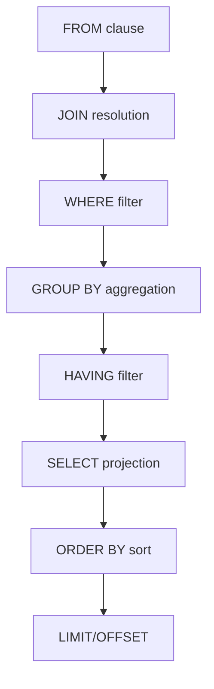

**Remember:** You write `SELECT` first but it executes last among the filtering clauses. You cannot reference a `SELECT` alias in a `WHERE` clause for this reason.

---

### Pattern 2: JOIN Types — Choosing the Right One

**Intent:** Choose the correct JOIN type so you don't accidentally lose rows or create Cartesian products.
**When to use:** Any time you combine data from two or more tables.

```sql
-- INNER JOIN — only rows with a match in both tables
SELECT c.customer_name, o.order_id
FROM customers c
INNER JOIN orders o ON c.customer_id = o.customer_id;

-- LEFT JOIN — all left rows, NULLs for unmatched right rows
SELECT c.customer_name, o.order_id
FROM customers c
LEFT JOIN orders o ON c.customer_id = o.customer_id;
-- Includes customers who have never placed an order (o.order_id = NULL)

-- CROSS JOIN — Cartesian product (every row paired with every row)
-- Use only when intentional — returns rows(A) × rows(B)
SELECT c.size, c.color FROM shirt_sizes c CROSS JOIN shirt_colors;
```

**Diagram:**

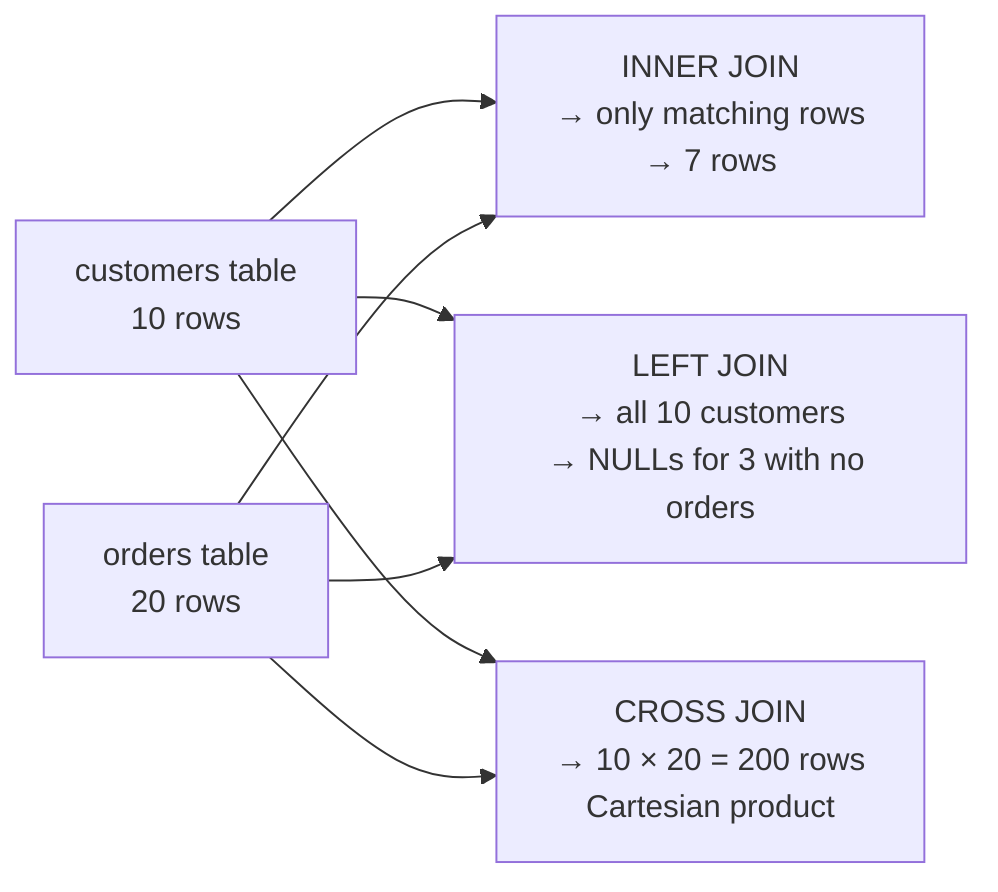

**Remember:** INNER JOIN is the default when you write `JOIN`. Always think: "Do I need rows that have no match?" If yes, use LEFT JOIN.

---

### Pattern 3: NULL-Safe Comparisons

**Intent:** Avoid incorrect results caused by NULL propagation.
**When to use:** Whenever a column might contain NULL values.

```sql
-- WRONG — always returns 0 rows; NULL = NULL is UNKNOWN, not TRUE
SELECT * FROM orders WHERE cancelled_at = NULL;

-- CORRECT — use IS NULL / IS NOT NULL
SELECT * FROM orders WHERE cancelled_at IS NULL;
SELECT * FROM orders WHERE cancelled_at IS NOT NULL;

-- WRONG — NOT IN with NULLs returns no rows
SELECT customer_id FROM customers
WHERE customer_id NOT IN (SELECT customer_id FROM flagged);
-- If any flagged.customer_id is NULL, result is empty!

-- CORRECT — NOT EXISTS handles NULLs correctly
SELECT c.customer_id FROM customers c
WHERE NOT EXISTS (
    SELECT 1 FROM flagged f WHERE f.customer_id = c.customer_id
);
```

**Remember:** NULL is not a value — it is the *absence* of a value. Any comparison with NULL (`=`, `<>`, `<`, `>`) returns UNKNOWN, which is treated as FALSE in WHERE clauses.

---

## Clean Code

Basic clean code principles when writing SQL:

### Naming Tables and Columns

| Element | Rule | Bad | Good |
|---------|------|-----|------|
| **Tables** | Plural noun, snake_case | `CustomerData`, `tbl_orders` | `customers`, `orders` |
| **Columns** | Singular noun, snake_case | `CustName`, `dt` | `customer_name`, `created_at` |
| **Primary Keys** | `id` or `table_id` | `pk`, `ID`, `custPK` | `customer_id`, `id` |
| **Foreign Keys** | `referenced_table_id` | `fk_cust`, `cid` | `customer_id` |
| **Boolean columns** | `is_`, `has_`, `can_` prefix | `active`, `deleted`, `flag` | `is_active`, `is_deleted`, `has_discount` |
| **Timestamps** | `_at` suffix | `created`, `del_dt` | `created_at`, `deleted_at` |
| **Indexes** | `idx_table_column(s)` | `my_index`, `fast_idx` | `idx_orders_customer_id` |

```sql
-- Bad naming
SELECT t1.nm, t1.dt, t2.v
FROM t1
JOIN t2 ON t1.id = t2.t1id;

-- Good naming
SELECT c.customer_name, c.created_at, o.amount
FROM customers c
JOIN orders o ON c.customer_id = o.customer_id;
```

---

### Query Formatting

```sql
-- Unformatted — hard to read and review
select c.customer_name,count(o.order_id) as cnt,sum(o.amount) as total from customers c join orders o on c.customer_id=o.customer_id where c.country='US' group by c.customer_name having count(o.order_id)>5 order by total desc limit 10;

-- Clean formatting — one clause per line, consistent indentation
SELECT
    c.customer_name,
    COUNT(o.order_id)  AS order_count,
    SUM(o.amount)      AS total_spent
FROM customers c
JOIN orders o ON c.customer_id = o.customer_id
WHERE c.country = 'US'
GROUP BY c.customer_name
HAVING COUNT(o.order_id) > 5
ORDER BY total_spent DESC
LIMIT 10;
```

**Rules:**
- One clause per line: `SELECT`, `FROM`, `WHERE`, `GROUP BY`, `HAVING`, `ORDER BY`
- Indent column list under `SELECT`
- Align `AS` aliases for readability in multi-column SELECTs
- Use uppercase for SQL keywords, lowercase for identifiers

---

### Comments in SQL

```sql
-- Noise comment (states the obvious)
-- SELECT from customers table
SELECT * FROM customers;

-- Outdated comment (misleads)
-- Returns top 10 active users (actually returns all users now)
SELECT * FROM users;

-- Explains WHY, not WHAT
-- COALESCE needed: customers with no orders have NULL total_spend
-- We want to display 0 instead of NULL for UI rendering
SELECT
    c.customer_name,
    COALESCE(SUM(o.amount), 0) AS total_spent
FROM customers c
LEFT JOIN orders o ON c.customer_id = o.customer_id
GROUP BY c.customer_name;
```

**Rule:** Comment on business logic, non-obvious behavior (NULL handling, type casts), and the *why* behind a query structure. Don't state what SQL syntax does.

---

## Product Use / Feature

### 1. E-Commerce Order Reporting

- **How SQL is used:** Aggregate queries (`GROUP BY`, `SUM`, `COUNT`) power dashboards showing daily revenue, top products, and customer lifetime value.
- **Why it matters:** Without SQL grouping and aggregation, every report would require application-level loops over millions of records — orders of magnitude slower.

### 2. User Authentication Systems

- **How SQL is used:** `SELECT` with indexed `WHERE` on `email` or `username` for login; `INSERT` with UNIQUE constraints to prevent duplicate accounts.
- **Why it matters:** The UNIQUE constraint enforces data integrity at the database level, preventing race conditions that application-level checks can miss.

### 3. Content Management Systems (CMS)

- **How SQL is used:** `JOIN` between `posts`, `users`, `tags`, and `categories` tables to assemble full content records in one query.
- **Why it matters:** A single efficient JOIN replaces multiple round-trips to the database, reducing page load time.

### 4. Analytics and BI Tools (Metabase, Redash, Tableau)

- **How SQL is used:** Users write or generate SQL queries that run directly against the database; results are rendered as charts and tables.
- **Why it matters:** SQL is the universal language for structured data — BI tools expose it directly because no abstraction is as powerful or flexible.

### 5. Data Migration and ETL Pipelines

- **How SQL is used:** `INSERT INTO ... SELECT FROM` to transform and load data between tables; `UPDATE ... JOIN` to enrich existing records.
- **Why it matters:** SQL's set-based operations transform millions of rows in a single statement, far more efficiently than row-by-row application code.

---

## "What If?" Scenarios

**What if you forget a `WHERE` clause on an `UPDATE`?**
- **You might think:** Only the rows you intended to update are affected.
- **But actually:** Every row in the table is updated. `UPDATE users SET is_active = FALSE` disables all users. Always verify with `SELECT COUNT(*)` using the same `WHERE` condition first.

**What if two columns have the same name in a JOIN?**
- **You might think:** SQL auto-resolves the column name.
- **But actually:** You get `ERROR: column reference "id" is ambiguous`. Always use table aliases to qualify every column in multi-table queries: `c.customer_id`, not just `customer_id`.

**What if you use `HAVING` instead of `WHERE` for a non-aggregate condition?**
- **You might think:** It works the same way.
- **But actually:** It works but is less efficient. `WHERE` filters rows before grouping (fewer rows to aggregate). `HAVING` filters after grouping (all rows aggregated first, then discarded). Use `WHERE` for non-aggregate conditions.

---

## Tricky Questions

**1. What does this query return?**

```sql
SELECT 1 WHERE NULL = NULL;
```

- A) Returns one row with value 1
- B) Returns an error
- C) Returns no rows
- D) Returns NULL

<details>
<summary>Answer</summary>

**C)** Returns no rows. `NULL = NULL` evaluates to `UNKNOWN` (not TRUE), so the WHERE condition fails and no rows pass. To test for NULL, use `IS NULL`.
</details>

---

**2. Which query correctly counts only non-NULL values in the `discount` column?**

- A) `SELECT COUNT(*) FROM orders`
- B) `SELECT COUNT(discount) FROM orders`
- C) `SELECT COUNT(1) FROM orders WHERE discount IS NOT NULL`
- D) Both B and C

<details>
<summary>Answer</summary>

**D)** Both B and C are correct. `COUNT(column)` skips NULLs automatically. `COUNT(1) WHERE discount IS NOT NULL` explicitly filters NULLs. `COUNT(*)` counts all rows regardless of NULLs.
</details>

---

**3. What is the difference between `UNION` and `UNION ALL`?**

- A) `UNION ALL` removes duplicates; `UNION` keeps them
- B) `UNION` removes duplicates; `UNION ALL` keeps all rows including duplicates
- C) They are identical — `ALL` is just a hint to the optimizer
- D) `UNION` works on different tables; `UNION ALL` requires same table

<details>
<summary>Answer</summary>

**B)** `UNION` deduplicates the combined result set (requires a sort or hash operation). `UNION ALL` keeps all rows including duplicates and is faster. Use `UNION ALL` when you know duplicates won't occur or don't need to be removed.
</details>

---

**4. You write `WHERE created_at > '2024-01-01'` on a column with an index. Will the index be used?**

- A) Yes, always
- B) No — string literals can never use date indexes
- C) It depends on the data type of `created_at` — if it's TIMESTAMPTZ, the literal must be cast correctly; most RDBMS do this automatically
- D) Only if `created_at` is the first column in a composite index

<details>
<summary>Answer</summary>

**C)** Most RDBMS implicitly cast the string literal to the column's date/timestamp type and use the index. However, if you wrap the column in a function (`DATE(created_at) > '2024-01-01'`), the index is bypassed. Keep the column bare in the predicate.
</details>

---

## Self-Assessment Checklist

### I can explain:
- [ ] What the logical execution order of SQL clauses is (FROM → WHERE → GROUP BY → HAVING → SELECT → ORDER BY → LIMIT)
- [ ] Why `NULL = NULL` returns UNKNOWN, not TRUE
- [ ] The difference between INNER JOIN, LEFT JOIN, and CROSS JOIN
- [ ] Why `COUNT(*)` and `COUNT(column)` can return different numbers

### I can do:
- [ ] Write a SELECT query with WHERE, GROUP BY, HAVING, and ORDER BY from scratch
- [ ] Write an INNER JOIN and a LEFT JOIN for the same scenario and explain the difference in results
- [ ] Use `IS NULL` and `IS NOT NULL` correctly
- [ ] Use `COALESCE()` to replace NULL with a default value

### I can answer:
- [ ] All questions in the Test section of this document

---

## Summary

{{TOPIC_NAME}} at the junior level is about the core SELECT loop: pick tables (FROM), filter rows (WHERE), group and aggregate (GROUP BY / HAVING), pick columns (SELECT), and sort (ORDER BY). Master NULL semantics and JOIN types before moving on.

---

## What You Can Build

- A customer report showing top spenders by region
- A daily sales summary aggregated by product category
- An inventory dashboard with low-stock alerts based on threshold filtering

---

## Further Reading

- [PostgreSQL Documentation — SQL Commands](https://www.postgresql.org/docs/current/sql-commands.html)
- [MySQL Documentation — SQL Statements](https://dev.mysql.com/doc/refman/8.0/en/sql-statements.html)
- [SQLZoo — Interactive SQL Tutorials](https://sqlzoo.net)
- [Mode SQL Tutorial](https://mode.com/sql-tutorial/)

---

## Related Topics

- **[SELECT Statements](../02-select-statements/)** — the foundation of every query; all other topics build on it
- **[WHERE Clause](../03-where-clause/)** — row-level filtering; understanding NULL here is critical
- **[Joins & Relationships](../04-joins/)** — combining multiple tables; the most complex beginner topic
- **[Aggregate Functions](../05-aggregate-functions/)** — COUNT, SUM, AVG, MIN, MAX with GROUP BY and HAVING
- **[Indexes](../06-indexes/)** — the performance layer; understanding SELECT first makes indexing intuitive
- **[Transactions](../07-transactions/)** — ACID properties; knowing SELECT isolation explains why reads behave differently under concurrent writes

---

## Diagrams & Visual Aids

### Mind Map — SQL SELECT Concepts

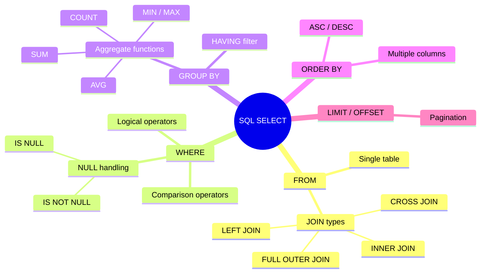

### SQL Logical Execution Order

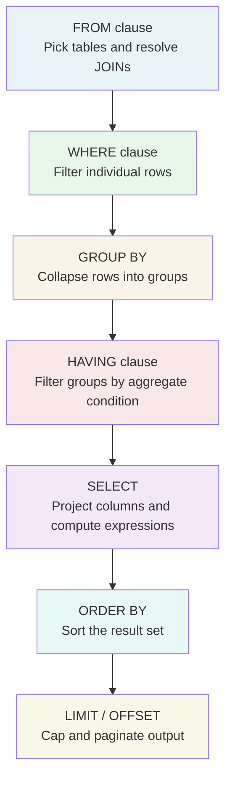

### JOIN Types — Venn Diagram Style

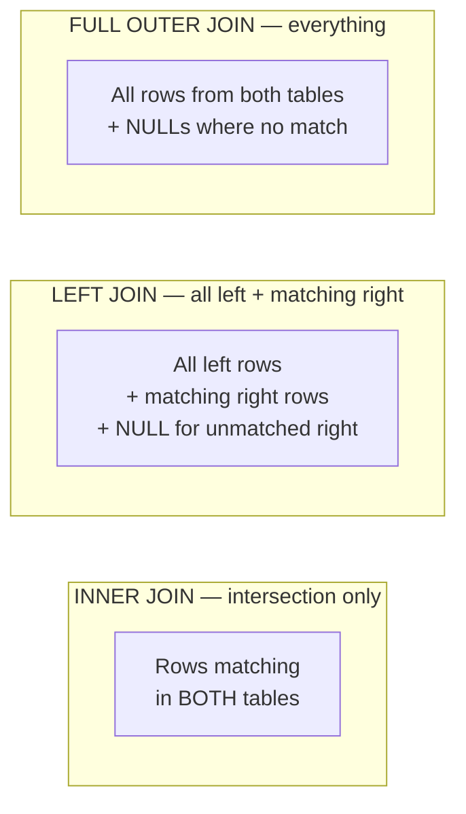

### NULL Propagation Rules

```
NULL + 5        = NULL
NULL * 0        = NULL
NULL || 'text'  = NULL   (string concat in Oracle/PostgreSQL)
NULL = NULL     = UNKNOWN
NULL <> NULL    = UNKNOWN
NULL IS NULL    = TRUE    ← correct way to test
COALESCE(NULL, 0) = 0    ← replace NULL with default
```

</details>

---
---

# TEMPLATE 2 — `middle.md`

<details open>
<summary><strong>Template Content</strong></summary>

# {{TOPIC_NAME}} — Middle Level

## Table of Contents

1. [Introduction](#introduction)
2. [Prerequisites](#prerequisites)
3. [Deep Dive](#deep-dive)
4. [Architecture Patterns](#architecture-patterns)
5. [Comparison with Alternatives](#comparison-with-alternatives)
6. [Advanced Query Examples](#advanced-query-examples)
7. [Testing Strategy](#testing-strategy)
8. [Observability & Monitoring](#observability--monitoring)
9. [Security](#security)
10. [Performance & Scalability](#performance--scalability)
11. [Anti-Patterns](#anti-patterns)
12. [Tricky Points](#tricky-points)
13. [Cheat Sheet](#cheat-sheet)
14. [Summary](#summary)
15. [Further Reading](#further-reading)

---

## Introduction

> Focus: "Why does SQL work this way?" and "When should I use a CTE vs. a subquery vs. a window function?"

{{TOPIC_NAME}} at the middle level is about writing efficient analytical queries, understanding execution plans, and designing schemas that perform well under load.

---

## Prerequisites

- Junior-level mastery of {{TOPIC_NAME}}
- Understanding of indexes at a conceptual level
- Familiarity with transactions and ACID properties
- Access to a relational database (PostgreSQL, MySQL, SQL Server, or SQLite)

---

## Deep Dive

### Why CTEs improve readability (but not always performance)

CTEs (`WITH` clauses) are syntactic sugar for subqueries in most databases. They make complex queries more readable by giving intermediate result sets a name. Note: in PostgreSQL < 12, CTEs were optimization fences (the planner couldn't inline them); in PostgreSQL 12+ and most other RDBMS, the planner can inline and optimize CTEs like subqueries. MySQL 8.0+ and SQL Server both support CTEs with full optimization.

### Window functions vs. GROUP BY

Window functions compute an aggregate over a "window" of related rows without collapsing them into a single row. `GROUP BY` collapses all rows in a group into one summary row. Use window functions when you need both the detail row and an aggregate value in the same result — for example, showing each order alongside its customer's total spend.

### Transaction isolation levels

| Level | Dirty Read | Non-Repeatable Read | Phantom Read | Notes |
|-------|:----------:|:-------------------:|:------------:|-------|
| **READ UNCOMMITTED** | Possible | Possible | Possible | Not supported in PostgreSQL (treated as READ COMMITTED) |
| **READ COMMITTED** | No | Possible | Possible | Default in PostgreSQL, Oracle |
| **REPEATABLE READ** | No | No | Possible* | Default in MySQL InnoDB (*MySQL prevents phantoms via gap locks) |
| **SERIALIZABLE** | No | No | No | Full isolation; may cause serialization failures requiring retry |

---

## Architecture Patterns

### Pattern 1: Analytical Query with Window Functions

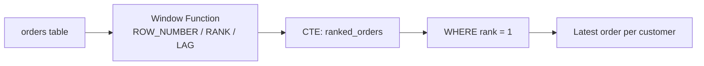

### Pattern 2: Slowly Changing Dimension (SCD Type 2)

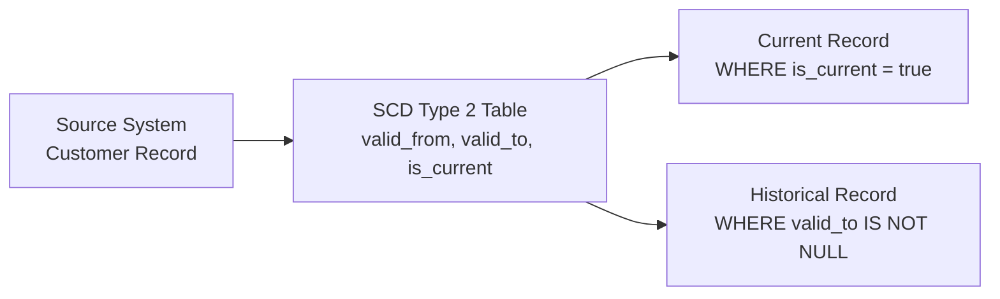

### Pattern 3: Recursive CTE for Hierarchical Data

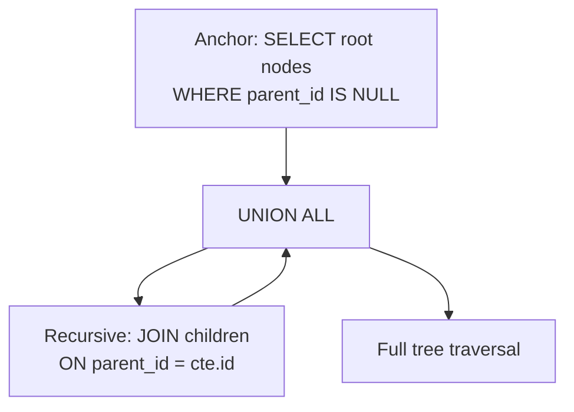

Recursive CTEs let you traverse tree structures (org charts, category trees, bill-of-materials) without application-level loops. Supported in PostgreSQL, MySQL 8.0+, SQL Server, Oracle, and SQLite 3.8.3+.

---

## Comparison with Alternatives

| Approach | Strength | Weakness | Best For |
|----------|----------|----------|----------|
| **Correlated subquery** | Readable for simple lookups | Executes once per row — O(n²) | Small lookup tables |
| **JOIN** | Set-based, optimizer-friendly | Requires understanding of cardinality | Most joins — preferred over subqueries |
| **CTE** | Readable, reusable within query | Can be optimization fence (older engines) | Complex multi-step queries |
| **Window function** | Aggregate + detail in one pass | Steeper learning curve | Running totals, rankings, lag/lead |
| **Temporary table** | Can be indexed | Requires DDL, session-scoped | Very large intermediate results |

---

## Advanced Query Examples

```sql
-- Window function: rank customers by total spend, per region
WITH customer_spend AS (
    SELECT
        c.customer_id,
        c.region,
        SUM(o.amount) AS total_spend
    FROM customers c
    JOIN orders o ON c.customer_id = o.customer_id
    GROUP BY c.customer_id, c.region
),
ranked AS (
    SELECT
        *,
        RANK() OVER (PARTITION BY region ORDER BY total_spend DESC) AS spend_rank
    FROM customer_spend
)
SELECT * FROM ranked WHERE spend_rank <= 3;
```

```sql
-- Running total with LAG for period-over-period change
SELECT
    sale_date,
    daily_revenue,
    SUM(daily_revenue) OVER (ORDER BY sale_date) AS running_total,
    daily_revenue - LAG(daily_revenue, 1, 0)
        OVER (ORDER BY sale_date)                AS day_over_day_change
FROM daily_sales
ORDER BY sale_date;
```

```sql
-- Find gaps in a sequence (e.g., missing order IDs)
SELECT
    id + 1                      AS gap_start,
    next_id - 1                 AS gap_end,
    next_id - id - 1            AS gap_size
FROM (
    SELECT
        id,
        LEAD(id) OVER (ORDER BY id) AS next_id
    FROM orders
) seq
WHERE next_id > id + 1;
```

---

## Testing Strategy

| Test Type | What to Test | Approach |
|-----------|-------------|----------|
| **Unit (query)** | Query returns correct rows for known input | pgTAP (PostgreSQL), tSQLt (SQL Server), or manual test data + assert |
| **Regression** | Refactored query returns identical result set | Diff output of old vs. new query |
| **Performance** | Query runs within SLA on production-sized data | `EXPLAIN ANALYZE` (PostgreSQL/MySQL), Execution Plan (SQL Server) |
| **Schema migration** | Migration is reversible and idempotent | Test up + down migration in CI |
| **Constraint** | NOT NULL, FK, UNIQUE constraints prevent bad data | INSERT bad data and verify error |

---

## Observability & Monitoring

**PostgreSQL:**
- Enable `pg_stat_statements` to track query frequency and total execution time
- Monitor `pg_stat_user_tables` for sequential scan vs. index scan ratio
- Track table bloat: `pg_stat_user_tables.n_dead_tup` — trigger VACUUM if high

**MySQL:**
- Enable Performance Schema and `sys` schema for query analytics
- Use `SHOW PROCESSLIST` to monitor active queries
- Check `SHOW ENGINE INNODB STATUS` for lock waits and deadlocks

**SQL Server:**
- Use Dynamic Management Views (DMVs): `sys.dm_exec_query_stats`
- Monitor with Query Store for plan regression detection
- Use Extended Events for detailed query tracing

```sql
-- PostgreSQL: Top 10 slowest queries (requires pg_stat_statements)
SELECT
    query,
    calls,
    total_exec_time / calls AS avg_ms,
    rows / calls             AS avg_rows
FROM pg_stat_statements
ORDER BY avg_ms DESC
LIMIT 10;

-- MySQL: Top 10 slowest queries (requires Performance Schema)
SELECT
    DIGEST_TEXT AS query,
    COUNT_STAR AS calls,
    AVG_TIMER_WAIT / 1000000000 AS avg_ms
FROM performance_schema.events_statements_summary_by_digest
ORDER BY avg_ms DESC
LIMIT 10;
```

---

## Security

- Use `GRANT SELECT ON TABLE` — never grant full table permissions to application users
- Restrict client connections by IP (PostgreSQL: `pg_hba.conf`, MySQL: `CREATE USER ... @'ip'`)
- Enable SSL/TLS for connections — encrypt data in transit
- Rotate credentials via connection poolers (PgBouncer, ProxySQL) to avoid downtime

---

## Performance & Scalability

- Use partial indexes for common query patterns: `CREATE INDEX ON orders (status) WHERE status = 'pending'` (PostgreSQL; MySQL uses filtered index workarounds with generated columns)
- Use `EXPLAIN (ANALYZE, BUFFERS)` (PostgreSQL) or `EXPLAIN ANALYZE` (MySQL 8.0+) to see actual execution metrics
- Monitor cache hit ratio — high disk reads indicate insufficient buffer pool/shared buffers

---

## Anti-Patterns

| Anti-Pattern | Problem | Fix |
|-------------|---------|-----|
| **Function on indexed column** | `WHERE LOWER(email) = 'x'` ignores index | Use a functional index or normalize at write time |
| **`SELECT *` in production** | Returns extra columns; breaks if schema changes | Enumerate required columns explicitly |
| **Implicit type cast** | `WHERE int_col = '123'` may block index use | Ensure types match: `WHERE int_col = 123` |
| **Correlated subquery in SELECT** | Executes once per row | Rewrite as a JOIN or window function |

---

## Tricky Points

- **`NOT IN` with NULLs** — `WHERE x NOT IN (SELECT y FROM t)` returns no rows if any `y` is NULL; use `NOT EXISTS` instead
- **JOIN order matters for readability but not correctness** — the optimizer reorders joins; but explicit ordering helps humans reason about query structure
- **CTE materialization** — in PostgreSQL < 12, CTEs are always materialized (optimization fence). In PostgreSQL 12+, MySQL 8.0+, and SQL Server, the planner can inline them. Use `MATERIALIZED` / `NOT MATERIALIZED` hints in PostgreSQL 12+ if needed

---

## Cheat Sheet

| Task | Query |
|------|-------|
| Row number per group | `ROW_NUMBER() OVER (PARTITION BY col ORDER BY col2)` |
| Running total | `SUM(col) OVER (ORDER BY date_col)` |
| Previous row value | `LAG(col, 1) OVER (ORDER BY date_col)` |
| Upsert (PostgreSQL) | `INSERT ... ON CONFLICT (id) DO UPDATE SET ...` |
| Upsert (MySQL) | `INSERT ... ON DUPLICATE KEY UPDATE ...` |
| Upsert (SQL Server) | `MERGE ... WHEN MATCHED THEN UPDATE WHEN NOT MATCHED THEN INSERT` |
| Explain plan | `EXPLAIN (ANALYZE, BUFFERS, FORMAT TEXT) SELECT ...` |

---

## Coding Patterns

Design patterns for analytical SQL queries:

### Pattern 1: CTE Chain for Multi-Step Transformations

**Intent:** Break a complex analytical query into named, readable steps using a chain of CTEs.
**When to use:** When a query has 3+ logical steps and a deeply nested subquery becomes unreadable.
**When NOT to use:** When performance is critical and you need the planner to inline the CTE (prefer subqueries in older PostgreSQL < 12).

```sql
-- Multi-step CTE chain: find top 3 customers per region by total spend
WITH
-- Step 1: Compute spend per customer
customer_spend AS (
    SELECT
        c.customer_id,
        c.region,
        c.customer_name,
        SUM(o.amount) AS total_spend
    FROM customers c
    JOIN orders o ON c.customer_id = o.customer_id
    WHERE o.status = 'completed'
    GROUP BY c.customer_id, c.region, c.customer_name
),

-- Step 2: Rank within each region
ranked AS (
    SELECT
        *,
        RANK() OVER (PARTITION BY region ORDER BY total_spend DESC) AS region_rank
    FROM customer_spend
),

-- Step 3: Filter to top 3 per region
top3 AS (
    SELECT * FROM ranked WHERE region_rank <= 3
)

-- Final: Return result
SELECT
    region,
    region_rank,
    customer_name,
    total_spend
FROM top3
ORDER BY region, region_rank;
```

**Diagram:**

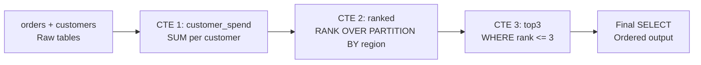

**Remember:** Each CTE is like a named temporary view within the query. Later CTEs can reference earlier ones. The last SELECT is the actual output.

---

### Pattern 2: Window Function for Running Totals and Rankings

**Intent:** Compute aggregates alongside detail rows without collapsing with GROUP BY.
**When to use:** Running totals, period-over-period change, rankings, or any "compute aggregate but keep each row."

```sql
-- Running total, day-over-day delta, and 7-day moving average
SELECT
    sale_date,
    daily_revenue,

    -- Cumulative sum from first row to current row
    SUM(daily_revenue)
        OVER (ORDER BY sale_date
              ROWS BETWEEN UNBOUNDED PRECEDING AND CURRENT ROW)
        AS running_total,

    -- Previous day's revenue (NULL for first row)
    LAG(daily_revenue, 1)
        OVER (ORDER BY sale_date)
        AS prev_day_revenue,

    -- Change from previous day
    daily_revenue - LAG(daily_revenue, 1, 0)
        OVER (ORDER BY sale_date)
        AS day_over_day_delta,

    -- 7-day moving average
    ROUND(
        AVG(daily_revenue)
            OVER (ORDER BY sale_date
                  ROWS BETWEEN 6 PRECEDING AND CURRENT ROW),
        2
    ) AS moving_avg_7d

FROM daily_sales
ORDER BY sale_date;
```

**Diagram:**

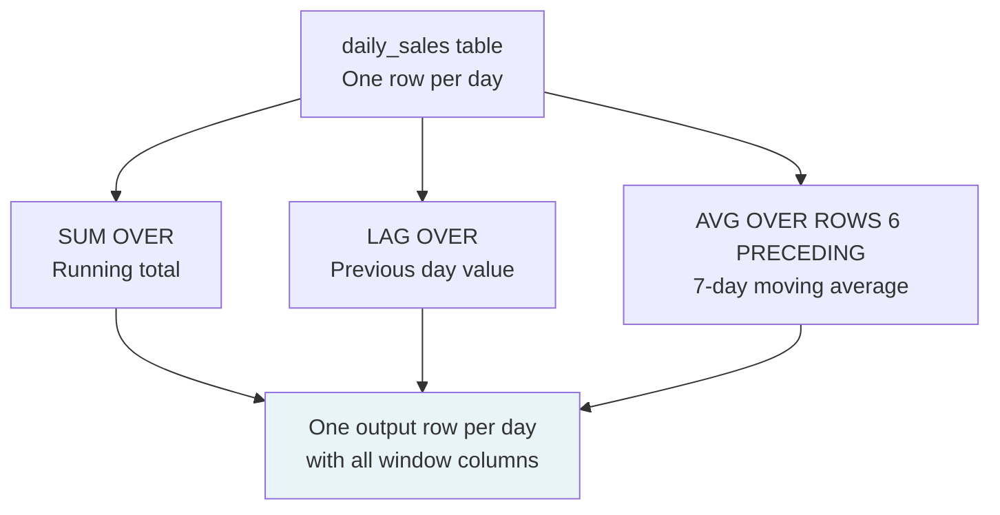

**Remember:** Window functions execute AFTER `WHERE` and `GROUP BY` but BEFORE `ORDER BY`. You cannot use a window function in a `WHERE` clause — wrap it in a CTE or subquery.

---

### Pattern 3: Upsert (INSERT ... ON CONFLICT)

**Intent:** Insert a row if it doesn't exist; update it if it does — atomically, without a race condition.
**When to use:** ETL pipelines, idempotent data loading, cache-table population.

```sql
-- PostgreSQL: UPSERT with ON CONFLICT DO UPDATE
INSERT INTO product_inventory (product_id, warehouse_id, quantity, last_updated)
VALUES (101, 5, 250, NOW())
ON CONFLICT (product_id, warehouse_id)           -- unique constraint
DO UPDATE SET
    quantity     = EXCLUDED.quantity,            -- EXCLUDED = the rejected row
    last_updated = EXCLUDED.last_updated;

-- MySQL: equivalent
INSERT INTO product_inventory (product_id, warehouse_id, quantity, last_updated)
VALUES (101, 5, 250, NOW())
ON DUPLICATE KEY UPDATE
    quantity     = VALUES(quantity),
    last_updated = VALUES(last_updated);

-- SQL Server: MERGE
MERGE product_inventory AS target
USING (SELECT 101 AS product_id, 5 AS warehouse_id, 250 AS quantity) AS src
    ON target.product_id = src.product_id AND target.warehouse_id = src.warehouse_id
WHEN MATCHED     THEN UPDATE SET quantity = src.quantity
WHEN NOT MATCHED THEN INSERT (product_id, warehouse_id, quantity) VALUES (src.product_id, src.warehouse_id, src.quantity);
```

**Remember:** Upsert is atomic — no gap between the check and the write. Application-level "check then insert" logic has a race condition; upsert at the database level does not.

---

## Clean Code

Production-level SQL clean code principles:

### Naming and Readability

| Element | Rule | Bad | Good |
|---------|------|-----|------|
| **CTEs** | Named after what they contain, not the step number | `step1`, `tmp2`, `cte3` | `customer_spend`, `ranked_orders`, `monthly_totals` |
| **Window functions** | Alias the output clearly | `SUM(a) OVER (...)` | `SUM(a) OVER (...) AS running_total` |
| **Subqueries** | Always give subqueries an alias | `FROM (SELECT ...)` | `FROM (SELECT ...) AS top_spenders` |
| **Aggregates** | Alias every aggregate | `SUM(amount)` | `SUM(amount) AS total_revenue` |

```sql
-- Unreadable: no aliases, opaque intent
SELECT a.id, b.v, SUM(c.x) OVER (PARTITION BY a.r ORDER BY b.d)
FROM t1 a JOIN t2 b ON a.id = b.aid JOIN t3 c ON b.id = c.bid;

-- Readable: aliases that describe meaning
SELECT
    customers.customer_id,
    orders.order_date,
    SUM(order_items.line_total)
        OVER (PARTITION BY customers.region ORDER BY orders.order_date)
        AS region_running_total
FROM customers
JOIN orders      ON customers.customer_id = orders.customer_id
JOIN order_items ON orders.order_id = order_items.order_id;
```

---

### Function Design in Stored Procedures / Functions

```sql
-- Too long — does validation, business logic, and notification in one function
CREATE OR REPLACE FUNCTION process_order(p_order_id INT) RETURNS VOID AS $$
BEGIN
    -- 120+ lines: validate, compute tax, check inventory, update tables, send email...
END;
$$ LANGUAGE plpgsql;

-- Single responsibility — each function has one purpose
CREATE OR REPLACE FUNCTION validate_order(p_order_id INT) RETURNS BOOLEAN AS $$
BEGIN
    RETURN EXISTS (SELECT 1 FROM orders WHERE order_id = p_order_id AND status = 'draft');
END;
$$ LANGUAGE plpgsql;

CREATE OR REPLACE FUNCTION calculate_order_total(p_order_id INT) RETURNS NUMERIC AS $$
BEGIN
    RETURN (SELECT SUM(line_total) FROM order_items WHERE order_id = p_order_id);
END;
$$ LANGUAGE plpgsql;
```

**Rule:** A SQL function/procedure should do one thing. If you need to scroll to see the whole body — it does too much. Break it up.

---

### Comments in Production SQL

```sql
-- Noise comment — restates the code
-- Join customers and orders
FROM customers c JOIN orders o ON c.customer_id = o.customer_id

-- Explains the non-obvious business rule
-- LEFT JOIN: customers with zero orders still appear in the report with 0 spend
-- This matches the finance team's definition of "all active customers"
FROM customers c
LEFT JOIN orders o ON c.customer_id = o.customer_id

-- Explains a performance decision
-- MATERIALIZED CTE: forces separate execution of this expensive aggregation
-- to prevent the planner from inlining it into a correlated scan (PostgreSQL 12+)
WITH monthly_totals AS MATERIALIZED (
    SELECT DATE_TRUNC('month', order_date) AS month, SUM(amount) AS total
    FROM orders
    GROUP BY 1
)
```

---

## Product Use / Feature

### 1. Real-Time Analytics Dashboards (Grafana, Redash, Metabase)

- **How {{TOPIC_NAME}} is used:** Window functions and CTEs power time-series charts — rolling averages, cumulative totals, period-over-period comparisons. These tools run raw SQL against a database.
- **Why it matters:** A single window function replaces dozens of application-level calculations, reducing dashboard query time from seconds to milliseconds.

### 2. Data Warehouses (BigQuery, Snowflake, Redshift)

- **How {{TOPIC_NAME}} is used:** Complex CTEs chain multiple transformation steps; analytical window functions compute cohort metrics, retention rates, and funnel conversion without materializing intermediate tables.
- **Why it matters:** Modern DWs are optimized for SQL analytical queries — knowing CTEs and window functions is the core skill for data engineers and analysts.

### 3. Application ORM Layer (Django ORM, SQLAlchemy, ActiveRecord)

- **How {{TOPIC_NAME}} is used:** When ORMs hit their limits (complex window functions, recursive CTEs), engineers drop down to raw SQL using `QuerySet.raw()`, `session.execute()`, or `connection.execute()`.
- **Why it matters:** Knowing when the ORM cannot express a query efficiently — and being able to write the SQL directly — is a key middle-level skill.

### 4. Transaction Processing Systems

- **How {{TOPIC_NAME}} is used:** `SELECT ... FOR UPDATE` to lock rows before modification; `INSERT ... ON CONFLICT DO UPDATE` for idempotent writes; isolation level settings for correct concurrent behavior.
- **Why it matters:** Incorrect isolation level selection causes dirty reads, lost updates, or phantom rows — database-level correctness bugs that are hard to debug in the application layer.

### 5. Reporting and Reconciliation at FinTech Companies

- **How {{TOPIC_NAME}} is used:** CTEs model multi-step financial calculations (accruals, amortization schedules); window functions compute running balances; recursive CTEs traverse account hierarchies.
- **Why it matters:** Financial reports must be exactly correct — SQL set-based operations on properly constrained schemas eliminate entire categories of calculation bugs.

---

## Tricky Questions

**1. You run `WITH cte AS (SELECT ...) SELECT * FROM cte WHERE ...`. In PostgreSQL 11 (not 12+), how many times is the CTE executed?**

- A) Once — CTEs are always materialized once and reused
- B) It depends — the planner decides
- C) Zero times — CTEs are lazy
- D) Once per row in the outer query

<details>
<summary>Answer</summary>

**A)** In PostgreSQL 11 and earlier, CTEs are always materialized exactly once (they are an "optimization fence"). The outer `WHERE` cannot be pushed inside. In PostgreSQL 12+, the planner can inline non-recursive CTEs, so the answer becomes B for modern versions. This is a common cause of unexpected performance differences when upgrading.
</details>

---

**2. What does `RANK()` return if three rows tie for position 1?**

- A) 1, 1, 1 — then 2
- B) 1, 1, 1 — then 4
- C) 1, 2, 3 — ties are broken arbitrarily
- D) An error — ties are not allowed with RANK()

<details>
<summary>Answer</summary>

**B)** `RANK()` assigns the same rank to ties and skips the next ranks. Three rows tied at 1 all get rank 1, and the next row gets rank 4. Use `DENSE_RANK()` if you want 1, 1, 1, 2 (no gaps). Use `ROW_NUMBER()` if you want unique sequential numbers (tie-breaking is arbitrary but each row gets a unique number).
</details>

---

**3. What happens when you use a window function in a `WHERE` clause?**

```sql
SELECT customer_id, ROW_NUMBER() OVER (ORDER BY created_at) AS rn
FROM customers
WHERE rn = 1;   -- Is this valid?
```

- A) It works — returns only the first customer by `created_at`
- B) Syntax error — window functions cannot be referenced in WHERE
- C) Returns all rows — WHERE on window function is ignored
- D) It works in PostgreSQL but not MySQL

<details>
<summary>Answer</summary>

**B)** Syntax error in all standard SQL databases. Window functions execute after WHERE (and GROUP BY), so you cannot reference a window function alias in a WHERE clause. Wrap in a CTE or subquery: `WITH cte AS (SELECT ..., ROW_NUMBER() OVER (...) AS rn FROM ...) SELECT * FROM cte WHERE rn = 1`.
</details>

---

**4. You have a query with `WHERE NOT IN (SELECT ...)`. A DBA says "this will return no rows." What single change makes it return the expected results?**

- A) Change `NOT IN` to `<> ALL`
- B) Change `NOT IN` to `NOT EXISTS`
- C) Add `WHERE subquery_col IS NOT NULL` inside the subquery
- D) Both B and C fix the problem

<details>
<summary>Answer</summary>

**D)** Both work. `NOT EXISTS` handles NULLs by design — it evaluates to TRUE if no matching row is found, regardless of NULLs. Adding `WHERE col IS NOT NULL` to the subquery also fixes it by excluding NULLs from the IN list. `NOT EXISTS` is generally preferred because it's more explicit and often more efficient.
</details>

---

## Summary

At the middle level, {{TOPIC_NAME}} is about writing analytical queries with CTEs and window functions, reading execution plans to understand what the optimizer does, and applying the right index type for each query pattern.

---

## Further Reading

- [Use the Index, Luke](https://use-the-index-luke.com/)
- [PostgreSQL EXPLAIN Documentation](https://www.postgresql.org/docs/current/using-explain.html)
- [MySQL EXPLAIN Output Format](https://dev.mysql.com/doc/refman/8.0/en/explain-output.html)
- [pgTAP — Unit Testing for PostgreSQL](https://pgtap.org/)

---

## Related Topics

- **[Window Functions](../06-window-functions/)** — the full reference for ROW_NUMBER, RANK, LAG, LEAD, NTILE, and frame clauses
- **[Subqueries & CTEs](../05-subqueries-ctes/)** — scalar subqueries, correlated subqueries, recursive CTEs
- **[Transactions & Concurrency](../07-transactions/)** — isolation levels, locking, deadlocks, savepoints
- **[Performance & Optimization](../08-performance/)** — EXPLAIN ANALYZE, index types, query plan reading
- **[Database Design](../09-design/)** — normalization, SCD, schema patterns that affect query strategy
- **[Set Operations](../04-set-operations/)** — UNION, INTERSECT, EXCEPT — when to use them over JOINs

---

## Diagrams & Visual Aids

### CTE Chain Flow

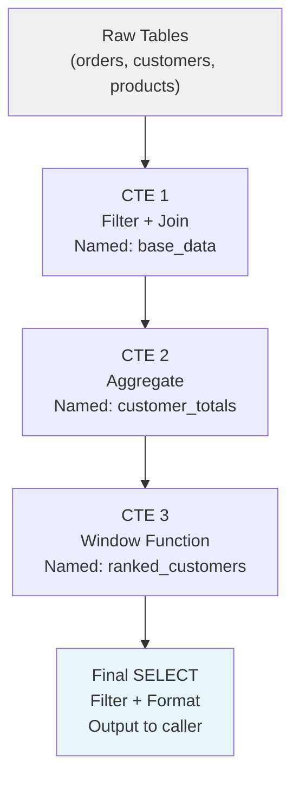

### Window Function Frame Clauses

```
ROWS BETWEEN UNBOUNDED PRECEDING AND CURRENT ROW
├── Includes all rows from the start of the partition to the current row
└── Classic running total / cumulative sum

ROWS BETWEEN 6 PRECEDING AND CURRENT ROW
├── Includes the current row and the 6 rows before it
└── 7-row moving average / rolling window

RANGE BETWEEN INTERVAL '7 days' PRECEDING AND CURRENT ROW
├── Includes rows within the last 7 days relative to current row's value
└── Calendar-based rolling window (works with date columns)
```

### Transaction Isolation Level — What Each Allows

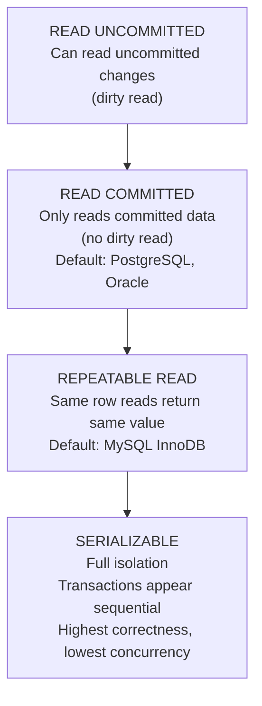

### Mind Map — Middle-Level SQL Concepts

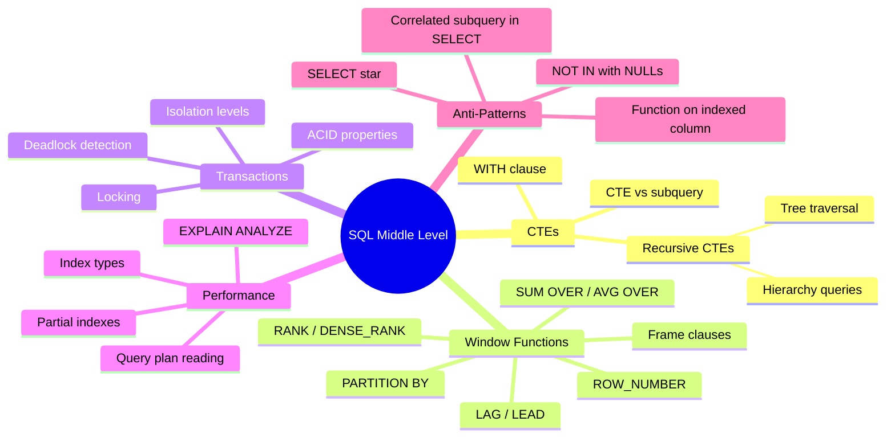

</details>

---
---

# TEMPLATE 3 — `senior.md`

<details open>
<summary><strong>Template Content</strong></summary>

# {{TOPIC_NAME}} — Senior Level

## Table of Contents

1. [Introduction](#introduction)
2. [Schema Design for Performance](#schema-design-for-performance)
3. [Index Strategy](#index-strategy)
4. [Partitioning](#partitioning)
5. [Query Optimization at Scale](#query-optimization-at-scale)
6. [Reliability & Resilience](#reliability--resilience)
7. [Query Examples](#query-examples)
8. [Tricky Points](#tricky-points)
9. [Summary](#summary)

---

## Introduction

> Focus: "How to design schemas that perform at scale?" and "How to read and influence the query planner?"

At the senior level, {{TOPIC_NAME}} is about making deliberate schema and index design decisions, reading execution plans deeply, and understanding how the database allocates compute and I/O.

---

## Schema Design for Performance

### Normalization vs. Denormalization Trade-offs

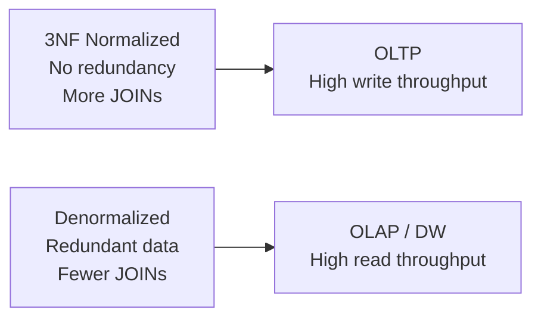

| Design | Pros | Cons | Best For |
|--------|------|------|---------|
| **3NF Normalized** | No anomalies, compact writes | Many JOINs for reads | OLTP, transactional systems |
| **Denormalized** | Fast reads, fewer JOINs | Write overhead, possible inconsistency | Data warehouses, analytics |
| **Partial denormalization** | Balanced | Requires careful cache invalidation | Mixed OLTP/OLAP |

---

## Index Strategy

### When the Planner Uses an Index

The planner uses an index when the estimated cost of an index scan is lower than a sequential scan. The threshold depends on:
- Table size
- Index selectivity (how many rows match)
- I/O cost ratio (`random_page_cost` vs. `seq_page_cost` in PostgreSQL; optimizer cost model in MySQL/SQL Server)

```sql
-- Multi-column index: column order matters
-- This index supports: WHERE a = ? AND b = ?
-- Also supports:       WHERE a = ?  (leftmost prefix rule)
-- Does NOT support:    WHERE b = ?  (b alone, not leftmost)
CREATE INDEX idx_orders_customer_date
    ON orders (customer_id, order_date DESC);
```

### Index Types

| Index Type | Best For | Availability |
|-----------|---------|-------------|
| **B-tree** | Equality, range, ORDER BY — the default | All RDBMS |
| **Hash** | Equality only (no range) | PostgreSQL 10+, MySQL (Memory engine), SQL Server |
| **GIN** | Full-text search, array contains, JSONB | PostgreSQL |
| **GiST** | Geometric data, text similarity (`pg_trgm`) | PostgreSQL |
| **BRIN** | Very large tables with naturally ordered data (time-series) | PostgreSQL |
| **Full-text** | Text search | MySQL (FULLTEXT), SQL Server (Full-Text Index) |
| **Partial / Filtered** | Index only rows matching a condition | PostgreSQL, SQL Server |
| **Expression / Computed** | Index on a function result (`LOWER(email)`) | PostgreSQL, SQL Server (computed columns) |

---

## Partitioning

```sql
-- PostgreSQL: Range partitioning by month
CREATE TABLE orders (
    order_id    BIGINT NOT NULL,
    order_date  DATE   NOT NULL,
    amount      NUMERIC(10,2)
) PARTITION BY RANGE (order_date);

CREATE TABLE orders_2024_01
    PARTITION OF orders
    FOR VALUES FROM ('2024-01-01') TO ('2024-02-01');

-- MySQL: Range partitioning by month
CREATE TABLE orders (
    order_id    BIGINT NOT NULL,
    order_date  DATE   NOT NULL,
    amount      DECIMAL(10,2),
    PRIMARY KEY (order_id, order_date)
) PARTITION BY RANGE (YEAR(order_date) * 100 + MONTH(order_date)) (
    PARTITION p202401 VALUES LESS THAN (202402),
    PARTITION p202402 VALUES LESS THAN (202403)
);

-- Query automatically uses partition pruning:
-- WHERE order_date BETWEEN '2024-01-01' AND '2024-01-31'
-- only scans the relevant partition
```

---

## Query Optimization at Scale

```sql
-- PostgreSQL: Read an EXPLAIN ANALYZE plan
EXPLAIN (ANALYZE, BUFFERS, FORMAT TEXT)
SELECT c.customer_name, SUM(o.amount)
FROM customers c
JOIN orders o ON c.customer_id = o.customer_id
WHERE o.order_date >= '2024-01-01'
GROUP BY c.customer_name;

-- MySQL: Read an EXPLAIN ANALYZE plan (8.0.18+)
EXPLAIN ANALYZE
SELECT c.customer_name, SUM(o.amount)
FROM customers c
JOIN orders o ON c.customer_id = o.customer_id
WHERE o.order_date >= '2024-01-01'
GROUP BY c.customer_name;

-- Key numbers to check:
-- "actual rows" vs estimated "rows=N" — large discrepancy = stale stats
-- Buffers: shared hit vs read (PostgreSQL) — cache miss rate
-- Node types: SeqScan/Full Table Scan (bad on large tables), HashJoin, MergeJoin, IndexScan
-- "rows removed by filter=N" — index could push this filter down
```

---

## Reliability & Resilience

- **Point-in-time recovery (PITR):** WAL archiving (PostgreSQL) or binary log (MySQL) enables restoring the database to any past second
- **Connection pooling:** PgBouncer (PostgreSQL), ProxySQL (MySQL), or built-in pooling (SQL Server) reduces connection overhead
- **Replication:** Streaming replication (PostgreSQL), binary log replication (MySQL), Always On (SQL Server) provides read scaling and failover
- **Maintenance:** Tune autovacuum (PostgreSQL) or `OPTIMIZE TABLE` (MySQL) for high-churn tables — defaults may be too conservative for large tables

---

## Query Examples

```sql
-- Force a specific index for testing (PostgreSQL — disable seq scan)
SET enable_seqscan = OFF;
EXPLAIN ANALYZE SELECT * FROM orders WHERE customer_id = 42;
SET enable_seqscan = ON;

-- Force a specific index for testing (MySQL — index hint)
SELECT * FROM orders FORCE INDEX (idx_customer_id)
WHERE customer_id = 42;

-- Force a specific index for testing (SQL Server — index hint)
SELECT * FROM orders WITH (INDEX(idx_customer_id))
WHERE customer_id = 42;
```

```sql
-- Update statistics to help the planner
-- PostgreSQL:
ANALYZE orders;
-- MySQL:
ANALYZE TABLE orders;
-- SQL Server:
UPDATE STATISTICS orders;
```

---

## Tricky Points

- **Planner statistics staleness** — statistics are updated automatically but may lag behind bulk loads; run manual ANALYZE after large data imports
- **HOT updates (PostgreSQL)** — an UPDATE that only touches non-indexed columns uses a Heap-Only Tuple update, which is much faster; adding unnecessary indexes blocks HOT
- **Covering indexes** — including all queried columns in the index (`INCLUDE` clause in PostgreSQL/SQL Server, or wide composite key in MySQL) enables index-only scans, avoiding heap/table lookups entirely

---

## Summary

At the senior level, {{TOPIC_NAME}} is about owning schema and index design as a performance discipline: understand when the planner will use an index, use partitioning for large time-series tables, read execution plans to find the real bottleneck, and keep statistics fresh.

</details>

---
---

# TEMPLATE 4 — `professional.md`

<details open>
<summary><strong>Template Content</strong></summary>

# {{TOPIC_NAME}} — Professional Level: Query Engine Internals

## Table of Contents

1. [Introduction](#introduction)
2. [EXPLAIN ANALYZE Deep Dive](#explain-analyze-deep-dive)
3. [Cost Model and Planner Statistics](#cost-model-and-planner-statistics)
4. [Execution Node Types](#execution-node-types)
5. [MVCC and Concurrency Control](#mvcc-and-concurrency-control)
6. [Write-Ahead Logging and Durability](#write-ahead-logging-and-durability)
7. [Deep Query Examples](#deep-query-examples)
8. [Tricky Points](#tricky-points)
9. [Summary](#summary)

---

## Introduction

> Focus: "What does the query engine do with my SQL?" — `EXPLAIN ANALYZE`, cost model, planner statistics, execution node types: SeqScan / IndexScan / HashJoin / MergeJoin, MVCC, WAL.

This level is for engineers who need to debug performance problems that are invisible at the query level and require understanding what the database engine does internally. Examples use PostgreSQL for specifics, with notes for MySQL and SQL Server where behavior differs.

---

## EXPLAIN ANALYZE Deep Dive

### Reading a Plan

```sql
-- PostgreSQL
EXPLAIN (ANALYZE, BUFFERS, FORMAT TEXT)
SELECT c.name, COUNT(*) AS order_count
FROM customers c
JOIN orders o ON c.customer_id = o.customer_id
WHERE o.status = 'completed'
GROUP BY c.name;
```

Sample output (PostgreSQL):

```
HashAggregate  (cost=1823.45..1891.23 rows=5432 width=64)
               (actual time=42.1..43.5 rows=5432 loops=1)
  Buffers: shared hit=1823 read=0
  ->  Hash Join  (cost=823.00..1678.23 rows=29044 width=56)
                 (actual time=12.3..38.4 rows=29044 loops=1)
        Hash Cond: (o.customer_id = c.customer_id)
        Buffers: shared hit=1823
        ->  Seq Scan on orders o  (cost=0..512.34 rows=29044 width=8)
                                  (actual time=0.1..8.2 rows=29044 loops=1)
              Filter: (status = 'completed')
              Rows Removed by Filter: 970956
              Buffers: shared hit=1112
        ->  Hash  (cost=510.00..510.00 rows=10000 width=48)
                  (actual time=10.2..10.2 rows=10000 loops=1)
              Buckets: 16384  Batches: 1  Memory Usage: 842kB
              ->  Seq Scan on customers c  (cost=0..510.00 rows=10000 width=48)
                                           (actual time=0.1..6.1 rows=10000 loops=1)
```

**Reading guide:**

| Field | Meaning |
|-------|---------|
| `cost=A..B` | Estimated cost: A = cost to first row, B = cost to last row (arbitrary units) |
| `actual time=X..Y` | Real milliseconds: X = first row, Y = last row |
| `rows=N` | Planner estimate vs. `actual rows=M` — large discrepancy = bad statistics |
| `loops=N` | Node executed N times (nested loop joins execute inner side once per outer row) |
| `Buffers: shared hit=X read=Y` | X pages from cache, Y pages from disk (PostgreSQL specific) |
| `Rows Removed by Filter: N` | N rows fetched but discarded — index on filter column would help |

**MySQL equivalent:** `EXPLAIN ANALYZE` (8.0.18+) shows actual time and row counts in a tree format. `EXPLAIN FORMAT=JSON` provides cost estimates.

**SQL Server equivalent:** Actual Execution Plan in SSMS shows actual vs. estimated rows, I/O stats, and operator costs.

---

## Cost Model and Planner Statistics

### Cost Parameters (PostgreSQL)

PostgreSQL's cost model uses configurable cost constants:

| Parameter | Default | Meaning |
|-----------|---------|---------|
| `seq_page_cost` | 1.0 | Cost to read one page sequentially |
| `random_page_cost` | 4.0 | Cost to read one page randomly (index lookup) |
| `cpu_tuple_cost` | 0.01 | Cost to process one row |
| `cpu_operator_cost` | 0.0025 | Cost to evaluate one operator |

**Implication:** Setting `random_page_cost = 1.1` on SSDs (where random I/O is nearly as fast as sequential) makes the planner prefer index scans more aggressively.

**MySQL:** InnoDB uses a similar cost model configured via `mysql.server_cost` and `mysql.engine_cost` tables (since 5.7). Key parameter: `io_block_read_cost` (default 1.0) vs. `memory_block_read_cost` (default 0.25).

**SQL Server:** Uses a proprietary cost model. You can influence it via `OPTION(OPTIMIZE FOR ...)` hints and `sp_updatestats`.

### Planner Statistics

The planner uses column statistics to estimate row counts:

```sql
-- PostgreSQL: inspect statistics for a column
SELECT
    attname,
    n_distinct,
    correlation,
    most_common_vals,
    most_common_freqs,
    histogram_bounds
FROM pg_stats
WHERE tablename = 'orders' AND attname = 'status';

-- MySQL: inspect index cardinality
SELECT
    TABLE_NAME, INDEX_NAME, COLUMN_NAME, CARDINALITY
FROM INFORMATION_SCHEMA.STATISTICS
WHERE TABLE_NAME = 'orders';

-- SQL Server: view statistics
DBCC SHOW_STATISTICS ('orders', 'idx_status');
```

| Statistic | Usage |
|-----------|-------|
| `n_distinct` / cardinality | Estimated distinct values — used for JOIN and GROUP BY cost estimation |
| `correlation` (PostgreSQL) | How physically ordered the column is (1.0 = sorted, 0 = random) — affects index benefit |
| `most_common_vals/freqs` | Enables precise selectivity for equality predicates on skewed distributions |
| `histogram_bounds` | Enables range predicate selectivity estimation |

---

## Execution Node Types

### Sequential / Full Table Scan

Reads every page of the table sequentially. Optimal when:
- The predicate matches a large fraction of rows (> ~5-20% depending on cost model)
- The table fits in buffer pool (already cached)

Called **Seq Scan** in PostgreSQL, **Full Table Scan** in MySQL, **Table Scan** in SQL Server.

### Index Scan

Follows the B-tree index to find matching row pointers, then fetches the actual data pages. Optimal when:
- Predicate is highly selective (few rows match)
- Table is large and doesn't fit in cache

### Index-Only Scan

Returns data directly from the index without touching the data pages — requires all SELECT columns to be in the index (covering index). Fastest for selective queries on wide tables.

```sql
-- PostgreSQL: covering index with INCLUDE
CREATE INDEX idx_orders_covering
    ON orders (customer_id, order_date)
    INCLUDE (amount, status);

-- MySQL: covering index (include all columns in the key)
CREATE INDEX idx_orders_covering
    ON orders (customer_id, order_date, amount, status);

-- SQL Server: covering index with INCLUDE
CREATE INDEX idx_orders_covering
    ON orders (customer_id, order_date)
    INCLUDE (amount, status);

-- Query can be served entirely from the index:
SELECT order_date, amount, status
FROM orders
WHERE customer_id = 42;
```

### Hash Join

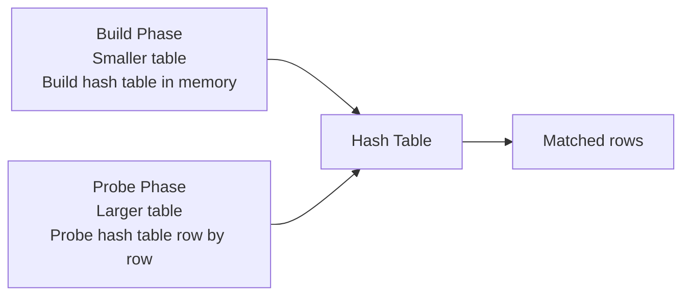

**When used:** Large joins without a useful sort order. Hash table must fit in memory (`work_mem` in PostgreSQL, `join_buffer_size` in MySQL). Available in PostgreSQL, SQL Server, and MySQL 8.0.18+ (with `hash_join=on`).

### Merge Join

Requires both input sides to be sorted on the join key. Produces output in sorted order — can enable an ORDER BY without an extra sort node.

**When used:** When both sides are already sorted (e.g., joined on an indexed column). Available in PostgreSQL and SQL Server. MySQL does not support merge joins — it uses nested loops or hash joins.

### Nested Loop

```
FOR each row in outer:
    FOR each row in inner (may use index):
        IF join condition: emit
```

**When used:** Small outer result + indexed inner lookup. Becomes O(N×M) without an index on the inner side — catastrophic on large tables. Available in all RDBMS.

---

## MVCC and Concurrency Control

### How Databases Implement Non-Blocking Reads

Most modern RDBMS use Multi-Version Concurrency Control (MVCC) to allow readers and writers to operate without blocking each other.

**PostgreSQL — tuple versioning:**
- Every row has `xmin` (creating transaction ID) and `xmax` (deleting transaction ID)
- A `SELECT` sees a row if `xmin` is committed AND (`xmax` is 0 OR `xmax` is not committed)
- UPDATEs are internally delete + insert (new row version)
- Dead row versions accumulate → VACUUM removes them

**MySQL InnoDB — undo logs:**
- InnoDB stores the current version in the clustered index (primary key)
- Previous versions are reconstructed from undo logs in the undo tablespace
- Readers build a consistent snapshot by reading undo logs for older versions
- Purge thread removes obsolete undo log entries

**SQL Server — tempdb versioning (when using RCSI/Snapshot):**
- Row versions are stored in tempdb's version store
- Each row has a 14-byte version pointer
- `READ_COMMITTED_SNAPSHOT` isolation uses this by default in Azure SQL

### Write Amplification (PostgreSQL)

An `UPDATE` in PostgreSQL is internally a **delete + insert**:
1. Mark old row version as dead (`xmax = current txn`)
2. Insert new row version (`xmin = current txn`)

This means:
- Dead row versions accumulate → VACUUM removes them
- Indexes must be updated for each new row version → use HOT when possible

MySQL InnoDB avoids this by updating in-place and using undo logs for old versions.

### Transaction ID Wraparound (PostgreSQL)

PostgreSQL uses 32-bit transaction IDs. After ~2 billion transactions, IDs wrap around. To prevent data loss, `autovacuum` must run `VACUUM FREEZE` on old tables before wraparound. Monitor with:

```sql
SELECT datname,
       age(datfrozenxid) AS xid_age,
       2147483647 - age(datfrozenxid) AS xids_remaining
FROM pg_database
ORDER BY xid_age DESC;
-- Alert if xid_age approaches 1.5 billion
```

MySQL and SQL Server do not have this limitation — they use different transaction ID management strategies.

---

## Write-Ahead Logging and Durability

### The WAL Protocol

Before any data page is modified, a log record describing the change is written to a durable log file. On `COMMIT`, the log is flushed to disk. Only after the log is durable does the transaction complete.

This guarantees **durability**: even if the server crashes immediately after `COMMIT`, the log can be replayed to reconstruct the change.

| RDBMS | Log Name | Key Config |
|-------|----------|-----------|
| **PostgreSQL** | Write-Ahead Log (WAL) | `wal_level`, `max_wal_size`, `checkpoint_completion_target` |
| **MySQL InnoDB** | Redo Log | `innodb_log_file_size`, `innodb_flush_log_at_trx_commit` |
| **SQL Server** | Transaction Log | Recovery model (Simple/Full/Bulk-Logged) |

```mermaid
sequenceDiagram
    participant App as Application
    participant DB as Database Engine
    participant Log as WAL / Redo Log (disk)
    participant Data as Data File (disk)

    App->>DB: BEGIN; UPDATE orders ...; COMMIT;
    DB->>Log: Write log record
    DB->>Log: fsync (flush to disk)
    DB-->>App: COMMIT confirmed
    Note over Data: Data page written later by background writer
```

### Replication via Log Shipping

The standby replays log records from the primary — effectively replaying every data modification. This is the basis for streaming replication (PostgreSQL), binary log replication (MySQL), and Always On Availability Groups (SQL Server).

---

## Deep Query Examples

```sql
-- PostgreSQL: top 5 queries by total time (requires pg_stat_statements)
SELECT
    LEFT(query, 80)   AS query_snippet,
    calls,
    ROUND(total_exec_time::NUMERIC, 2)           AS total_ms,
    ROUND((total_exec_time / calls)::NUMERIC, 2) AS avg_ms,
    ROUND(stddev_exec_time::NUMERIC, 2)          AS stddev_ms,
    rows
FROM pg_stat_statements
WHERE calls > 100
ORDER BY total_exec_time DESC
LIMIT 5;

-- MySQL: top 5 queries by total time (requires Performance Schema)
SELECT
    LEFT(DIGEST_TEXT, 80) AS query_snippet,
    COUNT_STAR AS calls,
    ROUND(SUM_TIMER_WAIT / 1000000000000, 2) AS total_sec,
    ROUND(AVG_TIMER_WAIT / 1000000000, 2) AS avg_ms
FROM performance_schema.events_statements_summary_by_digest
WHERE COUNT_STAR > 100
ORDER BY SUM_TIMER_WAIT DESC
LIMIT 5;
```

```sql
-- Detect missing indexes: high sequential scans on large tables (PostgreSQL)
SELECT
    relname,
    seq_scan,
    idx_scan,
    n_live_tup,
    ROUND(100.0 * seq_scan / NULLIF(seq_scan + idx_scan, 0), 1) AS seq_pct
FROM pg_stat_user_tables
WHERE n_live_tup > 10000
  AND seq_scan > 1000
ORDER BY seq_scan DESC;

-- MySQL equivalent: tables with no index usage
SELECT
    TABLE_NAME,
    TABLE_ROWS
FROM INFORMATION_SCHEMA.TABLES
WHERE TABLE_SCHEMA = DATABASE()
  AND TABLE_ROWS > 10000
  AND TABLE_NAME NOT IN (
      SELECT DISTINCT TABLE_NAME
      FROM INFORMATION_SCHEMA.STATISTICS
      WHERE TABLE_SCHEMA = DATABASE()
  );
```

```sql
-- Detect table bloat / dead rows (PostgreSQL)
SELECT
    relname,
    n_dead_tup,
    n_live_tup,
    ROUND(100.0 * n_dead_tup / NULLIF(n_live_tup + n_dead_tup, 0), 1) AS dead_pct,
    last_autovacuum
FROM pg_stat_user_tables
ORDER BY n_dead_tup DESC
LIMIT 20;
```

---

## Tricky Points

- **Row estimate divergence** — if `rows=100000` but `actual rows=3`, the planner chose the wrong join strategy; run `ANALYZE` (PostgreSQL/MySQL) or `UPDATE STATISTICS` (SQL Server), or increase statistics target
- **`work_mem` per operation (PostgreSQL)** — `work_mem` is allocated per sort/hash operation per connection; setting it too high with many connections causes OOM. MySQL equivalent: `sort_buffer_size` and `join_buffer_size`
- **Checkpoint / flush pressure** — under heavy write load, frequent checkpoints (PostgreSQL) or redo log flushes (MySQL) cause I/O spikes; tune checkpoint/flush settings accordingly
- **Replication lag** — both logical replication (PostgreSQL) and binary log replication (MySQL) can lag under large transactions; monitor replication delay actively
- **Small table always scans sequentially** — for tables with < ~100 pages, a sequential scan is almost always cheaper than an index scan regardless of selectivity; this is correct planner behavior, not a bug

---

## Summary

At the professional level, {{TOPIC_NAME}} internals show why the abstractions work: the cost model compares estimated I/O and CPU cost for each plan alternative; the planner uses column statistics to estimate row counts; MVCC eliminates read/write conflicts by maintaining multiple row versions; and write-ahead logging guarantees durability without requiring synchronous data file flushes. Understanding these internals — across PostgreSQL, MySQL, and SQL Server — turns query optimization from guesswork into a systematic diagnostic process: read the plan, check the estimates, fix the statistics, then tune cost parameters.

</details>

---
---

# TEMPLATE 5 — `interview.md`

<details open>
<summary><strong>Template Content</strong></summary>

# {{TOPIC_NAME}} — Interview Preparation

## Junior Questions

**Q1: What is the difference between `WHERE` and `HAVING`?**
> `WHERE` filters rows before aggregation. `HAVING` filters groups after aggregation. You cannot reference aggregate functions in `WHERE`; you can in `HAVING`.

**Q2: What does `NULL = NULL` return in SQL?**
> `UNKNOWN` (not TRUE). In SQL, any comparison with NULL yields UNKNOWN. Use `IS NULL` or `IS NOT NULL` to test for null values.

**Q3: What is the difference between `INNER JOIN` and `LEFT JOIN`?**
> `INNER JOIN` returns only rows with a match in both tables. `LEFT JOIN` returns all rows from the left table, with NULLs for unmatched columns from the right table.

**Q4: What is the difference between `DELETE`, `TRUNCATE`, and `DROP`?**
> `DELETE` removes specific rows (can use WHERE, fires triggers, logged per-row). `TRUNCATE` removes all rows (faster, minimal logging, resets auto-increment). `DROP` removes the entire table and its schema.

**Q5: What is the logical order of SQL clause execution?**
> `FROM → WHERE → GROUP BY → HAVING → SELECT → ORDER BY → LIMIT`. This is different from the written order — `SELECT` is written first but executed after filtering and grouping.

---

## Middle Questions

**Q1: Why does `WHERE LOWER(email) = 'x'` prevent index use?**
> A B-tree index on `email` stores the original values. The function `LOWER()` is applied at runtime to each row — the planner cannot use the index because the indexed values are not `LOWER()`-transformed. Fix: create a functional index on `LOWER(email)`.

**Q2: What is a window function and how does it differ from `GROUP BY`?**
> A window function computes an aggregate over a "window" of related rows without collapsing them. `GROUP BY` collapses all rows in a group into one. Use window functions when you need both the row detail and the aggregate value.

**Q3: What is the `NOT IN` NULL trap?**
> `WHERE x NOT IN (SELECT y FROM t)` returns no rows if any value in the subquery is NULL, because `x <> NULL` evaluates to UNKNOWN. Use `NOT EXISTS` instead, which handles NULLs correctly.

**Q4: Explain the difference between a correlated and non-correlated subquery.**
> A non-correlated subquery runs once independently and returns a fixed result. A correlated subquery references columns from the outer query and runs once per outer row — making it O(N) subqueries. Correlated subqueries can often be rewritten as JOINs for better performance.

---

## Senior Questions

**Q1: How do you approach debugging a slow query in production?**
> Run `EXPLAIN ANALYZE` (with `BUFFERS` in PostgreSQL) to get actual execution metrics. Check actual vs. estimated rows — large discrepancy means stale statistics (run `ANALYZE`). Identify the most expensive node. Look for sequential scans on large tables. Check buffer cache hit ratio. Check for functions on indexed columns. Consider index changes, query rewrites, or statistics updates.

**Q2: When would a `HashJoin` be chosen over a `MergeJoin`?**
> The planner chooses HashJoin when inputs are not already sorted on the join key and the smaller side fits in memory for the hash table. MergeJoin is chosen when both inputs are already sorted (e.g., indexed columns) — it avoids the hash build cost and can skip an explicit sort.

**Q3: What is MVCC and how does it enable non-blocking reads?**
> MVCC (Multi-Version Concurrency Control) maintains multiple versions of each row. In PostgreSQL, each row has xmin/xmax transaction IDs — a SELECT sees a row if xmin is committed and xmax is not. In MySQL InnoDB, current data is in the clustered index and old versions are in undo logs. Writers create new row versions instead of overwriting; readers never block writers and vice versa.

**Q4: When would you choose partitioning over indexing for a large table?**
> Partitioning is preferred when: the table is very large (hundreds of millions of rows), queries consistently filter on the partition key (e.g., date ranges), you need to efficiently drop old data (detach/drop partition vs. DELETE), or maintenance operations (VACUUM, ANALYZE) need to run on smaller chunks. Indexing alone is better when queries filter on varied columns, the table is moderate-sized, or the access pattern doesn't align with a natural partition key.

---

## Professional / Internals Questions

**Q1: How does the query planner estimate the number of rows for a predicate?**
> For equality on a common value, it uses most_common_vals/freqs from statistics. For range predicates, it interpolates using histogram_bounds. For correlated predicates, estimates are multiplied assuming independence — this can cause large errors. Extended statistics (PostgreSQL `CREATE STATISTICS`, SQL Server multi-column stats) improve accuracy for correlated columns.

**Q2: What is WAL/redo log and why is it required for durability?**
> The write-ahead log records every data change before it's applied. On COMMIT, the log is flushed to disk before acknowledging the commit. On crash recovery, the database replays the log from the last checkpoint to restore committed state. Without WAL, a crash between a data page write and disk sync would lose committed data.

**Q3: Explain the difference between PostgreSQL's MVCC implementation and MySQL InnoDB's.**
> PostgreSQL stores all row versions in the heap (main table storage) with xmin/xmax transaction IDs. Dead versions accumulate until VACUUM removes them, causing table bloat. MySQL InnoDB stores current data in the clustered index and previous versions in undo logs. InnoDB updates in-place and uses a purge thread to clean undo logs. PostgreSQL's approach is simpler but requires periodic VACUUM; InnoDB's approach avoids bloat but adds complexity with undo tablespace management.

---

## Behavioral / Situational Questions

- Describe a time you diagnosed and fixed a slow query in production. Walk me through your process.
- How do you decide whether to add a new index to a heavily written table?
- You discover a query that worked fine for months is suddenly slow after a data migration. What do you investigate first?

</details>

---
---

# TEMPLATE 6 — `tasks.md`

<details open>
<summary><strong>Template Content</strong></summary>

# {{TOPIC_NAME}} — Hands-On Tasks

> Each task has a difficulty level: 🟢 Beginner · 🟡 Intermediate · 🔴 Advanced

---

## Task 1 — Basic SELECT with Filtering and Aggregation 🟢

**Goal:** Write queries that retrieve and summarize data from a single table.

**Requirements:**
- Return all customers from `'US'` with `account_balance > 1000`, ordered by name
- Count the number of orders per status, ordered by count descending
- Return the top 5 products by total revenue

---

## Task 2 — Multi-Table JOIN Queries 🟢

**Goal:** Write queries joining 2-3 tables.

**Requirements:**
- List all customers who have placed at least one order (INNER JOIN)
- List all customers including those with no orders (LEFT JOIN)
- For each order, show customer name, product name, and quantity

---

## Task 3 — Window Functions 🟡

**Goal:** Use window functions for analytical queries.

**Requirements:**
- Rank customers by total spend within each country using `RANK()`
- Compute a 7-day rolling average of daily sales using `AVG() OVER`
- Return each customer's most recent order using `ROW_NUMBER()`

---

## Task 4 — CTE and Subquery Refactoring 🟡

**Goal:** Rewrite a complex nested subquery as a readable CTE.

**Requirements:**
- Start with a 3-level nested subquery (provided)
- Rewrite using named CTEs
- Verify the result sets are identical
- Use `EXPLAIN` to compare plans

---

## Task 5 — Index Design 🟡

**Goal:** Design and test indexes for a set of slow queries.

**Requirements:**
- Run `EXPLAIN ANALYZE` on 3 provided queries — identify the bottleneck node
- Create appropriate indexes (B-tree, partial, functional)
- Re-run `EXPLAIN ANALYZE` and compare actual time before/after
- Document why each index type was chosen

---

## Task 6 — Transaction Isolation 🔴

**Goal:** Observe the effects of different isolation levels.

**Requirements:**
- Demonstrate a dirty read (not possible in PostgreSQL — explain why)
- Demonstrate a non-repeatable read at READ COMMITTED
- Demonstrate that REPEATABLE READ prevents non-repeatable reads
- Demonstrate a serialization conflict at SERIALIZABLE

---

## Task 7 — Schema Design and Partitioning 🔴

**Goal:** Design and partition a time-series table.

**Requirements:**
- Create an `events` table partitioned by month (range partitioning)
- Insert 12 months of data
- Verify partition pruning with `EXPLAIN` on date-range queries
- Add indexes to each partition and test query performance

---

## Task 8 — Performance Investigation with Query Statistics 🔴

**Goal:** Use query statistics views to find and fix the slowest queries in a workload.

**Requirements:**
- Enable query tracking (pg_stat_statements / Performance Schema / Query Store)
- Run a provided workload script
- Identify top 3 queries by total execution time
- For each, run `EXPLAIN ANALYZE` and propose a fix
- Verify improvement with before/after metrics

---

## Task 9 — Recursive CTE for Hierarchical Data 🟡

**Goal:** Use a recursive CTE to traverse a tree structure stored in a self-referencing table.

**Requirements:**
- Create an `employees` table with `id`, `name`, `manager_id` (FK to `id`)
- Insert a hierarchy at least 5 levels deep
- Write a recursive CTE that returns each employee with their full management chain
- Add a `depth` column to the output showing the level in the hierarchy

---

## Task 10 — End-to-End Database Design 🔴

**Goal:** Design and implement a complete schema for a given domain.

**Requirements:**
- At least 5 tables with proper FK constraints
- Indexes for all anticipated query patterns
- Partitioning for the largest table
- EXPLAIN ANALYZE for the 3 most critical queries
- Run ANALYZE and review statistics

</details>

---
---

# TEMPLATE 7 — `find-bug.md`

<details open>
<summary><strong>Template Content</strong></summary>

# {{TOPIC_NAME}} — Find the Bug

> Each exercise contains a broken or logically incorrect SQL query. Find the bug, explain why it's wrong, and write the fix.

---

## Exercise 1 — Function on Indexed Column Prevents Index Use

**Buggy Query:**

```sql
-- email column has a B-tree index
SELECT customer_id, email
FROM customers
WHERE LOWER(email) = 'alice@example.com';   -- BUG
```

**What's wrong?**
> `LOWER(email)` is applied at runtime to every row — the B-tree index on `email` stores the original values, not their lowercase equivalents. The database cannot use the index and performs a full table scan.

**Fix:**
```sql
-- Option 1: Functional index (PostgreSQL / SQL Server computed column)
CREATE INDEX idx_customers_email_lower ON customers (LOWER(email));
-- Query unchanged — now uses the functional index

-- Option 2: Normalize at write time (store lowercase in the column)
-- Then: WHERE email = 'alice@example.com'
```

---

## Exercise 2 — Implicit Type Cast Blocking Index

**Buggy Query:**

```sql
-- customer_id is INTEGER, but comparing to a string literal
SELECT * FROM orders WHERE customer_id = '12345';   -- BUG
```

**What's wrong?**
> The database performs an implicit cast to resolve the type mismatch. Depending on the RDBMS and cast direction, this may prevent the index on `customer_id` from being used. In MySQL, comparing an integer column to a string causes a full table scan because MySQL casts the column, not the literal.

**Fix:**
```sql
SELECT * FROM orders WHERE customer_id = 12345;   -- correct type
```

---

## Exercise 3 — `SELECT *` in Production Query

**Buggy Query:**

```sql
-- Used in a high-frequency application query
SELECT * FROM customers WHERE customer_id = $1;   -- BUG
```

**What's wrong?**
> `SELECT *` returns all columns including large text fields that are not needed. This increases I/O, network transfer, and memory. It also breaks if new columns are added and mapped by an ORM.

**Fix:**
```sql
SELECT customer_id, customer_name, email, country
FROM customers
WHERE customer_id = $1;
```

---

## Exercise 4 — Missing WHERE Clause: Accidental Full-Table Update

**Buggy Query:**

```sql
-- Intended to deactivate one user
UPDATE users SET is_active = FALSE;   -- BUG: no WHERE clause
```

**What's wrong?**
> No `WHERE` clause means all rows in the `users` table are updated — every user is deactivated.

**Fix:**
```sql
-- Always verify with SELECT first
SELECT COUNT(*) FROM users WHERE user_id = 42;

-- Then update with WHERE
UPDATE users SET is_active = FALSE WHERE user_id = 42;
```

---

## Exercise 5 — Wrong JOIN Type: Missing LEFT JOIN

**Buggy Query:**

```sql
-- Report: all customers with their total spend (including $0 spenders)
SELECT c.customer_name, SUM(o.amount) AS total_spend
FROM customers c
JOIN orders o ON c.customer_id = o.customer_id   -- BUG: INNER JOIN
GROUP BY c.customer_name;
```

**What's wrong?**
> INNER JOIN excludes customers who have never placed an order. The report is missing all $0 spenders.

**Fix:**
```sql
SELECT c.customer_name, COALESCE(SUM(o.amount), 0) AS total_spend
FROM customers c
LEFT JOIN orders o ON c.customer_id = o.customer_id
GROUP BY c.customer_name;
```

---

## Exercise 6 — NULL Trap in `NOT IN`

**Buggy Query:**

```sql
-- Find customers who have never been flagged
SELECT customer_id FROM customers
WHERE customer_id NOT IN (
    SELECT customer_id FROM flagged_customers
);   -- BUG: returns no rows if any flagged_customers.customer_id is NULL
```

**What's wrong?**
> If any row in `flagged_customers` has `customer_id = NULL`, then `x NOT IN (NULL, ...)` evaluates to `UNKNOWN` for every row — the query returns no results.

**Fix:**
```sql
SELECT c.customer_id FROM customers c
WHERE NOT EXISTS (
    SELECT 1 FROM flagged_customers f
    WHERE f.customer_id = c.customer_id
);   -- NOT EXISTS handles NULLs correctly
```

---

## Exercise 7 — Aggregate in WHERE Instead of HAVING

**Buggy Query:**

```sql
SELECT customer_id, COUNT(*) AS order_count
FROM orders
WHERE COUNT(*) > 5   -- BUG: cannot use aggregate in WHERE
GROUP BY customer_id;
```

**What's wrong?**
> Aggregate functions cannot be used in `WHERE` because WHERE is evaluated before grouping. This causes a syntax error.

**Fix:**
```sql
SELECT customer_id, COUNT(*) AS order_count
FROM orders
GROUP BY customer_id
HAVING COUNT(*) > 5;   -- HAVING filters after aggregation
```

---

## Exercise 8 — Division by Zero Not Guarded

**Buggy Query:**

```sql
SELECT
    product_id,
    revenue / cost AS margin_ratio   -- BUG: crashes if cost = 0
FROM products;
```

**What's wrong?**
> If `cost = 0`, the database raises `ERROR: division by zero` and the entire query fails.

**Fix:**
```sql
-- Use NULLIF to safely return NULL instead of error
SELECT
    product_id,
    revenue / NULLIF(cost, 0) AS margin_ratio
FROM products;
```

---

## Exercise 9 — Cross Join from Missing JOIN Condition

**Buggy Query:**

```sql
-- Intended to join customers and orders
SELECT c.name, o.amount
FROM customers c, orders o   -- BUG: implicit CROSS JOIN
WHERE c.country = 'US';
```

**What's wrong?**
> There is no join condition between `customers` and `orders`. This produces a Cartesian product — every customer row paired with every order row. If customers has 10,000 rows and orders has 1,000,000, the result has 10 billion rows.

**Fix:**
```sql
SELECT c.name, o.amount
FROM customers c
JOIN orders o ON c.customer_id = o.customer_id
WHERE c.country = 'US';
```

---

## Exercise 10 — GROUP BY with Wrong Column Causing Silent Data Loss

**Buggy Query:**

```sql
-- Report: total revenue per product category
SELECT
    p.product_name,
    c.category_name,
    SUM(o.amount) AS total_revenue
FROM orders o
JOIN products p ON o.product_id = p.product_id
JOIN categories c ON p.category_id = c.category_id
GROUP BY c.category_name;   -- BUG: product_name not in GROUP BY
```

**What's wrong?**
> `product_name` is not in the GROUP BY clause. In MySQL with `ONLY_FULL_GROUP_BY` disabled, this silently returns an arbitrary `product_name` per group — giving misleading results. In PostgreSQL and strict mode MySQL, this is a syntax error.

**Fix:**
```sql
-- If you want per-category totals, remove product_name:
SELECT
    c.category_name,
    SUM(o.amount) AS total_revenue
FROM orders o
JOIN products p ON o.product_id = p.product_id
JOIN categories c ON p.category_id = c.category_id
GROUP BY c.category_name;

-- If you want per-product totals, add product_name to GROUP BY:
SELECT
    p.product_name,
    c.category_name,
    SUM(o.amount) AS total_revenue
FROM orders o
JOIN products p ON o.product_id = p.product_id
JOIN categories c ON p.category_id = c.category_id
GROUP BY c.category_name, p.product_name;
```

</details>

---
---

# TEMPLATE 8 — `optimize.md`

<details open>
<summary><strong>Template Content</strong></summary>

# {{TOPIC_NAME}} — Optimize

> Each exercise presents a slow or inefficient SQL query. Use `EXPLAIN ANALYZE` to diagnose the bottleneck and apply the fix.

---

## Exercise 1 — Sequential Scan on a Large Filtered Table

**Slow Query:**

```sql
SELECT order_id, amount
FROM orders
WHERE status = 'pending'
ORDER BY created_at DESC
LIMIT 20;
```

**Diagnosis:**

```sql
EXPLAIN ANALYZE SELECT order_id, amount FROM orders WHERE status = 'pending' ORDER BY created_at DESC LIMIT 20;
-- Seq Scan on orders  (cost=0..450000 rows=5000 width=16) (actual time=0.2..820ms ...)
--   Filter: (status = 'pending')
--   Rows Removed by Filter: 995000
```

**Problem:** Sequential scan reads 1M rows and discards 995K. Only 5K match.

**Fix:**

```sql
-- Partial index: only indexes 'pending' rows
CREATE INDEX idx_orders_pending_date
    ON orders (created_at DESC)
    WHERE status = 'pending';

-- After: IndexScan, actual time ~1ms
```

---

## Exercise 2 — N+1 Query Pattern: Correlated Subquery in SELECT

**Slow Query:**

```sql
SELECT
    customer_id,
    customer_name,
    (SELECT SUM(amount) FROM orders o WHERE o.customer_id = c.customer_id) AS total
FROM customers c;
-- Executes inner SELECT once per customer = O(N) sub-queries
```

**Diagnosis:**

```sql
EXPLAIN ANALYZE ...
-- SubPlan executed 10000 times (one per customer row)
```

**Fix:**

```sql
-- Single JOIN + aggregate — one pass
SELECT
    c.customer_id,
    c.customer_name,
    COALESCE(SUM(o.amount), 0) AS total
FROM customers c
LEFT JOIN orders o ON c.customer_id = o.customer_id
GROUP BY c.customer_id, c.customer_name;
```

**Speedup:** 10,000 sub-queries reduced to 1 query.

---

## Exercise 3 — Missing Index on Foreign Key

**Slow Query:**

```sql
-- orders.customer_id is a FK to customers.customer_id but has no index
DELETE FROM customers WHERE customer_id = 42;
-- Database must verify no FK references exist in orders
-- Full table scan on orders to check: 1M rows scanned
```

**Fix:**

```sql
-- Always index FK columns on the referencing side
CREATE INDEX idx_orders_customer_id ON orders (customer_id);
-- DELETE now uses IndexScan to check FK constraint
```

---

## Exercise 4 — Hash Join Spilling to Disk

**Problem:** `EXPLAIN ANALYZE` shows `Batches: 8` on a Hash Join node — hash table spilled to disk.

```
Hash Join  (actual time=12000..34000 ms)
  Buckets: 131072  Batches: 8  Memory Usage: 4096kB
```

**Fix:**

```sql
-- PostgreSQL: Increase work_mem for this session (not globally)
SET work_mem = '128MB';

-- MySQL: Increase join buffer
SET SESSION join_buffer_size = 134217728;  -- 128MB

-- Re-run — Batches should become 1
EXPLAIN (ANALYZE, BUFFERS) SELECT ...;
-- Hash Join  (actual time=800..2200 ms)
--   Buckets: 131072  Batches: 1  Memory Usage: 78MB
```

---

## Exercise 5 — Stale Statistics Causing Bad Plan

**Problem:** Query does a sequential scan despite a selective index existing. Row estimate is wildly off.

```
Seq Scan on orders  (cost=0..450000 rows=50000 ...) (actual rows=12 ...)
-- Planner estimated 50K rows but only 12 exist
```

**Fix:**

```sql
-- PostgreSQL: Refresh statistics
ANALYZE orders;

-- MySQL: Refresh statistics
ANALYZE TABLE orders;

-- SQL Server: Refresh statistics
UPDATE STATISTICS orders;

-- If selectivity is still poor for correlated columns (PostgreSQL):
CREATE STATISTICS orders_cust_status
    ON customer_id, status FROM orders;

ANALYZE orders;
-- Now the planner uses joint statistics for correlated predicates
```

---

## Exercise 6 — Missing Covering Index Forces Heap Fetch

**Slow Query:**

```sql
SELECT order_date, amount, status
FROM orders
WHERE customer_id = 42;
```

**Diagnosis:**

```
Index Scan using idx_orders_customer_id on orders
(actual time=0.5..3.4 ms rows=1000 loops=1)
Heap Fetches: 1000   -- fetching 1000 heap pages
```

**Fix:**

```sql
-- PostgreSQL / SQL Server: Include all needed columns in the index
CREATE INDEX idx_orders_covering
    ON orders (customer_id)
    INCLUDE (order_date, amount, status);

-- MySQL: Include all columns in the composite key
CREATE INDEX idx_orders_covering
    ON orders (customer_id, order_date, amount, status);

-- After: Index Only Scan, Heap Fetches: 0
```

---

## Exercise 7 — Slow `COUNT(*)` on Large Table

**Problem:** `SELECT COUNT(*) FROM events` takes 8 seconds.

**Fix (approximate count — for dashboards):**

```sql
-- PostgreSQL: Fast approximate count from statistics (milliseconds)
SELECT reltuples::BIGINT AS approximate_count
FROM pg_class
WHERE relname = 'events';

-- MySQL: Fast approximate count (already fast due to InnoDB metadata)
SELECT TABLE_ROWS FROM INFORMATION_SCHEMA.TABLES
WHERE TABLE_NAME = 'events' AND TABLE_SCHEMA = DATABASE();
```

```sql
-- For recent data, use a BRIN-indexed range (PostgreSQL)
CREATE INDEX idx_events_date_brin ON events USING BRIN (event_date);

SELECT COUNT(*) FROM events
WHERE event_date >= NOW() - INTERVAL '30 days';
-- BRIN dramatically reduces pages scanned for range scans
```

---

## Exercise 8 — Inefficient Pagination with OFFSET

**Slow Query:**

```sql
-- Page 10,000 of results
SELECT * FROM orders ORDER BY order_id LIMIT 20 OFFSET 199980;
-- Scans and discards 199,980 rows to return 20
```

**Fix:**

```sql
-- Keyset pagination: use last seen order_id as cursor
SELECT *
FROM orders
WHERE order_id > :last_seen_id   -- pass from previous page
ORDER BY order_id
LIMIT 20;
-- Index seek directly to the cursor position — O(log N) not O(N)
```

---

## Exercise 9 — Inefficient Deduplication with `DISTINCT`

**Slow Query:**

```sql
SELECT DISTINCT customer_id FROM orders;
-- Sort + Dedup of 10M rows
```

**Diagnosis:**

```
Unique  (cost=... actual time=4200..5100 ms)
  ->  Sort  (cost=... actual time=4100..4500 ms)
```

**Fix:**

```sql
-- If you have a separate customers table, use it:
SELECT customer_id FROM customers;  -- already unique by PK

-- If you genuinely need distinct values from orders, GROUP BY
-- often uses HashAggregate instead of Sort+Unique:
SELECT customer_id FROM orders GROUP BY customer_id;
```

---

## Exercise 10 — OR Condition Preventing Index Use

**Slow Query:**

```sql
-- Both email and phone have separate indexes
SELECT customer_id, customer_name
FROM customers
WHERE email = 'alice@example.com' OR phone = '+1234567890';
-- Database may choose full table scan because OR spans two different indexes
```

**Diagnosis:**

```sql
EXPLAIN ANALYZE SELECT customer_id, customer_name
FROM customers
WHERE email = 'alice@example.com' OR phone = '+1234567890';
-- Seq Scan on customers (actual time=0.2..450ms rows=1)
-- Filter: (email = 'alice@example.com' OR phone = '+1234567890')
-- Rows Removed by Filter: 999999
```

**Problem:** The OR condition spans two columns with separate indexes. The planner may not combine them and falls back to a sequential scan.

**Fix:**

```sql
-- Option 1: UNION to use each index separately
SELECT customer_id, customer_name FROM customers WHERE email = 'alice@example.com'
UNION
SELECT customer_id, customer_name FROM customers WHERE phone = '+1234567890';
-- Each branch uses its own index, results are merged

-- Option 2: Composite index (if this pattern is common)
CREATE INDEX idx_customers_email_phone ON customers (email, phone);
-- Note: this only helps if email is always present in the query (leftmost prefix rule)
```

**Measurement:** Before: 450ms (Seq Scan) · After: 0.5ms (two Index Scans + UNION)

</details>
