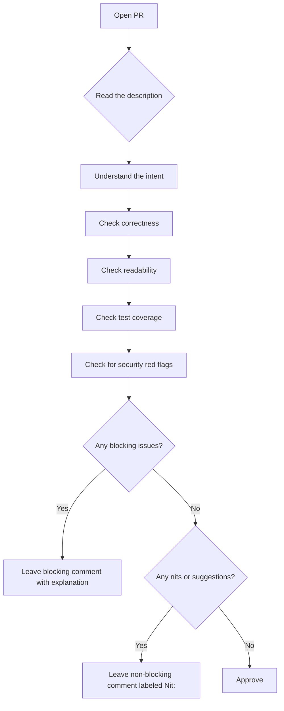
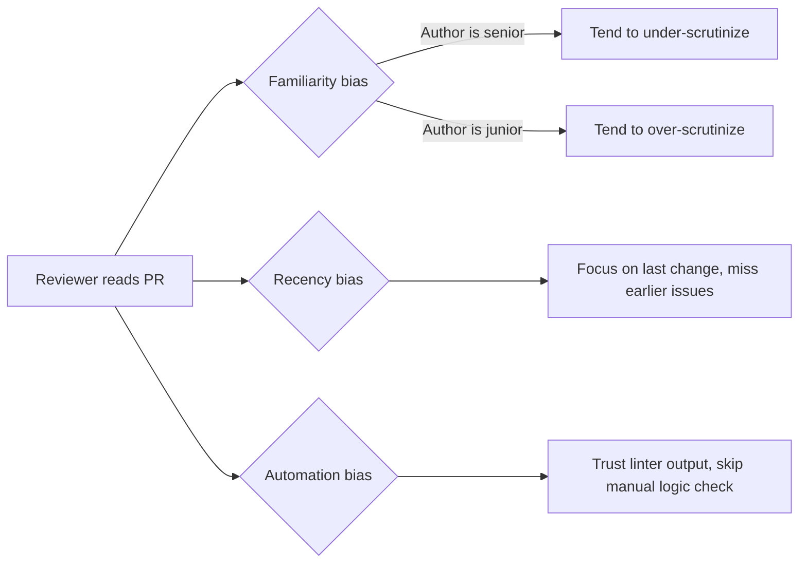
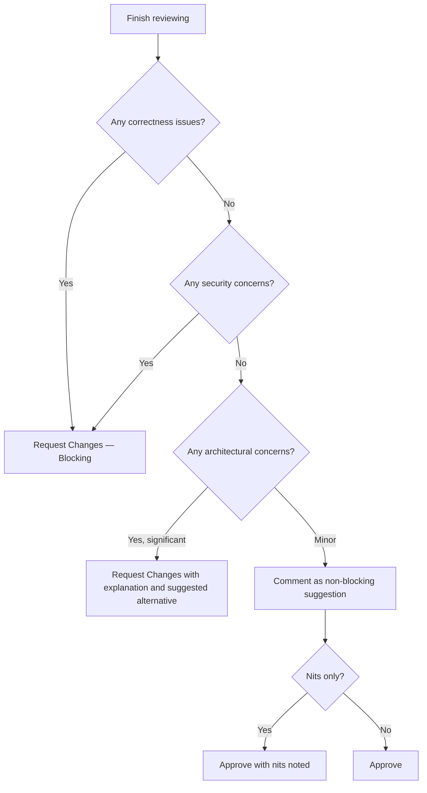
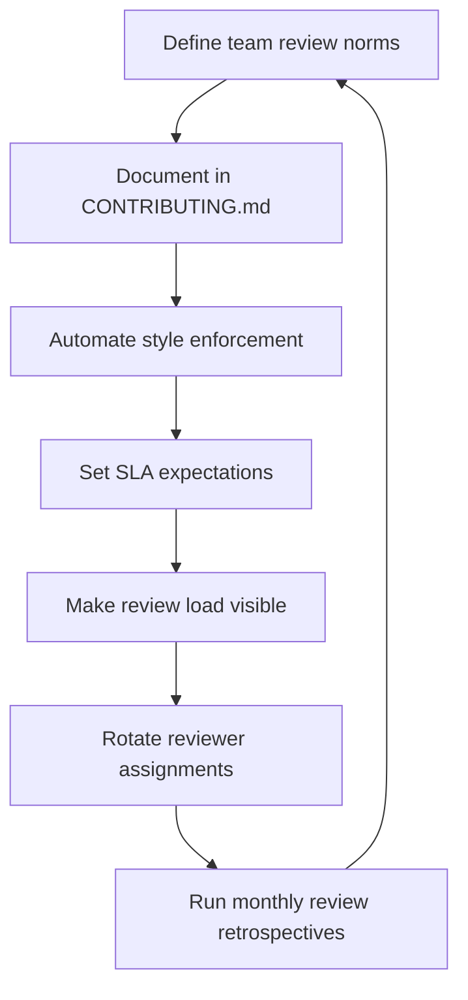
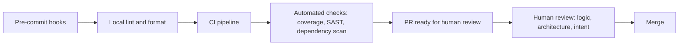
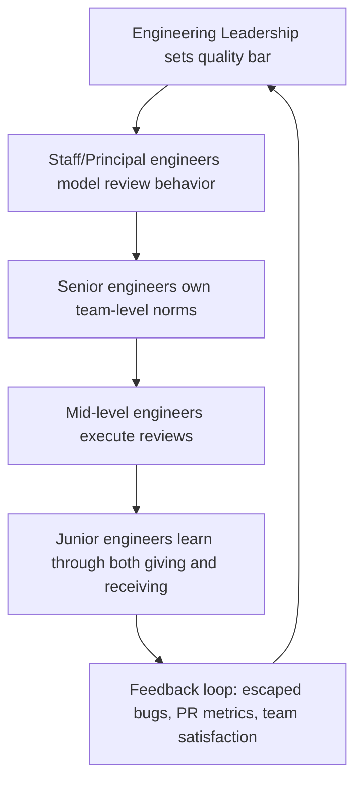
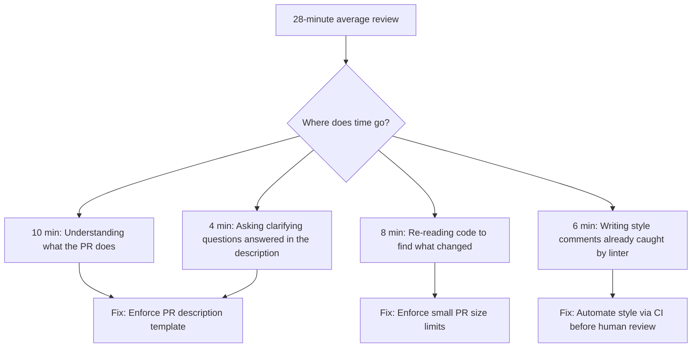

# Code Review Roadmap — Universal Template

> Guides content generation for **Code Review** topics.
> This is a SOFT SKILL — no programming code, use ```text for examples.

## Universal Requirements

- 8 files per topic: junior.md, middle.md, senior.md, professional.md, interview.md, tasks.md, find-bug.md, optimize.md
- Keep `{{TOPIC_NAME}}` placeholder throughout
- Include Mermaid diagrams (process flows, decision trees, org charts)
- professional.md = Mastery/Leadership level (NOT compiler internals)
- Code fences: ` ```text ` for example artifacts/templates; ` ```mermaid ` for diagrams

---

## Overview

| | Description |
|---|---|
| **Purpose** | Universal template for all Code Review roadmap topics |
| **Files per topic** | 8 files: `junior.md`, `middle.md`, `senior.md`, `professional.md`, `interview.md`, `tasks.md`, `find-bug.md`, `optimize.md` |
| **Language** | All content must be generated in **English** |
| **Table of Contents** | Optional — include only if relevant to the topic |

### Topic Structure

```
XX-topic-name/
├── junior.md          ← "What?" and "How?" — review basics, giving feedback
├── middle.md          ← "Why?" and "When?" — psychology, bias, automation
├── senior.md          ← "How to scale?" — culture, SLAs, tooling strategy
├── professional.md    ← Mastery/Leadership — org-wide programs, ROI
├── interview.md       ← Interview prep across all levels
├── tasks.md           ← Hands-on practice tasks
├── find-bug.md        ← Find process anti-patterns (10+ exercises)
└── optimize.md        ← Optimize slow/inefficient review process (10+ exercises)
```

---

## Level Comparison Matrix

| Aspect | Junior | Middle | Senior | Professional |
|:------:|:------:|:------:|:------:|:------------:|
| **Depth** | Review basics, comment quality | Psychology, bias, automation | Culture, SLAs, bottlenecks | Org-wide programs, research-backed ROI |
| **Artifacts** | Checklists, comment templates | Review guidelines, rubrics | SLA dashboards, tooling configs | Quality scorecards, executive reports |
| **Tricky Points** | Too harsh vs. too soft | Approval vs. change-request thresholds | Scaling review without slowing velocity | Measuring review effectiveness org-wide |
| **Focus** | "What?" and "How?" | "Why?" and "When?" | "How to improve the system?" | "What does mastery look like at scale?" |

---

# TEMPLATE 1 — `junior.md`

<details open>
<summary><strong>Template Content</strong></summary>

# {{TOPIC_NAME}} — Junior Level

## Table of Contents

1. [Introduction](#introduction)
2. [Prerequisites](#prerequisites)
3. [Glossary](#glossary)
4. [Core Concepts](#core-concepts)
5. [Pros and Cons](#pros-and-cons)
6. [Use Cases](#use-cases)
7. [Example Artifacts / Templates](#example-artifacts--templates)
8. [Common Failure Modes and Recovery](#common-failure-modes-and-recovery)
9. [Effectiveness and Efficiency Tips](#effectiveness-and-efficiency-tips)
10. [Summary](#summary)

---

## Introduction

<!-- Explain what {{TOPIC_NAME}} is from the perspective of a developer new to reviewing or being reviewed. Cover why code review exists, what problem it solves, and why it matters to daily work. -->

**What it is:** A structured process where one or more engineers examine another engineer's proposed changes before they are merged into a shared codebase.

**Why it matters at the junior level:**
- You will both give and receive reviews within your first weeks on a team.
- Constructive review comments accelerate your learning more than any tutorial.
- Poor review habits (too harsh, too vague) damage team trust quickly.

---

## Prerequisites

- Understanding of version control basics (branches, pull requests / merge requests)
- Familiarity with the team's programming language at a reading level
- Access to the team's contribution guidelines or style guide

---

## Glossary

| Term | Definition |
|------|-----------|
| **Pull Request (PR)** | A request to merge a branch's changes into the main branch, used as the review unit |
| **Merge Request (MR)** | GitLab terminology equivalent to a Pull Request |
| **Reviewer** | The engineer examining the proposed changes |
| **Author** | The engineer who wrote the changes under review |
| **LGTM** | "Looks Good To Me" — informal approval signal |
| **Nit** | A minor, non-blocking style or preference comment |
| **Blocking comment** | A comment that must be resolved before the PR can be merged |
| **Non-blocking comment** | A suggestion or observation that the author may act on at their discretion |
| **Review checklist** | A structured list of criteria to check during every review |

---

## Core Concepts

### What Makes a Good Review Comment

A good review comment is:
- **Specific** — points to exact lines, not vague sections
- **Actionable** — tells the author what to do, not just what is wrong
- **Respectful** — critiques the code, not the person
- **Educational** — explains the "why" behind the suggestion

### The Review Checklist Mindset

Junior reviewers often do not know where to start. A checklist removes that uncertainty.



### Giving vs. Receiving Feedback

**Giving feedback:**
- Use "I" or "We" language: "I found this hard to follow" rather than "This is confusing."
- Label your comments: `Blocking:`, `Nit:`, `Question:`, `Suggestion:`
- Acknowledge good work — positive comments are valid review comments.

**Receiving feedback:**
- Assume good intent unless proven otherwise.
- Ask clarifying questions before pushing back.
- "Thanks for the catch" is a complete and professional response to a nit.

---

## Pros and Cons

| Pros | Cons |
|------|------|
| Catches bugs before production | Adds latency to the merge cycle |
| Spreads knowledge across the team | Can become a bottleneck if reviewers are slow |
| Enforces consistent style and standards | Risk of review fatigue with large PRs |
| Builds shared ownership of the codebase | Can feel personal if comments are poorly worded |

---

## Use Cases

- A junior engineer submits their first feature PR and receives line-level feedback on naming conventions.
- A teammate reviews your bug fix and asks a clarifying question about edge case handling.
- You review a small configuration change and notice a missing environment variable.

---

## Example Artifacts / Templates

### Basic Review Comment Template

```text
[Label] Short description of the issue.

Why: <Explain the reasoning or risk.>
Suggestion: <Describe what the author could do instead.>
Example (optional): <Show a concrete alternative if helpful.>
```

### Junior Review Checklist

```text
Code Review Checklist — Junior Level

Correctness
[ ] Does the code do what the PR description says?
[ ] Are edge cases (null, empty, large input) handled?
[ ] Does it break any existing tests?

Readability
[ ] Are variable and function names clear?
[ ] Is the logic easy to follow without running it?
[ ] Are comments present where the logic is non-obvious?

Tests
[ ] Are there new tests for the new behavior?
[ ] Do existing tests still pass?

Style
[ ] Does the code follow the team's style guide?
[ ] Are there any obvious formatting issues?
```

---

## Common Failure Modes and Recovery

| Failure Mode | Why It Happens | Recovery |
|---|---|---|
| Leaving vague comments ("this is wrong") | Reviewer does not know how to articulate the issue | Ask yourself: "What specifically is wrong, and what should it be instead?" Rewrite before posting. |
| Approving without reading | Time pressure or trust bias | Block 15 focused minutes per PR; use a checklist to stay on track. |
| Only commenting on style, missing logic bugs | Style is easier to spot than logic | Walk through the code path mentally before checking style. |
| Getting defensive about received feedback | Personal investment in the code | Separate your identity from your code; feedback is about the diff, not you. |
| Over-reviewing a small change | Perfectionism | Ask: "Is this blocking correctness, safety, or maintainability?" If no, make it a nit. |

---

## Effectiveness and Efficiency Tips

- **Time-box your review.** Set a 20-minute timer. If you are not done, take a break and return rather than rushing.
- **Read the PR description first.** Understanding intent prevents misreading code behavior as a bug.
- **Review the diff, not the entire file.** Focus on what changed.
- **Batch your comments.** Post all comments at once rather than one at a time to reduce notification noise.
- **Follow up.** After the author makes changes, re-read only the updated sections.

---

## Summary

At the junior level, code review is about building the habit of structured, respectful feedback. Master the checklist, label your comments, and keep your focus on correctness and readability before style. Both giving and receiving feedback are learnable skills that compound over time.

</details>

---

# TEMPLATE 2 — `middle.md`

<details open>
<summary><strong>Template Content</strong></summary>

# {{TOPIC_NAME}} — Middle Level

## Table of Contents

1. [Introduction](#introduction)
2. [Review Psychology and Cognitive Bias](#review-psychology-and-cognitive-bias)
3. [When to Approve vs. Request Changes](#when-to-approve-vs-request-changes)
4. [Automation and Tooling](#automation-and-tooling)
5. [Giving Expert Feedback](#giving-expert-feedback)
6. [Example Artifacts / Templates](#example-artifacts--templates)
7. [Common Failure Modes and Recovery](#common-failure-modes-and-recovery)
8. [Comparison with Alternative Approaches / Methodologies](#comparison-with-alternative-approaches--methodologies)
9. [Effectiveness and Efficiency Tips](#effectiveness-and-efficiency Tips)
10. [Summary](#summary)

---

## Introduction

At the middle level you are expected to review with judgment, not just with a checklist. You understand the codebase well enough to reason about architectural fit, and you have seen enough reviews to recognize patterns of dysfunction.

---

## Review Psychology and Cognitive Bias



**Key biases to watch:**

| Bias | Description | Mitigation |
|------|-------------|------------|
| **Authority bias** | Rubber-stamping a senior's PR | Use the same checklist regardless of author seniority |
| **Confirmation bias** | Seeing what you expect, missing what is actually there | Read once for intent, read again for correctness |
| **Completeness illusion** | Assuming the change is complete because tests pass | Ask "what is NOT tested here?" |
| **Bikeshedding** | Spending review time on trivial style rather than substance | Automate style with linters; reserve human review for logic |

---

## When to Approve vs. Request Changes



**Decision heuristics:**
- If merging today would cause a production incident or security vulnerability, block.
- If the concern is about the "best" way vs. a "correct" way, do not block — suggest.
- If you are the only reviewer and uncertain, explicitly say so and tag another reviewer.

---

## Automation and Tooling

Automate everything that can be checked by a machine so human review focuses on judgment.

| Category | Tools / Approaches |
|---|---|
| Style and formatting | Prettier, ESLint, gofmt, Black, Rubocop |
| Static analysis | SonarQube, CodeClimate, Semgrep |
| Test coverage gates | Codecov, Coveralls (fail PR if coverage drops) |
| Dependency scanning | Dependabot, Snyk |
| PR size enforcement | Danger.js rules, GitHub Actions checks |
| Required reviewers | CODEOWNERS file |

**Middle-level insight:** Automation should eliminate the need to comment on style. If you find yourself writing style comments manually, that is a signal to add a new lint rule.

---

## Giving Expert Feedback

### Comment Hierarchy

```text
Priority 1 — Blocking (must fix before merge):
  Security vulnerabilities, data loss risks, correctness failures

Priority 2 — Should Fix (strong recommendation):
  Performance degradation, missing tests for critical paths,
  violates team conventions in a way that causes confusion

Priority 3 — Consider (non-blocking suggestion):
  Alternative approaches, refactoring opportunities,
  readability improvements

Priority 4 — Nit (trivial, author's discretion):
  Naming preferences, minor formatting, optional optimizations
```

---

## Example Artifacts / Templates

### Review Summary Block

```text
## Review Summary

Status: [Approved / Changes Requested / Comment Only]

Blockers (must fix):
- Line 42: The timeout is hardcoded to 0ms which will cause immediate failures in production.

Should Fix:
- Line 89: This function is called in three hot paths but has no test coverage.

Suggestions:
- Lines 110-130: Consider extracting this block into a named helper — it appears twice.

Nits:
- Line 15: Nit: variable name `d` could be `duration` for clarity.

Overall impression:
The approach is sound. Resolving the timeout issue and adding the test case should unblock this.
```

---

## Common Failure Modes and Recovery

| Failure Mode | Impact | Recovery |
|---|---|---|
| Review rounds exceeding 3 back-and-forth cycles | Velocity loss, author frustration | Schedule a 15-min sync instead of continuing async; resolve verbally |
| All reviews going to the same 1-2 people | Bottleneck, knowledge silo | Use CODEOWNERS rotation; make review load visible on dashboards |
| Reviewers approving to be nice rather than honest | Quality escape | Establish team norm: "Approve means I'd be comfortable being on-call for this" |
| Large PRs (500+ lines) getting cursory reviews | Bugs escape | Enforce PR size limits via CI; coach authors to split work |

---

## Comparison with Alternative Approaches / Methodologies

| Approach | Strengths | Weaknesses | When to Use |
|---|---|---|---|
| **Async PR review** | Flexible, documented, scales | Slow, context lost in text | Default for most changes |
| **Pair programming** | Real-time, no review lag | Resource intensive, not scalable | Complex or high-risk changes |
| **Mob review (group)** | Broad consensus, fast knowledge spread | Time-expensive for all participants | Architectural decisions, onboarding |
| **Automated-only (no human review)** | Fast, consistent | Misses logic, architecture, intent | Only for trivial infrastructure changes |

---

## Effectiveness and Efficiency Tips

- Review PRs at the start of the day before context-switching costs accumulate.
- Break large reviews into passes: first pass for intent/architecture, second pass for correctness, third for style.
- Use saved reply templates for your top 5 most common comments to reduce writing time.
- Track your own review turnaround time — aim for under 4 business hours for PRs under 200 lines.

---

## Summary

At the middle level, code review is an exercise in judgment. You apply psychological awareness to give fair reviews regardless of author seniority, you use automation to free human attention for logic and architecture, and you make deliberate approve/block decisions based on production risk rather than preference.

</details>

---

# TEMPLATE 3 — `senior.md`

<details open>
<summary><strong>Template Content</strong></summary>

# {{TOPIC_NAME}} — Senior Level

## Table of Contents

1. [Introduction](#introduction)
2. [Building a Review Culture](#building-a-review-culture)
3. [SLAs and Metrics](#slas-and-metrics)
4. [Tooling Strategy](#tooling-strategy)
5. [Reducing Review Bottlenecks](#reducing-review-bottlenecks)
6. [Mentoring Through Reviews](#mentoring-through-reviews)
7. [Example Artifacts / Templates](#example-artifacts--templates)
8. [Diagnosing Team / Process Problems](#diagnosing-team--process-problems)
9. [Effectiveness and Efficiency Tips](#effectiveness-and-efficiency-tips)
10. [Summary](#summary)

---

## Introduction

Senior engineers own the review process, not just individual reviews. You are responsible for the health of the review culture on your team — the norms, the tooling, the SLAs, and the ability of the team to scale review capacity as the team grows.

---

## Building a Review Culture

A healthy review culture has three properties:
1. **Safety** — Authors feel safe to submit imperfect work without fear of public shaming.
2. **Consistency** — Review standards are documented and applied uniformly.
3. **Speed** — Reviews do not become the primary bottleneck in the delivery pipeline.



### Writing a Review Culture Document

Key sections to include:
- What "Approved" means on this team
- Blocking vs. non-blocking comment conventions
- PR size expectations
- Review turnaround SLA
- How to handle disagreements that cannot be resolved in comments

---

## SLAs and Metrics

| Metric | Target (example) | Why It Matters |
|---|---|---|
| **Review turnaround time** | < 4 business hours for PRs under 200 lines | Reduces author context-switching |
| **Review cycle count** | Median < 2 rounds | High cycle count indicates unclear requirements or poor PR descriptions |
| **PR size (lines changed)** | 80th percentile < 400 lines | Large PRs correlate with escaped bugs |
| **Escaped defect rate** | Trend down quarter-over-quarter | Primary quality signal |
| **Reviewer distribution** | No single reviewer > 40% of team reviews | Bottleneck and bus-factor indicator |

---

## Tooling Strategy



**Senior-level tooling decisions:**

- Choose CODEOWNERS structure that reflects actual ownership, not historical accident.
- Integrate review metrics into your team dashboard (GitHub Insights, LinearB, Swarmia).
- Configure required reviewers by file path to prevent accidental merges of sensitive code.
- Use draft PRs to enable early feedback without blocking CI resources.

---

## Reducing Review Bottlenecks

**Common bottleneck patterns and fixes:**

| Bottleneck | Diagnosis Signal | Fix |
|---|---|---|
| One senior reviewer is on every PR | Reviewer concentration > 60% in metrics | Establish reviewer rotation; document who can approve what |
| PRs sit unreviewed over 24 hours | Review turnaround SLA breached regularly | Add Slack reminder bot for stale PRs; make it a standup agenda item |
| Reviewers block on style issues | High nit-to-blocking ratio in PR comments | Add more lint rules; update the style guide |
| Authors split PRs so small they lose context | PRs are < 20 lines but frequent | Clarify what constitutes a meaningful, self-contained change |
| Review load spikes at sprint end | PR creation graph spikes on Thursdays/Fridays | Coach the team on continuous integration habits |

---

## Mentoring Through Reviews

Reviews are the most leverage mentorship tool a senior engineer has.

**Mentoring comment patterns:**

```text
Teaching comment (explain the why):
"This approach works, but consider X because in our system Y happens
when Z, which would cause W. Here's a doc that explains it: [link]."

Growth prompt (ask rather than tell):
"What would happen to this function if the input list is empty?
Can you add a test for that case?"

Positive reinforcement (specific):
"Nice use of the strategy pattern here — this will make adding
new payment providers much simpler. Good instinct."
```

---

## Example Artifacts / Templates

### Team Review Norms Document Skeleton

```text
# Team Code Review Norms

## What "Approved" Means
Approving a PR means: I have read this change, I believe it is
correct, safe, and maintainable, and I am comfortable being
on-call for it.

## Comment Labels
- Blocking: Must be resolved before merge
- Suggestion: Strong recommendation, author decides
- Nit: Trivial preference, author may ignore
- Question: I don't understand this — please clarify

## PR Size Expectations
- Target: under 400 lines changed per PR
- Over 600 lines: split unless truly atomic

## SLA
- First review response: within 4 business hours
- Stale PR (no activity 24h): author pings in #dev-review channel

## Disagreement Resolution
1. Discuss in PR comments (max 3 rounds)
2. Sync call (15 min)
3. Escalate to tech lead with both positions summarized
```

---

## Diagnosing Team / Process Problems

| Symptom | Likely Cause | Investigation Steps |
|---|---|---|
| Review turnaround consistently > 1 day | Reviewer overload or unclear ownership | Pull reviewer distribution data; check CODEOWNERS |
| Bug escaped that was in a reviewed PR | Checklist gap or rubber-stamping | Do a blameless post-mortem; update checklist or add automation |
| Authors rarely address suggestions | Lack of psychological safety or unclear priority labels | Survey the team; clarify blocking vs. non-blocking norms |
| Review comments are consistently superficial | Reviewers do not understand the domain | Pair more experienced reviewers with domain owners; improve PR descriptions |

---

## Effectiveness and Efficiency Tips

- Review your team's PR metrics monthly — even a 10-minute review of the dashboard surfaces patterns.
- Run a quarterly "review retrospective" — ask what makes our reviews slow, harsh, or low-quality.
- Keep a running doc of the top 10 issues your team finds in reviews; turn each one into a lint rule or test template.
- Establish a "no-review-needed" policy for trivial changes (typo fixes, dependency bumps handled by bots) to protect reviewer attention.

---

## Summary

At the senior level, code review is a system you design and maintain, not a task you perform. You set the cultural norms, establish the SLAs, choose the tooling, and remove the bottlenecks that prevent your team from shipping high-quality code quickly. The output is a team that reviews well without your direct involvement.

</details>

---

# TEMPLATE 4 — `professional.md`

<details open>
<summary><strong>Template Content</strong></summary>

# {{TOPIC_NAME}} — Mastery and Leadership Level

## Table of Contents

1. [Leadership Philosophy](#leadership-philosophy)
2. [Organizational Dynamics](#organizational-dynamics)
3. [Influence Without Authority](#influence-without-authority)
4. [Building Systems, Not Just Skills](#building-systems-not-just-skills)
5. [Measuring Mastery](#measuring-mastery)
6. [Psychological and Cognitive Frameworks](#psychological-and-cognitive-frameworks)
7. [Case Studies](#case-studies)
8. [Tricky Leadership Questions](#tricky-leadership-questions)
9. [Summary — What Mastery Looks Like Day-to-Day](#summary--what-mastery-looks-like-day-to-day)

---

## Leadership Philosophy

At mastery level, code review is a lever for organizational quality, not a gate on individual PRs. The professional's question is not "Is this PR good?" but "Does our review system produce high-quality software at the pace the business needs?"

**Core beliefs of a mastery-level practitioner:**
- Review culture is part of engineering culture — you cannot fix one without the other.
- The best review process is one that engineers trust, respect, and would not want removed.
- Automation is a force multiplier; human reviewers are finite and precious — protect their attention.
- The purpose of review feedback is to grow the author, not demonstrate the reviewer's expertise.

---

## Organizational Dynamics



**Cross-organizational dynamics to navigate:**

| Dynamic | Challenge | Leadership Response |
|---|---|---|
| Teams with different review maturity | Inconsistent quality across org | Create a review excellence community of practice |
| Acquisitions or team mergers | Culture clash on review norms | Facilitate norm alignment sessions; document shared baseline |
| High-growth hiring | New engineers dilute review culture | Onboarding includes review training; buddy system for first 5 PRs |
| Remote / async teams across time zones | Review turnaround degraded | Follow-the-sun reviewer rotation; async-first review tooling |

---

## Influence Without Authority

Most mastery-level practitioners do not have authority over all teams they influence. Influence comes through:

- **Publishing internal research** — tracking escaped defects correlated with review metrics and sharing findings.
- **Running workshops** — "Better Code Review" lunch-and-learn sessions that spread norms without mandates.
- **Creating tools others adopt** — a review checklist template that teams voluntarily adopt because it works.
- **Modeling behavior publicly** — your own PRs and review comments are visible; they set the standard others copy.
- **Partnering with EMs** — engineering managers control team practices; influence them with data and pilot results.

---

## Building Systems, Not Just Skills

| System | Description | Artifact |
|---|---|---|
| **Review playbook** | Organization-wide guide to what good review looks like at each level | `REVIEW_PLAYBOOK.md` in eng-standards repo |
| **Review guild / community of practice** | Monthly cross-team meeting of review champions | Meeting notes, shared backlog of improvements |
| **Review rubric** | Standardized scoring of review comment quality for calibration | Rubric doc with examples at each quality level |
| **Onboarding review module** | Structured first-30-days review experience for new engineers | Checklist + assigned review buddy + sample PRs to practice on |
| **Escalation protocol** | Documented path from PR disagreement to resolution without damaging relationships | Flowchart embedded in CONTRIBUTING.md |

---

## Measuring Mastery

| Metric | Measurement Method | Target |
|---|---|---|
| **PR review turnaround time (p50, p90)** | GitHub/GitLab analytics or LinearB | p50 < 4h, p90 < 24h |
| **Review cycle count (median rounds per PR)** | PR analytics | < 2 rounds |
| **Escaped defect rate** | Post-release incident tagging | Quarter-over-quarter decline |
| **Developer satisfaction with review process** | Quarterly eng survey, NPS-style question | > 7/10 average |
| **Reviewer distribution Gini coefficient** | Review count per reviewer / total reviews | < 0.4 (lower = more distributed) |
| **Automation coverage** | % of style/lint issues caught before human review | > 95% |

---

## Psychological and Cognitive Frameworks

**Radical Candor applied to code review:**
The Kim Scott framework maps directly: good review is caring personally (you want the author to grow) while challenging directly (you say what is wrong clearly). Ruinous empathy (approving bad code to avoid conflict) and obnoxious aggression (harsh personal comments) are the failure modes to eliminate.

**Psychological safety (Amy Edmondson):**
Teams with high psychological safety have shorter review cycles because authors submit work earlier and more honestly. The professional's job is to make review safe by modeling vulnerability — submitting your own imperfect draft PRs for early review.

**Cognitive load theory:**
Reviewers have finite working memory. PRs over 400 lines push reviewers past their cognitive load limit, causing review quality to degrade. The professional designs PR size norms around cognitive load research, not arbitrary line counts.

---

## Case Studies

**Google — Readability program:**
Google's language readability program requires engineers to earn readability certification before approving PRs in that language. This decouples "can merge" from "is senior" and creates a scalable, expertise-based review authority system. Key lesson: review authority can be formalized and earned, not just assumed by seniority.

**Stripe — Small PR culture:**
Stripe enforces a strong norm of small, focused PRs through both cultural pressure and tooling. Their internal data showed that PRs over 400 lines had a 3x higher escaped defect rate than PRs under 200 lines. Key lesson: make the data visible and teams will self-regulate PR size.

**Netflix — Trust and autonomy:**
Netflix's "freedom and responsibility" culture extends to code review — teams own their own quality bar. There is no org-wide mandatory review process. Instead, quality is enforced through post-release accountability and blameless post-mortems. Key lesson: review culture can be embedded in accountability systems rather than gatekeeping systems.

---

## Tricky Leadership Questions

**Q: A team consistently has fast reviews but a high escaped defect rate. What do you do?**
Speed and quality are trading off. Investigate whether reviews are substantive (look at comment density and type) vs. rubber-stamping. Run a retrospective on the last 3 escaped defects and trace back to the review.

**Q: Two senior engineers have irreconcilable opinions on review standards. How do you resolve this?**
Do not arbitrate on opinion alone. Bring data: which standard correlates with fewer escaped defects? If no data exists, run a 90-day pilot with one standard and measure outcomes before committing.

**Q: Your team's review process is good but a newly acquired team has no review culture. How do you bring them up without alienating them?**
Start with curiosity, not prescription. Understand why they operate the way they do. Find one shared pain point (e.g., a recent escaped bug) and propose a targeted improvement. Do not import your entire playbook on day one.

**Q: A high-performing engineer refuses to follow review norms and dismisses comments. How do you handle this?**
Address the behavior in a 1:1 with the engineering manager. Frame it as a team health issue, not a rules issue: "When senior engineers dismiss review feedback, it signals to junior engineers that review does not matter." Connect to business outcomes.

---

## Summary — What Mastery Looks Like Day-to-Day

A mastery-level code review practitioner:
- Spends less time reviewing individual PRs and more time improving the review system.
- Publishes and maintains the team or org-level review playbook.
- Monitors review metrics monthly and acts on degradation signals.
- Coaches senior and mid-level engineers on review culture, not just review mechanics.
- Connects review quality to business outcomes in executive conversations.
- Is known in the organization as the person who makes code review better for everyone.

</details>

---

# TEMPLATE 5 — `interview.md`

<details open>
<summary><strong>Template Content</strong></summary>

# {{TOPIC_NAME}} — Interview Preparation

## Junior-Level Questions

**Q: What is the purpose of code review?**
Expected answer: Catching bugs before production, spreading knowledge, enforcing standards, building shared ownership.

**Q: How do you write a good review comment?**
Expected answer: Specific, actionable, respectful, focused on the code not the person, explains the "why."

**Q: What is the difference between a blocking and a non-blocking comment?**
Expected answer: Blocking = must be resolved before merge (correctness, security). Non-blocking = suggestion or preference the author may or may not act on.

**Q: How do you handle receiving negative feedback on your PR?**
Expected answer: Assume good intent, ask clarifying questions, separate identity from code, thank the reviewer for useful catches.

---

## Middle-Level Questions

**Q: How do you decide whether to approve a PR or request changes?**
Expected answer: Approve if no correctness or security issues; request changes for blocking issues; leave non-blocking suggestions without blocking merge.

**Q: What cognitive biases affect code review, and how do you mitigate them?**
Expected answer: Authority bias (rubber-stamping senior PRs), bikeshedding, confirmation bias. Mitigated by consistent checklists, automation for style, structured review passes.

**Q: How do you handle a PR that is too large to review effectively?**
Expected answer: Ask the author to split it; explain the cognitive load issue; offer to pair to identify natural split points.

**Q: How do you measure whether your team's review process is healthy?**
Expected answer: Review turnaround time, cycle count, escaped defect rate, reviewer distribution, developer satisfaction scores.

---

## Senior-Level Questions

**Q: How would you build a code review culture on a new team?**
Expected answer: Start with a team norm document, set SLAs, automate style, make review load visible, run monthly retrospectives.

**Q: A senior engineer's PRs are getting rubber-stamped. How do you fix this?**
Expected answer: Make it a team norm that all PRs get the same scrutiny; use a checklist; discuss in retrospective without blaming individuals.

**Q: How do you reduce review bottlenecks without lowering quality?**
Expected answer: Distribute reviewer load via CODEOWNERS rotation; automate style; set PR size limits; establish draft PR culture for early feedback.

---

## Professional-Level Questions

**Q: How do you measure the ROI of code review?**
Expected answer: Correlate review metrics (turnaround, cycle count) with escaped defect rate and incident frequency; survey developer satisfaction; compare cost of review time against cost of production incidents.

**Q: Describe a time you changed code review culture across multiple teams.**
Expected answer (signals to listen for): Used data not mandates; built consensus; started with a pilot; measured outcomes; iterated.

**Q: How does psychological safety relate to code review effectiveness?**
Expected answer: High psychological safety → authors submit earlier, more honest about uncertainty → fewer surprises in review → faster cycles and better quality.

</details>

---

# TEMPLATE 6 — `tasks.md`

<details open>
<summary><strong>Template Content</strong></summary>

# {{TOPIC_NAME}} — Practice Tasks

## Junior Tasks

1. **Write 5 review comments** for a provided code diff using the label system (Blocking, Suggestion, Nit, Question). Have a peer rate each comment on specificity and actionability.
2. **Complete a review checklist** for a real or sample PR. Check off each item and note which categories surfaced issues.
3. **Rewrite 3 vague review comments** into specific, actionable ones. Example: rewrite "This is confusing" into a comment with a clear explanation and suggestion.
4. **Role-play receiving feedback.** Have a partner give you 5 review comments on a piece of your recent work. Practice responding professionally to each one.
5. **Read 10 merged PRs** in your team's repository. For each, note: Was the description clear? Were the comments actionable? Were there any missed issues?

## Middle Tasks

1. **Audit your last 10 PRs.** Calculate your average review turnaround time and cycle count. Identify patterns in what causes multiple cycles.
2. **Identify one manual style check** that your team currently does in reviews. Write a lint rule or CI check to automate it.
3. **Create a review summary template** for your team and propose it at the next team meeting.
4. **Map the review bottlenecks** on your team: who reviews the most? What is the maximum turnaround time over the last month?
5. **Run a "review the reviewer" exercise** — ask a teammate to review one of your review comments and give you feedback on its quality.

## Senior Tasks

1. **Write a team review norms document** covering: what "Approved" means, comment labels, PR size expectations, SLA, and disagreement resolution.
2. **Build a review metrics dashboard** showing: turnaround time, cycle count, reviewer distribution, and PR size distribution.
3. **Run a review retrospective** with your team. Use 3 questions: What makes our reviews slow? What makes them harsh? What makes them low-quality?
4. **Design a new-engineer review onboarding plan** for the first 30 days, including review buddy assignment and sample PRs to practice on.
5. **Identify one escaped defect** from the past quarter. Trace it back through the review history. Write a blameless post-mortem and propose one process change.

## Professional Tasks

1. **Publish a review playbook** for your organization. Present it at an engineering all-hands.
2. **Run a cross-team review calibration session** — have engineers from 3 teams review the same PR independently, then compare and discuss their comments.
3. **Build a case for a review tooling investment** using escaped defect data, review turnaround metrics, and developer satisfaction scores. Present to engineering leadership.
4. **Design a review maturity model** with 4 levels and a self-assessment rubric. Pilot it with 2 teams and iterate.
5. **Write an internal research note** on the relationship between your team's review metrics and your escaped defect rate over the past 6 months.

</details>

---

# TEMPLATE 7 — `find-bug.md`

<details open>
<summary><strong>Template Content</strong></summary>

# {{TOPIC_NAME}} — Find the Process Anti-Pattern

> Each exercise presents a real-world review artifact with a process anti-pattern embedded in it.
> Identify the anti-pattern, explain why it is harmful, and write a corrected version.

---

## Exercise 1 — The Vague Non-Actionable Comment

```text
ORIGINAL REVIEW COMMENT:
Line 47: This is wrong.
```

**Task:** What is the anti-pattern? What harm does it cause? Rewrite it as a good review comment.

**Anti-pattern:** Vague non-actionable feedback. The author cannot act on "this is wrong" without guessing what is wrong and what to do instead.

**Corrected version:**

```text
Line 47 [Blocking]: The timeout value of 0 will cause every request to fail immediately
in production environments where the external service takes 200-500ms to respond.

Suggestion: Set this to at least 2000ms (2 seconds) to match our SLA for this dependency.
Reference: See ADR-0012 for our standard timeout configuration.
```

---

## Exercise 2 — Personal Attack Disguised as Review

```text
ORIGINAL REVIEW COMMENT:
This whole function is a mess. Did you even test this?
You always write code like this.
```

**Task:** Identify all the anti-patterns in this comment. Rewrite it as constructive feedback.

**Anti-patterns:**
- Personal attack ("you always") — targets the person, not the code
- Vague global judgment ("a mess") — not actionable
- Sarcastic rhetorical question ("did you even test this?") — condescending, damages trust

**Corrected version:**

```text
[Suggestion] This function is doing several things at once — it fetches data,
transforms it, and writes to the database. This makes it hard to test and debug
in isolation.

Consider splitting it into three smaller functions. I can pair with you for
15 minutes if it would help to talk through the split.

[Question] I didn't see a test for the case where the database write fails after
a successful fetch. Was that intentional, or would it be worth adding?
```

---

## Exercise 3 — Review That Misses a Critical Security Issue

```text
PR: Add user profile update endpoint
Review comment: Looks good! Nice clean code. Approved.

(The PR contained an endpoint that updated user profile data
without checking that the authenticated user was updating
their own profile — allowing any authenticated user to
overwrite any other user's profile data.)
```

**Task:** What review process failure allowed this to happen? What should the reviewer have checked?

**Anti-pattern:** Approval without security-focused review pass. The reviewer evaluated style and readability but did not walk through the authorization logic.

**Corrected process:**

```text
Authorization review checklist (to add to team review norms):

For any endpoint that reads or writes user data:
[ ] Does the endpoint verify the caller has permission to access THIS specific resource?
    (Not just "is the user authenticated?" but "is this user allowed to touch this record?")
[ ] Are there tests that verify a user CANNOT access another user's data?
[ ] Does the PR description explicitly state the authorization model?

Corrected comment:
[Blocking] I don't see authorization checking that the authenticated user
is the owner of the profile being updated. A user with any valid session
could update any other user's profile by changing the user_id parameter.

Can you add an ownership check and a test that verifies this endpoint
returns 403 when user A attempts to update user B's profile?
```

---

## Exercises 4–10

*(Generate 7 additional exercises following the same format. Each exercise should present a realistic review artifact, name the anti-pattern, explain the harm, and provide a corrected version. Suggested scenarios:)*

4. Reviewer leaves 40 comments on a trivial 5-line PR (scope mismatch)
5. PR approved immediately without reading because the author is the tech lead (authority bias)
6. Review comment requests a full architectural refactor for a hotfix PR (wrong forum)
7. Reviewer and author have 8 back-and-forth comment rounds on a naming preference (bikeshedding escalation)
8. PR sits unreviewed for 5 business days with no comment (SLA failure)
9. Reviewer approves PR with "LGTM" during a sprint crunch despite unresolved blocking comment (pressure-driven rubber stamp)
10. New engineer's first PR receives 30 nitpick comments and no positive feedback (demotivating onboarding)

</details>

---

# TEMPLATE 8 — `optimize.md`

<details open>
<summary><strong>Template Content</strong></summary>

# {{TOPIC_NAME}} — Optimize the Process

> **Scenario:** Your PR review template takes 30 minutes per review. Redesign it to be actionable in 5 minutes without sacrificing quality.

---

## The Problem

```text
CURRENT STATE:
- Average PR review time: 28 minutes
- Average review cycle count: 3.2 rounds
- Reviewer satisfaction score: 5.2/10 ("reviews feel exhausting")
- Escaped defect rate: 4.1% of shipped PRs cause a follow-up bug fix within 7 days
- PR description quality: inconsistent — some have no description, some are too long
```

---

## Diagnosing the Inefficiency



**Root causes identified:**
1. No PR description template — reviewers spend the first 10 minutes reconstructing intent.
2. No PR size limit — large PRs take disproportionate review time.
3. Style comments are done manually — should be automated.
4. No structured checklist — reviewers re-derive their review approach each time.

---

## Optimization 1 — Enforce a PR Description Template

**Before (no template):**

```text
Fix stuff
```

**After (template enforced via PR template file):**

```text
## What does this PR do?
<1-3 sentence summary of the change and its purpose>

## Why is this change needed?
<Link to ticket, user story, or bug report>

## How was it tested?
<Describe how you verified this works>

## Checklist
[ ] Tests added or updated
[ ] No hardcoded secrets
[ ] Dependent PRs linked (if any)
[ ] Breaking changes documented (if any)
```

**Impact:** Estimated 8–10 minutes saved per review by eliminating "what does this do?" discovery.

---

## Optimization 2 — Enforce PR Size Limits

**Metric before:** 80th percentile PR size = 680 lines changed
**Target:** 80th percentile PR size < 400 lines changed

**Process change:**
- Add CI check that warns (not fails) when a PR exceeds 400 lines.
- Update team norms: "If your PR exceeds 400 lines, include a note in the description explaining why it cannot be split, or split it."
- Coach authors to use draft PRs for early feedback on large changes before full implementation.

**Impact:** PRs at or below 400 lines average 12 minutes to review vs. 36 minutes for PRs over 600 lines (based on team data).

---

## Optimization 3 — Automate Style Checks

**Before:** Reviewers leave an average of 6 style comments per PR.
**After:** CI fails on style violations before the PR reaches human review.

**Process change:**

```text
CI Pipeline Gate (runs before PR is reviewable):
1. Formatter check (auto-fix or fail)
2. Linter check (fail on errors, warn on opinions)
3. Import order check
4. Naming convention check (where enforceable)

Only PRs that pass all automated checks appear in the review queue.
```

**Impact:** 6 fewer manual comments per PR, estimated 5–6 minutes saved.

---

## Optimization 4 — Replace Free-Form Review with Structured 5-Minute Checklist

**Before:** Reviewer starts at the top of the diff and works down with no structure (28 minutes average).

**After — 5-Minute Review Protocol:**

```text
PASS 1 — Intent (60 seconds)
Read the PR description. Do I understand what this does and why?
If no: Comment "Please add a description before I review" and stop.

PASS 2 — Correctness (90 seconds)
Walk the critical path: does the main logic do what the description says?
Check: edge cases, error handling, obvious logic errors.

PASS 3 — Security (60 seconds)
Check: authentication, authorization, input validation, secret handling.

PASS 4 — Tests (60 seconds)
Check: are new behaviors tested? Do existing tests still pass?

PASS 5 — Wrap-up (30 seconds)
Any nits? Post them labeled "Nit:" as a batch at the end.
Decide: Approve, Request Changes, or Comment Only.
```

---

## Before vs. After Metrics

| Metric | Before | After (Target) |
|---|---|---|
| Average review time | 28 minutes | 8–12 minutes |
| Review cycle count (median) | 3.2 rounds | < 2 rounds |
| Escaped defect rate | 4.1% | < 2.5% |
| Reviewer satisfaction NPS | 5.2/10 | > 7.5/10 |
| Style comments per PR (manual) | 6 | < 1 |
| PR description quality (% with complete description) | 40% | > 90% |

---

## Exercises

1. Apply the 5-minute review protocol to 5 real PRs. Record your time per pass. Where do you exceed the time budget?
2. Count the style comments in your team's last 20 PRs. Calculate how many reviewer-hours are spent on automatable issues per week.
3. Audit your team's last 10 large PRs (over 500 lines). How many were splittable? Write a proposal for PR size enforcement.
4. Survey 5 teammates: what is the most frustrating part of the review process? Map their answers to the optimization categories above.
5. Measure your review cycle count for the next month before and after implementing the PR description template. Document the delta.

</details>
