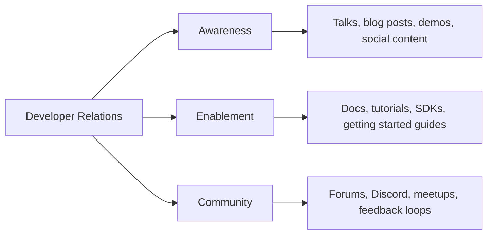
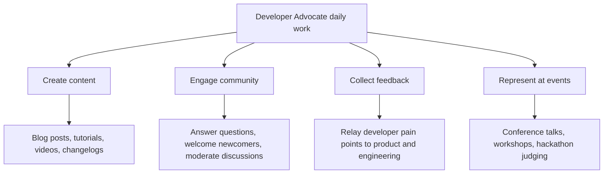
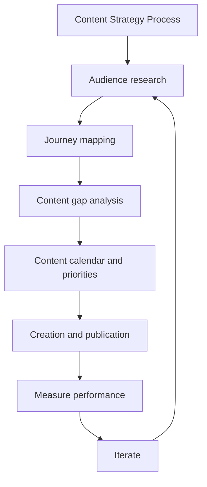
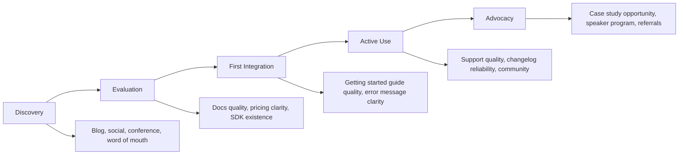
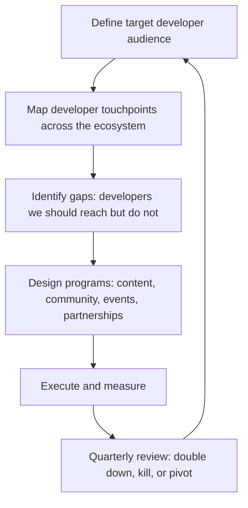
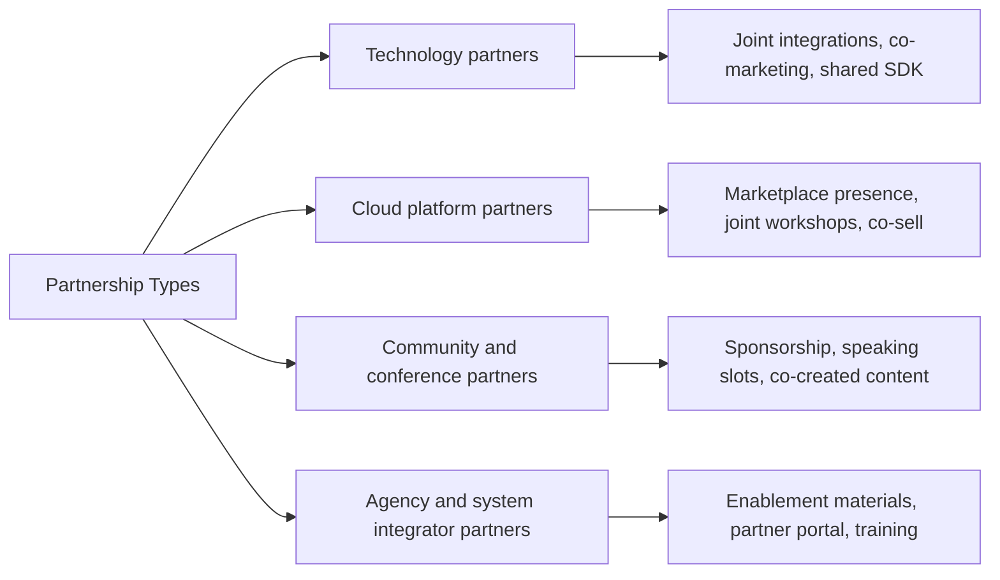
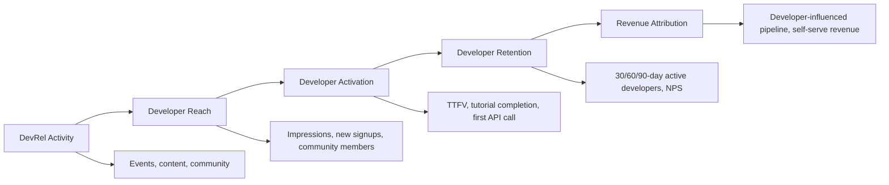
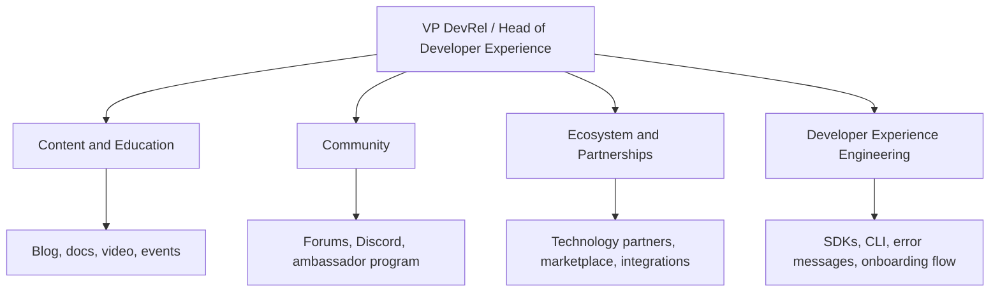
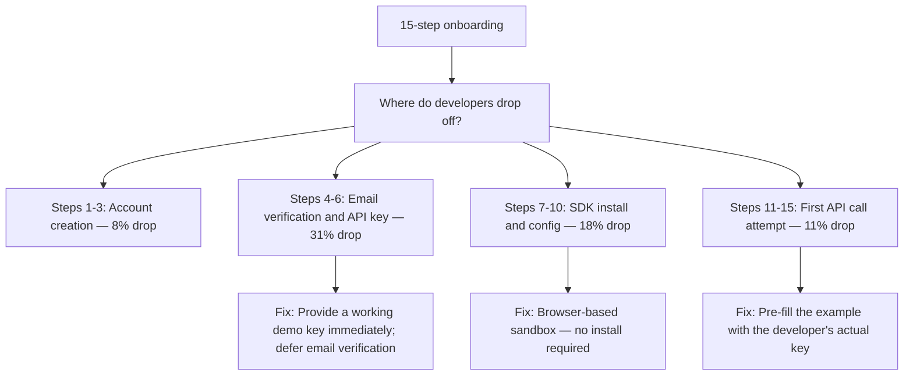

# DevRel Roadmap — Universal Template

> Guides content generation for **Developer Relations (DevRel)** topics.
> This is a SOFT SKILL — no programming code, use ```text for examples.

## Universal Requirements

- 8 files per topic: junior.md, middle.md, senior.md, professional.md, interview.md, tasks.md, find-bug.md, optimize.md
- Keep `{{TOPIC_NAME}}` placeholder throughout
- Include Mermaid diagrams (process flows, community funnels, decision trees)
- professional.md = Mastery/Leadership level (NOT compiler internals)
- Code fences: ` ```text ` for example artifacts/templates; ` ```mermaid ` for diagrams

---

## Overview

| | Description |
|---|---|
| **Purpose** | Universal template for all DevRel roadmap topics |
| **Files per topic** | 8 files: `junior.md`, `middle.md`, `senior.md`, `professional.md`, `interview.md`, `tasks.md`, `find-bug.md`, `optimize.md` |
| **Language** | All content must be generated in **English** |
| **Table of Contents** | Optional — include only if relevant to the topic |

### Topic Structure

```
XX-topic-name/
├── junior.md          ← "What is DevRel?" — content basics, community, talks
├── middle.md          ← Content strategy, developer journey, API docs, community health
├── senior.md          ← Ecosystem strategy, partnerships, ROI, team building
├── professional.md    ← Developer-first company building, platform evangelism, flywheels
├── interview.md       ← Interview prep across all levels
├── tasks.md           ← Hands-on practice tasks
├── find-bug.md        ← Find process anti-patterns (10+ exercises)
└── optimize.md        ← Optimize slow/inefficient DevRel processes (10+ exercises)
```

---

## Level Comparison Matrix

| Aspect | Junior | Middle | Senior | Professional |
|:------:|:------:|:------:|:------:|:------------:|
| **Depth** | DevRel basics, content creation, community management | Content strategy, developer journey, community health | Ecosystem strategy, team building, ROI | Developer-first culture, platform flywheels, industry influence |
| **Artifacts** | Blog posts, talk proposals, changelogs | Content calendars, community health reports, API docs | DevRel strategy docs, partnership frameworks, ROI dashboards | Evangelist playbooks, community flywheels, executive presentations |
| **Tricky Points** | Tone, accuracy, authenticity | Measuring developer satisfaction, community growth | Attribution, scaling community, demonstrating ROI | Org design, platform ecosystem dynamics |
| **Focus** | "What do I create?" | "Why and for whom?" | "How does this scale?" | "What does the ecosystem need?" |

---

# TEMPLATE 1 — `junior.md`

<details open>
<summary><strong>Template Content</strong></summary>

# {{TOPIC_NAME}} — Junior Level

## Table of Contents

1. [Introduction](#introduction)
2. [Prerequisites](#prerequisites)
3. [Glossary](#glossary)
4. [Core Concepts](#core-concepts)
5. [Pros and Cons](#pros-and-cons)
6. [Use Cases](#use-cases)
7. [Example Artifacts / Templates](#example-artifacts--templates)
8. [Common Failure Modes and Recovery](#common-failure-modes-and-recovery)
9. [Effectiveness and Efficiency Tips](#effectiveness-and-efficiency-tips)
10. [Summary](#summary)

---

## Introduction

**What DevRel is:** Developer Relations (DevRel) is the practice of building authentic relationships between a company and the developers who use its products. DevRel practitioners advocate for developers inside the company and advocate for the company's products to the developer community.

**The three pillars of DevRel:**



**Why it matters at the junior level:**
- Your content is often the first touchpoint a developer has with the product.
- A single inaccurate tutorial drives away more developers than a good one attracts.
- Authentic community management builds trust that marketing cannot buy.

---

## Prerequisites

- Genuine experience using or building with the technology you will advocate for
- Basic writing skills and comfort with a developer-facing tone (clear, direct, no jargon inflation)
- Familiarity with at least one community platform (Discord, GitHub Discussions, Stack Overflow, Forum)
- Basic understanding of pull requests and technical documentation structure

---

## Glossary

| Term | Definition |
|------|-----------|
| **DevRel** | Developer Relations — the function of building relationships between a company and developers |
| **Developer Advocate** | A DevRel practitioner who primarily creates content and speaks publicly about the product |
| **Community Manager** | A DevRel practitioner who primarily manages community platforms and developer relationships |
| **DX (Developer Experience)** | The overall experience a developer has while using a product, from first discovery to production use |
| **SDK** | Software Development Kit — a packaged set of tools, libraries, and docs enabling developers to build with a platform |
| **API Reference** | Technical documentation describing every endpoint, parameter, and response of an API |
| **Getting Started Guide** | A tutorial that takes a developer from zero to a working first integration |
| **CFP** | Call for Proposals — a conference's invitation for speakers to submit talk proposals |
| **NPS** | Net Promoter Score — a survey metric for measuring community or user satisfaction |
| **Developer Journey** | The sequence of steps a developer takes from first discovering a product to becoming an active user or advocate |

---

## Core Concepts

### What Developer Advocates Actually Do



### The Authentic Advocate

Developers trust other developers. The fundamental contract of DevRel is authenticity: you use the product, you know its limitations honestly, and you do not oversell. A single dishonest claim caught by a developer destroys more trust than months of good content builds.

### Content Creation Basics

**Blog post structure for a technical tutorial:**

```text
1. Hook — what problem does this solve? (2-3 sentences)
2. What you will build — the end state (with a screenshot or diagram)
3. Prerequisites — what the reader needs before starting
4. Step-by-step instructions — numbered, each step has one action
5. What just happened — brief explanation of why it works
6. Next steps — where to go from here (docs, community, advanced tutorials)
```

### Community Management Basics

- Respond within 24 hours to questions in your community channels — speed signals that the community is alive.
- Welcome newcomers by name — a personal welcome in #introductions reduces early churn.
- Escalate product feedback — every recurring developer complaint is a product signal; log and route it.
- Do not delete criticism — address it transparently; deleting it destroys trust permanently.

---

## Pros and Cons

| Pros | Cons |
|------|------|
| Highly visible work that directly impacts developer adoption | Success metrics are lagging indicators — hard to prove impact immediately |
| Deep connection to the developer community you care about | Burnout risk from travel, event prep, and always-on community presence |
| Influence over product direction through developer feedback | Role ambiguity — DevRel sits between marketing, product, and engineering |
| Creative freedom in content formats and topics | Content can become outdated as the product evolves rapidly |

---

## Use Cases

- A developer advocate writes a getting-started tutorial that reduces time-to-first-API-call from 45 minutes to 8 minutes.
- A community manager notices a recurring question about authentication errors, creates a FAQ entry, and routes the underlying UX issue to product.
- A junior DevRel professional submits their first conference talk CFP to a regional developer conference.

---

## Example Artifacts / Templates

### Conference Talk Proposal Template (CFP)

```text
Talk Title: <Descriptive, benefit-oriented — avoid vague titles like "Building with X">

Abstract (200 words max):
Lead with the problem the audience has. Describe what they will learn.
End with the concrete takeaway they will walk away with.

Audience: <Who is this talk for? What is their experience level?>

Outline:
1. Problem and context (5 min)
2. Live demo or core concept (15 min)
3. Advanced patterns or real-world case (10 min)
4. Q&A (5 min)

Speaker bio (100 words):
Third person. Focus on relevant experience, not job title.

Previous talks (if any):
Links to recordings or slides.
```

### Community Welcome Message Template

```text
Hey [Name], welcome to the [Community Name] community!

Great to have you here. A few things to get you started:
- [Link to getting started guide]
- [Link to community guidelines]
- [Link to where to ask questions]

Feel free to introduce yourself in #introductions.
We would love to know what you are building.

If you run into anything that does not work as expected,
[#support-channel] is the fastest path to help.
```

---

## Common Failure Modes and Recovery

| Failure Mode | Why It Happens | Recovery |
|---|---|---|
| Blog post with factual API errors | Content written from memory without testing | Always run every API example yourself before publishing; add "Tested on version X" |
| Overselling the product | Enthusiasm unchecked by honesty | Before publishing, ask: "Is every claim accurate? Would I stake my reputation on it?" |
| Ignoring community questions for days | No response SLA defined | Set a personal SLA (first response within 24h); use tools to surface unanswered threads |
| Creating content nobody reads | No research into what developers actually need | Check support tickets, community questions, and search queries before choosing a topic |
| Burning out after 3 conferences in 6 weeks | No sustainable travel cadence | Cap travel at a personal limit; remote talks count toward your quota |

---

## Effectiveness and Efficiency Tips

- Repurpose every conference talk into at least one blog post and one short video clip.
- Keep a "content ideas" log fed by community questions — every unanswered question is a content opportunity.
- Use a personal publishing checklist before every piece of content goes live.
- Build relationships with a handful of active community members who will give honest early feedback on your content.

---

## Summary

At the junior level, DevRel is about building the craft of authentic technical communication and the habit of genuinely serving the developer community. Master the tutorial format, develop a reliable pre-publication review process, and be present and responsive in the community. Accuracy and authenticity are your most valuable assets.

</details>

---

# TEMPLATE 2 — `middle.md`

<details open>
<summary><strong>Template Content</strong></summary>

# {{TOPIC_NAME}} — Middle Level

## Table of Contents

1. [Introduction](#introduction)
2. [Content Strategy](#content-strategy)
3. [The Developer Journey](#the-developer-journey)
4. [Community Health Metrics](#community-health-metrics)
5. [API Documentation Excellence](#api-documentation-excellence)
6. [Example Artifacts / Templates](#example-artifacts--templates)
7. [Common Failure Modes and Recovery](#common-failure-modes-and-recovery)
8. [Comparison with Alternative Approaches / Methodologies](#comparison-with-alternative-approaches--methodologies)
9. [Effectiveness and Efficiency Tips](#effectiveness-and-efficiency-tips)
10. [Summary](#summary)

---

## Introduction

At the middle level you move from creating individual pieces of content to understanding why certain content works, for whom, and at what point in the developer journey. You begin to own developer satisfaction metrics and make data-informed decisions about where to invest effort.

---

## Content Strategy

Content strategy answers: what do we create, for whom, why, when, and how do we know if it worked?



### Content Audit Framework

| Content Type | Awareness Stage | Activation Stage | Retention Stage |
|---|---|---|---|
| Blog posts | "What is X?" explainers, comparison posts | Tutorials, how-tos | Advanced patterns, case studies |
| Videos | Demo walkthroughs, conference talks | Step-by-step tutorials | Architecture deep-dives |
| Documentation | Overview and concepts | Getting started guide | API reference, troubleshooting |
| Community | Forum presence, social engagement | Onboarding flows | Power user programs, office hours |

---

## The Developer Journey



**Time-to-first-value (TTFV):** The single most important activation metric in DevRel. Measures the time from a developer's first visit to their first successful API call, build, or output. Reducing TTFV by 50% can double activation rates.

### Developer Journey Mapping Exercise

For each stage, answer:
1. What is the developer trying to accomplish?
2. What resources does the developer encounter?
3. What friction points exist?
4. What does success look like?
5. What content or tooling can reduce friction?

---

## Community Health Metrics

| Metric | Description | Healthy Signal |
|---|---|---|
| **Monthly Active Contributors (MAC)** | Members who post, answer, or react in 30 days | Growing month-over-month |
| **Question resolution rate** | % of questions receiving an accepted answer | > 80% |
| **Average time-to-first-response** | Time from question posted to first reply | < 4 hours for technical questions |
| **New member retention (30-day)** | % of new members who post again within 30 days | > 40% |
| **Community NPS** | "How likely are you to recommend this community?" | > 30 |
| **Lurker-to-contributor conversion** | % of monthly visitors who post at least once | > 5% |

---

## API Documentation Excellence

The quality of API documentation is the single largest variable in developer activation after the API design itself.

**Documentation hierarchy:**

```text
Level 1 — Concepts
  What is this API? What problem does it solve? What are the core objects?

Level 2 — Getting Started
  How do I make my first successful call in under 10 minutes?

Level 3 — Guides and How-Tos
  How do I accomplish specific real-world tasks?

Level 4 — API Reference
  Complete, accurate, searchable documentation of every endpoint,
  parameter, and response.

Level 5 — Changelog
  What changed, when, and what do I need to update?
```

---

## Example Artifacts / Templates

### Content Calendar Template

```text
Monthly Content Calendar — [Month Year]

Theme: [Monthly theme aligned to product or community focus]

Week 1:
  Blog: [Title] — [Stage: Awareness/Activation/Retention]
        [Owner] — [Publish date]
  Community: [Planned event or campaign]
  Social: [Theme for posts this week]

Week 2: [...]
Week 3: [...]
Week 4: [...]

Metrics to track this month:
  Blog page views target: [X]
  Tutorial completion rate target: [X%]
  Community new member target: [X]
  TTFV change: baseline [X min] vs. target [Y min]
```

### Developer Journey Friction Log

```text
Date: [date]
Stage: [Discovery / Evaluation / First Integration / Active Use / Advocacy]
Friction observed: [description]
Source: [support ticket / community question / user interview / personal testing]
Severity: [High / Medium / Low]
Proposed fix: [content gap, docs improvement, tooling change]
Owner: [DevRel / Docs / Product / Engineering]
Status: [Open / In Progress / Fixed]
```

---

## Common Failure Modes and Recovery

| Failure Mode | Impact | Recovery |
|---|---|---|
| Content that gets traffic but does not convert | Wasted effort, low ROI signal | Add clear CTAs; map every piece to a journey stage and success metric |
| Community growth with declining engagement | Vanity metric — large but dead community | Shift focus from member count to MAC; run activation campaigns for dormant members |
| API docs accurate but unusable | High support ticket volume | Test docs with real developers watching them follow the guide; fix what they cannot do |
| DevRel content not reviewed by product team | Misalignment, embarrassing product claims | Monthly DevRel–Product sync; share content calendar for review before publication |

---

## Comparison with Alternative Approaches / Methodologies

| Approach | Strengths | Weaknesses | When to Use |
|---|---|---|---|
| **Community-led growth** | High trust, organic, low CAC | Slow to start, requires long-term investment | Platforms with large developer surface |
| **Content marketing (SEO-led)** | Scalable, measurable, long-lived traffic | Lower authenticity signal | High-volume keyword opportunities |
| **Partner / integration-led** | Leverages partner communities | Dependency on partner priorities | Established platform with partner ecosystem |
| **Paid developer advertising** | Fast reach | Low trust, high cost per quality developer | Launch campaigns, specific geography push |

---

## Effectiveness and Efficiency Tips

- Measure TTFV at least quarterly — it is your most actionable activation metric.
- Run docs user testing with 5 real developers every quarter; it surfaces more issues than any audit.
- Treat the community question log as your content backlog — the most frequent questions become highest-priority tutorials.
- Use a content performance review (monthly, 30 minutes) to kill underperforming content early and double down on high performers.

---

## Summary

At the middle level, DevRel is strategic. You map the developer journey, identify friction points, create content that addresses specific stages, and measure health with real metrics rather than vanity numbers. Your output is a developer community that grows healthily and a content library that genuinely reduces friction.

</details>

---

# TEMPLATE 3 — `senior.md`

<details open>
<summary><strong>Template Content</strong></summary>

# {{TOPIC_NAME}} — Senior Level

## Table of Contents

1. [Introduction](#introduction)
2. [Ecosystem Strategy](#ecosystem-strategy)
3. [Partnerships and Integrations](#partnerships-and-integrations)
4. [Building and Leading a DevRel Team](#building-and-leading-a-devrel-team)
5. [ROI Measurement and Executive Reporting](#roi-measurement-and-executive-reporting)
6. [Example Artifacts / Templates](#example-artifacts--templates)
7. [Diagnosing Team / Process Problems](#diagnosing-team--process-problems)
8. [Effectiveness and Efficiency Tips](#effectiveness-and-efficiency-tips)
9. [Summary](#summary)

---

## Introduction

Senior DevRel practitioners own the ecosystem strategy. You are responsible for the developer audience the company reaches, the partnerships that extend that reach, the team that executes the work, and the ability to demonstrate DevRel's value in business terms to executives who do not speak community.

---

## Ecosystem Strategy



**Ecosystem dimensions to map:**

| Dimension | Questions to Answer |
|---|---|
| **Audience** | Who are the developer personas? What do they build? Where do they learn? |
| **Channels** | Where does this audience spend time? (GitHub, Stack Overflow, YouTube, conferences) |
| **Language communities** | Which language or framework communities overlap with our target audience? |
| **Adjacent products** | What other tools do our developers use? Are there integration opportunities? |
| **Competitors** | Where are developers going instead? Why? |

---

## Partnerships and Integrations



**Senior-level partnership work:**
- Write the business case for each significant partnership (developer reach, CAC impact, revenue pipeline).
- Establish partnership tiers with defined mutual obligations.
- Create enablement materials so partners can advocate accurately without your direct involvement.
- Measure partnership health: developer sign-ups attributed to partner channels, integration usage, co-marketing engagement.

---

## Building and Leading a DevRel Team

### DevRel Team Structure Models

| Model | Structure | When to Use |
|---|---|---|
| **Embedded** | Advocates embedded in product squads | Early stage; tight product-DevRel feedback loop needed |
| **Centralized** | Single DevRel team serving all products | Platform with unified developer audience |
| **Hub-and-spoke** | Central team plus embedded advocates per product area | Large platform with distinct developer personas per product |
| **Community-first** | Dedicated community team with thin content layer | Community-led growth as primary motion |

### Hiring a DevRel Team

**Junior Advocate signals:** Creates accurate, clear content; genuinely participates in developer communities; responds well to editorial feedback.

**Mid-level Advocate signals:** Owns a content or community metric; maps content to developer journey; comfortable saying "I do not know, let me find out."

**Senior Advocate signals:** Drives ecosystem strategy; manages partnerships; presents DevRel ROI to leadership; builds and mentors the team.

---

## ROI Measurement and Executive Reporting



**Executive reporting metrics:**

| Metric | What It Signals |
|---|---|
| Developer-influenced pipeline | % of closed deals where a developer was the first point of contact |
| Self-serve developer activation rate | Developers who go from signup to active use without sales intervention |
| Community NPS trend | Health of developer sentiment over time |
| Content-attributed signups | Signups where content was the last or first touch |
| Support ticket deflection | % of questions answered by docs/community instead of support team |

---

## Example Artifacts / Templates

### DevRel Quarterly Business Review (QBR) Slide Structure

```text
Slide 1 — Goals vs. Actuals
  Goal 1: [metric] — Actual: [result]
  Goal 2: [metric] — Actual: [result]

Slide 2 — Developer Reach
  New developers reached: [X]
  Channel breakdown: blog [X%], events [X%], community [X%], partners [X%]

Slide 3 — Developer Activation
  TTFV this quarter vs. last: [change]
  Tutorial completion rate: [X%]

Slide 4 — Community Health
  Monthly Active Contributors: [X] (trend: up/flat/down)
  Community NPS: [X]
  Question resolution rate: [X%]

Slide 5 — Business Impact
  Developer-influenced pipeline: $[X]
  Support ticket deflection: [X%] (saves ~$[X]/quarter)

Slide 6 — Next Quarter Focus
  Priority 1: [initiative] — expected impact: [metric]
  Priority 2: [initiative] — expected impact: [metric]
```

---

## Diagnosing Team / Process Problems

| Symptom | Likely Cause | Investigation Steps |
|---|---|---|
| High content output, low activation metrics | Content not aligned to journey stages | Map each piece to a journey stage; test with real developers |
| Community growing but advocates burning out | Unsustainable engagement expectations | Audit time-per-channel; introduce async-first community norms |
| Leadership skeptical of DevRel ROI | No business metrics dashboard | Build developer-influenced pipeline tracking; present at QBR |
| Partnership program not generating developer reach | Partners not equipped to advocate | Audit partner portal; run enablement workshops |

---

## Effectiveness and Efficiency Tips

- Build a DevRel attribution model with your data team before your next QBR — even a simple one changes the conversation with leadership.
- Run a quarterly developer satisfaction survey (10 questions, NPS + open text). Share the results company-wide.
- Use office hours (weekly, async or live) to surface developer pain points faster than support tickets do.
- Document every partnership in a single source of truth: what was agreed, what was delivered, what the metrics are.

---

## Summary

At the senior level, DevRel is a business function you architect and lead. You design the ecosystem strategy, build and enable the team, form partnerships that extend reach, and translate developer community health into business metrics that executives understand. The output is a self-reinforcing developer ecosystem that makes the product stronger and the business more durable.

</details>

---

# TEMPLATE 4 — `professional.md`

<details open>
<summary><strong>Template Content</strong></summary>

# {{TOPIC_NAME}} — Mastery and Leadership Level

## Table of Contents

1. [Leadership Philosophy](#leadership-philosophy)
2. [Organizational Dynamics](#organizational-dynamics)
3. [Influence Without Authority](#influence-without-authority)
4. [Building Systems, Not Just Skills](#building-systems-not-just-skills)
5. [Measuring Mastery](#measuring-mastery)
6. [Psychological and Cognitive Frameworks](#psychological-and-cognitive-frameworks)
7. [Case Studies](#case-studies)
8. [Tricky Leadership Questions](#tricky-leadership-questions)
9. [Summary — What Mastery Looks Like Day-to-Day](#summary--what-mastery-looks-like-day-to-day)

---

## Leadership Philosophy

At mastery level, DevRel is not a function you run — it is a philosophy of company building you embed. The professional's question is not "What content should we create this quarter?" but "Are we building a company that developers genuinely want to exist in the world?"

**Core beliefs of a mastery-level practitioner:**
- Developer trust is a corporate asset with a real balance-sheet value — it accrues slowly and disappears instantly.
- The best DevRel program eventually makes itself partially redundant by making the product so good developers advocate for it without prompting.
- Developer relations and product development are not parallel tracks — they are a feedback loop. When they are decoupled, both degrade.
- The developer community is not a channel to be managed; it is a constituency to be served.

---

## Organizational Dynamics



**Cross-organizational dynamics at the professional level:**

| Dynamic | Challenge | Leadership Response |
|---|---|---|
| DevRel vs. Marketing on developer content | Marketing wants conversion; DevRel wants authenticity | Establish clear ownership: DevRel owns developer content; co-create strategy at VP level |
| DevRel vs. Product on roadmap influence | Developer feedback not systematically used | Build a structured developer feedback loop with product cadence integration |
| DevRel vs. Sales on developer-led deals | Sales wants to own developer relationships; DevRel wants them to stay organic | Define rules of engagement: DevRel introduces, Sales engages on commercial terms only |
| International expansion | Content and community strategies do not translate | Hire local developer advocates; partner with regional developer communities |

---

## Influence Without Authority

At mastery level, the most important work is influencing decisions made by people who do not report to you: product roadmap priorities, engineering investments in SDK quality, documentation staffing, pricing decisions that affect developer adoption.

**Influence tools:**

- **Developer advisory boards** — formalized mechanism to bring developer voices into product decisions.
- **Community feedback reports** — monthly document summarizing developer sentiment, top pain points, feature requests. Distributed to product and engineering leadership.
- **Developer NPS correlation studies** — show the relationship between developer NPS and revenue metrics; makes the business case for investment.
- **Public commitments** — developer-facing changelogs and roadmap transparency build trust and create accountability.
- **Speaker programs** — developers who present at conferences about your platform become internal advocates for your platform's quality.

---

## Building Systems, Not Just Skills

| System | Description | Artifact |
|---|---|---|
| **Developer evangelist playbook** | How to be a credible, authentic advocate for the product | Playbook doc covering content standards, accuracy review, talking points, limits |
| **Community flywheel** | Designed loop where community growth reinforces itself | Flywheel diagram + program design for ambassador, champion, or beta programs |
| **Content excellence framework** | Standards for what excellent developer content looks like at each type | Rubric with examples at each quality level |
| **DevRel attribution model** | Framework for measuring DevRel's contribution to business outcomes | Data model + dashboard connecting DevRel activity to pipeline and activation |
| **Ambassador / champion program** | Structured program scaling community advocacy through power users | Program handbook: selection criteria, benefits, expectations, graduation |

---

## Measuring Mastery

| Metric | Measurement Method | Target |
|---|---|---|
| **Time-to-first-value (TTFV)** | User session analytics from signup to first successful output | Reduction quarter-over-quarter |
| **Developer NPS** | Quarterly survey | > 40 (world class > 60) |
| **Community Monthly Active Contributors** | Community platform analytics | Growing at or above new member growth rate |
| **Content-attributed developer signups** | UTM tracking + attribution model | Growing share of total new developer signups |
| **Support ticket deflection rate** | (Tickets resolved by docs/community) / (Total support tickets) | > 60% |
| **Developer-influenced pipeline** | CRM tagging of developer-first deals | Growing % of total new ARR |
| **Ambassador program health** | Active ambassadors / total ambassadors | > 70% active rate |

---

## Psychological and Cognitive Frameworks

**Community identity theory:**
Developers who identify with a technology community (e.g., "I am a Stripe developer") have higher retention, higher NPS, and higher advocacy rates than those who merely use the tool. Mastery-level DevRel designs programs that cultivate identity — not just usage.

**Dunbar's number applied to community:**
Genuine community relationships cap at roughly 150 people. Scaling past that requires structural layers: champions, ambassadors, local chapters, and topic-based sub-communities. Trying to manage a 10,000-person community as one unit produces the illusion of community without the reality.

**Trust ladder model:**
Developer trust accrues in stages: Aware → Curious → Trusting → Dependent → Advocating. Each stage requires different content and community investments. Moving a developer from Aware to Curious requires accuracy. From Trusting to Dependent requires reliability and support quality. From Dependent to Advocating requires the developer to feel ownership and recognition.

---

## Case Studies

**Twilio — The developer-first company:**
Twilio built its go-to-market motion almost entirely through developer advocates and self-serve documentation from 2010 to 2016. Their "Send your first SMS in 5 minutes" onboarding flow was a benchmark for TTFV in the API industry. Key lesson: making the first success effortless is the highest-leverage DevRel investment, and it requires DevRel, docs, and engineering to work as one team.

**Stripe — Documentation as a product:**
Stripe elevated API documentation to a product discipline, assigning writers and engineers to docs with the same rigor as product features. Their docs have consistently ranked as the best in the payments industry and are cited by developers as a primary reason they choose Stripe over competitors. Key lesson: documentation quality is a competitive moat, and it requires treating it as a product, not an afterthought.

**HashiCorp — Community-built ecosystem:**
HashiCorp grew a massive ecosystem of community-maintained providers and modules for Terraform by designing an open, contribution-friendly architecture and investing heavily in community education. Their community flywheel — where contributors become advocates who recruit more contributors — scaled their ecosystem faster than any paid program could have. Key lesson: designing for contribution from the beginning is more powerful than any ambassador program added later.

---

## Tricky Leadership Questions

**Q: The CEO wants to measure DevRel's ROI in direct revenue. How do you respond?**
Direct revenue attribution is often impossible for DevRel. Propose a multi-metric model: developer-influenced pipeline, self-serve activation rate, and support ticket deflection (with a dollar cost per ticket). Show total estimated value contribution, not just a single revenue line.

**Q: A competitor launches a massive developer community with funded grants. How do you respond?**
Do not match funded programs dollar-for-dollar unless you can sustain it. Instead, focus on depth over breadth: a smaller community where developers feel genuinely heard consistently outperforms a larger community with poor engagement. Invest in response time, product responsiveness to feedback, and ambassador relationships.

**Q: Your developer community has become a place where developers complain loudly about product issues. How do you handle it?**
This is a sign of trust — developers only complain loudly in communities they believe are listening. Make the response process visible: tag complaints, route them to product, and close the loop publicly when issues are resolved. The worst response is deletion or silence.

**Q: Leadership wants to merge DevRel into Marketing. How do you make the case for keeping it separate?**
Use data: developer content that reads as marketing converts at a fraction of the rate of authentic technical content. Show community NPS data before and after any marketing-heavy period. Make the argument in business terms: developer trust is the asset, and it requires editorial independence to maintain.

---

## Summary — What Mastery Looks Like Day-to-Day

A mastery-level DevRel practitioner:
- Spends less time creating individual content and more time designing the systems and programs that make the whole organization more developer-friendly.
- Has a direct line to product leadership and is treated as a voice of the developer community, not a content production function.
- Maintains a developer NPS tracking system and reviews it with the executive team quarterly.
- Builds ambassador and community programs that continue to operate and grow without their direct daily involvement.
- Is known outside the company as a genuine member of the developer community, not just a company spokesperson.
- Makes the developer ecosystem measurably stronger every quarter.

</details>

---

# TEMPLATE 5 — `interview.md`

<details open>
<summary><strong>Template Content</strong></summary>

# {{TOPIC_NAME}} — Interview Preparation

## Junior-Level Questions

**Q: What is the difference between developer advocacy and developer marketing?**
Expected answer: Developer advocacy is authentic — the advocate uses the product, knows its limitations, and builds trust through honest technical content. Developer marketing uses traditional marketing techniques to reach developers. The key difference is authenticity and technical credibility.

**Q: How do you make sure a tutorial you write is accurate?**
Expected answer: Follow every step yourself in a clean environment before publishing; include a "Tested on version X" note; review with a technical peer; check against the live API or product.

**Q: How do you handle a negative question in a public community channel?**
Expected answer: Respond promptly, acknowledge the frustration, do not delete or deflect, offer a concrete path to resolution, follow up when resolved.

**Q: What is a CFP and how do you write a strong one?**
Expected answer: Call for Proposals — a conference invitation to submit a talk. A strong CFP leads with the audience's problem, describes the concrete takeaway, and provides a clear outline.

---

## Middle-Level Questions

**Q: How do you prioritize what content to create next?**
Expected answer: Look at support tickets and community questions for frequency; map to developer journey stage; check if there is a content gap at a high-friction point; validate with TTFV data.

**Q: What metrics do you use to measure community health?**
Expected answer: Monthly Active Contributors, question resolution rate, time-to-first-response, new member 30-day retention, community NPS.

**Q: What is time-to-first-value, and why does it matter?**
Expected answer: Time from a developer's first encounter with the product to their first successful output. It is the primary activation metric because a developer who succeeds quickly has a dramatically higher probability of becoming an active user.

**Q: How do you structure API documentation for maximum developer success?**
Expected answer: Concepts → Getting Started → Guides/How-Tos → API Reference → Changelog. Each level serves a different stage of the developer journey.

---

## Senior-Level Questions

**Q: How do you build a business case for a DevRel headcount increase?**
Expected answer: Present developer-influenced pipeline, self-serve activation rate improvement, support ticket deflection value, and projected cost of not investing compared to competitor DevRel programs.

**Q: How do you structure a DevRel team for a platform with multiple distinct developer personas?**
Expected answer: Hub-and-spoke model — central team for shared programs (community, events, brand) with embedded advocates per product area who understand the specific persona deeply.

**Q: How do you measure the ROI of a developer conference sponsorship?**
Expected answer: Developer signups attributed to the event channel, conversations logged, demos delivered, NPS survey at the event, follow-up conversion to active developers within 90 days.

---

## Professional-Level Questions

**Q: How do you build a self-reinforcing developer community flywheel?**
Expected answer: Design for contribution early; create recognition and identity programs for active contributors; enable contributors to become ambassadors who recruit more contributors; measure flywheel health by ratio of community-generated to company-generated content.

**Q: A developer publicly posts that your product's API is unusable. How do you respond at scale?**
Expected answer: Respond personally and quickly; acknowledge the specific issue; route to engineering; close the loop publicly with the fix or workaround; use it as a catalyst for an internal DX review.

**Q: How does developer trust translate into business value?**
Expected answer: High developer NPS correlates with organic word-of-mouth (lower CAC), developer-led enterprise deals (higher ACV), and faster product adoption cycles. Developer trust is a compounding asset — each year of community investment makes the next year cheaper to grow.

</details>

---

# TEMPLATE 6 — `tasks.md`

<details open>
<summary><strong>Template Content</strong></summary>

# {{TOPIC_NAME}} — Practice Tasks

## Junior Tasks

1. **Write a getting started tutorial** for a real or hypothetical API following the 6-section structure. Have a developer who has never used the product follow it without your help.
2. **Submit a conference CFP** for a regional developer event using the CFP template. The practice of writing the proposal clarifies your talk's value proposition regardless of outcome.
3. **Spend 30 minutes per day for one week** answering questions in a developer community. Document the most common pain points you encountered.
4. **Repurpose one piece of content** — take an existing blog post and turn it into a short video script or a social thread. Compare engagement between formats.
5. **Build a personal pre-publication checklist** for technical content. Include: accuracy verification, "Tested on version X," links valid, correct API calls, clear call to action.

## Middle Tasks

1. **Map the developer journey** for a product you advocate for. Identify the top 3 friction points at each stage with supporting data (support tickets, community questions, session analytics).
2. **Run a docs user test** with 3 developers who have never used the getting started guide. Observe without intervening. Document every place they get stuck.
3. **Build a content calendar** for one quarter. Map each piece to a journey stage and a success metric.
4. **Create a community health report** for one month using the 6 metrics from this template. Present findings and 2 proposed actions to your team.
5. **Audit 10 pieces of existing content** for journey stage alignment, accuracy, and call to action quality. Recommend which 3 should be updated or retired.

## Senior Tasks

1. **Write a DevRel ecosystem strategy document** for a product. Include target audience, channel map, content strategy, community strategy, partnership opportunities, and 12-month goals with metrics.
2. **Design a developer ambassador program** including: selection criteria, application process, benefits, expectations, and graduation criteria. Pilot it with 5 developers.
3. **Build a DevRel attribution model** with your data team. Present the resulting dashboard at a QBR.
4. **Run a developer advisory board session** with 6-8 developers. Structure the agenda around 3 specific product decisions where developer input is genuinely needed.
5. **Write job descriptions for 3 DevRel roles** (junior advocate, senior advocate, community manager). Include how you would evaluate each in an interview.

## Professional Tasks

1. **Design a developer community flywheel** for a platform. Draw the flywheel, identify the 3 highest-leverage investments to accelerate it, and project the compounding effect over 3 years.
2. **Present a DevRel investment case** to a mock executive audience. Use developer-influenced pipeline, NPS trend, and support ticket deflection as your primary metrics.
3. **Write a developer trust audit** for a company of your choice. Rate their docs quality, community responsiveness, changelog transparency, and API reliability. Share it with the company's DevRel team.
4. **Design a DevRel org structure** for a company scaling from 5 to 20 DevRel team members over 3 years. Include role definitions, reporting structure, and when to hire each role.
5. **Publish a talk or article** on developer relations strategy at an industry venue (DevRelCon, Developer Avocados Weekly, or equivalent).

</details>

---

# TEMPLATE 7 — `find-bug.md`

<details open>
<summary><strong>Template Content</strong></summary>

# {{TOPIC_NAME}} — Find the Process Anti-Pattern

> Each exercise presents a real-world DevRel artifact with a process anti-pattern embedded in it.
> Identify the anti-pattern, explain why it is harmful, and write a corrected version.

---

## Exercise 1 — Blog Post with Factual API Errors

```text
ORIGINAL BLOG POST EXCERPT:
Title: "Get started with the Payments API in 5 minutes"

Step 3: To create a payment, send a POST request to /v1/payment
with the body:
{
  "amount": 1000,
  "currency": "USD",
  "card_token": "tok_123"
}

The API will return a 200 OK with the payment ID.

[Actual API: endpoint is /v1/payments (plural), required field is
"source" not "card_token", and successful creation returns 201 Created.]
```

**Task:** What anti-patterns are present? What is the harm? Rewrite the step correctly and add a process control to prevent this type of error.

**Anti-patterns:**
- Content published without being tested against the live API
- Incorrect endpoint path, wrong field name, wrong status code — three errors in 8 lines
- No "Tested on version X" note means no accountability or update trigger

**Harm:** Developers follow the tutorial, get errors immediately, and lose trust in the product and the company's technical competence. First impressions are nearly impossible to recover.

**Corrected process control:**

```text
Pre-publication checklist — Technical Accuracy section:

[ ] Every API call in this content was executed successfully in a test environment
[ ] Response codes and bodies match what is documented in the API reference
[ ] All field names were copied from the API reference, not written from memory
[ ] Content includes: "Tested with API version X.X as of [date]"
[ ] A second reviewer with API access has verified all examples
```

---

## Exercise 2 — Developer Advocacy That Alienates the Community

```text
SCENARIO:
A developer advocate responds in the community forum to a developer
asking about migrating from a competitor:

"Honestly I don't know why anyone is still using [Competitor].
Their API is a mess and their support is terrible.
You should have moved to us years ago."
```

**Task:** Identify the anti-patterns. Explain the harm. Rewrite as a helpful, professional response.

**Anti-patterns:**
- Competitor disparagement — unprofessional, legally risky, alienates developers who use the competitor
- No actual help provided — the developer asked how to migrate, not for an opinion
- Tone signals the advocate prioritizes sales over genuinely helping the developer

**Harm:** Screenshots of this response will circulate in developer communities. Developers who respect the competitor or who work in both ecosystems will lose trust. The community sees the advocate as a salesperson, not a peer.

**Corrected response:**

```text
Great question — migration from [Competitor] is something we have
helped many developers work through.

Here is what the process generally looks like:
1. [Specific migration step]
2. [Specific migration step]
3. [Link to migration guide if one exists]

The main differences you will notice are [honest, factual comparison].
[Feature valued in Competitor] works differently here — here is how: [link or explanation].

If you run into anything specific during the migration, drop it here
or reach out in #migration-help and we will get it sorted.
```

---

## Exercise 3 — Onboarding Tutorial with Wrong / Outdated Steps

```text
ORIGINAL TUTORIAL STEP:
Step 2: Install the SDK

Run the following command:
  npm install @company/sdk@1.2.3

Then import it in your file:
  import SDK from '@company/sdk'
  const client = new SDK({ apiKey: process.env.API_KEY })

[Current state: SDK is now at v2.0, import syntax changed to a named
import, and the constructor parameter changed from { apiKey } to { key }.
The v1.2.3 version produces deprecation warnings and the old constructor
throws a runtime error in v2.0.]
```

**Task:** What process failure allowed this? List all errors. Design a documentation maintenance system to prevent this.

**Anti-patterns:**
- Pinned version number not updated when a major version shipped
- No automated test verifying tutorial steps still work
- No named owner responsible for tutorial freshness

**Documentation maintenance system:**

```text
Tutorial Maintenance Protocol:

Ownership: Every tutorial has a named owner responsible for accuracy.

Automated testing: Tutorial code examples are extracted and run against
the latest SDK version in CI on every SDK release. The tutorial owner
is notified automatically if any example fails.

Version tags: Every tutorial displays:
  "Last verified: [date], SDK version [X.X]"

Deprecation trigger: When a major version ships, all tutorials
referencing the previous major version are flagged for review
in the content backlog automatically.

Annual audit: All tutorials older than 12 months without a
verified-date update are queued for review regardless of CI status.
```

---

## Exercises 4–10

*(Generate 7 additional exercises following the same format. Each presents a realistic DevRel artifact, names the anti-pattern, explains the harm, provides a corrected version and a process control. Suggested scenarios:)*

4. Conference talk demo that fails live because it was not tested in the conference WiFi environment (no offline fallback prepared)
5. Community manager deletes a negative thread instead of addressing it (censorship backfire)
6. DevRel creates content about a feature not yet shipped, causing confusion when the feature is delayed
7. Ambassador program that extracts content from ambassadors without providing value back (extractive program design)
8. Social post celebrating a vanity milestone ("1 million developers!") that feels hollow because community engagement is low
9. Developer advocate answers a product question confidently about a feature they have not tested — answers incorrectly
10. Tutorial written for intermediate developers with no prerequisites section, causing beginners to fail publicly and complain in the community

</details>

---

# TEMPLATE 8 — `optimize.md`

<details open>
<summary><strong>Template Content</strong></summary>

# {{TOPIC_NAME}} — Optimize the Process

> **Scenario:** Your developer onboarding flow has 15 steps. Optimize it to get to first API call faster.

---

## The Problem

```text
CURRENT STATE:
Average steps from signup to first API call: 15
Average time-to-first-value (TTFV): 47 minutes
Onboarding drop-off rate: 68% (only 32% of signups make a first API call)
Most common drop-off: Step 6 (API key generation — requires email verification)
Developer satisfaction with onboarding: 5.1/10
"I can't get started" support tickets: 120 per month
```

---

## Diagnosing the Friction



---

## Optimization 1 — Provide an Instant Demo Key

**Before:** Developer must create account → verify email → navigate to dashboard → generate key (Steps 1-6, minimum 15 minutes)

**After:** Developer lands on a "Try it now" page with a pre-generated demo key valid for 24 hours. No signup required for the first API call.

```text
Try it in 60 seconds — no signup needed

Here is a demo API key (expires in 24 hours):
  demo_key_abc123xyz

Make your first request using the interactive console below.
[Console pre-filled with the demo key and a working example]

[Button: Save this key to your account — sign up free]
```

**Impact:** Removes the email-verification drop-off entirely. Projected TTFV reduction: 47 minutes → under 10 minutes for the first interaction.

---

## Optimization 2 — Browser-Based Sandbox (No Install Required)

**Before:** Steps 7-10 require installing the SDK, configuring environment variables, and writing a local file before any API call is possible.

**After:** Embedded browser console on the documentation page where developers make real API calls without installing anything.

```text
Interactive Console — Try it without installing anything

Request:
  POST /v1/messages
  {
    "to": "+15551234567",
    "body": "Hello from the API"
  }

[Run Request]

Response:
  201 Created
  {
    "id": "msg_abc123",
    "status": "queued"
  }

[Download SDK]  [Copy to clipboard]  [Open in Postman]
```

**Impact:** Developers who succeed in the browser sandbox convert to SDK installation at 3x the rate of developers who try to install first.

---

## Optimization 3 — Progressive Disclosure of Steps

**Before:** All 15 steps displayed as one long page. Developers see the full complexity before they have any context.

**After:** Progressive onboarding — show only the next step. Display a progress indicator.

```text
Step 1 of 4 — [====        ] 25% complete

Make your first API call

[Pre-filled, working example with the developer's real key]

[Next: See your result in the dashboard →]
```

**Impact:** Reducing visible complexity increases completion rate. Each step completion is a micro-commitment that increases the probability of completing the next step.

---

## Optimization 4 — Audit Steps for Developer Value vs. Company Friction

For each step: "Does this create value for the developer, or does it create value for the company at the developer's expense?"

| Step | Purpose | Decision |
|---|---|---|
| Account creation | Required for persistence | Keep — move to after first success |
| Email verification | Spam prevention | Restructure — defer until first real API key needed |
| Credit card at signup | Revenue | Remove — delay until upgrade event |
| "How did you hear about us" survey | Marketing attribution | Remove from critical path — offer post-activation |
| Terms of service | Legal | Keep — make it a checkbox, not a wall of text |
| Intro video | Product education | Remove from critical path — link as optional |
| SDK download | Technical integration | Restructure — offer browser sandbox as first path |

---

## Before vs. After Metrics

| Metric | Before | After (Target) |
|---|---|---|
| Steps to first API call | 15 | 4 (progressive) |
| Time-to-first-value (TTFV) | 47 minutes | < 10 minutes |
| Onboarding completion rate | 32% | > 60% |
| Onboarding developer satisfaction | 5.1/10 | > 7.5/10 |
| "Can't get started" support tickets/month | 120 | < 40 |
| Signup-to-active-developer conversion (30-day) | 18% | > 35% |

---

## Exercises

1. Time yourself completing your current product's onboarding flow from scratch (incognito browser, fresh account). Record every point of friction. Compare your TTFV to the target above.
2. Review your last 30 "can't get started" support tickets. Categorize them by the step where the developer failed. Identify the single highest-impact fix.
3. Run a 5-person usability test of your onboarding. Watch without intervening. Write a friction log for each participant.
4. Audit all the steps in your onboarding against the developer-value vs. company-friction framework. Propose which to remove or defer.
5. Measure your 30-day signup-to-active-developer rate before and after implementing one optimization. Document the delta and present it as a business case.

</details>
