# Developer Relations (DevRel) Roadmap — Universal Template

> **A comprehensive template system for generating Developer Relations roadmap content across all skill levels.**
> This is a SOFT SKILL — no programming code. Use ` ```text ` for example content/posts and ` ```mermaid ` for journey maps and funnel diagrams.

## Universal Requirements

- 8 files per topic: junior.md, middle.md, senior.md, professional.md, interview.md, tasks.md, find-bug.md, optimize.md
- Keep `{{TOPIC_NAME}}` placeholder throughout
- Include Mermaid diagrams (process flows, community funnels, decision trees)
- professional.md = Mastery/Leadership level (NOT compiler internals)
- Code fences: ` ```text ` for example artifacts/templates; ` ```mermaid ` for diagrams

---

## Overview

| | Description |
|---|---|
| **Purpose** | Universal template for all DevRel roadmap topics |
| **Files per topic** | 8 files: `junior.md`, `middle.md`, `senior.md`, `professional.md`, `interview.md`, `tasks.md`, `find-bug.md`, `optimize.md` |
| **Language** | All content must be generated in **English** |
| **Table of Contents** | Optional — include only if relevant to the topic |

### Topic Structure

```
XX-topic-name/
├── junior.md          ← "What is DevRel?" — content basics, community, talks
├── middle.md          ← Content strategy, developer journey, API docs, community health
├── senior.md          ← Ecosystem strategy, partnerships, ROI, team building
├── professional.md    ← Developer-first company building, platform evangelism, flywheels
├── interview.md       ← Interview prep across all levels
├── tasks.md           ← Hands-on practice tasks
├── find-bug.md        ← Find process anti-patterns (10+ exercises)
└── optimize.md        ← Optimize slow/inefficient DevRel processes (10+ exercises)
```

---

## Level Comparison Matrix

| Aspect | Junior | Middle | Senior | Professional |
|:------:|:------:|:------:|:------:|:------------:|
| **Depth** | DevRel basics, content creation, community management | Content strategy, developer journey, community health | Ecosystem strategy, team building, ROI | Developer-first culture, platform flywheels, industry influence |
| **Artifacts** | Blog posts, talk proposals, changelogs | Content calendars, community health reports, API docs | DevRel strategy docs, partnership frameworks, ROI dashboards | Evangelist playbooks, community flywheels, executive presentations |
| **Tricky Points** | Tone, accuracy, authenticity | Measuring developer satisfaction, community growth | Attribution, scaling community, demonstrating ROI | Org design, platform ecosystem dynamics |
| **Focus** | "What do I create?" | "Why and for whom?" | "How does this scale?" | "What does the ecosystem need?" |

---

# TEMPLATE 1 — `junior.md`

<details open>
<summary><strong>Template Content</strong></summary>

# {{TOPIC_NAME}} — Junior Level

## Table of Contents

1. [Introduction](#introduction)
2. [Prerequisites](#prerequisites)
3. [Glossary](#glossary)
4. [Core Concepts](#core-concepts)
5. [Pros and Cons](#pros-and-cons)
6. [Use Cases](#use-cases)
7. [Example Artifacts / Templates](#example-artifacts--templates)
8. [Common Failure Modes and Recovery](#common-failure-modes-and-recovery)
9. [Effectiveness and Efficiency Tips](#effectiveness-and-efficiency-tips)
10. [Summary](#summary)

---

## Introduction

**What DevRel is:** Developer Relations (DevRel) is the practice of building authentic relationships between a company and the developers who use its products. DevRel practitioners advocate for developers inside the company and advocate for the company's products to the developer community.

**The three pillars of DevRel:**

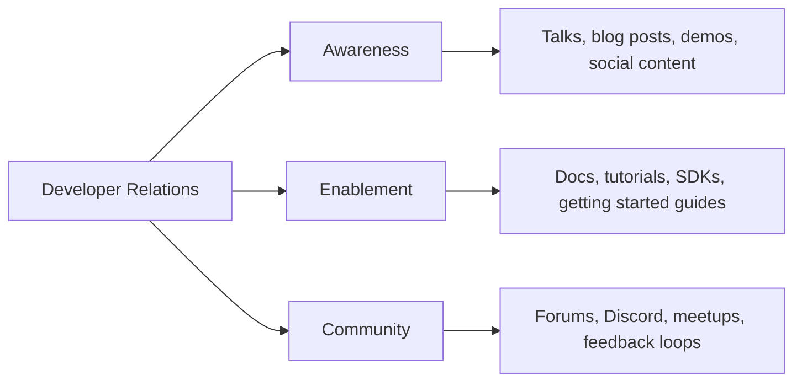

**Why it matters at the junior level:**
- Your content is often the first touchpoint a developer has with the product.
- A single inaccurate tutorial drives away more developers than a good one attracts.
- Authentic community management builds trust that marketing cannot buy.

---

## Prerequisites

- Genuine experience using or building with the technology you will advocate for
- Basic writing skills and comfort with a developer-facing tone (clear, direct, no jargon inflation)
- Familiarity with at least one community platform (Discord, GitHub Discussions, Stack Overflow, Forum)
- Basic understanding of pull requests and technical documentation structure

---

## Glossary

| Term | Definition |
|------|-----------|
| **DevRel** | Developer Relations — the function of building relationships between a company and developers |
| **Developer Advocate** | A DevRel practitioner who primarily creates content and speaks publicly about the product |
| **Community Manager** | A DevRel practitioner who primarily manages community platforms and developer relationships |
| **DX (Developer Experience)** | The overall experience a developer has while using a product, from first discovery to production use |
| **SDK** | Software Development Kit — a packaged set of tools, libraries, and docs enabling developers to build with a platform |
| **API Reference** | Technical documentation describing every endpoint, parameter, and response of an API |
| **Getting Started Guide** | A tutorial that takes a developer from zero to a working first integration |
| **CFP** | Call for Proposals — a conference's invitation for speakers to submit talk proposals |
| **NPS** | Net Promoter Score — a survey metric for measuring community or user satisfaction |
| **Developer Journey** | The sequence of steps a developer takes from first discovering a product to becoming an active user or advocate |

---

## Core Concepts

### What Developer Advocates Actually Do

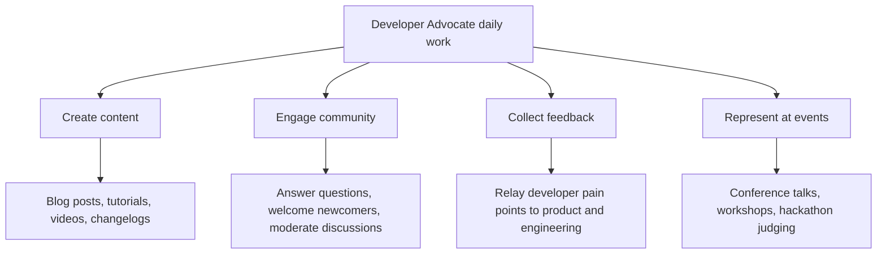

### The Authentic Advocate

Developers trust other developers. The fundamental contract of DevRel is authenticity: you use the product, you know its limitations honestly, and you do not oversell. A single dishonest claim caught by a developer destroys more trust than months of good content builds.

### Content Creation Basics

**Blog post structure for a technical tutorial:**

```text
1. Hook — what problem does this solve? (2-3 sentences)
2. What you will build — the end state (with a screenshot or diagram)
3. Prerequisites — what the reader needs before starting
4. Step-by-step instructions — numbered, each step has one action
5. What just happened — brief explanation of why it works
6. Next steps — where to go from here (docs, community, advanced tutorials)
```

### Community Management Basics

- Respond within 24 hours to questions in your community channels — speed signals that the community is alive.
- Welcome newcomers by name — a personal welcome in #introductions reduces early churn.
- Escalate product feedback — every recurring developer complaint is a product signal; log and route it.
- Do not delete criticism — address it transparently; deleting it destroys trust permanently.

---

## Pros and Cons

| Pros | Cons |
|------|------|
| Highly visible work that directly impacts developer adoption | Success metrics are lagging indicators — hard to prove impact immediately |
| Deep connection to the developer community you care about | Burnout risk from travel, event prep, and always-on community presence |
| Influence over product direction through developer feedback | Role ambiguity — DevRel sits between marketing, product, and engineering |
| Creative freedom in content formats and topics | Content can become outdated as the product evolves rapidly |

---

## Use Cases

- A developer advocate writes a getting-started tutorial that reduces time-to-first-API-call from 45 minutes to 8 minutes.
- A community manager notices a recurring question about authentication errors, creates a FAQ entry, and routes the underlying UX issue to product.
- A junior DevRel professional submits their first conference talk CFP to a regional developer conference.

---

## Example Artifacts / Templates

### Conference Talk Proposal Template (CFP)

```text
Talk Title: <Descriptive, benefit-oriented — avoid vague titles like "Building with X">

Abstract (200 words max):
Lead with the problem the audience has. Describe what they will learn.
End with the concrete takeaway they will walk away with.

Audience: <Who is this talk for? What is their experience level?>

Outline:
1. Problem and context (5 min)
2. Live demo or core concept (15 min)
3. Advanced patterns or real-world case (10 min)
4. Q&A (5 min)

Speaker bio (100 words):
Third person. Focus on relevant experience, not job title.

Previous talks (if any):
Links to recordings or slides.
```

### Community Welcome Message Template

```text
Hey [Name], welcome to the [Community Name] community!

Great to have you here. A few things to get you started:
- [Link to getting started guide]
- [Link to community guidelines]
- [Link to where to ask questions]

Feel free to introduce yourself in #introductions.
We would love to know what you are building.

If you run into anything that does not work as expected,
[#support-channel] is the fastest path to help.
```

---

## Common Failure Modes and Recovery

| Failure Mode | Why It Happens | Recovery |
|---|---|---|
| Blog post with factual API errors | Content written from memory without testing | Always run every API example yourself before publishing; add "Tested on version X" |
| Overselling the product | Enthusiasm unchecked by honesty | Before publishing, ask: "Is every claim accurate? Would I stake my reputation on it?" |
| Ignoring community questions for days | No response SLA defined | Set a personal SLA (first response within 24h); use tools to surface unanswered threads |
| Creating content nobody reads | No research into what developers actually need | Check support tickets, community questions, and search queries before choosing a topic |
| Burning out after 3 conferences in 6 weeks | No sustainable travel cadence | Cap travel at a personal limit; remote talks count toward your quota |

---

## Effectiveness and Efficiency Tips

- Repurpose every conference talk into at least one blog post and one short video clip.
- Keep a "content ideas" log fed by community questions — every unanswered question is a content opportunity.
- Use a personal publishing checklist before every piece of content goes live.
- Build relationships with a handful of active community members who will give honest early feedback on your content.

---

## Metrics & Analytics

Key metrics to track at the junior level:

| Metric | Why it matters | How to measure |
|--------|---------------|----------------|
| **Time-to-Hello-World** | Primary predictor of activation — how fast can a new developer reach first success? | Manual user testing with a fresh environment; time from docs landing to first working output |
| **Tutorial completion rate** | Shows whether content delivers on its promise | Page analytics: scroll depth to final step, or completion event tracking |
| **Community first-response time** | Signals community is alive and responsive | Measure time from question posted to first non-bot reply |
| **CFP acceptance rate** | Measures proposal quality improvement over time | Personal tracking spreadsheet: submissions vs. acceptances per quarter |

---

## Edge Cases & Pitfalls

### Pitfall 1: Tutorial Works on Your Machine, Fails on Theirs

Your machine has pre-installed tools, cached credentials, and environment variables set months ago. A new developer has none of these. Always test tutorials from a completely clean environment (new VM, fresh Docker container, or incognito browser with a brand-new account).

### Pitfall 2: The Community Question That Is Actually a Bug Report

Developers often frame bug reports as "am I doing something wrong?" in community channels. If three different developers ask the same question with the same failure, it is not a user error — it is a product bug. Recognize the pattern and escalate to engineering.

---

## Common Mistakes

### Mistake 1: Writing for Yourself, Not the Reader

Experts have the curse of knowledge — you forget what you did not know when you started. Every tutorial should be written for the person you were before you learned this topic, not for the person you are now.

### Mistake 2: Publishing Without a Test Run

Publishing a tutorial you have not personally followed, step-by-step, in a clean environment is the single most common and most damaging junior DevRel mistake. One broken step at minute 3 of a 30-minute tutorial means the developer abandons and never comes back.

### Mistake 3: Measuring Activity Instead of Impact

Posting 5 times a week in the community, attending 8 conferences, and writing 12 blog posts per quarter are activities, not impact. Impact is: tutorial completion rate went up, time-to-hello-world went down, developer NPS improved.

---

## Tricky Points

### Tricky Point 1: Authenticity Has Limits

Being authentic does not mean revealing confidential product roadmap information, criticizing internal decisions publicly, or sharing unreleased features. Authenticity means: honest about limitations, honest about trade-offs, not overselling. It does not mean no filter.

**Key takeaway:** You can be honest without being unguarded. Know the difference.

### Tricky Point 2: The Community Response That Helps One Developer and Misleads Ten

A community response visible to 500 people carries more risk than a 1-to-1 support ticket. If your answer is slightly wrong, you have misled 499 others who read it silently. Always verify before answering publicly, or qualify with "I believe X is the case — let me double-check."

---

## Test

**1. A developer follows your tutorial and gets a 401 Unauthorized error at Step 4. What is the most likely root cause?**

- A) The API is down
- B) The tutorial is missing an authentication prerequisite or has an incorrect auth header example
- C) The developer is using the wrong programming language
- D) The rate limit was exceeded

<details>
<summary>Answer</summary>
**B)** — Auth errors at a specific tutorial step almost always mean the tutorial either did not explain how to obtain and pass credentials clearly, or the example code has an incorrect header format. This is a content problem, not a developer error.
</details>

**2. True or False: Deleting a negative community post protects the company's reputation.**

<details>
<summary>Answer</summary>
**False** — Deletion is almost always discovered. Screenshots circulate. The developer who posted will share that their post was deleted, which damages trust far more than the original complaint. Address criticism transparently; do not suppress it.
</details>

**3. What is the single most important structural difference between a tutorial and an API reference doc?**

<details>
<summary>Answer</summary>
A tutorial has a narrative: it starts with a problem, walks through a solution, and ends with the developer having accomplished something specific. An API reference is a lookup table: it lists every endpoint, parameter, and response with no narrative arc. Developers need both, but for different moments in the journey.
</details>

---

## Tricky Questions

**1. A competitor's developer advocate publicly writes a detailed comparison post saying your API is harder to use than theirs. How do you respond?**

- A) Write a counter-post attacking their claims
- B) Ignore it — engaging amplifies their content
- C) Read it carefully for valid criticisms, acknowledge what is accurate internally, improve those things, and optionally write a factual clarification if specific claims are wrong
- D) Report the post to the platform for competitor disparagement

<details>
<summary>Answer</summary>
**C)** — Valid criticism from a competitor is free product feedback. The productive response is: take the valid points seriously internally, and if specific factual claims are wrong, write a calm, evidence-based correction focused entirely on facts, not on attacking the author.
</details>

---

## Cheat Sheet

| What | Template / Approach | Success Signal |
|------|-------------------|----------------|
| Tutorial structure | Hook → What you'll build → Prerequisites → Steps → Why it works → Next steps | Developer reaches working output without asking questions |
| CFP abstract | Problem → What you'll learn → Concrete takeaway → Outline | Talk selected; attendees leave with code they can use |
| Community response | Acknowledge → Diagnose → Resource → Offer to follow up | Developer confirms issue resolved; no escalation needed |
| Feedback routing | Log recurring complaint → categorize → route to PM with volume data | Product team receives structured input, not raw complaints |
| Content idea generation | Check support tickets + community Q&A weekly | Every new tutorial answers a question developers are actually asking |

---

## Summary

At the junior level, DevRel is about building the craft of authentic technical communication and the habit of genuinely serving the developer community. Master the tutorial format, develop a reliable pre-publication review process, and be present and responsive in the community. Accuracy and authenticity are your most valuable assets.

**Next step:** Study developer journey mapping, content strategy, and DX measurement at the middle level.

---

## Further Reading

- **Book:** *The Business Value of Developer Relations* by Mary Thengvall — foundational text for the field
- **Community:** DevRel Collective (devrelcollective.fun) — peer learning for DevRel practitioners at all levels
- **Benchmark:** Stripe Getting Started docs — study as a tutorial structure reference
- **Talk:** "What is Developer Relations?" by Caroline Lewko — foundational overview of the function

---

## Diagrams & Visual Aids

### Developer Journey — Awareness to Advocacy

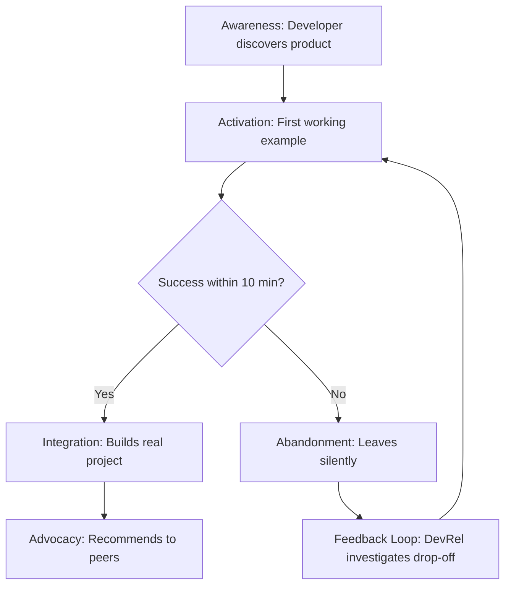

### Four Pillars of DevRel

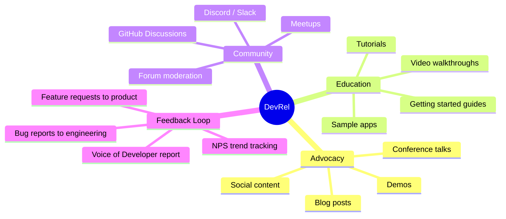

</details>

---

# TEMPLATE 2 — `middle.md`

<details open>
<summary><strong>Template Content</strong></summary>

# {{TOPIC_NAME}} — Middle Level

## Table of Contents

1. [Introduction](#introduction)
2. [Content Strategy](#content-strategy)
3. [The Developer Journey](#the-developer-journey)
4. [Community Health Metrics](#community-health-metrics)
5. [API Documentation Excellence](#api-documentation-excellence)
6. [Example Artifacts / Templates](#example-artifacts--templates)
7. [Common Failure Modes and Recovery](#common-failure-modes-and-recovery)
8. [Comparison with Alternative Approaches / Methodologies](#comparison-with-alternative-approaches--methodologies)
9. [Effectiveness and Efficiency Tips](#effectiveness-and-efficiency-tips)
10. [Summary](#summary)

---

## Introduction

At the middle level you move from creating individual pieces of content to understanding why certain content works, for whom, and at what point in the developer journey. You begin to own developer satisfaction metrics and make data-informed decisions about where to invest effort.

---

## Content Strategy

Content strategy answers: what do we create, for whom, why, when, and how do we know if it worked?

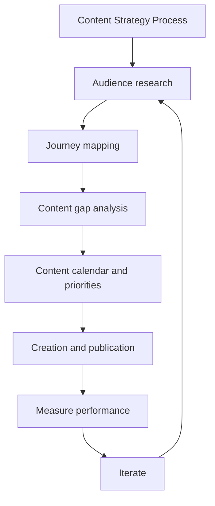

### Content Audit Framework

| Content Type | Awareness Stage | Activation Stage | Retention Stage |
|---|---|---|---|
| Blog posts | "What is X?" explainers, comparison posts | Tutorials, how-tos | Advanced patterns, case studies |
| Videos | Demo walkthroughs, conference talks | Step-by-step tutorials | Architecture deep-dives |
| Documentation | Overview and concepts | Getting started guide | API reference, troubleshooting |
| Community | Forum presence, social engagement | Onboarding flows | Power user programs, office hours |

---

## The Developer Journey

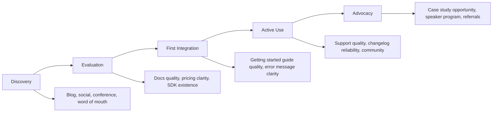

**Time-to-first-value (TTFV):** The single most important activation metric in DevRel. Measures the time from a developer's first visit to their first successful API call, build, or output. Reducing TTFV by 50% can double activation rates.

### Developer Journey Mapping Exercise

For each stage, answer:
1. What is the developer trying to accomplish?
2. What resources does the developer encounter?
3. What friction points exist?
4. What does success look like?
5. What content or tooling can reduce friction?

---

## Community Health Metrics

| Metric | Description | Healthy Signal |
|---|---|---|
| **Monthly Active Contributors (MAC)** | Members who post, answer, or react in 30 days | Growing month-over-month |
| **Question resolution rate** | % of questions receiving an accepted answer | > 80% |
| **Average time-to-first-response** | Time from question posted to first reply | < 4 hours for technical questions |
| **New member retention (30-day)** | % of new members who post again within 30 days | > 40% |
| **Community NPS** | "How likely are you to recommend this community?" | > 30 |
| **Lurker-to-contributor conversion** | % of monthly visitors who post at least once | > 5% |

---

## API Documentation Excellence

The quality of API documentation is the single largest variable in developer activation after the API design itself.

**Documentation hierarchy:**

```text
Level 1 — Concepts
  What is this API? What problem does it solve? What are the core objects?

Level 2 — Getting Started
  How do I make my first successful call in under 10 minutes?

Level 3 — Guides and How-Tos
  How do I accomplish specific real-world tasks?

Level 4 — API Reference
  Complete, accurate, searchable documentation of every endpoint,
  parameter, and response.

Level 5 — Changelog
  What changed, when, and what do I need to update?
```

---

## Example Artifacts / Templates

### Content Calendar Template

```text
Monthly Content Calendar — [Month Year]

Theme: [Monthly theme aligned to product or community focus]

Week 1:
  Blog: [Title] — [Stage: Awareness/Activation/Retention]
        [Owner] — [Publish date]
  Community: [Planned event or campaign]
  Social: [Theme for posts this week]

Week 2: [...]
Week 3: [...]
Week 4: [...]

Metrics to track this month:
  Blog page views target: [X]
  Tutorial completion rate target: [X%]
  Community new member target: [X]
  TTFV change: baseline [X min] vs. target [Y min]
```

### Developer Journey Friction Log

```text
Date: [date]
Stage: [Discovery / Evaluation / First Integration / Active Use / Advocacy]
Friction observed: [description]
Source: [support ticket / community question / user interview / personal testing]
Severity: [High / Medium / Low]
Proposed fix: [content gap, docs improvement, tooling change]
Owner: [DevRel / Docs / Product / Engineering]
Status: [Open / In Progress / Fixed]
```

---

## Common Failure Modes and Recovery

| Failure Mode | Impact | Recovery |
|---|---|---|
| Content that gets traffic but does not convert | Wasted effort, low ROI signal | Add clear CTAs; map every piece to a journey stage and success metric |
| Community growth with declining engagement | Vanity metric — large but dead community | Shift focus from member count to MAC; run activation campaigns for dormant members |
| API docs accurate but unusable | High support ticket volume | Test docs with real developers watching them follow the guide; fix what they cannot do |
| DevRel content not reviewed by product team | Misalignment, embarrassing product claims | Monthly DevRel–Product sync; share content calendar for review before publication |

---

## Comparison with Alternative Approaches / Methodologies

| Approach | Strengths | Weaknesses | When to Use |
|---|---|---|---|
| **Community-led growth** | High trust, organic, low CAC | Slow to start, requires long-term investment | Platforms with large developer surface |
| **Content marketing (SEO-led)** | Scalable, measurable, long-lived traffic | Lower authenticity signal | High-volume keyword opportunities |
| **Partner / integration-led** | Leverages partner communities | Dependency on partner priorities | Established platform with partner ecosystem |
| **Paid developer advertising** | Fast reach | Low trust, high cost per quality developer | Launch campaigns, specific geography push |

---

## Effectiveness and Efficiency Tips

- Measure TTFV at least quarterly — it is your most actionable activation metric.
- Run docs user testing with 5 real developers every quarter; it surfaces more issues than any audit.
- Treat the community question log as your content backlog — the most frequent questions become highest-priority tutorials.
- Use a content performance review (monthly, 30 minutes) to kill underperforming content early and double down on high performers.

---

## Comparison with Alternative Developer Engagement Approaches

| Approach | Strengths | Weaknesses | Best Stage |
|----------|-----------|-----------|------------|
| **DevRel (community + content)** | Builds durable trust, creates self-sustaining community | Slow ROI (12-24 months), hard to attribute revenue | All stages; especially Activation + Retention |
| **Content marketing (SEO-led)** | Broad reach, measurable traffic | Low technical credibility; developers distrust promotional tone | Discovery |
| **Technical support team** | Solves problems directly | Reactive; cannot prevent friction, only respond to it | Post-activation problem resolution |
| **Sales engineering** | High-touch, high conversion for enterprise | Does not scale to self-serve developers | Evaluation (enterprise accounts) |
| **Product documentation only** | Always-available reference | Static; no community element; cannot anticipate confusion | Activation + Integration |

---

## Diagnosing Community/Program Problems

### Symptom: High tutorial traffic, low SDK activation

```text
Diagnosis checklist:
1. Does the tutorial end with a direct, visible CTA to sign up or download SDK?
2. Is the post-signup onboarding flow consistent with the tutorial's assumptions?
3. Is there a friction point between tutorial completion and API key issuance?
4. Does the tutorial solve a problem developers actually have, or a theoretical one?

Interventions:
- Embed a "Try it in the browser" sandbox that removes environment setup friction
- A/B test a specific guided post-signup flow vs. self-directed exploration
- Run 3 user-testing sessions with developers who represent the target persona
```

### Symptom: Community engagement declining (fewer posts, questions unanswered)

```text
Diagnosis checklist:
1. Is the product going through a disruptive change (API deprecation, pricing change)?
2. Has DevRel presence dropped (team travel, conference season)?
3. Are new members joining but not posting (lurker ratio increasing)?
4. Is signal-to-noise degraded (spam, off-topic posts reducing quality)?

Interventions:
- Host a community office hours event to re-engage active members
- Launch a structured challenge to create activation energy
- Re-examine channel structure — too fragmented or too sparse?
```

---

## Edge Cases & Pitfalls

### Pitfall 1: NPS Promoters Who Do Not Advocate

A developer who scores 9/10 on NPS but never publicly recommends the product is a satisfied user, not an advocate. Advocacy requires the developer to actively share — in a forum post, a conference talk, or a peer recommendation. Design explicit moments that invite satisfied developers to share: "Would you be willing to be featured in a case study?" or "We'd love to hear your story at our next community call."

### Pitfall 2: Journey Map Built on Internal Assumptions

If the journey map comes from internal brainstorming rather than developer interviews, support ticket analysis, and observational user testing, it will be confidently wrong. Validate every stage assumption with at least 5 developer interviews before treating the map as a planning input.

---

## Metrics & Analytics

### Full DX Measurement Framework

| Metric | Why it matters | Tool |
|--------|---------------|------|
| **Time-to-Hello-World** | Primary DX activation metric | Manual user testing, funnel analytics |
| **Developer NPS** | Sentiment trend across developer segments | Typeform, Delighted, Pendo |
| **Tutorial completion rate** | Shows whether content delivers working results | Google Analytics events, Hotjar scroll depth |
| **SDK activation rate** | % of signups who make first API call within 7 days | Internal analytics, Mixpanel |
| **Community response time (median)** | Measures community health and DevRel responsiveness | Discord analytics, GitHub issue age |
| **Content organic search sessions** | Long-term reach and SEO performance | Google Search Console, GA4 |
| **Docs search queries with no results** | Reveals documentation gaps directly | Algolia DocSearch, internal search logs |
| **Peer-to-peer answer ratio** | Measures flywheel maturity — are community members helping each other? | Community platform analytics |

---

## Test

**1. What is the strongest signal that a community flywheel is working?**

- A) Community membership is growing month-over-month
- B) Developers are answering each other's questions without DevRel prompting
- C) The DevRel team is posting more content than ever
- D) NPS score is above 50

<details>
<summary>Answer</summary>
**B)** — The flywheel is self-sustaining when community members generate value for each other. Membership growth without peer-to-peer engagement is a hollow metric. A community of 1,000 active peer helpers is more valuable than 10,000 passive members.
</details>

**2. Your developer NPS improved from 32 to 48 over 6 months. What is the most important follow-up question?**

<details>
<summary>Answer</summary>
Did the improvement come from fewer detractors (problem resolution) or more promoters (genuine enthusiasm)? These require completely different strategic responses. Fewer detractors means you fixed pain points. More promoters means you created genuine delight. Treating them the same leads to wrong conclusions about what to invest in next.
</details>

**3. True or False: A comprehensive API reference is sufficient to drive developer activation without a Getting Started tutorial.**

<details>
<summary>Answer</summary>
**False** — Reference docs answer "what does this parameter do?" but not "how do I accomplish my goal?" Activation requires a narrative path through the product. The Getting Started guide is the activation-stage artifact; the API reference is the integration-stage artifact.
</details>

---

## Cheat Sheet

| Topic | Key Tool / Approach | Signal of Success |
|-------|-------------------|------------------|
| Developer journey mapping | Map stages → touchpoints → friction → metric → intervention | Top 3 friction points identified with supporting data |
| Content strategy | Keyword research + content calendar mapped to journey stages | Organic search traffic growing month-over-month |
| DX measurement | NPS + time-to-hello-world + user testing sessions | SDK activation rate > 40% within 7 days |
| Community flywheel | Peer-to-peer answer ratio tracking | > 50% of questions answered by community, not DevRel |
| API docs quality | Stripe/Twilio benchmark audit | Working example on page 1; auth explained in < 60 seconds |
| Feedback loop | Monthly Voice of Developer report to product team | Product team cites DevRel feedback in roadmap decisions |

---

## Summary

At the middle level, DevRel is strategic. You map the developer journey, identify friction points, create content that addresses specific stages, and measure health with real metrics rather than vanity numbers. Your output is a developer community that grows healthily and a content library that genuinely reduces friction.

**Next step:** Study team structure, ecosystem strategy, and metrics dashboards at the senior level.

---

## Further Reading

- **Book:** *The Business Value of Developer Relations* by Mary Thengvall — Chapters 4-6 on measurement and program design
- **Benchmark:** Stripe API documentation — study the Getting Started experience as a DX reference
- **Framework:** DevRel Qualified (dql.dev) — community-maintained DevRel metrics framework
- **Community:** DevRel Collective — practitioner peer group with shared resources and job frameworks

</details>

---

# TEMPLATE 3 — `senior.md`

<details open>
<summary><strong>Template Content</strong></summary>

# {{TOPIC_NAME}} — Senior Level

## Table of Contents

1. [Introduction](#introduction)
2. [Ecosystem Strategy](#ecosystem-strategy)
3. [Partnerships and Integrations](#partnerships-and-integrations)
4. [Building and Leading a DevRel Team](#building-and-leading-a-devrel-team)
5. [ROI Measurement and Executive Reporting](#roi-measurement-and-executive-reporting)
6. [Example Artifacts / Templates](#example-artifacts--templates)
7. [Diagnosing Team / Process Problems](#diagnosing-team--process-problems)
8. [Effectiveness and Efficiency Tips](#effectiveness-and-efficiency-tips)
9. [Summary](#summary)

---

## Introduction

Senior DevRel practitioners own the ecosystem strategy. You are responsible for the developer audience the company reaches, the partnerships that extend that reach, the team that executes the work, and the ability to demonstrate DevRel's value in business terms to executives who do not speak community.

---

## Ecosystem Strategy

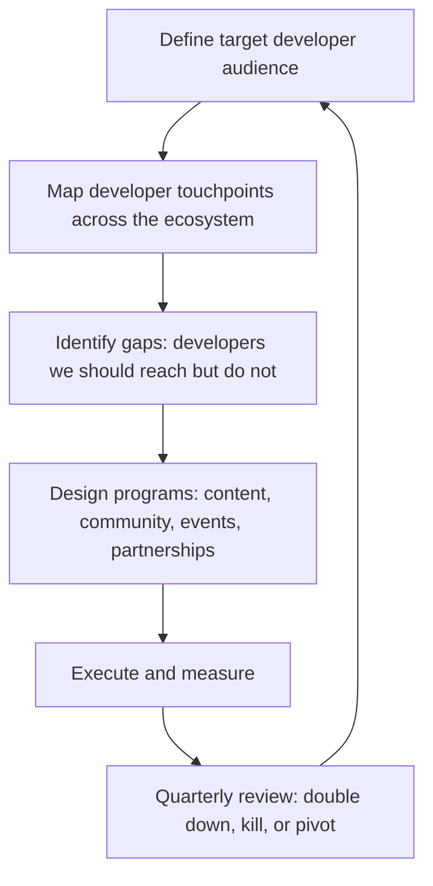

**Ecosystem dimensions to map:**

| Dimension | Questions to Answer |
|---|---|
| **Audience** | Who are the developer personas? What do they build? Where do they learn? |
| **Channels** | Where does this audience spend time? (GitHub, Stack Overflow, YouTube, conferences) |
| **Language communities** | Which language or framework communities overlap with our target audience? |
| **Adjacent products** | What other tools do our developers use? Are there integration opportunities? |
| **Competitors** | Where are developers going instead? Why? |

---

## Partnerships and Integrations

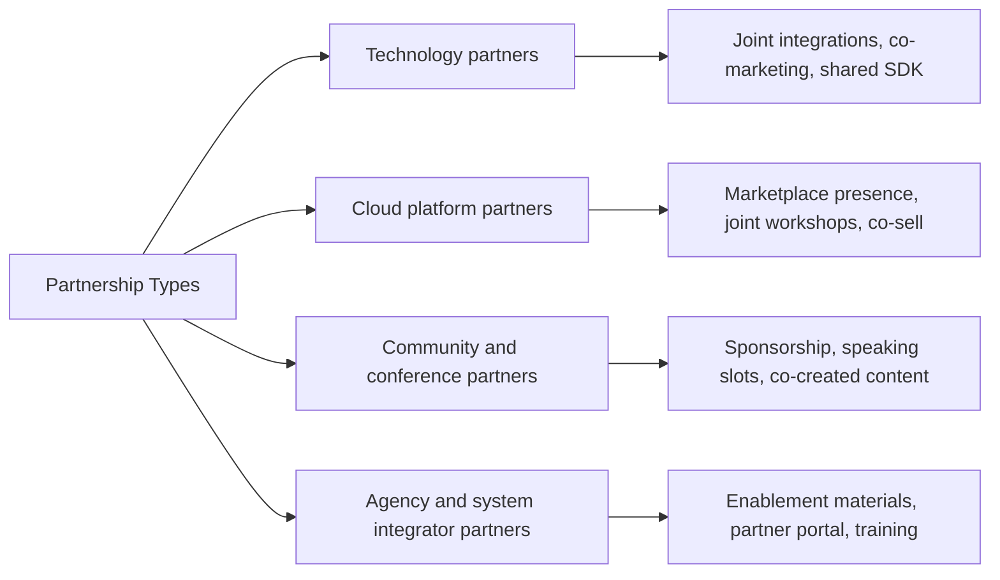

**Senior-level partnership work:**
- Write the business case for each significant partnership (developer reach, CAC impact, revenue pipeline).
- Establish partnership tiers with defined mutual obligations.
- Create enablement materials so partners can advocate accurately without your direct involvement.
- Measure partnership health: developer sign-ups attributed to partner channels, integration usage, co-marketing engagement.

---

## Building and Leading a DevRel Team

### DevRel Team Structure Models

| Model | Structure | When to Use |
|---|---|---|
| **Embedded** | Advocates embedded in product squads | Early stage; tight product-DevRel feedback loop needed |
| **Centralized** | Single DevRel team serving all products | Platform with unified developer audience |
| **Hub-and-spoke** | Central team plus embedded advocates per product area | Large platform with distinct developer personas per product |
| **Community-first** | Dedicated community team with thin content layer | Community-led growth as primary motion |

### Hiring a DevRel Team

**Junior Advocate signals:** Creates accurate, clear content; genuinely participates in developer communities; responds well to editorial feedback.

**Mid-level Advocate signals:** Owns a content or community metric; maps content to developer journey; comfortable saying "I do not know, let me find out."

**Senior Advocate signals:** Drives ecosystem strategy; manages partnerships; presents DevRel ROI to leadership; builds and mentors the team.

---

## ROI Measurement and Executive Reporting

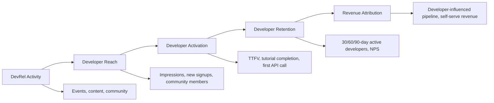

**Executive reporting metrics:**

| Metric | What It Signals |
|---|---|
| Developer-influenced pipeline | % of closed deals where a developer was the first point of contact |
| Self-serve developer activation rate | Developers who go from signup to active use without sales intervention |
| Community NPS trend | Health of developer sentiment over time |
| Content-attributed signups | Signups where content was the last or first touch |
| Support ticket deflection | % of questions answered by docs/community instead of support team |

---

## Example Artifacts / Templates

### DevRel Quarterly Business Review (QBR) Slide Structure

```text
Slide 1 — Goals vs. Actuals
  Goal 1: [metric] — Actual: [result]
  Goal 2: [metric] — Actual: [result]

Slide 2 — Developer Reach
  New developers reached: [X]
  Channel breakdown: blog [X%], events [X%], community [X%], partners [X%]

Slide 3 — Developer Activation
  TTFV this quarter vs. last: [change]
  Tutorial completion rate: [X%]

Slide 4 — Community Health
  Monthly Active Contributors: [X] (trend: up/flat/down)
  Community NPS: [X]
  Question resolution rate: [X%]

Slide 5 — Business Impact
  Developer-influenced pipeline: $[X]
  Support ticket deflection: [X%] (saves ~$[X]/quarter)

Slide 6 — Next Quarter Focus
  Priority 1: [initiative] — expected impact: [metric]
  Priority 2: [initiative] — expected impact: [metric]
```

---

## Diagnosing Team / Process Problems

| Symptom | Likely Cause | Investigation Steps |
|---|---|---|
| High content output, low activation metrics | Content not aligned to journey stages | Map each piece to a journey stage; test with real developers |
| Community growing but advocates burning out | Unsustainable engagement expectations | Audit time-per-channel; introduce async-first community norms |
| Leadership skeptical of DevRel ROI | No business metrics dashboard | Build developer-influenced pipeline tracking; present at QBR |
| Partnership program not generating developer reach | Partners not equipped to advocate | Audit partner portal; run enablement workshops |

---

## Effectiveness and Efficiency Tips

- Build a DevRel attribution model with your data team before your next QBR — even a simple one changes the conversation with leadership.
- Run a quarterly developer satisfaction survey (10 questions, NPS + open text). Share the results company-wide.
- Use office hours (weekly, async or live) to surface developer pain points faster than support tickets do.
- Document every partnership in a single source of truth: what was agreed, what was delivered, what the metrics are.

---

## Community Governance

At scale, community governance is the difference between a healthy ecosystem and a toxic one. Governance means: published community guidelines (specific, not vague), a transparent moderation process, clear escalation paths for serious violations, and consistent enforcement. Inconsistent enforcement — punishing some members for behavior tolerated in others — destroys community trust faster than almost any other action.

### Governance Policy Outline

```text
Community Guidelines (public-facing):
1. Be specific about what "respectful" means — not just "be nice"
2. Define what is on-topic and what is not
3. State prohibited behaviors explicitly (harassment, doxxing, spam, competitor attacks)
4. Explain the moderation process: Warning → Mute → Temp Ban → Permanent Ban
5. Provide an appeals path

Escalation Matrix:
| Severity | Example              | First Responder    | Escalation        |
|----------|----------------------|--------------------|-------------------|
| Low      | Off-topic post       | Community Manager  | —                 |
| Medium   | Repeated harassment  | Community Manager  | DevRel Lead       |
| High     | Legal threat/doxxing | DevRel Lead        | Legal + Leadership|
```

---

## DevRel Metrics Dashboard

A senior DevRel professional maintains a dashboard covering four categories:

| Category | Metric | Target (illustrative) | Tool |
|----------|--------|-----------------------|------|
| **Reach** | Blog organic sessions | MoM growth > 5% | Google Search Console |
| **Reach** | Conference session reach | 500+ per talk | Event platform + recording views |
| **Activation** | SDK activation rate | > 40% within 7 days | Internal analytics |
| **Activation** | DevRel-attributed signups | > 15% of total | UTM + community referral tracking |
| **Community Health** | Peer-to-peer answer ratio | > 50% | Discord/forum analytics |
| **Community Health** | Median community response time | < 24 hours | GitHub issue age, Discord metrics |
| **Community Health** | Community NPS | > 40 | Quarterly survey |
| **Product Influence** | Feedback items routed to product | > 20/quarter | Feedback tracking system |
| **Product Influence** | % of feedback items actioned | > 30% | Product roadmap audit |

---

## Diagnosing Team / Process Problems

### Symptom: Ambassador program engagement declining (members going inactive)

```text
Diagnosis questions:
1. When was the last time we did something FOR ambassadors — exclusive access, recognition, PM time?
2. Is our ask of ambassadors proportional to what we give them?
3. Have we lost any ambassadors to a competitor's program?
4. Is the program publicly visible — do developers outside know it exists?

Interventions:
- Host a private ambassador summit (virtual or in-person) — invest in the relationship
- Survey ambassadors directly: "What would make this program more valuable to you?"
- Add a visible public benefit (ambassador badge, profile highlight) to increase aspirational value
```

### Symptom: Cross-functional credibility is low — product team ignores DevRel feedback

```text
Diagnosis questions:
1. Is the report formatted for the product team's workflow (Jira, Notion, Slack summary)?
2. Are we routing feedback to the right people — PM leads, not general channels?
3. Have we ever demonstrated that DevRel feedback directly influenced a product decision?

Interventions:
- Request a 15-minute monthly slot in the product team's roadmap planning meeting
- Publish a "shipped from community feedback" section in every developer changelog
- Bring a developer to a product team meeting (recording or live) — make the voice literal
```

---

## Edge Cases & Pitfalls

### Pitfall 1: Hiring Advocates Who Cannot Code

Developer advocates who cannot write working code lose credibility with technical audiences within months. The bar is not "senior engineer" — but the advocate must be able to write and debug a tutorial independently, understand API authentication flows, and recognize when an error is a product bug vs. user error.

### Pitfall 2: Conference Strategy Driven by "Presence" Rather Than Developer Density

Some organizations attend conferences because "we should be there" rather than because target developers attend in meaningful numbers. Define conference selection criteria explicitly (developer persona alignment, speaker opportunity, measurable attribution window) and enforce them. Attending the wrong 12 conferences costs as much as attending the right 6.

---

## Comparison with Alternative Developer Engagement Approaches

| Approach | Senior-Level Trade-off |
|----------|----------------------|
| **Internal Developer Portal** | High-quality portals can replace some DevRel content work — but portals cannot build community or represent the developer perspective to product |
| **Open Source Community** | The most powerful flywheel at scale — requires engineering team commitment to reviewing contributions, which is politically difficult in most organizations |
| **Developer Influencer Programs** | Fast reach, low trust — developer audiences recognize paid content; appropriate for Discovery awareness only, not Activation or Retention |
| **Enterprise-Only DevRel** | High ACV per developer but produces no community, no ecosystem, no word-of-mouth at scale |

---

## Test

**1. A developer ambassador program is losing members quarterly. What is the most likely root cause?**

- A) The product is not interesting enough
- B) The benefits do not justify the expected contribution
- C) The community is too large for ambassadors to feel special
- D) The company blog does not publish enough content

<details>
<summary>Answer</summary>
**B)** — Ambassador program attrition is almost always a value exchange problem. The program is asking for more than it is giving. The fix is to either reduce the ask, increase the benefit, or both. Survey departing ambassadors to confirm before acting.
</details>

**2. Which conference investment builds the most durable developer credibility?**

- A) Platinum sponsorship with a large booth
- B) Hosting a hackathon side event
- C) Giving a high-quality technical talk with a live demo
- D) Sponsored blog posts published around the conference

<details>
<summary>Answer</summary>
**C)** — Technical talks build credibility because they demonstrate expertise publicly. Sponsorships buy visibility; talks earn trust. A live demo that works is the most powerful conference artifact in DevRel. Sponsorships are appropriate for brand awareness, not trust building.
</details>

---

## Cheat Sheet

| Senior DevRel Topic | Key Decision / Action | Success Signal |
|---------------------|----------------------|----------------|
| Team structure | Three distinct roles: Advocate, DX Engineer, Community Manager | Team coverage across all four DevRel pillars |
| Hiring | Require working code sample + community response scenario in interview | Advocate produces a complete tutorial independently in week 2 |
| Ambassador program | Quarterly touchpoints + exclusive access + public recognition | Ambassador content creation rate stable or growing |
| Community governance | Publish guidelines publicly; enforce consistently; review annually | Zero moderation escalations due to policy ambiguity |
| Metrics dashboard | Four categories: Reach, Activation, Community Health, Product Influence | Exec team cites DevRel metrics in business reviews |
| Conference strategy | Selection criteria defined in advance; 30-day attribution tracking | Cost-per-developer-acquired defined and improving |

---

## Summary

At the senior level, DevRel is a business function you architect and lead. You design the ecosystem strategy, build and enable the team, form partnerships that extend reach, and translate developer community health into business metrics that executives understand. The output is a self-reinforcing developer ecosystem that makes the product stronger and the business more durable.

**Next step:** Study leadership philosophy, organizational dynamics, and systems design at the professional/mastery level.

---

## Further Reading

- **Book:** *The Business Value of Developer Relations* by Mary Thengvall — Chapters 7-10 on program design and org structure
- **Case study:** AWS Heroes program documentation — public program design reference
- **Framework:** DevRel Qualified (dql.dev) — senior practitioner metrics and program frameworks
- **Community:** DevRel Collective senior track — peer working groups for team leads and program architects

</details>

---

# TEMPLATE 4 — `professional.md`

<details open>
<summary><strong>Template Content</strong></summary>

# {{TOPIC_NAME}} — Mastery and Leadership Level

## Table of Contents

1. [Leadership Philosophy](#leadership-philosophy)
2. [Organizational Dynamics](#organizational-dynamics)
3. [Influence Without Authority](#influence-without-authority)
4. [Building Systems, Not Just Skills](#building-systems-not-just-skills)
5. [Measuring Mastery](#measuring-mastery)
6. [Psychological and Cognitive Frameworks](#psychological-and-cognitive-frameworks)
7. [Case Studies](#case-studies)
8. [Tricky Leadership Questions](#tricky-leadership-questions)
9. [Summary — What Mastery Looks Like Day-to-Day](#summary--what-mastery-looks-like-day-to-day)

---

## Leadership Philosophy

At mastery level, DevRel is not a function you run — it is a philosophy of company building you embed. The professional's question is not "What content should we create this quarter?" but "Are we building a company that developers genuinely want to exist in the world?"

**Core beliefs of a mastery-level practitioner:**
- Developer trust is a corporate asset with a real balance-sheet value — it accrues slowly and disappears instantly.
- The best DevRel program eventually makes itself partially redundant by making the product so good developers advocate for it without prompting.
- Developer relations and product development are not parallel tracks — they are a feedback loop. When they are decoupled, both degrade.
- The developer community is not a channel to be managed; it is a constituency to be served.

---

## Organizational Dynamics

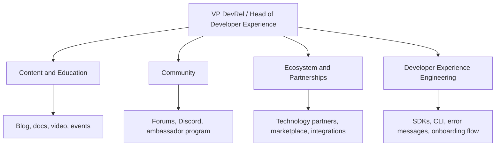

**Cross-organizational dynamics at the professional level:**

| Dynamic | Challenge | Leadership Response |
|---|---|---|
| DevRel vs. Marketing on developer content | Marketing wants conversion; DevRel wants authenticity | Establish clear ownership: DevRel owns developer content; co-create strategy at VP level |
| DevRel vs. Product on roadmap influence | Developer feedback not systematically used | Build a structured developer feedback loop with product cadence integration |
| DevRel vs. Sales on developer-led deals | Sales wants to own developer relationships; DevRel wants them to stay organic | Define rules of engagement: DevRel introduces, Sales engages on commercial terms only |
| International expansion | Content and community strategies do not translate | Hire local developer advocates; partner with regional developer communities |

---

## Influence Without Authority

At mastery level, the most important work is influencing decisions made by people who do not report to you: product roadmap priorities, engineering investments in SDK quality, documentation staffing, pricing decisions that affect developer adoption.

**Influence tools:**

- **Developer advisory boards** — formalized mechanism to bring developer voices into product decisions.
- **Community feedback reports** — monthly document summarizing developer sentiment, top pain points, feature requests. Distributed to product and engineering leadership.
- **Developer NPS correlation studies** — show the relationship between developer NPS and revenue metrics; makes the business case for investment.
- **Public commitments** — developer-facing changelogs and roadmap transparency build trust and create accountability.
- **Speaker programs** — developers who present at conferences about your platform become internal advocates for your platform's quality.

---

## Building Systems, Not Just Skills

| System | Description | Artifact |
|---|---|---|
| **Developer evangelist playbook** | How to be a credible, authentic advocate for the product | Playbook doc covering content standards, accuracy review, talking points, limits |
| **Community flywheel** | Designed loop where community growth reinforces itself | Flywheel diagram + program design for ambassador, champion, or beta programs |
| **Content excellence framework** | Standards for what excellent developer content looks like at each type | Rubric with examples at each quality level |
| **DevRel attribution model** | Framework for measuring DevRel's contribution to business outcomes | Data model + dashboard connecting DevRel activity to pipeline and activation |
| **Ambassador / champion program** | Structured program scaling community advocacy through power users | Program handbook: selection criteria, benefits, expectations, graduation |

---

## Measuring Mastery

| Metric | Measurement Method | Target |
|---|---|---|
| **Time-to-first-value (TTFV)** | User session analytics from signup to first successful output | Reduction quarter-over-quarter |
| **Developer NPS** | Quarterly survey | > 40 (world class > 60) |
| **Community Monthly Active Contributors** | Community platform analytics | Growing at or above new member growth rate |
| **Content-attributed developer signups** | UTM tracking + attribution model | Growing share of total new developer signups |
| **Support ticket deflection rate** | (Tickets resolved by docs/community) / (Total support tickets) | > 60% |
| **Developer-influenced pipeline** | CRM tagging of developer-first deals | Growing % of total new ARR |
| **Ambassador program health** | Active ambassadors / total ambassadors | > 70% active rate |

---

## Psychological and Cognitive Frameworks

**Community identity theory:**
Developers who identify with a technology community (e.g., "I am a Stripe developer") have higher retention, higher NPS, and higher advocacy rates than those who merely use the tool. Mastery-level DevRel designs programs that cultivate identity — not just usage.

**Dunbar's number applied to community:**
Genuine community relationships cap at roughly 150 people. Scaling past that requires structural layers: champions, ambassadors, local chapters, and topic-based sub-communities. Trying to manage a 10,000-person community as one unit produces the illusion of community without the reality.

**Trust ladder model:**
Developer trust accrues in stages: Aware → Curious → Trusting → Dependent → Advocating. Each stage requires different content and community investments. Moving a developer from Aware to Curious requires accuracy. From Trusting to Dependent requires reliability and support quality. From Dependent to Advocating requires the developer to feel ownership and recognition.

---

## Case Studies

**Twilio — The developer-first company:**
Twilio built its go-to-market motion almost entirely through developer advocates and self-serve documentation from 2010 to 2016. Their "Send your first SMS in 5 minutes" onboarding flow was a benchmark for TTFV in the API industry. Key lesson: making the first success effortless is the highest-leverage DevRel investment, and it requires DevRel, docs, and engineering to work as one team.

**Stripe — Documentation as a product:**
Stripe elevated API documentation to a product discipline, assigning writers and engineers to docs with the same rigor as product features. Their docs have consistently ranked as the best in the payments industry and are cited by developers as a primary reason they choose Stripe over competitors. Key lesson: documentation quality is a competitive moat, and it requires treating it as a product, not an afterthought.

**HashiCorp — Community-built ecosystem:**
HashiCorp grew a massive ecosystem of community-maintained providers and modules for Terraform by designing an open, contribution-friendly architecture and investing heavily in community education. Their community flywheel — where contributors become advocates who recruit more contributors — scaled their ecosystem faster than any paid program could have. Key lesson: designing for contribution from the beginning is more powerful than any ambassador program added later.

---

## Tricky Leadership Questions

**Q: The CEO wants to measure DevRel's ROI in direct revenue. How do you respond?**
Direct revenue attribution is often impossible for DevRel. Propose a multi-metric model: developer-influenced pipeline, self-serve activation rate, and support ticket deflection (with a dollar cost per ticket). Show total estimated value contribution, not just a single revenue line.

**Q: A competitor launches a massive developer community with funded grants. How do you respond?**
Do not match funded programs dollar-for-dollar unless you can sustain it. Instead, focus on depth over breadth: a smaller community where developers feel genuinely heard consistently outperforms a larger community with poor engagement. Invest in response time, product responsiveness to feedback, and ambassador relationships.

**Q: Your developer community has become a place where developers complain loudly about product issues. How do you handle it?**
This is a sign of trust — developers only complain loudly in communities they believe are listening. Make the response process visible: tag complaints, route them to product, and close the loop publicly when issues are resolved. The worst response is deletion or silence.

**Q: Leadership wants to merge DevRel into Marketing. How do you make the case for keeping it separate?**
Use data: developer content that reads as marketing converts at a fraction of the rate of authentic technical content. Show community NPS data before and after any marketing-heavy period. Make the argument in business terms: developer trust is the asset, and it requires editorial independence to maintain.

---

## Organizational Dynamics — Extended

### Where DevRel Sits in the Org

DevRel reporting structure is one of the most debated questions in the field. Common models:

| Model | Strengths | Weaknesses |
|-------|-----------|-----------|
| **Under Marketing** | High reach, budget access | Developer credibility suffers; marketing KPIs dominate |
| **Under Product** | High product influence, tight feedback loop | Lower content investment; weak for community programs |
| **Under Engineering** | High technical credibility | Lower organizational visibility; weak for external reach |
| **Independent / Reports to CTO or CEO** | Maximum autonomy, maximum credibility | Rare; requires explicit leadership commitment to developer-first values |

The mastery-level insight: reporting structure matters less than the written agreement about DevRel's mandate, primary loyalty, and success metrics. Get that agreement in writing and review it annually.

### Navigating Between Community and Business Goals

The hardest organizational moment in DevRel is when a business decision harms the community — a pricing change, an API deprecation, a policy restriction. Mastery-level navigation:

1. Get in the room before the decision is final — represent developer impact in the decision calculus
2. If you cannot prevent the decision, negotiate the communication — honest, early, specific
3. Be the bridge — tell the community the honest business reason; tell the business team what the community reaction will be
4. Do not pretend — if the decision is bad for developers, do not spin it as a benefit

---

## Building Systems, Not Just Skills — Extended

### The Self-Sustaining Community Benchmark

A self-sustaining community would survive the company reducing its DevRel investment by 50%. Signs of self-sustaining community:
- High peer-to-peer answer ratio (> 60% of questions answered by community, not DevRel)
- Community-organized events that DevRel does not run
- Community members defending the product unprompted in third-party forums
- Community-created content that is as high quality as official content
- New members are welcomed by existing members, not just by a bot or a DevRel employee

### Ambassador Program System Design

A self-sustaining ambassador program has six components:

```text
1. Clear selection criteria — public, objective, based on visible community contribution
2. Defined benefits — early access, direct PM access, co-speaking opportunities, recognition
3. Defined expectations — content frequency, community participation, feedback commitment
4. Active management — quarterly check-ins, annual summit, private channel for ambassadors
5. Transparent graduation and removal — criteria for leaving the program, how it is handled
6. Measurement — ambassador content creation rate, community member-to-ambassador pipeline
```

---

## Measuring Mastery — Extended

| Metric | What Mastery Looks Like | Warning Signal |
|--------|------------------------|---------------|
| **Developer NPS** | Stable > 50; trend matters more than absolute value | Declining for 3 consecutive quarters without explanation |
| **Community growth rate** | Organic growth > paid/sponsored channels | Community growth is only from DevRel-hosted events |
| **SDK adoption %** | > 40% of signups activate within 7 days | Activation rate declining despite growing signups |
| **Content organic reach** | Growing share of traffic from organic search | Organic share declining; paid is propping up reach |
| **Time-to-first-success** | < 10 minutes for primary use case | Increasing TTFV despite team growth |
| **Support ticket deflection %** | > 30% of support topics answered in community before ticket | Deflection rate declining; community not self-serving |
| **Conference speaking reach** | Consistent growth in talk views and post-talk attribution | Attending same events without measurable developer acquisition |

**The mastery benchmark:** All of the above metrics improving simultaneously over 12 months without proportional increase in DevRel headcount. That is the signal you have built systems, not just skills.

---

## Tricky Leadership Questions

**Q: The CEO wants to measure DevRel ROI in direct revenue. How do you respond?**

Direct revenue attribution is often impossible for DevRel. Propose a portfolio model: developer-influenced pipeline, self-serve activation rate, support ticket deflection value, and organic content SEO equivalent spend. Show total estimated value contribution across the funnel, not a single revenue line. Acknowledge the attribution limitation honestly — it builds more credibility than claiming false precision.

**Q: A competitor launches a massive funded developer community with grants. How do you respond?**

Do not match dollar-for-dollar unless you can sustain it. Focus on depth over breadth: a smaller community where developers feel genuinely heard consistently outperforms a larger one with poor engagement. Invest in response time, product responsiveness to feedback, and ambassador relationships.

**Q: Your community has become a place where developers openly complain about product issues.**

This is a sign of trust — developers only complain loudly in communities they believe are listening. Make the response process visible: tag complaints, route them to product, close the loop publicly when issues are resolved. The worst response is deletion or silence.

---

## Summary — What Mastery Looks Like Day-to-Day

A mastery-level DevRel practitioner:
- Spends less time creating individual content and more time designing the systems and programs that make the whole organization more developer-friendly.
- Has a direct line to product leadership and is treated as a voice of the developer community, not a content production function.
- Maintains a developer NPS tracking system and reviews it with the executive team quarterly.
- Builds ambassador and community programs that continue to operate and grow without their direct daily involvement.
- Is known outside the company as a genuine member of the developer community, not just a company spokesperson.
- Makes the developer ecosystem measurably stronger every quarter.

---

## Further Reading

- **Book:** *The Business Value of Developer Relations* by Mary Thengvall — complete reading
- **Book:** *Tiny Habits* by BJ Fogg — the behavior model underlying developer adoption design
- **Case study:** Twilio origin story — Jeff Lawson's talks on developer-first company building
- **Case study:** Stripe's docs-as-product philosophy — engineering blog and DevRel conference talks
- **Community:** DevRel Collective leadership track — peer group for senior and principal-level practitioners

</details>

---

# TEMPLATE 5 — `interview.md`

<details open>
<summary><strong>Template Content</strong></summary>

# {{TOPIC_NAME}} — Interview Preparation

## Junior-Level Questions

**Q: What is the difference between developer advocacy and developer marketing?**
Expected answer: Developer advocacy is authentic — the advocate uses the product, knows its limitations, and builds trust through honest technical content. Developer marketing uses traditional marketing techniques to reach developers. The key difference is authenticity and technical credibility.

**Q: How do you make sure a tutorial you write is accurate?**
Expected answer: Follow every step yourself in a clean environment before publishing; include a "Tested on version X" note; review with a technical peer; check against the live API or product.

**Q: How do you handle a negative question in a public community channel?**
Expected answer: Respond promptly, acknowledge the frustration, do not delete or deflect, offer a concrete path to resolution, follow up when resolved.

**Q: What is a CFP and how do you write a strong one?**
Expected answer: Call for Proposals — a conference invitation to submit a talk. A strong CFP leads with the audience's problem, describes the concrete takeaway, and provides a clear outline.

---

## Middle-Level Questions

**Q: How do you prioritize what content to create next?**
Expected answer: Look at support tickets and community questions for frequency; map to developer journey stage; check if there is a content gap at a high-friction point; validate with TTFV data.

**Q: What metrics do you use to measure community health?**
Expected answer: Monthly Active Contributors, question resolution rate, time-to-first-response, new member 30-day retention, community NPS.

**Q: What is time-to-first-value, and why does it matter?**
Expected answer: Time from a developer's first encounter with the product to their first successful output. It is the primary activation metric because a developer who succeeds quickly has a dramatically higher probability of becoming an active user.

**Q: How do you structure API documentation for maximum developer success?**
Expected answer: Concepts → Getting Started → Guides/How-Tos → API Reference → Changelog. Each level serves a different stage of the developer journey.

---

## Senior-Level Questions

**Q: How do you build a business case for a DevRel headcount increase?**
Expected answer: Present developer-influenced pipeline, self-serve activation rate improvement, support ticket deflection value, and projected cost of not investing compared to competitor DevRel programs.

**Q: How do you structure a DevRel team for a platform with multiple distinct developer personas?**
Expected answer: Hub-and-spoke model — central team for shared programs (community, events, brand) with embedded advocates per product area who understand the specific persona deeply.

**Q: How do you measure the ROI of a developer conference sponsorship?**
Expected answer: Developer signups attributed to the event channel, conversations logged, demos delivered, NPS survey at the event, follow-up conversion to active developers within 90 days.

---

## Professional-Level Questions

**Q: How do you build a self-reinforcing developer community flywheel?**
Expected answer: Design for contribution early; create recognition and identity programs for active contributors; enable contributors to become ambassadors who recruit more contributors; measure flywheel health by ratio of community-generated to company-generated content.

**Q: A developer publicly posts that your product's API is unusable. How do you respond at scale?**
Expected answer: Respond personally and quickly; acknowledge the specific issue; route to engineering; close the loop publicly with the fix or workaround; use it as a catalyst for an internal DX review.

**Q: How does developer trust translate into business value?**
Expected answer: High developer NPS correlates with organic word-of-mouth (lower CAC), developer-led enterprise deals (higher ACV), and faster product adoption cycles. Developer trust is a compounding asset — each year of community investment makes the next year cheaper to grow.

---

## Handling Difficult Community Situations

**Q: A major community member is spreading technical misinformation about your product. How do you respond?**

Strong answer:
1. Respond publicly and promptly — delay signals you have no answer
2. Correct the specific technical claim with evidence (docs link, test case, benchmark)
3. Do not attack the person — focus entirely on the factual claim
4. If the criticism has any validity, acknowledge it explicitly
5. Invite them to continue the conversation with the team if they have more concerns

Weak answer signal: Ignoring it, routing to legal, or responding defensively.

---

**Q: Your community reacts very negatively to a product change you did not know was coming. What do you do?**

Strong answer:
1. Acknowledge the community's reaction publicly and specifically — do not minimize
2. Be transparent about what you know and what you do not know yet
3. Get internally briefed as fast as possible
4. Return with a specific explanation — honest reason, not spin
5. Commit to a specific follow-up with a date, not "we'll look into it"
6. Advocate internally for the community's position before the next similar decision

Key insight to mention: Being caught off guard by your own company's decisions is a signal of a broken internal DevRel relationship — the fix is structural, not just reactive.

---

**Q: How do you handle a community member who is technically helpful but toxic in behavior (dismissive to beginners, insulting to others)?**

Strong answer:
1. Contact them privately first — explain the specific behavior and its impact on newcomers
2. Apply the published governance policy, not ad hoc judgment
3. Give a clear warning with the specific behavior that must change
4. If behavior continues: temporary mute → temporary ban → permanent ban
5. Document every step with the specific incident as evidence
6. Do not make exceptions for "valuable" contributors — inconsistent enforcement is worse than losing a helper

---

## Interview Cheat Sheet

| Question Type | What Interviewer Tests | Key Framework |
|---------------|----------------------|---------------|
| "What is DevRel?" | Authenticity vs. marketing distinction | Four pillars + primary loyalty to developer trust |
| Tutorial design | Developer empathy + content process | Show result first → prerequisites → steps → why it works |
| Community response | Empathy + process + escalation | Acknowledge → Diagnose → Resource → Offer to follow up |
| Journey mapping | Strategic thinking + data discipline | Stages → touchpoints → friction → metric → intervention |
| DX measurement | Metric selection + nuance | Portfolio: quantitative + sentiment + behavioral + proxy |
| Feedback loop | Cross-functional collaboration | Collect → categorize → route → report → close loop publicly |
| Team design | Prioritization + role clarity | Three roles: Advocate, DX Engineer, Community Manager |
| ROI question | Communication + credibility | Portfolio argument, not a single number |
| Difficult community situations | Judgment + governance | Policy + consistency + internal advocacy |

</details>

---

# TEMPLATE 6 — `tasks.md`

<details open>
<summary><strong>Template Content</strong></summary>

# {{TOPIC_NAME}} — Practice Tasks

## Junior Tasks

1. **Write a getting started tutorial** for a real or hypothetical API following the 6-section structure. Have a developer who has never used the product follow it without your help.
2. **Submit a conference CFP** for a regional developer event using the CFP template. The practice of writing the proposal clarifies your talk's value proposition regardless of outcome.
3. **Spend 30 minutes per day for one week** answering questions in a developer community. Document the most common pain points you encountered.
4. **Repurpose one piece of content** — take an existing blog post and turn it into a short video script or a social thread. Compare engagement between formats.
5. **Build a personal pre-publication checklist** for technical content. Include: accuracy verification, "Tested on version X," links valid, correct API calls, clear call to action.

## Middle Tasks

1. **Map the developer journey** for a product you advocate for. Identify the top 3 friction points at each stage with supporting data (support tickets, community questions, session analytics).
2. **Run a docs user test** with 3 developers who have never used the getting started guide. Observe without intervening. Document every place they get stuck.
3. **Build a content calendar** for one quarter. Map each piece to a journey stage and a success metric.
4. **Create a community health report** for one month using the 6 metrics from this template. Present findings and 2 proposed actions to your team.
5. **Audit 10 pieces of existing content** for journey stage alignment, accuracy, and call to action quality. Recommend which 3 should be updated or retired.

## Senior Tasks

1. **Write a DevRel ecosystem strategy document** for a product. Include target audience, channel map, content strategy, community strategy, partnership opportunities, and 12-month goals with metrics.
2. **Design a developer ambassador program** including: selection criteria, application process, benefits, expectations, and graduation criteria. Pilot it with 5 developers.
3. **Build a DevRel attribution model** with your data team. Present the resulting dashboard at a QBR.
4. **Run a developer advisory board session** with 6-8 developers. Structure the agenda around 3 specific product decisions where developer input is genuinely needed.
5. **Write job descriptions for 3 DevRel roles** (junior advocate, senior advocate, community manager). Include how you would evaluate each in an interview.

## Professional Tasks

1. **Design a developer community flywheel** for a platform. Draw the flywheel, identify the 3 highest-leverage investments to accelerate it, and project the compounding effect over 3 years.
2. **Present a DevRel investment case** to a mock executive audience. Use developer-influenced pipeline, NPS trend, and support ticket deflection as your primary metrics.
3. **Write a developer trust audit** for a company of your choice. Rate their docs quality, community responsiveness, changelog transparency, and API reliability. Share it with the company's DevRel team.
4. **Design a DevRel org structure** for a company scaling from 5 to 20 DevRel team members over 3 years. Include role definitions, reporting structure, and when to hire each role.
5. **Publish a talk or article** on developer relations strategy at an industry venue (DevRelCon, Developer Avocados Weekly, or equivalent).

---

## Extended Tasks

### Task: Write a Tutorial for a Given API

**Scenario:** You are the first Developer Advocate at a company that has just launched a Webhook API. Developers subscribe to events (user signed up, payment completed, subscription cancelled) and receive HTTP POST requests.

**Your task:** Write a complete "Getting Started with Webhooks" tutorial for a developer who has never used webhooks. Get them from zero to a working webhook receiver that logs the event type and payload.

**Evaluate your output against:**
- [ ] Can a developer follow it without asking clarifying questions?
- [ ] Does it show a working result before walking through the steps?
- [ ] Are prerequisites listed explicitly?
- [ ] Is there a "what just happened?" explanation after the first working step?
- [ ] Does it handle at least one common failure mode?

---

### Task: Design a Developer Journey Map

**Scenario:** You join as DevRel lead for a cloud storage API. You have: 3 months of support tickets, community forum analytics, and a developer NPS of 34. Top detractor verbatim: "I spent 4 hours getting auth to work and almost gave up."

**Deliverable format:**

```text
Stage: [Name]
Developer Goal: [What they are trying to accomplish]
Touchpoints: [Where they interact with the product]
Observed Evidence: [What data tells us about this stage]
Friction Points: [Where they get stuck]
Emotion: [Frustrated / Neutral / Confident]
Opportunity: [What would reduce friction here]
Metric: [How we know the opportunity is working]
```

---

### Task: Create a Content Calendar for a Product Launch

**Scenario:** New Python SDK launching in 6 weeks. One Developer Advocate who can write, one DX engineer who can build sample apps. 8-week calendar (2 pre-launch, launch week, 5 post-launch).

```text
Week [N] — [Pre-launch / Launch / Post-launch]

| Date | Format | Title / Topic | Journey Stage | Owner | Distribution | Success Metric |
|------|--------|--------------|---------------|-------|-------------|----------------|
```

**Evaluate against:**
- [ ] Content at every journey stage?
- [ ] Launch week realistic for team size?
- [ ] Post-launch pieces addressing expected activation friction?
- [ ] At least one community-building piece (not just broadcast)?

---

### Task: Build a DevRel Metrics Framework

**Scenario:** Presenting to CEO, CFO, VP Product to justify a 50% DevRel budget increase (2 more advocates, 1 DX engineer, $50K events budget).

**Requirements:**
- Organize metrics into 4 categories: Reach, Activation, Community Health, Product Influence
- For each metric: current baseline, target with investment, how measured, why it matters to the business
- Include an executive summary connecting DevRel metrics to business outcomes
- Address the CFO objection "we cannot attribute this to revenue" directly

```text
DEVREL METRICS FRAMEWORK — [Company] — [Quarter]

CATEGORY: Reach
Metric: [Name] | Baseline: [X] | Target: [Y] | Tool: [Z] | Business connection: [...]

EXECUTIVE SUMMARY:
[Narrative connecting metrics to business outcomes]

CFO OBJECTION RESPONSE:
[Portfolio argument: SEO equivalent value + ticket deflection + activation rate uplift]
```

</details>

---

# TEMPLATE 7 — `find-bug.md`

<details open>
<summary><strong>Template Content</strong></summary>

# {{TOPIC_NAME}} — Find the Process Anti-Pattern

> Each exercise presents a real-world DevRel artifact with a process anti-pattern embedded in it.
> Identify the anti-pattern, explain why it is harmful, and write a corrected version.

---

## Exercise 1 — Blog Post with Factual API Errors

```text
ORIGINAL BLOG POST EXCERPT:
Title: "Get started with the Payments API in 5 minutes"

Step 3: To create a payment, send a POST request to /v1/payment
with the body:
{
  "amount": 1000,
  "currency": "USD",
  "card_token": "tok_123"
}

The API will return a 200 OK with the payment ID.

[Actual API: endpoint is /v1/payments (plural), required field is
"source" not "card_token", and successful creation returns 201 Created.]
```

**Task:** What anti-patterns are present? What is the harm? Rewrite the step correctly and add a process control to prevent this type of error.

**Anti-patterns:**
- Content published without being tested against the live API
- Incorrect endpoint path, wrong field name, wrong status code — three errors in 8 lines
- No "Tested on version X" note means no accountability or update trigger

**Harm:** Developers follow the tutorial, get errors immediately, and lose trust in the product and the company's technical competence. First impressions are nearly impossible to recover.

**Corrected process control:**

```text
Pre-publication checklist — Technical Accuracy section:

[ ] Every API call in this content was executed successfully in a test environment
[ ] Response codes and bodies match what is documented in the API reference
[ ] All field names were copied from the API reference, not written from memory
[ ] Content includes: "Tested with API version X.X as of [date]"
[ ] A second reviewer with API access has verified all examples
```

---

## Exercise 2 — Developer Advocacy That Alienates the Community

```text
SCENARIO:
A developer advocate responds in the community forum to a developer
asking about migrating from a competitor:

"Honestly I don't know why anyone is still using [Competitor].
Their API is a mess and their support is terrible.
You should have moved to us years ago."
```

**Task:** Identify the anti-patterns. Explain the harm. Rewrite as a helpful, professional response.

**Anti-patterns:**
- Competitor disparagement — unprofessional, legally risky, alienates developers who use the competitor
- No actual help provided — the developer asked how to migrate, not for an opinion
- Tone signals the advocate prioritizes sales over genuinely helping the developer

**Harm:** Screenshots of this response will circulate in developer communities. Developers who respect the competitor or who work in both ecosystems will lose trust. The community sees the advocate as a salesperson, not a peer.

**Corrected response:**

```text
Great question — migration from [Competitor] is something we have
helped many developers work through.

Here is what the process generally looks like:
1. [Specific migration step]
2. [Specific migration step]
3. [Link to migration guide if one exists]

The main differences you will notice are [honest, factual comparison].
[Feature valued in Competitor] works differently here — here is how: [link or explanation].

If you run into anything specific during the migration, drop it here
or reach out in #migration-help and we will get it sorted.
```

---

## Exercise 3 — Onboarding Tutorial with Wrong / Outdated Steps

```text
ORIGINAL TUTORIAL STEP:
Step 2: Install the SDK

Run the following command:
  npm install @company/sdk@1.2.3

Then import it in your file:
  import SDK from '@company/sdk'
  const client = new SDK({ apiKey: process.env.API_KEY })

[Current state: SDK is now at v2.0, import syntax changed to a named
import, and the constructor parameter changed from { apiKey } to { key }.
The v1.2.3 version produces deprecation warnings and the old constructor
throws a runtime error in v2.0.]
```

**Task:** What process failure allowed this? List all errors. Design a documentation maintenance system to prevent this.

**Anti-patterns:**
- Pinned version number not updated when a major version shipped
- No automated test verifying tutorial steps still work
- No named owner responsible for tutorial freshness

**Documentation maintenance system:**

```text
Tutorial Maintenance Protocol:

Ownership: Every tutorial has a named owner responsible for accuracy.

Automated testing: Tutorial code examples are extracted and run against
the latest SDK version in CI on every SDK release. The tutorial owner
is notified automatically if any example fails.

Version tags: Every tutorial displays:
  "Last verified: [date], SDK version [X.X]"

Deprecation trigger: When a major version ships, all tutorials
referencing the previous major version are flagged for review
in the content backlog automatically.

Annual audit: All tutorials older than 12 months without a
verified-date update are queued for review regardless of CI status.
```

---

## Exercise 4 — DevRel Quarterly Report Measuring Only Marketing Metrics

```text
DevRel Q3 Report — Highlights
- Blog page views: 485,000 (+23% QoQ)
- Social media impressions: 2.1M
- Newsletter subscribers: 12,400 (+8%)
- Events attended: 14 | Booth visitors: ~2,100

Summary: Strong quarter — significant reach growth across all channels.
DevRel continues to build brand awareness in the developer community.
```

**Anti-patterns:**
- Reach metrics only — no activation metrics (did any developer make their first API call?)
- "Booth visitors" with no attribution — 2,100 conversations with no 30-day follow-through tracking
- No community health metrics (peer-to-peer answer ratio, response time, NPS)
- No product influence metrics — the feedback loop pillar is invisible
- Conclusion frames DevRel as "brand awareness" — reinforces the wrong organizational positioning

**Corrected additions:**

```text
Activation:
- SDK activation rate: 38% within 7 days (target: 45%)
- Time-to-Hello-World: 12 minutes (target: <10 min)
- DevRel-attributed signups (UTM + community): 1,240 = 26% of total new signups

Community Health:
- Active members (last 30 days): 3,200
- Peer-to-peer answer ratio: 54% ✓
- Median response time: 18 hours ✓
- Community NPS: 42 (up from 38)

Product Influence:
- Developer feedback items routed to product: 34
- Feedback items actioned (shipped or on roadmap): 12 (35%)

Conference ROI (30-day attribution):
- SDK signups attributed to conference channel: 187
- Cost per developer acquired (conference): $52
```

---

## Exercise 5 — Ambassador Program Welcome Email With Wrong Value Exchange

```text
Subject: You've Been Selected for Our Exclusive Ambassador Program!

As an Ambassador, you will be expected to:
- Publish at least 2 blog posts per month about {{TOPIC_NAME}}
- Speak at 4 conferences per year featuring {{TOPIC_NAME}}
- Respond to community questions daily
- Promote {{TOPIC_NAME}} on social media weekly

In return, you will receive:
- Access to our Ambassador Slack channel
- {{TOPIC_NAME}} branded merchandise
- 20% discount on conference ticket prices
```

**Anti-patterns:**
- Expectations vastly exceed benefits: 2 posts/month + 4 conference talks/year + daily community + weekly social = a part-time job; the benefits (Slack access, swag, 20% discount) are trivially small
- Framing as "help us grow" not "we want to support your work" — entirely company-benefit orientation
- Requiring promotional social content makes ambassadors look like paid promoters — damages their personal credibility
- No acknowledgment of why this specific developer was selected

**Corrected framing:**

```text
We have been watching your contributions to the community for months —
specifically [specific thing: the tutorial you wrote / the questions you answered in #auth-help].
We want to support that work more directly.

What we'd offer you:
- Early access to new features before public launch
- Monthly 30-minute call with our PM to give direct product feedback
- Travel support for one conference per year where you want to speak
- A public Ambassador profile on our website

What we'd hope for from you (no minimums — this should feel right, not obligatory):
- Share your honest experience building with {{TOPIC_NAME}} when it comes up naturally
- Let us know when something breaks before you file a public bug report

Interested? Let's get on a call this week.
```

---

## Exercise 6 — Journey Map Built on Internal Assumptions

```text
Developer Journey Map — {{TOPIC_NAME}} API

Stage 2 — Evaluation:
Developers read our docs and find them comprehensive and easy to follow.
They understand our pricing clearly and see it as fair.

Stage 3 — Activation:
Developers get up and running quickly using our Getting Started guide.
They have a positive first experience.
```

**Anti-patterns:**
- Entirely aspirational — describes what the company hopes is happening, not what data shows
- No friction points — a journey map with no pain points is a marketing brochure
- No data sources — no support tickets, community Q&A, NPS verbatims, or user testing cited
- No metrics per stage — no measurement of drop-off, so no way to prioritize interventions

**Corrected Stage 2:**

```text
Stage 2 — Evaluation

Developer Goal: Determine if this API can solve their specific problem
before investing time in integration.

Touchpoints: Docs homepage, Pricing page, GitHub sample repos, Community forum

Observed Evidence (data sources):
- Top community question: "How does auth work with OAuth2?" (212 views, 0 accepted answers)
- Docs search no-results: "pricing enterprise" (34 searches/month)
- NPS verbatim (detractor): "Couldn't tell if free tier would cover my use case"

Friction Points:
- Auth documentation is behind a login wall — unauthenticated visitors cannot evaluate
- Pricing page does not show API call volume limits clearly

Developer Emotion: Confused / Uncertain

Opportunity: Move auth overview to public docs; add usage calculator to pricing page

Metric: Eval-to-signup conversion rate (baseline: 12%; target: 20%)
```

---

## Exercise 7 — Conference CFP With No Developer Problem

```text
Title: Building with {{TOPIC_NAME}} — A Deep Dive

Abstract: In this talk we will explore the {{TOPIC_NAME}} ecosystem and all
the exciting features added in the last 12 months. We will cover authentication,
webhooks, rate limiting, error handling, and the new batch endpoint. There will
be a live demo showing how easy it is to get started.
```

**Anti-patterns:**
- Feature list, not a developer problem — no answer to "what problem does this solve for me?"
- "Overview of everything" — 5 topics in 30 minutes signals shallow coverage of each
- "Easy to get started" is a marketing claim, not a technical promise
- No concrete takeaway — "comprehensive understanding of capabilities" is not actionable

**Corrected CFP:**

```text
Title: Reliable Webhooks: Handling Failures Before They Become Incidents

Abstract: Webhooks fail. Network hiccups, deploys, and server restarts all
create event delivery gaps. In this 30-minute session we will build a
production-grade webhook receiver from scratch: signature verification,
idempotent processing, and a dead letter queue for failed events.
Everything will be live-coded. You leave with the complete code on GitHub.

Audience: Backend developers integrating with event-driven APIs
Level: Intermediate
Key takeaway: A complete webhook reliability pattern you can implement this week
```

---

## Exercise 8 — SDK README That Buries the Working Example

```text
## Overview
The {{TOPIC_NAME}} SDK provides a comprehensive interface to all API endpoints...

## Configuration Options
- api_key (required)
- base_url (optional, default: https://api.example.com/v1)
- timeout (optional, default: 30s)
- retry_count (optional, default: 3)
[... 6 more config options ...]

## Authentication
[200 lines of authentication documentation]

## Quick Start Example
After reading the above sections, here is a simple example...
```

**Anti-patterns:**
- Working example buried after hundreds of lines of reference docs — most developers never reach it
- Configuration parameters listed before the developer has any context for what they configure
- "Comprehensive interface to all endpoints" as the opening — says what it covers, not what it does

**Corrected README opening:**

```text
# {{TOPIC_NAME}} SDK

Get your first API call working in 2 minutes.

## Quick Start

  pip install topicname-sdk

  from topicname import Client
  client = Client(api_key="YOUR_API_KEY")
  result = client.messages.send(to="+15551234567", body="Hello")
  print(result.id)  # msg_abc123

That's it. [See more examples →](./examples/)

---
[Configuration, authentication reference, and API docs follow below]
```

---

## Exercise 9 — Community Response That Escalates Conflict

```text
Developer: "Your webhook delivery is completely unreliable. Random failures,
no error messages. Unusable in production."

DevRel: "Webhooks are actually very reliable — we have 99.9% delivery SLA.
You might want to check your server logs to see if the issue is on your end.
Please review our webhook docs at [link]. If this continues, open a support ticket."
```

**Anti-patterns:**
- Defensiveness before diagnosis: "actually very reliable" contradicts the developer's experience before any investigation
- Blame-shifting: "see if the issue is on your end" when the developer already said there are no error messages (silent failures)
- Routing to docs without addressing the specific complaint
- Pushing to support ticket without attempting any diagnostic work

**Corrected response:**

```text
Silent failures with no error messages are genuinely frustrating to debug.

Can you share:
1. The endpoint URL you're using (or a test endpoint like webhook.site)?
2. Which event types you're subscribing to?
3. Approximately when the failures started?

Our webhook dashboard at [link] shows delivery attempts and HTTP
response codes we received from your endpoint — it might show
something your logs don't.

I'll flag this to our infrastructure team to check if there's
anything on our end. I'll update you here, typically within a few hours.
```

---

## Exercise 10 — Feedback Loop Report With No Accountability

```text
DevRel Monthly Update — Community Feedback Summary

This month we received:
- 34 requests for Python SDK support
- 22 complaints about unclear authentication errors
- 18 requests for a GraphQL endpoint
- 12 reports of EU webhook delays

We have forwarded all of this to the product team. We look forward
to sharing updates as they become available.
```

**Anti-patterns:**
- "Forwarded to the product team" — no named owner, no accountability
- No prioritization signal — what should the product team do with an unranked list?
- No closure from previous months — developers stop providing feedback if nothing ever ships from it
- "Updates as they become available" — trust-destroying phrase meaning "don't count on anything"

**Corrected format:**

```text
## Actioned From Last Month
- Python SDK (41 developers in Feb): Now in beta — [join beta link]
- Auth error improvements: Shipped in v2.3 — see changelog

## New Feedback This Month

| Theme            | Volume | Owner       | Status              | Expected Response |
|------------------|--------|-------------|---------------------|------------------|
| Python SDK GA    | 34     | @PM-Name    | In progress         | GA in Q3         |
| Auth error clarity | 22   | @Eng-Lead   | Next sprint         | Update in 2 weeks|
| GraphQL endpoint | 18     | @PM-Name    | Under evaluation    | Decision June 1  |
| EU webhook delays| 12     | @Infra-Lead | Active investigation| Update within 48h|

We update this table weekly. If your feedback is not listed, reply here.
```

</details>

---

# TEMPLATE 8 — `optimize.md`

<details open>
<summary><strong>Template Content</strong></summary>

# {{TOPIC_NAME}} — Optimize the Process

> **Scenario:** Your developer onboarding flow has 15 steps. Optimize it to get to first API call faster.

---

## The Problem

```text
CURRENT STATE:
Average steps from signup to first API call: 15
Average time-to-first-value (TTFV): 47 minutes
Onboarding drop-off rate: 68% (only 32% of signups make a first API call)
Most common drop-off: Step 6 (API key generation — requires email verification)
Developer satisfaction with onboarding: 5.1/10
"I can't get started" support tickets: 120 per month
```

---

## Diagnosing the Friction

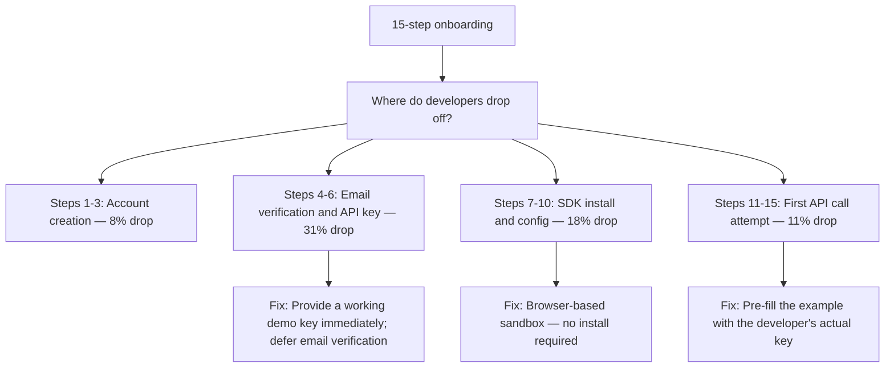

---

## Optimization 1 — Provide an Instant Demo Key

**Before:** Developer must create account → verify email → navigate to dashboard → generate key (Steps 1-6, minimum 15 minutes)

**After:** Developer lands on a "Try it now" page with a pre-generated demo key valid for 24 hours. No signup required for the first API call.

```text
Try it in 60 seconds — no signup needed

Here is a demo API key (expires in 24 hours):
  demo_key_abc123xyz

Make your first request using the interactive console below.
[Console pre-filled with the demo key and a working example]

[Button: Save this key to your account — sign up free]
```

**Impact:** Removes the email-verification drop-off entirely. Projected TTFV reduction: 47 minutes → under 10 minutes for the first interaction.

---

## Optimization 2 — Browser-Based Sandbox (No Install Required)

**Before:** Steps 7-10 require installing the SDK, configuring environment variables, and writing a local file before any API call is possible.

**After:** Embedded browser console on the documentation page where developers make real API calls without installing anything.

```text
Interactive Console — Try it without installing anything

Request:
  POST /v1/messages
  {
    "to": "+15551234567",
    "body": "Hello from the API"
  }

[Run Request]

Response:
  201 Created
  {
    "id": "msg_abc123",
    "status": "queued"
  }

[Download SDK]  [Copy to clipboard]  [Open in Postman]
```

**Impact:** Developers who succeed in the browser sandbox convert to SDK installation at 3x the rate of developers who try to install first.

---

## Optimization 3 — Progressive Disclosure of Steps

**Before:** All 15 steps displayed as one long page. Developers see the full complexity before they have any context.

**After:** Progressive onboarding — show only the next step. Display a progress indicator.

```text
Step 1 of 4 — [====        ] 25% complete

Make your first API call

[Pre-filled, working example with the developer's real key]

[Next: See your result in the dashboard →]
```

**Impact:** Reducing visible complexity increases completion rate. Each step completion is a micro-commitment that increases the probability of completing the next step.

---

## Optimization 4 — Audit Steps for Developer Value vs. Company Friction

For each step: "Does this create value for the developer, or does it create value for the company at the developer's expense?"

| Step | Purpose | Decision |
|---|---|---|
| Account creation | Required for persistence | Keep — move to after first success |
| Email verification | Spam prevention | Restructure — defer until first real API key needed |
| Credit card at signup | Revenue | Remove — delay until upgrade event |
| "How did you hear about us" survey | Marketing attribution | Remove from critical path — offer post-activation |
| Terms of service | Legal | Keep — make it a checkbox, not a wall of text |
| Intro video | Product education | Remove from critical path — link as optional |
| SDK download | Technical integration | Restructure — offer browser sandbox as first path |

---

## Before vs. After Metrics

| Metric | Before | After (Target) |
|---|---|---|
| Steps to first API call | 15 | 4 (progressive) |
| Time-to-first-value (TTFV) | 47 minutes | < 10 minutes |
| Onboarding completion rate | 32% | > 60% |
| Onboarding developer satisfaction | 5.1/10 | > 7.5/10 |
| "Can't get started" support tickets/month | 120 | < 40 |
| Signup-to-active-developer conversion (30-day) | 18% | > 35% |

---

## Exercises

1. Time yourself completing your current product's onboarding flow from scratch (incognito browser, fresh account). Record every point of friction. Compare your TTFV to the target above.
2. Review your last 30 "can't get started" support tickets. Categorize them by the step where the developer failed. Identify the single highest-impact fix.
3. Run a 5-person usability test of your onboarding. Watch without intervening. Write a friction log for each participant.
4. Audit all the steps in your onboarding against the developer-value vs. company-friction framework. Propose which to remove or defer.
5. Measure your 30-day signup-to-active-developer rate before and after implementing one optimization. Document the delta and present it as a business case.

---

## Exercise 6 — Generic Blog Post → Developer-Centric Narrative

**Before (underperforming):**

```text
Title: Introducing {{TOPIC_NAME}} Webhooks 2.0

We are excited to announce Webhooks 2.0, featuring improved reliability,
faster delivery, and a new management dashboard. This update represents
months of engineering work and reflects our commitment to world-class
developer infrastructure.

Key features:
- 99.95% delivery SLA (up from 99.9%)
- Average delivery: 200ms (down from 800ms)
- New Webhook Dashboard
- Retry config up to 10 attempts
```

**Diagnosis:**

| Problem | Impact |
|---------|--------|
| Company-centric framing ("we are excited," "months of work") | Developers care about what changes for them, not company effort |
| Feature list without context | "200ms vs 800ms" is meaningless without: what does this change in a real integration? |
| No code, no example | Developer cannot act on this — it is announcement, not education |
| Generic "Introducing..." title | Does not appear in any developer search query |

**After (optimized):**

```text
Title: Webhook Delivery Now 4x Faster — What Changes in Your Integration

If you have been logging silent failures or debugging delivery delays,
three things change for your integration today.

1. Delivery time: 800ms → 200ms
   If webhooks trigger user-facing actions (order confirmation, password reset),
   users see results 4x faster. No code changes required on your side.

2. Retry config: up to 10 attempts (was 3)
   Your receiver can now handle a 2-minute deploy window without losing events.
   [Working configuration example]

3. Webhook Dashboard: debug delivery failures in real time
   [Screenshot with annotation] — access at dashboard.{{product}}.com/webhooks

Do I need to change anything?
No code changes required for existing integrations.
To use the new retry config: [one-step migration]
```

**Predicted metric improvement:**

| Metric | Before | After (predicted) |
|--------|--------|------------------|
| Organic search sessions | Low — generic title, no keyword match | +150-200% — developer-centric title matches real queries |
| Click-through to docs | ~8% | ~25-35% — working example creates natural next step |
| SDK activation from post | Unmeasured | Measurable via UTM added to all CTAs |

---

## Exercise 7 — Community Health Optimization (Before/After)

**Before — community as support queue:**

| Metric | Value | Assessment |
|--------|-------|-----------|
| Messages per day | 45 | Low for 6,000 members |
| % questions answered | 38% | Below threshold (target: >80%) |
| DevRel answers (% of total) | 82% | Team doing almost all work — no flywheel |
| Median time to first response | 9 hours | Very slow — losing developers |
| New member posts within first week | 11% | Severe lurker problem |
| Member churn per month | 8% | High — not finding value |

**Optimization program (90 days):**

```text
Month 1 — Structure:
- Reorganize channels: separate #quick-questions / #deep-dives / #show-and-tell / #jobs
  [mixing support questions with project showcases suppresses both]
- Add #introduce-yourself with a structured template
  [new member activation ritual — reduces lurker ratio]
- Identify top 10 helpers; give them a "Community Helper" badge
  [recognition activates the esteem-need and encourages more helping]

Month 2 — Programs:
- Weekly "Build in Public" thread — members share what they're building
  [creates belonging without requiring DevRel to generate it]
- Monthly live office hours (60 min)
  [concentrates DevRel presence; creates urgency and scarcity]
- Automated DM to every new member within 24h, manually reviewed
  [first response to a new member is the highest-value engagement moment]

Month 3 — Accountability:
- Publish monthly community health report in #announcements
  [transparency builds trust and creates public accountability]
- Publicly thank top monthly helpers: "This month's MVP: [name] — answered 47 questions"
  [social recognition is the strongest driver of continued helpful behavior]
```

**After (90-day predicted results):**

| Metric | Before | After |
|--------|--------|-------|
| Messages per day | 45 | 140-180 (+3-4x) |
| % questions answered | 38% | 75-85% |
| DevRel answers (% of total) | 82% | 35-45% — flywheel working |
| Median time to first response | 9 hours | 2-3 hours |
| New member posts within first week | 11% | 35-45% |
| Member churn per month | 8% | 3-4% |

**Key insight:** Metrics improve not because DevRel spent more time, but because the program design shifted from "DevRel as support staff" to "DevRel as community architect."

---

## Optimization Principles Summary

| Principle | Application |
|-----------|-----------|
| **Lead with developer problem, not company announcement** | Reframe titles from "Introducing X" to "Here's what changes in your integration" |
| **Show result before explaining mechanism** | Working example first, explanation second — every tutorial, demo, and onboarding email |
| **Segment by behavior, not time** | Email sequences triggered by what developers have done (or not done), not by days since signup |
| **Peer-to-peer scales infinitely; DevRel labor does not** | Design programs that create conditions for community members to help each other |
| **Measure the bottleneck stage, not the stage you already win** | Organic sessions matter less than activation rate; optimize the highest drop-off point |
| **Specificity converts; generality does not** | "Build a production webhook receiver with retry logic" outperforms "learn about webhooks" |

</details>
