# Engineering Management Roadmap — Universal Template

> **A comprehensive template system for generating Engineering Management roadmap content across all skill levels.**

---

## Overview

| | Description |
|---|---|
| **Purpose** | Universal template for all Engineering Management roadmap topics |
| **Files per topic** | 9 files: `junior.md`, `middle.md`, `senior.md`, `professional.md`, `interview.md`, `tasks.md`, `find-bug.md`, `optimize.md`, `specification.md` |
| **Language** | All content must be generated in **English** |
| **Table of Contents** | **Optional** — include only if relevant to the topic. For practice files (`tasks.md`, `find-bug.md`, `optimize.md`) it is NOT required |

### Topic Structure

```
XX-topic-name/
├── junior.md          ← "What changes?" and "How to start managing?"
├── middle.md          ← "Why?" and "When to escalate?"
├── senior.md          ← "How to scale?" and "How to lead leaders?"
├── professional.md    ← "Mastery and Leadership Level"
├── interview.md       ← Interview prep across all EM levels
├── tasks.md           ← Hands-on management practice tasks
├── find-bug.md        ← Find and fix management anti-patterns (10+ exercises)
├── optimize.md        ← Optimize ineffective management practices (10+ exercises)
└── specification.md   ← Official spec / documentation deep-dive
```

---

## Level Comparison Matrix

| Aspect | Junior | Middle | Senior | Professional |
|:------:|:------:|:------:|:------:|:------------:|
| **Depth** | IC→EM transition, 1:1 basics, trust building | Perf management, difficult conversations, OKR design | Managing managers, org design, cross-functional leadership | Leadership philosophy, org dynamics, influence without authority |
| **Focus** | "What changes?" and "How?" | "Why?" and "When?" | "How to scale?" | "What kind of leader do I want to be?" |
| **Tricky Points** | Shifting from doing to enabling | Giving hard feedback, managing underperformers | Span of control, reorgs, cultural change | Politics, coalition building, systems thinking |
| **Output** | Healthy team basics, first feedback | Promotions, PIPs, hiring rubrics | Org design docs, skip-level strategy | Engineering excellence programs, culture change |

---
---

# TEMPLATE 1 — `junior.md`

<details open>
<summary><strong>Template Content</strong></summary>

# {{TOPIC_NAME}} — Junior Level

## Table of Contents

1. [Introduction](#introduction)
2. [Prerequisites](#prerequisites)
3. [Glossary](#glossary)
4. [Core Concepts](#core-concepts)
5. [IC→EM Transition](#icem-transition)
6. [1:1 Fundamentals](#11-fundamentals)
7. [Sprint Planning Basics](#sprint-planning-basics)
8. [Giving First Performance Feedback](#giving-first-performance-feedback)
9. [Understanding Team Health Signals](#understanding-team-health-signals)
10. [Building Trust](#building-trust)
11. [Example Frameworks/Templates](#example-frameworkstemplates)
12. [Real-World Analogies](#real-world-analogies)
13. [Pros & Cons](#pros--cons)
14. [Use Cases](#use-cases)
15. [Common Management Failure Modes](#common-management-failure-modes)
16. [Best Practices](#best-practices)
17. [Edge Cases & Pitfalls](#edge-cases--pitfalls)
18. [Common Mistakes](#common-mistakes)
19. [Tricky Points](#tricky-points)
20. [Test](#test)
21. [Tricky Questions](#tricky-questions)
22. [Cheat Sheet](#cheat-sheet)
23. [Summary](#summary)
24. [Further Reading](#further-reading)
25. [Related Topics](#related-topics)
26. [Diagrams & Visual Aids](#diagrams--visual-aids)

---

## Introduction

> Focus: "What changes when you become a manager?" and "How do you start?"

Brief explanation of what {{TOPIC_NAME}} means in the context of a new Engineering Manager.
Keep it grounded — assume the reader was recently a strong IC (individual contributor) who has just stepped into their first management role.

---

## Prerequisites

What you should understand before studying this topic:

- **Required:** {{IC experience}} — brief explanation of why strong IC foundations help
- **Required:** {{Basic communication skills}} — why listening and clarity matter immediately
- **Helpful but not required:** {{Mentorship or tech lead experience}}

> List 2-4 prerequisites. Link to related roadmap topics if available.

---

## Glossary

Key terms used in this topic:

| Term | Definition |
|------|-----------|
| **IC (Individual Contributor)** | An engineer who contributes through direct technical work, not through managing others |
| **1:1 (One-on-One)** | A recurring private meeting between a manager and a direct report |
| **Direct Report** | A team member whose work the manager is responsible for |
| **Sprint** | A fixed-length iteration (typically 2 weeks) used in Agile delivery |
| **Psychological Safety** | The belief that one can speak up, take risks, or make mistakes without fear of punishment |
| **Morale** | The collective mood, motivation, and sense of belonging on a team |
| **Blocker** | An issue that prevents a team member from making progress |
| **Burnout** | Chronic exhaustion from sustained overload or lack of autonomy/purpose |
| **{{Term}}** | Simple, one-sentence definition |

> 5-10 terms. Keep definitions beginner-friendly.

---

## Core Concepts

### Concept 1: {{name}}

Simple explanation with analogy if helpful.

### Concept 2: {{name}}

...

> Each concept: 3-5 sentences max. Use bullet points for lists.

---

## IC→EM Transition

### What Changes

When you move from IC to EM, your primary output shifts from code shipped to team capability built.

| Dimension | As IC | As EM |
|-----------|-------|-------|
| **Success metric** | Features delivered, PRs merged | Team velocity, people growing |
| **Primary output** | Working software | Healthy, productive team |
| **Time horizon** | This sprint | This quarter and next |
| **Leverage** | Your own skills | Multiplying team skills |
| **Feedback loop** | Immediate (tests pass/fail) | Delayed (people grow over months) |

### What Does NOT Change

- You still care deeply about technical quality.
- You still need to understand the system your team owns.
- You still need to earn trust — it is not granted by title.
- Your integrity, follow-through, and communication standards stay the same.

### The Biggest Danger: Doing Instead of Enabling

New managers frequently fall back into coding when the team struggles. This feels helpful but:
- Creates bottlenecks on you
- Signals low trust in your team
- Removes time you need for management work

```text
Danger Pattern:
  Team hits blocker → Manager writes the code → Problem solved short-term
  Long-term result → Team learns to wait for manager → Manager is overwhelmed

Healthy Pattern:
  Team hits blocker → Manager unblocks by removing obstacle, connecting people, clarifying requirements
  Long-term result → Team builds problem-solving capacity → Manager has leverage
```

---

## 1:1 Fundamentals

### Frequency

- **Weekly** is the default for new managers and new direct reports
- **Biweekly** may work for stable, senior engineers after trust is established
- Never cancel 1:1s — this signals that your reports are not a priority

### Agenda Structure

```text
1:1 Agenda Template (30 minutes)
─────────────────────────────────
[5 min]  Check-in: How are you doing personally? Anything on your mind?
[15 min] Their agenda: What do they want to discuss? (challenges, ideas, growth)
[5 min]  Your agenda: Context, feedback, or decisions you need to share
[5 min]  Action items + follow-up: Who does what before next 1:1?
```

> The 1:1 belongs to the direct report, not to the manager. It is not a status update meeting.

### Notes and Follow-through

- Keep a shared doc or private notes after every 1:1
- Write down action items with owners and due dates
- Begin every next 1:1 by reviewing previous action items
- Follow-through is how you build trust — missing commitments erodes it fast

---

## Sprint Planning Basics

As a new EM, your role in sprint planning shifts from contributing estimates to facilitating clarity:

- **Before planning:** Ensure the backlog is groomed and stories are well-defined
- **During planning:** Ask questions that surface ambiguity ("What's the definition of done here?")
- **After planning:** Confirm the team has realistic capacity (accounting for PTO, on-call, tech debt)
- **Your job is NOT to:** Assign tasks to individuals — let the team self-organize
- **Watch for:** Overcommitment (teams that always say yes) and under-commitment (teams padding too much)

```text
Sprint Health Checklist:
[ ] Stories have clear acceptance criteria
[ ] Team capacity accounts for non-coding work (reviews, incidents, meetings)
[ ] No single person is a dependency for critical path items
[ ] Team has agreed on the sprint goal, not just a task list
```

---

## Giving First Performance Feedback

### The SBI Framework (Situation-Behavior-Impact)

```text
S — Situation: When/where did this happen? (specific context)
B — Behavior: What did you observe? (factual, not interpretive)
I — Impact: What was the result of that behavior? (on team, product, user)

Example (positive):
"In yesterday's incident (S), you stayed calm and kept the team focused on the root cause (B).
We resolved it in 40 minutes instead of the usual 2 hours (I)."

Example (corrective):
"In last week's sprint review (S), you interrupted the PM twice mid-sentence (B).
It made her hesitant to share feedback in the session that followed (I)."
```

### Rules for First-Time Feedback

- Give feedback in private, never in public
- Give it soon after the observed behavior — not weeks later
- Be specific, not vague ("You communicate well" is not feedback)
- Separate the behavior from the person's identity
- Invite dialogue: "Does this match your experience?"

---

## Understanding Team Health Signals

### Morale Signals

| Signal | Healthy | Warning |
|--------|---------|---------|
| Meeting energy | People engage, ask questions | Silence, cameras off, monosyllabic answers |
| Peer help | Engineers help each other voluntarily | People siloed, hoard knowledge |
| Retrospectives | Team surfaces real issues | No issues raised, or same issues every sprint |
| Tenure | People stay and grow | High turnover or quiet quitting |

### Blocker Detection

- Are the same blockers appearing repeatedly? (systemic, not one-off)
- Are people raising blockers early or late? (trust signal)
- Do blockers get resolved or do they disappear silently? (accountability signal)

### Burnout Signals

- Declining quality of work (more bugs, less attention to detail)
- Missed deadlines that were previously easy to hit
- Withdrawal from team discussions
- Explicit statements of exhaustion or overwhelm

> Your job is not to fix all problems — it is to notice them early and respond with curiosity, not judgment.

---

## Building Trust

Trust is built through two mechanisms: **competence** (doing what you say you can do) and **care** (showing genuine interest in the person).

### Listening

- Ask open-ended questions ("What's making this hard?") not yes/no questions
- Do not interrupt or complete people's sentences
- Summarize what you heard before responding ("What I'm hearing is...")
- Silence is acceptable — give people space to think

### Following Through

```text
Trust Equation:
  Trust = (Follow-through on commitments) / (Promises made)

If you say you'll do something, do it.
If you cannot, update the person BEFORE the deadline — not after.
```

### Transparency

- Share context about org decisions, even when you cannot share all details
- Say "I don't know, but I'll find out" rather than making something up
- Admit your own mistakes to the team — this models the behavior you want

---

## Example Frameworks/Templates

### Weekly 1:1 Note Template

```text
Date: YYYY-MM-DD
Direct Report: {{Name}}
Manager: {{Name}}

Check-in:
  Their update:
  Energy level (1-5):

Their topics:
  1.
  2.

Manager topics:
  1.
  2.

Action items:
  [ ] {{Who}} — {{What}} — Due: {{Date}}
  [ ] {{Who}} — {{What}} — Due: {{Date}}

Notes for next time:
```

### Team Health Pulse (Monthly)

```text
Ask these questions anonymously or 1:1:
1. On a scale of 1-5, how clear are you on your priorities this month?
2. Do you feel supported by your manager? (1-5)
3. Is there anything blocking you that we haven't addressed?
4. What's one thing we could do better as a team?
```

---

## Real-World Analogies

| EM Concept | Analogy |
|---------|--------|
| **IC→EM transition** | A star chef who becomes a head chef — cooking less, but the kitchen's output improves because everyone around them gets better |
| **1:1 as direct report's meeting** | A doctor's appointment — you (the patient) set the agenda, the doctor (manager) helps diagnose and advise |
| **Follow-through builds trust** | A bank account — every kept promise is a deposit, every broken one is a withdrawal |
| **Morale signals** | Weather patterns — you cannot control the weather, but you can read it early and prepare |

---

## Pros & Cons

| Pros of {{TOPIC_NAME}} | Cons / Challenges |
|------------------------|-------------------|
| Higher leverage — impact through others | Loss of direct control over outcomes |
| Ability to shape team culture | Slower feedback loop than writing code |
| Career growth into leadership | Emotionally demanding — people bring their full complexity |
| Broader visibility into org strategy | Context-switching between many different concerns |

### When management is the right move:
- You find deep satisfaction in helping others grow
- You care about team dynamics, not just technical outcomes

### When to stay IC:
- Your energy comes from deep technical problem-solving
- People problems drain rather than engage you

---

## Use Cases

When these concepts apply in real scenarios:

- **Use Case 1:** First 1:1 with a new direct report — establish rapport and learn their working style
- **Use Case 2:** Sprint planning as a new EM — ensuring clarity without micromanaging
- **Use Case 3:** Noticing a team member becoming withdrawn — early intervention before burnout escalates
- **Use Case 4:** Delivering first piece of corrective feedback — using SBI to stay factual and kind

---

## Common Management Failure Modes

### Failure 1: The 1:1 That Becomes a Status Update

```text
❌ Anti-pattern:
Manager: "What did you ship this week?"
Report: "PR #42, reviewed PR #38, wrote the spec for X."
Manager: "Great. See you next week."

✅ Better:
Manager: "What's been on your mind this week — work or otherwise?"
Report: "Honestly, I'm a bit frustrated with the direction on X..."
[Real conversation begins]
```

### Failure 2: Vague Corrective Feedback

```text
❌ "You need to improve your communication."
✅ "In the last two sprint reviews, your updates have not included blockers until
   the end of the sprint. The PM found out about the delay through a Slack message,
   not from you directly. Let's talk about how to surface risks earlier."
```

### Failure 3: Giving Feedback in Public

Never correct behavior in a group setting. It triggers defensiveness and humiliates the person in front of peers. Always give corrective feedback 1:1.

---

## Best Practices

- **Default to listening:** In your first 90 days, spend more time asking questions than giving answers
- **Protect 1:1 time:** Never cancel — reschedule if necessary, but never drop
- **Follow through on every commitment:** Track your own action items as carefully as your team's
- **Separate urgency from importance:** Not every Slack ping requires immediate action
- **Ask for feedback on yourself:** "What's one thing I could do better as your manager?"

---

## Edge Cases & Pitfalls

### Pitfall 1: Over-Managing Senior Engineers

Senior ICs often need space, not guidance. Constant check-ins signal distrust and reduce their ownership.

**Fix:** Ask what kind of support they want — then provide that, not what you assume they need.

### Pitfall 2: Avoiding Difficult Conversations

New managers often delay corrective feedback hoping the issue resolves itself. It rarely does — and silence implies acceptance.

**Fix:** Give feedback within 48 hours of the observed behavior. Use SBI. Keep it short.

### Pitfall 3: Making Decisions Your Team Should Make

If the team can make the decision, let them. Your job is to set the decision criteria, not to decide for them.

---

## Common Mistakes

### Mistake 1: Filling Silence in 1:1s

New managers feel uncomfortable with silence and fill it by talking — turning the meeting into a monologue.

**Fix:** Ask one good question, then wait. Count to 10 internally before speaking again.

### Mistake 2: Praising in Generic Terms

"Great job this week" lands with no impact. Specific praise reinforces the exact behavior you want repeated.

**Fix:** Always name the behavior and its impact ("Your pre-mortem doc caught three risks we hadn't considered — that saved us a painful sprint").

### Mistake 3: Treating All Team Members Identically

Different people need different types of support. A new grad needs structure; a senior engineer needs autonomy.

---

## Common Misconceptions

### Misconception 1: "A good manager always has the answers"

**Reality:** The best managers ask better questions than they give answers. Your job is to help your team think, not to think for them.

### Misconception 2: "If I'm not coding, I'm not contributing"

**Reality:** Your contribution is now the health, growth, and output of your team. If they ship well and grow, you are succeeding — even if you haven't touched a line of code.

---

## Tricky Points

### Tricky Point 1: Authority vs. Influence

New managers assume their title gives them authority. In practice, trust and influence must be earned daily through your behavior, not assumed from org charts.

**Key takeaway:** Act as a leader before you feel like one — and earn the authority the title implies.

### Tricky Point 2: The "Player-Coach" Trap

Staying technical is valuable, but if you own critical path code, you become a bottleneck. Your team cannot ship when you are in meetings or on vacation.

---

## Test

### Multiple Choice

**1. What is the primary purpose of a 1:1 meeting?**

- A) Status update from direct report to manager
- B) A space for the direct report to discuss growth, challenges, and ideas
- C) Sprint review preparation
- D) Performance evaluation

<details>
<summary>Answer</summary>
**B)** — The 1:1 belongs to the direct report. It is a relationship and growth conversation, not a reporting mechanism.
</details>

**2. Which feedback method is most effective for a new manager?**

- A) General praise in team meetings
- B) Annual performance reviews
- C) SBI (Situation-Behavior-Impact) delivered 1:1 and soon after the event
- D) Peer feedback collected anonymously

<details>
<summary>Answer</summary>
**C)** — SBI is specific, factual, and timely. Proximity to the event makes feedback actionable.
</details>

### True or False

**3. A new manager should avoid coding entirely to signal they have fully transitioned into management.**

<details>
<summary>Answer</summary>
**False** — Staying technically engaged (code reviews, architecture input) maintains credibility and quality bar. The danger is owning critical path work, not staying technical.
</details>

### Scenario Question

**4. A team member has been quiet in the last three retrospectives and their PR quality has declined. What is the first action a new EM should take?**

<details>
<summary>Answer</summary>
Schedule a 1:1 and open with a genuine check-in ("How are you doing, really?"). Do not immediately jump to performance — first understand whether there is a personal, technical, or organizational issue driving the behavior. These are burnout warning signs, not performance signals.
</details>

> 5-8 test questions total. Mix of multiple choice, true/false, and scenario-based.

---

## Tricky Questions

**1. Your best engineer tells you they are thinking about leaving. Your first instinct is to offer them a raise. What is the more effective first step?**

- A) Immediately escalate to HR for a counter-offer
- B) Ask them what is driving their thinking before proposing any solution
- C) Offer the raise to show you value them
- D) Remind them of their unvested equity

<details>
<summary>Answer</summary>
**B)** — The reason behind the departure intent matters more than the surface fix. Money rarely is the root cause. Understanding their motivation (autonomy, growth, team, project) determines the real response.
</details>

---

## Cheat Sheet

| Situation | Action | Framework |
|-----------|--------|-----------|
| Running a 1:1 | Check-in → Their agenda → Your agenda → Actions | 1:1 template |
| Giving corrective feedback | Private, soon, specific, invite dialogue | SBI |
| Detecting burnout | Declining quality, withdrawal, missed dates | Morale signals |
| Sprint overcommitment | Review capacity, surface hidden work | Sprint health checklist |
| Building trust fast | Listen, follow through, admit mistakes | Trust equation |
| IC wanting to leave | Ask why before proposing solutions | Stay conversation |

---

## Summary

- The IC→EM shift is a change of leverage model, not just a title change
- 1:1s belong to the direct report and must be protected, not canceled
- Trust is built through consistent follow-through on every commitment
- Team health signals (morale, blockers, burnout) must be read early and responded to with curiosity
- Feedback must be specific (SBI), private, and timely to be effective

**Next step:** Once 1:1s are running well and the team trusts you, move to performance management and difficult conversations (middle.md).

---

## Further Reading

- **Book:** *The Manager's Path* by Camille Fournier — essential reading for new EMs
- **Book:** *Radical Candor* by Kim Scott — the foundational framework for giving honest, caring feedback
- **Article:** [Lara Hogan — Questions for our first 1:1](https://larahogan.me/blog/first-one-on-one-questions/) — a classic starter 1:1 agenda
- **Article:** [Julie Zhuo — The Making of a Manager](https://juliezhuo.com/) — reflection on the IC→EM transition

---

## Related Topics

- **[Performance Management](../performance-management/)** — next natural step after 1:1 fundamentals
- **[Team Dynamics](../team-dynamics/)** — deeper dive into morale and psychological safety
- **[Engineering Communication](../communication/)** — written and verbal communication for managers

---

## Diagrams & Visual Aids

### IC→EM Leverage Shift

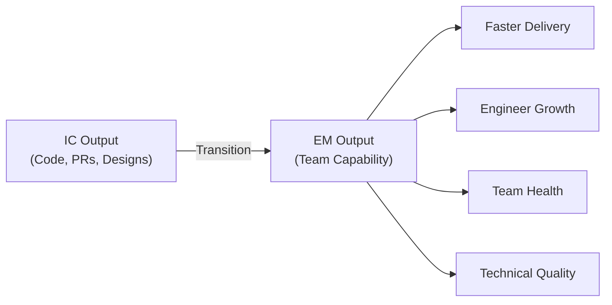

### 1:1 Agenda Flow

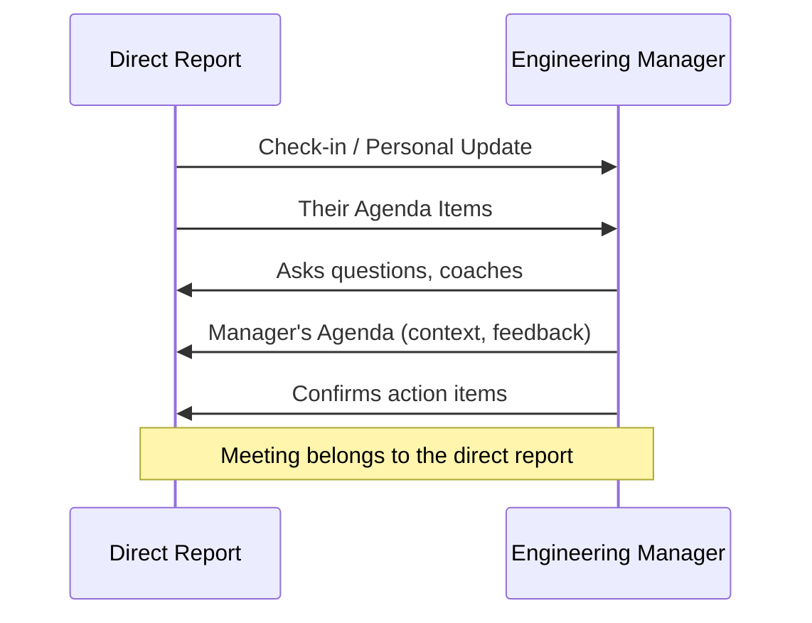

### Team Health Monitoring Loop

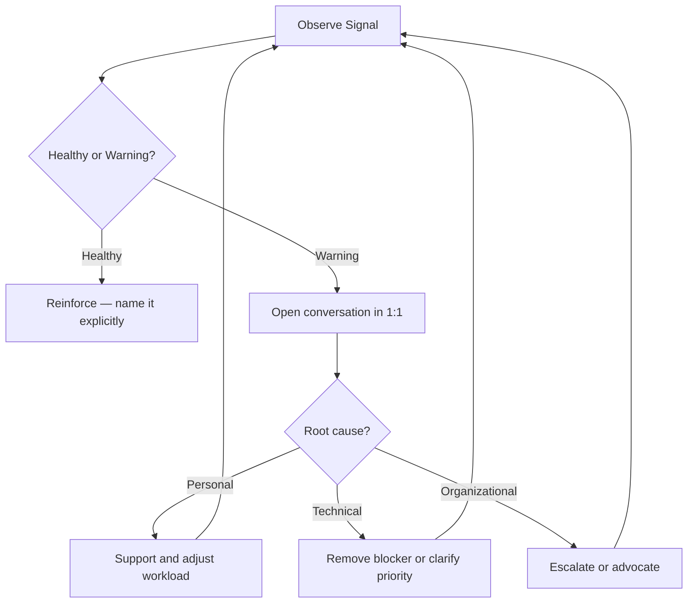

### Mind Map

```mermaid
mindmap
  root(({{TOPIC_NAME}}\nJunior EM))
    IC to EM
      What changes
      What stays
      Player-coach trap
    1:1s
      Frequency
      Agenda structure
      Follow-through
    Feedback
      SBI framework
      Private and timely
      Specific not vague
    Team Health
      Morale signals
      Blocker patterns
      Burnout detection
    Trust
      Listening
      Follow-through
      Transparency
```

</details>

---
---

# TEMPLATE 2 — `middle.md`

<details open>
<summary><strong>Template Content</strong></summary>

# {{TOPIC_NAME}} — Middle Level

## Table of Contents

1. [Introduction](#introduction)
2. [Core Concepts](#core-concepts)
3. [Performance Management](#performance-management)
4. [Difficult Conversations](#difficult-conversations)
5. [Delivery Management](#delivery-management)
6. [OKR Design](#okr-design)
7. [Hiring](#hiring)
8. [Team Health Frameworks](#team-health-frameworks)
9. [Example Frameworks/Templates](#example-frameworkstemplates)
10. [Pros & Cons](#pros--cons)
11. [Use Cases](#use-cases)
12. [Common Management Failure Modes](#common-management-failure-modes)
13. [Diagnosing Team Problems](#diagnosing-team-problems)
14. [Comparison with Alternative Management Frameworks](#comparison-with-alternative-management-frameworks)
15. [Best Practices](#best-practices)
16. [Edge Cases & Pitfalls](#edge-cases--pitfalls)
17. [Test](#test)
18. [Tricky Questions](#tricky-questions)
19. [Cheat Sheet](#cheat-sheet)
20. [Summary](#summary)
21. [Further Reading](#further-reading)
22. [Related Topics](#related-topics)
23. [Diagrams & Visual Aids](#diagrams--visual-aids)

---

## Introduction

> Focus: "Why?" and "When?"

Assumes the reader has been managing for 1-2 years and has 1:1s working well. This level covers:
- Managing people through growth, underperformance, and conflict
- Making delivery commitments and managing scope trade-offs
- Designing hiring processes and OKRs
- Understanding how team dynamics evolve over time

---

## Core Concepts

### Concept 1: {{Advanced management concept}}

Deeper explanation with real-world consequence if misunderstood.

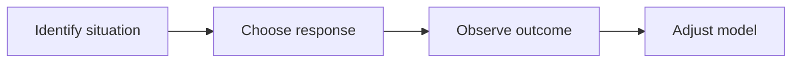

### Concept 2: {{Another concept}}

...

---

## Performance Management

### Growth Conversations

Growth conversations differ from performance reviews: they are forward-looking and should happen continuously, not quarterly.

```text
Growth Conversation Framework:
1. Where are you now? (current performance vs. expectations for level)
2. Where do you want to go? (career goals in 1-3 years)
3. What's the gap? (skills, behaviors, or scope needed)
4. What's the plan? (concrete actions, opportunities, timeline)
5. How will we know? (success criteria)
```

- Hold growth conversations at minimum quarterly, ideally monthly
- Document the plan and revisit it — don't let it become a one-time exercise
- Growth is your shared responsibility, not solely theirs

### Promotions

Promotion decisions should never be a surprise. Build the case over time:

- Identify the criteria for the next level (use your career ladder)
- Create opportunities for the engineer to demonstrate the next level's behaviors before promotion
- Collect evidence from peers, stakeholders, and incidents over the full cycle
- Present a written promotion case with specific examples to calibrate with your manager

### PIPs (Performance Improvement Plans)

A PIP is not a firing mechanism — it is a structured intervention. Use it when:
- Coaching and feedback have not produced change
- The gap is specific and measurable
- You are genuinely committed to the person improving

```text
PIP Structure:
[ ] Specific behaviors or outcomes that must change (measurable, observable)
[ ] Timeline (typically 30-60-90 days with checkpoints)
[ ] Support you will provide (more frequent 1:1s, training, pairing)
[ ] What success looks like
[ ] What happens if the plan is not met (stated clearly and honestly)
```

> Never use a PIP to document for termination. That is bad faith and destroys trust in the management chain.

---

## Difficult Conversations

### The COIN Framework

```text
C — Context: Set the scene (this is about a specific pattern, not a personal attack)
O — Observation: What you saw (factual, behavioral)
I — Impact: What resulted (on team, product, trust)
N — Next: What needs to change and what support is available
```

### Critical Feedback

```text
❌ "You're not a team player."
✅ "In the last two planning sessions, you've dismissed estimates from two junior
   engineers without asking them to walk through their reasoning. Three of your
   peers have mentioned feeling reluctant to speak up in planning now.
   I need you to change how you engage with the team's input."
```

### Conflict Between Team Members

1. Meet with each person separately first — understand both perspectives without taking sides
2. Identify the actual disagreement (technical? process? interpersonal?)
3. Bring both parties together only when you understand the root cause
4. Focus on behaviors and working agreements, not personalities

### Managing Underperformers

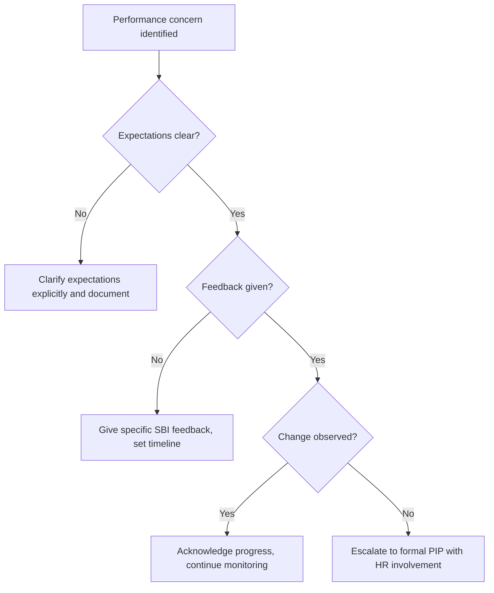

---

## Delivery Management

### Unblocking the Team

Your primary delivery job is to remove the obstacles your team cannot remove themselves:

| Blocker Type | Manager Action |
|-------------|---------------|
| **Dependency on another team** | Escalate to peer EM or Director; set timeline |
| **Unclear requirements** | Facilitate sync with PM; get written definition of done |
| **Technical uncertainty** | Create space for spike; timebox it |
| **Team member capacity** | Rescope, reprioritize, or bring in help |
| **Organizational decision needed** | Escalate with recommendation, not just problem |

### Escalation

Escalate when: you have tried your own resolution, the issue has a clear time cost, and you have a recommendation.

```text
Escalation Template:
Problem: [Specific issue blocking team]
Impact: [What we cannot ship and by when]
What I've tried: [Actions already taken]
My recommendation: [What I think should happen]
Decision needed by: [Date]
```

### Scope and Deadline Management

When scope and deadline are in conflict, surface the trade-off explicitly — never absorb it silently.

```text
Options framing (share with stakeholders):
Option A: Ship full scope, delay by 2 weeks
Option B: Ship on time, remove Feature X (can follow in v2)
Option C: Ship on time with Feature X in degraded state (technical debt accepted)

Your job: present the options with honest trade-offs, not absorb the impossibility yourself.
```

---

## OKR Design

### What Makes a Good OKR

- **Objective:** Qualitative, inspirational, time-bound — describes a desired state
- **Key Result:** Quantitative, measurable, binary-verifiable at end of quarter

```text
❌ Bad KR: "Improve system reliability"
✅ Good KR: "Reduce P1 incident rate from 4/month to 1/month by end of Q3"

❌ Bad KR: "Work on the mobile migration"
✅ Good KR: "Complete mobile checkout migration for 100% of users by October 1"
```

### OKR Design Principles

- Key Results measure outcomes (user impact, business metrics), not outputs (tasks completed)
- Aim for 60-70% attainment as a sign of appropriate stretch — 100% means the goal was too easy
- Limit to 3 objectives and 3-4 key results per objective per quarter
- Cascade OKRs: team KRs should demonstrably connect to org-level objectives

---

## Hiring

### Interview Design

Design interviews that test for the specific skills the role requires — not general "culture fit":

```text
Interview Panel Design (example for mid-level SWE):
Round 1: Technical screen — coding fundamentals
Round 2: System design — architecture thinking at scale
Round 3: Behavioral — collaboration, ownership, growth mindset
Round 4: Cross-functional — works well with PM/Design/Ops
Hiring manager: Values alignment, career fit, growth potential
```

### Debrief Process

```text
Debrief Rules:
1. Each interviewer submits independent written feedback BEFORE the debrief call
2. Debrief facilitator reads scores, then asks each interviewer to share independently
3. No one changes their vote because of social pressure — only new information
4. Leveling decision made separately from hire/no-hire decision
5. Document the decision rationale in writing
```

### Leveling Candidates

- Level to expectations, not to the candidate's current comp or title
- Use concrete rubric criteria (e.g., "designs systems with 2+ external dependencies")
- When in doubt, level down — it is easier to promote than to correct a mis-hire

---

## Team Health Frameworks

### Tuckman Stages

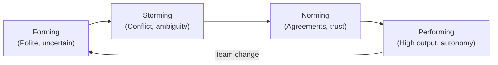

| Stage | Signs | Manager Focus |
|-------|-------|---------------|
| **Forming** | Politeness, lack of disagreement | Set clear norms and expectations |
| **Storming** | Conflict, frustration, ambiguity | Facilitate resolution; name what's happening |
| **Norming** | Growing trust, emerging agreements | Reinforce positive patterns |
| **Performing** | High output, self-organizing | Get out of the way; maintain context |

> Any significant team change (new member, reorg, new PM) can reset the team to Forming. This is normal.

---

## Example Frameworks/Templates

### Performance Review Template

```text
Engineer: {{Name}}
Period: {{Q/Year}}
Reviewer: {{Manager Name}}

1. Summary of impact this period (3-5 bullet points with specific examples)

2. Strengths demonstrated (with examples):
   -
   -

3. Areas for growth (with specific, observable behaviors):
   -
   -

4. Rating: [Below / Meeting / Exceeding] expectations for {{Level}}

5. Growth plan for next period:
   - Goal:
   - Success criteria:
   - Support from manager:
```

### Hiring Rubric (Behavioral)

```text
Dimension: Ownership and follow-through
Signal: Candidate describes specific instances of completing difficult work without being asked
Strong signal: "I noticed the monitoring gap after the incident and set up alerting before anyone asked"
Weak signal: "I always try to own my work"
Red flag: Cannot name a specific example
```

---

## Pros & Cons

| Approach | When It Works | When It Fails |
|----------|--------------|---------------|
| **Formal PIP** | Clear behavioral gap after coaching | Used as paper trail for termination — destroys trust |
| **Growth conversations** | Ongoing, forward-looking | Done only at review time — too late to adjust |
| **OKRs** | Outcome focus, shared direction | Lagging metrics only — teams have no leading indicators |
| **Structured debrief** | Reduces bias, consistent decisions | Skipped when hiring urgency is high |

---

## Use Cases

- **Use Case 1:** Mid-level engineer not growing into senior — initiate structured growth conversation with gap analysis
- **Use Case 2:** Two engineers in sustained conflict disrupting sprint ceremonies — apply conflict resolution steps above
- **Use Case 3:** Q4 deadline with too much scope — surface options framework to stakeholders immediately
- **Use Case 4:** Interview loop returning inconsistent feedback — audit interview design and add debrief process

---

## Common Management Failure Modes

### Failure 1: PIP as Punishment

Using a PIP after management has already decided to let someone go is bad faith. It destroys psychological safety for the whole team when people notice the pattern.

### Failure 2: Output-Focused OKRs

```text
❌ OKR: "Ship 5 new features by Q3" (output — measures activity)
✅ OKR: "Increase feature adoption from 40% to 70% by Q3" (outcome — measures impact)
```

### Failure 3: Consensus Hiring

Requiring everyone to love a candidate means you reject anyone unconventional. Strong candidates often elicit mixed responses. Evaluate against rubric, not gut feeling.

---

## Diagnosing Team Problems

### Low Velocity Diagnosis

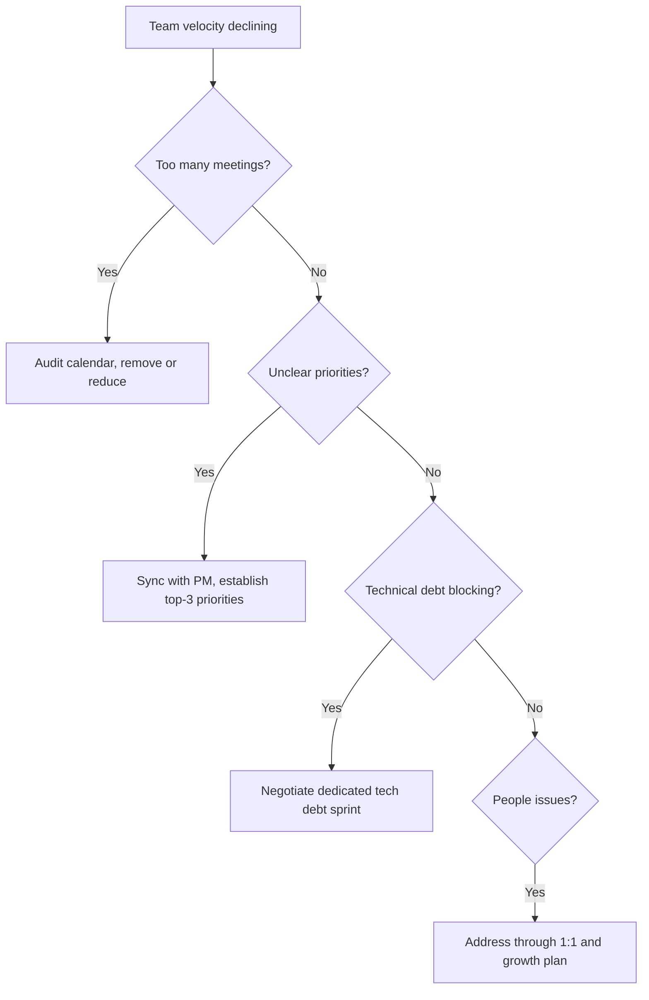

### Engagement Drop Diagnosis

Ask: What changed 4-6 weeks before the drop? Engagement drops are lagging indicators — the root cause happened earlier.

---

## Comparison with Alternative Management Frameworks

| Framework | Core Idea | Best For | Limitation |
|-----------|-----------|---------|------------|
| **Radical Candor** | Care personally + challenge directly | Feedback culture | Requires high trust baseline |
| **OKRs** | Outcomes over outputs | Direction alignment | Overhead if not kept simple |
| **Tuckman** | Teams evolve through predictable stages | Diagnosing team state | Linear model — real teams cycle |
| **COIN** | Structured difficult conversation | Critical feedback | Can feel scripted without practice |
| **SBI** | Specific behavioral feedback | All feedback situations | Misses emotional/motivational root cause |

---

## Best Practices

- **Give feedback continuously:** Do not save it for the review cycle — it is too late to be useful
- **Make trade-offs explicit:** Never absorb deadline-scope conflicts — surface them with options
- **Design for the rubric:** Know what you are hiring for before the first interview
- **Treat team stage as dynamic:** A reorg can reset a performing team to forming overnight
- **OKRs are not task lists:** If your KRs are just completed features, redesign them

---

## Edge Cases & Pitfalls

### Pitfall 1: Starting a PIP Without HR Alignment

PIPs without HR sign-off create legal and process risk. Involve HR before the conversation, not after.

### Pitfall 2: OKR Sandbagging

If engineers always hit 100% of KRs, they were not stretch goals. Coach the team toward 60-70% attainment as the healthy target.

### Pitfall 3: Mistaking Norming for Performing

A polite, agreeable team is not necessarily high-performing. Healthy conflict (creative abrasion) is a feature, not a bug.

---

## Test

**1. A key result reads: "Complete migration of auth service by Q3." What is wrong with this KR?**

<details>
<summary>Answer</summary>
It is an output (a task), not an outcome (measurable business or user impact). A better KR: "Reduce auth service error rate from 2% to 0.1% by migrating to the new service by Q3."
</details>

**2. An engineer has received the same feedback about communication for three consecutive months with no change. What is the next step?**

<details>
<summary>Answer</summary>
Escalate to a formal structure: involve HR and create a PIP with specific measurable behaviors, a timeline, support commitments, and explicit consequences. Repeated feedback without change means coaching alone is insufficient.
</details>

---

## Tricky Questions

**1. Your team is in the "Storming" stage. A senior engineer asks you to "just make a decision and stop the arguing." What do you do?**

- A) Make the decision to stop the conflict
- B) Acknowledge the frustration, facilitate the disagreement, and help the team reach agreement themselves
- C) Escalate to your director
- D) Let the team self-resolve without any manager involvement

<details>
<summary>Answer</summary>
**B)** — Storming is a healthy stage. Making the decision for the team short-circuits the norming process and creates dependency. Your role is facilitator, not decider.
</details>

---

## Cheat Sheet

| Situation | Tool | Key Question |
|-----------|------|-------------|
| Performance concern | Growth conversation + SBI | "Are expectations clear?" |
| No change after feedback | PIP (with HR) | "Is this a will or skill issue?" |
| Scope/deadline conflict | Options framing | "What are the trade-offs?" |
| Hiring decision | Structured debrief + rubric | "Does evidence support hire at this level?" |
| Team conflict | Separate 1:1s → joint session | "What is the actual disagreement?" |
| Team seems low energy | Tuckman + morale signals | "What stage are we in?" |

---

## Summary

- Performance management is continuous, not periodic — growth conversations happen every quarter minimum
- Difficult conversations get easier with structure (COIN, SBI) and practice — avoidance makes them harder
- Delivery management means unblocking and surfacing trade-offs, not absorbing impossible constraints
- OKRs should measure outcomes, not outputs — 60-70% attainment is the right target
- Hiring rigor (rubric, structured debrief) reduces bias and improves team quality

**Next step:** Once you can manage performance and delivery reliably, study scaling through other managers and org design (senior.md).

---

## Further Reading

- **Book:** *Radical Candor* by Kim Scott — critical for difficult conversation framework
- **Book:** *Work Rules!* by Laszlo Bock — Google's data-driven hiring and performance approach
- **Article:** [Will Larson — Setting Organizational Direction](https://lethain.com/) — OKR and strategy design
- **Article:** [Tuckman Stages in Engineering Teams](https://www.teamwork.com/blog/tuckman-stages/) — applying the model practically

---

## Related Topics

- **[Senior EM](../senior/)** — managing managers and org design
- **[Hiring and Interviewing](../hiring/)** — dedicated topic on full-cycle recruiting
- **[Technical Strategy](../technical-strategy/)** — connecting delivery to engineering direction

---

## Diagrams & Visual Aids

### Performance Management Loop

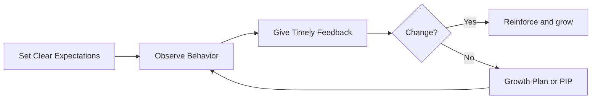

### Tuckman Stages with Team Events

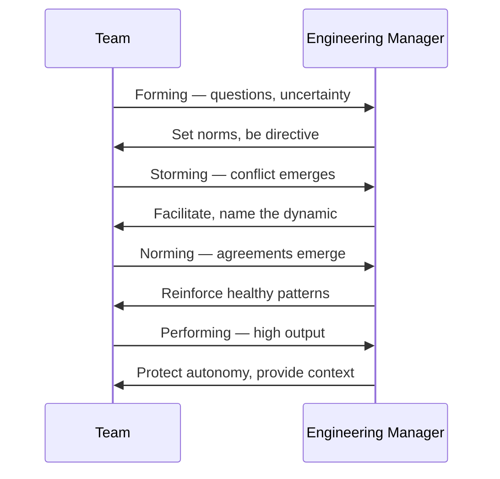

</details>

---
---

# TEMPLATE 3 — `senior.md`

<details open>
<summary><strong>Template Content</strong></summary>

# {{TOPIC_NAME}} — Senior Level

## Table of Contents

1. [Introduction](#introduction)
2. [Managing Managers](#managing-managers)
3. [Engineering Org Design](#engineering-org-design)
4. [Cross-Functional Leadership](#cross-functional-leadership)
5. [Technical Strategy Alignment](#technical-strategy-alignment)
6. [Hiring at Scale](#hiring-at-scale)
7. [Reorgs](#reorgs)
8. [Driving Cultural Change at Scale](#driving-cultural-change-at-scale)
9. [Example Frameworks/Templates](#example-frameworkstemplates)
10. [Common Management Failure Modes](#common-management-failure-modes)
11. [Diagnosing Team Problems](#diagnosing-team-problems)
12. [Comparison with Alternative Management Frameworks](#comparison-with-alternative-management-frameworks)
13. [Best Practices](#best-practices)
14. [Edge Cases & Pitfalls](#edge-cases--pitfalls)
15. [Test](#test)
16. [Tricky Questions](#tricky-questions)
17. [Cheat Sheet](#cheat-sheet)
18. [Summary](#summary)
19. [Further Reading](#further-reading)
20. [Related Topics](#related-topics)
21. [Diagrams & Visual Aids](#diagrams--visual-aids)

---

## Introduction

> Focus: "How to scale?" and "How to lead leaders?"

Assumes the reader manages 2+ managers or leads an engineering function of 20+ engineers. This level covers:
- Multiplying impact through other managers
- Designing the org structure itself as a strategic tool
- Influencing Product, Design, Data, and Legal without authority over them
- Shaping technical direction at the organization level
- Managing the disruption of reorgs and cultural shifts

---

## Managing Managers

### Skip-Level Meetings

Skip-levels are 1:1s with your manager's direct reports (engineers who report to managers who report to you). They are not surveillance — they are a signal channel.

```text
Skip-Level Best Practices:
[ ] Hold them quarterly (or when you sense signal loss)
[ ] Make clear to the manager IN ADVANCE that you are holding them
[ ] Assure reports that you will not share specifics with their manager
[ ] Ask about: team health, blockers, career support, org clarity
[ ] Share themes (not names) with the manager afterward
[ ] Do NOT use skip-levels to override your managers' decisions
```

### Calibration

Calibration is the process of aligning performance ratings across teams so that "Exceeds" means the same thing regardless of which manager wrote the review.

- Run calibration sessions with all your managers before ratings are finalized
- Use a forced distribution as a starting point, not an endpoint
- Challenge outliers in both directions — your job is consistency and fairness across the org
- Document the calibration rationale to reduce bias over time

### Coaching Your Managers

Your most leveraged activity is making your managers better managers.

```text
Manager Coaching Loop:
1. Observe their team (skip-levels, team health signals, delivery outcomes)
2. Share observations in your 1:1 with them
3. Ask coaching questions ("What do you think is driving that?")
4. Offer frameworks, not prescriptions ("Have you considered the Tuckman lens here?")
5. Give them autonomy to solve their own problems — resist solving for them
```

---

## Engineering Org Design

### Team Sizing

- **Minimum viable team:** 3 engineers (below this, single points of failure and no peer review)
- **Optimal team:** 5-8 engineers (Amazon's "two-pizza rule")
- **Maximum before splitting:** 10-12 engineers (communication overhead compounds above this)
- **Span of control for EM:** 5-8 direct reports is sustainable; above 10 is a red flag

### Team Topology Choices

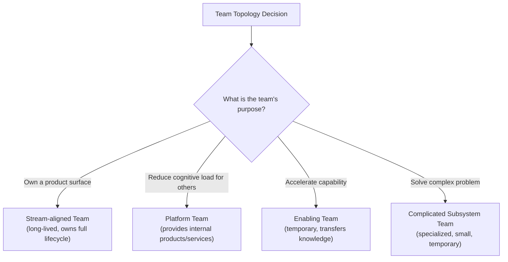

| Team Type | Size | Lifespan | Owns |
|-----------|------|----------|------|
| Stream-aligned | 5-8 | Long-lived | A user journey or domain |
| Platform | 4-6 | Long-lived | Internal developer platform |
| Enabling | 2-3 | Temporary | Knowledge transfer, not delivery |
| Complicated subsystem | 3-5 | Project-based | Specialized component |

### Span of Control

```text
Span of control thresholds:
  < 5 direct reports: Manager likely doing IC work — may be under-leveraged
  5-7 direct reports: Optimal — enough signal, enough attention per person
  8-10 direct reports: Survivable but stressful — 1:1 quality degrades
  > 10 direct reports: Unsustainable — hire another manager or restructure
```

---

## Cross-Functional Leadership

### Working with Product

- Establish shared planning rituals (joint quarterly planning, weekly eng-PM sync)
- Make engineering constraints visible early ("We cannot scope this under 6 weeks")
- Advocate for technical investment as business value, not tech for tech's sake
- Disagree in private with the PM — align publicly once a decision is made

### Working with Design

- Include design in architecture decisions that affect user experience at scale
- Protect design's time in sprint — do not treat design reviews as optional
- Create a shared definition of "design ready" before engineering begins

### Working with Data and Legal

| Partner | What They Need From You | What You Need From Them |
|---------|------------------------|------------------------|
| **Data** | Access to systems; schema stability | Instrumentation guidance; metric definitions |
| **Legal** | Privacy impact assessments; data retention plans | Regulatory constraints early in design |
| **Security** | Threat model input; secure design reviews | Vulnerability triage SLAs |

---

## Technical Strategy Alignment

### Your Role

As a senior EM, you translate between business strategy and technical choices. You do not make all technical decisions — you ensure the right people make decisions with the right context.

```text
Technical Strategy Document (outline):
1. Where we are (current state of the system — objectively)
2. Where we need to be (required state in 12-18 months, driven by business goals)
3. The gap (what is missing — capabilities, reliability, scalability)
4. The approach (high-level architectural direction — not a sprint plan)
5. Trade-offs (what we are choosing NOT to do and why)
6. Investment ask (headcount, quarters, risk)
```

### Alignment Process

- Present the strategy to your engineering staff first — get technical buy-in
- Then align with Product and Design on the product implications
- Then present to leadership as a business decision, not a technical one
- Revisit quarterly — strategy without review becomes stale

---

## Hiring at Scale

### Pipeline Design

At scale, hiring becomes a system, not a series of individual decisions.

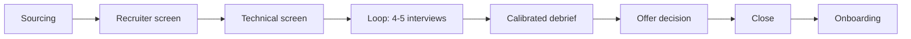

- Track conversion rate at each stage — drop-offs reveal where your process breaks
- Set a hiring committee standard (consistent bar across all interviewers)
- Measure offer acceptance rate — low acceptance signals employer brand or offer competitiveness issues

### Employer Brand

- Your team's work being visible externally (blog posts, conference talks, open source) reduces sourcing cost
- Engineers who had a great interview experience become brand ambassadors even if they decline
- A broken interview process is a brand liability — fix it before scaling it

---

## Reorgs

Reorgs are high-disruption events. Treat them as a project with a communication plan.

```text
Reorg Checklist:
[ ] Clarify the business problem the reorg is solving (if you cannot, don't do it)
[ ] Design for team cognitive load — minimize cross-team dependencies
[ ] Plan manager transitions before announcing changes to ICs
[ ] Communicate simultaneously to all affected parties (no one hears secondhand)
[ ] Give people time to process before requiring decisions
[ ] Establish new team norms within the first 30 days post-reorg
[ ] Run a retrospective on the reorg itself 90 days after
```

> Expect a Tuckman reset. Every team affected by a reorg returns to Forming regardless of how experienced they are.

---

## Driving Cultural Change at Scale

Cultural change cannot be mandated — it must be modeled and reinforced through systems.

```text
Cultural Change Pattern:
1. Name the behavior you want (specific, observable, not a value)
2. Model it yourself first — leaders go first
3. Create structural support (rituals, processes that make the behavior easier)
4. Recognize examples publicly when you see them
5. Remove structural barriers to the behavior (blockers that make the old behavior easier)
6. Be patient — culture changes at the speed of trust, not the speed of decree
```

---

## Example Frameworks/Templates

### Skip-Level Agenda

```text
Skip-Level 1:1 Template (30 min, quarterly)
─────────────────────────────────────────────
Opening: "This is a space for you — I'm not sharing specifics with [manager name]."
1. How are you doing? Anything on your mind personally or professionally?
2. How's the team feeling to you — morale, direction clarity?
3. What's your manager doing well that you'd like to see more of?
4. Is there anything that's getting in the way of your best work?
5. What's one thing you'd like to be different about how the org works?
Action: Note themes (not names). Share aggregate patterns with manager.
```

### Org Design Decision Framework

```text
Before restructuring a team, ask:
[ ] What user/business problem is this team solving?
[ ] Does the team have end-to-end ownership of that problem?
[ ] What are the inter-team dependencies — are we reducing them?
[ ] Do the team members have the skills needed?
[ ] What is the cognitive load of this team (number of domains they own)?
[ ] Who is the EM and do they have sufficient context and span?
```

---

## Common Management Failure Modes

### Failure 1: Solving Manager Problems Directly

When you manage managers, going directly to their ICs to solve problems bypasses your manager's authority and undermines their credibility. Coach the manager, do not replace them.

### Failure 2: Reorg Without Business Justification

Reorgs driven by "it makes sense structurally" without a clear business problem create disruption for no gain. Always answer: "What gets better after this reorg and how will we know?"

### Failure 3: Technical Strategy as a Static Document

A strategy that is not revisited quarterly becomes a relic. Assign an owner and a review cadence at the time of creation.

---

## Diagnosing Team Problems

### Signal Loss When Managing Managers

```text
Signs you have signal loss:
- You hear about incidents from stakeholders before your managers tell you
- Skip-levels reveal issues that manager 1:1s did not surface
- Team health metrics diverge from manager's reported status
- Attrition spikes in a team whose manager says "everything is fine"

Remediation:
- Increase skip-level frequency temporarily
- Review team health metrics with manager explicitly
- Coach manager on transparency and early escalation
```

---

## Comparison with Alternative Management Frameworks

| Framework | What It Says | Senior EM Application |
|-----------|-------------|----------------------|
| **Team Topologies** | Structure teams around flow, not function | Use to design low-dependency org structure |
| **Accelerate (DORA metrics)** | Delivery performance predicts org performance | Use deployment frequency, MTTR as org health signals |
| **Situational Leadership** | Adapt style to the maturity of the follower | Apply to coaching managers at different stages |
| **Systems Thinking** | Problems are systemic, not individual | Use for cultural change — change the system, not just behavior |

---

## Best Practices

- **Coach, do not replace:** When a manager struggles, coach them — do not solve for them
- **Design orgs for flow:** Teams should minimize dependencies and maximize autonomous delivery
- **Make technical strategy a business document:** Leadership buys investment in outcomes, not architecture
- **Communicate reorgs simultaneously:** No one should hear about structural changes secondhand
- **Model the culture you want:** You cannot mandate behavior you do not exhibit yourself

---

## Edge Cases & Pitfalls

### Pitfall 1: Uniform Span of Control

Not all manager roles are the same. A manager of senior engineers who need autonomy can handle more reports than a manager of a new team in a complex domain. Set span by context, not formula.

### Pitfall 2: Employer Brand Neglect

Hiring quality and sourcing cost are directly tied to your team's external reputation. If engineers cannot describe their team's work in a way that excites peers, pipeline suffers.

---

## Test

**1. A skip-level reveals that a team's morale is significantly lower than what the manager has been reporting to you. What are the next steps, in order?**

<details>
<summary>Answer</summary>
1. Do not confront the manager with "your team told me X" — protect the skip-level relationship. 2. Bring the topic to your 1:1 with the manager using your own framing ("I've been paying attention to team signals and want to discuss morale"). 3. Ask coaching questions to surface their awareness. 4. Share your observations (without sources) and agree on a plan. 5. Follow up in 4-6 weeks to see if signals change.
</details>

**2. Your eng org has 12 engineers and 1 EM. What is the structural problem and how would you fix it?**

<details>
<summary>Answer</summary>
12 reports is unsustainable for one EM — 1:1 quality degrades and team health signal is lost. Fix: hire a second EM and split the team into two, likely along domain or product surface lines. Alternatively, promote a strong senior engineer to tech lead to reduce coordination load temporarily while you hire.
</details>

---

## Tricky Questions

**1. Your best manager wants to reorg their team structure without a clear business justification. They say "it just makes more sense." How do you respond?**

- A) Allow it — they know their team best
- B) Block it — reorgs require director approval
- C) Ask them to document the business problem the reorg solves, then decide together
- D) Offer your own reorg design instead

<details>
<summary>Answer</summary>
**C)** — Reorgs create disruption. The bar for that disruption is a clear business problem that the new structure solves better than the current one. If they cannot articulate it, the reorg is premature.
</details>

---

## Cheat Sheet

| Situation | Tool | Key Question |
|-----------|------|-------------|
| Managing a struggling manager | Coaching loop (observe → ask → offer framework) | "What do they think is causing it?" |
| Org growing past 8 per team | Team split decision framework | "What is each team's user/domain?" |
| Cross-functional conflict | Joint working agreement / decision rights | "Who decides, who is consulted, who is informed?" |
| Reorg planning | Reorg checklist | "What problem does this solve and how will we know?" |
| Signal loss | Skip-levels + attrition data | "What are the team telling me vs. what is my manager reporting?" |
| Technical strategy | Strategy doc outline | "What business outcome does this enable?" |

---

## Summary

- Managing managers requires a different set of skills: coaching, signal detection, calibration, and org design
- Team topology choices are strategic decisions — structure determines flow and cognitive load
- Cross-functional leadership relies on influence and shared goals, not authority
- Reorgs must solve a business problem — pure structural tidying is rarely worth the disruption
- Cultural change happens through modeling, systems, and patience — not mandates

**Next step:** Once you manage managers effectively and can design orgs, study leadership philosophy and organizational dynamics (professional.md).

---

## Further Reading

- **Book:** *An Elegant Puzzle* by Will Larson — org design and systems thinking for engineering leaders
- **Book:** *Team Topologies* by Skelton and Pais — structural design of engineering teams
- **Book:** *Accelerate* by Forsgren, Humble, Kim — DORA metrics and delivery performance
- **Article:** [Camille Fournier — The Manager's Path, Chapter 7-8](https://www.oreilly.com/library/view/the-managers-path/9781491973882/) — managing managers

---

## Related Topics

- **[Professional EM](../professional/)** — leadership philosophy and organizational mastery
- **[Org Design](../org-design/)** — dedicated topic on team topology and structure
- **[Technical Strategy](../technical-strategy/)** — engineering direction at org level

---

## Diagrams & Visual Aids

### Managing Managers Structure

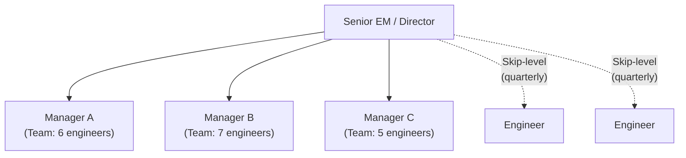

### Team Topology Decision Tree

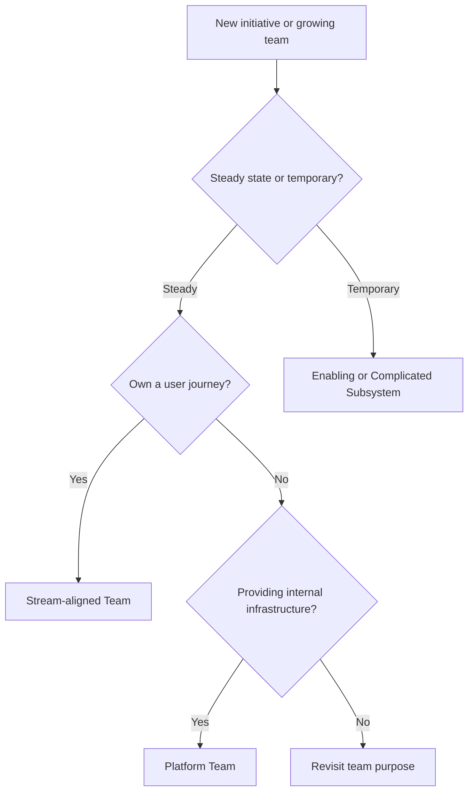

### Reorg Communication Plan

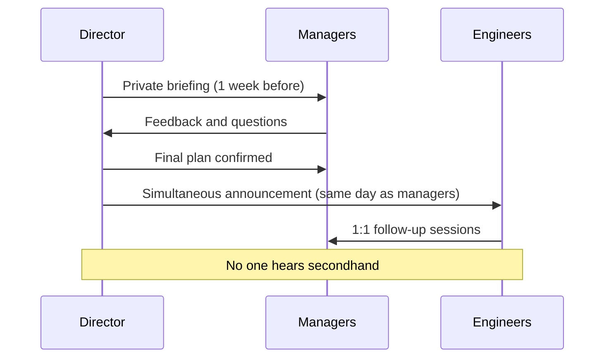

</details>

---
---

# TEMPLATE 4 — `professional.md`

<details open>
<summary><strong>Template Content</strong></summary>

# {{TOPIC_NAME}} — Mastery and Leadership Level

## Table of Contents

1. [Introduction](#introduction)
2. [Leadership Philosophy](#leadership-philosophy)
3. [Organizational Dynamics](#organizational-dynamics)
4. [Influence Without Authority](#influence-without-authority)
5. [Building Systems Not Just Skills](#building-systems-not-just-skills)
6. [Measuring Mastery](#measuring-mastery)
7. [Psychological Frameworks](#psychological-frameworks)
8. [Case Studies](#case-studies)
9. [Example Frameworks/Templates](#example-frameworkstemplates)
10. [Common Management Failure Modes](#common-management-failure-modes)
11. [Diagnosing Team Problems](#diagnosing-team-problems)
12. [Comparison with Alternative Management Frameworks](#comparison-with-alternative-management-frameworks)
13. [Best Practices](#best-practices)
14. [Edge Cases & Pitfalls](#edge-cases--pitfalls)
15. [Test](#test)
16. [Tricky Questions](#tricky-questions)
17. [Cheat Sheet](#cheat-sheet)
18. [Summary](#summary)
19. [Further Reading](#further-reading)
20. [Related Topics](#related-topics)
21. [Diagrams & Visual Aids](#diagrams--visual-aids)

---

## Introduction

> Focus: "What kind of leader do I want to be?" and "How do I build a system that outlasts me?"

At the mastery level, the question shifts from "how do I manage well?" to "how do I build an organization that manages well without me being in every room?" This level covers leadership philosophy, organizational power dynamics, influence without authority, and the engineering systems that compound over time.

---

## Leadership Philosophy

### Servant Leadership as Force Multiplier

Servant leadership is not softness — it is the recognition that your primary job is to remove obstacles from the people doing the work. Every hour you spend making your team's work clearer, faster, or safer multiplies across the entire team's output.

```text
Force Multiplier Model:
  Manager effort on self = 1x output
  Manager effort on one engineer = 1x + that engineer's multiplied output
  Manager effort on org systems = 1x + every engineer in the org's multiplied output

The most leveraged investments:
  → Career ladders (clarity for every engineer's growth)
  → Onboarding programs (every new hire ramps faster)
  → Engineering excellence programs (quality improves across all teams)
  → Mentorship systems (knowledge compounds rather than siloes)
```

### Psychological Safety as Foundation

Amy Edmondson's research demonstrates that teams with high psychological safety learn faster, recover from failures faster, and produce better outcomes. As a senior leader, you set the psychological safety ceiling for your entire org.

- If you punish honest failure, people stop trying risky things — and stop telling you the truth
- If you reward blame-free post-mortems, you get accurate incident data and faster system improvement
- If you model vulnerability (admitting uncertainty, asking for help), your managers will too

### How Great EMs Think About Their Role

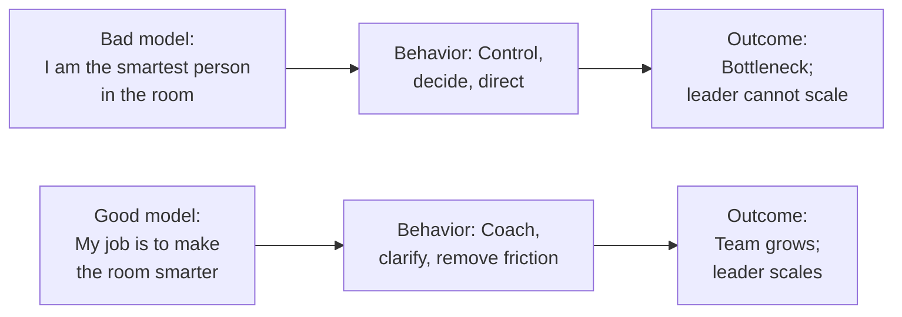

---

## Organizational Dynamics

### Power Dynamics in Engineering Orgs

Engineering orgs have multiple, overlapping power structures:
- **Formal authority:** Org chart — who reports to whom
- **Technical authority:** Who is trusted as the technical decision-maker (often a Principal or Staff engineer)
- **Informal authority:** Who do people go to for advice, who sets cultural norms
- **Resource authority:** Who controls headcount, roadmap, and budget

> Effective leaders understand that formal authority is the weakest form. They invest in technical credibility, informal influence, and resource stewardship.

### Navigating Politics

"Politics" is often used to mean "decisions that do not go my way." More precisely, it means navigating competing interests without a clear technical right answer.

```text
Navigating Org Politics:
1. Understand other stakeholders' incentives — not just their stated positions
2. Build relationships before you need them — not when you are in conflict
3. Find shared objectives: "We both want X — here is how this decision helps X"
4. Disagree privately before raising conflicts publicly
5. When you cannot get alignment, escalate with a clear recommendation — do not just escalate the problem
```

### Managing Up and Laterally

- **Managing up:** Keep your manager informed before they ask; bring problems with recommendations; flag risks early with mitigation plans
- **Managing laterally:** Build peer relationships through shared wins, not just shared problems; invest in your peer EMs' success — your orgs are interdependent

---

## Influence Without Authority

### Driving Engineering Culture Change Without Mandate

Culture cannot be imposed — it must be grown. Mandates create compliance, not culture.

```text
Culture Change Without Authority:
1. Identify early adopters — find 2-3 engineers/managers who already embody the desired behavior
2. Give them visibility — put them in front of others in demos, talks, retrospectives
3. Create structural support — make the new behavior easy (templates, tooling, rituals)
4. Tell the story — name what you are building toward and why it matters
5. Measure it — what gets measured signals what is valued
6. Be patient — culture changes at the speed of trust, not the speed of decree
```

### Making the Case with Data

Data-driven influence works because it removes "I think" from the conversation and replaces it with "the evidence shows."

```text
Data Influence Pattern:
Problem statement: "Our onboarding time is 6 weeks — industry average is 3."
Evidence: Onboarding survey scores, time-to-first-commit data, manager anecdotes
Hypothesis: "Structured mentorship and clearer documentation will halve ramp time"
Proposed experiment: "Run the new onboarding program for the next 2 new hires and measure"
Expected ROI: "2 engineers × 3 weeks faster = 6 engineer-weeks of capacity gained per hire"
```

### Peer Influence

- Share your frameworks generously — EMs who hoard knowledge have limited influence
- Offer to co-lead cross-org initiatives rather than waiting to be asked
- Give credit visibly and frequently — it builds goodwill faster than almost anything else

---

## Building Systems Not Just Skills

### Engineering Excellence Programs

An engineering excellence program is a set of org-level investments that raise the baseline quality and velocity for all teams:

```text
Engineering Excellence Program Components:
[ ] Engineering standards document (coding, testing, security, API design)
[ ] Technical review process (architecture review for significant changes)
[ ] On-call and incident management program (runbooks, SLAs, post-mortem culture)
[ ] Developer experience investments (CI/CD, tooling, test infrastructure)
[ ] Tech debt tracking (visibility into debt and a defined investment model)
```

### Career Ladders

A career ladder removes ambiguity from growth. It tells engineers exactly what behaviors and impact are expected at each level.

```text
Effective Career Ladder Criteria:
[ ] Each level is differentiated by scope and impact, not just seniority
[ ] Criteria are observable behaviors (e.g., "designs systems with 3+ external dependencies")
       not attributes (e.g., "is a senior engineer")
[ ] Ladder is calibrated across teams so "Senior" means the same everywhere
[ ] Updated at least annually to reflect how the org has grown
```

### Promotion Process Design

```text
Healthy Promotion Process:
1. Engineer and manager co-author promotion case (removes surprise, builds ownership)
2. Evidence collected over 6+ months — not from one impressive project
3. Calibration committee reviews all cases at the same level
4. Feedback given to all candidates — not just those promoted
5. Promotions announced in a consistent, respectful way
```

### Mentorship Programs

Structured mentorship programs scale knowledge transfer beyond what any individual manager can do.

```text
Mentorship Program Structure:
[ ] Matching criteria (skill gap, not just "find someone senior")
[ ] Defined time commitment (e.g., 1 hour biweekly for 6 months)
[ ] Goal-setting session at the start (mentee owns the agenda)
[ ] Mid-point check-in with program coordinator
[ ] Closing retrospective: what changed? what evidence exists?
[ ] Alumni network: mentees become mentors in the next cohort
```

### Onboarding Programs

Time-to-productivity for new hires is a direct measure of organizational health.

```text
Onboarding Program Milestones:
Day 1-7:   Environment set up, codebase tour, meet the team
Day 7-30:  First substantial PR merged, participated in one sprint planning
Day 30-60: Own a small feature end-to-end, paired with senior engineer
Day 60-90: Leading their own work with light oversight, calibrated on team norms
Metric:    Time-to-first-commit, time-to-first-independent-feature
```

---

## Measuring Mastery

| Metric | What It Measures | Target Signal |
|--------|-----------------|---------------|
| **Team attrition rate** | Retention; trust in management and career growth | < org average; voluntary attrition dropping |
| **Promotion pipeline health** | Depth of talent; career ladder functioning | Promotions distributed across teams, not concentrated |
| **Time-to-productivity for new hires** | Onboarding effectiveness | Improving quarter over quarter |
| **Engagement score** | Morale, psychological safety, direction clarity | Above industry benchmark; trending up |
| **Incident rate and MTTR** | Engineering excellence maturity | P1 rate declining; MTTR improving |
| **Technical debt ratio** | Balance between velocity and quality | Tracked and bounded; not growing unchecked |
| **Team velocity** | Delivery consistency | Stable or improving; not declining after reorgs |
| **Offer acceptance rate** | Employer brand and candidate experience | > 75% |
| **Headcount close time** | Hiring machine efficiency | Declining quarter over quarter |

> Mastery is not about any one metric — it is about all metrics trending in the right direction simultaneously, over time.

---

## Psychological Frameworks

### Daniel Pink — Autonomy, Mastery, Purpose

*Drive* (2009) argues that intrinsic motivation (not money) drives knowledge worker performance. The three drivers:

- **Autonomy:** People want control over what they work on, how they work, and with whom
- **Mastery:** People want to get better at things that matter
- **Purpose:** People want their work to connect to something larger than themselves

> Application: When engagement drops, diagnose which of the three is missing. Low autonomy → micromanagement. Low mastery → no growth opportunities. Low purpose → unclear mission or misaligned values.

### Kim Scott — Radical Candor

The two-axis model (Care Personally × Challenge Directly):

```text
                    Challenge Directly
                           │
         Obnoxious         │        Radical
         Aggression        │        Candor       ← Target
                           │
    ───────────────────────┼─────────────────────
                           │
         Manipulative      │        Ruinous
         Insincerity       │        Empathy
                           │
                      Care Personally
```

- **Ruinous Empathy:** You care but won't challenge — feedback is withheld to avoid discomfort
- **Obnoxious Aggression:** You challenge but don't care — direct but hurtful
- **Radical Candor:** You challenge directly because you care personally — honest AND kind

### Tuckman Stages (Applied at Scale)

At scale, multiple teams are in different Tuckman stages simultaneously. A senior leader monitors the aggregate and allocates attention to teams in Storming rather than teams in Performing.

### Psychological Safety (Amy Edmondson)

Psychological safety is "the belief that one will not be punished or humiliated for speaking up with ideas, questions, concerns, or mistakes." It is the single strongest predictor of team learning behavior in Edmondson's research across hundreds of teams.

Behaviors that destroy psychological safety at scale:
- Public blame after incidents
- Leaders who never admit uncertainty
- Feedback that targets the person, not the behavior
- Reorgs announced without context or rationale

### Attribution Theory in Performance Reviews

Fundamental attribution error: We attribute others' failures to their character ("she's careless") and our own failures to context ("I was under pressure"). Performance reviews must actively correct for this.

```text
Attribution Correction Practice:
Before writing a negative performance data point, ask:
- "What context might have driven this behavior?"
- "Did we give this person clear expectations and support?"
- "Is this consistent or situational?"
```

---

## Case Studies

### Google's Project Oxygen

Google's internal research (2008-2009) set out to prove that managers don't matter. Instead, it found 8 behaviors that distinguished high-performing managers:

1. Is a good coach
2. Empowers team; does not micromanage
3. Creates an inclusive team environment, showing concern for success and well-being
4. Is productive and results-oriented
5. Is a good communicator — listens and shares information
6. Supports career development and discusses performance
7. Has a clear vision/strategy for the team
8. Has key technical skills to help advise the team

**Takeaway:** Managers matter enormously. Technical skills rank last — people skills rank first.

### Netflix Culture Deck

Netflix's foundational document articulated that culture is defined by behavior, not stated values. Key principles:

- Hire exceptional people and give them extraordinary freedom
- Be honest rather than kind in the short term
- Managers should "keep only" their "highly effective people" — performance is the bar, not tenure
- Context over control: "Don't tell people what to do — tell them what you are trying to achieve and let them surprise you"

**Takeaway:** Culture is what you tolerate, reward, and demonstrate — not what you put on a wall poster.

### Camille Fournier — The Manager's Path

The foundational engineering management career guide. Key insights:

- The skills for each level are genuinely different — IC excellence does not predict EM excellence
- "Managing managers is the hardest transition because you are now accountable for things you cannot directly control"
- Great technical leaders maintain technical credibility without becoming bottlenecks
- The difference between a director and a VP is scope of influence, not just team size

### Will Larson — An Elegant Puzzle

Systems thinking applied to engineering management. Key insights:

- **Succession planning:** The best gift a manager can give their org is someone ready to replace them
- **The four states of a team:** Falling behind, treading water, paying down debt, innovating — manage to the state, not to a universal playbook
- **Organizational debt** accumulates just like technical debt — small process failures compound into systemic dysfunction
- **Migrations are the hardest engineering work** — changing systems while the plane is flying requires exceptional EM skill

---

## Example Frameworks/Templates

### Leadership Philosophy Statement

```text
My Leadership Philosophy (template):
1. What I believe my job is: (in 1-2 sentences)
2. What I optimize for: (team health? output? growth? — be specific)
3. How I make decisions: (data? instinct? consensus? — be honest)
4. What I expect of myself: (feedback, follow-through, growth)
5. What I expect of the people I work with: (specific behaviors, not vague values)
6. How I define success: (for me, for my team, for the org)
```

### Org Health Dashboard

```text
Monthly Org Health Review:
Metric                    | This Month | Last Month | Trend | Action
──────────────────────────────────────────────────────────────────
Voluntary attrition (%)   |            |            |       |
Headcount open roles (#)  |            |            |       |
Engagement score (1-5)    |            |            |       |
P1 incidents (#)          |            |            |       |
Promotion pipeline (#)    |            |            |       |
New hire time-to-commit   |            |            |       |
```

---

## Common Management Failure Modes

### Failure 1: Optimizing for Appearance, Not Outcomes

Senior leaders sometimes optimize for looking like a great org (low attrition in the short term by avoiding hard conversations) rather than actually being great. Deferred hard decisions compound into systemic dysfunction.

### Failure 2: Leadership Philosophy Without Behavioral Consistency

A leader who articulates psychological safety and then punishes honest failure in private destroys more trust than a leader who never articulated it. Walk the talk, or the talk actively works against you.

### Failure 3: Building Systems That Require You to Operate Them

An onboarding program that only works when you are personally involved is not a system — it is a bottleneck with a prettier name. Every system you build should work without your daily presence.

---

## Diagnosing Team Problems

### Org-Level Signal Loss

```text
Signs of org-level dysfunction:
- Attrition concentrated in one team or manager's org
- Repeated incidents in the same system
- New hires leaving within 90 days (onboarding failure or culture mismatch)
- Promotions not happening in a team despite strong stated candidates
- Manager 1:1s reveal no problems — always "everything is fine"

Diagnostic actions:
- Engagement survey with team-level breakdowns
- Attrition interview data (exit surveys)
- Skip-levels + calibration sessions
- External review of promotion process
```

---

## Comparison with Alternative Management Frameworks

| Framework | Core Claim | Mastery EM Application |
|-----------|-----------|----------------------|
| **Servant Leadership (Greenleaf)** | Leader serves the team's needs | Remove obstacles, not control decisions |
| **Situational Leadership (Hersey/Blanchard)** | Adapt style to follower maturity | Coaching managers at different stages |
| **DORA Metrics (Forsgren et al.)** | Delivery performance predicts org performance | Use deployment frequency and MTTR as culture proxies |
| **Jobs-to-be-Done (Christensen)** | People hire products/people to do a job | Understand what your org is "hiring" management to do |
| **OKR framework (Doerr)** | Outcomes over outputs | Design org goals that cascade to team meaning |

---

## Best Practices

- **Build systems that outlast you:** If the org breaks when you leave, you built a bottleneck, not an organization
- **Make psychological safety a structural investment:** Rituals (blameless post-mortems, public praise, private feedback) are more reliable than good intentions
- **Measure what you manage:** If you are not tracking attrition, promotion pipeline, and engagement, you are flying blind
- **Lead with data and story:** Data makes the case; story makes it stick — use both when driving change
- **Give credit generously:** At the mastery level, credit is not a finite resource — sharing it multiplies your influence

---

## Edge Cases & Pitfalls

### Pitfall 1: Psychological Safety Without Accountability

Psychological safety does not mean no consequences. The confusion leads to teams where poor performance is tolerated in the name of "safety." Safety means freedom to speak and fail in learning — not freedom from performance expectations.

### Pitfall 2: Career Ladders That Become Political Documents

If promotion decisions consistently contradict the stated ladder criteria, the ladder loses credibility and becomes decoration. Calibration integrity matters more than ladder quality.

---

## Test

**1. An engagement survey shows a significant drop in the "I have opportunities to grow" category for one team. The manager reports everything is fine. What is your diagnostic process?**

<details>
<summary>Answer</summary>
Run skip-levels with that team. Review the team's promotion history — when did the last promotion happen? Review the manager's 1:1 notes if accessible. Look at role tenure distribution — how long have people been at the same level? The engagement signal is a lagging indicator; find the leading cause (no growth conversations, no stretch opportunities, no promotion pipeline) and address that with the manager through coaching.
</details>

**2. Describe the difference between ruinous empathy and radical candor with a concrete example.**

<details>
<summary>Answer</summary>
Ruinous empathy: A manager notices an engineer consistently misses estimates and says nothing for 6 months to avoid making them feel bad. The engineer is blindsided at their performance review. Radical candor: The manager raises the pattern in the next 1:1 ("I've noticed your estimates are consistently 50% off — I want to understand why and help you improve"). It is uncomfortable in the short term and respectful in the long term.
</details>

---

## Tricky Questions

**1. Your engagement scores are the highest in the company but your team's attrition rate is also the highest. What does this tell you?**

- A) The engagement survey is unreliable
- B) People enjoy working there but leave for better compensation elsewhere
- C) High engagement and high attrition likely reflect the same cause — a strong team that grows people fast enough that they get poached or outgrow the role
- D) Nothing — the two metrics are unrelated

<details>
<summary>Answer</summary>
**C)** — This is a common pattern in high-growth orgs. The team is so good at development that people get promoted out, recruited away, or start their own companies. It is a feature, not a bug — but it requires a strong hiring pipeline to sustain. Ask: "Are we losing people to better versions of this job, or to a bad version of this one?" The answer determines the response.
</details>

---

## Cheat Sheet

| Leadership Lever | Tool | Measurement |
|-----------------|------|-------------|
| Psychological safety | Blameless post-mortems; public praise; private feedback | Engagement score "speak up freely" item |
| Career growth | Career ladder + growth conversations | Promotion pipeline health |
| Org health | Monthly org health dashboard | Attrition, engagement, incident rate |
| Culture change | Model → Structural support → Recognize → Measure | Behavioral change visible in team rituals |
| Influence without authority | Data case + early adopters + shared objectives | Adoption of practice across orgs |
| Hiring quality | Structured debrief + rubric + employer brand | Offer acceptance rate; 90-day retention |

---

## Summary

- Mastery is defined by systems that work without you, not by your individual skill
- Psychological safety is the foundation — without it, all other management tools are less effective
- Organizational dynamics require understanding formal and informal power — not just org charts
- The best leaders measure health (attrition, engagement, promotion pipeline) and act on leading indicators
- Daniel Pink, Kim Scott, Amy Edmondson, and Tuckman provide the theoretical foundation — case studies from Google, Netflix, and Larson/Fournier show it in practice

**Next step:** Apply mastery-level thinking through hands-on exercises (tasks.md) and anti-pattern recognition (find-bug.md).

---

## Further Reading

- **Book:** *An Elegant Puzzle* by Will Larson — systems thinking for engineering leaders
- **Book:** *The Manager's Path* by Camille Fournier — full EM career arc
- **Book:** *Drive* by Daniel Pink — motivation science for knowledge workers
- **Book:** *The Fearless Organization* by Amy Edmondson — psychological safety research
- **Book:** *Radical Candor* by Kim Scott — the candor framework in depth
- **Research:** Google's Project Oxygen (re:Work) — data on what great managers do
- **Document:** Netflix Culture Deck — behavioral definition of org culture

---

## Related Topics

- **[Interview Prep](../interview/)** — EM-specific behavioral and situational questions
- **[Org Design](../org-design/)** — structural design at scale
- **[Engineering Excellence](../engineering-excellence/)** — programs and standards that compound over time

---

## Diagrams & Visual Aids

### Leadership Leverage Model

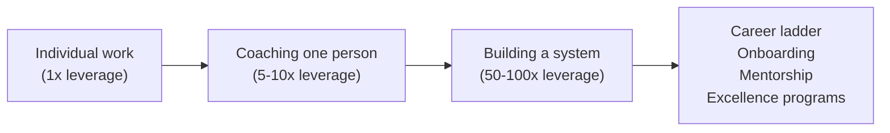

### Org Health Dashboard Visualization

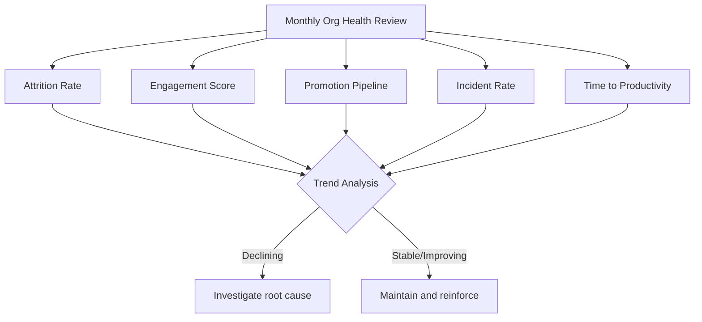

### Radical Candor Quadrant

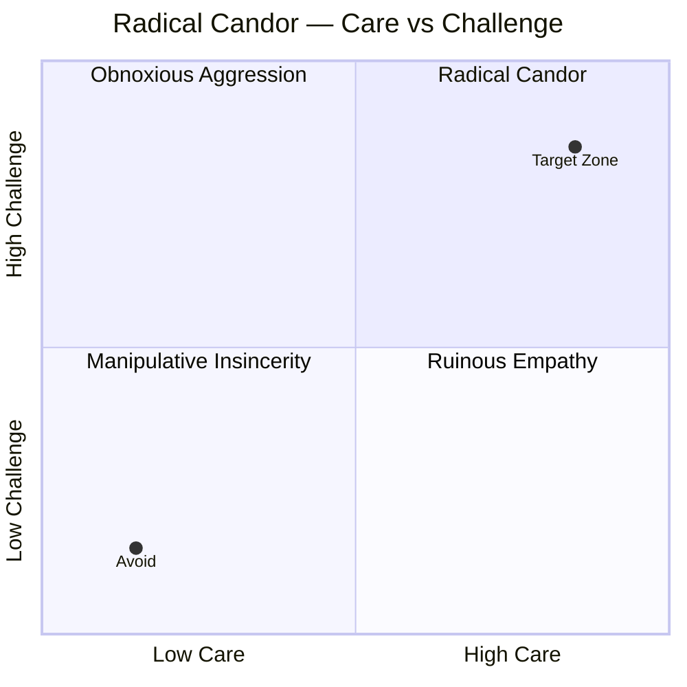

### Mind Map

```mermaid
mindmap
  root(({{TOPIC_NAME}}\nMastery Level))
    Leadership Philosophy
      Servant leadership
      Psychological safety
      Force multiplier model
    Org Dynamics
      Power structures
      Navigating politics
      Managing up and laterally
    Influence Without Authority
      Early adopters
      Data-driven case
      Peer influence
    Systems
      Career ladders
      Onboarding programs
      Mentorship programs
      Excellence programs
    Measurement
      Attrition rate
      Engagement score
      Promotion pipeline
      MTTR and incident rate
    Frameworks
      Pink AMP
      Radical Candor
      Tuckman
      Psychological Safety
```

</details>

---
---

# TEMPLATE 5 — `interview.md`

<details open>
<summary><strong>Template Content</strong></summary>

# {{TOPIC_NAME}} — Interview Preparation

> Behavioral and situational Engineering Manager questions by level, with answer guidance and evaluation criteria.

## Table of Contents

1. [New Manager Questions](#new-manager-questions)
2. [Experienced Manager Questions](#experienced-manager-questions)
3. [Director / Senior EM Questions](#director--senior-em-questions)
4. [Situational Scenarios](#situational-scenarios)
5. [Questions to Ask the Interviewer](#questions-to-ask-the-interviewer)
6. [Evaluation Criteria by Level](#evaluation-criteria-by-level)
7. [Cheat Sheet](#cheat-sheet)

---

## New Manager Questions

These questions assess whether the candidate has made the IC→EM mindset shift and has basic people management fundamentals.

---

**Q1: Tell me about your transition from engineer to manager. What surprised you most?**

*What interviewers look for:*
- Self-awareness about what changed (leverage model, feedback loops, loss of direct control)
- Specific examples, not generalizations
- Evidence they have made peace with the ambiguity of management output

*Strong answer signals:*
- Names a specific challenge (e.g., "The hardest part was not jumping in to fix code when the team was stuck")
- Describes what they learned and how they adjusted
- Shows genuine enthusiasm for the new work, not just career advancement

*Weak answer signals:*
- "It was mostly the same but with more meetings"
- Cannot name a specific thing that changed
- Still frames their value as their own technical output

---

**Q2: How do you run your 1:1s? Walk me through a recent one.**

*What interviewers look for:*
- Understands 1:1 belongs to the direct report
- Has a consistent structure but flexibility for what the person needs
- Follows through on action items

*Strong answer signals:*
- Can describe specific agenda structure (check-in, their topics, your topics, actions)
- Can name a recent specific conversation and its outcome
- Mentions tracking follow-through

*Weak answer signals:*
- "I ask them what they're working on" (status update, not a 1:1)
- Meetings are ad hoc with no structure
- No evidence of follow-through

---

**Q3: Tell me about a time you gave difficult feedback. What happened?**

*What interviewers look for:*
- Uses a framework (SBI or similar) even if not by name
- Gave feedback in private, soon after the event, specifically
- Followed up after to see if behavior changed

*Strong answer signals:*
- Specific situation with specific behavior and impact
- Describes the conversation itself — not just "I told them"
- Mentions how they supported the person afterward

*Weak answer signals:*
- Vague: "I told them they needed to improve their communication"
- Waited too long or gave feedback in a group setting
- No follow-up after the conversation

---

**Q4: Describe a time a team member was struggling. How did you handle it?**

*What interviewers look for:*
- Distinguished between skill gap and will/motivation gap
- Did not immediately jump to performance management
- Provided support appropriate to the root cause

---

## Experienced Manager Questions

These questions assess whether the candidate can handle complex performance and delivery situations and has built hiring and OKR competency.

---

**Q5: Tell me about a performance situation you managed — someone who wasn't meeting expectations. Walk me through it from start to resolution.**

*What interviewers look for:*
- Timeline of feedback → growth plan → (if needed) PIP
- Did not skip steps or surprise the person
- Genuine effort to help the person succeed before other outcomes

*Strong answer signals:*
- Clear timeline with specific feedback moments
- HR involved at the right time
- Outcome is stated honestly (improvement, or departure — either is acceptable)

*Weak answer signals:*
- "I let them go pretty quickly" (insufficient process)
- "I kept hoping it would get better" (avoidance)
- Cannot name the specific feedback they gave

---

**Q6: How do you design an interview process for a role? Walk me through your approach for a mid-level engineer.**

*What interviewers look for:*
- Identifies what skills the role requires before designing interviews
- Structured debrief with independent written feedback
- Leveling decision separate from hire decision

*Strong answer signals:*
- Describes rubric-based evaluation, not "culture fit"
- Can explain how they reduce bias in the debrief
- Mentions conversion funnel tracking

*Weak answer signals:*
- "I ask the team what they want to test" (no design ownership)
- No debrief structure — just a group chat
- Leveling done by gut, not criteria

---

**Q7: Tell me about a time you had to manage a conflict between two engineers.**

*What interviewers look for:*
- Met with each person separately first
- Focused on behaviors and working agreements, not personalities
- Resolved to a working state — not just suppressed the conflict

---

**Q8: How do you design OKRs for your team? Give me an example of a strong and weak KR.**

*What interviewers look for:*
- Understands outcome vs. output distinction
- Can articulate 60-70% attainment as the right target
- Cascades KRs to org-level objectives

*Strong KR example:* "Reduce P1 incidents from 6/month to 1/month by Q4"
*Weak KR example:* "Complete migration of auth service" (output, not outcome)

---

**Q9: Describe a time you had to deliver a project that was at risk. What did you do?**

*What interviewers look for:*
- Surfaced trade-offs to stakeholders rather than absorbing them
- Unblocked the team by removing obstacles
- Escalated with recommendation, not just problem

---

## Director / Senior EM Questions

These questions assess org design thinking, managing managers, and culture and systems building.

---

**Q10: Tell me about a time you designed or significantly changed an org structure. What problem were you solving?**

*What interviewers look for:*
- Started from a business problem, not structural preference
- Considered team cognitive load and dependencies
- Communicated the change well (no one heard secondhand)

---

**Q11: How do you develop your managers? Give me a specific example.**

*What interviewers look for:*
- Uses coaching approach (observe → ask → offer framework)
- Does not solve for them — develops their capability
- Has concrete developmental conversations (not just delegation)

---

**Q12: Tell me about a cultural change you drove in an engineering org. How did you measure success?**

*What interviewers look for:*
- Named a specific behavior (not a vague value)
- Built structural support for the change
- Used metrics to verify the change stuck

---

**Q13: How do you think about span of control for your managers? When do you add another manager?**

*Strong answer:*
- Knows the 5-8 range as healthy
- Uses signals beyond headcount (quality of 1:1s, team health signals, signal loss)
- Has a process for the transition when adding a manager

---

**Q14: Tell me about a time you had signal loss — where a team problem became visible to you late. What happened and what did you change?**

*What interviewers look for:*
- Honest about the failure
- Diagnosed root cause (manager not escalating? skip-levels not frequent enough? metrics not tracked?)
- Systemically changed something, not just addressed the one incident

---

## Situational Scenarios

**Scenario 1:** "Your best engineer just told you they are thinking of leaving. You have 24 hours before they sign elsewhere. What do you do?"

*Strong answer:* Ask what is driving the decision before proposing any solution. Understand whether it is compensation, growth, team, or project. Involve HR and your manager with the full picture. Make a genuine offer that addresses the root cause — not a reflexive counter-offer.

**Scenario 2:** "Two of your managers are in conflict about shared resources, and it is starting to affect their teams. How do you handle it?"

*Strong answer:* Meet with each manager separately. Understand both perspectives and the underlying resource constraint. Bring them together with a decision framework. If they cannot align, make the call and explain your reasoning — do not leave the conflict unresolved.

**Scenario 3:** "A VP asks you to significantly change your team's roadmap with 48 hours notice. Your team is mid-sprint and will lose significant work. What do you do?"

*Strong answer:* Acknowledge urgency. Ask for the business context behind the request — is this truly an emergency? Surface the trade-off (work lost, team disruption, sprint commitment to other stakeholders). Escalate if the decision needs alignment across multiple teams. Protect the team from context whiplash by communicating the change clearly and with rationale.

---

## Questions to Ask the Interviewer

Asking good questions signals seniority and self-awareness:

```text
For New Manager Role:
- "What does a successful first 90 days look like in this role?"
- "What is the biggest challenge the team is currently facing?"
- "How do managers here typically grow into more senior roles?"

For Experienced Manager Role:
- "How does engineering partner with Product here — who owns the roadmap?"
- "What is the current state of the team's health — morale, attrition, delivery?"
- "What does great management look like at this company?"

For Director Role:
- "What are the org's biggest structural challenges right now?"
- "How does technical strategy get set — top-down, bottom-up, or collaborative?"
- "What would make you say this hire was a home run in 12 months?"
```

---

## Evaluation Criteria by Level

| Level | Must Demonstrate | Red Flags |
|-------|-----------------|-----------|
| **New Manager** | IC→EM mindset shift; 1:1 fundamentals; basic feedback skill | Still values own coding output over team health; avoids hard conversations |
| **Experienced Manager** | Perf management (PIP, growth); hiring design; OKR literacy; delivery management | Cannot name specific feedback given; hiring is unstructured; absorbs impossible scope |
| **Director / Senior EM** | Org design thinking; managing managers; culture building; systems thinking | Solves manager problems directly; no measurement of org health; reorgs without business justification |

---

## Cheat Sheet

| Question Type | Framework to Use | Key Signal |
|--------------|-----------------|------------|
| Feedback question | SBI (Situation-Behavior-Impact) | Specific, private, timely |
| Performance management | Growth conversation → PIP timeline | Did not skip steps; genuine effort to help |
| Conflict resolution | Separate → understand → joint → agreement | Behaviors, not personalities |
| OKR design | Outcome vs. output; 60-70% attainment | Can distinguish output from outcome |
| Org design | Team topology; span of control | Business problem first, structure second |
| Culture change | Model → Structural → Recognize → Measure | Named the specific behavior; measured it |

</details>

---
---

# TEMPLATE 6 — `tasks.md`

<details open>
<summary><strong>Template Content</strong></summary>

# {{TOPIC_NAME}} — Hands-On Practice Tasks

> Practical management exercises across all EM levels. Each task includes context, deliverable, and success criteria.

---

## Task 1: Design a 1:1 Template

**Level:** Junior EM
**Time:** 30 minutes

**Context:**
You have just inherited a team of 6 engineers. You have not yet run a single 1:1. You need a template that works for your first session and can evolve as you learn each person.

**Deliverable:**
Create a written 1:1 template that covers:
- Check-in question (open-ended, not status)
- Space for their agenda (minimum 2 slots)
- Space for your agenda (maximum 2 slots)
- Action item tracking section
- A "next time I want to remember" field

**Success Criteria:**
- [ ] The 1:1 is clearly structured around the direct report's agenda, not yours
- [ ] There is no space for "what did you work on this week" (not a status update)
- [ ] Action items have owners and due dates
- [ ] The template fits on one page (can be a doc, not a spreadsheet)

**Stretch:**
Add a section for tracking growth conversations separately from operational topics.

---

## Task 2: Write a Performance Review

**Level:** Junior-Middle EM
**Time:** 90 minutes

**Context:**
It is review cycle time. Alex is a mid-level engineer on your team. Here is what you know:
- Alex shipped a major feature that reduced checkout errors by 40%
- Alex consistently misses the daily standup (present ~50% of the time)
- Alex mentored a junior engineer through their first solo project
- Alex's PRs are thorough but slow to review — averaging 4 days to review a peer's PR
- Alex has not asked for growth conversations despite being at mid-level for 18 months

**Deliverable:**
Write a full performance review for Alex covering:
1. Summary of impact (3-5 bullet points with specific examples)
2. Strengths with evidence
3. Areas for growth with specific, observable behaviors
4. Rating (Below / Meeting / Exceeding expectations for mid-level) with justification
5. Growth plan for next period with success criteria

**Success Criteria:**
- [ ] Every claim is backed by a specific example (no "Alex is a team player")
- [ ] Areas for growth are behaviors, not character traits
- [ ] Rating is justified by the evidence, not your gut
- [ ] Growth plan has specific actions, not vague aspirations ("improve communication skills")

---

## Task 3: Create a Hiring Rubric

**Level:** Middle EM
**Time:** 60 minutes

**Context:**
You are hiring a Senior Software Engineer for your backend team. The role requires:
- Strong system design skills (distributed systems experience)
- Ownership and follow-through in ambiguous situations
- Ability to work cross-functionally with PM and Design
- Collaborative code review culture

**Deliverable:**
Create a hiring rubric covering 4 dimensions:
- For each dimension: name it, define what "strong signal", "weak signal", and "red flag" look like
- Include 2-3 behavioral interview questions for each dimension
- Add a leveling guide: what would make this person a Senior vs. a Staff engineer candidate

**Success Criteria:**
- [ ] Rubric evaluates observable behaviors, not attributes ("is collaborative" is not observable)
- [ ] "Strong signal" is specific enough that two different interviewers would rate the same candidate the same way
- [ ] Questions are open-ended and behavioral (start with "Tell me about a time...")
- [ ] Leveling criteria are differentiated by scope and impact, not years of experience

---

## Task 4: Design an OKR Framework

**Level:** Middle EM
**Time:** 60 minutes

**Context:**
Your team owns a developer platform used by 200 internal engineers. The company's top-level objective for Q3 is: "Make engineering 30% more productive." Your team has identified three opportunities: (1) reduce CI/CD pipeline time, (2) improve documentation coverage, (3) reduce support ticket volume for platform issues.

**Deliverable:**
Write a complete OKR for your team for Q3:
- 1 Objective (qualitative, inspirational)
- 3 Key Results (quantitative, measurable, outcome-focused)
- For each KR: current baseline, target, measurement method, owner

**Success Criteria:**
- [ ] Objective describes a desired state, not a list of tasks
- [ ] Each KR is outcome-focused (not "complete documentation of X services")
- [ ] KRs are measurable at end of quarter — binary pass/fail or clear number
- [ ] Baseline is stated (you cannot measure improvement without a starting point)
- [ ] The three KRs, if achieved, clearly connect to the company objective

**Stretch:**
Identify one leading indicator for each KR — a metric you can track weekly to know if you are on track before the quarter ends.

---

## Task 5: Write a Technical Strategy Document

**Level:** Senior EM
**Time:** 2 hours

**Context:**
Your team owns an authentication service that handles 50M requests/day. The service was built 4 years ago and has accumulated significant technical debt. Incident rate: 3 P1s/month. Test coverage: 35%. Deployment frequency: once every 3 weeks (compared to org average of twice/week). The business is planning to expand to 3 new markets in 12 months, which will 3x traffic.

**Deliverable:**
Write a technical strategy document covering:
1. Where we are (current state — honest assessment)
2. Where we need to be (required state in 18 months given business context)
3. The gap (specific technical and organizational gaps)
4. The approach (high-level direction — not sprint tasks)
5. Trade-offs (what you are choosing NOT to do and why)
6. Investment ask (headcount, quarters, risk acceptance)

**Success Criteria:**
- [ ] Current state is honest — no "we have technical debt but it's manageable" without specifics
- [ ] Required state is connected to business need (3x traffic, new market compliance requirements)
- [ ] Approach is a direction, not a Gantt chart
- [ ] Trade-offs are named explicitly — not implied
- [ ] Investment ask is justified by risk and ROI, not engineering preference

---

## Task 6: Design an Org Structure for a 50-Person Team

**Level:** Senior EM / Director
**Time:** 90 minutes

**Context:**
You are the Director of Engineering for a 50-person engineering org that owns a B2B SaaS product. The product has three surface areas: onboarding (new customer setup), core product (daily usage), and integrations (50+ third-party connectors). There is currently one large team of 50 engineers under 4 managers. Problems: slow delivery, unclear ownership, integration bugs affecting core product, high on-call burden distributed unevenly.

**Deliverable:**
Design a proposed org structure covering:
1. Team breakdown (how many teams, what each team owns)
2. Manager assignments and span of control
3. Team topology type for each team (stream-aligned, platform, enabling)
4. How on-call burden is redistributed
5. Expected dependency map between teams
6. What gets better and what new risks are introduced by this structure

Include a visual org chart using a mermaid diagram.

**Success Criteria:**
- [ ] Each team has a clear domain (no "miscellaneous" ownership)
- [ ] No team exceeds 8 engineers
- [ ] Each team has a named EM with appropriate span (5-8)
- [ ] Dependencies between teams are explicit and minimized
- [ ] You have named at least 2 new risks the structure introduces (no structure is perfect)

**Stretch:**
Write a 1-page communication plan for announcing the reorg to the 50 engineers.

---

## Practice Reflection Questions

After completing each task, reflect:

1. What assumption did I make that I should have questioned?
2. Where did I default to a comfortable answer instead of the right answer?
3. If a senior EM reviewed this work, what would they push back on?
4. What data do I wish I had that would have changed my answer?

</details>

---
---

# TEMPLATE 7 — `find-bug.md`

<details open>
<summary><strong>Template Content</strong></summary>

# {{TOPIC_NAME}} — Find the Management Anti-Pattern

> Each exercise presents a real-world management scenario. Your task: identify the anti-pattern, explain why it is harmful, and describe what the manager should have done instead.

---

## Exercise 1: The Status-Update 1:1

**Scenario:**

Every Monday at 10am, Ravi has a 30-minute 1:1 with each of his engineers. His template:
- "What did you ship last week?"
- "What are you working on this week?"
- "Any blockers?"
- Meeting ends.

After 6 months, two engineers resign. In exit interviews, both say they felt unsupported in their careers and did not feel their manager knew them as people.

**Find the anti-pattern:** What is Ravi doing wrong?

<details>
<summary>Answer</summary>
**Anti-pattern:** The 1:1 is a status update meeting, not a relationship and growth conversation.

**Why it is harmful:** Engineers feel unseen as people and unsupported in their growth. The manager has surface visibility (tasks) but no signal on morale, career goals, frustrations, or engagement. By the time engineers resign, the signal was unavailable for months.

**What Ravi should have done:**
- Open with a genuine check-in ("How are you doing?") before any work topics
- Ask about career goals and challenges regularly ("What's exciting you? What's frustrating you?")
- Leave space for the engineer to set the agenda
- Track growth conversations separately from operational status
</details>

---

## Exercise 2: Vague Performance Review

**Scenario:**

Elena's mid-year review includes the following:

*"James is a strong team player who communicates well and contributes positively to the team. He should work on taking more ownership of his projects and improving his technical depth. Overall: Meeting Expectations."*

At the end of the year, James is surprised to be rated "Below Expectations" and put on a PIP. He says no one told him he was underperforming.

**Find the anti-pattern:**

<details>
<summary>Answer</summary>
**Anti-pattern:** Vague, non-specific performance feedback with no behavioral evidence, which creates false confidence in the recipient.

**Why it is harmful:** "Strong team player" and "communicates well" tell James nothing actionable. "Work on taking more ownership" without a specific example of where ownership was lacking is not feedback — it is a hint. The mid-year review created a false impression that he was meeting expectations, making the year-end rating a surprise. Surprise PIPs destroy trust.

**What Elena should have done:**
- Named specific behaviors in the mid-year review ("In the last two sprints, you escalated blockers after they became visible to the PM, not before")
- Given corrective feedback continuously, not saved it for review cycles
- If underperformance was evident, said so explicitly in the mid-year — not implied it with vague language
- Made the year-end rating impossible to surprise given the mid-year language
</details>

---

## Exercise 3: Public Correction

**Scenario:**

During a sprint retrospective (12 people present), the team is discussing a recent incident. The manager says: "Sam, honestly, I think you should have escalated that sooner. That's on you."

Sam becomes very quiet for the rest of the retro. In subsequent retros, fewer people raise issues.

**Find the anti-pattern:**

<details>
<summary>Answer</summary>
**Anti-pattern:** Corrective feedback delivered publicly, which destroys psychological safety.

**Why it is harmful:** Public correction humiliates the person in front of their peers. It activates threat response (fight/flight) rather than learning. The ripple effect is worse: every other team member now knows that honest mistakes can result in public blame — so they stop raising issues. The retro becomes a performance, not a learning exercise.

**What the manager should have done:**
- In the retro: "Let's talk about what we could do differently as a system next time" (focus on the process, not Sam)
- 1:1 with Sam after the retro: "I want to share an observation about the escalation timing..."
- Never use a public forum for individual corrective feedback
</details>

---

## Exercise 4: Micromanaging Implementation

**Scenario:**

Maria manages a team of 5 engineers. When her team is building a new feature, she reviews every PR within 2 hours and leaves detailed comments on implementation choices: variable naming, function structure, even SQL query style (all functionally correct). Engineers frequently feel their approach is being overridden.

One senior engineer tells her: "It's hard to feel like I own anything here."

**Find the anti-pattern:**

<details>
<summary>Answer</summary>
**Anti-pattern:** Micromanaging implementation details — confusing technical standards with personal preferences.

**Why it is harmful:** Engineers lose ownership and motivation. Constant override of correct-but-different implementation choices sends the message "I don't trust your judgment." Senior engineers in particular will disengage or leave. It also makes the manager a bottleneck — the team cannot move without her review.

**What Maria should have done:**
- Establish actual team standards (agreed coding style guide, agreed architectural patterns) and enforce those consistently
- For everything that meets the standard: approve it, even if she would have written it differently
- Ask "what was your thinking here?" before overriding — she may learn something
- Build the team's code review culture so engineers review each other, not just her
</details>

---

## Exercise 5: Output-Focused OKRs

**Scenario:**

At the start of Q2, the team agrees on the following OKRs:

- **O1:** Deliver the mobile redesign
  - KR1: Complete mobile checkout redesign by April 30
  - KR2: Ship 3 A/B tests on the new design by June 15
  - KR3: Write documentation for mobile design system

At the end of Q2, all three KRs are complete. But user conversion on mobile has not changed, and the redesign received negative NPS feedback.

**Find the anti-pattern:**

<details>
<summary>Answer</summary>
**Anti-pattern:** Output-focused OKRs (measuring activity completed, not user or business outcomes).

**Why it is harmful:** The team shipped everything they said they would — and nothing meaningful improved. Output OKRs optimize for task completion, not impact. They create a false sense of success and make it impossible to course-correct mid-quarter based on whether you are achieving the actual goal.

**What the team should have done:**
- O1: Improve mobile checkout conversion rate
  - KR1: Increase mobile checkout completion from 32% to 45% by end of Q2
  - KR2: Achieve mobile NPS of 35+ (from current 18) measured via post-checkout survey
  - KR3: Reduce mobile checkout error rate from 8% to 2%

These KRs measure whether the redesign worked — not whether it shipped.
</details>

---

## Exercise 6: The Skip-Level That Becomes Gossip

**Scenario:**

A director runs quarterly skip-levels. After speaking with engineers on Team A, she discovers that the team's manager, Jordan, has been canceling 1:1s frequently and has not given anyone a growth conversation in 6 months.

In the next 1:1 with Jordan, the director says: "I've heard from several people on your team that you're canceling 1:1s and not doing growth conversations."

Jordan becomes defensive and later has cold relationships with his team, whom he suspects reported him.

**Find the anti-pattern:**

<details>
<summary>Answer</summary>
**Anti-pattern:** Using skip-level feedback as direct evidence in a manager's 1:1 — violating the confidentiality of skip-level conversations.

**Why it is harmful:** Engineers shared information in a trust context ("I won't share specifics with your manager"). Attributing their feedback directly breaks that trust. Engineers stop being honest in future skip-levels. Jordan's relationship with his team is damaged. The director has traded long-term signal quality for one confrontation.

**What the director should have done:**
- Use skip-level insights to generate her own observations: "I've been paying attention to team health signals and I want to share what I'm seeing"
- Raise the topic from her own lens: "Let's talk about 1:1 consistency — what does your current cadence look like?"
- Ask coaching questions to surface Jordan's awareness: "When did you last have a growth conversation with each of your reports?"
- Never attribute specific feedback to individuals or "the team"
</details>

---

## Exercise 7: The Avoidance Loop

**Scenario:**

An engineer, Priya, has been delivering low-quality code for 3 months — her PRs consistently need 3+ rounds of revision and two have caused production incidents. Her manager, Dan, has not given her direct feedback because "I don't want to damage her confidence."

Dan does mention it vaguely in her quarterly review: "Priya should focus on quality before committing." After 6 months, Priya is put on a formal PIP. She is devastated — she had no idea there was a serious problem.

**Find the anti-pattern:**

<details>
<summary>Answer</summary>
**Anti-pattern:** Avoidance of difficult feedback framed as "protecting confidence" — actually ruinous empathy.

**Why it is harmful:** Priya had 6 months she could have used to improve. Instead, she was led into a PIP blind. The damage to her confidence from the PIP is far greater than any damage an early specific conversation would have caused. Dan's avoidance was self-serving (he avoided discomfort) not protective.

**What Dan should have done:**
- Given specific SBI feedback after the first low-quality PR: "In the last two PRs, the edge cases we discussed in code review were not handled (Situation/Behavior). This caused two reviewer hours and one was a near-miss for production (Impact). I want us to work on your review checklist before you submit."
- Set a clear expectation: "I need to see consistent improvement on first-submission quality over the next 4 weeks"
- Given feedback early enough for Priya to change — not at the quarterly review
</details>

---

## Exercise 8: The Consensus Promotion

**Scenario:**

A manager wants to promote an engineer, Diego, to senior. Diego's work is strong and his impact is clear. But at calibration, one peer manager says "I've heard he can be difficult in cross-team meetings" (no specific examples). Another says "His code is great but I wonder about his leadership potential."

The hiring manager backs down from the promotion to "get more data." Diego does not get promoted that cycle.

**Find the anti-pattern:**

<details>
<summary>Answer</summary>
**Anti-pattern:** Allowing vague, unsubstantiated objections to block a promotion that the evidence supports.

**Why it is harmful:** Promotions should be decided against the criteria in the career ladder, not against general comfort level or secondhand hearsay. "I've heard he can be difficult" without a specific example is not evidence — it is gossip. Backing down under social pressure in calibration sets a precedent that anyone can block a promotion with vague claims.

**What the manager should have done:**
- Challenge the objection directly: "Can you name a specific incident? I have not observed this behavior."
- Return to the rubric: "Based on our career ladder criteria for Senior, does Diego meet them? Let's go through each one."
- Advocate for Diego rather than capitulate to discomfort
- If the concern is legitimate, name it specifically and get specific evidence before delaying
</details>

---

## Exercise 9: The Firefighting Manager

**Scenario:**

Marcus's team has 3 P1 incidents per month. Marcus is always the first person in the war room, takes over the incident command, and personally writes the post-mortem. The team appreciates that he "always shows up." But the incidents keep happening at the same rate, and junior engineers on the team have never led an incident response.

**Find the anti-pattern:**

<details>
<summary>Answer</summary>
**Anti-pattern:** Manager as perpetual firefighter — solving incidents instead of building incident management capability in the team.

**Why it is harmful:** Marcus is a hero in the short term and a bottleneck in the long term. Junior engineers never develop incident response skills. The org cannot scale — every incident needs Marcus. The root causes of the recurring incidents are never addressed because post-mortems are done by Marcus, not the people closest to the problem.

**What Marcus should have done:**
- Rotate incident commander role across the team (with training and support)
- Facilitate post-mortems rather than write them — have the team own the analysis
- Track recurring incident patterns and make fixing root causes a roadmap priority
- Use the incidents as a growth opportunity for the team, not a performance stage for himself
</details>

---

## Exercise 10: The Empty Reorg

**Scenario:**

A director announces a reorg: two teams that were under different managers are combined under one manager, and the org chart is "simplified." The announced reason: "To improve cross-team collaboration."

Three months later, the combined team has lower morale, the two original subgroups still do not collaborate, and the single manager is stretched across 14 direct reports.

**Find the anti-pattern:**

<details>
<summary>Answer</summary>
**Anti-pattern:** Reorg as structural fix for a collaboration problem that is actually a process or relationship problem — and without resourcing the resulting span-of-control issue.

**Why it is harmful:** Putting people in the same box on an org chart does not make them collaborate. The underlying relationship and process issues remain. The manager with 14 reports cannot give adequate attention to either group. The reorg created disruption (Tuckman reset) without solving the actual problem.

**What the director should have done:**
- Diagnosed the collaboration problem specifically: Is it process? Shared rituals? Conflicting priorities? Unclear ownership boundaries?
- Addressed the root cause directly (joint planning meetings, shared OKRs, cross-team working agreements)
- If combining teams was still the right answer, hired a second manager before the change, not after
- Articulated the specific problem the reorg solved and how they would measure improvement
</details>

---

## Scoring Guide

| Score | Description |
|-------|-------------|
| **Identified the anti-pattern** | Named the specific failure mode (not just "bad management") |
| **Explained the harm** | Described the impact on the team, the person, or the org — not just "it's wrong" |
| **Offered the correct alternative** | Described a specific, actionable alternative behavior |
| **Considered second-order effects** | Named downstream consequences (e.g., psychological safety destroyed, signal lost) |

> Full marks require all four. Naming the anti-pattern without explaining the harm or alternative is partial credit.

</details>

---
---

# TEMPLATE 8 — `optimize.md`

<details open>
<summary><strong>Template Content</strong></summary>

# {{TOPIC_NAME}} — Optimize Management Practices

> Each exercise presents an ineffective management practice. Redesign it to be significantly more effective. Include before/after comparison, the mechanism of improvement, and expected outcome metrics.

---

## Exercise 1: 1-Hour Weekly Status 1:1 → 30-Min Biweekly Growth-Focused 1:1

**Before (Ineffective):**

```text
Current Practice:
- Frequency: Weekly, 60 minutes
- Agenda: "What did you work on? What's next? Any blockers?"
- Format: Manager takes notes on status
- Follow-up: None documented
- Growth topics: Occasional, unstructured
```

**Problems identified:**
- 60 minutes of status takes manager and engineer off productive work
- No structure for growth or career conversations
- No follow-through tracking
- Engineer feels like they are reporting to the manager, not being supported

**After (Optimized):**

```text
Optimized Practice:
- Frequency: Biweekly, 30 minutes
- Agenda: Check-in (5 min) → Their topics (15 min) → Your topics (5 min) → Actions (5 min)
- Monthly rotation: One 1:1 per month explicitly dedicated to growth conversation
- Follow-through: Shared doc with action items, reviewed at start of every session
- Status updates: Moved to async (weekly written update in team channel)
```

**Mechanism of improvement:**
- Status is separated from relationship — status goes async, relationship gets the meeting time
- 30 minutes biweekly is sufficient when async status is working; meeting time becomes higher-quality
- Growth conversation has a dedicated slot — it cannot be crowded out by operational topics

**Expected metrics improvement:**

| Metric | Before | After | Timeframe |
|--------|--------|-------|-----------|
| Engineer engagement score ("I feel supported in my career") | 2.8/5 | 4.1/5 | 2 quarters |
| Meeting time per engineer per month | 240 min | 60 min | Immediate |
| Growth conversations per quarter | ~1 (unstructured) | 3+ (structured) | 1 quarter |
| Team attrition rate | 18%/year | 9%/year | 4 quarters |

---

## Exercise 2: Annual Performance Review → Continuous Feedback System

**Before:**

```text
Current Practice:
- Feedback cycle: Once per year (November)
- Format: Manager writes review in 2 days
- Content: Vague summaries ("strong contributor")
- Engineer awareness: Often surprised by rating
- Growth plan: Written at review, revisited never
```

**After (Optimized):**

```text
Optimized Practice:
- Feedback cycle: Continuous (SBI within 48h of event) + formal reviews quarterly
- Quarterly review: 45 minutes, uses evidence collected over 3 months
- Annual review: Synthesis of 4 quarterly reviews — no surprises possible
- Growth plan: Co-authored; reviewed monthly; updated quarterly
- Rating: Never a surprise — engineer can predict their own rating before the meeting
```

**Mechanism of improvement:**
- Proximity: Feedback given near the behavior is actionable; annual feedback is archaeology
- Specificity: Continuous SBI produces specific evidence that quarterly reviews draw from
- No surprises: Engineers who receive regular feedback can calibrate their own performance before reviews

**Expected metrics improvement:**

| Metric | Before | After | Timeframe |
|--------|--------|-------|-----------|
| Performance surprise rate (engineer did not expect their rating) | 60% | <5% | 1 cycle |
| Behavior change rate after feedback | 25% | 70% | 2 quarters |
| Voluntary attrition (top performers) | 22%/year | 8%/year | 3 quarters |

---

## Exercise 3: Gut-Based Hiring → Structured Rubric-Based Hiring

**Before:**

```text
Current Practice:
- Interview design: Ad hoc — each interviewer asks what they want
- Debrief: Verbal group chat; most senior person's opinion dominates
- Leveling: Based on title at current company
- Time to fill: 14 weeks average
- Offer acceptance rate: 55%
```

**After (Optimized):**

```text
Optimized Practice:
- Interview design: Role-specific rubric (4 dimensions, each with strong/weak/red-flag signals)
- Debrief: Structured — written feedback submitted independently; facilitator reads scores, then asks each person in sequence; no one changes vote due to social pressure
- Leveling: Criteria-based (scope, impact, behaviors at target level — not title)
- Calibration: Hiring committee reviews debrief to ensure consistency across candidates
- Candidate experience: Every candidate gets feedback within 3 business days
```

**Expected metrics improvement:**

| Metric | Before | After | Timeframe |
|--------|--------|-------|-----------|
| Time to fill open role | 14 weeks | 8 weeks | 2 quarters |
| Offer acceptance rate | 55% | 78% | 2 quarters |
| 12-month retention of hires | 65% | 88% | 4 quarters |
| Leveling accuracy (no mis-hires at wrong level) | 70% | 92% | Ongoing |

---

## Exercise 4: Reactive Blocker Resolution → Proactive Unblocking System

**Before:**

```text
Current Practice:
- Blockers raised: In standup, after they have already caused delay
- Manager response: Escalates same day; sometimes takes 1-2 weeks to resolve
- Sprint planning: No blocker prevention built in
- Cross-team dependencies: Discovered during sprint, not before
```

**After (Optimized):**

```text
Optimized Practice:
- Dependency identification: Done in sprint planning (before the sprint starts)
- Blocker tracking: Shared doc visible to team + manager; reviewed daily
- Escalation SLA: Manager commits to resolving any blocker within 24 hours or escalating with a plan
- Weekly cross-team sync: 20 minutes with peer EMs to surface upcoming dependencies
- Pre-mortem: At sprint start, team asks "what is most likely to block us this sprint?"
```

**Expected metrics improvement:**

| Metric | Before | After | Timeframe |
|--------|--------|-------|-----------|
| Blockers discovered mid-sprint | 4.2/sprint | 1.1/sprint | 1 quarter |
| Average blocker resolution time | 6 days | 1.5 days | 1 quarter |
| Sprint goal completion rate | 58% | 81% | 2 quarters |

---

## Exercise 5: Output OKRs → Outcome OKRs

**Before:**

```text
Current OKRs:
O1: Deliver infrastructure modernization
  KR1: Migrate 5 services to new infrastructure by end of Q
  KR2: Write runbooks for all migrated services
  KR3: Complete onboarding for 3 new engineers on new stack

Result: All KRs hit at 100%. Deployment frequency unchanged. Incidents unchanged.
```

**After (Optimized):**

```text
Redesigned OKRs:
O1: Make our infrastructure a competitive advantage for engineering velocity
  KR1: Improve deployment frequency from 2x/month to 4x/week by end of Q
       [Baseline: 2x/month | Method: DORA deployment frequency metric | Owner: Platform team]
  KR2: Reduce P1 incident rate from 5/month to 1/month by end of Q
       [Baseline: 5/month | Method: Incident tracking system | Owner: SRE + Platform]
  KR3: Achieve time-to-first-deploy < 30 min for new engineer onboarding
       [Baseline: 3.5 hours | Method: Onboarding time tracking | Owner: DevEx team]
```

**Redesign principles applied:**
- Each KR measures a business or engineering outcome (speed, reliability, developer experience)
- Baselines are stated — you cannot measure improvement without knowing where you started
- Each KR has a measurement method and an owner
- 60-70% attainment is acceptable — these are stretch goals

**Expected metrics improvement:**

| Metric | Before | After |
|--------|--------|-------|
| OKR completion that correlates to business impact | 20% | 85% |
| Mid-quarter course correction ability | Low (no leading indicators) | High (weekly leading indicators) |

---

## Exercise 6: Informal Mentorship → Structured Mentorship Program

**Before:**

```text
Current State:
- Mentorship: Ad hoc — engineers find their own mentors if they want one
- Coverage: ~15% of engineers have an active mentor relationship
- Duration: Undefined — some last 1 meeting, some last years
- Outcomes: Not tracked
- Senior engineer load: Uneven — 2-3 senior engineers absorb all informal mentorship
```

**After (Optimized):**

```text
Structured Mentorship Program:
- Matching: Program coordinator matches based on skill gap + availability (not just "find a senior")
- Commitment: 1 hour biweekly for 6 months — both parties commit in writing
- Structure:
    Month 1: Goal-setting session (mentee owns the agenda)
    Months 2-5: Regular sessions + monthly coordinator check-in
    Month 6: Closing retrospective + goal review
- Coverage: 80% of engineers who want a mentor are matched within 3 weeks
- Alumni: Mentees from cohort 1 become mentors in cohort 2
- Load distribution: Every senior engineer participates — load is shared
```

**Expected metrics improvement:**

| Metric | Before | After | Timeframe |
|--------|--------|-------|-----------|
| Mentorship coverage | 15% | 80% | 1 program cohort |
| Time to promotion for participants | 24 months avg | 16 months avg | 2-3 cohorts |
| Senior engineer load (mentorship hours/month) | 3 engineers at 8h each | 12 engineers at 2h each | 1 cohort |
| Engagement score ("I have growth opportunities") | 2.9/5 | 4.3/5 | 2 quarters post-program |

---

## Exercise 7: Reactive On-Call → Engineering Excellence Program

**Before:**

```text
Current State:
- On-call: 2 engineers rotating, no runbooks, reactive response
- Post-mortems: Written by whoever is least busy; not systematic
- Code quality: No standards doc; PRs reviewed inconsistently
- Incidents: 6 P1s/month; MTTR: 4 hours avg
- Tech debt: Not tracked; addressed opportunistically
```

**After (Optimized):**

```text
Engineering Excellence Program:
1. On-call rotation: All engineers rotate; runbooks required before on-call eligibility
2. Incident management: Incident commander role; blameless post-mortem template; action items tracked to closure
3. Code standards: Team-authored standards doc (testing, security, API design, error handling); enforced in PR review
4. Tech debt tracking: Dedicated tech debt backlog; 20% of each sprint allocated to debt
5. Post-mortem culture: Post-mortems published internally; "best post-mortem" recognition each quarter
6. Developer experience: CI/CD pipeline target: < 10 min; flaky test policy (3 strikes → removed)
```

**Expected metrics improvement:**

| Metric | Before | After | Timeframe |
|--------|--------|-------|-----------|
| P1 incidents/month | 6 | 1.2 | 3 quarters |
| MTTR (P1) | 4 hours | 45 minutes | 2 quarters |
| On-call burnout (engineer survey score) | 2.1/5 | 3.9/5 | 2 quarters |
| New engineer PR pass rate (first submission) | 35% | 72% | 1 quarter |

---

## Exercise 8: Unstructured Onboarding → 90-Day Onboarding Program

**Before:**

```text
Current State:
- Onboarding: "Here's your laptop and the Confluence link"
- Mentor assignment: Whoever has time that week
- First PR: Typically takes 3-4 weeks to merge
- Time-to-independent-feature: 10-12 weeks
- 90-day attrition rate: 18% (engineers leave because they feel unsupported early)
```

**After (Optimized):**

```text
90-Day Onboarding Program:

Week 1-2: Foundation
  [ ] Environment fully set up by end of day 1 (automated setup script)
  [ ] Codebase tour with assigned onboarding buddy
  [ ] Meet every team member 1:1 (15-min coffee chats)
  [ ] Understand team norms, on-call rotation, and PR process

Week 3-4: First contribution
  [ ] First PR merged (intentionally scoped small — a bug fix or documentation)
  [ ] Paired coding session with senior engineer
  [ ] Attend one sprint planning and one retrospective as observer

Week 5-8: Growing ownership
  [ ] Own a small feature end-to-end (designed, coded, reviewed, deployed)
  [ ] First on-call shadow shift (observe, not respond)
  [ ] 30-day manager check-in: calibrate on what's working and what's hard

Week 9-12: Independence
  [ ] Leading their own work with light oversight
  [ ] Completed first independent on-call shift (with backup)
  [ ] 90-day retrospective with manager: goals for Q2

Metrics tracked:
- Time to first commit: target < 3 days
- Time to first independent feature: target < 6 weeks
- 90-day survey score (ease of onboarding, clarity of expectations)
```

**Expected metrics improvement:**

| Metric | Before | After | Timeframe |
|--------|--------|-------|-----------|
| Time to first commit | 3-4 weeks | < 3 days | Immediate (cohort 1) |
| Time to first independent feature | 10-12 weeks | 5-6 weeks | Cohort 1 |
| 90-day attrition rate | 18% | 4% | 2-3 cohorts |
| New hire satisfaction score (90-day survey) | 2.6/5 | 4.4/5 | Cohort 1 |
| Manager time spent on onboarding ad hoc | 8h/week | 2h/week | Cohort 1 |

---

## Optimization Summary

| Practice | Key Optimization | Primary Metric Improved |
|---------|-----------------|------------------------|
| 1:1 design | Status → growth; weekly 60 min → biweekly 30 min | Attrition rate |
| Performance review | Annual → continuous; vague → SBI | Surprise rate; behavior change rate |
| Hiring | Gut → rubric + structured debrief | Offer acceptance; 12-month retention |
| Blocker resolution | Reactive → proactive with SLA | Sprint goal completion rate |
| OKRs | Output → outcome with baseline | Correlation to business impact |
| Mentorship | Ad hoc → structured program | Time to promotion; coverage |
| On-call | Reactive → excellence program | P1 incident rate; MTTR |
| Onboarding | Unstructured → 90-day program | 90-day attrition; time to first feature |

> **Optimization principle:** Every management practice should be measurable. If you cannot name the metric that improves when this practice works, you cannot know whether it is working.

</details>

---
---

# TEMPLATE 9 — `specification.md`

> **Focus:** Official documentation deep-dive — standards references, framework specifications, official guidelines, and version compatibility.
>
> **Source:** Always cite the official documentation or standards with direct section links.
> - AI Red Teaming: https://airc.nist.gov/Docs | https://owasp.org/www-project-ai-security-and-privacy-guide/
> - Cyber Security: https://owasp.org/www-project-top-ten/ | https://csrc.nist.gov/
> - Code Review: https://google.github.io/eng-practices/review/
> - Engineering Manager: https://www.manager-tools.com/ | https://lethain.com/staff-engineer/
> - QA: https://www.istqb.org/certifications/ | https://testing.googleblog.com/
> - Technical Writer: https://developers.google.com/tech-writing | https://www.writethedocs.org/guide/
> - Product Manager: https://www.svpg.com/inspired/ | https://www.productboard.com/resources/
> - DevRel: https://www.devrel.agency/resources | https://www.commonroom.io/resources/
> - AWS: https://docs.aws.amazon.com/ | https://aws.amazon.com/architecture/
> - Git/GitHub: https://git-scm.com/docs | https://docs.github.com/

<details open>
<summary><strong>Template Content</strong></summary>

# {{TOPIC_NAME}} — Specification

> **Official Documentation / Standards Reference**
>
> Source: [{{SOURCE_NAME}}]({{DOCS_URL}}) — {{SECTION}}

---

## Table of Contents

1. [Reference](#reference)
2. [Official Framework / Standard](#official-framework--standard)
3. [Core Rules & Guidelines](#core-rules--guidelines)
4. [Process / Workflow Specification](#process--workflow-specification)
5. [Metrics & Measurement](#metrics--measurement)
6. [Common Scenarios & Responses](#common-scenarios--responses)
7. [Version & Evolution History](#version--evolution-history)
8. [Official Examples & Case Studies](#official-examples--case-studies)
9. [Compliance Checklist](#compliance-checklist)
10. [Related Resources](#related-resources)

---

## 1. Reference

| Property | Value |
|----------|-------|
| **Official Source** | [{{SOURCE_NAME}}]({{DOCS_URL}}) |
| **Relevant Section** | {{SECTION_NAME}} — {{SECTION_TITLE}} |
| **Standard / Version** | {{STANDARD_VERSION}} |
| **Direct URL** | {{DOCS_URL}}/{{PATH}} |

---

## 2. Official Framework / Standard

> From: {{DOCS_URL}}/{{FRAMEWORK_SECTION}}

### {{FRAMEWORK_OR_STANDARD_NAME}}

{{FRAMEWORK_DESCRIPTION}}

| Component | Purpose | Official Guidance |
|-----------|---------|------------------|
| {{COMP_1}} | {{PURPOSE_1}} | [Link]({{URL_1}}) |
| {{COMP_2}} | {{PURPOSE_2}} | [Link]({{URL_2}}) |
| {{COMP_3}} | {{PURPOSE_3}} | [Link]({{URL_3}}) |

---

## 3. Core Rules & Guidelines

### Guideline 1: {{GUIDELINE_NAME}}

> *Source: [{{DOCS_URL}}/{{SECTION}}]({{DOCS_URL}}/{{SECTION}}) — "{{DOC_QUOTE}}"*

{{GUIDELINE_EXPLANATION}}

**✅ Good practice:**
{{GOOD_EXAMPLE}}

**❌ Anti-pattern:**
{{BAD_EXAMPLE}}

### Guideline 2: {{GUIDELINE_NAME}}

> *Source: [{{DOCS_URL}}/{{SECTION}}]({{DOCS_URL}}/{{SECTION}})*

{{GUIDELINE_EXPLANATION}}

---

## 4. Process / Workflow Specification

### Official Process Flow

```
{{PROCESS_STEP_1}}
    ↓
{{PROCESS_STEP_2}}
    ↓
{{PROCESS_STEP_3}}
    ↓
{{PROCESS_STEP_4}}
```

| Stage | Official Requirement | Notes |
|-------|---------------------|-------|
| {{STAGE_1}} | {{REQ_1}} | {{NOTES_1}} |
| {{STAGE_2}} | {{REQ_2}} | {{NOTES_2}} |

---

## 5. Metrics & Measurement

| Metric | Official Definition | Target / Benchmark | Reference |
|--------|--------------------|--------------------|-----------|
| {{METRIC_1}} | {{DEF_1}} | {{TARGET_1}} | [Link]({{URL_1}}) |
| {{METRIC_2}} | {{DEF_2}} | {{TARGET_2}} | [Link]({{URL_2}}) |
| {{METRIC_3}} | {{DEF_3}} | {{TARGET_3}} | [Link]({{URL_3}}) |

---

## 6. Common Scenarios & Responses

| Scenario | Official Guidance | Reference |
|----------|-------------------|-----------|
| {{SCENARIO_1}} | {{GUIDANCE_1}} | [Docs]({{URL_1}}) |
| {{SCENARIO_2}} | {{GUIDANCE_2}} | [Docs]({{URL_2}}) |
| {{SCENARIO_3}} | {{GUIDANCE_3}} | [Docs]({{URL_3}}) |

---

## 7. Version & Evolution History

| Version / Edition | Change | Year | Notes |
|------------------|--------|------|-------|
| {{VER_1}} | {{CHANGE_1}} | {{YEAR_1}} | {{NOTES_1}} |
| {{VER_2}} | {{CHANGE_2}} | {{YEAR_2}} | {{NOTES_2}} |

---

## 8. Official Examples & Case Studies

### Example: {{EXAMPLE_TITLE}}

> Source: [{{DOCS_URL}}/{{ANCHOR}}]({{DOCS_URL}}/{{ANCHOR}})

{{EXAMPLE_DESCRIPTION}}

**Outcome / Result:**
{{EXPECTED_OUTCOME}}

---

## 9. Compliance Checklist

- [ ] Follows official recommended approach for {{TOPIC_NAME}}
- [ ] Aligned with standard version ({{STANDARD_VERSION}})
- [ ] Covers all required process stages
- [ ] Metrics are tracked per official guidance
- [ ] Common scenarios handled per official recommendations
- [ ] Team/stakeholder requirements met

---

## 10. Related Resources

| Topic | Source | URL |
|-------|--------|-----|
| {{RELATED_1}} | {{SOURCE_1}} | [Link]({{URL_1}}) |
| {{RELATED_2}} | {{SOURCE_2}} | [Link]({{URL_2}}) |
| {{RELATED_3}} | {{SOURCE_3}} | [Link]({{URL_3}}) |

---

> **Content Rules for `specification.md`:**
> - Always link directly to the relevant section of the official source (not just the homepage)
> - Use the most authoritative and widely accepted official standard or framework
> - Include measurable metrics where official standards define them
> - Document process flows using official terminology
> - Note when standards or best practices have evolved over time
> - Minimum 2 Core Guidelines, 3 Metrics, 3 Scenarios, 2 Official Examples

</details>
