# Product Manager Roadmap — Universal Template

> **A comprehensive template system for generating Product Manager roadmap content across all skill levels.**

---

## Overview

| | Description |
|---|---|
| **Purpose** | Universal template for all Product Manager roadmap topics |
| **Files per topic** | 9 files: `junior.md`, `middle.md`, `senior.md`, `professional.md`, `interview.md`, `tasks.md`, `find-bug.md`, `optimize.md`, `specification.md` |
| **Language** | All content must be generated in **English** |
| **Table of Contents** | **Optional** — include only if relevant to the topic. For practice files (`tasks.md`, `find-bug.md`, `optimize.md`) it is NOT required |

### Topic Structure

```
XX-topic-name/
├── junior.md          ← "What?" and "How?"
├── middle.md          ← "Why?" and "When?"
├── senior.md          ← "How to optimize?" and "How to architect?"
├── professional.md    ← "Mastery and Leadership Level"
├── interview.md       ← Interview prep across all levels
├── tasks.md           ← Hands-on practice tasks
├── find-bug.md        ← Find and fix process anti-patterns (10+ exercises)
├── optimize.md        ← Optimize slow/inefficient processes (10+ exercises)
└── specification.md   ← Official spec / documentation deep-dive
```

---

## Level Comparison Matrix

| Aspect | Junior | Middle | Senior | Professional |
|:------:|:------:|:------:|:------:|:------------:|
| **Depth** | Basic concepts, simple frameworks | Practical usage, real-world cases | Strategy, org design, metrics architecture | Leadership, influence, systems thinking |
| **Artifacts** | User stories, basic PRDs | Production-ready PRDs, roadmaps | OKR frameworks, stakeholder strategies | Org-level playbooks, case studies |
| **Tricky Points** | Vague requirements, missing acceptance criteria | Scope creep, stakeholder misalignment | Prioritization bias, strategy drift | Cognitive frameworks, organizational dynamics |
| **Focus** | "What?" and "How?" | "Why?" and "When?" | "How to improve?" | "What drives mastery?" |

---
---

# TEMPLATE 1 — `junior.md`

<details open>
<summary><strong>Template Content</strong></summary>

# {{TOPIC_NAME}} — Junior Level

## Table of Contents

1. [Introduction](#introduction)
2. [Prerequisites](#prerequisites)
3. [Glossary](#glossary)
4. [Core Concepts](#core-concepts)
5. [Pros & Cons](#pros--cons)
6. [Use Cases](#use-cases)
7. [Example Artifacts / Templates](#example-artifacts--templates)
8. [Product Use / Feature](#product-use--feature)
9. [Common Failure Modes and Recovery](#common-failure-modes-and-recovery)
10. [Security Considerations](#security-considerations)
11. [Performance Tips](#performance-tips)
12. [Metrics & Analytics](#metrics--analytics)
13. [Best Practices](#best-practices)
14. [Edge Cases & Pitfalls](#edge-cases--pitfalls)
15. [Common Mistakes](#common-mistakes)
16. [Tricky Points](#tricky-points)
17. [Test](#test)
18. [Tricky Questions](#tricky-questions)
19. [Cheat Sheet](#cheat-sheet)
20. [Summary](#summary)
21. [What You Can Build](#what-you-can-build)
22. [Further Reading](#further-reading)
23. [Related Topics](#related-topics)
24. [Diagrams & Visual Aids](#diagrams--visual-aids)

---

## Introduction

> Focus: "What is it?" and "How to use it?"

Brief explanation of what {{TOPIC_NAME}} is and why a junior PM needs to know it.
Keep it simple — assume the reader has basic business knowledge but is new to product management.

---

## Prerequisites

What you should know before studying this topic:

- **Required:** {{concept 1}} — brief explanation of why
- **Required:** {{concept 2}} — brief explanation of why
- **Helpful but not required:** {{concept 3}}

> List 2-4 prerequisites. Link to related roadmap topics if available.

---

## Glossary

Key terms used in this topic:

| Term | Definition |
|------|-----------|
| **{{Term 1}}** | Simple, one-sentence definition |
| **{{Term 2}}** | Simple, one-sentence definition |
| **{{Term 3}}** | Simple, one-sentence definition |

> 5-10 terms. Keep definitions beginner-friendly.

---

## Core Concepts

### Concept 1: {{name}}

Simple explanation with analogy if helpful.

### Concept 2: {{name}}

...

> **Rules:**
> - Each concept should be explained in 3-5 sentences max.
> - Use bullet points for lists.
> - Include small framework snippets inline where needed.

---

## Real-World Analogies

Everyday analogies to help you understand {{TOPIC_NAME}} intuitively:

| Concept | Analogy |
|---------|--------|
| **{{Concept 1}}** | {{Analogy — e.g., "A product roadmap is like a GPS route — it shows direction, but you adjust based on conditions"}} |
| **{{Concept 2}}** | {{Analogy}} |
| **{{Concept 3}}** | {{Analogy}} |

> 2-4 analogies. Use everyday objects and situations.

---

## Mental Models

How to picture {{TOPIC_NAME}} in your head:

**The intuition:** {{A simple mental model — e.g., "Think of discovery as detective work — you're collecting clues before committing to a solution."}}

**Why this model helps:** {{Why visualizing it this way prevents common mistakes}}

---

## Pros & Cons

| Pros | Cons |
|------|------|
| {{Advantage 1}} | {{Disadvantage 1}} |
| {{Advantage 2}} | {{Disadvantage 2}} |
| {{Advantage 3}} | {{Disadvantage 3}} |

### When to use:
- {{Scenario where this approach shines}}

### When NOT to use:
- {{Scenario where another approach is better}}

---

## Use Cases

When and where you would use this in real product work:

- **Use Case 1:** Description — e.g., "Planning a new feature with unclear requirements"
- **Use Case 2:** Description
- **Use Case 3:** Description

---

## Example Artifacts / Templates

### Example 1: {{title}}

```text
[Artifact title — e.g., User Story Template]

As a [user type],
I want to [action],
So that [benefit].

Acceptance Criteria:
- [ ] Criterion 1
- [ ] Criterion 2
- [ ] Criterion 3
```

**What it does:** Brief explanation of what this artifact communicates.
**When to use:** `During sprint planning / discovery / roadmap review`

### Example 2: {{title}}

```text
[Another artifact — e.g., Basic PRD outline]
Title:
Problem Statement:
Goals:
Non-Goals:
Success Metrics:
```

> **Rules:**
> - Every example must be a complete, usable template.
> - Add comments explaining each important field.

---

## Process Patterns

Common patterns beginners encounter when working with {{TOPIC_NAME}}:

### Pattern 1: {{Basic pattern name}}

**Intent:** {{One sentence — what problem does this pattern solve?}}
**When to use:** {{Simple scenario where this pattern applies}}

```mermaid
graph TD
    A[User Problem Identified] --> B[{{TOPIC_NAME}} Pattern Applied]
    B --> C[Artifact Created]
    B --> D[Stakeholder Aligned]
    C --> E[Feature Delivered]
```

```text
// Pattern template — keep it simple and well-commented
[Template name]
Field 1: ...
Field 2: ...
Field 3: ...
```

**Remember:** {{One key takeaway for junior PMs}}

---

### Pattern 2: {{Another basic pattern}}

**Intent:** {{What it solves}}

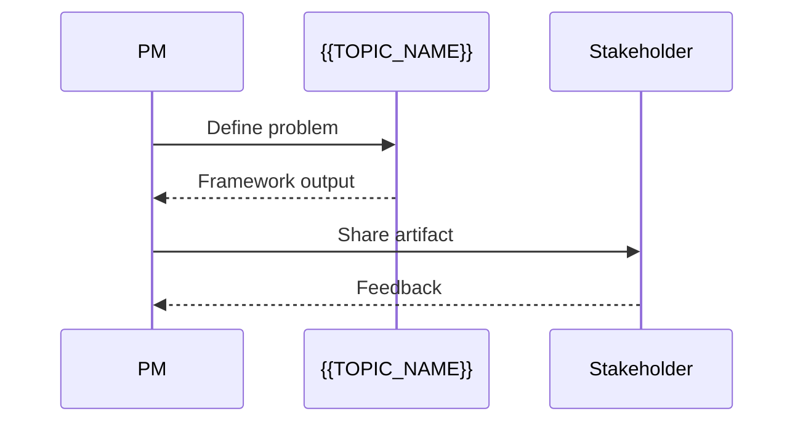

```text
// Second pattern template
```

> Include 2 patterns at this level. Keep diagrams simple — flowcharts and sequence diagrams only.

---

## Best Practices

Basic clean PM principles when working with {{TOPIC_NAME}}:

### Naming Conventions

| Bad ❌ | Good ✅ |
|--------|---------|
| "Improve the app" | "Reduce checkout abandonment rate by 15% in Q2" |
| "Users want X" | "3 of 5 user interviews mentioned X as top pain point" |
| "Do this ASAP" | "Priority: P1 — impacts 40% of DAU" |

**Rules:**
- Goals: specific, measurable, time-bound
- Problems: evidence-backed, not assumption-based
- Priorities: explicit criteria, not gut feel

---

### Artifact Design

```text
// Bad PRD
Title: New Feature
Description: Build something cool

// Good PRD
Title: Reduce Cart Abandonment — Simplified Checkout Flow
Problem: 62% of users drop at payment step (Mixpanel, Q1 data)
Success Metric: Reduce abandonment by 15% within 60 days of launch
```

**Rule:** If you can't explain it in one sentence, you don't understand the problem yet.

---

## Product Use / Feature

How this topic is used in real-world products and teams:

### 1. {{Product/Company Name}}

- **How it uses {{TOPIC_NAME}}:** Brief description
- **Why it matters:** Practical impact

### 2. {{Product/Company Name}}

- **How it uses {{TOPIC_NAME}}:** Brief description
- **Why it matters:** Practical impact

### 3. {{Product/Company Name}}

- **How it uses {{TOPIC_NAME}}:** Brief description
- **Why it matters:** Practical impact

---

## Common Failure Modes and Recovery

How to handle common failure modes when working with {{TOPIC_NAME}}:

### Failure Mode 1: {{Common anti-pattern or breakdown}}

**Symptom:** What you observe (vague requirements, missing acceptance criteria, etc.)
**Why it happens:** Simple explanation.
**How to recover:**

```text
Recovery Template:
Step 1: [Stop and identify the root confusion]
Step 2: [Go back to the user problem]
Step 3: [Rewrite with specificity]
Step 4: [Validate with stakeholder]
```

### Failure Mode 2: {{Another common failure}}

...

> 2-4 failure modes. Show the symptom, explain why, and provide the recovery steps.

---

## Security Considerations

Data and process security aspects to keep in mind with {{TOPIC_NAME}}:

### 1. {{Security concern — e.g., sharing unvalidated user data in PRDs}}

**Risk:** What could go wrong (data exposure, compliance violation, etc.)
**Mitigation:** How to protect against it.

### 2. {{Another security concern}}

...

---

## Performance Tips

Basic efficiency considerations for {{TOPIC_NAME}}:

### Tip 1: {{Process improvement}}

**Before (slow):**
```text
// Inefficient approach description
```

**After (faster):**
```text
// More efficient approach
```

**Why it's better:** Simple explanation.

### Tip 2: {{Another tip}}

...

---

## Metrics & Analytics

Key metrics to track when using {{TOPIC_NAME}}:

### What to Measure

| Metric | Why it matters | Tool |
|--------|---------------|------|
| **{{metric 1}}** | {{reason}} | Mixpanel, Amplitude |
| **{{metric 2}}** | {{reason}} | Jira, Linear |

### Basic Instrumentation

```text
OKR Template:
Objective: [Qualitative goal]
Key Result 1: [Measurable outcome]
Key Result 2: [Measurable outcome]
Key Result 3: [Measurable outcome]
```

---

## Edge Cases & Pitfalls

### Pitfall 1: {{name}}

```text
// Scenario that demonstrates the pitfall
```

**What happens:** Explanation of unexpected behavior.
**How to fix:** Corrected approach.

### Pitfall 2: {{name}}

...

---

## Common Mistakes

### Mistake 1: {{description}}

```text
// Bad approach
...

// Better approach
...
```

### Mistake 2: {{description}}

...

---

## Common Misconceptions

### Misconception 1: "{{False belief}}"

**Reality:** {{What's actually true}}
**Why people think this:** {{Why this misconception is common}}

### Misconception 2: "{{Another false belief}}"

**Reality:** {{What's actually true}}

---

## Tricky Points

Things that look simple but have subtle behavior:

### Tricky Point 1: {{name}}

```text
// Situation that might surprise a junior PM
```

**Why it's tricky:** Explanation.
**Key takeaway:** One-line lesson.

---

## Test

### Multiple Choice

**1. {{Question}}?**

- A) Option A
- B) Option B
- C) Option C
- D) Option D

<details>
<summary>Answer</summary>
**C)** — Explanation why C is correct and why others are wrong.
</details>

**2. {{Question}}?**

...

### True or False

**3. {{Statement}}**

<details>
<summary>Answer</summary>
**False** — Explanation.
</details>

### What's the Output?

**4. A PM writes the following user story. What's wrong with it?**

```text
// story or artifact snippet
```

<details>
<summary>Answer</summary>
Output: `...`
Explanation: ...
</details>

> 5-8 test questions total. Mix of multiple choice, true/false, and artifact analysis.

---

## "What If?" Scenarios

**What if {{Unexpected situation}}?**
- **You might think:** {{Intuitive but wrong answer}}
- **But actually:** {{Correct behavior and why}}

---

## Tricky Questions

**1. {{Confusing question}}?**

- A) {{Looks correct but wrong}}
- B) {{Correct answer}}
- C) {{Common misconception}}
- D) {{Partially correct}}

<details>
<summary>Answer</summary>
**B)** — Explanation of why the "obvious" answers are wrong.
</details>

---

## Cheat Sheet

Quick reference for this topic:

| What | Framework / Template | Example |
|------|---------------------|---------|
| {{Action 1}} | `{{framework}}` | `{{example}}` |
| {{Action 2}} | `{{framework}}` | `{{example}}` |
| {{Action 3}} | `{{framework}}` | `{{example}}` |

---

## Self-Assessment Checklist

### I can explain:
- [ ] What {{TOPIC_NAME}} is and why it exists
- [ ] When to use it and when NOT to use it
- [ ] {{Specific concept 1}} in my own words
- [ ] {{Specific concept 2}} in my own words

### I can do:
- [ ] Write a basic artifact from scratch (without looking)
- [ ] Read and understand a PRD or roadmap that uses {{TOPIC_NAME}}
- [ ] Identify simple failure modes related to this topic
- [ ] {{Topic-specific practical skill}}

---

## Summary

- Key point 1
- Key point 2
- Key point 3

**Next step:** What to learn after this topic.

---

## What You Can Build

### Projects you can create:
- **{{Project 1}}:** Brief description — uses {{specific concept from this topic}}
- **{{Project 2}}:** Brief description — combines with {{other topic}}
- **{{Project 3}}:** Brief description — practical daily-use tool

### Learning path — what to study next:

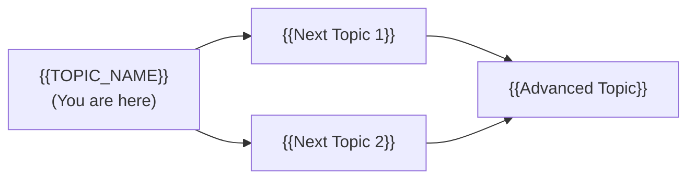

---

## Further Reading

- **Official docs:** [{{link title}}]({{url}})
- **Blog post:** [{{link title}}]({{url}}) — brief description
- **Video:** [{{link title}}]({{url}}) — duration, what it covers
- **Book chapter:** {{book name}}, Chapter X — what it covers

---

## Related Topics

- **[{{Related Topic 1}}](../XX-related-topic/)** — how it connects
- **[{{Related Topic 2}}](../XX-related-topic/)** — how it connects

---

## Diagrams & Visual Aids

### Mind Map

```mermaid
mindmap
  root(({{TOPIC_NAME}}))
    Core Concept 1
      Sub-concept A
      Sub-concept B
    Core Concept 2
      Sub-concept C
      Sub-concept D
    Related Topics
      {{Related 1}}
      {{Related 2}}
```

### Example — Process Flow

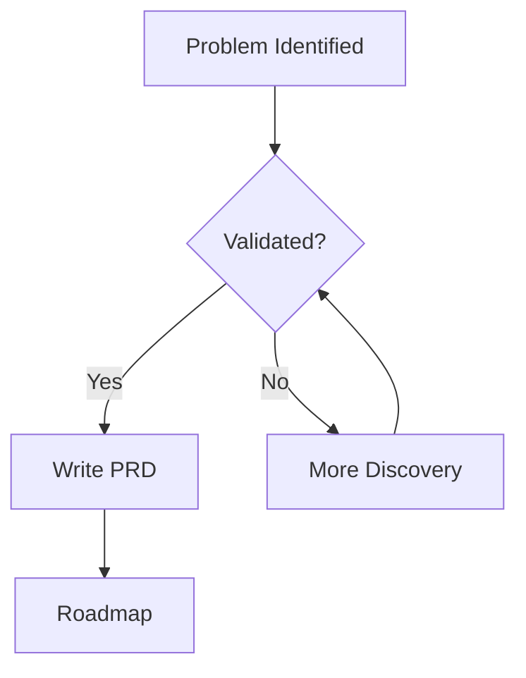

</details>

---
---

# TEMPLATE 2 — `middle.md`

<details open>
<summary><strong>Template Content</strong></summary>

# {{TOPIC_NAME}} — Middle Level

## Table of Contents

1. [Introduction](#introduction)
2. [Core Concepts](#core-concepts)
3. [Pros & Cons](#pros--cons)
4. [Use Cases](#use-cases)
5. [Example Artifacts / Templates](#example-artifacts--templates)
6. [Product Use / Feature](#product-use--feature)
7. [Common Failure Modes and Recovery](#common-failure-modes-and-recovery)
8. [Security Considerations](#security-considerations)
9. [Performance Optimization](#performance-optimization)
10. [Metrics & Analytics](#metrics--analytics)
11. [Diagnosing Product / Process Problems](#diagnosing-product--process-problems)
12. [Best Practices](#best-practices)
13. [Edge Cases & Pitfalls](#edge-cases--pitfalls)
14. [Common Mistakes](#common-mistakes)
15. [Tricky Points](#tricky-points)
16. [Comparison with Alternative VCS](#comparison-with-alternative-approaches)
17. [Test](#test)
18. [Tricky Questions](#tricky-questions)
19. [Cheat Sheet](#cheat-sheet)
20. [Summary](#summary)
21. [What You Can Build](#what-you-can-build)
22. [Further Reading](#further-reading)
23. [Related Topics](#related-topics)
24. [Diagrams & Visual Aids](#diagrams--visual-aids)

---

## Introduction

> Focus: "Why?" and "When to use?"

Assumes the reader already knows the basics. This level covers:
- Deeper understanding of how {{TOPIC_NAME}} works in a real team
- Real-world application patterns and trade-offs
- Production considerations for product delivery

---

## Core Concepts

### Concept 1: {{Advanced concept}}

Detailed explanation with diagrams where helpful.


### Concept 2: {{Another concept}}

- How it relates to other PM frameworks
- Behavioral differences across team sizes
- Velocity and cycle time implications

---

## Evolution & Historical Context

Why does {{TOPIC_NAME}} exist? What problem does it solve?

**Before {{TOPIC_NAME}}:**
- How PMs solved this problem previously
- The pain points and limitations of the old approach

**How {{TOPIC_NAME}} changed things:**
- The shift it introduced
- Why it became standard practice

---

## Pros & Cons

| Pros | Cons |
|------|------|
| {{Advantage 1 with production context}} | {{Disadvantage 1 with impact analysis}} |
| {{Advantage 2}} | {{Disadvantage 2}} |
| {{Advantage 3}} | {{Disadvantage 3}} |

### Trade-off analysis:

- **{{Trade-off 1}}:** When {{advantage}} outweighs {{disadvantage}}
- **{{Trade-off 2}}:** When to accept {{limitation}} for {{benefit}}

### Comparison with alternatives:

| Approach | Pros | Cons | Best for |
|----------|------|------|----------|
| {{Approach A}} | {{pros}} | {{cons}} | {{scenario}} |
| {{Approach B}} | {{pros}} | {{cons}} | {{scenario}} |

---

## Alternative Approaches (Plan B)

If you couldn't use {{TOPIC_NAME}}, how else could you solve the problem?

| Alternative | How it works | When you might be forced to use it |
|-------------|--------------|------------------------------------|
| **{{Alternative 1}}** | {{Brief explanation}} | {{e.g., "If team is too small for full discovery"}} |
| **{{Alternative 2}}** | {{Brief explanation}} | {{e.g., "If timeline is extremely compressed"}} |

---

## Use Cases

Real-world, production scenarios:

- **Use Case 1:** {{Production scenario}} — e.g., "Quarterly roadmap planning with three competing business units"
- **Use Case 2:** {{Scaling scenario}}
- **Use Case 3:** {{Integration scenario}}

---

## Example Artifacts / Templates

### Example 1: {{Production-ready artifact}}

```text
[Production-quality artifact with all fields, reasoning, and tradeoffs documented]
```

**Why this pattern:** Explanation of design decisions.
**Trade-offs:** What you gain and what you sacrifice.

### Example 2: {{Comparison of approaches}}

```text
// Approach A
...

// Approach B (better for X reason)
...
```

**When to use which:** Decision criteria.

---

## Process Patterns

Design patterns and idiomatic patterns for {{TOPIC_NAME}} in production PM work:

### Pattern 1: {{Framework or methodology name}}

**Category:** Discovery / Delivery / Prioritization / Stakeholder Management
**Intent:** {{What problem this pattern solves at the process level}}
**When to use:** {{Specific scenario}}
**When NOT to use:** {{Counter-indication}}

**Structure diagram:**

```mermaid
classDiagram
    class {{ProcessFramework}} {
        <<framework>>
        +{{step1()}} Output
    }
    class {{PhaseA}} {
        +{{step1()}} Output
    }
    class {{PhaseB}} {
        +{{step2()}} Output
    }
    class {{PMRole}} {
        -{{ProcessFramework}} process
        +execute()
    }
    {{ProcessFramework}} <|.. {{PhaseA}}
    {{ProcessFramework}} <|.. {{PhaseB}}
    {{PMRole}} --> {{ProcessFramework}}
```

**Implementation:**

```text
// Pattern steps with real {{TOPIC_NAME}} usage
Step 1: ...
Step 2: ...
Step 3: ...
```

**Trade-offs:**

| Pros ✅ | Cons ❌ |
|---------|---------|
| {{benefit 1}} | {{drawback 1}} |
| {{benefit 2}} | {{drawback 2}} |

---

### Pattern 2: {{Another pattern}}

**Category:** Discovery / Delivery / Alignment
**Intent:** {{What it solves}}

**Flow diagram:**

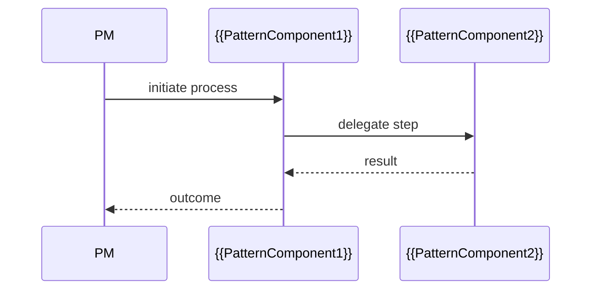

```text
// Implementation template
```

---

### Pattern 3: {{Idiomatic / team-specific pattern}}

**Intent:** {{Team workflow or communication idiom}}

```mermaid
graph LR
    A[{{Input}}] -->|transform| B[{{TOPIC_NAME}} idiom]
    B -->|result| C[{{Output}}]
    B -.->|avoids| D[❌ Common anti-pattern]
```

```text
// Bad approach
...

// Better idiomatic approach
...
```

---

## Best Practices

Production-level clean PM principles for {{TOPIC_NAME}}:

### Naming & Clarity

| Element | Rule | Example |
|---------|------|---------|
| OKRs | Verb + measurable outcome | "Increase D7 retention from 30% to 45%" |
| User stories | Role + action + benefit | "As a new user, I want onboarding tips, so I activate faster" |
| Feature flags | Descriptive + owner | `checkout_v2_experiment_pmname` |

---

### SOLID PM Principles

**Single Responsibility (for PRDs):**
```text
// Bad — one PRD covers three unrelated features
PRD: "Improve Dashboard, Fix Notifications, Redesign Settings"

// Good — each PRD solves one focused problem
PRD: "Reduce Dashboard Load Time for Enterprise Customers"
```

---

## Product Use / Feature

How this topic is applied in production teams and popular products:

### 1. {{Product/Company Name}}

- **How it uses {{TOPIC_NAME}}:** Description with context
- **Scale:** Team size, number of users, cadence
- **Key insight:** What can be learned from their approach

### 2. {{Product/Company Name}}

- **How it uses {{TOPIC_NAME}}:** Description
- **Why this approach:** Trade-offs they made

---

## Common Failure Modes and Recovery

Production-grade failure mode handling for {{TOPIC_NAME}}:

### Failure Mode 1: {{e.g., Scope creep without documentation}}

**Symptoms:** What you observe in the team or sprint.

**Recovery steps:**
```text
1. Freeze scope immediately — no new items in current sprint
2. Document what was added and who requested it
3. Move new items to backlog with proper sizing
4. Conduct retrospective on why it happened
```

**Root cause:** Why this happens.
**Prevention:** Process or ritual to prevent recurrence.

### Failure Mode 2: {{e.g., Poor stakeholder alignment before launch}}

...

---

## Security Considerations

### 1. {{Security concern}}

**Risk level:** High / Medium / Low

```text
// Insecure process (e.g., sharing PII in Jira tickets)
...

// Secure process
...
```

**Mitigation:** Step-by-step fix.

---

## Performance Optimization

Process efficiency considerations for {{TOPIC_NAME}}:

### Optimization 1: {{name}}

```text
// Slow process — too many approval gates
...

// Optimized process — async approvals, clear RACI
...
```

**Before/After metrics:**
```
Before: Average cycle time = 14 days
After:  Average cycle time = 6 days
```

**When to optimize:** Only when process data shows this is a bottleneck.

---

## Metrics & Analytics

Production-grade metrics and observability for {{TOPIC_NAME}}:

### Key Metrics

| Metric | Type | Description | Alert threshold |
|--------|------|-------------|-----------------|
| **Cycle time** | Lead time | Days from idea to shipped | > 21 days |
| **Velocity** | Sprint metric | Story points per sprint | < baseline - 20% |
| **Feature adoption %** | Product metric | % users using feature in 30 days | < 10% |

### OKR Instrumentation

```text
Objective: {{Qualitative aspiration}}
KR1: Increase {{metric}} from {{baseline}} to {{target}} by {{date}}
KR2: Reduce {{metric}} from {{baseline}} to {{target}} by {{date}}
KR3: Launch {{feature}} with {{adoption %}} in first 30 days
```

### Dashboard Panels

| Panel | Metric | Visualization |
|-------|--------|---------------|
| Feature adoption | % WAU using feature | Line chart |
| Cycle time | Days idea→shipped | Bar chart |
| Churn reduction | Monthly churn % | Trend line |

---

## Diagnosing Product / Process Problems

How to diagnose common issues related to {{TOPIC_NAME}}:

### Problem 1: {{Common symptom — e.g., "Team velocity dropping"}}

**Symptoms:** What you observe in sprint reviews or retrospectives.

**Diagnostic steps:**
```text
# Steps to identify the issue
1. Pull last 6 sprint velocity reports
2. Check for scope creep patterns in Jira
3. Interview 2-3 engineers about blockers
```

**Root cause:** Why this happens.
**Fix:** How to resolve it.

### Problem 2: {{Another common issue}}

...

### Useful Tools

| Tool | Command/Action | What it shows |
|------|---------------|---------------|
| Jira | Velocity chart | Sprint health |
| Mixpanel | Funnel analysis | Drop-off points |
| Linear | Cycle time report | Delivery efficiency |

---

## Edge Cases & Pitfalls

### Pitfall 1: {{Production pitfall}}

```text
// Process that causes issues at scale
```

**Impact:** What goes wrong.
**Detection:** How to notice the problem.
**Fix:** Corrected approach.

---

## Common Mistakes

### Mistake 1: {{Middle-level mistake}}

```text
// Looks correct but has subtle issues
...

// Properly handles edge cases
...
```

**Why it's wrong:** Explanation.

---

## Common Misconceptions

### Misconception 1: "{{False belief}}"

**Reality:** {{What's actually true}}

**Evidence:**
```text
// Example or data that proves the misconception wrong
```

---

## Anti-Patterns

### Anti-Pattern 1: {{Name}}

```text
// The Anti-Pattern (looks clean, but creates technical debt)
...
```

**Why it's bad:** How it causes pain later.
**The fix:** What to use instead.

---

## Tricky Points

### Tricky Point 1: {{Subtle behavior}}

```text
// Process with non-obvious outcome
```

**What actually happens:** Step-by-step explanation.

---

## Comparison with Alternative Approaches

How {{TOPIC_NAME}} compares to other frameworks/methodologies:

| Aspect | {{TOPIC_NAME}} | Alternative A | Alternative B | Alternative C |
|--------|----------------|---------------|---------------|---------------|
| {{Aspect 1}} | {{approach}} | {{approach}} | {{approach}} | {{approach}} |
| {{Aspect 2}} | ... | ... | ... | ... |

### Key differences:

- **{{TOPIC_NAME}} vs Alternative A:** {{main difference and why it matters}}
- **{{TOPIC_NAME}} vs Alternative B:** {{main difference and why it matters}}

---

## Test

### Multiple Choice (harder)

**1. {{Question involving trade-offs or subtle behavior}}?**

<details>
<summary>Answer</summary>
**B)** — Detailed explanation.
</details>

### Process Analysis

**2. What happens when this process runs with a new stakeholder who wasn't in the kickoff?**

```text
// process description
```

<details>
<summary>Answer</summary>
Explanation of alignment failure / correct approach.
</details>

---

## Tricky Questions

**1. {{Question that tests deep understanding}}?**

<details>
<summary>Answer</summary>
**D)** — Deep explanation of why the intuitive answer is wrong.
</details>

---

## Cheat Sheet

| Scenario | Pattern | Key consideration |
|----------|---------|-------------------|
| {{Scenario 1}} | `{{pattern}}` | {{what to watch for}} |
| {{Scenario 2}} | `{{pattern}}` | {{what to watch for}} |

### Decision Matrix

| If you need... | Use... | Because... |
|----------------|--------|------------|
| {{need 1}} | {{approach}} | {{reason}} |
| {{need 2}} | {{approach}} | {{reason}} |

---

## Self-Assessment Checklist

### I can explain:
- [ ] Why {{TOPIC_NAME}} is designed this way
- [ ] Trade-offs between different approaches
- [ ] How this topic interacts with {{related topic 1}}
- [ ] Velocity and cycle time implications

### I can do:
- [ ] Write production-quality artifacts using {{TOPIC_NAME}}
- [ ] Choose the right approach based on requirements
- [ ] Diagnose process issues related to this topic
- [ ] Facilitate retrospectives covering this topic

---

## Summary

- Key insight 1
- Key insight 2
- Key insight 3

**Key difference from Junior:** What deeper understanding was gained.
**Next step:** What to explore at Senior level.

---

## What You Can Build

### Production systems:
- **{{System 1}}:** Description — applies {{specific pattern from this level}}
- **{{System 2}}:** Description

### Learning path:

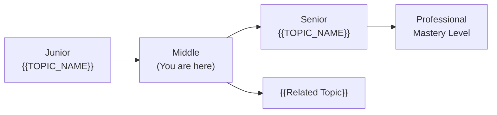

---

## Further Reading

- **Official docs:** [{{link title}}]({{url}})
- **Blog post:** [{{link title}}]({{url}}) — what you'll learn
- **Conference talk:** [{{link title}}]({{url}}) — speaker, event, key takeaways
- **Open source:** [{{project name}}]({{url}}) — how it demonstrates this topic

---

## Related Topics

- **[{{Related Topic 1}}](../XX-related-topic/)** — how it connects
- **[{{Related Topic 2}}](../XX-related-topic/)** — how it connects

---

## Diagrams & Visual Aids

### Example — Process Flowchart

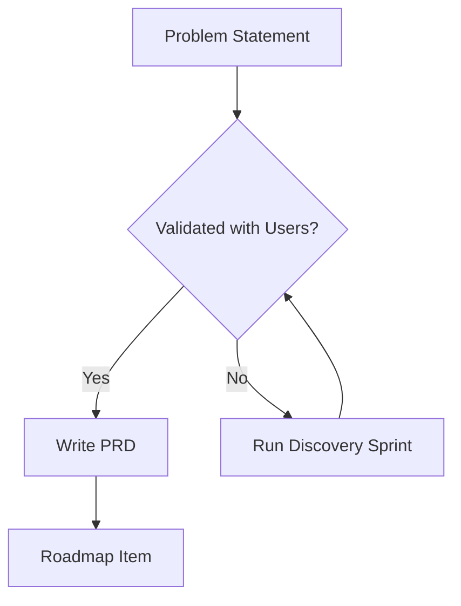

### Example — Stakeholder Map

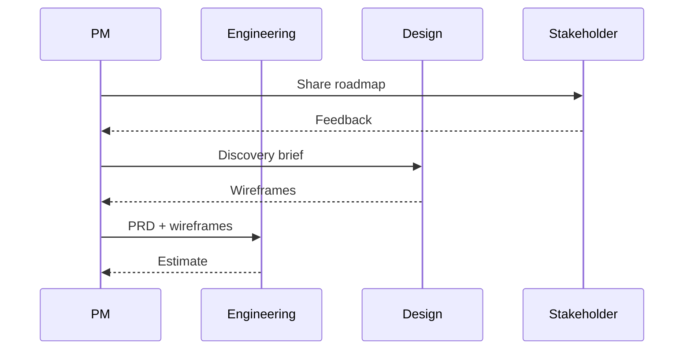

</details>

---
---

# TEMPLATE 3 — `senior.md`

<details open>
<summary><strong>Template Content</strong></summary>

# {{TOPIC_NAME}} — Senior Level

## Table of Contents

1. [Introduction](#introduction)
2. [Core Concepts](#core-concepts)
3. [Pros & Cons](#pros--cons)
4. [Use Cases](#use-cases)
5. [Example Artifacts / Templates](#example-artifacts--templates)
6. [Product Use / Feature](#product-use--feature)
7. [Common Failure Modes and Recovery](#common-failure-modes-and-recovery)
8. [Security Considerations](#security-considerations)
9. [Performance Optimization](#performance-optimization)
10. [Metrics & Analytics](#metrics--analytics)
11. [Diagnosing Product / Process Problems](#diagnosing-product--process-problems)
12. [Best Practices](#best-practices)
13. [Edge Cases & Pitfalls](#edge-cases--pitfalls)
14. [Common Mistakes](#common-mistakes)
15. [Tricky Points](#tricky-points)
16. [Comparison with Alternative Approaches](#comparison-with-alternative-approaches)
17. [Test](#test)
18. [Tricky Questions](#tricky-questions)
19. [Cheat Sheet](#cheat-sheet)
20. [Summary](#summary)
21. [What You Can Build](#what-you-can-build)
22. [Further Reading](#further-reading)
23. [Related Topics](#related-topics)
24. [Diagrams & Visual Aids](#diagrams--visual-aids)

---

## Introduction

> Focus: "How to optimize?" and "How to architect?"

For PMs who:
- Design product systems and make strategic architectural decisions
- Optimize delivery cycles and team performance
- Mentor junior/middle PMs
- Define and enforce product standards across teams

---

## Core Concepts

### Concept 1: {{Architecture-level concept}}

Deep dive with:
- Strategic patterns and when to apply them
- Performance characteristics (cycle time, team velocity, adoption)
- Comparison with alternative approaches at other companies

```text
// Advanced framework with detailed annotations
```

### Concept 2: {{Optimization concept}}

Before/After metrics:

```
Before: Feature cycle time = 21 days, Adoption at 30 days = 8%
After:  Feature cycle time = 9 days,  Adoption at 30 days = 24%
```

---

## Pros & Cons

### Strategic analysis for architectural decisions:

| Pros | Cons | Impact |
|------|------|--------|
| {{Advantage 1}} | {{Disadvantage 1}} | {{Impact on product strategy}} |
| {{Advantage 2}} | {{Disadvantage 2}} | {{Impact on team/maintenance}} |
| {{Advantage 3}} | {{Disadvantage 3}} | {{Impact on delivery/scale}} |

### When this approach is the RIGHT choice:
- {{Scenario 1}} — why the pros outweigh the cons here

### When this approach is the WRONG choice:
- {{Scenario 1}} — what to use instead and why

### Real-world decision examples:
- **{{Company X}}** chose {{approach}} because {{reasoning}} — result: {{outcome}}
- **{{Company Y}}** avoided {{approach}} because {{reasoning}} — alternative: {{what they used}}

---

## Use Cases

Architectural and system-level scenarios:

- **Use Case 1:** {{Strategy scenario}} — e.g., "Designing a discovery system for a 50-person product org"
- **Use Case 2:** {{Migration scenario}} — e.g., "Transitioning from output-based to outcome-based roadmaps"
- **Use Case 3:** {{Optimization scenario}} — e.g., "Reducing time-to-market from 6 weeks to 2 weeks"

---

## Example Artifacts / Templates

### Example 1: {{Architecture artifact}}

```text
// Full implementation of a production PM artifact
// With strategy context, stakeholder alignment, success metrics, and rollback plan
```

**Architecture decisions:** Why this structure.
**Alternatives considered:** What else could work and why this was chosen.

### Example 2: {{Performance optimization artifact}}

```text
// Before optimization — original process artifact
...

// After optimization — streamlined artifact with benchmark
...
```

---

## Process Patterns

Architectural and advanced patterns for {{TOPIC_NAME}} in production product organizations:

### Pattern 1: {{Strategic pattern — e.g., Outcome-Based Roadmapping, RICE+, Continuous Discovery}}

**Category:** Strategic / Discovery / Delivery / Organizational
**Intent:** {{The org-level problem this pattern solves}}
**Problem it solves:** {{Concrete scenario}}
**Trade-offs:** {{What you gain vs what complexity you add}}

**Architecture diagram:**

```mermaid
graph TD
    subgraph "{{Pattern Name}}"
        A[{{Component 1}}] -->|{{action}}| B[{{Component 2}}]
        B -->|{{action}}| C[{{Component 3}}]
        C -.->|async| D[{{Component 4}}]
    end
    E[Stakeholder] -->|input| A
    D -->|outcome| F[{{Downstream team}}]
```

**Implementation:**

```text
// Senior-level implementation
// Full pattern with stakeholder management, observability, graceful degradation
Step 1: ...
Step 2: ...
Step 3: ...
```

**When this pattern wins:**
- {{Scenario 1 where it excels}}
- {{Scenario 2}}

**When to avoid:**
- {{Scenario where it adds unnecessary complexity}}

---

### Pattern 2: {{Delivery / Velocity pattern}}

**Category:** Delivery / Efficiency / Resource Management
**Intent:** {{What it optimizes}}

**Flow diagram:**

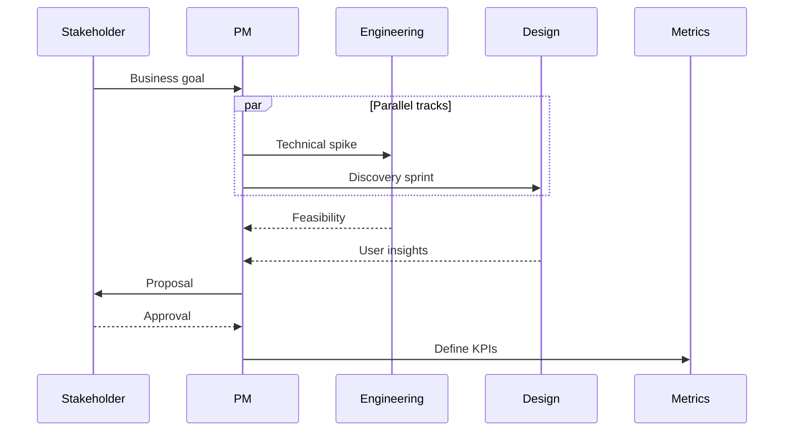

```text
// Implementation with proper resource management
```

---

### Pattern 3: {{Resilience / Stakeholder alignment pattern}}

**Category:** Resilience / Reliability / Org Health
**Intent:** {{How it improves product org reliability}}

**State diagram:**

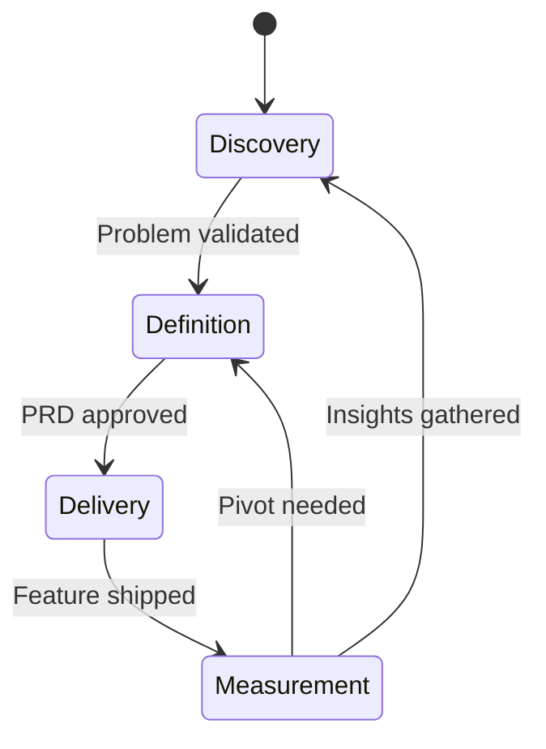

```text
// Production implementation with metrics and observability
```

**Metrics to track:**
- Cycle time — target < 14 days end-to-end
- Stakeholder alignment score — measure via retrospective NPS

---

### Pattern 4: {{OKR / Metrics architecture pattern}}

**Category:** Metrics / Alignment / Governance
**Intent:** {{How it creates measurable, outcome-focused delivery}}


```text
// OKR cascade template
Company: Grow revenue 30% YoY
  Team: Increase conversion rate from 2% to 3.5%
    Feature: Reduce checkout steps from 5 to 3
      Sprint: Ship address autofill
        Story: As a returning user, I want saved addresses...
```

**Pattern Comparison Matrix:**

| Pattern | Use When | Avoid When | Complexity |
|---------|----------|------------|------------|
| Outcome roadmap | Mature org, clear metrics | Early stage, pivoting | Medium |
| Continuous discovery | High user access | B2B, slow users | Medium |
| RICE prioritization | Many competing items | Small backlog | Low |
| OKR cascade | Org alignment needed | Small team (<5 PMs) | High |

---

## Best Practices

### Must Do ✅

1. **{{Best practice 1}}** — why it matters in production
   ```text
   // Example demonstrating the practice
   ```

2. **{{Best practice 2}}** — impact on team velocity/alignment
   ```text
   // Example
   ```

3. **{{Best practice 3}}**
   ```text
   // Example
   ```

### Never Do ❌

1. **{{Anti-practice 1}}** — what goes wrong when ignored
   ```text
   // What NOT to do
   // What to do instead
   ```

2. **{{Anti-practice 2}}**

3. **{{Anti-practice 3}}**

### Production Checklist

- [ ] Feature has measurable success criteria defined before building
- [ ] All edge cases covered in acceptance criteria
- [ ] Stakeholder alignment confirmed in writing before sprint
- [ ] Security and compliance review completed
- [ ] Rollback plan documented
- [ ] Metrics instrumentation verified before launch
- [ ] Launch communication plan in place

---

## Product Use / Feature

How industry leaders use this topic at scale:

### 1. {{Company/Product Name}}

- **Architecture:** How they implement {{TOPIC_NAME}} at scale
- **Scale:** Specific numbers (team size, roadmap items, quarterly cadence)
- **Lessons learned:** What they changed and why
- **Source:** Blog post, talk, or framework reference

### 2. {{Company/Product Name}}

- **Architecture:** Description
- **Trade-offs:** What they sacrificed and gained

---

## Common Failure Modes and Recovery

Enterprise-grade failure mode strategies for {{TOPIC_NAME}}:

### Strategy 1: {{Failure mode architecture}}

```text
// Org-level failure mode pattern
// with escalation, rollback, and recovery documentation
```

**When to use:** Large codebases/teams with multiple failure domains.
**Trade-off:** More process overhead vs better debugging and recovery.

### Failure Mode Architecture

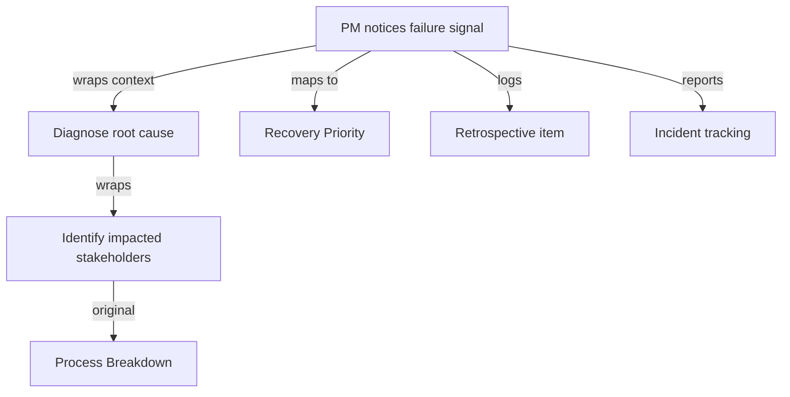

---

## Security Considerations

Security architecture for {{TOPIC_NAME}} at scale:

### 1. {{Critical security concern}}

**Risk level:** Critical
**Compliance category:** {{GDPR / SOC2 / HIPAA relevance}}

```text
// Vulnerable process — {{why it's risky}}
...

// Secure process — {{what makes it safe}}
...
```

**Attack scenario:** Step-by-step of how this could cause a compliance violation or data breach.
**Defense in depth:** Multiple layers of protection.

### Security Architecture Checklist

- [ ] **Data minimization** — only collect what's needed
- [ ] **Access controls** — PRDs and roadmaps behind appropriate access
- [ ] **Audit trail** — all decisions logged with rationale
- [ ] **Vendor review** — new tools reviewed before adoption
- [ ] **User consent** — user research governed by consent protocols

---

## Performance Optimization

Advanced process optimization strategies for {{TOPIC_NAME}}:

### Optimization 1: {{name}}

```text
// Before — slow process with bottlenecks
...

// After — streamlined process
...
```

**Before/After metrics:**
```
Before: Cycle time = 21 days, Stakeholder revisions = 4.2 avg
After:  Cycle time = 8 days,  Stakeholder revisions = 1.1 avg
```

### Performance Architecture

| Layer | Optimization | Impact | Cost |
|:-----:|:------------|:------:|:----:|
| **Discovery** | Continuous interviews | Highest | Requires setup |
| **Definition** | PRD templates + linting | High | Moderate effort |
| **Delivery** | RICE + async approvals | Medium | Low effort |
| **Measurement** | Pre-instrumented metrics | High | Requires eng collaboration |

---

## Metrics & Analytics

Observability architecture and SLO design for {{TOPIC_NAME}}:

### SLO / SLA Definition

| SLI | SLO Target | Measurement window | Consequence if breached |
|-----|-----------|-------------------|------------------------|
| **Feature adoption** | > 20% at 30 days | Per release | Post-mortem required |
| **Cycle time** | < 14 days | Rolling quarter | Process retrospective |
| **Stakeholder NPS** | > 7 | Quarterly | PM coaching |

### Metrics Architecture

```
[{{TOPIC_NAME}} process]
        │
        ├── /metrics (product analytics)
        │       ├── cycle_time_days (histogram)
        │       ├── feature_adoption_pct (gauge, labels: feature, cohort)
        │       └── stakeholder_nps (gauge)
        │
        └── Structured retrospective → Confluence / Notion
                └── decision_id → Decision log
```

### Business vs Technical Metrics

| Layer | Metric | Owner |
|-------|--------|-------|
| **Business** | Revenue impact per feature | Exec |
| **Product** | Adoption %, churn reduction | PM |
| **Process** | Cycle time, velocity | Engineering |

---

## Diagnosing Product / Process Problems

Advanced diagnostic techniques for {{TOPIC_NAME}} at scale:

### Problem 1: {{Production process issue}}

**Symptoms:** What data or team signals show this.

**Diagnostic steps:**
```text
# Advanced diagnostic approach
1. Pull cycle time data for last 3 quarters
2. Map all approval gates and their avg delay
3. Interview 5 engineers about biggest blockers
4. Review last 10 post-mortems for recurring themes
```

**Root cause analysis:** Deep explanation.
**Fix:** Architecture-level solution.
**Prevention:** How to prevent this in the future.

---

## Edge Cases & Pitfalls

### Pitfall 1: {{Scale pitfall}}

```text
// Process that works fine until 10+ PMs / 5+ teams / etc.
```

**At what scale it breaks:** Specific numbers.
**Root cause:** Why it fails.
**Solution:** Architecture-level fix.

---

## Postmortems & System Failures

Real-world examples of how misunderstanding {{TOPIC_NAME}} caused product failures:

### The {{Company/Product}} Case

- **The goal:** {{What they were trying to achieve}}
- **The mistake:** {{How they misused this topic/framework}}
- **The impact:** {{Missed metrics, churn increase, team misalignment}}
- **The fix:** {{How they solved it permanently}}

**Key takeaway:** {{Strategic lesson learned}}

---

## Tricky Questions

**1. {{Question that even experienced PMs get wrong}}?**

<details>
<summary>Answer</summary>
Detailed explanation with framework reference and real-world example.
</details>

---

## Cheat Sheet

### Architecture Decision Matrix

| Scenario | Recommended pattern | Avoid | Why |
|----------|-------------------|-------|-----|
| {{scenario 1}} | {{pattern}} | {{anti-pattern}} | {{reasoning}} |
| {{scenario 2}} | {{pattern}} | {{anti-pattern}} | {{reasoning}} |

### Before/After Team Velocity Metrics

| Optimization | Before | After | Improvement |
|-------------|--------|-------|-------------|
| Continuous discovery | 21 day avg idea→launch | 9 days | 2.3x faster |
| Async stakeholder review | 4.2 revision rounds | 1.1 rounds | 74% less rework |
| OKR cascade | 43% features unmeasured | 91% measured | 112% improvement |

### Heuristics & Rules of Thumb

- **The 3-Interview Rule:** Never write a PRD until you've talked to at least 3 users about the problem.
- **The Two-Metric Rule:** Every feature needs exactly 2 success metrics — one leading, one lagging.
- **The Reversibility Heuristic:** If the decision is reversible in < 30 days, ship and measure. If not, document trade-offs first.

---

## Summary

- Key architectural insight 1
- Key performance insight 2
- Key leadership insight 3

**Senior mindset:** Not just "how" but "when", "why", and "what are the trade-offs".

---

## What You Can Build

### Architect and lead:
- **{{System/Platform 1}}:** Large-scale product system — applies {{architectural pattern}}
- **{{System/Platform 2}}:** High-performance delivery infrastructure

### Career impact:
- **Staff/Principal PM** — system design interviews require this depth
- **Head of Product** — mentor others on {{TOPIC_NAME}} architectural decisions

---

## Further Reading

- **Framework doc:** [{{link title}}]({{url}}) — context on why this was designed this way
- **Conference talk:** [{{talk title}}]({{url}}) — speaker, key insights
- **Blog post:** [{{title}}]({{url}}) — production experience at scale
- **Book:** {{book name}}, Chapter X — deep dive on this topic

---

## Diagrams & Visual Aids

### Example — Architecture Diagram

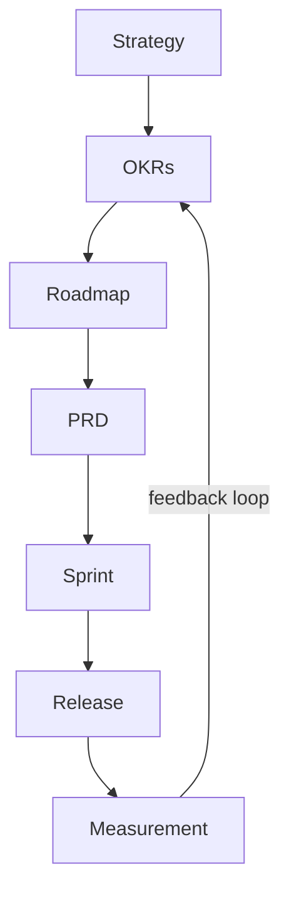

</details>

---
---

# TEMPLATE 4 — `professional.md`

<details open>
<summary><strong>Template Content</strong></summary>

# {{TOPIC_NAME}} — Mastery and Leadership Level

## Table of Contents

1. [Introduction](#introduction)
2. [Leadership Philosophy](#leadership-philosophy)
3. [Organizational Dynamics](#organizational-dynamics)
4. [Influence Without Authority](#influence-without-authority)
5. [Building Systems, Not Just Skills](#building-systems-not-just-skills)
6. [Measuring Mastery](#measuring-mastery)
7. [Psychological and Cognitive Frameworks](#psychological-and-cognitive-frameworks)
8. [Case Studies](#case-studies)
9. [Test](#test)
10. [Tricky Questions](#tricky-questions)
11. [Summary](#summary)
12. [Further Reading](#further-reading)
13. [Diagrams & Visual Aids](#diagrams--visual-aids)

---

## Introduction

> Focus: "What drives mastery?"

This document explores what separates a great PM from a good one when it comes to {{TOPIC_NAME}}.
For practitioners who want to understand:
- How to lead without authority
- How to build lasting product systems
- How to measure and communicate mastery
- How to avoid cognitive traps in {{TOPIC_NAME}}

---

## Leadership Philosophy

What a master PM believes about {{TOPIC_NAME}} — and how it shapes every decision:

### Philosophy 1: {{Core belief}}

**The principle:** {{One sentence articulation of the belief}}
**How it manifests:** {{How this belief shows up in day-to-day PM work}}
**What it replaces:** {{The common but inferior belief this replaces}}

```text
// Example of this philosophy in practice
Situation: ...
Junior PM response: ...
Master PM response: ...
Why the difference matters: ...
```

### Philosophy 2: {{Another core belief}}

...

### Philosophy 3: {{Strategic philosophy}}

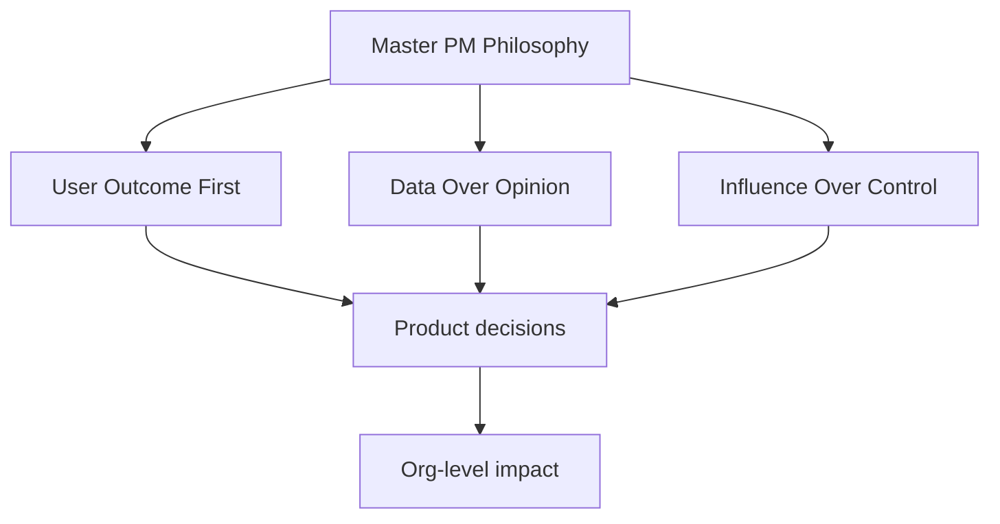

---

## Organizational Dynamics

How {{TOPIC_NAME}} plays out across the full organization:

### Power Structures and Product Decisions

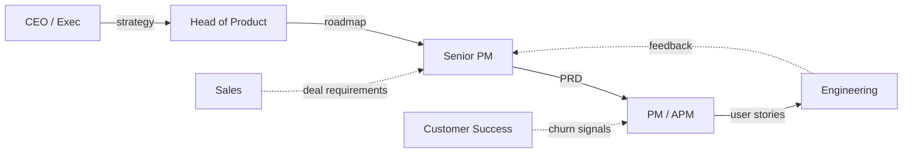

**Key dynamics:**
- How sales pressure distorts roadmap priorities
- How engineering capacity creates invisible product constraints
- How customer success surfaces lagging signals (churn) vs leading signals (adoption)

### Navigating Competing Priorities

| Stakeholder | What they want | What they actually need | How to bridge |
|------------|----------------|------------------------|---------------|
| CEO | Faster shipping | Better quality metrics | Show rework cost |
| Sales | Feature X for deal | Scalable solution | Generalize the request |
| Engineering | Less context-switching | Stable sprint goals | Protect the sprint |
| Design | More discovery time | Clear problem statements | Weekly PM-Design sync |

### When Orgs Break {{TOPIC_NAME}}

Common organizational dysfunctions that corrupt {{TOPIC_NAME}}:

1. **HiPPO effect** — Highest Paid Person's Opinion overrides data
2. **Roadmap theater** — roadmap exists to show busy-ness, not drive outcomes
3. **Stakeholder hostage-taking** — one team blocks all releases
4. **Metric gaming** — teams optimize metrics without improving outcomes

---

## Influence Without Authority

The master PM skill: moving people without a reporting line:

### Influence Techniques

**1. The Pre-Mortem Close**
Before presenting a proposal, write a pre-mortem: "Imagine it's 6 months from now and this failed. What went wrong?" Share this with stakeholders before the meeting. They arrive having already processed objections.

**2. The Anchor Shift**
```text
// Without anchor (weak)
"Should we build feature X?"

// With anchor (strong)
"Our retention is 28%. Industry median is 41%. Feature X is our highest-confidence path to close that gap. The question isn't whether to build it — it's whether to build it this quarter or next."
```

**3. The Data Trail**
Every opinion becomes less effective over time. Every data point becomes more. Build a habit of:
- Weekly metric reviews sent to all stakeholders
- Monthly experiment results documented in shared space
- Quarterly OKR reviews with honest assessment

### Influence Architecture

```mermaid
sequenceDiagram
    participant PM
    participant DataSystem
    participant Stakeholder
    participant Team
    PM->>DataSystem: Instrument metrics weekly
    DataSystem-->>PM: Evidence base
    PM->>Stakeholder: Pre-meeting alignment (async)
    Stakeholder-->>PM: Early objections surfaced
    PM->>Team: Collaborative solution design
    Team-->>Stakeholder: Technical credibility
    Stakeholder-->>PM: Buy-in
```

### When Influence Fails

**Signs you've lost influence:**
- Your roadmap items keep getting deprioritized by others
- Engineers work around your PRDs
- Stakeholders go directly to engineering
- Your NPS from cross-functional partners is declining

**Recovery playbook:**
1. Stop pushing — start listening
2. Find one quick win that helps the stakeholder blocking you
3. Co-create the next roadmap item with them
4. Rebuild the data trail

---

## Building Systems, Not Just Skills

The transition from "great PM" to "product organization builder":

### System 1: Discovery System

A discovery system that runs continuously without heroics:

```text
Discovery System Architecture:
├── Weekly: 3 user interviews (rotating team members)
├── Monthly: Quantitative analysis sprint (1 week)
├── Quarterly: Competitive review + strategy refresh
└── Annual: Full product strategy review

Outputs:
├── Insight repository (Notion / Confluence)
├── Validated problem backlog
└── Hypothesis log (tested + untested)
```

```mermaid
graph TD
    A[Weekly Interviews] --> B[Insight Repo]
    C[Quantitative Analysis] --> B
    B --> D[Validated Problem Backlog]
    D --> E[PRD Queue]
    E --> F[Sprint]
    F --> G[Measurement]
    G -->|new signal| A
```

### System 2: Prioritization System

A prioritization system that is transparent, auditable, and stakeholder-proof:

```text
Prioritization System:
├── RICE or ICE scoring rubric (documented, versioned)
├── Scoring reviews — monthly, with engineering + design
├── Escalation protocol — who breaks ties and how
└── Decision log — every deprioritization documented

Anti-patterns prevented:
- HiPPO overrides without documentation
- Urgent-but-not-important items dominating sprint
- Technical debt invisible to roadmap
```

### System 3: Metrics System

```mermaid
graph LR
    A[Business Metric] --> B[Product Metric]
    B --> C[Feature Metric]
    C --> D[Leading Indicator]
    D --> E[Lagging Indicator]
    E -.->|validates| B
```

**Metric hygiene rules:**
- Every metric has an owner
- Every metric has a target and a date
- Every metric has a "what we'll do if we miss it" plan
- No metric is tracked without an alert threshold

---

## Measuring Mastery

How to know if you (or your team) have mastered {{TOPIC_NAME}}:

### NPS from Cross-Functional Partners

```text
Quarterly PM NPS Survey:
"How likely are you to recommend working with [PM name] to a colleague?" (0-10)

Promoters (9-10): This PM makes my work easier and clearer
Detractors (0-6): This PM creates confusion, rework, or misalignment
```

**Mastery signal:** Consistent NPS > 8 from engineering leads, design leads, and exec stakeholders.

### Cycle Time Improvement

| Quarter | Idea→Launch | Revision rounds | Adoption at 30d |
|---------|------------|-----------------|-----------------|
| Baseline | 28 days | 4.1 avg | 9% |
| After 1 quarter | 21 days | 2.8 avg | 14% |
| After 2 quarters | 12 days | 1.4 avg | 23% |
| Mastery | < 10 days | < 1.5 avg | > 20% |

### Feature Adoption %

- Junior: Ships features; doesn't measure adoption
- Middle: Measures adoption; reacts to results
- Senior: Sets adoption targets before building; iterates based on data
- **Master: Predicts adoption range accurately before shipping; knows which levers to pull**

### Churn Reduction Attribution

```text
Mastery test: Can you draw a direct line from your product decisions to churn reduction?

Junior: "We shipped feature X"
Middle: "Feature X was used by 23% of users"
Senior: "Feature X users churned 18% less"
Master: "Feature X users churned 18% less, worth ~$2.1M ARR retention"
```

---

## Psychological and Cognitive Frameworks

Understanding the cognitive layer of product management:

### Jobs-to-be-Done (JTBD)

**Core insight:** People don't buy products — they hire them to do a job.

```text
JTBD Framework:
Functional job: What they're trying to accomplish
Emotional job: How they want to feel
Social job: How they want to be perceived

Example — Slack:
Functional: Communicate with team faster than email
Emotional: Feel connected to distributed teammates
Social: Appear responsive and collaborative

PM application:
- Prioritization: Does this feature address a functional, emotional, or social job?
- Discovery: Interview around the job, not the feature
- Metrics: Does our metric measure job completion?
```

### Cognitive Biases in Prioritization

**The most dangerous biases a PM encounters with {{TOPIC_NAME}}:**

| Bias | How it manifests | Debiasing technique |
|------|-----------------|---------------------|
| **Sunk cost fallacy** | Continuing to build a failing feature because "we've invested so much" | Pre-commit to kill criteria before building |
| **Confirmation bias** | Seeking user feedback that validates existing ideas | Structured interviews with open-ended questions |
| **Planning fallacy** | Consistently underestimating delivery time | Reference class forecasting (use past data) |
| **Availability heuristic** | Prioritizing the last loud stakeholder | Maintain written prioritization criteria |
| **IKEA effect** | Overvaluing features the team built | External user testing before internal review |
| **Status quo bias** | Avoiding difficult changes to roadmap | Schedule forced quarterly roadmap resets |

```mermaid
graph TD
    A[PM Decision Point] --> B{Cognitive bias check}
    B -->|Sunk cost?| C[Review kill criteria]
    B -->|Confirmation?| D[Seek disconfirming evidence]
    B -->|Planning fallacy?| E[Reference class forecast]
    B -->|Availability?| F[Review written criteria]
    C --> G[Better decision]
    D --> G
    E --> G
    F --> G
```

### Dual-Process Thinking in PM Work

**System 1 (fast, intuitive):** Pattern matching from experience — useful for quick triage
**System 2 (slow, deliberate):** Structured analysis — necessary for strategic decisions

```text
When to use System 1: Daily standups, quick stakeholder questions, backlog grooming
When to use System 2: Roadmap planning, PRD writing, OKR setting, build/buy/partner decisions
```

---

## Case Studies

Real-world case studies that demonstrate mastery of {{TOPIC_NAME}}:

### Case Study 1: Spotify Squad Model

**Context:** Spotify scaled from 50 to 500+ engineers and needed to maintain autonomy and alignment simultaneously.

**The challenge:** Traditional product management created bottlenecks. Single PMs became blockers. Roadmaps became lagging documents.

**The solution:**
```mermaid
graph TD
    A[Spotify Squad] --> B[Tribe]
    B --> C[Chapter]
    C --> D[Guild]
    A --> E[PM per Squad]
    E --> F[Autonomous roadmap]
    F --> G[Aligned to Tribe OKR]
```

**What they changed:**
- Each squad owns a product area end-to-end (discovery → delivery → metrics)
- PMs report to Tribe Lead (product), not Engineering Manager
- Missions last 12+ months — no quarterly reshuffling

**Applicability to {{TOPIC_NAME}}:** {{How this case study illustrates the topic}}

**Lessons:**
1. Autonomy without alignment creates chaos
2. Stable teams outperform reshuffled teams on long-horizon metrics
3. Mission clarity replaces roadmap micromanagement

---

### Case Study 2: Amazon Working Backwards

**Context:** Amazon uses a "Working Backwards" process where every new product starts with a press release written as if the product already exists.

**The challenge:** Engineers build what they can build, not what customers need. PMs write requirements documents that describe solutions, not problems.

**The solution:**
```text
Working Backwards Artifact:
1. Press release (1 page) — as if product is already launched
2. FAQ — hardest customer and internal questions answered
3. Visual mockup — not a wireframe, a finished product image
4. Customer letter — from a real customer, expressing delight

Review order: Leadership reads press release first.
If it's not compelling, the feature doesn't ship.
```

**Why it works:**
- Forces clarity on customer benefit before any code is written
- Aligns executives on the "what" before engineers debate the "how"
- The FAQ surfaces objections that would otherwise emerge as late-stage blockers

**Applicability to {{TOPIC_NAME}}:** {{How this case study illustrates the topic}}

---

### Case Study 3: Basecamp Shape Up

**Context:** Basecamp (now 37signals) runs 6-week cycles with no backlog, no sprints, and no daily standups.

**The challenge:** Traditional agile ceremonies create process overhead. Sprint backlogs fill with unexamined items. Velocity becomes the metric instead of outcomes.

**The solution:**
```text
Shape Up Cycle:
├── Shaping (2 weeks, PM + senior eng)
│   ├── Define problem scope
│   ├── Design solution at "fat marker" level
│   └── Write Shape Up pitch
├── Betting (1 day, leadership)
│   ├── Review pitches
│   └── Bet 6 weeks on selected pitches
└── Building (6 weeks, team)
    ├── No daily standups
    ├── Weekly check-ins
    └── Hill chart progress tracking
```

```mermaid
graph LR
    A[Shaping] -->|pitch| B[Betting Table]
    B -->|6-week bet| C[Building]
    C -->|shipped or killed| D[Cool-down 2 weeks]
    D -->|new cycle| A
```

**Why it works:**
- Fixed time, variable scope (not fixed scope, variable time)
- Eliminates backlog debt — unbid work is not carried forward
- Forces PMs to shape problems clearly before engineers touch them

**Applicability to {{TOPIC_NAME}}:** {{How this case study illustrates the topic}}

---

## Test

### Internal Knowledge Questions

**1. A stakeholder demands a feature that has no data support. How do you respond at the mastery level?**

<details>
<summary>Answer</summary>
A master PM does not say yes or no immediately. They ask: "What outcome are you trying to drive?" They then find the highest-confidence path to that outcome — which may or may not be the requested feature. They propose an experiment with a hypothesis and a kill criterion. They influence, don't command.
</details>

**2. Your team's velocity dropped 35% over 3 sprints. What's your diagnostic process?**

<details>
<summary>Answer</summary>
1. Pull cycle time data — is it discovery, definition, or delivery bottleneck?
2. Check PR review times — engineering process issue?
3. Review scope change frequency — PM-side scope creep?
4. Interview 3 engineers — surface hidden friction
5. Check OKR alignment — are sprint goals connected to team OKR?
</details>

---

## Tricky Questions

**1. {{Question about internal behavior that contradicts common PM assumptions}}?**

<details>
<summary>Answer</summary>
Explanation with framework reference, case study citation, and cognitive bias analysis.
</details>

---

## Self-Assessment Checklist

### I can explain internals:
- [ ] What happens at the organizational level when this practice is used
- [ ] How cognitive biases distort this process
- [ ] Stakeholder dynamics and power structures
- [ ] Relevant frameworks from Spotify, Amazon, Basecamp

### I can analyze:
- [ ] Read and interpret cycle time, adoption, and churn data
- [ ] Identify influence failures and recovery paths
- [ ] Predict feature adoption range before shipping
- [ ] Trace product decisions to business outcomes (revenue, churn)

### I can prove:
- [ ] Back claims with metrics and case study evidence
- [ ] Reference cognitive framework literature
- [ ] Demonstrate internal behavior with data tools

---

## Summary

- Leadership philosophy drives consistency under pressure
- Organizational dynamics explain why good PM practices fail
- Cognitive frameworks prevent systematic decision errors
- Mastery is measured in NPS, cycle time, adoption %, and churn reduction

**Key takeaway:** Understanding the human and organizational layer is what separates professional PMs from skilled ones.

---

## Further Reading

- **Book:** *Inspired* by Marty Cagan — chapter on product discovery
- **Book:** *Shape Up* by Ryan Singer (Basecamp) — [free online](https://basecamp.com/shapeup)
- **Framework:** Jobs-to-be-Done by Clayton Christensen — *Competing Against Luck*
- **Talk:** ["How Spotify Builds Products"](https://engineering.atspotify.com/) — Henrik Kniberg

---

## Diagrams & Visual Aids

### Mastery Progression

```mermaid
graph LR
    A[Junior PM\nShips features] --> B[Middle PM\nMeasures outcomes]
    B --> C[Senior PM\nArchitects systems]
    C --> D[Master PM\nBuilds org capability]
```

### Cognitive Bias Map

```mermaid
mindmap
  root((PM Biases))
    Prioritization
      Sunk Cost
      Availability Heuristic
      IKEA Effect
    Discovery
      Confirmation Bias
      Survivorship Bias
    Delivery
      Planning Fallacy
      Optimism Bias
```

</details>

---
---

# TEMPLATE 5 — `interview.md`

<details open>
<summary><strong>Template Content</strong></summary>

# {{TOPIC_NAME}} — Interview Questions

## Table of Contents

1. [Junior Level](#junior-level)
2. [Middle Level](#middle-level)
3. [Senior Level](#senior-level)
4. [Scenario-Based Questions](#scenario-based-questions)
5. [FAQ](#faq)

---

## Junior Level

### 1. {{Basic conceptual question}}?

**Answer:**
Clear, concise explanation that a junior PM should be able to give.

---

### 2. {{Another basic question}}?

**Answer:**
...

---

### 3. {{Practical basic question}}?

**Answer:**
...with artifact example if needed.

---

> 5-7 junior questions. Test basic understanding and terminology.

---

## Middle Level

### 4. {{Question about practical application}}?

**Answer:**
Detailed answer with real-world context.

```text
// Artifact example if applicable
```

---

### 5. {{Question about trade-offs}}?

**Answer:**
...

---

### 6. {{Question about diagnosing a process failure}}?

**Answer:**
...

---

> 4-6 middle questions. Test practical experience and decision-making.

---

## Senior Level

### 7. {{Strategy/org design question}}?

**Answer:**
Comprehensive answer covering trade-offs, alternatives, and decision criteria.

---

### 8. {{Metrics/optimization question}}?

**Answer:**
...with cycle time or adoption metric examples.

---

### 9. {{System design question involving this topic}}?

**Answer:**
...

---

> 4-6 senior questions. Test deep understanding and leadership ability.

---

## Scenario-Based Questions

### 10. {{Real-world scenario: something is broken/slow/misaligned}}. How do you approach this?

**Answer:**
Step-by-step approach:
1. ...
2. ...
3. ...

---

### 11. {{Production misalignment scenario}}?

**Answer:**
...

---

> 3-5 scenario questions. Test problem-solving under realistic conditions.

---

## FAQ

### Q: {{Common question candidates ask}}?

**A:** Clear answer with context about what interviewers are looking for.

### Q: {{What interviewers actually look for in answers about this topic}}?

**A:** Key evaluation criteria:
- {{What demonstrates junior-level understanding}}
- {{What demonstrates middle-level understanding}}
- {{What demonstrates senior-level understanding}}

</details>

---
---

# TEMPLATE 6 — `tasks.md`

<details open>
<summary><strong>Template Content</strong></summary>

# {{TOPIC_NAME}} — Practical Tasks

## Table of Contents

1. [Junior Tasks](#junior-tasks)
2. [Middle Tasks](#middle-tasks)
3. [Senior Tasks](#senior-tasks)
4. [Questions](#questions)
5. [Mini Projects](#mini-projects)
6. [Challenge](#challenge)

---

## Junior Tasks

### Task 1: {{Simple artifact task title}}

**Type:** 📝 Artifact

**Goal:** {{What skill this practices}}

**Instructions:**
1. ...
2. ...
3. ...

**Starter template:**

```text
[Template to complete]
Title:
Problem:
Users affected:
Success metric:
```

**Expected output:**
```text
...
```

**Evaluation criteria:**
- [ ] Artifact is complete and specific
- [ ] Success metric is measurable
- [ ] {{Specific check}}

---

### Task 2: {{Simple process design task}}

**Type:** 🎨 Design

**Goal:** {{What design skill this practices}}

**Instructions:**
1. ...
2. ...

**Deliverable:** {{What to produce — e.g., process diagram, stakeholder map}}

**Example format:**
```mermaid
graph TD
    A[Start] --> B[Step 1]
    B --> C[Step 2]
```

---

> 3-4 junior tasks. Mix of 📝 Artifact and 🎨 Design tasks.

---

## Middle Tasks

### Task 4: {{Production-oriented PM task}}

**Type:** 📝 Artifact

**Scenario:** {{Brief context}}

**Requirements:**
- [ ] {{Requirement 1}}
- [ ] {{Requirement 2}}
- [ ] Define success metrics
- [ ] Document trade-offs

<details>
<summary>Hint 1</summary>
...
</details>

---

### Task 5: {{Process / alignment design task}}

**Type:** 🎨 Design

**Scenario:** {{Brief context}}

**Requirements:**
- [ ] Create stakeholder map
- [ ] Define RACI
- [ ] Document escalation protocol

---

> 2-3 middle tasks. Mix of 📝 Artifact and 🎨 Design tasks.

---

## Senior Tasks

### Task 7: {{Strategic PM task}}

**Type:** 📝 Artifact

**Scenario:** {{Complex real-world problem}}

**Requirements:**
- [ ] {{High-level requirement 1}}
- [ ] Define OKR cascade
- [ ] Document trade-offs and design decisions
- [ ] Include metrics instrumentation plan

**Provided artifact to review/optimize:**

```text
// Sub-optimal artifact that needs improvement
```

---

### Task 8: {{Full product system design task}}

**Type:** 🎨 Design

**Scenario:** {{Complex design problem}}

**Requirements:**
- [ ] Create full discovery-to-delivery system diagram
- [ ] Define stakeholder engagement protocol
- [ ] Plan for misalignment scenarios
- [ ] Include capacity planning and scalability analysis

---

> 2-3 senior tasks. Mix of 📝 Artifact and 🎨 Design tasks.

---

## Questions

### 1. {{Conceptual question}}?

**Answer:**
Clear explanation covering the key concept.

---

### 2. {{Comparison question}}?

**Answer:**
Explanation comparing different approaches with trade-offs.

---

### 3. {{"Why" question}}?

**Answer:**
In-depth explanation of the reasoning behind a concept or design decision.

---

> 5-10 questions. Mix of conceptual, comparison, and "why" questions.

---

## Mini Projects

### Project 1: {{Larger project combining concepts}}

**Goal:** {{What this project teaches end-to-end}}

**Description:**
Build a {{description}} that uses {{TOPIC_NAME}} concepts.

**Requirements:**
- [ ] {{Feature 1}}
- [ ] {{Feature 2}}
- [ ] {{Feature 3}}
- [ ] README with usage instructions

**Difficulty:** Junior / Middle / Senior
**Estimated time:** X hours

---

## Challenge

### {{Competitive/Hard challenge}}

**Problem:** {{Difficult problem statement}}

**Constraints:**
- Must fit on 2 pages
- No jargon — must be readable by non-PM stakeholders
- Include 3 metrics with targets

**Scoring:**
- Completeness: 50%
- Clarity: 30%
- Measurability: 20%

</details>

---
---

# TEMPLATE 7 — `find-bug.md`

<details open>
<summary><strong>Template Content</strong></summary>

# {{TOPIC_NAME}} — Find the Anti-Pattern

> **Practice finding and fixing process anti-patterns in PM artifacts and workflows related to {{TOPIC_NAME}}.**
> Each exercise contains a flawed artifact or process — your job is to find the anti-pattern, explain why it happens, and fix it.

---

## How to Use

1. Read the flawed artifact or process carefully
2. Try to find the anti-pattern **without** looking at the hint
3. Write the fix yourself before checking the solution
4. Understand **why** the anti-pattern happens — not just how to fix it

### Difficulty Levels

| Level | Description |
|:-----:|:-----------|
| 🟢 | **Easy** — Vague requirements, missing acceptance criteria |
| 🟡 | **Medium** — Scope creep without documentation, poor stakeholder alignment |
| 🔴 | **Hard** — Systemic dysfunction, metric gaming, organizational anti-patterns |

---

## Bug 1: {{Anti-pattern title}} 🟢

**What the artifact should do:** {{Expected behavior}}

```text
// Flawed artifact or process description
// The anti-pattern should be realistic and related to {{TOPIC_NAME}}
Title: ...
Problem: ...
Success: ...
```

**Expected output:**
```text
...
```

**Actual output:**
```text
...
```

<details>
<summary>💡 Hint</summary>

Look at {{specific area where the anti-pattern is}} — what happens when {{condition}}?

</details>

<details>
<summary>🐛 Anti-Pattern Explanation</summary>

**Anti-pattern:** {{What exactly is wrong — e.g., "Vague success criteria: 'users should be happy'"}}
**Why it happens:** {{Root cause — e.g., "PM skipped discovery, assumed solution"}}
**Impact:** {{What goes wrong — missed metrics, rework, misalignment, churn}}

</details>

<details>
<summary>✅ Fixed Artifact</summary>

```text
// Fixed artifact with comments explaining the fix
Title: ...
Problem: ...
Success: ...
```

**What changed:** {{One-line summary of the fix}}

</details>

---

## Bug 2: {{Anti-pattern title}} 🟢

**What the artifact should do:** {{Expected behavior}}

```text
// Flawed artifact
```

<details>
<summary>💡 Hint</summary>
...
</details>

<details>
<summary>🐛 Anti-Pattern Explanation</summary>

**Anti-pattern:** ...
**Why it happens:** ...
**Impact:** ...

</details>

<details>
<summary>✅ Fixed Artifact</summary>

```text
// Fixed artifact
```

**What changed:** ...

</details>

---

## Bug 3: {{Anti-pattern title}} 🟢

**What the artifact should do:** {{Expected behavior}}

```text
// Flawed artifact
```

<details>
<summary>💡 Hint</summary>
...
</details>

<details>
<summary>🐛 Anti-Pattern Explanation</summary>

**Anti-pattern:** ...
**Why it happens:** ...
**Impact:** ...

</details>

<details>
<summary>✅ Fixed Artifact</summary>

```text
// Fixed artifact
```

**What changed:** ...

</details>

---

## Bug 4: {{Anti-pattern title}} 🟡

**What the artifact should do:** {{Expected behavior}}

```text
// Flawed artifact — medium difficulty
// Scope creep or stakeholder alignment issue
```

<details>
<summary>💡 Hint</summary>
...
</details>

<details>
<summary>🐛 Anti-Pattern Explanation</summary>

**Anti-pattern:** ...
**Why it happens:** ...
**Impact:** ...

</details>

<details>
<summary>✅ Fixed Artifact</summary>

```text
// Fixed artifact
```

**What changed:** ...

</details>

---

## Bug 5: {{Anti-pattern title}} 🟡

**What the artifact should do:** {{Expected behavior}}

```text
// Flawed artifact — involves {{TOPIC_NAME}} specific behavior
```

<details>
<summary>💡 Hint</summary>
...
</details>

<details>
<summary>🐛 Anti-Pattern Explanation</summary>

**Anti-pattern:** ...
**Why it happens:** ...
**Impact:** ...

</details>

<details>
<summary>✅ Fixed Artifact</summary>

```text
// Fixed artifact
```

**What changed:** ...

</details>

---

## Bug 6: {{Anti-pattern title}} 🟡

**What the artifact should do:** {{Expected behavior}}

```text
// Flawed artifact — real-world production pattern with a subtle flaw
```

<details>
<summary>💡 Hint</summary>
...
</details>

<details>
<summary>🐛 Anti-Pattern Explanation</summary>

**Anti-pattern:** ...
**Why it happens:** ...
**Impact:** ...

</details>

<details>
<summary>✅ Fixed Artifact</summary>

```text
// Fixed artifact
```

**What changed:** ...

</details>

---

## Bug 7: {{Anti-pattern title}} 🟡

**What the artifact should do:** {{Expected behavior}}

```text
// Flawed process — missing stakeholder alignment documentation
```

<details>
<summary>💡 Hint</summary>
...
</details>

<details>
<summary>🐛 Anti-Pattern Explanation</summary>

**Anti-pattern:** ...
**Why it happens:** ...
**Impact:** ...

</details>

<details>
<summary>✅ Fixed Artifact</summary>

```text
// Fixed artifact
```

**What changed:** ...

</details>

---

## Bug 8: {{Anti-pattern title}} 🔴

**What the artifact should do:** {{Expected behavior}}

```text
// Flawed artifact — hard to spot
// Involves metric gaming, organizational dysfunction, or cognitive bias
```

<details>
<summary>💡 Hint</summary>

Think about what the metric incentivizes — could the team hit this metric without actually improving the user outcome?

</details>

<details>
<summary>🐛 Anti-Pattern Explanation</summary>

**Anti-pattern:** ...
**Why it happens:** ...
**Impact:** ...
**Process reference:** {{Relevant framework or case study if applicable}}

</details>

<details>
<summary>✅ Fixed Artifact</summary>

```text
// Fixed artifact with detailed comments
```

**What changed:** ...
**Alternative fix:** {{Another valid approach if exists}}

</details>

---

## Bug 9: {{Anti-pattern title}} 🔴

**What the artifact should do:** {{Expected behavior}}

```text
// Flawed process — systemic dysfunction
// Works in isolation but fails at org scale
```

<details>
<summary>💡 Hint</summary>
...
</details>

<details>
<summary>🐛 Anti-Pattern Explanation</summary>

**Anti-pattern:** ...
**Why it happens:** ...
**Impact:** ...
**How to detect:** {{observation, retrospective pattern, metric signal}}

</details>

<details>
<summary>✅ Fixed Artifact</summary>

```text
// Fixed artifact
```

**What changed:** ...

</details>

---

## Bug 10: {{Anti-pattern title}} 🔴

**What the artifact should do:** {{Expected behavior}}

```text
// Flawed process — the hardest one
// Multiple subtle issues or a single systemic anti-pattern
```

<details>
<summary>💡 Hint</summary>
...
</details>

<details>
<summary>🐛 Anti-Pattern Explanation</summary>

**Anti-pattern:** ...
**Why it happens:** ...
**Impact:** ...

</details>

<details>
<summary>✅ Fixed Artifact</summary>

```text
// Fixed artifact
```

**What changed:** ...

</details>

---

## Score Card

| Bug | Difficulty | Found without hint? | Understood why? | Fixed correctly? |
|:---:|:---------:|:-------------------:|:---------------:|:----------------:|
| 1 | 🟢 | ☐ | ☐ | ☐ |
| 2 | 🟢 | ☐ | ☐ | ☐ |
| 3 | 🟢 | ☐ | ☐ | ☐ |
| 4 | 🟡 | ☐ | ☐ | ☐ |
| 5 | 🟡 | ☐ | ☐ | ☐ |
| 6 | 🟡 | ☐ | ☐ | ☐ |
| 7 | 🟡 | ☐ | ☐ | ☐ |
| 8 | 🔴 | ☐ | ☐ | ☐ |
| 9 | 🔴 | ☐ | ☐ | ☐ |
| 10 | 🔴 | ☐ | ☐ | ☐ |

### Rating:
- **10/10 without hints** → Senior-level process debugging skills
- **7-9/10** → Solid middle-level understanding
- **4-6/10** → Good junior, keep practicing
- **< 4/10** → Review the topic fundamentals first

</details>

---
---

# TEMPLATE 8 — `optimize.md`

<details open>
<summary><strong>Template Content</strong></summary>

# {{TOPIC_NAME}} — Optimize the Process

> **Practice optimizing slow, inefficient, or misaligned PM processes related to {{TOPIC_NAME}}.**
> Each exercise contains a working but suboptimal process — your job is to make it faster, cleaner, or more impactful.

---

## How to Use

1. Read the slow process and understand what it does
2. Identify the performance bottleneck
3. Write your optimized version
4. Compare with the solution and before/after metrics
5. Understand **why** the optimization works

### Difficulty Levels

| Level | Focus |
|:-----:|:------|
| 🟢 | **Easy** — Obvious inefficiencies, simple fixes |
| 🟡 | **Medium** — Process redesign, alignment improvements |
| 🔴 | **Hard** — Systemic optimization, org-level changes |

### Optimization Categories

| Category | Icon | Description |
|:--------:|:----:|:-----------|
| **Cycle Time** | ⚡ | Reduce days from idea to shipped |
| **Alignment** | 🤝 | Reduce revision rounds, stakeholder friction |
| **Measurement** | 📊 | Improve metric clarity and adoption tracking |
| **Discovery** | 🔍 | Faster, more reliable user insight generation |

---

## Exercise 1: {{Title}} 🟢 ⚡

**What the process does:** {{Brief description}}

**The problem:** {{What's slow/inefficient}}

```text
// Slow process — works correctly but wastes time
[Process description]
Step 1: ...
Step 2: ...
```

**Current metrics:**
```
Cycle time: 21 days
Revision rounds: 4.2 avg
Stakeholder NPS: 6.1
```

<details>
<summary>💡 Hint</summary>

Think about {{specific optimization technique}} — where is the most time lost in this process?

</details>

<details>
<summary>⚡ Optimized Process</summary>

```text
// Optimized process — same outcome, better efficiency
[Process description]
Step 1: ...
Step 2: ...
```

**What changed:**
- {{Change 1}} — why it helps
- {{Change 2}} — why it helps

**Optimized metrics:**
```
Cycle time: 9 days
Revision rounds: 1.4 avg
Stakeholder NPS: 8.3
```

**Improvement:** 2.3x faster, 67% less rework, NPS +2.2

</details>

<details>
<summary>📚 Learn More</summary>

**Why this works:** {{Detailed explanation of the optimization principle}}
**When to apply:** {{Scenarios where this optimization matters}}
**When NOT to apply:** {{Scenarios where the overhead isn't worth it}}

</details>

---

## Exercise 2: {{Title}} 🟢 🤝

**What the process does:** {{Brief description}}

**The problem:** {{What's creating alignment friction}}

```text
// Process with alignment bottleneck
```

**Current metrics:**
```
Revision rounds: 4.8 avg
Time to stakeholder sign-off: 12 days
```

<details>
<summary>💡 Hint</summary>
...
</details>

<details>
<summary>⚡ Optimized Process</summary>

```text
// Optimized process
```

**What changed:** ...
**Optimized metrics:**
```
Revision rounds: 1.2 avg
Time to sign-off: 3 days
```

</details>

<details>
<summary>📚 Learn More</summary>
...
</details>

---

## Exercise 3: {{Title}} 🟢 📊

**What the process does:** {{Brief description}}

**The problem:** {{What's wrong with measurement}}

```text
// Process with unclear or unmeasurable success criteria
```

<details>
<summary>💡 Hint</summary>
...
</details>

<details>
<summary>⚡ Optimized Process</summary>

```text
// Process with clear, instrumented metrics
```

**What changed:** ...
**Improvement:** ...

</details>

<details>
<summary>📚 Learn More</summary>
...
</details>

---

## Exercise 4: {{Title}} 🟡 ⚡

**What the process does:** {{Brief description}}

**The problem:** {{Medium difficulty — process redesign needed}}

```text
// Slow process — medium complexity
```

**Current metrics:**
```
...
```

<details>
<summary>💡 Hint</summary>
...
</details>

<details>
<summary>⚡ Optimized Process</summary>

```text
// Optimized process
```

**What changed:** ...
**Optimized metrics:**
```
...
```

</details>

<details>
<summary>📚 Learn More</summary>
...
</details>

---

## Exercise 5: {{Title}} 🟡 🤝

**What the process does:** {{Brief description}}
**The problem:** {{Alignment at scale}}

```text
// Process that works for 1 PM but breaks with 5+
```

<details>
<summary>💡 Hint</summary>
...
</details>

<details>
<summary>⚡ Optimized Process</summary>

```text
// Scalable process
```

**What changed:** ...
**Improvement:** ...

</details>

<details>
<summary>📚 Learn More</summary>
...
</details>

---

## Exercise 6: {{Title}} 🟡 🔍

**What the process does:** {{Brief description}}
**The problem:** {{Discovery bottleneck}}

```text
// Discovery process that's too slow or unreliable
```

<details>
<summary>💡 Hint</summary>
...
</details>

<details>
<summary>⚡ Optimized Process</summary>

```text
// Continuous discovery setup
```

**What changed:** ...
**Improvement:** ...

</details>

<details>
<summary>📚 Learn More</summary>
...
</details>

---

## Exercise 7: {{Title}} 🟡 📊

**What the process does:** {{Brief description}}
**The problem:** {{Metric instrumentation gap}}

```text
// PRD with features but no metric plan
```

<details>
<summary>💡 Hint</summary>
...
</details>

<details>
<summary>⚡ Optimized Process</summary>

```text
// PRD with full metric instrumentation plan
```

**What changed:** ...
**Improvement:** ...

</details>

<details>
<summary>📚 Learn More</summary>
...
</details>

---

## Exercise 8: {{Title}} 🔴 ⚡

**What the process does:** {{Brief description}}
**The problem:** {{Deep systemic optimization needed}}

```text
// Process that looks reasonable but has hidden bottlenecks
```

**Current metrics:**
```
...
```

**Diagnostic output:**
```
Analysis shows: {{what the data reveals}}
```

<details>
<summary>💡 Hint</summary>

Map every approval gate. Time each one. The bottleneck is almost always invisible until you measure it.

</details>

<details>
<summary>⚡ Optimized Process</summary>

```text
// Optimized process — systemically redesigned
```

**What changed:**
- {{Change 1}} — detailed explanation
- {{Change 2}} — detailed explanation

**Optimized metrics:**
```
...
```

**Improvement:** ...

</details>

<details>
<summary>📚 Learn More</summary>

**Advanced concept:** {{Explanation of the optimization at org/systems level}}
**Framework reference:** {{Relevant methodology or case study}}

</details>

---

## Exercise 9: {{Title}} 🔴 🤝

**What the process does:** {{Brief description}}
**The problem:** {{Org-level alignment failure}}

```text
// Process that fails when multiple teams are involved
```

<details>
<summary>💡 Hint</summary>
...
</details>

<details>
<summary>⚡ Optimized Process</summary>

```text
// Multi-team alignment system
```

**What changed:** ...
**Improvement:** ...

</details>

<details>
<summary>📚 Learn More</summary>
...
</details>

---

## Exercise 10: {{Title}} 🔴 📊

**What the process does:** {{Brief description}}
**The problem:** {{Complex optimization — requires rethinking the approach entirely}}

```text
// Process — the hardest optimization challenge
```

**Current metrics:**
```
...
```

<details>
<summary>💡 Hint</summary>
...
</details>

<details>
<summary>⚡ Optimized Process</summary>

```text
// Completely restructured for performance
```

**What changed:**
- {{Change 1}}
- {{Change 2}}
- {{Change 3}}

**Optimized metrics:**
```
...
```

**Improvement:** ...

</details>

<details>
<summary>📚 Learn More</summary>
...
</details>

---

## Score Card

| Exercise | Difficulty | Category | Found bottleneck? | Your improvement | Target improvement |
|:--------:|:---------:|:--------:|:-----------------:|:----------------:|:-----------------:|
| 1 | 🟢 | ⚡ | ☐ | ___ x | 2x |
| 2 | 🟢 | 🤝 | ☐ | ___ x | 4x |
| 3 | 🟢 | 📊 | ☐ | ___ x | 3x |
| 4 | 🟡 | ⚡ | ☐ | ___ x | 2.5x |
| 5 | 🟡 | 🤝 | ☐ | ___ x | 3x |
| 6 | 🟡 | 🔍 | ☐ | ___ x | 2x |
| 7 | 🟡 | 📊 | ☐ | ___ x | 2x |
| 8 | 🔴 | ⚡ | ☐ | ___ x | 3x |
| 9 | 🔴 | 🤝 | ☐ | ___ x | 4x |
| 10 | 🔴 | 📊 | ☐ | ___ x | 5x |

### Rating:
- **All targets met** → You understand product process deeply
- **7-9 targets met** → Solid optimization skills
- **4-6 targets met** → Good foundation, practice process mapping more
- **< 4 targets met** → Start with cycle time measurement basics

---

## Optimization Cheat Sheet

| Problem | Solution | Impact |
|:--------|:---------|:------:|
| Too many revision rounds | Pre-align with async doc before meeting | High |
| Long cycle time | Map and eliminate approval gates | High |
| Low feature adoption | Pre-define adoption target before building | High |
| Vague success criteria | Use SMART metric template | High |
| Stakeholder surprises | Weekly async roadmap update | Medium |
| Discovery bottleneck | Standing weekly user interview slots | Medium |
| Metric gaming | Define metric + counter-metric together | Medium |
| Sprint scope creep | Written sprint goal, visible in standup | Medium |

</details>
---
---

# TEMPLATE 9 — `specification.md`

> **Focus:** Official documentation deep-dive — standards references, framework specifications, official guidelines, and version compatibility.
>
> **Source:** Always cite the official documentation or standards with direct section links.
> - AI Red Teaming: https://airc.nist.gov/Docs | https://owasp.org/www-project-ai-security-and-privacy-guide/
> - Cyber Security: https://owasp.org/www-project-top-ten/ | https://csrc.nist.gov/
> - Code Review: https://google.github.io/eng-practices/review/
> - Engineering Manager: https://www.manager-tools.com/ | https://lethain.com/staff-engineer/
> - QA: https://www.istqb.org/certifications/ | https://testing.googleblog.com/
> - Technical Writer: https://developers.google.com/tech-writing | https://www.writethedocs.org/guide/
> - Product Manager: https://www.svpg.com/inspired/ | https://www.productboard.com/resources/
> - DevRel: https://www.devrel.agency/resources | https://www.commonroom.io/resources/
> - AWS: https://docs.aws.amazon.com/ | https://aws.amazon.com/architecture/
> - Git/GitHub: https://git-scm.com/docs | https://docs.github.com/

<details open>
<summary><strong>Template Content</strong></summary>

# {{TOPIC_NAME}} — Specification

> **Official Documentation / Standards Reference**
>
> Source: [{{SOURCE_NAME}}]({{DOCS_URL}}) — {{SECTION}}

---

## Table of Contents

1. [Reference](#reference)
2. [Official Framework / Standard](#official-framework--standard)
3. [Core Rules & Guidelines](#core-rules--guidelines)
4. [Process / Workflow Specification](#process--workflow-specification)
5. [Metrics & Measurement](#metrics--measurement)
6. [Common Scenarios & Responses](#common-scenarios--responses)
7. [Version & Evolution History](#version--evolution-history)
8. [Official Examples & Case Studies](#official-examples--case-studies)
9. [Compliance Checklist](#compliance-checklist)
10. [Related Resources](#related-resources)

---

## 1. Reference

| Property | Value |
|----------|-------|
| **Official Source** | [{{SOURCE_NAME}}]({{DOCS_URL}}) |
| **Relevant Section** | {{SECTION_NAME}} — {{SECTION_TITLE}} |
| **Standard / Version** | {{STANDARD_VERSION}} |
| **Direct URL** | {{DOCS_URL}}/{{PATH}} |

---

## 2. Official Framework / Standard

> From: {{DOCS_URL}}/{{FRAMEWORK_SECTION}}

### {{FRAMEWORK_OR_STANDARD_NAME}}

{{FRAMEWORK_DESCRIPTION}}

| Component | Purpose | Official Guidance |
|-----------|---------|------------------|
| {{COMP_1}} | {{PURPOSE_1}} | [Link]({{URL_1}}) |
| {{COMP_2}} | {{PURPOSE_2}} | [Link]({{URL_2}}) |
| {{COMP_3}} | {{PURPOSE_3}} | [Link]({{URL_3}}) |

---

## 3. Core Rules & Guidelines

### Guideline 1: {{GUIDELINE_NAME}}

> *Source: [{{DOCS_URL}}/{{SECTION}}]({{DOCS_URL}}/{{SECTION}}) — "{{DOC_QUOTE}}"*

{{GUIDELINE_EXPLANATION}}

**✅ Good practice:**
{{GOOD_EXAMPLE}}

**❌ Anti-pattern:**
{{BAD_EXAMPLE}}

### Guideline 2: {{GUIDELINE_NAME}}

> *Source: [{{DOCS_URL}}/{{SECTION}}]({{DOCS_URL}}/{{SECTION}})*

{{GUIDELINE_EXPLANATION}}

---

## 4. Process / Workflow Specification

### Official Process Flow

```
{{PROCESS_STEP_1}}
    ↓
{{PROCESS_STEP_2}}
    ↓
{{PROCESS_STEP_3}}
    ↓
{{PROCESS_STEP_4}}
```

| Stage | Official Requirement | Notes |
|-------|---------------------|-------|
| {{STAGE_1}} | {{REQ_1}} | {{NOTES_1}} |
| {{STAGE_2}} | {{REQ_2}} | {{NOTES_2}} |

---

## 5. Metrics & Measurement

| Metric | Official Definition | Target / Benchmark | Reference |
|--------|--------------------|--------------------|-----------|
| {{METRIC_1}} | {{DEF_1}} | {{TARGET_1}} | [Link]({{URL_1}}) |
| {{METRIC_2}} | {{DEF_2}} | {{TARGET_2}} | [Link]({{URL_2}}) |
| {{METRIC_3}} | {{DEF_3}} | {{TARGET_3}} | [Link]({{URL_3}}) |

---

## 6. Common Scenarios & Responses

| Scenario | Official Guidance | Reference |
|----------|-------------------|-----------|
| {{SCENARIO_1}} | {{GUIDANCE_1}} | [Docs]({{URL_1}}) |
| {{SCENARIO_2}} | {{GUIDANCE_2}} | [Docs]({{URL_2}}) |
| {{SCENARIO_3}} | {{GUIDANCE_3}} | [Docs]({{URL_3}}) |

---

## 7. Version & Evolution History

| Version / Edition | Change | Year | Notes |
|------------------|--------|------|-------|
| {{VER_1}} | {{CHANGE_1}} | {{YEAR_1}} | {{NOTES_1}} |
| {{VER_2}} | {{CHANGE_2}} | {{YEAR_2}} | {{NOTES_2}} |

---

## 8. Official Examples & Case Studies

### Example: {{EXAMPLE_TITLE}}

> Source: [{{DOCS_URL}}/{{ANCHOR}}]({{DOCS_URL}}/{{ANCHOR}})

{{EXAMPLE_DESCRIPTION}}

**Outcome / Result:**
{{EXPECTED_OUTCOME}}

---

## 9. Compliance Checklist

- [ ] Follows official recommended approach for {{TOPIC_NAME}}
- [ ] Aligned with standard version ({{STANDARD_VERSION}})
- [ ] Covers all required process stages
- [ ] Metrics are tracked per official guidance
- [ ] Common scenarios handled per official recommendations
- [ ] Team/stakeholder requirements met

---

## 10. Related Resources

| Topic | Source | URL |
|-------|--------|-----|
| {{RELATED_1}} | {{SOURCE_1}} | [Link]({{URL_1}}) |
| {{RELATED_2}} | {{SOURCE_2}} | [Link]({{URL_2}}) |
| {{RELATED_3}} | {{SOURCE_3}} | [Link]({{URL_3}}) |

---

> **Content Rules for `specification.md`:**
> - Always link directly to the relevant section of the official source (not just the homepage)
> - Use the most authoritative and widely accepted official standard or framework
> - Include measurable metrics where official standards define them
> - Document process flows using official terminology
> - Note when standards or best practices have evolved over time
> - Minimum 2 Core Guidelines, 3 Metrics, 3 Scenarios, 2 Official Examples

</details>
