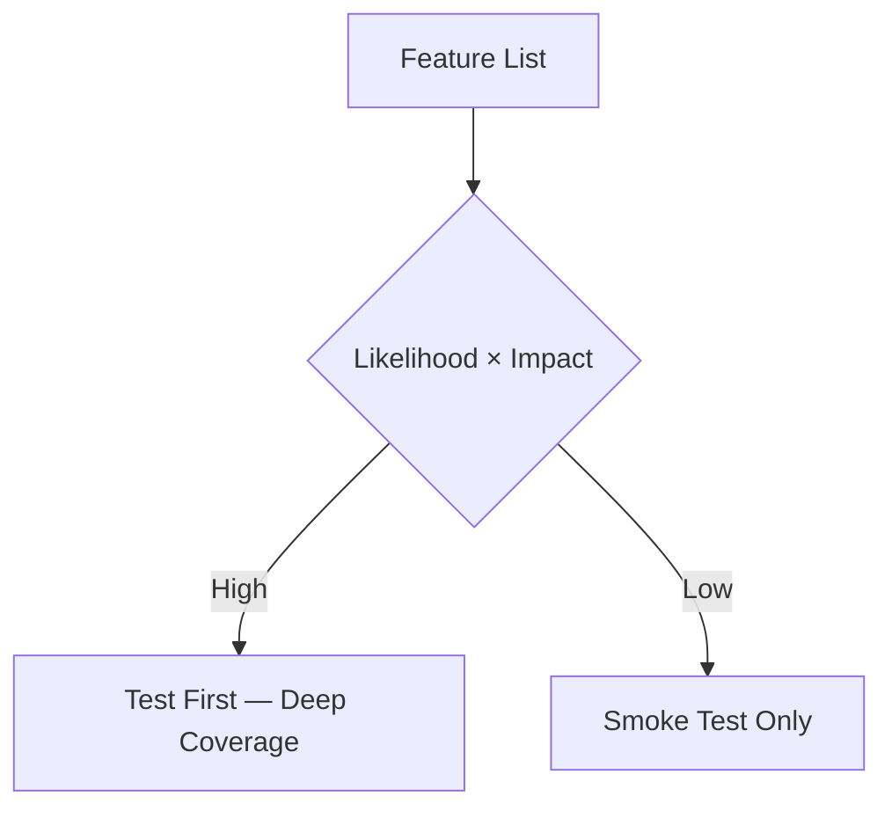
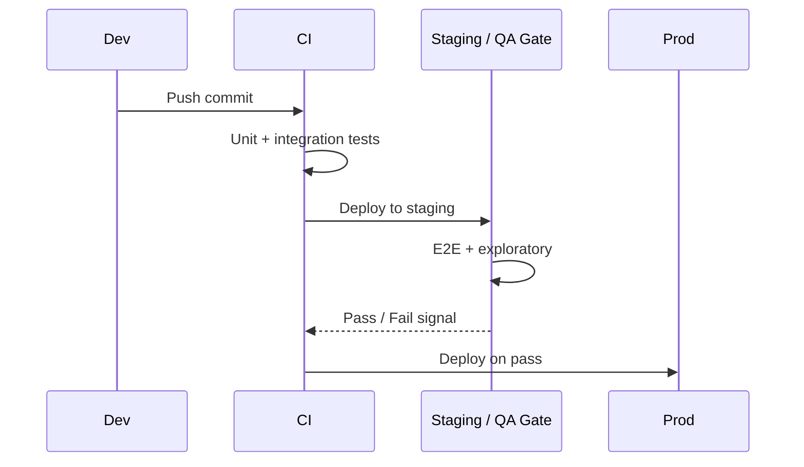
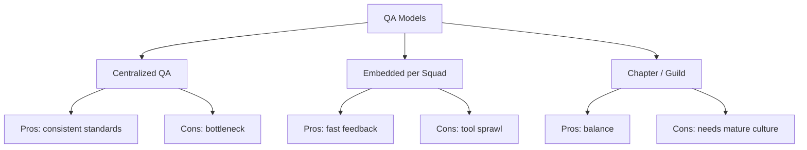
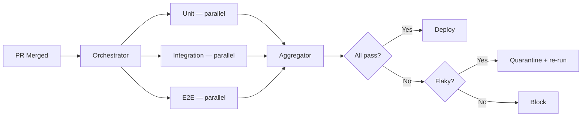
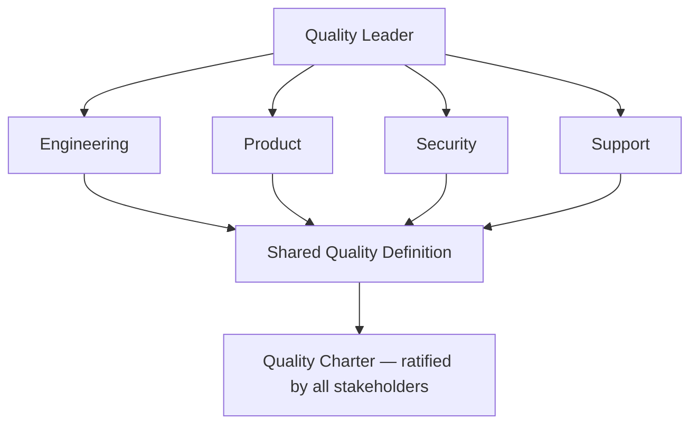
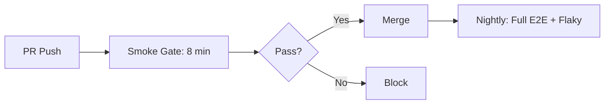

# QA Roadmap — Universal Template

> Guides content generation for **Quality Assurance (QA)** topics.
> This is a SOFT SKILL — use ` ```text ` for example artifacts, ` ```mermaid ` for process diagrams.
> Exception: QA may show test code snippets in ` ```python ` or ` ```javascript `.

## Universal Requirements

- 8 files per topic: `junior.md`, `middle.md`, `senior.md`, `professional.md`, `interview.md`, `tasks.md`, `find-bug.md`, `optimize.md`
- Keep `{{TOPIC_NAME}}` placeholder throughout all generated files
- `professional.md` = Mastery / Leadership level (NOT compiler internals)
- Section renames: "Code Examples" → **"Example Artifacts / Templates"** | "Error Handling" → **"Common Failure Modes and Recovery"** | "Performance Tips" → **"Effectiveness and Efficiency Tips"** | "Debugging Guide" → **"Diagnosing Team / Process Problems"** | "Comparison with Other Languages" → **"Comparison with Alternative Methodologies / Tools"**

### Topic Structure

```
XX-topic-name/
├── junior.md       ← "What?" and "How?" — test types, test cases, bug reporting, basic tools
├── middle.md       ← "Why?" and "When?" — test strategy, risk-based testing, QA in CI/CD, automation
├── senior.md       ← "How to architect?" — QA org design, quality culture, chaos engineering
├── professional.md ← Mastery / Leadership — quality philosophy, ISO 25010, enterprise quality systems
├── interview.md    ← Interview prep across all levels
├── tasks.md        ← Hands-on practice tasks
├── find-bug.md     ← Find and fix process anti-patterns (10+ exercises)
└── optimize.md     ← Optimize test plans and QA processes (10+ exercises)
```

## Level Comparison Matrix

| Aspect | Junior | Middle | Senior | Professional |
|:------:|:------:|:------:|:------:|:------------:|
| **Depth** | Test types, test cases, bug reports | Strategy, CI/CD, risk-based testing | QA org design, quality culture | Quality philosophy, ISO 25010, enterprise metrics |
| **Artifacts** | Test case, bug report | Test plan, risk matrix | Quality OKRs, runbook | Quality charter, governance framework |
| **Focus** | "What?" and "How?" | "Why?" and "When?" | "How to improve the system?" | "How to build a quality organization?" |

---

# TEMPLATE 1 — `junior.md`

<details open>
<summary><strong>Template Content</strong></summary>

# {{TOPIC_NAME}} — Junior Level

## Table of Contents
1. [Introduction](#introduction) | 2. [Prerequisites](#prerequisites) | 3. [Glossary](#glossary)
4. [Core Concepts](#core-concepts) | 5. [Real-World Analogies](#real-world-analogies)
6. [Use Cases](#use-cases) | 7. [Example Artifacts / Templates](#example-artifacts--templates)
8. [Common Failure Modes and Recovery](#common-failure-modes-and-recovery)
9. [Effectiveness and Efficiency Tips](#effectiveness-and-efficiency-tips)
10. [Best Practices](#best-practices) | 11. [Tricky Points](#tricky-points)
12. [Tricky Questions](#tricky-questions) | 13. [Cheat Sheet](#cheat-sheet) | 14. [Summary](#summary)

---

## Introduction
> Focus: "What is it?" and "How to use it?"

Brief explanation of what {{TOPIC_NAME}} is and why a junior QA engineer needs to understand it.

## Prerequisites
- **Required:** {{concept 1}} — why it matters for QA
- **Required:** {{concept 2}} — why it matters for QA
- **Helpful:** {{concept 3}}

## Glossary

| Term | Definition |
|------|-----------|
| **Test Case** | Documented steps, inputs, and expected outcomes for one specific scenario |
| **Bug Report** | Structured document describing a defect: steps, actual vs expected result, environment |
| **Acceptance Criteria** | Conditions a feature must satisfy to be accepted by the stakeholder |
| **Severity** | How badly the bug impacts the system (Critical → Cosmetic) |
| **Priority** | How urgently the bug must be fixed (P1 → P4) |
| **{{Term 6}}** | Simple, one-sentence definition |

## Core Concepts

### Concept 1: The Four Test Types
Unit, integration, end-to-end, and exploratory. The testing pyramid recommends many unit tests, fewer integration tests, and minimal e2e tests.

### Concept 2: Writing Effective Test Cases
Every test case needs three parts: preconditions, exact steps, and expected result. Vague steps produce inconsistent results.

### Concept 3: Bug Reporting
A complete bug report answers: what happened, what was expected, how to reproduce it, and in what environment.

## Real-World Analogies

| Concept | Analogy |
|---------|--------|
| **Testing Pyramid** | Building inspections — electrical is checked before drywall; unit tests before UI tests |
| **Test Case** | A recipe — precise steps and a stated expected outcome; vague recipes produce inconsistent meals |
| **Bug Report** | A doctor's case note — symptoms, history, and environment needed before diagnosis |

## Use Cases
- Writing test cases for a login feature — happy path, wrong password, locked account, empty fields
- Filing a bug report after finding a UI misalignment on mobile Safari
- Running a smoke test after deployment to verify nothing critical is broken

## Example Artifacts / Templates

### Test Case

```text
Test Case ID: TC-001
Title: Successful login with valid credentials
Preconditions: User account exists (test@example.com); user is on /login
Steps:
  1. Enter email: test@example.com
  2. Enter password: ValidPass123
  3. Click "Login" button
Expected Result: User redirected to /dashboard; welcome message displays
Priority: High | Type: Functional
```

### Bug Report

```text
Bug ID: BUG-042
Title: Login button unresponsive on Safari 16 (macOS 13)
Environment: macOS 13, Safari 16.4, Production
Severity: Critical | Priority: P1
Steps to Reproduce:
  1. Open https://app.example.com/login in Safari 16
  2. Enter valid credentials and click "Login"
Actual Result: No navigation; console: TypeError: Cannot read properties of undefined
Expected Result: User redirected to /dashboard within 2 seconds
Attachments: screenshot.png, console-log.txt
```

## Common Failure Modes and Recovery

**Vague test steps** — "Navigate to the page" means different things to different testers. Fix: use exact URLs and exact UI element labels.

**Missing reproduction steps** — developer marks it "Cannot Reproduce." Fix: always include OS, browser, user role, and data state.

**Testing only the happy path** — edge case bugs ship to production. Fix: use equivalence partitioning and boundary value analysis.

## Effectiveness and Efficiency Tips
- Use a consistent test case template every time — speeds review and reduces gaps
- Reproduce the bug three times before filing — note the reproduction rate if flaky
- Prioritize tests by risk: recent changes + highest user impact first

## Best Practices
- Link every test case to its requirement or user story
- One test case = one scenario; never combine multiple scenarios
- Mark severity and priority separately — they are not the same
- Never close a bug without verifying the fix in the original environment

## Tricky Points
- High coverage % does not mean high quality — coverage measures lines executed, not correctness
- A test that always passes regardless of code changes is worse than no test at all
- "User-friendly interface" is untestable — push back for specific, measurable criteria

## Tricky Questions
1. What is the difference between verification and validation?
2. A developer says "that's not a bug, that's a feature." How do you respond?
3. What is the difference between severity and priority? Give an example where they diverge.
4. You find a critical bug one hour before release. What do you do?
5. Can a test have no expected result? Why is that a problem?

## Cheat Sheet

| Action | Rule of Thumb |
|--------|--------------|
| Writing a test case | One scenario, exact steps, explicit expected result |
| Filing a bug | Reproduce 3×, include environment, attach evidence |
| Severity vs Priority | Severity = impact on system; Priority = urgency of fix |
| Minimum coverage | Happy path + top 3 failure modes |

## Summary
{{TOPIC_NAME}} at the junior level is about observing software behavior systematically and communicating findings clearly. The two core skills are writing precise test cases and filing actionable bug reports.

</details>

---

# TEMPLATE 2 — `middle.md`

<details open>
<summary><strong>Template Content</strong></summary>

# {{TOPIC_NAME}} — Middle Level

## Table of Contents
1. [Introduction](#introduction) | 2. [Test Strategy vs Test Plan](#test-strategy-vs-test-plan)
3. [Risk-Based Testing](#risk-based-testing) | 4. [QA in CI/CD Pipelines](#qa-in-cicd-pipelines)
5. [Shift-Left Testing](#shift-left-testing) | 6. [Test Automation](#test-automation)
7. [Example Artifacts / Templates](#example-artifacts--templates)
8. [Comparison with Alternative Methodologies / Tools](#comparison-with-alternative-methodologies--tools)
9. [Common Failure Modes and Recovery](#common-failure-modes-and-recovery)
10. [Metrics & Analytics](#metrics--analytics) | 11. [Tricky Points](#tricky-points)
12. [Tricky Questions](#tricky-questions) | 13. [Summary](#summary)

---

## Introduction
> Focus: "Why?" and "When?" — moving from executing tests to designing test strategies.

## Test Strategy vs Test Plan

```text
Test Strategy (org-level, long-lived):
  - Levels: unit → integration → contract → e2e
  - Automation first for regression; manual for exploratory
  - Coverage targets: 80% unit, 60% integration, critical-path e2e only

Test Plan (project-level, time-boxed):
  - Scope, exit criteria, schedule, risks for one feature/release
  - Exit criteria: 0 P1 open bugs, ≥95% test cases passed
```

## Risk-Based Testing

```text
Risk Matrix:
Feature               | Likelihood | Impact | Score | Priority
----------------------|------------|--------|-------|--------
Payment processing    | Medium     | High   | 8/10  | P1
User profile update   | Low        | Low    | 2/10  | P3
```



## QA in CI/CD Pipelines



## Shift-Left Testing
Involve QA during requirements, not after code is written:
- Review acceptance criteria for testability before sprint starts
- Three-amigos sessions: dev + QA + product
- Write test cases from stories before development begins

## Test Automation

```python
import requests

BASE_URL = "https://api.example.com"

def test_login_valid_credentials():
    r = requests.post(f"{BASE_URL}/auth/login",
                      json={"email": "user@example.com", "password": "ValidPass123"})
    assert r.status_code == 200
    assert "access_token" in r.json()

def test_login_wrong_password():
    r = requests.post(f"{BASE_URL}/auth/login",
                      json={"email": "user@example.com", "password": "wrong"})
    assert r.status_code == 401
```

## Example Artifacts / Templates

```text
Test Strategy (abbreviated) — {{TOPIC_NAME}}
TEST LEVELS
  Unit: Developer-owned, ≥80% line coverage
  Integration: QA-owned, API contract + DB state validation
  E2E: QA-owned, critical user journeys only (5 max)
ENTRY CRITERIA: Feature merged to staging; unit tests passing; AC signed off
EXIT CRITERIA: 0 open P1/P2 bugs; all planned test cases executed
RISKS: Third-party API instability → mock in non-prod
```

## Comparison with Alternative Methodologies / Tools

| Approach | Best For | Trade-offs |
|----------|----------|-----------|
| **Manual Testing** | Exploratory, usability | Slow, not repeatable at scale |
| **Automated Unit Tests** | Regression, fast feedback | Brittle if overused at UI layer |
| **Contract Testing (Pact)** | Microservices API compatibility | Setup overhead |
| **Chaos Engineering** | Infrastructure resilience | Requires senior oversight |

## Common Failure Modes and Recovery
**Flaky tests eroding trust** — quarantine from main gate, fix root cause (race conditions, shared state).
**100% coverage but bugs ship** — shift to mutation testing and critical-path e2e coverage.
**Suite too slow** — parallelize; move slow tests to nightly; reduce e2e to essential paths.

## Metrics & Analytics

| Metric | Why It Matters | Target |
|--------|---------------|--------|
| **Defect Escape Rate** | % bugs found by users vs in QA | < 5% |
| **Automation Coverage** | % of regression automated | > 70% |
| **Flaky Test Rate** | % of tests failing non-deterministically | < 2% |
| **CI Gate Duration** | Total PR gate time | < 15 min |

## Tricky Points
- Contract tests verify the interface, not business logic — integration tests still needed
- Automation is not the goal; fast, reliable feedback is. A 5-minute manual check can beat a 3-day automation effort
- Shift-left fails without developer buy-in — frame as collaborative, not policing

## Tricky Questions
1. Your suite takes 40 minutes; the team wants 50 more tests. What do you do?
2. How do you measure whether your test strategy is actually working?
3. You join a team with no tests. What do you automate first?

## Summary
Middle-level QA engineers own test *strategy*. Key skills: risk-based prioritization, CI/CD integration, and automation that teams trust.

</details>

---

# TEMPLATE 3 — `senior.md`

<details open>
<summary><strong>Template Content</strong></summary>

# {{TOPIC_NAME}} — Senior Level

## Table of Contents
1. [Introduction](#introduction) | 2. [QA Organization Design](#qa-organization-design)
3. [Test Infrastructure Architecture](#test-infrastructure-architecture)
4. [Quality Culture](#quality-culture) | 5. [Chaos Engineering](#chaos-engineering)
6. [Example Artifacts / Templates](#example-artifacts--templates)
7. [Diagnosing Team / Process Problems](#diagnosing-team--process-problems)
8. [Metrics & Analytics](#metrics--analytics) | 9. [Tricky Questions](#tricky-questions)

---

## Introduction
> Focus: "How to architect the QA system?" Senior engineers design systems, not test cases.

## QA Organization Design



## Test Infrastructure Architecture



Key components: test data management, observability integration, parallelization, quarantine system, cross-platform matrix.

## Quality Culture
- Make quality metrics visible to the whole team (defect escape rate on dashboards)
- Blameless post-mortems focused on process gaps, not individuals
- Quality OKRs alongside feature OKRs
- Quality champions in each squad

## Chaos Engineering

```text
Chaos Experiment Template:
  Hypothesis: Killing one payment service instance will not cause user-visible errors
              — failover completes within the 2-second SLA.
  Steady State: 99.9% of checkout requests succeed within 2 seconds
  Blast Radius: Single AZ, staging only | Duration: 15 minutes
  Abort Condition: Error rate > 1% in any zone
  Tool: Gremlin / Chaos Monkey
```

## Example Artifacts / Templates

```text
Quality OKR:
  Objective: Make quality a first-class engineering value
  KR1: Defect escape rate < 3% by Q3 (currently 11%)
  KR2: CI gate passes within 12 minutes (currently 38 min)
  KR3: Flaky test rate < 1% (currently 6%)
  KR4: 100% of new features have AC reviewed by QA before dev starts

Blameless Post-Mortem:
  Incident: {{description}} — {{date}}
  Root Cause: [process or system gap — not a person]
  Contributing Factors: [missing test coverage, vague AC, etc.]
  Action Items: [owner + due date for each]
```

## Diagnosing Team / Process Problems
**"Bugs ship despite good coverage"** — test behavior, not implementation; check integration gaps; add mutation testing.
**"QA is a bottleneck"** — shift left into story refinement; automate the top 10 most-executed test cases.

## Metrics & Analytics

| Metric | Definition | Target |
|--------|-----------|--------|
| **Defect Escape Rate** | Prod bugs / total bugs | < 3% |
| **MTTR** | Detection to P1 fix | < 4 hours |
| **Mutation Score** | % mutations caught by tests | > 70% |
| **QA Cycle Time** | Feature-ready to sign-off | < 1 business day |

## Tricky Questions
1. Org has embedded QA but inconsistent quality across teams. How do you standardize without centralizing?
2. Leadership wants to cut QA 50%. How do you respond?
3. A chaos experiment in staging caused a 30-minute outage. What do you do?

</details>

---

# TEMPLATE 4 — `professional.md`

<details open>
<summary><strong>Template Content</strong></summary>

# {{TOPIC_NAME}} — Mastery and Leadership Level

## Table of Contents
1. [Leadership Philosophy](#leadership-philosophy) | 2. [Organizational Dynamics](#organizational-dynamics)
3. [Influence Without Authority](#influence-without-authority)
4. [Building Systems, Not Just Skills](#building-systems-not-just-skills)
5. [Measuring Mastery](#measuring-mastery)
6. [Psychological and Cognitive Frameworks](#psychological-and-cognitive-frameworks)
7. [Case Studies](#case-studies) | 8. [Tricky Leadership Questions](#tricky-leadership-questions)
9. [Summary](#summary)

---

## Leadership Philosophy
Quality is an emergent property of how an engineering organization thinks and communicates — not a gate or a department. Core commitments: quality is everyone's responsibility; prevention over detection; data over opinion; trust over control.

## Organizational Dynamics



Bridge product vs quality tension by quantifying escaped defect cost in revenue and support hours.

## Influence Without Authority
- **Visibility** — defect escape rate dashboard per team beats any memo
- **Language** — revenue impact for executives; developer experience for engineers
- **Presence** — attend sprint planning, architecture reviews, production incidents
- **Process** — propose changes through the org's own RFC/design review process

## Building Systems, Not Just Skills

```text
Quality System Health Check (annual):
  [ ] Quality charter current and accessible to all engineers
  [ ] Defect escape rate flat or declining over 4 quarters
  [ ] Quality philosophy in engineer onboarding (week 1)
  [ ] Quality OKRs tracked on same cadence as product OKRs
  [ ] Post-mortems generate automated regression tests >80% of the time
  [ ] New engineers can write and run tests without help in first sprint
```

## Measuring Mastery

| Indicator | Lagging Metric | Leading Metric |
|-----------|---------------|----------------|
| **Defect Escape** | Prod bugs/quarter | AC review rate before dev starts |
| **Incident Rate** | P1s/quarter | Chaos experiment coverage |
| **Developer Confidence** | Deployment frequency | % of PRs with test changes |

ISO 25010 dimensions: functional suitability, reliability, performance efficiency, usability, security, maintainability, portability, compatibility.

## Psychological and Cognitive Frameworks
**Confirmation bias** — testers avoid cases likely to fail. Counter: adversarial test design sessions.
**Automation bias** — teams over-trust automated results. Counter: mandatory exploratory sessions before major releases.
**Diffusion of responsibility** — "everyone owns quality" means no one does. Counter: named quality owners per product area.
**Psychological Safety (Edmondson)** — high-safety teams report *more* bugs, not fewer. Treat bug reports as system feedback.

## Case Studies

**Netflix — Production Resilience over Pre-Release Perfection:** Simian Army treats production as the ultimate test environment. Quality investment shifted from pre-release QA to observability and automated recovery. Lesson: production observability may be more valuable than expanding the pre-release test suite.

**Stripe — Documentation Quality as a Quality Metric:** Stripe measures quality by time-to-first-successful-API-call (TTFSAC). Documentation reviewed in the same PR as code. TTFSAC reported to leadership alongside uptime. Lesson: quality extends to the entire developer experience, including documentation.

**Google — Systematic Frameworks Scale Better Than Individual Review:** Google's Developer Documentation Style Guide and Diataxis framework show that structured review checklists catch 80% of defects before publishing. Lesson: systematic frameworks outlast any individual expert.

## Tricky Leadership Questions
1. Your CTO wants to eliminate QA and shift quality to developers. You have 30 minutes. What do you argue?
2. Defect escape rate flat for 6 months despite significant investment. What does this signal?
3. Your quality system works at 50 engineers. Company grows to 500 in 18 months. What breaks first?
4. A post-mortem reveals a QA engineer signed off on incomplete tests due to sprint pressure. How do you respond systemically?

## Summary
Professional QA mastery is leadership mastery applied to quality. The ultimate deliverable is an organization that sustains high quality independently.

</details>

---

# TEMPLATE 5 — `interview.md`

<details open>
<summary><strong>Template Content</strong></summary>

# {{TOPIC_NAME}} — Interview Preparation

## Junior Questions
1. What is the difference between a test case and a test suite?
2. Explain the testing pyramid. Why more unit tests than e2e?
3. What fields must every bug report include?
4. Severity vs priority — give an example where they diverge.
5. 2 hours before release — how do you prioritize testing?
6. Write a test case for "forgot password" (6+ scenarios).
7. A bug was marked "cannot reproduce." What do you do next?

## Middle Questions
1. What is risk-based testing? How do you build a risk matrix?
2. Test strategy vs test plan — when do you need both?
3. What is a flaky test and what are its root causes?
4. How does contract testing differ from integration testing?
5. You inherit a project with 200 test cases and 45-minute CI. What do you do?

## Senior Questions
1. QA org design: centralized vs embedded vs guild — trade-offs?
2. How do you build quality culture without authority over developers?
3. Chaos engineering prerequisites — what must be in place before you start?
4. How do you measure ROI of test automation investment?
5. Defect escape rate tripled over two quarters. Diagnose and prescribe.

## Behavioral Questions (All Levels)
1. Critical bug found 1 hour before release. What did you do?
2. Describe a time you pushed back on shipping with known defects.
3. Tell me about a QA process improvement. Before and after state?
4. Bug vs feature disagreement with a developer — how was it resolved?
5. Your test strategy failed to catch a production issue. What did you learn?

</details>

---

# TEMPLATE 6 — `tasks.md`

<details open>
<summary><strong>Template Content</strong></summary>

# {{TOPIC_NAME}} — Practice Tasks

**Task 1 (Junior):** Write 8+ test cases for a login form: valid login, wrong password, empty fields, locked account, SQL injection, max-length password. Deliverable: test case table.

**Task 2 (Junior):** A user reports "sometimes the checkout button doesn't work on my phone." Write a complete bug report. Deliverable: bug report following the standard template.

**Task 3 (Junior):** Review 10 test cases for a registration form. Identify missing scenarios. Deliverable: gap list with justification.

**Task 4 (Middle):** Build a risk matrix for 12 features; recommend top 4 for deep testing. Deliverable: risk matrix + written recommendation.

**Task 5 (Middle):** Write a test plan for a checkout flow redesign: scope, out-of-scope, entry/exit criteria, schedule, risks. Deliverable: 1–2 page test plan.

**Task 6 (Middle):**

```python
# Complete this pytest test for the checkout API
def test_checkout_creates_order():
    # TODO: POST to /api/checkout with valid cart
    # TODO: Assert status 201 and order_id in response
    pass
```

Deliverable: Completed test plus at least one failure-case variant.

**Task 7 (Senior):** Design test infrastructure for 15 microservices + React frontend. Include test levels, tooling, parallelization, flaky test handling, CI integration. Deliverable: mermaid diagram + 1-page rationale.

**Task 8 (Senior):** Write 1 objective + 4 key results to improve quality at an org with 12% defect escape rate and 42-minute CI. Deliverable: OKR document with measurement method per KR.

**Task 9 (Senior):** Design a chaos experiment for a payment service: hypothesis, steady state, blast radius, abort conditions. Deliverable: chaos experiment plan.

</details>

---

# TEMPLATE 7 — `find-bug.md`

<details open>
<summary><strong>Template Content</strong></summary>

# {{TOPIC_NAME}} — Find the Process Anti-Pattern

> QA "bugs" are process anti-patterns. Identify the anti-pattern and explain the fix.

**Exercise 1 — Test That Never Fails:**
```python
def test_user_can_checkout():
    response = checkout_api.post("/checkout", data=cart_payload)
    assert response is not None
```
Anti-pattern: {{identify}} | Why dangerous: {{explain}} | Fix: {{rewrite with meaningful assertion}}

---

**Exercise 2 — Untestable Acceptance Criteria:**
```text
AC: "The checkout process should be smooth and intuitive. Errors should be handled gracefully."
```
Anti-pattern: {{identify}} | Why untestable: {{explain}} | Fix: {{rewrite 2 criteria as specific and measurable}}

---

**Exercise 3 — Test Plan Missing Edge Cases:**
```text
TC-01: Valid Visa — success | TC-02: Valid Mastercard — success
TC-03: Expired card — error | TC-04: Insufficient funds — error
```
Missing scenarios: {{identify 4+}} | Risk: {{explain}} | Fix: {{add 4 test cases}}

---

**Exercise 4 — Manual Test Where Automation Is Needed:**
```text
QA manually verifies 47 API endpoints after each deploy (~3 min each, 4 deploys/day).
Total: ~9.4 hours/day of manual API verification.
```
Anti-pattern: {{name}} | Weekly cost: {{calculate}} | Fix: {{propose automation with ROI estimate}}

---

**Exercise 5 — Hardcoded Production Data:**
```javascript
test('user profile loads', async () => {
  const user = await getUser('john.doe@realcompany.com'); // production account
  expect(user.name).toBe('John Doe');
});
```
Anti-pattern: {{identify}} | Risks: {{enumerate 3+}} | Fix: {{rewrite with test data factory}}

---

**Exercise 6 — Redundant Test Suite:**
```text
32 login test cases: TC-01–TC-05 are "Login with valid credentials" across 5 browsers.
TC-06–TC-10 are minor email casing variants. [22 more near-identical variations.]
```
Anti-pattern: {{name}} | What is NOT tested: {{identify real gap}} | Fix: {{consolidate + add missing negatives}}

---

**Exercise 7 — Exit Criteria with Loopholes:**
```text
Release criteria: All P1 bugs resolved OR deferred with VP approval. Test execution > 80%.
```
Loopholes: {{identify}} | How exploited: {{explain}} | Fix: {{rewrite with tighter criteria}}

---

**Exercise 8 — Chaos Experiment Without Steady State:**
```text
Action: Kill 50% of payment service instances. Duration: 30 min. Environment: Production. Goal: "See what happens."
```
Anti-patterns: {{identify all}} | Risks: {{enumerate}} | Fix: {{rewrite with hypothesis, steady state, abort conditions}}

---

**Exercise 9 — Bug Report That Will Be Rejected:**
```text
BUG-099 | Title: Login doesn't work | Severity: Critical | Description: I tried to log in and it didn't work. Fix ASAP.
```
Missing elements: {{list all}} | Why rejected: {{explain}} | Fix: {{rewrite as complete bug report}}

---

**Exercise 10 — Tests at the Wrong Layer:**
```text
40 e2e browser tests verify that 40 discount codes apply correctly.
Each opens a browser, adds items, applies a code, completes purchase. Runtime: 2 hours.
```
Anti-pattern: {{layer mismatch}} | Correct layer: {{justify}} | Fix: {{restructured approach + time savings}}

</details>

---

# TEMPLATE 8 — `optimize.md`

<details open>
<summary><strong>Template Content</strong></summary>

# {{TOPIC_NAME}} — Optimize the Process Artifact

> Optimize each artifact against stated constraints. Measure improvement with the given metrics.

**Optimization 1 — Redundant Test Plan (200 cases → 40, 3 days → 6 hours):**
Apply equivalence partitioning, boundary value analysis, risk-based ranking.

| Metric | Before | Target |
|--------|--------|--------|
| Execution time | 3 days | ≤ 6 hours |
| Defect escape rate | baseline | ≤ 5% |
| Release frequency | 1/3 weeks | 1/week |

---

**Optimization 2 — Slow CI Pipeline (48 min → 8 min):**
Parallelize unit + integration across 4 workers. Quarantine flaky tests to nightly. Move all e2e except 5 critical paths to nightly.



| Metric | Before | Target |
|--------|--------|--------|
| PR gate duration | 48 min | ≤ 8 min |
| Flaky test rate | 8% | ≤ 1% |

---

**Optimization 3 — Bloated E2E Suite (450 → 50 tests, 6 hours → 45 min):**
Keep only tests that: (1) cover a cross-service journey not testable at a lower layer, (2) map to a past production incident, or (3) cover a browser/device > 5% of user traffic.

| Metric | Before | Target |
|--------|--------|--------|
| Suite duration | 6 hours | ≤ 45 min |
| Failure diagnosis | 2 hours | ≤ 20 min |

---

**Optimization 4 — Bug Triage Backlog (4 h/week → 30 min/week):**

```text
Automated pre-triage: auto-tag by component; auto-severity from error rate × affected users;
auto-duplicate detection (similarity > 80% → flag for merge).
Weekly 30 min: 10 min auto-P1 review | 10 min new bugs | 10 min severity challenges.
```

| Metric | Before | Target |
|--------|--------|--------|
| Triage time | 4 h/week | 30 min/week |
| Priority assignment lag | unknown | ≤ 48 hours |

---

**Universal Improvement Metrics:**

| Metric | How to Measure |
|--------|---------------|
| Test Coverage % | CI coverage report |
| Defect Escape Rate | (prod bugs) / (total bugs found) |
| MTTR | Incident tracking tool |
| Flaky Test Rate | CI failure log analysis |
| Release Frequency | Deployment logs |
| Time-to-First-Successful-API-Call | Onboarding funnel analytics |

</details>

---

## Notes for Content Generators

- All artifacts use realistic, domain-appropriate content — no lorem ipsum
- QA test code: `python` or `javascript` fences only
- Process diagrams: `mermaid` fence only
- Artifact templates (test cases, bug reports, test plans): `text` fence only
- `professional.md` contains no code-level or compiler-level content
- `find-bug.md` targets process anti-patterns, not code bugs
- `optimize.md` includes before/after metrics for every optimization
