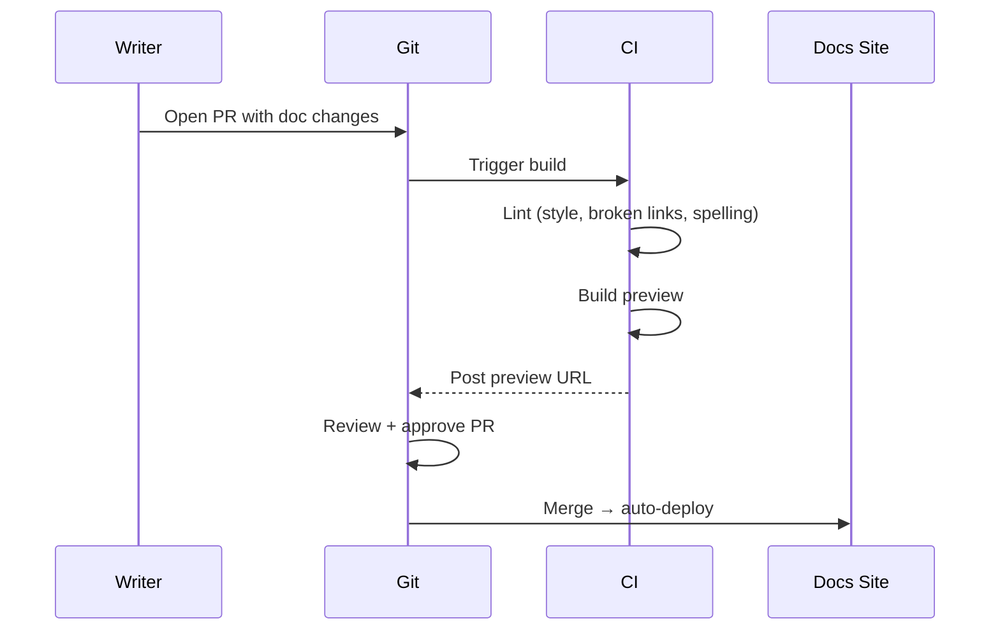
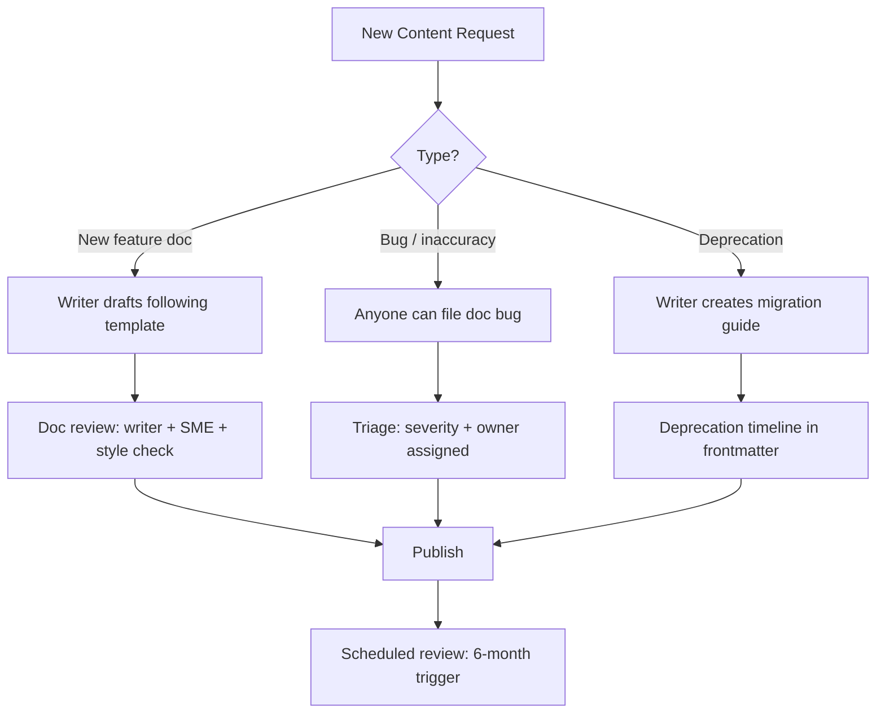
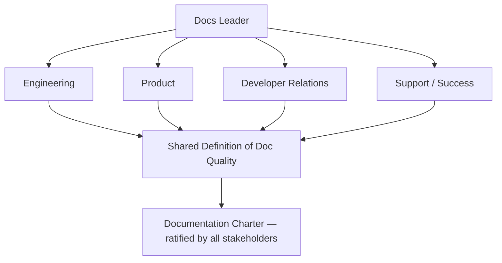
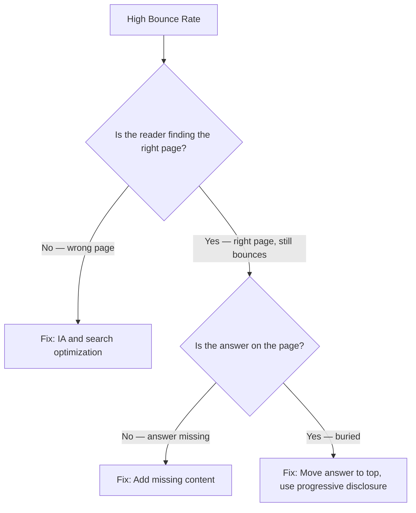

# Technical Writer Roadmap — Universal Template

> Guides content generation for **Technical Writing** topics.
> This is a SOFT SKILL — use ` ```text ` for example artifacts, ` ```mermaid ` for process diagrams.
> No programming language code fences — technical writing produces documents, not programs.

## Universal Requirements

- 8 files per topic: `junior.md`, `middle.md`, `senior.md`, `professional.md`, `interview.md`, `tasks.md`, `find-bug.md`, `optimize.md`
- Keep `{{TOPIC_NAME}}` placeholder throughout all generated files
- `professional.md` = Mastery / Leadership level (NOT compiler internals)
- Section renames: "Code Examples" → **"Example Artifacts / Templates"** | "Error Handling" → **"Common Failure Modes and Recovery"** | "Performance Tips" → **"Effectiveness and Efficiency Tips"** | "Debugging Guide" → **"Diagnosing Team / Process Problems"** | "Comparison with Other Languages" → **"Comparison with Alternative Methodologies / Tools"**

### Topic Structure

```
XX-topic-name/
├── junior.md          ← "What?" and "How?" — doc types, writing style, Markdown, Confluence
├── middle.md          ← "Why?" and "When?" — information architecture, docs-as-code, API docs, content reuse
├── senior.md          ← "How to architect?" — docs strategy, governance, versioning at scale, ROI
├── professional.md    ← Mastery / Leadership — docs systems at scale, DX writing, measuring quality
├── interview.md       ← Interview prep across all levels
├── tasks.md           ← Hands-on practice tasks
├── find-bug.md        ← Find and fix documentation anti-patterns (10+ exercises)
└── optimize.md        ← Optimize documentation artifacts for speed and clarity (10+ exercises)
```

---

## Level Comparison Matrix

| Aspect | Junior | Middle | Senior | Professional |
|:------:|:------:|:------:|:------:|:------------:|
| **Depth** | Doc types, style, Markdown, Confluence | Info architecture, API docs, docs-as-code | Docs strategy, governance, versioning, ROI | Docs systems at scale, DX writing, quality measurement |
| **Artifacts** | Tutorial draft, how-to guide | API reference, content model | Documentation strategy, style guide | Docs charter, content ops framework |
| **Tricky Points** | Mixing tutorial and reference, passive voice | Wrong audience level, missing prerequisites | Versioning at scale, content debt | Measuring docs ROI, attribution of impact |
| **Focus** | "What?" and "How?" | "Why?" and "When?" | "How to scale the docs system?" | "How to build a documentation organization?" |

---

# TEMPLATE 1 — `junior.md`

<details open>
<summary><strong>Template Content</strong></summary>

# {{TOPIC_NAME}} — Junior Level

## Table of Contents

1. [Introduction](#introduction)
2. [Prerequisites](#prerequisites)
3. [Glossary](#glossary)
4. [Core Concepts](#core-concepts)
5. [Real-World Analogies](#real-world-analogies)
6. [Pros & Cons](#pros--cons)
7. [Use Cases](#use-cases)
8. [Example Artifacts / Templates](#example-artifacts--templates)
9. [Common Failure Modes and Recovery](#common-failure-modes-and-recovery)
10. [Effectiveness and Efficiency Tips](#effectiveness-and-efficiency-tips)
11. [Best Practices](#best-practices)
12. [Tricky Points](#tricky-points)
13. [Tricky Questions](#tricky-questions)
14. [Cheat Sheet](#cheat-sheet)
15. [Summary](#summary)
16. [Further Reading](#further-reading)

---

## Introduction

> Focus: "What is it?" and "How to use it?"

Brief explanation of what {{TOPIC_NAME}} is and why a junior technical writer needs to understand it.
Assume the reader can write clearly in English but is new to structured technical documentation.

---

## Prerequisites

- **Required:** {{concept 1}} — why it matters for technical writing
- **Required:** {{concept 2}} — why it matters for technical writing
- **Helpful but not required:** {{concept 3}}

---

## Glossary

| Term | Definition |
|------|-----------|
| **Tutorial** | Learning-oriented document that takes the reader through a task to teach a skill |
| **How-To Guide** | Task-oriented document that helps the reader accomplish a specific goal |
| **Reference** | Information-oriented document describing the system as it is (API docs, glossaries) |
| **Explanation** | Understanding-oriented document that clarifies concepts without teaching a task |
| **Diataxis** | Framework dividing documentation into four types: tutorial, how-to, reference, explanation |
| **{{Term 6}}** | Simple, one-sentence definition |

> 5–10 terms total. Keep definitions beginner-friendly.

---

## Core Concepts

### Concept 1: The Four Documentation Types (Diataxis)

The Diataxis framework separates documentation into four types, each serving a different reader need. Mixing types in one document confuses readers — a tutorial that also acts as a reference is neither a good tutorial nor a good reference.

### Concept 2: Writing Style Fundamentals

Good technical writing is: specific, active voice, second person ("you"), present tense, short sentences (< 25 words), and one idea per paragraph. The reader is always doing something — write as if you are beside them.

### Concept 3: Markdown and Confluence Basics

Markdown is the most common format for developer-facing docs. Confluence is common for internal and team documentation. Both require consistent heading hierarchies, meaningful link text, and alt text for images.

> Each concept: 3–5 sentences. Use bullet points for sub-items.

---

## Real-World Analogies

| Concept | Analogy |
|---------|--------|
| **Tutorial vs Reference** | A cooking class (tutorial) vs a recipe index (reference) — very different purposes, very different formats |
| **Writing for your audience** | A doctor writes differently for a patient chart than for a peer-reviewed paper — same facts, different context |
| **Information architecture** | A well-organized bookshelf — visitors find what they need because the categories make sense, not because they search |
| **Docs-as-code** | Treating documentation like source code — versioned, reviewed in PRs, and deployed automatically |

---

## Pros & Cons

| Pros | Cons |
|------|------|
| {{Advantage 1}} | {{Disadvantage 1}} |
| {{Advantage 2}} | {{Disadvantage 2}} |
| {{Advantage 3}} | {{Disadvantage 3}} |

### When to use:
- {{Scenario where this documentation approach shines}}

### When NOT to use:
- {{Scenario where another approach is better}}

---

## Use Cases

- **Use Case 1:** Writing a quickstart tutorial for a new developer tool — reader completes their first task in under 10 minutes
- **Use Case 2:** Documenting an internal API for another team in your organization using Confluence
- **Use Case 3:** Creating a how-to guide for a recurring operational task so that any team member can perform it without asking

---

## Example Artifacts / Templates

### Example 1: Tutorial Opening (correct format)

```text
# Get Started with {{PRODUCT_NAME}}

In this tutorial, you will create your first {{RESOURCE}} and verify it works.
This tutorial takes approximately 10 minutes.

## What you'll need

- An account on {{PRODUCT_NAME}} (sign up at example.com/signup)
- curl installed on your machine

## Step 1: Create a resource

Run the following command to create your first resource:

    curl -X POST https://api.example.com/resources \
         -H "Authorization: Bearer YOUR_API_KEY" \
         -d '{"name": "my-first-resource"}'

You should see a response like this:

    {"id": "res_abc123", "name": "my-first-resource", "status": "active"}

Congratulations — your resource is now active.
```

### Example 2: Reference Entry (correct format)

```text
## POST /resources

Creates a new resource.

### Request

| Parameter | Type   | Required | Description                        |
|-----------|--------|----------|------------------------------------|
| name      | string | Yes      | Display name for the resource (1–64 characters) |
| tags      | array  | No       | List of string tags for filtering  |

### Response

Returns a Resource object.

| Field  | Type   | Description                           |
|--------|--------|---------------------------------------|
| id     | string | Unique identifier, prefixed with res_ |
| name   | string | Display name as provided              |
| status | string | One of: active, pending, deleted      |

### Example

Request:
    POST /resources
    {"name": "my-resource"}

Response (201 Created):
    {"id": "res_abc123", "name": "my-resource", "status": "active"}
```

> Every example must be realistic and complete. Avoid generic placeholder content.

---

## Common Failure Modes and Recovery

### Failure Mode 1: Mixing Tutorial and Reference in One Doc
**What happens:** The reader comes to learn but is overwhelmed by parameter tables; the experienced user comes to look up a value but has to scroll past a narrative walkthrough.
**Recovery:** Separate into distinct pages. Link between them: "For a complete parameter reference, see the API Reference."

### Failure Mode 2: Missing Prerequisites
**What happens:** Reader follows the quickstart, fails at step 2 because they lack a required tool or account, and abandons.
**Recovery:** List all prerequisites at the top of every task-oriented document. Test prerequisites with a fresh environment.

### Failure Mode 3: Passive Voice Obscuring the Actor
**What happens:** "The button should be clicked" — should be clicked by whom? Under what condition?
**Recovery:** Rewrite in active voice: "Click the **Submit** button." The subject is always the reader ("you") or the system ("the API returns").

---

## Effectiveness and Efficiency Tips

- Read your doc aloud — sentences that are hard to read aloud are hard to understand on screen
- Test every procedure in a clean environment before publishing — untested procedures fail readers
- Use consistent terminology throughout: pick one term and never alternate (e.g., always "workspace," never "workspace / project / environment")

---

## Best Practices

- Start every how-to guide with a stated goal: "In this guide, you will..."
- Use numbered lists for sequential steps; use bullet lists for non-sequential items
- Every code sample should be copyable and runnable — no ellipsis placeholders in runnable examples
- Keep sentences under 25 words; break long sentences at conjunctions
- Write headings as verb phrases for tasks ("Create a resource") and nouns for reference ("Resource object")

---

## Tricky Points

- A tutorial teaches by doing; a how-to guide helps the reader do. They are different documents with different structures
- "Simple" and "easy" are relative and condescending — remove them; if the task is simple, the clear instructions will show that
- A page with no stated audience serves no audience well — identify who the reader is in the first two sentences
- Internal jargon that makes sense to the author is invisible to the new reader — have someone outside the team review every doc

---

## Tricky Questions

1. What is the difference between a tutorial and a how-to guide? Give an example of each.
2. Why is passive voice a problem in technical documentation? Rewrite: "The configuration file should be updated."
3. A developer says "just write down what the API does." How do you explain why that is not enough?
4. How do you decide whether a piece of information belongs in a tutorial or a reference doc?
5. You discover that a quickstart you wrote six months ago no longer works. What do you do?

---

## Cheat Sheet

| Rule | Rationale |
|------|-----------|
| Active voice | Makes the actor clear; reduces ambiguity |
| One idea per paragraph | Easier to scan; easier to maintain |
| Test every procedure | Untested docs fail readers silently |
| Separate tutorials from reference | Mixing types serves neither audience |
| Define all terms on first use | Readers do not share your mental vocabulary |

---

## Summary

{{TOPIC_NAME}} at the junior level is about mastering the four documentation types and applying clear, active, audience-aware writing style. The two core skills are understanding what kind of document you are writing before you write it, and testing your procedures so you know they actually work.

---

## Further Reading

- Diataxis documentation framework — diataxis.fr
- Google Developer Documentation Style Guide — developers.google.com/style
- "Every Page is Page One" — Mark Baker

</details>

---

# TEMPLATE 2 — `middle.md`

<details open>
<summary><strong>Template Content</strong></summary>

# {{TOPIC_NAME}} — Middle Level

## Table of Contents

1. [Introduction](#introduction)
2. [Information Architecture](#information-architecture)
3. [Docs-as-Code](#docs-as-code)
4. [API Documentation](#api-documentation)
5. [Audience Analysis](#audience-analysis)
6. [Content Reuse](#content-reuse)
7. [Example Artifacts / Templates](#example-artifacts--templates)
8. [Comparison with Alternative Methodologies / Tools](#comparison-with-alternative-methodologies--tools)
9. [Common Failure Modes and Recovery](#common-failure-modes-and-recovery)
10. [Effectiveness and Efficiency Tips](#effectiveness-and-efficiency-tips)
11. [Metrics & Analytics](#metrics--analytics)
12. [Tricky Points](#tricky-points)
13. [Tricky Questions](#tricky-questions)
14. [Summary](#summary)

---

## Introduction

> Focus: "Why?" and "When?"

At the middle level, technical writers move from producing individual documents to designing documentation systems. The question shifts from "is this page clear?" to "does this documentation set serve the audience's entire journey, and is it maintainable at scale?"

---

## Information Architecture

Information architecture (IA) is the structural design of a documentation set — how content is categorized, labeled, and navigated.

```text
Example IA for a developer tool:

Getting Started/
  ├── Quickstart (tutorial)
  └── Installation (how-to)

Guides/
  ├── Authentication (how-to)
  ├── Pagination (how-to)
  └── Error handling (how-to)

Reference/
  ├── API Reference (reference)
  ├── SDKs (reference)
  └── Errors (reference)

Concepts/
  ├── Data model (explanation)
  └── Rate limiting (explanation)
```

Good IA means readers find the right document on the first navigation path, without needing search. Test IA with tree testing: give users a task, watch which path they take.

---

## Docs-as-Code

Docs-as-code treats documentation like source code: stored in version control (Git), reviewed via pull requests, built and deployed by CI/CD, and tested automatically.



Benefits: version history, review trail, automated quality checks, single source of truth co-located with code.

---

## API Documentation

API documentation has three mandatory layers:
1. **Reference** — every endpoint, parameter, type, error code (generated from OpenAPI/Swagger when possible)
2. **Conceptual** — data model, authentication model, rate limiting, pagination strategy
3. **Practical** — quickstart, common use case guides, code examples in multiple languages

```text
API Reference Entry — Minimum Viable Quality:
  Endpoint: POST /users
  Description: One sentence — what does this endpoint do?
  Authentication: Required (Bearer token)
  Request body:
    - email (string, required): user's email address
    - role (string, optional): one of "admin", "member"; default "member"
  Responses:
    201: User created — returns User object
    400: Validation error — returns Error object
    409: Email already exists — returns Error object
  Example request + response (runnable, not illustrative)
```

---

## Audience Analysis

Before writing, answer:
1. **Who is the reader?** (Role: developer, admin, end user; experience: beginner, expert)
2. **What do they already know?** (Assumed knowledge; what you do NOT need to explain)
3. **What are they trying to do?** (Goal: learn, accomplish a task, look something up)
4. **Where are they reading?** (Context: on a deadline, evaluating the product, in production incident)

```text
Audience Profile Template:
  Primary audience: Backend developers evaluating {{PRODUCT_NAME}} for integration
  Experience level: Familiar with REST APIs; may be new to {{PRODUCT_NAME}} concepts
  Goal: Determine if {{PRODUCT_NAME}} meets their use case and integrate within a sprint
  Context: Evaluating multiple tools simultaneously; time-constrained
  Assumed knowledge: HTTP, JSON, basic authentication concepts
  Do NOT assume: Familiarity with {{PRODUCT_NAME}}-specific terminology
```

---

## Content Reuse

Content reuse means writing a piece of content once and embedding it in multiple documents (single-sourcing). Common patterns:

- **Partials / includes** — reusable warning boxes, authentication setup steps, common parameters
- **Conditional content** — same source, different output for different products or audiences
- **Snippets** — standard code examples shared across guides and reference docs

Reuse reduces maintenance burden but increases authoring complexity. Only reuse content that is truly stable and identical across all contexts. Reusing content that is "almost the same" in two places creates subtle inconsistencies that are hard to find.

---

## Example Artifacts / Templates

### Audience Profile (complete)

```text
Documentation: {{TOPIC_NAME}} Getting Started Guide
Primary Audience: Junior developers (0–2 years) building their first integration
Secondary Audience: Senior developers evaluating the product for their team

Primary Reader's Goals:
  1. Understand what {{TOPIC_NAME}} does in < 5 minutes
  2. Make their first successful API call in < 15 minutes
  3. Know what to read next

Assumed Knowledge: Basic REST API concepts, ability to run curl commands
Do NOT assume: Knowledge of {{TOPIC_NAME}}-specific objects or authentication model
Tone: Direct, encouraging, no jargon without definition
```

### Doc Review Checklist

```text
Before publishing, verify:
  [ ] Stated audience in first paragraph or frontmatter
  [ ] All prerequisites listed at the top
  [ ] Every step tested in a clean environment
  [ ] All code samples are copyable and runnable
  [ ] No passive voice in instructions ("click" not "should be clicked")
  [ ] Terminology consistent with style guide
  [ ] Broken links checked (automated tool preferred)
  [ ] Screenshot alt text present
  [ ] "Next steps" or related docs linked at the bottom
```

---

## Comparison with Alternative Methodologies / Tools

| Tool / Approach | Best For | Trade-offs |
|-----------------|----------|-----------|
| **Markdown + Git (docs-as-code)** | Developer-facing docs, co-located with code | Requires toolchain setup; non-technical writers may struggle |
| **Confluence** | Internal team docs, project wikis | Poor version control; content ages quickly without governance |
| **OpenAPI / Swagger** | Auto-generating API reference | Reference only; does not replace conceptual or tutorial docs |
| **DITA XML** | Large enterprise docs with heavy reuse | High overhead; overkill for most developer docs |
| **Notion** | Small teams, lightweight internal docs | Poor search at scale; limited structured reuse |

---

## Common Failure Modes and Recovery

### Wrong Audience Level
**What happens:** A quickstart written for experts skips prerequisites; one written for beginners over-explains what REST is.
**Recovery:** Conduct audience analysis before writing. Validate with two readers from the target audience before publishing.

### API Doc with Parameters Out of Date
**What happens:** A parameter was renamed 3 months ago; the docs still show the old name. Users get 400 errors following the docs.
**Recovery:** Adopt docs-as-code — documentation PR required for any API change. Generate reference from OpenAPI spec.

### Tutorial with Steps Out of Order
**What happens:** Step 4 depends on output from step 6. Reader hits an error and abandons.
**Recovery:** Walk through every tutorial in a fresh environment with fresh credentials. Number every prerequisite action; test top-to-bottom.

---

## Effectiveness and Efficiency Tips

- Generate API reference from OpenAPI spec whenever possible — manual maintenance drifts
- Use a linter (Vale, markdownlint) in CI to enforce style automatically — frees review time for substance
- Write templates for common doc types and pre-fill the structure — writers fill in content, not formatting

---

## Metrics & Analytics

| Metric | Why It Matters | How to Measure |
|--------|---------------|---------------|
| **Time-to-First-Successful-API-Call (TTFSAC)** | Directly measures quickstart effectiveness | Instrument with auth logs; survey new users |
| **Page Bounce Rate** | High bounce = reader didn't find what they needed | Analytics platform (GA4, Plausible) |
| **Search-to-Result Rate** | % of searches that end with a page visit > 30 seconds | Search analytics |
| **Doc Staleness Rate** | % of pages not updated in > 6 months | CMS or Git log analysis |
| **Support Ticket Topics** | Which gaps in docs are generating support load | Support ticket tagging |

---

## Tricky Points

- Auto-generated API reference is not complete API documentation — it is a necessary foundation, not a finished product
- "Docs-as-code" requires developer support to work — writers need repo access, PR review norms, and CI tooling
- Content reuse makes sense for prerequisites and warnings; it rarely works for narrative passages that sound artificial when shared
- A low bounce rate on a docs page does not necessarily mean readers found their answer — they may be scrolling and still confused

---

## Tricky Questions

1. What is information architecture? Why does it matter more than individual page quality?
2. A developer says "the API reference is the docs." What do they mean, and what is missing?
3. How do you decide what belongs in a tutorial vs a how-to guide vs a conceptual explanation?
4. How do you maintain API docs across multiple product versions?
5. You inherit a documentation set with no structure and 400 pages. Where do you start?

---

## Summary

Middle-level technical writers design documentation systems, not just pages. The key skills are information architecture that serves the reader's journey, API documentation that covers all three layers (reference, conceptual, practical), and docs-as-code tooling that keeps documentation close to the product it describes. Metrics replace intuition as the signal for what is and is not working.

</details>

---

# TEMPLATE 3 — `senior.md`

<details open>
<summary><strong>Template Content</strong></summary>

# {{TOPIC_NAME}} — Senior Level

## Table of Contents

1. [Introduction](#introduction)
2. [Documentation Strategy](#documentation-strategy)
3. [Content Governance](#content-governance)
4. [Versioning at Scale](#versioning-at-scale)
5. [Docs ROI Measurement](#docs-roi-measurement)
6. [Example Artifacts / Templates](#example-artifacts--templates)
7. [Diagnosing Team / Process Problems](#diagnosing-team--process-problems)
8. [Metrics & Analytics](#metrics--analytics)
9. [Tricky Points](#tricky-points)
10. [Tricky Questions](#tricky-questions)
11. [Summary](#summary)

---

## Introduction

> Focus: "How to architect the documentation system?" and "How to sustain documentation quality at scale?"

Senior technical writers own documentation as a product, not as a service to engineering. They define strategy, govern quality, manage the lifecycle of a large content corpus, and measure the value of documentation against business outcomes.

---

## Documentation Strategy

A documentation strategy defines: who the documentation serves, what it covers, what it explicitly does not cover, how it is organized, how it stays current, and how success is measured.

```text
Documentation Strategy Template:

VISION
  {{PRODUCT_NAME}} documentation enables any developer to go from first visit
  to first successful integration within 15 minutes, and to solve any subsequent
  problem without contacting support.

AUDIENCE
  Primary: Backend developers integrating {{PRODUCT_NAME}} for the first time
  Secondary: DevOps engineers managing {{PRODUCT_NAME}} at scale

SCOPE
  In scope: All public APIs, SDKs, core concepts, common integration patterns
  Out of scope: Internal tooling, pre-release features, third-party integrations

NORTH STAR METRIC
  Time-to-first-successful-API-call (TTFSAC) ≤ 10 minutes for 80% of new users

SUCCESS METRICS
  - Support ticket deflection rate ≥ 40%
  - TTFSAC ≤ 10 minutes (measured monthly)
  - Doc staleness: 0 pages > 6 months without review

OWNERSHIP
  - API reference: auto-generated + writer review per release
  - Tutorials: writer-owned, tested before every release
  - Concepts: writer-owned, reviewed when product changes
```

---

## Content Governance

Governance defines the rules that keep a large documentation set coherent, accurate, and maintained over time.



Governance components:
- **Style guide** — house style, terminology, tone, formatting rules
- **Content model** — defined templates per doc type
- **Review process** — who reviews what, what "ready to publish" means
- **Lifecycle policy** — how old content is reviewed, archived, or deleted
- **Ownership map** — which team owns which section of the docs

---

## Versioning at Scale

Versioning becomes a documentation crisis when a product has multiple supported versions and each has slightly different behavior.

Strategies:
- **Single-version docs with version notes** — one page, inline callouts for version differences. Simple to maintain; breaks down beyond 2–3 versions
- **Per-version branches** — each major version has its own docs branch. Accurate; expensive to maintain
- **Versioned includes** — single source, conditional rendering per version. Complex tooling required; most scalable

```text
Versioning Decision Matrix:
  < 2 supported versions  → inline version callouts
  2–4 supported versions  → per-version branches with shared content partials
  5+ supported versions   → versioned build system (e.g., Docusaurus versioning)

  Rule: Never maintain two versions of a tutorial manually — the divergence rate
        guarantees one will become inaccurate within two sprints.
```

---

## Docs ROI Measurement

Measuring documentation ROI requires connecting documentation metrics to business outcomes.

```text
ROI Framework:

1. SUPPORT DEFLECTION
   Measure: (support tickets per 1000 active users) before and after major doc release
   Proxy: If a doc page view precedes a support ticket, the doc did not deflect it.
          If no doc page view precedes the ticket, the doc may be missing.

2. ONBOARDING ACCELERATION
   Measure: TTFSAC (time-to-first-successful-API-call) for new users
   Method: Instrument auth/API logs; correlate with sign-up date

3. DEVELOPER SATISFACTION
   Measure: NPS or CSAT score for documentation specifically
   Method: Triggered survey after first successful API call

4. ENGINEERING TIME SAVED
   Measure: Engineering hours spent answering "how do I..." questions
   Before: Engineer-hours in Slack + on-call for docs questions per month
   After: Same measurement post-documentation improvement
```

---

## Example Artifacts / Templates

### Documentation Strategy (abbreviated)

See the full template in the Documentation Strategy section above.

### Content Audit Spreadsheet Structure

```text
Columns:
  URL | Title | Doc Type | Primary Audience | Last Updated | Owner |
  Last Reviewed | TTFSAC | Bounce Rate | Support Tickets Linked |
  Status (current / needs update / deprecated / delete)

Review cadence:
  - Tutorials: every release that touches the covered feature
  - Reference: auto-generated; verify on every release
  - How-to guides: every 6 months or on relevant product change
  - Concepts: every 12 months or on architecture change
```

### Deprecation Notice Template

```text
> **Deprecated in version {{X.X}}**
> This endpoint will be removed in version {{Y.Y}} ({{estimated date}}).
> Migrate to [{{replacement endpoint}}](link) before that date.
> See the [migration guide](link) for step-by-step instructions.
```

---

## Diagnosing Team / Process Problems

### "Docs are always out of date"
- Is there a documentation requirement in the definition of done?
- Are writers included in the release process, or notified after release?
- **Fix:** Add "documentation updated" as a release gate; include writer in sprint planning for any user-facing change.

### "Nobody reads the docs — they just ask on Slack"
- Is the IA making content hard to find?
- Is the quickstart working? (TTFSAC measurement)
- Is the docs site discoverable (search rank, in-product links)?
- **Fix:** Run a findability test (tree testing or first-click testing); fix top navigation paths; add in-product contextual links to relevant docs.

### "We have 3 writers supporting 40 engineers — we can't keep up"
- Are writers doing work that tooling could automate? (Reference generation, link checking)
- Is there a docs-as-code model where engineers own a first draft?
- **Fix:** Implement OpenAPI-generated reference; create contribution guides so engineers can draft; writers edit and maintain quality.

---

## Metrics & Analytics

| Metric | Definition | Senior Target |
|--------|-----------|--------------|
| **TTFSAC** | Median time from signup to first successful API call | ≤ 10 minutes |
| **Support Deflection Rate** | % fewer support tickets after docs improvement | ≥ 30% reduction |
| **Doc Coverage** | % of public API surface documented | 100% |
| **Staleness Rate** | % of pages not reviewed in > 6 months | < 5% |
| **Bounce Rate (docs)** | % of doc page visits ending without interaction | < 60% |
| **CSAT (docs)** | Reader satisfaction score on docs pages | ≥ 4.0/5.0 |

---

## Tricky Points

- Docs strategy without a north-star metric becomes a list of principles that nobody follows
- "Everything is important" is a documentation strategy failure — prioritize ruthlessly or nothing gets done well
- Versioned documentation is a documentation crisis deferred, not solved — every new version is a fork that diverges
- A content audit is not a cleanup project; it is an ongoing governance practice

---

## Tricky Questions

1. You are the first technical writer at a company with no documentation culture. Where do you start?
2. Leadership asks you to measure the ROI of your documentation program. What do you measure and how?
3. You have 400 documentation pages and 2 writers. How do you decide what to maintain and what to deprecate?
4. A product team wants to own their own documentation. How do you support this while maintaining quality?
5. The engineering team ships a breaking API change without telling the docs team. What process do you put in place to prevent recurrence?

---

## Summary

Senior technical writers own documentation as a product with a strategy, a governance model, measurable outcomes, and a lifecycle. Success is not measured by pages written but by reader outcomes — TTFSAC, support deflection, and developer satisfaction. The senior technical writer's job is to build the system that produces good documentation, not just to write good documentation themselves.

</details>

---

# TEMPLATE 4 — `professional.md`

<details open>
<summary><strong>Template Content</strong></summary>

# {{TOPIC_NAME}} — Mastery and Leadership Level

## Table of Contents

1. [Leadership Philosophy](#leadership-philosophy)
2. [Organizational Dynamics](#organizational-dynamics)
3. [Influence Without Authority](#influence-without-authority)
4. [Building Systems, Not Just Skills](#building-systems-not-just-skills)
5. [Measuring Mastery](#measuring-mastery)
6. [Psychological and Cognitive Frameworks](#psychological-and-cognitive-frameworks)
7. [Case Studies](#case-studies)
8. [Tricky Leadership Questions](#tricky-leadership-questions)
9. [Summary](#summary)

---

## Leadership Philosophy

Documentation is not a by-product of engineering — it is a product in its own right, with users, quality metrics, and a lifecycle. The professional technical writer leads documentation as a system: one that can be designed, measured, improved, and eventually operated without the leader's direct involvement.

Core commitments:
- **Documentation quality is developer experience quality** — a confusing API reference is a product defect
- **Writer as product manager** — own the documentation roadmap, set priorities, measure outcomes
- **Automation amplifies writer leverage** — generate what can be generated; write what cannot
- **Clarity is a business outcome** — reduce time-to-value for developers by reducing time-to-understanding

---

## Organizational Dynamics



Docs teams are often under-resourced relative to the surface they cover. The professional docs leader wins resources by quantifying the cost of bad documentation: support ticket volume, TTFSAC, developer churn in onboarding funnels. Connect every documentation investment to a line item in the developer experience P&L.

---

## Influence Without Authority

Technical writers rarely have authority over engineers, product managers, or designers. Influence is built through:

- **Quality data** — a dashboard showing TTFSAC, bounce rate, and support ticket correlation is more persuasive than any style argument
- **Process integration** — "documentation updated" as a release gate means writers have leverage at the point where engineers need to ship
- **Writing the contribution guide** — if engineers write first drafts and writers edit, the writer becomes a force multiplier
- **Speaking the language of developer experience** — frame documentation quality as product quality in every executive conversation

---

## Building Systems, Not Just Skills

```text
Documentation System Health Check (annual):
  [ ] Documentation strategy is written, current, and shared across product teams
  [ ] Style guide is enforced automatically by CI linter (Vale or equivalent)
  [ ] API reference is generated from OpenAPI spec — no manual maintenance
  [ ] TTFSAC is measured monthly and reported to leadership
  [ ] Documentation is included in the definition of done for every user-facing change
  [ ] New engineers can publish their first documentation contribution without help within their first sprint
  [ ] Content audit is conducted semi-annually; staleness rate < 5%
```

---

## Measuring Mastery

| Indicator | Lagging Metric | Leading Metric |
|-----------|---------------|----------------|
| **Developer Onboarding** | TTFSAC | % of quickstarts tested before release |
| **Support Load** | Tickets per 1000 active users | Doc coverage of common support topics |
| **Content Quality** | CSAT score | Review completion rate before publish |
| **Docs-as-Product** | NPS for docs | % of product changes with doc update in same PR |

Industry standards at this level:
- Google Developer Documentation Style Guide
- Diataxis framework (Procida)
- The Good Docs Project templates
- Write the Docs community standards

---

## Psychological and Cognitive Frameworks

**Curse of knowledge** — the expert writer cannot remember not knowing something. They omit the step that was obvious to them but opaque to the reader.
Counter: have a first-time user walk through every tutorial before publishing.

**Cognitive load theory** — readers can hold ~7 chunks of information in working memory. Long procedures without checkpoints cause task abandonment.
Counter: break procedures longer than 7 steps into named stages; offer a progress indicator or checkpoint.

**Satisficing (Simon)** — readers do not read for full comprehension; they read until they find something good enough to try.
Counter: write for scanning: bold key terms, front-load the answer, use progressive disclosure.

**Information scent (Pirolli)** — readers follow navigation links that "smell like" they will lead to their answer. Poor navigation labels cause readers to abandon before reaching content.
Counter: label navigation with what the reader is trying to do ("Authenticate a user"), not with what the system does ("Authentication module").

---

## Case Studies

### Netflix — Testing Culture Reflected in Developer Docs

Netflix's engineering blog and internal developer documentation are treated as first-class engineering outputs. Documentation is written in the same sprint as the feature; the bar for publishing is the same as the bar for shipping code — reviewed, tested, and accurate.

**Lesson:** When documentation is held to the same standard as code, it stays current. When it is treated as a follow-up task, it drifts.

### Stripe — API Documentation as a Competitive Advantage

Stripe's documentation is widely cited as the gold standard for developer-facing API docs. Key practices:
- Every code sample is tested against the live API in CI
- Documentation is versioned with the API — when the API changes, the docs change in the same PR
- TTFSAC is a product metric tracked by the CEO alongside revenue and uptime
- Technical writers are embedded in product teams, not in a separate docs team

**Lesson:** Treating documentation quality as a product metric — measured, reported, and tied to business outcomes — changes the organizational investment in documentation permanently.

### Google — Developer Documentation Style Guide as Industry Infrastructure

Google's Developer Documentation Style Guide is used by hundreds of organizations beyond Google. Its impact shows that a well-designed style system creates a shared standard that reduces friction across the entire industry.

Key findings from Google's internal research:
- Inconsistent terminology is the primary cause of developer confusion in complex APIs
- Structured review checklists (stated audience? measurable outcome? tested steps?) catch 80% of common documentation defects before publishing
- Documentation produced by writers with engineering context has a 40% lower defect rate than documentation produced without it

**Lesson:** Style systems and review checklists scale quality better than individual writer expertise. Invest in the system, not just in hiring great writers.

---

## Tricky Leadership Questions

1. Leadership wants to reduce the docs team by 50% and "let engineers write the docs." What do you argue, and what data do you bring?
2. You have a documentation team of 4 writers supporting 200 engineers across 12 product areas. How do you prioritize?
3. An engineering team ships a feature with no documentation. Your manager asks why the docs are not ready. How do you respond, and what process do you put in place?
4. Your TTFSAC metric has been flat for 6 months despite publishing 40 new pages. What does this signal, and what do you do?
5. A senior engineer argues that auto-generated API reference is "good enough" and wants to eliminate the writer role on their team. How do you respond?

---

## Summary

Professional technical writing mastery is documentation leadership: owning documentation as a product, measuring its impact on developer experience, and building systems that produce consistent quality at scale without requiring heroic individual effort. The ultimate deliverable is not a documentation site — it is an organization where good documentation is the natural outcome of how the team builds software.

</details>

---

# TEMPLATE 5 — `interview.md`

<details open>
<summary><strong>Template Content</strong></summary>

# {{TOPIC_NAME}} — Interview Preparation

## Junior-Level Questions

1. What is the difference between a tutorial and a how-to guide?
2. What is the Diataxis framework? Name the four documentation types.
3. Why is passive voice a problem in technical writing? Give an example and rewrite it.
4. What should always appear at the top of a how-to guide or tutorial?
5. You are asked to document a new feature. What questions do you ask before writing?
6. Write the opening paragraph of a tutorial for creating an API key.
7. What is the difference between numbered and bulleted lists? When do you use each?
8. A developer asks you to "just write down what the API does." What do you say?

---

## Middle-Level Questions

1. What is information architecture? How do you test whether your IA works?
2. Explain docs-as-code. What does it require from both writers and developers?
3. What are the three layers of complete API documentation?
4. You inherit a documentation set with 400 pages and no structure. Where do you start?
5. How do you measure whether a quickstart is effective?
6. An API parameter was renamed. How do you ensure the docs stay accurate?
7. Write an audience profile for a quickstart guide targeting backend developers.
8. What is content reuse? Give an example of when it helps and when it causes problems.

---

## Senior-Level Questions

1. What does a documentation strategy document contain? What is the north-star metric?
2. How do you manage documentation for a product with 5 supported versions?
3. You have 3 writers and 60 engineers. How do you decide what to document and what not to?
4. How do you measure the ROI of a documentation program?
5. A product team wants to own their own documentation. How do you support this while maintaining quality?
6. Design a content governance model for a 500-page developer documentation site.
7. The engineering team ships without telling the docs team. What process prevents this?

---

## Behavioral Questions (All Levels)

1. Tell me about a piece of documentation you wrote that significantly helped users. How did you measure the impact?
2. Describe a time you had to push back on publishing documentation that was inaccurate. What happened?
3. Tell me about a documentation process you improved. What was the before and after state?
4. Describe a time you worked with a subject matter expert who was hard to get information from. How did you handle it?
5. Tell me about a time a reader told you your documentation was confusing. What did you do?

</details>

---

# TEMPLATE 6 — `tasks.md`

<details open>
<summary><strong>Template Content</strong></summary>

# {{TOPIC_NAME}} — Practice Tasks

## Junior Tasks

**Task 1: Write a Tutorial Opening**
Write the first 200 words of a tutorial titled "Get Started with the {{PRODUCT_NAME}} API." Include: what the reader will accomplish, time estimate, prerequisites, and step 1.
Deliverable: Formatted Markdown with correct heading structure.

**Task 2: Convert Passive Voice**
Rewrite the following sentences in active voice:
- "The configuration file should be updated before the application is started."
- "An error message will be displayed if the token is expired."
- "The resource can be deleted by navigating to the settings page."
Deliverable: Three rewritten sentences with brief explanation of the change.

**Task 3: Identify the Documentation Type**
Classify each of the following docs (tutorial / how-to / reference / explanation):
- "The Authentication Model" — explains how OAuth2 works in the product
- "Create Your First Webhook" — walks through creating a webhook from scratch
- "Reset a User's Password" — six steps to reset a password
- "API Endpoints" — lists every endpoint with parameters and response schemas
Deliverable: Classifications with one-sentence justification each.

---

## Middle Tasks

**Task 4: Build an Information Architecture**
Design the IA for a developer documentation site for a REST API with 15 endpoints, 3 authentication methods, and a JavaScript SDK. Use a tree structure (folders and files).
Deliverable: Annotated IA tree showing doc type for each node.

**Task 5: Write an API Reference Entry**
Write a complete API reference entry for a fictional `POST /payments` endpoint.
Include: description, authentication requirement, request parameters (at least 4), response codes (at least 3), and a runnable example.
Deliverable: Formatted Markdown reference entry.

**Task 6: Audit Three Doc Pages**
Given three provided documentation pages, complete a content audit for each: doc type, audience, last-updated date (estimated from content), staleness risk, and top recommended improvement.
Deliverable: Audit table plus one prioritized action per page.

---

## Senior Tasks

**Task 7: Write a Documentation Strategy**
Write a documentation strategy for a fictional developer tool with 2 writers, 30 engineers, 50 API endpoints, and a current TTFSAC of 45 minutes.
Deliverable: Strategy document including vision, scope, north-star metric, success metrics, ownership model.

**Task 8: Design a Governance Model**
Design a content governance model for a 300-page documentation site: style guide enforcement, review process, ownership map, lifecycle policy (how old pages are reviewed / archived).
Deliverable: Governance model document with decision flow diagram (mermaid).

**Task 9: Measure Documentation ROI**
Given: support ticket volume dropped by 300 tickets/month after a documentation improvement project. Each ticket costs $25 in support engineering time. The project took 2 writers × 3 weeks.
Calculate the ROI. What additional measurements would strengthen this case?
Deliverable: ROI calculation plus list of 3 additional supporting metrics.

</details>

---

# TEMPLATE 7 — `find-bug.md`

<details open>
<summary><strong>Template Content</strong></summary>

# {{TOPIC_NAME}} — Find the Documentation Anti-Pattern

> In technical writing, "bugs" are documentation defects: wrong parameter names, steps out of order, missing prerequisites, content that contradicts actual behavior. Identify the anti-pattern and explain the fix.

---

## Exercise 1: API Doc with Wrong Parameter Names

```text
POST /users

Request body:
  - username (string, required): the user's display name
  - password_hash (string, required): pre-hashed password

Example:
  {"username": "alice", "password_hash": "abc123"}
```

Actual API behavior: the parameter is named `email`, not `username`, and the API accepts a plaintext password, not a hash.

**Anti-pattern:** {{identify it}}
**Risk:** {{what happens to a developer who follows this doc}}
**Fix:** {{how to prevent this class of error going forward}}

---

## Exercise 2: Tutorial with Steps Out of Order

```text
# Create a Webhook

Step 1: Create the webhook endpoint in your application to receive events.
Step 2: Register your endpoint URL in the dashboard.
Step 3: Install the {{PRODUCT_NAME}} SDK.
Step 4: Authenticate your SDK client using your API key.
Step 5: Test your webhook by triggering a test event.
```

**Anti-pattern:** {{identify the ordering problem}}
**What fails:** {{which step a reader cannot complete without a prior step}}
**Fix:** {{correct the order and explain the dependency}}

---

## Exercise 3: Missing Prerequisites in a Quickstart

```text
# Quickstart: Send Your First SMS

Step 1: Import the SMS client
    from sms_sdk import Client

Step 2: Initialize with your API key
    client = Client(api_key="YOUR_API_KEY")

Step 3: Send a message
    client.send(to="+15551234567", body="Hello!")
```

**Missing prerequisites:** {{list everything the reader needs that is not stated}}
**Failure modes:** {{what error does a reader hit for each missing prerequisite}}
**Fix:** {{add a complete prerequisites section}}

---

## Exercise 4: Documentation Contradicting Actual Behavior

```text
Reference: GET /users/{id}

Description: Returns a user object. If the user is not found, returns null.

Example response (200 OK):
  {"id": "usr_123", "email": "alice@example.com"}
```

Actual API behavior: returns HTTP 404 with `{"error": "user_not_found"}` when the user does not exist — not 200 with null.

**Anti-pattern:** {{identify it}}
**Consequence:** {{what breaks in a developer's error handling code}}
**Fix:** {{correct the doc and add a prevention process}}

---

## Exercise 5: How-To Guide Written as a Tutorial

```text
# Pagination

Pagination is a technique used to retrieve large datasets in smaller chunks.
In our system, we use cursor-based pagination, which works as follows:
[3 paragraphs of explanation about how cursor pagination works conceptually]

To use pagination, you pass a `cursor` parameter:
    GET /items?cursor=eyJpZCI6MTIzfQ==

The cursor is an opaque base64-encoded string. We chose base64 because...
[2 more paragraphs of explanation about the implementation decision]

Here is how to get the next page:
    GET /items?cursor={{next_cursor_from_previous_response}}
```

**Anti-pattern:** {{identify the doc-type mixing}}
**Who is harmed:** {{which reader type is underserved}}
**Fix:** {{split into separate documents with correct structure for each type}}

---

## Exercise 6: Reference Entry with No Error Documentation

```text
POST /payments

Creates a payment.

Request:
  amount (integer, required): amount in cents
  currency (string, required): ISO 4217 currency code

Response (200 OK):
  payment_id (string): unique identifier for the payment
```

**What is missing:** {{list all missing information}}
**Risk to developer:** {{what production scenario is undocumented}}
**Fix:** {{add the missing sections}}

---

## Exercise 7: Quickstart That Requires a Support Ticket to Complete

```text
# Quickstart

Step 1: Create an account at example.com
Step 2: Obtain your API key from the dashboard
Step 3: Make your first API call

  curl -X GET https://api.example.com/v1/status \
       -H "Authorization: Bearer YOUR_API_KEY"
```

The API key is not available in the dashboard for new accounts — it requires email verification, a 24-hour manual review, and approval by a sales engineer.

**Anti-pattern:** {{identify it}}
**Reader experience:** {{describe what actually happens}}
**Fix:** {{how should the doc handle gated onboarding flows}}

---

## Exercise 8: Style Inconsistencies Within One Doc

```text
Step 1: Click the "Create" button.
Step 2: Select your region and then press Save.
Step 3: the API key will be generated automatically.
Step 4: Copy API Key to clipboard.
Step 5: Use the key to authenticate API requests, referencing the authentication guide.
```

**Anti-patterns:** {{list every inconsistency}}
**Why it matters:** {{explain the cognitive impact on the reader}}
**Fix:** {{rewrite all 5 steps with consistent style}}

---

## Exercise 9: Deprecation Without Migration Path

```text
> ⚠️ Warning: The v1 API is deprecated.
```

**What is missing:** {{list every element a complete deprecation notice needs}}
**Risk:** {{what happens to developers who only see this notice}}
**Fix:** {{write a complete deprecation notice using the standard template}}

---

## Exercise 10: Explanation Document That Teaches Nothing

```text
# Rate Limiting

Rate limiting controls the number of API requests you can make.
Our rate limits are enforced at the account level.
Rate limits help ensure fair usage of the API.
If you exceed the rate limit, your requests will be rejected.
To avoid rate limit errors, do not exceed the rate limit.
```

**Anti-pattern:** {{identify the content failure mode}}
**What the reader actually needs:** {{specify what questions are left unanswered}}
**Fix:** {{rewrite as a useful explanation with concrete numbers, headers, and recovery guidance}}

</details>

---

# TEMPLATE 8 — `optimize.md`

<details open>
<summary><strong>Template Content</strong></summary>

# {{TOPIC_NAME}} — Optimize the Documentation Artifact

> Each exercise presents a documentation artifact with a specific inefficiency. Optimize it using stated constraints and measure improvement against the given metrics.

---

## Optimization 1: API Reference Page Taking 10 Minutes to Read

**Problem:** An API reference page for `POST /payments` is 1,200 words of prose. Developers report taking 10+ minutes to find whether a parameter is required.

**Task:** Optimize for a developer to find any parameter's type and requirements in under 30 seconds.

**Approach:**
1. Replace prose parameter descriptions with a structured table (parameter | type | required | description)
2. Move conceptual explanation to a separate "Payments concepts" page — link from the reference
3. Put the most-used example at the top, before the parameter table
4. Add anchor links for each response code section

**Target Metrics:**

| Metric | Before | Target |
|--------|--------|--------|
| Time to find parameter type | ~10 min | ≤ 30 seconds |
| Page bounce rate | baseline | -20% |
| Support tickets: "what type is X parameter" | baseline | -50% |

---

## Optimization 2: Quickstart with 45-Minute TTFSAC

**Problem:** New developers take an average of 45 minutes to complete their first successful API call. Target is 10 minutes.

**Diagnostic Questions:**
- How many steps are in the quickstart? (Target: ≤ 7 steps to first success)
- Are all prerequisites stated upfront? (Missing prerequisites are the #1 cause of abandonment)
- Is each step testable? (Does the reader know if step 3 succeeded before moving to step 4?)
- Are error messages documented for the 3 most common failure modes?

**Optimization Checklist:**

```text
[ ] Cut steps: anything not needed for first success moves to a "next steps" guide
[ ] Front-load prerequisites: all requirements listed before step 1
[ ] Add success indicators: "you should see X" after every step
[ ] Document the top 3 errors new users encounter
[ ] Test the optimized quickstart with 3 first-time users; measure TTFSAC
```

**Target Metrics:**

| Metric | Before | Target |
|--------|--------|--------|
| TTFSAC (median) | 45 min | ≤ 10 min |
| Quickstart completion rate | unknown | ≥ 70% |
| Support tickets from new users | baseline | -40% |

---

## Optimization 3: 400-Page Docs Site with 70% Bounce Rate

**Problem:** A 400-page documentation site has a 70% bounce rate. Users search, land on a page, and leave without clicking anything.

**Diagnostic Flow:**



**Approach:**
1. Identify top 20 high-bounce pages from analytics
2. For each: determine whether the reader arrived at the right page (search query → page title alignment)
3. For pages where reader arrived correctly: move the answer to the first 100 words
4. For pages where reader arrived incorrectly: fix metadata and IA labels

**Target Metrics:**

| Metric | Before | Target |
|--------|--------|--------|
| Overall bounce rate | 70% | ≤ 50% |
| Search success rate | unknown | ≥ 60% |
| Time-on-page (median) | unknown | > 90 seconds |

---

## Optimization 4: Style Inconsistency Across 200-Page API Docs

**Problem:** 200 API reference pages written by 15 different authors. Terminology is inconsistent (endpoint / route / path), formatting varies, tone varies from formal to casual.

**Approach:**
1. Audit: extract all unique terms for the same concept; pick the canonical term
2. Enforce: add Vale linter rules for the top 20 terminology violations
3. Template: create a reference entry template; reformat the 50 highest-traffic pages first
4. Prevent: add linter to CI — no new pages merge with style violations

**Target Metrics:**

| Metric | Before | Target |
|--------|--------|--------|
| Terminology inconsistency rate | baseline | 0 violations in CI |
| Reader confusion tickets | baseline | -30% |
| New page review time | ~45 min/page | ≤ 15 min/page |

---

## Universal Documentation Improvement Metrics

After any optimization, measure against:

| Metric | How to Measure |
|--------|---------------|
| **TTFSAC** | Auth/API logs correlated with signup date |
| **Page Bounce Rate** | Analytics platform (GA4, Plausible) |
| **Support Ticket Deflection** | Tickets per 1000 active users, before/after |
| **Doc Staleness Rate** | % pages not reviewed in > 6 months (Git log) |
| **Search Success Rate** | % searches ending with page visit > 30 seconds |
| **CSAT (docs)** | Post-first-success survey |
| **Doc Coverage** | % of API surface with reference entry |

</details>

---

## Notes for Content Generators

- All example artifacts use realistic, domain-appropriate content — no lorem ipsum
- No programming language code fences in technical writer templates (exception: code samples shown as documentation content use `text` fence)
- Process diagrams: `mermaid` fence only
- Documentation artifacts (tutorials, reference entries, style guides): `text` fence only
- `professional.md` contains no code-level or compiler-level content — leadership, systems, and philosophy only
- `find-bug.md` targets documentation defects and anti-patterns, not code bugs
- `optimize.md` includes before/after metrics for every optimization
- Metrics focus: TTFSAC, bounce rate, support deflection, doc staleness, CSAT
