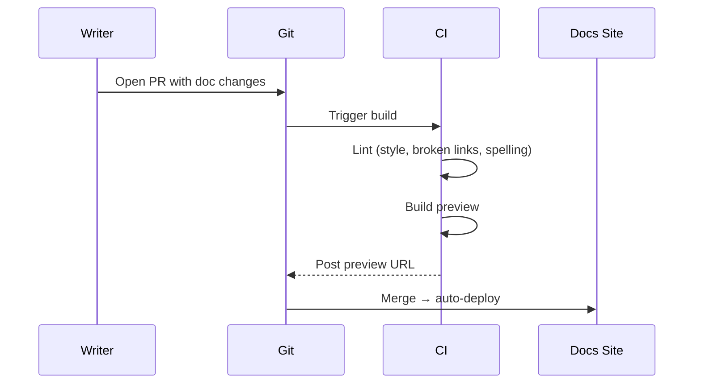
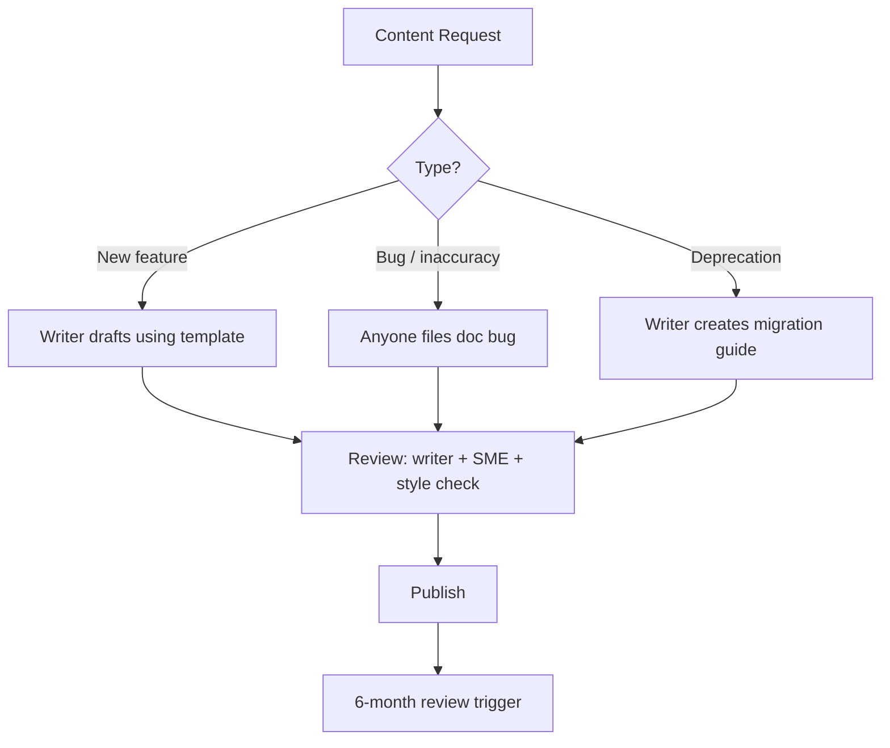
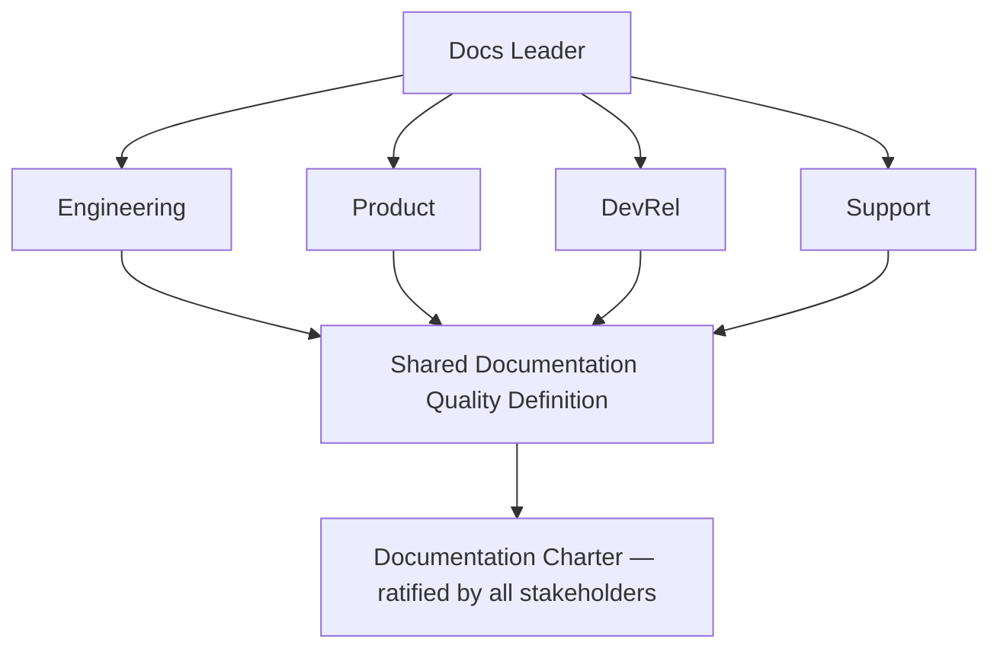
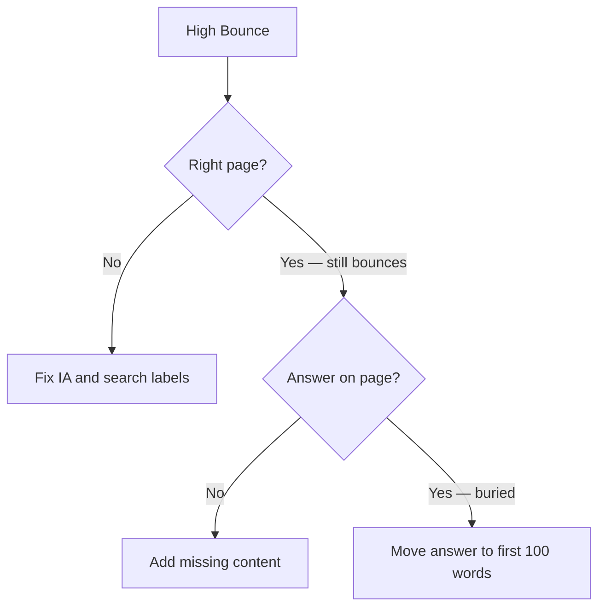

# Technical Writer Roadmap — Universal Template

> Guides content generation for **Technical Writing** topics.
> This is a SOFT SKILL — use ` ```text ` for example artifacts, ` ```mermaid ` for process diagrams.
> No programming language code fences — documentation artifacts use `text` fences.

## Universal Requirements

- 9 files per topic: `junior.md`, `middle.md`, `senior.md`, `professional.md`, `interview.md`, `tasks.md`, `find-bug.md`, `optimize.md`, `specification.md`
- Keep `{{TOPIC_NAME}}` placeholder throughout all generated files
- `professional.md` = Mastery / Leadership level (NOT compiler internals)
- Section renames: "Code Examples" → **"Example Artifacts / Templates"** | "Error Handling" → **"Common Failure Modes and Recovery"** | "Performance Tips" → **"Effectiveness and Efficiency Tips"** | "Debugging Guide" → **"Diagnosing Team / Process Problems"** | "Comparison with Other Languages" → **"Comparison with Alternative Methodologies / Tools"**

### Topic Structure

```
XX-topic-name/
├── junior.md       ← "What?" and "How?" — doc types, writing style, Markdown, Confluence
├── middle.md       ← "Why?" and "When?" — information architecture, API docs, docs-as-code
├── senior.md       ← "How to architect?" — docs strategy, governance, versioning, ROI
├── professional.md ← Mastery / Leadership — docs systems at scale, DX writing, quality measurement
├── interview.md    ← Interview prep across all levels
├── tasks.md        ← Hands-on practice tasks
├── find-bug.md     ← Find and fix documentation anti-patterns (10+ exercises)
├── optimize.md     ← Optimize documentation artifacts for clarity and speed (10+ exercises)
└── specification.md   ← Official spec / documentation deep-dive
```

## Level Comparison Matrix

| Aspect | Junior | Middle | Senior | Professional |
|:------:|:------:|:------:|:------:|:------------:|
| **Depth** | Doc types, style, Markdown, Confluence | IA, API docs, docs-as-code, content reuse | Docs strategy, governance, versioning, ROI | Docs systems at scale, DX writing, quality metrics |
| **Artifacts** | Tutorial, how-to draft | API reference, content model | Docs strategy, style guide | Docs charter, content ops framework |
| **Focus** | "What?" and "How?" | "Why?" and "When?" | "How to scale the docs system?" | "How to build a documentation organization?" |

---

# TEMPLATE 1 — `junior.md`

<details open>
<summary><strong>Template Content</strong></summary>

# {{TOPIC_NAME}} — Junior Level

## Table of Contents
1. [Introduction](#introduction) | 2. [Prerequisites](#prerequisites) | 3. [Glossary](#glossary)
4. [Core Concepts](#core-concepts) | 5. [Real-World Analogies](#real-world-analogies)
6. [Use Cases](#use-cases) | 7. [Example Artifacts / Templates](#example-artifacts--templates)
8. [Common Failure Modes and Recovery](#common-failure-modes-and-recovery)
9. [Effectiveness and Efficiency Tips](#effectiveness-and-efficiency-tips)
10. [Best Practices](#best-practices) | 11. [Tricky Points](#tricky-points)
12. [Tricky Questions](#tricky-questions) | 13. [Cheat Sheet](#cheat-sheet) | 14. [Summary](#summary)

---

## Introduction
> Focus: "What is it?" and "How to use it?"

Brief explanation of what {{TOPIC_NAME}} is and why a junior technical writer needs to understand it.

## Prerequisites
- **Required:** {{concept 1}} — why it matters for technical writing
- **Required:** {{concept 2}} — why it matters for technical writing
- **Helpful:** {{concept 3}}

## Glossary

| Term | Definition |
|------|-----------|
| **Tutorial** | Learning-oriented document that takes the reader through a task to teach a skill |
| **How-To Guide** | Task-oriented document helping the reader accomplish a specific goal |
| **Reference** | Information-oriented document describing the system as it is (API docs, glossaries) |
| **Explanation** | Understanding-oriented document that clarifies concepts without teaching a task |
| **Diataxis** | Framework dividing docs into four types: tutorial, how-to, reference, explanation |
| **{{Term 6}}** | Simple, one-sentence definition |

## Core Concepts

### Concept 1: The Four Documentation Types (Diataxis)
Tutorial teaches by doing. How-to guides help accomplish a specific task. Reference describes the system. Explanation develops understanding. Mixing types in one document confuses readers and serves no audience well.

### Concept 2: Writing Style Fundamentals
Good technical writing is: specific, active voice, second person ("you"), present tense, sentences under 25 words, one idea per paragraph. The reader is always doing something — write as if you are beside them.

### Concept 3: Markdown and Confluence Basics
Markdown is the most common format for developer-facing docs. Confluence is common for internal docs. Both require consistent heading hierarchies, meaningful link text, and alt text for all images.

## Real-World Analogies

| Concept | Analogy |
|---------|--------|
| **Tutorial vs Reference** | A cooking class (tutorial) vs a recipe index (reference) — different purposes, different formats |
| **Writing for your audience** | A doctor writes differently for a patient chart than for a peer-reviewed paper |
| **Information architecture** | A well-organized bookshelf — visitors find what they need because categories make sense |
| **Docs-as-code** | Treating documentation like source code — versioned, reviewed in PRs, deployed automatically |

## Use Cases
- Writing a quickstart tutorial for a developer tool — reader completes their first task in under 10 minutes
- Documenting an internal API for another team using Confluence
- Creating a how-to guide for a recurring operational task so any team member can perform it

## Example Artifacts / Templates

### Tutorial Opening (correct format)

```text
# Get Started with {{PRODUCT_NAME}}

In this tutorial, you will create your first {{RESOURCE}} and verify it works.
This takes approximately 10 minutes.

## What you'll need
- An account at example.com/signup
- curl installed on your machine

## Step 1: Create a resource

    curl -X POST https://api.example.com/resources \
         -H "Authorization: Bearer YOUR_API_KEY" \
         -d '{"name": "my-first-resource"}'

Expected response:
    {"id": "res_abc123", "name": "my-first-resource", "status": "active"}
```

### API Reference Entry (correct format)

```text
## POST /resources

Creates a new resource.

### Request body

| Parameter | Type   | Required | Description                        |
|-----------|--------|----------|------------------------------------|
| name      | string | Yes      | Display name (1–64 characters)     |
| tags      | array  | No       | String tags for filtering          |

### Responses
| Code | Meaning         |
|------|----------------|
| 201  | Resource created — returns Resource object |
| 400  | Validation error — returns Error object    |

### Example
Request: POST /resources  {"name": "my-resource"}
Response (201): {"id": "res_abc123", "name": "my-resource", "status": "active"}
```

## Common Failure Modes and Recovery

**Mixing tutorial and reference** — learner is overwhelmed by tables; expert wastes time on narrative. Fix: separate into distinct pages, link between them.

**Missing prerequisites** — reader fails at step 2 because a required tool is not installed. Fix: list all prerequisites at the top; test in a fresh environment.

**Passive voice obscuring the actor** — "The button should be clicked" — by whom? Fix: always use active voice: "Click the **Submit** button."

## Effectiveness and Efficiency Tips
- Read your doc aloud — sentences hard to speak are hard to understand on screen
- Test every procedure in a clean environment before publishing
- Pick one term per concept and never alternate (always "workspace," never "workspace / project / environment")

## Best Practices
- Start every how-to guide: "In this guide, you will..."
- Numbered lists for sequential steps; bullet lists for non-sequential items
- Every code sample must be copyable and runnable — no ellipsis placeholders
- Headings as verb phrases for tasks ("Create a resource") and nouns for reference ("Resource object")

## Tricky Points
- A tutorial teaches by doing; a how-to helps the reader do — they are different documents with different structures
- "Simple" and "easy" are condescending — remove them; clear instructions demonstrate simplicity
- A page with no stated audience serves no audience well
- Internal jargon invisible to the author is a barrier to every new reader

## Tricky Questions
1. What is the difference between a tutorial and a how-to guide? Give an example of each.
2. Why is passive voice a problem? Rewrite: "The configuration file should be updated."
3. A developer says "just write down what the API does." What is missing?
4. How do you decide whether information belongs in a tutorial or a reference doc?
5. You discover a quickstart you wrote six months ago no longer works. What do you do?

## Cheat Sheet

| Rule | Rationale |
|------|-----------|
| Active voice | Makes the actor clear; reduces ambiguity |
| One idea per paragraph | Easier to scan and maintain |
| Test every procedure | Untested docs fail readers silently |
| Separate tutorials from reference | Mixing types serves neither audience |
| Define all terms on first use | Readers don't share your mental vocabulary |

## Summary
{{TOPIC_NAME}} at the junior level: understand what kind of document you are writing before you write it, and test every procedure so you know it works.

</details>

---

# TEMPLATE 2 — `middle.md`

<details open>
<summary><strong>Template Content</strong></summary>

# {{TOPIC_NAME}} — Middle Level

## Table of Contents
1. [Introduction](#introduction) | 2. [Information Architecture](#information-architecture)
3. [Docs-as-Code](#docs-as-code) | 4. [API Documentation](#api-documentation)
5. [Audience Analysis](#audience-analysis) | 6. [Content Reuse](#content-reuse)
7. [Example Artifacts / Templates](#example-artifacts--templates)
8. [Comparison with Alternative Methodologies / Tools](#comparison-with-alternative-methodologies--tools)
9. [Common Failure Modes and Recovery](#common-failure-modes-and-recovery)
10. [Metrics & Analytics](#metrics--analytics) | 11. [Tricky Points](#tricky-points)
12. [Tricky Questions](#tricky-questions) | 13. [Summary](#summary)

---

## Introduction
> Focus: "Why?" and "When?" — designing documentation systems, not just individual pages.

## Information Architecture

```text
Example IA for a developer tool:

Getting Started/
  ├── Quickstart (tutorial)
  └── Installation (how-to)
Guides/
  ├── Authentication (how-to)
  └── Error Handling (how-to)
Reference/
  ├── API Reference (reference)
  └── Errors (reference)
Concepts/
  └── Data Model (explanation)
```

Good IA means readers find the right document on the first navigation path, without needing search. Test IA with tree testing: give users a task, watch which path they take.

## Docs-as-Code



## API Documentation

Three mandatory layers:
1. **Reference** — every endpoint, parameter, type, error code (generated from OpenAPI when possible)
2. **Conceptual** — data model, authentication model, rate limiting, pagination strategy
3. **Practical** — quickstart, common use case guides, runnable code examples

```text
API Reference Entry — Minimum Viable Quality:
  Endpoint and one-sentence description
  Authentication requirement
  All request parameters: name | type | required | description
  All response codes: code | meaning | returned object
  One runnable example request + response
```

## Audience Analysis

Before writing, answer:
1. Who is the reader? (Role, experience level)
2. What do they already know? (Assumed knowledge)
3. What are they trying to do? (Goal: learn, accomplish, look up)
4. Where are they reading? (On a deadline? Evaluating the product? In a production incident?)

```text
Audience Profile:
  Primary: Backend developers evaluating {{PRODUCT_NAME}} for integration
  Experience: Familiar with REST APIs; new to {{PRODUCT_NAME}} concepts
  Goal: Determine fit and integrate within a sprint
  Assumed: HTTP, JSON, basic auth concepts
  Do NOT assume: {{PRODUCT_NAME}}-specific terminology
```

## Content Reuse

Write once, embed in multiple documents. Useful for: prerequisites sections, warning boxes, common parameters, standard code examples. Only reuse content that is truly identical across all contexts — "almost the same" creates subtle inconsistencies that are hard to find and fix.

## Example Artifacts / Templates

### Doc Review Checklist

```text
Before publishing:
  [ ] Audience stated in first paragraph or frontmatter
  [ ] All prerequisites listed at the top
  [ ] Every step tested in a clean environment
  [ ] All code samples are copyable and runnable
  [ ] Active voice in all instructions
  [ ] Terminology consistent with style guide
  [ ] Broken links checked (automated tool preferred)
  [ ] Screenshot alt text present
  [ ] "Next steps" or related docs linked at the bottom
```

## Comparison with Alternative Methodologies / Tools

| Tool / Approach | Best For | Trade-offs |
|-----------------|----------|-----------|
| **Markdown + Git (docs-as-code)** | Developer-facing docs co-located with code | Requires toolchain; non-technical writers may struggle |
| **Confluence** | Internal team docs, project wikis | Poor version control; ages without governance |
| **OpenAPI / Swagger** | Auto-generating API reference | Reference only; no conceptual or tutorial layer |
| **DITA XML** | Large enterprise docs with heavy reuse | High overhead; overkill for most developer docs |
| **Notion** | Small teams, lightweight internal docs | Poor search at scale; limited structured reuse |

## Common Failure Modes and Recovery

**Wrong audience level** — quickstart written for experts skips prerequisites. Fix: validate with two readers from the target audience before publishing.

**API doc with outdated parameters** — a renamed parameter causes 400 errors for users following the docs. Fix: docs-as-code with documentation PR required for any API change; generate reference from OpenAPI spec.

**Tutorial steps out of order** — step 4 depends on output from step 6. Fix: walk through every tutorial in a fresh environment top-to-bottom.

## Metrics & Analytics

| Metric | Why It Matters | How to Measure |
|--------|---------------|---------------|
| **TTFSAC** | Measures quickstart effectiveness directly | Auth logs correlated with signup date |
| **Page Bounce Rate** | High bounce = reader didn't find the answer | Analytics platform |
| **Search-to-Result Rate** | % searches ending with a page visit > 30 sec | Search analytics |
| **Doc Staleness Rate** | % pages not updated in > 6 months | Git log analysis |
| **Support Ticket Topics** | Which gaps generate support load | Ticket tagging |

## Tricky Points
- Auto-generated API reference is a necessary foundation, not finished documentation
- Docs-as-code requires developer support — writers need repo access, PR review norms, CI tooling
- Content reuse makes sense for standard warnings; it rarely works for narrative passages
- Low bounce rate does not mean readers found their answer — they may be scrolling in confusion

## Tricky Questions
1. What is information architecture? Why does it matter more than individual page quality?
2. A developer says "the API reference is the docs." What is missing?
3. How do you maintain API docs across multiple product versions?
4. You inherit a 400-page documentation set with no structure. Where do you start?

## Summary
Middle-level technical writers design documentation systems. Key skills: IA that serves the reader's journey, API documentation at all three layers, and docs-as-code tooling that keeps docs close to the product.

</details>

---

# TEMPLATE 3 — `senior.md`

<details open>
<summary><strong>Template Content</strong></summary>

# {{TOPIC_NAME}} — Senior Level

## Table of Contents
1. [Introduction](#introduction) | 2. [Documentation Strategy](#documentation-strategy)
3. [Content Governance](#content-governance) | 4. [Versioning at Scale](#versioning-at-scale)
5. [Docs ROI Measurement](#docs-roi-measurement)
6. [Example Artifacts / Templates](#example-artifacts--templates)
7. [Diagnosing Team / Process Problems](#diagnosing-team--process-problems)
8. [Metrics & Analytics](#metrics--analytics) | 9. [Tricky Questions](#tricky-questions)

---

## Introduction
> Focus: "How to architect the documentation system?" — own docs as a product with strategy and measurable outcomes.

## Documentation Strategy

```text
Documentation Strategy Template:
VISION: {{PRODUCT_NAME}} docs enable any developer to go from first visit to
        first successful integration in 15 minutes and solve subsequent problems
        without contacting support.
AUDIENCE: Primary: Backend developers integrating for the first time
SCOPE: In scope: all public APIs, SDKs, core concepts, integration patterns
       Out of scope: internal tooling, pre-release features
NORTH STAR: TTFSAC ≤ 10 minutes for 80% of new users
METRICS: Support deflection ≥ 40% | Staleness: 0 pages > 6 months without review
OWNERSHIP: API reference: auto-generated + writer review | Tutorials: writer-owned
```

## Content Governance



Governance components: style guide, content model, review process, lifecycle policy, ownership map.

## Versioning at Scale

```text
Versioning Decision Matrix:
  < 2 supported versions  → inline version callouts on single pages
  2–4 supported versions  → per-version branches with shared content partials
  5+ supported versions   → versioned build system (e.g., Docusaurus versioning)

  Rule: Never maintain two versions of a tutorial manually — divergence is guaranteed
        within two sprints.
```

## Docs ROI Measurement

```text
ROI Framework:
1. SUPPORT DEFLECTION: tickets per 1000 active users before vs after doc release
2. ONBOARDING: TTFSAC (auth logs correlated with signup date)
3. DEVELOPER SATISFACTION: NPS/CSAT triggered after first successful API call
4. ENGINEERING TIME: hours/month answering "how do I..." on Slack, before and after
```

## Example Artifacts / Templates

### Content Audit Spreadsheet Structure

```text
URL | Title | Doc Type | Audience | Last Updated | Owner |
TTFSAC | Bounce Rate | Support Tickets | Status (current/needs update/deprecated/delete)

Review cadence:
  Tutorials: every release touching the covered feature
  Reference: auto-generated; verify on every release
  How-to guides: every 6 months or on product change
  Concepts: every 12 months or on architecture change
```

### Deprecation Notice Template

```text
> **Deprecated in version {{X.X}}**
> This endpoint will be removed in version {{Y.Y}} ({{date}}).
> Migrate to [{{replacement}}](link) before that date.
> See the [migration guide](link) for step-by-step instructions.
```

## Diagnosing Team / Process Problems

**"Docs are always out of date"** — is there a doc requirement in the definition of done? Are writers in the release process? Fix: add "documentation updated" as a release gate; include writer in sprint planning.

**"Nobody reads the docs — they ask on Slack"** — run a findability test; fix top navigation paths; add in-product contextual links to relevant docs.

**"3 writers, 40 engineers, can't keep up"** — implement OpenAPI-generated reference; create contribution guides so engineers draft first; writers edit and maintain quality.

## Metrics & Analytics

| Metric | Definition | Target |
|--------|-----------|--------|
| **TTFSAC** | Median time: signup → first successful API call | ≤ 10 min |
| **Support Deflection** | % fewer tickets after docs improvement | ≥ 30% |
| **Doc Coverage** | % of public API surface documented | 100% |
| **Staleness Rate** | % pages not reviewed in > 6 months | < 5% |
| **CSAT (docs)** | Reader satisfaction score | ≥ 4.0/5.0 |

## Tricky Questions
1. You are the first technical writer at a company with no documentation culture. Where do you start?
2. Leadership asks you to measure the ROI of your docs program. What do you measure?
3. 400 pages, 2 writers. How do you decide what to maintain and what to deprecate?
4. A product team ships a breaking API change without telling the docs team. What process prevents recurrence?

</details>

---

# TEMPLATE 4 — `professional.md`

<details open>
<summary><strong>Template Content</strong></summary>

# {{TOPIC_NAME}} — Mastery and Leadership Level

## Table of Contents
1. [Leadership Philosophy](#leadership-philosophy) | 2. [Organizational Dynamics](#organizational-dynamics)
3. [Influence Without Authority](#influence-without-authority)
4. [Building Systems, Not Just Skills](#building-systems-not-just-skills)
5. [Measuring Mastery](#measuring-mastery)
6. [Psychological and Cognitive Frameworks](#psychological-and-cognitive-frameworks)
7. [Case Studies](#case-studies) | 8. [Tricky Leadership Questions](#tricky-leadership-questions)
9. [Summary](#summary)

---

## Leadership Philosophy
Documentation quality is developer experience quality — a confusing API reference is a product defect. The professional technical writer leads documentation as a system: one that can be designed, measured, improved, and eventually operated without the leader's direct involvement.

Core commitments: writer as product manager; automation amplifies writer leverage; clarity is a business outcome that reduces time-to-value.

## Organizational Dynamics



Connect every documentation investment to a line item in the developer experience P&L: TTFSAC improvement, support ticket deflection, developer churn reduction in onboarding funnels.

## Influence Without Authority
- **Data** — TTFSAC and bounce rate dashboards are more persuasive than style arguments
- **Process integration** — "documentation updated" as a release gate gives writers leverage at ship time
- **Contribution guide** — engineers write first drafts; writers edit: writer becomes a force multiplier
- **Language** — frame documentation quality as product quality in every executive conversation

## Building Systems, Not Just Skills

```text
Documentation System Health Check (annual):
  [ ] Docs strategy written, current, shared across product teams
  [ ] Style guide enforced by CI linter (Vale or equivalent)
  [ ] API reference generated from OpenAPI spec — no manual maintenance
  [ ] TTFSAC measured monthly and reported to leadership
  [ ] "Docs updated" in definition of done for every user-facing change
  [ ] New engineers publish first doc contribution without help in first sprint
  [ ] Content audit conducted semi-annually; staleness rate < 5%
```

## Measuring Mastery

| Indicator | Lagging Metric | Leading Metric |
|-----------|---------------|----------------|
| **Onboarding** | TTFSAC | % of quickstarts tested before release |
| **Support Load** | Tickets per 1000 active users | Doc coverage of top support topics |
| **Content Quality** | CSAT score | Review completion rate before publish |
| **Docs-as-Product** | NPS for docs | % of product changes with doc in same PR |

Industry standards: Google Developer Documentation Style Guide, Diataxis framework (Procida), The Good Docs Project, Write the Docs community standards.

## Psychological and Cognitive Frameworks

**Curse of knowledge** — the expert writer omits steps obvious to them but opaque to the reader. Counter: first-time user walkthrough of every tutorial before publishing.

**Cognitive load theory** — readers hold ~7 chunks in working memory; long procedures without checkpoints cause abandonment. Counter: break procedures > 7 steps into named stages with explicit checkpoints.

**Satisficing (Simon)** — readers scan until they find something good enough to try. Counter: front-load the answer; use progressive disclosure; bold key terms.

**Information scent (Pirolli)** — readers follow links that "smell like" they lead to the answer. Counter: label navigation with what the reader is trying to do ("Authenticate a user"), not with what the system does ("Authentication module").

## Case Studies

**Netflix — Documentation as Engineering Output:** Netflix treats engineering blog posts and internal developer docs as first-class engineering outputs, reviewed at the same bar as code. Documentation is written in the same sprint as the feature. Lesson: when documentation is held to the same standard as code, it stays current.

**Stripe — TTFSAC as a Product Metric:** Stripe's documentation is widely cited as the gold standard for developer-facing API docs. Every code sample is tested against the live API in CI. TTFSAC is tracked by the CEO alongside revenue and uptime. Technical writers are embedded in product teams. Lesson: treating documentation quality as a product metric changes organizational investment permanently.

**Google — Style Systems as Industry Infrastructure:** Google's Developer Documentation Style Guide is used by hundreds of organizations. Internal research found: inconsistent terminology is the primary cause of developer confusion; structured review checklists catch 80% of defects before publishing; docs produced by writers with engineering context have a 40% lower defect rate. Lesson: style systems and checklists scale quality better than individual writer expertise.

## Tricky Leadership Questions
1. Leadership wants to cut the docs team 50% and let engineers write docs. What do you argue, and what data do you bring?
2. 4 writers, 200 engineers, 12 product areas. How do you prioritize?
3. Your TTFSAC metric is flat for 6 months despite 40 new pages published. What does this signal?
4. A senior engineer argues auto-generated reference is "good enough" and wants to eliminate the writer role. How do you respond?
5. An engineering team ships without telling the docs team. What process do you put in place?

## Summary
Professional technical writing mastery is documentation leadership: owning docs as a product, measuring impact on developer experience, and building systems that produce consistent quality at scale. The ultimate deliverable is an organization where good documentation is the natural outcome of how the team builds software.

</details>

---

# TEMPLATE 5 — `interview.md`

<details open>
<summary><strong>Template Content</strong></summary>

# {{TOPIC_NAME}} — Interview Preparation

## Junior Questions
1. What is the difference between a tutorial and a how-to guide?
2. What is the Diataxis framework? Name the four documentation types.
3. Why is passive voice a problem? Rewrite: "The configuration file should be updated before the application is started."
4. What should always appear at the top of a how-to guide?
5. You are asked to document a new feature. What questions do you ask before writing?
6. Write the opening paragraph of a tutorial for creating an API key.
7. What is the difference between numbered and bulleted lists?

## Middle Questions
1. What is information architecture? How do you test whether yours works?
2. Explain docs-as-code. What does it require from both writers and developers?
3. What are the three layers of complete API documentation?
4. How do you measure whether a quickstart is effective?
5. An API parameter was renamed. How do you ensure the docs stay accurate?
6. What is content reuse? When does it help and when does it cause problems?

## Senior Questions
1. What does a documentation strategy document contain? What is the north-star metric?
2. How do you manage documentation for a product with 5 supported versions?
3. You have 3 writers and 60 engineers. How do you decide what to document?
4. How do you measure the ROI of a documentation program?
5. Design a content governance model for a 500-page developer docs site.

## Behavioral Questions (All Levels)
1. Tell me about documentation you wrote that significantly helped users. How did you measure impact?
2. Describe a time you pushed back on publishing inaccurate documentation.
3. Tell me about a documentation process you improved. Before and after state?
4. Describe working with a subject matter expert who was hard to get information from.
5. A reader told you your documentation was confusing. What did you do?

</details>

---

# TEMPLATE 6 — `tasks.md`

<details open>
<summary><strong>Template Content</strong></summary>

# {{TOPIC_NAME}} — Practice Tasks

**Task 1 (Junior):** Write the first 200 words of a tutorial "Get Started with the {{PRODUCT_NAME}} API" — include: goal, time estimate, prerequisites, step 1 with expected output. Deliverable: formatted Markdown.

**Task 2 (Junior):** Rewrite these sentences in active voice:
- "The configuration file should be updated before the application is started."
- "An error will be displayed if the token is expired."
Deliverable: two rewritten sentences with brief explanation.

**Task 3 (Junior):** Classify each doc type (tutorial / how-to / reference / explanation):
- "The Authentication Model" — explains OAuth2 in the product
- "Create Your First Webhook" — walks through creating a webhook from scratch
- "API Endpoints" — lists all endpoints with parameters and schemas
Deliverable: classifications with one-sentence justification.

**Task 4 (Middle):** Design the IA for a developer docs site for a REST API with 15 endpoints, 3 auth methods, a JS SDK. Use a folder/file tree. Deliverable: annotated IA tree with doc type per node.

**Task 5 (Middle):** Write a complete API reference entry for a fictional `POST /payments` endpoint: description, auth, 4+ request parameters, 3+ response codes, runnable example. Deliverable: formatted Markdown.

**Task 6 (Middle):** Complete a content audit for 3 provided documentation pages: doc type, audience, staleness risk, top recommended improvement. Deliverable: audit table + one prioritized action per page.

**Task 7 (Senior):** Write a documentation strategy for: 2 writers, 30 engineers, 50 API endpoints, current TTFSAC 45 minutes. Include vision, scope, north-star metric, ownership model. Deliverable: strategy document.

**Task 8 (Senior):** Design a content governance model for 300 pages: style guide enforcement, review process, ownership map, lifecycle policy. Deliverable: governance document with decision flow diagram (mermaid).

**Task 9 (Senior):** Support ticket volume dropped 300 tickets/month after a docs project. Each ticket costs $25; project used 2 writers × 3 weeks. Calculate ROI. List 3 additional supporting metrics. Deliverable: ROI calculation + metrics list.

</details>

---

# TEMPLATE 7 — `find-bug.md`

<details open>
<summary><strong>Template Content</strong></summary>

# {{TOPIC_NAME}} — Find the Documentation Anti-Pattern

> Documentation "bugs" include wrong parameter names, steps out of order, missing prerequisites, and content contradicting actual behavior.

**Exercise 1 — API Doc with Wrong Parameter Names:**
```text
POST /users: username (string, required), password_hash (string, required)
```
Actual API: parameter is `email`, not `username`; API accepts plaintext password, not a hash.
Anti-pattern: {{identify}} | Risk: {{what fails for the developer}} | Fix: {{prevention process}}

---

**Exercise 2 — Tutorial with Steps Out of Order:**
```text
Step 1: Create webhook endpoint in your app
Step 2: Register endpoint URL in dashboard
Step 3: Install the SDK
Step 4: Authenticate SDK client with API key
Step 5: Test webhook
```
Anti-pattern: {{identify the ordering problem}} | What fails: {{which step breaks}} | Fix: {{correct order with dependency explanation}}

---

**Exercise 3 — Missing Prerequisites in Quickstart:**
```text
Step 1: from sms_sdk import Client
Step 2: client = Client(api_key="YOUR_API_KEY")
Step 3: client.send(to="+15551234567", body="Hello!")
```
Missing prerequisites: {{list all}} | Failure modes: {{error per missing item}} | Fix: {{complete prerequisites section}}

---

**Exercise 4 — Documentation Contradicting Actual Behavior:**
```text
GET /users/{id}: "If user not found, returns null."
```
Actual behavior: returns HTTP 404 with `{"error": "user_not_found"}`.
Anti-pattern: {{identify}} | Consequence: {{what breaks in the developer's error handling}} | Fix: {{correct doc + prevention process}}

---

**Exercise 5 — How-To Written as Tutorial (Doc Type Mixing):**
```text
"Pagination" page: 3 paragraphs explaining what cursor pagination is, then
2 paragraphs on why the team chose base64, then finally the actual pagination steps.
```
Anti-pattern: {{identify the doc-type mixing}} | Who is harmed: {{which reader type}} | Fix: {{split into separate documents}}

---

**Exercise 6 — Reference Entry with No Error Documentation:**
```text
POST /payments: amount (integer, required), currency (string, required)
Response (200 OK): payment_id (string)
```
What is missing: {{list all missing information}} | Risk: {{undocumented production scenario}} | Fix: {{add missing sections}}

---

**Exercise 7 — Quickstart Requiring a Support Ticket to Complete:**
```text
Step 1: Create account | Step 2: Get API key from dashboard | Step 3: Make first call
```
Actual situation: API key requires email verification + 24-hour manual review + sales engineer approval.
Anti-pattern: {{identify}} | Reader experience: {{describe what actually happens}} | Fix: {{handle gated onboarding flows properly}}

---

**Exercise 8 — Inconsistent Style Within One Document:**
```text
Step 1: Click the "Create" button.
Step 2: Select your region and then press Save.
Step 3: the API key will be generated automatically.
Step 4: Copy API Key to clipboard.
```
Anti-patterns: {{list every inconsistency}} | Cognitive impact: {{explain}} | Fix: {{rewrite all steps with consistent style}}

---

**Exercise 9 — Deprecation Without Migration Path:**
```text
> ⚠️ Warning: The v1 API is deprecated.
```
What is missing: {{list every element a complete deprecation notice needs}} | Risk: {{what happens to developers}} | Fix: {{write complete deprecation notice}}

---

**Exercise 10 — Explanation Document That Teaches Nothing:**
```text
"Rate Limiting: Rate limiting controls the number of API requests you can make.
To avoid rate limit errors, do not exceed the rate limit."
```
Anti-pattern: {{content failure mode}} | What the reader needs: {{unanswered questions}} | Fix: {{rewrite with concrete numbers, headers, and recovery guidance}}

</details>

---

# TEMPLATE 8 — `optimize.md`

<details open>
<summary><strong>Template Content</strong></summary>

# {{TOPIC_NAME}} — Optimize the Documentation Artifact

> Optimize each artifact against stated constraints. Measure improvement with the given metrics.

**Optimization 1 — API Reference Page (10 min to read → answer in 30 seconds):**
Replace prose parameter descriptions with structured tables. Move conceptual content to a separate "Concepts" page linked from the reference. Add anchor links for each response code section.

| Metric | Before | Target |
|--------|--------|--------|
| Time to find parameter type | ~10 min | ≤ 30 sec |
| Bounce rate | baseline | -20% |
| Support tickets: "what type is X" | baseline | -50% |

---

**Optimization 2 — Quickstart with 45-min TTFSAC → 10 min:**
Diagnostic: count steps to first success (target ≤ 7); verify all prerequisites stated upfront; add success indicator after every step; document top 3 error scenarios.

```text
Optimization Checklist:
  [ ] Cut steps: anything not needed for first success → "Next Steps" guide
  [ ] Front-load all prerequisites before step 1
  [ ] Add "you should see X" after every step
  [ ] Document the top 3 errors new users encounter
  [ ] Test with 3 first-time users; measure TTFSAC
```

| Metric | Before | Target |
|--------|--------|--------|
| TTFSAC (median) | 45 min | ≤ 10 min |
| Completion rate | unknown | ≥ 70% |
| New-user support tickets | baseline | -40% |

---

**Optimization 3 — High-Bounce Docs Site (70% → 50% bounce rate):**



| Metric | Before | Target |
|--------|--------|--------|
| Bounce rate | 70% | ≤ 50% |
| Search success rate | unknown | ≥ 60% |
| Time-on-page (median) | unknown | > 90 sec |

---

**Optimization 4 — Style Inconsistency Across 200-Page API Docs:**
Audit all unique terms for the same concept; pick canonical terms. Add Vale linter rules for top 20 violations. Create a reference entry template; reformat the 50 highest-traffic pages first. Add linter to CI.

| Metric | Before | Target |
|--------|--------|--------|
| Terminology violations in CI | baseline | 0 |
| Reader confusion tickets | baseline | -30% |
| New page review time | ~45 min | ≤ 15 min |

---

**Universal Documentation Improvement Metrics:**

| Metric | How to Measure |
|--------|---------------|
| **TTFSAC** | Auth logs correlated with signup date |
| **Page Bounce Rate** | Analytics platform (GA4, Plausible) |
| **Support Deflection** | Tickets per 1000 active users, before/after |
| **Doc Staleness Rate** | % pages not reviewed in > 6 months (Git log) |
| **Search Success Rate** | % searches ending with page visit > 30 sec |
| **CSAT (docs)** | Post-first-success survey |
| **Doc Coverage** | % of API surface with reference entry |

</details>

---

## Notes for Content Generators

- All artifacts use realistic, domain-appropriate content — no lorem ipsum
- No programming language code fences; documentation content uses `text` fences
- Process diagrams: `mermaid` fence only
- `professional.md` contains no code-level or compiler-level content — leadership and systems only
- `find-bug.md` targets documentation anti-patterns and defects, not code bugs
- `optimize.md` includes before/after metrics for every optimization
- Metrics focus: TTFSAC, bounce rate, support deflection, doc staleness, CSAT
---
---

# TEMPLATE 9 — `specification.md`

> **Focus:** Official documentation deep-dive — standards references, framework specifications, official guidelines, and version compatibility.
>
> **Source:** Always cite the official documentation or standards with direct section links.
> - AI Red Teaming: https://airc.nist.gov/Docs | https://owasp.org/www-project-ai-security-and-privacy-guide/
> - Cyber Security: https://owasp.org/www-project-top-ten/ | https://csrc.nist.gov/
> - Code Review: https://google.github.io/eng-practices/review/
> - Engineering Manager: https://www.manager-tools.com/ | https://lethain.com/staff-engineer/
> - QA: https://www.istqb.org/certifications/ | https://testing.googleblog.com/
> - Technical Writer: https://developers.google.com/tech-writing | https://www.writethedocs.org/guide/
> - Product Manager: https://www.svpg.com/inspired/ | https://www.productboard.com/resources/
> - DevRel: https://www.devrel.agency/resources | https://www.commonroom.io/resources/
> - AWS: https://docs.aws.amazon.com/ | https://aws.amazon.com/architecture/
> - Git/GitHub: https://git-scm.com/docs | https://docs.github.com/

<details open>
<summary><strong>Template Content</strong></summary>

# {{TOPIC_NAME}} — Specification

> **Official Documentation / Standards Reference**
>
> Source: [{{SOURCE_NAME}}]({{DOCS_URL}}) — {{SECTION}}

---

## Table of Contents

1. [Reference](#reference)
2. [Official Framework / Standard](#official-framework--standard)
3. [Core Rules & Guidelines](#core-rules--guidelines)
4. [Process / Workflow Specification](#process--workflow-specification)
5. [Metrics & Measurement](#metrics--measurement)
6. [Common Scenarios & Responses](#common-scenarios--responses)
7. [Version & Evolution History](#version--evolution-history)
8. [Official Examples & Case Studies](#official-examples--case-studies)
9. [Compliance Checklist](#compliance-checklist)
10. [Related Resources](#related-resources)

---

## 1. Reference

| Property | Value |
|----------|-------|
| **Official Source** | [{{SOURCE_NAME}}]({{DOCS_URL}}) |
| **Relevant Section** | {{SECTION_NAME}} — {{SECTION_TITLE}} |
| **Standard / Version** | {{STANDARD_VERSION}} |
| **Direct URL** | {{DOCS_URL}}/{{PATH}} |

---

## 2. Official Framework / Standard

> From: {{DOCS_URL}}/{{FRAMEWORK_SECTION}}

### {{FRAMEWORK_OR_STANDARD_NAME}}

{{FRAMEWORK_DESCRIPTION}}

| Component | Purpose | Official Guidance |
|-----------|---------|------------------|
| {{COMP_1}} | {{PURPOSE_1}} | [Link]({{URL_1}}) |
| {{COMP_2}} | {{PURPOSE_2}} | [Link]({{URL_2}}) |
| {{COMP_3}} | {{PURPOSE_3}} | [Link]({{URL_3}}) |

---

## 3. Core Rules & Guidelines

### Guideline 1: {{GUIDELINE_NAME}}

> *Source: [{{DOCS_URL}}/{{SECTION}}]({{DOCS_URL}}/{{SECTION}}) — "{{DOC_QUOTE}}"*

{{GUIDELINE_EXPLANATION}}

**✅ Good practice:**
{{GOOD_EXAMPLE}}

**❌ Anti-pattern:**
{{BAD_EXAMPLE}}

### Guideline 2: {{GUIDELINE_NAME}}

> *Source: [{{DOCS_URL}}/{{SECTION}}]({{DOCS_URL}}/{{SECTION}})*

{{GUIDELINE_EXPLANATION}}

---

## 4. Process / Workflow Specification

### Official Process Flow

```
{{PROCESS_STEP_1}}
    ↓
{{PROCESS_STEP_2}}
    ↓
{{PROCESS_STEP_3}}
    ↓
{{PROCESS_STEP_4}}
```

| Stage | Official Requirement | Notes |
|-------|---------------------|-------|
| {{STAGE_1}} | {{REQ_1}} | {{NOTES_1}} |
| {{STAGE_2}} | {{REQ_2}} | {{NOTES_2}} |

---

## 5. Metrics & Measurement

| Metric | Official Definition | Target / Benchmark | Reference |
|--------|--------------------|--------------------|-----------|
| {{METRIC_1}} | {{DEF_1}} | {{TARGET_1}} | [Link]({{URL_1}}) |
| {{METRIC_2}} | {{DEF_2}} | {{TARGET_2}} | [Link]({{URL_2}}) |
| {{METRIC_3}} | {{DEF_3}} | {{TARGET_3}} | [Link]({{URL_3}}) |

---

## 6. Common Scenarios & Responses

| Scenario | Official Guidance | Reference |
|----------|-------------------|-----------|
| {{SCENARIO_1}} | {{GUIDANCE_1}} | [Docs]({{URL_1}}) |
| {{SCENARIO_2}} | {{GUIDANCE_2}} | [Docs]({{URL_2}}) |
| {{SCENARIO_3}} | {{GUIDANCE_3}} | [Docs]({{URL_3}}) |

---

## 7. Version & Evolution History

| Version / Edition | Change | Year | Notes |
|------------------|--------|------|-------|
| {{VER_1}} | {{CHANGE_1}} | {{YEAR_1}} | {{NOTES_1}} |
| {{VER_2}} | {{CHANGE_2}} | {{YEAR_2}} | {{NOTES_2}} |

---

## 8. Official Examples & Case Studies

### Example: {{EXAMPLE_TITLE}}

> Source: [{{DOCS_URL}}/{{ANCHOR}}]({{DOCS_URL}}/{{ANCHOR}})

{{EXAMPLE_DESCRIPTION}}

**Outcome / Result:**
{{EXPECTED_OUTCOME}}

---

## 9. Compliance Checklist

- [ ] Follows official recommended approach for {{TOPIC_NAME}}
- [ ] Aligned with standard version ({{STANDARD_VERSION}})
- [ ] Covers all required process stages
- [ ] Metrics are tracked per official guidance
- [ ] Common scenarios handled per official recommendations
- [ ] Team/stakeholder requirements met

---

## 10. Related Resources

| Topic | Source | URL |
|-------|--------|-----|
| {{RELATED_1}} | {{SOURCE_1}} | [Link]({{URL_1}}) |
| {{RELATED_2}} | {{SOURCE_2}} | [Link]({{URL_2}}) |
| {{RELATED_3}} | {{SOURCE_3}} | [Link]({{URL_3}}) |

---

> **Content Rules for `specification.md`:**
> - Always link directly to the relevant section of the official source (not just the homepage)
> - Use the most authoritative and widely accepted official standard or framework
> - Include measurable metrics where official standards define them
> - Document process flows using official terminology
> - Note when standards or best practices have evolved over time
> - Minimum 2 Core Guidelines, 3 Metrics, 3 Scenarios, 2 Official Examples

</details>
