# AWS Roadmap — Universal Template

> This template guides content generation for **AWS** topics.
> Language: English | Code fence: ```json / ```yaml / ```bash

## Universal Requirements
- 9 output files per topic: junior.md, middle.md, senior.md, professional.md, interview.md, tasks.md, find-bug.md, optimize.md, specification.md
- Keep {{TOPIC_NAME}} placeholder throughout
- Include Mermaid diagrams in each template

### Topic Structure

```
XX-topic-name/
├── junior.md          ← AWS basics, console navigation, first deployments
├── middle.md          ← IAM, networking, managed services, cost optimization
├── senior.md          ← Architecture design, multi-account, security, HA
├── professional.md    ← Mastery / Leadership — enterprise architecture, governance
├── interview.md       ← Interview prep across all levels
├── tasks.md           ← Hands-on practice tasks
├── find-bug.md        ← Find and fix bugs in code (10+ exercises)
├── optimize.md        ← Optimize slow/inefficient code (10+ exercises)
└── specification.md   ← Official spec / documentation deep-dive
```

---

# TEMPLATE 1 — `junior.md`

**Purpose:** Introduce the AWS topic to a developer who is new to cloud infrastructure. Focus on console navigation, core service concepts, and first working deployments via CLI.

## Key Sections

### 1. What Is {{TOPIC_NAME}}?
Plain-language description of the AWS service or concept. Explain the problem it solves and which AWS service category it belongs to (compute, storage, networking, security, etc.).

### 2. Core Concepts and Terminology
- Bullet list of 5-8 key terms specific to {{TOPIC_NAME}}
- One-sentence definition for each
- Map AWS-specific names to generic concepts where possible (e.g., "Security Group = stateful firewall")

### 3. Getting Started with the AWS CLI

```bash
# Configure credentials
aws configure
# AWS Access Key ID: AKIA...
# AWS Secret Access Key: ...
# Default region: us-east-1
# Default output format: json

# Verify identity
aws sts get-caller-identity

# Example: list S3 buckets
aws s3 ls
```

### 4. First Deployment — Console Walkthrough
Step-by-step instructions for creating the simplest working instance of {{TOPIC_NAME}} via the AWS Management Console. Include screenshots descriptions and key decision points.

### 5. First Deployment — CLI / CloudFormation

```yaml
# Minimal CloudFormation template for {{TOPIC_NAME}}
AWSTemplateFormatVersion: "2010-09-09"
Description: Minimal {{TOPIC_NAME}} stack

Parameters:
  Environment:
    Type: String
    Default: dev
    AllowedValues: [dev, staging, prod]

Resources:
  # Replace with relevant resource type
  MyResource:
    Type: AWS::S3::Bucket
    Properties:
      BucketName: !Sub "my-bucket-${Environment}-${AWS::AccountId}"
      Tags:
        - Key: Environment
          Value: !Ref Environment

Outputs:
  ResourceArn:
    Value: !GetAtt MyResource.Arn
    Export:
      Name: !Sub "${AWS::StackName}-ResourceArn"
```

### 6. IAM Basics for {{TOPIC_NAME}}
Minimum permissions needed to interact with this service. Principle of least privilege from day one.

```json
{
  "Version": "2012-10-17",
  "Statement": [
    {
      "Sid": "{{TOPIC_NAME}}ReadOnly",
      "Effect": "Allow",
      "Action": [
        "s3:GetObject",
        "s3:ListBucket"
      ],
      "Resource": [
        "arn:aws:s3:::my-bucket",
        "arn:aws:s3:::my-bucket/*"
      ]
    }
  ]
}
```

### 7. Common Mistakes
- Using root account credentials (create IAM users/roles instead)
- Leaving default security group open to `0.0.0.0/0`
- Forgetting to set a region — some CLI commands fail silently
- Confusing ARNs with resource names

### 8. Visual Overview

```mermaid
graph TD
    A[Developer Laptop] -->|AWS CLI / SDK| B[AWS API Endpoint]
    B --> C{IAM Auth Check}
    C -->|Allowed| D[{{TOPIC_NAME}} Service]
    C -->|Denied| E[AccessDenied Error]
    D --> F[AWS Resource Created]
```

> Write in plain language. Every AWS CLI command must include the expected output format. Link to official AWS documentation section where relevant.

---

# TEMPLATE 2 — `middle.md`

**Purpose:** Build production-ready skills for developers with 1-2 years of AWS experience. Focus on automation, debugging, cost awareness, and cross-service integration patterns.

## Key Sections

### 1. {{TOPIC_NAME}} Architecture Patterns
Describe 2-3 common architecture patterns for this service in a real production environment, with tradeoffs for each.

### 2. Infrastructure as Code with CloudFormation / SAM / CDK

```yaml
# CloudFormation with cross-stack references and conditions
AWSTemplateFormatVersion: "2010-09-09"
Description: Production {{TOPIC_NAME}} stack

Parameters:
  VpcId:
    Type: AWS::EC2::VPC::Id
  EnableEncryption:
    Type: String
    Default: "true"
    AllowedValues: ["true", "false"]

Conditions:
  IsEncryptionEnabled: !Equals [!Ref EnableEncryption, "true"]

Resources:
  MyQueue:
    Type: AWS::SQS::Queue
    Properties:
      QueueName: !Sub "${AWS::StackName}-queue"
      KmsMasterKeyId: !If
        - IsEncryptionEnabled
        - !Ref MyKMSKey
        - !Ref AWS::NoValue
      RedrivePolicy:
        deadLetterTargetArn: !GetAtt MyDLQ.Arn
        maxReceiveCount: 3

  MyDLQ:
    Type: AWS::SQS::Queue
    Properties:
      QueueName: !Sub "${AWS::StackName}-dlq"
      MessageRetentionPeriod: 1209600  # 14 days
```

### 3. Automation with AWS CLI and Shell Scripts

```bash
#!/usr/bin/env bash
set -euo pipefail

STACK_NAME="${1:?Usage: $0 <stack-name> <environment>}"
ENVIRONMENT="${2:?Usage: $0 <stack-name> <environment>}"
REGION="${AWS_DEFAULT_REGION:-us-east-1}"

echo "Deploying stack ${STACK_NAME} to ${ENVIRONMENT}..."

aws cloudformation deploy \
  --stack-name "${STACK_NAME}" \
  --template-file template.yaml \
  --parameter-overrides Environment="${ENVIRONMENT}" \
  --capabilities CAPABILITY_NAMED_IAM \
  --region "${REGION}" \
  --no-fail-on-empty-changeset

# Wait and get outputs
aws cloudformation describe-stacks \
  --stack-name "${STACK_NAME}" \
  --region "${REGION}" \
  --query "Stacks[0].Outputs" \
  --output table
```

### 4. Cross-Service Integration

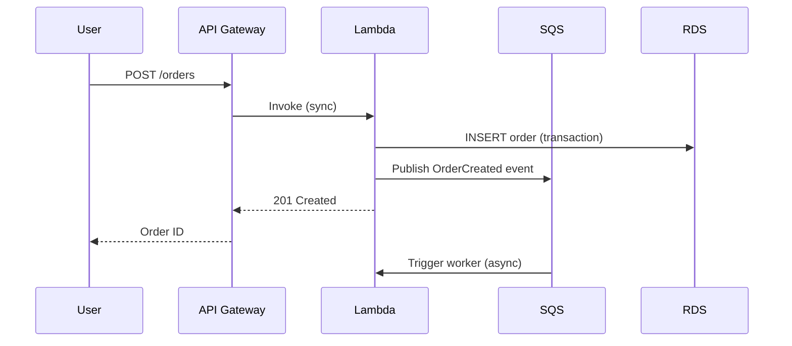

### 5. Debugging with CloudWatch

```bash
# Query CloudWatch Logs Insights
aws logs start-query \
  --log-group-name "/aws/lambda/my-function" \
  --start-time $(date -d "1 hour ago" +%s) \
  --end-time $(date +%s) \
  --query-string 'fields @timestamp, @message
    | filter @message like /ERROR/
    | sort @timestamp desc
    | limit 50'

# Get query results
aws logs get-query-results --query-id <query-id>

# Tail logs in real time
aws logs tail /aws/lambda/my-function --follow
```

### 6. Error Handling and Incident Response
- CloudWatch Alarms + SNS for automated alerts
- Dead-letter queues for failed event processing
- AWS Systems Manager OpsCenter for incident tracking
- EventBridge rules for automated remediation

### 7. Cost Management

```bash
# Get cost breakdown for last 30 days by service
aws ce get-cost-and-usage \
  --time-period Start=$(date -d "30 days ago" +%Y-%m-%d),End=$(date +%Y-%m-%d) \
  --granularity MONTHLY \
  --metrics BlendedCost \
  --group-by Type=DIMENSION,Key=SERVICE \
  --query "ResultsByTime[0].Groups[*].{Service:Keys[0],Cost:Metrics.BlendedCost.Amount}" \
  --output table
```

### 8. Comparison with Alternative Tools / Approaches
| Approach | When to Use | Tradeoff |
|----------|------------|----------|
| AWS Console | One-off exploration | Not repeatable |
| AWS CLI scripts | Simple automation | No state management |
| CloudFormation | AWS-native IaC | Verbose; AWS-only |
| Terraform | Multi-cloud IaC | More tooling overhead |
| CDK | Programmatic IaC | Requires coding skills |
| Pulumi | Multi-language IaC | Smaller community |

> Include at least one real-world debugging scenario. Reference AWS Well-Architected Framework pillars where relevant.

---

# TEMPLATE 3 — `senior.md`

**Purpose:** Address multi-account strategy, security posture, cost optimization at scale, disaster recovery, and architectural governance for engineers owning AWS in production.

## Key Sections

### 1. Multi-Account Architecture for {{TOPIC_NAME}}
Explain AWS Organizations, SCPs, and how {{TOPIC_NAME}} fits into a landing zone design. Reference AWS Control Tower where relevant.

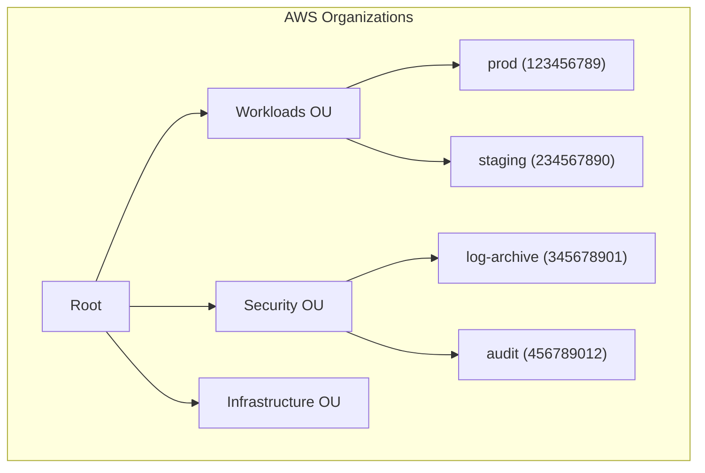

### 2. Security Hardening and Compliance

```json
{
  "Version": "2012-10-17",
  "Statement": [
    {
      "Sid": "DenyNonTLSAccess",
      "Effect": "Deny",
      "Principal": "*",
      "Action": "s3:*",
      "Resource": [
        "arn:aws:s3:::my-bucket",
        "arn:aws:s3:::my-bucket/*"
      ],
      "Condition": {
        "Bool": {
          "aws:SecureTransport": "false"
        }
      }
    },
    {
      "Sid": "DenyPublicACLs",
      "Effect": "Deny",
      "Principal": "*",
      "Action": [
        "s3:PutBucketAcl",
        "s3:PutObjectAcl"
      ],
      "Resource": "*",
      "Condition": {
        "StringEquals": {
          "s3:x-amz-acl": ["public-read", "public-read-write", "authenticated-read"]
        }
      }
    }
  ]
}
```

### 3. Disaster Recovery and Business Continuity

| DR Strategy | RTO | RPO | Cost | Use Case |
|-------------|-----|-----|------|----------|
| Backup and Restore | Hours | Hours | Low | Non-critical data |
| Pilot Light | 10-30 min | Minutes | Medium | Internal tools |
| Warm Standby | 1-5 min | Seconds | High | B2B SaaS |
| Multi-Site Active/Active | Seconds | Near-zero | Very high | Financial / consumer |

```yaml
# Cross-region replication for {{TOPIC_NAME}}
ReplicationConfiguration:
  Role: !GetAtt ReplicationRole.Arn
  Rules:
    - Id: CrossRegionReplication
      Status: Enabled
      Destination:
        Bucket: !Sub "arn:aws:s3:::${BucketName}-dr-${DRRegion}"
        StorageClass: STANDARD_IA
        ReplicationTime:
          Status: Enabled
          Time:
            Minutes: 15
        Metrics:
          Status: Enabled
```

### 4. Advanced IAM Patterns
- Attribute-based access control (ABAC) with tags
- Permission boundaries to delegate admin without privilege escalation
- Cross-account role chaining
- AWS SSO / Identity Center integration

```json
{
  "Version": "2012-10-17",
  "Statement": [
    {
      "Effect": "Allow",
      "Action": "s3:*",
      "Resource": "*",
      "Condition": {
        "StringEquals": {
          "aws:ResourceTag/Environment": "${aws:PrincipalTag/Environment}"
        }
      }
    }
  ]
}
```

### 5. Cost Optimization at Scale

```bash
# Find unused EBS volumes
aws ec2 describe-volumes \
  --filters Name=status,Values=available \
  --query "Volumes[*].{ID:VolumeId,Size:Size,Created:CreateTime}" \
  --output table

# Find old snapshots
aws ec2 describe-snapshots \
  --owner-ids self \
  --query "Snapshots[?StartTime<='2025-01-01'][*].{ID:SnapshotId,Size:VolumeSize,Date:StartTime}" \
  --output table

# Identify right-sizing opportunities
aws ce get-rightsizing-recommendation \
  --service EC2 \
  --query "RightsizingRecommendations[*].{ID:CurrentInstance.ResourceId,Recommendation:RightsizingType,Savings:SavingsOpportunity.SavingsOpportunityPercentage}"
```

### 6. Observability and SRE Practices
- AWS X-Ray for distributed tracing
- CloudWatch Container Insights / Lambda Insights
- Custom metrics with EMF (Embedded Metrics Format)
- SLO/SLI tracking with CloudWatch Synthetics

### 7. Error Handling and Incident Response
Runbook structure for AWS incidents:
1. Detect: CloudWatch Alarm → PagerDuty
2. Assess: Check Service Health Dashboard + Personal Health Dashboard
3. Contain: Scale up, enable circuit breaker, failover to DR region
4. Resolve: Apply fix with IaC, not console
5. Review: Post-mortem with 5 Whys, update runbooks, add alarms

> Every architectural recommendation must reference a Well-Architected pillar: Operational Excellence, Security, Reliability, Performance Efficiency, Cost Optimization, or Sustainability.

---

# TEMPLATE 4 — `professional.md`

**Purpose:** Deep internals for principal engineers and solutions architects. Covers the AWS Nitro hypervisor, VPC data plane, IAM policy evaluation engine, and control plane/data plane separation.

# {{TOPIC_NAME}} — Infrastructure Internals

## Infrastructure Engine Internals

### The AWS Nitro System
AWS Nitro is the hypervisor and hardware offload system underpinning all modern EC2 instances. Understanding it is essential for performance-sensitive workloads.

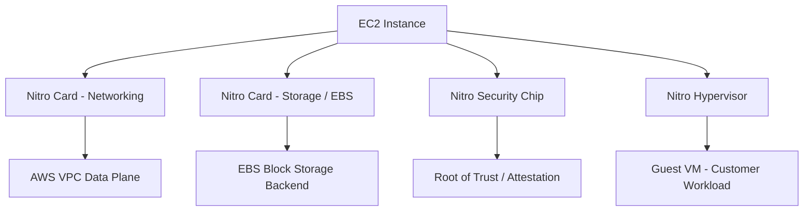

- Nitro offloads VPC networking, EBS I/O, and instance storage to dedicated hardware
- The hypervisor footprint is minimal — no AWS daemons run inside the customer VM
- SR-IOV (Single Root I/O Virtualization) for near-bare-metal network throughput
- Nitro Enclaves: isolated VMs with no persistent storage, no external network, cryptographic attestation

### How IAM Policy Evaluation Works
The IAM policy evaluation logic determines Allow/Deny for every API call:

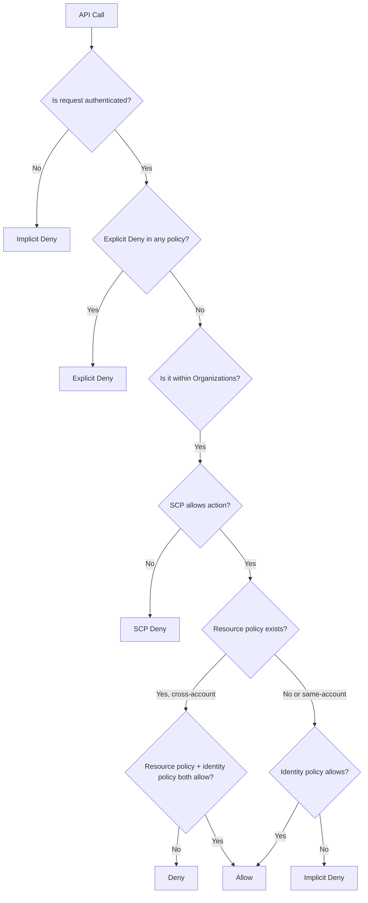

## Kernel/Daemon Log Analysis

### VPC Flow Logs Deep Dive
VPC Flow Logs capture at the ENI (Elastic Network Interface) level. Understanding the fields is critical for security forensics.

```bash
# Parse VPC Flow Logs in CloudWatch Logs Insights
fields @timestamp, srcAddr, dstAddr, srcPort, dstPort, protocol, action, bytes
| filter action = "REJECT"
| stats sum(bytes) as totalRejectedBytes by srcAddr
| sort totalRejectedBytes desc
| limit 20
```

Flow log record format:
```
version account-id interface-id srcaddr dstaddr srcport dstport protocol packets bytes start end action log-status
2 123456789012 eni-abc123 10.0.1.5 10.0.2.10 54321 443 6 20 40000 1706745600 1706745660 ACCEPT OK
```

### CloudTrail Event Analysis

```bash
# Find all IAM changes in the last 24 hours
aws cloudtrail lookup-events \
  --lookup-attributes AttributeKey=EventSource,AttributeValue=iam.amazonaws.com \
  --start-time $(date -d "24 hours ago" --iso-8601=seconds) \
  --query "Events[*].{Time:EventTime,Name:EventName,User:Username,IP:CloudTrailEvent}" \
  --output table

# Find root account usage (should be near-zero)
aws cloudtrail lookup-events \
  --lookup-attributes AttributeKey=Username,AttributeValue=root \
  --query "Events[*].{Time:EventTime,Event:EventName}"
```

## Resource Model and Scheduling Internals

### EC2 Instance Placement and Scheduling
- Placement groups: cluster (low latency, same AZ), spread (fault isolation), partition (Hadoop/Kafka)
- Capacity reservations vs On-Demand Capacity Reservations vs Dedicated Hosts
- Nitro-based instance hibernation: memory to EBS, fast resume

### S3 Storage Internals
- S3 is a key-value store, not a filesystem — prefix-based request routing
- S3 request rate limits: 3,500 PUT/COPY/POST/DELETE and 5,500 GET/HEAD per prefix per second
- S3 Select and S3 Object Lambda: pushdown filtering at the storage layer
- Multipart upload: mandatory above 5 GB, recommended above 100 MB

```bash
# Optimal multipart upload with aws-cli
aws s3 cp large-file.tar.gz s3://my-bucket/ \
  --multipart-threshold 64MB \
  --multipart-chunksize 64MB \
  --sse aws:kms \
  --sse-kms-key-id alias/my-key
```

### Lambda Execution Environment Internals
- MicroVM based on Firecracker (open-source, also Nitro-based)
- Execution environment lifecycle: Init → Invoke → Shutdown
- Cold start: JVM/Python/Node.js startup inside MicroVM (~100-500ms)
- SnapStart (Java): snapshot and restore Firecracker MicroVM state

## Control Plane / Data Plane Internals

### AWS Control Plane vs Data Plane Separation
Every AWS service separates control plane (configuration, management API) from data plane (actual traffic handling):

| Service | Control Plane | Data Plane |
|---------|--------------|------------|
| S3 | CreateBucket, PutBucketPolicy | GetObject, PutObject |
| EC2 | RunInstances, DescribeInstances | Instance network traffic |
| DynamoDB | CreateTable, UpdateTable | GetItem, PutItem |
| Route 53 | CreateHostedZone, ChangeResourceRecordSets | DNS query resolution |

The data plane is designed for higher availability than the control plane. During an us-east-1 control plane impairment, existing EC2 instances and RDS databases continue serving traffic.

### VPC Data Plane Architecture

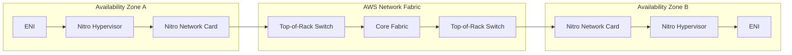

### KMS Key Material and Cryptographic Boundaries
- KMS uses HSMs (FIPS 140-2 Level 2 and 3) to protect key material
- Envelope encryption: data key encrypted by CMK, CMK never leaves KMS
- Key policies evaluated separately from IAM policies — both must allow
- AWS-managed keys vs customer-managed keys vs customer-provided keys (SSE-C)

> This file is intended for engineers designing multi-region active/active architectures, conducting security reviews, or debugging subtle networking and IAM issues at scale.

---

# TEMPLATE 5 — `interview.md`

**Purpose:** Prepare candidates for AWS interviews across all seniority levels, from cloud practitioner concepts to principal architect deep-dives.

## Structure

### Junior Level Questions
1. What is the difference between an EC2 instance and a Lambda function?
2. What does an S3 bucket policy do, and how is it different from an IAM policy?
3. How do you make an S3 bucket's objects publicly accessible safely?
4. What is a VPC and why do you need one?
5. What is the difference between a region and an availability zone?

**Sample Answer — Q4:**
> A VPC (Virtual Private Cloud) is a logically isolated section of the AWS network where you launch resources. It gives you control over IP address ranges, subnets, routing, and network access controls. Without a VPC, all resources would share a flat network namespace with no isolation between customers or workloads.

### Middle Level Questions
1. Explain the difference between an IAM role and an IAM user. When would you use each?
2. How would you debug a Lambda function that is timing out?
3. What is the difference between SQS Standard and FIFO queues? When does ordering matter?
4. How do security groups and NACLs differ? Which takes precedence?
5. Your application is returning 503 errors intermittently. Walk me through how you'd diagnose this on AWS.

**Sample Answer — Q4:**
> Security groups are stateful, instance-level firewalls — return traffic is automatically allowed. NACLs are stateless, subnet-level rules — you need explicit inbound and outbound rules. For a given packet, the NACL at the subnet boundary is evaluated first. If the NACL allows it, the security group on the target ENI is then evaluated. Security groups cannot deny traffic explicitly — only allow. NACLs can both allow and deny with numbered rules evaluated in order.

### Senior Level Questions
1. Design a multi-region active/active architecture for a SaaS application. What AWS services would you use?
2. A developer accidentally deleted a production DynamoDB table. How do you recover, and how do you prevent it?
3. Your team is spending $50k/month on AWS. Walk me through how you'd analyze and reduce that cost by 30%.
4. Explain IAM condition keys and give a real-world ABAC example.
5. How does Route 53 failover routing differ from latency-based routing? When would you combine them?

### Professional / Deep-Dive Questions
1. Explain how IAM policy evaluation works when a cross-account role assumption is involved. Draw the decision tree.
2. What is the difference between AWS Nitro and Xen hypervisors, and why did AWS build Nitro?
3. How does S3 achieve 11 nines of durability? What does that actually mean in practice?
4. A Lambda function is experiencing elevated cold start latency. What are all the levers you have to reduce it?
5. Explain the difference between control plane and data plane in the context of Route 53. Why does this matter during an incident?

### Behavioral / Scenario Questions
- "Describe a time you had to reduce AWS costs significantly. What was your methodology?"
- "Tell me about an AWS incident you were involved in. What was the blast radius and how did you contain it?"

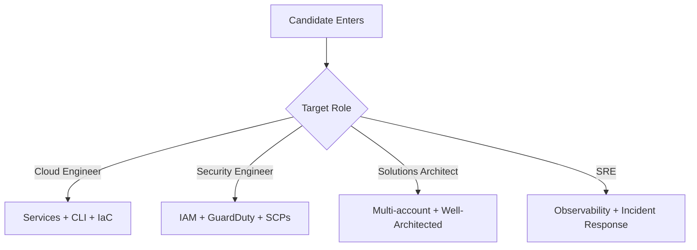

> Each question should have a follow-up probe listed. Mark "green flag" answers (e.g., mentions cost tradeoffs unprompted) and "red flag" answers (e.g., suggests console-only management for production).

---

# TEMPLATE 6 — `tasks.md`

**Purpose:** Hands-on exercises for each seniority level using real AWS services. Each task specifies required AWS services and estimated cost.

## Junior Tasks

### Task 1 — Static Website on S3 + CloudFront
Deploy a static website using S3 static hosting and a CloudFront distribution. Enable HTTPS with ACM.

**Acceptance criteria:**
- Website accessible at a custom domain over HTTPS
- S3 bucket is private — all access goes through CloudFront OAC
- `curl -I https://yourdomain.com` returns `200 OK`
- **Estimated cost:** ~$1/month

### Task 2 — Serverless API with Lambda + API Gateway
Create a REST API with two endpoints: `GET /items` and `POST /items`, backed by DynamoDB.

```bash
# Test your deployment
curl -X POST https://api-id.execute-api.us-east-1.amazonaws.com/prod/items \
  -H "Content-Type: application/json" \
  -d '{"name": "Widget", "price": 9.99}'

curl https://api-id.execute-api.us-east-1.amazonaws.com/prod/items
```

### Task 3 — IAM Least-Privilege Exercise
Start with an admin IAM role. Use CloudTrail and IAM Access Analyzer to generate a least-privilege policy. Reduce permissions to only what the application actually uses.

## Middle Tasks

### Task 4 — Multi-Service Event-Driven Pipeline
Build: API Gateway → Lambda → SQS → Lambda (consumer) → DynamoDB. Add a DLQ and CloudWatch alarm on DLQ depth > 0.

```yaml
# SAM template skeleton
AWSTemplateFormatVersion: "2010-09-09"
Transform: AWS::Serverless-2016-10-31
Resources:
  ProducerFunction:
    Type: AWS::Serverless::Function
    Properties:
      Handler: producer.handler
      Runtime: python3.12
      Events:
        Api:
          Type: Api
          Properties:
            Path: /events
            Method: post
      Policies:
        - SQSSendMessagePolicy:
            QueueName: !GetAtt EventQueue.QueueName
```

### Task 5 — CloudFormation Nested Stacks
Decompose a monolithic CloudFormation template into nested stacks: networking, security, compute, application. Practice cross-stack references with `Fn::ImportValue`.

### Task 6 — Incident Simulation
Use AWS Fault Injection Simulator (FIS) to simulate an AZ failure. Verify your application fails over automatically. Document the RTO you observed vs. the RTO you designed for.

## Senior Tasks

### Task 7 — Multi-Account Landing Zone
Using AWS Organizations and Control Tower, set up a landing zone with: management account, log archive account, audit account, one workload account. Apply SCPs that deny disabling CloudTrail.

### Task 8 — Cost Optimization Audit
Perform a full cost optimization audit on an AWS account:
1. Use Trusted Advisor to find idle resources
2. Use Compute Optimizer for EC2/Lambda right-sizing recommendations
3. Implement S3 Intelligent-Tiering for buckets with unknown access patterns
4. Purchase Savings Plans for baseline compute

**Target: Reduce monthly bill by 25% without reducing capacity.**

## Professional Tasks

### Task 9 — IAM Policy Simulator Deep Dive
Write a script using the IAM Policy Simulator API to validate that a given principal cannot perform a list of forbidden actions across all accounts in an AWS Organization.

```bash
aws iam simulate-principal-policy \
  --policy-source-arn arn:aws:iam::123456789012:role/AppRole \
  --action-names s3:DeleteBucket s3:PutBucketPolicy iam:CreateUser \
  --query "EvaluationResults[*].{Action:EvalActionName,Decision:EvalDecision}"
```

### Task 10 — Custom CloudWatch Metric Dashboard
Instrument an application with CloudWatch EMF (Embedded Metrics Format) to publish custom business metrics. Build a CloudWatch dashboard with anomaly detection and composite alarms.

> Specify the AWS account type needed (Free Tier is sufficient for Tasks 1-3; Tasks 7-10 require a multi-account setup). Include teardown instructions for every task to avoid surprise charges.

---

# TEMPLATE 7 — `find-bug.md`

**Purpose:** Present deliberately misconfigured AWS resources. The reader must identify the security or reliability issue, explain the risk, and provide the fix.

## Bug Scenario Format
For each bug: show the broken configuration, describe the risk and symptoms, give a diagnostic hint, then reveal the fix.

---

### Bug 1 — Wildcard IAM Policy (Privilege Escalation Risk)

**Broken IAM Policy:**
```json
{
  "Version": "2012-10-17",
  "Statement": [
    {
      "Effect": "Allow",
      "Action": "*",
      "Resource": "*"
    }
  ]
}
```

**Risk:** Any principal with this policy has full admin access to the AWS account. A compromised credential can delete all data, create backdoor IAM users, exfiltrate secrets.

**Diagnostic hint:**
```bash
aws iam simulate-principal-policy \
  --policy-source-arn arn:aws:iam::ACCOUNT:role/RoleName \
  --action-names iam:CreateUser s3:DeleteBucket ec2:TerminateInstances \
  --query "EvaluationResults[*].EvalDecision"
```

**Fix — Least Privilege Policy:**
```json
{
  "Version": "2012-10-17",
  "Statement": [
    {
      "Sid": "AppS3Access",
      "Effect": "Allow",
      "Action": [
        "s3:GetObject",
        "s3:PutObject",
        "s3:DeleteObject"
      ],
      "Resource": "arn:aws:s3:::my-app-bucket/*"
    },
    {
      "Sid": "AppS3List",
      "Effect": "Allow",
      "Action": "s3:ListBucket",
      "Resource": "arn:aws:s3:::my-app-bucket"
    }
  ]
}
```

---

### Bug 2 — Missing VPC Security Group Restriction (0.0.0.0/0 Inbound)

**Broken CloudFormation:**
```yaml
WebServerSG:
  Type: AWS::EC2::SecurityGroup
  Properties:
    GroupDescription: Web server security group
    VpcId: !Ref VPC
    SecurityGroupIngress:
      - IpProtocol: tcp
        FromPort: 22
        ToPort: 22
        CidrIp: 0.0.0.0/0    # SSH open to the entire internet!
      - IpProtocol: tcp
        FromPort: 3306
        ToPort: 3306
        CidrIp: 0.0.0.0/0    # Database port open to the internet!
```

**Risk:** SSH and database ports exposed to the entire internet. Automated scanners will find and attempt brute-force attacks within minutes of deployment.

**Diagnostic hint:**
```bash
aws ec2 describe-security-groups \
  --filters "Name=ip-permission.cidr,Values=0.0.0.0/0" \
  --query "SecurityGroups[*].{ID:GroupId,Name:GroupName,Rules:IpPermissions}"
```

**Fix:**
```yaml
WebServerSG:
  Type: AWS::EC2::SecurityGroup
  Properties:
    GroupDescription: Web server security group
    VpcId: !Ref VPC
    SecurityGroupIngress:
      - IpProtocol: tcp
        FromPort: 443
        ToPort: 443
        CidrIp: 0.0.0.0/0       # HTTPS only from internet

DatabaseSG:
  Type: AWS::EC2::SecurityGroup
  Properties:
    GroupDescription: Database security group
    VpcId: !Ref VPC
    SecurityGroupIngress:
      - IpProtocol: tcp
        FromPort: 3306
        ToPort: 3306
        SourceSecurityGroupId: !Ref WebServerSG  # Only from app tier
```

---

### Bug 3 — Unencrypted S3 Bucket with Public Access

**Broken configuration:**
```yaml
DataBucket:
  Type: AWS::S3::Bucket
  Properties:
    BucketName: my-company-data
    # Missing: ServerSideEncryptionConfiguration
    # Missing: PublicAccessBlockConfiguration
    # Missing: BucketEncryption
```

**Risk:** Customer data stored in plaintext. Bucket may be made public accidentally (no block). Fails SOC 2, HIPAA, PCI-DSS compliance requirements.

**Fix:**
```yaml
DataBucket:
  Type: AWS::S3::Bucket
  Properties:
    BucketName: !Sub "my-company-data-${AWS::AccountId}"
    PublicAccessBlockConfiguration:
      BlockPublicAcls: true
      BlockPublicPolicy: true
      IgnorePublicAcls: true
      RestrictPublicBuckets: true
    BucketEncryption:
      ServerSideEncryptionConfiguration:
        - ServerSideEncryptionByDefault:
            SSEAlgorithm: aws:kms
            KMSMasterKeyID: !Ref DataBucketKey
    VersioningConfiguration:
      Status: Enabled
    LoggingConfiguration:
      DestinationBucketName: !Ref LogBucket
      LogFilePrefix: data-bucket/
```

---

### Bug 4 — Lambda Function Leaking Secrets via Environment Variables

**Broken SAM template:**
```yaml
MyFunction:
  Type: AWS::Serverless::Function
  Properties:
    Handler: index.handler
    Runtime: nodejs20.x
    Environment:
      Variables:
        DB_PASSWORD: "mySuperSecretPassword123"   # Plaintext secret!
        API_KEY: "sk-live-abc123def456"
```

**Risk:** Secrets visible in CloudFormation console, Lambda console, CloudTrail, and any tool that calls `DescribeFunctionConfiguration`. Also embedded in deployment artifacts.

**Fix — Use SSM Parameter Store or Secrets Manager:**
```yaml
MyFunction:
  Type: AWS::Serverless::Function
  Properties:
    Handler: index.handler
    Runtime: nodejs20.x
    Environment:
      Variables:
        DB_PASSWORD_ARN: !Sub "arn:aws:ssm:${AWS::Region}:${AWS::AccountId}:parameter/myapp/db-password"
    Policies:
      - SSMParameterReadPolicy:
          ParameterName: "myapp/db-password"
```

```javascript
// In Lambda function code — fetch at runtime, not deploy time
const { SSMClient, GetParameterCommand } = require("@aws-sdk/client-ssm");
const ssm = new SSMClient({});
const { Parameter } = await ssm.send(new GetParameterCommand({
  Name: process.env.DB_PASSWORD_ARN,
  WithDecryption: true
}));
```

---

### Bug 5 — No CloudTrail Logging Enabled

**Symptom:** A breach investigation is impossible because there is no audit log of API calls. Security team cannot determine what was accessed, changed, or deleted.

```bash
# Check if CloudTrail is enabled
aws cloudtrail describe-trails --query "trailList[*].{Name:Name,MultiRegion:IsMultiRegionTrail,LogValidation:LogFileValidationEnabled}"
# If empty or IsMultiRegionTrail is false — you have a gap

# Check if logging is currently active
aws cloudtrail get-trail-status --name default --query "{Logging:IsLogging,LatestDelivery:LatestDeliveryTime}"
```

**Fix:**
```yaml
AuditTrail:
  Type: AWS::CloudTrail::Trail
  Properties:
    TrailName: org-audit-trail
    S3BucketName: !Ref LogArchiveBucket
    IncludeGlobalServiceEvents: true
    IsMultiRegionTrail: true
    EnableLogFileValidation: true
    IsLogging: true
    EventSelectors:
      - ReadWriteType: All
        IncludeManagementEvents: true
        DataResources:
          - Type: AWS::S3::Object
            Values: ["arn:aws:s3:::"]
          - Type: AWS::Lambda::Function
            Values: ["arn:aws:lambda"]
```

> Each bug must specify the compliance framework it violates (e.g., CIS AWS Foundations Benchmark control number) and the AWS Security Hub finding it would generate.

---

# TEMPLATE 8 — `optimize.md`

**Purpose:** Provide concrete AWS cost and performance optimization techniques with measurable before/after metrics.

## Metrics Baseline

```bash
# Get current month-to-date spend
aws ce get-cost-and-usage \
  --time-period Start=$(date +%Y-%m-01),End=$(date +%Y-%m-%d) \
  --granularity DAILY \
  --metrics UnblendedCost \
  --query "ResultsByTime[-1].Total.UnblendedCost.Amount"

# Lambda cold start baseline (k6 or Artillery)
artillery run --target https://api.example.com \
  --config '{"phases":[{"duration":60,"arrivalRate":10}]}'
```

## Optimization 1 — Lambda Cold Start Reduction

**Before:** Python Lambda with pandas/numpy — 4.2s cold start
**After:** Lambda Layers + SnapStart (Java) or Graviton2 + provisioned concurrency — 180ms

```yaml
MyFunction:
  Type: AWS::Serverless::Function
  Properties:
    Runtime: python3.12
    Architectures: [arm64]   # Graviton2: 20% better price-performance
    MemorySize: 512           # More memory = more vCPU = faster init
    SnapStart:                # Java only
      ApplyOn: PublishedVersions
    ProvisionedConcurrencyConfig:
      ProvisionedConcurrentExecutions: 5
    Layers:
      - !Ref DependenciesLayer  # Pre-warmed dependencies layer
```

**k6 load test results (cold start p99):**
```
Before:  p(99)=4200ms
After:   p(99)=180ms
Improvement: 96%
```

## Optimization 2 — S3 Request Cost Reduction

**Before:** 50M GET requests/month to S3 directly — $22.50/month
**After:** CloudFront in front of S3 — $1.80/month in origin requests + $4.20 CloudFront = $6/month

```bash
# Enable S3 Transfer Acceleration only where needed
aws s3api put-bucket-accelerate-configuration \
  --bucket my-bucket \
  --accelerate-configuration Status=Enabled

# Check which S3 storage classes are costing most
aws s3api list-objects-v2 \
  --bucket my-bucket \
  --query "Contents[*].{Key:Key,Size:Size,Storage:StorageClass}" \
  | jq 'group_by(.Storage) | map({class: .[0].Storage, totalGB: (map(.Size) | add) / 1073741824})'
```

## Optimization 3 — EC2 Cost Reduction with Savings Plans

| Compute Type | On-Demand $/mo | Reserved 1yr $/mo | Savings Plan $/mo | Spot $/mo |
|-------------|---------------|------------------|------------------|-----------|
| m5.2xlarge  | $277          | $166 (-40%)       | $172 (-38%)       | $83 (-70%)|
| c5.4xlarge  | $554          | $332 (-40%)       | $344 (-38%)       | $166 (-70%)|

```bash
# Get Savings Plans coverage recommendation
aws ce get-savings-plans-purchase-recommendation \
  --savings-plans-type COMPUTE_SP \
  --term-in-years ONE_YEAR \
  --payment-option NO_UPFRONT \
  --lookback-period-in-days SIXTY_DAYS
```

## Optimization 4 — DynamoDB Cost Optimization

**Before:** Provisioned capacity — 500 RCU + 200 WCU = $148/month
**After:** On-demand mode for spiky workloads — $67/month average

```yaml
# Switch to on-demand for variable traffic
DynamoTable:
  Type: AWS::DynamoDB::Table
  Properties:
    BillingMode: PAY_PER_REQUEST   # vs PROVISIONED
    TableClass: STANDARD_INFREQUENT_ACCESS  # 60% cheaper for cold data
    PointInTimeRecoverySpecification:
      PointInTimeRecoveryEnabled: true
```

## Optimization 5 — Pipeline Duration (CI/CD on AWS CodePipeline)

| Stage | Before | After | Technique |
|-------|--------|-------|-----------|
| Source fetch | 45s | 8s | CodeConnections + shallow clone |
| Build (CodeBuild) | 12m | 3m | arm64 Graviton + Docker layer cache in ECR |
| Test | 8m | 2m | Parallelism across CodeBuild batch |
| Deploy (CloudFormation) | 6m | 90s | Change sets + parallel resource creation |
| **Total** | **26m 45s** | **6m 38s** | **75% reduction** |

## Optimization 6 — Infra Cost / Month Summary

| Service | Before | After | Change | Method |
|---------|--------|-------|--------|--------|
| EC2 | $2,100 | $840 | -60% | Savings Plans + right-sizing |
| RDS | $680 | $340 | -50% | Reserved instances + Aurora Serverless v2 |
| Lambda | $290 | $145 | -50% | arm64 + memory tuning |
| S3 | $180 | $45 | -75% | Lifecycle policies + Intelligent-Tiering |
| Data Transfer | $320 | $80 | -75% | CloudFront + same-region traffic |
| **Total** | **$3,570** | **$1,450** | **-59%** | |

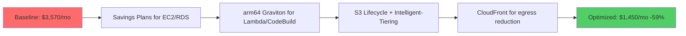

> Every optimization must include: the AWS service affected, the dollar impact, and whether it requires downtime. Mark optimizations that can be applied without application changes separately from those that require code modifications.

---

## Coding Patterns for AWS (junior.md)

### Pattern 1 — Retry with Exponential Backoff

```python
import boto3
import time
import random
from botocore.exceptions import ClientError

def call_with_retry(func, max_retries=5, base_delay=0.5):
    """Retry AWS API calls with exponential backoff and jitter."""
    for attempt in range(max_retries):
        try:
            return func()
        except ClientError as e:
            code = e.response["Error"]["Code"]
            if code in ("ThrottlingException", "RequestLimitExceeded", "ServiceUnavailableException"):
                if attempt == max_retries - 1:
                    raise
                delay = base_delay * (2 ** attempt) + random.uniform(0, 0.5)
                print(f"Throttled. Retry {attempt + 1}/{max_retries} in {delay:.2f}s")
                time.sleep(delay)
            else:
                raise

# Usage
s3 = boto3.client("s3")
result = call_with_retry(lambda: s3.list_buckets())
```

### Pattern 2 — Tag-Based Resource Discovery

```bash
# Find all resources with a specific tag across services
aws resourcegroupstaggingapi get-resources \
  --tag-filters Key=Environment,Values=production \
  --resource-type-filters ec2:instance rds:db lambda:function \
  --query "ResourceTagMappingList[*].{ARN:ResourceARN,Tags:Tags}" \
  --output table

# Get all untagged resources (compliance gap)
aws resourcegroupstaggingapi get-resources \
  --tags-per-page 100 \
  --query "ResourceTagMappingList[?length(Tags)==\`0\`].ResourceARN" \
  --output text
```

---

## Clean Code / Best Practices — AWS Junior

| Practice | Bad | Good |
|----------|-----|------|
| IAM permissions | `Action: "*"` | Least-privilege per service |
| Secret management | Env var plaintext | SSM Parameter Store / Secrets Manager |
| Resource naming | `bucket1`, `sg-test` | `{project}-{env}-{service}-{region}` |
| Error handling | Ignore `ClientError` | Catch and classify by error code |
| Cost awareness | Ignore pricing | Tag everything; set billing alerts |
| Idempotency | Re-create resources | Use `--no-fail-on-empty-changeset` |

---

## Coding Patterns for AWS (middle.md)

### Pattern 1 — CloudFormation Custom Resource

```python
import json
import urllib.request

def handler(event, context):
    """CloudFormation Custom Resource handler."""
    request_type = event["RequestType"]
    props = event["ResourceProperties"]
    physical_id = event.get("PhysicalResourceId", "custom-resource-id")

    try:
        if request_type == "Create":
            result = create_resource(props)
            physical_id = result["id"]
            data = {"ResourceId": physical_id}
        elif request_type == "Update":
            result = update_resource(physical_id, props)
            data = {"ResourceId": physical_id}
        elif request_type == "Delete":
            delete_resource(physical_id)
            data = {}

        send_response(event, context, "SUCCESS", data, physical_id)
    except Exception as e:
        send_response(event, context, "FAILED", {"Error": str(e)}, physical_id)

def send_response(event, context, status, data, physical_id):
    body = json.dumps({
        "Status": status,
        "Reason": f"See CloudWatch: {context.log_stream_name}",
        "PhysicalResourceId": physical_id,
        "StackId": event["StackId"],
        "RequestId": event["RequestId"],
        "LogicalResourceId": event["LogicalResourceId"],
        "Data": data,
    }).encode()
    req = urllib.request.Request(event["ResponseURL"], data=body,
                                  headers={"Content-Type": ""}, method="PUT")
    urllib.request.urlopen(req)
```

### Pattern 2 — Event-Driven Fan-Out with SNS + SQS

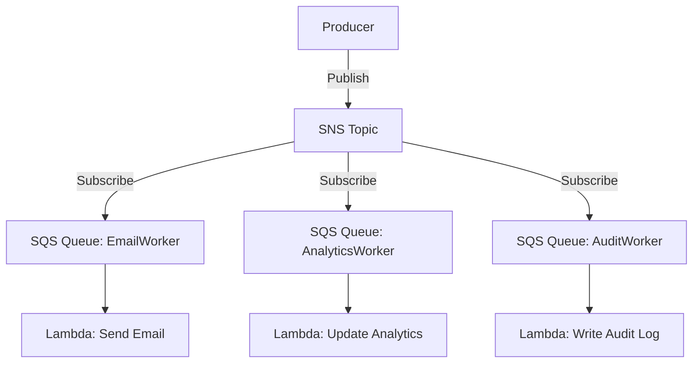

```yaml
# CloudFormation: SNS fan-out with filter policies
EmailSubscription:
  Type: AWS::SNS::Subscription
  Properties:
    TopicArn: !Ref EventTopic
    Protocol: sqs
    Endpoint: !GetAtt EmailQueue.Arn
    FilterPolicy:
      eventType:
        - order.placed
        - order.shipped

AnalyticsSubscription:
  Type: AWS::SNS::Subscription
  Properties:
    TopicArn: !Ref EventTopic
    Protocol: sqs
    Endpoint: !GetAtt AnalyticsQueue.Arn
    FilterPolicy:
      eventType:
        - order.placed
        - order.cancelled
        - payment.failed
```

### Pattern 3 — Circuit Breaker with DynamoDB State

```python
import boto3
import time
from enum import Enum

class CircuitState(Enum):
    CLOSED = "CLOSED"
    OPEN = "OPEN"
    HALF_OPEN = "HALF_OPEN"

class DynamoCircuitBreaker:
    def __init__(self, service_name, table_name, failure_threshold=5, timeout=60):
        self.service_name = service_name
        self.table = boto3.resource("dynamodb").Table(table_name)
        self.failure_threshold = failure_threshold
        self.timeout = timeout

    def get_state(self):
        item = self.table.get_item(Key={"serviceId": self.service_name}).get("Item")
        if not item:
            return CircuitState.CLOSED, 0
        state = CircuitState(item["state"])
        if state == CircuitState.OPEN:
            if time.time() - item["openedAt"] > self.timeout:
                return CircuitState.HALF_OPEN, item["failures"]
        return state, item.get("failures", 0)

    def record_failure(self):
        self.table.update_item(
            Key={"serviceId": self.service_name},
            UpdateExpression="SET failures = if_not_exists(failures, :zero) + :one, #s = :state, openedAt = :now",
            ExpressionAttributeNames={"#s": "state"},
            ExpressionAttributeValues={
                ":zero": 0, ":one": 1,
                ":state": CircuitState.OPEN.value if self._should_open() else CircuitState.CLOSED.value,
                ":now": int(time.time()),
            }
        )

    def _should_open(self):
        _, failures = self.get_state()
        return failures + 1 >= self.failure_threshold
```

---

## Clean Code / Best Practices — AWS Middle

| Practice | Description |
|----------|-------------|
| IaC for everything | No manual console changes in production |
| Tagging strategy | `Project`, `Environment`, `Owner`, `CostCenter`, `ManagedBy` on every resource |
| Principle of least privilege | Use IAM Access Analyzer to generate minimum policies |
| DLQs everywhere | Every async consumer (SQS, Lambda, SNS) must have a DLQ |
| Structured logging | JSON logs with `requestId`, `correlationId`, `userId`, `durationMs` |
| Parameter validation | Validate CloudFormation parameters with `AllowedValues`, `MinLength`, constraints |
| Change sets first | Always create and review CloudFormation change sets before executing |

---

## Coding Patterns for AWS (senior.md)

### Pattern 1 — Blue/Green Deployment with CodeDeploy + Lambda

```yaml
# SAM template with CodeDeploy blue/green
MyFunction:
  Type: AWS::Serverless::Function
  Properties:
    AutoPublishAlias: live
    DeploymentPreference:
      Type: Canary10Percent10Minutes   # 10% traffic for 10 min then 100%
      Alarms:
        - !Ref HighErrorRateAlarm
      Hooks:
        PreTraffic: !Ref PreTrafficHook
        PostTraffic: !Ref PostTrafficHook
      TriggerConfigurations:
        - TriggerName: DeploymentNotification
          TriggerEvents: [DeploymentSuccess, DeploymentFailure]
          TriggerTargetArn: !Ref DeploymentSNSTopic
```

```bash
# Monitor canary deployment
watch -n 10 'aws cloudwatch get-metric-statistics \
  --namespace AWS/Lambda \
  --metric-name Errors \
  --dimensions Name=FunctionName,Value=my-function \
  --start-time $(date -u -d "10 minutes ago" +%FT%TZ) \
  --end-time $(date -u +%FT%TZ) \
  --period 60 \
  --statistics Sum'
```

### Pattern 2 — Multi-Region Active/Active with Route 53

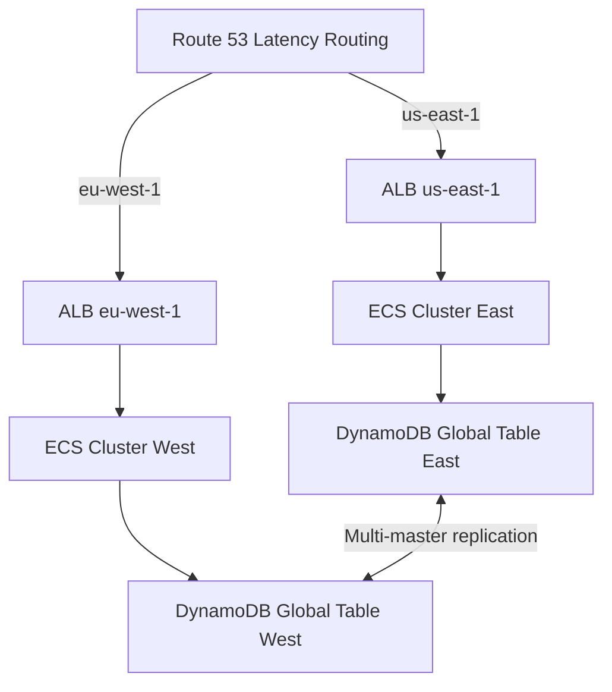

```json
{
  "Comment": "Multi-region latency routing",
  "Changes": [{
    "Action": "UPSERT",
    "ResourceRecordSet": {
      "Name": "api.example.com",
      "Type": "A",
      "SetIdentifier": "us-east-1",
      "Region": "us-east-1",
      "AliasTarget": {
        "HostedZoneId": "Z35SXDOTRQ7X7K",
        "DNSName": "my-alb-east.us-east-1.elb.amazonaws.com",
        "EvaluateTargetHealth": true
      }
    }
  }]
}
```

### Pattern 3 — Service Control Policies for Guardrails

```json
{
  "Version": "2012-10-17",
  "Statement": [
    {
      "Sid": "DenyLeavingOrganization",
      "Effect": "Deny",
      "Action": "organizations:LeaveOrganization",
      "Resource": "*"
    },
    {
      "Sid": "DenyDisablingCloudTrail",
      "Effect": "Deny",
      "Action": [
        "cloudtrail:StopLogging",
        "cloudtrail:DeleteTrail",
        "cloudtrail:UpdateTrail"
      ],
      "Resource": "*"
    },
    {
      "Sid": "DenyRootAccountUsage",
      "Effect": "Deny",
      "Action": "*",
      "Resource": "*",
      "Condition": {
        "StringLike": {
          "aws:PrincipalArn": "arn:aws:iam::*:root"
        }
      }
    },
    {
      "Sid": "RequireIMDSv2",
      "Effect": "Deny",
      "Action": "ec2:RunInstances",
      "Resource": "arn:aws:ec2:*:*:instance/*",
      "Condition": {
        "StringNotEquals": {
          "ec2:MetadataHttpTokens": "required"
        }
      }
    }
  ]
}
```

### Pattern 4 — ECS Service with Autoscaling and Circuit Breaker

```yaml
ECSService:
  Type: AWS::ECS::Service
  Properties:
    Cluster: !Ref ECSCluster
    ServiceName: my-api
    TaskDefinition: !Ref TaskDefinition
    DesiredCount: 3
    LaunchType: FARGATE
    DeploymentConfiguration:
      DeploymentCircuitBreaker:
        Enable: true
        Rollback: true
      MaximumPercent: 200
      MinimumHealthyPercent: 50
    NetworkConfiguration:
      AwsvpcConfiguration:
        Subnets: !Ref PrivateSubnets
        SecurityGroups: [!Ref AppSecurityGroup]
        AssignPublicIp: DISABLED

ScalableTarget:
  Type: AWS::ApplicationAutoScaling::ScalableTarget
  Properties:
    ServiceNamespace: ecs
    ResourceId: !Sub "service/${ECSCluster}/${ECSService.Name}"
    ScalableDimension: ecs:service:DesiredCount
    MinCapacity: 2
    MaxCapacity: 50

ScalingPolicy:
  Type: AWS::ApplicationAutoScaling::ScalingPolicy
  Properties:
    PolicyType: TargetTrackingScaling
    TargetTrackingScalingPolicyConfiguration:
      TargetValue: 70.0
      PredefinedMetricSpecification:
        PredefinedMetricType: ECSServiceAverageCPUUtilization
      ScaleInCooldown: 300
      ScaleOutCooldown: 60
```

---

## Clean Code / Best Practices — AWS Senior

| Category | Practice |
|----------|----------|
| Architecture | Separate control plane from data plane; design for data plane independence |
| Resilience | Multi-AZ minimum; multi-region for RPO < 1 min |
| Security | SCPs as guardrails; permission boundaries for delegated admins |
| Observability | Three pillars: metrics (CloudWatch), traces (X-Ray), logs (CloudWatch Logs Insights) |
| Cost | Tag every resource; use Compute Optimizer; Savings Plans for baseline, Spot for batch |
| Deployment | Blue/green or canary with automated rollback on alarms |
| DR | Test your DR plan quarterly with chaos engineering; document actual RTO/RPO |

---

## Error Handling and Incident Response

### CloudWatch Composite Alarms for Reduced Alert Fatigue

```yaml
# Fire only when BOTH error rate is high AND latency is elevated
CompositeAlarm:
  Type: AWS::CloudWatch::CompositeAlarm
  Properties:
    AlarmName: api-degraded
    AlarmRule: !Sub |
      ALARM("${HighErrorRateAlarm}") AND ALARM("${HighLatencyAlarm}")
    AlarmActions:
      - !Ref PagerDutySNSTopic
    OKActions:
      - !Ref PagerDutySNSTopic
```

### Runbook Automation with Systems Manager

```bash
# Trigger an SSM Automation runbook on alarm
aws ssm start-automation-execution \
  --document-name "AWSSupport-RestartEC2Instance" \
  --parameters "InstanceId=i-1234567890abcdef0" \
  --region us-east-1

# Check runbook execution status
aws ssm describe-automation-executions \
  --filters Key=StartTimeBefore,Values=$(date -u +%Y-%m-%dT%H:%M:%SZ) \
  --query "AutomationExecutionMetadataList[0].{Status:AutomationExecutionStatus,Steps:CurrentStepName}"
```

---

## Security Considerations

### IMDSv2 Enforcement (Prevent SSRF-based Credential Theft)

```bash
# Enforce IMDSv2 on running instances
aws ec2 modify-instance-metadata-options \
  --instance-id i-1234567890abcdef0 \
  --http-tokens required \
  --http-put-response-hop-limit 1

# Audit all instances for IMDSv1 exposure
aws ec2 describe-instances \
  --query "Reservations[*].Instances[*].{ID:InstanceId,IMDSv1:MetadataOptions.HttpTokens}" \
  --output table | grep -v required
```

### KMS Key Rotation and Envelope Encryption

```python
import boto3
import base64
import json

def encrypt_secret(plaintext: str, kms_key_id: str) -> dict:
    """Envelope encryption: generate data key, encrypt data, discard plaintext key."""
    kms = boto3.client("kms")
    # Generate a data key — plaintext for immediate use, ciphertext for storage
    response = kms.generate_data_key(KeyId=kms_key_id, KeySpec="AES_256")
    plaintext_key = response["Plaintext"]       # Use now, then discard
    encrypted_key = response["CiphertextBlob"]  # Store alongside ciphertext

    # Encrypt data using the plaintext data key (in-process, not via KMS API)
    from cryptography.fernet import Fernet
    import hashlib
    # Derive Fernet-compatible key from 32-byte AES key
    fernet_key = base64.urlsafe_b64encode(plaintext_key[:32])
    ciphertext = Fernet(fernet_key).encrypt(plaintext.encode())

    return {
        "ciphertext": base64.b64encode(ciphertext).decode(),
        "encrypted_key": base64.b64encode(encrypted_key).decode(),
        "key_id": kms_key_id,
    }
```

---

## Performance Optimization

### DynamoDB Hot Partition Detection and Sharding

```bash
# Find hot partitions via CloudWatch Contributor Insights
aws cloudwatch get-insight-rule-report \
  --rule-name DynamoDBContributorInsights-ReadThrottleEvents-my-table-index \
  --start-time $(date -u -d "1 hour ago" +%FT%TZ) \
  --end-time $(date -u +%FT%TZ) \
  --period 300 \
  --metrics UniqueContributors \
  --query "Contributors[*].{Key:Keys[0],Count:Approximate}"
```

```python
# Write sharding: distribute hot partition key across N shards
def get_sharded_key(user_id: str, num_shards: int = 10) -> str:
    """Append shard suffix to distribute writes across partitions."""
    import hashlib
    shard = int(hashlib.md5(user_id.encode()).hexdigest(), 16) % num_shards
    return f"{user_id}#{shard}"

# Read: query all shards and merge
def get_user_data(user_id: str, table, num_shards: int = 10):
    results = []
    for shard in range(num_shards):
        item = table.get_item(Key={"pk": f"{user_id}#{shard}"}).get("Item")
        if item:
            results.append(item)
    return results
```

### Lambda Power Tuning

```bash
# AWS Lambda Power Tuning (Step Functions state machine)
# Deploy: https://github.com/alexcasalboni/aws-lambda-power-tuning
aws stepfunctions start-execution \
  --state-machine-arn arn:aws:states:us-east-1:ACCOUNT:stateMachine:powerTuningStateMachine \
  --input '{
    "lambdaARN": "arn:aws:lambda:us-east-1:ACCOUNT:function:my-function",
    "powerValues": [128, 256, 512, 1024, 2048, 3008],
    "num": 10,
    "payload": {"test": true},
    "parallelInvocation": true,
    "strategy": "cost"
  }'
```

---

## Metrics and Analytics

### CloudWatch EMF — Embedded Metrics Format

```python
import json
import time

def lambda_handler(event, context):
    start = time.time()
    # ... business logic ...
    result = process_order(event)
    duration = (time.time() - start) * 1000

    # EMF: structured log that CloudWatch parses as metrics
    print(json.dumps({
        "_aws": {
            "Timestamp": int(time.time() * 1000),
            "CloudWatchMetrics": [{
                "Namespace": "MyApp/Orders",
                "Dimensions": [["Environment", "Service"]],
                "Metrics": [
                    {"Name": "OrderProcessingTime", "Unit": "Milliseconds"},
                    {"Name": "OrderValue", "Unit": "None"},
                    {"Name": "OrdersProcessed", "Unit": "Count"},
                ]
            }]
        },
        "Environment": "production",
        "Service": "order-processor",
        "OrderProcessingTime": duration,
        "OrderValue": result.get("total", 0),
        "OrdersProcessed": 1,
        "requestId": context.aws_request_id,
    }))
    return result
```

### CloudWatch Logs Insights — Useful Queries

```bash
# P99 latency per API endpoint (last 1 hour)
aws logs start-query \
  --log-group-name "/aws/apigateway/my-api" \
  --start-time $(date -d "1 hour ago" +%s) \
  --end-time $(date +%s) \
  --query-string '
    fields @timestamp, requestId, path, status, responseLatency
    | stats pct(responseLatency, 99) as p99, count() as requests by path
    | sort p99 desc
    | limit 20
  '

# Lambda cold starts by memory size
aws logs start-query \
  --log-group-name "/aws/lambda/my-function" \
  --start-time $(date -d "24 hours ago" +%s) \
  --end-time $(date +%s) \
  --query-string '
    filter @type = "REPORT"
    | stats count() as invocations, 
            count(@initDuration) as coldStarts,
            avg(@initDuration) as avgInitMs,
            pct(@duration, 99) as p99DurationMs
            by bin(1h)
    | sort @timestamp desc
  '
```

---

## Debugging Guide

### Systematic AWS Debugging Workflow

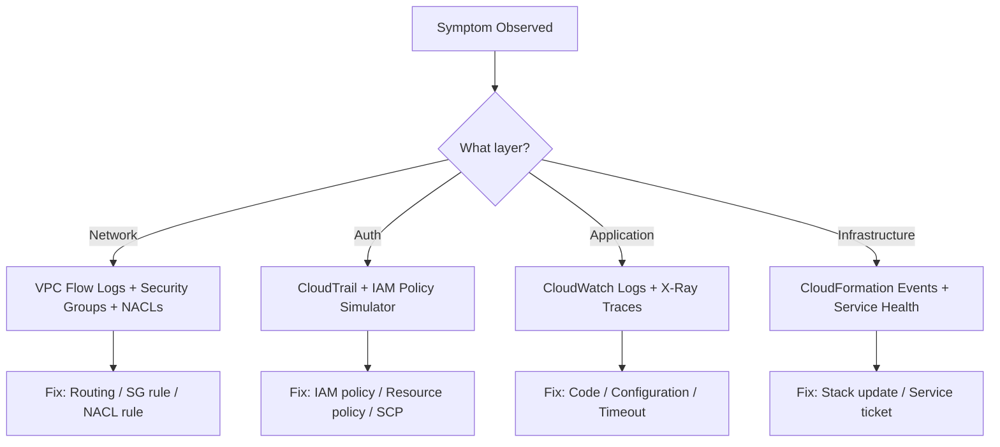

```bash
# Full diagnostic sequence for "Lambda not reaching RDS"
# 1. Check Lambda VPC config
aws lambda get-function-configuration \
  --function-name my-function \
  --query "VpcConfig"

# 2. Check RDS security group inbound rules
aws ec2 describe-security-groups \
  --group-ids sg-rdsgroup \
  --query "SecurityGroups[0].IpPermissions"

# 3. Check Lambda execution role has no VPC-related denies
aws iam simulate-principal-policy \
  --policy-source-arn arn:aws:iam::ACCOUNT:role/LambdaRole \
  --action-names ec2:CreateNetworkInterface ec2:DescribeNetworkInterfaces \
  --query "EvaluationResults[*].{Action:EvalActionName,Decision:EvalDecision}"

# 4. Check VPC Flow Logs for REJECT from Lambda ENI to RDS port
aws logs filter-log-events \
  --log-group-name /vpc-flow-logs \
  --filter-pattern "REJECT" \
  --start-time $(date -d "30 minutes ago" +%s000)
```

---

## Self-Assessment Checklist

### AWS Junior Checklist
- [ ] Can configure AWS CLI and switch between profiles
- [ ] Can create S3 bucket with versioning and encryption
- [ ] Can write a basic IAM policy with least-privilege permissions
- [ ] Can deploy a CloudFormation stack and read its outputs
- [ ] Can read CloudWatch logs for a Lambda function
- [ ] Can interpret an AccessDenied error from IAM

### AWS Middle Checklist
- [ ] Can design and deploy a multi-service event-driven pipeline
- [ ] Can write parameterized CloudFormation with conditions and cross-stack refs
- [ ] Can debug a Lambda timeout using X-Ray and CloudWatch Logs Insights
- [ ] Can implement SQS DLQ with alarm on queue depth
- [ ] Can perform cost analysis with AWS Cost Explorer CLI
- [ ] Can write a deployment script with CloudFormation change sets

### AWS Senior Checklist
- [ ] Can design a multi-account AWS Organization with SCPs
- [ ] Can architect a warm standby DR strategy across two regions
- [ ] Can implement ABAC with IAM condition keys and resource tags
- [ ] Can analyze DynamoDB hot partitions with Contributor Insights
- [ ] Can perform a cost optimization audit reducing spend by 30%+
- [ ] Can design and test a chaos engineering scenario with FIS

### AWS Professional Checklist
- [ ] Can explain IAM policy evaluation order for cross-account role assumption
- [ ] Can explain Nitro hypervisor architecture and SR-IOV networking
- [ ] Can write Athena queries over CloudTrail and VPC Flow Log S3 exports
- [ ] Can trace a network packet from ENI through the VPC fabric to another AZ
- [ ] Can explain S3 consistency model and request rate scaling by prefix
- [ ] Can debug a CloudFormation rollback by tracing the dependency DAG

---

## Interview Preparation — Additional Questions

### Architecture Design Questions
1. Design a serverless image processing pipeline: upload → resize → store → CDN delivery. What services? What are the failure modes?
2. A DynamoDB table has a `userId` partition key. One user generates 80% of all writes (celebrity problem). How do you solve this?
3. Your Lambda functions are hitting the 1,000 concurrent execution limit. What options do you have? What are the tradeoffs?
4. Compare ECS Fargate vs EKS managed node groups for containerized microservices. When would you choose each?
5. A CloudFormation stack deployment failed halfway. The rollback also failed. How do you recover?

**Sample Answer — Q5 (CloudFormation stuck ROLLBACK_FAILED):**
> First run `aws cloudformation describe-stack-events` to find the specific resource that failed rollback. Common causes: a resource was manually deleted outside CloudFormation (orphaned), or a resource policy prevents deletion. Fix: use `aws cloudformation continue-update-rollback --skip-resources <ResourceLogicalId>` to skip the problematic resource and complete rollback. Then manually reconcile the skipped resource — either import it into the stack with `aws cloudformation import-stacks-to-stack-set` or delete it manually and fix the template.

### Security Design Questions
1. An IAM role in account A needs to write to an S3 bucket in account B. Walk me through the exact policy changes needed on both sides.
2. A developer reports `AccessDenied` on `s3:GetObject`. The bucket policy allows it. What else could be denying it?
3. How would you detect if an IAM access key had been exfiltrated and used from an unknown IP?

**Sample Answer — Q2:**
> Possible causes in order of evaluation: (1) SCP in the AWS Organization denies the action, (2) a permission boundary on the IAM role or user restricts S3 access, (3) the bucket is in another account and the identity policy doesn't explicitly grant access (cross-account requires both sides), (4) a VPC endpoint policy is blocking the request, (5) the object is in a different AWS account (requester-pays or cross-account object ownership), (6) KMS key policy on SSE-KMS encrypted object doesn't grant decrypt. Use the IAM Policy Simulator and CloudTrail to isolate which layer is denying.

---

## Tasks — Additional Practice

### Task 11 — GuardDuty Threat Detection Pipeline
Enable GuardDuty in an account. Create an EventBridge rule that triggers a Lambda when a HIGH severity finding is detected. The Lambda should: (1) post to Slack, (2) snapshot the EC2 instance for forensics, (3) isolate the instance by replacing its security group with a quarantine SG.

```python
import boto3
import json
import os

def handler(event, context):
    finding = event["detail"]
    severity = finding["severity"]
    instance_id = finding.get("resource", {}).get("instanceDetails", {}).get("instanceId")

    if severity >= 7.0 and instance_id:
        ec2 = boto3.client("ec2")
        # Isolate: replace security groups with quarantine SG
        ec2.modify_instance_attribute(
            InstanceId=instance_id,
            Groups=[os.environ["QUARANTINE_SG_ID"]]
        )
        # Snapshot for forensics
        volumes = ec2.describe_instance_attribute(
            InstanceId=instance_id, Attribute="blockDeviceMapping"
        )["BlockDeviceMappings"]
        for vol in volumes:
            ec2.create_snapshot(
                VolumeId=vol["Ebs"]["VolumeId"],
                Description=f"Forensic snapshot - GuardDuty finding {finding['id']}"
            )
```

### Task 12 — Config Rules for Compliance Automation

```yaml
# AWS Config rule: enforce S3 bucket encryption
S3EncryptionConfigRule:
  Type: AWS::Config::ConfigRule
  Properties:
    ConfigRuleName: s3-bucket-server-side-encryption-enabled
    Source:
      Owner: AWS
      SourceIdentifier: S3_BUCKET_SERVER_SIDE_ENCRYPTION_ENABLED
    Scope:
      ComplianceResourceTypes:
        - AWS::S3::Bucket

# Auto-remediation: enable encryption on non-compliant buckets
S3RemediationConfiguration:
  Type: AWS::Config::RemediationConfiguration
  Properties:
    ConfigRuleName: !Ref S3EncryptionConfigRule
    TargetType: SSM_DOCUMENT
    TargetId: AWSConfigRemediation-EnableS3BucketEncryption
    Automatic: true
    MaximumAutomaticAttempts: 3
    RetryAttemptSeconds: 60
```

---

## Summary Table — AWS Services by Category

| Category | Service | Primary Use | Key Limit |
|----------|---------|-------------|-----------|
| Compute | EC2 | Virtual machines | 1,152 vCPUs default |
| Compute | Lambda | Serverless functions | 15 min timeout, 10 GB memory |
| Compute | ECS Fargate | Containers without EC2 | 4 vCPU, 30 GB per task |
| Storage | S3 | Object storage | 5 TB per object, unlimited total |
| Storage | EBS | Block storage for EC2 | 64 TB per volume (io2 BE) |
| Storage | EFS | Managed NFS | Petabyte scale |
| Database | RDS | Managed relational DB | 128 TB storage, 96 vCPU |
| Database | DynamoDB | NoSQL key-value | 400 KB item, 3,000 RCU/WCU per partition |
| Database | ElastiCache | In-memory cache | 340 GB per Redis node |
| Networking | VPC | Virtual network | 5 VPCs per region default |
| Networking | CloudFront | CDN | 600 Tbps global capacity |
| Networking | Route 53 | DNS + health checks | 50 hosted zones default |
| Security | IAM | Identity management | 10 managed policies per role |
| Security | KMS | Key management | 4 KB plaintext encryption, envelope for larger |
| Security | Secrets Manager | Secrets storage | 65,536 bytes per secret |
| Monitoring | CloudWatch | Metrics + logs + alarms | 1,500 metrics per alarm |
| Messaging | SQS | Queue | 256 KB message, 14 day retention |
| Messaging | SNS | Pub/sub | 256 KB message, 12.5M subscriptions/topic |
| IaC | CloudFormation | AWS-native IaC | 500 resources per stack |

---

## Further Reading and References

| Resource | Type | Level |
|----------|------|-------|
| [AWS Well-Architected Framework](https://aws.amazon.com/architecture/well-architected/) | Official docs | All |
| [AWS Builder's Library](https://aws.amazon.com/builders-library/) | Engineering blog | Middle+ |
| [The Amazon Builders' Library — Avoiding fallback in distributed systems](https://aws.amazon.com/builders-library/avoiding-fallback-in-distributed-systems/) | Deep-dive article | Senior |
| [AWS re:Invent sessions on YouTube](https://www.youtube.com/@AWSEventsChannel) | Video | All |
| [Nitro System re:Invent talk](https://www.youtube.com/watch?v=e8DVmwj3OEs) | Video | Professional |
| [IAM Policy Evaluation Logic](https://docs.aws.amazon.com/IAM/latest/UserGuide/reference_policies_evaluation-logic.html) | Official docs | Senior+ |
| [CloudFormation Resource Provider Development Kit](https://docs.aws.amazon.com/cloudformation-cli/latest/userguide/) | Docs | Professional |
| [DynamoDB Best Practices](https://docs.aws.amazon.com/amazondynamodb/latest/developerguide/best-practices.html) | Official docs | Middle+ |


---

## Advanced CloudFormation Patterns

### Nested Stacks Architecture

```yaml
# Root stack — orchestrates nested stacks
AWSTemplateFormatVersion: "2010-09-09"
Description: Root stack for production workload

Parameters:
  Environment:
    Type: String
    AllowedValues: [dev, staging, prod]
  TemplatesBucket:
    Type: String

Resources:
  NetworkStack:
    Type: AWS::CloudFormation::Stack
    Properties:
      TemplateURL: !Sub "https://s3.amazonaws.com/${TemplatesBucket}/network.yaml"
      Parameters:
        Environment: !Ref Environment
      Tags:
        - Key: StackType
          Value: network

  SecurityStack:
    Type: AWS::CloudFormation::Stack
    DependsOn: NetworkStack
    Properties:
      TemplateURL: !Sub "https://s3.amazonaws.com/${TemplatesBucket}/security.yaml"
      Parameters:
        VpcId: !GetAtt NetworkStack.Outputs.VpcId
        Environment: !Ref Environment

  ComputeStack:
    Type: AWS::CloudFormation::Stack
    DependsOn: [NetworkStack, SecurityStack]
    Properties:
      TemplateURL: !Sub "https://s3.amazonaws.com/${TemplatesBucket}/compute.yaml"
      Parameters:
        VpcId: !GetAtt NetworkStack.Outputs.VpcId
        AppSecurityGroup: !GetAtt SecurityStack.Outputs.AppSGId
        Environment: !Ref Environment
```

### CloudFormation Drift Detection

```bash
# Detect configuration drift from IaC
aws cloudformation detect-stack-drift \
  --stack-name my-production-stack

# Check drift status (poll until DETECTION_COMPLETE)
aws cloudformation describe-stack-drift-detection-status \
  --stack-drift-detection-id <detection-id> \
  --query "{Status:DetectionStatus,Drifted:StackDriftStatus,Count:DriftedStackResourceCount}"

# List individual drifted resources
aws cloudformation describe-stack-resource-drifts \
  --stack-name my-production-stack \
  --stack-resource-drift-status-filters MODIFIED DELETED \
  --query "StackResourceDrifts[*].{Resource:LogicalResourceId,Type:ResourceType,Status:StackResourceDriftStatus}"
```

### Stack Policies to Prevent Accidental Updates

```json
{
  "Statement": [
    {
      "Effect": "Allow",
      "Principal": "*",
      "Action": "Update:*",
      "Resource": "*"
    },
    {
      "Effect": "Deny",
      "Principal": "*",
      "Action": ["Update:Replace", "Update:Delete"],
      "Resource": "LogicalResourceId/ProductionDatabase"
    },
    {
      "Effect": "Deny",
      "Principal": "*",
      "Action": "Update:*",
      "Resource": "LogicalResourceId/ProductionDatabase",
      "Condition": {
        "StringEquals": {
          "ResourceType": ["AWS::RDS::DBInstance"]
        }
      }
    }
  ]
}
```

---

## GitHub Actions for AWS — CI/CD Patterns

### Pattern 1 — OIDC Authentication (No Long-Lived Credentials)

```yaml
name: Deploy to AWS
on:
  push:
    branches: [main]

permissions:
  id-token: write   # Required for OIDC
  contents: read

jobs:
  deploy:
    runs-on: ubuntu-latest
    steps:
      - uses: actions/checkout@v4

      - name: Configure AWS credentials via OIDC
        uses: aws-actions/configure-aws-credentials@v4
        with:
          role-to-assume: arn:aws:iam::${{ secrets.AWS_ACCOUNT_ID }}:role/GitHubActionsRole
          aws-region: us-east-1
          role-session-name: GitHubActions-${{ github.run_id }}

      - name: Deploy CloudFormation stack
        run: |
          aws cloudformation deploy \
            --stack-name my-app-${{ github.ref_name }} \
            --template-file template.yaml \
            --capabilities CAPABILITY_NAMED_IAM \
            --parameter-overrides \
              Environment=${{ github.ref_name == 'main' && 'prod' || 'staging' }}
```

### OIDC Trust Policy for GitHub Actions

```json
{
  "Version": "2012-10-17",
  "Statement": [{
    "Effect": "Allow",
    "Principal": {
      "Federated": "arn:aws:iam::ACCOUNT:oidc-provider/token.actions.githubusercontent.com"
    },
    "Action": "sts:AssumeRoleWithWebIdentity",
    "Condition": {
      "StringEquals": {
        "token.actions.githubusercontent.com:aud": "sts.amazonaws.com"
      },
      "StringLike": {
        "token.actions.githubusercontent.com:sub": "repo:myorg/myrepo:*"
      }
    }
  }]
}
```

### Pattern 2 — Multi-Environment Pipeline with Approval Gate

```yaml
name: Multi-environment deploy
on:
  push:
    branches: [main]

jobs:
  test:
    runs-on: ubuntu-latest
    steps:
      - uses: actions/checkout@v4
      - run: npm test

  deploy-staging:
    needs: test
    runs-on: ubuntu-latest
    environment: staging
    steps:
      - uses: actions/checkout@v4
      - uses: aws-actions/configure-aws-credentials@v4
        with:
          role-to-assume: ${{ vars.STAGING_DEPLOY_ROLE }}
          aws-region: us-east-1
      - run: ./scripts/deploy.sh staging

  deploy-prod:
    needs: deploy-staging
    runs-on: ubuntu-latest
    environment: production   # Requires manual approval in GitHub UI
    steps:
      - uses: actions/checkout@v4
      - uses: aws-actions/configure-aws-credentials@v4
        with:
          role-to-assume: ${{ vars.PROD_DEPLOY_ROLE }}
          aws-region: us-east-1
      - run: ./scripts/deploy.sh production
```

### Pattern 3 — ECR Build and Push

```yaml
  build-and-push:
    runs-on: ubuntu-latest
    outputs:
      image-uri: ${{ steps.build.outputs.image-uri }}
    steps:
      - uses: actions/checkout@v4

      - name: Configure AWS credentials
        uses: aws-actions/configure-aws-credentials@v4
        with:
          role-to-assume: ${{ vars.ECR_PUSH_ROLE }}
          aws-region: us-east-1

      - name: Login to ECR
        id: login-ecr
        uses: aws-actions/amazon-ecr-login@v2

      - name: Build, tag, and push image
        id: build
        env:
          REGISTRY: ${{ steps.login-ecr.outputs.registry }}
          REPOSITORY: my-app
          IMAGE_TAG: ${{ github.sha }}
        run: |
          docker build -t $REGISTRY/$REPOSITORY:$IMAGE_TAG .
          docker push $REGISTRY/$REPOSITORY:$IMAGE_TAG
          echo "image-uri=$REGISTRY/$REPOSITORY:$IMAGE_TAG" >> $GITHUB_OUTPUT

      - name: Scan image for vulnerabilities
        uses: aquasecurity/trivy-action@master
        with:
          image-ref: ${{ steps.build.outputs.image-uri }}
          severity: CRITICAL,HIGH
          exit-code: 1
```

---

## AWS CDK — Infrastructure as Code with TypeScript

### CDK Stack Structure

```typescript
import * as cdk from 'aws-cdk-lib';
import * as s3 from 'aws-cdk-lib/aws-s3';
import * as lambda from 'aws-cdk-lib/aws-lambda';
import * as apigateway from 'aws-cdk-lib/aws-apigateway';
import * as iam from 'aws-cdk-lib/aws-iam';
import { Construct } from 'constructs';

export class ApiStack extends cdk.Stack {
  constructor(scope: Construct, id: string, props?: cdk.StackProps) {
    super(scope, id, props);

    // S3 bucket with all security best practices
    const dataBucket = new s3.Bucket(this, 'DataBucket', {
      versioned: true,
      encryption: s3.BucketEncryption.KMS_MANAGED,
      blockPublicAccess: s3.BlockPublicAccess.BLOCK_ALL,
      enforceSSL: true,
      lifecycleRules: [{
        id: 'transition-to-ia',
        transitions: [{
          storageClass: s3.StorageClass.INFREQUENT_ACCESS,
          transitionAfter: cdk.Duration.days(90),
        }],
      }],
      removalPolicy: cdk.RemovalPolicy.RETAIN,
    });

    // Lambda function
    const apiFunction = new lambda.Function(this, 'ApiFunction', {
      runtime: lambda.Runtime.PYTHON_3_12,
      handler: 'index.handler',
      code: lambda.Code.fromAsset('src/api'),
      architecture: lambda.Architecture.ARM_64,
      memorySize: 512,
      timeout: cdk.Duration.seconds(30),
      environment: {
        BUCKET_NAME: dataBucket.bucketName,
        POWERTOOLS_LOG_LEVEL: 'INFO',
      },
      tracing: lambda.Tracing.ACTIVE,
    });

    // Grant Lambda access to S3
    dataBucket.grantReadWrite(apiFunction);

    // API Gateway
    const api = new apigateway.LambdaRestApi(this, 'Api', {
      handler: apiFunction,
      deployOptions: {
        stageName: 'v1',
        tracingEnabled: true,
        metricsEnabled: true,
        loggingLevel: apigateway.MethodLoggingLevel.INFO,
      },
    });

    // Output the API URL
    new cdk.CfnOutput(this, 'ApiUrl', { value: api.url });
  }
}
```

### CDK Context and Environment-Specific Configuration

```typescript
// cdk.context.json — cached environment values
// cdk.json — app configuration
{
  "app": "npx ts-node --prefer-ts-exts bin/app.ts",
  "context": {
    "dev": {
      "vpcId": "vpc-dev123",
      "instanceType": "t3.micro",
      "minCapacity": 1,
      "maxCapacity": 3
    },
    "prod": {
      "vpcId": "vpc-prod456",
      "instanceType": "m5.xlarge",
      "minCapacity": 3,
      "maxCapacity": 50
    }
  }
}
```

```typescript
// bin/app.ts
const environment = process.env.ENVIRONMENT || 'dev';
const config = app.node.tryGetContext(environment);

new ApiStack(app, `ApiStack-${environment}`, {
  env: {
    account: process.env.CDK_DEFAULT_ACCOUNT,
    region: process.env.CDK_DEFAULT_REGION,
  },
  instanceType: config.instanceType,
  minCapacity: config.minCapacity,
});
```

---

## AWS CloudTrail — Deep Forensics

### Athena Queries over CloudTrail S3 Export

```sql
-- Create Athena table over CloudTrail S3 export
CREATE EXTERNAL TABLE cloudtrail_logs (
    eventVersion STRING,
    userIdentity STRUCT<
        type: STRING,
        principalId: STRING,
        arn: STRING,
        accountId: STRING,
        userName: STRING,
        sessionContext: STRUCT<
            sessionIssuer: STRUCT<
                type: STRING,
                principalId: STRING,
                arn: STRING,
                accountId: STRING,
                userName: STRING
            >
        >
    >,
    eventTime STRING,
    eventSource STRING,
    eventName STRING,
    awsRegion STRING,
    sourceIPAddress STRING,
    errorCode STRING,
    errorMessage STRING,
    requestParameters STRING,
    responseElements STRING
)
PARTITIONED BY (region STRING, year STRING, month STRING, day STRING)
ROW FORMAT SERDE 'org.apache.hive.hcatalog.data.JsonSerDe'
STORED AS INPUTFORMAT 'com.amazon.emr.cloudtrail.CloudTrailInputFormat'
OUTPUTFORMAT 'org.apache.hadoop.hive.ql.io.HiveIgnoreKeyTextOutputFormat'
LOCATION 's3://my-cloudtrail-bucket/AWSLogs/123456789012/CloudTrail/';
```

```sql
-- Find all API calls from unknown IPs in last 7 days
SELECT eventTime, eventName, sourceIPAddress, 
       userIdentity.arn, errorCode
FROM cloudtrail_logs
WHERE year = '2026' AND month = '03'
  AND sourceIPAddress NOT IN (
    SELECT DISTINCT sourceIPAddress 
    FROM cloudtrail_logs 
    WHERE year = '2025'
  )
  AND errorCode IS NULL
ORDER BY eventTime DESC
LIMIT 100;

-- Detect privilege escalation attempts
SELECT eventTime, userIdentity.arn, eventName, errorCode, sourceIPAddress
FROM cloudtrail_logs
WHERE year = '2026' AND month = '03'
  AND eventName IN (
    'CreatePolicy', 'AttachRolePolicy', 'PutRolePolicy',
    'CreateAccessKey', 'UpdateAssumeRolePolicy', 'AddUserToGroup',
    'CreateLoginProfile', 'UpdateLoginProfile'
  )
ORDER BY eventTime DESC;

-- Find all S3 data access from outside your org IP ranges
SELECT eventTime, userIdentity.arn, eventName,
       JSON_EXTRACT_SCALAR(requestParameters, '$.bucketName') as bucket,
       JSON_EXTRACT_SCALAR(requestParameters, '$.key') as object_key,
       sourceIPAddress
FROM cloudtrail_logs
WHERE eventSource = 's3.amazonaws.com'
  AND eventName IN ('GetObject', 'PutObject', 'DeleteObject')
  AND sourceIPAddress NOT LIKE '10.%'
  AND sourceIPAddress NOT LIKE '172.16.%'
ORDER BY eventTime DESC;
```

---

## Advanced Security — GuardDuty and Security Hub

### GuardDuty Finding Types and Response

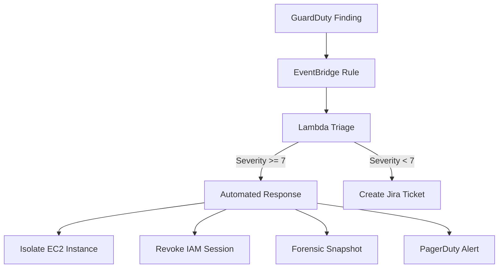

```python
RESPONSE_PLAYBOOKS = {
    "UnauthorizedAccess:IAMUser/MaliciousIPCaller": {
        "action": "revoke_sessions",
        "severity_threshold": 5.0,
    },
    "CryptoCurrency:EC2/BitcoinTool.B": {
        "action": "isolate_and_snapshot",
        "severity_threshold": 2.0,
    },
    "Trojan:EC2/BlackholeTraffic": {
        "action": "isolate_and_snapshot",
        "severity_threshold": 3.0,
    },
    "Recon:IAMUser/MaliciousIPCaller": {
        "action": "revoke_sessions",
        "severity_threshold": 4.0,
    },
}

def revoke_sessions(role_arn: str):
    """Deny all sessions older than now by attaching an inline deny policy."""
    import boto3, json
    from datetime import datetime, timezone
    iam = boto3.client("iam")
    role_name = role_arn.split("/")[-1]
    iam.put_role_policy(
        RoleName=role_name,
        PolicyName="RevokeOlderSessions",
        PolicyDocument=json.dumps({
            "Version": "2012-10-17",
            "Statement": [{
                "Effect": "Deny",
                "Action": "*",
                "Resource": "*",
                "Condition": {
                    "DateLessThan": {
                        "aws:TokenIssueTime": datetime.now(timezone.utc).isoformat()
                    }
                }
            }]
        })
    )
```

### Security Hub Custom Insights

```bash
# Create a Security Hub insight: unencrypted S3 buckets
aws securityhub create-insight \
  --name "Unencrypted S3 Buckets" \
  --filters '{
    "ResourceType": [{"Value": "AwsS3Bucket", "Comparison": "EQUALS"}],
    "ComplianceStatus": [{"Value": "FAILED", "Comparison": "EQUALS"}],
    "Title": [{"Value": "S3.4", "Comparison": "CONTAINS"}]
  }' \
  --group-by-attribute "ResourceId"

# Get Security Hub findings summary
aws securityhub get-findings \
  --filters '{
    "SeverityLabel": [{"Value": "CRITICAL", "Comparison": "EQUALS"}],
    "RecordState": [{"Value": "ACTIVE", "Comparison": "EQUALS"}],
    "WorkflowStatus": [{"Value": "NEW", "Comparison": "EQUALS"}]
  }' \
  --query "Findings[*].{Title:Title,Resource:Resources[0].Id,Region:Region}" \
  --output table
```

---

## DynamoDB Advanced Patterns

### Single Table Design

```python
# Single-table design: Users, Orders, Products in one DynamoDB table
# Access patterns drive the key design

# Entity definitions
# User:      PK=USER#userId      SK=PROFILE
# Order:     PK=USER#userId      SK=ORDER#orderId
# OrderItem: PK=ORDER#orderId    SK=ITEM#itemId
# Product:   PK=PRODUCT#sku      SK=METADATA

import boto3
from boto3.dynamodb.conditions import Key, Attr

table = boto3.resource("dynamodb").Table("single-table")

def get_user_with_orders(user_id: str) -> dict:
    """Single query to get user profile + all orders."""
    response = table.query(
        KeyConditionExpression=Key("pk").eq(f"USER#{user_id}"),
        ScanIndexForward=False,  # Most recent first
    )
    items = response["Items"]
    profile = next((i for i in items if i["sk"] == "PROFILE"), None)
    orders = [i for i in items if i["sk"].startswith("ORDER#")]
    return {"profile": profile, "orders": orders}

def create_order_transaction(user_id: str, order: dict, items: list):
    """Atomic order creation with inventory decrement."""
    dynamodb = boto3.client("dynamodb")
    transact_items = [
        # Create order record
        {"Put": {
            "TableName": "single-table",
            "Item": {
                "pk": {"S": f"USER#{user_id}"},
                "sk": {"S": f"ORDER#{order['id']}"},
                "status": {"S": "PENDING"},
                "total": {"N": str(order["total"])},
            },
            "ConditionExpression": "attribute_not_exists(pk)",
        }},
    ]
    # Decrement inventory for each item
    for item in items:
        transact_items.append({"Update": {
            "TableName": "single-table",
            "Key": {
                "pk": {"S": f"PRODUCT#{item['sku']}"},
                "sk": {"S": "METADATA"},
            },
            "UpdateExpression": "SET inventory = inventory - :qty",
            "ConditionExpression": "inventory >= :qty",
            "ExpressionAttributeValues": {
                ":qty": {"N": str(item["quantity"])}
            },
        }})
    dynamodb.transact_write_items(TransactItems=transact_items)
```

### DynamoDB Streams and Lambda Processing

```yaml
DynamoStreamProcessor:
  Type: AWS::Serverless::Function
  Properties:
    Handler: stream.handler
    Runtime: python3.12
    Events:
      DynamoStream:
        Type: DynamoDB
        Properties:
          Stream: !GetAtt OrdersTable.StreamArn
          StartingPosition: TRIM_HORIZON
          BisectBatchOnFunctionError: true
          MaximumRetryAttempts: 3
          DestinationConfig:
            OnFailure:
              Type: SQS
              Destination: !GetAtt StreamDLQ.Arn
          FilterCriteria:
            Filters:
              - Pattern: '{"dynamodb": {"NewImage": {"status": {"S": ["COMPLETED"]}}}}'
```

```python
def handler(event, context):
    for record in event["Records"]:
        if record["eventName"] == "MODIFY":
            new_image = record["dynamodb"].get("NewImage", {})
            old_image = record["dynamodb"].get("OldImage", {})

            new_status = new_image.get("status", {}).get("S")
            old_status = old_image.get("status", {}).get("S")

            if old_status == "PENDING" and new_status == "COMPLETED":
                order_id = new_image["sk"]["S"].replace("ORDER#", "")
                send_completion_email(order_id)
```

---

## VPC Advanced Networking

### VPC Design for Multi-Tier Applications

```yaml
# Three-tier VPC: public, application, data
VPC:
  Type: AWS::EC2::VPC
  Properties:
    CidrBlock: 10.0.0.0/16
    EnableDnsHostnames: true
    EnableDnsSupport: true

# Public subnets — load balancers only
PublicSubnetA:
  Type: AWS::EC2::Subnet
  Properties:
    VpcId: !Ref VPC
    CidrBlock: 10.0.0.0/24
    AvailabilityZone: !Select [0, !GetAZs ""]
    MapPublicIpOnLaunch: false  # No auto-assign; controlled by ELB

# Application subnets — ECS, Lambda (VPC-attached)
AppSubnetA:
  Type: AWS::EC2::Subnet
  Properties:
    VpcId: !Ref VPC
    CidrBlock: 10.0.10.0/24
    AvailabilityZone: !Select [0, !GetAZs ""]

# Data subnets — RDS, ElastiCache, no outbound internet
DataSubnetA:
  Type: AWS::EC2::Subnet
  Properties:
    VpcId: !Ref VPC
    CidrBlock: 10.0.20.0/24
    AvailabilityZone: !Select [0, !GetAZs ""]
```

### VPC Endpoint for Private S3 Access

```yaml
# Gateway endpoint — S3 and DynamoDB (free, route-table based)
S3VPCEndpoint:
  Type: AWS::EC2::VPCEndpoint
  Properties:
    VpcId: !Ref VPC
    ServiceName: !Sub "com.amazonaws.${AWS::Region}.s3"
    VpcEndpointType: Gateway
    RouteTableIds:
      - !Ref AppRouteTable
      - !Ref DataRouteTable
    PolicyDocument:
      Version: "2012-10-17"
      Statement:
        - Effect: Allow
          Principal: "*"
          Action: "s3:*"
          Resource:
            - !Sub "arn:aws:s3:::my-app-bucket-${AWS::AccountId}"
            - !Sub "arn:aws:s3:::my-app-bucket-${AWS::AccountId}/*"

# Interface endpoint — SSM, Secrets Manager, ECR (ENI-based, has cost)
SecretsManagerEndpoint:
  Type: AWS::EC2::VPCEndpoint
  Properties:
    VpcId: !Ref VPC
    ServiceName: !Sub "com.amazonaws.${AWS::Region}.secretsmanager"
    VpcEndpointType: Interface
    SubnetIds: [!Ref AppSubnetA, !Ref AppSubnetB]
    SecurityGroupIds: [!Ref EndpointSG]
    PrivateDnsEnabled: true
```

---

## AWS Cheat Sheet

### Most-Used CLI Commands

```bash
# Identity and auth
aws sts get-caller-identity
aws configure list-profiles
aws sso login --profile my-sso-profile

# S3
aws s3 ls s3://bucket/prefix/
aws s3 cp file.txt s3://bucket/key
aws s3 sync ./local s3://bucket/prefix --delete --exclude "*.log"
aws s3api get-bucket-policy --bucket my-bucket

# EC2
aws ec2 describe-instances --filters "Name=instance-state-name,Values=running" \
  --query "Reservations[*].Instances[*].{ID:InstanceId,Type:InstanceType,IP:PrivateIpAddress,Name:Tags[?Key=='Name'].Value|[0]}" \
  --output table

# Lambda
aws lambda invoke --function-name my-fn --payload '{"key":"value"}' out.json && cat out.json
aws lambda update-function-code --function-name my-fn --zip-file fileb://code.zip

# CloudFormation
aws cloudformation describe-stack-events --stack-name my-stack \
  --query "StackEvents[?ResourceStatus=='CREATE_FAILED']"

# CloudWatch
aws logs tail /aws/lambda/my-function --follow --format short

# ECS
aws ecs list-tasks --cluster my-cluster --service-name my-service
aws ecs execute-command --cluster my-cluster --task <task-id> \
  --container app --interactive --command /bin/sh

# IAM
aws iam list-attached-role-policies --role-name MyRole
aws iam simulate-principal-policy \
  --policy-source-arn arn:aws:iam::ACCOUNT:role/MyRole \
  --action-names s3:GetObject --resource-arns arn:aws:s3:::my-bucket/*
```

### Common Error Codes and Fixes

| Error | Cause | Fix |
|-------|-------|-----|
| `AccessDenied` | IAM policy doesn't allow | Check CloudTrail, use policy simulator |
| `ExpiredTokenException` | STS token expired | Re-assume role or refresh SSO session |
| `ThrottlingException` | API rate limit exceeded | Exponential backoff, request limit increase |
| `ValidationError` | CloudFormation template syntax | `aws cloudformation validate-template` |
| `ResourceNotReady` | Dependency not yet ready | Add `DependsOn` or wait for resource |
| `NoSuchKey` | S3 object doesn't exist | Check key name, region, bucket |
| `InvalidParameterException` | Wrong parameter type or value | Read API docs for allowed values |
| `ServiceUnavailableException` | AWS service issue | Check Service Health Dashboard |

---

## Process/Coding Patterns Reference

### Deployment Safety Checklist

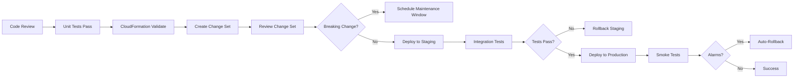

### IAM Policy Authoring Workflow

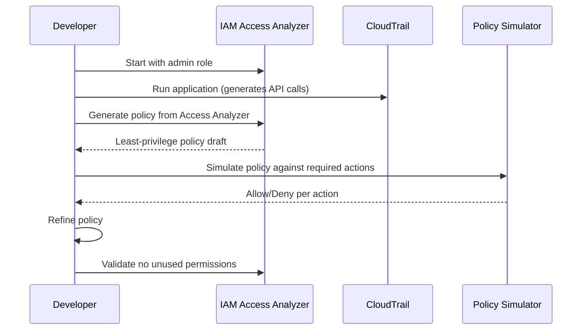

### Cost Optimization Decision Tree

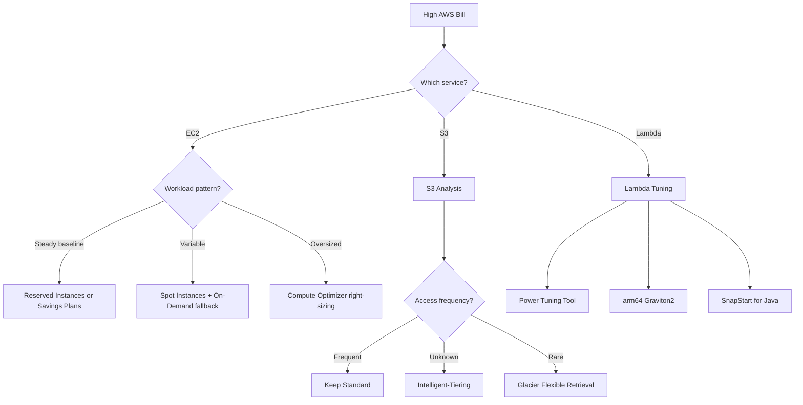


---

## Advanced Find-Bug Scenarios

### Bug 6 — Lambda Execution Role Too Broad

**Broken SAM template:**
```yaml
MyFunction:
  Type: AWS::Serverless::Function
  Properties:
    Policies:
      - AdministratorAccess   # Full AWS admin — completely wrong for Lambda
```

**Risk:** Compromised Lambda (via injection, deserialization, or dependency vulnerability) has full admin access to the entire AWS account. Can create IAM users, exfiltrate secrets, delete databases.

**Diagnostic hint:**
```bash
# Check all Lambda functions with admin access
aws lambda list-functions --query "Functions[*].FunctionName" --output text | \
  xargs -I{} aws lambda get-function-configuration --function-name {} \
    --query "{Function:FunctionName,Role:Role}"
# Then check each role's attached policies
aws iam list-attached-role-policies --role-name <role-name>
```

**Fix — Specific least-privilege policy:**
```yaml
MyFunction:
  Type: AWS::Serverless::Function
  Properties:
    Policies:
      - Statement:
          - Effect: Allow
            Action:
              - dynamodb:GetItem
              - dynamodb:PutItem
              - dynamodb:UpdateItem
              - dynamodb:Query
            Resource: !GetAtt OrdersTable.Arn
          - Effect: Allow
            Action:
              - sqs:SendMessage
            Resource: !GetAtt NotificationQueue.Arn
          - Effect: Allow
            Action:
              - secretsmanager:GetSecretValue
            Resource: !Sub "arn:aws:secretsmanager:${AWS::Region}:${AWS::AccountId}:secret:myapp/*"
```

---

### Bug 7 — RDS Instance Publicly Accessible with Weak Password

**Broken CloudFormation:**
```yaml
Database:
  Type: AWS::RDS::DBInstance
  Properties:
    DBInstanceIdentifier: production-db
    DBInstanceClass: db.t3.medium
    Engine: mysql
    MasterUsername: admin
    MasterUserPassword: admin123      # Weak password, not from Secrets Manager
    PubliclyAccessible: true           # Database reachable from the internet!
    VPCSecurityGroups:
      - !Ref DatabaseSG
    # Missing: StorageEncrypted: true
    # Missing: DeletionProtection: true
    # Missing: BackupRetentionPeriod
```

**Risk:** Database accessible from the internet. Automated scanners will find it and brute-force the weak password within hours. No encryption at rest. No backup retention. No deletion protection.

**Fix:**
```yaml
Database:
  Type: AWS::RDS::DBInstance
  DeletionPolicy: Snapshot
  Properties:
    DBInstanceClass: db.t3.medium
    Engine: mysql
    MasterUsername: !Sub "{{resolve:secretsmanager:${DBSecret}:SecretString:username}}"
    MasterUserPassword: !Sub "{{resolve:secretsmanager:${DBSecret}:SecretString:password}}"
    PubliclyAccessible: false
    StorageEncrypted: true
    KmsKeyId: !Ref RDSKMSKey
    VPCSecurityGroups: [!Ref DatabaseSG]
    DBSubnetGroupName: !Ref DBSubnetGroup   # Private subnets only
    DeletionProtection: true
    BackupRetentionPeriod: 7
    MultiAZ: true
    EnableCloudwatchLogsExports: [error, slowquery, general]

DBSecret:
  Type: AWS::SecretsManager::Secret
  Properties:
    GenerateSecretString:
      SecretStringTemplate: '{"username": "dbadmin"}'
      GenerateStringKey: password
      PasswordLength: 32
      ExcludeCharacters: '"@/\'
```

---

### Bug 8 — EventBridge Rule Missing Dead-Letter Queue

**Broken configuration:**
```yaml
ProcessOrderRule:
  Type: AWS::Events::Rule
  Properties:
    EventPattern:
      source: [order-service]
      detail-type: [OrderPlaced]
    Targets:
      - Arn: !GetAtt ProcessOrderFunction.Arn
        Id: ProcessOrder
        # Missing: DeadLetterConfig
        # Missing: RetryPolicy
```

**Risk:** If Lambda invocation fails (throttle, Lambda service issue), EventBridge silently drops the event after default retry. Orders will be lost with no alert.

**Fix:**
```yaml
ProcessOrderRule:
  Type: AWS::Events::Rule
  Properties:
    EventPattern:
      source: [order-service]
      detail-type: [OrderPlaced]
    Targets:
      - Arn: !GetAtt ProcessOrderFunction.Arn
        Id: ProcessOrder
        RetryPolicy:
          MaximumRetryAttempts: 185        # EventBridge max: 185
          MaximumEventAgeInSeconds: 86400  # 24 hours
        DeadLetterConfig:
          Arn: !GetAtt EventBridgeDLQ.Arn

EventBridgeDLQ:
  Type: AWS::SQS::Queue
  Properties:
    MessageRetentionPeriod: 1209600   # 14 days

DLQAlarm:
  Type: AWS::CloudWatch::Alarm
  Properties:
    AlarmName: eventbridge-dlq-not-empty
    MetricName: ApproximateNumberOfMessagesVisible
    Namespace: AWS::SQS
    Dimensions:
      - Name: QueueName
        Value: !GetAtt EventBridgeDLQ.QueueName
    Threshold: 0
    ComparisonOperator: GreaterThanThreshold
    Period: 60
    EvaluationPeriods: 1
    AlarmActions: [!Ref AlertSNSTopic]
```

---

## Advanced Optimize Scenarios

### Optimization 7 — RDS Read Replica Offloading

**Before:** All reads hitting primary RDS instance — 95% CPU at peak
**After:** Read replica for analytics/reporting — primary CPU drops to 45%

```python
import boto3

class DatabaseRouter:
    """Route read/write queries to appropriate RDS endpoint."""

    def __init__(self, write_endpoint: str, read_endpoint: str):
        self.write_conn = self._connect(write_endpoint)
        self.read_conn = self._connect(read_endpoint)

    def execute_write(self, query: str, params=None):
        """INSERT, UPDATE, DELETE always go to primary."""
        return self.write_conn.execute(query, params)

    def execute_read(self, query: str, params=None, replica: bool = True):
        """SELECT can go to read replica. Set replica=False for critical reads."""
        conn = self.read_conn if replica else self.write_conn
        return conn.execute(query, params)

    def execute_report(self, query: str, params=None):
        """Long-running analytics always on replica to avoid primary impact."""
        return self.read_conn.execute(query, params)
```

```yaml
# Add read replica to existing RDS instance
ReadReplica:
  Type: AWS::RDS::DBInstance
  Properties:
    SourceDBInstanceIdentifier: !Ref PrimaryDB
    DBInstanceClass: db.r6g.xlarge   # Can differ from primary
    PubliclyAccessible: false
    MultiAZ: false                    # Replicas don't need MultiAZ
    StorageEncrypted: true
    Tags:
      - Key: Role
        Value: read-replica
```

### Optimization 8 — ElastiCache Read-Through Caching

**Before:** DynamoDB: 50,000 RCU provisioned for product catalog — $7,200/month
**After:** ElastiCache Redis cache-aside for catalog — DynamoDB 5,000 RCU + Redis $180 = $1,260/month

```python
import boto3
import json
import redis
from functools import wraps

redis_client = redis.Redis.from_url(os.environ["REDIS_URL"], decode_responses=True)
dynamodb = boto3.resource("dynamodb")
table = dynamodb.Table("products")

def cache_aside(ttl: int = 300):
    """Cache-aside pattern decorator."""
    def decorator(func):
        @wraps(func)
        def wrapper(*args, **kwargs):
            # Build cache key from function name and arguments
            cache_key = f"{func.__name__}:{':'.join(str(a) for a in args)}"
            cached = redis_client.get(cache_key)
            if cached:
                return json.loads(cached)
            # Cache miss — fetch from DynamoDB
            result = func(*args, **kwargs)
            if result:
                redis_client.setex(cache_key, ttl, json.dumps(result))
            return result
        return wrapper
    return decorator

@cache_aside(ttl=3600)  # Product catalog rarely changes — 1 hour TTL
def get_product(sku: str) -> dict:
    response = table.get_item(Key={"pk": f"PRODUCT#{sku}", "sk": "METADATA"})
    return response.get("Item")

@cache_aside(ttl=60)    # Inventory changes frequently — 1 minute TTL
def get_inventory(sku: str) -> int:
    response = table.get_item(Key={"pk": f"PRODUCT#{sku}", "sk": "INVENTORY"})
    return response.get("Item", {}).get("stock", 0)
```

### Optimization 9 — CloudFront Cache Policies

**Before:** 100% origin requests hitting API Gateway — $7,200/month API Gateway + $2,100 Lambda
**After:** 80% cache hit rate on CloudFront — $1,440 API Gateway + $420 Lambda + $900 CloudFront

```yaml
ProductCatalogCachePolicy:
  Type: AWS::CloudFront::CachePolicy
  Properties:
    CachePolicyConfig:
      Name: ProductCatalogCache
      DefaultTTL: 3600      # 1 hour default
      MaxTTL: 86400         # 24 hour max
      MinTTL: 0
      ParametersInCacheKeyAndForwardedToOrigin:
        EnableAcceptEncodingGzip: true
        EnableAcceptEncodingBrotli: true
        HeadersConfig:
          HeaderBehavior: none
        CookiesConfig:
          CookieBehavior: none
        QueryStringsConfig:
          QueryStringBehavior: whitelist
          QueryStrings:
            - category   # Cache separately by category
            - sort

ProductCatalogDistribution:
  Type: AWS::CloudFront::Distribution
  Properties:
    DistributionConfig:
      CacheBehaviors:
        - PathPattern: /api/products*
          TargetOriginId: ApiGateway
          CachePolicyId: !Ref ProductCatalogCachePolicy
          ViewerProtocolPolicy: redirect-to-https
        - PathPattern: /api/cart*
          TargetOriginId: ApiGateway
          CachePolicyId: !Ref AWS::NoValue   # No caching for cart
          ViewerProtocolPolicy: redirect-to-https
```

### Optimization 10 — SQS Batch Processing

**Before:** Lambda processes 1 SQS message per invocation — 10,000 Lambda invocations/min
**After:** Lambda processes 10 messages per invocation (batch size 10) — 1,000 invocations/min

```python
def handler(event, context):
    """Process SQS messages in batch with partial failure support."""
    failures = []

    for record in event["Records"]:
        message_id = record["messageId"]
        try:
            body = json.loads(record["body"])
            process_message(body)
        except Exception as e:
            # Report failure for this specific message — others remain successful
            failures.append({"itemIdentifier": message_id})
            print(f"Failed to process {message_id}: {e}")

    # Return partial batch failure — failed messages returned to queue
    # Successful messages are deleted automatically
    return {"batchItemFailures": failures}
```

```yaml
ProcessorFunction:
  Type: AWS::Serverless::Function
  Properties:
    Events:
      SQSEvent:
        Type: SQS
        Properties:
          Queue: !GetAtt InputQueue.Arn
          BatchSize: 10
          FunctionResponseTypes:
            - ReportBatchItemFailures   # Enable partial batch failure
          MaximumBatchingWindowInSeconds: 5  # Wait up to 5s to collect batch
```

---

## Well-Architected Framework Reference

### Six Pillars Summary

| Pillar | Core Questions | Key Services |
|--------|---------------|--------------|
| **Operational Excellence** | How do you run operations? How do you improve? | CloudFormation, CodePipeline, Systems Manager, CloudWatch |
| **Security** | How do you protect data and systems? | IAM, KMS, GuardDuty, Security Hub, AWS Config, CloudTrail |
| **Reliability** | How do you recover from failures? | Multi-AZ, Route 53, Auto Scaling, ELB, DynamoDB Global Tables |
| **Performance Efficiency** | How do you use computing resources efficiently? | CloudFront, ElastiCache, DynamoDB DAX, Lambda, Graviton |
| **Cost Optimization** | How do you eliminate unneeded costs? | Savings Plans, Spot Instances, Trusted Advisor, Cost Explorer |
| **Sustainability** | How do you minimize environmental impact? | Graviton, Spot Instances, right-sizing, region selection |

### Well-Architected Review Checklist

```bash
# Run a Well-Architected Review programmatically
aws wellarchitected create-workload \
  --workload-name "my-saas-platform" \
  --description "Production SaaS application" \
  --review-owner "platform-team@example.com" \
  --environment PRODUCTION \
  --aws-regions us-east-1 eu-west-1 \
  --lenses wellarchitected

# List all high-risk issues in a workload
aws wellarchitected list-answers \
  --workload-id <workload-id> \
  --lens-alias wellarchitected \
  --query "AnswerSummaries[?Risk=='HIGH'].{Question:QuestionTitle,Pillar:PillarId}"
```

---

## AWS Glossary

| Term | Definition |
|------|-----------|
| ARN | Amazon Resource Name — globally unique identifier for any AWS resource |
| AZ | Availability Zone — isolated data center within a region |
| ABAC | Attribute-Based Access Control — IAM policy conditions on resource/principal tags |
| CMK | Customer Master Key — KMS key you control (now called KMS key) |
| DLQ | Dead-Letter Queue — captures failed messages from SQS/SNS/Lambda/EventBridge |
| ENI | Elastic Network Interface — virtual NIC attached to an EC2 instance or Lambda in VPC |
| IMDS | Instance Metadata Service — EC2 endpoint at 169.254.169.254 for instance metadata |
| IaC | Infrastructure as Code — CloudFormation, CDK, Terraform, SAM |
| OIDC | OpenID Connect — federated identity for GitHub Actions, EKS, etc. |
| SCP | Service Control Policy — AWS Organizations guardrail applied to OUs or accounts |
| SRE | Site Reliability Engineering — applies software engineering to operations |
| SSE | Server-Side Encryption — S3/DynamoDB/SQS at-rest encryption |
| STS | Security Token Service — issues temporary credentials for roles |
| VPC | Virtual Private Cloud — logically isolated network section in AWS |
| NACL | Network Access Control List — stateless subnet-level firewall |
| OAC | Origin Access Control — CloudFront identity to access private S3 (replaces OAI) |
| RI | Reserved Instance — 1 or 3-year commitment for discounted EC2/RDS pricing |

---

## Level Comparison Matrix

| Dimension | Junior | Middle | Senior | Professional |
|-----------|--------|--------|--------|--------------|
| **Depth** | Console navigation, first deploys | Production-ready patterns, IaC | Multi-account, DR, security posture | Internals: Nitro, IAM engine, VPC SDN |
| **Code** | Basic CLI, simple CloudFormation | Parameterized IaC, CI/CD | SCPs, ABAC, CDK, canary deploys | CloudTrail Athena, pack analysis |
| **Troubleshooting** | Read CloudWatch logs | X-Ray traces, Logs Insights queries | Dependency DAG, cross-region DR | VPC Flow Log forensics, IAM eval path |
| **Cost Awareness** | Set billing alerts | Cost Explorer, DLQ | Savings Plans, right-sizing | Architecture-level cost modeling |
| **Security** | Least privilege, no root | Encryption everywhere, Security Hub | SCPs, GuardDuty automation | KMS internals, Nitro attestation |


---

## Tricky Interview Questions and Answers

### Q: An S3 `GetObject` call returns AccessDenied even though the bucket policy says Allow. What are the possible causes?

**Answer (complete list):**
1. **SCP deny** — If the account is in an AWS Organization, an SCP at the OU or root level may deny `s3:GetObject`. SCPs override identity policies.
2. **Permission boundary** — The IAM user or role has a permission boundary that doesn't include `s3:GetObject`, even if the identity policy does.
3. **Cross-account without identity policy** — The bucket is in account B, the caller is in account A. The bucket policy alone isn't enough for cross-account access; the identity policy in account A must also explicitly allow it.
4. **VPC endpoint policy** — If the call comes through a VPC endpoint with a restrictive endpoint policy, the endpoint policy may deny the action.
5. **AWS KMS key policy** — If the object is SSE-KMS encrypted with a customer-managed key, the key policy must also grant `kms:Decrypt` to the caller.
6. **Object ownership and ACLs** — In older buckets with ACLs enabled, the object was uploaded by a different AWS account and the ACL grants it to the owning account only.

**Diagnostic approach:**
```bash
aws iam simulate-principal-policy \
  --policy-source-arn arn:aws:iam::ACCOUNT:role/MyRole \
  --action-names s3:GetObject \
  --resource-arns arn:aws:s3:::my-bucket/my-key \
  --context-entries Key=s3:prefix,Values=my-key
```

---

### Q: What happens to Lambda invocations during a Lambda service cold start? What levers exist?

**Answer:**

Cold start components:
1. **MicroVM init** (~50ms) — Firecracker creates a new micro-VM
2. **Runtime init** (~50-500ms) — Python/Node/JVM loads in the VM
3. **Function init** (~varies) — Your `import` statements, DB connections, SDK clients
4. **Handler invocation** — Actual function code runs

Levers to reduce cold starts:
- **Provisioned concurrency** — Pre-warm N execution environments; eliminates cold start for those N slots (~$0.015/GB-hour extra)
- **SnapStart (Java)** — Snapshot the initialized JVM state; restore in ~200ms vs 8s JVM init
- **arm64 (Graviton2)** — 20% better price-performance; typically 10-15% faster init
- **Reduce deployment package size** — Smaller zip = faster download into MicroVM
- **Lazy imports** — Import heavy libraries inside the handler, not at module level
- **Lambda Layers** — Pre-staged to reduce download time (shared across functions)
- **Memory size** — More memory = proportionally more vCPU = faster initialization

---

### Q: Explain the difference between SQS Standard and FIFO queues in terms of internal implementation.

**Standard Queue:**
- Distributed across multiple hosts for maximum throughput
- Messages stored redundantly across multiple AZs
- At-least-once delivery — same message may be delivered twice (distributed system)
- Best-effort ordering — roughly FIFO but not guaranteed
- Throughput: nearly unlimited (3,000 messages/second with batching)

**FIFO Queue:**
- Strict message ordering within a Message Group ID
- Exactly-once processing via deduplication ID (5-minute deduplication window)
- Single logical queue backed by sequencer — lower throughput
- Throughput: 300 TPS without batching, 3,000 TPS with batching (per queue)
- Use when: financial transactions, order state machines, sequential workflow steps

**Tradeoff:** FIFO queues sacrifice throughput for ordering and exactly-once guarantees. Never use FIFO for high-volume event streams; use Standard + idempotent consumers instead.

---

### Q: How does DynamoDB handle a hot partition, and what are the solutions?

**Internals:**
- DynamoDB distributes data across partitions using consistent hashing on the partition key
- Each partition has a hard limit of 3,000 RCU + 1,000 WCU
- Adaptive capacity (auto-mode): DynamoDB lends capacity from cold partitions to hot ones — but this is temporary
- When one partition key receives disproportionate traffic, throttling occurs even if the table has unused capacity

**Solutions:**
1. **Write sharding** — Append a random suffix (0-N) to the partition key; scatter writes across N partitions; query all N and merge reads
2. **Time-based partitioning** — Append the current hour/minute to the key (e.g., `USER#123#2026-03-26-14`)
3. **Caching** — DynamoDB Accelerator (DAX) provides microsecond reads; caches hot items in-memory
4. **Redesign access pattern** — Re-evaluate if the hot key is a "celebrity item"; use a separate cache tier
5. **Burst capacity** — DynamoDB retains up to 300 seconds of unused capacity per partition; handles brief spikes automatically

---

## Process Patterns — AWS Operations

### Incident Response Runbook Template

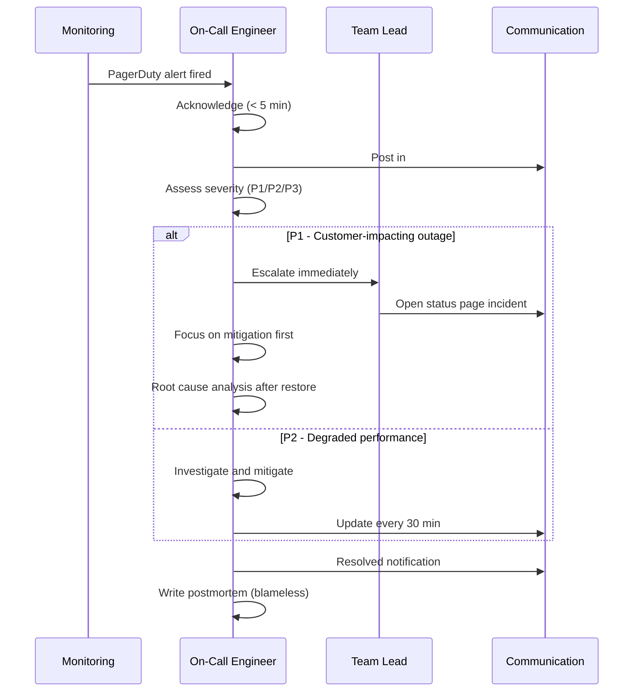

### Deployment Pipeline Gate Requirements

```mermaid
graph LR
    Code[Code Pushed] --> Lint[Lint + Static Analysis]
    Lint --> Test[Unit Tests 80% coverage]
    Test --> Validate[CloudFormation Validate]
    Validate --> Build[Docker Build + ECR Push]
    Build --> Scan[Container Security Scan]
    Scan --> Deploy_Staging[Deploy to Staging]
    Deploy_Staging --> Int_Tests[Integration Tests]
    Int_Tests --> DAST[DAST Security Scan]
    DAST --> Approval{Manual Approval}
    Approval -->|Approved| Deploy_Prod[Deploy to Production]
    Deploy_Prod --> Smoke[Smoke Tests]
    Smoke --> Monitor[Monitor Alarms 10 min]
    Monitor -->|Clean| Done[Done]
    Monitor -->|Alarm| Rollback[Auto-Rollback]
```

---

## Additional Best Practices by Service

### Lambda Best Practices

| Practice | Rationale |
|----------|-----------|
| Reuse connections outside handler | DB and SDK clients init is expensive — move to module level |
| Set `POWERTOOLS_LOG_LEVEL` via env var | Change log verbosity without redeployment |
| Use Lambda Powertools library | Structured logging, tracing, metrics with minimal code |
| Set concurrency reservations for critical functions | Prevents noisy neighbor from exhausting account limit |
| Use `arm64` architecture | 20% better price-performance with no code changes for most runtimes |
| Never hardcode region | Use `os.environ["AWS_REGION"]` or `boto3`'s default region resolution |
| Use X-Ray annotations for business context | Annotate traces with `order_id`, `user_id` for filtering |

### S3 Best Practices

| Practice | Rationale |
|----------|-----------|
| Use random prefixes or multiple prefixes | 3,500 PUT/5,500 GET per prefix — randomize for high throughput |
| Enable S3 Transfer Acceleration for cross-region uploads | Routes via CloudFront PoPs for faster uploads |
| Set Object Lock for compliance data | WORM (Write Once Read Many) — prevents delete/overwrite for retention period |
| Use S3 Inventory for large-scale audits | More efficient than listing objects; daily or weekly CSV/ORC report |
| Enable S3 Replication for DR | Cross-region or same-region replication with optional replication time control |
| Use pre-signed URLs for temporary access | Avoid making buckets public; generate time-limited signed URLs |

### RDS Best Practices

| Practice | Rationale |
|----------|-----------|
| Use IAM database authentication | No password management; short-lived tokens; audit in CloudTrail |
| Enable Performance Insights | Free for most instance types; essential for query analysis |
| Use RDS Proxy for Lambda connections | Connection pooling — prevents Lambda from exhausting DB connections |
| Parameterized queries only | Prevents SQL injection; works with RDS Proxy |
| Blue/green deployments for schema changes | Zero-downtime major version upgrades and schema changes |
| Separate read replicas per use case | Analytics replica, reporting replica — isolate workloads from primary |


---

## CloudFormation Resource Import and Stack Migrations

### Import Existing Resources Into CloudFormation

```bash
# Step 1: Create a change set of type IMPORT
aws cloudformation create-change-set \
  --stack-name my-stack \
  --change-set-name import-existing-resources \
  --change-set-type IMPORT \
  --resources-to-import '[
    {
      "ResourceType": "AWS::S3::Bucket",
      "LogicalResourceId": "DataBucket",
      "ResourceIdentifier": {"BucketName": "my-existing-bucket"}
    },
    {
      "ResourceType": "AWS::DynamoDB::Table",
      "LogicalResourceId": "OrdersTable",
      "ResourceIdentifier": {"TableName": "orders-production"}
    }
  ]' \
  --template-body file://template.yaml \
  --capabilities CAPABILITY_NAMED_IAM

# Step 2: Review the change set
aws cloudformation describe-change-set \
  --stack-name my-stack \
  --change-set-name import-existing-resources

# Step 3: Execute import
aws cloudformation execute-change-set \
  --stack-name my-stack \
  --change-set-name import-existing-resources
```

### Stack Refactor — Split Monolith Stack

```bash
# Export resource from stack A (add DeletionPolicy: Retain first)
# Remove from stack A template — resource is retained in AWS
# Import into stack B using IMPORT change set type
# Verify both stacks are healthy before removing DeletionPolicy

# Safe split checklist:
# 1. Add DeletionPolicy: Retain to resource in stack A
# 2. Deploy stack A (DeletionPolicy change)
# 3. Remove resource from stack A template
# 4. Deploy stack A (resource detached, not deleted)
# 5. Add resource to stack B template
# 6. Import resource into stack B
# 7. Verify stack B outputs and cross-stack references
# 8. Remove DeletionPolicy: Retain from stack B (optional)
```

---

## AWS Tag Strategy Reference

### Mandatory Tags Policy (AWS Config + SCP)

```json
{
  "Version": "2012-10-17",
  "Statement": [
    {
      "Sid": "RequireMandatoryTags",
      "Effect": "Deny",
      "Action": [
        "ec2:RunInstances",
        "rds:CreateDBInstance",
        "lambda:CreateFunction",
        "sqs:CreateQueue",
        "s3:CreateBucket"
      ],
      "Resource": "*",
      "Condition": {
        "Null": {
          "aws:RequestTag/Project": "true",
          "aws:RequestTag/Environment": "true",
          "aws:RequestTag/Owner": "true",
          "aws:RequestTag/CostCenter": "true"
        }
      }
    }
  ]
}
```

### Cost Allocation with Tags

```bash
# Activate cost allocation tags (must be done in billing console or CLI)
aws ce create-cost-category-definition \
  --name "ProjectCostAllocation" \
  --rule-type "REGULAR" \
  --rules '[
    {
      "Value": "platform",
      "Rule": {
        "Tags": {
          "Key": "Project",
          "Values": ["platform", "infrastructure"]
        }
      }
    },
    {
      "Value": "product",
      "Rule": {
        "Tags": {
          "Key": "Project",
          "Values": ["web-app", "mobile-api", "data-pipeline"]
        }
      }
    }
  ]'

# Get monthly cost breakdown by Project tag
aws ce get-cost-and-usage \
  --time-period Start=2026-03-01,End=2026-03-31 \
  --granularity MONTHLY \
  --metrics UnblendedCost \
  --group-by Type=TAG,Key=Project \
  --query "ResultsByTime[0].Groups[*].{Project:Keys[0],Cost:Metrics.UnblendedCost.Amount}" \
  --output table
```

---

## Regional Availability Patterns

### Active/Active vs Active/Passive Decision Framework

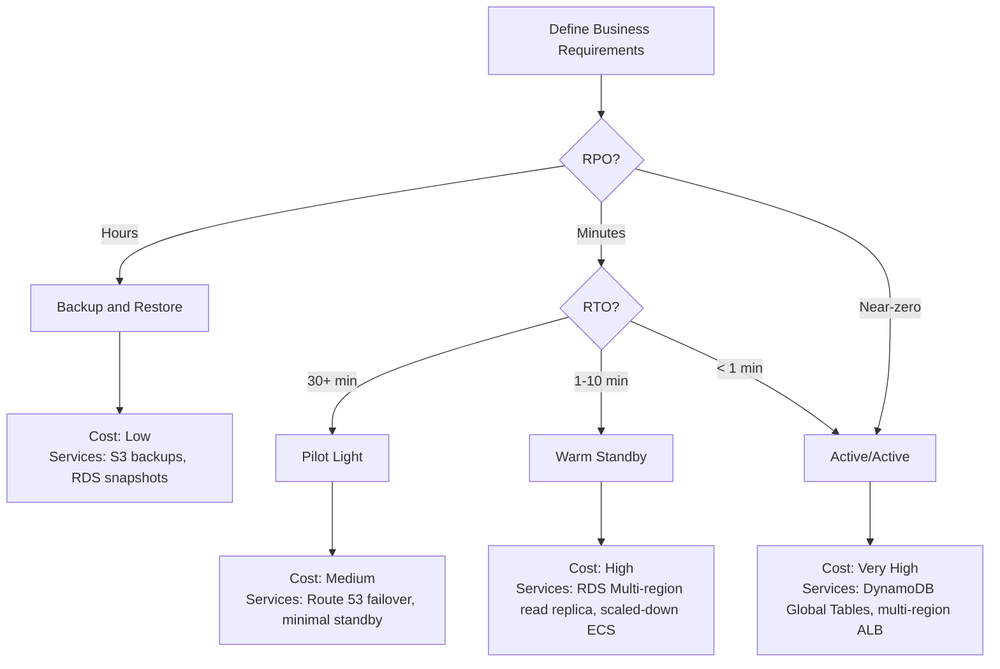

### Route 53 Health Check Patterns

```yaml
# Route 53 health check with failover routing
PrimaryRecord:
  Type: AWS::Route53::RecordSet
  Properties:
    HostedZoneId: !Ref HostedZone
    Name: api.example.com
    Type: A
    SetIdentifier: primary
    Failover: PRIMARY
    TTL: 30
    ResourceRecords: [!GetAtt PrimaryALB.DNSName]
    HealthCheckId: !Ref PrimaryHealthCheck

SecondaryRecord:
  Type: AWS::Route53::RecordSet
  Properties:
    HostedZoneId: !Ref HostedZone
    Name: api.example.com
    Type: A
    SetIdentifier: secondary
    Failover: SECONDARY
    TTL: 30
    ResourceRecords: [!GetAtt SecondaryALB.DNSName]
    # No health check needed on secondary — always serves if primary fails

PrimaryHealthCheck:
  Type: AWS::Route53::HealthCheck
  Properties:
    HealthCheckConfig:
      Type: HTTPS
      FullyQualifiedDomainName: api.example.com
      ResourcePath: /health
      FailureThreshold: 2
      RequestInterval: 10   # 10-second intervals for fast failover
      Regions: [us-east-1, eu-west-1, ap-southeast-1]
```

---
---

# TEMPLATE 9 — `specification.md`

> **Focus:** Official documentation deep-dive — standards references, framework specifications, official guidelines, and version compatibility.
>
> **Source:** Always cite the official documentation or standards with direct section links.
> - AI Red Teaming: https://airc.nist.gov/Docs | https://owasp.org/www-project-ai-security-and-privacy-guide/
> - Cyber Security: https://owasp.org/www-project-top-ten/ | https://csrc.nist.gov/
> - Code Review: https://google.github.io/eng-practices/review/
> - Engineering Manager: https://www.manager-tools.com/ | https://lethain.com/staff-engineer/
> - QA: https://www.istqb.org/certifications/ | https://testing.googleblog.com/
> - Technical Writer: https://developers.google.com/tech-writing | https://www.writethedocs.org/guide/
> - Product Manager: https://www.svpg.com/inspired/ | https://www.productboard.com/resources/
> - DevRel: https://www.devrel.agency/resources | https://www.commonroom.io/resources/
> - AWS: https://docs.aws.amazon.com/ | https://aws.amazon.com/architecture/
> - Git/GitHub: https://git-scm.com/docs | https://docs.github.com/

<details open>
<summary><strong>Template Content</strong></summary>

# {{TOPIC_NAME}} — Specification

> **Official Documentation / Standards Reference**
>
> Source: [{{SOURCE_NAME}}]({{DOCS_URL}}) — {{SECTION}}

---

## Table of Contents

1. [Reference](#reference)
2. [Official Framework / Standard](#official-framework--standard)
3. [Core Rules & Guidelines](#core-rules--guidelines)
4. [Process / Workflow Specification](#process--workflow-specification)
5. [Metrics & Measurement](#metrics--measurement)
6. [Common Scenarios & Responses](#common-scenarios--responses)
7. [Version & Evolution History](#version--evolution-history)
8. [Official Examples & Case Studies](#official-examples--case-studies)
9. [Compliance Checklist](#compliance-checklist)
10. [Related Resources](#related-resources)

---

## 1. Reference

| Property | Value |
|----------|-------|
| **Official Source** | [{{SOURCE_NAME}}]({{DOCS_URL}}) |
| **Relevant Section** | {{SECTION_NAME}} — {{SECTION_TITLE}} |
| **Standard / Version** | {{STANDARD_VERSION}} |
| **Direct URL** | {{DOCS_URL}}/{{PATH}} |

---

## 2. Official Framework / Standard

> From: {{DOCS_URL}}/{{FRAMEWORK_SECTION}}

### {{FRAMEWORK_OR_STANDARD_NAME}}

{{FRAMEWORK_DESCRIPTION}}

| Component | Purpose | Official Guidance |
|-----------|---------|------------------|
| {{COMP_1}} | {{PURPOSE_1}} | [Link]({{URL_1}}) |
| {{COMP_2}} | {{PURPOSE_2}} | [Link]({{URL_2}}) |
| {{COMP_3}} | {{PURPOSE_3}} | [Link]({{URL_3}}) |

---

## 3. Core Rules & Guidelines

### Guideline 1: {{GUIDELINE_NAME}}

> *Source: [{{DOCS_URL}}/{{SECTION}}]({{DOCS_URL}}/{{SECTION}}) — "{{DOC_QUOTE}}"*

{{GUIDELINE_EXPLANATION}}

**✅ Good practice:**
{{GOOD_EXAMPLE}}

**❌ Anti-pattern:**
{{BAD_EXAMPLE}}

### Guideline 2: {{GUIDELINE_NAME}}

> *Source: [{{DOCS_URL}}/{{SECTION}}]({{DOCS_URL}}/{{SECTION}})*

{{GUIDELINE_EXPLANATION}}

---

## 4. Process / Workflow Specification

### Official Process Flow

```
{{PROCESS_STEP_1}}
    ↓
{{PROCESS_STEP_2}}
    ↓
{{PROCESS_STEP_3}}
    ↓
{{PROCESS_STEP_4}}
```

| Stage | Official Requirement | Notes |
|-------|---------------------|-------|
| {{STAGE_1}} | {{REQ_1}} | {{NOTES_1}} |
| {{STAGE_2}} | {{REQ_2}} | {{NOTES_2}} |

---

## 5. Metrics & Measurement

| Metric | Official Definition | Target / Benchmark | Reference |
|--------|--------------------|--------------------|-----------|
| {{METRIC_1}} | {{DEF_1}} | {{TARGET_1}} | [Link]({{URL_1}}) |
| {{METRIC_2}} | {{DEF_2}} | {{TARGET_2}} | [Link]({{URL_2}}) |
| {{METRIC_3}} | {{DEF_3}} | {{TARGET_3}} | [Link]({{URL_3}}) |

---

## 6. Common Scenarios & Responses

| Scenario | Official Guidance | Reference |
|----------|-------------------|-----------|
| {{SCENARIO_1}} | {{GUIDANCE_1}} | [Docs]({{URL_1}}) |
| {{SCENARIO_2}} | {{GUIDANCE_2}} | [Docs]({{URL_2}}) |
| {{SCENARIO_3}} | {{GUIDANCE_3}} | [Docs]({{URL_3}}) |

---

## 7. Version & Evolution History

| Version / Edition | Change | Year | Notes |
|------------------|--------|------|-------|
| {{VER_1}} | {{CHANGE_1}} | {{YEAR_1}} | {{NOTES_1}} |
| {{VER_2}} | {{CHANGE_2}} | {{YEAR_2}} | {{NOTES_2}} |

---

## 8. Official Examples & Case Studies

### Example: {{EXAMPLE_TITLE}}

> Source: [{{DOCS_URL}}/{{ANCHOR}}]({{DOCS_URL}}/{{ANCHOR}})

{{EXAMPLE_DESCRIPTION}}

**Outcome / Result:**
{{EXPECTED_OUTCOME}}

---

## 9. Compliance Checklist

- [ ] Follows official recommended approach for {{TOPIC_NAME}}
- [ ] Aligned with standard version ({{STANDARD_VERSION}})
- [ ] Covers all required process stages
- [ ] Metrics are tracked per official guidance
- [ ] Common scenarios handled per official recommendations
- [ ] Team/stakeholder requirements met

---

## 10. Related Resources

| Topic | Source | URL |
|-------|--------|-----|
| {{RELATED_1}} | {{SOURCE_1}} | [Link]({{URL_1}}) |
| {{RELATED_2}} | {{SOURCE_2}} | [Link]({{URL_2}}) |
| {{RELATED_3}} | {{SOURCE_3}} | [Link]({{URL_3}}) |

---

> **Content Rules for `specification.md`:**
> - Always link directly to the relevant section of the official source (not just the homepage)
> - Use the most authoritative and widely accepted official standard or framework
> - Include measurable metrics where official standards define them
> - Document process flows using official terminology
> - Note when standards or best practices have evolved over time
> - Minimum 2 Core Guidelines, 3 Metrics, 3 Scenarios, 2 Official Examples

</details>
