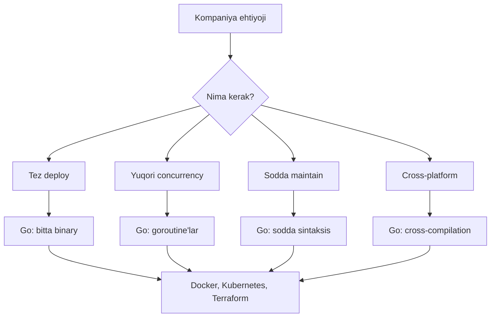
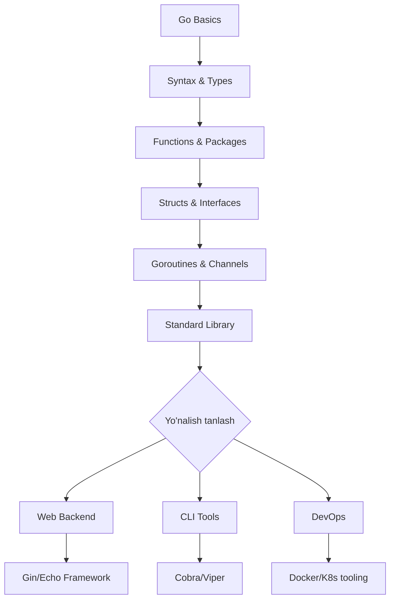

# Why Use Go — Junior Level

## Table of Contents
1. [Introduction](#introduction)
2. [Prerequisites](#prerequisites)
3. [Glossary](#glossary)
4. [Core Concepts](#core-concepts)
5. [Pros & Cons](#pros--cons)
6. [Use Cases](#use-cases)
7. [Code Examples](#code-examples)
8. [Product Use / Feature](#product-use--feature)
9. [Error Handling](#error-handling)
10. [Security Considerations](#security-considerations)
11. [Performance Tips](#performance-tips)
12. [Best Practices](#best-practices)
13. [Edge Cases & Pitfalls](#edge-cases--pitfalls)
14. [Common Mistakes](#common-mistakes)
15. [Tricky Points](#tricky-points)
16. [Test](#test)
17. [Tricky Questions](#tricky-questions)
18. [Cheat Sheet](#cheat-sheet)
19. [Summary](#summary)
20. [What You Can Build](#what-you-can-build)
21. [Further Reading](#further-reading)
22. [Related Topics](#related-topics)

---

## 1. Introduction

**Go** (yoki **Golang**) — bu Google tomonidan 2009-yilda yaratilgan open-source dasturlash tili. Uni Robert Griesemer, Rob Pike va Ken Thompson loyihalagan. Go tili sodda, tez va bir vaqtda ko'p ishni bajarish (concurrency) uchun mo'ljallangan.

### Nega Go yaratildi?

Google'da C++ va Java bilan ishlashda quyidagi muammolar bor edi:
- **Kompilatsiya sekin** edi (C++ da minutlab kutish kerak edi)
- **Concurrency qiyin** edi (thread management murakkab)
- **Dependency management** muammolari
- **Til juda murakkab** edi (C++ ning 1000+ sahifa standardi)

Go bu muammolarni hal qilish uchun yaratildi — **sodda, tez kompilyatsiya, built-in concurrency** bilan.

### Go'ning asosiy xususiyatlari:
- **Statik tipizatsiya** — xatolar kompilyatsiya vaqtida topiladi
- **Garbage Collection** — xotira avtomatik boshqariladi
- **Bitta binary fayl** — deploy qilish oson
- **Built-in concurrency** — goroutine'lar bilan
- **Tez kompilatsiya** — katta loyihalar ham sekundlarda kompilyatsiya bo'ladi

---

## 2. Prerequisites

Go'ni o'rganishni boshlash uchun quyidagi bilimlar kerak:

| # | Prerequisite | Nima uchun kerak |
|---|-------------|------------------|
| 1 | **Dasturlash asoslari** (o'zgaruvchilar, sikllar, funksiyalar) | Go sintaksisini tushunish uchun bazaviy bilim kerak |
| 2 | **Command Line / Terminal** asoslari | Go dasturlarni terminal orqali ishga tushirasiz (`go run`, `go build`) |
| 3 | **Birorta dasturlash tili bilan tajriba** (Python, JavaScript, C) | Boshqa tillar bilan solishtirib tushunish osonroq |
| 4 | **Text editor / IDE** (VS Code + Go extension) | Kod yozish va xatolarni ko'rish uchun |

---

## 3. Glossary

| Termin | Ta'rif | Misol |
|--------|--------|-------|
| **Compiled Language** | Kod mashinaning tushunishiga kompilyatsiya qilinadi | `go build main.go` → binary fayl |
| **Static Typing** | O'zgaruvchilar tipi kompilyatsiya vaqtida tekshiriladi | `var x int = 5` |
| **Goroutine** | Go'ning yengil (lightweight) thread'lari | `go myFunc()` |
| **Garbage Collection (GC)** | Xotira avtomatik tozalanadi | Dasturchi `free()` chaqirishi shart emas |
| **Binary** | Kompilyatsiya natijasi — bitta bajariladigan fayl | `./myapp` |
| **Concurrency** | Bir vaqtda bir nechta vazifani boshqarish | Goroutine + Channel |
| **Package** | Kodni tashkil qilish birligi | `package main`, `package fmt` |
| **Module** | Go loyihasini boshqarish tizimi | `go.mod` fayli |
| **Cross-compilation** | Bitta OS da boshqa OS uchun binary yaratish | Linux'da Windows uchun build qilish |
| **Standard Library** | Go bilan birga keladigan tayyor paketlar | `net/http`, `fmt`, `os` |

---

## 4. Core Concepts

### 4.1 Simplicity (Soddalik)

Go ataylab sodda qilib yaratilgan. Ko'p tillarda mavjud bo'lgan murakkab tushunchalar Go'da **yo'q**:

- ❌ Class / Inheritance (meros) yo'q
- ❌ Generics (Go 1.18 gacha yo'q edi, hozir oddiy shaklda bor)
- ❌ Exception (try/catch) yo'q
- ❌ Operator overloading yo'q

Buning o'rniga Go **composition** va **interface** ishlatadi.

### 4.2 Speed (Tezlik)

Go ikki xil tezlikka ega:

1. **Kompilatsiya tezligi** — Go juda tez kompilyatsiya qiladi
2. **Ishlash tezligi** — C/C++ ga yaqin natijalar beradi

```
Kompilatsiya tezligi taqqoslash:
Go:    ~2-5 sekund (katta loyiha)
C++:   ~2-10 minut (katta loyiha)
Rust:  ~5-30 minut (katta loyiha)
Java:  ~10-60 sekund (katta loyiha)
```

### 4.3 Concurrency (Parallellik)

Go'ning eng kuchli tomoni — **goroutine**'lar:

```
OS Thread:    ~1-8 MB xotira
Goroutine:    ~2-8 KB xotira (1000x kam!)
```

Bu degani bitta dasturda **millionlab** goroutine ishlatish mumkin.

### 4.4 Cross-Platform

Go bitta koddan turli platformalar uchun binary yaratishi mumkin:

```bash
# Linux uchun
GOOS=linux GOARCH=amd64 go build -o myapp-linux

# Windows uchun
GOOS=windows GOARCH=amd64 go build -o myapp.exe

# macOS uchun
GOOS=darwin GOARCH=amd64 go build -o myapp-mac
```

---

## 5. Pros & Cons

### Afzalliklar va Kamchiliklar

| Afzalliklar ✅ | Kamchiliklar ❌ |
|----------------|-----------------|
| Juda tez kompilatsiya | Generics cheklangan (Go 1.18+ da yaxshilangan) |
| Sodda sintaksis, o'rganish oson | OOP yo'q (class/inheritance) |
| Built-in concurrency (goroutine) | Error handling verbose (if err != nil) |
| Bitta binary fayl — deploy oson | GUI dasturlar uchun yaxshi emas |
| Kuchli standart kutubxona | Dynamic typing yo'q — ba'zan ko'p kod yozish kerak |
| Cross-compilation tayyor | Mobile development uchun cheklangan |
| Garbage Collection | GC tufayli real-time systems uchun mos emas |
| Google qo'llab-quvvatlaydi | Kichik community (Python/JS ga nisbatan) |

### Qachon Go tanlash kerak ✅

- Backend / API server yaratish
- Microservices arxitekturasi
- CLI (Command Line Interface) dasturlar
- DevOps va infra toollar
- Network dasturlash
- Cloud-native dasturlar

### Qachon Go tanlash KERAK EMAS ❌

- Frontend / UI dasturlar (React/Vue ishlatgan yaxshiroq)
- Mobile ilovalar (Swift/Kotlin yaxshiroq)
- Machine Learning (Python yaxshiroq)
- O'yin dasturlash (C++/C#/Unity yaxshiroq)
- Tez prototip yasash (Python/JS tezroq)

---

## 6. Use Cases

### Go qayerda ishlatiladi?

| # | Soha | Misol | Nima uchun Go |
|---|------|-------|---------------|
| 1 | **Web Backend** | REST API, gRPC services | Tez, concurrency, `net/http` standart kutubxona |
| 2 | **Microservices** | Kubernetes, Istio | Kichik binary, tez start, kam xotira |
| 3 | **CLI Tools** | Docker CLI, kubectl, gh | Bitta binary, cross-platform |
| 4 | **DevOps / Infra** | Terraform, Prometheus | Tez, ishonchli, deploy oson |
| 5 | **Cloud Services** | Cloudflare Workers, AWS Lambda | Tez cold start, kam resurs |
| 6 | **Network Tools** | CockroachDB, Caddy server | Concurrency, networking kutubxonalari |

---

## 7. Code Examples

### 7.1 Hello World

```go
package main

import "fmt"

func main() {
    fmt.Println("Hello, Go!")
    fmt.Println("Men Go dasturlash tilini o'rganyapman!")
}
```

**Ishga tushirish:**
```bash
go run main.go
```

**Natija:**
```
Hello, Go!
Men Go dasturlash tilini o'rganyapman!
```

### 7.2 Go vs Python tezlik taqqoslash

```go
package main

import (
    "fmt"
    "time"
)

func main() {
    start := time.Now()

    sum := 0
    for i := 0; i < 100_000_000; i++ {
        sum += i
    }

    elapsed := time.Since(start)
    fmt.Printf("Natija: %d\n", sum)
    fmt.Printf("Vaqt: %s\n", elapsed)
}
```

**Natija (taxminiy):**
```
Natija: 4999999950000000
Vaqt: 45.123ms    (Go)
# Python da bu ~5-10 sekund bo'ladi!
```

### 7.3 Oddiy goroutine misoli

```go
package main

import (
    "fmt"
    "time"
)

func sayHello(name string) {
    for i := 0; i < 3; i++ {
        fmt.Printf("Salom, %s! (%d)\n", name, i+1)
        time.Sleep(100 * time.Millisecond)
    }
}

func main() {
    // Goroutine — parallel ishlaydi
    go sayHello("Ali")
    go sayHello("Vali")

    // Asosiy goroutine kutadi
    time.Sleep(500 * time.Millisecond)
    fmt.Println("Dastur tugadi")
}
```

**Natija (tartib o'zgarishi mumkin):**
```
Salom, Ali! (1)
Salom, Vali! (1)
Salom, Ali! (2)
Salom, Vali! (2)
Salom, Ali! (3)
Salom, Vali! (3)
Dastur tugadi
```

### 7.4 Oddiy HTTP server

```go
package main

import (
    "fmt"
    "net/http"
)

func handler(w http.ResponseWriter, r *http.Request) {
    fmt.Fprintf(w, "Salom! Siz %s sahifadasiz", r.URL.Path)
}

func main() {
    http.HandleFunc("/", handler)
    fmt.Println("Server :8080 portda ishlayapti...")
    http.ListenAndServe(":8080", nil)
}
```

### 7.5 Cross-compilation misoli

```go
package main

import (
    "fmt"
    "runtime"
)

func main() {
    fmt.Printf("OS:   %s\n", runtime.GOOS)
    fmt.Printf("Arch: %s\n", runtime.GOARCH)
    fmt.Printf("Go versiya: %s\n", runtime.Version())
    fmt.Printf("CPU lar soni: %d\n", runtime.NumCPU())
}
```

---

## 8. Product Use / Feature

### Go ishlatadigan kompaniyalar va mahsulotlar

| # | Mahsulot | Kompaniya | Nima uchun Go | Qo'shimcha |
|---|----------|-----------|---------------|-----------|
| 1 | **Docker** | Docker Inc. | Container runtime butunlay Go'da yozilgan | Container texnologiyasining asosi |
| 2 | **Kubernetes** | Google / CNCF | Cluster orchestration uchun Go'ning concurrency va tezligi kerak | Eng mashhur orchestration tool |
| 3 | **Terraform** | HashiCorp | Infrastructure as Code — ko'p provayderlar bilan parallel ishlash | AWS, GCP, Azure hammasini boshqaradi |
| 4 | **Prometheus** | CNCF | Monitoring tizimi — yuqori concurrency bilan metric yig'ish | Millionlab metrikalarni real-time qayta ishlaydi |
| 5 | **CockroachDB** | Cockroach Labs | Distributed database — tarqalgan sistema Go'ning kuchli tomoni | Google Spanner'ning open-source versiyasi |

### Nima uchun bu kompaniyalar Go'ni tanlagan?



---

## 9. Error Handling

Go'da `try/catch` o'rniga **explicit error handling** ishlatiladi.

### 9.1 Fayl o'qishda xato

❌ **Xato:** Error'ni tekshirmaslik
```go
package main

import (
    "fmt"
    "os"
)

func main() {
    // XATO: error tekshirilmayapti!
    data, _ := os.ReadFile("mavjud_emas.txt")
    fmt.Println(string(data))
}
```

✅ **To'g'ri:** Error'ni tekshirish
```go
package main

import (
    "fmt"
    "os"
)

func main() {
    data, err := os.ReadFile("mavjud_emas.txt")
    if err != nil {
        fmt.Printf("Xato: %v\n", err)
        return
    }
    fmt.Println(string(data))
}
```

### 9.2 HTTP serverda xato

❌ **Xato:** ListenAndServe xatosini e'tiborsiz qoldirish
```go
package main

import "net/http"

func main() {
    // Agar port band bo'lsa, dastur jimgina ishlamay qoladi
    http.ListenAndServe(":8080", nil)
}
```

✅ **To'g'ri:** Xatoni qayta ishlash
```go
package main

import (
    "log"
    "net/http"
)

func main() {
    log.Println("Server :8080 portda ishga tushmoqda...")
    if err := http.ListenAndServe(":8080", nil); err != nil {
        log.Fatalf("Server xatosi: %v", err)
    }
}
```

### 9.3 JSON parsing xatosi

❌ **Xato:** Noto'g'ri JSON ni e'tiborsiz qoldirish
```go
package main

import (
    "encoding/json"
    "fmt"
)

func main() {
    var data map[string]interface{}
    // Noto'g'ri JSON
    json.Unmarshal([]byte(`{invalid json}`), &data)
    fmt.Println(data) // map[] — bo'sh, lekin xato yo'qday
}
```

✅ **To'g'ri:** JSON xatosini tekshirish
```go
package main

import (
    "encoding/json"
    "fmt"
)

func main() {
    var data map[string]interface{}
    raw := []byte(`{"name": "Go", "year": 2009}`)

    if err := json.Unmarshal(raw, &data); err != nil {
        fmt.Printf("JSON xatosi: %v\n", err)
        return
    }
    fmt.Printf("Til: %s, Yil: %.0f\n", data["name"], data["year"])
}
```

---

## 10. Security Considerations

### 10.1 Hardcoded credentials

❌ **Xavfli:**
```go
package main

import "fmt"

func main() {
    dbPassword := "super_secret_123" // XAVFLI!
    fmt.Println("DB ga ulanish:", dbPassword)
}
```

✅ **Xavfsiz:**
```go
package main

import (
    "fmt"
    "os"
)

func main() {
    dbPassword := os.Getenv("DB_PASSWORD")
    if dbPassword == "" {
        fmt.Println("DB_PASSWORD environment variable o'rnatilmagan!")
        return
    }
    fmt.Println("DB ga ulanish muvaffaqiyatli")
}
```

### 10.2 SQL Injection

❌ **Xavfli:**
```go
package main

import "fmt"

func main() {
    userInput := "'; DROP TABLE users; --"
    // XAVFLI: to'g'ridan-to'g'ri string qo'shish
    query := "SELECT * FROM users WHERE name = '" + userInput + "'"
    fmt.Println(query)
}
```

✅ **Xavfsiz:**
```go
package main

import "fmt"

func main() {
    userInput := "'; DROP TABLE users; --"
    // XAVFSIZ: parametrized query
    query := "SELECT * FROM users WHERE name = $1"
    fmt.Printf("Query: %s\nParam: %s\n", query, userInput)
    // Real kodda: db.Query(query, userInput)
}
```

### 10.3 HTTPS ishlatish

❌ **Xavfli:**
```go
// HTTP — shifrlangan emas
http.ListenAndServe(":8080", nil)
```

✅ **Xavfsiz:**
```go
// HTTPS — TLS bilan
http.ListenAndServeTLS(":443", "cert.pem", "key.pem", nil)
```

---

## 11. Performance Tips

### 11.1 String birlashtirish

❌ **Sekin:** String concatenation siklda
```go
package main

import "fmt"

func main() {
    result := ""
    for i := 0; i < 10000; i++ {
        result += "x" // Har safar yangi string yaratiladi!
    }
    fmt.Println(len(result))
}
```

✅ **Tez:** strings.Builder ishlatish
```go
package main

import (
    "fmt"
    "strings"
)

func main() {
    var builder strings.Builder
    for i := 0; i < 10000; i++ {
        builder.WriteString("x")
    }
    result := builder.String()
    fmt.Println(len(result))
}
```

### 11.2 Slice capacity

❌ **Sekin:** Capacity belgilamaslik
```go
package main

import "fmt"

func main() {
    // Har safar kengaytirish kerak — ko'p xotira allocatsiya
    var numbers []int
    for i := 0; i < 10000; i++ {
        numbers = append(numbers, i)
    }
    fmt.Println(len(numbers))
}
```

✅ **Tez:** Capacity oldindan belgilash
```go
package main

import "fmt"

func main() {
    // Bir marta allocate — tezroq!
    numbers := make([]int, 0, 10000)
    for i := 0; i < 10000; i++ {
        numbers = append(numbers, i)
    }
    fmt.Println(len(numbers))
}
```

### 11.3 Pointer bilan katta struct uzatish

❌ **Sekin:** Katta struct ni copy qilish
```go
package main

import "fmt"

type BigStruct struct {
    Data [1024]byte
    Name string
    Age  int
}

func process(s BigStruct) { // Butun struct copy bo'ladi
    fmt.Println(s.Name)
}

func main() {
    s := BigStruct{Name: "Go"}
    process(s)
}
```

✅ **Tez:** Pointer ishlatish
```go
package main

import "fmt"

type BigStruct struct {
    Data [1024]byte
    Name string
    Age  int
}

func process(s *BigStruct) { // Faqat pointer uzatiladi (8 byte)
    fmt.Println(s.Name)
}

func main() {
    s := &BigStruct{Name: "Go"}
    process(s)
}
```

---

## 12. Best Practices

### 12.1 Nomlanish qoidalari

```go
// ✅ Exported (bosh harf) — boshqa paketlar ishlatishi mumkin
func GetUser() {}
type UserService struct{}

// ✅ Unexported (kichik harf) — faqat ichki ishlatiladi
func getUserFromDB() {}
type dbConnection struct{}

// ✅ Qisqa, tushunarli nomlar
var buf bytes.Buffer    // "buffer" emas
var i int               // loop counter uchun qisqa
var cfg Config          // "configuration" emas

// ❌ Yomon nomlar
var myVar int           // nima ekanini bilmaymiz
var data interface{}    // juda umumiy
```

### 12.2 Error handling

```go
// ✅ Har doim error tekshirish
file, err := os.Open("config.json")
if err != nil {
    return fmt.Errorf("config ochishda xato: %w", err)
}
defer file.Close()
```

### 12.3 Defer ishlatish

```go
// ✅ Resurslarni defer bilan yopish
func readFile(path string) error {
    f, err := os.Open(path)
    if err != nil {
        return err
    }
    defer f.Close() // Funksiya tugaganda avtomatik yopiladi

    // fayl bilan ishlash...
    return nil
}
```

---

## 13. Edge Cases & Pitfalls

### 13.1 Nil slice vs empty slice

```go
package main

import (
    "encoding/json"
    "fmt"
)

func main() {
    var nilSlice []int          // nil
    emptySlice := []int{}       // bo'sh, lekin nil emas

    fmt.Println(nilSlice == nil)    // true
    fmt.Println(emptySlice == nil)  // false

    // JSON da farq!
    j1, _ := json.Marshal(nilSlice)
    j2, _ := json.Marshal(emptySlice)
    fmt.Println(string(j1)) // null
    fmt.Println(string(j2)) // []
}
```

### 13.2 Loop variable capture

```go
package main

import (
    "fmt"
    "time"
)

func main() {
    // ⚠️ Go 1.21 dan oldin bu muammo edi
    // Go 1.22+ da bu to'g'ri ishlaydi
    values := []int{1, 2, 3}
    for _, v := range values {
        go func() {
            fmt.Println(v)
        }()
    }
    time.Sleep(100 * time.Millisecond)
}
```

---

## 14. Common Mistakes

### 14.1 Unused imports va variables

```go
// ❌ Kompilyatsiya xatosi!
package main

import "fmt" // import ishlatilmasa — xato
import "os"  // bu ham xato

func main() {
    x := 5 // o'zgaruvchi ishlatilmasa — xato
}
```

```go
// ✅ To'g'ri: faqat kerakli narsalarni import qilish
package main

import "fmt"

func main() {
    x := 5
    fmt.Println(x)
}
```

### 14.2 := vs = aralashishi

```go
package main

import "fmt"

func main() {
    x := 10  // yangi o'zgaruvchi e'lon qilish + qiymat berish
    x = 20   // mavjud o'zgaruvchiga yangi qiymat berish
    // x := 30 // ❌ XATO: allaqachon e'lon qilingan

    fmt.Println(x)
}
```

### 14.3 Goroutine leak

```go
// ❌ XATO: goroutine abadiy kutadi
package main

func main() {
    ch := make(chan int) // unbuffered channel
    go func() {
        ch <- 42 // bu yerda kutib qoladi chunki hech kim o'qimaydi
    }()
    // main tugaydi, goroutine yo'qoladi
}
```

```go
// ✅ TO'G'RI: channeldan o'qish
package main

import "fmt"

func main() {
    ch := make(chan int)
    go func() {
        ch <- 42
    }()
    result := <-ch // goroutine'dan natijani olish
    fmt.Println(result) // 42
}
```

---

## 15. Tricky Points

### 15.1 String immutable

Go'da stringlar o'zgarmas (immutable). Har bir o'zgartirish yangi string yaratadi — shuning uchun `strings.Builder` muhim.

### 15.2 Map iteration tartibi

Go'da `map` ustida `range` qilsangiz, tartib **har safar boshqacha** bo'ladi — bu ataylab shunday qilingan.

```go
package main

import "fmt"

func main() {
    m := map[string]int{
        "a": 1, "b": 2, "c": 3, "d": 4,
    }
    // Har safar boshqa tartibda chiqadi!
    for k, v := range m {
        fmt.Printf("%s: %d\n", k, v)
    }
}
```

### 15.3 Interface nil gotcha

```go
package main

import "fmt"

func main() {
    var p *int = nil
    var i interface{} = p

    fmt.Println(p == nil) // true
    fmt.Println(i == nil) // false! Interface {type: *int, value: nil}
}
```

---

## 16. Test

### Savol 1
Go tilini qaysi kompaniya yaratgan?
- A) Microsoft
- B) Apple
- C) Google
- D) Amazon

<details><summary>Javob</summary>C) Google — 2009-yilda Robert Griesemer, Rob Pike va Ken Thompson tomonidan yaratilgan.</details>

### Savol 2
Go'da concurrency uchun nima ishlatiladi?
- A) Thread
- B) Process
- C) Goroutine
- D) Coroutine

<details><summary>Javob</summary>C) Goroutine — Go'ning o'ziga xos yengil (lightweight) thread'lari. ~2-8 KB xotira ishlatadi.</details>

### Savol 3
Go'da qaysi biri YO'Q?
- A) Garbage Collection
- B) Class va Inheritance
- C) Goroutine
- D) Interface

<details><summary>Javob</summary>B) Class va Inheritance — Go OOP o'rniga composition va interface ishlatadi.</details>

### Savol 4
Go dasturi qanday kompilyatsiya qilinadi?
- A) Interpreter orqali
- B) JVM da ishlaydi
- C) Bitta binary faylga kompilyatsiya qilinadi
- D) Bytecode'ga aylanadi

<details><summary>Javob</summary>C) Bitta binary faylga — static linking bilan. Hech qanday runtime dependency kerak emas.</details>

### Savol 5
Quyidagi mahsulotlardan qaysi biri Go'da yozilgan?
- A) React
- B) Django
- C) Docker
- D) Spring Boot

<details><summary>Javob</summary>C) Docker — Container runtime butunlay Go'da yozilgan.</details>

### Savol 6
Go'da error handling qanday qilinadi?
- A) try/catch
- B) if err != nil
- C) throw/catch
- D) begin/rescue

<details><summary>Javob</summary>B) if err != nil — Go'da explicit error handling qilinadi, exception mexanizmi yo'q.</details>

### Savol 7
Goroutine qancha xotira ishlatadi?
- A) ~1-8 MB
- B) ~100 KB
- C) ~2-8 KB
- D) ~1 byte

<details><summary>Javob</summary>C) ~2-8 KB — OS thread (~1-8 MB) dan 100-1000 marta kam.</details>

### Savol 8
Go qaysi holat uchun ENG YAXSHI tanlov?
- A) Mobile app yasash
- B) Machine Learning
- C) Microservices backend
- D) O'yin (game) dasturlash

<details><summary>Javob</summary>C) Microservices backend — Go'ning concurrency, tez kompilatsiya va kichik binary hajmi microservices uchun ideal.</details>

---

## 17. Tricky Questions

### Savol 1: Go "interpreted" yoki "compiled" til?

<details><summary>Javob</summary>

Go **compiled** til. `go run main.go` ham aslida:
1. Kodni kompilyatsiya qiladi (vaqtinchalik papkaga)
2. Binary ni ishga tushiradi
3. Binary ni o'chiradi

`go build` esa binary faylni saqlaydi.
</details>

### Savol 2: Nega Go'da class yo'q?

<details><summary>Javob</summary>

Go dizaynerlari **inheritance** muammoli deb hisoblashdi:
- Fragile base class problemi
- Diamond inheritance muammosi
- Tight coupling

Buning o'rniga Go **composition** ishlatadi — struct ichiga boshqa struct embed qilinadi. Bu yanada moslashuvchan va sodda.
</details>

### Savol 3: Go'da generics kerakmi?

<details><summary>Javob</summary>

Go 1.18 dan generics qo'shildi. Bunga qadar `interface{}` (empty interface) ishlatilardi, bu type-safety yo'qotishga olib kelardi. Hozir generics bilan:

```go
func Max[T int | float64](a, b T) T {
    if a > b {
        return a
    }
    return b
}
```

Lekin Go dizaynerlari generics'ni **kerak bo'lganda** ishlatishni maslahat beradi, chunki kodni murakkablashtiradi.
</details>

### Savol 4: `go run` va `go build` farqi nima?

<details><summary>Javob</summary>

| Buyruq | Nima qiladi | Natija |
|--------|------------|--------|
| `go run main.go` | Kompilyatsiya + ishga tushirish | Binary saqlanmaydi |
| `go build main.go` | Faqat kompilyatsiya | Binary fayl yaratiladi |
| `go install` | Kompilyatsiya + `$GOPATH/bin` ga o'rnatish | Binary global bo'ladi |

`go run` — development uchun, `go build` — production uchun.
</details>

### Savol 5: Nega Go'da unused variable xato?

<details><summary>Javob</summary>

Go dizaynerlari buni ataylab qilgan:
1. **Toza kod** — keraksiz narsalar yo'q
2. **Xatolarni erta topish** — o'zgaruvchi yaratib unutish ko'p bo'ladi
3. **O'qish oson** — hamma narsa ishlatilyapti deb ishonch

`_` (blank identifier) ishlatish mumkin agar natija kerak emas bo'lsa:
```go
_, err := os.Open("file.txt")
```
</details>

---

## 18. Cheat Sheet

| Nima | Sintaksis | Misol |
|------|-----------|-------|
| **Dastur ishga tushirish** | `go run file.go` | `go run main.go` |
| **Kompilyatsiya** | `go build file.go` | `go build -o myapp main.go` |
| **Modul yaratish** | `go mod init name` | `go mod init github.com/user/project` |
| **Paket qo'shish** | `go get package` | `go get github.com/gin-gonic/gin` |
| **Testlarni ishlatish** | `go test ./...` | `go test -v ./...` |
| **Formatlashtirish** | `go fmt ./...` | `gofmt -w main.go` |
| **Goroutine** | `go funcName()` | `go processData(items)` |
| **Channel** | `ch := make(chan T)` | `ch := make(chan int, 10)` |
| **Error tekshirish** | `if err != nil {}` | `if err != nil { log.Fatal(err) }` |
| **Cross-compile** | `GOOS=os GOARCH=arch go build` | `GOOS=linux GOARCH=amd64 go build` |

---

## 19. Summary

### Asosiy xulosalar:

1. **Go — sodda va tez** dasturlash tili, Google tomonidan yaratilgan
2. **Concurrency** — goroutine'lar bilan millionlab parallel vazifalarni boshqarish mumkin
3. **Bitta binary** — deploy qilish juda oson, dependency yo'q
4. **Tez kompilatsiya** — katta loyihalar ham sekundlarda tayyor
5. **Kuchli standart kutubxona** — HTTP server, JSON, testing hammasi tayyor
6. **Backend, CLI, DevOps** uchun eng yaxshi tanlov
7. **Sodda sintaksis** — o'rganish va o'qish oson

### Go tanlashning bitta sababi:

> "Go — bu oddiy narsalarni oddiy, murakkab narsalarni mumkin qiladigan til."

---

## 20. What You Can Build

### Boshlang'ich loyihalar

| # | Loyiha | Texnologiyalar | Qiyinlik |
|---|--------|---------------|----------|
| 1 | CLI todo app | `os`, `encoding/json`, `flag` | Oson |
| 2 | URL shortener | `net/http`, `math/rand` | Oson |
| 3 | File organizer | `os`, `filepath`, `path` | Oson |
| 4 | REST API (CRUD) | `net/http`, `encoding/json` | O'rta |
| 5 | Chat server | `net/http`, `gorilla/websocket` | O'rta |

### O'rganish yo'li



---

## 21. Further Reading

| # | Resurs | Turi | Havola |
|---|--------|------|--------|
| 1 | **A Tour of Go** | Rasmiy tutorial | https://go.dev/tour |
| 2 | **Go by Example** | Misollar bilan o'rganish | https://gobyexample.com |
| 3 | **Effective Go** | Rasmiy best practices | https://go.dev/doc/effective_go |
| 4 | **Go Playground** | Online Go editor | https://go.dev/play |
| 5 | **Go Blog** | Rasmiy blog | https://go.dev/blog |

---

## 22. Related Topics

| Mavzu | Havola | Nima uchun kerak |
|-------|--------|-----------------|
| Go Installation & Setup | [../02-go-installation-and-setup/](../02-go-installation-and-setup/) | Go'ni o'rnatish va sozlash |
| Go Workspace | [../03-go-workspace/](../03-go-workspace/) | Loyiha strukturasini tushunish |
| Hello World in Go | [../04-hello-world/](../04-hello-world/) | Birinchi dasturni yozish |
