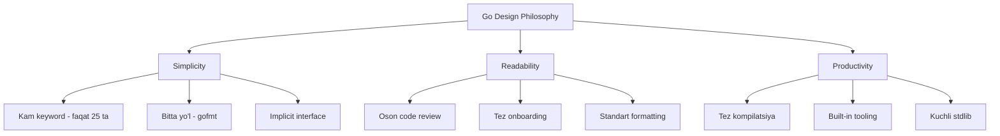
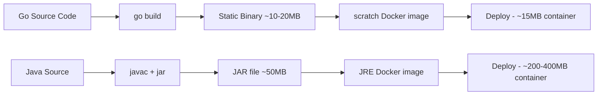
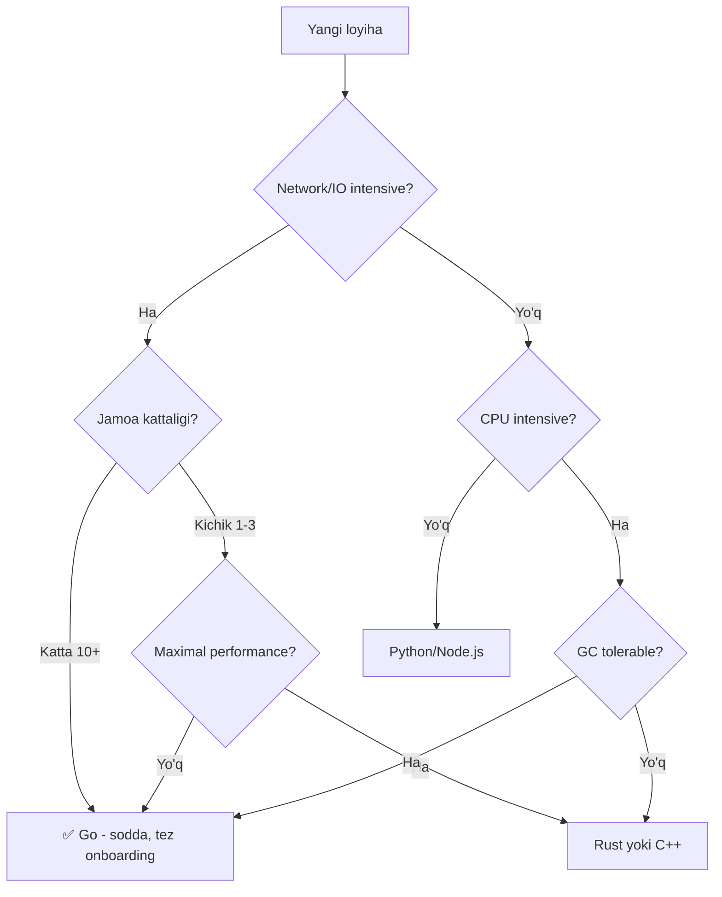
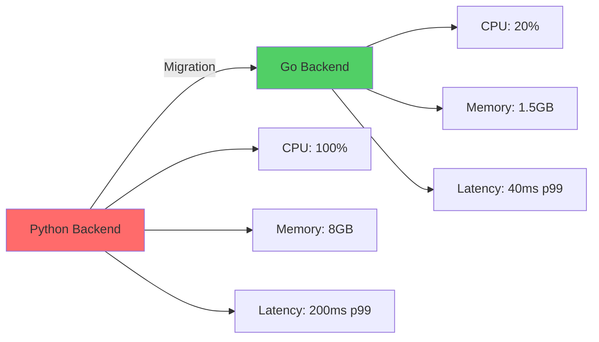
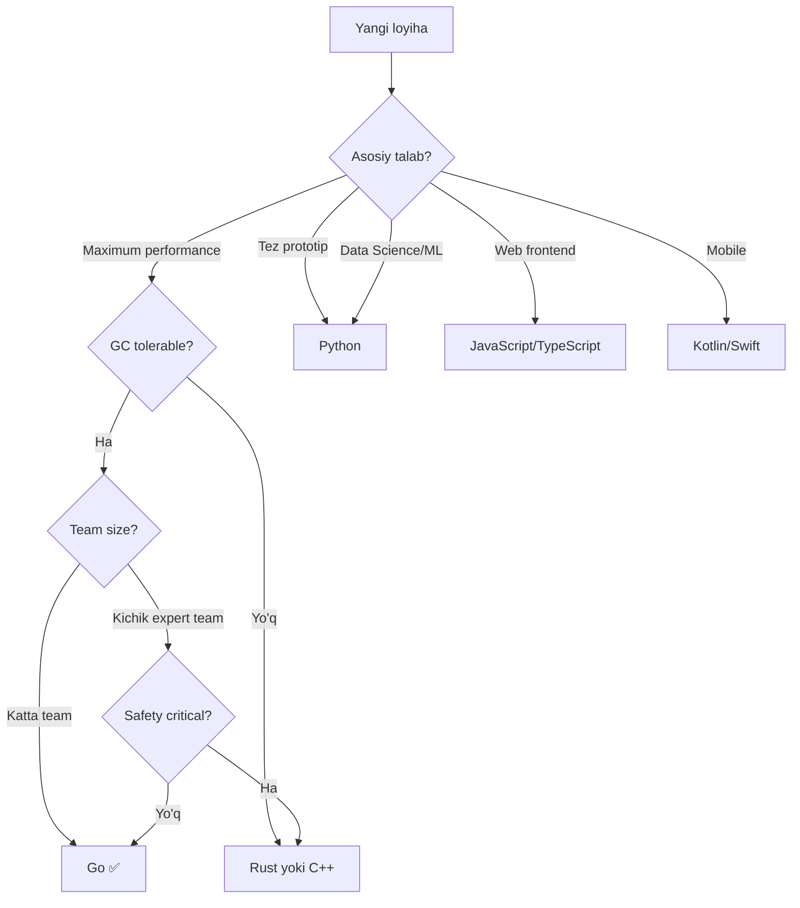
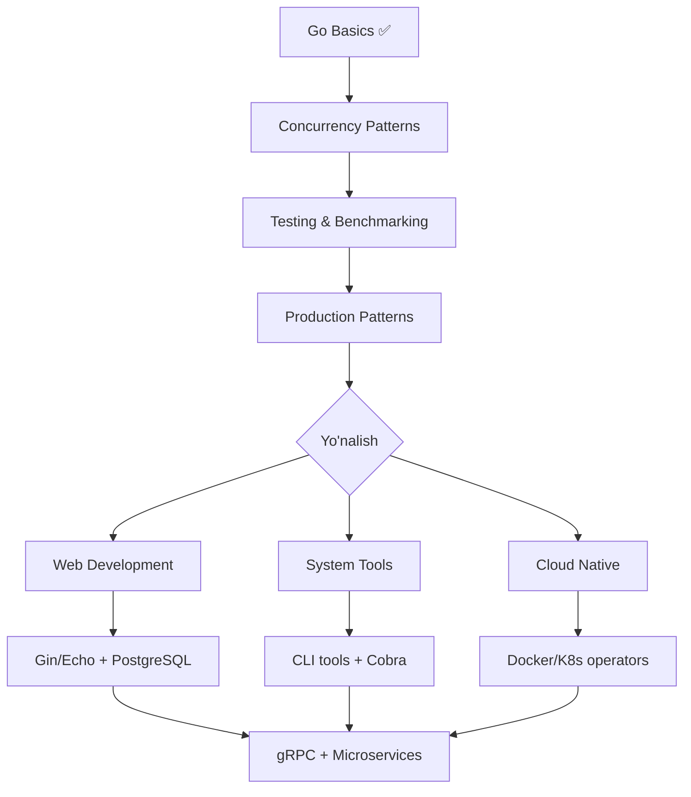

# Why Use Go — Middle Level

## Table of Contents
1. [Introduction](#introduction)
2. [Core Concepts](#core-concepts)
3. [Pros & Cons](#pros--cons)
4. [Use Cases](#use-cases)
5. [Code Examples](#code-examples)
6. [Product Use / Feature](#product-use--feature)
7. [Error Handling](#error-handling)
8. [Security Considerations](#security-considerations)
9. [Performance Optimization](#performance-optimization)
10. [Debugging Guide](#debugging-guide)
11. [Best Practices](#best-practices)
12. [Edge Cases & Pitfalls](#edge-cases--pitfalls)
13. [Common Mistakes](#common-mistakes)
14. [Tricky Points](#tricky-points)
15. [Comparison with Other Languages](#comparison-with-other-languages)
16. [Test](#test)
17. [Tricky Questions](#tricky-questions)
18. [Cheat Sheet](#cheat-sheet)
19. [Summary](#summary)
20. [What You Can Build](#what-you-can-build)
21. [Further Reading](#further-reading)
22. [Related Topics](#related-topics)

---

## 1. Introduction

Middle darajadagi dasturchi sifatida siz Go'ni tanlash **sabablarini** va **qachon** ishlatish kerakligini chuqurroq tushunishingiz kerak. Bu bo'limda biz Go'ni boshqa tillar bilan solishtramiz, real-world misollarni ko'rib chiqamiz va Go qachon eng yaxshi tanlov, qachon emas ekanligini tahlil qilamiz.

### Bu bo'limda nimalarni o'rganasiz:
- Go'ning **arxitektura qarorlariga** ta'siri
- Boshqa tillar bilan **chuqur taqqoslash**
- **Production** muhitda Go'ning kuchi va zaif tomonlari
- **Performance** va **concurrency** pattern'larini qo'llash
- Real kompaniyalarning **Go migration** tajribalari

---

## 2. Core Concepts

### 2.1 Go'ning Design Philosophy

Go'ning dizayn falsafasi uchta asosiy ustunda turadi:



### 2.2 Concurrency Model — CSP

Go **Communicating Sequential Processes (CSP)** modelini ishlatadi. Bu shared memory o'rniga **message passing** orqali ishlaydi.


**Asosiy tamoyil:**
> "Don't communicate by sharing memory; share memory by communicating." — Go proverb

```go
package main

import (
    "fmt"
    "sync"
)

func main() {
    // ❌ Shared memory (xavfli)
    // counter := 0
    // for i := 0; i < 1000; i++ { go func() { counter++ }() }

    // ✅ Channel orqali muloqot
    results := make(chan int, 100)
    var wg sync.WaitGroup

    for i := 0; i < 10; i++ {
        wg.Add(1)
        go func(id int) {
            defer wg.Done()
            results <- id * id
        }(i)
    }

    go func() {
        wg.Wait()
        close(results)
    }()

    sum := 0
    for r := range results {
        sum += r
    }
    fmt.Println("Jami:", sum) // 285
}
```

### 2.3 Static Binary va Deploy

Go statik binary yaratadi — bu microservices va container uchun ideal:



### 2.4 Garbage Collector Evolution

Go'ning GC har versiyada yaxshilangan:

| Go versiya | GC pause | Yaxshilanish |
|-----------|----------|-------------|
| Go 1.4 | 300ms+ | STW (Stop The World) |
| Go 1.5 | 10-40ms | Concurrent GC |
| Go 1.8 | <1ms | Sub-millisecond pauses |
| Go 1.12+ | <500μs | Better scheduling |
| Go 1.19+ | <100μs | Soft memory limit (GOMEMLIMIT) |

---

## 3. Pros & Cons

### Trade-off Analysis

| Xususiyat | Go ✅ | Go ❌ | Alternative |
|-----------|-------|-------|-------------|
| **Compilation** | 2-5 sek | — | Rust: 5-30 min |
| **Runtime performance** | C ga yaqin | GC pauzalar | Rust: GC yo'q |
| **Concurrency** | Goroutine (2KB) | Channel overhead | Erlang: actor model |
| **Type system** | Sodda, tez | Kam expressive | Haskell: kuchli type system |
| **Error handling** | Explicit | Verbose (if err) | Rust: Result<T,E> |
| **Ecosystem** | Yetarli | Python/JS dan kam | Python: eng katta ecosystem |
| **Learning curve** | 1-2 hafta | Feature limit | Go'ning kuchi |
| **Binary size** | 5-20MB | Python dan katta | Rust: 1-5MB |
| **Deploy** | Bitta fayl | — | Java: JRE kerak |
| **Generics** | Go 1.18+ (cheklangan) | Kam flexible | Rust/Java: to'liq generics |

### Qachon Go eng yaxshi tanlov



---

## 4. Use Cases

### Go eng kuchli bo'lgan sohalar

| Soha | Nima uchun Go | Real misol | Alternative |
|------|--------------|-----------|-------------|
| **API Gateway** | Yuqori throughput, kam latency | Kong, Traefik | NGINX (C), Envoy (C++) |
| **Microservices** | Kichik binary, tez start | gRPC services | Java Spring, Node.js |
| **CLI Tools** | Bitta binary, cross-platform | kubectl, gh, terraform | Python, Rust |
| **Data Pipeline** | Concurrency, streaming | Benthos, Go-streams | Apache Spark (Java/Scala) |
| **Infrastructure** | Reliability, networking | etcd, Consul, Vault | Erlang/Elixir |
| **Container Runtime** | Low-level system access | containerd, runc | C, Rust |

---

## 5. Code Examples

### 5.1 Worker Pool Pattern

```go
package main

import (
    "fmt"
    "sync"
    "time"
)

func worker(id int, jobs <-chan int, results chan<- int, wg *sync.WaitGroup) {
    defer wg.Done()
    for j := range jobs {
        fmt.Printf("Worker %d: job %d boshlandi\n", id, j)
        time.Sleep(100 * time.Millisecond) // Ish simulyatsiyasi
        results <- j * 2
        fmt.Printf("Worker %d: job %d tugadi\n", id, j)
    }
}

func main() {
    const numJobs = 10
    const numWorkers = 3

    jobs := make(chan int, numJobs)
    results := make(chan int, numJobs)

    var wg sync.WaitGroup

    // Worker'larni ishga tushirish
    for w := 1; w <= numWorkers; w++ {
        wg.Add(1)
        go worker(w, jobs, results, &wg)
    }

    // Job'larni yuborish
    for j := 1; j <= numJobs; j++ {
        jobs <- j
    }
    close(jobs)

    // Natijalarni yig'ish
    go func() {
        wg.Wait()
        close(results)
    }()

    total := 0
    for r := range results {
        total += r
    }
    fmt.Printf("Jami natija: %d\n", total) // 110
}
```

### 5.2 Graceful Shutdown

```go
package main

import (
    "context"
    "fmt"
    "net/http"
    "os"
    "os/signal"
    "syscall"
    "time"
)

func main() {
    mux := http.NewServeMux()
    mux.HandleFunc("/", func(w http.ResponseWriter, r *http.Request) {
        fmt.Fprintf(w, "Salom! Vaqt: %s", time.Now().Format(time.RFC3339))
    })

    server := &http.Server{
        Addr:         ":8080",
        Handler:      mux,
        ReadTimeout:  5 * time.Second,
        WriteTimeout: 10 * time.Second,
        IdleTimeout:  120 * time.Second,
    }

    // Server'ni goroutine'da ishga tushirish
    go func() {
        fmt.Println("Server :8080 da ishlayapti...")
        if err := server.ListenAndServe(); err != http.ErrServerClosed {
            fmt.Printf("Server xatosi: %v\n", err)
        }
    }()

    // Signal kutish
    quit := make(chan os.Signal, 1)
    signal.Notify(quit, syscall.SIGINT, syscall.SIGTERM)
    <-quit

    fmt.Println("\nServer to'xtamoqda...")

    // 30 sekundda graceful shutdown
    ctx, cancel := context.WithTimeout(context.Background(), 30*time.Second)
    defer cancel()

    if err := server.Shutdown(ctx); err != nil {
        fmt.Printf("Shutdown xatosi: %v\n", err)
    }
    fmt.Println("Server to'xtadi")
}
```

### 5.3 Fan-out / Fan-in Pattern

```go
package main

import (
    "fmt"
    "math/rand"
    "sync"
    "time"
)

// Fan-out: bitta source -> ko'p worker
func generate(nums ...int) <-chan int {
    out := make(chan int)
    go func() {
        for _, n := range nums {
            out <- n
        }
        close(out)
    }()
    return out
}

func square(in <-chan int) <-chan int {
    out := make(chan int)
    go func() {
        for n := range in {
            time.Sleep(time.Duration(rand.Intn(50)) * time.Millisecond)
            out <- n * n
        }
        close(out)
    }()
    return out
}

// Fan-in: ko'p channel -> bitta channel
func merge(channels ...<-chan int) <-chan int {
    var wg sync.WaitGroup
    merged := make(chan int)

    wg.Add(len(channels))
    for _, ch := range channels {
        go func(c <-chan int) {
            defer wg.Done()
            for v := range c {
                merged <- v
            }
        }(ch)
    }

    go func() {
        wg.Wait()
        close(merged)
    }()

    return merged
}

func main() {
    in := generate(1, 2, 3, 4, 5, 6, 7, 8)

    // Fan-out: 3 ta worker
    c1 := square(in)
    c2 := square(in)
    c3 := square(in)

    // Fan-in: natijalarni birlashtirish
    for result := range merge(c1, c2, c3) {
        fmt.Println(result)
    }
}
```

### 5.4 HTTP Middleware Pattern

```go
package main

import (
    "fmt"
    "log"
    "net/http"
    "time"
)

// Middleware type
type Middleware func(http.Handler) http.Handler

// Logging middleware
func loggingMiddleware(next http.Handler) http.Handler {
    return http.HandlerFunc(func(w http.ResponseWriter, r *http.Request) {
        start := time.Now()
        next.ServeHTTP(w, r)
        log.Printf("[%s] %s %s - %v", r.Method, r.URL.Path, r.RemoteAddr, time.Since(start))
    })
}

// Recovery middleware
func recoveryMiddleware(next http.Handler) http.Handler {
    return http.HandlerFunc(func(w http.ResponseWriter, r *http.Request) {
        defer func() {
            if err := recover(); err != nil {
                log.Printf("PANIC: %v", err)
                http.Error(w, "Internal Server Error", http.StatusInternalServerError)
            }
        }()
        next.ServeHTTP(w, r)
    })
}

// Chain middlewares
func chain(handler http.Handler, middlewares ...Middleware) http.Handler {
    for i := len(middlewares) - 1; i >= 0; i-- {
        handler = middlewares[i](handler)
    }
    return handler
}

func main() {
    helloHandler := http.HandlerFunc(func(w http.ResponseWriter, r *http.Request) {
        fmt.Fprintf(w, "Salom, Go middleware!")
    })

    wrapped := chain(helloHandler, loggingMiddleware, recoveryMiddleware)

    http.Handle("/", wrapped)
    fmt.Println("Server :8080 da ishlayapti...")
    log.Fatal(http.ListenAndServe(":8080", nil))
}
```

---

## 6. Product Use / Feature

### Go ishlatadigan kompaniyalar — masshtab bilan

| Kompaniya | Mahsulot | Scale | Nima uchun Go | Arxitektura |
|-----------|----------|-------|---------------|-------------|
| **Google** | dl.google.com, Kubernetes | Kuniga milliardlab so'rovlar | Concurrency, reliability | Microservices + gRPC |
| **Uber** | Geofence service | 1M+ so'rov/sek | Tez, kam latency (<5ms p99) | Microservices |
| **Twitch** | Video transcoding pipeline | Millionlab concurrent viewers | Concurrency, throughput | Distributed pipeline |
| **Cloudflare** | Edge computing, DNS | Dunyoning 20%+ traffic | Performance, memory efficiency | Distributed edge |
| **Dropbox** | Backend migration (Python → Go) | 500M+ foydalanuvchilar | 5x performance yaxshilanish | Monolith → microservices |
| **Docker** | Container runtime | Millionlab containerlar | System programming, networking | Container orchestration |
| **Kubernetes** | Container orchestration | 5M+ clusters (taxminiy) | Concurrency, plugin system | Distributed control plane |

### Dropbox Case Study



### Uber Case Study — Highest QPS Service

Uber'ning **geofence** service'i dunyodagi eng yuqori QPS (queries per second) serviceslardan biri:
- **100,000+** geofence'lar
- **1M+** so'rov/sekund
- **<5ms** p99 latency
- Go'ning in-memory data structures va goroutine'lari tufayli

---

## 7. Error Handling

### 7.1 Error Wrapping (Go 1.13+)

```go
package main

import (
    "errors"
    "fmt"
    "os"
)

// Custom error type
type FileError struct {
    Path    string
    Op      string
    Message string
}

func (e *FileError) Error() string {
    return fmt.Sprintf("%s failed for %s: %s", e.Op, e.Path, e.Message)
}

func readConfig(path string) ([]byte, error) {
    data, err := os.ReadFile(path)
    if err != nil {
        // Error wrapping — original xatoni saqlash
        return nil, fmt.Errorf("config o'qishda xato: %w", err)
    }
    return data, nil
}

func initApp() error {
    _, err := readConfig("/etc/myapp/config.json")
    if err != nil {
        return fmt.Errorf("app init xatosi: %w", err)
    }
    return nil
}

func main() {
    err := initApp()
    if err != nil {
        fmt.Println("Xato:", err)
        // Xato zanjiri: app init xatosi: config o'qishda xato: open /etc/myapp/config.json: no such file

        // Original xatoni topish
        var pathErr *os.PathError
        if errors.As(err, &pathErr) {
            fmt.Printf("Fayl topilmadi: %s\n", pathErr.Path)
        }

        // Specific error tekshirish
        if errors.Is(err, os.ErrNotExist) {
            fmt.Println("Fayl mavjud emas")
        }
    }
}
```

### 7.2 Sentinel Errors

```go
package main

import (
    "errors"
    "fmt"
)

// Sentinel errors — paket darajasidagi xatolar
var (
    ErrNotFound     = errors.New("not found")
    ErrUnauthorized = errors.New("unauthorized")
    ErrForbidden    = errors.New("forbidden")
    ErrInternal     = errors.New("internal error")
)

type UserService struct{}

func (s *UserService) GetUser(id int) (string, error) {
    if id <= 0 {
        return "", fmt.Errorf("user %d: %w", id, ErrNotFound)
    }
    if id == 999 {
        return "", fmt.Errorf("user %d: %w", id, ErrForbidden)
    }
    return "Ali", nil
}

func main() {
    svc := &UserService{}

    _, err := svc.GetUser(-1)
    if err != nil {
        switch {
        case errors.Is(err, ErrNotFound):
            fmt.Println("404: Foydalanuvchi topilmadi")
        case errors.Is(err, ErrForbidden):
            fmt.Println("403: Ruxsat yo'q")
        default:
            fmt.Println("500: Ichki xato")
        }
    }
}
```

### 7.3 Error Handling Pattern — Result Type

```go
package main

import "fmt"

// Go 1.18+ generics bilan Result type
type Result[T any] struct {
    Value T
    Err   error
}

func NewResult[T any](value T, err error) Result[T] {
    return Result[T]{Value: value, Err: err}
}

func (r Result[T]) Unwrap() (T, error) {
    return r.Value, r.Err
}

func divide(a, b float64) Result[float64] {
    if b == 0 {
        return NewResult(0.0, fmt.Errorf("nolga bo'lish mumkin emas"))
    }
    return NewResult(a/b, nil)
}

func main() {
    result := divide(10, 3)
    if val, err := result.Unwrap(); err != nil {
        fmt.Println("Xato:", err)
    } else {
        fmt.Printf("Natija: %.2f\n", val) // 3.33
    }

    result2 := divide(10, 0)
    if _, err := result2.Unwrap(); err != nil {
        fmt.Println("Xato:", err) // nolga bo'lish mumkin emas
    }
}
```

---

## 8. Security Considerations

### Risk Level Matrix

| Xavf | Darajasi | Hujum vektori | Go'da himoya |
|------|----------|--------------|-------------|
| **SQL Injection** | 🔴 Yuqori | User input → SQL query | Parametrized queries |
| **Path Traversal** | 🔴 Yuqori | `../../../etc/passwd` | `filepath.Clean()` |
| **Race Condition** | 🟡 O'rta | Concurrent goroutine | `sync.Mutex`, channels |
| **Memory leak** | 🟡 O'rta | Goroutine leak | Context cancellation |
| **DoS via Goroutine** | 🟡 O'rta | Cheksiz goroutine yaratish | Semaphore pattern |
| **Insecure random** | 🟡 O'rta | `math/rand` for crypto | `crypto/rand` ishlatish |

### Security Checklist

- [ ] `crypto/rand` ishlatish (math/rand emas) secret/token uchun
- [ ] `filepath.Clean()` barcha fayl yo'llarida
- [ ] `context.WithTimeout()` barcha network operatsiyalarda
- [ ] Rate limiting HTTP handler'larda
- [ ] Input validation barcha public API'larda
- [ ] HTTPS faqat production'da
- [ ] Dependency scanning (`govulncheck`)

### Goroutine Leak Prevention

```go
package main

import (
    "context"
    "fmt"
    "time"
)

// ❌ Xavfli: goroutine leak
func leakyFunction() {
    ch := make(chan int)
    go func() {
        // Bu goroutine abadiy kutadi!
        val := <-ch
        fmt.Println(val)
    }()
    // ch ga hech narsa yuborilmaydi, goroutine leak bo'ladi
}

// ✅ Xavfsiz: context bilan goroutine boshqaruvi
func safeFunction() {
    ctx, cancel := context.WithTimeout(context.Background(), 2*time.Second)
    defer cancel()

    ch := make(chan int, 1)

    go func() {
        // Og'ir ish simulyatsiyasi
        time.Sleep(1 * time.Second)
        ch <- 42
    }()

    select {
    case val := <-ch:
        fmt.Println("Natija:", val)
    case <-ctx.Done():
        fmt.Println("Timeout:", ctx.Err())
    }
}

func main() {
    safeFunction()
}
```

### Secure Random Generation

```go
package main

import (
    "crypto/rand"
    "encoding/hex"
    "fmt"
)

// ❌ Xavfli: math/rand — predictable
// import "math/rand"
// token := fmt.Sprintf("%d", rand.Int())

// ✅ Xavfsiz: crypto/rand — cryptographically secure
func generateToken(length int) (string, error) {
    bytes := make([]byte, length)
    if _, err := rand.Read(bytes); err != nil {
        return "", fmt.Errorf("random generation xatosi: %w", err)
    }
    return hex.EncodeToString(bytes), nil
}

func main() {
    token, err := generateToken(32)
    if err != nil {
        fmt.Println("Xato:", err)
        return
    }
    fmt.Println("Xavfsiz token:", token)
}
```

---

## 9. Performance Optimization

### Benchmark Framework

```go
package main

import (
    "fmt"
    "strings"
    "time"
)

func concatPlus(n int) string {
    s := ""
    for i := 0; i < n; i++ {
        s += "x"
    }
    return s
}

func concatBuilder(n int) string {
    var b strings.Builder
    b.Grow(n)
    for i := 0; i < n; i++ {
        b.WriteString("x")
    }
    return b.String()
}

func benchmark(name string, fn func(int) string, n int) {
    start := time.Now()
    _ = fn(n)
    elapsed := time.Since(start)
    fmt.Printf("%-20s: %v\n", name, elapsed)
}

func main() {
    n := 100000
    fmt.Printf("String concatenation benchmark (n=%d):\n", n)
    benchmark("String +", concatPlus, n)
    benchmark("strings.Builder", concatBuilder, n)
}
```

**Taxminiy natija:**
```
String concatenation benchmark (n=100000):
String +            : 1.2s
strings.Builder     : 800μs
```

### Performance Decision Matrix

| Muammo | Yechim | Improvement | Qachon ishlatish |
|--------|--------|-------------|-----------------|
| **String concat** | `strings.Builder` | 100-1000x | Siklda string birlashtirish |
| **Slice growth** | `make([]T, 0, cap)` | 2-5x | Size oldindan ma'lum bo'lganda |
| **Map resize** | `make(map[K]V, hint)` | 1.5-3x | Size taxminiy ma'lum bo'lganda |
| **Struct copy** | Pointer ishlatish | 2-10x | >64 byte struct |
| **Sync pool** | `sync.Pool` | 5-50x | Ko'p allocate/free |
| **Buffer reuse** | `bytes.Buffer` pool | 3-10x | HTTP handler'larda |
| **JSON parsing** | `json.Decoder` (stream) | 2-5x mem | Katta JSON fayllar |
| **Goroutine limit** | Worker pool | Memory saving | Ko'p concurrent task |

### sync.Pool Example

```go
package main

import (
    "bytes"
    "fmt"
    "sync"
)

var bufferPool = sync.Pool{
    New: func() interface{} {
        return new(bytes.Buffer)
    },
}

func processRequest(data string) string {
    buf := bufferPool.Get().(*bytes.Buffer)
    defer func() {
        buf.Reset()
        bufferPool.Put(buf)
    }()

    buf.WriteString("Processed: ")
    buf.WriteString(data)
    return buf.String()
}

func main() {
    results := make([]string, 10)
    var wg sync.WaitGroup

    for i := 0; i < 10; i++ {
        wg.Add(1)
        go func(id int) {
            defer wg.Done()
            results[id] = processRequest(fmt.Sprintf("request-%d", id))
        }(i)
    }

    wg.Wait()
    for _, r := range results {
        fmt.Println(r)
    }
}
```

---

## 10. Debugging Guide

### Scenario 1: Goroutine Leak Detection

**Belgilari:** Memory asta-sekin o'sib boradi, dastur sekinlashadi.

**Diagnostika:**

```go
package main

import (
    "fmt"
    "net/http"
    _ "net/http/pprof" // pprof endpoint'larni qo'shadi
    "runtime"
    "time"
)

func main() {
    // pprof server
    go func() {
        fmt.Println("pprof: http://localhost:6060/debug/pprof/")
        http.ListenAndServe(":6060", nil)
    }()

    // Goroutine sonini monitoring
    go func() {
        for {
            fmt.Printf("Goroutine count: %d\n", runtime.NumGoroutine())
            time.Sleep(2 * time.Second)
        }
    }()

    // Muammoli kod simulyatsiyasi
    for i := 0; i < 100; i++ {
        ch := make(chan int) // unbuffered, hech kim o'qimaydi
        go func() {
            ch <- 1 // bu yerda block bo'ladi — LEAK!
        }()
    }

    time.Sleep(10 * time.Second)
}
```

**Terminal buyruqlari:**
```bash
# Goroutine dump
go tool pprof http://localhost:6060/debug/pprof/goroutine

# Heap profiling
go tool pprof http://localhost:6060/debug/pprof/heap

# Race condition detection
go run -race main.go
```

### Scenario 2: Slow HTTP Response

**Belgilari:** API response vaqti oshib boradi.

**Diagnostika:**
```bash
# CPU profiling
go tool pprof -http=:8081 http://localhost:6060/debug/pprof/profile?seconds=30

# Trace
curl -o trace.out http://localhost:6060/debug/pprof/trace?seconds=5
go tool trace trace.out
```

### Scenario 3: High Memory Usage

**Belgilari:** OOM killer dasturni o'ldiradi.

**Diagnostika:**
```bash
# Heap profiling
go tool pprof http://localhost:6060/debug/pprof/heap

# GOMEMLIMIT o'rnatish (Go 1.19+)
GOMEMLIMIT=512MiB ./myapp
```

### Debugging Tools

| Tool | Maqsad | Buyruq |
|------|--------|--------|
| `go tool pprof` | CPU/Memory profiling | `go tool pprof -http=:8081 cpu.prof` |
| `go tool trace` | Execution tracing | `go tool trace trace.out` |
| `dlv` (Delve) | Interactive debugger | `dlv debug main.go` |
| `-race` flag | Race condition detection | `go run -race main.go` |
| `runtime.NumGoroutine()` | Goroutine leak detection | Monitoring loop |
| `net/http/pprof` | HTTP profiling endpoints | Import qilish kifoya |

---

## 11. Best Practices

### 11.1 Project Structure

```
myproject/
├── cmd/
│   └── server/
│       └── main.go          # Entry point
├── internal/
│   ├── handler/              # HTTP handlers
│   ├── service/              # Business logic
│   ├── repository/           # Data access
│   └── model/                # Data models
├── pkg/                      # Reusable packages
├── api/                      # API definitions (proto, swagger)
├── configs/                  # Configuration files
├── go.mod
├── go.sum
└── Makefile
```

### 11.2 Interface Design

```go
// ✅ Kichik interface — Go idiom
type Reader interface {
    Read(p []byte) (n int, err error)
}

type Writer interface {
    Write(p []byte) (n int, err error)
}

// ❌ Katta interface — anti-pattern
type MegaInterface interface {
    Read() error
    Write() error
    Delete() error
    Update() error
    List() error
    // ... 20 ta method
}
```

### 11.3 Dependency Injection

```go
package main

import "fmt"

// Interface — abstraction
type UserRepository interface {
    GetByID(id int) (string, error)
}

// Concrete implementation
type PostgresUserRepo struct{}

func (r *PostgresUserRepo) GetByID(id int) (string, error) {
    return fmt.Sprintf("User_%d", id), nil
}

// Service — interface ga bog'langan (concrete emas)
type UserService struct {
    repo UserRepository // Interface, implementation emas
}

func NewUserService(repo UserRepository) *UserService {
    return &UserService{repo: repo}
}

func (s *UserService) GetUser(id int) (string, error) {
    return s.repo.GetByID(id)
}

func main() {
    repo := &PostgresUserRepo{}
    service := NewUserService(repo)
    user, _ := service.GetUser(1)
    fmt.Println(user) // User_1
}
```

---

## 12. Edge Cases & Pitfalls

### 12.1 Nil Map Write Panic

```go
package main

import "fmt"

func main() {
    // ❌ Nil map ga yozish — PANIC!
    // var m map[string]int
    // m["key"] = 1 // panic: assignment to entry in nil map

    // ✅ Map ni initialize qilish
    m := make(map[string]int)
    m["key"] = 1
    fmt.Println(m["key"])

    // ✅ Nil map dan o'qish xavfsiz
    var m2 map[string]int
    fmt.Println(m2["key"]) // 0 (zero value)
    fmt.Println(len(m2))   // 0
}
```

### 12.2 Slice Header Trap

```go
package main

import "fmt"

func main() {
    original := []int{1, 2, 3, 4, 5}
    slice := original[1:3] // [2, 3]

    // ⚠️ slice o'zgarsa, original ham o'zgaradi!
    slice[0] = 999
    fmt.Println(original) // [1, 999, 3, 4, 5]

    // ✅ Mustaqil kopiya
    independent := make([]int, len(original[1:3]))
    copy(independent, original[1:3])
    independent[0] = 888
    fmt.Println(original) // [1, 999, 3, 4, 5] — o'zgarmadi
}
```

### 12.3 defer Evaluation Timing

```go
package main

import "fmt"

func main() {
    x := 10
    defer fmt.Println("defer:", x) // x HOZIR evaluate bo'ladi = 10
    x = 20
    fmt.Println("normal:", x) // 20
    // Output: normal: 20, defer: 10
}
```

---

## 13. Common Mistakes

### 13.1 Range Variable Reference

```go
package main

import "fmt"

type User struct {
    Name string
}

func main() {
    users := []User{{"Ali"}, {"Vali"}, {"Gani"}}

    // ❌ Go 1.21 va undan oldin: barcha pointer'lar oxirgi elementga
    // Go 1.22+ da bu muammo hal qilingan
    var ptrs []*User
    for _, u := range users {
        ptrs = append(ptrs, &u) // Go <1.22: hamma &u bir xil address
    }

    // ✅ Index ishlatish (barcha Go versiyalar uchun xavfsiz)
    var safePtrs []*User
    for i := range users {
        safePtrs = append(safePtrs, &users[i])
    }

    for _, p := range safePtrs {
        fmt.Println(p.Name)
    }
}
```

### 13.2 Mutex Copy

```go
package main

import (
    "fmt"
    "sync"
)

type SafeCounter struct {
    mu    sync.Mutex
    count int
}

// ❌ Value receiver — mutex copy bo'ladi!
// func (c SafeCounter) GetCount() int {
//     c.mu.Lock()
//     defer c.mu.Unlock()
//     return c.count
// }

// ✅ Pointer receiver — mutex copy bo'lmaydi
func (c *SafeCounter) GetCount() int {
    c.mu.Lock()
    defer c.mu.Unlock()
    return c.count
}

func (c *SafeCounter) Increment() {
    c.mu.Lock()
    defer c.mu.Unlock()
    c.count++
}

func main() {
    c := &SafeCounter{}
    var wg sync.WaitGroup
    for i := 0; i < 1000; i++ {
        wg.Add(1)
        go func() {
            defer wg.Done()
            c.Increment()
        }()
    }
    wg.Wait()
    fmt.Println("Count:", c.GetCount()) // 1000
}
```

---

## 14. Tricky Points

### 14.1 Interface Satisfaction — Implicit

Go'da interface **explicit** implement qilinmaydi. Agar struct barcha method'larga ega bo'lsa — interface'ni satisfy qiladi.

```go
package main

import "fmt"

type Speaker interface {
    Speak() string
}

type Dog struct{}

func (d Dog) Speak() string { return "Hov!" }

// Dog avtomatik Speaker interface'ni satisfy qiladi
// Hech qanday "implements" keyword kerak emas

func main() {
    var s Speaker = Dog{}
    fmt.Println(s.Speak()) // Hov!
}
```

### 14.2 Zero Values

Go'da barcha o'zgaruvchilar **zero value** bilan boshlanadi:

| Tip | Zero Value |
|-----|-----------|
| `int`, `float64` | `0` |
| `string` | `""` (bo'sh string) |
| `bool` | `false` |
| `pointer` | `nil` |
| `slice`, `map`, `channel` | `nil` |
| `struct` | Barcha field'lar zero value |

### 14.3 Embedding vs Inheritance

```go
package main

import "fmt"

// Go'da inheritance yo'q, lekin embedding bor
type Animal struct {
    Name string
}

func (a Animal) String() string {
    return a.Name
}

type Dog struct {
    Animal // Embedding — Animal ning barcha method'lari Dog'ga "ko'tariladi"
    Breed  string
}

func main() {
    d := Dog{
        Animal: Animal{Name: "Rex"},
        Breed:  "German Shepherd",
    }
    fmt.Println(d.String()) // "Rex" — Animal.String() chaqiriladi
    fmt.Println(d.Name)     // "Rex" — to'g'ridan-to'g'ri access
    fmt.Println(d.Breed)    // "German Shepherd"
}
```

---

## 15. Comparison with Other Languages

### To'liq taqqoslash jadvali

| Xususiyat | Go | Python | Java | Rust | C++ | Node.js |
|-----------|----|----|------|------|-----|---------|
| **Tip tizimi** | Static | Dynamic | Static | Static | Static | Dynamic |
| **Kompilatsiya** | Native binary | Interpreted | JVM bytecode | Native binary | Native binary | JIT (V8) |
| **Kompilatsiya tezligi** | 2-5 sek | — | 10-60 sek | 5-30 min | 2-10 min | — |
| **Runtime performance** | ~1.5x C | ~50-100x C | ~2-3x C | ~1x C | ~1x C | ~5-10x C |
| **Memory management** | GC | GC | GC | Ownership | Manual | GC |
| **Concurrency** | Goroutine | asyncio/threading | Thread/Virtual Thread | async/thread | Thread | Event loop |
| **Error handling** | `if err != nil` | try/except | try/catch | `Result<T,E>` | try/catch/exception | try/catch |
| **Learning curve** | 1-2 hafta | 1-3 kun | 2-4 hafta | 1-3 oy | 2-6 oy | 1-2 hafta |
| **Binary hajmi** | 5-20 MB | — (interpreter) | JRE kerak | 1-5 MB | 1-10 MB | — (runtime) |
| **Startup vaqti** | ~5ms | ~100ms | ~500ms-2s | ~5ms | ~5ms | ~30ms |
| **Generics** | Go 1.18+ (oddiy) | Duck typing | To'liq | To'liq | To'liq (murakkab) | — |

### Qachon qaysi tilni tanlash kerak



### Go vs Python — Detailed

| Aspect | Go | Python |
|--------|-----|--------|
| **Uchun yaxshi** | Backend, CLI, infra | ML, scripting, prototip |
| **Concurrency** | Goroutine (millionlab) | GIL — true parallelism yo'q |
| **Tezlik** | 50-100x tezroq | Oson yozish, sekin ishlash |
| **Deploy** | Bitta binary | pip + virtualenv + interpreter |
| **Typing** | Compile-time | Runtime (mypy bilan optional) |

### Go vs Rust — Detailed

| Aspect | Go | Rust |
|--------|-----|------|
| **Uchun yaxshi** | Network services, CLI | System programming, embedded |
| **Memory** | GC bilan | Ownership model — GC yo'q |
| **Safety** | Race detector (runtime) | Compile-time safety |
| **Learning** | 1-2 hafta | 1-3 oy |
| **Compile time** | Sekundlar | Minutlar |
| **Ecosystem** | Yetarli | O'sib bormoqda |

---

## 16. Test

### Savol 1
Go'ning CSP modeli nimani anglatadi?
- A) Client-Server Protocol
- B) Communicating Sequential Processes
- C) Concurrent System Programming
- D) Common Security Pattern

<details><summary>Javob</summary>B) Communicating Sequential Processes — shared memory o'rniga message passing (channel) orqali muloqot.</details>

### Savol 2
Dropbox Python'dan Go'ga o'tganda performance qancha yaxshilangan?
- A) 2x
- B) 3x
- C) 5x
- D) 10x

<details><summary>Javob</summary>C) ~5x — CPU 100% dan 20% ga tushgan, memory 8GB dan 1.5GB ga, latency 200ms dan 40ms ga.</details>

### Savol 3
Go'da goroutine leak oldini olish uchun nima ishlatiladi?
- A) `try/finally`
- B) `context.WithTimeout()`
- C) `os.Exit()`
- D) `runtime.GC()`

<details><summary>Javob</summary>B) `context.WithTimeout()` — goroutine'ga timeout beradi, vaqt tugaganda cancel bo'ladi.</details>

### Savol 4
Go'da race condition aniqlash uchun qaysi flag ishlatiladi?
- A) `-debug`
- B) `-race`
- C) `-check`
- D) `-safe`

<details><summary>Javob</summary>B) `-race` — `go run -race main.go` yoki `go test -race ./...`</details>

### Savol 5
Go'da nil map dan o'qish nima beradi?
- A) Panic
- B) Compilation error
- C) Zero value
- D) nil

<details><summary>Javob</summary>C) Zero value — nil map dan o'qish xavfsiz, lekin yozish PANIC beradi.</details>

### Savol 6
Go vs Rust — qaysi biri tezroq kompilyatsiya qiladi?
- A) Rust
- B) Go
- C) Teng
- D) Loyihaga bog'liq

<details><summary>Javob</summary>B) Go — sekundlar vs minutlar. Go ataylab tez kompilatsiya uchun optimallashtirilgan.</details>

### Savol 7
`sync.Pool` nima uchun ishlatiladi?
- A) Goroutine boshqarish
- B) Object reuse — allocation kamaytirish
- C) Database connection pool
- D) Thread pool

<details><summary>Javob</summary>B) Object reuse — tez-tez allocate/free bo'ladigan ob'ektlarni qayta ishlatish. GC pressure kamayadi.</details>

### Savol 8
Go'da interface satisfaction qanday bo'ladi?
- A) `implements` keyword bilan
- B) `extends` keyword bilan
- C) Implicit — barcha method'lar mavjud bo'lsa
- D) `@Override` annotation bilan

<details><summary>Javob</summary>C) Implicit — Go'da struct barcha method'larga ega bo'lsa, interface'ni avtomatik satisfy qiladi. Hech qanday keyword kerak emas.</details>

### Savol 9
Worker pool patternda goroutine sonini cheklash uchun nima ishlatiladi?
- A) `runtime.GOMAXPROCS()`
- B) Fixed number of workers + channel
- C) `sync.Once`
- D) `context.Background()`

<details><summary>Javob</summary>B) Fixed number of workers + channel — oldindan belgilangan sondagi worker goroutine'lar jobs channel'dan o'qiydi. Bu goroutine bombarding oldini oladi.</details>

### Savol 10
Go'ning GC pause vaqti (Go 1.19+) taxminan qancha?
- A) 10-50ms
- B) 1-5ms
- C) <100 microsekund
- D) 500ms+

<details><summary>Javob</summary>C) <100 microsekund — Go GC har versiyada yaxshilangan, hozir sub-millisecond pause'lar bilan ishlaydi.</details>

---

## 17. Tricky Questions

### Savol 1: Go'da exception handling kerakmi? try/catch nima uchun yo'q?

<details><summary>Javob</summary>

Go dizaynerlari exception handling ni muammoli deb hisoblashdi:

1. **Invisible control flow** — try/catch kodning execution flow'ini yashiradi
2. **Exception safety** — ko'p dasturchilar exception safe kod yozolmaydi
3. **Performance overhead** — exception throw qimmat operatsiya
4. **Go'ning yondashuvi** — error oddiy qiymat sifatida qaytariladi

```go
// Go: Error qayerda yuz berganini aniq ko'rish mumkin
result, err := doSomething()
if err != nil {
    return fmt.Errorf("doSomething failed: %w", err)
}
```

Go'da `panic/recover` mavjud, lekin bu faqat **dastur davom eta olmaydigan** holatlar uchun (masalan, nil pointer dereference).
</details>

### Savol 2: Go'da generics yo'qligi (Go 1.18 gacha) qanday muammolar yaratgan?

<details><summary>Javob</summary>

Generics yo'qligida quyidagi muammolar bor edi:

1. **interface{} everywhere** — type safety yo'qolardi
2. **Code generation** — `go generate` bilan turli tiplar uchun bir xil kod yaratilardi
3. **Copy-paste** — `MaxInt`, `MaxFloat64`, `MaxString` alohida yozilardi
4. **Sort interface** — `sort.Interface` 3 ta method talab qilardi

Go 1.18 bilan hal bo'ldi:
```go
func Max[T constraints.Ordered](a, b T) T {
    if a > b {
        return a
    }
    return b
}
```

Lekin Go'ning generics Rust/Haskell darajasida emas — ataylab sodda qilingan.
</details>

### Savol 3: `GOMAXPROCS` nima va qanday ta'sir qiladi?

<details><summary>Javob</summary>

`GOMAXPROCS` — bir vaqtda ishlashi mumkin bo'lgan OS thread'lar soni.

- Default: `runtime.NumCPU()` (CPU yadrolari soni)
- Goroutine'lar soni cheklanmagan, lekin OS thread'lar soni cheklangan
- GMP model: **G**oroutine → **M** (OS thread) → **P** (Processor)

```go
runtime.GOMAXPROCS(4) // 4 ta OS thread
```

Qachon o'zgartirish kerak:
- Ko'pincha **o'zgartirmang** — default yaxshi ishlaydi
- Container'da: CPU limit'ga qarab sozlash (`uber-go/automaxprocs`)
- I/O intensive: ko'proq qo'yish mumkin
</details>

### Savol 4: Go binary nima uchun katta (5-20MB)?

<details><summary>Javob</summary>

Go binary katta bo'lishining sabablari:

1. **Static linking** — barcha dependency'lar binary ichida
2. **Go runtime** — GC, scheduler, networking (~2-3MB)
3. **Debug info** — default'da DWARF debug ma'lumotlari
4. **Reflection data** — type metadata

Kichiklashtirish usullari:
```bash
# Debug info olib tashlash
go build -ldflags="-s -w" -o myapp

# UPX compression
upx --best myapp

# Natija: 20MB → 5-7MB → 2-3MB
```
</details>

### Savol 5: Go'da memory leak bo'lishi mumkinmi? GC bor-ku?

<details><summary>Javob</summary>

Ha! GC bor bo'lsa ham, Go'da memory leak bo'lishi mumkin:

1. **Goroutine leak** — blocked goroutine'lar GC tomonidan yig'ilmaydi
2. **Slice header** — katta slice'dan kichik qism olsangiz, asl massiv GC qilinmaydi
3. **Global variables** — global map/slice o'sib borsa
4. **time.Ticker** — `Stop()` chaqirilmasa
5. **Finalizer loop** — `runtime.SetFinalizer` noto'g'ri ishlatilsa

```go
// Goroutine leak
go func() {
    <-ch // hech kim yubormasa — bu goroutine abadiy qoladi
}()

// Slice memory retention
big := make([]byte, 1<<20) // 1MB
small := big[:10]           // 10 byte ishlatamiz, 1MB memory band
```
</details>

### Savol 6: Go'ning dependency management tarixi va hozirgi holati qanday?

<details><summary>Javob</summary>

Go'ning dependency management evolyutsiyasi:

| Davr | Tool | Muammolar |
|------|------|----------|
| 2009-2015 | `GOPATH` | Versiya boshqaruv yo'q |
| 2015-2017 | `godep`, `glide` | Rasmiy emas |
| 2017-2018 | `dep` | Rasmiy eksperiment |
| 2018+ | **Go Modules** | Rasmiy, standart |

Go Modules (hozirgi standart):
```bash
go mod init github.com/user/project  # Modul yaratish
go get github.com/gin-gonic/gin      # Paket qo'shish
go mod tidy                           # Keraksizlarni o'chirish
go mod vendor                         # Vendor papka
```

Afzalliklari: semantic versioning, checksum database, proxy support.
</details>

---

## 18. Cheat Sheet

### Decision Matrix: Go vs Alternatives

| Scenario | Go | Python | Java | Rust | Node.js |
|----------|:--:|:------:|:----:|:----:|:-------:|
| REST API backend | ⭐⭐⭐ | ⭐⭐ | ⭐⭐⭐ | ⭐⭐ | ⭐⭐⭐ |
| Microservices | ⭐⭐⭐ | ⭐⭐ | ⭐⭐ | ⭐⭐ | ⭐⭐ |
| CLI tools | ⭐⭐⭐ | ⭐⭐ | ⭐ | ⭐⭐⭐ | ⭐ |
| System programming | ⭐⭐ | ⭐ | ⭐ | ⭐⭐⭐ | ⭐ |
| Data pipeline | ⭐⭐⭐ | ⭐⭐ | ⭐⭐ | ⭐⭐ | ⭐⭐ |
| DevOps tooling | ⭐⭐⭐ | ⭐⭐ | ⭐ | ⭐⭐ | ⭐ |
| Machine Learning | ⭐ | ⭐⭐⭐ | ⭐⭐ | ⭐ | ⭐ |
| Mobile app | ⭐ | ⭐ | ⭐⭐ | ⭐ | ⭐⭐ |
| Real-time systems | ⭐⭐ | ⭐ | ⭐⭐ | ⭐⭐⭐ | ⭐ |
| Web frontend | ⭐ | ⭐ | ⭐ | ⭐⭐ | ⭐⭐⭐ |

### Quick Reference

| Nima | Buyruq / Pattern | Izoh |
|------|-----------------|------|
| **Race detection** | `go run -race main.go` | Data race topish |
| **Profiling** | `import _ "net/http/pprof"` | CPU/Memory profiling |
| **Benchmark** | `func BenchmarkX(b *testing.B)` | Performance o'lchash |
| **Build optimization** | `go build -ldflags="-s -w"` | Binary hajmini kamaytirish |
| **Cross-compile** | `GOOS=linux GOARCH=amd64 go build` | Boshqa OS uchun build |
| **Vendor** | `go mod vendor` | Dependency'larni loyihaga qo'shish |
| **Vulnerability check** | `govulncheck ./...` | Xavfsizlik tekshiruvi |
| **Code generation** | `go generate ./...` | Kod generatsiya qilish |
| **Test coverage** | `go test -cover ./...` | Test qamrovi |
| **Linting** | `golangci-lint run` | Kod sifatini tekshirish |

---

## 19. Summary

### Asosiy xulosalar:

1. **Go'ni tanlash sababi** — soddalik, tezlik, concurrency va production reliability
2. **CSP modeli** — shared memory o'rniga channel orqali muloqot (race condition kamayadi)
3. **Static binary** — deploy, container va microservices uchun ideal
4. **GC evolution** — sub-millisecond pauses bilan production-ready
5. **Trade-offs** — Go sodda va tez, lekin Rust darajasida flexible emas
6. **Real companies** — Google, Uber, Docker, Dropbox — hammasi production'da Go ishlatadi
7. **Qachon Go emas** — ML, mobile, frontend, safety-critical systems
8. **Debugging** — pprof, race detector, delve — production-grade tooling

### Bir gapda:

> Go — bu **katta jamoalar** uchun **production backend** yozishning eng **samarali** yo'li.

---

## 20. What You Can Build

### O'rta darajadagi loyihalar

| # | Loyiha | Texnologiyalar | Qiyinlik |
|---|--------|---------------|----------|
| 1 | REST API with middleware | `net/http`, middleware chain, JSON | O'rta |
| 2 | Worker pool service | Goroutine, channel, sync.WaitGroup | O'rta |
| 3 | CLI file manager | `cobra`, `os`, `filepath` | O'rta |
| 4 | Real-time chat (WebSocket) | `gorilla/websocket`, goroutine | O'rta+ |
| 5 | URL monitoring service | `net/http`, `time.Ticker`, concurrent checks | O'rta |
| 6 | Key-Value store | `sync.RWMutex`, map, HTTP API | Yuqori |

### O'rganish yo'li



---

## 21. Further Reading

| # | Resurs | Turi | Havola |
|---|--------|------|--------|
| 1 | **Go Concurrency Patterns** | Google I/O talk | https://go.dev/blog/pipelines |
| 2 | **Effective Go** | Rasmiy guide | https://go.dev/doc/effective_go |
| 3 | **Go Proverbs** | Rob Pike talk | https://go-proverbs.github.io |
| 4 | **Go Performance Book** | Dave Cheney | https://dave.cheney.net/high-performance-go-workshop/gophercon-2019.html |
| 5 | **Uber Go Style Guide** | Uber Engineering | https://github.com/uber-go/guide |

---

## 22. Related Topics

| Mavzu | Havola | Nima uchun kerak |
|-------|--------|-----------------|
| Go Installation & Setup | [../02-go-installation-and-setup/](../02-go-installation-and-setup/) | Go muhitini sozlash |
| Go Workspace | [../03-go-workspace/](../03-go-workspace/) | Loyiha strukturasini bilish |
| Go Modules | [../05-go-modules/](../05-go-modules/) | Dependency management |
| Go Tooling | [../06-go-tooling/](../06-go-tooling/) | go build, go test, go vet |
