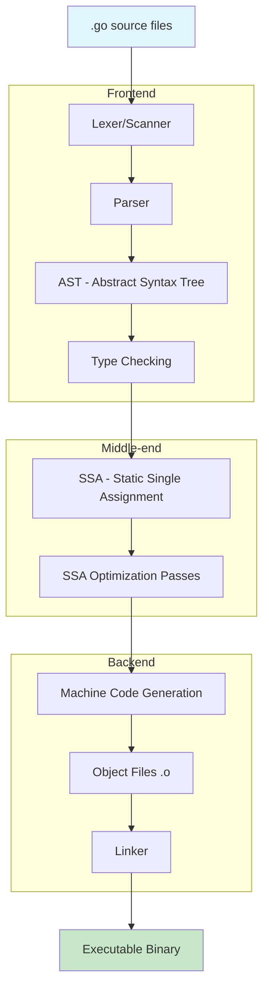
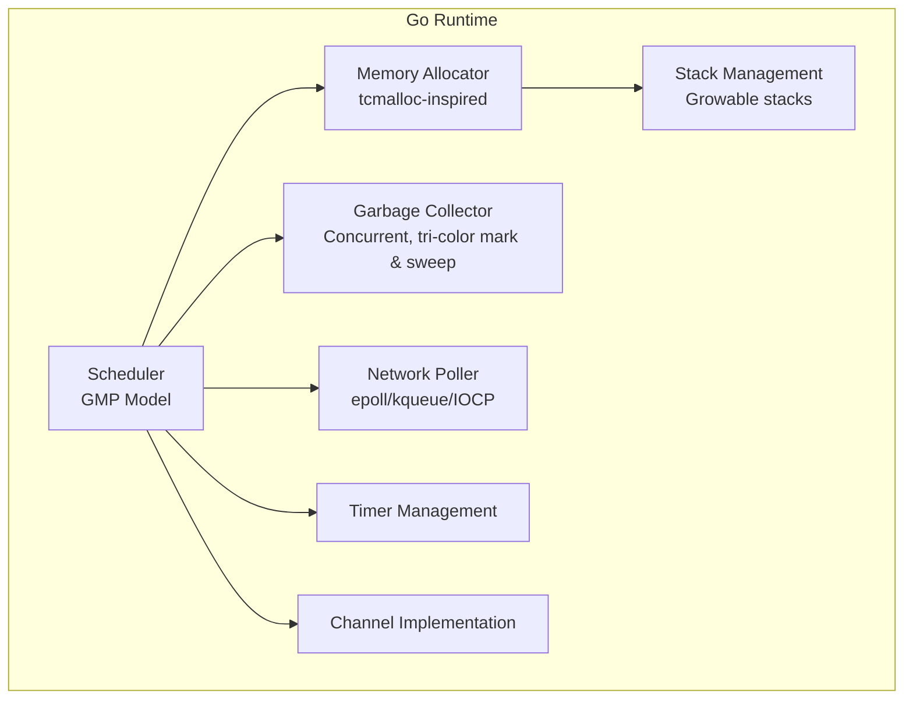
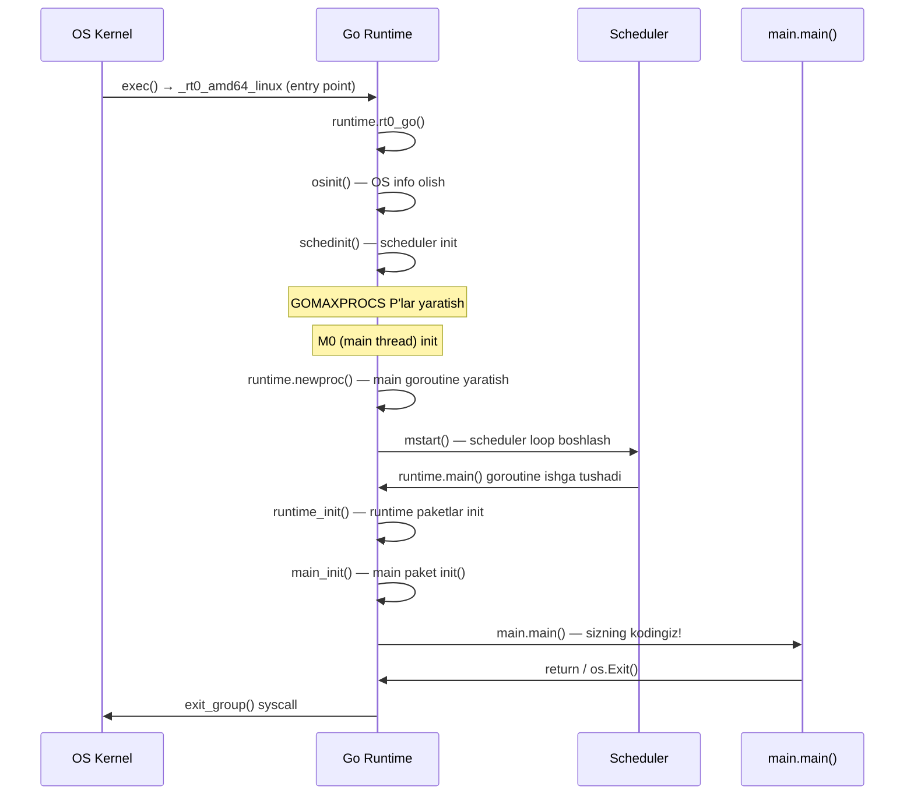
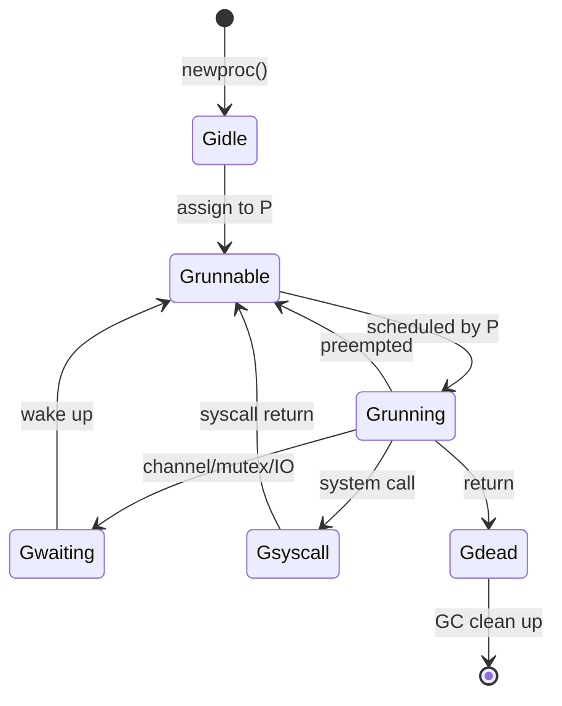
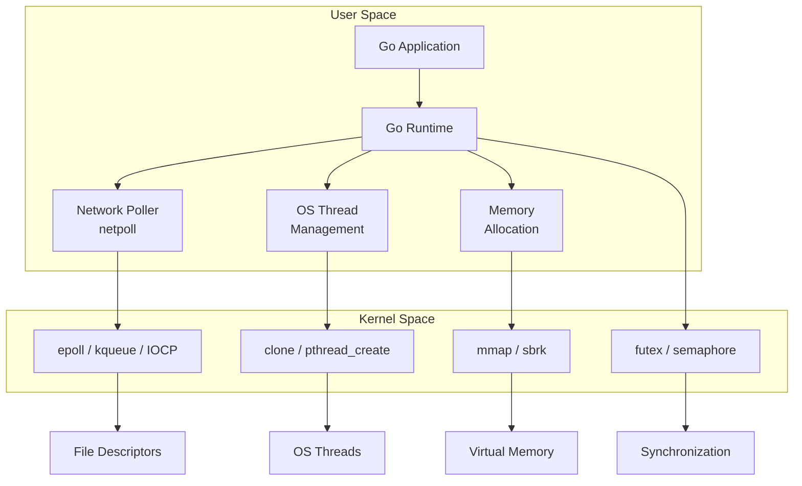
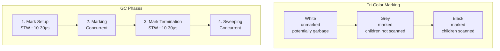

# Why Use Go — Under the Hood

## Table of Contents
1. [Introduction](#introduction)
2. [How It Works Internally](#how-it-works-internally)
3. [Runtime Deep Dive](#runtime-deep-dive)
4. [Compiler Perspective](#compiler-perspective)
5. [Memory Layout](#memory-layout)
6. [OS / Syscall Level](#os--syscall-level)
7. [Source Code Walkthrough](#source-code-walkthrough)
8. [Assembly Output Analysis](#assembly-output-analysis)
9. [Performance Internals](#performance-internals)
10. [Edge Cases at the Lowest Level](#edge-cases-at-the-lowest-level)
11. [Test](#test)
12. [Tricky Questions](#tricky-questions)
13. [Summary](#summary)
14. [Further Reading](#further-reading)

---

## 1. Introduction

Bu bo'lim Go'ning **ichki ishlash mexanizmlarini** o'rganadi — compiler pipeline'dan runtime bootstrap'gacha, GMP scheduler'dan assembly output'gacha. Bu bilimlar Go dasturlash tilini tanlash sabablarini **texnik** nuqtai nazardan tushunishga yordam beradi.

### Nima o'rganasiz:
- Go compiler pipeline (`gc`, `gccgo`, `tinygo`) va ularning farqlari
- Runtime bootstrap jarayoni — `_rt0_amd64_linux` dan `main.main` gacha
- GMP scheduler'ning ichki mexanizmi
- Go nima uchun tez kompilyatsiya qiladi
- Go binary anatomiyasi — section'lar, static linking
- ABI va calling convention'lar
- Assembly output tahlili

---

## 2. How It Works Internally

### Go Compilation Pipeline



### Tez kompilatsiya sabablari

Go nima uchun sekundlarda kompilyatsiya qiladi (C++ minutlab ketadi):

| Sabab | Tushuntirish |
|-------|-------------|
| **Import cycle taqiqlangan** | Dependency graph DAG bo'ladi — parallel kompilatsiya |
| **Bitta pass compilation** | Forward declaration kerak emas |
| **Object file format** | Export data package boshida — hamma narsani o'qish shart emas |
| **Oddiy type system** | Type inference cheklangan — tez resolve |
| **No header files** | C/C++ ning #include muammosi yo'q |
| **Incremental compilation** | Faqat o'zgargan paketlar qayta kompilyatsiya |

### Go Compilers Comparison

| Compiler | Target | Use Case | Optimization | Compile Speed |
|----------|--------|----------|-------------|--------------|
| **gc** (Go compiler) | All platforms | General purpose | O'rta | Juda tez |
| **gccgo** | GCC supported platforms | Maximum optimization | Yuqori (GCC backend) | Sekin |
| **TinyGo** | Embedded, WASM | Kichik binary, microcontrollers | O'rta | O'rta |

```bash
# gc — standart compiler
go build -o myapp main.go

# gccgo — GCC backend
go build -compiler gccgo -o myapp main.go

# TinyGo — embedded/WASM
tinygo build -o myapp.wasm -target wasm main.go
```

---

## 3. Runtime Deep Dive

### Go Runtime Components

Go runtime binary ichiga joylashtiriladi (static linked). Asosiy komponentlari:



### GMP Scheduler — Detailed

```
G (Goroutine):
├── Stack: 2KB boshlang'ich, 1GB gacha o'sishi mumkin
├── State: runnable, running, waiting, dead
├── Program counter, stack pointer
└── Channel/mutex wait info

M (Machine / OS Thread):
├── Actual OS thread (pthread)
├── Bitta P ga bog'langan
├── System call uchun block bo'lishi mumkin
└── Soni: default 10000 (GOMAXPROCS dan ko'p)

P (Processor):
├── Local Run Queue (256 goroutine)
├── mcache (per-P memory cache)
├── Timer heap
└── Soni: GOMAXPROCS (default: NumCPU)
```

### Runtime Bootstrap Sequence



### Bootstrap in Assembly (amd64)

```
// runtime/rt0_linux_amd64.s
TEXT _rt0_amd64_linux(SB),NOSPLIT,$-8
    JMP    _rt0_amd64(SB)

// runtime/asm_amd64.s
TEXT _rt0_amd64(SB),NOSPLIT,$-8
    MOVQ   0(SP), DI          // argc
    LEAQ   8(SP), SI          // argv
    JMP    runtime·rt0_go(SB)

TEXT runtime·rt0_go(SB),NOSPLIT,$0
    // Stack setup
    // TLS setup
    // osinit()
    // schedinit()
    // newproc(runtime.main)
    // mstart()
```

### Goroutine State Machine



---

## 4. Compiler Perspective

### SSA (Static Single Assignment) Form

Go compiler SSA intermediate representation ishlatadi. SSA da har bir o'zgaruvchi faqat **bir marta** assign bo'ladi:

```go
// Go source
func add(a, b int) int {
    c := a + b
    if c > 10 {
        c = c * 2
    }
    return c
}
```

```
// SSA form (simplified)
b1:
    v1 = Param a
    v2 = Param b
    v3 = Add v1 v2       // c = a + b
    v4 = Greater v3 10   // c > 10
    If v4 → b2, b3

b2:
    v5 = Mul v3 2        // c * 2
    Goto b3

b3:
    v6 = Phi(v3, v5)     // c = either v3 or v5
    Return v6
```

### SSA Optimization Passes

```bash
# SSA paslarini ko'rish
GOSSAFUNC=add go build main.go
# ssa.html faylini browserda ochish
```

Asosiy SSA optimization'lar:

| Pass | Nima qiladi | Misol |
|------|------------|-------|
| **Dead code elimination** | Ishlatilmagan kodni o'chirish | `if false { ... }` → o'chiriladi |
| **Constant folding** | Compile-time hisoblash | `3 + 5` → `8` |
| **Common subexpression** | Takroriy hisoblashni birlashtirish | `a*b + a*b` → temp + temp |
| **Inlining** | Kichik funksiyalarni inline qilish | `func add(a,b int) int` → inline |
| **Escape analysis** | Stack vs heap allocatsiya qaror qilish | Kichik struct → stack |
| **Bounds check elimination** | Keraksiz array bounds checkni o'chirish | Loop index doim safe |
| **Nil check elimination** | Keraksiz nil checkni o'chirish | Agar avval checked bo'lsa |

### Escape Analysis

```bash
# Escape analysis natijalarni ko'rish
go build -gcflags="-m -m" main.go
```

```go
package main

import "fmt"

type Point struct {
    X, Y int
}

func stackAllocated() Point {
    p := Point{X: 1, Y: 2} // Stack'da qoladi (escape etmaydi)
    return p                 // Copy qaytariladi
}

func heapAllocated() *Point {
    p := Point{X: 1, Y: 2} // Heap'ga ko'chadi (pointer qaytarilgani uchun)
    return &p                // Pointer qaytarish → escape
}

func interfaceEscape() {
    p := Point{X: 1, Y: 2}
    fmt.Println(p) // interface{} ga convert → escape to heap
}

func main() {
    _ = stackAllocated()
    _ = heapAllocated()
    interfaceEscape()
}
```

**Output (`go build -gcflags="-m"`):**
```
./main.go:12:6: can inline stackAllocated
./main.go:17:6: can inline heapAllocated
./main.go:18:6: moved to heap: p
./main.go:23:13: ... argument does not escape (Go 1.22+)
```

### Inlining Budget

Go compiler funksiyalarga **inline budget** beradi (Go 1.21: 80 units). Har bir AST node'ga narx beriladi:

```
function call: 57 units
for loop: 2 units
if statement: 1 unit
assignment: 1 unit
```

```bash
# Inline qarorlarni ko'rish
go build -gcflags="-m -m" main.go 2>&1 | grep "inline"
```

---

## 5. Memory Layout

### Go Binary Anatomy

```
┌─────────────────────────┐
│     ELF Header          │ ← OS bu yerdan boshlaydi
├─────────────────────────┤
│     .text               │ ← Machine code (funksiyalar)
├─────────────────────────┤
│     .rodata             │ ← Read-only data (string literals)
├─────────────────────────┤
│     .data               │ ← Initialized global variables
├─────────────────────────┤
│     .bss                │ ← Uninitialized global variables
├─────────────────────────┤
│     .gopclntab          │ ← Go program counter → line number table
├─────────────────────────┤
│     .gosymtab           │ ← Go symbol table
├─────────────────────────┤
│     .noptrdata          │ ← Data without pointers (GC skip)
├─────────────────────────┤
│     .noptrbss           │ ← BSS without pointers
├─────────────────────────┤
│     Go Runtime          │ ← Scheduler, GC, allocator
├─────────────────────────┤
│     Type info           │ ← Reflection, interface dispatch
├─────────────────────────┤
│     DWARF debug info    │ ← Debug symbols (-s -w bilan o'chiriladi)
└─────────────────────────┘
```

```bash
# Binary section'larni ko'rish
go build -o myapp main.go
readelf -S myapp | head -30

# Symbol table
go tool nm myapp | head -20

# Binary hajmini section bo'yicha
go tool nm -size myapp | sort -n -r | head -20
```

### Goroutine Stack Layout

```
┌─────────────────────────┐ ← Stack top (high address)
│     ...                 │
│     Local variables     │
│     Function args       │
│     Return address      │
├─────────────────────────┤ ← Frame pointer
│     Local variables     │
│     Function args       │
│     Return address      │
├─────────────────────────┤
│     ...                 │
│     Stack guard         │ ← Stack overflow check
└─────────────────────────┘ ← Stack bottom (low address, 2KB start)
```

**Stack growth mechanism:**
1. Funksiya boshida **stack guard** tekshiriladi
2. Agar yetarli joy yo'q bo'lsa → `runtime.morestack_noctxt`
3. Yangi, kattaroq stack allocate bo'ladi (2x)
4. Eski stack yangi stack'ga copy bo'ladi
5. Barcha pointer'lar yangilanadi
6. Eski stack free bo'ladi

### Interface Memory Layout

```
Empty Interface (interface{}):
┌──────────────┐
│  _type *     │ ──→ runtime._type struct (type info)
│  data  *     │ ──→ actual value (or pointer to it)
└──────────────┘

Non-empty Interface (io.Reader):
┌──────────────┐
│  itab  *     │ ──→ runtime.itab struct
│  data  *     │ ──→ actual value
└──────────────┘

runtime.itab:
┌──────────────┐
│  inter *     │ ──→ interface type descriptor
│  _type *     │ ──→ concrete type descriptor
│  hash  uint32│ ──→ type hash (fast comparison)
│  _     [4]byte│
│  fun   [1]uintptr│ ──→ method table (virtual table)
└──────────────┘
```

### String va Slice Memory Layout

```
String:
┌──────────────┐
│  ptr  *byte  │ ──→ [h][e][l][l][o]
│  len  int    │ = 5
└──────────────┘
Size: 16 bytes (header), immutable

Slice:
┌──────────────┐
│  ptr  *T     │ ──→ [1][2][3][_][_]
│  len  int    │ = 3 (ishlatilgan)
│  cap  int    │ = 5 (ajratilgan)
└──────────────┘
Size: 24 bytes (header), mutable

Map:
┌──────────────┐
│  hmap *      │ ──→ runtime.hmap struct
└──────────────┘

runtime.hmap:
┌──────────────┐
│  count  int  │ ← element soni
│  B      uint8│ ← log2(bucket count)
│  hash0  uint32│ ← hash seed (random)
│  buckets *   │ ──→ bucket array
│  oldbuckets *│ ──→ eski buckets (growing paytida)
│  ...         │
└──────────────┘
```

### Channel Internal Structure

```
runtime.hchan:
┌─────────────────┐
│  qcount   uint  │ ← buffer'dagi element soni
│  dataqsiz uint  │ ← buffer capacity
│  buf      *     │ ──→ ring buffer
│  elemsize uint16│ ← element hajmi
│  closed   uint32│ ← yopilganmi?
│  sendx    uint  │ ← send index (ring buffer)
│  recvx    uint  │ ← receive index
│  recvq    waitq │ ← kutayotgan receiver goroutine'lar
│  sendq    waitq │ ← kutayotgan sender goroutine'lar
│  lock     mutex │ ← ichki mutex
└─────────────────┘
```

---

## 6. OS / Syscall Level

### Go va OS Interaction



### Syscall Tracing

```bash
# Go dasturning system call'larini ko'rish
strace -f -e trace=network,memory,process ./myapp

# Network syscall'lar
strace -f -e trace=network ./myapp

# Memory syscall'lar
strace -f -e trace=memory ./myapp

# Faqat epoll/futex
strace -f -e trace=epoll_wait,epoll_ctl,futex ./myapp
```

### Network Poller (netpoll)

Go barcha network IO ni **non-blocking** qiladi va **epoll** (Linux) / **kqueue** (macOS) ishlatadi:

```
Goroutine A: conn.Read()
    │
    ├─→ Runtime: fd ni non-blocking qilish
    ├─→ syscall: read(fd) → EAGAIN (data yo'q)
    ├─→ Runtime: goroutine'ni park qilish (Gwaiting state)
    ├─→ Runtime: fd ni epoll'ga qo'shish
    │
    ... (boshqa goroutine'lar ishlaydi) ...
    │
    ├─→ epoll_wait: fd ready!
    ├─→ Runtime: goroutine'ni uyg'otish (Grunnable state)
    └─→ syscall: read(fd) → data!
```

### Goroutine Creation at Syscall Level

```go
package main

import (
    "fmt"
    "runtime"
    "time"
)

func main() {
    fmt.Printf("OS Threads (M): tracking via GOMAXPROCS=%d\n", runtime.GOMAXPROCS(0))
    fmt.Printf("Initial goroutines: %d\n", runtime.NumGoroutine())

    // Goroutine yaratish — bu userspace operatsiya
    // OS thread yaratilMAYDI (agar mavjud M bo'sh bo'lsa)
    for i := 0; i < 1000; i++ {
        go func(id int) {
            time.Sleep(1 * time.Second)
        }(i)
    }

    fmt.Printf("After 1000 goroutines: %d goroutines\n", runtime.NumGoroutine())
    // OS threads soni o'zgarMASLIGI mumkin — goroutine'lar M ustida schedule bo'ladi

    // Syscall blocking — yangi OS thread yaratilishi mumkin
    // Chunki blocking syscall M ni band qiladi, P yangi M ga bog'lanadi

    time.Sleep(2 * time.Second)
}
```

### Memory Allocation: mmap

```
Go Memory Allocator (tcmalloc-inspired):

mmap(NULL, size, PROT_READ|PROT_WRITE, MAP_ANON|MAP_PRIVATE, -1, 0)

┌─────────────────────────────────────┐
│              Heap Arena              │ ← 64MB chunks (mmap)
│ ┌─────────┬─────────┬─────────┐     │
│ │  Span   │  Span   │  Span   │     │
│ │ (8KB)   │ (8KB)   │ (8KB)   │     │
│ └─────────┴─────────┴─────────┘     │
│                                     │
│ Span → Pages → Objects              │
│                                     │
│ Size classes: 8B, 16B, 24B, ...     │
│ Up to 32KB → mcache (per-P, lock-free)│
│ 32KB+ → mcentral (shared, locked)    │
│ Large → mheap (mmap directly)        │
└─────────────────────────────────────┘
```

```
Memory allocation hierarchy:
1. mcache (per-P) — lock-free, eng tez
   └── tiny allocator (<16B, no pointers)
   └── small allocator (16B-32KB)
2. mcentral (shared) — mutex bilan
   └── span cache refill
3. mheap (global) — katta allocatsiyalar
   └── mmap() syscall
```

---

## 7. Source Code Walkthrough

### Runtime Source Files (Go source tree)

```
src/runtime/
├── proc.go          ← GMP scheduler asosiy logika
├── runtime2.go      ← G, M, P struct ta'riflari
├── mgc.go           ← Garbage collector
├── malloc.go        ← Memory allocator
├── mheap.go         ← Heap management
├── mcache.go        ← Per-P cache
├── chan.go           ← Channel implementation
├── select.go        ← Select statement
├── netpoll_epoll.go ← Linux network poller
├── netpoll_kqueue.go← macOS network poller
├── stack.go         ← Stack management
├── asm_amd64.s      ← Assembly entry points
└── sys_linux_amd64.s← Linux syscall wrappers
```

### Key Structures from Source

```go
// runtime/runtime2.go (simplified)

// G — goroutine descriptor
type g struct {
    stack       stack   // goroutine stack bounds
    stackguard0 uintptr // stack growth check
    m           *m      // current M running this G
    sched       gobuf   // saved context (SP, PC, etc.)
    atomicstatus atomic.Uint32 // goroutine status
    goid         uint64        // goroutine ID
    waitsince    int64         // when started waiting
    waitreason   waitReason    // why waiting
    preempt      bool          // preemption signal
    // ...
}

// M — OS thread descriptor
type m struct {
    g0      *g     // scheduling stack goroutine
    curg    *g     // current running goroutine
    p       *p     // attached P (nil if not running)
    id      int64
    // ...
}

// P — processor descriptor
type p struct {
    id          int32
    status      uint32
    m           *m     // attached M
    mcache      *mcache
    runqhead    uint32
    runqtail    uint32
    runq        [256]guintptr // local run queue
    runnext     guintptr      // next G to run
    // ...
}
```

### Channel Send Operation (source walkthrough)

```go
// runtime/chan.go (simplified)

func chansend(c *hchan, elem unsafe.Pointer, block bool) bool {
    // 1. nil channel ga send — abadiy block
    if c == nil {
        gopark(nil, nil, waitReasonChanSendNilChan)
        throw("unreachable")
    }

    lock(&c.lock)

    // 2. Closed channel ga send — panic
    if c.closed != 0 {
        unlock(&c.lock)
        panic(plainError("send on closed channel"))
    }

    // 3. Agar waiting receiver bor — to'g'ridan-to'g'ri uzatish
    if sg := c.recvq.dequeue(); sg != nil {
        send(c, sg, elem)
        unlock(&c.lock)
        return true
    }

    // 4. Buffer'da joy bor — buffer'ga yozish
    if c.qcount < c.dataqsiz {
        qp := chanbuf(c, c.sendx)
        typedmemmove(c.elemtype, qp, elem)
        c.sendx++
        if c.sendx == c.dataqsiz {
            c.sendx = 0 // ring buffer
        }
        c.qcount++
        unlock(&c.lock)
        return true
    }

    // 5. Block — goroutine'ni sendq ga qo'shish
    gp := getg()
    mysg := acquireSudog()
    mysg.elem = elem
    c.sendq.enqueue(mysg)
    gopark(chanparkcommit, unsafe.Pointer(&c.lock), waitReasonChanSend)
    // ... wake up when receiver takes the value
    return true
}
```

---

## 8. Assembly Output Analysis

### Viewing Assembly

```bash
# Go assembly output
go build -gcflags="-S" main.go

# Disassemble binary
go tool objdump -s "main.main" myapp

# Specific function assembly
go tool compile -S main.go
```

### Simple Function Assembly

```go
package main

func add(a, b int) int {
    return a + b
}

func main() {
    _ = add(3, 5)
}
```

**Assembly output (amd64):**
```asm
"".add STEXT nosplit size=19 args=0x18 locals=0x0
    ; Function prologue
    0x0000 TEXT    "".add(SB), NOSPLIT, $0-24
    0x0000 FUNCDATA $0, gclocals·...

    ; Arguments: a = 8(SP), b = 16(SP)
    ; Return value: 24(SP)
    0x0000 MOVQ    "".a+8(SP), AX    ; AX = a
    0x0005 ADDQ    "".b+16(SP), AX   ; AX = a + b
    0x000a MOVQ    AX, "".~r0+24(SP) ; return value = AX
    0x000f RET

"".main STEXT size=68 args=0x0 locals=0x20
    ; Stack check
    0x0000 TEXT    "".main(SB), $32-0
    0x0000 MOVQ    (TLS), CX
    0x0009 CMPQ    SP, 16(CX)         ; stack guard check
    0x000d JLS     61                   ; if overflow → morestack

    ; Function body
    0x000f SUBQ    $32, SP             ; allocate stack frame
    0x0013 MOVQ    BP, 24(SP)          ; save frame pointer
    0x0018 LEAQ    24(SP), BP          ; set new frame pointer
    0x001d MOVQ    $3, (SP)            ; first arg: 3
    0x0025 MOVQ    $5, 8(SP)           ; second arg: 5
    0x002e CALL    "".add(SB)          ; call add(3, 5)
    0x0033 MOVQ    24(SP), BP          ; restore frame pointer
    0x0038 ADDQ    $32, SP             ; deallocate stack frame
    0x003c RET

    ; Stack growth
    0x003d CALL    runtime.morestack_noctxt(SB)
    0x0042 JMP     0                   ; retry
```

### Go ABI (Application Binary Interface)

Go 1.17+ **register-based calling convention** ishlatadi (amd64):

```
Go 1.17+ ABI (amd64):
Arguments:  RAX, RBX, RCX, RDI, RSI, R8-R11 (integer)
            X0-X14 (float)
Returns:    RAX, RBX, RCX, RDI, RSI, R8-R11
Stack:      Agar register'lar yetmasa
```

```
Go 1.16 va oldin (stack-based):
Arguments:  Stack'da (SP+0, SP+8, SP+16, ...)
Returns:    Stack'da
```

Register-based ABI **~5% performance** yaxshilangan (function call overhead kamayadi).

### Goroutine Context Switch Assembly

```asm
// runtime/asm_amd64.s
// Goroutine context save/restore

TEXT runtime·gogo(SB), NOSPLIT, $0-8
    MOVQ    buf+0(FP), BX       // gobuf pointer
    MOVQ    gobuf_g(BX), DX     // DX = goroutine pointer
    MOVQ    gobuf_sp(BX), SP    // restore SP
    MOVQ    gobuf_ret(BX), AX   // restore return value
    MOVQ    gobuf_ctxt(BX), DX  // restore context
    MOVQ    gobuf_bp(BX), BP    // restore BP
    MOVQ    gobuf_pc(BX), BX    // BX = saved PC
    JMP     BX                   // jump to saved PC
```

---

## 9. Performance Internals

### GC Algorithm — Tri-Color Mark and Sweep



**GC Steps:**
1. **Mark Setup (STW):** Write barrier enable, root set preparation (~10-30μs)
2. **Marking (Concurrent):** Stack scanning, heap traversal. Goroutine'lar ishlaydi!
3. **Mark Termination (STW):** Final check, write barrier disable (~10-30μs)
4. **Sweeping (Concurrent):** White objects free

**Write Barrier:**
GC marking vaqtida goroutine'lar pointer yozsa, write barrier bu o'zgarishni GC ga xabar beradi — shuning uchun concurrent GC to'g'ri ishlaydi.

```bash
# GC trace
GODEBUG=gctrace=1 ./myapp

# Output format:
# gc 1 @0.004s 1%: 0.038+0.52+0.039 ms clock, 0.30+0.17/0.48/0+0.31 ms cpu, 4->4->0 MB, 4 MB goal, 8 P
#                   |STW1|  mark   |STW2|                                heap before->after->live
```

### Memory Allocator Performance

```
Allocation speed (approximate):
tiny (<16B, no ptr):  ~10ns   (mcache.tiny)
small (16B-32KB):     ~25ns   (mcache → mcentral → mheap)
large (>32KB):        ~500ns  (mheap → mmap)

Comparison:
malloc (C):           ~50ns
new (Java):           ~20ns
Go small alloc:       ~25ns
```

### Scheduler Performance

```
Goroutine operations (approximate):
Create goroutine:     ~300ns
Context switch:       ~100ns (goroutine → goroutine)
Channel send/recv:    ~50ns (unbuffered, no contention)
Mutex lock/unlock:    ~20ns (uncontended)
Atomic operation:     ~5ns

OS comparison:
OS thread create:     ~50μs (100x slower than goroutine)
OS context switch:    ~1-10μs (10-100x slower)
```

---

## 10. Edge Cases at the Lowest Level

### 10.1 Stack Split and Infinite Recursion

```go
package main

import "fmt"

// Go stack growable — 2KB dan 1GB gacha
func recursiveDemo(n int) {
    var buf [64]byte // Stack'da allocate
    _ = buf
    if n > 0 {
        recursiveDemo(n - 1) // Har safar stack o'sadi
    }
}

func main() {
    // Bu ishlaydi — stack o'sadi
    recursiveDemo(100000)
    fmt.Println("100K recursive calls: OK")

    // Bu panic beradi — 1GB stack limit
    // recursiveDemo(100_000_000) // runtime: goroutine stack exceeds 1000000000-byte limit
}
```

### 10.2 cgo Overhead

```go
package main

/*
#include <stdlib.h>

int c_add(int a, int b) {
    return a + b;
}
*/
import "C"
import "fmt"

func goAdd(a, b int) int {
    return a + b
}

func main() {
    // Pure Go: ~2ns per call
    result1 := goAdd(3, 5)
    fmt.Println("Go result:", result1)

    // CGo: ~100-200ns per call (50-100x slower!)
    // Sabab: goroutine stack → OS thread stack switch
    result2 := C.c_add(C.int(3), C.int(5))
    fmt.Println("C result:", result2)
}
```

**CGo overhead sabablari:**
1. Goroutine stack'dan OS thread stack'ga o'tish
2. Go pointer'larni C ga uzatish uchun pin qilish
3. GC bilan synchronization
4. Scheduler'ga signal berish (M blocked)

### 10.3 False Sharing in Cache Lines

```go
package main

import (
    "fmt"
    "sync"
    "sync/atomic"
    "time"
)

// ❌ False sharing — ikkala counter bitta cache line'da (64 bytes)
type BadCounters struct {
    Counter1 int64
    Counter2 int64 // Same cache line!
}

// ✅ Padding bilan — har bir counter alohida cache line'da
type GoodCounters struct {
    Counter1 int64
    _        [56]byte // Padding — 64 byte cache line to'ldirish
    Counter2 int64
}

func benchmark(name string, c1, c2 *int64) time.Duration {
    var wg sync.WaitGroup
    start := time.Now()

    wg.Add(2)
    go func() {
        defer wg.Done()
        for i := 0; i < 10_000_000; i++ {
            atomic.AddInt64(c1, 1)
        }
    }()
    go func() {
        defer wg.Done()
        for i := 0; i < 10_000_000; i++ {
            atomic.AddInt64(c2, 1)
        }
    }()

    wg.Wait()
    elapsed := time.Since(start)
    fmt.Printf("%s: %v\n", name, elapsed)
    return elapsed
}

func main() {
    bad := BadCounters{}
    good := GoodCounters{}

    benchmark("Bad (false sharing)", &bad.Counter1, &bad.Counter2)
    benchmark("Good (padded)", &good.Counter1, &good.Counter2)
}
```

---

## 11. Test

### Savol 1
Go compilation pipeline'ning birinchi bosqichi nima?
- A) Type checking
- B) Lexer/Scanner
- C) SSA generation
- D) Linking

<details><summary>Javob</summary>B) Lexer/Scanner — source code ni token'larga ajratadi (keywords, identifiers, literals). Keyin Parser AST yaratadi.</details>

### Savol 2
Go runtime'ning GMP modelida "work stealing" nima?
- A) Memory o'g'irlash
- B) Bo'sh P boshqa P ning run queue'sidan goroutine olishi
- C) Goroutine priority o'zgartirish
- D) OS thread yaratish

<details><summary>Javob</summary>B) Bo'sh P boshqa P ning local run queue'sidan goroutine "o'g'irlaydi". Bu load balancing ta'minlaydi va CPU idle bo'lishini oldini oladi.</details>

### Savol 3
Goroutine stack boshlang'ich hajmi qancha?
- A) 1 MB
- B) 64 KB
- C) 2-8 KB
- D) 256 bytes

<details><summary>Javob</summary>C) 2-8 KB (versiyaga qarab). OS thread 1-8 MB ishlatadi. Goroutine stack kerak bo'lganda 1GB gacha o'sishi mumkin.</details>

### Savol 4
Go interface ichki tuzilishida nechta pointer bor?
- A) 1
- B) 2
- C) 3
- D) O'zgaruvchan

<details><summary>Javob</summary>B) 2 pointer (16 bytes): itab pointer (type info + method table) va data pointer (actual value). Bu barcha interface'lar uchun bir xil.</details>

### Savol 5
Go 1.17+ da calling convention qanday o'zgardi?
- A) Stack-based → Register-based
- B) Register-based → Stack-based
- C) cdecl → stdcall
- D) O'zgarmagan

<details><summary>Javob</summary>A) Stack-based → Register-based. Arguments va return values register'larda uzatiladi (RAX, RBX, RCX, ...). Bu ~5% performance yaxshilanish berdi.</details>

### Savol 6
CGo function call nima uchun ~100-200ns (Go call ~2ns)?
- A) C kodi sekin
- B) Goroutine stack → OS thread stack switch, GC sync
- C) Network latency
- D) Disk I/O

<details><summary>Javob</summary>B) CGo overhead: goroutine stack'dan OS thread stack'ga o'tish, Go pointer'larni pin qilish, GC bilan synchronization, scheduler'ga signal berish. Bu 50-100x overhead yaratadi.</details>

### Savol 7
Go GC ning "STW" (Stop The World) fazasi Go 1.19+ da qancha davom etadi?
- A) 10-50ms
- B) 1-5ms
- C) 10-30 microsekund
- D) 1-5 sekund

<details><summary>Javob</summary>C) ~10-30 microsekund. Faqat Mark Setup va Mark Termination fazalari STW. Marking va Sweeping concurrent (goroutine'lar ishlaydi).</details>

---

## 12. Tricky Questions

### Savol 1: Go'da goroutine qanday preempt bo'ladi?

<details><summary>Javob</summary>

Go versiyalari bo'yicha preemption evolyutsiyasi:

**Go 1.13 gacha:** Faqat **cooperative preemption**
- Goroutine faqat function call vaqtida preempt bo'lishi mumkin
- Tight loop (`for {}`) butun P ni bloklashi mumkin!

**Go 1.14+:** **Asynchronous preemption**
- OS signal (SIGURG) orqali goroutine'ni to'xtatish
- Tight loop ham preempt bo'ladi
- Signal handler PC ni saqlaydi va scheduler'ga o'tadi

```go
// Go 1.13 da bu P ni bloklaydi:
go func() {
    for {} // Hech qachon preempt bo'lmaydi!
}()

// Go 1.14+ da SIGURG bilan preempt bo'ladi
```

**Mechanism:**
1. `sysmon` goroutine 10ms dan ko'p ishlab turgan G ni topadi
2. `preemptone()` chaqiriladi
3. OS `tgkill(SIGURG)` yuboriladi
4. Signal handler context save qiladi
5. Scheduler boshqa G ga switch qiladi
</details>

### Savol 2: Go binary'da `.gopclntab` section nima uchun kerak?

<details><summary>Javob</summary>

`.gopclntab` (Go Program Counter Line Table) — program counter'dan source code line number'ga mapping.

**Nima uchun kerak:**
1. **Stack traces** — `panic` yoki `runtime.Stack()` da fayl:line ko'rsatish
2. **Profiling** — pprof CPU profiling uchun
3. **Debugging** — Delve debugger uchun
4. **GC** — stack scanning uchun pointer map'lar

**Hajmi:** Binary'ning 20-30% ni egallashi mumkin!

```bash
# gopclntab hajmini ko'rish
go tool nm -size myapp | grep pclntab

# O'chirish (faqat production):
go build -ldflags="-s -w" -o myapp  # Debug info o'chirish
```

⚠️ `-s -w` bilan stack trace'lar yaxshi ishlamaydi — production'da ham kerak bo'lishi mumkin.
</details>

### Savol 3: `mmap` vs `sbrk` — Go qaysi birini ishlatadi?

<details><summary>Javob</summary>

Go asosan **`mmap`** ishlatadi:

```
mmap advantages:
✅ Katta, non-contiguous memory chunks
✅ MADV_FREE bilan OS ga qaytarish oson
✅ Alohida arena'lar yaratish mumkin
✅ Guard pages qo'yish mumkin

sbrk disadvantages:
❌ Faqat contiguous heap
❌ Fragmentation
❌ OS ga qaytarish qiyin
```

Go memory allocation:
1. `mmap(MAP_ANON|MAP_PRIVATE)` — heap arena'lar (64MB chunks)
2. Runtime ichida **page allocator** shu arena'larni boshqaradi
3. `mcache` → `mcentral` → `mheap` → `mmap` hierarchy

```bash
# Go ning mmap chaqiruvlarini ko'rish
strace -e trace=mmap,munmap ./myapp
```
</details>

### Savol 4: Go'da "write barrier" nima va qanday ishlaydi?

<details><summary>Javob</summary>

Write barrier — GC concurrent marking vaqtida pointer yozishni intercepting.

**Muammo:** GC marking vaqtida goroutine yangi pointer yozsa, GC bu ob'ektni ko'rmasligi mumkin → dangling reference.

**Yechim:** Compiler har bir pointer yozishga write barrier qo'shadi:

```go
// Source code:
p.next = q

// Compiler generates (simplified):
if writeBarrier.enabled {
    gcWriteBarrier(&p.next, q)
}
p.next = q
```

**Barrier type:** Go **hybrid write barrier** (Dijkstra + Yuasa) ishlatadi:
1. Eski pointer'ni grey qilish (deletion barrier)
2. Yangi pointer'ni grey qilish (insertion barrier)

Bu STW fazasini minimallashtirishga imkon beradi.
</details>

### Savol 5: Nima uchun Go'da `SIGURG` signal preemption uchun ishlatiladi?

<details><summary>Javob</summary>

`SIGURG` tanlash sabablari:

1. **Uncatchable emas** — dastur `signal.Notify` bilan catch qilishi mumkin, lekin...
2. **Odatda ishlatilmaydi** — SIGURG "urgent data on socket" uchun, lekin Go networking uni ishlatmaydi
3. **Default action: ignore** — agar Go runtime handle qilmasa, amal yo'q
4. **POSIX defined** — barcha Unix tizimlarida bor
5. **SIGINT, SIGTERM** — dastur uchun kerak, preemption uchun ishlatib bo'lmaydi
6. **SIGUSR1/2** — dasturchilar ishlatishi mumkin

Shuning uchun SIGURG ideal tanlov — hech kimga xalaqit bermaydi.
</details>

---

## 13. Summary

### Texnik Xulosalar

1. **Compilation Pipeline:** Lexer → Parser → AST → Type Check → SSA → Machine Code → Link. Import cycle taqiqlangani va sodda type system tufayli sekundlarda kompilyatsiya.

2. **Runtime Bootstrap:** `_rt0_amd64_linux` → `rt0_go` → `schedinit` → `newproc(main)` → `mstart`. Go runtime binary ichiga static linked.

3. **GMP Scheduler:** G (goroutine, 2KB) → P (processor, local queue) → M (OS thread). Work stealing load balancing ta'minlaydi. Go 1.14+ asynchronous preemption (SIGURG).

4. **Memory:** tcmalloc-inspired allocator. mcache (per-P, lock-free) → mcentral (shared) → mheap (mmap). Tiny/small/large allocator hierarchy.

5. **GC:** Tri-color concurrent mark & sweep. STW ~10-30μs. Write barrier pointer consistency ta'minlaydi.

6. **Binary:** ELF format, static linked. `.text` (code), `.gopclntab` (PC→line mapping), `.rodata` (constants), Go runtime embedded.

7. **ABI:** Go 1.17+ register-based calling convention. ~5% performance improvement over stack-based.

8. **Network:** epoll/kqueue-based non-blocking IO. Goroutine'lar park/unpark bo'ladi — developer uchun blocking API ko'rinadi.

---

## 14. Further Reading

| # | Resurs | Turi | Havola |
|---|--------|------|--------|
| 1 | **Go Source Code** | Source | https://github.com/golang/go/tree/master/src/runtime |
| 2 | **Go Memory Model** | Spec | https://go.dev/ref/mem |
| 3 | **Go Scheduler Design Doc** | Design doc | https://docs.google.com/document/d/1TTj4T2JO42uD5ID9e89oa0sLKhJYD0Y_kqxDv3I3XMw |
| 4 | **GC Design** | Proposal | https://go.dev/s/go15gcpacing |
| 5 | **Register ABI Proposal** | Proposal | https://go.dev/s/regabi |
| 6 | **Dmitry Vyukov — Go Scheduler** | Talk | GopherCon talks on YouTube |
| 7 | **Go Internals (Agner Fog)** | Book/Blog | https://cmc.gitbook.io/go-internals |
| 8 | **Delve Debugger** | Tool | https://github.com/go-delve/delve |
