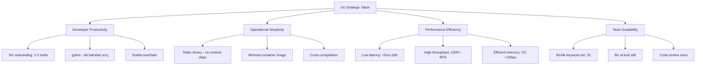
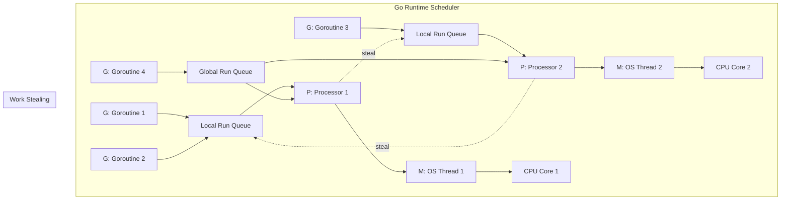
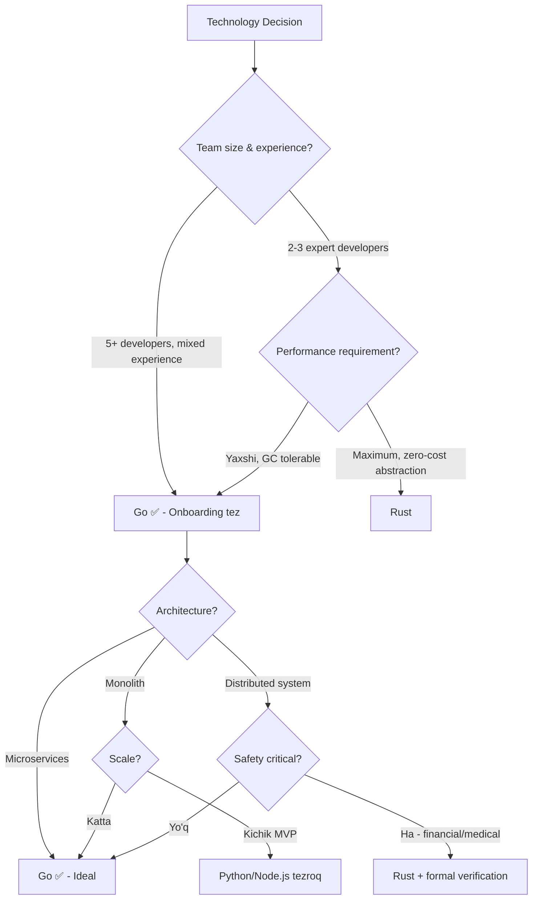
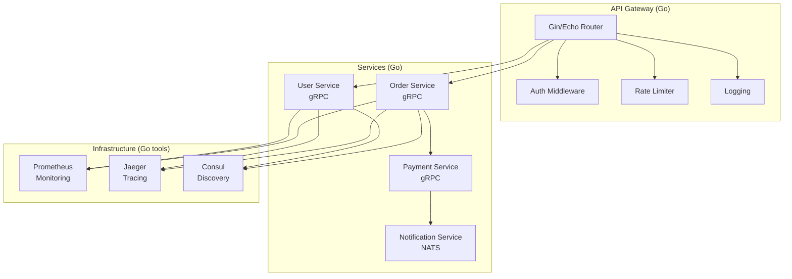
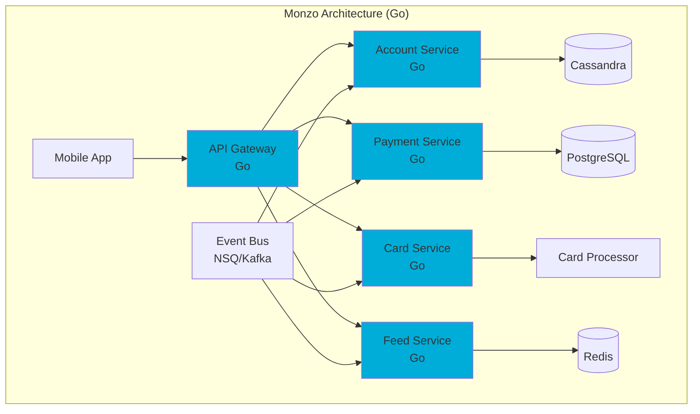
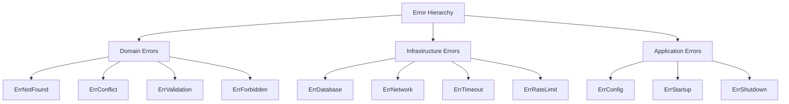
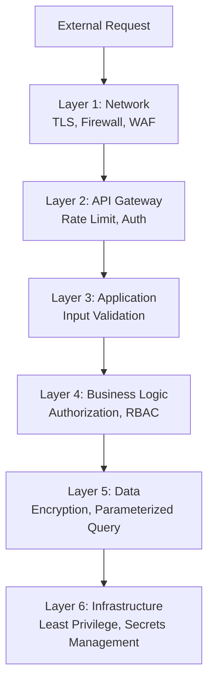
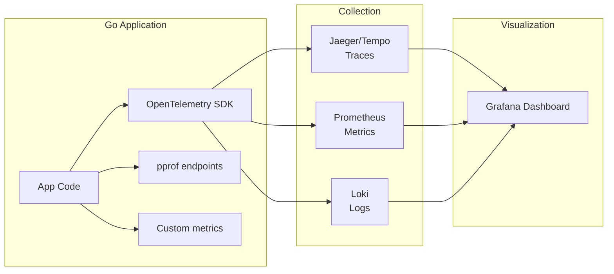
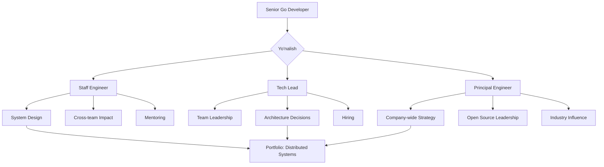

# Why Use Go — Senior Level

## Table of Contents
1. [Introduction](#introduction)
2. [Core Concepts](#core-concepts)
3. [Pros & Cons](#pros--cons)
4. [Use Cases](#use-cases)
5. [Code Examples](#code-examples)
6. [Product Use / Feature](#product-use--feature)
7. [Error Handling](#error-handling)
8. [Security Considerations](#security-considerations)
9. [Performance Optimization](#performance-optimization)
10. [Debugging Guide](#debugging-guide)
11. [Best Practices](#best-practices)
12. [Edge Cases & Pitfalls](#edge-cases--pitfalls)
13. [Common Mistakes](#common-mistakes)
14. [Tricky Points](#tricky-points)
15. [Comparison with Other Languages](#comparison-with-other-languages)
16. [Test](#test)
17. [Tricky Questions](#tricky-questions)
18. [Cheat Sheet](#cheat-sheet)
19. [Summary](#summary)
20. [What You Can Build](#what-you-can-build)
21. [Further Reading](#further-reading)
22. [Related Topics](#related-topics)

---

## 1. Introduction

Senior daraja — bu Go'ni nafaqat **ishlatish**, balki **nima uchun** va **qanday arxitektura** qilish kerakligini bilish. Bu bo'limda biz Go'ni **strategic** nuqtai nazardan ko'rib chiqamiz: qachon Go to'g'ri tanlov, kompaniya miqyosida qanday qarorlar qabul qilish, va Go'ning limitlarini qanday bypass qilish.

### Bu bo'limda nimalarni o'rganasiz:
- Go'ni **kompaniya miqyosida** tanlash strategiyasi
- **Real-world trade-off**'lar va ularga javob berish
- **Enterprise-grade** error handling va monitoring
- **Performance profiling** va optimization evidence bilan qaror qabul qilish
- **Architectural patterns** va Go'ning mos kelish nuqtalari
- Boshqa tillar bilan **chuqur arxitektural** taqqoslash

---

## 2. Core Concepts

### 2.1 Go's Strategic Value Proposition



### 2.2 GMP Scheduler Architecture

Go'ning runtime scheduler'i **GMP** modeliga asoslangan:



**GMP komponentlari:**
- **G (Goroutine):** 2-8KB stack, million'lab yaratish mumkin
- **M (Machine/OS Thread):** Actual OS thread, GOMAXPROCS bilan cheklangan
- **P (Processor):** Logical processor, local run queue bilan

**Work Stealing:** Agar P1 ning queue'si bo'sh bo'lsa, P2 ning queue'sidan goroutine "o'g'irlaydi" — bu load balancing ta'minlaydi.

### 2.3 Memory Model va Happens-Before

Go'ning memory modeli **happens-before** munosabatiga asoslangan:

```go
package main

import (
    "fmt"
    "sync"
)

func main() {
    var (
        mu    sync.Mutex
        data  string
        ready bool
    )

    // Writer goroutine
    go func() {
        mu.Lock()
        data = "hello"  // 1. data yozildi
        ready = true     // 2. ready o'rnatildi
        mu.Unlock()      // Unlock happens-before next Lock
    }()

    // Reader goroutine
    go func() {
        mu.Lock()
        if ready {
            fmt.Println(data) // Mutex tufayli 100% "hello" ko'rinadi
        }
        mu.Unlock()
    }()

    // ⚠️ Mutex'siz ready=true ko'rinsa ham, data="" bo'lishi mumkin
    // CPU instruction reordering tufayli!

    var wg sync.WaitGroup
    wg.Add(1)
    go func() {
        defer wg.Done()
        mu.Lock()
        defer mu.Unlock()
        if ready {
            fmt.Println("Final:", data)
        }
    }()
    wg.Wait()
}
```

### 2.4 Interface Internals

Go interface ikkita pointer'dan iborat:

```
┌──────────────┐
│   Interface  │
├──────────────┤
│  itab *      │ ──→ [type info + method table]
│  data *      │ ──→ [actual value/pointer]
└──────────────┘
```

```go
package main

import (
    "fmt"
    "unsafe"
)

type iface struct {
    tab  uintptr
    data uintptr
}

func main() {
    var x interface{} = 42
    fmt.Printf("Interface size: %d bytes\n", unsafe.Sizeof(x)) // 16 bytes (2 pointers)

    // Empty interface vs typed interface
    var s fmt.Stringer
    fmt.Printf("Stringer interface size: %d bytes\n", unsafe.Sizeof(s)) // 16 bytes
}
```

---

## 3. Pros & Cons

### Strategic Analysis — Real Company Examples

| Trade-off | Go'ning kuchi | Go'ning zaif tomoni | Real company qaror |
|-----------|--------------|---------------------|-------------------|
| **Simplicity vs Expressiveness** | Yangi dasturchi 1-2 haftada productive | Generics cheklangan, abstraction kam | **Google**: soddalikni tanladi — 10K+ Go dasturchi |
| **GC vs Manual Memory** | Developer vaqtini tejaydi | p99 latency spikes | **Twitch**: GC tuning bilan hal qildi |
| **Single binary vs Ecosystem** | Deploy oddiy, container kichik | Plugin system cheklangan | **HashiCorp**: plugin protocol (gRPC) yaratdi |
| **Concurrency vs Safety** | Goroutine'lar oson | Race condition runtime'da topiladi | **Uber**: CI da `-race` mandatory qildi |
| **Fast compile vs Optimization** | Developer feedback loop tez | Binary Rust'dan katta | **Cloudflare**: build optimization bilan hal qildi |

### Strategic Decision Framework



### Qachon Go bilan davom etish KERAK EMAS

| Vaziyat | Sabab | Alternativa |
|---------|-------|------------|
| ML/AI pipeline | Ecosystem yo'q, NumPy/TensorFlow faqat Python | Python + Go API gateway |
| Real-time audio/video | GC pauzalar seziladi | C++/Rust |
| Embedded systems | Runtime katta, GC bor | C/Rust |
| Complex domain modeling | Type system yetarli emas | Haskell/Scala |
| UI/Desktop app | GUI toolkitlar kam | Electron, Qt (C++), .NET |

---

## 4. Use Cases

### Enterprise-Grade Use Cases

| Kompaniya | Soha | Go Service | Scale | Metriks |
|-----------|------|-----------|-------|---------|
| **Google** | Cloud | Kubernetes control plane | 5M+ clusters | 99.99% uptime |
| **Uber** | Transport | Geofence, dispatch | 1M+ RPS | <5ms p99 |
| **Cloudflare** | CDN | Edge workers, DNS | 25M+ RPS (global) | <1ms latency |
| **Twitch** | Streaming | Chat, video pipeline | 30M+ daily users | 15M concurrent |
| **American Express** | Finance | Payment processing | Millionlab tranzaksiyalar/kun | PCI compliant |
| **PayPal** | Finance | Fraud detection | Real-time | Millisecond-level |
| **Netflix** | Media | Rpc framework (Zuul/Go) | 200M+ subscribers | 99.97% uptime |

### Architecture Pattern: Go in Microservices



---

## 5. Code Examples

### 5.1 Circuit Breaker Pattern

```go
package main

import (
    "errors"
    "fmt"
    "sync"
    "time"
)

type State int

const (
    StateClosed   State = iota // Normal ishlayapti
    StateOpen                   // Xatolik ko'p — so'rovlar bloklangan
    StateHalfOpen              // Test so'rov yuborilmoqda
)

func (s State) String() string {
    switch s {
    case StateClosed:
        return "CLOSED"
    case StateOpen:
        return "OPEN"
    case StateHalfOpen:
        return "HALF-OPEN"
    default:
        return "UNKNOWN"
    }
}

type CircuitBreaker struct {
    mu              sync.Mutex
    state           State
    failureCount    int
    successCount    int
    failureThreshold int
    successThreshold int
    timeout         time.Duration
    lastFailure     time.Time
}

func NewCircuitBreaker(failureThreshold, successThreshold int, timeout time.Duration) *CircuitBreaker {
    return &CircuitBreaker{
        state:            StateClosed,
        failureThreshold: failureThreshold,
        successThreshold: successThreshold,
        timeout:          timeout,
    }
}

func (cb *CircuitBreaker) Execute(fn func() error) error {
    cb.mu.Lock()

    switch cb.state {
    case StateOpen:
        if time.Since(cb.lastFailure) > cb.timeout {
            cb.state = StateHalfOpen
            cb.successCount = 0
            fmt.Printf("[CB] State: %s → HALF-OPEN\n", StateOpen)
        } else {
            cb.mu.Unlock()
            return errors.New("circuit breaker is OPEN")
        }
    }

    cb.mu.Unlock()

    err := fn()

    cb.mu.Lock()
    defer cb.mu.Unlock()

    if err != nil {
        cb.failureCount++
        cb.lastFailure = time.Now()
        if cb.failureCount >= cb.failureThreshold {
            cb.state = StateOpen
            fmt.Printf("[CB] State: → OPEN (failures: %d)\n", cb.failureCount)
        }
        return err
    }

    if cb.state == StateHalfOpen {
        cb.successCount++
        if cb.successCount >= cb.successThreshold {
            cb.state = StateClosed
            cb.failureCount = 0
            fmt.Printf("[CB] State: HALF-OPEN → CLOSED\n")
        }
    } else {
        cb.failureCount = 0
    }

    return nil
}

func main() {
    cb := NewCircuitBreaker(3, 2, 2*time.Second)

    callCount := 0
    unreliableService := func() error {
        callCount++
        if callCount <= 4 {
            return errors.New("service unavailable")
        }
        return nil
    }

    for i := 1; i <= 10; i++ {
        err := cb.Execute(unreliableService)
        if err != nil {
            fmt.Printf("Call %d: ERROR - %v\n", i, err)
        } else {
            fmt.Printf("Call %d: SUCCESS\n", i)
        }

        if i == 5 {
            fmt.Println("--- 3 sekund kutish ---")
            time.Sleep(3 * time.Second)
        }
    }
}
```

### 5.2 Rate Limiter (Token Bucket)

```go
package main

import (
    "fmt"
    "sync"
    "time"
)

type RateLimiter struct {
    mu         sync.Mutex
    tokens     float64
    maxTokens  float64
    refillRate float64 // tokens per second
    lastRefill time.Time
}

func NewRateLimiter(maxTokens, refillRate float64) *RateLimiter {
    return &RateLimiter{
        tokens:     maxTokens,
        maxTokens:  maxTokens,
        refillRate: refillRate,
        lastRefill: time.Now(),
    }
}

func (rl *RateLimiter) Allow() bool {
    rl.mu.Lock()
    defer rl.mu.Unlock()

    now := time.Now()
    elapsed := now.Sub(rl.lastRefill).Seconds()
    rl.tokens += elapsed * rl.refillRate
    if rl.tokens > rl.maxTokens {
        rl.tokens = rl.maxTokens
    }
    rl.lastRefill = now

    if rl.tokens >= 1 {
        rl.tokens--
        return true
    }
    return false
}

func main() {
    limiter := NewRateLimiter(5, 2) // Max 5, 2 tokens/sec refill

    for i := 1; i <= 15; i++ {
        if limiter.Allow() {
            fmt.Printf("Request %d: ALLOWED\n", i)
        } else {
            fmt.Printf("Request %d: RATE LIMITED\n", i)
        }
        time.Sleep(200 * time.Millisecond)
    }
}
```

### 5.3 Graceful Degradation with Context

```go
package main

import (
    "context"
    "fmt"
    "math/rand"
    "time"
)

type ServiceResult struct {
    Source string
    Data   string
}

func primaryService(ctx context.Context) (string, error) {
    // Simulyatsiya: ba'zan sekin
    delay := time.Duration(rand.Intn(500)) * time.Millisecond

    select {
    case <-time.After(delay):
        return "Primary data (fresh)", nil
    case <-ctx.Done():
        return "", ctx.Err()
    }
}

func cacheService(ctx context.Context) (string, error) {
    // Cache har doim tez
    select {
    case <-time.After(10 * time.Millisecond):
        return "Cached data (stale)", nil
    case <-ctx.Done():
        return "", ctx.Err()
    }
}

func getDataWithFallback(timeout time.Duration) ServiceResult {
    ctx, cancel := context.WithTimeout(context.Background(), timeout)
    defer cancel()

    // Primary service'ga urinish
    result, err := primaryService(ctx)
    if err == nil {
        return ServiceResult{Source: "primary", Data: result}
    }

    // Fallback: cache'dan olish
    fmt.Println("  Primary timeout, falling back to cache...")
    cacheCtx, cacheCancel := context.WithTimeout(context.Background(), 100*time.Millisecond)
    defer cacheCancel()

    result, err = cacheService(cacheCtx)
    if err == nil {
        return ServiceResult{Source: "cache", Data: result}
    }

    return ServiceResult{Source: "none", Data: "service unavailable"}
}

func main() {
    for i := 1; i <= 5; i++ {
        fmt.Printf("Request %d:\n", i)
        result := getDataWithFallback(200 * time.Millisecond)
        fmt.Printf("  Source: %s, Data: %s\n\n", result.Source, result.Data)
    }
}
```

### 5.4 Options Pattern (Functional Options)

```go
package main

import (
    "fmt"
    "time"
)

type Server struct {
    host         string
    port         int
    timeout      time.Duration
    maxConns     int
    tlsEnabled   bool
    readTimeout  time.Duration
    writeTimeout time.Duration
}

type Option func(*Server)

func WithHost(host string) Option {
    return func(s *Server) { s.host = host }
}

func WithPort(port int) Option {
    return func(s *Server) { s.port = port }
}

func WithTimeout(timeout time.Duration) Option {
    return func(s *Server) { s.timeout = timeout }
}

func WithMaxConns(max int) Option {
    return func(s *Server) { s.maxConns = max }
}

func WithTLS(enabled bool) Option {
    return func(s *Server) { s.tlsEnabled = enabled }
}

func WithReadTimeout(d time.Duration) Option {
    return func(s *Server) { s.readTimeout = d }
}

func WithWriteTimeout(d time.Duration) Option {
    return func(s *Server) { s.writeTimeout = d }
}

func NewServer(opts ...Option) *Server {
    // Default values
    s := &Server{
        host:         "0.0.0.0",
        port:         8080,
        timeout:      30 * time.Second,
        maxConns:     1000,
        tlsEnabled:   false,
        readTimeout:  5 * time.Second,
        writeTimeout: 10 * time.Second,
    }

    for _, opt := range opts {
        opt(s)
    }

    return s
}

func (s *Server) String() string {
    return fmt.Sprintf("Server{host:%s, port:%d, timeout:%v, maxConns:%d, tls:%v}",
        s.host, s.port, s.timeout, s.maxConns, s.tlsEnabled)
}

func main() {
    // Default server
    s1 := NewServer()
    fmt.Println("Default:", s1)

    // Custom server
    s2 := NewServer(
        WithHost("localhost"),
        WithPort(443),
        WithTLS(true),
        WithMaxConns(10000),
        WithTimeout(60*time.Second),
    )
    fmt.Println("Custom:", s2)

    // Production server
    s3 := NewServer(
        WithPort(8443),
        WithTLS(true),
        WithMaxConns(50000),
        WithReadTimeout(10*time.Second),
        WithWriteTimeout(30*time.Second),
    )
    fmt.Println("Production:", s3)
}
```

---

## 6. Product Use / Feature

### Industry Leaders at Scale

| Kompaniya | Service | Go'da yozilgan | Metrikalar | Migration story |
|-----------|---------|---------------|-----------|----------------|
| **Google** | dl.google.com | Download service | 1B+ daily downloads | C++ dan Go'ga — 2x kam kod |
| **Uber** | Geofence service | Go microservice | 1M+ RPS, <5ms p99 | Python → Go, 10x throughput |
| **Dropbox** | Backend infra | Core backend | 500M+ users | Python → Go, 5x perf gain |
| **Twitch** | Chat system | Go services | 15M concurrent, 30M DAU | — |
| **Cloudflare** | Edge platform | DNS, WAF, Workers | 25M+ RPS globally | — |
| **PayPal** | Fraud detection | Real-time ML serving | Millisecond decisions | Java → Go, 8x throughput |
| **American Express** | Payment processing | Transaction pipeline | Billions $/day | — |
| **Monzo** | Banking | Entire backend | 5M+ customers, 1600+ microservices | Go-first architecture |

### Monzo Case Study — Go-First Bank

Monzo (UK digital bank) butun backend'ini Go'da qurdi:



**Nima uchun Go?**
- 1600+ microservices, hammasi Go'da
- 5M+ customers
- Startup bilan boshlangan — tez deploy kerak edi
- Kichik jamoa bilan katta sistema qurish
- Regulatory compliance — sodda audit

---

## 7. Error Handling

### Enterprise-Grade Error Hierarchy



### Structured Error Package

```go
package main

import (
    "encoding/json"
    "errors"
    "fmt"
    "net/http"
    "time"
)

// Error severity levels
type Severity int

const (
    SeverityInfo    Severity = iota
    SeverityWarning
    SeverityError
    SeverityCritical
)

func (s Severity) String() string {
    switch s {
    case SeverityInfo:
        return "INFO"
    case SeverityWarning:
        return "WARNING"
    case SeverityError:
        return "ERROR"
    case SeverityCritical:
        return "CRITICAL"
    default:
        return "UNKNOWN"
    }
}

// AppError — structured error
type AppError struct {
    Code       string            `json:"code"`
    Message    string            `json:"message"`
    HTTPStatus int               `json:"http_status"`
    Severity   Severity          `json:"severity"`
    Metadata   map[string]string `json:"metadata,omitempty"`
    Timestamp  time.Time         `json:"timestamp"`
    Err        error             `json:"-"` // Internal error (JSON'ga chiqmasin)
}

func (e *AppError) Error() string {
    if e.Err != nil {
        return fmt.Sprintf("[%s] %s: %v", e.Code, e.Message, e.Err)
    }
    return fmt.Sprintf("[%s] %s", e.Code, e.Message)
}

func (e *AppError) Unwrap() error {
    return e.Err
}

// Sentinel errors
var (
    ErrNotFound = &AppError{
        Code: "NOT_FOUND", Message: "Resource not found",
        HTTPStatus: http.StatusNotFound, Severity: SeverityWarning,
    }
    ErrUnauthorized = &AppError{
        Code: "UNAUTHORIZED", Message: "Authentication required",
        HTTPStatus: http.StatusUnauthorized, Severity: SeverityWarning,
    }
    ErrInternal = &AppError{
        Code: "INTERNAL", Message: "Internal server error",
        HTTPStatus: http.StatusInternalServerError, Severity: SeverityCritical,
    }
    ErrValidation = &AppError{
        Code: "VALIDATION", Message: "Validation failed",
        HTTPStatus: http.StatusBadRequest, Severity: SeverityInfo,
    }
)

// Error constructors
func NewNotFoundError(resource, id string) *AppError {
    return &AppError{
        Code:       ErrNotFound.Code,
        Message:    fmt.Sprintf("%s with id '%s' not found", resource, id),
        HTTPStatus: ErrNotFound.HTTPStatus,
        Severity:   ErrNotFound.Severity,
        Metadata:   map[string]string{"resource": resource, "id": id},
        Timestamp:  time.Now(),
    }
}

func WrapError(sentinel *AppError, err error) *AppError {
    return &AppError{
        Code:       sentinel.Code,
        Message:    sentinel.Message,
        HTTPStatus: sentinel.HTTPStatus,
        Severity:   sentinel.Severity,
        Timestamp:  time.Now(),
        Err:        err,
    }
}

// Error response helper
func errorResponse(err error) string {
    var appErr *AppError
    if errors.As(err, &appErr) {
        data, _ := json.MarshalIndent(appErr, "", "  ")
        return string(data)
    }
    return fmt.Sprintf(`{"error": "%s"}`, err.Error())
}

func main() {
    // Scenario 1: Not found
    err1 := NewNotFoundError("user", "12345")
    fmt.Println("=== Not Found Error ===")
    fmt.Println(errorResponse(err1))

    // Scenario 2: Wrapped error
    dbErr := fmt.Errorf("connection refused: dial tcp 127.0.0.1:5432")
    err2 := WrapError(ErrInternal, dbErr)
    fmt.Println("\n=== Internal Error (wrapped) ===")
    fmt.Println(err2.Error())

    // Scenario 3: Error chain checking
    if errors.Is(err2, ErrInternal) {
        fmt.Println("\nBu internal error — alert yuborish kerak!")
    }
}
```

---

## 8. Security Considerations

### Threat Model Table

| Threat | Category (OWASP) | Risk | Go'da himoya | Tool/Library |
|--------|-------------------|------|-------------|-------------|
| **SQL Injection** | A03:2021 Injection | 🔴 Critical | Parametrized queries | `database/sql` |
| **XSS** | A03:2021 Injection | 🔴 Critical | `html/template` auto-escape | `html/template` |
| **SSRF** | A10:2021 SSRF | 🔴 Critical | URL validation, allowlist | Custom middleware |
| **Path Traversal** | A01:2021 Access Control | 🔴 Critical | `filepath.Clean()` | Standard library |
| **Race Condition** | A04:2021 Insecure Design | 🟡 High | Mutex, channels, `-race` | `sync` package |
| **Goroutine Bomb** | A05:2021 Misconfiguration | 🟡 High | Semaphore, worker pool | `golang.org/x/sync/semaphore` |
| **Sensitive Data Leak** | A02:2021 Crypto Failures | 🟡 High | Struct tag, custom marshaler | `encoding/json` |
| **Dependency Vuln** | A06:2021 Vulnerable Components | 🟡 High | `govulncheck` | `golang.org/x/vuln` |
| **Insecure Random** | A02:2021 Crypto Failures | 🟡 Medium | `crypto/rand` | Standard library |
| **Memory disclosure** | A04:2021 Insecure Design | 🟡 Medium | Buffer clearing | `crypto/subtle` |

### Defense in Depth — Security Layers



### Sensitive Data Protection

```go
package main

import (
    "encoding/json"
    "fmt"
)

// ❌ Xavfli: password JSON'ga chiqadi
type UnsafeUser struct {
    Name     string `json:"name"`
    Email    string `json:"email"`
    Password string `json:"password"` // XAVFLI!
}

// ✅ Xavfsiz: custom JSON marshaling
type SafeUser struct {
    Name     string `json:"name"`
    Email    string `json:"email"`
    Password string `json:"-"` // JSON'ga chiqmaydi
    SSN      string `json:"-"`
}

// Logging uchun ham himoya
func (u SafeUser) String() string {
    return fmt.Sprintf("User{name: %s, email: %s}", u.Name, u.Email)
}

// ✅ Maxfiy qiymatlar uchun wrapper
type Secret string

func (s Secret) MarshalJSON() ([]byte, error) {
    return json.Marshal("[REDACTED]")
}

func (s Secret) String() string {
    return "[REDACTED]"
}

func (s Secret) Value() string {
    return string(s) // Faqat aniq chaqirilganda
}

type Config struct {
    Host     string `json:"host"`
    Port     int    `json:"port"`
    DBPass   Secret `json:"db_password"`
    APIKey   Secret `json:"api_key"`
}

func main() {
    // UnsafeUser test
    unsafeUser := UnsafeUser{Name: "Ali", Email: "ali@mail.com", Password: "secret123"}
    data1, _ := json.Marshal(unsafeUser)
    fmt.Println("Unsafe:", string(data1)) // password ko'rinadi!

    // SafeUser test
    safeUser := SafeUser{Name: "Ali", Email: "ali@mail.com", Password: "secret123", SSN: "123-45-6789"}
    data2, _ := json.Marshal(safeUser)
    fmt.Println("Safe:", string(data2)) // password ko'rinmaydi

    // Secret type test
    cfg := Config{
        Host:   "localhost",
        Port:   5432,
        DBPass: Secret("super_secret"),
        APIKey: Secret("sk-12345"),
    }
    data3, _ := json.MarshalIndent(cfg, "", "  ")
    fmt.Println("Config:", string(data3)) // [REDACTED] ko'rinadi
    fmt.Printf("Log: %+v\n", cfg)         // [REDACTED]
    fmt.Println("Actual value:", cfg.DBPass.Value()) // Faqat kerak bo'lganda
}
```

---

## 9. Performance Optimization

### Profiling Evidence-Based Optimization

```go
package main

import (
    "fmt"
    "runtime"
    "strings"
    "time"
)

// Memory statistics
func printMemStats(label string) {
    var m runtime.MemStats
    runtime.ReadMemStats(&m)
    fmt.Printf("[%s] Alloc: %d KB, TotalAlloc: %d KB, NumGC: %d\n",
        label, m.Alloc/1024, m.TotalAlloc/1024, m.NumGC)
}

// Benchmark: string concat methods
func benchmarkStringConcat(n int) {
    fmt.Printf("\n=== String Concatenation (n=%d) ===\n", n)

    // Method 1: + operator
    start := time.Now()
    s := ""
    for i := 0; i < n; i++ {
        s += "x"
    }
    fmt.Printf("String + :          %v\n", time.Since(start))

    // Method 2: strings.Builder
    start = time.Now()
    var builder strings.Builder
    builder.Grow(n)
    for i := 0; i < n; i++ {
        builder.WriteString("x")
    }
    _ = builder.String()
    fmt.Printf("strings.Builder:    %v\n", time.Since(start))

    // Method 3: []byte
    start = time.Now()
    buf := make([]byte, 0, n)
    for i := 0; i < n; i++ {
        buf = append(buf, 'x')
    }
    _ = string(buf)
    fmt.Printf("[]byte append:      %v\n", time.Since(start))
}

// Benchmark: slice allocation
func benchmarkSliceAlloc(n int) {
    fmt.Printf("\n=== Slice Allocation (n=%d) ===\n", n)

    printMemStats("before")

    // Method 1: No pre-allocation
    start := time.Now()
    s1 := []int{}
    for i := 0; i < n; i++ {
        s1 = append(s1, i)
    }
    fmt.Printf("No pre-alloc:       %v\n", time.Since(start))

    // Method 2: Pre-allocated
    start = time.Now()
    s2 := make([]int, 0, n)
    for i := 0; i < n; i++ {
        s2 = append(s2, i)
    }
    fmt.Printf("Pre-allocated:      %v\n", time.Since(start))

    printMemStats("after")
}

func main() {
    benchmarkStringConcat(100000)
    benchmarkSliceAlloc(1000000)
}
```

### Performance Cost/Benefit Matrix

| Optimization | Effort | Impact | Risk | Qachon qilish kerak |
|-------------|--------|--------|------|---------------------|
| **Pre-allocate slices** | Kam | 2-5x | Kam | Har doim |
| **strings.Builder** | Kam | 100-1000x | Kam | Har doim (siklda) |
| **sync.Pool** | O'rta | 5-50x alloc | O'rta | Hot path'da |
| **Avoid interface{}** | O'rta | 1.5-3x | Kam | Performance-critical path |
| **Struct alignment** | Kam | 1.1-1.5x memory | Kam | Katta hajmda |
| **Channel vs Mutex** | O'rta | 1-5x | O'rta | Use-case'ga bog'liq |
| **CGo avoidance** | Yuqori | 10-100x call overhead | Yuqori | CGo kerak bo'lmasa |
| **Custom allocator** | Juda yuqori | 2-10x | Yuqori | Faqat profiling bilan |
| **GOGC tuning** | O'rta | GC pause/throughput | O'rta | Profiling asosida |
| **GOMEMLIMIT** | Kam | OOM prevention | Kam | Production'da har doim |

### Struct Memory Alignment

```go
package main

import (
    "fmt"
    "unsafe"
)

// ❌ Yomon alignment — padding ko'p
type BadAlignment struct {
    a bool    // 1 byte + 7 padding
    b int64   // 8 bytes
    c bool    // 1 byte + 3 padding
    d int32   // 4 bytes
    e bool    // 1 byte + 7 padding
    f int64   // 8 bytes
}
// Total: 40 bytes (faqat 23 byte foydali)

// ✅ Yaxshi alignment — padding kam
type GoodAlignment struct {
    b int64   // 8 bytes
    f int64   // 8 bytes
    d int32   // 4 bytes
    a bool    // 1 byte
    c bool    // 1 byte
    e bool    // 1 byte + 1 padding
}
// Total: 24 bytes (23 byte foydali)

func main() {
    fmt.Printf("BadAlignment size:  %d bytes\n", unsafe.Sizeof(BadAlignment{}))
    fmt.Printf("GoodAlignment size: %d bytes\n", unsafe.Sizeof(GoodAlignment{}))

    // 1 million struct uchun farq:
    // Bad:  40MB
    // Good: 24MB
    // Tejash: 16MB (40%)
    fmt.Printf("\n1M structs bilan tejash: %d MB\n",
        (unsafe.Sizeof(BadAlignment{})-unsafe.Sizeof(GoodAlignment{}))*1_000_000/1024/1024)
}
```

---

## 10. Debugging Guide

### Production Debugging Toolkit

| Tool | Maqsad | Qachon ishlatish | Buyruq |
|------|--------|-----------------|--------|
| **pprof** | CPU/Memory profiling | Performance muammolari | `go tool pprof` |
| **trace** | Execution tracing | Goroutine scheduling | `go tool trace` |
| **Delve** | Interactive debugging | Logic buglar | `dlv attach <pid>` |
| **Race detector** | Data race topish | CI/CD pipeline | `go test -race` |
| **expvar** | Runtime metrics export | Monitoring | `import "expvar"` |
| **GODEBUG** | Runtime debugging | GC, scheduler issues | `GODEBUG=gctrace=1` |
| **strace** | System call tracing | OS-level debugging | `strace -p <pid>` |

### Scenario 1: Production Memory Leak

```go
package main

import (
    "fmt"
    "net/http"
    _ "net/http/pprof"
    "runtime"
    "time"
)

// Monitoring endpoint
func metricsHandler(w http.ResponseWriter, r *http.Request) {
    var m runtime.MemStats
    runtime.ReadMemStats(&m)
    fmt.Fprintf(w, `{
  "alloc_mb": %.2f,
  "total_alloc_mb": %.2f,
  "sys_mb": %.2f,
  "num_gc": %d,
  "goroutines": %d,
  "heap_objects": %d,
  "gc_pause_ns": %d
}`,
        float64(m.Alloc)/1024/1024,
        float64(m.TotalAlloc)/1024/1024,
        float64(m.Sys)/1024/1024,
        m.NumGC,
        runtime.NumGoroutine(),
        m.HeapObjects,
        m.PauseNs[(m.NumGC+255)%256],
    )
}

func main() {
    http.HandleFunc("/metrics", metricsHandler)

    // pprof endpoints:
    // /debug/pprof/          - index
    // /debug/pprof/heap      - memory
    // /debug/pprof/goroutine - goroutines
    // /debug/pprof/profile   - CPU (30s default)
    // /debug/pprof/trace     - execution trace

    fmt.Println("Diagnostics server: http://localhost:6060")
    fmt.Println("  Memory:     http://localhost:6060/debug/pprof/heap")
    fmt.Println("  Goroutines: http://localhost:6060/debug/pprof/goroutine")
    fmt.Println("  Metrics:    http://localhost:6060/metrics")
    http.ListenAndServe(":6060", nil)
}
```

**Diagnostika qadamlari:**
```bash
# 1. Heap profiling
go tool pprof http://localhost:6060/debug/pprof/heap

# 2. Goroutine dump
curl http://localhost:6060/debug/pprof/goroutine?debug=2

# 3. GC trace
GODEBUG=gctrace=1 ./myapp

# 4. Memory limit (Go 1.19+)
GOMEMLIMIT=512MiB ./myapp

# 5. Live comparison
go tool pprof -base heap1.prof heap2.prof
```

### Scenario 2: Latency Spike Investigation

```bash
# 1. CPU profiling (30 sekund)
curl -o cpu.prof http://localhost:6060/debug/pprof/profile?seconds=30
go tool pprof -http=:8081 cpu.prof

# 2. Execution trace (5 sekund)
curl -o trace.out http://localhost:6060/debug/pprof/trace?seconds=5
go tool trace trace.out

# 3. GC pauzalarni tekshirish
GODEBUG=gctrace=1 ./myapp 2>&1 | grep -E "pause"

# 4. Scheduler tracing
GODEBUG=schedtrace=1000 ./myapp
```

### Observability Stack



---

## 11. Best Practices

### 11.1 Architecture Decision Records (ADR)

```
ADR-001: Go'ni backend tili sifatida tanlash

Status: Accepted
Date: 2024-01-15

Context:
- Jamoa: 15 backend developer
- Tizim: 50+ microservices
- SLA: 99.95% uptime, <50ms p99 latency

Decision: Go'ni asosiy backend til sifatida tanlash

Reasoning:
1. Onboarding: yangi developer 2 hafta ichida productive
2. Performance: Java'dan 3x kam memory, 2x kam latency
3. Operational: static binary, 15MB Docker image
4. Concurrency: goroutine'lar bilan 100K+ concurrent connections

Trade-offs:
- ORM ecosystem Java/Python darajasida emas
- Generics cheklangan (Go 1.18+)
- GUI/mobile uchun mos emas

Alternatives considered:
- Rust: learning curve juda baland (1-3 oy)
- Java: memory/container overhead
- Node.js: single-thread limitation
```

### 11.2 Code Organization Patterns

```go
// ✅ Clean Architecture — Dependency Rule
//
// Outer layers Inner layers'ga depend bo'lishi kerak
// Inner layers tashqi dunyo haqida bilmasligi kerak

// Domain Layer (innermost) — business rules
// domain/user.go
type User struct {
    ID    string
    Name  string
    Email string
}

type UserRepository interface {
    FindByID(ctx context.Context, id string) (*User, error)
    Save(ctx context.Context, user *User) error
}

// Application Layer — use cases
// app/user_service.go
type UserService struct {
    repo   UserRepository
    cache  Cache
    logger Logger
}

// Infrastructure Layer (outermost) — frameworks, DB, HTTP
// infra/postgres_user_repo.go
type PostgresUserRepo struct {
    db *sql.DB
}
```

### 11.3 Error Handling Strategy

```
Production Error Strategy:
1. Domain errors   → return to caller (user gets meaningful message)
2. Infra errors    → wrap + log + return generic error
3. Panic           → recover in middleware, log, return 500
4. Fatal           → faqat startup failures (config, DB connection)
```

---

## 12. Edge Cases & Pitfalls

### 12.1 Context Cancellation Propagation

```go
package main

import (
    "context"
    "fmt"
    "time"
)

func slowOperation(ctx context.Context, name string) error {
    select {
    case <-time.After(5 * time.Second):
        fmt.Printf("%s: completed\n", name)
        return nil
    case <-ctx.Done():
        fmt.Printf("%s: cancelled - %v\n", name, ctx.Err())
        return ctx.Err()
    }
}

func main() {
    // Parent context 2 sekund timeout bilan
    parentCtx, parentCancel := context.WithTimeout(context.Background(), 2*time.Second)
    defer parentCancel()

    // Child context 10 sekund timeout bilan
    // ⚠️ Child PARENT'dan ko'p yashamaydi!
    childCtx, childCancel := context.WithTimeout(parentCtx, 10*time.Second)
    defer childCancel()

    // Bu 2 sekundda cancel bo'ladi (parent timeout)
    err := slowOperation(childCtx, "child operation")
    if err != nil {
        fmt.Println("Error:", err)
    }
}
```

### 12.2 Map Concurrent Access

```go
package main

import (
    "fmt"
    "sync"
)

func main() {
    // ❌ Regular map — concurrent access PANIC beradi
    // m := make(map[int]int)
    // go func() { m[1] = 1 }()
    // go func() { m[2] = 2 }()
    // fatal error: concurrent map writes

    // ✅ sync.Map — concurrent access xavfsiz
    var sm sync.Map

    var wg sync.WaitGroup
    for i := 0; i < 100; i++ {
        wg.Add(1)
        go func(n int) {
            defer wg.Done()
            sm.Store(n, n*n)
        }(i)
    }
    wg.Wait()

    // O'qish
    sm.Range(func(key, value interface{}) bool {
        if key.(int) < 5 {
            fmt.Printf("%d: %d\n", key, value)
        }
        return true
    })

    // ✅ RWMutex bilan regular map (ko'p hollarda tezroq)
    type SafeMap struct {
        mu sync.RWMutex
        m  map[int]int
    }

    safeMap := SafeMap{m: make(map[int]int)}
    safeMap.mu.Lock()
    safeMap.m[1] = 100
    safeMap.mu.Unlock()

    safeMap.mu.RLock()
    fmt.Println("Value:", safeMap.m[1])
    safeMap.mu.RUnlock()
}
```

---

## 13. Common Mistakes

### 13.1 Incorrect Error Comparison

```go
package main

import (
    "errors"
    "fmt"
)

var ErrNotFound = errors.New("not found")

func findUser(id int) error {
    return fmt.Errorf("user %d: %w", id, ErrNotFound) // Wrapped error
}

func main() {
    err := findUser(42)

    // ❌ XATO: wrapped error bilan == ishlamaydi
    if err == ErrNotFound {
        fmt.Println("Bu chiqmaydi!")
    }

    // ✅ TO'G'RI: errors.Is() wrapped error ichidan topadi
    if errors.Is(err, ErrNotFound) {
        fmt.Println("errors.Is bilan topildi!") // Bu chiqadi
    }
}
```

### 13.2 Goroutine in Loop with Shared State

```go
package main

import (
    "fmt"
    "sync"
    "sync/atomic"
)

func main() {
    // ❌ XATO: Mutex'siz shared state
    // counter := 0
    // for i := 0; i < 1000; i++ {
    //     go func() { counter++ }() // DATA RACE!
    // }

    // ✅ TO'G'RI: Atomic operation
    var counter int64
    var wg sync.WaitGroup

    for i := 0; i < 1000; i++ {
        wg.Add(1)
        go func() {
            defer wg.Done()
            atomic.AddInt64(&counter, 1)
        }()
    }

    wg.Wait()
    fmt.Println("Counter:", atomic.LoadInt64(&counter)) // 1000
}
```

### 13.3 Defer in Loop

```go
package main

import (
    "fmt"
    "os"
)

func main() {
    files := []string{"/tmp/test1.txt", "/tmp/test2.txt", "/tmp/test3.txt"}

    // ❌ XATO: defer loop ichida — fayllar funksiya tugagunga qadar yopilmaydi
    // for _, path := range files {
    //     f, err := os.Open(path)
    //     if err != nil { continue }
    //     defer f.Close() // Hamma fayllar oxirida yopiladi!
    // }

    // ✅ TO'G'RI: closure yoki alohida funksiya ishlatish
    for _, path := range files {
        func() {
            f, err := os.Create(path)
            if err != nil {
                fmt.Printf("Skip: %s\n", path)
                return
            }
            defer f.Close() // Har bir iteratsiyada yopiladi
            fmt.Fprintf(f, "test data")
            fmt.Printf("Written: %s\n", path)
        }()
    }

    // Tozalash
    for _, path := range files {
        os.Remove(path)
    }
}
```

---

## 14. Tricky Points

### 14.1 Nil Interface vs Nil Pointer — Production Bug

Bu Go'ning eng ko'p uchraydigan "gotcha"laridan biri:

```go
package main

import "fmt"

type MyError struct {
    Code    int
    Message string
}

func (e *MyError) Error() string {
    return fmt.Sprintf("[%d] %s", e.Code, e.Message)
}

func doSomething(fail bool) error {
    var err *MyError // nil pointer

    if fail {
        err = &MyError{Code: 500, Message: "failed"}
    }

    return err // ⚠️ BUG: nil pointer ni interface ga assign qilsa, nil emas!
}

func main() {
    err := doSomething(false) // fail=false, err bo'lishi kerak nil

    // ⚠️ Bu ISHLAYDI deb o'ylaymiz, lekin...
    if err != nil {
        fmt.Println("ERROR:", err) // Bu chiqadi! Chunki interface{type:*MyError, value:nil}
    } else {
        fmt.Println("OK")
    }

    // ✅ TO'G'RI yondashuv:
    // return nil // doSomething ichida *MyError emas, nil qaytarish
}
```

### 14.2 Channel Direction — Compile-Time Safety

```go
package main

import "fmt"

// send-only channel
func producer(out chan<- int) {
    for i := 0; i < 5; i++ {
        out <- i
    }
    close(out)
}

// receive-only channel
func consumer(in <-chan int) {
    for v := range in {
        fmt.Println("Received:", v)
    }
}

func main() {
    ch := make(chan int, 5)
    go producer(ch)
    consumer(ch)
}
```

### 14.3 Select with Default — Non-blocking Operations

```go
package main

import (
    "fmt"
    "time"
)

func main() {
    ch := make(chan string, 1)

    // Non-blocking send
    select {
    case ch <- "hello":
        fmt.Println("Sent successfully")
    default:
        fmt.Println("Channel is full, skipping")
    }

    // Non-blocking receive
    select {
    case msg := <-ch:
        fmt.Println("Received:", msg)
    default:
        fmt.Println("No message available")
    }

    // Timeout pattern
    ch2 := make(chan string)
    go func() {
        time.Sleep(2 * time.Second)
        ch2 <- "delayed message"
    }()

    select {
    case msg := <-ch2:
        fmt.Println("Got:", msg)
    case <-time.After(1 * time.Second):
        fmt.Println("Timeout after 1 second")
    }
}
```

---

## 15. Comparison with Other Languages

### Architectural Trade-offs

| Decision Point | Go wins | Go loses | Notes |
|---------------|---------|----------|-------|
| **Team onboarding** | ✅ 1-2 hafta | — | 25 keyword, gofmt |
| **Microservices** | ✅ Kichik binary, tez start | — | Docker scratch image |
| **CPU-bound work** | ✅ C ga yaqin | Rust/C++ ga nisbatan | GC overhead |
| **Memory safety** | Partial (GC + race detector) | ❌ Rust compile-time safety | Runtime vs compile-time |
| **Type expressiveness** | — | ❌ Generics cheklangan | Go 1.18+ yaxshilangan |
| **Error handling** | ✅ Explicit | ❌ Verbose | "if err != nil" fatigue |
| **Domain modeling** | — | ❌ ADT, sum types yo'q | Interface bilan workaround |
| **Plugin/Extension** | — | ❌ Plugin system zaif | gRPC plugin protocol |
| **Compile time** | ✅ Sekundlar | — | Eng tez compiled til |
| **Debugging** | ✅ pprof, trace, race | — | Built-in tooling |
| **Concurrency** | ✅ Goroutine (oson) | Erlang actor model | Different trade-off |
| **Ecosystem** | ✅ Yetarli | ❌ Python/Java emas | O'sib bormoqda |

### When Go Wins

```
✅ Go wins when:
1. Team > 5 developers (onboarding, code review oson)
2. Microservices architecture (binary, deploy, container)
3. Network/IO-intensive workloads (goroutine'lar ideal)
4. DevOps/infrastructure tools (cross-compile, single binary)
5. High concurrency (100K+ connections)
6. Operatsiya soddaligi muhim (1 binary, no dependencies)
```

### When Go Loses

```
❌ Go loses when:
1. Maximum performance — no GC tolerable (Rust/C++)
2. Complex domain modeling (Haskell, Scala, Kotlin)
3. ML/Data Science (Python ecosystem dominant)
4. Mobile/Desktop GUI (native tools better)
5. Safety-critical systems (Rust compile-time guarantees)
6. Rapid prototyping (Python/JS faster to iterate)
```

### Migration Decision Matrix

| From → To Go | Qachon migrate qilish | Qachon QILMASLIK |
|-------------|----------------------|-------------------|
| **Python → Go** | Performance 10x+ kerak, typing kerak | ML/data pipeline, scripting |
| **Java → Go** | Container overhead ko'p, deploy sekin | Spring ecosystem kerak, enterprise patterns |
| **Node.js → Go** | CPU-bound tasks, true parallelism kerak | Frontend SSR, real-time WebSocket heavy |
| **Ruby → Go** | Performance, concurrent processing | Rapid prototyping, Rails ecosystem |
| **C++ → Go** | Developer productivity, safety | Embedded, kernel, max performance |

---

## 16. Test

### Savol 1
GMP schedulerda "P" nima?
- A) Process
- B) Processor (logical)
- C) Pipeline
- D) Pointer

<details><summary>Javob</summary>B) Processor (logical) — P goroutine'larni execute qilish uchun kerak bo'lgan kontekst. Local run queue bilan birga keladi. P soni = GOMAXPROCS.</details>

### Savol 2
Go'da interface qancha xotira oladi?
- A) 8 bytes
- B) 16 bytes (2 pointers)
- C) 24 bytes
- D) O'zgaruvchan

<details><summary>Javob</summary>B) 16 bytes — interface ikkita pointer'dan iborat: itab (type info + method table) va data (actual value pointer). 64-bit tizimda har biri 8 byte.</details>

### Savol 3
Nil pointer ni interface ga assign qilsa nima bo'ladi?
- A) Compilation error
- B) Runtime panic
- C) Interface nil bo'lmaydi
- D) Interface nil bo'ladi

<details><summary>Javob</summary>C) Interface nil bo'lmaydi — interface{type: *MyType, value: nil} bo'ladi. Bu Go'ning eng keng tarqalgan "gotcha"laridan biri. `err != nil` true qaytaradi.</details>

### Savol 4
`GODEBUG=gctrace=1` nima qiladi?
- A) GC ni o'chiradi
- B) GC har bir cycle haqida ma'lumot chiqaradi
- C) GC ni debug mode'ga o'tkazadi
- D) GC frequency'ni oshiradi

<details><summary>Javob</summary>B) Har bir GC cycle haqida stderr'ga ma'lumot chiqaradi: pause duration, heap size, work done. Production'da GC muammolarini diagnostika qilish uchun ishlatiladi.</details>

### Savol 5
Monzo bank qancha microservice'ni Go'da ishlatadi?
- A) 50
- B) 200
- C) 800
- D) 1600+

<details><summary>Javob</summary>D) 1600+ microservices — Monzo butun backend'ini Go'da qurgan. 5M+ customer'ga xizmat ko'rsatadi.</details>

### Savol 6
Go'da struct field alignment nima uchun muhim?
- A) Tezroq kompilatsiya
- B) Memory tejash (padding kamaytirish)
- C) GC tezligini oshirish
- D) Thread safety

<details><summary>Javob</summary>B) Memory tejash — noto'g'ri alignment bilan CPU padding qo'shadi. Katta struct'larda 30-40% ortiqcha memory sarflanishi mumkin. Katta hajmda (million'lab struct) bu muhim.</details>

### Savol 7
Work Stealing schedulerda nima?
- A) Goroutine'ni o'chirish
- B) Bo'sh P boshqa P ning queue'sidan goroutine olishi
- C) Memory stealing
- D) CPU cache stealing

<details><summary>Javob</summary>B) Bo'sh P boshqa P ning local run queue'sidan goroutine "o'g'irlaydi" — bu load balancing ta'minlaydi. Agar barcha P'lar band bo'lsa, global queue'dan olinadi.</details>

### Savol 8
`errors.Is()` va `==` ning farqi nima?
- A) Farqi yo'q
- B) `errors.Is()` wrapped error chain'ni tekshiradi
- C) `==` tezroq ishlaydi
- D) `errors.Is()` type casting qiladi

<details><summary>Javob</summary>B) `errors.Is()` error chain bo'ylab recursive qidiradi. `fmt.Errorf("context: %w", err)` bilan wrap qilingan error'larni `==` topa olmaydi, `errors.Is()` topadi.</details>

### Savol 9
Functional Options pattern nima uchun ishlatiladi?
- A) Performance optimization
- B) Flexible constructor (ko'p optional parameter bilan)
- C) Error handling
- D) Concurrency

<details><summary>Javob</summary>B) Flexible constructor — Go'da constructor overloading yo'q. Functional Options pattern bilan optional parametrlarni clean API bilan berish mumkin: `NewServer(WithPort(443), WithTLS(true))`</details>

### Savol 10
Circuit Breaker pattern nima qiladi?
- A) Elektr uzilishlarini boshqaradi
- B) Muvaffaqiyatsiz service'ga so'rovlarni vaqtincha to'xtatadi
- C) Network trafikni shifrlaydi
- D) Database connection'larni boshqaradi

<details><summary>Javob</summary>B) Cascading failure oldini oladi. Service muvaffaqiyatsiz bo'lganda, yangi so'rovlar yuborilmaydi (OPEN state). Timeout'dan keyin test so'rov yuboriladi (HALF-OPEN). Muvaffaqiyatli bo'lsa, normal holatga qaytadi (CLOSED).</details>

### Savol 11
`sync.Pool` qachon ishlatiladi?
- A) Connection pooling
- B) Goroutine pooling
- C) Object reuse — tez-tez allocate/free bo'ladigan ob'ektlar
- D) Thread pooling

<details><summary>Javob</summary>C) Object reuse — `sync.Pool` GC pressure kamaytirish uchun ishlatiladi. HTTP handler'larda buffer, JSON encoder kabi tez-tez yaratib yo'q qilinadigan ob'ektlarni qayta ishlatish. ⚠️ Pool GC cycle'da tozalanishi mumkin — persistent storage sifatida ishlatmang.</details>

### Savol 12
Go 1.19 da qo'shilgan `GOMEMLIMIT` nima?
- A) Maximum goroutine soni
- B) Soft memory limit — GC agressivroq ishlaydi
- C) Hard memory limit — dastur crash bo'ladi
- D) Stack size limit

<details><summary>Javob</summary>B) Soft memory limit — GC ni agressivroq ishlashga majbur qiladi. OOM (Out of Memory) oldini olish uchun. `GOMEMLIMIT=512MiB` — container environment'da muhim. Hard limit emas — memory bu chegaradan oshishi mumkin.</details>

---

## 17. Tricky Questions

### Savol 1: Go'da nima uchun "if err != nil" verbose deyiladi va buni hal qilish mumkinmi?

<details><summary>Javob</summary>

Go'da tipik funksiyaning 30-50% i error checking bo'lishi mumkin. Bu "error handling fatigue" deb ataladi.

**Muammo:**
```go
result1, err := step1()
if err != nil {
    return fmt.Errorf("step1: %w", err)
}
result2, err := step2(result1)
if err != nil {
    return fmt.Errorf("step2: %w", err)
}
result3, err := step3(result2)
if err != nil {
    return fmt.Errorf("step3: %w", err)
}
```

**Yechimlar:**
1. **Error wrapping helper** — `must()` funksiya
2. **Pipeline pattern** — error'ni zanjir bo'ylab uzatish
3. **Code generation** — repetitive error handling'ni generatsiya
4. Go jamoasi bir necha bor yangi syntax taklif qildi (`check/handle`, `try`), lekin hammasini rad etdi — explicit error handling Go'ning design philosophy'si.

**Fakt:** Rob Pike aytganidek: "Errors are values" — error'lar oddiy qiymatlar, ular bilan istalgan pattern qo'llash mumkin.
</details>

### Savol 2: Go binary nima uchun scratch Docker image'da ishlaydi, lekin ba'zan ishlamaydi?

<details><summary>Javob</summary>

Go default'da **static binary** yaratadi, lekin ba'zi holatlar istisno:

**Ishlaydi:**
```dockerfile
FROM scratch
COPY myapp /myapp
ENTRYPOINT ["/myapp"]
```

**Ishlamaydigan holatlar:**
1. **CGo enabled** — libc ga dynamic linking bo'ladi
   ```bash
   CGO_ENABLED=0 go build  # CGo o'chirish
   ```
2. **DNS resolution** — Go default'da system resolver (libc) ishlatadi
   ```bash
   CGO_ENABLED=0 go build -tags netgo  # Pure Go DNS resolver
   ```
3. **TLS certificates** — scratch image'da CA certificates yo'q
   ```dockerfile
   FROM scratch
   COPY --from=alpine /etc/ssl/certs/ca-certificates.crt /etc/ssl/certs/
   COPY myapp /myapp
   ```

**Production recommendation:**
```dockerfile
FROM gcr.io/distroless/static:nonroot
COPY myapp /myapp
USER nonroot:nonroot
ENTRYPOINT ["/myapp"]
```
</details>

### Savol 3: Go GC tuning qanday qilinadi? GOGC va GOMEMLIMIT farqi?

<details><summary>Javob</summary>

| Parameter | Default | Nima qiladi |
|-----------|---------|------------|
| `GOGC` | 100 | Heap 100% o'sganda GC ishga tushadi |
| `GOMEMLIMIT` | ∞ (Go 1.19+) | Soft memory limit |

**GOGC tuning:**
- `GOGC=50` → GC tez-tez ishlaydi, memory kam, CPU ko'p
- `GOGC=200` → GC kam ishlaydi, memory ko'p, CPU kam
- `GOGC=off` → GC o'chiriladi (xavfli!)

**GOMEMLIMIT:**
- Container'da `GOMEMLIMIT=container_memory * 0.7`
- GC ni agressiv qiladi memory limit'ga yaqinlashganda
- GOGC bilan birga ishlaydi

**Best practice:**
```bash
# Container: 1GB memory, Go app uchun 700MB
GOMEMLIMIT=700MiB GOGC=100 ./myapp
```

⚠️ GOMEMLIMIT — soft limit. Agar Go memory'ni shu chegaradan oshirishi kerak bo'lsa, oshiradi. Lekin GC agressivroq ishlaydi.
</details>

### Savol 4: Go'da reflection ishlatish qachon to'g'ri?

<details><summary>Javob</summary>

**Reflection'dan foydalanish to'g'ri:**
1. `encoding/json` — struct tag'larni o'qish
2. `database/sql` — row'larni struct ga mapping
3. `testing` — test framework internals
4. `fmt.Printf` — `%v` uchun struct field'larni ko'rsatish

**Reflection'dan foydalanish NOTO'G'RI:**
1. Oddiy type assertion yetarli bo'lganda
2. Performance-critical hot path'da (10-100x sekin)
3. Generics bilan hal qilsa bo'ladigan hollarda (Go 1.18+)

**Performance impact:**
```
Direct call:     ~2ns
Interface call:  ~5ns
Reflect call:    ~200ns (100x sekin!)
```

**Qoida:** "Clear is better than clever. Reflection is never clear." — Go Proverbs
</details>

### Savol 5: Kompaniya miqyosida Go'ga migration qilish strategiyasi qanday?

<details><summary>Javob</summary>

**Phased Migration Strategy:**

```
Phase 1: Pilot (1-2 oy)
├── Yangi microservice Go'da yozish
├── CI/CD pipeline sozlash
├── Coding standards belgilash
└── 2-3 developer training

Phase 2: Expand (3-6 oy)
├── Yangi service'lar Go'da
├── Go template project yaratish
├── Shared libraries (logging, metrics, auth)
└── Performance benchmarks

Phase 3: Migrate (6-12 oy)
├── Critical path service'larni migrate qilish
├── Strangler Fig pattern bilan
├── A/B testing old vs new
└── Gradual traffic shift

Phase 4: Optimize (ongoing)
├── Performance tuning
├── Go versiya update strategy
├── Internal Go training program
└── Open source contribution
```

**Dropbox tajribasi:**
- 2 yilda Python'dan Go'ga migrate qildi
- Avval infra tools, keyin core backend
- 5x performance improvement
- Jamoa hajmi o'zgarmadi, lekin throughput oshdi
</details>

### Savol 6: Go'da memory model va "happens-before" nima uchun muhim?

<details><summary>Javob</summary>

CPU'lar instruction'larni **reorder** qilishi mumkin. Memory model qaysi operatsiya qaysi biridan oldin ko'rinishini kafolatlaydi.

**Go'ning kafolatlari:**
1. `mu.Unlock()` → keyingi `mu.Lock()` dan oldin ko'rinadi
2. `ch <- v` → `<-ch` dan oldin ko'rinadi
3. `close(ch)` → `<-ch` (closed channel o'qish) dan oldin ko'rinadi
4. `sync.Once.Do(f)` → f() tugashidan keyin barcha goroutine'larga ko'rinadi

**Xavfli misol:**
```go
// ❌ DATA RACE — hech qanday synchronization yo'q
var ready bool
var data string

go func() {
    data = "hello"
    ready = true  // CPU buni data dan OLDIN bajarishi mumkin!
}()

if ready {
    fmt.Println(data) // Bo'sh string chiqishi mumkin!
}
```

**Qoida:** Goroutine'lar o'rtasida ma'lumot almashish uchun **har doim** synchronization primitive ishlatish (channel, mutex, atomic).
</details>

### Savol 7: Go'da "zero-allocation" pattern qanday yoziladi va qachon kerak?

<details><summary>Javob</summary>

Zero-allocation — heap'da allocate qilmaslik, stack'da ishlash.

**Qachon kerak:**
- Hot path (1M+ RPS)
- Latency-sensitive code (<1ms)
- GC pressure kamaytirish

**Usullari:**
1. **sync.Pool** — buffer reuse
2. **Stack allocation** — kichik struct'lar stack'da qoladi
3. **Escape analysis** — `go build -gcflags="-m"` bilan tekshirish
4. **[]byte instead of string** — string immutable, []byte emas
5. **Pre-allocated buffers** — slice/map capacity belgilash

```bash
# Escape analysis ko'rish
go build -gcflags="-m -m" main.go 2>&1 | grep "escapes to heap"
```

⚠️ Premature optimization — avval benchmark, keyin optimize!
</details>

---

## 18. Cheat Sheet

### Architecture Decision Matrix

| Qaror | Go tanlash ✅ | Boshqa til tanlash ❌ | Sabab |
|-------|-------------|---------------------|-------|
| **Backend API** | Team > 5, latency < 50ms | ML features ko'p | Go: onboarding + performance |
| **CLI Tool** | Cross-platform, single binary | GUI kerak | Go: cross-compile + cobra |
| **Data Pipeline** | Streaming, concurrent IO | Batch ML processing | Go: goroutine + channels |
| **Infrastructure** | Cloud-native, K8s operator | Simple automation | Go: K8s client-go ecosystem |
| **Database** | Distributed, high concurrency | Simple CRUD | Go: CockroachDB, etcd proven |

### Code Review Checklist

| # | Tekshirish | Muhimlik |
|---|-----------|----------|
| 1 | `if err != nil` — barcha error'lar tekshirilganmi? | 🔴 Critical |
| 2 | `defer Close()` — barcha resurslar yopilganmi? | 🔴 Critical |
| 3 | Context propagation — barcha IO da context bormi? | 🔴 Critical |
| 4 | Race condition — shared state himoyalanganmi? | 🔴 Critical |
| 5 | Goroutine leak — barcha goroutine'lar tugaydimi? | 🟡 High |
| 6 | Nil checks — nil pointer dereference ehtimoli bormi? | 🟡 High |
| 7 | Input validation — tashqi input tekshirilganmi? | 🟡 High |
| 8 | Timeout — network/IO operatsiyalarda timeout bormi? | 🟡 High |
| 9 | Slice/map pre-allocation — capacity belgilanganmi? | 🟢 Medium |
| 10 | Interface — kichik interface'lar ishlatilganmi? | 🟢 Medium |
| 11 | Naming — Go convention (exported/unexported)? | 🟢 Medium |
| 12 | Tests — unit test va benchmark yozilganmi? | 🟢 Medium |

### Production Readiness Checklist

```
Before Production Deployment:
[ ] go vet ./...                    — static analysis
[ ] golangci-lint run               — linting
[ ] go test -race ./...             — race detection
[ ] go test -cover ./...            — test coverage (>80%)
[ ] govulncheck ./...               — vulnerability scan
[ ] CGO_ENABLED=0 go build          — static binary
[ ] GOMEMLIMIT set                  — memory limit
[ ] pprof endpoints enabled         — profiling
[ ] Graceful shutdown implemented   — signal handling
[ ] Health check endpoint           — /healthz
[ ] Structured logging              — JSON logs
[ ] Metrics exported                — Prometheus compatible
```

---

## 19. Summary

### Strategic Xulosalar:

1. **Go — team-first til.** Katta jamoalar uchun onboarding va code review soddaligi boshqa tillardan ustun.
2. **Operational simplicity** — bitta binary, scratch image, cross-compile. DevOps yuki minimal.
3. **Performance sweet spot** — C++ darajasida emas, lekin 95% use-case uchun yetarli. GC <100μs.
4. **Trade-offs bor** — generics cheklangan, error handling verbose, GUI/ML uchun mos emas.
5. **Enterprise-proven** — Google, Uber, Cloudflare, Monzo — hammasi production'da million'lab RPS bilan ishlaydi.
6. **GMP scheduler** — goroutine'lar orqali million'lab concurrent connection'larni boshqarish.
7. **Migration strategy** — phased approach bilan, pilot loyihadan boshlab, asta-sekin kengaytirish.
8. **Production readiness** — pprof, race detector, GOMEMLIMIT, structured logging — hammasi built-in.

### Bitta gap:

> Go — bu **engineering at scale** uchun yaratilgan til. Unda "clever code" yozish qiyin, lekin **maintainable code** yozish oson.

---

## 20. What You Can Build

### Senior-Level Loyihalar

| # | Loyiha | Texnologiyalar | Career Impact |
|---|--------|---------------|--------------|
| 1 | API Gateway with rate limiting, auth, circuit breaker | Go, Redis, JWT, Prometheus | Staff Engineer interview |
| 2 | Distributed task queue | Go, NATS/Kafka, PostgreSQL | System design proof |
| 3 | Kubernetes Operator | Go, client-go, controller-runtime | Cloud-native expertise |
| 4 | Real-time data pipeline | Go, Kafka, ClickHouse | Data engineering |
| 5 | Service mesh sidecar | Go, gRPC, envoy xDS | Platform engineering |

### Career Path



---

## 21. Further Reading

| # | Resurs | Turi | Nima uchun |
|---|--------|------|-----------|
| 1 | **Go Memory Model** | Rasmiy spec | https://go.dev/ref/mem |
| 2 | **Go scheduler internals** | Rakyll blog | https://rakyll.org/scheduler/ |
| 3 | **High Performance Go** | Dave Cheney | https://dave.cheney.net/high-performance-go-workshop/gophercon-2019.html |
| 4 | **Go at Google** | Rob Pike talk | https://go.dev/talks/2012/splash.article |
| 5 | **Uber Go Style Guide** | Production guide | https://github.com/uber-go/guide |

---

## 22. Related Topics

| Mavzu | Havola | Nima uchun kerak |
|-------|--------|-----------------|
| Go Installation & Setup | [../02-go-installation-and-setup/](../02-go-installation-and-setup/) | Production build environment |
| Go Workspace | [../03-go-workspace/](../03-go-workspace/) | Enterprise project structure |
| Go Modules | [../05-go-modules/](../05-go-modules/) | Dependency management at scale |
| Go Tooling | [../06-go-tooling/](../06-go-tooling/) | pprof, race detector, vet |
