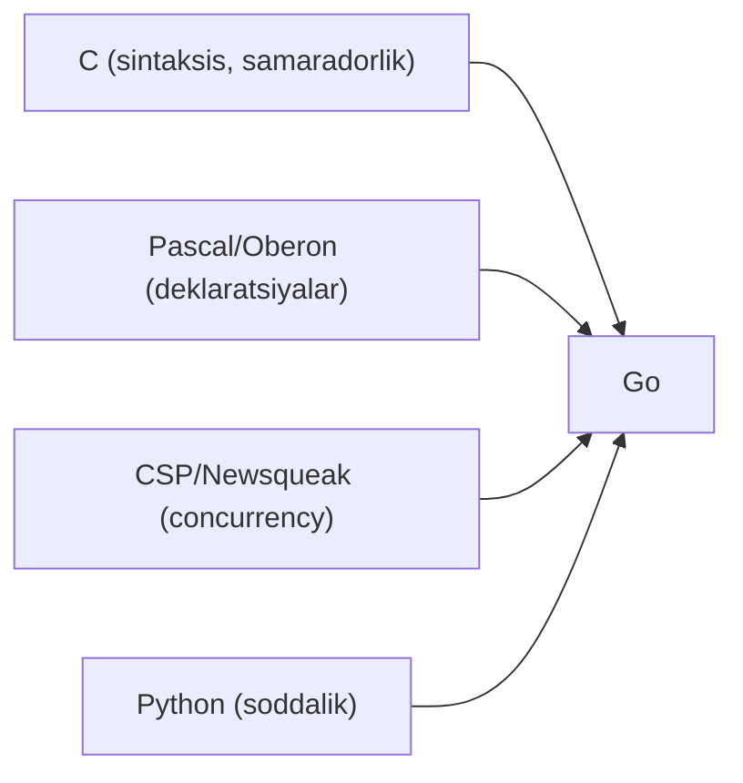
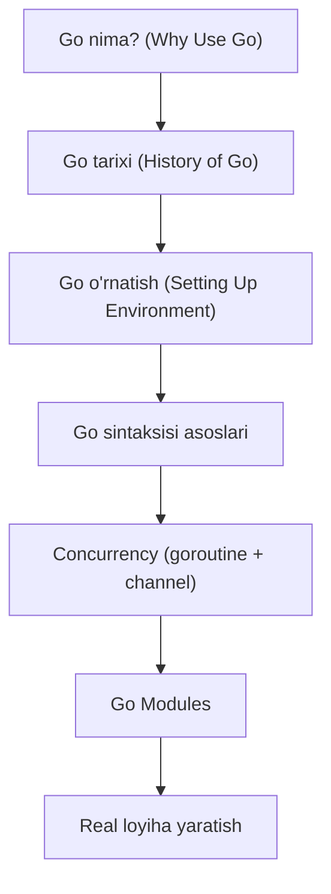

# History of Go — Junior Level

## Table of Contents

1. [Introduction](#1-introduction)
2. [Prerequisites](#2-prerequisites)
3. [Glossary](#3-glossary)
4. [Core Concepts](#4-core-concepts)
5. [Pros & Cons](#5-pros--cons)
6. [Use Cases](#6-use-cases)
7. [Code Examples](#7-code-examples)
8. [Product Use / Feature](#8-product-use--feature)
9. [Error Handling](#9-error-handling)
10. [Security Considerations](#10-security-considerations)
11. [Performance Tips](#11-performance-tips)
12. [Best Practices](#12-best-practices)
13. [Edge Cases & Pitfalls](#13-edge-cases--pitfalls)
14. [Common Mistakes](#14-common-mistakes)
15. [Tricky Points](#15-tricky-points)
16. [Test](#16-test)
17. [Tricky Questions](#17-tricky-questions)
18. [Cheat Sheet](#18-cheat-sheet)
19. [Summary](#19-summary)
20. [What You Can Build](#20-what-you-can-build)
21. [Further Reading](#21-further-reading)
22. [Related Topics](#22-related-topics)

---

## 1. Introduction

Go (Golang) — bu 2007-yilda Google ichida loyihalashtirilgan va 2009-yilda ochiq manba sifatida e'lon qilingan dasturlash tilidir. Go tilini uchta mashhur muhandis yaratgan: **Rob Pike**, **Ken Thompson** va **Robert Griesemer**. Go tili Google'da C++ bilan ishlashda yuzaga kelgan muammolarga — ayniqsa uzoq kompilyatsiya vaqtlari, murakkab dependency boshqaruvi va ko'p yadroli (multicore) protsessorlardan samarali foydalanishga — javob sifatida yaratildi.

Go tili soddalik, tezkor kompilyatsiya va ichki (built-in) concurrency qo'llab-quvvatlashiga ega bo'lishi uchun mo'ljallangan. U C tilining samaradorligini Python tilining soddaligi bilan birlashtirishga harakat qiladi.

**Bu bo'limda siz nimani o'rganasiz:**
- Go qachon va nima uchun yaratilgani
- Go'ning yaratuvchilari kim ekanligi
- Go'ning asosiy versiyalari va muhim milestone'lari
- Go boshqa tillardan qanday ta'sir olganligi

---

## 2. Prerequisites

Bu mavzuni o'rganish uchun quyidagilar tavsiya etiladi:

1. **Dasturlash asoslari** — o'zgaruvchilar, funksiyalar, sikllar haqida umumiy tushuncha
2. **Bitta dasturlash tilini bilish** — C, Python, JavaScript yoki boshqa biror tildan tajriba
3. **Terminal / Command Line asoslari** — oddiy buyruqlarni bajarish qobiliyati
4. **Versiya boshqaruvi tushunchasi** — Git nima ekanligini bilish (ixtiyoriy)

---

## 3. Glossary

| Atama | Ta'rifi |
|-------|---------|
| **Compiled language** | Dastur kodi mashina kodiga kompilyatsiya qilinib, keyin bajariladigan til. Go kompilyatsiya qilinadigan tildir. |
| **Garbage Collection (GC)** | Xotira boshqaruvini avtomatik amalga oshiradigan mexanizm — dasturchi xotirani qo'lda bo'shatishi shart emas. |
| **Goroutine** | Go'ning yengil (lightweight) concurrency birligi. Minglab goroutine'larni bir vaqtda ishlatish mumkin. |
| **Module** | Go 1.11 dan boshlab joriy etilgan dependency (bog'lanish) boshqaruv tizimi. |
| **Static typing** | O'zgaruvchilar turi kompilyatsiya vaqtida tekshiriladigan tip tizimi. |
| **Open source** | Manba kodi hamma uchun ochiq bo'lgan dasturiy ta'minot. Go 2009-yilda open source bo'lgan. |
| **CSP (Communicating Sequential Processes)** | Tony Hoare tomonidan 1978-yilda taklif qilingan concurrency modeli. Go channel'lari shu nazariyaga asoslangan. |
| **Backwards compatibility** | Yangi versiyalar eski kod bilan mos ishlashini kafolatlaydigan siyosat. Go 1 compatibility promise bunga misol. |
| **Cross-compilation** | Bitta OS/arxitekturada boshqa OS/arxitektura uchun dastur kompilyatsiya qilish. |
| **Generics** | Turli ma'lumot turlari bilan ishlaydigan umumiy (generic) funksiya va turlar yozish imkoniyati. Go 1.18 dan boshlab qo'shildi. |

---

## 4. Core Concepts

### 4.1 Go qachon yaratildi?

```
2007 — Rob Pike, Ken Thompson, Robert Griesemer Go'ni loyihalashni boshladilar (Google ichida)
2009 — Go ochiq manba (open source) sifatida e'lon qilindi (10-noyabr)
2012 — Go 1.0 chiqarildi — birinchi barqaror (stable) versiya
```

### 4.2 Nima uchun Go yaratildi?

Google muhandislari quyidagi muammolarga duch kelgan:

1. **C++ kompilyatsiya vaqti juda uzoq edi** — katta loyihalar soatlab kompilyatsiya qilinar edi
2. **Dependency boshqaruvi murakkab edi** — C/C++ da header fayllari va linking muammolari ko'p
3. **Ko'p yadroli protsessorlardan foydalanish qiyin edi** — thread boshqaruvi murakkab
4. **Dasturchilar hosildorligi (productivity) past edi** — murakkab tillar o'rganishga ko'p vaqt talab qilar edi

### 4.3 Go'ning yaratuvchilari

| Yaratuvchi | Hissasi | Taniqli ishlari |
|-----------|---------|-----------------|
| **Rob Pike** | Til dizayni, concurrency modeli | UTF-8 (Ken Thompson bilan birga), Plan 9, Newsqueak |
| **Ken Thompson** | Kompilyator, runtime | Unix OS, C tili (Dennis Ritchie bilan), UTF-8, Turing Award |
| **Robert Griesemer** | Til spetsifikatsiyasi, parser | Google V8 JavaScript engine, Java HotSpot |

### 4.4 Go'ga ta'sir ko'rsatgan tillar



- **C** — asosiy sintaksis, pointer'lar, struct'lar
- **Pascal/Oberon** — paket (package) tizimi, deklaratsiya usuli
- **CSP/Newsqueak/Limbo** — channel'lar va goroutine'lar
- **Python** — soddalik falsafasi, tezkor ishlab chiqish

### 4.5 Go versiyalari evolyutsiyasi

| Versiya | Yil | Muhim o'zgarishlar |
|---------|-----|-------------------|
| Go 1.0 | 2012 | Birinchi barqaror reliz, Go 1 compatibility promise |
| Go 1.5 | 2015 | Kompilyator C dan Go'ga ko'chirildi (self-hosting) |
| Go 1.11 | 2018 | Go Modules joriy etildi |
| Go 1.13 | 2019 | Modules standart holda yoqildi |
| Go 1.16 | 2021 | `embed` paketi, modules standart |
| Go 1.18 | 2022 | **Generics** qo'shildi, fuzzing, workspaces |
| Go 1.21 | 2023 | `min`, `max`, `clear` built-in funksiyalar |
| Go 1.22 | 2024 | `range over int`, loop variable semantics o'zgarishi |
| Go 1.23 | 2024 | `range over func` (iterator'lar) |
| Go 1.24 | 2025 | Weak pointer'lar, Swiss table map |

---

## 5. Pros & Cons

| Afzalliklar (Pros) | Kamchiliklar (Cons) |
|---------------------|---------------------|
| Juda tez kompilyatsiya | Generics kech qo'shildi (2022) |
| Sodda sintaksis, o'rganish oson | Exception/try-catch yo'q |
| Ichki concurrency (goroutine + channel) | Verbose error handling |
| Yagona binary fayl hosil qiladi | GUI dasturlar uchun zaif qo'llab-quvvatlash |
| Cross-compilation oson | Inheritance yo'q (faqat composition) |
| Kuchli standart kutubxona | Dependency injection framework'lari kam |
| Garbage collection bilan avtomatik xotira boshqaruvi | GC tufayli real-time tizimlar uchun cheklangan |

**Qachon foydalanish kerak:**
- Microservice'lar, CLI tool'lar, API server'lar yaratishda
- Tez kompilyatsiya va deploy kerak bo'lganda
- Concurrency muhim bo'lgan tizimlarda

**Qachon foydalanmaslik kerak:**
- Murakkab GUI desktop dasturlar uchun
- Ilmiy hisoblash va ma'lumotlar tahlili uchun (Python afzal)
- Real-time tizimlar uchun (Rust/C afzal)

---

## 6. Use Cases

Go'ning tarixi uning use case'lariga bevosita ta'sir ko'rsatdi:

1. **Cloud Infrastructure** — Docker, Kubernetes Go'da yozilgan (Google'da tug'ilgan til)
2. **Microservice'lar** — tez kompilyatsiya + kichik binary = container uchun ideal
3. **CLI Tools** — bitta binary, cross-compile, tez ishga tushish
4. **Network Programming** — TCP/HTTP server'lar, proxy'lar
5. **DevOps Tools** — Terraform, Prometheus, Grafana — barchasi Go'da

---

## 7. Code Examples

### 7.1 Go versiyasini tekshirish

```go
package main

import (
	"fmt"
	"runtime"
)

func main() {
	fmt.Println("Go versiyasi:", runtime.Version())
	fmt.Println("OS:", runtime.GOOS)
	fmt.Println("Arxitektura:", runtime.GOARCH)
	fmt.Println("CPU yadrolar soni:", runtime.NumCPU())
}
```

**Natija (misol):**
```
Go versiyasi: go1.24.1
OS: linux
Arxitektura: amd64
CPU yadrolar soni: 8
```

### 7.2 Go'ning concurrency tarixi — oddiy goroutine

```go
package main

import (
	"fmt"
	"sync"
)

func main() {
	var wg sync.WaitGroup

	// Go 2009-dan beri goroutine'lar mavjud
	messages := []string{
		"2007: Go loyihalashtirildi",
		"2009: Go open source bo'ldi",
		"2012: Go 1.0 chiqdi",
		"2022: Generics qo'shildi",
	}

	for _, msg := range messages {
		wg.Add(1)
		go func(m string) {
			defer wg.Done()
			fmt.Println(m)
		}(msg)
	}

	wg.Wait()
}
```

### 7.3 Go 1.18+ Generics — tarixiy qo'shimcha

```go
package main

import "fmt"

// Go 1.18 dan beri mavjud (2022-yil mart)
func Min[T int | float64 | string](a, b T) T {
	if a < b {
		return a
	}
	return b
}

func main() {
	fmt.Println(Min(3, 7))         // 3
	fmt.Println(Min(2.5, 1.8))     // 1.8
	fmt.Println(Min("go", "rust")) // go
}
```

### 7.4 Go 1.22+ range over int

```go
package main

import "fmt"

func main() {
	// Go 1.22 dan beri range over integer mavjud
	fmt.Println("Go versiyalari (birinchi 5 ta major milestone):")
	milestones := []string{"Go 1.0 (2012)", "Go 1.5 (2015)", "Go 1.11 (2018)", "Go 1.18 (2022)", "Go 1.22 (2024)"}

	for i := range 5 {
		fmt.Printf("  %d. %s\n", i+1, milestones[i])
	}
}
```

### 7.5 Go 1.23+ range over func (Iterator pattern)

```go
package main

import "fmt"

// Go 1.23 dan beri range over func mavjud
func GoMilestones(yield func(int, string) bool) {
	milestones := []struct {
		year  int
		event string
	}{
		{2009, "Open Source"},
		{2012, "Go 1.0"},
		{2015, "Self-hosting compiler"},
		{2018, "Go Modules"},
		{2022, "Generics"},
		{2024, "Range over func"},
	}
	for _, m := range milestones {
		if !yield(m.year, m.event) {
			return
		}
	}
}

func main() {
	for year, event := range GoMilestones {
		fmt.Printf("%d: %s\n", year, event)
	}
}
```

---

## 8. Product Use / Feature

Go'ning tarixi real dunyo mahsulotlarida qanday aks etganini ko'rib chiqamiz:

| Mahsulot | Yaratilgan yili | Go'ning qaysi xususiyatidan foydalanadi |
|----------|-----------------|------------------------------------------|
| **Docker** | 2013 | Go'ning cross-compilation va static binary xususiyati — container'lar uchun ideal |
| **Kubernetes** | 2014 | Goroutine'lar orqali minglab pod'larni boshqarish |
| **Terraform** | 2014 | Go plugin tizimi va static binary — DevOps uchun ideal |
| **Prometheus** | 2012 | Go'ning samarali xotira boshqaruvi — monitoring uchun |
| **Hugo** | 2013 | Go'ning tez kompilyatsiyasi — eng tez static site generator |

**Muhim nuqta:** Bu mahsulotlarning barchasi Go 1.0 (2012) dan keyin yaratilgan — Go 1 compatibility promise'ning ishonchliligi tufayli kompaniyalar Go'ni ishlab chiqarishda ishlatishga kirishdi.

---

## 9. Error Handling

### 9.1 Noto'g'ri Go versiyasidan foydalanish

**Muammo:** Eski Go versiyasida yangi xususiyatni ishlatish

```go
// go.mod faylda: go 1.17
// Lekin kodda generics ishlatilmoqda — bu xato beradi!

// XATO: ./main.go:5:6: type parameters require go1.18 or later
func Min[T int | float64](a, b T) T {
	if a < b {
		return a
	}
	return b
}
```

**Yechim:** `go.mod` faylda Go versiyasini yangilang:

```
module myproject

go 1.22
```

### 9.2 Go Modules ishlatmaslik

**Muammo:** GOPATH tashqarisida loyiha yaratish

```bash
# XATO: go: cannot find main module
$ go run main.go
```

**Yechim:** Module initsializatsiya qiling:

```bash
$ go mod init myproject
$ go run main.go
```

### 9.3 range over int eski versiyada

**Muammo:**

```go
// go.mod: go 1.21
for i := range 10 { // XATO: cannot range over 10 (untyped int constant)
    fmt.Println(i)
}
```

**Yechim:** `go.mod` da versiyani `go 1.22` ga o'zgartiring.

---

## 10. Security Considerations

1. **Go versiyasini yangilab turish** — har bir yangi versiyada xavfsizlik tuzatishlari bo'ladi. `go version` buyrug'i bilan tekshiring va muntazam yangilang.

2. **Dependency'larni tekshirish** — `go mod tidy` va `govulncheck` yordamida zaif (vulnerable) paketlarni aniqlang:
   ```bash
   go install golang.org/x/vuln/cmd/govulncheck@latest
   govulncheck ./...
   ```

3. **Rasmiy modullardan foydalanish** — faqat ishonchli va keng qo'llaniladigan paketlarni tanlang. `pkg.go.dev` saytida modul reytingini tekshiring.

4. **Go 1 compatibility promise** — Go jamoasi orqaga moslikni kafolatlaydi, lekin xavfsizlik tuzatishlari uchun har doim eng so'nggi patch versiyasiga yangilash tavsiya etiladi.

---

## 11. Performance Tips

1. **Eng so'nggi Go versiyasini ishlating** — har bir yangi versiyada kompilyator va runtime optimizatsiyalari bo'ladi. Masalan, Go 1.20 da PGO (Profile-Guided Optimization) qo'shilgan.

2. **Go Modules cache'dan foydalaning** — `GOMODCACHE` o'rnatib, dependency'larni qayta-qayta yuklamaslik:
   ```bash
   go env GOMODCACHE
   ```

3. **`go build -ldflags="-s -w"` bilan binary hajmini kamaytiring** — debug ma'lumotlarini olib tashlash:
   ```bash
   go build -ldflags="-s -w" -o myapp main.go
   ```

4. **`go vet` va `staticcheck` dan foydalaning** — kompilyatsiya vaqtida potentsial xatolarni aniqlang:
   ```bash
   go vet ./...
   ```

---

## 12. Best Practices

1. **`go.mod` faylda Go versiyasini to'g'ri ko'rsating** — bu loyihangiz qaysi Go xususiyatlaridan foydalanishini aniq belgilaydi.

2. **Rasmiy Go blog va release note'larni kuzatib boring** — har bir yangi versiya muhim o'zgarishlar olib keladi.

3. **Go 1 compatibility promise'ga ishoning** — Go 1.x da yozilgan kod Go 1.y da ham ishlaydi (y > x).

4. **`gofmt` va `goimports` dan doimo foydalaning** — Go hamjamiyatida yagona kod formatlash standarti mavjud.

5. **`go mod tidy` ni muntazam ishlatish** — foydalanilmagan dependency'larni olib tashlash.

6. **Versiya tag'larini qo'yish** — o'z kutubxonalaringizda semantic versioning (v1.2.3) dan foydalaning.

---

## 13. Edge Cases & Pitfalls

1. **Go 1 compatibility promise cheklovlari** — promise faqat documented behavior uchun ishlaydi. Undocumented behavior (masalan, map iteration tartibi) versiyalar orasida o'zgarishi mumkin.

2. **`GOPATH` vs Modules** — Go 1.11 dan oldingi loyihalar GOPATH tizimidan foydalanadi. Yangi loyihalar faqat Modules ishlatishi kerak.

3. **Loop variable capture** — Go 1.22 dan oldin loop o'zgaruvchisi goroutine'da noto'g'ri qiymat olishi mumkin edi:
   ```go
   // Go 1.21 va oldingi versiyalarda XATO:
   for _, v := range values {
       go func() {
           fmt.Println(v) // barcha goroutine oxirgi qiymatni chop etadi!
       }()
   }
   ```
   Go 1.22 dan beri bu muammo hal qilindi.

4. **`any` alias** — `interface{}` o'rniga `any` Go 1.18 dan beri ishlatiladi. Eski kodlarda `interface{}` ko'rinishida uchraydi.

---

## 14. Common Mistakes

1. **Go versiyasini bilmaslik** — `go version` buyrug'ini bilish va o'z versiyangizni tekshirish muhim.

2. **GOPATH va GOROOT ni aralashtirish** — GOROOT — Go o'rnatilgan joy, GOPATH — ish maydoni. Modules bilan GOPATH deyarli kerak emas.

3. **`go mod init` qilmaslik** — yangi loyiha boshlashda birinchi qadam `go mod init <module-name>`.

4. **Eski tutorial'lardan foydalanish** — Go 1.11 dan oldingi tutorial'larda GOPATH asosida o'rgatiladi, bu endi eskirgan.

5. **`go get` va `go install` ni aralashtirish** — Go 1.17 dan beri `go get` faqat `go.mod` ni yangilash uchun, dastur o'rnatish uchun `go install` ishlatiladi.

---

## 15. Tricky Points

1. **Go 1.0 va Go 2.0** — Go 2.0 rasman chiqmaydi. Go jamoasi "incremental changes" strategiyasini tanlagan, ya'ni yangi xususiyatlar Go 1.x versiyalarida qo'shiladi.

2. **Go'da "Go 2" mavzusi** — Go 2 proposals mavjud (error handling, generics), lekin ular Go 1.x ichida amalga oshirilmoqda.

3. **Kompilyator tarixi** — Go'ning birinchi kompilyatori C da yozilgan, Go 1.5 da kompilyator Go'ning o'zida qayta yozildi (bootstrap).

4. **Ken Thompson va C** — Ken Thompson C tilining yaratuvchilaridan biri. U Go'ni yaratishda C tajribasini to'g'ridan-to'g'ri qo'llagan.

5. **Go vs Golang** — Til rasmiy nomi "Go", lekin qidiruvda "Golang" ishlatiladi. `golang.org` domen ham rasmiy.

---

## 16. Test

### Savol 1
Go tili qaysi yilda ochiq manba (open source) sifatida e'lon qilindi?

- A) 2007
- B) 2009
- C) 2012
- D) 2015

<details>
<summary>Javob</summary>
B) 2009 — Go 2009-yil 10-noyabrda ochiq manba sifatida e'lon qilindi. 2007-yilda esa loyihalash boshlangan.
</details>

### Savol 2
Go'ning yaratuvchilaridan biri KIM emas?

- A) Rob Pike
- B) Ken Thompson
- C) Guido van Rossum
- D) Robert Griesemer

<details>
<summary>Javob</summary>
C) Guido van Rossum — u Python yaratuvchisi. Go'ni Rob Pike, Ken Thompson va Robert Griesemer yaratgan.
</details>

### Savol 3
Go 1.0 qaysi yilda chiqarildi?

- A) 2009
- B) 2010
- C) 2012
- D) 2014

<details>
<summary>Javob</summary>
C) 2012 — Go 1.0 2012-yil mart oyida chiqarildi.
</details>

### Savol 4
Go Modules qaysi versiyada joriy etildi?

- A) Go 1.5
- B) Go 1.11
- C) Go 1.13
- D) Go 1.18

<details>
<summary>Javob</summary>
B) Go 1.11 — Go Modules Go 1.11 da eksperimental sifatida joriy etildi.
</details>

### Savol 5
Generics Go'ning qaysi versiyasida qo'shildi?

- A) Go 1.13
- B) Go 1.16
- C) Go 1.18
- D) Go 1.21

<details>
<summary>Javob</summary>
C) Go 1.18 — Generics 2022-yil mart oyida Go 1.18 bilan qo'shildi.
</details>

### Savol 6
Go'ning concurrency modeli qaysi nazariyaga asoslangan?

- A) Actor model
- B) CSP (Communicating Sequential Processes)
- C) Thread pool
- D) Event loop

<details>
<summary>Javob</summary>
B) CSP — Tony Hoare tomonidan 1978-yilda taklif qilingan. Go'ning goroutine va channel'lari CSP'ga asoslangan.
</details>

### Savol 7
Go kompilyatori qaysi versiyada C dan Go'ga ko'chirildi?

- A) Go 1.0
- B) Go 1.3
- C) Go 1.5
- D) Go 1.8

<details>
<summary>Javob</summary>
C) Go 1.5 — 2015-yilda Go kompilyatori to'liq Go'da qayta yozildi (self-hosting).
</details>

### Savol 8
`range over func` qaysi Go versiyasida qo'shildi?

- A) Go 1.21
- B) Go 1.22
- C) Go 1.23
- D) Go 1.24

<details>
<summary>Javob</summary>
C) Go 1.23 — `range over func` (iterator pattern) Go 1.23 da qo'shildi (2024).
</details>

---

## 17. Tricky Questions

### Savol 1: Nima uchun Go jamoasi Go 2.0 chiqarmaslikka qaror qildi?

<details>
<summary>Javob</summary>
Go jamoasi "incremental changes" strategiyasini tanladi. Go 1 compatibility promise tufayli Go 2.0 chiqarish butun ekotizimni buzishi mumkin edi. Buning o'rniga, muhim o'zgarishlar (generics, range over func) Go 1.x versiyalariga bosqichma-bosqich qo'shilmoqda. Bu Go foydalanuvchilariga migratsiya og'rig'isiz yangi xususiyatlardan foydalanish imkonini beradi.
</details>

### Savol 2: Go'ning kompilyatsiya tezligi nima uchun C++ dan ancha tez?

<details>
<summary>Javob</summary>
Bir nechta sabab bor: (1) Go'da header fayllari yo'q — import tizimi faqat kerakli paketlarni yuklaydi; (2) Dependency graph aniq va tsiklik (circular) import'lar taqiqlangan; (3) Foydalanilmagan import'lar kompilyatsiya xatosi beradi — bu keraksiz kodni oldini oladi; (4) Paketlar alohida kompilyatsiya qilinadi va cache'lanadi.
</details>

### Savol 3: Ken Thompson Go'ni yaratishda 70 yoshda edi. Bu nima uchun muhim?

<details>
<summary>Javob</summary>
Ken Thompson Unix va C tilining yaratuvchisi — dasturlash tarixidagi eng ta'sirli shaxslardan biri. Uning Go loyihasidagi ishtiroki 40+ yillik operatsion tizimlar va dasturlash tillari tajribasini Go'ga olib keldi. Bu Go'ning soddalik va samaradorlik falsafasini shakllantirgan muhim omil.
</details>

### Savol 4: Go nima uchun exception (try/catch) o'rniga error qaytarishni tanladi?

<details>
<summary>Javob</summary>
Go yaratuvchilari exception'larni "invisible control flow" (ko'rinmas boshqaruv oqimi) deb hisoblashdi. Error'ni qaytarish dasturchi har bir xatoni aniq ko'rib chiqishga majburlaydi. Bu Go'ning soddalik falsafasiga mos keladi — "errors are values" prinsipi. Rob Pike: "Don't just check errors, handle them gracefully."
</details>

### Savol 5: `golang.org` va `go.dev` — farqi nima?

<details>
<summary>Javob</summary>
`golang.org` — Go'ning asl veb-sayti (2009-dan). `go.dev` — 2019-yilda ishga tushirilgan yangi rasmiy sayt. Hozirda `golang.org` `go.dev` ga yo'naltiriladi. "Golang" nomi qidiruvda qulay bo'lgani uchun ishlatiladi (chunki "Go" juda umumiy so'z).
</details>

---

## 18. Cheat Sheet

### Muhim sanalar

| Yil | Voqea |
|-----|-------|
| 1978 | Tony Hoare CSP nazariyasini e'lon qildi (Go'ning concurrency asosi) |
| 2007 | Rob Pike, Ken Thompson, Robert Griesemer Go'ni loyihalashni boshladi |
| 2008 | Ken Thompson birinchi Go kompilyatorini yozdi (C da) |
| 2009-11-10 | Go ochiq manba sifatida e'lon qilindi |
| 2012-03-28 | Go 1.0 chiqarildi + Go 1 compatibility promise |
| 2014 | GopherCon — birinchi Go konferensiyasi |
| 2015 | Go 1.5 — kompilyator Go'da qayta yozildi |
| 2018 | Go 1.11 — Go Modules joriy etildi |
| 2022-03 | Go 1.18 — Generics, Fuzzing, Workspaces |
| 2023 | Go 1.21 — built-in min/max/clear |
| 2024 | Go 1.22 — range over int; Go 1.23 — range over func |
| 2025 | Go 1.24 — weak pointers, Swiss table map |

### Muhim buyruqlar

```bash
go version          # Go versiyasini ko'rish
go env              # Go muhit o'zgaruvchilarini ko'rish
go mod init <name>  # Yangi modul yaratish
go mod tidy         # Dependency'larni tozalash
go build            # Kompilyatsiya qilish
go run main.go      # Ishga tushirish
go vet ./...        # Kod tekshiruvi
go test ./...       # Testlarni ishga tushirish
```

### Yaratuvchilar

| Ism | Hissa |
|-----|-------|
| Rob Pike | Concurrency, til dizayni |
| Ken Thompson | Kompilyator, low-level |
| Robert Griesemer | Spetsifikatsiya, parser |

---

## 19. Summary

- Go 2007-yilda Google'da loyihalashtirilgan, 2009-yilda open source bo'lgan
- Yaratuvchilar: Rob Pike, Ken Thompson, Robert Griesemer
- Go 1.0 (2012) — barqaror versiya va compatibility promise
- Asosiy sabab: C++ kompilyatsiya vaqti va concurrency muammolari
- Muhim milestone'lar: self-hosting (1.5), modules (1.11), generics (1.18), range over func (1.23)
- Go 2.0 chiqmaydi — o'zgarishlar incremental tarzda Go 1.x ga qo'shiladi
- Go CSP nazariyasiga asoslangan concurrency modeliga ega
- Docker, Kubernetes, Terraform kabi muhim infratuzilma Go'da yaratilgan

---

## 20. What You Can Build

### Loyiha g'oyalari

1. **Go Timeline CLI** — Go versiyalari tarixini terminalda chiroyli ko'rsatuvchi CLI dastur
2. **Go Version Checker** — o'rnatilgan Go versiyasini tekshirib, eng so'nggi versiya bilan solishtiradigan tool
3. **Go Release Notes Parser** — Go blog'dan release note'larni yuklab, muhim o'zgarishlarni ajratib ko'rsatuvchi dastur
4. **Go Quiz Bot** — Go tarixi haqida savollar beradigan interaktiv terminal dastur

### O'rganish yo'li



---

## 21. Further Reading

1. **Go Blog — Go's history** — [https://go.dev/blog/](https://go.dev/blog/) — rasmiy Go blog, barcha muhim e'lonlar
2. **Go 1 and the Future of Go Programs** — [https://go.dev/doc/go1compat](https://go.dev/doc/go1compat) — Go 1 compatibility promise hujjati
3. **Go at Google: Language Design in the Service of Software Engineering** — Rob Pike'ning taqdimoti: [https://go.dev/talks/2012/splash.article](https://go.dev/talks/2012/splash.article)
4. **The Go Programming Language Specification** — [https://go.dev/ref/spec](https://go.dev/ref/spec)
5. **Go Release History** — [https://go.dev/doc/devel/release](https://go.dev/doc/devel/release) — barcha versiyalar ro'yxati

---

## 22. Related Topics

- [Why Use Go? (Go'ni nima uchun ishlatish kerak)](../01-why-use-go/) — Go'ning afzalliklari va qo'llanish sohalari
- [Setting Up the Environment (Muhitni sozlash)](../03-setting-up-the-environment/) — Go'ni o'rnatish va sozlash
- [Go Basics](../../02-go-basics/) — Go sintaksisi asoslari
