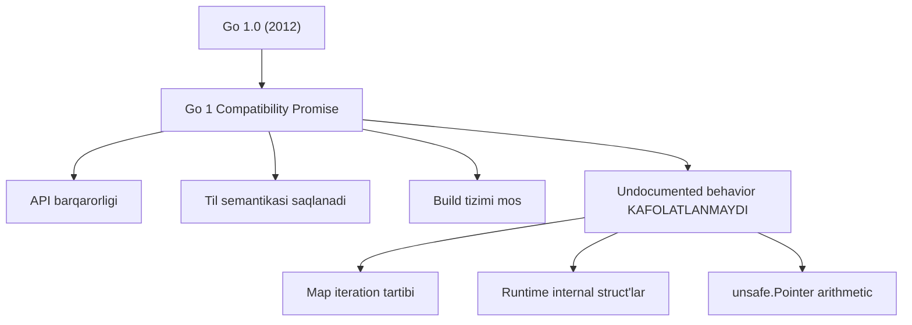
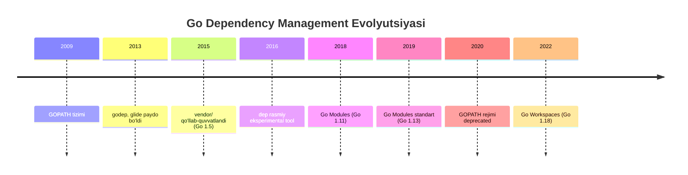
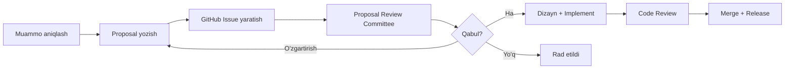
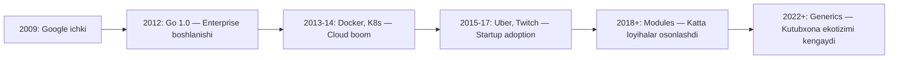
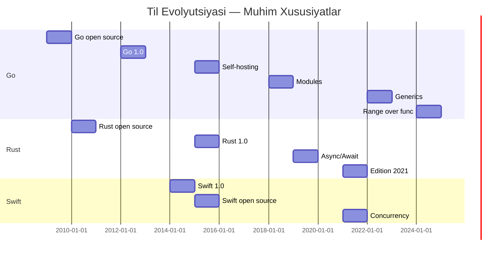
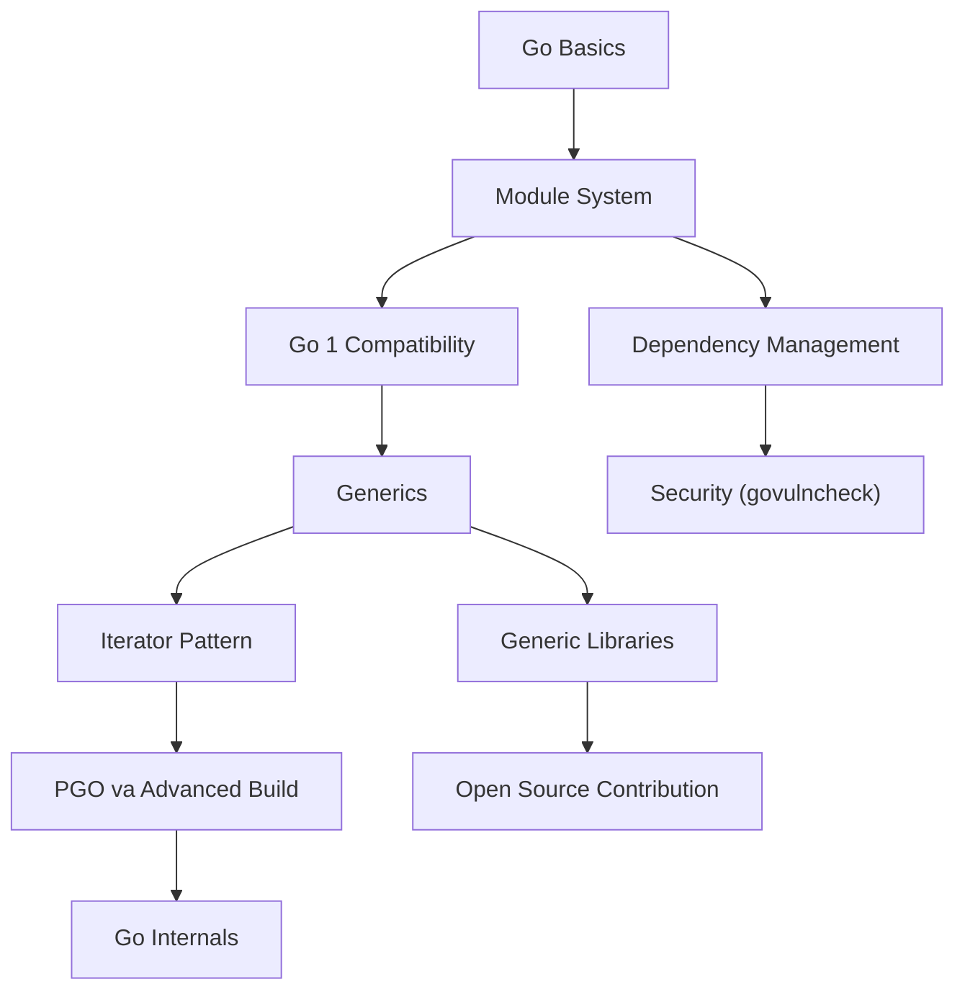

# History of Go — Middle Level

## Table of Contents

1. [Introduction](#1-introduction)
2. [Core Concepts](#2-core-concepts)
3. [Pros & Cons](#3-pros--cons)
4. [Use Cases](#4-use-cases)
5. [Code Examples](#5-code-examples)
6. [Product Use / Feature](#6-product-use--feature)
7. [Error Handling](#7-error-handling)
8. [Security Considerations](#8-security-considerations)
9. [Performance Optimization](#9-performance-optimization)
10. [Debugging Guide](#10-debugging-guide)
11. [Best Practices](#11-best-practices)
12. [Edge Cases & Pitfalls](#12-edge-cases--pitfalls)
13. [Common Mistakes](#13-common-mistakes)
14. [Tricky Points](#14-tricky-points)
15. [Comparison with Other Languages](#15-comparison-with-other-languages)
16. [Test](#16-test)
17. [Tricky Questions](#17-tricky-questions)
18. [Cheat Sheet](#18-cheat-sheet)
19. [Summary](#19-summary)
20. [What You Can Build](#20-what-you-can-build)
21. [Further Reading](#21-further-reading)
22. [Related Topics](#22-related-topics)

---

## 1. Introduction

Bu bo'limda Go tilining tarixini chuqurroq o'rganamiz — faqat "nima bo'lgan" emas, balki **"nima uchun shunday bo'lgan"** va **"qachon qaysi qarorlar qabul qilingan"** degan savollarga javob beramiz. Go'ning dizayn falsafasi, Go 1 compatibility promise'ning ahamiyati, module tizimining evolyutsiyasi, generics munozarasi va Go proposal jarayonini tahlil qilamiz.

**Bu bo'limda siz nimani o'rganasiz:**
- Go 1 compatibility promise nima va u nima uchun muhim
- Go module tizimi qanday evolyutsiya qildi (GOPATH -> dep -> modules)
- Generics munozarasi nima uchun 10+ yil davom etdi
- Go proposal jarayoni qanday ishlaydi
- Go boshqa zamonaviy tillar (Rust, Swift, Kotlin) evolyutsiyasi bilan qanday taqqoslanadi

---

## 2. Core Concepts

### 2.1 Go 1 Compatibility Promise

Go 1.0 (2012) bilan birga Go jamoasi muhim kafolat berdi: **Go 1 da yozilgan dastur Go 1.x ning keyingi barcha versiyalarida ham ishlaydi**.

Bu promise quyidagilarni o'z ichiga oladi:
- Til spetsifikatsiyasi (syntax, semantics)
- Standart kutubxona API'lari
- Build tizimi va `go` buyrug'i
- `go/ast`, `go/parser` kabi tool'lar

**Promise qamrab olmaydigan narsalar:**
- Undocumented behavior (masalan, map iteration tartibi — Go 1.12 da randomizatsiya qilindi)
- `unsafe` paketi orqali ishlaydigan kod
- Bug'lar (tuzatilishi mumkin, hatto eski kod buzilsa ham)
- Security fix'lar



### 2.2 Module System Evolyutsiyasi

Go'ning dependency boshqaruvi eng ko'p tanqid qilingan va eng ko'p o'zgargan sohasi:

| Bosqich | Yillar | Tizim | Muammolar |
|---------|--------|-------|-----------|
| **GOPATH** | 2009-2018 | Barcha kodlar `$GOPATH/src` ichida | Versioning yo'q, dependency hell |
| **vendor/** | 2015 (Go 1.5) | Vendor katalogi qo'llab-quvvatlandi | Qo'lda boshqarish kerak |
| **dep** | 2016-2018 | Rasmiy eksperimental tool | Module'lardan oldingi yechim |
| **Go Modules** | 2018+ (Go 1.11) | `go.mod` + `go.sum` | Hozirgi standart |



### 2.3 Generics Munozarasi Tarixi

Generics Go'ning eng uzoq va eng qizg'in munozarasi bo'ldi:

| Yil | Voqea |
|-----|-------|
| 2009 | Go chiqarildi — generics yo'q, jamoat so'ray boshladi |
| 2010 | Rob Pike: "Generics may well be added at some point" |
| 2012 | Go 1.0 — generics siz chiqarildi |
| 2013-2018 | Bir nechta proposal va prototiplar (GJ, contracts, etc.) |
| 2019 | Ian Lance Taylor "Type Parameters" draft dizayni |
| 2020 | Contracts o'rniga "constraints" yondashuvi tanlandi |
| 2021 | `go2go` playground orqali tajriba |
| 2022-03 | **Go 1.18** — generics rasman qo'shildi |
| 2024 | `range over func` — generics bilan iterator pattern |

**Nima uchun 13 yil kutildi?**
1. Go jamoasi "soddalik" falsafasini buzmaslik uchun ehtiyot bo'ldi
2. Noto'g'ri generics dizayni tilni murakkablashtirishi mumkin edi (Java'ning type erasure muammolari)
3. Ko'p use case'lar `interface{}` bilan hal qilinardi
4. Kompilyator va runtime'ga ta'siri chuqur tahlil qilindi

### 2.4 Go Proposal Jarayoni

Go'ga yangi xususiyat qo'shish rasmiy jarayon orqali amalga oshadi:



Go proposal committee a'zolari: Russ Cox, Rob Pike, Robert Griesemer, Ian Lance Taylor, va boshqalar.

### 2.5 GODEBUG va Evolyutsion O'zgarishlar

Go 1.21 dan boshlab `GODEBUG` muhit o'zgaruvchisi orqali behavior o'zgarishlarini boshqarish mumkin:

```go
// go.mod
module myproject
go 1.22

// Agar Go 1.21 behavior kerak bo'lsa:
// GODEBUG=loopvar=1 go run main.go
```

Bu mexanizm Go jamoasiga orqaga mos bo'lmagan o'zgarishlarni bosqichma-bosqich joriy etish imkonini beradi.

---

## 3. Pros & Cons

### Go'ning Tarixiy Dizayn Qarorlari — Trade-off Tahlili

| Qaror | Afzallik | Kamchilik | Alternativa |
|-------|----------|-----------|-------------|
| Generics yo'q (2009-2022) | Sodda til, tez kompilyatsiya | Code duplication, `interface{}` ko'p | Java: generics boshidanoq, lekin type erasure |
| Error values (try/catch o'rniga) | Aniq error flow, composable | Verbose, boilerplate ko'p | Rust: `Result<T, E>`, Swift: `throws` |
| GC (Garbage Collection) | Xotira xavfsizligi, soddalik | Latency, predictability past | Rust: ownership, C++: manual |
| Single binary | Deploy oson, Docker uchun ideal | Binary hajmi katta | Java: JVM kerak, Python: interpreter |
| No inheritance | Sodda, composition over inheritance | OOP dan kelganlar uchun noqulay | Java/C#: class hierarchy |
| `gofmt` majburiy format | Barcha kodlar bir xil | Shaxsiy uslub yo'q | Boshqa tillar: optional formatter |

### Qachon Go'ning tarixiy qarorlari afzal:
- Katta jamoalarda (yuzlab dasturchilar) — `gofmt` va soddalik
- Microservice arxitekturada — tez kompilyatsiya, kichik binary
- Cloud-native dasturlarda — cross-compilation, static binary

### Qachon Go'ning tarixiy qarorlari kamchilik:
- Ilmiy hisoblash — generics kech qo'shildi, math kutubxonalari kam
- Real-time tizimlar — GC pause'lari
- Murakkab domain modellar — inheritance yo'qligi

---

## 4. Use Cases

### Go Tarixiy Qarorlari va Ularning Haqiqiy Dunyo Ta'siri

| Use Case | Tarixiy qaror | Natija |
|----------|---------------|--------|
| **Container orchestration** (K8s) | Concurrency + static binary | K8s Go'da yozildi, 1000+ goroutine'lar |
| **Service mesh** (Istio, Linkerd) | Net/http standart kutubxona | Yuqori samarali proxy'lar |
| **CLI tools** (gh, cobra) | Cross-compilation + tez startup | Barcha OS uchun bitta build |
| **Blockchain** (Ethereum geth) | Crypto standart kutubxona | Ishonchli kriptografik operatsiyalar |
| **Streaming** (Twitch backend) | Goroutine'lar | Millionlab concurrent connections |

---

## 5. Code Examples

### 5.1 Go Module System Evolyutsiyasi — Amaliy

```go
// go.mod — zamonaviy Go loyiha tuzilishi
module github.com/example/history-demo

go 1.23

require (
	golang.org/x/exp v0.0.0-20240613232115-7f521ea00fb8
)
```

```go
package main

import (
	"fmt"
	"runtime/debug"
)

func main() {
	// Go module ma'lumotlarini runtime'da olish
	info, ok := debug.ReadBuildInfo()
	if !ok {
		fmt.Println("Build info mavjud emas")
		return
	}

	fmt.Println("Go versiyasi:", info.GoVersion)
	fmt.Println("Module:", info.Main.Path)
	fmt.Println("Module versiyasi:", info.Main.Version)

	fmt.Println("\nDependency'lar:")
	for _, dep := range info.Deps {
		fmt.Printf("  %s %s\n", dep.Path, dep.Version)
	}

	fmt.Println("\nBuild sozlamalari:")
	for _, setting := range info.Settings {
		fmt.Printf("  %s = %s\n", setting.Key, setting.Value)
	}
}
```

### 5.2 Generics Evolyutsiyasi — Oldin va Keyin

```go
package main

import (
	"fmt"
	"cmp"
	"slices"
)

// === OLDIN (Go 1.17 va oldingi) ===
// Har bir tur uchun alohida funksiya yozish kerak edi

func MaxInt(a, b int) int {
	if a > b {
		return a
	}
	return b
}

func MaxFloat64(a, b float64) float64 {
	if a > b {
		return a
	}
	return b
}

// Yoki interface{} bilan — lekin type-safe emas
func MaxAny(a, b interface{}) interface{} {
	// runtime type assertion kerak — xatoga moyil
	return a // noto'g'ri, lekin ko'rsatish uchun
}

// === KEYIN (Go 1.18+) ===
// Bitta generic funksiya barcha ordered turlar uchun

func Max[T cmp.Ordered](a, b T) T {
	if a > b {
		return a
	}
	return b
}

// === Go 1.21+ built-in ===
// Endi max() built-in funksiya!

func main() {
	// Eski usul
	fmt.Println("MaxInt:", MaxInt(3, 7))
	fmt.Println("MaxFloat:", MaxFloat64(2.5, 1.8))

	// Generic usul (Go 1.18+)
	fmt.Println("Generic Max int:", Max(3, 7))
	fmt.Println("Generic Max float:", Max(2.5, 1.8))
	fmt.Println("Generic Max string:", Max("go", "rust"))

	// Built-in (Go 1.21+)
	fmt.Println("Built-in max:", max(3, 7))
	fmt.Println("Built-in min:", min(2.5, 1.8))

	// slices paketi (Go 1.21+) — generics asosida
	numbers := []int{5, 2, 8, 1, 9, 3}
	slices.Sort(numbers)
	fmt.Println("Sorted:", numbers)

	maxVal := slices.Max(numbers)
	fmt.Println("Slices Max:", maxVal)
}
```

### 5.3 GODEBUG bilan Behavior Boshqarish

```go
package main

import (
	"fmt"
	"os"
	"runtime"
)

func main() {
	// GODEBUG muhit o'zgaruvchisini tekshirish
	godebug := os.Getenv("GODEBUG")
	fmt.Println("GODEBUG:", godebug)
	fmt.Println("Go version:", runtime.Version())

	// Go 1.22 dan beri loop variable semantikasi o'zgardi
	// Eski behavior uchun: GODEBUG=loopvar=1
	values := []int{1, 2, 3}
	funcs := make([]func(), 0, len(values))

	for _, v := range values {
		funcs = append(funcs, func() {
			fmt.Println(v)
		})
	}

	fmt.Println("Loop variable qiymatlari:")
	for _, f := range funcs {
		f()
	}
	// Go 1.22+: 1, 2, 3 (har bir iteratsiyada yangi v)
	// Go 1.21-: 3, 3, 3 (barcha closure'lar oxirgi v ga murojaat qiladi)
}
```

### 5.4 Go Build Constraints Evolyutsiyasi

```go
//go:build linux && amd64

package main

import (
	"fmt"
	"runtime"
)

// Build constraints sintaksisi ham evolyutsiya qildi:
// Go 1.16 va oldingi: // +build linux,amd64
// Go 1.17+: //go:build linux && amd64

func main() {
	fmt.Printf("Platform: %s/%s\n", runtime.GOOS, runtime.GOARCH)
	fmt.Println("Bu fayl faqat linux/amd64 da kompilyatsiya bo'ladi")

	// Go 1.16+ embed
	// Go 1.18+ generics
	// Go 1.22+ range over int
	// Har biri go.mod dagi go directive ga bog'liq
}
```

### 5.5 Range Over Func — Iterator Pattern (Go 1.23+)

```go
package main

import (
	"fmt"
	"iter"
	"slices"
)

// Go versiyalari ma'lumotlar bazasi
type GoRelease struct {
	Version string
	Year    int
	Feature string
}

var releases = []GoRelease{
	{"1.0", 2012, "Stability promise"},
	{"1.5", 2015, "Self-hosting compiler"},
	{"1.11", 2018, "Go Modules"},
	{"1.13", 2019, "Default modules"},
	{"1.16", 2021, "Embed, io/fs"},
	{"1.18", 2022, "Generics, Fuzzing"},
	{"1.21", 2023, "Built-in min/max/clear"},
	{"1.22", 2024, "Range over int, loopvar fix"},
	{"1.23", 2024, "Range over func"},
	{"1.24", 2025, "Weak pointers, Swiss table"},
}

// Go 1.23 iter.Seq2 yordamida iterator
func MajorReleases() iter.Seq2[string, string] {
	return func(yield func(string, string) bool) {
		for _, r := range releases {
			if !yield(r.Version, r.Feature) {
				return
			}
		}
	}
}

// Filter iterator — faqat ma'lum yildan keyingi
func ReleasesAfter(year int) iter.Seq2[string, string] {
	return func(yield func(string, string) bool) {
		for _, r := range releases {
			if r.Year >= year {
				if !yield(r.Version, r.Feature) {
					return
				}
			}
		}
	}
}

func main() {
	fmt.Println("=== Barcha major Go relizlari ===")
	for version, feature := range MajorReleases() {
		fmt.Printf("Go %s: %s\n", version, feature)
	}

	fmt.Println("\n=== 2022-dan keyingi relizlar ===")
	for version, feature := range ReleasesAfter(2022) {
		fmt.Printf("Go %s: %s\n", version, feature)
	}

	// slices.Collect bilan iteratordan slice yaratish
	fmt.Println("\n=== Collect bilan ===")
	versions := slices.Collect(func(yield func(string) bool) {
		for version := range MajorReleases() {
			if !yield("Go " + version) {
				return
			}
		}
	})
	fmt.Println(versions)
}
```

---

## 6. Product Use / Feature

### Go Tarixi va Enterprise Adoption

| Kompaniya | Yil | Nima uchun Go tanlangan | Go'ning qaysi tarixiy qaroridan foyda |
|-----------|-----|-------------------------|---------------------------------------|
| **Google** | 2009+ | Ichki xizmatlar (dl.google.com, YouTube) | Til yaratuvchilari Google'da ishlagan |
| **Docker** | 2013 | Container runtime | Static binary + cross-compilation |
| **Cloudflare** | 2014 | Edge proxy, DNS | Goroutine'lar, past latency |
| **Uber** | 2015 | Microservice'lar (2000+) | Tez kompilyatsiya, sodda deploy |
| **Twitch** | 2016 | Real-time chat backend | Millionlab concurrent connections |
| **Dropbox** | 2014 | Storage infrastructure | C/Python dan migration — performance + safety |

### Go Adoption Timeline



---

## 7. Error Handling

### 7.1 Module Version Conflict

**Muammo:**
```
go: example.com/foo@v1.2.3 requires
    example.com/bar@v1.0.0, but
    example.com/baz@v2.0.0 requires
    example.com/bar@v2.0.0
```

**Yechim:** Minimal Version Selection (MVS) tushunish:
```bash
# Qaysi versiya tanlanganini ko'rish
go mod graph | grep example.com/bar

# Eng yuqori versiyani majburiy tanlash
go get example.com/bar@v2.0.0

# Dependency grafini tozalash
go mod tidy
```

### 7.2 Go Version Mismatch

**Muammo:** CI/CD da boshqa Go versiyasi ishlatilmoqda
```bash
# Local: go1.23.0
# CI: go1.21.0
# Natija: "range over int" ishlamaydi
```

**Yechim:**
```go
// go.mod da aniq versiya belgilang
module myproject
go 1.23

// toolchain directive (Go 1.21+)
toolchain go1.23.4
```

### 7.3 Deprecated API Ishlatish

```go
package main

import (
	"fmt"
	"io/ioutil" // Go 1.16 dan beri DEPRECATED
	"os"
)

func main() {
	// ESKI usul (deprecated)
	// data, err := ioutil.ReadFile("test.txt")

	// YANGI usul (Go 1.16+)
	data, err := os.ReadFile("test.txt")
	if err != nil {
		fmt.Println("Xato:", err)
		return
	}
	fmt.Println(string(data))
}
```

---

## 8. Security Considerations

### Security Checklist — Go Tarixi Kontekstida

- [ ] **Go versiyasini yangilab turish** — har 1-2 oyda yangi patch chiqadi
- [ ] **`govulncheck` ishlatish** — dependency vulnerability scanner
- [ ] **`go.sum` ni commit qilish** — supply chain attack'dan himoya
- [ ] **Minimal dependency siyosati** — Go standart kutubxonasi juda boy, tashqi paketlar kamaytiring
- [ ] **`crypto/` standart paketidan foydalanish** — Go'ning crypto kutubxonasi juda yaxshi audit qilingan
- [ ] **GOFLAGS va GONOSUMDB ni tekshirish** — sumdb bypass qilinmaganligini ta'minlash

### Supply Chain Security Evolyutsiyasi

| Yil | Xususiyat | Tavsif |
|-----|-----------|--------|
| 2018 | `go.sum` | Dependency integrity check |
| 2019 | Module proxy (`proxy.golang.org`) | Markazlashtirilgan cache |
| 2019 | Checksum DB (`sum.golang.org`) | Global integrity verification |
| 2022 | `govulncheck` | Rasmiy vulnerability scanner |
| 2023 | `GONOSUMCHECK` cheklash | Xavfsiz default |

---

## 9. Performance Optimization

### Go Versiyalari Bo'yicha Performance Yaxshilanishlari

| Versiya | Yaxshilanish | Benchmark ta'siri |
|---------|-------------|-------------------|
| Go 1.5 | GC latency 10ms ga tushdi | Web server P99 yaxshilandi |
| Go 1.8 | GC pause < 1ms | Real-time tizimlarga yaqinlashdi |
| Go 1.14 | Preemptive goroutine scheduling | Long-running goroutine muammosi hal |
| Go 1.17 | Register-based calling convention | ~5% tezroq funksiya chaqiruvlari |
| Go 1.20 | PGO (Profile-Guided Optimization) | 2-7% umumiy tezlanish |
| Go 1.22 | PGO yaxshilandi | Profile asosida inlining |
| Go 1.24 | Swiss table map | Map operatsiyalari tezlashdi |

### PGO Amaliy Qo'llanishi

```bash
# 1. Default profil bilan build qilish
go build -o myapp ./cmd/myapp

# 2. Production'da profil yig'ish
curl http://localhost:6060/debug/pprof/profile?seconds=30 > cpu.pprof

# 3. Profil bilan qayta build
cp cpu.pprof default.pgo
go build -o myapp ./cmd/myapp
# PGO avtomatik default.pgo ni topadi va qo'llaydi
```

---

## 10. Debugging Guide

### Go Versiya Muammolarini Debugging

#### 10.1 `go.mod` versiya muammolari

```bash
# Qaysi Go versiyasi ishlatilayotganini tekshirish
go version
go env GOVERSION

# go.mod da belgilangan versiyani ko'rish
head -3 go.mod

# Toolchain ni tekshirish (Go 1.21+)
go env GOTOOLCHAIN
```

#### 10.2 Module muammolari

```bash
# Module grafini ko'rish
go mod graph

# Nima uchun biror dependency tanlanganini bilish
go mod why golang.org/x/text

# Barcha dependency'larni qayta yuklash
go clean -modcache
go mod download
```

#### 10.3 Build constraints debugging

```bash
# Qaysi fayllar kompilyatsiya qilinayotganini ko'rish
go list -f '{{.GoFiles}}' ./...

# Build tag'larni ko'rish
go list -f '{{.IgnoredGoFiles}}' ./...

# Verbose build
go build -v -x ./...
```

#### 10.4 GODEBUG bilan runtime debugging

```bash
# GC haqida ma'lumot
GODEBUG=gctrace=1 go run main.go

# Scheduler haqida ma'lumot
GODEBUG=schedtrace=1000 go run main.go

# HTTP/2 muammolari
GODEBUG=http2debug=2 go run main.go

# Go 1.22+ loopvar behavior
GODEBUG=loopvar=1 go run main.go
```

---

## 11. Best Practices

### Go Tarixi Asosida Best Practices

1. **`go.mod` da `go` directive'ni to'g'ri ishlating**
   ```
   go 1.23    // Loyiha minimal Go versiyasi
   toolchain go1.23.4  // Aniq toolchain versiyasi (Go 1.21+)
   ```

2. **Module versioning — Semantic Import Versioning**
   ```
   v0.x.x — eksperimental, orqaga moslik kafolatlanmaydi
   v1.x.x — barqaror, Go 1 compatibility promise
   v2.x.x — breaking changes, import path o'zgaradi
   ```

3. **Deprecated API'lardan vaqtida ko'ching**
   ```go
   // ESKI: io/ioutil (Go 1.16 da deprecated)
   // YANGI: os va io paketlari

   // ESKI: interface{}
   // YANGI: any (Go 1.18+)
   ```

4. **GODEBUG ni production'da ishlatish** — yangi Go versiyaga o'tishda eski behavior'ni vaqtincha saqlash uchun.

5. **`go vet`, `staticcheck`, `govulncheck` ni CI/CD pipeline'ga qo'shish**.

6. **Go release note'larni har safar o'qish** — har 6 oyda yangi minor versiya chiqadi.

---

## 12. Edge Cases & Pitfalls

### 12.1 Module v2+ Import Path

```go
// v2+ modullar import path o'zgaradi!
import "github.com/example/foo/v2" // to'g'ri
import "github.com/example/foo"    // bu v1!
```

### 12.2 go.mod `go` Directive Semantikasi

```
go 1.21  // "Bu modul Go 1.21+ talab qiladi"
         // Go 1.21 dan oldingi Go bilan build qilib bo'lmaydi
         // Go 1.21+ da yangi til xususiyatlari yoqiladi
```

**Ehtiyotkorlik:** Go 1.21 dan oldin `go` directive faqat informatsion edi. Go 1.21 dan beri u **enforced** — ya'ni agar `go 1.22` yozilgan bo'lsa, Go 1.21 bu modulni build qilmaydi.

### 12.3 Build Tag Evolyutsiyasi

```go
// Go 1.16 va oldingi:
// +build linux,amd64

// Go 1.17+:
//go:build linux && amd64

// Go 1.17-1.18: ikkala format ham ishlaydi
// Go 1.19+: gofmt eski formatni yangilaydi
```

### 12.4 `any` vs `interface{}`

```go
// Go 1.18+: any = interface{} (type alias)
// Lekin generic constraint'larda farq bor:
func Foo[T any](v T) {}          // har qanday tur
func Bar[T interface{}](v T) {}  // xuddi shu narsa
func Baz[T interface{ ~int }](v T) {} // faqat int va uning turlari
```

---

## 13. Common Mistakes

1. **Module versiya conflict'larni tushunmaslik** — Go MVS (Minimal Version Selection) ishlatadi, npm/pip'dan farqli.

2. **GOPATH rejimida ishlashni davom ettirish** — Go 1.16+ da GOPATH rejimi default o'chirilgan.

3. **`go get` ni binary o'rnatish uchun ishlatish** — Go 1.17+ da `go install` ishlatish kerak.

4. **`replace` directive'ni production go.mod da qoldirish** — bu faqat lokal development uchun.

5. **Build tag sintaksisini aralashtirish** — `// +build` va `//go:build` ni bir faylda ishlatmang.

6. **Generics'ni haddan tashqari ishlatish** — "When in doubt, use interface" — generics faqat kerak joyda.

---

## 14. Tricky Points

1. **Go module proxy cache** — `proxy.golang.org` modullarni cache'laydi. Agar modul o'chirilsa ham, proxy'da qoladi. Bu xavfsizlik uchun yaxshi, lekin "right to be forgotten" uchun muammo.

2. **`go` directive va `toolchain` directive farqi** — `go 1.23` minimal versiyani belgilaydi, `toolchain go1.23.4` aniq kompilyator versiyasini tanlaydi.

3. **Generics va method'lar** — Go'da generic method'lar yo'q (faqat generic type'larda method bo'lishi mumkin). Bu dizayn cheklovi.

4. **`GOEXPERIMENT` flag'lari** — yangi xususiyatlarni sinash uchun: `GOEXPERIMENT=rangefunc go build ./...` (Go 1.22 da range over func shunday sinalgandi).

5. **Go spec freezing** — Go 1 promise tufayli ba'zi narsalarni o'zgartirish juda qiyin. Masalan, `len()` va `cap()` hech qachon generic bo'lmaydi.

---

## 15. Comparison with Other Languages

### Til Evolyutsiyasi Taqqoslash

| Jihat | Go | Rust | Swift | Kotlin |
|-------|----|----|-------|--------|
| **Yaratilgan** | 2009 (Google) | 2010 (Mozilla) | 2014 (Apple) | 2011 (JetBrains) |
| **1.0 reliz** | 2012 | 2015 | 2014 | 2016 |
| **Generics** | 2022 (Go 1.18) | Boshidanoq | Boshidanoq | Boshidanoq (JVM) |
| **Null safety** | Yo'q (nil pointer) | Boshidanoq (Option) | Boshidanoq (Optional) | Boshidanoq |
| **Error handling** | Error values | Result<T, E> | try/catch + throws | try/catch + sealed |
| **Memory** | GC | Ownership | ARC | GC (JVM) |
| **Backward compat** | Go 1 promise (kuchli) | Edition system | Zaif | JVM compat |
| **Release cycle** | 6 oy | 6 hafta | 6 oy | 6 oy |
| **Mascot** | Gopher | Ferris (crab) | Swift bird | Kodee |

### Evolyutsiya Tezligi



### Go vs Rust — Tarixiy Falsafa Farqi

| Jihat | Go falsafasi | Rust falsafasi |
|-------|-------------|----------------|
| **Maqsad** | Soddalik va samaradorlik | Xavfsizlik va samaradorlik |
| **Xotira** | GC — dasturchi o'ylamasin | Ownership — dasturchi nazorat qilsin |
| **Concurrency** | Goroutine — oson, yengil | async/await — explicit, zero-cost |
| **Evolyutsiya** | Sekin, ehtiyotkor | Tez, edition system bilan |
| **Motto** | "Less is more" | "Fearless concurrency" |

---

## 16. Test

### Savol 1
Go 1 Compatibility Promise nimani kafolatlaydi?

- A) Barcha kodlar tezroq ishlaydi
- B) Go 1.x da yozilgan kod keyingi Go 1.y versiyalarida ishlaydi
- C) Hech qanday bug tuzatilmaydi
- D) Yangi xususiyatlar qo'shilmaydi

<details>
<summary>Javob</summary>
B) Go 1 promise Go 1.x da yozilgan kodning Go 1.y (y > x) da ishlashini kafolatlaydi. Bu faqat documented behavior uchun ishlaydi.
</details>

### Savol 2
Go module tizimidan oldin qanday dependency boshqaruv tizimi ishlatilgan?

- A) npm
- B) GOPATH
- C) pip
- D) cargo

<details>
<summary>Javob</summary>
B) GOPATH — Go 1.11 dan oldin barcha Go kodlari `$GOPATH/src` katalogida joylashishi kerak edi.
</details>

### Savol 3
Generics Go'ga nima uchun kech qo'shildi?

- A) Texnik jihatdan imkonsiz edi
- B) Go jamoasi soddalikni buzmaslik uchun ehtiyot bo'ldi
- C) Hech kim so'ramadi
- D) Patent muammolari

<details>
<summary>Javob</summary>
B) Go jamoasi soddalik falsafasini buzmaslik va noto'g'ri dizayn qilmaslik uchun 13 yil davomida turli prototiplarni sinab ko'rdi.
</details>

### Savol 4
`GODEBUG` muhit o'zgaruvchisi nima uchun ishlatiladi?

- A) Debug rejimda kompilyatsiya qilish
- B) Runtime behavior o'zgarishlarini boshqarish
- C) Breakpoint qo'yish
- D) Log darajasini o'zgartirish

<details>
<summary>Javob</summary>
B) GODEBUG runtime behavior'ni boshqarish uchun ishlatiladi. Masalan, `GODEBUG=loopvar=1` loop variable eski semantikasini qaytaradi.
</details>

### Savol 5
Go'ning Minimal Version Selection (MVS) nima?

- A) Eng eski Go versiyasini tanlash
- B) Dependency'larning eng kam (minimal) versiyasini tanlash
- C) Eng kam xotirani ishlatish
- D) Eng kam dependency ishlatish

<details>
<summary>Javob</summary>
B) MVS — Go modules'ning dependency resolution algoritmi. U `go.mod` fayllarida ko'rsatilgan minimal talablarni qondiruvchi eng kichik versiyalarni tanlaydi. Bu npm/pip dan farqli — ular eng yangi versiyani oladi.
</details>

### Savol 6
Go qaysi versiyada self-hosting (kompilyator Go'da yozilgan) bo'ldi?

- A) Go 1.0
- B) Go 1.3
- C) Go 1.5
- D) Go 1.8

<details>
<summary>Javob</summary>
C) Go 1.5 (2015) — kompilyator va runtime to'liq Go'da qayta yozildi. Bu muhim milestone — Go o'zini o'zi kompilyatsiya qila boshladi.
</details>

### Savol 7
`toolchain` directive `go.mod` da qachon qo'shildi?

- A) Go 1.18
- B) Go 1.20
- C) Go 1.21
- D) Go 1.22

<details>
<summary>Javob</summary>
C) Go 1.21 — `toolchain` directive Go jamoasiga aniq kompilyator versiyasini belgilash imkonini berdi. Bu turli muhitlarda bir xil natija olish uchun muhim.
</details>

### Savol 8
Go module proxy (`proxy.golang.org`) nima qiladi?

- A) Go kodini kompilyatsiya qiladi
- B) Go modullarni cache'laydi va taqsimlaydi
- C) Go dasturlarni deploy qiladi
- D) Go kodini formatlaydi

<details>
<summary>Javob</summary>
B) Module proxy Go modullarni cache'laydi, tezroq yuklab olish imkonini beradi va checksum DB bilan integrity'ni tekshiradi.
</details>

### Savol 9
`range over func` (iterator pattern) qaysi versiyada qo'shildi?

- A) Go 1.21
- B) Go 1.22
- C) Go 1.23
- D) Go 1.24

<details>
<summary>Javob</summary>
C) Go 1.23 (2024) — `range over func` iteratorlarni `for range` bilan ishlatish imkonini berdi. Go 1.22 da `GOEXPERIMENT=rangefunc` bilan sinab ko'rilgan edi.
</details>

### Savol 10
PGO (Profile-Guided Optimization) qaysi Go versiyada joriy etildi?

- A) Go 1.18
- B) Go 1.20
- C) Go 1.22
- D) Go 1.24

<details>
<summary>Javob</summary>
B) Go 1.20 (2023) — PGO production profili asosida kompilyatorga optimizatsiya ko'rsatmalarini beradi. Go 1.22 da yanada yaxshilandi.
</details>

---

## 17. Tricky Questions

### Savol 1: Nima uchun Go'da `go.sum` fayli `go.mod` dan ancha katta?

<details>
<summary>Javob</summary>
`go.sum` faylda har bir dependency'ning ikki xil checksum'i saqlanadi: (1) modul source kodi uchun va (2) `go.mod` fayli uchun. Bundan tashqari, barcha transitiv dependency'larning checksum'lari ham kiritiladi. Bu supply-chain attack'lardan himoya qiladi — agar biror dependency'ning kodi o'zgartirilsa, checksum mos kelmaydi.
</details>

### Savol 2: Go'da generics implementation qanday ishlaydi — monomorphization yoki type erasure?

<details>
<summary>Javob</summary>
Go "GC Shape Stenciling" degan gibrid yondashuv ishlatadi. Pointer turlari uchun bitta funksiya generatsiya qilinadi (chunki barcha pointer'lar bir xil hajmda), value turlari uchun esa alohida funksiyalar yaratilishi mumkin. Bu Rust'ning to'liq monomorphization'idan farq qiladi (Rust har bir tur uchun alohida kod generatsiya qiladi) va Java'ning type erasure'idan ham farq qiladi. Natijada — yaxshi performance + o'rtacha binary hajmi.
</details>

### Savol 3: GOEXPERIMENT flag'lari production'da ishlatish mumkinmi?

<details>
<summary>Javob</summary>
Rasmiy javob: Yo'q. `GOEXPERIMENT` flag'lari faqat sinov uchun mo'ljallangan va Go 1 compatibility promise qamrab olmaydi. Masalan, `GOEXPERIMENT=rangefunc` Go 1.22 da mavjud edi, lekin rasmiy bo'lishi uchun Go 1.23 ni kutish kerak edi. Production'da faqat rasmiy relizlardagi xususiyatlarni ishlatish tavsiya etiladi.
</details>

### Savol 4: Nima uchun Go `go mod vendor` ni hamon qo'llab-quvvatlaydi, agar modules bor bo'lsa?

<details>
<summary>Javob</summary>
Bir nechta sabab: (1) Offline build — internet bo'lmaganda ham build qilish mumkin; (2) Auditability — barcha dependency kodini ko'rish va tekshirish mumkin; (3) Reproducibility — module proxy ishlamay qolsa ham build ishlaydi; (4) Ba'zi korporativ muhitlarda tashqi network'ga ruxsat yo'q. Shuning uchun `go mod vendor` Go modules bilan birga yashay oladi.
</details>

### Savol 5: Go 1.22 dagi loop variable semantics o'zgarishi qanday ishlaydi?

<details>
<summary>Javob</summary>
Go 1.22 dan beri `for` loop'ning har bir iteratsiyasida loop variable YANGI o'zgaruvchi sifatida yaratiladi (oldin bir xil o'zgaruvchi qayta ishlatilardi). Bu faqat `go.mod` da `go 1.22` yoki undan yuqori versiya ko'rsatilgan modullar uchun ishlaydi. Eski modullar eski semantikani saqlab qoladi. `GODEBUG=loopvar=1` bilan ham eski behavior'ga qaytish mumkin. Bu backward compatibility'ni saqlagan holda til semantikasini o'zgartirish uchun go'ning yangi yondashuvi.
</details>

### Savol 6: Nima uchun Go jamoasi Edition system (Rust'dagi kabi) o'rniga GODEBUG tizimini tanladi?

<details>
<summary>Javob</summary>
Go jamoasi Edition system'ni "juda murakkab" deb hisobladi. Rust'da har bir edition'da semantika o'zgarishi mumkin, bu kompilyatorni murakkablashtiradi. Go'ning yondashuvi oddiyroq: `go.mod` dagi `go` directive versiyani belgilaydi va GODEBUG individual o'zgarishlarni boshqaradi. Bu "bir nechta til versiyasi" muammosini oldini oladi — Go ekotizimida barcha kodlar bir xil semantikaga ega (faqat kichik farqlar GODEBUG orqali boshqariladi).
</details>

---

## 18. Cheat Sheet

### Go Evolyutsiya Xaritasi

| Davr | Bosqich | Asosiy xususiyatlar |
|------|---------|---------------------|
| 2007-2009 | Yaratilish | Dizayn, C kompilyator |
| 2009-2012 | Erta bosqich | Open source, community |
| 2012-2015 | Barqarorlik | Go 1.0, compatibility promise, GC yaxshilash |
| 2015-2018 | O'sish | Self-hosting, vendor, community tools |
| 2018-2022 | Yetuklik | Modules, generics proposal |
| 2022-2024 | Zamonaviy | Generics, PGO, iterators |
| 2025+ | Kelajak | Weak pointers, Swiss table, evolved GC |

### Module Buyruqlari

```bash
go mod init <name>       # Yangi modul
go mod tidy              # Tozalash
go mod graph             # Dependency graf
go mod why <pkg>         # Nima uchun kerak
go mod vendor            # Vendor katalog
go mod download          # Yuklab olish
go mod verify            # Integrity tekshirish
go mod edit -go=1.23     # Go versiyani o'zgartirish
```

### GODEBUG Foydali Flag'lar

```bash
GODEBUG=gctrace=1         # GC trace
GODEBUG=schedtrace=1000   # Scheduler trace
GODEBUG=http2debug=2      # HTTP/2 debug
GODEBUG=loopvar=1         # Eski loop semantika
GODEBUG=httpmuxgo121=1    # Eski HTTP mux
```

---

## 19. Summary

- **Go 1 Compatibility Promise** — Go ekotizimining asosi, enterprise adoption'ning kaliti
- **Module evolyutsiyasi** — GOPATH -> vendor -> dep -> Go Modules (10 yillik sayohat)
- **Generics** — 13 yillik munozara natijasi, GC Shape Stenciling yordamida implement qilingan
- **Proposal jarayoni** — ochiq, GitHub asosida, committee tomonidan boshqariladi
- **GODEBUG** — backward compatibility saqlagan holda evolyutsiya qilish mexanizmi
- **Go vs boshqa tillar** — har bir tilning o'z falsafasi: Go soddalik, Rust xavfsizlik, Swift ekosistem
- **PGO** — zamonaviy Go'ning performance yondashuvi
- **Incremental evolution** — Go 2.0 o'rniga bosqichma-bosqich o'zgarishlar

---

## 20. What You Can Build

### Loyiha g'oyalari

1. **Go Module Analyzer** — `go.mod` va `go.sum` fayllarni tahlil qilib, dependency xaritasini mermaid diagrammada ko'rsatuvchi CLI tool
2. **Go Version Migration Tool** — loyihadagi deprecated API'larni aniqlab, yangi API'larga migratsiya taklif qiluvchi tool
3. **Go Release Tracker** — Go blog RSS'ni monitoring qilib, yangi versiyalar haqida xabar beruvchi Telegram bot
4. **GODEBUG Dashboard** — turli GODEBUG flag'larining ta'sirini ko'rsatuvchi benchmark tool

### O'rganish yo'li



---

## 21. Further Reading

1. **Go 1 and the Future of Go Programs** — [https://go.dev/doc/go1compat](https://go.dev/doc/go1compat)
2. **Go Modules Reference** — [https://go.dev/ref/mod](https://go.dev/ref/mod)
3. **Type Parameters Proposal** — [https://go.googlesource.com/proposal/+/refs/heads/master/design/43651-type-parameters.md](https://go.googlesource.com/proposal/+/refs/heads/master/design/43651-type-parameters.md)
4. **Go Proposal Process** — [https://go.dev/s/proposal](https://go.dev/s/proposal)
5. **Russ Cox — Backward Compatibility, Go 1.21, and Go 2** — [https://go.dev/blog/compat](https://go.dev/blog/compat)
6. **Profile-guided optimization in Go 1.21** — [https://go.dev/doc/pgo](https://go.dev/doc/pgo)

---

## 22. Related Topics

- [Why Use Go?](../01-why-use-go/) — Go'ning afzalliklari
- [Setting Up the Environment](../03-setting-up-the-environment/) — Go'ni o'rnatish
- [Go Modules](../../03-go-modules/) — Module tizimi chuqur
- [Generics](../../04-generics/) — Generic dasturlash
- [Concurrency](../../05-concurrency/) — Goroutine va channel'lar
