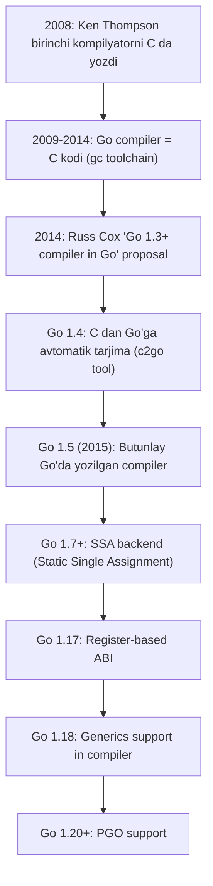
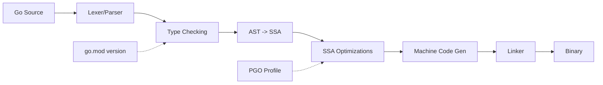
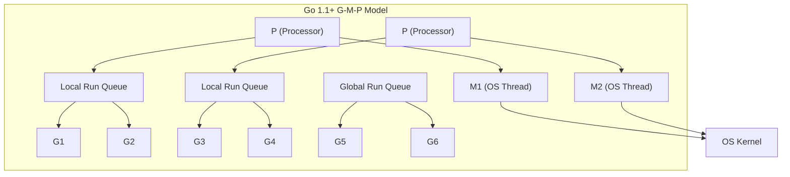
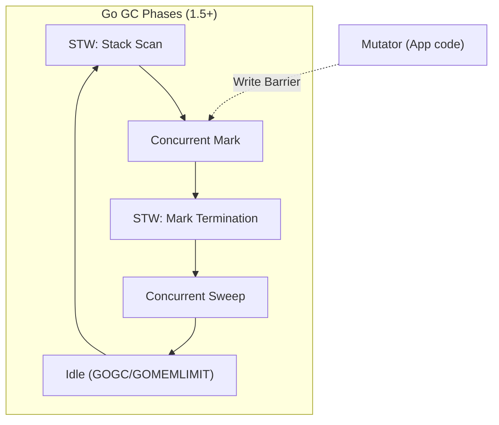
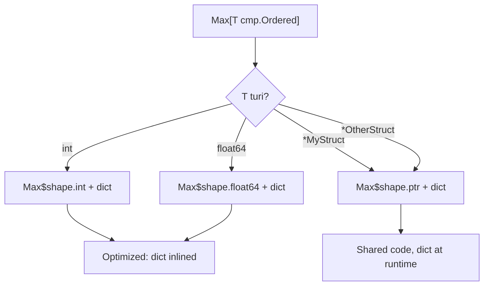
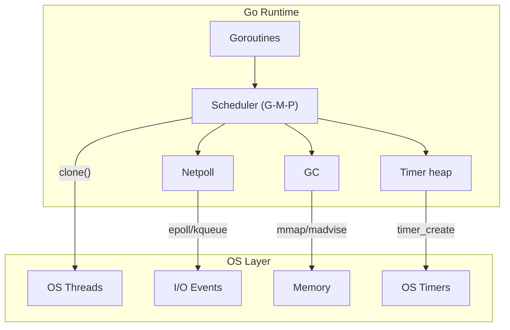

# History of Go — Professional Level (Under the Hood)

## Table of Contents

1. [Introduction](#1-introduction)
2. [How It Works Internally](#2-how-it-works-internally)
3. [Runtime Deep Dive](#3-runtime-deep-dive)
4. [Compiler Perspective](#4-compiler-perspective)
5. [Memory Layout](#5-memory-layout)
6. [OS / Syscall Level](#6-os--syscall-level)
7. [Source Code Walkthrough](#7-source-code-walkthrough)
8. [Assembly Output Analysis](#8-assembly-output-analysis)
9. [Performance Internals](#9-performance-internals)
10. [Edge Cases at the Lowest Level](#10-edge-cases-at-the-lowest-level)
11. [Test](#11-test)
12. [Tricky Questions](#12-tricky-questions)
13. [Summary](#13-summary)
14. [Further Reading](#14-further-reading)

---

## 1. Introduction

Bu bo'limda Go tilining ichki ishlash mexanizmlarini uning tarixi kontekstida o'rganamiz. Go'ning kompilyatori C dan Go'ga qanday ko'chirilgani, runtime (scheduler, GC) qanday evolyutsiya qilgani, generics implementation'ning internal mexanizmi, Plan 9 assembly merosi va register-based ABI ga o'tish jarayonini tahlil qilamiz.

**Bu bo'limda siz nimani o'rganasiz:**
- Go kompilyator bootstrap jarayoni (C -> Go)
- Runtime evolyutsiyasi: scheduler (G-M-P model), GC (mark-sweep -> concurrent)
- Generics implementation: GC Shape Stenciling
- Plan 9 assembly merosi va register-based ABI
- Internal data structure'lar evolyutsiyasi

---

## 2. How It Works Internally

### 2.1 Go Compiler Bootstrap Tarixi

Go kompilyatorining evolyutsiyasi dasturlash tarixi uchun muhim voqea:



**Bootstrap jarayoni:**

```
Go 1.4 (C kompilyator) kompilyatsiya qiladi -> Go 1.5 source -> Go 1.5 binary
Go 1.5 binary kompilyatsiya qiladi -> Go 1.6 source -> Go 1.6 binary
...
Go 1.N-1 binary kompilyatsiya qiladi -> Go 1.N source -> Go 1.N binary
```

**Hozirgi bootstrap talabi:** Go 1.22 ni build qilish uchun Go 1.20+ kerak. Ya'ni bootstrap uchun eng kamida 4 versiya oldingi Go kerak.

### 2.2 Compiler Pipeline



**Tarixiy o'zgarishlar:**
- **Go 1.0-1.4**: AST -> machine code (SSA yo'q)
- **Go 1.7+**: AST -> SSA -> machine code (yaxshiroq optimizatsiya)
- **Go 1.17+**: Register-based calling convention
- **Go 1.18+**: Generics uchun type parameter instantiation
- **Go 1.20+**: PGO feedback loop

### 2.3 Go Compiler vs GCC-Go vs TinyGo

| Jihat | gc (official) | gccgo | TinyGo |
|-------|---------------|-------|--------|
| **Yaratilgan** | 2008 (C), 2015 (Go) | 2009 (GCC frontend) | 2018 (LLVM backend) |
| **Backend** | Custom SSA | GCC | LLVM |
| **Optimizatsiya** | Tez kompilyatsiya uchun o'rtacha | GCC darajasida | LLVM darajasida |
| **Binary hajmi** | O'rta (~5-15MB) | Katta (~20-50MB) | Juda kichik (~50KB-1MB) |
| **Target** | Desktop, Server | Desktop, Server | Embedded, WASM |
| **Generics** | Go 1.18+ | Go 1.18+ | Qisman |
| **GC** | Concurrent mark-sweep | Boehm GC | Conservative GC |

---

## 3. Runtime Deep Dive

### 3.1 Scheduler Evolyutsiyasi (G-M-P Model)

Go scheduler tarixi — concurrency runtime'ning eng muhim qismi:

```
G = Goroutine (foydalanuvchi kodi)
M = Machine thread (OS thread)
P = Processor (logik protsessor, GOMAXPROCS bilan belgilanadi)
```

**Evolyutsiya:**

| Versiya | Scheduler modeli | Xususiyat |
|---------|-----------------|-----------|
| Go 1.0 | G-M (P yo'q) | Global mutex, sekin |
| Go 1.1 | G-M-P | Work-stealing, local run queue |
| Go 1.2 | G-M-P + preemption (cooperative) | `runtime.Gosched()` kerak |
| Go 1.4 | Goroutine stack: segmented -> contiguous | Stack copy, yaxshiroq performance |
| Go 1.14 | **Asynchronous preemption** | Signal-based, tight loop muammosi hal |
| Go 1.21+ | Improved scheduling | Timer integration, latency kamaytirish |



**Go 1.14 Asynchronous Preemption — nima o'zgardi?**

```go
package main

import (
	"fmt"
	"runtime"
	"time"
)

func main() {
	runtime.GOMAXPROCS(1)

	// Go 1.13 va oldingi: bu goroutine boshqa goroutine'larni bloklaydi
	// Go 1.14+: signal-based preemption orqali to'xtatiladi
	go func() {
		// Tight loop — hech qanday function call yo'q
		i := 0
		for {
			i++
			// Go 1.13-: bu goroutine abadiy ishlaydi
			// Go 1.14+: OS signal orqali preempt qilinadi
		}
	}()

	time.Sleep(100 * time.Millisecond)
	fmt.Println("Bu xabar Go 1.14+ da chop etiladi")
	// Go 1.13 da bu xabar HECH QACHON chop etilmaydi
}
```

### 3.2 Garbage Collector Evolyutsiyasi

Go GC — tilning eng ko'p o'zgargan ichki komponenti:

| Versiya | GC turi | Pause vaqti | Xususiyat |
|---------|---------|-------------|-----------|
| Go 1.0 | Stop-the-world mark-sweep | 10-300ms | Oddiy, lekin sekin |
| Go 1.1 | Parallel GC | 5-100ms | Ko'p yadro qo'llanildi |
| Go 1.3 | Precise GC | 5-50ms | Stack/heap to'g'ri ajratildi |
| Go 1.4 | Kontiguous stacks | 3-30ms | Stack shrinking |
| Go 1.5 | **Concurrent mark-sweep** | <10ms | Katta breakthrough |
| Go 1.6 | Improved concurrent GC | <5ms | Write barrier yaxshilandi |
| Go 1.8 | Sub-millisecond GC | <1ms | STW faqat stack scan uchun |
| Go 1.12 | Sweep improvements | <500us | Background sweep |
| Go 1.19 | **GOMEMLIMIT** | <500us | Soft memory limit |
| Go 1.24 | Swiss table map | <500us | Map GC scan yaxshilandi |



### 3.3 Stack Management Evolution

```
Go 1.0-1.3: Segmented stacks (split stacks)
  [Stack Segment 1] -> [Stack Segment 2] -> [Stack Segment 3]
  Muammo: "hot split" — stack boundary'da tez-tez switch

Go 1.4+: Contiguous stacks (stack copying)
  [        Bitta katta stack (kerak bo'lganda kopiya)        ]
  Afzallik: Hot split muammosi yo'q, yaxshiroq performance

  Initial size: 2KB (Go 1.4) -> 8KB (hozir default)
  Maximum: OS limit (default 1GB)
```

---

## 4. Compiler Perspective

### 4.1 SSA (Static Single Assignment) — Go 1.7+

Go 1.7 da SSA backend qo'shilishi kompilyator optimizatsiyasini sezilarli yaxshiladi:

```go
// Original Go code
func add(a, b int) int {
    c := a + b
    if c > 10 {
        c = c * 2
    }
    return c
}
```

**SSA representation (simplified):**
```
b1:
    v1 = Parameter <int> {a}
    v2 = Parameter <int> {b}
    v3 = Add64 <int> v1 v2        // c = a + b
    v4 = Const64 <int> [10]
    v5 = Less64 <bool> v4 v3      // c > 10
    If v5 -> b2 b3

b2: // c > 10
    v6 = Const64 <int> [2]
    v7 = Mul64 <int> v3 v6        // c = c * 2
    Goto b3

b3:
    v8 = Phi <int> v3 v7          // c (from b1 or b2)
    Return v8
```

**SSA qo'shilgach yaxshilangan optimizatsiyalar:**
- Dead code elimination
- Common subexpression elimination
- Bounds check elimination
- Nil check elimination
- Escape analysis improvements

### 4.2 Generics Implementation — GC Shape Stenciling

Go 1.18 da generics qanday implement qilinganini chuqur ko'rib chiqamiz:

```go
// Yozilgan kod
func Max[T cmp.Ordered](a, b T) T {
    if a > b {
        return a
    }
    return b
}

// Chaqiruvlar
Max(3, 7)       // Max[int]
Max(2.5, 1.8)   // Max[float64]
Max("a", "b")   // Max[string]
```

**Compiler ichida nima sodir bo'ladi:**

```
GC Shape Stenciling strategiyasi:

1. Pointer turlari uchun: BITTA funksiya
   - Max[*int], Max[*string], Max[*MyStruct] -> bitta Max[gcshape.*uint8]
   - Sabab: barcha pointer'lar bir xil hajmda (8 byte on amd64)

2. Value turlari uchun: HAR XIL funksiya
   - Max[int] -> Max$shape.int
   - Max[float64] -> Max$shape.float64
   - Max[string] -> Max$shape.string
   - Sabab: turli hajm, turli operatsiyalar

3. Dictionary passing:
   - Har bir generic chaqiruvda "dictionary" pointer uzatiladi
   - Dictionary ichida: type descriptor, method table
```



### 4.3 Register-Based ABI (Go 1.17)

Go 1.17 da calling convention stack-based'dan register-based'ga o'tdi:

```
Go 1.16 va oldingi (stack-based):
  func add(a, b int) int

  Caller:
    MOVQ a, 0(SP)     // a ni stack'ga qo'yish
    MOVQ b, 8(SP)     // b ni stack'ga qo'yish
    CALL add
    MOVQ 16(SP), ret   // natijani stack'dan olish

Go 1.17+ (register-based):
  func add(a, b int) int

  Caller:
    MOVQ a, AX         // a ni AX registr'ga
    MOVQ b, BX         // b ni BX registr'ga
    CALL add
    MOVQ AX, ret       // natija AX da
```

**Ta'siri:**
- ~5% umumiy performance yaxshilanishi
- Stack memory usage kamayishi
- Function call overhead kamayishi

**ABI internal registers (amd64):**
```
Integer arguments: AX, BX, CX, DI, SI, R8, R9, R10, R11
Integer results:   AX, BX, CX, DI, SI, R8, R9, R10, R11
Float arguments:   X0-X14
Float results:     X0-X14
```

---

## 5. Memory Layout

### 5.1 Go Object Memory Layout Evolyutsiyasi

```
String (barcha versiyalar):
  +--------+--------+
  | pointer|  len   |    16 bytes (amd64)
  +--------+--------+

Slice (barcha versiyalar):
  +--------+--------+--------+
  | pointer|  len   |  cap   |    24 bytes (amd64)
  +--------+--------+--------+

Interface (Go 1.0+):
  +--------+--------+
  |  itab  |  data  |    16 bytes
  +--------+--------+
  itab: type + method table pointer

Map (Go 1.0 - Go 1.23):
  +--------+--------+--------+--------+
  | count  | flags  |   B    |  ...   |    Hash table with buckets
  +--------+--------+--------+--------+
  Bucket: 8 key-value pairs + overflow pointer

Map (Go 1.24+ Swiss Table):
  +--------+--------+--------+--------+
  | count  | seed   | groups |  ...   |    Swiss table layout
  +--------+--------+--------+--------+
  Group: metadata bytes + slots (SIMD-friendly)
```

### 5.2 Goroutine Stack Layout

```
Go 1.4+ Contiguous Stack:

High Address
  +------------------+
  |   Return values  |
  +------------------+
  |   Arguments      |    <- Go 1.16- (stack-based ABI)
  +------------------+    <- Go 1.17+ arguments registr'larda
  |   Local vars     |
  +------------------+
  |   Frame pointer  |    <- Go 1.7+ (optional, default on)
  +------------------+
  |   Return address |
  +------------------+
  |   Saved regs     |
  +------------------+
  |     ...          |
  +------------------+
  |   Stack guard    |    <- Stack growth check
  +------------------+
Low Address

Initial size: 8KB (Go 1.19+)
Growth: 2x (copy to bigger allocation)
Shrink: GC checks, shrink during scan
```

### 5.3 Channel Internal Structure

```go
// runtime/chan.go (simplified)
type hchan struct {
    qcount   uint           // Elementlar soni
    dataqsiz uint           // Buffer hajmi
    buf      unsafe.Pointer // Circular buffer
    elemsize uint16         // Element hajmi
    closed   uint32         // Yopilgan flag
    elemtype *_type         // Element turi
    sendx    uint           // Send index
    recvx    uint           // Receive index
    recvq    waitq          // Kutayotgan receiver'lar
    sendq    waitq          // Kutayotgan sender'lar
    lock     mutex          // Mutex
}

// Go 1.0: oddiy mutex-based
// Go 1.1+: optimized lock, batch operations
// Go 1.19+: improved fairness
```

---

## 6. OS / Syscall Level

### 6.1 Go Runtime va OS Interaction



**Platform-specific syscall'lar:**

| Funksiya | Linux | macOS | Windows |
|----------|-------|-------|---------|
| Thread yaratish | `clone()` | `pthread_create()` | `CreateThread()` |
| I/O polling | `epoll` | `kqueue` | `IOCP` |
| Memory alloc | `mmap` + `madvise` | `mmap` | `VirtualAlloc` |
| Signals | `sigaction` | `sigaction` | `SetConsoleCtrlHandler` |
| Preemption (1.14+) | `SIGURG` | `SIGURG` | `SuspendThread` |

### 6.2 Plan 9 Assembly Heritage

Go'ning assembler'i Plan 9 operatsion tizimidan meros. Ken Thompson Plan 9 yaratuvchisi — bu Go'ning assembly sintaksisiga bevosita ta'sir qildi:

```
Plan 9 assembly xususiyatlari Go'da:
1. Pseudo-registers: SB (Static Base), FP (Frame Pointer), SP (Stack Pointer), PC
2. Platform-independent syntax (AT&T/Intel emas)
3. NOSPLIT, NOPTR kabi directives
```

```
// Go assembly misol (Plan 9 syntax)
TEXT ·Add(SB), NOSPLIT, $0-24
    MOVQ    a+0(FP), AX      // Go 1.16- style (stack args)
    MOVQ    b+8(FP), BX
    ADDQ    BX, AX
    MOVQ    AX, ret+16(FP)
    RET

// Go 1.17+ register ABI:
TEXT ·Add(SB), NOSPLIT, $0-0
    // a -> AX, b -> BX (register passing)
    ADDQ    BX, AX
    // result -> AX (register return)
    RET
```

**Plan 9 pseudo-register'lar:**

| Register | Vazifasi |
|----------|----------|
| `SB` | Static Base — global symbol'larga murojaat |
| `FP` | Frame Pointer — funksiya argumentlari (Go 1.16-) |
| `SP` | Stack Pointer — local o'zgaruvchilar |
| `PC` | Program Counter — joriy instruction |

---

## 7. Source Code Walkthrough

### 7.1 Go Runtime Source Structure

```
$GOROOT/src/runtime/
├── asm_amd64.s          # Assembly entry points
├── chan.go               # Channel implementation
├── gc.go                 # Garbage collector
├── lock.go               # Runtime mutex
├── malloc.go             # Memory allocator
├── map.go                # Map implementation (< Go 1.24)
├── map_swiss.go          # Swiss table map (Go 1.24+)
├── mgc.go                # GC main loop
├── mheap.go              # Heap management
├── os_linux.go           # Linux-specific code
├── panic.go              # Panic/recover
├── proc.go               # Scheduler (G-M-P)
├── runtime2.go           # Core data structures (g, m, p)
├── select.go             # Select statement
├── signal_unix.go        # Signal handling
├── stack.go              # Stack management
└── stubs.go              # Assembly function declarations
```

### 7.2 Goroutine Structure (runtime2.go)

```go
// runtime/runtime2.go (simplified — actual struct is much larger)
type g struct {
    stack       stack   // Stack bounds
    stackguard0 uintptr // Stack growth check
    stackguard1 uintptr // For C stack growth

    m           *m      // Current M (OS thread)
    sched       gobuf   // Scheduling info

    goid        uint64  // Goroutine ID
    status      uint32  // Goroutine status

    // Go 1.14+ preemption
    preempt     bool    // Preemption signal
    preemptStop bool    // Stop for GC

    // Go 1.21+ timer
    timer       *timer  // Sleep timer
}

type gobuf struct {
    sp   uintptr // Stack pointer
    pc   uintptr // Program counter
    g    guintptr
    ctxt unsafe.Pointer
    ret  uintptr
    lr   uintptr // Link register (ARM)
    bp   uintptr // Frame pointer (Go 1.7+)
}
```

### 7.3 Scheduler Core (proc.go)

```go
// runtime/proc.go (simplified)

// schedule finds a runnable goroutine and executes it.
func schedule() {
    gp, inheritTime, tryWakeP := findRunnable() // blocks until work available

    // Go 1.14+: check for preemption
    if gp.preempt {
        // Handle preemption
    }

    execute(gp, inheritTime)
}

// findRunnable — goroutine topish tartibi:
// 1. Local run queue (P.runq)
// 2. Global run queue (sched.runq)
// 3. Netpoll (ready I/O goroutines)
// 4. Work stealing (boshqa P dan olish)
func findRunnable() (gp *g, inheritTime, tryWakeP bool) {
    // ... 400+ lines of scheduling logic
}
```

### 7.4 GC Write Barrier

```go
// runtime/mbarrier.go (simplified)

// Go 1.5+ concurrent GC uchun write barrier kerak
// Har safar pointer yozilganda GC xabardor bo'lishi kerak

//go:nosplit
func writeBarrier(dst *uintptr, src uintptr) {
    // Shade the pointer — GC mark phase uchun
    if writeBarrier.enabled {
        shade(src)     // Mark the new value
        shade(*dst)    // Mark the old value (Yuasa-style)
    }
    *dst = src
}

// Evolyutsiya:
// Go 1.5: Dijkstra write barrier (faqat new value shade)
// Go 1.8+: Hybrid write barrier (Dijkstra + Yuasa)
//   - Stack pointers uchun barrier kerak emas
//   - STW vaqtini sezilarli kamaytirdi
```

---

## 8. Assembly Output Analysis

### 8.1 Simple Function — Versiyalar Bo'yicha

```go
package main

func add(a, b int) int {
    return a + b
}
```

**Assembly output ko'rish:**
```bash
go build -gcflags="-S" main.go 2>&1 | grep -A 20 '"".add'
# yoki
go tool compile -S main.go
# yoki (Go 1.22+)
GOFLAGS="-gcflags=-S" go build .
```

**Go 1.16 (stack-based ABI):**
```asm
"".add STEXT nosplit size=19
    MOVQ    "".a+8(SP), AX      ; a ni stack'dan olish
    ADDQ    "".b+16(SP), AX     ; b ni qo'shish
    MOVQ    AX, "".~r2+24(SP)   ; natijani stack'ga yozish
    RET
```

**Go 1.17+ (register-based ABI):**
```asm
"".add STEXT nosplit size=4
    ADDQ    BX, AX               ; a(AX) + b(BX) = result(AX)
    RET
```

**Farq:** 19 bytes -> 4 bytes. Register ABI dramatically more efficient.

### 8.2 Generic Function Assembly

```go
package main

import "cmp"

func Max[T cmp.Ordered](a, b T) T {
    if a > b {
        return a
    }
    return b
}

var x = Max(3, 7)
var y = Max(2.5, 1.8)
```

```bash
go build -gcflags="-S" main.go 2>&1
```

**Natija (simplified):**
```asm
; Max[int] — stenciled for int
"".Max[go.shape.int] STEXT size=20
    CMPQ    BX, AX
    JLE     skip
    MOVQ    BX, AX
skip:
    RET

; Max[float64] — stenciled for float64
"".Max[go.shape.float64] STEXT size=28
    UCOMISD X1, X0
    JBE     skip
    MOVSD   X1, X0
skip:
    RET

; Dictionary pointer — har bir chaqiruvda uzatiladi
; lekin kompilyator ko'p hollarda inline qiladi
```

### 8.3 Map Operations — Before and After Swiss Table

```bash
# Go 1.23 (oldingi map implementation)
GOEXPERIMENT=noswissmap go build -gcflags="-S" main.go

# Go 1.24 (Swiss table)
go build -gcflags="-S" main.go
```

**Swiss table afzalliklari assembly darajasida:**
- Group metadata bytes: SIMD instruction bilan bir vaqtda 8/16 slot tekshirish
- Better cache locality: metadata va data alohida
- Deletion: tombstone o'rniga group-level metadata

---

## 9. Performance Internals

### 9.1 GC Tuning Internals

```go
package main

import (
	"fmt"
	"runtime"
	"runtime/debug"
	"time"
)

func main() {
	// GOGC internal mexanizmi:
	// Keyingi GC = HeapLive * (1 + GOGC/100)
	// Default GOGC=100: keyingi GC = HeapLive * 2

	// Go 1.19+ GOMEMLIMIT:
	// GC ishga tushadi qachon: min(GOGC target, GOMEMLIMIT)
	debug.SetGCPercent(100)      // GOGC=100
	debug.SetMemoryLimit(1 << 30) // 1 GiB limit

	// GC statistikasi
	var stats debug.GCStats
	debug.ReadGCStats(&stats)
	fmt.Println("GC cycles:", stats.NumGC)
	fmt.Println("Last GC pause:", stats.Pause[0])

	// Memory statistikasi
	var m runtime.MemStats
	runtime.ReadMemStats(&m)
	fmt.Printf("HeapAlloc: %d MB\n", m.HeapAlloc/1024/1024)
	fmt.Printf("HeapSys: %d MB\n", m.HeapSys/1024/1024)
	fmt.Printf("HeapIdle: %d MB\n", m.HeapIdle/1024/1024)
	fmt.Printf("HeapInuse: %d MB\n", m.HeapInuse/1024/1024)
	fmt.Printf("NumGC: %d\n", m.NumGC)
	fmt.Printf("GCCPUFraction: %.6f\n", m.GCCPUFraction)
	fmt.Printf("PauseNs (last): %d ns\n", m.PauseNs[(m.NumGC+255)%256])

	// Allocation benchmark
	start := time.Now()
	for i := 0; i < 1000000; i++ {
		_ = make([]byte, 1024)
	}
	fmt.Printf("\n1M allocations: %v\n", time.Since(start))

	runtime.ReadMemStats(&m)
	fmt.Printf("After allocations:\n")
	fmt.Printf("  HeapAlloc: %d MB\n", m.HeapAlloc/1024/1024)
	fmt.Printf("  NumGC: %d\n", m.NumGC)
	fmt.Printf("  TotalAlloc: %d MB\n", m.TotalAlloc/1024/1024)
}
```

### 9.2 PGO Internals

```
PGO Pipeline Internal:

1. CPU profil yig'ish (pprof format)
   - Sampling: har 10ms da stack trace olish
   - Format: protobuf (profile.proto)

2. Profil tahlili (compiler):
   - Hot functions aniqlash
   - Hot edges (call graph) aniqlash
   - Loop va branch frequency

3. Optimizatsiya qarorlari:
   - Inlining budget oshirish (hot functions)
   - Devirtualization (interface -> concrete type)
   - Branch prediction hints
   - Register allocation prioritet

4. Natija: ~2-7% umumiy tezlanish
```

### 9.3 Escape Analysis

```go
package main

// go build -gcflags="-m" main.go
// ko'rsatadi qaysi o'zgaruvchilar heap'ga "escape" qiladi

func noEscape() int {
	x := 42       // stack'da qoladi
	return x       // qiymat kopiya qilinadi
}

func escapeToHeap() *int {
	x := 42        // heap'ga ko'chiriladi
	return &x      // pointer qaytarilmoqda — escape!
}

func escapeInterface() interface{} {
	x := 42
	return x        // interface{} boxing — heap allocation
	// Go 1.18+ "any" ham xuddi shunday
}

// Go 1.20+: escape analysis yaxshilandi
// Ko'proq holatlarda stack allocation ishlatiladi
```

```bash
go build -gcflags="-m -m" main.go 2>&1
# Natija:
# ./main.go:8:2: x does not escape
# ./main.go:12:2: moved to heap: x
# ./main.go:17:9: x escapes to heap
```

---

## 10. Edge Cases at the Lowest Level

### 10.1 Goroutine Stack Growth Corner Case

```go
package main

import (
	"fmt"
	"runtime"
)

// Chuqur rekursiya — stack growth trigger
func deepRecursion(n int) int {
	if n <= 0 {
		// Stack hajmini tekshirish
		var buf [64]byte
		runtime.Stack(buf[:], false)
		return 0
	}
	// Har bir chaqiruvda stack frame ~100 bytes
	// Initial stack: 8KB
	// 100 chaqiruvdan keyin: stack grow trigger
	var padding [64]byte
	_ = padding
	return deepRecursion(n-1) + 1
}

func main() {
	// Stack growth: runtime stack'ni 2x ga oshiradi
	// va BUTUN stack'ni yangi joyga KOPIYA qiladi
	// Bu barcha pointer'larni yangilashni talab qiladi
	result := deepRecursion(10000)
	fmt.Println("Depth:", result)

	var m runtime.MemStats
	runtime.ReadMemStats(&m)
	fmt.Printf("Stack in use: %d KB\n", m.StackInuse/1024)
	fmt.Printf("Stack sys: %d KB\n", m.StackSys/1024)
}
```

### 10.2 Map Concurrent Access Detection

```go
package main

import (
	"fmt"
	"sync"
)

func main() {
	// Go 1.6+ da map concurrent access detection qo'shildi
	// Bu runtime check — compile time emas!
	m := make(map[int]int)
	var wg sync.WaitGroup

	// Bu KOD PANIC QILADI: "concurrent map writes"
	// Go 1.6 dan oldin: silent data corruption
	// Go 1.6+: fatal error
	for i := 0; i < 10; i++ {
		wg.Add(1)
		go func(n int) {
			defer wg.Done()
			m[n] = n // PANIC: concurrent map writes
		}(i)
	}
	wg.Wait()

	// TO'G'RI: sync.Map yoki mutex ishlatish
	var sm sync.Map
	for i := 0; i < 10; i++ {
		wg.Add(1)
		go func(n int) {
			defer wg.Done()
			sm.Store(n, n)
		}(i)
	}
	wg.Wait()

	sm.Range(func(key, value any) bool {
		fmt.Printf("%v: %v\n", key, value)
		return true
	})
}
```

### 10.3 Finalizer va Weak Pointer Evolution

```go
package main

import (
	"fmt"
	"runtime"
	"weak" // Go 1.24+
)

type Resource struct {
	Name string
	data []byte
}

func main() {
	// runtime.SetFinalizer — Go 1.0 dan beri
	// Lekin finalizer'lar ishonchsiz — GC qachon ishlashini bilmaysiz
	r := &Resource{Name: "test", data: make([]byte, 1024)}
	runtime.SetFinalizer(r, func(r *Resource) {
		fmt.Println("Finalized:", r.Name)
	})

	// Go 1.24+: Weak pointers — yanada yaxshi pattern
	// Weak pointer GC ni bloklamaydi
	wp := weak.Make(r)

	// r ni hali ishlatamiz
	fmt.Println("Resource:", r.Name)

	// r ga murojaat yo'qolganidan keyin
	r = nil
	runtime.GC()

	// Weak pointer orqali tekshirish
	if strong := wp.Value(); strong != nil {
		fmt.Println("Hali tirik:", strong.Name)
	} else {
		fmt.Println("GC tomonidan yig'ildi")
	}
}
```

### 10.4 unsafe.Pointer va Go Version Risks

```go
package main

import (
	"fmt"
	"unsafe"
)

type OldStyle struct {
	// Go 1.17 dan oldin reflect.SliceHeader ishlatilardi
	// Bu DEPRECATED va XAVFLI
	// Sabab: GC bu pointer'ni bilmaydi
}

func main() {
	// Go versiyalar orasida internal layout o'zgarishi mumkin
	// unsafe ishlatgan kod Go 1 promise TASHQARISIDA

	s := "Hello, Go!"

	// Xavfli: string internal struct'ga murojaat
	// Bu Go 1.20+ da o'zgarishi mumkin
	type stringHeader struct {
		Data unsafe.Pointer
		Len  int
	}

	header := (*stringHeader)(unsafe.Pointer(&s))
	fmt.Printf("String data pointer: %v\n", header.Data)
	fmt.Printf("String length: %d\n", header.Len)

	// TAVSIYA: unsafe.StringData (Go 1.20+)
	ptr := unsafe.StringData(s)
	fmt.Printf("StringData: %v\n", ptr)
	fmt.Printf("Length: %d\n", len(s))

	// unsafe.Slice (Go 1.17+)
	bytes := unsafe.Slice(ptr, len(s))
	fmt.Printf("Bytes: %v\n", bytes)
}
```

---

## 11. Test

### Savol 1
Go kompilyatori qaysi versiyada C dan Go'ga to'liq ko'chirildi?

- A) Go 1.3
- B) Go 1.4
- C) Go 1.5
- D) Go 1.7

<details>
<summary>Javob</summary>
C) Go 1.5 (2015). Go 1.4 da c2go tool ishlatildi (avtomatik tarjima), Go 1.5 da esa butunlay Go'da yozilgan kompilyator ishga tushdi.
</details>

### Savol 2
SSA (Static Single Assignment) backend qaysi versiyada qo'shildi?

- A) Go 1.5
- B) Go 1.7
- C) Go 1.11
- D) Go 1.17

<details>
<summary>Javob</summary>
B) Go 1.7. SSA backend kompilyator optimizatsiyalarini sezilarli yaxshiladi: dead code elimination, bounds check elimination, nil check elimination.
</details>

### Savol 3
Go 1.14 dagi asynchronous preemption qanday ishlaydi?

- A) Timer interrupt
- B) OS signal (SIGURG)
- C) Function call hooks
- D) Hardware breakpoint

<details>
<summary>Javob</summary>
B) OS signal — Linux/macOS da SIGURG signali yuboriladi. Bu tight loop'da ham goroutine'ni to'xtatish imkonini beradi. Go 1.13 da cooperative preemption edi (faqat function call'da preempt qilinardi).
</details>

### Savol 4
GC Shape Stenciling nima?

- A) GC algoritmi
- B) Generics implementation strategiyasi
- C) Memory layout optimizatsiyasi
- D) Stack management usuli

<details>
<summary>Javob</summary>
B) Generics implementation strategiyasi. Pointer turlari uchun bitta funksiya, value turlari uchun alohida funksiyalar generatsiya qilinadi. Bu monomorphization va type erasure orasidagi kompromiss.
</details>

### Savol 5
Register-based ABI (Go 1.17) qanday performance ta'siri ko'rsatdi?

- A) ~1%
- B) ~5%
- C) ~15%
- D) ~30%

<details>
<summary>Javob</summary>
B) ~5% umumiy performance yaxshilanishi. Function call overhead sezilarli kamaydi — argumentlar va natijalar registr'larda uzatiladi, stack memory usage ham kamaydi.
</details>

### Savol 6
Go'ning Plan 9 assembly merosi nimalarni o'z ichiga oladi?

- A) Faqat syntax
- B) Pseudo-registers (SB, FP, SP, PC) va platform-independent syntax
- C) Faqat naming convention
- D) Assembly language butunlay boshqa

<details>
<summary>Javob</summary>
B) Plan 9 assembly'dan pseudo-registers (SB, FP, SP, PC), platform-independent syntax va NOSPLIT/NOPTR kabi directives meros qolgan. Ken Thompson Plan 9 yaratuvchisi bo'lgani uchun bu ta'sir tabiiy.
</details>

### Savol 7
Go 1.24 dagi Swiss table map oldingi map'dan qanday farq qiladi?

- A) Faqat hajmi kichikroq
- B) SIMD-friendly metadata, yaxshiroq cache locality
- C) Faqat concurrent bo'lgan
- D) Faqat string key'lar uchun

<details>
<summary>Javob</summary>
B) Swiss table metadata bytes'ni SIMD instruction bilan tekshiradi, data va metadata alohida joylashtiriladi (cache-friendly), deletion tombstone o'rniga group-level metadata ishlatadi. Natija: ~15-30% tezroq lookup.
</details>

### Savol 8
Go GC hybrid write barrier (Go 1.8+) nima uchun muhim?

- A) Memory leak'larni oldini oladi
- B) STW vaqtini sub-millisecond ga kamaytirdi
- C) Goroutine'larni tezlashtirdi
- D) Kompilyatsiya vaqtini qisqartirdi

<details>
<summary>Javob</summary>
B) Hybrid write barrier (Dijkstra + Yuasa) stack pointer'lar uchun barrier kerak emasligini aniqladi. Bu STW (stop-the-world) vaqtini sub-millisecond darajaga tushirdi — web server'lar uchun kritik yaxshilanish.
</details>

### Savol 9
Escape analysis nimani aniqlaydi?

- A) Qaysi goroutine'lar bloklangan
- B) Qaysi o'zgaruvchilar stack'dan heap'ga ko'chirilishi kerak
- C) Qaysi funksiyalar inline qilinishi kerak
- D) Qaysi type'lar comparable ekanligi

<details>
<summary>Javob</summary>
B) Escape analysis kompilyatsiya vaqtida aniqlaydi: agar o'zgaruvchi funksiyadan tashqariga "escape" qilsa (pointer qaytarilsa, interface'ga qo'yilsa, goroutine'ga uzatilsa) — u heap'da allokatsiya qilinadi. Aks holda stack'da qoladi (tezroq, GC ishlamaydi).
</details>

### Savol 10
Go'ning bootstrap jarayonida hozir minimal qaysi Go versiya kerak?

- A) Go 1.4
- B) Go 1.17
- C) Go 1.20
- D) Go 1.22

<details>
<summary>Javob</summary>
C) Go 1.20. Hozirgi Go versiyalarini bootstrap qilish (source'dan build) uchun Go 1.20 yoki undan yangi versiya kerak. Bootstrap chain: Go 1.20 -> source -> yangi binary.
</details>

---

## 12. Tricky Questions

### Savol 1: Nima uchun Go concurrent GC'da STW hamon mavjud, va uni butunlay olib tashlash mumkinmi?

<details>
<summary>Javob</summary>
Go'ning concurrent GC'da ikkita qisqa STW fazasi mavjud: (1) Mark boshlash — barcha goroutine'larning stack'larini scan qilish uchun. Bu kerak, chunki stack pointer'lar write barrier orqali kuzatilmaydi (hybrid write barrier strategiyasi). (2) Mark tugatish — mark fazasi haqiqatan tugaganligini tekshirish. STW ni butunlay olib tashlash nazariy jihatdan mumkin (Azul C4 GC shunday qiladi), lekin bu juda murakkab va Go jamoasi sub-millisecond STW ni yetarli deb hisoblaydi. Trade-off: mutator throughput vs GC murakkabligi.
</details>

### Savol 2: Register-based ABI internal implementation'da backward compatibility qanday ta'minlandi?

<details>
<summary>Javob</summary>
Go 1.17 register ABI ni joriy etishda bir nechta qatlam ishlatildi: (1) ABI wrapper — agar assembly yoki cgo orqali eski ABI bilan chaqirilsa, wrapper funksiya argumentlarni registr'lardan stack'ga va qaytarib ko'chiradi; (2) `//go:registerparams` directive — internal, asta-sekin qo'llanildi; (3) `ABIInternal` vs `ABI0` — ikki ABI bir vaqtda mavjud: ABI0 (eski, assembly uchun) va ABIInternal (yangi, Go functions uchun); (4) `go vet` eski assembly fayllarni tekshiradi va ogohlantiradi.
</details>

### Savol 3: GC Shape Stenciling monomorphization'dan nima uchun farq qiladi, va bu qanday trade-off hosil qiladi?

<details>
<summary>Javob</summary>
Monomorphization (Rust/C++): har bir concrete type uchun alohida kod. Afzallik: maximal performance, inline imkoniyati. Kamchilik: code bloat, uzoq kompilyatsiya. GC Shape Stenciling (Go): pointer turlari bitta "shape"ni ulashadi (chunki GC uchun barcha pointer'lar bir xil), value turlari uchun alohida. Afzallik: kamroq code bloat, tezroq kompilyatsiya. Kamchilik: pointer turlari uchun dictionary indirection, biroz sekinroq. Trade-off: Go kompilyatsiya tezligini saqladi, performance ~95% monomorphization darajasida (dictionary ko'p hollarda inline bo'ladi).
</details>

### Savol 4: Go'da segmented stack'lardan contiguous stack'larga o'tish nima uchun "hot split" muammosini hal qildi?

<details>
<summary>Javob</summary>
Segmented stack'larda har bir goroutine'ga kichik stack segment berilardi. Stack to'lganda yangi segment qo'shilardi (linked list). "Hot split" muammosi: agar funksiya stack boundary'da chaqirilsa, har bir chaqiruvda yangi segment allokatsiya/deallocatsiya qilinardi — bu juda sekin. Contiguous stack'larda esa: stack to'lganda butun stack 2x katta joyga KOPIYA qilinadi, barcha pointer'lar yangilanadi. Bu amortized O(1) — hot split yo'q. Trade-off: stack copy vaqt oladi, lekin bu juda kam sodir bo'ladi. Go 1.4 da bu o'zgarish goroutine performance'ni sezilarli yaxshiladi.
</details>

### Savol 5: Swiss table map implementation'da Go 1 compatibility promise qanday saqlanadi?

<details>
<summary>Javob</summary>
Go 1 promise map'ning external behavior'ini kafolatlaydi: `m[k]`, `delete(m, k)`, `range m` ishlaydi. Promise KAFOLATLAMAYDI: (1) map iteration tartibi (Go 1.0 dan beri randomized); (2) internal struct layout; (3) performance characteristics. Swiss table faqat internal implementation'ni o'zgartirdi — external API bir xil qoldi. XAVF: `unsafe.Pointer` orqali eski map struct'lariga murojaat qilgan kod (masalan, map internal bucket'lariga to'g'ridan-to'g'ri kirishgan reflection hack'lar) buziladi. Bu Go 1 promise'ning "unsafe is not covered" qoidasiga mos.
</details>

---

## 13. Summary

- **Compiler bootstrap**: C (2008) -> avtomatik tarjima (2014) -> Go self-hosting (2015) -> SSA backend (2017) -> Register ABI (2017) -> Generics (2018) -> PGO (2020)
- **Runtime scheduler**: G-M (2012) -> G-M-P (2013) -> Cooperative preemption (2014) -> Async preemption (2020) -> Timer integration (2023)
- **GC evolyutsiya**: Stop-the-world (2012) -> Concurrent mark-sweep (2015) -> Hybrid write barrier (2018) -> GOMEMLIMIT (2022) -> Sub-100us pauses
- **Generics**: GC Shape Stenciling — pointer shapes shared, value shapes separate, dictionary passing
- **Assembly**: Plan 9 merosi — pseudo-registers, platform-independent syntax
- **Register ABI**: Stack-based -> Register-based (Go 1.17), ~5% performance gain, ABI0/ABIInternal dual system
- **Memory evolution**: Segmented stacks -> Contiguous stacks (2014), Map buckets -> Swiss table (2025)
- **Performance tools**: escape analysis, PGO, GOMEMLIMIT, runtime/metrics

---

## 14. Further Reading

1. **Go Compiler Internals** — [https://go.dev/src/cmd/compile/README](https://go.dev/src/cmd/compile/README)
2. **Go Runtime Source** — [https://go.dev/src/runtime/](https://go.dev/src/runtime/)
3. **Getting to Go: The Journey of Go's Garbage Collector** — Rick Hudson (GopherCon 2018)
4. **Go GC Design Document** — [https://go.dev/s/go15gcpacing](https://go.dev/s/go15gcpacing)
5. **Proposal: Register-based ABI** — [https://go.dev/s/regabi](https://go.dev/s/regabi)
6. **Type Parameters Proposal** — [https://go.googlesource.com/proposal/+/refs/heads/master/design/43651-type-parameters.md](https://go.googlesource.com/proposal/+/refs/heads/master/design/43651-type-parameters.md)
7. **Swiss Tables Design** — [https://abseil.io/about/design/swisstables](https://abseil.io/about/design/swisstables)
8. **A Quick Guide to Go's Assembler** — [https://go.dev/doc/asm](https://go.dev/doc/asm)
9. **Contiguous Stacks Design** — [https://docs.google.com/document/d/1wAaf1rYoM4nDTJY0eDV3Wmc9zS-_lgR7_CP4bTQo41A](https://docs.google.com/document/d/1wAaf1rYoM4nDTJY0eDV3Wmc9zS-_lgR7_CP4bTQo41A)
10. **Go PGO Documentation** — [https://go.dev/doc/pgo](https://go.dev/doc/pgo)
