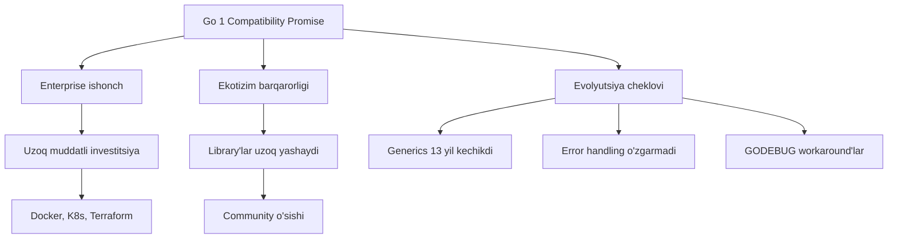
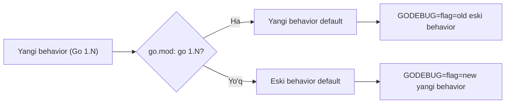
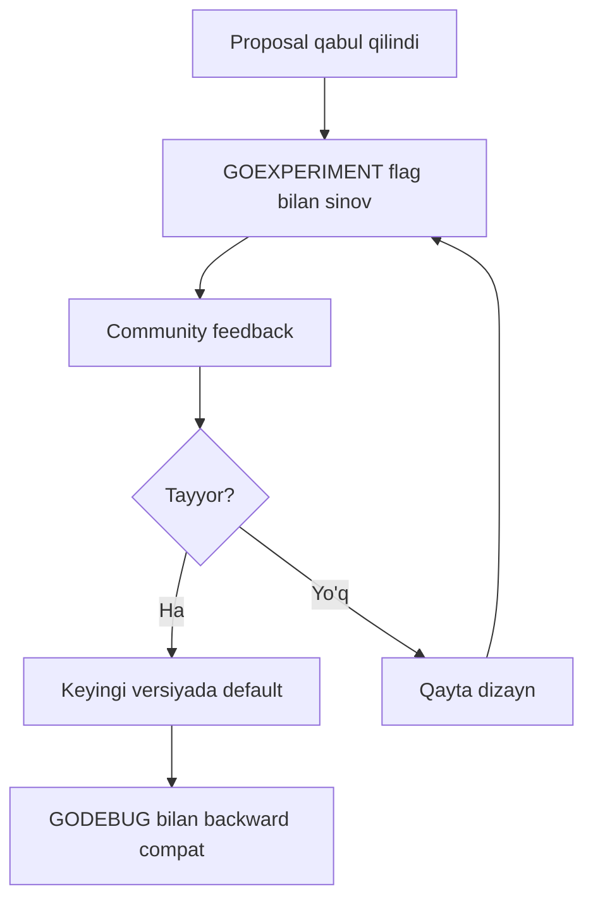
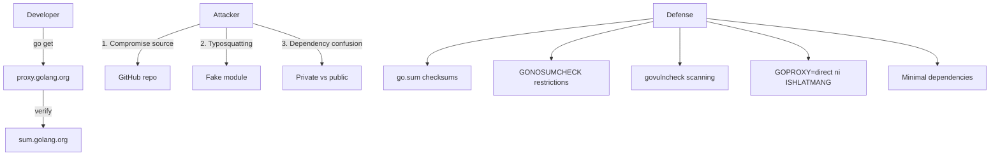
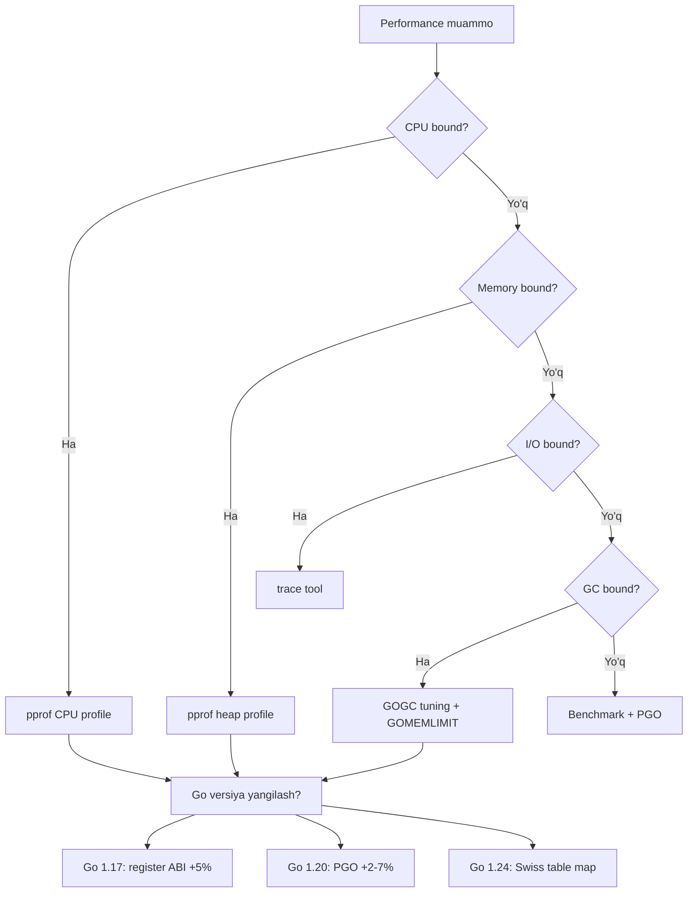
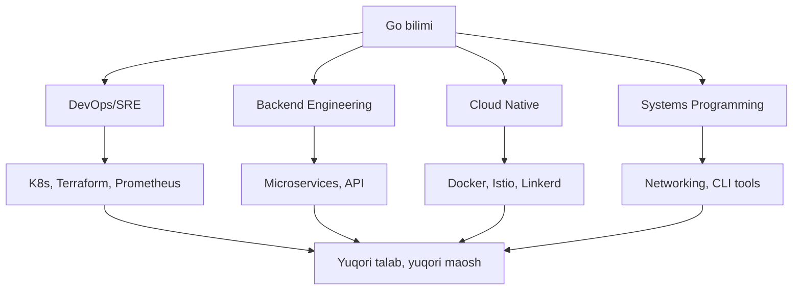
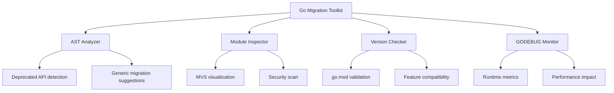

# History of Go — Senior Level

## Table of Contents

1. [Introduction](#1-introduction)
2. [Core Concepts](#2-core-concepts)
3. [Pros & Cons](#3-pros--cons)
4. [Use Cases](#4-use-cases)
5. [Code Examples](#5-code-examples)
6. [Product Use / Feature](#6-product-use--feature)
7. [Error Handling](#7-error-handling)
8. [Security Considerations](#8-security-considerations)
9. [Performance Optimization](#9-performance-optimization)
10. [Debugging Guide](#10-debugging-guide)
11. [Best Practices](#11-best-practices)
12. [Edge Cases & Pitfalls](#12-edge-cases--pitfalls)
13. [Common Mistakes](#13-common-mistakes)
14. [Tricky Points](#14-tricky-points)
15. [Comparison with Other Languages](#15-comparison-with-other-languages)
16. [Test](#16-test)
17. [Tricky Questions](#17-tricky-questions)
18. [Cheat Sheet](#18-cheat-sheet)
19. [Summary](#19-summary)
20. [What You Can Build](#20-what-you-can-build)
21. [Further Reading](#21-further-reading)
22. [Related Topics](#22-related-topics)

---

## 1. Introduction

Senior darajada Go tarixini o'rganish — bu **strategik qarorlar tahlili**, **arxitektura ta'siri** va **kelajak yo'nalishlarni bashorat qilish** demakdir. Bu bo'limda biz Go'ning dizayn falsafasi kompaniyalar miqyosida qanday ta'sir ko'rsatganini, backwards compatibility strategiyasining arxitektura qarorlariga ta'sirini, va Go'ning boshqa tillarga ko'rsatgan ta'sirini tahlil qilamiz.

**Bu bo'limda siz nimani o'rganasiz:**
- Go'ning backward compatibility strategiyasi — GODEBUG, GOEXPERIMENT, release cycle
- Katta kompaniyalarda Go migration strategiyalari
- Go'ning boshqa tillarga ta'siri (Rust, Zig, V)
- Go proposal jarayonida ishtirok etish
- Architecture decision matrix — Go ni qachon tanlash va qachon tanlmaslik
- Go karyera strategiyasi va ekotizim ta'siri

---

## 2. Core Concepts

### 2.1 Backwards Compatibility — Strategic Analysis

Go 1 Compatibility Promise — bu nafaqat texnik kafolat, balki **biznes strategiyasi**:



#### Compatibility Promise Arxitektura Ta'siri

| Ta'sir sohasi | Ijobiy | Salbiy |
|---------------|--------|--------|
| **API dizayni** | Barqaror API'lar, klient kodini buzmaydi | Ba'zi dizayn xatolarini tuzatib bo'lmaydi |
| **Library evolyutsiyasi** | v1 library'lar uzoq ishlaydi | v2 ga o'tish og'riqli (import path) |
| **Tooling** | go vet, gofmt barqaror | Yangi tool'lar qo'shish sekin |
| **Hiring** | 5 yillik Go tajriba hamon relevat | "Yangi xususiyatlar" motivatsiyasi kam |
| **Migration** | Eski kod yangi Go'da ishlaydi | Eski pattern'lar tarqaladi |

### 2.2 GODEBUG — Evolyutsion O'zgarishlar Mexanizmi

Go 1.21 dan boshlab GODEBUG Go'ning asosiy evolyutsiya vositasiga aylandi:



**GODEBUG evolyutsiya qoidalari:**
1. Yangi Go versiya yangi behavior joriy etadi
2. Agar `go.mod` da eski versiya ko'rsatilsa — eski behavior saqlanadi
3. Dasturchi GODEBUG orqali individual o'zgarishlarni boshqaradi
4. 2 major release'dan keyin eski behavior o'chirilishi mumkin

#### GODEBUG ni Production'da Boshqarish

```go
package main

import (
	"fmt"
	"runtime/debug"
)

func main() {
	// Go 1.22+ da BuildInfo orqali GODEBUG sozlamalarini ko'rish
	info, ok := debug.ReadBuildInfo()
	if !ok {
		return
	}

	for _, setting := range info.Settings {
		if setting.Key == "GODEBUG" {
			fmt.Println("GODEBUG:", setting.Value)
		}
		if setting.Key == "CGO_ENABLED" {
			fmt.Println("CGO:", setting.Value)
		}
	}

	// Runtime'da GODEBUG qiymatlarini tekshirish (Go 1.23+)
	// godebug.New("loopvar") orqali
}
```

### 2.3 GOEXPERIMENT — Experimental Features Pipeline



**Tarixiy GOEXPERIMENT misollar:**

| Flag | Go versiya | Hozirgi holati |
|------|-----------|----------------|
| `GOEXPERIMENT=fieldtrack` | 1.16+ | Hamon eksperimental |
| `GOEXPERIMENT=regabibeta` | 1.17 | Go 1.17 da rasmiy (register ABI) |
| `GOEXPERIMENT=rangefunc` | 1.22 | Go 1.23 da rasmiy |
| `GOEXPERIMENT=synctest` | 1.24 | Eksperimental |
| `GOEXPERIMENT=aliastypeparams` | 1.24 | Eksperimental |

### 2.4 Release Cycle Planning

Go'ning release cycle'i strategik ahamiyatga ega:

```
Fevral: Go 1.N chiqadi
  |
  v
Mart-Iyul: Go 1.(N+1) development
  - Proposal'lar review qilinadi
  - Yangi xususiyatlar implement qilinadi
  - GOEXPERIMENT flag'lar qo'shiladi
  |
  v
Iyul: Feature freeze
  |
  v
Iyul-Yanvar: Barqarorlashtirish
  - Beta, Release Candidate
  - Bug fix'lar
  |
  v
Fevral: Go 1.(N+1) chiqadi
```

**Strategic insight:** Go har 6 oyda yangi versiya chiqaradi. Har bir versiya ~6 oy qo'llab-quvvatlanadi (faqat security patch'lar). Ya'ni production'da har doim oxirgi 2 versiyadan birini ishlatish tavsiya etiladi.

### 2.5 Go'ning Boshqa Tillarga Ta'siri

| Til | Go'dan olgan xususiyat | Yil |
|-----|------------------------|-----|
| **Rust** | `gofmt` g'oyasi -> `rustfmt` | 2015 |
| **Zig** | Soddalik falsafasi, C interop | 2016 |
| **V** | Go-like sintaksis, tez kompilyatsiya | 2019 |
| **Carbon** | Google'da C++ o'rniga (Go tajribasi) | 2022 |
| **Mojo** | Go'ning deploy soddaligi, Python uchun | 2023 |
| **Gleam** | Go-like error handling, immutability | 2024 |

---

## 3. Pros & Cons

### Strategic Trade-off Matrix

| Qaror | Qisqa muddatli ta'sir | Uzoq muddatli ta'sir | Arxitektura ta'siri |
|-------|----------------------|----------------------|---------------------|
| **Compatibility promise** | Enterprise ishonch oshdi | Evolyutsiya sekinlashdi | API dizayni ehtiyotkor bo'ldi |
| **Generics kechiktirish** | Soddalik saqlandi | Community frustration | Interface-based dizayn dominant |
| **GC tanlash** | Xotira xavfsiz, sodda | Real-time cheklovi | Microservice arxitektura uchun ideal |
| **Module system** | GOPATH muammolari | Barqaror ekotizim | Monorepo vs multirepo ta'siri |
| **Single binary** | Deploy oson | Container revolution bilan mos | 12-factor app paradigmasi |

### Architecture Decision Matrix — Go ni Qachon Tanlash

```mermaid
quadrantChart
    title Go Architecture Decision Matrix
    x-axis Low Complexity --> High Complexity
    y-axis Low Scale --> High Scale
    quadrant-1 Go Ideal
    quadrant-2 Go Yaxshi (lekin Rust ham variant)
    quadrant-3 Go OK (Python/Node ham variant)
    quadrant-4 Go Zaif (Java/C# afzal)
    Microservices: [0.3, 0.8]
    CLI Tools: [0.2, 0.3]
    API Gateway: [0.4, 0.9]
    Data Pipeline: [0.5, 0.7]
    ML Platform: [0.8, 0.6]
    Enterprise ERP: [0.9, 0.5]
    IoT Edge: [0.3, 0.4]
    Game Engine: [0.7, 0.3]
```

---

## 4. Use Cases

### Company-Level Go Adoption Case Studies

#### Case 1: Uber — Monolith to Microservices

| Jihat | Tafsilot |
|-------|----------|
| **Muammo** | Python/Node monolith — 2000+ microservice'ga o'tish |
| **Nima uchun Go** | Tez kompilyatsiya, goroutine'lar, sodda deploy |
| **Natija** | 2000+ Go microservice'lar, o'z Go framework'i (fx) |
| **Go tarixiy ta'sir** | Go 1 promise — framework barqarorligi kafolatlangan |

#### Case 2: Dropbox — C/Python dan Go ga

| Jihat | Tafsilot |
|-------|----------|
| **Muammo** | Python — sekin, C — xotira xatolari |
| **Nima uchun Go** | GC + performance + soddalik |
| **Natija** | Storage backend Go'da qayta yozildi, 5x performance |
| **Go tarixiy ta'sir** | Self-hosting compiler (1.5) — Go ishonchliligi oshdi |

#### Case 3: Cloudflare — Edge Computing

| Jihat | Tafsilot |
|-------|----------|
| **Muammo** | Global edge proxy — past latency kerak |
| **Nima uchun Go** | Goroutine'lar, net/http, cross-compile |
| **Natija** | 300+ PoP, millionlab requestlar |
| **Go tarixiy ta'sir** | GC improvements (1.5-1.8) — latency kamaytirdi |

#### Case 4: Google — Ichki Infratuzilma

| Jihat | Tafsilot |
|-------|----------|
| **Muammo** | C++ kompilyatsiya vaqti, Java resource usage |
| **Nima uchun Go** | Go Google ichida yaratilgan — to'g'ridan-to'g'ri maqsad |
| **Natija** | dl.google.com, YouTube analytics, internal tools |
| **Go tarixiy ta'sir** | Go'ning har bir evolyutsiyasi Google ehtiyojlaridan kelib chiqadi |

---

## 5. Code Examples

### 5.1 GODEBUG Runtime Monitoring

```go
package main

import (
	"fmt"
	"internal/godebug" // Go internal — faqat standart kutubxona ichida
	"os"
	"runtime"
	"runtime/debug"
	"runtime/metrics"
	"strings"
)

// Production'da GODEBUG metrikalarini monitoring qilish
func printGODEBUG() {
	godebugVal := os.Getenv("GODEBUG")
	fmt.Println("=== GODEBUG Configuration ===")
	if godebugVal == "" {
		fmt.Println("GODEBUG: (not set)")
	} else {
		for _, kv := range strings.Split(godebugVal, ",") {
			fmt.Printf("  %s\n", kv)
		}
	}
}

// Runtime metrics orqali Go versiya ta'sirini o'lchash
func printRuntimeMetrics() {
	fmt.Println("\n=== Runtime Metrics ===")

	// Barcha mavjud metrikalar ro'yxati
	descs := metrics.All()
	fmt.Printf("Jami metrikalar soni: %d\n", len(descs))

	// GC metrikalarini olish
	samples := []metrics.Sample{
		{Name: "/gc/cycles/total:gc-cycles"},
		{Name: "/gc/heap/allocs:bytes"},
		{Name: "/gc/heap/frees:bytes"},
		{Name: "/sched/goroutines:goroutines"},
	}

	metrics.Read(samples)

	for _, s := range samples {
		switch s.Value.Kind() {
		case metrics.KindUint64:
			fmt.Printf("  %s = %d\n", s.Name, s.Value.Uint64())
		case metrics.KindFloat64:
			fmt.Printf("  %s = %.2f\n", s.Name, s.Value.Float64())
		}
	}
}

func printBuildInfo() {
	fmt.Println("\n=== Build Info ===")
	info, ok := debug.ReadBuildInfo()
	if !ok {
		fmt.Println("Build info mavjud emas")
		return
	}

	fmt.Println("Go:", info.GoVersion)
	fmt.Println("Path:", info.Path)

	for _, s := range info.Settings {
		switch s.Key {
		case "GOARCH", "GOOS", "CGO_ENABLED", "GOEXPERIMENT":
			fmt.Printf("  %s = %s\n", s.Key, s.Value)
		case "vcs.revision":
			fmt.Printf("  Git commit = %s\n", s.Value)
		case "vcs.time":
			fmt.Printf("  Git time = %s\n", s.Value)
		}
	}
}

func main() {
	fmt.Printf("Go %s on %s/%s\n\n", runtime.Version(), runtime.GOOS, runtime.GOARCH)
	printGODEBUG()
	printBuildInfo()
	printRuntimeMetrics()
}
```

### 5.2 Go Version Feature Detection Pattern

```go
package main

import (
	"fmt"
	"runtime"
	"strconv"
	"strings"
)

// GoVersion — Go versiyasini parse qilish va xususiyatlarni tekshirish
type GoVersion struct {
	Major int
	Minor int
	Patch int
}

func ParseGoVersion(v string) GoVersion {
	// "go1.23.4" -> GoVersion{1, 23, 4}
	v = strings.TrimPrefix(v, "go")
	parts := strings.Split(v, ".")

	gv := GoVersion{}
	if len(parts) >= 1 {
		gv.Major, _ = strconv.Atoi(parts[0])
	}
	if len(parts) >= 2 {
		gv.Minor, _ = strconv.Atoi(parts[1])
	}
	if len(parts) >= 3 {
		gv.Patch, _ = strconv.Atoi(parts[2])
	}
	return gv
}

func (v GoVersion) AtLeast(major, minor int) bool {
	if v.Major != major {
		return v.Major > major
	}
	return v.Minor >= minor
}

// Feature detection
type Feature struct {
	Name       string
	MinVersion string
	Available  bool
}

func DetectFeatures(v GoVersion) []Feature {
	features := []Feature{
		{"Modules", "1.11", v.AtLeast(1, 11)},
		{"Embed", "1.16", v.AtLeast(1, 16)},
		{"Generics", "1.18", v.AtLeast(1, 18)},
		{"Fuzzing", "1.18", v.AtLeast(1, 18)},
		{"PGO", "1.20", v.AtLeast(1, 20)},
		{"Toolchain management", "1.21", v.AtLeast(1, 21)},
		{"Built-in min/max", "1.21", v.AtLeast(1, 21)},
		{"Range over int", "1.22", v.AtLeast(1, 22)},
		{"Enhanced HTTP mux", "1.22", v.AtLeast(1, 22)},
		{"Range over func", "1.23", v.AtLeast(1, 23)},
		{"Weak pointers", "1.24", v.AtLeast(1, 24)},
		{"Swiss table map", "1.24", v.AtLeast(1, 24)},
	}
	return features
}

func main() {
	version := ParseGoVersion(runtime.Version())
	fmt.Printf("Go %d.%d.%d\n\n", version.Major, version.Minor, version.Patch)

	features := DetectFeatures(version)

	fmt.Println("Feature Detection:")
	fmt.Println(strings.Repeat("-", 50))

	for _, f := range features {
		status := "NO"
		if f.Available {
			status = "YES"
		}
		fmt.Printf("  [%3s] %-25s (Go %s+)\n", status, f.Name, f.MinVersion)
	}
}
```

### 5.3 Migration Strategy Pattern — v1 dan v2 ga

```go
package main

import "fmt"

// === v1 API (Go 1.0 - 1.17 uslubi) ===

// ConfigV1 — interface{} bilan, generics yo'q
type ConfigV1 struct {
	Values map[string]interface{}
}

func NewConfigV1() *ConfigV1 {
	return &ConfigV1{Values: make(map[string]interface{})}
}

func (c *ConfigV1) Set(key string, value interface{}) {
	c.Values[key] = value
}

func (c *ConfigV1) GetString(key string) (string, bool) {
	v, ok := c.Values[key]
	if !ok {
		return "", false
	}
	s, ok := v.(string)
	return s, ok
}

func (c *ConfigV1) GetInt(key string) (int, bool) {
	v, ok := c.Values[key]
	if !ok {
		return 0, false
	}
	i, ok := v.(int)
	return i, ok
}

// === v2 API (Go 1.18+ uslubi) — Generics bilan ===

// TypedConfig — type-safe konfiguratsiya
type TypedConfig[V any] struct {
	values map[string]V
}

func NewTypedConfig[V any]() *TypedConfig[V] {
	return &TypedConfig[V]{values: make(map[string]V)}
}

func (c *TypedConfig[V]) Set(key string, value V) {
	c.values[key] = value
}

func (c *TypedConfig[V]) Get(key string) (V, bool) {
	v, ok := c.values[key]
	return v, ok
}

// === Migration adapter ===

// ConfigAdapter — v1 API ni v2 bilan birga ishlatish
type ConfigAdapter struct {
	v1      *ConfigV1
	strings *TypedConfig[string]
	ints    *TypedConfig[int]
}

func NewConfigAdapter() *ConfigAdapter {
	return &ConfigAdapter{
		v1:      NewConfigV1(),
		strings: NewTypedConfig[string](),
		ints:    NewTypedConfig[int](),
	}
}

func (a *ConfigAdapter) SetString(key, value string) {
	a.v1.Set(key, value) // backward compat
	a.strings.Set(key, value) // type-safe
}

func (a *ConfigAdapter) SetInt(key string, value int) {
	a.v1.Set(key, value)
	a.ints.Set(key, value)
}

func main() {
	// v1 uslubi (eski kod)
	fmt.Println("=== v1 API ===")
	cfg1 := NewConfigV1()
	cfg1.Set("name", "Go")
	cfg1.Set("year", 2009)

	if name, ok := cfg1.GetString("name"); ok {
		fmt.Println("Name:", name)
	}
	if year, ok := cfg1.GetInt("year"); ok {
		fmt.Println("Year:", year)
	}

	// v2 uslubi (yangi kod)
	fmt.Println("\n=== v2 API (Generics) ===")
	cfg2 := NewTypedConfig[string]()
	cfg2.Set("name", "Go")
	cfg2.Set("creator", "Google")

	if name, ok := cfg2.Get("name"); ok {
		fmt.Println("Name:", name) // type-safe, assertion kerak emas
	}

	// Migration adapter
	fmt.Println("\n=== Migration Adapter ===")
	adapter := NewConfigAdapter()
	adapter.SetString("lang", "Go")
	adapter.SetInt("version", 123)

	// v1 API orqali
	if v, ok := adapter.v1.GetString("lang"); ok {
		fmt.Println("v1 API:", v)
	}
	// v2 API orqali
	if v, ok := adapter.strings.Get("lang"); ok {
		fmt.Println("v2 API:", v)
	}
}
```

### 5.4 Code Review Checklist — Go Version Awareness

```go
package main

import (
	"fmt"
	"go/ast"
	"go/parser"
	"go/token"
	"strings"
)

// GoCodeAnalyzer — kodda eski pattern'larni aniqlash
type GoCodeAnalyzer struct {
	warnings []string
}

func (a *GoCodeAnalyzer) AnalyzeSource(src string) {
	fset := token.NewFileSet()
	file, err := parser.ParseFile(fset, "example.go", src, parser.AllErrors)
	if err != nil {
		a.warnings = append(a.warnings, fmt.Sprintf("Parse error: %v", err))
		return
	}

	ast.Inspect(file, func(n ast.Node) bool {
		switch node := n.(type) {
		case *ast.ImportSpec:
			path := strings.Trim(node.Path.Value, `"`)
			// Deprecated paketlarni aniqlash
			if path == "io/ioutil" {
				a.warnings = append(a.warnings,
					"WARNING: io/ioutil is deprecated since Go 1.16. Use os and io packages instead.")
			}
			if path == "golang.org/x/net/context" {
				a.warnings = append(a.warnings,
					"WARNING: Use standard library 'context' package (since Go 1.7).")
			}
		case *ast.InterfaceType:
			// interface{} o'rniga any ishlatishni tavsiya etish
			if node.Methods != nil && len(node.Methods.List) == 0 {
				a.warnings = append(a.warnings,
					"INFO: Consider using 'any' instead of 'interface{}' (Go 1.18+).")
			}
		}
		return true
	})
}

func (a *GoCodeAnalyzer) Report() {
	if len(a.warnings) == 0 {
		fmt.Println("Barcha tekshiruvlar muvaffaqiyatli!")
		return
	}
	for i, w := range a.warnings {
		fmt.Printf("%d. %s\n", i+1, w)
	}
}

func main() {
	analyzer := &GoCodeAnalyzer{}

	// Test source
	src := `package main

import (
	"fmt"
	"io/ioutil"
	"golang.org/x/net/context"
)

func process(data interface{}) {
	fmt.Println(data)
}

func main() {
	ctx := context.Background()
	data, _ := ioutil.ReadFile("test.txt")
	process(data)
	_ = ctx
}
`

	analyzer.AnalyzeSource(src)

	fmt.Println("=== Code Review Report ===")
	analyzer.Report()
}
```

---

## 6. Product Use / Feature

### Threat Model — Go Supply Chain



### Enterprise Go Adoption Strategy

| Bosqich | Harakat | Go tarixiy kontekst |
|---------|---------|---------------------|
| **1. Pilot** | CLI tool yoki internal API | Go soddaligi — tez prototype |
| **2. Production** | Bitta microservice | Go 1 promise — barqarorlik |
| **3. Migration** | Eski tizimlarni ko'chirish | Adapter pattern, gradual migration |
| **4. Platform** | Go framework yaratish | Uber fx, Google Wire patterns |
| **5. Ecosystem** | Open source contribution | Go proposal process |

---

## 7. Error Handling

### 7.1 Major Version Migration Errors

```go
// Muammo: v1 dan v2 ga o'tishda import path xatosi
// XATO:
// import "github.com/example/mylib" // bu hamon v1!
// TO'G'RI:
// import "github.com/example/mylib/v2"

// go.mod
// module myproject
// go 1.23
// require github.com/example/mylib/v2 v2.1.0
```

### 7.2 Toolchain Version Conflict

```bash
# Muammo: go.mod da go 1.23, lekin sistema da go 1.21
# XATO: go: go.mod requires go >= 1.23

# Yechim 1: Go ni yangilash
go install golang.org/dl/go1.23.4@latest
go1.23.4 download

# Yechim 2: GOTOOLCHAIN o'rnatish (Go 1.21+)
export GOTOOLCHAIN=go1.23.4
# yoki go.mod da:
# toolchain go1.23.4
```

### 7.3 GODEBUG Migration Issue

```go
package main

import (
	"fmt"
	"net/http"
	"os"
)

func main() {
	// Go 1.22 da yangi ServeMux pattern matching qo'shildi
	// Eski behavior kerak bo'lsa:
	// GODEBUG=httpmuxgo121=1

	mux := http.NewServeMux()

	// Go 1.22+ yangi syntax
	mux.HandleFunc("GET /api/users/{id}", func(w http.ResponseWriter, r *http.Request) {
		id := r.PathValue("id") // Go 1.22+ method
		fmt.Fprintf(w, "User: %s", id)
	})

	// Agar GODEBUG=httpmuxgo121=1 o'rnatilsa,
	// yangi pattern syntax ishlamaydi
	godebug := os.Getenv("GODEBUG")
	if godebug != "" {
		fmt.Println("GODEBUG:", godebug)
		fmt.Println("OGOHLANTIRISH: httpmuxgo121=1 yangi route pattern'larni o'chiradi")
	}

	fmt.Println("Server :8080 da ishga tushdi")
	http.ListenAndServe(":8080", mux)
}
```

---

## 8. Security Considerations

### Security Threat Model — Go Versiya Kontekstida

| Tahdid | Ehtimollik | Ta'sir | Himoya |
|--------|-----------|--------|--------|
| **Dependency vulnerability** | Yuqori | Yuqori | `govulncheck`, minimal deps |
| **Supply chain attack** | O'rta | Juda yuqori | `go.sum`, `GONOSUMCHECK=off` |
| **Typosquatting** | O'rta | Yuqori | Import path ni diqqat bilan tekshirish |
| **Outdated Go version** | Yuqori | O'rta | Avtomatik yangilash pipeline |
| **CGO vulnerability** | Past | Yuqori | `CGO_ENABLED=0` iloji boricha |
| **Unsafe pointer misuse** | Past | Juda yuqori | `go vet`, code review, lint |

### Production Security Checklist

```bash
# 1. Go versiyasini tekshirish (oxirgi 2 versiyadan biri bo'lishi kerak)
go version

# 2. Vulnerability scan
govulncheck ./...

# 3. go.sum integrity
go mod verify

# 4. Dependency audit
go mod graph | wc -l  # dependency soni — kam bo'lsa yaxshi

# 5. CGO holati
go env CGO_ENABLED  # 0 bo'lishi tavsiya etiladi

# 6. Build flags
go build -trimpath -ldflags="-s -w" -o app .
# -trimpath: local path'larni olib tashlash
# -s -w: debug info olib tashlash

# 7. SBOM yaratish
go version -m ./app  # binary ichidagi dependency'larni ko'rish
```

---

## 9. Performance Optimization

### Profiling — Go Versiyalar Bo'yicha Performance Evolyutsiyasi

```go
package main

import (
	"fmt"
	"runtime"
	"testing"
	"time"
)

// GC Latency Test — versiya bo'yicha taqqoslash
func BenchmarkGCImpact(b *testing.B) {
	// Go 1.5: ~10ms GC pause
	// Go 1.8: <1ms GC pause
	// Go 1.12: <500us
	// Go 1.19+: <100us (ko'p hollarda)

	data := make([][]byte, 0, 1000000)

	b.ResetTimer()
	for i := 0; i < b.N; i++ {
		data = append(data, make([]byte, 1024))
		if len(data) > 1000000 {
			data = data[:0]
		}
	}
}

// Map performance — Swiss table (Go 1.24)
func BenchmarkMapLookup(b *testing.B) {
	m := make(map[string]int, 1000)
	for i := 0; i < 1000; i++ {
		m[fmt.Sprintf("key-%d", i)] = i
	}

	b.ResetTimer()
	for i := 0; i < b.N; i++ {
		_ = m["key-500"]
	}
	// Go 1.24: Swiss table -> ~20% tezroq lookup
}

func main() {
	fmt.Println("Go version:", runtime.Version())
	fmt.Println("GOMAXPROCS:", runtime.GOMAXPROCS(0))

	// GC tuning — production uchun
	// GOGC=100 (default) — 100% heap o'sishida GC
	// GOMEMLIMIT=1GiB (Go 1.19+) — xotira limitini belgilash

	// Memory stats
	var m runtime.MemStats
	runtime.ReadMemStats(&m)
	fmt.Printf("HeapAlloc: %d MB\n", m.HeapAlloc/1024/1024)
	fmt.Printf("NumGC: %d\n", m.NumGC)
	fmt.Printf("GCCPUFraction: %.4f%%\n", m.GCCPUFraction*100)

	// PGO ta'siri (Go 1.20+)
	fmt.Println("\nPGO Strategy:")
	fmt.Println("1. Build without PGO")
	fmt.Println("2. Run in production, collect CPU profile")
	fmt.Println("3. Rebuild with default.pgo")
	fmt.Println("4. Expected improvement: 2-7%")

	start := time.Now()
	// Simulate work
	result := 0
	for i := range 1000000 {
		result += i
	}
	fmt.Printf("\nBenchmark: %v (result: %d)\n", time.Since(start), result)
}
```

### Performance Decision Tree



---

## 10. Debugging Guide

### 10.1 Version-Specific Debugging

```bash
# Qaysi Go versiyasi binary'ga qurilganini aniqlash
go version -m ./myapp

# Binary ichidagi barcha dependency'lar
go version -m ./myapp | grep dep

# GODEBUG ni runtime'da tekshirish
GODEBUG=inittrace=1 ./myapp 2>&1 | head -20
# init funksiyalar qancha vaqt olganini ko'rsatadi

# Goroutine leak detection
GODEBUG=schedtrace=5000 ./myapp
# Har 5 sekundda scheduler holati
```

### 10.2 Module Debugging — Advanced

```bash
# Nima uchun biror versiya tanlangan
go mod graph | grep problematic-module

# MVS algoritmi qanday ishlayotganini ko'rish
go mod download -x 2>&1 | grep problematic-module

# Module cache muammolari
go clean -modcache  # EHTIYOTKORLIK: barcha cache o'chiriladi

# Replace directive debugging
go mod edit -json | jq '.Replace'

# Retract directives (Go 1.16+)
# go.mod da:
# retract v1.0.0 // Critical bug
```

### 10.3 Build Reproducibility

```bash
# Reproducible build
go build -trimpath -ldflags="-s -w -buildid=" -o app .

# Build info tekshirish
go version -m app

# Ikki binary'ni solishtirish
sha256sum app1 app2

# CGO ta'sirini tekshirish
CGO_ENABLED=0 go build -o app-static .
CGO_ENABLED=1 go build -o app-cgo .
ls -la app-*
```

---

## 11. Best Practices

### Senior-Level Best Practices

1. **Go versiya strategiyasi** — Production'da N-1 strategiya (eng so'nggi versiyadan bitta oldingi). Masalan, Go 1.24 chiqsa, production'da Go 1.23 ishlatish. Xavfsizlik patch'larni zudlik bilan qo'llash.

2. **GODEBUG monitoring** — yangi Go versiyaga o'tishda GODEBUG flag'larini vaqtincha yoqib, eski behavior'ni saqlash. 1-2 sprint'dan keyin olib tashlash.

3. **Module strategy** — monorepo uchun `go.work` (Go 1.18+), multi-repo uchun aniq versioning va replace directives.

4. **Generics adoption guide**:
   - Yangi library'larda generics ishlatish
   - Eski library'larni v2 da generics bilan qayta yozish
   - `interface{}` ni `any` ga o'zgartirish (backward compatible)

5. **CI/CD pipeline'da Go versiya pinning**:
   ```yaml
   # GitHub Actions
   - uses: actions/setup-go@v5
     with:
       go-version-file: 'go.mod'  # go.mod dan versiyani olish
   ```

6. **Dependency minimal qilish** — Go standart kutubxonasi juda boy. Har bir tashqi dependency qo'shishdan oldin standart kutubxonada yechim borligini tekshiring.

---

## 12. Edge Cases & Pitfalls

### 12.1 Go Version va Feature Interaction

```go
// go.mod: go 1.22
// Bu faylda Go 1.23 xususiyati ishlatilmoqda:

package main

// Bu KOMPILYATSIYA BO'LMAYDI go 1.22 bilan:
// func iterate(yield func(int) bool) {
//     for i := range 10 {
//         if !yield(i) { return }
//     }
// }
// func main() {
//     for v := range iterate { fmt.Println(v) }
// }

// YECHIM: go.mod da versiyani yangilang
// yoki build constraint ishlatish:
//go:build go1.23
```

### 12.2 Module Replace va Production

```go
// go.mod — XAVFLI pattern
module myproject
go 1.23

require github.com/lib/pq v1.10.9

// BU PRODUCTION'DA BO'LMASLIGI KERAK:
replace github.com/lib/pq => ../my-local-pq

// TO'G'RI: CI/CD da replace borligini tekshirish
// go mod edit -json | jq '.Replace | length' — 0 bo'lishi kerak
```

### 12.3 Retract Directive

```go
// go.mod — versiyani retract qilish (Go 1.16+)
module github.com/example/mylib

go 1.23

// Xatoli versiyalarni belgilash
retract (
    v1.0.0 // Critical security vulnerability
    [v1.1.0, v1.1.5] // Broken module
)
```

---

## 13. Common Mistakes

1. **GOTOOLCHAIN ni tushunmaslik** — Go 1.21+ da `GOTOOLCHAIN=auto` default. Bu Go avtomatik kerakli versiyani yuklab oladi. Buni tushunmaslik CI/CD da kutilmagan behavior'ga olib keladi.

2. **Module v2+ major version buzish** — import path `github.com/x/y/v2` bo'lishi kerak, lekin ko'p dasturchilar buni unutadi.

3. **GODEBUG'ni production'da doimiy qoldirish** — GODEBUG faqat migratsiya davri uchun. Doimiy ishlatish performance'ga ta'sir qiladi va eski bug'larni qaytarishi mumkin.

4. **Generics overuse** — "Hammani generic qilish" xato. Concrete types osonroq o'qiladi va debug qilinadi. Generics faqat haqiqiy code duplication bo'lganda.

5. **PGO profilni eskirgan holda ishlatish** — PGO profil production traffic pattern'ga mos bo'lishi kerak. Agar traffic o'zgarsa, profilni yangilash shart.

6. **go:build constraint vs go.mod versiya farqini tushunmaslik** — `//go:build go1.23` faylni faqat Go 1.23+ da kompilyatsiya qiladi. `go.mod go 1.23` esa butun modulning minimal versiyasini belgilaydi.

---

## 14. Tricky Points

1. **Go 1 promise va `unsafe`** — `unsafe` paketini ishlatgan kod Go 1 promise'dan tashqarida. Runtime internal struct'lar (masalan, `reflect.SliceHeader`) versiyalar orasida o'zgarishi mumkin.

2. **Module tiering** — `go.mod` da `go` directive versiyadan versiyaga semantikasi o'zgargan: Go 1.17 dan beri indirect dependency'lar alohida blokda; Go 1.21 dan beri enforced minimal versiya.

3. **Generics limitation: no generic methods** — Bu Go'ning fundamental cheklovi. Sabablar: interface dispatch + generics = type checking undecidable bo'lishi mumkin.

4. **`comparable` constraint subtlety** — `comparable` `==` operator bilan solishtirilishi mumkin bo'lgan turlarni anglatadi. Lekin `any` (interface) ham `comparable`ni qanoatlantiradi runtime'da — bu dizayn tensioni.

5. **Go telemetry** — Go 1.23+ da `gotelemetry` qo'shildi — ixtiyoriy foydalanish statistikasini yig'ish. Bu privacy va open source jamiyatda munozarali.

---

## 15. Comparison with Other Languages

### Evolyutsion Strategiya Taqqoslash

| Jihat | Go | Rust | Java | Python |
|-------|----|----|------|--------|
| **Backward compat** | Go 1 promise (kuchli) | Edition system | Juda kuchli (JVM) | Zaif (2->3 og'riqli) |
| **Major version** | Go 2 chiqmaydi | Editions (2015, 2018, 2021, 2024) | Java 8, 11, 17, 21 (LTS) | Python 2->3 (15 yil) |
| **Feature velocity** | Sekin, ehtiyotkor | Tez (6 haftalik cycle) | O'rta (6 oy) | O'rta (12 oy) |
| **Breaking changes** | Deyarli yo'q | Edition boundary'da | Deprecated -> removed | Major versiyalarda |
| **Tooling evolution** | go tool built-in | cargo ecosystem | Maven/Gradle evolution | pip -> poetry -> uv |
| **Generics** | 2022 (minimalist) | Boshidanoq (kuchli) | 2004 (type erasure) | 2014 (type hints) |

### Career Impact Analysis



---

## 16. Test

### Savol 1
GODEBUG muhit o'zgaruvchisi Go evolyutsiyasida qanday rol o'ynaydi?

- A) Debug rejimda kompilyatsiya qilish
- B) Yangi behavior'larni backward compatible tarzda joriy etish
- C) Breakpoint qo'yish
- D) Test coverage hisoblash

<details>
<summary>Javob</summary>
B) GODEBUG Go 1.21+ da yangi behavior'larni bosqichma-bosqich joriy etish uchun ishlatiladi. go.mod dagi versiya yangi default'ni belgilaydi, GODEBUG esa individual o'zgarishlarni override qilish imkonini beradi.
</details>

### Savol 2
GOEXPERIMENT flag'lari production'da ishlatish tavsiya etiladimi?

- A) Ha, har doim
- B) Yo'q, faqat sinov uchun
- C) Faqat Google ichida
- D) Faqat Linux'da

<details>
<summary>Javob</summary>
B) GOEXPERIMENT faqat sinov uchun mo'ljallangan. Go 1 compatibility promise uni qamrab olmaydi. Production'da faqat rasmiy relizlardagi xususiyatlarni ishlatish kerak.
</details>

### Savol 3
Go'ning Minimal Version Selection (MVS) npm dan qanday farq qiladi?

- A) MVS eng yangi versiyani tanlaydi
- B) MVS eng eski versiyani tanlaydi
- C) MVS talablarni qondiruvchi eng kichik versiyani tanlaydi
- D) MVS versiyalarni ignor qiladi

<details>
<summary>Javob</summary>
C) MVS go.mod fayllarida ko'rsatilgan talablarni qondiruvchi eng kichik (minimal) versiyalarni tanlaydi. npm esa default bo'yicha eng yangi mos versiyani o'rnatadi. MVS deterministik va reproducible.
</details>

### Savol 4
Go generics qanday implementation strategy ishlatadi?

- A) Type erasure (Java kabi)
- B) Full monomorphization (Rust/C++ kabi)
- C) GC Shape Stenciling (gibrid)
- D) JIT compilation

<details>
<summary>Javob</summary>
C) GC Shape Stenciling — pointer turlari uchun bitta funksiya, value turlari uchun alohida funksiyalar. Bu Java type erasure va Rust monomorphization orasidagi kompromiss.
</details>

### Savol 5
`toolchain` directive `go.mod` da nima qiladi?

- A) Go dasturni kompilyatsiya qiladi
- B) Aniq Go kompilyator versiyasini belgilaydi
- C) Test framework'ni tanlaydi
- D) Lint tool'ni sozlaydi

<details>
<summary>Javob</summary>
B) `toolchain go1.23.4` go.mod da aniq kompilyator versiyasini belgilaydi. Go 1.21+ da `GOTOOLCHAIN=auto` bilan birgalikda ishlaydi — agar kerakli versiya o'rnatilmagan bo'lsa, avtomatik yuklab olinadi.
</details>

### Savol 6
PGO (Profile-Guided Optimization) qanday ishlaydi?

- A) Kompilyatsiya vaqtida kodni optimallashtiradi
- B) Production profili asosida qayta kompilyatsiya qiladi
- C) Runtime'da JIT optimizatsiya qiladi
- D) Har safar dastur ishga tushganda optimize qiladi

<details>
<summary>Javob</summary>
B) PGO production CPU profili (default.pgo) asosida kompilyatorga qaysi funksiyalarni inline qilish, qaysi branch'lar ko'p ishlatilishini ko'rsatadi. Bu 2-7% performance improvement beradi.
</details>

### Savol 7
Go 1.22 dagi loop variable semantics o'zgarishi qanday amalga oshirildi?

- A) Barcha Go kodlarga bir vaqtda tatbiq etildi
- B) go.mod dagi `go` directive asosida, per-module
- C) Faqat `go vet` bilan ogohlantirish
- D) Faqat test kodlarda

<details>
<summary>Javob</summary>
B) O'zgarish faqat go.mod da `go 1.22` yoki undan yuqori versiya ko'rsatilgan modullarga tatbiq etildi. Eski modullar eski semantikani saqlab qoldi. Bu Go'ning yangi "per-module evolution" yondashuvi.
</details>

### Savol 8
Go module proxy va checksum DB birgalikda qanday ishlaydi?

- A) Proxy kodni kompilyatsiya qiladi, DB natijani saqlaydi
- B) Proxy modullarni cache'laydi, DB integrity'ni tekshiradi
- C) Proxy va DB bir xil narsa
- D) Faqat private modullar uchun ishlatiladi

<details>
<summary>Javob</summary>
B) proxy.golang.org modullarni cache'lab taqsimlaydi, sum.golang.org esa barcha modullarning checksum'larini global darajada saqlaydi va go.sum bilan solishtirib integrity'ni tekshiradi. Bu supply chain attack'lardan himoya qiladi.
</details>

### Savol 9
Uber 2000+ microservice'ni Go'da yaratishda qaysi Go tarixiy xususiyati eng muhim bo'lgan?

- A) Generics
- B) Go 1 compatibility promise + goroutines
- C) PGO
- D) Range over func

<details>
<summary>Javob</summary>
B) Go 1 compatibility promise jamoaga uzoq muddatli framework (fx) yaratish ishonchini berdi, goroutines esa yuqori concurrency kerak bo'lgan microservice'lar uchun ideal bo'ldi.
</details>

### Savol 10
`retract` directive `go.mod` da nima uchun ishlatiladi?

- A) Module'ni o'chirish
- B) Versiyani deprecated qilish va foydalanuvchilarni ogohlantirish
- C) Dependency'ni olib tashlash
- D) Kodni arxivlash

<details>
<summary>Javob</summary>
B) `retract` (Go 1.16+) modul muallifi xatoli yoki xavfli versiyalarni belgilab qo'yish imkonini beradi. `go get` va `go list` retracted versiyalarni ogohlantirish bilan ko'rsatadi.
</details>

---

## 17. Tricky Questions

### Savol 1: Go 1 promise mavjud bo'lsa, Go jamoasi error handling'ni qanday o'zgartirishi mumkin?

<details>
<summary>Javob</summary>
Go jamoasi bir nechta strategiyaga ega: (1) Yangi function/type qo'shish (masalan, `errors.Is`, `errors.As` Go 1.13 da qo'shildi — eski `==` solishtirish ham ishlaydi); (2) Yangi syntax qo'shish — agar yangi keyword yoki syntax qo'shilsa, eski kod buzilmaydi (Go parser backward compatible); (3) GODEBUG bilan eski behavior saqlab qolish; (4) `go.mod` dagi versiya asosida yangi semantika yoqish. Masalan, `check` yoki `?` operatori qo'shilsa, faqat `go 1.N+` ko'rsatilgan modullarda ishlashi mumkin.
</details>

### Savol 2: Nima uchun Go'da generic method'lar yo'q va bu qanday ta'sir ko'rsatadi?

<details>
<summary>Javob</summary>
Generic method'lar (ya'ni method'ning o'zida type parameter bo'lishi) Go'da yo'q, chunki bu interface dispatch bilan birgalikda undecidable type checking'ga olib kelishi mumkin. Amaliy ta'siri: (1) Funksional pattern'lar (Map, Filter, Reduce) method chain sifatida ishlatib bo'lmaydi; (2) Builder pattern generics bilan cheklangan; (3) Workaround — top-level generic funksiyalar ishlatish. Bu Go'ning "soddalik > expressiveness" falsafasining namoyishi.
</details>

### Savol 3: Go'ning release cycle'i Rust'dan sekinroq. Bu strategik jihatdan yaxshimi yoki yomonmi?

<details>
<summary>Javob</summary>
Bu trade-off: Go'ning 6 oylik cycle'i barqarorlik beradi — katta kompaniyalar har bir versiyani sinab, migratсiya qilishga vaqt topadi. Rust'ning 6 haftalik cycle'i tezroq evolyutsiya beradi, lekin edition boundary'larda katta o'zgarishlar to'planadi. Go yondashuvi enterprise uchun yaxshiroq (predictable), Rust yondashuvi esa open source community uchun yaxshiroq (tez feedback loop). Go Go 1.21 dan beri GOTOOLCHAIN bilan avtomatik versiya boshqaruvini qo'shib, bu gap'ni kamaytirdi.
</details>

### Savol 4: `comparable` constraint va `any` farqi nimada, va bu nima uchun munozarali?

<details>
<summary>Javob</summary>
`comparable` — `==` va `!=` bilan solishtirilishi mumkin bo'lgan turlar. `any` — har qanday tur. Munozara: `any` interface sifatida runtime'da `comparable`ni qanoatlantiradi (chunki interfacelar `==` bilan solishtirishsa bo'ladi), lekin compile-time'da `any` `comparable` constraint'ni qanoatlantirmaydi. Bu Go 1.20 da o'zgartirildi — endi `any` `comparable`ni qanoatlantiradi, lekin runtime'da solishtirish panic qilishi mumkin (masalan, `map[any]int` da slice qiymatli key ishlatilsa).
</details>

### Savol 5: Kompaniya CTO sifatida Go'ni 5 yillik strategik loyiha uchun tanlash to'g'ri qarormi?

<details>
<summary>Javob</summary>
5 yillik muddatda Go juda yaxshi tanlov — sabablari: (1) Go 1 compatibility promise — 5 yildan keyin ham kod ishlaydi; (2) Ekotizim barqaror va o'sib bormoqda; (3) Hiring oson — Go o'rganish tezkor; (4) CNCF ekotizimi Go-dominant (K8s, Docker, etc.); (5) Google Go'ni faol qo'llab-quvvatlamoqda. Xavflar: (1) Agar domain ML/AI bo'lsa — Python ekotizimi kuchliroq; (2) Agar real-time kerak — Rust afzal; (3) Agar UI/mobile — boshqa tillar kerak. Xulosa: backend/infrastructure/DevOps uchun Go 5 yillik loyihaga ideal.
</details>

### Savol 6: Go telemetry (Go 1.23+) haqida qanday fikrdasiz? Bu open source loyiha uchun to'g'ri qarormi?

<details>
<summary>Javob</summary>
Go telemetry munozarali mavzu: Russ Cox telemetryni Go tooling'ni yaxshilash uchun zarur deb tushuntirdi — qaysi xususiyatlar ko'p ishlatilishini, qaysi xatolar tez-tez uchrishini bilish kerak. Opt-in modeli (default o'chirilgan) privacy uchun yaxshi. Lekin open source jamiyatda xavotirlar bor: (1) kelajakda opt-out bo'ladimi? (2) Ma'lumotlar qanday ishlatiladi? (3) Enterprise muhitda network policy muammolari. Strategik jihatdan — bu to'g'ri qaror, chunki data-driven development tilning evolyutsiyasini yaxshilaydi, lekin shaffoflik va jamiyat ishonchi saqlanishi kerak.
</details>

### Savol 7: Go'ning Swiss table map (Go 1.24) implementation qanday ta'sir ko'rsatadi?

<details>
<summary>Javob</summary>
Swiss table (Google tomonidan ishlab chiqilgan hash table dizayni) Go 1.24 da map'ning ichki implementatsiyasini o'zgartirdi. Ta'siri: (1) Lookup tezligi ~15-30% oshdi; (2) Memory layout yaxshilandi (SIMD-friendly); (3) Bu Go 1 promise'ni buzmaydi — external behavior bir xil qoladi, faqat internal performance yaxshilandi. Ehtiyotkorlik: `unsafe` orqali map internal struct'lariga murojaat qilgan kod buziladi (bu Go 1 promise tashqarisida). Bu Go jamoasining "internal optimization while preserving API" strategiyasining yaxshi namunasi.
</details>

---

## 18. Cheat Sheet

### Go Evolution Decision Framework

```
Yangi Go versiya chiqdi -> tekshirish:
1. Release notes o'qish
2. GODEBUG o'zgarishlarini ko'rish
3. Deprecated API'larni tekshirish
4. govulncheck yangi vulnerability'lar
5. Benchmark qilish (PGO bilan)
6. CI/CD da sinash
7. Staging'da deploy
8. 1-2 hafta kuzatish
9. Production'ga ko'chirish
10. GODEBUG override'larni olib tashlash
```

### Muhim Buyruqlar — Senior Level

```bash
# Version management
go env GOTOOLCHAIN
go env GOVERSION
go version -m ./binary

# Module management
go mod graph
go mod why <package>
go mod edit -json
go mod vendor
go mod verify

# Security
govulncheck ./...
go mod verify

# Performance
go build -pgo=auto
go test -bench=. -benchmem
go test -cpuprofile=cpu.prof
go tool pprof cpu.prof

# Debug
GODEBUG=gctrace=1 ./app
GODEBUG=schedtrace=1000 ./app
GODEBUG=inittrace=1 ./app
```

### Go Version Feature Map

| Feature | Min Version | GODEBUG Override |
|---------|------------|------------------|
| Modules | 1.11 | - |
| `errors.Is/As` | 1.13 | - |
| `embed` | 1.16 | - |
| Generics | 1.18 | - |
| PGO | 1.20 | - |
| `min/max/clear` | 1.21 | - |
| `GOTOOLCHAIN` | 1.21 | - |
| Range over int | 1.22 | `loopvar` |
| Enhanced ServeMux | 1.22 | `httpmuxgo121` |
| Range over func | 1.23 | `rangefunc` (pre-1.23) |
| Swiss table map | 1.24 | - |

---

## 19. Summary

- **Backward compatibility** — Go'ning eng muhim strategik qarori. GODEBUG va go.mod versiya directive'lari orqali evolyutsiya qilish mumkin
- **GOEXPERIMENT** — yangi xususiyatlarni sinash pipeline'i, production'da ishlatmaslik kerak
- **Release cycle** — 6 oylik tsikl, N va N-1 versiyalar qo'llab-quvvatlanadi
- **Generics** — 13 yillik ehtiyotkorlik, GC Shape Stenciling implementation, hamon evolyutsiya qilmoqda
- **Module system** — 10 yillik sayohat (GOPATH -> modules), hozir barqaror
- **Go'ning boshqa tillarga ta'siri** — Rust, Zig, V, Carbon Go'dan ilhomlanib g'oyalar olgan
- **Career perspective** — Go bilimi DevOps, Cloud Native, Backend sohalarida yuqori talabga ega
- **Enterprise adoption** — Go 1 promise kompaniyalarga uzoq muddatli investitsiya ishonchini beradi

---

## 20. What You Can Build

### Senior-Level Loyiha G'oyalari

1. **Go Migration Linter** — eski Go pattern'larni (io/ioutil, interface{}, etc.) aniqlab, yangi API'larga migratsiya taklif qiluvchi tool
2. **GODEBUG Dashboard** — production'da GODEBUG flag'larini monitoring qiluvchi va performance ta'sirini ko'rsatuvchi dashboard
3. **Module Dependency Analyzer** — MVS algoritmini vizualizatsiya qilib, dependency conflict'larni aniqlovchi tool
4. **Go Version Compatibility Checker** — `go.mod` va kod xususiyatlarini solishtiruvchi CI tool
5. **PGO Pipeline Automation** — production profil yig'ish, PGO bilan qayta build, va deploy avtomatlashtirish

### Arxitektura



---

## 21. Further Reading

1. **Backward Compatibility, Go 1.21, and Go 2** — Russ Cox: [https://go.dev/blog/compat](https://go.dev/blog/compat)
2. **GODEBUG History** — [https://go.dev/doc/godebug](https://go.dev/doc/godebug)
3. **Go Proposal Process** — [https://go.dev/s/proposal](https://go.dev/s/proposal)
4. **Type Parameters Design Document** — [https://go.googlesource.com/proposal/+/refs/heads/master/design/43651-type-parameters.md](https://go.googlesource.com/proposal/+/refs/heads/master/design/43651-type-parameters.md)
5. **PGO Documentation** — [https://go.dev/doc/pgo](https://go.dev/doc/pgo)
6. **Go Release Policy** — [https://go.dev/doc/devel/release#policy](https://go.dev/doc/devel/release#policy)
7. **GOEXPERIMENT Documentation** — [https://pkg.go.dev/internal/goexperiment](https://pkg.go.dev/internal/goexperiment)

---

## 22. Related Topics

- [Why Use Go?](../01-why-use-go/) — Go'ning afzalliklari
- [Setting Up the Environment](../03-setting-up-the-environment/) — Go'ni o'rnatish
- [Go Modules — Deep Dive](../../03-go-modules/) — Module tizimi chuqur
- [Generics — Advanced](../../04-generics/) — Generic dasturlash
- [Go Runtime Internals](../../advanced/runtime/) — Runtime chuqur
- [Go Performance Tuning](../../advanced/performance/) — Performance optimizatsiya
