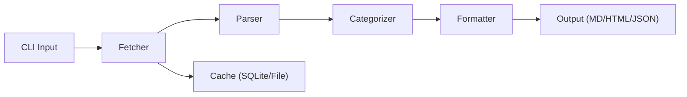
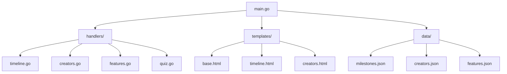
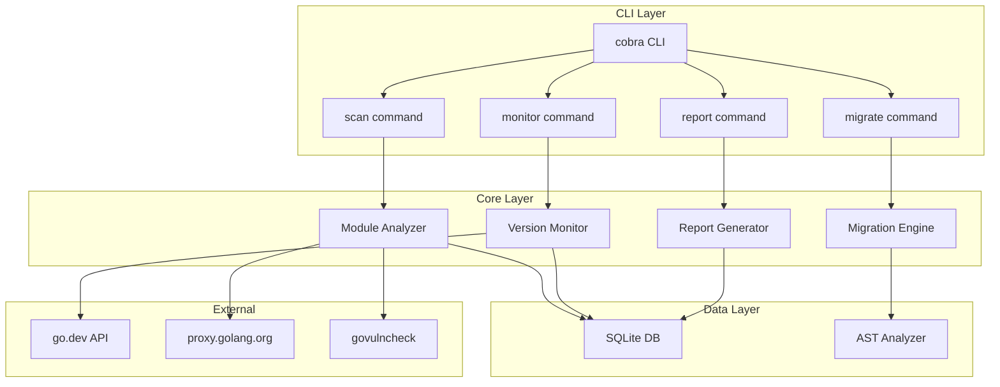

# History of Go — Practical Tasks

## Table of Contents

1. [Junior Tasks](#1-junior-tasks)
2. [Middle Tasks](#2-middle-tasks)
3. [Senior Tasks](#3-senior-tasks)
4. [Questions](#4-questions)
5. [Mini Projects](#5-mini-projects)
6. [Challenge](#6-challenge)

---

## 1. Junior Tasks

### Task 1: Go Timeline Printer

**Maqsad:** Go'ning muhim sanalarini chiroyli formatda chop etuvchi dastur yozing.

**Talablar:**
- Struct ishlatish (`GoEvent` — year, month, event, description)
- Kamida 10 ta muhim voqeani kiritish (2007-2025)
- `fmt.Printf` bilan formatlash
- `runtime.Version()` bilan hozirgi Go versiyasini ko'rsatish

**Kutilgan natija:**
```
=== Go Programming Language Timeline ===
Current Go version: go1.24.1

2007 - Design Started
       Rob Pike, Ken Thompson, Robert Griesemer Go'ni loyihalashni boshladi

2009 - Open Source Release
       Go 10-noyabrda ochiq manba sifatida e'lon qilindi
...
```

**Starter code:**

```go
package main

import (
	"fmt"
	"runtime"
)

type GoEvent struct {
	Year        int
	Month       string
	Event       string
	Description string
}

func main() {
	events := []GoEvent{
		{2007, "", "Design Started", "Rob Pike, Ken Thompson, Robert Griesemer Go'ni loyihalashni boshladi"},
		// TODO: kamida 10 ta voqea qo'shing
	}

	fmt.Println("=== Go Programming Language Timeline ===")
	fmt.Printf("Current Go version: %s\n\n", runtime.Version())

	for _, e := range events {
		// TODO: chiroyli formatlang
	}
}
```

**Baholash:**
- [ ] 10+ voqea kiritilgan
- [ ] Struct to'g'ri ishlatilgan
- [ ] Format chiroyli va o'qilishi oson
- [ ] `runtime.Version()` ishlatilgan

---

### Task 2: Go Version Checker

**Maqsad:** O'rnatilgan Go versiyasini tekshirib, qaysi xususiyatlar mavjud ekanligini ko'rsatuvchi dastur yozing.

**Talablar:**
- `runtime.Version()` dan versiya raqamini parse qilish
- Har bir muhim xususiyat uchun "mavjud/mavjud emas" ko'rsatish
- Jadval formatida chiqarish

**Kutilgan natija:**
```
Go Version: 1.23.4

Feature Availability:
+------------------------+--------+-----------+
| Feature                | Min    | Available |
+------------------------+--------+-----------+
| Modules                | 1.11   |    YES    |
| Generics               | 1.18   |    YES    |
| Range over int         | 1.22   |    YES    |
| Range over func        | 1.23   |    YES    |
| Weak pointers          | 1.24   |    NO     |
+------------------------+--------+-----------+
```

**Starter code:**

```go
package main

import (
	"fmt"
	"runtime"
	"strconv"
	"strings"
)

type Feature struct {
	Name       string
	MinVersion [2]int // {major, minor}
}

func parseVersion(v string) (int, int) {
	v = strings.TrimPrefix(v, "go")
	parts := strings.Split(v, ".")
	major, _ := strconv.Atoi(parts[0])
	minor := 0
	if len(parts) >= 2 {
		minor, _ = strconv.Atoi(parts[1])
	}
	return major, minor
}

func main() {
	features := []Feature{
		{"Modules", [2]int{1, 11}},
		{"Generics", [2]int{1, 18}},
		// TODO: 8+ xususiyat qo'shing
	}

	major, minor := parseVersion(runtime.Version())
	fmt.Printf("Go Version: %d.%d\n\n", major, minor)

	// TODO: jadval formatida chiqaring
	for _, f := range features {
		available := major > f.MinVersion[0] ||
			(major == f.MinVersion[0] && minor >= f.MinVersion[1])
		_ = available
		// TODO: formatlang
	}
}
```

**Baholash:**
- [ ] Versiya to'g'ri parse qilingan
- [ ] 8+ xususiyat kiritilgan
- [ ] Jadval formati chiroyli
- [ ] Barcha xususiyatlar to'g'ri tekshirilgan

---

### Task 3: Go Creators Quiz

**Maqsad:** Go tarixi haqida interaktiv quiz dasturi yozing.

**Talablar:**
- Kamida 8 ta savol
- Har bir savolda 4 ta variant
- To'g'ri/noto'g'ri javobni ko'rsatish
- Oxirida ball ko'rsatish
- `bufio.Scanner` bilan foydalanuvchi kiritishini o'qish

**Starter code:**

```go
package main

import (
	"bufio"
	"fmt"
	"os"
	"strings"
)

type Question struct {
	Text    string
	Options [4]string
	Answer  int // 1-4
}

func main() {
	questions := []Question{
		{
			Text:    "Go tili qaysi yilda open source bo'ldi?",
			Options: [4]string{"2007", "2009", "2012", "2015"},
			Answer:  2,
		},
		// TODO: 7+ savol qo'shing
	}

	scanner := bufio.NewScanner(os.Stdin)
	score := 0

	fmt.Println("=== Go History Quiz ===")
	fmt.Printf("Jami savollar: %d\n\n", len(questions))

	for i, q := range questions {
		fmt.Printf("Savol %d: %s\n", i+1, q.Text)
		for j, opt := range q.Options {
			fmt.Printf("  %d) %s\n", j+1, opt)
		}

		fmt.Print("Javobingiz (1-4): ")
		scanner.Scan()
		answer := strings.TrimSpace(scanner.Text())

		// TODO: javobni tekshiring va ball hisoblang
		_ = answer
	}

	fmt.Printf("\nNatija: %d/%d\n", score, len(questions))
}
```

**Baholash:**
- [ ] 8+ savol
- [ ] Foydalanuvchi kiritishi to'g'ri o'qilgan
- [ ] Ball to'g'ri hisoblangan
- [ ] Noto'g'ri javob uchun to'g'ri javob ko'rsatilgan

---

### Task 4: Go Milestones JSON API

**Maqsad:** Go milestone'larini JSON formatda qaytaruvchi oddiy HTTP server yozing.

**Talablar:**
- `net/http` ishlatish
- `/milestones` endpoint — barcha milestone'lar
- `/milestones?year=2022` — filter by year
- `/version` — hozirgi Go versiyasi
- JSON formatda javob

**Starter code:**

```go
package main

import (
	"encoding/json"
	"fmt"
	"net/http"
	"runtime"
	"strconv"
)

type Milestone struct {
	Version string `json:"version"`
	Year    int    `json:"year"`
	Feature string `json:"feature"`
}

var milestones = []Milestone{
	{"1.0", 2012, "First stable release"},
	{"1.5", 2015, "Self-hosting compiler"},
	// TODO: 8+ milestone qo'shing
}

func milestonesHandler(w http.ResponseWriter, r *http.Request) {
	w.Header().Set("Content-Type", "application/json")

	yearStr := r.URL.Query().Get("year")
	if yearStr != "" {
		year, err := strconv.Atoi(yearStr)
		if err != nil {
			http.Error(w, "Invalid year", http.StatusBadRequest)
			return
		}
		// TODO: yil bo'yicha filter
		_ = year
	}

	json.NewEncoder(w).Encode(milestones)
}

func versionHandler(w http.ResponseWriter, r *http.Request) {
	w.Header().Set("Content-Type", "application/json")
	json.NewEncoder(w).Encode(map[string]string{
		"go_version": runtime.Version(),
		"os":         runtime.GOOS,
		"arch":       runtime.GOARCH,
	})
}

func main() {
	http.HandleFunc("/milestones", milestonesHandler)
	http.HandleFunc("/version", versionHandler)

	fmt.Println("Server running on :8080")
	http.ListenAndServe(":8080", nil)
}
```

**Baholash:**
- [ ] Server to'g'ri ishga tushadi
- [ ] JSON formati to'g'ri
- [ ] Year filter ishlaydi
- [ ] 8+ milestone kiritilgan

---

## 2. Middle Tasks

### Task 1: Go Module Dependency Analyzer

**Maqsad:** `go.mod` faylni o'qib, dependency'larni tahlil qiluvchi CLI tool yozing.

**Talablar:**
- `go.mod` faylni parse qilish (regexp yoki `golang.org/x/mod/modfile` ishlatish)
- Direct va indirect dependency'larni ajratish
- Go versiyasini ko'rsatish
- Dependency statistikasi (jami, direct, indirect)
- `go.sum` fayldan checksum statistikasini ko'rsatish
- Output: jadval formatida

**Kutilgan natija:**
```
=== Module Analysis ===
Module: github.com/example/myproject
Go Version: 1.23
Toolchain: go1.23.4

Dependencies:
  Direct:   12
  Indirect: 45
  Total:    57

Top Direct Dependencies:
  1. github.com/gin-gonic/gin v1.9.1
  2. google.golang.org/grpc v1.60.0
  ...

go.sum Checksums: 234 entries
```

**Hint:**
```go
// go.mod parse qilish
import "golang.org/x/mod/modfile"

data, _ := os.ReadFile("go.mod")
f, _ := modfile.Parse("go.mod", data, nil)
fmt.Println("Module:", f.Module.Mod.Path)
fmt.Println("Go:", f.Go.Version)
for _, req := range f.Require {
    if !req.Indirect {
        fmt.Println("Direct:", req.Mod.Path, req.Mod.Version)
    }
}
```

**Baholash:**
- [ ] go.mod to'g'ri parse qilingan
- [ ] Direct/indirect ajratilgan
- [ ] Statistika to'g'ri
- [ ] Chiroyli output format
- [ ] Error handling mavjud

---

### Task 2: Go Version Compatibility Checker

**Maqsad:** Go source fayllarni skanlab, qaysi Go versiya kerak ekanligini aniqlaydigan tool yozing.

**Talablar:**
- Go source fayllarini AST yordamida parse qilish
- Quyidagi xususiyatlarni aniqlash:
  - `any` keyword -> Go 1.18+
  - Type parameters (generics) -> Go 1.18+
  - `range over int` -> Go 1.22+
  - `range over func` -> Go 1.23+
  - `min()`, `max()`, `clear()` built-in -> Go 1.21+
- `go.mod` dagi versiya bilan solishtirish
- Agar kod go.mod dan yuqori versiya talab qilsa — ogohlantirish

**Kutilgan natija:**
```
=== Go Version Compatibility Check ===

go.mod version: go 1.21

Findings:
  main.go:15 - uses generics (type parameters) -> requires Go 1.18+ [OK]
  main.go:23 - uses 'range over int' -> requires Go 1.22+ [WARNING]
  utils.go:8 - uses 'any' keyword -> requires Go 1.18+ [OK]

Recommendation: Update go.mod to 'go 1.22'
```

**Hint:**
```go
import (
    "go/ast"
    "go/parser"
    "go/token"
)

fset := token.NewFileSet()
file, _ := parser.ParseFile(fset, "main.go", nil, parser.AllErrors)

ast.Inspect(file, func(n ast.Node) bool {
    // TypeParams, RangeStmt, etc. tekshirish
    return true
})
```

**Baholash:**
- [ ] AST parsing to'g'ri ishlaydi
- [ ] 5+ xususiyat aniqlanadi
- [ ] go.mod bilan solishtirish ishlaydi
- [ ] Ogohlantirish formati aniq
- [ ] Bir nechta fayl skanlanadi

---

### Task 3: GODEBUG Configuration Manager

**Maqsad:** GODEBUG muhit o'zgaruvchisini boshqaruvchi CLI tool yozing.

**Talablar:**
- Hozirgi GODEBUG qiymatini ko'rsatish
- GODEBUG flag'larni qo'shish/olib tashlash
- Mavjud flag'lar ma'lumotnomasi (har bir flag tavsifi)
- Go versiyaga mos flag'lar tavsiyasi
- JSON config fayldan yuklash

**Kutilgan natija:**
```bash
$ godebug-manager show
Current GODEBUG: gctrace=1,loopvar=1

$ godebug-manager list
Available GODEBUG flags:
  gctrace=N       - GC trace (0=off, 1=on)
  schedtrace=N    - Scheduler trace (ms interval)
  loopvar=N       - Loop variable semantics (0=new, 1=old)
  httpmuxgo121=N  - HTTP mux behavior (0=new, 1=old)
  ...

$ godebug-manager recommend --go-version=1.23
Recommended for Go 1.23:
  loopvar=1     (if migrating from <1.22)
  httpmuxgo121=1 (if using custom ServeMux patterns)
```

**Baholash:**
- [ ] GODEBUG o'qish va parse qilish
- [ ] Flag qo'shish/olib tashlash
- [ ] Ma'lumotnoma (10+ flag)
- [ ] Versiyaga mos tavsiya
- [ ] Error handling

---

## 3. Senior Tasks

### Task 1: Go Release Notes Aggregator

**Maqsad:** Go reliz note'larini yuklab olib, muhim o'zgarishlarni kategoriyalab ko'rsatuvchi tool yozing.

**Talablar:**
- Go blog RSS yoki release notes sahifasini parse qilish
- O'zgarishlarni kategoriyalash: Language, Runtime, Compiler, Standard Library, Tools
- Versiyalar orasidagi farqni ko'rsatish
- HTML yoki Markdown formatda hisobot yaratish
- Cache mexanizmi (har safar yuklamaslik)
- CLI flags: `--from=1.20 --to=1.23 --format=md`

**Arxitektura:**


**Baholash:**
- [ ] Release notes yuklanadi
- [ ] Kategoriyalash to'g'ri
- [ ] Versiya filter ishlaydi
- [ ] Cache mexanizmi
- [ ] Chiroyli output
- [ ] Error handling va retry logic

---

### Task 2: Go Migration Linter

**Maqsad:** Go loyihadagi eski pattern'larni aniqlab, zamonaviy alternativa taklif qiluvchi linter yozing.

**Talablar:**
- AST-based analiz (go/ast, go/parser)
- Quyidagi pattern'larni aniqlash:
  1. `io/ioutil` import -> `os` va `io` ga o'zgartirish (Go 1.16+)
  2. `interface{}` -> `any` (Go 1.18+)
  3. `sort.Slice` -> `slices.Sort` (Go 1.21+)
  4. Manual min/max funksiya -> built-in `min`/`max` (Go 1.21+)
  5. `golang.org/x/net/context` -> `context` (Go 1.7+)
  6. Eski loop variable capture pattern (Go 1.22+)
  7. `// +build` tag -> `//go:build` (Go 1.17+)
- Har bir topilma uchun: fayl, satr, eski kod, yangi kod taklifi
- `--fix` flag bilan avtomatik tuzatish (ixtiyoriy)
- Sarflangan vaqt statistikasi

**Kutilgan natija:**
```
=== Go Migration Linter ===
Scanning: ./...

Findings (23 total):
  DEPRECATED  main.go:5    import "io/ioutil" -> use "os" and "io"
  MODERNIZE   main.go:12   interface{} -> any
  MODERNIZE   utils.go:8   sort.Slice -> slices.Sort (Go 1.21+)
  MODERNIZE   calc.go:15   manual min function -> built-in min()
  BUILD_TAG   old.go:1     // +build linux -> //go:build linux
  ...

Summary:
  DEPRECATED: 5
  MODERNIZE:  15
  BUILD_TAG:  3
  Total:      23

Time: 145ms
```

**Baholash:**
- [ ] AST parsing to'g'ri
- [ ] 7+ pattern aniqlanadi
- [ ] Taklif aniq va to'g'ri
- [ ] Bir nechta paket skanlanadi
- [ ] Performance yaxshi (katta loyihalar uchun)
- [ ] Output formati professional

---

### Task 3: Go Ecosystem Health Dashboard

**Maqsad:** Go ekotizimi "sog'ligi"ni ko'rsatuvchi dashboard yarating.

**Talablar:**
- `pkg.go.dev` API yoki GitHub API orqali ma'lumot yig'ish
- Ko'rsatkichlar:
  1. So'nggi Go versiya va chiqarilgan sanasi
  2. Top 20 Go library'lar va ularning yangilangan sanasi
  3. Go GitHub repo statistikasi (stars, issues, PRs)
  4. govulncheck ma'lumotlar bazasi hajmi
  5. Go module proxy statistikasi
- Web dashboard (net/http + HTML template) yoki CLI jadval
- Ma'lumotlarni cache'lash (15 daqiqa)

**Baholash:**
- [ ] API integratsiya ishlaydi
- [ ] 5+ ko'rsatkich
- [ ] Cache mexanizmi
- [ ] Error handling (API limit, timeout)
- [ ] Chiroyli vizualizatsiya

---

## 4. Questions

### Savol 1: Go 1.0 qaysi yilda chiqarildi va u bilan birga qanday muhim kafolat e'lon qilindi?

<details>
<summary>Javob</summary>
Go 1.0 2012-yil mart oyida chiqarildi. U bilan birga **Go 1 Compatibility Promise** e'lon qilindi — Go 1.x da yozilgan dastur Go 1.y (y > x) versiyalarida ham to'g'ri ishlaydi. Bu kafolat faqat documented behavior, standart kutubxona API'lari va til semantikasiga tegishli. `unsafe` paketi va undocumented behavior qamrab olinmaydi.
</details>

### Savol 2: Go Modules joriy etilishidan oldin GOPATH tizimining asosiy muammolari nimalar edi?

<details>
<summary>Javob</summary>
GOPATH asosiy muammolari: (1) Barcha Go kodi `$GOPATH/src` ichida bo'lishi kerak — ixtiyoriy katalogda ishlash mumkin emas; (2) Versioning tizimi yo'q — faqat `go get` oxirgi commit ni oladi; (3) Dependency hell — bir loyihada v1, boshqasida v2 kerak bo'lsa, imkoni yo'q; (4) Reproducible build yo'q — har safar `go get` turli natija berishi mumkin; (5) Vendor katalog qo'lda boshqarish murakkab.
</details>

### Savol 3: Go'ning concurrency modeli CSP'ga asoslangan. CSP nima va Go'da qanday implement qilingan?

<details>
<summary>Javob</summary>
CSP (Communicating Sequential Processes) — Tony Hoare 1978-yilda taklif qilingan concurrency nazariyasi. Asosiy g'oya: mustaqil jarayonlar o'rtasida message passing orqali aloqa. Go'da: goroutine = mustaqil jarayon (yengil thread), channel = message passing mexanizmi. `go func(){}()` goroutine yaratadi, `ch <- val` va `val = <-ch` channel orqali ma'lumot almashadi. Rob Pike oldin Newsqueak va Limbo tillarida CSP'ni implement qilgan — Go'ning concurrency modeli ana shu tajribaning evolyutsiyasi.
</details>

### Savol 4: Go 1.18 da qo'shilgan Generics'ning implementation strategiyasi (GC Shape Stenciling) nima?

<details>
<summary>Javob</summary>
GC Shape Stenciling — Go'ning generics implementation yondashuvi. U Rust'ning monomorphization'i va Java'ning type erasure'idan farq qiladi. Asosiy g'oya: (1) Pointer turlari (har qanday *T) bitta "GC shape"ni ulashadi — ular uchun bitta funksiya generatsiya qilinadi + runtime dictionary; (2) Value turlari (int, float64, string) turli "shape"larga ega — ular uchun alohida funksiyalar generatsiya qilinadi. Afzalliklari: tez kompilyatsiya (monomorphization'dan), yaxshi performance (type erasure'dan), o'rtacha binary hajmi.
</details>

### Savol 5: Go'ning Garbage Collector qanday evolyutsiya qildi va hozirgi pause vaqti qancha?

<details>
<summary>Javob</summary>
GC evolyutsiyasi: Go 1.0 (2012) — stop-the-world mark-sweep, 10-300ms pause; Go 1.5 (2015) — concurrent mark-sweep, <10ms pause (katta breakthrough); Go 1.8 (2017) — hybrid write barrier, <1ms pause; Go 1.19 (2022) — GOMEMLIMIT qo'shildi. Hozirgi holat: sub-millisecond pause (<500 microseconds ko'p hollarda). GC phases: STW stack scan -> concurrent mark -> STW mark termination -> concurrent sweep. GOGC va GOMEMLIMIT orqali tuning qilish mumkin.
</details>

### Savol 6: GODEBUG, go directive va GOEXPERIMENT o'rtasidagi farq nima?

<details>
<summary>Javob</summary>
(1) `go` directive (`go.mod`): modulning minimal Go versiyasini belgilaydi, til xususiyatlari va default behavior'ni aniqlaydi. Go 1.21+ da enforced. (2) GODEBUG: runtime behavior o'zgarishlarini override qilish uchun muhit o'zgaruvchisi. Migratsiya davri uchun — eski behavior'ni vaqtincha saqlash. (3) GOEXPERIMENT: hali rasmiy bo'lmagan xususiyatlarni sinash uchun build-time flag. Production'da ishlatmaslik kerak — Go 1 promise qamrab olmaydi. Hierarchy: GOEXPERIMENT (sinov) -> go directive (rasmiy) -> GODEBUG (override).
</details>

### Savol 7: Go 1.22 dagi loop variable semantics o'zgarishi qanday implement qilindi va backward compatibility qanday ta'minlandi?

<details>
<summary>Javob</summary>
Go 1.22 da `for` loop variable har iteratsiyada yangi o'zgaruvchi sifatida yaratiladi (oldin bitta o'zgaruvchi qayta ishlatilardi). Implementation: (1) Faqat `go.mod` da `go 1.22`+ ko'rsatilgan modullar uchun ishlaydi; (2) Eski modullar eski semantikani saqlab qoladi; (3) `GODEBUG=loopvar=1` bilan eski behavior'ga qaytish mumkin; (4) `bisect` tool bilan qaysi loop o'zgarishi muammo keltirayotganini aniqlash mumkin. Bu Go'ning yangi "per-module evolution" yondashuvi — go directive versiyasi asosida til semantikasini modullar darajasida boshqarish.
</details>

### Savol 8: Go'ning kompilyator bootstrap jarayoni qanday ishlaydi?

<details>
<summary>Javob</summary>
Bootstrap — Go kompilyatorini source'dan build qilish jarayoni. Tarixi: (1) Go 1.0-1.4: kompilyator C da yozilgan, gcc kerak; (2) Go 1.4: c2go tool C kodni Go'ga tarjima qildi; (3) Go 1.5+: kompilyator Go'da yozilgan (self-hosting). Hozirgi bootstrap: Go 1.N ni build qilish uchun Go 1.(N-4) kerak. Masalan: Go 1.24 -> Go 1.20 kerak. Jarayon: Go 1.20 binary (tayyor) -> Go 1.24 source -> Go 1.24 binary. Bu "chicken-and-egg" muammo yechimi — har doim oldingi versiya kerak.
</details>

### Savol 9: Go 1.17 dagi register-based ABI nima va qanday ta'sir ko'rsatdi?

<details>
<summary>Javob</summary>
Register-based ABI — funksiya argumentlari va natijalarini CPU registr'larida uzatish (stack o'rniga). Go 1.16 va oldingi: stack-based — argumentlar SP offset orqali. Go 1.17+: register-based — AX, BX, CX, DI, SI, R8-R11 (integer), X0-X14 (float). Ta'siri: ~5% umumiy performance yaxshilanishi, stack memory usage kamayishi, function call overhead kamayishi. Backward compatibility: ABI0 (eski) va ABIInternal (yangi) ikki ABI bir vaqtda mavjud — assembly kod va cgo uchun wrapper funksiyalar registr/stack o'rtasida ko'chiradi.
</details>

### Savol 10: Go'ning Swiss table map (Go 1.24) oldingi map implementation'dan qanday farq qiladi?

<details>
<summary>Javob</summary>
Eski map: bucket-based hash table, har bir bucket 8 key-value pair, overflow bucket'lar linked list, linear probing. Swiss table: group-based design (16 slot per group), metadata bytes (har slot uchun 1 byte — hash yuqori 7 bit + status), SIMD-friendly (bir instruction bilan 16 slot tekshirish), data va metadata alohida (cache-friendly). Performance: lookup ~15-30% tezroq, insert ~10-20% tezroq, memory ~10% kam. Go 1 compatibility: external API o'zgarmadi, faqat internal implementation. `unsafe` orqali eski map struct'lariga murojaat qilgan kod buziladi.
</details>

---

## 5. Mini Projects

### Mini Project 1: Go History Documentation Site

**Maqsad:** Go tarixini batafsil ko'rsatuvchi statik veb-sayt yarating.

**Talablar:**
- `net/http` + `html/template` ishlatish
- Sahifalar:
  1. **Timeline** — interaktiv Go tarixi (versiyalar, voqealar)
  2. **Creators** — yaratuvchilar haqida ma'lumot
  3. **Features** — versiya bo'yicha xususiyatlar
  4. **Compare** — Go vs boshqa tillar evolyutsiyasi
  5. **Quiz** — interaktiv Go tarixi quiz
- JSON ma'lumotlar bazasi (fayl yoki embed)
- CSS styling (minimal lekin chiroyli)
- Search/filter funksiyasi

**Texnologiyalar:**
```
Backend:  Go net/http + html/template
Data:     JSON files (go:embed)
Frontend: HTML + CSS (no JS framework)
```

**Arxitektura:**


**Baholash:**
- [ ] 5 sahifa to'liq ishlaydi
- [ ] Template'lar to'g'ri render qilinadi
- [ ] JSON data to'g'ri yuklanadi
- [ ] Dizayn chiroyli va responsive
- [ ] Error handling
- [ ] Code structure tozza

---

### Mini Project 2: Go Release Diff Tool

**Maqsad:** Ikki Go versiya orasidagi farqlarni ko'rsatuvchi CLI tool yarating.

**Talablar:**
- Input: ikki Go versiya (masalan, `1.21` va `1.23`)
- Output:
  1. Yangi til xususiyatlari
  2. Standart kutubxona o'zgarishlari
  3. Runtime yaxshilanishlari
  4. GODEBUG yangi flag'lar
  5. Deprecated bo'lgan API'lar
  6. Breaking changes (agar bo'lsa)
- Data source: embedded JSON yoki Go blog RSS
- Formatlar: table, JSON, markdown
- `cobra` yoki `flag` bilan CLI

**Kutilgan natija:**
```bash
$ go-diff 1.21 1.23

=== Go 1.21 -> Go 1.23 Changes ===

Language Changes:
  Go 1.22: range over int
  Go 1.22: loop variable semantics change
  Go 1.23: range over func (iterators)

Runtime Changes:
  Go 1.22: improved GC scheduling
  Go 1.23: timer improvements

New GODEBUG flags:
  loopvar (Go 1.22)
  httpmuxgo121 (Go 1.22)
  rangefunc (Go 1.23 pre-release)

Deprecated:
  reflect.SliceHeader (use unsafe.Slice instead)
  reflect.StringHeader (use unsafe.String instead)
```

**Baholash:**
- [ ] Ikki versiya orasidagi farq ko'rsatiladi
- [ ] 5+ kategoriya
- [ ] CLI interface yaxshi
- [ ] Turli format'lar (table, JSON, MD)
- [ ] Error handling
- [ ] Data to'g'ri va to'liq

---

## 6. Challenge

### Ultimate Challenge: Go Ecosystem Observatory

**Maqsad:** Go ekotizimini real-time monitoring qiluvchi to'liq dastur yarating.

**Talablar:**

**Core Features:**
1. **Go Version Monitor** — yangi Go versiya chiqganini aniqlash va xabardor qilish
2. **Module Analyzer** — loyihadagi dependency'larni tahlil qilish:
   - Vulnerability scan (`govulncheck` integratsiya)
   - Outdated dependency'lar aniqlash
   - License tekshirish
3. **Migration Assistant** — eski Go pattern'larni aniqlash va fix taklif qilish
4. **Performance Tracker** — Go versiyalar orasidagi benchmark farqlarni saqlash
5. **GODEBUG Advisor** — loyihaga mos GODEBUG tavsiyalari

**Technical Requirements:**
- Go 1.23+ (range over func, enhanced mux)
- Generics ishlatish (utility funksiyalar)
- Concurrent processing (goroutine + channel)
- SQLite yoki BoltDB (ma'lumotlarni saqlash)
- REST API (net/http)
- CLI interface (cobra yoki flag)
- Unit testlar (coverage > 70%)
- `go vet`, `staticcheck` toza

**Arxitektura:**


**Bonus:**
- Web dashboard (htmx yoki template)
- GitHub Action integration
- Telegram/Slack notification
- Go module scorecard (xavfsizlik, yangilik, popularlik)

**Baholash kriteriylari:**
- [ ] 5 ta core feature ishlaydi
- [ ] Go 1.23+ xususiyatlardan foydalanilgan
- [ ] Generics to'g'ri ishlatilgan
- [ ] Concurrent processing mavjud
- [ ] Test coverage > 70%
- [ ] Error handling professional darajada
- [ ] CLI UX yaxshi
- [ ] Hujjatlar (README + godoc comments)
- [ ] `go vet` va `staticcheck` toza
- [ ] Build reproducible (`go.sum` commit qilingan)
