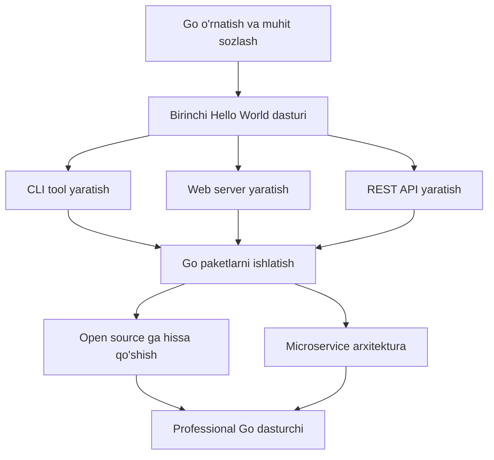

# Setting Up the Environment — Junior Level

## Table of Contents

1. [Introduction](#1-introduction)
2. [Prerequisites](#2-prerequisites)
3. [Glossary](#3-glossary)
4. [Core Concepts](#4-core-concepts)
5. [Pros & Cons](#5-pros--cons)
6. [Use Cases](#6-use-cases)
7. [Code Examples](#7-code-examples)
8. [Product Use / Feature](#8-product-use--feature)
9. [Error Handling](#9-error-handling)
10. [Security Considerations](#10-security-considerations)
11. [Performance Tips](#11-performance-tips)
12. [Best Practices](#12-best-practices)
13. [Edge Cases & Pitfalls](#13-edge-cases--pitfalls)
14. [Common Mistakes](#14-common-mistakes)
15. [Tricky Points](#15-tricky-points)
16. [Test](#16-test)
17. [Tricky Questions](#17-tricky-questions)
18. [Cheat Sheet](#18-cheat-sheet)
19. [Summary](#19-summary)
20. [What You Can Build](#20-what-you-can-build)
21. [Further Reading](#21-further-reading)
22. [Related Topics](#22-related-topics)

---

## 1. Introduction

Go dasturlash tilida loyiha yozishni boshlash uchun avval muhitni to'g'ri sozlash kerak. Bu bo'limda Go'ni turli operatsion tizimlarga o'rnatish, GOPATH va Go Modules tushunchalari, IDE sozlash va `go env` buyrug'i bilan tanishasiz. Muhitni to'g'ri sozlash — samarali Go dasturchi bo'lishning birinchi qadami.

---

## 2. Prerequisites

Bu bo'limni o'zlashtirish uchun quyidagilar talab qilinadi:

1. **Terminal/Command Line asoslari** — `cd`, `mkdir`, `export` kabi buyruqlarni bilish
2. **Operatsion tizim** — Linux, macOS yoki Windows o'rnatilgan kompyuter
3. **Internet aloqasi** — Go yuklab olish va paketlar o'rnatish uchun
4. **Text editor** — istalgan text editor (VS Code tavsiya etiladi)

---

## 3. Glossary

| Termin | Ta'rifi |
|--------|---------|
| **GOROOT** | Go kompilyatori va standart kutubxonalar o'rnatilgan papka (masalan, `/usr/local/go`) |
| **GOPATH** | Foydalanuvchining Go ishchi papkasi. Default: `~/go`. Module cache va binary fayllar shu yerda saqlanadi |
| **Module** | Go loyihasining asosiy birligi. `go.mod` fayli bilan boshqariladi. Dependency management uchun ishlatiladi |
| **go.mod** | Loyihaning modul nomi, Go versiyasi va dependency larini belgilaydigan fayl |
| **go.sum** | Dependency larning checksum (xavfsizlik hash) larini saqlaydigan fayl |
| **GOPROXY** | Go paketlarni yuklab olish uchun proxy server manzili. Default: `https://proxy.golang.org,direct` |
| **go env** | Go muhit o'zgaruvchilarini ko'rsatadigan va o'zgartiruvchi buyruq |
| **Build Cache** | Kompilyatsiya natijalarini keshlaydigan papka. Qayta build ni tezlashtiradi |
| **go.work** | Workspace mode uchun fayl. Bir nechta modulni birgalikda ishlatish imkonini beradi |
| **GOBIN** | `go install` orqali o'rnatilgan binary fayllar saqlanadigan papka |

---

## 4. Core Concepts

### 4.1. Go o'rnatish

#### Linux (Ubuntu/Debian)

**Tarball orqali (tavsiya etiladi):**

```bash
# 1. Oxirgi versiyani yuklab oling (https://go.dev/dl/)
wget https://go.dev/dl/go1.23.4.linux-amd64.tar.gz

# 2. Eski Go'ni o'chirib, yangisini o'rnating
sudo rm -rf /usr/local/go
sudo tar -C /usr/local -xzf go1.23.4.linux-amd64.tar.gz

# 3. PATH ga qo'shing (~/.bashrc yoki ~/.zshrc faylga)
echo 'export PATH=$PATH:/usr/local/go/bin' >> ~/.bashrc
source ~/.bashrc

# 4. Tekshirish
go version
# go version go1.23.4 linux/amd64
```

**APT orqali (eskirgan versiya bo'lishi mumkin):**

```bash
sudo apt update
sudo apt install golang-go
go version
```

> **Eslatma:** APT dan o'rnatilgan versiya ko'pincha eskirgan bo'ladi. Tarball usuli tavsiya etiladi.

#### macOS

**Homebrew orqali:**

```bash
brew install go
go version
# go version go1.23.4 darwin/arm64
```

**Rasmiy installer orqali:**

1. https://go.dev/dl/ dan `.pkg` faylni yuklab oling
2. Installer ni ishga tushiring
3. Terminal ni qayta oching va tekshiring:

```bash
go version
```

#### Windows

1. https://go.dev/dl/ dan `.msi` installer ni yuklab oling
2. Installer ni ishga tushiring (default papka: `C:\Go`)
3. Command Prompt yoki PowerShell ni qayta oching:

```powershell
go version
# go version go1.23.4 windows/amd64
```

> Windows da installer PATH ni avtomatik sozlaydi.

### 4.2. GOPATH va GOROOT

```
GOROOT (/usr/local/go)          GOPATH (~/go)
├── bin/                         ├── bin/
│   ├── go                       │   └── (go install binary-lar)
│   └── gofmt                    ├── pkg/
├── src/                         │   └── mod/
│   └── (standart kutubxona)     │       └── (yuklab olingan modullar)
└── pkg/                         └── src/
    └── (standart pkg-lar)           └── (eski GOPATH era, hozir ishlatilmaydi)
```

- **GOROOT** = Go tili o'zi (kompilyator, standart kutubxona)
- **GOPATH** = Sizning ishchi muhitingiz (module cache, binary-lar)

### 4.3. Go Modules

Go Modules — Go'ning rasmiy dependency management tizimi. Go 1.11 da kiritilgan, Go 1.16 dan boshlab default.

```bash
# Yangi loyiha yaratish
mkdir myproject && cd myproject

# Modulni boshlash
go mod init github.com/username/myproject

# Bu go.mod faylini yaratadi
cat go.mod
# module github.com/username/myproject
#
# go 1.23.4
```

### 4.4. VS Code sozlash

1. **VS Code** ni o'rnating: https://code.visualstudio.com/
2. **Go extension** ni o'rnating: Extensions (Ctrl+Shift+X) → "Go" qidiring → "Go Team at Google" tomonidan → Install
3. **Go tools** ni o'rnating:
   - `Ctrl+Shift+P` → "Go: Install/Update Tools" → Hammasini tanlang → OK

```bash
# Yoki terminal dan:
go install golang.org/x/tools/gopls@latest
go install github.com/go-delve/delve/cmd/dlv@latest
```

**VS Code settings (settings.json):**

```json
{
  "go.useLanguageServer": true,
  "go.lintTool": "golangci-lint",
  "go.formatTool": "goimports",
  "editor.formatOnSave": true,
  "[go]": {
    "editor.defaultFormatter": "golang.go",
    "editor.codeActionsOnSave": {
      "source.organizeImports": "explicit"
    }
  }
}
```

### 4.5. go env buyrug'i

```bash
# Barcha muhit o'zgaruvchilarini ko'rish
go env

# Bitta o'zgaruvchini ko'rish
go env GOPATH
go env GOROOT
go env GOPROXY

# O'zgaruvchini o'zgartirish
go env -w GOPROXY=https://proxy.golang.org,direct

# O'zgaruvchini qaytarish (default ga)
go env -u GOPROXY
```

---

## 5. Pros & Cons

### Go muhit sozlashning afzalliklari va kamchiliklari

| Afzallik | Kamchilik |
|----------|-----------|
| O'rnatish juda oson — bitta binary, dependency yo'q | GOPATH tushunchasi yangi boshlovchilarni chalkashtirishadi mumkin |
| Cross-platform — Linux, macOS, Windows uchun bir xil | IDE tools (gopls, dlv) alohida o'rnatish kerak |
| Go Modules — dependency management ichki | go.sum fayli conflict lar yaratishi mumkin |
| `go env` — muhitni boshqarish oson | GOPROXY sozlamalari ba'zan muammo |
| Build cache — tez kompilyatsiya | Disk hajmi oshishi mumkin (cache + module) |

---

## 6. Use Cases

- **Yangi Go loyiha boshlash** — `go mod init` bilan tezkor start
- **Jamoa loyihasini clone qilish** — `git clone` → `go mod download` → tayyor
- **CI/CD pipeline** — Go o'rnatish va build qilish avtomatlashtiriladi
- **Open source paket ishlatish** — `go get` bilan dependency qo'shish
- **Ko'p versiyali Go bilan ishlash** — turli loyihalar uchun turli Go versiyalari

---

## 7. Code Examples

### 7.1. Birinchi loyihani yaratish

```bash
# 1. Papka yaratish
mkdir -p ~/projects/hello-go && cd ~/projects/hello-go

# 2. Modul boshlash
go mod init github.com/username/hello-go

# 3. Asosiy fayl yaratish
cat > main.go << 'EOF'
package main

import "fmt"

func main() {
    fmt.Println("Salom, Go!")
}
EOF

# 4. Ishga tushirish
go run main.go
# Salom, Go!

# 5. Build qilish
go build -o hello-go .
./hello-go
# Salom, Go!
```

### 7.2. Dependency qo'shish

```bash
# Dependency qo'shish
go get github.com/fatih/color@latest
```

```go
// main.go
package main

import "github.com/fatih/color"

func main() {
    color.Green("Muvaffaqiyatli o'rnatildi!")
    color.Red("Bu xato xabari")
    color.Yellow("Bu ogohlantirish")
}
```

```bash
# go.mod avtomatik yangilanadi
cat go.mod
# module github.com/username/hello-go
#
# go 1.23.4
#
# require github.com/fatih/color v1.16.0

# Ishga tushirish
go run main.go
```

### 7.3. Loyiha strukturasi (oddiy)

```
hello-go/
├── go.mod          # Modul ta'rifi
├── go.sum          # Dependency checksum-lar
├── main.go         # Asosiy fayl
├── handler.go      # Qo'shimcha fayl (xuddi shu package main)
└── handler_test.go # Test fayl
```

```go
// handler.go
package main

import "fmt"

func greet(name string) string {
    return fmt.Sprintf("Salom, %s!", name)
}
```

```go
// handler_test.go
package main

import "testing"

func TestGreet(t *testing.T) {
    result := greet("Go")
    expected := "Salom, Go!"
    if result != expected {
        t.Errorf("kutilgan %q, olindi %q", expected, result)
    }
}
```

```bash
# Testni ishga tushirish
go test -v
# === RUN   TestGreet
# --- PASS: TestGreet (0.00s)
# PASS
```

### 7.4. go mod tidy

```bash
# Keraksiz dependency larni o'chirish, keraklilarni qo'shish
go mod tidy

# Bu buyruq:
# 1. Koddagi import larni tekshiradi
# 2. go.mod ga kerakli dependency larni qo'shadi
# 3. Ishlatilmagan dependency larni olib tashlaydi
# 4. go.sum ni yangilaydi
```

---

## 8. Product Use / Feature

| Mahsulot | Go muhit sozlash holati |
|----------|------------------------|
| **Docker** | Go'da yozilgan. Docker rasmlari Go'ni o'rnatish va build qilish uchun `golang:` base image ishlatadi |
| **Kubernetes** | `kubectl` va barcha komponentlar Go'da yozilgan. Contributor lar Go muhitni sozlashdan boshlaydi |
| **Terraform** | HashiCorp ning infra tool i. Provider lar Go'da yoziladi, `go mod` bilan boshqariladi |
| **Hugo** | Eng tez static site generator. Go o'rnatib, `go install github.com/gohugoio/hugo@latest` bilan ishlatiladi |
| **CockroachDB** | Distributed SQL database. Go monorepo da ishlab chiqiladi |

---

## 9. Error Handling

### Eng ko'p uchraydigan xatolar va yechimlari

#### 9.1. "go: command not found"

```bash
# Sabab: PATH da Go yo'q
# Yechim:
export PATH=$PATH:/usr/local/go/bin
source ~/.bashrc

# Tekshirish:
which go
# /usr/local/go/bin/go
```

#### 9.2. "go.mod file not found"

```bash
# Sabab: Modul boshlanmagan yoki noto'g'ri papkada
# Yechim:
go mod init github.com/username/myproject

# Yoki to'g'ri papkaga o'ting:
cd ~/projects/myproject
go run main.go
```

#### 9.3. "cannot find package"

```bash
# Sabab: Dependency yuklanmagan
# Yechim:
go mod tidy

# Yoki aniq paketni yuklab olish:
go get github.com/package/name@latest
```

#### 9.4. "permission denied" (Linux/macOS)

```bash
# Sabab: /usr/local/go ga yozish huquqi yo'q
# Yechim:
sudo tar -C /usr/local -xzf go1.23.4.linux-amd64.tar.gz

# GOPATH/bin uchun:
mkdir -p $(go env GOPATH)/bin
```

#### 9.5. Go versiyasi mos kelmaydi

```bash
# Xato: "go.mod requires go >= 1.22"
# Sabab: O'rnatilgan Go versiyasi eski

# Tekshirish:
go version

# Yangilash (Linux):
wget https://go.dev/dl/go1.23.4.linux-amd64.tar.gz
sudo rm -rf /usr/local/go
sudo tar -C /usr/local -xzf go1.23.4.linux-amd64.tar.gz
```

---

## 10. Security Considerations

### 10.1. GOPROXY xavfsizligi

```bash
# Default proxy — Google boshqaradi
go env GOPROXY
# https://proxy.golang.org,direct

# GOPROXY nima qiladi:
# 1. Paketlarni proxy orqali yuklaydi (tezroq, xavfsizroq)
# 2. Sum database orqali checksum tekshiradi
# 3. Paket o'chirilgan bo'lsa ham cache da saqlanadi
```

### 10.2. Checksum tekshiruvi

```bash
# Go har bir dependency ning checksum ini tekshiradi
# go.sum faylida hash lar saqlanadi

# Sum database:
go env GONOSUMCHECK
go env GONOSUMDB
go env GOSUMDB
# sum.golang.org — Google ning checksum database i

# MUHIM: go.sum ni git ga commit qiling!
# Bu supply chain attack lardan himoya qiladi
```

### 10.3. Supply chain security qoidalari

- **go.sum** faylini doimo git ga commit qiling
- Dependency larni `go mod tidy` bilan tartibga soling
- Noma'lum paketlarni ishlatishdan oldin tekshiring
- `go mod verify` bilan integrity ni tekshiring:

```bash
go mod verify
# all modules verified
```

---

## 11. Performance Tips

### 11.1. Build cache

```bash
# Build cache joylashuvini ko'rish
go env GOCACHE
# Linux: ~/.cache/go-build
# macOS: ~/Library/Caches/go-build
# Windows: %LocalAppData%\go-build

# Cache tufayli qayta build tez bo'ladi
# Birinchi build: 5 soniya
# Ikkinchi build (o'zgarishsiz): 0.1 soniya

# Cache ni tozalash (ehtiyotkorlik bilan!)
go clean -cache
```

### 11.2. Module cache

```bash
# Module cache joylashuvini ko'rish
go env GOMODCACHE
# ~/go/pkg/mod

# Module cache hajmini ko'rish
du -sh $(go env GOMODCACHE)

# Module cache ni tozalash
go clean -modcache
```

### 11.3. Tezkor build uchun maslahatlar

```bash
# Parallel build (default: CPU yadrolari soni)
go env GOMAXPROCS

# Build flaglar
go build -v ./...          # Verbose — qaysi paketlar build bo'layotganini ko'rsatadi
go build -x ./...          # Bajarilgan buyruqlarni ko'rsatadi
go build -race ./...       # Race detector (test uchun)
```

---

## 12. Best Practices

1. **Doimo oxirgi stable Go versiyasini ishlating** — https://go.dev/dl/
2. **Go Modules ishlating** — GOPATH mode ni ishlating emas
3. **`go.mod` va `go.sum` ni git ga commit qiling** — dependency integrity uchun
4. **`go mod tidy` ni muntazam ishga tushiring** — ortiqcha dependency larni tozalash
5. **VS Code + Go extension ishlating** — gopls, auto-format, auto-import
6. **`go vet` va `go test` ni har doim ishga tushiring** — kod sifati uchun
7. **GOPATH/bin ni PATH ga qo'shing** — `go install` qilingan tool lar ishlashi uchun

```bash
# .bashrc yoki .zshrc ga qo'shing:
export PATH=$PATH:$(go env GOPATH)/bin
```

---

## 13. Edge Cases & Pitfalls

### 13.1. Turli shell larda PATH sozlash

```bash
# Bash — ~/.bashrc
echo 'export PATH=$PATH:/usr/local/go/bin' >> ~/.bashrc

# Zsh — ~/.zshrc
echo 'export PATH=$PATH:/usr/local/go/bin' >> ~/.zshrc

# Fish — ~/.config/fish/config.fish
echo 'set -gx PATH $PATH /usr/local/go/bin' >> ~/.config/fish/config.fish
```

### 13.2. Eski va yangi Go bir vaqtda

```bash
# Eski Go (apt dan) va yangi Go (tarball dan) conflict
which go
# /usr/bin/go (eski) yoki /usr/local/go/bin/go (yangi)?

# Yechim: apt dagi Go ni o'chiring
sudo apt remove golang-go
# Va faqat tarball versiyasini ishlating
```

### 13.3. go.mod modul nomi

```bash
# XATO: oddiy nom
go mod init myproject

# TO'G'RI: to'liq import path
go mod init github.com/username/myproject

# Sabab: boshqa loyihalar sizning paketingizni import qilganda
# to'liq path kerak bo'ladi
```

---

## 14. Common Mistakes

| # | Xato | To'g'ri usul |
|---|------|-------------|
| 1 | Go'ni APT dan o'rnatish va eskirgan versiya olish | Tarball yoki Homebrew dan oxirgi versiyani o'rnating |
| 2 | `go.sum` ni `.gitignore` ga qo'shish | `go.sum` ni doimo git ga commit qiling |
| 3 | GOPATH ichida modul yaratish | Istalgan papkada `go mod init` qiling |
| 4 | `go get` ni global tool o'rnatish uchun ishlatish | `go install tool@latest` ishlating |
| 5 | PATH ni sozlamaslik | `~/.bashrc` ga `export PATH=$PATH:/usr/local/go/bin:$(go env GOPATH)/bin` qo'shing |
| 6 | `go mod tidy` ni ishlatmaslik | Har safar dependency o'zgarganda `go mod tidy` bajaring |

---

## 15. Tricky Points

### 15.1. `go get` vs `go install`

```bash
# go get — dependency boshqarish (go.mod ga qo'shish)
go get github.com/gin-gonic/gin@v1.9.1

# go install — binary o'rnatish (GOPATH/bin ga)
go install github.com/golangci/golangci-lint/cmd/golangci-lint@latest

# Go 1.17+ dan beri go get binary o'rnatish uchun ishlatilmaydi
# "go get" is deprecated for installing binaries
```

### 15.2. Module mode vs GOPATH mode

```bash
# Go 1.16+ da default: module mode
# Tekshirish:
go env GO111MODULE
# "" (bo'sh = on, default)

# Agar eski loyiha GOPATH mode talab qilsa:
go env -w GO111MODULE=off  # Tavsiya etilmaydi!
```

### 15.3. replace directive

```go
// go.mod — lokal paketni ishlatish (development vaqtida)
module github.com/username/myapp

go 1.23.4

require github.com/username/mylib v1.0.0

// Lokal papkadagi versiyani ishlatish
replace github.com/username/mylib => ../mylib
```

---

## 16. Test

**1. Go'ni o'rnatgandan keyin versiyani tekshirish uchun qaysi buyruq ishlatiladi?**

- A) `go --version`
- B) `go version`
- C) `go -v`
- D) `go check`

<details>
<summary>Javob</summary>
B) `go version` — Go versiyasini ko'rsatadi. `--version` va `-v` noto'g'ri.
</details>

**2. GOROOT nima?**

- A) Foydalanuvchining ishchi papkasi
- B) Go kompilyatori va standart kutubxona o'rnatilgan papka
- C) Module cache papkasi
- D) Build cache papkasi

<details>
<summary>Javob</summary>
B) GOROOT — Go kompilyatori va standart kutubxona o'rnatilgan papka (masalan, `/usr/local/go`).
</details>

**3. Yangi Go loyiha boshlash uchun qaysi buyruq kerak?**

- A) `go new project`
- B) `go init module`
- C) `go mod init github.com/user/project`
- D) `go create project`

<details>
<summary>Javob</summary>
C) `go mod init github.com/user/project` — yangi modul yaratadi va `go.mod` faylini hosil qiladi.
</details>

**4. `go.sum` fayli nima uchun kerak?**

- A) Dastur manba kodini saqlaydi
- B) Dependency larning checksum larini saqlaydi
- C) Test natijalarini saqlaydi
- D) Build cache ni saqlaydi

<details>
<summary>Javob</summary>
B) `go.sum` — dependency larning kriptografik hash (checksum) larini saqlaydi. Bu supply chain attack lardan himoya qiladi.
</details>

**5. Go muhit o'zgaruvchilarini ko'rish uchun qaysi buyruq ishlatiladi?**

- A) `go config`
- B) `go env`
- C) `go settings`
- D) `go vars`

<details>
<summary>Javob</summary>
B) `go env` — barcha Go muhit o'zgaruvchilarini ko'rsatadi. `go env GOPATH` kabi bitta o'zgaruvchini ham ko'rish mumkin.
</details>

**6. `go mod tidy` nima qiladi?**

- A) Faqat dependency larni yuklaydi
- B) Go.mod faylini o'chiradi
- C) Kerakli dependency larni qo'shadi va keraksizlarini o'chiradi
- D) Build cache ni tozalaydi

<details>
<summary>Javob</summary>
C) `go mod tidy` — koddagi import larni tahlil qilib, kerakli dependency larni `go.mod` ga qo'shadi va ishlatilmaganlarini o'chiradi.
</details>

**7. GOPROXY ning default qiymati nima?**

- A) `https://github.com`
- B) `direct`
- C) `https://proxy.golang.org,direct`
- D) `off`

<details>
<summary>Javob</summary>
C) `https://proxy.golang.org,direct` — avval Google proxy dan qidiradi, topilmasa to'g'ridan-to'g'ri manbadan yuklaydi.
</details>

**8. `go install` bilan o'rnatilgan binary qayerga joylashadi?**

- A) `/usr/local/bin`
- B) `GOROOT/bin`
- C) `GOPATH/bin` (yoki `GOBIN`)
- D) Loyiha papkasiga

<details>
<summary>Javob</summary>
C) `GOPATH/bin` papkasiga (yoki `GOBIN` o'rnatilgan bo'lsa, o'sha papkaga). Shu sababli `GOPATH/bin` ni PATH ga qo'shish kerak.
</details>

---

## 17. Tricky Questions

**1. `go env -w` bilan o'rnatilgan o'zgaruvchi qayerda saqlanadi? Uni qanday bekor qilish mumkin?**

<details>
<summary>Javob</summary>

`go env -w` bilan o'rnatilgan qiymatlar `os.UserConfigDir()` dagi `go/env` faylida saqlanadi:
- Linux: `~/.config/go/env`
- macOS: `~/Library/Application Support/go/env`
- Windows: `%AppData%\go\env`

Bekor qilish uchun:
```bash
# Bitta o'zgaruvchini default ga qaytarish
go env -u GOPROXY

# Yoki faylni to'g'ridan-to'g'ri tahrirlash
cat ~/.config/go/env
```

**Muhim:** Shell environment variable (masalan, `export GOPROXY=...`) `go env -w` dan ustun turadi. Ustuvorlik tartibi: shell env > go env -w > default.
</details>

**2. `go mod init myproject` va `go mod init github.com/user/myproject` o'rtasida qanday farq bor? Qachon qaysi biri to'g'ri?**

<details>
<summary>Javob</summary>

Texnik jihatdan ikkalasi ham ishlaydi, lekin:
- `go mod init myproject` — faqat lokal ishlatish uchun. Boshqa loyihalar bu modulni import qila olmaydi.
- `go mod init github.com/user/myproject` — boshqa loyihalar `import "github.com/user/myproject/pkg"` deb import qilishi mumkin.

**Qoida:** Agar loyihangiz boshqalar tomonidan import qilinishi mumkin bo'lsa (open source, ichki library), doimo to'liq path ishlating. Faqat shaxsiy o'yin loyihalari uchun qisqa nom ishlatsa bo'ladi.
</details>

**3. GOPATH ichida `go mod init` qilsangiz nima bo'ladi?**

<details>
<summary>Javob</summary>

Go 1.16+ da muammo bo'lmaydi — `GO111MODULE` default `on`. Lekin eski Go versiyalarida (1.11-1.15) `GOPATH` ichidagi papkalarda module mode default `off` edi.

```bash
# Hozirgi Go da (1.16+):
cd ~/go/src/myproject
go mod init github.com/user/myproject  # Normal ishlaydi

# Eski Go da (1.13):
# GO111MODULE=auto → GOPATH ichida module mode o'chirilgan
# go mod init → "go: modules disabled inside GOPATH/src"
```

Hozirgi versiyalarda bu muammo yo'q, lekin GOPATH dan tashqarida ishlash tavsiya etiladi.
</details>

**4. `go.sum` da nega ba'zan dependency ning ikki xil hash ko'rinadi (`v1.0.0` va `v1.0.0/go.mod`)?**

<details>
<summary>Javob</summary>

`go.sum` da har bir dependency uchun ikki qator bo'lishi mumkin:
```
github.com/pkg/errors v0.9.1 h1:FEBLx1zS214owpjy7qsBeixbURkuhQAwrK5UwLGTwt4=
github.com/pkg/errors v0.9.1/go.mod h1:bwawxfHBFNV+L2hUp1rHADufV3IMtnDRdf1r5NINEl0=
```

- Birinchi qator — butun modul (source code) ning hash i
- Ikkinchi qator — faqat `go.mod` faylining hash i

Go ba'zan faqat `go.mod` ni yuklaydi (dependency grafini hisoblash uchun), butun modulni yuklamaydi. Shuning uchun ikkalasining hash i kerak.
</details>

**5. `go clean -cache` va `go clean -modcache` o'rtasidagi farq nima?**

<details>
<summary>Javob</summary>

```bash
# Build cache — kompilyatsiya natijalari
go clean -cache
# Papka: ~/.cache/go-build (Linux)
# Ta'siri: Keyingi build sekinroq (hammasi qayta kompilyatsiya)
# Xavfsiz: Ha, hech qanday ma'lumot yo'qolmaydi

# Module cache — yuklab olingan dependency lar
go clean -modcache
# Papka: ~/go/pkg/mod
# Ta'siri: Barcha yuklab olingan paketlar o'chadi
# Keyingi "go mod download" ularni qayta yuklaydi
# Xavfsiz: Ha, lekin qayta yuklash internet talab qiladi
```

`-cache` xavfsiz va tez-tez ishlatish mumkin. `-modcache` faqat jiddiy muammo bo'lganda ishlatiladi.
</details>

---

## 18. Cheat Sheet

### Asosiy buyruqlar

| Buyruq | Tavsif |
|--------|--------|
| `go version` | Go versiyasini ko'rsatish |
| `go env` | Barcha muhit o'zgaruvchilarini ko'rish |
| `go env GOPATH` | Bitta o'zgaruvchini ko'rish |
| `go env -w KEY=VALUE` | O'zgaruvchini o'rnatish |
| `go env -u KEY` | O'zgaruvchini default ga qaytarish |
| `go mod init MODULE` | Yangi modul yaratish |
| `go mod tidy` | Dependency larni tartibga solish |
| `go mod download` | Dependency larni yuklash |
| `go mod verify` | Dependency integrity tekshirish |
| `go get PKG@VERSION` | Dependency qo'shish/yangilash |
| `go install PKG@latest` | Binary o'rnatish |
| `go build ./...` | Loyihani build qilish |
| `go run main.go` | Faylni ishga tushirish |
| `go test ./...` | Testlarni ishga tushirish |
| `go vet ./...` | Kod tekshirish |
| `go clean -cache` | Build cache ni tozalash |
| `go clean -modcache` | Module cache ni tozalash |

### Muhit o'zgaruvchilari

| O'zgaruvchi | Default | Tavsif |
|-------------|---------|--------|
| `GOROOT` | `/usr/local/go` | Go o'rnatish papkasi |
| `GOPATH` | `~/go` | Ishchi papka |
| `GOBIN` | `$GOPATH/bin` | Binary papka |
| `GOPROXY` | `https://proxy.golang.org,direct` | Proxy server |
| `GOCACHE` | OS ga bog'liq | Build cache papkasi |
| `GOMODCACHE` | `$GOPATH/pkg/mod` | Module cache papkasi |
| `GO111MODULE` | `""` (on) | Module mode |

---

## 19. Summary

- **Go o'rnatish** — tarball (Linux), Homebrew (macOS), installer (Windows) orqali oson
- **GOROOT** — Go tili o'rnatilgan papka; **GOPATH** — foydalanuvchining ishchi muhiti
- **Go Modules** — `go mod init` bilan loyiha boshlash, `go.mod` va `go.sum` bilan dependency boshqarish
- **VS Code** — Go extension va gopls bilan eng yaxshi Go IDE tajribasini beradi
- **go env** — muhit o'zgaruvchilarini ko'rish va boshqarish
- **Xavfsizlik** — `go.sum` ni git ga commit qilish, GOPROXY orqali checksum tekshirish
- **Build cache** — kompilyatsiya tezligini oshiradi, `go clean -cache` bilan tozalanadi

---

## 20. What You Can Build



---

## 21. Further Reading

1. **Go rasmiy o'rnatish qo'llanmasi** — https://go.dev/doc/install
2. **Go Modules Reference** — https://go.dev/ref/mod
3. **Go Blog: Using Go Modules** — https://go.dev/blog/using-go-modules
4. **VS Code Go Extension** — https://marketplace.visualstudio.com/items?itemName=golang.go
5. **Go Environment Variables** — https://pkg.go.dev/cmd/go#hdr-Environment_variables

---

## 22. Related Topics

- [Go dasturlash tili tarixi va versiyalari](../01-what-is-go/junior.md)
- [Go dastur strukturasi — package, import, func main](../04-first-go-program/junior.md)
- [Go toolchain — build, test, vet, fmt](../../02-go-basics/01-go-toolchain/junior.md)
- [Go dependency management chuqurroq](../../03-modules-and-packages/01-go-modules/junior.md)
