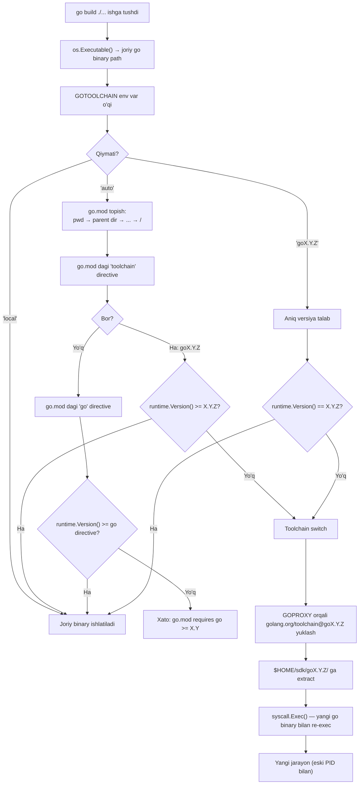
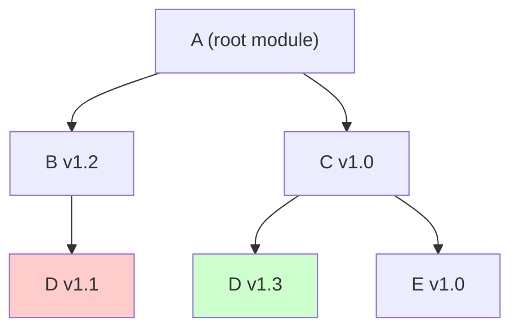
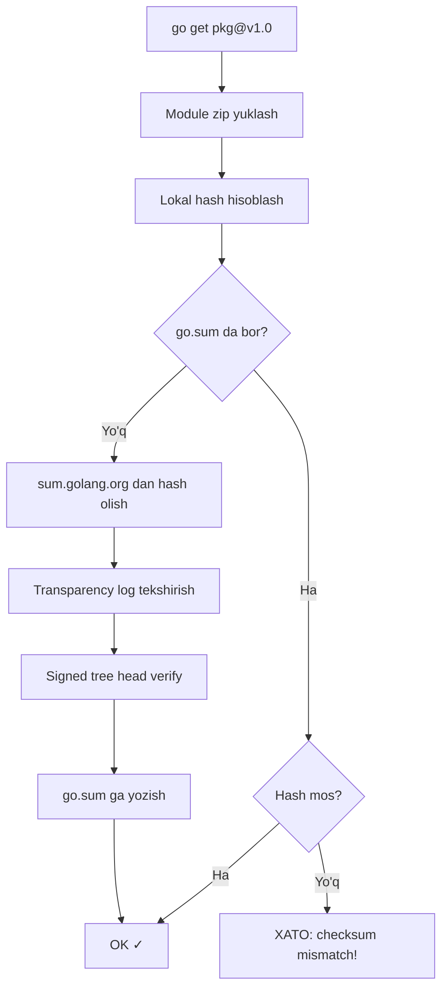
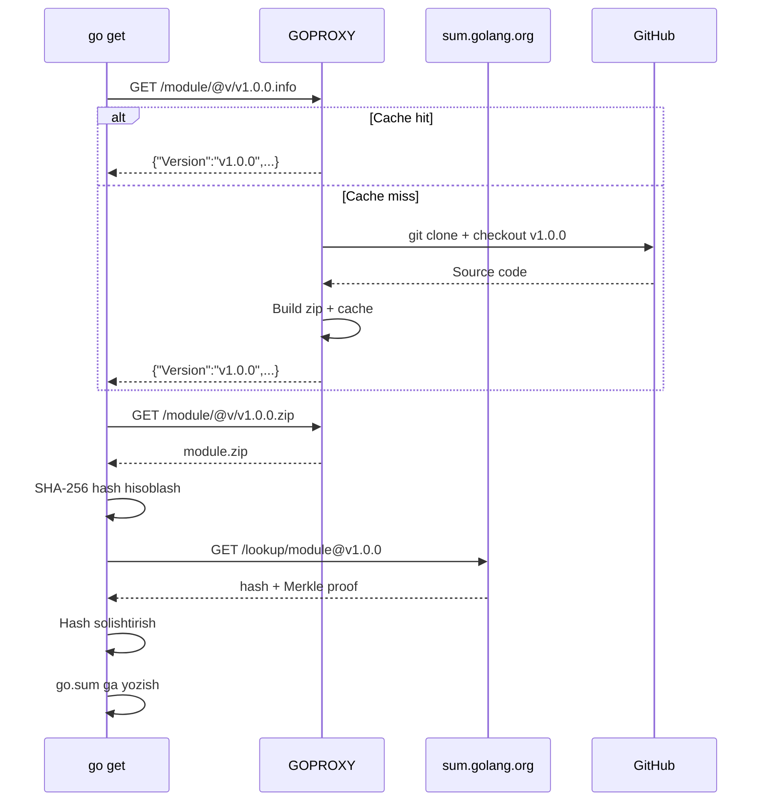
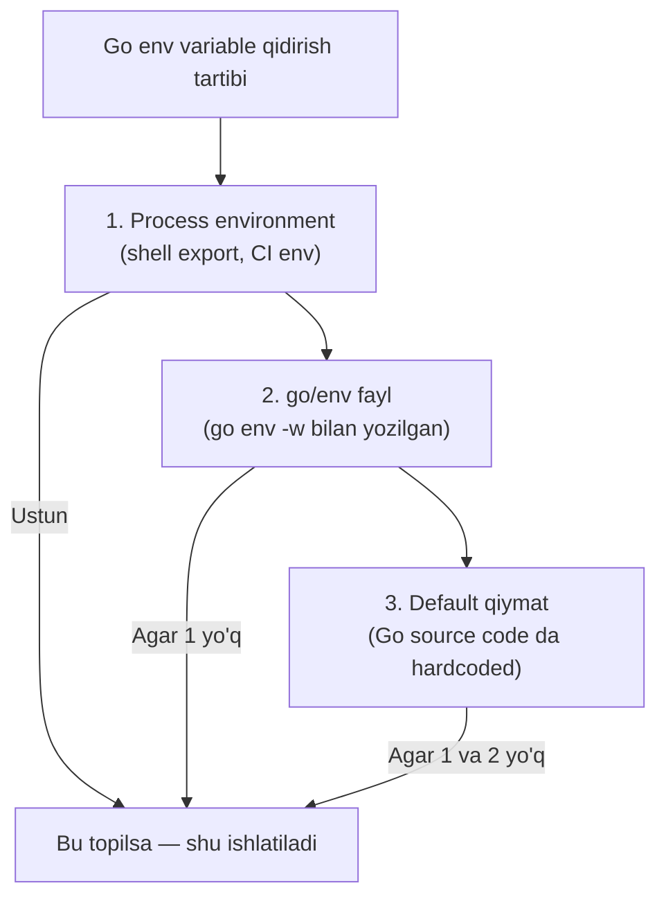
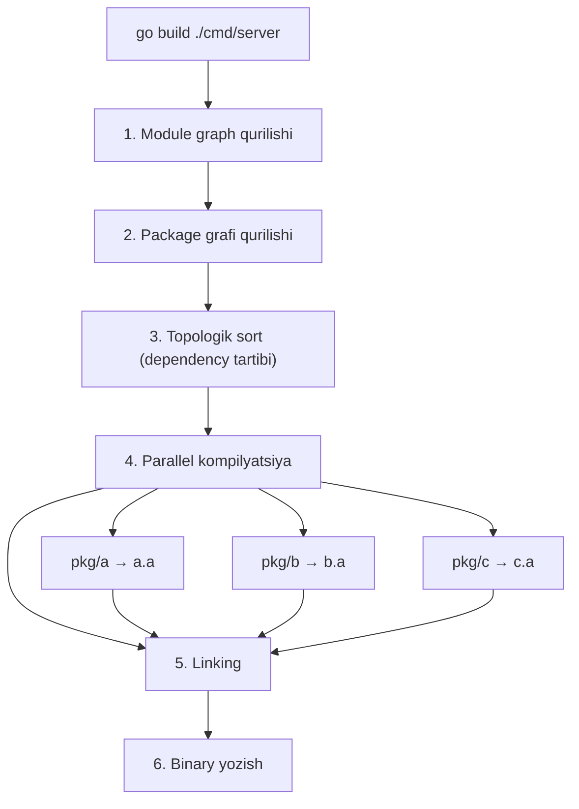

# Setting Up the Environment — Professional (Under the Hood)

## Table of Contents

1. [Introduction](#1-introduction)
2. [How It Works Internally](#2-how-it-works-internally)
3. [Runtime Deep Dive](#3-runtime-deep-dive)
4. [Compiler Perspective](#4-compiler-perspective)
5. [Memory Layout](#5-memory-layout)
6. [OS / Syscall Level](#6-os--syscall-level)
7. [Source Code Walkthrough](#7-source-code-walkthrough)
8. [Assembly Output Analysis](#8-assembly-output-analysis)
9. [Performance Internals](#9-performance-internals)
10. [Edge Cases at the Lowest Level](#10-edge-cases-at-the-lowest-level)
11. [Test](#11-test)
12. [Tricky Questions](#12-tricky-questions)
13. [Summary](#13-summary)
14. [Further Reading](#14-further-reading)

---

## 1. Introduction

Bu bo'limda Go muhit sozlashining "kaput ostida" qanday ishlashini o'rganamiz: toolchain resolution mexanizmi, MVS (Minimal Version Selection) algoritmi, checksum/Merkle tree asoslari, GOPROXY HTTP protokoli, module caching tizimi, build cache internals va environment variable precedence (ustuvorlik tartibi). Bu bilimlar murakkab muammolarni debug qilish va enterprise-scale muhitni optimallashtirish uchun zarur.

---

## 2. How It Works Internally

### 2.1. Toolchain resolution internals

Go buyrug'i ishga tushganda birinchi qadam — qaysi toolchain ni ishlatishni aniqlash:



#### Re-exec mexanizmi

```go
// Go source: src/cmd/go/internal/toolchain/select.go (soddalashtirilgan)

func Switch() {
    // 1. Kerakli versiyani aniqlash
    need := needVersion()  // go.mod → toolchain yoki go directive

    // 2. Joriy versiya bilan solishtirish
    have := runtime.Version()  // "go1.22.0"
    if semver.Compare(have, need) >= 0 {
        return  // Joriy versiya yetarli
    }

    // 3. Yangi toolchain topish
    dir := downloadToolchain(need)  // ~/sdk/go1.23.4/

    // 4. Re-exec — joriy jarayonni almashtirish
    // Bu exec(2) syscall — yangi binary, eski PID
    exe := filepath.Join(dir, "bin", "go")
    err := syscall.Exec(exe, os.Args, os.Environ())
    // Agar syscall.Exec muvaffaqiyatli bo'lsa, bu qator HECH QACHON ishlamaydi
    // Chunki joriy jarayon butunlay almashtirildi
}
```

#### Toolchain download jarayoni

```bash
# 1. GOPROXY orqali so'rov
# GET https://proxy.golang.org/golang.org/toolchain/@v/go1.23.4.info
# GET https://proxy.golang.org/golang.org/toolchain/@v/go1.23.4.mod
# GET https://proxy.golang.org/golang.org/toolchain/@v/go1.23.4.zip

# 2. Checksum tekshirish
# sum.golang.org dan hash olish
# Zip hash bilan solishtirish

# 3. Extract
# ~/sdk/go1.23.4/ ga chiqarish

# 4. Tekshirish
ls ~/sdk/go1.23.4/bin/go
~/sdk/go1.23.4/bin/go version
```

### 2.2. MVS (Minimal Version Selection) algoritmi

MVS — Go'ning dependency resolution algoritmi. Boshqa tizimlardan (SAT solver) tubdan farq qiladi.

#### Algoritm



```
Dependency grafi:
A → B@v1.2 → D@v1.1
A → C@v1.0 → D@v1.3, E@v1.0

MVS algoritmi:
1. Build list = {A, B@v1.2, C@v1.0}
2. B@v1.2 → D@v1.1 qo'shiladi: {A, B@v1.2, C@v1.0, D@v1.1}
3. C@v1.0 → D@v1.3 — D allaqachon v1.1, v1.3 > v1.1 → yangilash
4. C@v1.0 → E@v1.0 qo'shiladi
5. Final: {A, B@v1.2, C@v1.0, D@v1.3, E@v1.0}
```

#### MVS pseudocode

```
function MVS(root):
    build_list = {root}
    max_version = {}  // module → max required version

    queue = [root]
    while queue not empty:
        mod = queue.pop()
        for each require (dep, version) in mod.go.mod:
            if dep not in max_version or version > max_version[dep]:
                max_version[dep] = version
                queue.push(dep@version)

    return max_version
```

#### MVS vs SAT solver (npm, pip)

```
MVS:
- Deterministic — bir xil input → bir xil output
- Polynomial time — O(n) yoki O(n log n)
- Minimal — hech qachon talab qilinganidan YUQORI versiya tanlamaydi
- Monotonic — dependency qo'shish FAQAT versiyani ko'tarishi mumkin

SAT Solver (npm):
- NP-complete — ba'zan juda sekin
- Non-deterministic — bir xil input → turli output mumkin
- Maximal — eng yangi mos versiyani tanlashga harakat qiladi
- Non-monotonic — dependency qo'shish boshqa versiyalarni PASAYTIRISHISHI mumkin
```

### 2.3. Checksum va Merkle tree

#### go.sum hash formati

```
# go.sum qator formati:
# module version h1:hash=
github.com/gin-gonic/gin v1.9.1 h1:4idEAncQnU5cB7BeOkPtxjfCSye0AAm1R0RVIqFPSsg=

# Hash hisoblash algoritmi:
# 1. Module zip yaratish (standart format)
# 2. Zip ichidagi barcha fayllarni hash lash
# 3. Hash lar ro'yxatini sorted qilib, Merkle hash tree quriladi
# 4. Root hash = h1 hash

# h1 = SHA-256 of (Hash(file1) + Hash(file2) + ...)
```

#### Go Sum Database (sum.golang.org)



```bash
# Sum database HTTP API:
# 1. Hash olish
curl https://sum.golang.org/lookup/github.com/gin-gonic/gin@v1.9.1
# Response:
# 15765023
# github.com/gin-gonic/gin v1.9.1 h1:4idEAncQnU5cB7BeOkPtxjfCSye0AAm1R0RVIqFPSsg=
# github.com/gin-gonic/gin v1.9.1/go.mod h1:hPrL/0KcuqOSEYJMaBK2NRtea7So7lEFo2/aBJSBJa4=
#
# go.sum database tree
# 21614891
# K4ByBYJej6lKEOo6Kh+qhOFw7vl...

# 2. Merkle tree proof
# Transparency log (Certificate Transparency ga o'xshash)
# Append-only log — bir marta yozilgan hash o'zgartirilmaydi
# Buni "Tamper-evident log" deb ham atashadi
```

#### Hash hisoblash internal

```go
// Go source: cmd/go/internal/dirhash/hash.go (soddalashtirilgan)

// Hash1 hishlaydi:
// h1:<hash>
// bu yerda <hash> = base64(SHA-256(file list hash tree))

func Hash1(files []string) (string, error) {
    var buf bytes.Buffer
    for _, file := range sortedFiles {
        // Har bir fayl uchun:
        // "hash:<sha256 of file content>  <file path>\n"
        h := sha256.New()
        io.Copy(h, fileReader)
        fmt.Fprintf(&buf, "hash:%x  %s\n", h.Sum(nil), file)
    }

    // Butun ro'yxatning hash i
    h := sha256.New()
    h.Write(buf.Bytes())
    return "h1:" + base64.StdEncoding.EncodeToString(h.Sum(nil)), nil
}
```

### 2.4. GOPROXY HTTP protokoli

```
GOPROXY server quyidagi endpoint larni implement qilishi kerak:

GET $GOPROXY/<module>/@v/list          → versiyalar ro'yxati (\n bilan ajratilgan)
GET $GOPROXY/<module>/@v/<version>.info → {"Version":"v1.0.0","Time":"2024-01-15T..."}
GET $GOPROXY/<module>/@v/<version>.mod  → go.mod fayl contenti
GET $GOPROXY/<module>/@v/<version>.zip  → module source zip
GET $GOPROXY/<module>/@latest           → eng yangi versiya info (ixtiyoriy)
```

```bash
# Amaliy misollar:

# 1. Versiyalar ro'yxati
curl https://proxy.golang.org/github.com/gin-gonic/gin/@v/list
# v1.0.0
# v1.1.0
# ...
# v1.9.1

# 2. Versiya info
curl https://proxy.golang.org/github.com/gin-gonic/gin/@v/v1.9.1.info
# {"Version":"v1.9.1","Time":"2023-10-11T17:44:23Z"}

# 3. go.mod
curl https://proxy.golang.org/github.com/gin-gonic/gin/@v/v1.9.1.mod
# module github.com/gin-gonic/gin
# go 1.20
# require (...)

# 4. Source zip
curl -O https://proxy.golang.org/github.com/gin-gonic/gin/@v/v1.9.1.zip
# Zip format: github.com/gin-gonic/gin@v1.9.1/file.go
```



#### GOPROXY fallback mexanizmi

```go
// src/cmd/go/internal/modfetch/fetch.go (soddalashtirilgan)

func lookup(module, version string) (*Module, error) {
    proxies := parseGOPROXY()  // "proxy1,proxy2,direct"

    for i, proxy := range proxies {
        mod, err := tryProxy(proxy, module, version)
        if err == nil {
            return mod, nil
        }

        // Separator tekshirish:
        if proxies[i].separator == ',' {
            // Vergul: faqat 404/410 da keyingisiga o'tish
            if !isNotFound(err) {
                return nil, err  // 500, timeout → XATO
            }
        } else if proxies[i].separator == '|' {
            // Pipe: har qanday xatoda keyingisiga o'tish
            continue
        }
    }
    return nil, fmt.Errorf("module not found")
}
```

### 2.5. Module caching tizimi

```bash
# Module cache strukturasi:
~/go/pkg/mod/
├── cache/
│   └── download/
│       ├── github.com/
│       │   └── gin-gonic/
│       │       └── gin/
│       │           └── @v/
│       │               ├── list          # Versiyalar ro'yxati
│       │               ├── v1.9.1.info   # Versiya metadata
│       │               ├── v1.9.1.mod    # go.mod
│       │               ├── v1.9.1.zip    # Source zip
│       │               ├── v1.9.1.ziphash # Zip hash
│       │               └── v1.9.1.lock   # Download lock fayl
│       └── sumdb/
│           └── sum.golang.org/
│               ├── lookup/               # Hash lookups cache
│               └── tile/                 # Merkle tree tiles
└── github.com/
    └── gin-gonic/
        └── gin@v1.9.1/                  # Extracted source
            ├── go.mod
            ├── gin.go
            └── ...
```

```go
// Cache file permissions:
// Source fayllar: 0444 (read-only) — tasodifan o'zgartirib bo'lmaydi
// Papkalar: 0555 (read+execute only)

// Cache sharing:
// GOMODCACHE=<path> bilan bir nechta foydalanuvchi bitta cache ishlatishi mumkin
// Lekin: file locking kerak (parallel download)
```

#### Lock mexanizmi

```go
// Module download da parallel xavfsizlik:
// 1. .lock fayl yaratish (flock)
// 2. .partial fayl ga yozish
// 3. .partial → final nomga atomic rename
// 4. .lock faylni o'chirish

// Bu shuni ta'minlaydi:
// - Ikki go process bir vaqtda bir xil modulni yuklasa — birinchisi yozadi, ikkinchisi kutadi
// - Download yarim yo'lda to'xtasa — .partial fayl qoladi, keyingi safar qaytadan yuklaydi
```

### 2.6. Build cache internals

```bash
# Build cache strukturasi:
~/.cache/go-build/
├── 00/
│   ├── 00a1b2c3d4e5f6...  # Cache entry (compiled object)
│   └── ...
├── 01/
├── ...
├── ff/
├── log.txt                 # Cache operations log
├── README                  # Cache format description
└── trim.txt                # Last trim timestamp
```

```
Build cache key hisoblash:

cache_key = SHA-256(
    action_id,      # Build action identifikatori
    package_path,   # "github.com/user/pkg"
    source_hash,    # Barcha .go fayllar hash i
    import_hash,    # Import qilingan paketlar hash i
    build_flags,    # -race, -ldflags, CGO_ENABLED, etc.
    go_version,     # Go compiler versiyasi
    GOARCH,         # Target arxitektura
    GOOS,           # Target OS
)

# Agar cache_key mos kelsa → cached result ishlatiladi
# Agar mos kelmasa → qayta kompilyatsiya
```

```go
// Cache entry formati:
// Har bir entry = action ID → output ID mapping
//
// Action ID: input larning hash i (source + flags + deps)
// Output ID: natija faylning hash i (.a archive yoki binary)
//
// Tekshirish:
// 1. Action ID hisoblash
// 2. Cache da qidirish: action_id → output_id
// 3. Agar topilsa: output_id bo'yicha cached file qaytarish
// 4. Agar topilmasa: kompilyatsiya + cache ga yozish
```

### 2.7. Environment variable precedence



```go
// src/cmd/go/internal/cfg/cfg.go (soddalashtirilgan)

func EnvOrDefault(key, def string) string {
    // 1. Process environment (os.Getenv)
    if v := os.Getenv(key); v != "" {
        return v
    }

    // 2. go/env fayl
    if v := readGoEnvFile(key); v != "" {
        return v
    }

    // 3. Default
    return def
}

// go/env fayl joylashuvi:
// Linux:   ~/.config/go/env
// macOS:   ~/Library/Application Support/go/env
// Windows: %AppData%\go\env
```

```bash
# Amaliy tekshirish:
# 1. Default
go env GOPROXY
# https://proxy.golang.org,direct

# 2. go env -w bilan yozish
go env -w GOPROXY=https://goproxy.io,direct
go env GOPROXY
# https://goproxy.io,direct

# 3. Shell env bilan override
export GOPROXY=direct
go env GOPROXY
# direct  ← shell env USTUN!

# 4. Qaytarish
unset GOPROXY
go env GOPROXY
# https://goproxy.io,direct  ← go env -w dagi qiymat

go env -u GOPROXY
go env GOPROXY
# https://proxy.golang.org,direct  ← default
```

#### Maxsus env variable lar

```
GOENV         → go/env fayl joylashuvi (faqat process env dan o'qiladi!)
GOROOT        → Maxsus: agar o'rnatilmasa, go binary joylashuvidan hisoblanadi
GOPATH        → Default: ~/go (yoki %USERPROFILE%\go Windows da)
GOMODCACHE    → Default: $GOPATH/pkg/mod
GOCACHE       → Default: os.UserCacheDir()/go-build
GOTMPDIR      → Default: os.TempDir()
GOFLAGS       → Barcha go buyruqlariga qo'shimcha flag lar

# GOROOT hisoblash:
# 1. os.Getenv("GOROOT") → agar bor
# 2. Aks holda: go binary path dan:
#    /usr/local/go/bin/go → GOROOT = /usr/local/go
#    Mantiq: executable_path → parent → parent
```

---

## 3. Runtime Deep Dive

### 3.1. go command bootstrap

```
go buyrug'i ishga tushganda:

1. main() → cmd/go/main.go
2. os.Args parse → sub-command aniqlash (build, get, mod, etc.)
3. Environment setup:
   a. GOROOT aniqlash
   b. GOPATH aniqlash
   c. go/env fayl o'qish
   d. GOPROXY, GOPRIVATE, etc. o'rnatish
4. Toolchain check:
   a. GOTOOLCHAIN o'qish
   b. go.mod topish
   c. Kerak bo'lsa → re-exec (syscall.Exec)
5. Module graph qurilishi (agar go.mod mavjud)
6. Sub-command bajarilishi
```

### 3.2. go mod init internal

```go
// go mod init module_path bajarilishi:

// 1. Joriy papkada go.mod mavjudligini tekshirish
if _, err := os.Stat("go.mod"); err == nil {
    return fmt.Errorf("go.mod already exists")
}

// 2. Agar module_path berilmagan — taxmin qilish
// a. VCS (git) remote URL dan:
//    git remote get-url origin → github.com/user/repo
// b. GOPATH/src ichidami?
//    $GOPATH/src/github.com/user/repo → github.com/user/repo

// 3. go.mod yozish
modFile := &modfile.File{}
modFile.AddModuleStmt(modulePath)
modFile.AddGoStmt(goVersion)  // runtime.Version()
data, _ := modFile.Format()
os.WriteFile("go.mod", data, 0666)

// 4. Agar eski dependency fayllar mavjud (Gopkg.lock, vendor.json, etc.)
//    → ularni go.mod require ga konvert qilish
```

---

## 4. Compiler Perspective

### 4.1. Build jarayoni batafsil



```bash
# Build jarayonini kuzatish:
go build -x ./cmd/server 2>&1 | head -40

# Natija (soddalashtirilgan):
# WORK=/tmp/go-build1234567
# mkdir -p $WORK/b001/
#
# # Package dependency ketma-ketlik:
# compile -o $WORK/b002/_pkg_.a -p fmt -complete ...  # stdlib: fmt
# compile -o $WORK/b003/_pkg_.a -p net/http ...        # stdlib: net/http
# compile -o $WORK/b004/_pkg_.a -p github.com/gin-gonic/gin ...  # dependency
# compile -o $WORK/b001/_pkg_.a -p main ...            # sizning kodingiz
#
# # Linking:
# link -o $WORK/b001/exe/a.out -buildid xxx -extld gcc $WORK/b001/_pkg_.a
#
# # Final binary:
# mv $WORK/b001/exe/a.out server
```

### 4.2. Module zip formati

```
Module zip fayl formati (RFC):

zip entry format: <module>@<version>/<relative-path>

Masalan:
github.com/gin-gonic/gin@v1.9.1/
├── gin.go
├── context.go
├── routergroup.go
├── go.mod
├── go.sum
├── LICENSE
└── README.md

Qoidalar:
1. Fayllar UTF-8 bo'lishi kerak
2. Maximum fayl hajmi: 500 MB (butun zip)
3. Maximum bitta fayl: 500 MB
4. Alohida fayl uchun max hajm: $GONOSUMCHECK bo'lmasa 16 MB
5. .git, vendor/ KIRMAYDI
6. Testdata papkasi KIRADI
```

---

## 5. Memory Layout

### 5.1. Module cache memory layout

```
go process memory da module ma'lumotlari:

1. modfile.File struct:
   ┌─────────────────────────────────┐
   │ Module: {Path, Version}         │  // Modul identifikatori
   │ Go: {Version}                   │  // go directive
   │ Toolchain: {Name}               │  // toolchain directive
   │ Require: []*Require             │  // dependency ro'yxati
   │ Exclude: []*Exclude             │  // exclude ro'yxati
   │ Replace: []*Replace             │  // replace ro'yxati
   │ Retract: []*Retract             │  // retract ro'yxati
   └─────────────────────────────────┘

2. MVS grafida node:
   ┌──────────────────────────┐
   │ module.Version {         │
   │   Path:    "github.com/..."  │
   │   Version: "v1.9.1"     │
   │ }                        │
   │ deps: []module.Version   │
   └──────────────────────────┘
```

### 5.2. Build cache entry layout

```
Cache entry disk da:

$GOCACHE/ab/ab1234...  (action result)
├── Header (first 32 bytes):
│   ├── Bytes 0-3:   "v1\n"           # Format version
│   ├── Bytes 4-35:  output_id [32]   # SHA-256 of output
│   ├── Bytes 36-43: size int64       # Output hajmi
│   └── Bytes 44-51: time int64       # Cache vaqti
└── Body (qolgan bytes):
    └── Compiled object (.a) yoki binary

Lookup:
    action_id = SHA-256(input parameters)
    path = $GOCACHE + "/" + hex(action_id[:1]) + "/" + hex(action_id)
```

---

## 6. OS / Syscall Level

### 6.1. Toolchain re-exec

```go
// Toolchain switch — syscall.Exec

// Linux da: execve(2) syscall
// Bu jarayonni TO'LIQ almashtiradi:
// - Yangi binary yuklanadi
// - Eski binary memory dan chiqariladi
// - PID O'ZGARMAYDI
// - File descriptor lar saqlanadi (close-on-exec bo'lmasa)
// - Signal handler lar reset bo'ladi

import "syscall"

func switchToolchain(newGo string) {
    // execve(path, argv, envp)
    err := syscall.Exec(
        newGo,         // /home/user/sdk/go1.23.4/bin/go
        os.Args,       // ["go", "build", "./..."]
        os.Environ(),  // Barcha env vars
    )
    // Agar Exec muvaffaqiyatli → bu qator HECH QACHON ishlamaydi
    // Agar xato → err != nil
    fmt.Fprintf(os.Stderr, "exec failed: %v\n", err)
    os.Exit(1)
}
```

### 6.2. File locking (module download)

```go
// Module cache da parallel download himoyasi:
// Linux: flock(2) — advisory lock
// macOS: flock(2) — advisory lock
// Windows: LockFileEx — mandatory lock

// src/cmd/go/internal/lockedfile/lockedfile.go

func Lock(path string) (*os.File, error) {
    f, err := os.OpenFile(path+".lock", os.O_CREATE|os.O_RDWR, 0666)
    if err != nil {
        return nil, err
    }

    // Linux/macOS:
    err = syscall.Flock(int(f.Fd()), syscall.LOCK_EX)
    // LOCK_EX = exclusive lock
    // Boshqa process LOCK_EX olishga harakat qilsa — KUTADI

    return f, err
}
```

### 6.3. Atomic file operations

```go
// Module cache da xavfsiz yozish:
// 1. Temporary faylga yozish
// 2. Atomic rename

func writeFileAtomic(path string, data []byte) error {
    // 1. Temp fayl yaratish (xuddi shu filesystem da!)
    tmp, err := os.CreateTemp(filepath.Dir(path), ".tmp-*")
    if err != nil {
        return err
    }

    // 2. Ma'lumot yozish
    if _, err := tmp.Write(data); err != nil {
        tmp.Close()
        os.Remove(tmp.Name())
        return err
    }
    tmp.Close()

    // 3. Atomic rename
    // Linux: rename(2) — atomic operatsiya
    // Agar power outage bo'lsa — yoki eski fayl, yoki yangi fayl
    // Hech qachon yarim-yarim bo'lmaydi
    return os.Rename(tmp.Name(), path)
}
```

---

## 7. Source Code Walkthrough

### 7.1. go command entry point

```
Go source tree (src/cmd/go/):

cmd/go/
├── main.go                    # Entry point
├── internal/
│   ├── cfg/                   # Configuration (env vars)
│   │   └── cfg.go             # GOPATH, GOROOT, etc.
│   ├── modcmd/                # go mod subcommands
│   │   ├── init.go            # go mod init
│   │   ├── tidy.go            # go mod tidy
│   │   ├── download.go        # go mod download
│   │   └── vendor.go          # go mod vendor
│   ├── modfetch/              # Module download
│   │   ├── fetch.go           # Download logic
│   │   ├── proxy.go           # GOPROXY protocol
│   │   ├── cache.go           # Module cache
│   │   └── sumdb.go           # Sum database client
│   ├── modload/               # Module loading
│   │   ├── init.go            # Module graph initialization
│   │   ├── mvs.go             # MVS algorithm wrapper
│   │   └── build.go           # Build list computation
│   ├── mvs/                   # MVS core algorithm
│   │   └── mvs.go             # BuildList, Upgrade, Downgrade
│   ├── toolchain/             # Toolchain management
│   │   └── select.go          # GOTOOLCHAIN resolution
│   ├── work/                  # Build execution
│   │   ├── build.go           # go build
│   │   ├── exec.go            # Compilation
│   │   └── gc.go              # Go compiler integration
│   └── cache/                 # Build cache
│       ├── cache.go           # Cache read/write
│       └── hash.go            # Action ID computation
```

### 7.2. MVS source code

```go
// src/cmd/go/internal/mvs/mvs.go (soddalashtirilgan)

// BuildList — asosiy MVS funksiyasi
func BuildList(targets []module.Version, reqs Reqs) ([]module.Version, error) {
    // 1. BFS bilan butun dependency grafini kuzatish
    min := map[string]string{}  // module path → minimum version

    var walk func(m module.Version)
    walk = func(m module.Version) {
        // Agar bu modul uchun allaqachon yuqoriroq versiya bo'lsa — skip
        if v, ok := min[m.Path]; ok && semver.Compare(v, m.Version) >= 0 {
            return
        }
        min[m.Path] = m.Version

        // Bu modulning dependency larini kuzatish
        required, _ := reqs.Required(m)
        for _, r := range required {
            walk(r)
        }
    }

    for _, t := range targets {
        walk(t)
    }

    // 2. Natijani sorted list ga aylantirish
    var list []module.Version
    for path, version := range min {
        list = append(list, module.Version{Path: path, Version: version})
    }
    sort.Slice(list, func(i, j int) bool {
        return list[i].Path < list[j].Path
    })

    return list, nil
}
```

### 7.3. GOPROXY client implementation

```go
// src/cmd/go/internal/modfetch/proxy.go (soddalashtirilgan)

type proxyRepo struct {
    url  string    // "https://proxy.golang.org"
    path string    // "github.com/gin-gonic/gin"
}

func (p *proxyRepo) Versions(prefix string) ([]string, error) {
    // GET https://proxy.golang.org/github.com/gin-gonic/gin/@v/list
    url := fmt.Sprintf("%s/%s/@v/list", p.url, pathEscape(p.path))
    resp, err := http.Get(url)
    if err != nil {
        return nil, err
    }
    defer resp.Body.Close()

    // Parse: har bir qator = bitta versiya
    var versions []string
    scanner := bufio.NewScanner(resp.Body)
    for scanner.Scan() {
        versions = append(versions, scanner.Text())
    }
    return versions, nil
}

func (p *proxyRepo) GoMod(version string) ([]byte, error) {
    // GET https://proxy.golang.org/github.com/gin-gonic/gin/@v/v1.9.1.mod
    url := fmt.Sprintf("%s/%s/@v/%s.mod", p.url, pathEscape(p.path), version)
    resp, err := http.Get(url)
    if err != nil {
        return nil, err
    }
    return io.ReadAll(resp.Body)
}

func (p *proxyRepo) Zip(version string) (io.ReadCloser, error) {
    // GET https://proxy.golang.org/github.com/gin-gonic/gin/@v/v1.9.1.zip
    url := fmt.Sprintf("%s/%s/@v/%s.zip", p.url, pathEscape(p.path), version)
    resp, err := http.Get(url)
    if err != nil {
        return nil, err
    }
    return resp.Body, nil
}
```

---

## 8. Assembly Output Analysis

### 8.1. Build ID tuzilishi

```bash
# Binary dagi build ID:
go tool buildid ./server
# actionID/contentID

# Build ID formati: actionID/[.teleportID]/contentID
# actionID = input hash (source + flags + deps)
# contentID = output hash (binary content)
# Ikkalasi SHA-256 dan olingan

# Bu build cache uchun ishlatiladi:
# 1. actionID hisoblash
# 2. Cache da qidirish
# 3. Agar topilsa va contentID mos → cache hit
```

### 8.2. -trimpath ta'siri

```bash
# -trimpath YO'Q:
go build -o server1 ./cmd/server
go tool nm server1 | grep "\.go"
# ... /home/user/projects/myapp/cmd/server/main.go ...

# -trimpath BILAN:
go build -trimpath -o server2 ./cmd/server
go tool nm server2 | grep "\.go"
# ... cmd/server/main.go ...

# Farq: lokal path lar olib tashlangan
# Bu xavfsizlik va reproducibility uchun muhim
```

### 8.3. ldflags ta'siri

```bash
# -w: DWARF debug info o'chirish
# -s: Symbol table o'chirish
# Natija: kichikroq binary

ls -lh server_debug    # 15 MB (default)
ls -lh server_stripped  # 10 MB (-ldflags="-w -s")

# Binary tarkibini ko'rish:
go tool nm ./server | wc -l          # Symbol table entries
go tool objdump ./server | head -20  # Assembly
```

---

## 9. Performance Internals

### 9.1. Build parallelism

```
go build parallel kompilyatsiya:

1. Package dependency grafini topologik sort
2. Dependency yo'q paketlar → parallel kompilyatsiya
3. Har bir CPU core = bitta compile jarayoni

Misol:
    main → A → C
    main → B → C

    Step 1: C kompilyatsiya (dependency yo'q)
    Step 2: A va B parallel kompilyatsiya (ikkalasi faqat C ga bog'liq)
    Step 3: main kompilyatsiya (A va B tayyor)

    GOMAXPROCS=8 bo'lsa, step 2 da A va B turli core larda ishga tushadi
```

### 9.2. Module cache performance

```
Module cache disk I/O optimizatsiyasi:

1. zip fayl cache — bir marta yuklash, ko'p marta o'qish
2. Extracted source — read-only (0444) → OS file cache samarali
3. Directory hash — papka content hash disk da saqlanadi
4. .info, .mod fayllar — kichik, tez o'qiladi

Muammo: katta GOMODCACHE
- 100+ loyiha → 10GB+ cache
- Yechim: go clean -modcache (periodic)
- Yoki GOMODCACHE ni tez disk da joylashtirish
```

### 9.3. Sum database caching

```
sum.golang.org response cache:

1. Tile-based caching:
   - Merkle tree 256 ta tile ga bo'lingan
   - Har bir tile alohida cache qilinadi
   - Yangi entry qo'shilsa faqat o'zgargan tile yangilanadi

2. Lokal cache:
   ~/go/pkg/mod/cache/download/sumdb/sum.golang.org/
   ├── lookup/                # module@version → hash mapping
   └── tile/                  # Merkle tree tiles
       ├── 8/0/000            # Tile data
       ├── 8/0/001
       └── ...

3. Performance:
   - Birinchi lookup: HTTP so'rov (50-200ms)
   - Keyingi lookup: disk cache (< 1ms)
   - Tile cache: ko'p module lar bitta tile da
```

---

## 10. Edge Cases at the Lowest Level

### 10.1. Concurrent toolchain switch race

```go
// Muammo: Ikkita go process bir vaqtda toolchain yuklaydi
// Yechim: File locking

// Process 1: go build ./...  → need go1.23.4 → download
// Process 2: go test ./...   → need go1.23.4 → download

// Ikkalasi bir vaqtda ~/sdk/go1.23.4/ ga yozishga harakat qilsa:
// - Lock file: ~/sdk/go1.23.4.lock
// - Birinchi kelgan lock oladi va yuklaydi
// - Ikkinchisi kutadi
// - Lock qo'yilgandan keyin ikkinchisi tekshiradi — allaqachon bor → skip download
```

### 10.2. go.sum Merkle tree corruption

```bash
# Muammo: go.sum dagi hash noto'g'ri (manual tahrirlash)
# Natija:
go mod verify
# github.com/pkg/errors v0.9.1: checksumdb mismatch

# Yechim:
# 1. go.sum dan noto'g'ri qatorni o'chirish
# 2. go mod tidy → qaytadan hash hisoblash va sum DB dan tekshirish
# 3. go mod verify → tasdiqlash
```

### 10.3. Module path case sensitivity

```
# Linux: case-sensitive filesystem
# macOS: case-insensitive (default HFS+)
# Windows: case-insensitive (NTFS)

# Muammo: GitHub repo "MyPackage" → Go module path "mypackage"
# Go module path lar case-sensitive!

# Module proxy URL encoding:
# Katta harf → "!" + kichik harf
# "MyPackage" → "!my!package" in URL

# Masalan:
# github.com/Azure/azure-sdk-for-go
# Proxy URL: github.com/!azure/azure-sdk-for-go
```

### 10.4. Time-based cache invalidation

```go
// Build cache:
// - Fayllar "atime" (access time) bilan tracking
// - go clean avtomatik eski cache larni o'chiradi
// - Default: 5 kun ishlatilmagan cache → o'chirishga nomzod

// Module cache:
// - HECH QACHON avtomatik o'chirilmaydi
// - Faqat "go clean -modcache" bilan
// - Sabab: module content immutable (bir xil versiya = bir xil content)
```

---

## 11. Test

**1. Go toolchain switch qaysi syscall orqali amalga oshiriladi?**

- A) `fork(2)` + `exec(2)`
- B) `syscall.Exec()` — `execve(2)`
- C) `os/exec.Command()`
- D) `go routine`

<details>
<summary>Javob</summary>
B) `syscall.Exec()` — bu `execve(2)` syscall ni chaqiradi. Bu joriy jarayonni TO'LIQ yangi binary bilan almashtiradi. PID o'zgarmaydi. `fork` + `exec` dan farqi — yangi child process yaratilmaydi, joriy process o'zi almashadi.
</details>

**2. MVS algoritmi qanday murakkablikka (complexity) ega?**

- A) O(1)
- B) O(n log n) yoki O(n)
- C) NP-complete
- D) O(n^2)

<details>
<summary>Javob</summary>
B) MVS — polynomial time, odatda O(n) yoki O(n log n) (sorting uchun). Bu npm/pip ning SAT solver laridan (NP-complete) tubdan farq qiladi. Sabablar: MVS faqat "minimal qoniqarli versiya" qidiradi, backtracking yo'q.
</details>

**3. go.sum dagi `h1:` hash qanday hisoblanadi?**

- A) Faqat go.mod faylning SHA-256
- B) Module zip faylning SHA-256
- C) Module ichidagi barcha fayllar hash larining Merkle tree root hash i
- D) Random generated

<details>
<summary>Javob</summary>
C) `h1:` — modul ichidagi barcha fayllar sorted ro'yxatining SHA-256 hash i. Har bir faylning hash i hisoblanadi, keyin barcha hash lar bitta string ga birlashtirilib, yana SHA-256 olinadi. Bu Merkle tree ga o'xshash yondashuv.
</details>

**4. GOPROXY fallback da `,` (vergul) va `|` (pipe) o'rtasidagi farq?**

- A) Farq yo'q
- B) `,` — faqat 404/410 da, `|` — har qanday xatoda
- C) `,` — parallel, `|` — sequential
- D) `|` — faqat 404 da

<details>
<summary>Javob</summary>
B) `,` (vergul) — faqat 404 (Not Found) va 410 (Gone) response larda keyingi proxy ga o'tadi. 500, timeout, network error da → XATO beradi. `|` (pipe) — har qanday xatoda (500, timeout, 404, etc.) keyingi proxy ga o'tadi.
</details>

**5. Module cache dagi source fayllar qanday permission bilan saqlanadi va nima uchun?**

- A) 0644 (read-write for owner)
- B) 0444 (read-only for all)
- C) 0755 (executable)
- D) 0666 (read-write for all)

<details>
<summary>Javob</summary>
B) 0444 (read-only). Sabab: module cache dagi fayllar immutable — bir marta yuklangan modul content i O'ZGARMAYDI. Read-only permission tasodifan tahrirlashning oldini oladi. Bu Go'ning "immutable module" prinsipi — bir xil versiya = bir xil content.
</details>

**6. Build cache key qaysi parametrlardan hisoblanadi?**

- A) Faqat source code hash
- B) Source hash + Go version
- C) Source hash + import hash + build flags + Go version + GOOS + GOARCH
- D) Faqat package path

<details>
<summary>Javob</summary>
C) Build cache key = SHA-256(source hash + import qilingan paketlar hash i + build flags (-race, -ldflags, CGO_ENABLED) + Go compiler versiyasi + GOOS + GOARCH + boshqa parametrlar). Har qanday parametr o'zgarsa — cache miss.
</details>

**7. Environment variable precedence tartibida qaysi biri eng yuqori ustunlikka ega?**

- A) go env -w
- B) Process environment (shell export)
- C) Default qiymat
- D) go.mod dagi directive

<details>
<summary>Javob</summary>
B) Process environment (shell export) eng yuqori ustunlikka ega. Tartib: 1) Shell env → 2) go env -w (fayl) → 3) Default. Istisno: GOENV o'zi faqat shell env dan o'qiladi (go env -w bilan o'rnatib bo'lmaydi).
</details>

**8. Module download da parallel xavfsizlik qanday ta'minlanadi?**

- A) Mutex
- B) Channel
- C) File locking (flock/LockFileEx)
- D) Database lock

<details>
<summary>Javob</summary>
C) File locking — Linux/macOS da `flock(2)` (advisory lock), Windows da `LockFileEx` (mandatory lock). Bir process lock olganda, boshqa process kutadi. Download tugagandan keyin lock qo'yiladi. Bu cross-process synchronization — mutex faqat bitta process ichida ishlaydi.
</details>

**9. `go mod vendor` yaratgan zip va proxy dagi zip bir xilmi?**

- A) Ha, to'liq bir xil
- B) Yo'q, vendor faqat kerakli fayllarni saqlaydi, zip butun modulni
- C) Vendor zip formatda emas
- D) Proxy zip formatda emas

<details>
<summary>Javob</summary>
B va C) `go mod vendor` zip yaratmaydi — u faqat kerakli `.go` fayllarni `vendor/` papkaga nusxalaydi. Proxy dagi zip esa butun modulni o'z ichiga oladi (test lar, docs, etc.). Vendor faqat import qilingan paketlarning source code ini saqlaydi.
</details>

**10. sum.golang.org qanday ma'lumot tuzilmasini ishlatadi?**

- A) SQL database
- B) Blockchain
- C) Transparency log (Merkle tree)
- D) Key-value store

<details>
<summary>Javob</summary>
C) Transparency log — Certificate Transparency (CT) ga o'xshash append-only Merkle tree. Xususiyatlari: 1) Faqat qo'shish mumkin (o'zgartirish/o'chirish yo'q), 2) Har qanday o'zgarish kriptografik isbotlanadi, 3) Client lar "inclusion proof" bilan tekshiradi. Bu tamper-evident — agar biror hash o'zgartirilsa, tree root hash mos kelmaydi.
</details>

---

## 12. Tricky Questions

**1. `syscall.Exec` toolchain switch da ishlatilganda, agar yangi go binary `SIGKILL` bilan o'ldirilsa, eski binary qayta ishga tushadimi?**

<details>
<summary>Javob</summary>

Yo'q! `syscall.Exec` (`execve(2)`) joriy jarayonni TO'LIQ almashtiradi. Eski binary memory dan chiqarilgan. Agar yangi binary `SIGKILL` olsa — jarayon o'ladi, eski binary qaytmaydi.

```
Process lifecycle:
1. go (v1.22) → PID 1234
2. syscall.Exec(go1.23.4) → PID 1234 (binary almashdi)
3. go (v1.23.4) SIGKILL → PID 1234 o'ldi
4. Eski go (v1.22) qaytmaydi — u allaqachon memory da yo'q
```

Bu `fork` + `exec` dan farqi: `fork` da parent process saqlanadi. `syscall.Exec` da parent process o'zi almashadi.
</details>

**2. MVS algoritmi "downgrade" qanday amalga oshiradi? Masalan, `go get pkg@v1.2.0` bo'lganda hozir v1.5.0 ishlatilayotgan bo'lsa?**

<details>
<summary>Javob</summary>

MVS da downgrade maxsus algoritm:

```
Hozirgi build list: A, B@v1.5, C@v1.3
Talab: B@v1.2

Downgrade algoritmi:
1. B@v1.5 → B@v1.2 ga almashtirish
2. B@v1.2 ning dependency larini ko'rish
3. Agar C@v1.3 B@v1.5 tomonidan talab qilingan bo'lsa
   va B@v1.2 C@v1.1 talab qilsa
   → C ham v1.1 ga downgrade bo'lishi mumkin
4. Yangi build list: A, B@v1.2, C@v1.1
```

MVS downgrade "minimal" emas — u "eng katta qoniqarli" versiyalarni saqlashga harakat qiladi. Faqat KERAK bo'lganda pastga tushiradi.

Go source: `src/cmd/go/internal/mvs/mvs.go` → `Downgrade()` funksiyasi.
</details>

**3. Module cache da ikki go process bir vaqtda turli versiyalarni yuklasa (pkg@v1.0 va pkg@v2.0), qanday conflict prevention ishlaydi?**

<details>
<summary>Javob</summary>

Conflict yo'q! Chunki har bir versiya alohida papkada:

```
~/go/pkg/mod/cache/download/github.com/pkg/@v/
├── v1.0.0.lock      # Process 1 ning lock i
├── v1.0.0.zip       # v1.0.0 zip
├── v2.0.0.lock      # Process 2 ning lock i
└── v2.0.0.zip       # v2.0.0 zip
```

Lock fayl versiya-specific. `v1.0.0.lock` va `v2.0.0.lock` turli fayllar — parallel ishlaydi.

Agar IKKI process BIR versiyani yuklasa:
1. Birinchisi `v1.0.0.lock` ni `flock(LOCK_EX)` qiladi
2. Ikkinchisi `flock(LOCK_EX)` da BLOKLANADI
3. Birinchisi yozib bo'lgach lock qo'yadi
4. Ikkinchisi lock oladi, fayl mavjudligini ko'radi → skip download
</details>

**4. `GOROOT` qiymati o'rnatilmagan bo'lsa, Go qanday aniqlaydi? Agar go binary symlink bo'lsa-chi?**

<details>
<summary>Javob</summary>

```go
// GOROOT aniqlash algoritmi:
// 1. os.Getenv("GOROOT") → agar bor, shu
// 2. Aks holda: go binary path dan hisoblash

func findGOROOT() string {
    // go binary: /usr/local/go/bin/go
    exe, _ := os.Executable()
    // os.Executable() SYMLINK ni resolve qiladi!
    // /usr/bin/go → /usr/local/go/bin/go → /usr/local/go/bin/go

    // parent/parent = GOROOT
    // /usr/local/go/bin/go → /usr/local/go/bin → /usr/local/go
    return filepath.Dir(filepath.Dir(exe))
}
```

Symlink holati:
- `/usr/bin/go` → `/usr/local/go/bin/go` (symlink)
- `os.Executable()` symlink ni resolve qiladi → `/usr/local/go/bin/go`
- GOROOT = `/usr/local/go` (to'g'ri!)

Lekin HARDLINK bo'lsa:
- Hardlink original path ni saqlamaydi
- `os.Executable()` hardlink ni resolve QILA OLMAYDI
- Natija: noto'g'ri GOROOT!
- Shuning uchun Go o'rnatish uchun symlink tavsiya etiladi, hardlink emas.
</details>

**5. Build cache da `-race` flag qo'shganda nima uchun BUTUN cache invalidate bo'ladi?**

<details>
<summary>Javob</summary>

`-race` flag build cache key ning bir qismi:

```
cache_key = SHA-256(
    source_hash,
    deps_hash,
    flags_hash,    // ← -race BU YERDA
    go_version,
    GOOS,
    GOARCH
)
```

`-race` bo'lganda:
1. `flags_hash` o'zgaradi → BARCHA paketlar uchun yangi cache key
2. Aslida Go race detector instrumentatsiya kodi qo'shadi
3. Har bir memory read/write oldiga tekshirish kodi qo'yiladi
4. Bu butunlay boshqa binary hosil qiladi

Shuning uchun `-race` bilan build sekinroq — cache dan foydalana olmaydi (agar oldin `-race` siz build qilingan bo'lsa).

Yechim: CI da `-race` faqat test uchun, build uchun emas:
```bash
go test -race ./...     # Race detector bilan test
go build ./...          # Race detector SIZ build (production)
```
</details>

---

## 13. Summary

- **Toolchain resolution** — `GOTOOLCHAIN` → go.mod → `syscall.Exec` bilan re-exec
- **MVS algoritmi** — polynomial time, deterministic, minimal version selection — SAT solver dan tubdan farqli
- **Checksum/Merkle tree** — `go.sum` da `h1:` hash, sum.golang.org transparency log bilan tamper-evident
- **GOPROXY protokoli** — HTTP GET orqali `list`, `.info`, `.mod`, `.zip` endpoint lar; `,` vs `|` fallback farqi
- **Module caching** — versiya-specific lock, atomic write, read-only (0444) fayllar, immutable content
- **Build cache** — SHA-256 action ID → output ID mapping, source + flags + deps + version → cache key
- **Environment precedence** — Shell env > go env -w > default; GOROOT maxsus hisoblash (binary path dan)

---

## 14. Further Reading

1. **Go Modules Reference (rasmiy)** — https://go.dev/ref/mod
2. **Russ Cox: Minimal Version Selection** — https://research.swtch.com/vgo-mvs
3. **Go Checksum Database** — https://go.dev/ref/mod#checksum-database
4. **Go Source Code: cmd/go** — https://github.com/golang/go/tree/master/src/cmd/go
5. **Russ Cox: Transparent Logs** — https://research.swtch.com/tlog
6. **GOPROXY Protocol Spec** — https://go.dev/ref/mod#goproxy-protocol
7. **Go Build Cache Design** — https://github.com/golang/go/blob/master/src/cmd/go/internal/cache/cache.go
