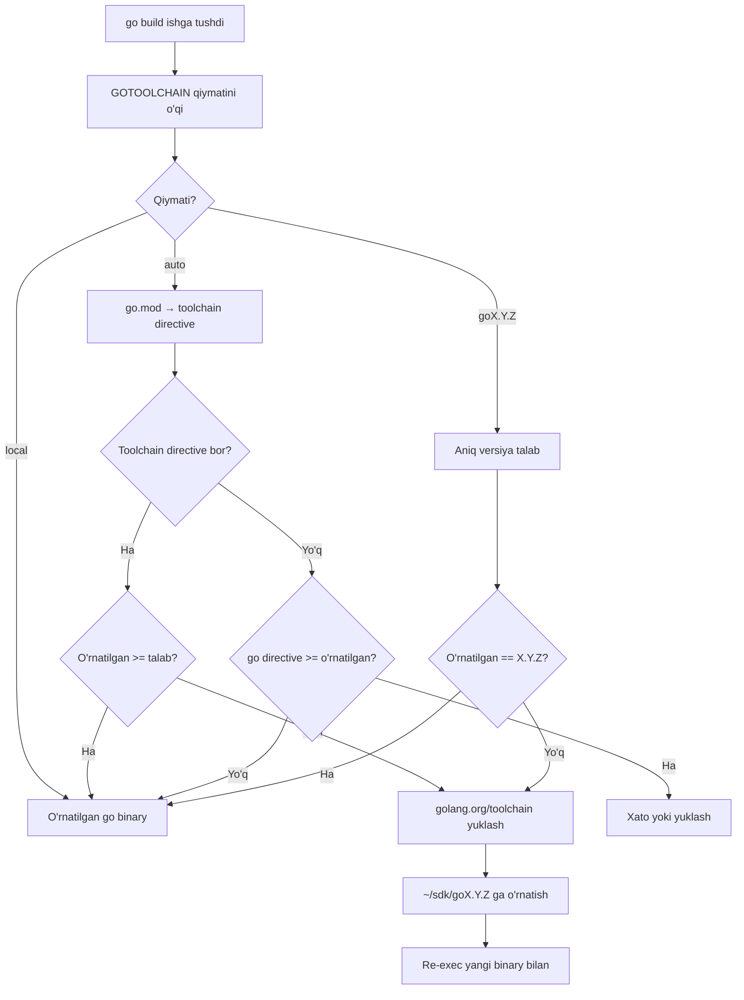
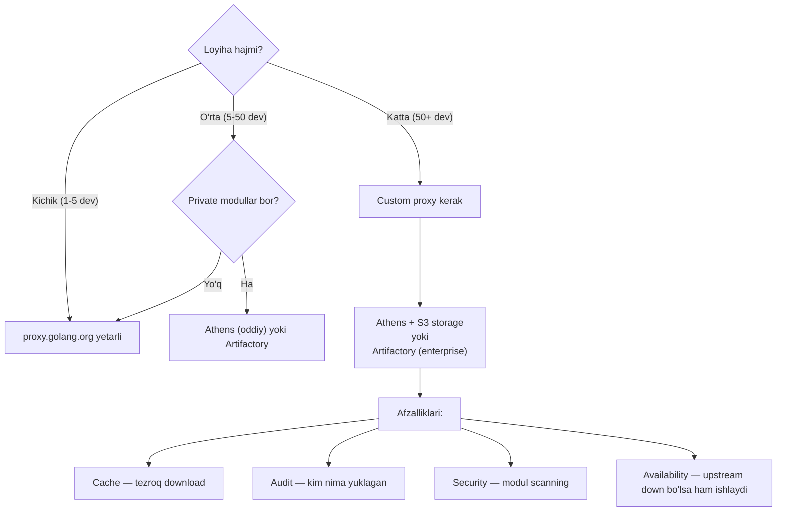
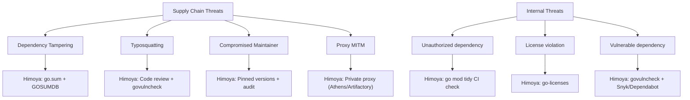
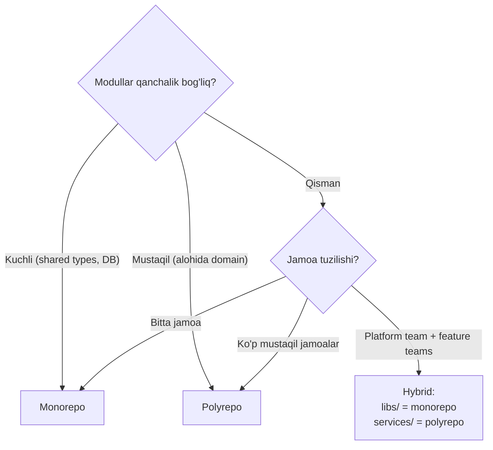
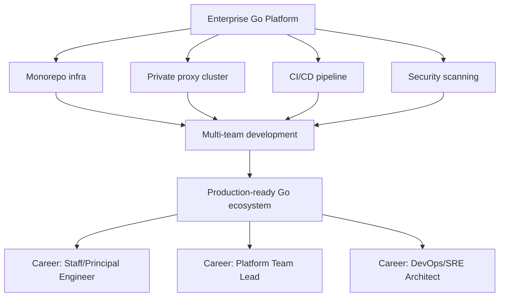

# Setting Up the Environment — Senior Level

## Table of Contents

1. [Introduction](#1-introduction)
2. [Core Concepts](#2-core-concepts)
3. [Pros & Cons](#3-pros--cons)
4. [Use Cases](#4-use-cases)
5. [Code Examples](#5-code-examples)
6. [Product Use / Feature](#6-product-use--feature)
7. [Error Handling](#7-error-handling)
8. [Security Considerations](#8-security-considerations)
9. [Performance Optimization](#9-performance-optimization)
10. [Debugging Guide](#10-debugging-guide)
11. [Best Practices](#11-best-practices)
12. [Edge Cases & Pitfalls](#12-edge-cases--pitfalls)
13. [Common Mistakes](#13-common-mistakes)
14. [Tricky Points](#14-tricky-points)
15. [Comparison with Other Languages](#15-comparison-with-other-languages)
16. [Test](#16-test)
17. [Tricky Questions](#17-tricky-questions)
18. [Cheat Sheet](#18-cheat-sheet)
19. [Summary](#19-summary)
20. [What You Can Build](#20-what-you-can-build)
21. [Further Reading](#21-further-reading)
22. [Related Topics](#22-related-topics)

---

## 1. Introduction

Senior darajada Go muhit sozlash — bu jamoa va tashkilot miqyosida muhitni standartlashtirish, xavfsizlik va reproducibility ni ta'minlash, monorepo boshqarish va enterprise-grade infratuzilmani qurish demakdir. Bu bo'limda multi-module monorepo, GOTOOLCHAIN, private proxy (Athens/Artifactory), air-gapped muhit, build cache optimizatsiyasi va reproducible builds strategiyalari ko'rib chiqiladi.

---

## 2. Core Concepts

### 2.1. Multi-module monorepo setup

#### Monorepo strukturasi

```
monorepo/
├── go.work                    # Lokal dev uchun (.gitignore da)
├── go.work.sum
├── .github/
│   └── workflows/
│       ├── ci.yml             # Umumiy CI
│       └── release.yml        # Versiya chiqarish
├── .golangci.yml              # Yagona lint config
├── Makefile                   # Root-level orchestration
├── tools/
│   ├── go.mod                 # Dev tools uchun alohida modul
│   ├── go.sum
│   └── tools.go               # Tool dependency pinning
├── libs/
│   ├── auth/
│   │   ├── go.mod             # github.com/company/monorepo/libs/auth
│   │   ├── go.sum
│   │   ├── auth.go
│   │   └── auth_test.go
│   ├── logger/
│   │   ├── go.mod             # github.com/company/monorepo/libs/logger
│   │   ├── go.sum
│   │   ├── logger.go
│   │   └── logger_test.go
│   └── database/
│       ├── go.mod             # github.com/company/monorepo/libs/database
│       ├── go.sum
│       ├── db.go
│       └── db_test.go
├── services/
│   ├── api-gateway/
│   │   ├── go.mod             # github.com/company/monorepo/services/api-gateway
│   │   ├── go.sum
│   │   ├── cmd/
│   │   │   └── server/
│   │   │       └── main.go
│   │   └── internal/
│   │       ├── handler/
│   │       └── middleware/
│   ├── user-service/
│   │   ├── go.mod
│   │   ├── go.sum
│   │   ├── cmd/
│   │   └── internal/
│   └── order-service/
│       ├── go.mod
│       ├── go.sum
│       ├── cmd/
│       └── internal/
└── proto/
    ├── go.mod                 # Shared protobuf definitions
    └── gen/
```

#### go.work konfiguratsiyasi

```go
// go.work
go 1.23.4

use (
    ./libs/auth
    ./libs/logger
    ./libs/database
    ./services/api-gateway
    ./services/user-service
    ./services/order-service
    ./proto
    ./tools
)
```

#### Tools modul pattern

```go
// tools/tools.go
//go:build tools

package tools

import (
    _ "github.com/golangci/golangci-lint/cmd/golangci-lint"
    _ "github.com/air-verse/air"
    _ "google.golang.org/protobuf/cmd/protoc-gen-go"
    _ "google.golang.org/grpc/cmd/protoc-gen-go-grpc"
    _ "github.com/sqlc-dev/sqlc/cmd/sqlc"
    _ "github.com/pressly/goose/v3/cmd/goose"
)
```

```bash
# Tools o'rnatish
cd tools && go install \
    github.com/golangci/golangci-lint/cmd/golangci-lint \
    github.com/air-verse/air \
    google.golang.org/protobuf/cmd/protoc-gen-go \
    google.golang.org/grpc/cmd/protoc-gen-go-grpc
```

#### Monorepo Makefile

```makefile
# Makefile (root)
MODULES := $(shell find . -name 'go.mod' -not -path './tools/*' -exec dirname {} \;)

.PHONY: all test lint build tidy verify

## tidy: Barcha modullarni tidy qilish
tidy:
	@for mod in $(MODULES); do \
		echo "==> go mod tidy: $$mod"; \
		cd $$mod && GOWORK=off go mod tidy && cd $(CURDIR); \
	done

## verify: Barcha modullarni verify qilish
verify:
	@for mod in $(MODULES); do \
		echo "==> go mod verify: $$mod"; \
		cd $$mod && go mod verify && cd $(CURDIR); \
	done

## test: Barcha testlarni ishga tushirish
test:
	@for mod in $(MODULES); do \
		echo "==> go test: $$mod"; \
		cd $$mod && go test -race -coverprofile=coverage.out ./... && cd $(CURDIR); \
	done

## lint: Barcha modullarni lint qilish
lint:
	@for mod in $(MODULES); do \
		echo "==> golangci-lint: $$mod"; \
		cd $$mod && golangci-lint run ./... && cd $(CURDIR); \
	done

## build-service: Bitta service ni build qilish
build-service:
	@if [ -z "$(SVC)" ]; then echo "Usage: make build-service SVC=api-gateway"; exit 1; fi
	cd services/$(SVC) && CGO_ENABLED=0 go build -ldflags="-w -s" -o ../../bin/$(SVC) ./cmd/server

## build-all: Barcha service larni build qilish
build-all:
	@for svc in $(shell ls services/); do \
		echo "==> Building: $$svc"; \
		$(MAKE) build-service SVC=$$svc; \
	done

## changed: O'zgargan modullarni aniqlash (CI uchun)
changed:
	@git diff --name-only HEAD~1 | \
		xargs -I{} dirname {} | \
		sort -u | \
		while read dir; do \
			for mod in $(MODULES); do \
				case "$$dir" in "$$mod"*) echo "$$mod"; break;; esac; \
			done; \
		done | sort -u
```

### 2.2. GOTOOLCHAIN boshqarish



```go
// go.mod — toolchain pinning
module github.com/company/monorepo/services/api-gateway

go 1.23.4

toolchain go1.23.4
```

```bash
# Jamoa uchun GOTOOLCHAIN strategiyasi:

# 1. go.mod da toolchain pin qilish (tavsiya)
# Har bir modul o'z go.mod da: toolchain go1.23.4
# GOTOOLCHAIN=auto (default Go 1.21+)

# 2. Bitta versiyaga majburlash
go env -w GOTOOLCHAIN=go1.23.4

# 3. Faqat lokal
go env -w GOTOOLCHAIN=local
# Agar go.mod yuqoriroq versiya talab qilsa — xato

# 4. CI/CD da:
# setup-go action versiyani o'rnatadi
# GOTOOLCHAIN=local — faqat CI da o'rnatilgan versiya
```

### 2.3. Custom GOPROXY (Athens, Artifactory)

#### Athens — Open source Go proxy

```yaml
# docker-compose.yml — Athens setup
version: "3.9"
services:
  athens:
    image: gomods/athens:latest
    ports:
      - "3000:3000"
    environment:
      - ATHENS_DISK_STORAGE_ROOT=/var/lib/athens
      - ATHENS_STORAGE_TYPE=disk
      - ATHENS_NETRC_PATH=/root/.netrc
      - ATHENS_GONOSUM_PATTERNS=github.com/company/*
      - ATHENS_GOGET_WORKERS=5
    volumes:
      - athens-storage:/var/lib/athens
      - ./netrc:/root/.netrc:ro
    restart: unless-stopped

volumes:
  athens-storage:
```

```bash
# Athens ni GOPROXY sifatida ishlatish
go env -w GOPROXY=http://athens.internal:3000,direct

# Athens xususiyatlari:
# 1. Module caching — bir marta yuklansa, doimo mavjud
# 2. Private module support — .netrc bilan
# 3. Download protocol — Go GOPROXY standartiga mos
# 4. Immutability — bir marta saqlangan modul o'zgartirilmaydi
```

#### JFrog Artifactory

```bash
# Artifactory Go proxy sozlash
go env -w GOPROXY=https://artifactory.company.com/api/go/go-virtual,direct

# Authentication
# ~/.netrc
cat > ~/.netrc << EOF
machine artifactory.company.com
login ${ARTIFACTORY_USER}
password ${ARTIFACTORY_TOKEN}
EOF
chmod 600 ~/.netrc

# Yoki environment variable
export GONOSUMDB=github.com/company/*
export GONOSUMCHECK=github.com/company/*
export GONOPROXY=
```

#### Custom proxy qachon kerak?



### 2.4. Air-gapped muhit sozlash

Internet yo'q (yoki cheklangan) muhitlarda Go muhitni sozlash:

```bash
# === 1-USUL: go mod vendor ===

# Internet bor muhitda:
cd myproject
go mod vendor                    # vendor/ papkaga dependency copy
tar czf vendor-bundle.tar.gz vendor/ go.mod go.sum

# Air-gapped muhitda:
tar xzf vendor-bundle.tar.gz
go build -mod=vendor ./...       # Faqat vendor/ dan build

# === 2-USUL: GOMODCACHE export ===

# Internet bor muhitda:
go mod download                  # Module cache yuklash
tar czf modcache.tar.gz -C $(go env GOMODCACHE) .

# Air-gapped muhitda:
mkdir -p $(go env GOMODCACHE)
tar xzf modcache.tar.gz -C $(go env GOMODCACHE)
go env -w GOPROXY=file://${GOMODCACHE}/cache/download,off
go env -w GONOSUMDB=*
go env -w GONOSUMCHECK=*
go build ./...

# === 3-USUL: Athens mirror ===

# DMZ da Athens o'rnatish (internet bilan)
# Air-gapped tarmoqda Athens ni GOPROXY sifatida ishlatish
# Athens storage ni periodic sync qilish
```

```bash
# Go toolchain o'zi ham air-gapped o'rnatish
# Internet bor muhitda:
wget https://go.dev/dl/go1.23.4.linux-amd64.tar.gz

# Air-gapped muhitda:
sudo rm -rf /usr/local/go
sudo tar -C /usr/local -xzf go1.23.4.linux-amd64.tar.gz
export PATH=$PATH:/usr/local/go/bin
```

### 2.5. Build cache optimizatsiyasi

```bash
# Build cache mexanizmi:
# 1. Har bir package uchun: source hash + dependency hash + flags hash → cache key
# 2. Agar cache key mos → qayta kompilyatsiya qilinmaydi
# 3. Cache: ~/.cache/go-build (Linux)

# Cache hajmi va statistika
go env GOCACHE
du -sh $(go env GOCACHE)

# Build vaqtini profiling
go build -x ./... 2>&1 | head -50  # Qaysi buyruqlar ishga tushayotganini ko'rish

# Cache-friendly build:
# 1. Build flags ni o'zgartirmang (har safar cache invalidate)
# 2. CGO_ENABLED ni o'zgartirmang
# 3. GOFLAGS ni minimallash
# 4. -trimpath ishlatmang (agar kerak bo'lmasa)

# CI/CD da build cache persist:
# GitHub Actions:
#   actions/setup-go → cache: true
# GitLab CI:
#   cache: paths: [.cache/go-build/]
# Docker:
#   --mount=type=cache,target=/root/.cache/go-build
```

```dockerfile
# Docker da build cache (BuildKit)
# syntax=docker/dockerfile:1

FROM golang:1.23.4-alpine AS builder
WORKDIR /app

COPY go.mod go.sum ./
RUN --mount=type=cache,target=/go/pkg/mod \
    go mod download

COPY . .
RUN --mount=type=cache,target=/go/pkg/mod \
    --mount=type=cache,target=/root/.cache/go-build \
    CGO_ENABLED=0 go build -ldflags="-w -s" -o /app/server ./cmd/server

FROM alpine:3.19
COPY --from=builder /app/server /server
ENTRYPOINT ["/server"]
```

### 2.6. Jamoa standartlashtirish

```bash
# === .go-version fayli ===
# Versiya manager lar (goenv, asdf) tomonidan ishlatiladi
echo "1.23.4" > .go-version

# === .tool-versions (asdf uchun) ===
echo "golang 1.23.4" > .tool-versions
```

```yaml
# === .github/workflows/go-version-check.yml ===
name: Go Version Check
on: pull_request

jobs:
  check:
    runs-on: ubuntu-latest
    steps:
      - uses: actions/checkout@v4
      - name: Check Go version consistency
        run: |
          # go.mod dan versiya olish
          MOD_VERSION=$(grep '^go ' go.mod | awk '{print $2}')
          # Dockerfile dan versiya olish
          DOCKER_VERSION=$(grep 'FROM golang:' Dockerfile | head -1 | sed 's/FROM golang:\([0-9.]*\).*/\1/')
          # .go-version dan
          FILE_VERSION=$(cat .go-version 2>/dev/null || echo "N/A")

          echo "go.mod:      $MOD_VERSION"
          echo "Dockerfile:  $DOCKER_VERSION"
          echo ".go-version: $FILE_VERSION"

          if [ "$MOD_VERSION" != "$DOCKER_VERSION" ]; then
            echo "ERROR: Go version mismatch!"
            exit 1
          fi
```

```bash
# === Jamoa onboarding skripti ===
#!/bin/bash
# setup-dev.sh

set -euo pipefail

echo "=== Go Development Environment Setup ==="

# 1. Go versiya tekshirish
REQUIRED_GO="1.23"
CURRENT_GO=$(go version 2>/dev/null | awk '{print $3}' | sed 's/go//' || echo "not installed")

echo "Required Go: >= $REQUIRED_GO"
echo "Current Go:  $CURRENT_GO"

if ! command -v go &>/dev/null; then
    echo "ERROR: Go is not installed. Visit https://go.dev/dl/"
    exit 1
fi

# 2. Environment sozlash
go env -w GOPRIVATE=github.com/company/*
go env -w GOPROXY=http://athens.internal:3000,https://proxy.golang.org,direct
go env -w GOTOOLCHAIN=auto

# 3. Git sozlash (private repos)
git config --global url."git@github.com:company/".insteadOf "https://github.com/company/"

# 4. Tools o'rnatish
echo "Installing development tools..."
go install github.com/golangci/golangci-lint/cmd/golangci-lint@latest
go install github.com/air-verse/air@latest
go install golang.org/x/vuln/cmd/govulncheck@latest
go install github.com/go-delve/delve/cmd/dlv@latest
go install golang.org/x/tools/gopls@latest

# 5. Module download
echo "Downloading dependencies..."
go mod download
go mod verify

# 6. Pre-commit hook
cat > .git/hooks/pre-commit << 'HOOK'
#!/bin/bash
set -e
echo "Running pre-commit checks..."
go vet ./...
go test -short ./...
golangci-lint run --fast ./...
HOOK
chmod +x .git/hooks/pre-commit

echo "=== Setup complete! ==="
```

### 2.7. Reproducible builds strategiyasi

```bash
# Reproducible build — bir xil source → bir xil binary

# 1. -trimpath: lokal path larni olib tashlash
go build -trimpath -o server ./cmd/server

# 2. -ldflags bilan debug info olib tashlash
go build -trimpath -ldflags="-w -s" -o server ./cmd/server

# 3. CGO_ENABLED=0 — C dependency yo'q
CGO_ENABLED=0 go build -trimpath -ldflags="-w -s" -o server ./cmd/server

# 4. Versiya ma'lumotini embed qilish
VERSION=$(git describe --tags --always --dirty)
COMMIT=$(git rev-parse HEAD)
DATE=$(date -u +%Y-%m-%dT%H:%M:%SZ)

go build -trimpath \
    -ldflags="-w -s \
        -X main.version=${VERSION} \
        -X main.commit=${COMMIT} \
        -X main.date=${DATE}" \
    -o server ./cmd/server
```

```go
// cmd/server/main.go
package main

import (
    "fmt"
    "runtime/debug"
)

var (
    version = "dev"
    commit  = "unknown"
    date    = "unknown"
)

func main() {
    // ldflags bilan
    fmt.Printf("Version: %s\nCommit: %s\nDate: %s\n", version, commit, date)

    // Go 1.18+ — runtime/debug bilan
    info, ok := debug.ReadBuildInfo()
    if ok {
        fmt.Printf("Go version: %s\n", info.GoVersion)
        for _, setting := range info.Settings {
            if setting.Key == "vcs.revision" {
                fmt.Printf("VCS revision: %s\n", setting.Value)
            }
            if setting.Key == "vcs.time" {
                fmt.Printf("VCS time: %s\n", setting.Value)
            }
        }
    }
}
```

```bash
# Build reproducibility tekshirish
# Ikki marta build qiling va hash ni solishtiring
CGO_ENABLED=0 go build -trimpath -ldflags="-w -s" -o server1 ./cmd/server
CGO_ENABLED=0 go build -trimpath -ldflags="-w -s" -o server2 ./cmd/server

sha256sum server1 server2
# Bir xil hash → reproducible!

# DIQQAT: Quyidagilar reproducibility ni buzadi:
# 1. -trimpath yo'q → lokal path binary ga kirib qoladi
# 2. Timestamp embed qilish → har safar boshqacha
# 3. CGO_ENABLED=1 → C compiler versiyasiga bog'liq
# 4. Go versiyasi farqli → boshqa natija
```

---

## 3. Pros & Cons

### Enterprise Go muhit strategiyalari

| Strategiya | Afzallik | Kamchilik | Qachon ishlatish |
|------------|----------|-----------|------------------|
| **Custom GOPROXY (Athens)** | Cache, audit, availability | Infra xarajati, maintenance | 50+ dev, security-sensitive |
| **Artifactory** | Enterprise features, scanning | Litsenziya narxi yuqori | Katta enterprise, compliance |
| **go mod vendor** | Offline, reproducible | Repo hajmi oshadi, update murakkab | Air-gapped, small teams |
| **GOTOOLCHAIN=auto** | Avtomatik versiya, oson | Download vaqti, disk hajmi | Odatdagi development |
| **GOTOOLCHAIN=local** | Predictable, tez | Manual update kerak | CI/CD, production build |
| **Monorepo go.work** | Cross-module dev oson | CI murakkablashadi | 3+ modul, tight coupling |
| **Polyrepo** | Mustaqil deploy, oddiy CI | Cross-repo change murakkab | Mustaqil service lar |

### Company misollar

| Kompaniya | Strategiya | Sabab |
|-----------|-----------|-------|
| **Google** | Monorepo + custom toolchain | 10K+ dev, strict reproducibility |
| **Uber** | Monorepo + Athens proxy | 2K+ microservice, tez deploy |
| **Cloudflare** | Polyrepo + Artifactory | Mustaqil team lar, compliance |
| **Stripe** | Monorepo + vendor | Financial compliance, audit trail |
| **Twitch** | Monorepo + go.work | Real-time service lar, tight integration |

---

## 4. Use Cases

- **Enterprise monorepo** — 50+ microservice, shared library lar, unified CI/CD
- **Air-gapped deployment** — Harbiy, moliya, sog'liqni saqlash sektorlari
- **Multi-team standardizatsiya** — 100+ dasturchi uchun yagona muhit
- **Compliance/Audit** — Dependency tracking, vulnerability scanning
- **Cross-platform build** — Linux, macOS, Windows, ARM uchun bitta pipeline

---

## 5. Code Examples

### 5.1. Monorepo versiya chiqarish (tagging)

```bash
# Monorepo da har bir modul mustaqil versiyalanadi
# Tag format: module/path/vX.Y.Z

# libs/auth v1.2.0 chiqarish:
git tag libs/auth/v1.2.0
git push origin libs/auth/v1.2.0

# services/api-gateway v2.1.0 chiqarish:
git tag services/api-gateway/v2.1.0
git push origin services/api-gateway/v2.1.0

# Boshqa modul yangi versiyani ishlatish:
# services/user-service/go.mod da:
# require github.com/company/monorepo/libs/auth v1.2.0
cd services/user-service
go get github.com/company/monorepo/libs/auth@v1.2.0
```

### 5.2. Release automation

```yaml
# .github/workflows/release.yml
name: Release Module

on:
  push:
    tags:
      - '*/v*'

jobs:
  release:
    runs-on: ubuntu-latest
    steps:
      - uses: actions/checkout@v4

      - name: Parse tag
        id: tag
        run: |
          TAG=${GITHUB_REF#refs/tags/}
          MODULE_PATH=$(echo $TAG | sed 's|/v[0-9].*||')
          VERSION=$(echo $TAG | grep -oP 'v[0-9]+\.[0-9]+\.[0-9]+.*')
          echo "module_path=$MODULE_PATH" >> $GITHUB_OUTPUT
          echo "version=$VERSION" >> $GITHUB_OUTPUT

      - uses: actions/setup-go@v5
        with:
          go-version: '1.23'
          cache: true

      - name: Test module
        run: |
          cd ${{ steps.tag.outputs.module_path }}
          GOWORK=off go test -race ./...

      - name: Build (if service)
        if: startsWith(steps.tag.outputs.module_path, 'services/')
        run: |
          SVC=$(basename ${{ steps.tag.outputs.module_path }})
          cd ${{ steps.tag.outputs.module_path }}
          CGO_ENABLED=0 go build -trimpath \
            -ldflags="-w -s -X main.version=${{ steps.tag.outputs.version }}" \
            -o ../../bin/${SVC} ./cmd/server

      - name: Create GitHub Release
        if: startsWith(steps.tag.outputs.module_path, 'services/')
        uses: softprops/action-gh-release@v1
        with:
          files: bin/*
          tag_name: ${{ github.ref_name }}
```

### 5.3. Dependency vulnerability scanning pipeline

```yaml
# .github/workflows/security.yml
name: Security Scan

on:
  schedule:
    - cron: '0 6 * * 1'  # Har dushanba
  pull_request:

jobs:
  vuln-scan:
    runs-on: ubuntu-latest
    steps:
      - uses: actions/checkout@v4
      - uses: actions/setup-go@v5
        with:
          go-version: '1.23'

      - name: Install govulncheck
        run: go install golang.org/x/vuln/cmd/govulncheck@latest

      - name: Scan all modules
        run: |
          EXIT_CODE=0
          for mod in $(find . -name 'go.mod' -not -path './tools/*' -exec dirname {} \;); do
            echo "=== Scanning: $mod ==="
            cd $mod
            if ! govulncheck ./...; then
              EXIT_CODE=1
            fi
            cd ${{ github.workspace }}
          done
          exit $EXIT_CODE

      - name: License check
        run: |
          go install github.com/google/go-licenses@latest
          for mod in $(find . -name 'go.mod' -not -path './tools/*' -exec dirname {} \;); do
            echo "=== License check: $mod ==="
            cd $mod
            go-licenses check ./... --allowed_licenses=Apache-2.0,BSD-2-Clause,BSD-3-Clause,MIT,ISC
            cd ${{ github.workspace }}
          done
```

### 5.4. Custom pre-commit hooks

```bash
#!/bin/bash
# .githooks/pre-commit
set -euo pipefail

echo "=== Pre-commit Checks ==="

# O'zgargan Go fayllarni aniqlash
CHANGED_GO_FILES=$(git diff --cached --name-only --diff-filter=ACMR | grep '\.go$' || true)
if [ -z "$CHANGED_GO_FILES" ]; then
    echo "No Go files changed, skipping checks."
    exit 0
fi

# O'zgargan modullarni aniqlash
CHANGED_MODULES=$(echo "$CHANGED_GO_FILES" | while read f; do
    dir=$(dirname "$f")
    while [ "$dir" != "." ]; do
        if [ -f "$dir/go.mod" ]; then
            echo "$dir"
            break
        fi
        dir=$(dirname "$dir")
    done
done | sort -u)

echo "Changed modules: $CHANGED_MODULES"

for mod in $CHANGED_MODULES; do
    echo "--- Checking: $mod ---"
    cd "$mod"

    # Format tekshirish
    UNFORMATTED=$(gofmt -l . 2>/dev/null || true)
    if [ -n "$UNFORMATTED" ]; then
        echo "ERROR: Unformatted files in $mod:"
        echo "$UNFORMATTED"
        exit 1
    fi

    # Vet
    go vet ./...

    # Short tests
    go test -short -count=1 ./...

    cd - > /dev/null
done

echo "=== All checks passed ==="
```

```bash
# Git hooks papkasini o'rnatish
git config core.hooksPath .githooks
```

### 5.5. Go environment Terraform bilan boshqarish

```hcl
# terraform/modules/go-proxy/main.tf
resource "aws_ecs_service" "athens" {
  name            = "athens-proxy"
  cluster         = aws_ecs_cluster.main.id
  task_definition = aws_ecs_task_definition.athens.arn
  desired_count   = 2

  load_balancer {
    target_group_arn = aws_lb_target_group.athens.arn
    container_name   = "athens"
    container_port   = 3000
  }
}

resource "aws_ecs_task_definition" "athens" {
  family                   = "athens"
  network_mode             = "awsvpc"
  requires_compatibilities = ["FARGATE"]
  cpu                      = 512
  memory                   = 1024

  container_definitions = jsonencode([{
    name  = "athens"
    image = "gomods/athens:latest"
    portMappings = [{
      containerPort = 3000
    }]
    environment = [
      { name = "ATHENS_STORAGE_TYPE", value = "s3" },
      { name = "AWS_REGION", value = var.aws_region },
      { name = "ATHENS_S3_BUCKET_NAME", value = aws_s3_bucket.athens.id },
      { name = "ATHENS_GONOSUM_PATTERNS", value = "github.com/company/*" },
    ]
  }])
}

resource "aws_s3_bucket" "athens" {
  bucket = "company-go-proxy-cache"

  versioning {
    enabled = true
  }

  lifecycle_rule {
    enabled = true
    transition {
      days          = 90
      storage_class = "STANDARD_IA"
    }
  }
}
```

---

## 6. Product Use / Feature

| Kompaniya | Scale | Muhit strategiyasi |
|-----------|-------|--------------------|
| **Google** | 10,000+ Go dev, 1B+ qator kod | Custom monorepo tooling, Bazel bilan Go build, ichki proxy |
| **Uber** | 2,000+ Go microservice | Athens proxy, monorepo, custom CI bilan 5 min deploy |
| **Cloudflare** | 500+ Go service, 50M+ RPS | Multi-arch (x86+ARM), Artifactory, Nix bilan reproducible |
| **Stripe** | Financial-grade compliance | Vendor mode, strict audit, air-gapped staging |
| **ByteDance** | TikTok infra, 1000+ Go service | Internal proxy, custom toolchain, monorepo |

---

## 7. Error Handling

### 7.1. Enterprise-grade error handling patterns

#### Monorepo dependency conflict

```bash
# Xato: Modul A → lib v1.2, Modul B → lib v1.5, lekin lib v1.5 API o'zgargan
# Natija: Modul A build xatosi

# Aniqlash:
cd services/api-gateway
go mod graph | grep "problematic/lib"

# Yechim 1: Modul A ni yangilash
cd services/api-gateway
go get github.com/company/monorepo/libs/problematic@latest
go mod tidy

# Yechim 2: go.work da replace
# go.work:
# replace github.com/problematic/lib v1.5.0 => github.com/problematic/lib v1.2.0

# Yechim 3: Monorepo-wide upgrade
make tidy  # Barcha modullarni tidy qilish
```

#### Athens proxy xatosi

```bash
# Xato: "unexpected status 502 from proxy"
# Sabab: Athens down yoki storage to'la

# Tekshirish:
curl -v http://athens.internal:3000/healthz

# Fallback:
go env -w GOPROXY=http://athens.internal:3000,https://proxy.golang.org,direct
# direct — oxirgi chora sifatida to'g'ridan-to'g'ri yuklash
```

#### GOTOOLCHAIN xatolari

```bash
# Xato: "go: cannot find GOROOT directory"
# Sabab: GOTOOLCHAIN go1.23.4 talab qilgan, lekin yuklab ololmagan

# Tekshirish:
ls ~/sdk/
go env GOTOOLCHAIN

# Yechim 1: Manuel yuklash
go install golang.org/dl/go1.23.4@latest
go1.23.4 download

# Yechim 2: local mode
go env -w GOTOOLCHAIN=local
```

---

## 8. Security Considerations

### 8.1. Threat model



### 8.2. Private proxy security

```bash
# Athens access control
# athens.toml
[FilterFile]
# filter.conf — qaysi modullar proxy orqali o'tishi mumkin
# D — Direct (proxy chetlab o'tish)
# E — Exclude (taqiqlash)
# + — Include (ruxsat)

cat > filter.conf << 'EOF'
# Private modullar — direct git clone
D -> github.com/company/*

# Taqiqlangan modullar
E -> github.com/malicious/*

# Qolganlar — proxy orqali
+ -> *
EOF
```

```bash
# GOPROXY HTTPS enforcing
# Private proxy uchun TLS majburiy:
go env -w GOPROXY=https://athens.internal:3443,direct

# Self-signed cert ishlatish (development):
# GOINSECURE=athens.internal  # FAQAT development!
# Production da doimo valid TLS cert ishlating
```

### 8.3. Dependency pinning va audit

```bash
# 1. Dependency audit script
#!/bin/bash
# audit-deps.sh

echo "=== Dependency Audit Report ==="
echo "Date: $(date -u)"
echo ""

# Barcha dependency lar
echo "## All Dependencies"
go list -m -json all | jq -r '.Path + "@" + .Version'

# Zaifliklar
echo ""
echo "## Vulnerabilities"
govulncheck ./...

# Litsenziyalar
echo ""
echo "## Licenses"
go-licenses csv ./... 2>/dev/null

# Direct vs indirect
echo ""
echo "## Direct Dependencies"
go list -m -f '{{if not .Indirect}}{{.Path}}@{{.Version}}{{end}}' all

echo ""
echo "## Indirect Dependencies"
go list -m -f '{{if .Indirect}}{{.Path}}@{{.Version}}{{end}}' all
```

---

## 9. Performance Optimization

### 9.1. Build cache strategiyasi

```bash
# === CI/CD da build cache ===

# GitHub Actions — setup-go built-in cache
- uses: actions/setup-go@v5
  with:
    go-version: '1.23'
    cache: true
    cache-dependency-path: |
      **/go.sum

# GitLab CI — manual cache
cache:
  key: go-${CI_COMMIT_REF_SLUG}
  paths:
    - .go/pkg/mod/
    - .cache/go-build/
  policy: pull-push

# Docker BuildKit — mount cache
RUN --mount=type=cache,target=/go/pkg/mod \
    --mount=type=cache,target=/root/.cache/go-build \
    go build -o /app/server ./cmd/server
```

### 9.2. Parallel CI pipeline

```yaml
# Monorepo da parallel build (GitHub Actions)
name: CI

on: [push, pull_request]

jobs:
  detect-changes:
    runs-on: ubuntu-latest
    outputs:
      modules: ${{ steps.changes.outputs.modules }}
    steps:
      - uses: actions/checkout@v4
        with:
          fetch-depth: 0
      - id: changes
        run: |
          MODULES=$(git diff --name-only ${{ github.event.before }} ${{ github.sha }} | \
            while read f; do
              dir=$(dirname "$f")
              while [ "$dir" != "." ]; do
                if [ -f "$dir/go.mod" ]; then echo "$dir"; break; fi
                dir=$(dirname "$dir")
              done
            done | sort -u | jq -R -s -c 'split("\n") | map(select(length > 0))')
          echo "modules=$MODULES" >> $GITHUB_OUTPUT

  test:
    needs: detect-changes
    if: needs.detect-changes.outputs.modules != '[]'
    runs-on: ubuntu-latest
    strategy:
      matrix:
        module: ${{ fromJson(needs.detect-changes.outputs.modules) }}
      fail-fast: false
    steps:
      - uses: actions/checkout@v4
      - uses: actions/setup-go@v5
        with:
          go-version: '1.23'
          cache: true
      - name: Test
        run: |
          cd ${{ matrix.module }}
          GOWORK=off go test -race -coverprofile=coverage.out ./...
      - name: Lint
        run: |
          cd ${{ matrix.module }}
          golangci-lint run ./...
```

### 9.3. Build vaqtini qisqartirish

```bash
# 1. Incremental build — faqat o'zgarganlarni build
go build -v ./...  # -v qaysi paketlar qayta build bo'layotganini ko'rsatadi

# 2. -trimpath build cache ga ta'sir qilmaydi (Go 1.19+)
go build -trimpath ./...

# 3. CGO_ENABLED=0 — C kompilyator keraksiz, tezroq
CGO_ENABLED=0 go build ./...

# 4. -ldflags="-w -s" — debug info yo'q, kichikroq binary
go build -ldflags="-w -s" ./...

# 5. Build benchmarking
time go build ./...
# real    0m2.345s (cache bilan)
# real    0m15.678s (cache siz)

# 6. Cache invalidation debugging
GODEBUG=gocachehash=1 go build ./... 2>&1 | head -20
```

---

## 10. Debugging Guide

### 10.1. Production muhit debugging

```bash
# 1. Binary dagi build info ni ko'rish
go version -m ./server
# server: go1.23.4
#     path    github.com/company/monorepo/services/api-gateway
#     mod     github.com/company/monorepo/services/api-gateway  (devel)
#     dep     github.com/gin-gonic/gin       v1.9.1  h1:...
#     build   -compiler=gc
#     build   CGO_ENABLED=0
#     build   GOOS=linux
#     build   GOARCH=amd64
#     build   vcs.revision=abc123...
#     build   vcs.time=2024-01-15T10:30:00Z

# 2. Production da environment tekshirish
# Server dagi health endpoint:
```

```go
// internal/handler/health.go
package handler

import (
    "net/http"
    "runtime/debug"
    "encoding/json"
)

type BuildInfo struct {
    GoVersion string            `json:"go_version"`
    Path      string            `json:"path"`
    Version   string            `json:"version"`
    Settings  map[string]string `json:"settings"`
    Deps      []string          `json:"deps"`
}

func HealthHandler(w http.ResponseWriter, r *http.Request) {
    info, ok := debug.ReadBuildInfo()
    if !ok {
        http.Error(w, "no build info", 500)
        return
    }

    bi := BuildInfo{
        GoVersion: info.GoVersion,
        Path:      info.Path,
        Version:   info.Main.Version,
        Settings:  make(map[string]string),
    }

    for _, s := range info.Settings {
        bi.Settings[s.Key] = s.Value
    }
    for _, d := range info.Deps {
        bi.Deps = append(bi.Deps, d.Path+"@"+d.Version)
    }

    w.Header().Set("Content-Type", "application/json")
    json.NewEncoder(w).Encode(bi)
}
```

### 10.2. Module resolution production muammolari

```bash
# "go: inconsistent vendoring" — vendor/ eskirgan
go mod vendor  # qayta yaratish

# "ambiguous import" — ikki paket bir xil nom
go mod graph | grep "ambiguous/pkg"
go mod why -m github.com/ambiguous/pkg

# "module declares its path as X, but was required as Y"
# Fork qilingan modul original nomini saqlab qolgan
# Yechim: replace directive
go mod edit -replace github.com/original/pkg=github.com/fork/pkg@v1.0.0
```

---

## 11. Best Practices

### 11.1. Enterprise Go muhit checklist

```
[ ] Go versiya standardizatsiyasi (.go-version, toolchain directive)
[ ] GOTOOLCHAIN=auto yoki jamoa bo'yicha kelishilgan strategiya
[ ] GOPRIVATE to'g'ri sozlangan (barcha private repo pattern lar)
[ ] Private GOPROXY (Athens/Artifactory) — 50+ dev uchun
[ ] CI/CD pipeline: build + test + lint + vuln scan
[ ] Reproducible builds: -trimpath, pinned versions, CGO_ENABLED=0
[ ] Dependency audit: govulncheck haftalik, license check
[ ] Monorepo: go.work (dev), Makefile (CI), per-module versioning
[ ] Pre-commit hooks: format, vet, short tests
[ ] Onboarding script: setup-dev.sh
[ ] Documentation: ADR (Architecture Decision Records) for tooling choices
```

### 11.2. Monorepo vs polyrepo decision



---

## 12. Edge Cases & Pitfalls

### 12.1. Monorepo tag collision

```bash
# Xato: libs/auth/v1.0.0 va services/auth/v1.0.0 — tag chalkashishi
# Go modul tizimi tag format: <module-path>/vX.Y.Z

# To'g'ri tagging:
git tag libs/auth/v1.0.0       # github.com/company/monorepo/libs/auth
git tag services/auth-svc/v1.0.0  # Boshqacha nom!

# Qoida: Modul nomi unique bo'lsin
```

### 12.2. go.work va CI race condition

```bash
# Developer: go.work bilan ishlaydi, go.mod da replace yo'q
# CI: go.work yo'q, go.mod dagi dependency topilmaydi

# Yechim: CI da explicit check
if [ -f go.work ]; then
    echo "ERROR: go.work should not be committed!"
    exit 1
fi

# Har bir modul mustaqil build bo'lishi kerak:
GOWORK=off go build ./...
```

### 12.3. GOTOOLCHAIN va Docker

```dockerfile
# Docker da GOTOOLCHAIN=auto muammo qilishi mumkin
# Chunki SDK yuklab olishga harakat qiladi

FROM golang:1.23.4 AS builder
# GOTOOLCHAIN=local — faqat container dagi Go
ENV GOTOOLCHAIN=local
```

---

## 13. Common Mistakes

| # | Xato | To'g'ri usul |
|---|------|-------------|
| 1 | Monorepo da bitta go.mod | Har bir service/lib uchun alohida go.mod |
| 2 | go.work ni git ga commit qilish | `.gitignore` ga qo'shing |
| 3 | CI da GOWORK=off ishlatmaslik | Har doim `GOWORK=off` yoki go.work yo'qligini tekshiring |
| 4 | Private proxy siz katta jamoa | 50+ dev uchun Athens/Artifactory o'rnating |
| 5 | Reproducible build uchun -trimpath unutish | Doimo `-trimpath -ldflags="-w -s"` |
| 6 | Vulnerability scanning yo'q | `govulncheck` haftalik CI da |
| 7 | Monorepo tag format xatosi | `module-path/vX.Y.Z` format ishlating |
| 8 | GOTOOLCHAIN strategiya yo'q | Jamoa bo'yicha kelishing: auto vs local vs pinned |

---

## 14. Tricky Points

### 14.1. MVS va diamond dependency

```
A (sizning loyihangiz)
├── B v1.2.0 → D v1.1.0
└── C v1.0.0 → D v1.3.0

# MVS natija: D v1.3.0 (ikkalasini qoniqtiradi)
# NPM natija: D v1.1.0 (B uchun) + D v1.3.0 (C uchun) — ikki nusxa!

# Go farqi: Bitta versiya, eng yuqori talab qilingan
# Bu kichikroq binary lekin ba'zan compatibility muammo
```

### 14.2. retract directive qachon ishlatish

```go
// go.mod
module github.com/company/lib

go 1.23.4

retract (
    v1.0.0          // Critical security bug
    [v1.1.0, v1.1.5] // Broken API range
)
// retract qilingan versiyalar hali ham yuklab olinadi
// lekin "go get -u" ularni tanlamaydi
// go list -m -versions ham ogohlantirish beradi
```

### 14.3. GONOSUMCHECK vs GONOSUMDB vs GOPRIVATE

```bash
# GOPRIVATE=X     → GONOPROXY=X + GONOSUMDB=X + GONOSUMCHECK=X
# GONOSUMCHECK=X  → Checksum TEKSHIRILMAYDI (xavfli!)
# GONOSUMDB=X     → sum.golang.org ga SO'ROV yuborilmaydi, lekin lokal go.sum tekshiriladi
# GONOPROXY=X     → Proxy ishlatilmaydi, to'g'ridan-to'g'ri git clone

# Eng xavfsiz sozlama (private modullar uchun):
go env -w GOPRIVATE=github.com/company/*
# Bu: proxy yo'q + sum DB yo'q + checksum yo'q

# O'rtacha xavfsiz (private proxy bilan):
go env -w GONOPROXY=                           # Proxy ishlatilsin
go env -w GONOSUMDB=github.com/company/*       # Sum DB ga yubormang
go env -w GONOSUMCHECK=                        # Checksum tekshirilsin (go.sum dan)
```

---

## 15. Comparison with Other Languages

### Enterprise toolchain taqqoslash

| Jihat | Go | Java (Maven/Gradle) | Node.js (npm/yarn) | Rust (Cargo) |
|-------|-----|-------|---------|------|
| **Private registry** | Athens/Artifactory | Nexus/Artifactory | npm registry/Verdaccio | Private registry |
| **Monorepo** | go.work | Multi-module Maven | Workspaces/Turborepo | Cargo workspaces |
| **Reproducible build** | go.sum + trimpath | Maven wrapper + SHA | package-lock.json | Cargo.lock + rust-toolchain |
| **Versiya boshqarish** | GOTOOLCHAIN | SDKMAN/jEnv | nvm/fnm | rustup |
| **Build cache** | GOCACHE (built-in) | ~/.m2 + Gradle daemon | node_modules + turbo | sccache |
| **Cross-compile** | GOOS/GOARCH (built-in) | GraalVM native image | Yo'q | rustup target |
| **Security scanning** | govulncheck | OWASP dependency-check | npm audit | cargo-audit |
| **Air-gapped** | vendor + GOPROXY=off | Maven offline | npm pack | cargo vendor |

### Architectural decision matrix

| Vaziyat | Go yechimi | Alternativa |
|---------|-----------|-------------|
| 50+ dev private modullar | Athens proxy + S3 | Artifactory (pul bilan) |
| Air-gapped production | `go mod vendor` + offline | Docker registry mirror |
| Multi-team monorepo | go.work + per-module CI | Bazel (Google scale) |
| Reproducible builds | `-trimpath` + `CGO_ENABLED=0` | Nix (Cloudflare) |
| Vulnerability management | `govulncheck` + Dependabot | Snyk + private scanning |

---

## 16. Test

**1. Monorepo da modul versiyasini chiqarish uchun qanday tag format ishlatiladi?**

- A) `vX.Y.Z`
- B) `module-path/vX.Y.Z`
- C) `release/module-path/vX.Y.Z`
- D) Ixtiyoriy format

<details>
<summary>Javob</summary>
B) Go modul tizimi monorepo da `module-path/vX.Y.Z` formatidagi tag larni taniydi. Masalan: `libs/auth/v1.2.0` → `github.com/company/monorepo/libs/auth` modulining v1.2.0 versiyasi.
</details>

**2. GOTOOLCHAIN=auto va go.mod da `toolchain go1.23.4` bo'lganda, tizimda Go 1.22 o'rnatilgan bo'lsa nima bo'ladi?**

- A) Xato beradi
- B) Go 1.22 bilan build qiladi
- C) Go 1.23.4 ni avtomatik yuklaydi va ishlatadi
- D) GOTOOLCHAIN ni o'chiradi

<details>
<summary>Javob</summary>
C) `GOTOOLCHAIN=auto` bo'lganda Go go.mod dagi `toolchain` directive ni o'qiydi va kerak bo'lsa `golang.org/toolchain@go1.23.4` ni yuklab, `~/sdk/go1.23.4/` ga o'rnatadi va shu binary bilan re-exec qiladi.
</details>

**3. Athens proxy ning asosiy afzalligi nima?**

- A) Faqat tezlik
- B) Immutable caching + audit trail + availability
- C) Go'ga o'rnatilgan
- D) Faqat xavfsizlik

<details>
<summary>Javob</summary>
B) Athens: 1) Immutable cache — modul bir marta saqlansa o'zgarmaydi, 2) Audit — kim qaysi modulni yuklagan, 3) Availability — upstream down bo'lsa ham cache dan ishlaydi, 4) Private module support.
</details>

**4. Air-gapped muhitda Go dependency qanday boshqariladi?**

- A) Faqat internet bilan ishlaydi
- B) `go mod vendor` + `GOPROXY=off` + `-mod=vendor`
- C) Docker image bilan
- D) Go Modules ishlamaydi

<details>
<summary>Javob</summary>
B) Air-gapped muhitda: 1) Internet bor muhitda `go mod vendor` qilish, 2) vendor/ papkani o'tkazish, 3) `GOPROXY=off go build -mod=vendor ./...` bilan build. Alternativa: GOMODCACHE ni export/import qilish yoki DMZ da Athens proxy o'rnatish.
</details>

**5. Reproducible build uchun qaysi flag lar kerak?**

- A) `-v -x`
- B) `-race`
- C) `-trimpath -ldflags="-w -s"` + `CGO_ENABLED=0`
- D) `-mod=vendor`

<details>
<summary>Javob</summary>
C) Reproducible build uchun: 1) `-trimpath` — lokal path larni olib tashlaydi, 2) `-ldflags="-w -s"` — debug info yo'q, 3) `CGO_ENABLED=0` — C compiler bog'liqligini yo'q qiladi. Bundan tashqari Go versiyasi ham bir xil bo'lishi kerak.
</details>

**6. `retract` directive nima qiladi?**

- A) Modulni o'chiradi
- B) Versiyani `go get -u` dan yashiradi lekin o'chirmaydi
- C) Dependency ni taqiqlaydi
- D) go.sum dan hash ni o'chiradi

<details>
<summary>Javob</summary>
B) `retract` versiyani "ogohlantirish bilan" belgilaydi. `go get -u` bu versiyani avtomatik tanlamaydi, `go list -m -versions` ogohlantirish beradi. Lekin versiya hali ham yuklab olinishi mumkin (agar aniq ko'rsatilsa). Bu `exclude` dan farqi — `exclude` faqat o'z modulda ishlaydi.
</details>

**7. Monorepo da CI/CD da qaysi modullar o'zgarganini qanday aniqlash mumkin?**

- A) Barcha modullarni doimo build qilish
- B) `git diff` + go.mod joylashuvini aniqlash
- C) Go'ning built-in xususiyati
- D) Makefile bilan

<details>
<summary>Javob</summary>
B) `git diff --name-only HEAD~1` bilan o'zgargan fayllarni aniqlash, keyin har bir faylning parent directory sida go.mod topish. Bu o'zgargan modullar ro'yxatini beradi. CI da faqat shu modullarni build/test qilish — vaqt tejaydi.
</details>

**8. `go.work` mavjud bo'lganda CI da nima muammo bo'lishi mumkin?**

- A) Muammo bo'lmaydi
- B) go.work lokal replace larni ishlatadi, CI da dependency topilmaydi
- C) Faqat Windows da muammo
- D) go.work CI ni tezlashtiradi

<details>
<summary>Javob</summary>
B) `go.work` lokal development uchun mo'ljallangan. CI da go.work mavjud bo'lsa, modul boshqa lokal modullardan dependency olishga harakat qiladi — lekin CI da bu papkalar mavjud emas. Yechim: `GOWORK=off` yoki go.work ni `.gitignore` ga qo'shish.
</details>

**9. GONOSUMCHECK va GONOSUMDB o'rtasidagi farq nima?**

- A) Bir xil
- B) GONOSUMDB — sum.golang.org ga so'rov yubormaydi; GONOSUMCHECK — checksum umuman tekshirilmaydi
- C) GONOSUMCHECK tezroq ishlaydi
- D) GONOSUMDB faqat private modullar uchun

<details>
<summary>Javob</summary>
B) `GONOSUMDB=X` — sum.golang.org serveriga so'rov yuborilmaydi, lekin lokal `go.sum` dagi checksum hali ham tekshiriladi. `GONOSUMCHECK=X` — checksum umuman tekshirilmaydi (xavfli!). Amalda `GOPRIVATE` o'rnatish yetarli — u ikkalasini ham o'rnatadi.
</details>

**10. Docker BuildKit da `--mount=type=cache` nima uchun foydali?**

- A) Container hajmini kamaytiradi
- B) Build layer lari orasida cache persist qiladi — qayta build tezlashadi
- C) Security uchun
- D) Multi-stage build uchun kerak

<details>
<summary>Javob</summary>
B) `--mount=type=cache,target=/go/pkg/mod` va `--mount=type=cache,target=/root/.cache/go-build` — Go module cache va build cache ni Docker build lari orasida saqlaydi. Natija: qayta build da dependency yuklash va kompilyatsiya tezlashadi. Bu oddiy Docker layer cache dan samaraliroq.
</details>

**11. `tools/tools.go` pattern ning maqsadi nima?**

- A) Tool binary larni saqlash
- B) Development tool dependency larni go.mod da pinning qilish
- C) Tool larni kompilyatsiya qilish
- D) Faqat monorepo uchun

<details>
<summary>Javob</summary>
B) `//go:build tools` bilan belgilangan `tools.go` faylida development tool larni import qilish orqali ularning versiyalari `go.mod` da qayd etiladi. Bu jamoa bo'yicha bir xil tool versiyalarini ta'minlaydi. Build tagdan tufayli bu fayl normal build da kompilyatsiya qilinmaydi.
</details>

**12. Monorepo da `go work sync` nima qiladi?**

- A) go.work ni o'chiradi
- B) Barcha modul go.mod larini workspace go version ga moslashtiradi
- C) Git sync qiladi
- D) Module cache ni sinxronlaydi

<details>
<summary>Javob</summary>
B) `go work sync` har bir workspace modulining go.mod faylidagi dependency versiyalarini sinxronlaydi. Agar go.work da bitta modul yangilangan dependency ishlatsa, `sync` boshqa modullarni ham yangilaydi. Bu monorepo da consistency ta'minlaydi.
</details>

---

## 17. Tricky Questions

**1. Monorepo da bitta lib yangilanganida, faqat o'sha lib ga bog'liq service larni qanday aniqlash va test qilish mumkin?**

<details>
<summary>Javob</summary>

```bash
# 1. O'zgargan modulni aniqlash
CHANGED_MOD="libs/auth"

# 2. Dependency grafidan bog'liq modullarni topish
for mod in $(find services/ -name 'go.mod' -exec dirname {} \;); do
    cd "$mod"
    if GOWORK=off go mod graph | grep -q "$CHANGED_MOD"; then
        echo "Affected: $mod"
    fi
    cd -
done

# 3. Yoki go list bilan:
# Workspace modda:
go list -m -json all | jq -r 'select(.Deps[]? | contains("libs/auth")) | .Path'
```

Yirik monorepo da bu jarayonni avtomatlashtiradigan script yazing va CI da ishlatiladi. Bu "affected module detection" pattern — Google Bazel da ham shunga o'xshash ishlaydi.
</details>

**2. `GOTOOLCHAIN=auto` bo'lganda ikkita modul turli toolchain talab qilsa (masalan, libs/auth → go1.22, services/api → go1.23), go.work qaysi birini ishlatadi?**

<details>
<summary>Javob</summary>

Workspace mode da Go eng yuqori toolchain versiyasini tanlaydi:

```go
// libs/auth/go.mod
go 1.22
toolchain go1.22.5

// services/api/go.mod
go 1.23.4
toolchain go1.23.4

// go.work
go 1.23.4  // Workspace go directive
```

Qoidalar:
1. Workspace `go` directive — barcha modullar uchun minimal
2. Agar biror modul yuqoriroq `go` yoki `toolchain` talab qilsa — o'sha ishlatiladi
3. `GOTOOLCHAIN=auto` — eng yuqori talab qilingan versiyani yuklaydi
4. Natija: Go 1.23.4 barcha modullar uchun ishlatiladi

Bu muammo bo'lmasligi kerak, chunki Go backward compatible. Lekin Go 1.22 da yozilgan kod Go 1.23 da ham ishlashi kerak.
</details>

**3. Athens proxy dan modul yuklanayotganda proxy o'chib qolsa, Go qanday react qiladi? Fallback mexanizmi qanday?**

<details>
<summary>Javob</summary>

```bash
GOPROXY=http://athens.internal:3000,https://proxy.golang.org,direct
```

Fallback mexanizmi:
1. `http://athens.internal:3000` ga so'rov → timeout/error
2. `https://proxy.golang.org` ga so'rov (keyingi proxy)
3. `direct` — to'g'ridan-to'g'ri git clone

**Muhim nüanslar:**
- 404 (Not Found) → keyingi proxy ga o'tadi
- 410 (Gone) → keyingi proxy ga o'tadi
- Boshqa xatolar (500, timeout) → **default: xato beradi, keyingisiga O'TMAYDI**

```bash
# Barcha xatolarda fallback uchun:
GOPROXY=http://athens.internal:3000|https://proxy.golang.org|direct
# '|' — har qanday xatoda keyingisiga o'tadi
# ',' — faqat 404/410 da keyingisiga o'tadi
```

Demak `,` va `|` separator lar o'rtasida muhim farq bor!
</details>

**4. `go mod vendor` va `go mod download` + `GOPROXY=file://` o'rtasida qaysi biri air-gapped muhit uchun yaxshiroq?**

<details>
<summary>Javob</summary>

| Jihat | `go mod vendor` | `GOPROXY=file://` |
|-------|----------------|-------------------|
| Hajm | Kichikroq (faqat kerakli code) | Kattaroq (to'liq module cache) |
| Ko'p loyiha | Har biri o'z vendor | Bitta cache barchasi uchun |
| Yangilash | `go mod vendor` qayta | Yangi modulni cache ga qo'shish |
| Build buyruq | `-mod=vendor` | Oddiy `go build` |
| CI murakkablik | Oddiy | GOPROXY sozlash kerak |

**Tavsiya:**
- **Bitta loyiha, kichik team** → `go mod vendor` (oddiy)
- **Ko'p loyiha, katta team** → `GOPROXY=file://` yoki Athens (cache share)
- **Eng xavfsiz** → `go mod vendor` + repo da saqlash (audit trail)
</details>

**5. Reproducible build da `go build` ikki marta ishga tushirilsa bir xil binary hosil bo'ladimi? Qanday holatlarda farq bo'ladi?**

<details>
<summary>Javob</summary>

`CGO_ENABLED=0 go build -trimpath -ldflags="-w -s" ./...` — **bir xil binary hosil bo'ladi** (Go 1.21+).

Farq bo'ladigan holatlar:
1. **`-trimpath` yo'q** → binary da lokal path (`/home/user/...`) — boshqa mashinada boshqa
2. **CGO_ENABLED=1** → C compiler versiyasiga bog'liq
3. **-ldflags da timestamp** → `-X main.date=$(date)` har safar boshqa
4. **Go versiyasi farqli** → turli kompilyator, turli natija
5. **GOEXPERIMENT farqli** → eksperimental feature lar ta'sir qiladi
6. **`-race` flag** → race detector kodi qo'shiladi

```bash
# Tekshirish:
CGO_ENABLED=0 go build -trimpath -ldflags="-w -s" -o bin1 ./cmd/server
CGO_ENABLED=0 go build -trimpath -ldflags="-w -s" -o bin2 ./cmd/server
sha256sum bin1 bin2
# Bir xil hash bo'lishi kerak
```

Go 1.21 dan beri `debug.ReadBuildInfo()` VCS ma'lumotlarini embed qiladi — bu ham bir xil (agar git state bir xil bo'lsa).
</details>

**6. Monorepo da `exclude` va `retract` directive larni qanday strategik ishlatish kerak?**

<details>
<summary>Javob</summary>

```go
// exclude — FAQAT o'z go.mod da ishlaydi
// Boshqalarga ta'sir qilmaydi
module github.com/company/monorepo/services/api-gateway

exclude github.com/company/monorepo/libs/auth v1.0.0  // Bu versiyada bug bor

// retract — o'z modulingiz versiyalarini "qaytarish"
module github.com/company/monorepo/libs/auth

retract (
    v1.0.0          // Security vulnerability
    [v1.1.0, v1.1.3] // Breaking API change
)
```

**Strategik farq:**
- `exclude` — **iste'molchi** sifatida: "men bu versiyani ishlatmayman"
- `retract` — **nashriyotchi** sifatida: "bu versiyani ishlatmang"

**Monorepo da:**
1. Library da xato topildi → `retract` qo'shing, yangi versiya chiqaring
2. Service da muammo dependency → `exclude` qo'shing, boshqa versiya ishlating
3. retract `go get -u` da e'tiborga olinadi — foydalanuvchilar avtomatik yangilanadi
4. exclude faqat sizning loyihangizga ta'sir qiladi
</details>

**7. GOPROXY da `,` va `|` separator o'rtasidagi farqni amaliy misol bilan tushuntiring.**

<details>
<summary>Javob</summary>

```bash
# Vergul (,) — faqat 404/410 da keyingisiga o'tadi
GOPROXY=http://athens:3000,https://proxy.golang.org,direct
# Athens 500 qaytarsa → XATO (keyingisiga o'tmaydi)
# Athens 404 qaytarsa → proxy.golang.org ga o'tadi

# Pipe (|) — HAR QANDAY xatoda keyingisiga o'tadi
GOPROXY=http://athens:3000|https://proxy.golang.org|direct
# Athens 500 qaytarsa → proxy.golang.org ga o'tadi
# Athens timeout bo'lsa → proxy.golang.org ga o'tadi
# Athens 404 qaytarsa → proxy.golang.org ga o'tadi
```

**Amaliy tavsiya:**
```bash
# Production (strict):
GOPROXY=http://athens:3000,direct
# Athens da modul yo'q bo'lsa faqat → direct

# Development (tolerant):
GOPROXY=http://athens:3000|https://proxy.golang.org|direct
# Athens muammo bo'lsa → fallback bor

# CI/CD:
GOPROXY=http://athens:3000,off
# Faqat Athens dan — boshqa yerdan yuklash TAQIQLANGAN
# Bu air-gapped CI uchun ideal
```
</details>

---

## 18. Cheat Sheet

### Monorepo buyruqlari

| Buyruq | Tavsif |
|--------|--------|
| `go work init ./a ./b` | Workspace yaratish |
| `go work use ./c` | Modul qo'shish |
| `go work sync` | Modullar sinxronlash |
| `GOWORK=off go build` | Workspace o'chirish |
| `git tag module/path/vX.Y.Z` | Modul versiya tag |

### Enterprise sozlamalar

| Sozlama | Qiymat | Tavsif |
|---------|--------|--------|
| `GOTOOLCHAIN` | `auto` | Avtomatik versiya boshqarish |
| `GOPRIVATE` | `github.com/company/*` | Private modullar |
| `GOPROXY` | `http://athens:3000,direct` | Private proxy |
| `GOFLAGS` | `-mod=readonly` | go.mod himoyalash |
| `GONOSUMDB` | `github.com/company/*` | Sum DB chetlab o'tish |

### Decision Matrix

| Vaziyat | Strategiya |
|---------|-----------|
| 1-5 dev, kichik loyiha | proxy.golang.org + go mod init |
| 5-50 dev, private repo | GOPRIVATE + git SSH |
| 50+ dev, enterprise | Athens/Artifactory + monorepo |
| Air-gapped | go mod vendor + GOPROXY=off |
| Compliance | vendor + govulncheck + license check |

### Review Checklist (PR uchun)

```
[ ] go.mod: go directive to'g'ri versiya
[ ] go.mod: toolchain directive bor (Go 1.21+)
[ ] go.sum: commit qilingan
[ ] go.work: commit qilinMAGAN
[ ] replace: faqat development uchun (production da yo'q)
[ ] govulncheck: zaiflik yo'q
[ ] go mod tidy: diff yo'q
[ ] Build flags: -trimpath, CGO_ENABLED=0 (kerak bo'lsa)
```

---

## 19. Summary

- **Multi-module monorepo** — go.work (dev), per-module go.mod, tag-based versioning
- **GOTOOLCHAIN** — Go 1.21+ da avtomatik toolchain boshqarish, jamoa bo'yicha standardizatsiya
- **Private proxy** — Athens (open source) yoki Artifactory (enterprise) — cache, audit, security
- **Air-gapped muhit** — `go mod vendor` yoki `GOPROXY=file://` bilan offline build
- **Build cache** — CI/CD da persist qilish, Docker BuildKit mount cache
- **Reproducible builds** — `-trimpath`, `CGO_ENABLED=0`, pinned versions
- **Team standardizatsiya** — setup script, pre-commit hooks, CI checks, .go-version

---

## 20. What You Can Build



---

## 21. Further Reading

1. **Go Modules Reference** — https://go.dev/ref/mod
2. **Go Toolchain Documentation** — https://go.dev/doc/toolchain
3. **Athens Proxy Documentation** — https://docs.gomods.io/
4. **Go Blog: Reproducible Builds** — https://go.dev/blog/rebuild
5. **Go Supply Chain Security** — https://go.dev/blog/supply-chain

---

## 22. Related Topics

- [Go Build System internals — linker, compiler](../../02-go-basics/01-go-toolchain/senior.md)
- [Go Modules chuqur — MVS, graph, retract](../../03-modules-and-packages/01-go-modules/senior.md)
- [Docker production best practices](../../07-deployment/01-docker/senior.md)
- [CI/CD architecture — GitHub Actions, GitLab CI](../../07-deployment/02-ci-cd/senior.md)
