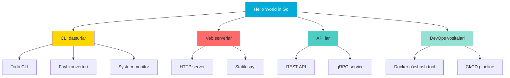

# Hello World in Go — Junior Level

## Table of Contents

1. [Introduction](#1-introduction)
2. [Prerequisites](#2-prerequisites)
3. [Glossary](#3-glossary)
4. [Core Concepts](#4-core-concepts)
5. [Pros & Cons](#5-pros--cons)
6. [Use Cases](#6-use-cases)
7. [Code Examples](#7-code-examples)
8. [Product Use / Feature](#8-product-use--feature)
9. [Error Handling](#9-error-handling)
10. [Security Considerations](#10-security-considerations)
11. [Performance Tips](#11-performance-tips)
12. [Best Practices](#12-best-practices)
13. [Edge Cases & Pitfalls](#13-edge-cases--pitfalls)
14. [Common Mistakes](#14-common-mistakes)
15. [Tricky Points](#15-tricky-points)
16. [Test](#16-test)
17. [Tricky Questions](#17-tricky-questions)
18. [Cheat Sheet](#18-cheat-sheet)
19. [Summary](#19-summary)
20. [What You Can Build](#20-what-you-can-build)
21. [Further Reading](#21-further-reading)
22. [Related Topics](#22-related-topics)

---

## 1. Introduction

**Hello World** — bu har qanday dasturlash tilini o'rganishda birinchi yoziladigan dastur. Go tilida Hello World dasturi tuzilishi boshqa tillarga qaraganda ancha sodda va tushunarli. Go dasturi `package main`, `import` va `func main()` — uchta asosiy tarkibiy qismdan iborat bo'ladi.

Bu bo'limda siz quyidagilarni o'rganasiz:

- `package main` nima va nima uchun kerak
- `import` kalit so'zi bilan kutubxonalarni qanday ulash
- `func main()` — dasturning kirish nuqtasi
- `fmt.Println`, `fmt.Printf`, `fmt.Print` farqlari
- Format verblari (`%s`, `%d`, `%v`, `%T` va boshqalar)
- `go run` vs `go build` — ishga tushirish usullari
- Go Playground — brauzerda Go kodni sinash
- Izohlar (comments) va nuqtali vergul (semicolons)

---

## 2. Prerequisites

Bu bo'limni o'rganish uchun sizga quyidagilar kerak:

| Talab | Tavsif |
|-------|--------|
| **Go o'rnatilgan** | `go version` buyrug'i ishlashi kerak (Go 1.21+) |
| **Matn muharriri** | VS Code (Go extension bilan), GoLand yoki oddiy terminal |
| **Asosiy dasturlash tushunchasi** | O'zgaruvchi, funksiya, string nimaligini bilish |
| **Terminal/Command Line** | Asosiy buyruqlarni bilish (`cd`, `ls`, `mkdir`) |

### Go o'rnatilganligini tekshirish:

```bash
go version
# go version go1.22.0 linux/amd64

go env GOPATH
# /home/user/go
```

---

## 3. Glossary

| Termin | Tushuntirish |
|--------|-------------|
| **package** | Go fayllarini guruhlash birligi. Har bir `.go` fayl bitta packagega tegishli |
| **main package** | Maxsus package — bajariladigan dastur (executable) hosil qiladi |
| **import** | Tashqi yoki standart kutubxonani ulash kalit so'zi |
| **func** | Funksiya e'lon qilish kalit so'zi |
| **main()** | Dasturning kirish nuqtasi (entry point) — birinchi chaqiriladigan funksiya |
| **fmt** | "Format" — standart chiqish/kirish uchun paket |
| **Println** | Print line — chiqarish va yangi qator qo'shish |
| **Printf** | Print formatted — format qilib chiqarish |
| **Print** | Oddiy chiqarish (yangi qatorsiz) |
| **format verb** | `%s`, `%d` kabi formatlashtirish belgilari |
| **go run** | Kompilyatsiya qilish va darhol ishga tushirish |
| **go build** | Kompilyatsiya qilish va binary fayl yaratish |
| **comment** | Izoh — kompilyator tomonidan e'tiborga olinmaydigan matn |
| **semicolon** | Nuqtali vergul — Go avtomatik qo'yadi (lexer darajasida) |
| **Go Playground** | Brauzerda Go kodni sinash uchun veb-xizmat |

---

## 4. Core Concepts

### 4.1 package main — Dasturning Asosi

Har bir Go fayli `package` kalit so'zi bilan boshlanishi **shart**. `package main` — bu maxsus package bo'lib, Go kompilyatoriga bajariladigan dastur yaratish kerakligini bildiradi.

```go
package main
```

**Qoidalar:**
- Package nomi **kichik harf** bilan yoziladi
- **Bitta so'z** bo'lishi kerak (tire `-` yoki pastki chiziq `_` ishlatilmaydi)
- `main` — maxsus nom, faqat bajariladigan dasturlar uchun

```go
// TO'G'RI — bajariladigan dastur
package main

// TO'G'RI — kutubxona
package utils

// NOTO'G'RI — kompilyatsiya xatosi
package my_utils    // pastki chiziq
package MyUtils     // katta harf
package my-utils    // tire
```

### 4.2 import — Kutubxonalarni Ulash

`import` kalit so'zi orqali standart kutubxona yoki tashqi paketlarni ulash mumkin:

```go
// Bitta paket
import "fmt"

// Bir nechta paket (qavslar ichida)
import (
    "fmt"
    "os"
    "strings"
)
```

**Muhim qoidalar:**
- Import qilingan, lekin **ishlatilmagan** paket — kompilyatsiya xatosi beradi
- Import tartibi muhim emas, lekin `goimports` avtomatik tartiblaydi

```go
package main

import "fmt"
import "os"  // Agar "os" ishlatilmasa — XATO!

func main() {
    fmt.Println("Salom")
    // os hech qayerda ishlatilmayapti — kompilyatsiya xatosi!
}
```

### 4.3 func main() — Kirish Nuqtasi

`func main()` — dastur ishga tushganda birinchi chaqiriladigan funksiya:

```go
package main

import "fmt"

func main() {
    fmt.Println("Salom, Dunyo!")
}
```

**Xususiyatlari:**
- Hech qanday **argument** qabul qilmaydi
- Hech qanday **qiymat qaytarmaydi**
- Dasturda **faqat bitta** `main()` bo'lishi kerak (main package ichida)
- `main()` tugashi = dastur tugashi

### 4.4 fmt.Println vs fmt.Printf vs fmt.Print

```go
package main

import "fmt"

func main() {
    name := "Go"
    version := 1.22

    // Println — yangi qator qo'shadi, argumentlar orasiga bo'sh joy qo'yadi
    fmt.Println("Salom", name)          // Salom Go\n

    // Printf — format string ishlatadi, yangi qator QO'SHMAYDI
    fmt.Printf("Til: %s, Versiya: %.2f\n", name, version) // Til: Go, Versiya: 1.22\n

    // Print — yangi qator QO'SHMAYDI
    fmt.Print("Birinchi ")
    fmt.Print("Ikkinchi\n")             // Birinchi Ikkinchi\n
}
```

**Farqlari:**

| Xususiyat | `Println` | `Printf` | `Print` |
|-----------|-----------|----------|---------|
| Yangi qator | Ha (avtomatik) | Yo'q (`\n` kerak) | Yo'q |
| Format string | Yo'q | Ha (`%s`, `%d`...) | Yo'q |
| Argumentlar orasida bo'sh joy | Ha (har doim) | Format boshqaradi | Faqat ikkala arg string bo'lmaganda |

### 4.5 Format Verblari

```go
package main

import "fmt"

func main() {
    name := "Anvar"
    age := 25
    height := 1.78
    active := true

    fmt.Printf("Ism: %s\n", name)           // %s — string
    fmt.Printf("Yosh: %d\n", age)           // %d — butun son (decimal)
    fmt.Printf("Bo'y: %.2f metr\n", height) // %f — float, .2 — 2 xona
    fmt.Printf("Faol: %t\n", active)        // %t — boolean (true/false)
    fmt.Printf("Qiymat: %v\n", name)        // %v — har qanday tur uchun default
    fmt.Printf("Turi: %T\n", age)           // %T — o'zgaruvchining turi
    fmt.Printf("Butun: %05d\n", age)        // %05d — 5 ta raqam, oldiga 0
    fmt.Printf("Ikkilik: %b\n", age)        // %b — binary
    fmt.Printf("O'n oltilik: %x\n", age)    // %x — hexadecimal
    fmt.Printf("Belgi: %c\n", 65)           // %c — Unicode belgi (A)
    fmt.Printf("Qoshtirnoq: %q\n", name)    // %q — qoshtirnoq bilan string
}
```

### 4.6 go run vs go build

```bash
# go run — kompilyatsiya + ishga tushirish (vaqtinchalik binary)
go run main.go

# go build — binary fayl yaratish
go build -o myapp main.go
./myapp

# Bir nechta fayl bilan
go run main.go utils.go
go run .    # joriy papkadagi barcha fayllar
```

**Farqlari:**

| Xususiyat | `go run` | `go build` |
|-----------|----------|------------|
| Binary fayl | Vaqtinchalik (o'chiriladi) | Doimiy (saqlaydi) |
| Tezlik | Har safar qayta kompilyatsiya | Bir marta kompilyatsiya |
| Ishlatish | Development/test | Production/deploy |
| Natijaviy fayl | Yo'q | Bajariladigan binary |

### 4.7 Go Playground

[Go Playground](https://go.dev/play/) — Go kodni brauzerda yozish va ishga tushirish imkonini beradi.

**Xususiyatlari:**
- Go o'rnatish shart emas
- Kodni boshqalar bilan ulashish mumkin (havola orqali)
- Standart kutubxona to'liq mavjud
- Tashqi paketlar ishlamaydi
- Import avtomatik qo'shiladi (Format tugmasi)
- `time.Now()` har doim 2009-11-10 qaytaradi (deterministik natija uchun)

### 4.8 Comments (Izohlar)

```go
package main

import "fmt"

// Bu bir qatorli izoh (line comment)
// Ikkinchi qator

/*
   Bu ko'p qatorli izoh (block comment).
   Bir nechta qatorni o'z ichiga olishi mumkin.
*/

func main() {
    fmt.Println("Salom") // qator oxiridagi izoh
    // fmt.Println("Bu chiqmaydi") — kodni vaqtincha o'chirish
}
```

**Qoidalar:**
- `//` — bir qatorli izoh
- `/* ... */` — ko'p qatorli izoh
- Izohlar ichma-ich (nested) bo'la olmaydi: `/* /* */ */` — XATO

### 4.9 Semicolons (Nuqtali Vergul)

Go'da nuqtali vergul **qo'yish shart emas** — lexer avtomatik qo'yadi:

```go
// Bu ikki qator ASLIDA bir xil:
fmt.Println("Salom")
fmt.Println("Salom");

// Lekin quyidagi NOTO'G'RI — ochuvchi qavs yangi qatorga o'tsa xato:
func main()     // lexer bu yerga ";" qo'yadi
{               // XATO! unexpected semicolon or newline before {
}

// TO'G'RI:
func main() {   // qavs shu qatorda bo'lishi kerak
}
```

**Qoida:** Go'da ochuvchi qavs `{` har doim **shu qatorda** bo'lishi kerak.

---

## 5. Pros & Cons

### Go Hello World ning afzalliklari:

| Afzallik | Tushuntirish |
|----------|-------------|
| **Soddalik** | Minimal boilerplate — faqat 5-7 qator |
| **Tez kompilyatsiya** | Deyarli bir zumda kompilyatsiya bo'ladi |
| **Statik typing** | Xatolar runtime da emas, kompilyatsiya vaqtida topiladi |
| **O'rnatilgan formatlash** | `gofmt` avtomatik kodni formatlaydi — uslub bahslari yo'q |
| **Yagona binary** | Hech qanday dependency kerak emas — bitta fayl ishga tushadi |
| **Cross-platform** | Bir xil kod Windows, Linux, macOS da ishlaydi |

### Kamchiliklari:

| Kamchilik | Tushuntirish |
|-----------|-------------|
| **Verbose error handling** | `if err != nil` ko'p yoziladi (hali bu bosqichda emas) |
| **Ishlatilmagan import = xato** | Development paytida noqulay |
| **Generic yo'qligi (Go 1.18 gacha)** | Endi bor, lekin boshqa tillardan farqli |
| **Binary hajmi** | Oddiy Hello World ~1.8 MB (runtime statik linklanadi) |
| **Qavs uslubi majburiy** | `{` faqat shu qatorda — boshqacha bo'lmaydi |

---

## 6. Use Cases

Hello World va `fmt` paketi quyidagi holatlarda ishlatiladi:

1. **CLI dasturlar** — foydalanuvchiga xabar chiqarish
2. **Log yozish** — debugging va monitoring uchun
3. **Dastur konfiguratsiyasini ko'rsatish** — ishga tushganda versiya, parametrlar
4. **O'quv materiallari** — Go tilini o'rganishda birinchi qadam
5. **Prototiplash** — tezkor g'oyani sinash

---

## 7. Code Examples

### 7.1 Eng sodda Hello World

```go
package main

import "fmt"

func main() {
    fmt.Println("Salom, Dunyo!")
}
```

```bash
go run main.go
# Salom, Dunyo!
```

### 7.2 Ko'p qatorli chiqish

```go
package main

import "fmt"

func main() {
    fmt.Println("=== Go dasturi ===")
    fmt.Println("Versiya: 1.0")
    fmt.Println("Muallif: Anvar")
    fmt.Println("==================")
}
```

### 7.3 Printf bilan formatlangan chiqish

```go
package main

import "fmt"

func main() {
    ism := "Kamola"
    yosh := 22
    ball := 95.5

    fmt.Printf("Ism: %s\n", ism)
    fmt.Printf("Yosh: %d\n", yosh)
    fmt.Printf("Ball: %.1f\n", ball)
    fmt.Printf("Turlar: %T, %T, %T\n", ism, yosh, ball)
}
```

```
Ism: Kamola
Yosh: 22
Ball: 95.5
Turlar: string, int, float64
```

### 7.4 Sprintf — Stringga saqlash

```go
package main

import "fmt"

func main() {
    ism := "Sardor"
    yosh := 30

    // Sprintf — natijani stringga saqlaydi (chiqarmaydi)
    xabar := fmt.Sprintf("%s %d yoshda", ism, yosh)
    fmt.Println(xabar) // Sardor 30 yoshda
}
```

### 7.5 Fprintln — io.Writer ga yozish

```go
package main

import (
    "fmt"
    "os"
)

func main() {
    // Standart chiqishga
    fmt.Fprintln(os.Stdout, "Bu stdout ga ketdi")

    // Standart xato chiqishiga
    fmt.Fprintln(os.Stderr, "Bu stderr ga ketdi")
}
```

### 7.6 Bir nechta fayldan iborat dastur

```go
// main.go
package main

func main() {
    salom()
}
```

```go
// salom.go
package main

import "fmt"

func salom() {
    fmt.Println("Salom boshqa fayldan!")
}
```

```bash
go run main.go salom.go
# yoki
go run .
```

### 7.7 Escape belgilari

```go
package main

import "fmt"

func main() {
    fmt.Println("Birinchi qator\nIkkinchi qator")    // \n — yangi qator
    fmt.Println("Tab\torasi")                          // \t — tab
    fmt.Println("Qoshtirnoq: \"Salom\"")              // \" — qoshtirnoq
    fmt.Println("Backslash: C:\\Users\\Go")            // \\ — teskari chiziq
    fmt.Println(`Raw string: \n bu yangi qator emas`)  // backtick — raw string
}
```

---

## 8. Product Use / Feature

Go tilida yozilgan mashhur dasturlar (barchasi `package main` va `func main()` bilan boshlanadi):

| Mahsulot | Kompaniya | Tavsif |
|----------|-----------|--------|
| **Docker** | Docker Inc. | Konteynerlashtirish platformasi |
| **Kubernetes** | Google/CNCF | Konteyner orkestratsiyasi |
| **Terraform** | HashiCorp | Infrastructure as Code |
| **Hugo** | Open Source | Eng tez statik sayt generatori |
| **CockroachDB** | Cockroach Labs | Taqsimlangan SQL ma'lumotlar bazasi |

Bu dasturlarning **har biri** `package main` bilan boshlanadi va `func main()` orqali ishga tushadi — Go'ning oddiy, ammo kuchli arxitekturasi.

---

## 9. Error Handling

Yangi boshlovchilar duch keladigan eng keng tarqalgan kompilyatsiya xatolari:

### 9.1 Ishlatilmagan import

```go
package main

import (
    "fmt"
    "os"   // XATO: imported and not used: "os"
)

func main() {
    fmt.Println("Salom")
}
```

**Yechim:** Ishlatilmagan importni o'chiring yoki `_` bilan blanking qiling:
```go
import (
    "fmt"
    _ "os"  // side-effect import — xato bermaydi
)
```

### 9.2 main funksiyasi yo'q

```go
package main

import "fmt"

// main() yo'q!
func salom() {
    fmt.Println("Salom")
}
```

```
runtime.main_main·f: function main is undeclared in the main package
```

### 9.3 package main bo'lmasa

```go
package myapp  // main emas!

import "fmt"

func main() {
    fmt.Println("Salom")
}
```

```bash
go run main.go
# go run: cannot run non-main package
```

### 9.4 Qavs noto'g'ri joyda

```go
package main

import "fmt"

func main()
{                    // XATO!
    fmt.Println("Salom")
}
```

```
syntax error: unexpected semicolon or newline before {
```

### 9.5 Ishlatilmagan o'zgaruvchi

```go
package main

import "fmt"

func main() {
    x := 5       // XATO: x declared but not used
    fmt.Println("Salom")
}
```

**Yechim:** O'zgaruvchini ishlating yoki `_` ga tayinlang:
```go
_ = x  // blanking
```

---

## 10. Security Considerations

| Xavfsizlik jihati | Tushuntirish |
|-------------------|-------------|
| **eval() yo'q** | Go'da runtime'da kodni bajaradigan `eval` funksiyasi yo'q — bu katta xavfsizlik afzalligi |
| **Statik tipizatsiya** | Turlar kompilyatsiya vaqtida tekshiriladi — runtime type xatolari kamroq |
| **Printf injection** | Foydalanuvchi kiritgan ma'lumotni format string sifatida bermang |
| **Xavfsiz default** | Go standart kutubxonasi xavfsizlikni birinchi o'ringa qo'yadi |

### Printf injection xavfi:

```go
package main

import "fmt"

func main() {
    userInput := "%x %x %x %x"

    // XAVFLI — foydalanuvchi inputi format string sifatida
    // fmt.Printf(userInput) — stack'dan ma'lumot o'qishi mumkin

    // XAVFSIZ — %s orqali oddiy string sifatida chiqarish
    fmt.Printf("%s\n", userInput)
}
```

---

## 11. Performance Tips

| Maslahat | Tushuntirish |
|----------|-------------|
| **`go build` ishlatish** | Production'da `go run` emas, `go build` ishlatiladi — binary tezroq ishga tushadi |
| **`fmt.Fprintf` bufered emas** | Har bir chaqiruv syscall qiladi — ko'p chiqishda `bufio.Writer` ishlating |
| **String birlashtirish** | Ko'p stringlarni `+` bilan emas, `strings.Builder` bilan birlashtiring |
| **`Sprintf` vs `+`** | Oddiy holatlarda `+` tezroq, murakkab formatlashda `Sprintf` ishlatiladi |

```go
package main

import (
    "bufio"
    "fmt"
    "os"
)

func main() {
    // Har bir Println alohida syscall — sekin
    for i := 0; i < 5; i++ {
        fmt.Println(i)
    }

    // Buferlangan yozish — tezroq
    writer := bufio.NewWriter(os.Stdout)
    for i := 0; i < 5; i++ {
        fmt.Fprintln(writer, i)
    }
    writer.Flush() // Buferdan chiqarish
}
```

---

## 12. Best Practices

1. **Har doim `gofmt` yoki `goimports` ishlatiladi** — kodning yagona uslubi
2. **Import qilingan paketlar ishlatilishi kerak** — keraksiz importlarni o'chiring
3. **O'zgaruvchilar ishlatilishi kerak** — e'lon qilsangiz — ishlating
4. **`Printf` da `\n` yozishni unutmang** — aks holda chiqish birga qo'shiladi
5. **Raw string backtick `` ` `` ishlatiladi** — ko'p qatorli string yoki regex uchun
6. **`Sprintf` natijani stringga saqlash uchun** — `Printf` faqat chiqarish uchun
7. **Izohlar ingliz tilida** yoki jamoaviy til standartiga muvofiq
8. **Bir fayl — bitta mas'uliyat** — `main.go` faqat `main()` ni saqlashi kerak

---

## 13. Edge Cases & Pitfalls

### 13.1 Print va Println farqi

```go
package main

import "fmt"

func main() {
    // Print — string argumentlar orasiga bo'sh joy QO'YMAYDI
    fmt.Print("A", "B")     // AB

    fmt.Println()

    // Println — DOIM bo'sh joy qo'yadi
    fmt.Println("A", "B")   // A B

    // Print — string + int = bo'sh joy QO'YADI
    fmt.Print("Yosh:", 25)   // Yosh:25
    fmt.Println()
    fmt.Print("Yosh: ", 25)  // Yosh: 25
}
```

### 13.2 Printf noto'g'ri verb

```go
package main

import "fmt"

func main() {
    age := 25
    fmt.Printf("Yosh: %s\n", age) // Yosh: %!s(int=25) — xato verb, lekin crash qilmaydi
    fmt.Printf("Yosh: %d\n", age) // Yosh: 25 — to'g'ri
}
```

### 13.3 Println return qiymati

```go
package main

import "fmt"

func main() {
    n, err := fmt.Println("Salom")
    fmt.Printf("Yozilgan baytlar: %d, Xato: %v\n", n, err)
    // Yozilgan baytlar: 6, Xato: <nil>
    // "Salom\n" = 5 + 1 = 6 bayt
}
```

---

## 14. Common Mistakes

### 14.1 Qavs noto'g'ri joylashishi

```go
// NOTO'G'RI
func main()
{
    fmt.Println("Salom")
}

// TO'G'RI
func main() {
    fmt.Println("Salom")
}
```

### 14.2 Printf da argument soni noto'g'ri

```go
// NOTO'G'RI — 2 ta verb, 1 ta argument
fmt.Printf("Ism: %s, Yosh: %d\n", "Anvar")
// Ism: Anvar, Yosh: %!d(MISSING)

// TO'G'RI
fmt.Printf("Ism: %s, Yosh: %d\n", "Anvar", 25)
```

### 14.3 Printf da \n unutish

```go
fmt.Printf("Birinchi")
fmt.Printf("Ikkinchi")
// Natija: BirinchiIkkinchi (bir qatorda)

// TO'G'RI:
fmt.Printf("Birinchi\n")
fmt.Printf("Ikkinchi\n")
```

### 14.4 Yopiq qavs yo'q

```go
// NOTO'G'RI
import (
    "fmt"

// TO'G'RI
import (
    "fmt"
)
```

---

## 15. Tricky Points

### 15.1 `Print` funksiyasining bo'sh joy qoidasi

`fmt.Print` ikkala argument ham string bo'lsa bo'sh joy **qo'ymaydi**, lekin turlar aralashtirsa **qo'yadi**:

```go
package main

import "fmt"

func main() {
    fmt.Print("A", "B")      // AB — ikkala string
    fmt.Println()
    fmt.Print("A", 1)        // A 1 — string va int
    fmt.Println()
    fmt.Print(1, 2)          // 1 2 — ikkala int (string emas)
    fmt.Println()
    fmt.Print(1, "B")        // 1B? Yo'q: 1 B
}
```

### 15.2 Println nil va empty string

```go
package main

import "fmt"

func main() {
    var s string
    fmt.Println(s)          // (bo'sh qator chiqadi)
    fmt.Println(len(s))     // 0
    fmt.Printf("[%s]\n", s) // []
    fmt.Printf("[%q]\n", s) // [""]
}
```

### 15.3 package main bo'lmasa ham main funksiyasi bo'lishi mumkin

```go
package utils

import "fmt"

// Bu main funksiyasi bor, lekin package main emas
// Shuning uchun bu dasturni to'g'ridan-to'g'ri ishga tushirib bo'lmaydi
func main() {
    fmt.Println("Bu ishlamaydi!")
}
```

---

## 16. Test

### 1-savol
`package main` nima uchun kerak?

- A) Kodni formatlash uchun
- B) Bajariladigan dastur yaratish uchun
- C) Testlarni ishga tushirish uchun
- D) Kutubxona yaratish uchun

<details>
<summary>Javob</summary>

**B)** `package main` Go kompilyatoriga bu kodni bajariladigan dastur (executable) sifatida kompilyatsiya qilish kerakligini bildiradi.

</details>

### 2-savol
Quyidagi kodning natijasi nima?

```go
fmt.Print("A", "B", "C")
```

- A) `A B C`
- B) `ABC`
- C) `A, B, C`
- D) Xato

<details>
<summary>Javob</summary>

**B)** `fmt.Print` barcha argumentlar string bo'lganda ular orasiga bo'sh joy **qo'ymaydi**. Natija: `ABC`.

</details>

### 3-savol
`fmt.Printf("Yosh: %s\n", 25)` nima chiqaradi?

- A) `Yosh: 25`
- B) Kompilyatsiya xatosi
- C) `Yosh: %!s(int=25)`
- D) Runtime panic

<details>
<summary>Javob</summary>

**C)** Noto'g'ri format verb ishlatilsa, Go crash qilmaydi, balki `%!s(int=25)` kabi xato xabarini chiqaradi. `go vet` bu xatoni oldindan topadi.

</details>

### 4-savol
Quyidagi kod kompilyatsiya bo'ladimi?

```go
package main

import "fmt"
import "os"

func main() {
    fmt.Println("Salom")
}
```

- A) Ha
- B) Yo'q — `os` ishlatilmagan

<details>
<summary>Javob</summary>

**B)** Go'da import qilingan, lekin ishlatilmagan paket kompilyatsiya xatosiga olib keladi: `imported and not used: "os"`.

</details>

### 5-savol
`go run` va `go build` ning asosiy farqi nima?

- A) `go run` tezroq ishlaydi
- B) `go build` binary fayl yaratadi, `go run` vaqtinchalik
- C) `go run` faqat test uchun
- D) Farqi yo'q

<details>
<summary>Javob</summary>

**B)** `go build` doimiy binary fayl yaratadi, `go run` esa vaqtinchalik binary yaratib, ishga tushiradi va o'chiradi.

</details>

### 6-savol
Quyidagi kodda nechta xato bor?

```go
package Main

import "fmt"

func main()
{
    x := 5
    fmt.Println("Salom")
}
```

- A) 1
- B) 2
- C) 3
- D) 4

<details>
<summary>Javob</summary>

**C) 3 ta xato:**
1. `package Main` — katta harf bilan (kichik `main` bo'lishi kerak)
2. `{` yangi qatorda — Go'da ruxsat berilmaydi
3. `x` e'lon qilingan lekin ishlatilmagan

</details>

### 7-savol
`fmt.Sprintf` nima qiladi?

- A) Ekranga chiqaradi
- B) Faylga yozadi
- C) Natijani string sifatida qaytaradi
- D) Xato beradi

<details>
<summary>Javob</summary>

**C)** `fmt.Sprintf` formatlangan natijani **string** sifatida qaytaradi, ekranga hech narsa chiqarmaydi.

```go
s := fmt.Sprintf("Yosh: %d", 25) // s = "Yosh: 25"
```

</details>

### 8-savol
Go Playground da `time.Now()` nima qaytaradi?

- A) Hozirgi vaqt
- B) Har doim 2009-11-10 23:00:00
- C) Xato
- D) 0

<details>
<summary>Javob</summary>

**B)** Go Playground deterministik natija berish uchun har doim **2009-11-10 23:00:00 +0000 UTC** qaytaradi (Go'ning birinchi ochiq kodli versiyasi sanasi).

</details>

---

## 17. Tricky Questions

### 1-savol
Quyidagi kodning natijasi nima?

```go
package main

import "fmt"

func main() {
    fmt.Println("A", 1, "B", 2)
}
```

<details>
<summary>Javob</summary>

```
A 1 B 2
```

`Println` **har doim** argumentlar orasiga bo'sh joy qo'yadi, turidan qat'i nazar. Oxiriga esa yangi qator (`\n`) qo'shiladi.

</details>

### 2-savol
Nima uchun Go'da `{` yangi qatorga qo'yib bo'lmaydi?

<details>
<summary>Javob</summary>

Go lexer'i quyidagi tokenlardan keyin avtomatik nuqtali vergul (`;`) qo'yadi:
- identifikator (`main`)
- literal (`42`, `"string"`)
- `break`, `continue`, `return`, `fallthrough`, `++`, `--`, `)`, `}`

Shuning uchun:
```go
func main()    // lexer bu yerga ; qo'yadi
{              // endi bu yangi statement bo'lib, xato beradi
```

Bu Go spetsifikatsiyasining **qasddan qilingan dizayni** — kodni yagona uslubda saqlash uchun.

</details>

### 3-savol
Quyidagi kod kompilyatsiya bo'ladimi?

```go
package main

import "fmt"

func main() {
    fmt.Println("Salom");
}
```

<details>
<summary>Javob</summary>

**Ha, kompilyatsiya bo'ladi.** Nuqtali vergul qo'yish **to'g'ri**, lekin **keraksiz**. Go lexer'i avtomatik qo'yadi, shuning uchun qo'lda yozish shart emas. `gofmt` nuqtali vergulni olib tashlaydi.

</details>

### 4-savol
`fmt.Print(1, 2, 3)` va `fmt.Print("1", "2", "3")` natijasi bir xilmi?

<details>
<summary>Javob</summary>

**Yo'q, farq bor:**
```go
fmt.Print(1, 2, 3)       // 1 2 3 — intlar orasiga bo'sh joy qo'yiladi
fmt.Print("1", "2", "3") // 123 — stringlar orasiga bo'sh joy qo'yilMAYDI
```

`fmt.Print` qoidasi: **ikkala qo'shni argument ham string bo'lsa** — bo'sh joy qo'ymaydi, aks holda qo'yadi.

</details>

### 5-savol
Nima uchun Go'da ishlatilmagan import kompilyatsiya xatosi?

<details>
<summary>Javob</summary>

Bu Go dizaynerlarining **qasddan qabul qilgan qarori**. Sabablari:

1. **Toza kod** — keraksiz dependency'lar to'planib qolmaydi
2. **Tez kompilyatsiya** — keraksiz paketlar kompilyatsiya qilinmaydi
3. **Aniq dependency** — dastur faqat o'zi ishlatadigan paketlarga bog'liq
4. **Tooling qulayligi** — `goimports` avtomatik boshqaradi

Agar vaqtincha kerak bo'lsa: `_ "os"` (blank import) ishlatish mumkin.

</details>

---

## 18. Cheat Sheet

### fmt funksiyalari

| Funksiya | Chiqish | Yangi qator | Format |
|----------|---------|-------------|--------|
| `fmt.Print(a...)` | stdout | Yo'q | Yo'q |
| `fmt.Println(a...)` | stdout | Ha | Yo'q |
| `fmt.Printf(f, a...)` | stdout | Yo'q | Ha |
| `fmt.Sprint(a...)` | string | Yo'q | Yo'q |
| `fmt.Sprintln(a...)` | string | Ha | Yo'q |
| `fmt.Sprintf(f, a...)` | string | Yo'q | Ha |
| `fmt.Fprint(w, a...)` | io.Writer | Yo'q | Yo'q |
| `fmt.Fprintln(w, a...)` | io.Writer | Ha | Yo'q |
| `fmt.Fprintf(w, f, a...)` | io.Writer | Yo'q | Ha |

### Format verblari jadvali

| Verb | Tavsif | Misol |
|------|--------|-------|
| `%v` | Default format | `fmt.Printf("%v", 42)` → `42` |
| `%+v` | Struct field nomlari bilan | `fmt.Printf("%+v", s)` → `{Name:Go}` |
| `%#v` | Go sintaksisi bilan | `fmt.Printf("%#v", s)` → `main.S{Name:"Go"}` |
| `%T` | Tur nomi | `fmt.Printf("%T", 42)` → `int` |
| `%d` | Butun son (decimal) | `fmt.Printf("%d", 42)` → `42` |
| `%b` | Ikkilik (binary) | `fmt.Printf("%b", 42)` → `101010` |
| `%o` | Sakkizlik (octal) | `fmt.Printf("%o", 42)` → `52` |
| `%x` | O'n oltilik (hex, kichik) | `fmt.Printf("%x", 255)` → `ff` |
| `%X` | O'n oltilik (hex, katta) | `fmt.Printf("%X", 255)` → `FF` |
| `%f` | Float (default 6 xona) | `fmt.Printf("%f", 3.14)` → `3.140000` |
| `%.2f` | Float (2 xona) | `fmt.Printf("%.2f", 3.14)` → `3.14` |
| `%e` | Ilmiy yozuv | `fmt.Printf("%e", 1000.0)` → `1.000000e+03` |
| `%s` | String | `fmt.Printf("%s", "Go")` → `Go` |
| `%q` | Qoshtirnoqli string | `fmt.Printf("%q", "Go")` → `"Go"` |
| `%c` | Unicode belgi | `fmt.Printf("%c", 65)` → `A` |
| `%t` | Boolean | `fmt.Printf("%t", true)` → `true` |
| `%p` | Pointer (manzil) | `fmt.Printf("%p", &x)` → `0xc000...` |
| `%%` | Foiz belgisi | `fmt.Printf("100%%")` → `100%` |

### Buyruqlar

| Buyruq | Tavsif |
|--------|--------|
| `go run main.go` | Kompilyatsiya va ishga tushirish |
| `go run .` | Joriy papkadagi barcha fayllar |
| `go build -o app main.go` | Binary yaratish |
| `gofmt -w main.go` | Kodni formatlash |
| `go vet ./...` | Kodni statik tekshirish |

---

## 19. Summary

- **`package main`** — bajariladigan dastur yaratish uchun majburiy
- **`import`** — standart yoki tashqi kutubxonalarni ulash
- **`func main()`** — dasturning kirish nuqtasi, argumentsiz va qaytarish qiymatisiz
- **`fmt.Println`** — chiqarish + yangi qator + bo'sh joylar
- **`fmt.Printf`** — formatlangan chiqarish (verb + qiymat)
- **`fmt.Print`** — oddiy chiqarish (stringlar orasida bo'sh joy yo'q)
- **`fmt.Sprintf`** — natijani stringga saqlash
- **`go run`** — development uchun (vaqtinchalik binary)
- **`go build`** — production uchun (doimiy binary)
- Go Playground — brauzerda Go kodni sinash
- **Izohlar:** `//` bir qatorli, `/* */` ko'p qatorli
- **Nuqtali vergul** — Go lexer avtomatik qo'yadi, qo'lda yozish shart emas
- **Ochuvchi qavs `{`** — har doim shu qatorda bo'lishi kerak

---

## 20. What You Can Build



**Bosqichma-bosqich yo'l xaritasi:**
1. Hello World → fmt paketi bilan ishlash
2. O'zgaruvchilar → Ma'lumot turlari
3. Funksiyalar → Kod strukturasi
4. CLI argumentlar → Foydalanuvchi bilan muloqot
5. Fayllar bilan ishlash → Amaliy dasturlar
6. HTTP server → Veb dasturlash

---

## 21. Further Reading

| Resurs | Havola |
|--------|--------|
| Go Tour | [https://go.dev/tour/](https://go.dev/tour/) |
| Go by Example | [https://gobyexample.com/](https://gobyexample.com/) |
| Effective Go | [https://go.dev/doc/effective_go](https://go.dev/doc/effective_go) |
| Go Playground | [https://go.dev/play/](https://go.dev/play/) |
| fmt package doc | [https://pkg.go.dev/fmt](https://pkg.go.dev/fmt) |
| Go Specification | [https://go.dev/ref/spec](https://go.dev/ref/spec) |
| Go Blog | [https://go.dev/blog/](https://go.dev/blog/) |

---

## 22. Related Topics

| Mavzu | Bog'liqlik |
|-------|-----------|
| [Go Data Types](/golang/02-data-types/) | O'zgaruvchilar va turlar — fmt verblari uchun asos |
| [Go Functions](/golang/03-functions/) | `func` kalit so'zi batafsil |
| [Go Packages](/golang/04-packages/) | Package tuzilishi va import mexanizmi |
| [Go Error Handling](/golang/05-error-handling/) | `if err != nil` patterni |
| [Go CLI](/golang/06-cli/) | `os.Args` va `flag` paketi bilan CLI dasturlar |
| [Go Testing](/golang/07-testing/) | `go test` bilan testlar yozish |
