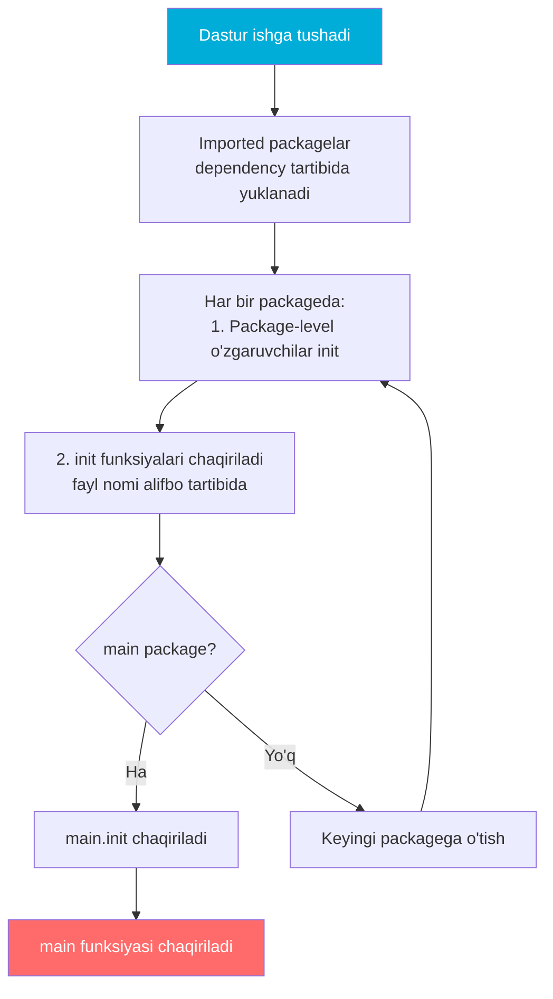
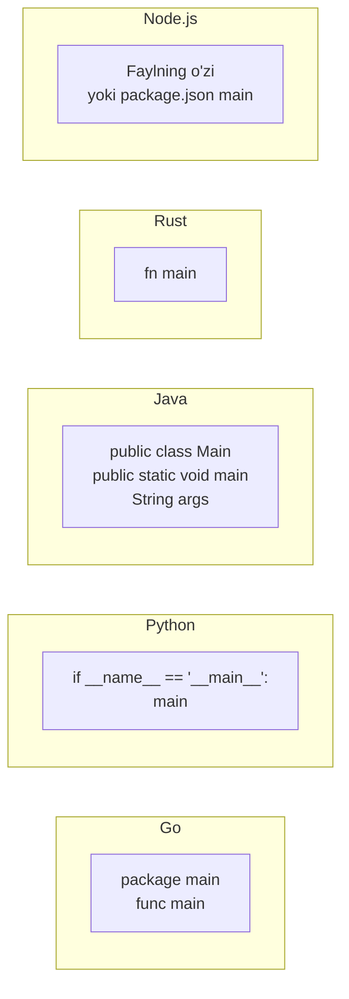
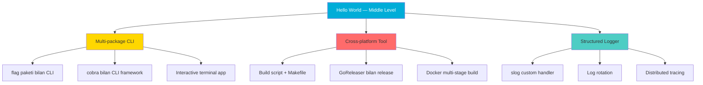

# Hello World in Go — Middle Level

## Table of Contents

1. [Introduction](#1-introduction)
2. [Core Concepts](#2-core-concepts)
3. [Pros & Cons](#3-pros--cons)
4. [Use Cases](#4-use-cases)
5. [Code Examples](#5-code-examples)
6. [Product Use / Feature](#6-product-use--feature)
7. [Error Handling](#7-error-handling)
8. [Security Considerations](#8-security-considerations)
9. [Performance Optimization](#9-performance-optimization)
10. [Debugging Guide](#10-debugging-guide)
11. [Best Practices](#11-best-practices)
12. [Edge Cases & Pitfalls](#12-edge-cases--pitfalls)
13. [Common Mistakes](#13-common-mistakes)
14. [Tricky Points](#14-tricky-points)
15. [Comparison with Other Languages](#15-comparison-with-other-languages)
16. [Test](#16-test)
17. [Tricky Questions](#17-tricky-questions)
18. [Cheat Sheet](#18-cheat-sheet)
19. [Summary](#19-summary)
20. [What You Can Build](#20-what-you-can-build)
21. [Further Reading](#21-further-reading)
22. [Related Topics](#22-related-topics)

---

## 1. Introduction

Middle level'da Hello World'dan tashqariga chiqamiz va Go dasturining ichki ishlash mexanizmlarini o'rganamiz. Bu bo'limda **nima uchun** (Why) va **qachon** (When) savollariga javob beramiz:

- `init()` funksiyasi va bajarilish tartibi
- Bir nechta package'lar bilan ishlash
- Build constraints va conditional compilation
- `fmt.Stringer` va `fmt.Formatter` interface'lari
- `os.Args` bilan CLI argumentlar
- `os.Exit` vs `return` — dasturdan chiqish usullari
- `log` vs `fmt` — qachon nimani ishlating
- Cross-compilation: `GOOS` va `GOARCH`

---

## 2. Core Concepts

### 2.1 init() Funksiyasi va Bajarilish Tartibi

`init()` — Go'dagi maxsus funksiya. U `main()` dan **oldin** avtomatik chaqiriladi va konfiguratsiya, validatsiya, resurs initsializatsiyasi uchun ishlatiladi.

```go
package main

import "fmt"

func init() {
    fmt.Println("1. init() ishladi")
}

func main() {
    fmt.Println("2. main() ishladi")
}
```

```
1. init() ishladi
2. main() ishladi
```

### Bir faylda bir nechta init()

```go
package main

import "fmt"

func init() {
    fmt.Println("birinchi init()")
}

func init() {
    fmt.Println("ikkinchi init()")
}

func init() {
    fmt.Println("uchinchi init()")
}

func main() {
    fmt.Println("main()")
}
```

```
birinchi init()
ikkinchi init()
uchinchi init()
main()
```

**Muhim:** Bir faylda bir nechta `init()` bo'lishi mumkin va ular **yozilish tartibida** chaqiriladi.

### Go dastur initsializatsiya tartibi:



### Ko'p fayllarda init() tartibi:

```go
// a_setup.go
package main

import "fmt"

func init() {
    fmt.Println("a_setup.go init()")
}
```

```go
// b_config.go
package main

import "fmt"

func init() {
    fmt.Println("b_config.go init()")
}
```

```go
// main.go
package main

import "fmt"

func init() {
    fmt.Println("main.go init()")
}

func main() {
    fmt.Println("main()")
}
```

```
a_setup.go init()
b_config.go init()
main.go init()
main()
```

**Qoida:** Bir nechta fayldagi `init()` lar **fayl nomi alifbo tartibida** chaqiriladi.

### 2.2 Multi-Package va Main Package

```
myproject/
├── go.mod
├── main.go          // package main
├── config/
│   └── config.go    // package config
└── utils/
    └── helper.go    // package utils
```

```go
// go.mod
module myproject

go 1.22
```

```go
// config/config.go
package config

import "fmt"

var AppName = "MyApp"

func init() {
    fmt.Println("config package init()")
}

func PrintConfig() {
    fmt.Printf("App: %s\n", AppName)
}
```

```go
// utils/helper.go
package utils

import "fmt"

func init() {
    fmt.Println("utils package init()")
}

func Greet(name string) {
    fmt.Printf("Salom, %s!\n", name)
}
```

```go
// main.go
package main

import (
    "fmt"
    "myproject/config"
    "myproject/utils"
)

func init() {
    fmt.Println("main package init()")
}

func main() {
    fmt.Println("main() ishladi")
    config.PrintConfig()
    utils.Greet("Anvar")
}
```

```
config package init()
utils package init()
main package init()
main() ishladi
App: MyApp
Salom, Anvar!
```

### 2.3 Build Constraints (Build Tags)

Build constraints — kompilyatsiya shartlarini belgilash. Masalan, faqat Linux yoki faqat Windows uchun kod:

```go
// server_linux.go
//go:build linux

package main

import "fmt"

func platformInfo() {
    fmt.Println("Linux server")
}
```

```go
// server_windows.go
//go:build windows

package main

import "fmt"

func platformInfo() {
    fmt.Println("Windows server")
}
```

```go
// server_default.go
//go:build !linux && !windows

package main

import "fmt"

func platformInfo() {
    fmt.Println("Boshqa platforma")
}
```

```go
// main.go
package main

func main() {
    platformInfo()
}
```

**Fayl nomlash konvensiyasi** ham build constraint sifatida ishlaydi:

| Fayl nomi | Shart |
|-----------|-------|
| `file_linux.go` | Faqat Linux'da kompilyatsiya |
| `file_windows.go` | Faqat Windows'da |
| `file_darwin.go` | Faqat macOS'da |
| `file_amd64.go` | Faqat amd64 arxitekturada |
| `file_linux_amd64.go` | Linux + amd64 |

### 2.4 fmt.Stringer Interface

`fmt.Stringer` — Go'dagi eng muhim interface'lardan biri. `%v` va `%s` verb'lari bilan chiqarishda ishlatiladi:

```go
package main

import "fmt"

type User struct {
    Name string
    Age  int
}

// String() metodi — Stringer interface'ini implement qilish
func (u User) String() string {
    return fmt.Sprintf("%s (yoshi: %d)", u.Name, u.Age)
}

func main() {
    user := User{Name: "Kamola", Age: 25}

    fmt.Println(user)           // Kamola (yoshi: 25)
    fmt.Printf("User: %v\n", user) // User: Kamola (yoshi: 25)
    fmt.Printf("User: %s\n", user) // User: Kamola (yoshi: 25)
}
```

### 2.5 fmt.Formatter Interface

`fmt.Formatter` — to'liq nazorat beradi. Har bir verb uchun maxsus chiqish:

```go
package main

import "fmt"

type Color struct {
    R, G, B uint8
}

func (c Color) Format(f fmt.State, verb rune) {
    switch verb {
    case 'v':
        if f.Flag('+') {
            fmt.Fprintf(f, "Color{R:%d, G:%d, B:%d}", c.R, c.G, c.B)
        } else {
            fmt.Fprintf(f, "(%d,%d,%d)", c.R, c.G, c.B)
        }
    case 's':
        fmt.Fprintf(f, "#%02x%02x%02x", c.R, c.G, c.B)
    case 'x':
        fmt.Fprintf(f, "%02x%02x%02x", c.R, c.G, c.B)
    default:
        fmt.Fprintf(f, "(%d,%d,%d)", c.R, c.G, c.B)
    }
}

func main() {
    red := Color{255, 0, 0}

    fmt.Printf("%v\n", red)   // (255,0,0)
    fmt.Printf("%+v\n", red)  // Color{R:255, G:0, B:0}
    fmt.Printf("%s\n", red)   // #ff0000
    fmt.Printf("%x\n", red)   // ff0000
}
```

### 2.6 os.Args — CLI Argumentlar

```go
package main

import (
    "fmt"
    "os"
)

func main() {
    // os.Args[0] — dastur nomi
    // os.Args[1:] — argumentlar
    fmt.Println("Dastur:", os.Args[0])
    fmt.Println("Argumentlar soni:", len(os.Args)-1)

    for i, arg := range os.Args[1:] {
        fmt.Printf("  arg[%d] = %s\n", i, arg)
    }
}
```

```bash
go run main.go salom dunyo 42
# Dastur: /tmp/go-build.../main
# Argumentlar soni: 3
#   arg[0] = salom
#   arg[1] = dunyo
#   arg[2] = 42
```

### 2.7 os.Exit vs return from main

```go
package main

import (
    "fmt"
    "os"
)

func main() {
    if len(os.Args) < 2 {
        fmt.Fprintln(os.Stderr, "Xato: argument kerak")
        os.Exit(1) // defer'lar ISHLAMAYDI!
    }

    fmt.Println("Argument:", os.Args[1])
    // main() tugashi = os.Exit(0) bilan bir xil, lekin defer'lar ishlaydi
}
```

**Muhim farqlar:**

| Xususiyat | `return` (main dan) | `os.Exit(code)` |
|-----------|---------------------|------------------|
| Exit code | Har doim 0 | Ixtiyoriy (0, 1, 2...) |
| `defer` ishlaydi | Ha | **YO'Q** |
| Goroutine'lar | To'xtaydi | To'xtaydi |
| Ishlatish | Normal tugash | Xato bilan chiqish |

### 2.8 log vs fmt

```go
package main

import (
    "fmt"
    "log"
    "os"
)

func main() {
    // fmt — oddiy chiqish
    fmt.Println("Oddiy xabar")
    // Oddiy xabar

    // log — vaqt belgisi bilan (stderr ga yozadi)
    log.Println("Log xabar")
    // 2024/01/15 14:30:45 Log xabar

    // log prefiks o'zgartirish
    log.SetPrefix("[APP] ")
    log.Println("Prefiks bilan")
    // [APP] 2024/01/15 14:30:45 Prefiks bilan

    // log faylga yozish
    file, err := os.Create("app.log")
    if err != nil {
        log.Fatal(err)
    }
    defer file.Close()

    logger := log.New(file, "[FILE] ", log.LstdFlags|log.Lshortfile)
    logger.Println("Faylga yozildi")
    // Faylda: [FILE] 2024/01/15 14:30:45 main.go:28: Faylga yozildi

    // log.Fatal — log yozadi VA os.Exit(1) chaqiradi
    // log.Panic — log yozadi VA panic chaqiradi
}
```

**Qachon nima ishlatish:**

| Holat | Paket |
|-------|-------|
| Foydalanuvchiga chiqish (stdout) | `fmt` |
| Debug/development chiqishi | `fmt` yoki `log` |
| Production logging | `log` yoki `slog` (Go 1.21+) |
| Xato xabarlari (stderr) | `log` yoki `fmt.Fprintln(os.Stderr, ...)` |
| Fatal xato | `log.Fatal()` |

### 2.9 Cross-Compilation: GOOS va GOARCH

```bash
# Joriy platforma uchun
go build -o myapp main.go

# Linux uchun (macOS/Windows dan)
GOOS=linux GOARCH=amd64 go build -o myapp-linux main.go

# Windows uchun
GOOS=windows GOARCH=amd64 go build -o myapp.exe main.go

# macOS ARM uchun (M1/M2)
GOOS=darwin GOARCH=arm64 go build -o myapp-mac main.go

# Barcha GOOS/GOARCH kombinatsiyalarini ko'rish
go tool dist list
```

**Eng ko'p ishlatiladigan kombinatsiyalar:**

| GOOS | GOARCH | Platforma |
|------|--------|-----------|
| `linux` | `amd64` | Linux server (64-bit) |
| `linux` | `arm64` | Linux ARM (Raspberry Pi 4, AWS Graviton) |
| `darwin` | `amd64` | macOS Intel |
| `darwin` | `arm64` | macOS Apple Silicon (M1/M2/M3) |
| `windows` | `amd64` | Windows 64-bit |

---

## 3. Pros & Cons

### Afzalliklari (Middle perspective):

| Afzallik | Trade-off |
|----------|-----------|
| **`init()` — avtomatik setup** | Tartibni boshqarish qiyin, implicit dependency hosil bo'ladi |
| **Cross-compilation oddiy** | `CGO_ENABLED=1` bo'lsa muammolar boshlanadi |
| **Build constraints** | Platformaga xos kod test qilish murakkab |
| **Yagona binary** | Binary hajmi katta (runtime statik linklanadi) |
| **`fmt.Stringer`** | Har bir struct uchun alohida yozish kerak |
| **`os.Args` oddiy** | Murakkab CLI uchun `flag` yoki `cobra` kerak |
| **`log` standart** | Structured logging uchun `slog` yoki tashqi kutubxona kerak |

### Kamchiliklari:

| Kamchilik | Yechim |
|-----------|--------|
| `init()` tartibini nazorat qilish qiyin | Explicit init funksiyalarini chaqirish |
| `os.Exit` defer'larni o'tkazib yuboradi | `run()` pattern ishlatish |
| `fmt` production da sekin | `slog` yoki `zerolog` ishlatish |
| Build tag'lar test qilish murakkab | CI/CD da har bir platforma uchun test |

---

## 4. Use Cases

| Use Case | Paket/Tool | Misol |
|----------|-----------|-------|
| CLI tool yozish | `os.Args`, `flag` | DevOps toollar |
| Multi-platform dastur | Build constraints | Docker, Terraform |
| Structured logging | `log`, `slog` | Production microservices |
| Custom output format | `fmt.Stringer` | API response formatlash |
| Version embedding | `-ldflags` | CI/CD pipeline |
| Platform-specific kod | Fayl nomlash konvensiyasi | OS-dependent feature |

---

## 5. Code Examples

### 5.1 init() bilan konfiguratsiya

```go
package main

import (
    "fmt"
    "os"
)

var (
    appMode string
    debug   bool
)

func init() {
    appMode = os.Getenv("APP_MODE")
    if appMode == "" {
        appMode = "development"
    }

    debug = os.Getenv("DEBUG") == "true"
}

func main() {
    fmt.Printf("Mode: %s\n", appMode)
    fmt.Printf("Debug: %t\n", debug)

    if debug {
        fmt.Println("Debug rejim yoqilgan")
    }
}
```

```bash
APP_MODE=production DEBUG=true go run main.go
# Mode: production
# Debug: true
# Debug rejim yoqilgan
```

### 5.2 run() Pattern — defer bilan xavfsiz chiqish

```go
package main

import (
    "fmt"
    "os"
)

func main() {
    code := run()
    os.Exit(code)
}

func run() int {
    // defer bu yerda ISHLAYDI
    f, err := os.Create("temp.txt")
    if err != nil {
        fmt.Fprintln(os.Stderr, "Xato:", err)
        return 1
    }
    defer f.Close() // Bu chaqiriladi!

    fmt.Fprintln(f, "Salom, fayl!")
    fmt.Println("Fayl yaratildi")
    return 0
}
```

### 5.3 Custom Stringer bilan jadval chiqarish

```go
package main

import (
    "fmt"
    "strings"
)

type Table struct {
    Headers []string
    Rows    [][]string
}

func (t Table) String() string {
    var sb strings.Builder

    // Header
    sb.WriteString("| " + strings.Join(t.Headers, " | ") + " |\n")
    sb.WriteString("|" + strings.Repeat("---|", len(t.Headers)) + "\n")

    // Rows
    for _, row := range t.Rows {
        sb.WriteString("| " + strings.Join(row, " | ") + " |\n")
    }

    return sb.String()
}

func main() {
    t := Table{
        Headers: []string{"Ism", "Yosh", "Shahar"},
        Rows: [][]string{
            {"Anvar", "25", "Toshkent"},
            {"Kamola", "22", "Samarqand"},
            {"Sardor", "30", "Buxoro"},
        },
    }

    fmt.Println(t) // Stringer interface avtomatik chaqiriladi
}
```

### 5.4 CLI argument parser

```go
package main

import (
    "fmt"
    "os"
    "strings"
)

func main() {
    args := os.Args[1:]

    if len(args) == 0 {
        fmt.Println("Foydalanish: myapp <buyruq> [argumentlar]")
        fmt.Println("Buyruqlar: greet, upper, repeat")
        os.Exit(0)
    }

    switch args[0] {
    case "greet":
        if len(args) < 2 {
            fmt.Fprintln(os.Stderr, "Xato: ism kerak")
            os.Exit(1)
        }
        fmt.Printf("Salom, %s!\n", args[1])

    case "upper":
        if len(args) < 2 {
            fmt.Fprintln(os.Stderr, "Xato: matn kerak")
            os.Exit(1)
        }
        fmt.Println(strings.ToUpper(strings.Join(args[1:], " ")))

    case "repeat":
        if len(args) < 2 {
            fmt.Fprintln(os.Stderr, "Xato: matn kerak")
            os.Exit(1)
        }
        text := strings.Join(args[1:], " ")
        for i := 0; i < 3; i++ {
            fmt.Println(text)
        }

    default:
        fmt.Fprintf(os.Stderr, "Noma'lum buyruq: %s\n", args[0])
        os.Exit(1)
    }
}
```

```bash
go run main.go greet Anvar
# Salom, Anvar!

go run main.go upper salom dunyo
# SALOM DUNYO

go run main.go repeat Go zo'r
# Go zo'r
# Go zo'r
# Go zo'r
```

### 5.5 Structured logging bilan slog (Go 1.21+)

```go
package main

import (
    "log/slog"
    "os"
)

func main() {
    // JSON formatda log
    logger := slog.New(slog.NewJSONHandler(os.Stdout, &slog.HandlerOptions{
        Level: slog.LevelDebug,
    }))

    logger.Info("Dastur ishga tushdi",
        "version", "1.0.0",
        "port", 8080,
    )

    logger.Debug("Debug xabar",
        "user", "anvar",
        "action", "login",
    )

    logger.Error("Xato yuz berdi",
        "error", "connection refused",
        "host", "localhost:5432",
    )
}
```

```json
{"time":"2024-01-15T14:30:45Z","level":"INFO","msg":"Dastur ishga tushdi","version":"1.0.0","port":8080}
{"time":"2024-01-15T14:30:45Z","level":"DEBUG","msg":"Debug xabar","user":"anvar","action":"login"}
{"time":"2024-01-15T14:30:45Z","level":"ERROR","msg":"Xato yuz berdi","error":"connection refused","host":"localhost:5432"}
```

---

## 6. Product Use / Feature

| Mahsulot | Scale | init/main Pattern |
|----------|-------|-------------------|
| **Kubernetes** | Millionlab konteyner | `cobra.Command` bilan main, `init()` da flag registration |
| **Docker** | Milliardlab pull | Multi-binary (docker, dockerd), har biri alohida main |
| **Terraform** | 3000+ provider | Plugin arxitektura, har bir provider alohida binary |
| **Prometheus** | Petabaytlab metrika | `main.go` da graceful shutdown pattern |
| **CockroachDB** | Terabaytlab data | `-ldflags` bilan version embedding, build tags |

---

## 7. Error Handling

### 7.1 Production-ready xato boshqarish

```go
package main

import (
    "errors"
    "fmt"
    "os"
)

type AppError struct {
    Code    int
    Message string
    Err     error
}

func (e *AppError) Error() string {
    if e.Err != nil {
        return fmt.Sprintf("[%d] %s: %v", e.Code, e.Message, e.Err)
    }
    return fmt.Sprintf("[%d] %s", e.Code, e.Message)
}

func (e *AppError) Unwrap() error {
    return e.Err
}

func loadConfig(path string) error {
    _, err := os.ReadFile(path)
    if err != nil {
        return &AppError{
            Code:    1001,
            Message: "Konfiguratsiya yuklanmadi",
            Err:     err,
        }
    }
    return nil
}

func main() {
    err := loadConfig("config.yaml")
    if err != nil {
        var appErr *AppError
        if errors.As(err, &appErr) {
            fmt.Fprintf(os.Stderr, "App xato (kod: %d): %s\n", appErr.Code, appErr.Message)
        }
        os.Exit(1)
    }

    fmt.Println("Dastur muvaffaqiyatli ishga tushdi")
}
```

### 7.2 init() da xato boshqarish

```go
package main

import (
    "fmt"
    "log"
    "os"
)

var requiredEnvVars = []string{"DATABASE_URL", "API_KEY"}

func init() {
    missing := []string{}
    for _, v := range requiredEnvVars {
        if os.Getenv(v) == "" {
            missing = append(missing, v)
        }
    }

    if len(missing) > 0 {
        log.Fatalf("Kerakli muhit o'zgaruvchilari topilmadi: %v", missing)
        // log.Fatal ichida os.Exit(1) bor — dastur to'xtaydi
    }
}

func main() {
    fmt.Println("Barcha konfiguratsiyalar mavjud")
    fmt.Println("DB:", os.Getenv("DATABASE_URL"))
}
```

---

## 8. Security Considerations

### 8.1 Log Injection

```go
package main

import (
    "fmt"
    "log"
    "strings"
)

func main() {
    // XAVFLI — foydalanuvchi inputi log ga to'g'ridan-to'g'ri
    userInput := "admin\n2024-01-15 WARN: unauthorized access detected"

    // Bu noto'g'ri log yozuvi hosil qiladi:
    log.Printf("User login: %s", userInput)
    // 2024/01/15 14:30:45 User login: admin
    // 2024-01-15 WARN: unauthorized access detected  <-- soxta log!

    // XAVFSIZ — yangi qatorlarni olib tashlash
    sanitized := strings.ReplaceAll(userInput, "\n", "\\n")
    sanitized = strings.ReplaceAll(sanitized, "\r", "\\r")
    log.Printf("User login: %s", sanitized)
    // 2024/01/15 14:30:45 User login: admin\n2024-01-15 WARN: unauthorized access detected

    // ENG YAXSHI — structured logging
    fmt.Println("slog ishlatish tavsiya qilinadi")
}
```

### 8.2 Sensitive Data Leakage

```go
package main

import "fmt"

type Credentials struct {
    Username string
    Password string
}

// XAVFLI — default String() password ko'rsatadi
// fmt.Println(creds) → {admin secret123}

// XAVFSIZ — String() metodini override qilish
func (c Credentials) String() string {
    return fmt.Sprintf("{Username: %s, Password: ****}", c.Username)
}

// GoString — %#v uchun ham himoya
func (c Credentials) GoString() string {
    return fmt.Sprintf("Credentials{Username: %q, Password: \"****\"}", c.Username)
}

func main() {
    creds := Credentials{Username: "admin", Password: "secret123"}

    fmt.Println(creds)          // {Username: admin, Password: ****}
    fmt.Printf("%v\n", creds)   // {Username: admin, Password: ****}
    fmt.Printf("%+v\n", creds)  // {Username: admin, Password: ****}
    fmt.Printf("%#v\n", creds)  // Credentials{Username: "admin", Password: "****"}
}
```

### 8.3 Format String Vulnerability

```go
package main

import "fmt"

func main() {
    // HECH QACHON foydalanuvchi inputini format string sifatida bermang
    userInput := "%x %x %x %x %x"

    // XAVFLI:
    // fmt.Printf(userInput) — stack memory leak!

    // XAVFSIZ:
    fmt.Printf("%s\n", userInput)

    // XAVFSIZ:
    fmt.Println(userInput)
}
```

---

## 9. Performance Optimization

### 9.1 fmt vs direct write benchmark

```go
package main

import (
    "bufio"
    "fmt"
    "os"
    "time"
)

func benchFmtPrintln(n int) time.Duration {
    start := time.Now()
    for i := 0; i < n; i++ {
        fmt.Fprintf(os.Stdout, "Line %d\n", i)
    }
    return time.Since(start)
}

func benchBufio(n int) time.Duration {
    w := bufio.NewWriter(os.Stdout)
    start := time.Now()
    for i := 0; i < n; i++ {
        fmt.Fprintf(w, "Line %d\n", i)
    }
    w.Flush()
    return time.Since(start)
}

func main() {
    // stdout ni /dev/null ga yo'naltiring: go run main.go > /dev/null
    n := 100000

    d1 := benchFmtPrintln(n)
    d2 := benchBufio(n)

    fmt.Fprintf(os.Stderr, "fmt.Fprintf (unbuffered): %v\n", d1)
    fmt.Fprintf(os.Stderr, "bufio.Writer (buffered):  %v\n", d2)
    fmt.Fprintf(os.Stderr, "Tezlik farqi: %.1fx\n", float64(d1)/float64(d2))
}
```

```bash
go run main.go > /dev/null
# fmt.Fprintf (unbuffered): 45.2ms
# bufio.Writer (buffered):  8.1ms
# Tezlik farqi: 5.6x
```

### 9.2 String formatting optimizatsiya

```go
package main

import (
    "fmt"
    "strconv"
    "strings"
    "time"
)

func main() {
    n := 1000000

    // Sekin — fmt.Sprintf
    start := time.Now()
    for i := 0; i < n; i++ {
        _ = fmt.Sprintf("count: %d", i)
    }
    sprintfTime := time.Since(start)

    // Tez — strconv + string concatenation
    start = time.Now()
    for i := 0; i < n; i++ {
        _ = "count: " + strconv.Itoa(i)
    }
    strconcatTime := time.Since(start)

    // Eng tez — strings.Builder
    start = time.Now()
    var sb strings.Builder
    for i := 0; i < n; i++ {
        sb.Reset()
        sb.WriteString("count: ")
        sb.WriteString(strconv.Itoa(i))
        _ = sb.String()
    }
    builderTime := time.Since(start)

    fmt.Printf("fmt.Sprintf:       %v\n", sprintfTime)
    fmt.Printf("strconv + concat:  %v\n", strconcatTime)
    fmt.Printf("strings.Builder:   %v\n", builderTime)
}
```

**Natija (taxminiy):**
```
fmt.Sprintf:       180ms
strconv + concat:  65ms
strings.Builder:   55ms
```

---

## 10. Debugging Guide

### 10.1 Print Debugging

```go
package main

import (
    "fmt"
    "os"
    "runtime"
)

func debugPrint(msg string, args ...interface{}) {
    _, file, line, ok := runtime.Caller(1)
    if ok {
        fmt.Fprintf(os.Stderr, "[DEBUG %s:%d] ", file, line)
    }
    fmt.Fprintf(os.Stderr, msg+"\n", args...)
}

func main() {
    x := 42
    debugPrint("x = %d", x)
    // [DEBUG /path/to/main.go:18] x = 42

    name := "Anvar"
    debugPrint("name = %q, len = %d", name, len(name))
    // [DEBUG /path/to/main.go:21] name = "Anvar", len = 5
}
```

### 10.2 Delve Debugger

```bash
# Delve o'rnatish
go install github.com/go-delve/delve/cmd/dlv@latest

# Debug rejimda ishga tushirish
dlv debug main.go

# Breakpoint qo'yish
(dlv) break main.main
(dlv) break main.go:15

# Ishga tushirish
(dlv) continue

# O'zgaruvchini ko'rish
(dlv) print x
(dlv) locals

# Keyingi qator
(dlv) next

# Funksiya ichiga kirish
(dlv) step

# Chiqish
(dlv) quit
```

### 10.3 go vet va staticcheck

```bash
# Standart statik analiz
go vet ./...

# Printf verb xatolarini topish
go vet -printf ./...

# staticcheck (qo'shimcha tool)
go install honnef.co/go/tools/cmd/staticcheck@latest
staticcheck ./...
```

```go
package main

import "fmt"

func main() {
    age := 25
    fmt.Printf("Yosh: %s\n", age) // go vet: Printf format %s has arg age of wrong type int
}
```

---

## 11. Best Practices

1. **`init()` ni minimallashtiriladi** — murakkab logika `main()` yoki alohida funksiyada bo'lishi kerak
2. **`run()` pattern ishlatiladi** — `os.Exit` ni faqat `main()` da chaqiring
3. **Stderr va stdout ajratiladi** — xatolar `os.Stderr` ga, natijalar `os.Stdout` ga
4. **`log.Fatal` ehtiyotkorlik bilan** — defer'lar ishlamaydi
5. **Build tag'lar minimal** — faqat haqiqatan zarur bo'lganda
6. **Sensitive data Stringer bilan himoyalanadi** — passwordlar logga tushmaydi
7. **`slog` ishlatiladi (Go 1.21+)** — structured logging uchun
8. **Cross-compile CI/CD da** — qo'lda emas, avtomatlashtirilgan
9. **`go vet` har doim** — kompilyatsiyadan oldin statik analiz
10. **`goimports` yoqiladi** — import tartibini avtomatlashtiriladi

---

## 12. Edge Cases & Pitfalls

### 12.1 init() circular dependency

```go
// a.go: import "b" → b.go: import "a" — KOMPILYATSIYA XATOSI
// Go circular import ga ruxsat bermaydi
```

### 12.2 init() da panic

```go
package main

import "fmt"

func init() {
    panic("init da xato!") // Dastur DARHOL to'xtaydi
}

func main() {
    fmt.Println("Bu chiqmaydi")
}
```

```
panic: init da xato!

goroutine 1 [running]:
main.init.0()
        /path/to/main.go:6
```

### 12.3 os.Exit defer'ni o'tkazib yuboradi

```go
package main

import (
    "fmt"
    "os"
)

func main() {
    defer fmt.Println("Bu CHIQMAYDI!")
    fmt.Println("Salom")
    os.Exit(0) // defer ishlamaydi!
}
```

```
Salom
// "Bu CHIQMAYDI!" — hech qachon chiqmaydi
```

### 12.4 Blank import side effects

```go
package main

import (
    "fmt"
    _ "net/http/pprof" // faqat init() uchun — pprof handler'larni ro'yxatdan o'tkazadi
)

func main() {
    fmt.Println("pprof handler'lar ro'yxatdan o'tdi")
}
```

---

## 13. Common Mistakes

### 13.1 init() da og'ir ish bajarish

```go
// NOTO'G'RI — init() da database ulanish
func init() {
    db, err := sql.Open("postgres", connStr)
    if err != nil {
        log.Fatal(err) // defer ishlamaydi
    }
    // db global o'zgaruvchi — test qilish qiyin
}

// TO'G'RI — explicit init funksiya
func initDB(connStr string) (*sql.DB, error) {
    return sql.Open("postgres", connStr)
}

func main() {
    db, err := initDB(os.Getenv("DATABASE_URL"))
    if err != nil {
        log.Fatal(err)
    }
    defer db.Close()
}
```

### 13.2 os.Exit(0) defer bilan

```go
// NOTO'G'RI
func main() {
    f, _ := os.Create("file.txt")
    defer f.Close() // ISHLAMAYDI!
    // ...
    os.Exit(0)
}

// TO'G'RI — run() pattern
func main() {
    os.Exit(run())
}

func run() int {
    f, err := os.Create("file.txt")
    if err != nil {
        return 1
    }
    defer f.Close() // ISHLAYDI!
    // ...
    return 0
}
```

### 13.3 Printf verb va argument tur nomuvofiqlik

```go
// NOTO'G'RI — go vet ogohlantiradi
fmt.Printf("count: %d\n", "hello") // %d expects int, got string

// TO'G'RI
fmt.Printf("count: %s\n", "hello")
```

---

## 14. Tricky Points

### 14.1 init() tartibining kafolati

Go spec bo'yicha `init()` tartibi:
1. Dependency packagelar birinchi
2. Package-level o'zgaruvchilar
3. init() funksiyalari — **fayl nomi alifbo tartibida**, fayldagi joylashuv tartibida

**Lekin:** Fayl nomlari o'rtasidagi tartib Go spetsifikatsiyasida **aniq kafolatlanmagan** — kompilyator implementatsiyasiga bog'liq.

### 14.2 Blank import bilan init() chaqirish

```go
import _ "image/png" // faqat init() uchun — PNG decoder ro'yxatdan o'tadi
```

Bu pattern `database/sql` driver'larida ko'p ishlatiladi:
```go
import _ "github.com/lib/pq" // PostgreSQL driver init() orqali ro'yxatdan o'tadi
```

### 14.3 log.Fatal vs log.Panic

```go
// log.Fatal — log yozadi + os.Exit(1) — defer ISHLAMAYDI
log.Fatal("xato") // = log.Print("xato") + os.Exit(1)

// log.Panic — log yozadi + panic() — defer ISHLAYDI (recover mumkin)
log.Panic("xato") // = log.Print("xato") + panic("xato")
```

### 14.4 fmt.Errorf va error wrapping

```go
package main

import (
    "errors"
    "fmt"
    "os"
)

func readConfig(path string) error {
    _, err := os.ReadFile(path)
    if err != nil {
        // %w — error wrapping (Go 1.13+)
        return fmt.Errorf("config o'qishda xato: %w", err)
    }
    return nil
}

func main() {
    err := readConfig("missing.yaml")
    if err != nil {
        fmt.Println("Xato:", err)
        // Xato: config o'qishda xato: open missing.yaml: no such file or directory

        // Ichki xatoni tekshirish
        if errors.Is(err, os.ErrNotExist) {
            fmt.Println("Fayl topilmadi")
        }
    }
}
```

---

## 15. Comparison with Other Languages

### Entry Point Comparison



### Batafsil taqqoslash

| Xususiyat | Go | Python | Java | Rust | Node.js |
|-----------|-----|--------|------|------|---------|
| Entry point | `func main()` | `if __name__` | `public static void main(String[])` | `fn main()` | Fayl o'zi |
| Package tizimi | `package` | `import` / `from` | `package` + `class` | `mod` / `crate` | `require` / `import` |
| Kompilyatsiya | Ha (tez) | Yo'q (interpreted) | Ha (JVM bytecode) | Ha (sekin) | Yo'q (JIT) |
| Binary | Yagona statik | `.pyc` + interpreter | `.class` + JVM | Yagona statik | Node runtime kerak |
| Startup vaqti | ~1-5ms | ~30-100ms | ~100-500ms | ~1-5ms | ~30-60ms |
| Hello World hajmi | ~1.8MB | ~100 bytes | ~400 bytes + JVM | ~3MB | ~100 bytes + Node |
| Init mexanizmi | `init()` | Module-level code | `static {}` block | Yo'q (lazy_static) | Module-level code |
| Args | `os.Args` | `sys.argv` | `String[] args` | `std::env::args()` | `process.argv` |
| Exit | `os.Exit(code)` | `sys.exit(code)` | `System.exit(code)` | `std::process::exit(code)` | `process.exit(code)` |

---

## 16. Test

### 1-savol
`init()` funksiyasi haqida qaysi to'g'ri?

- A) Faqat bitta init() bo'lishi mumkin
- B) main() dan keyin chaqiriladi
- C) Bir faylda bir nechta init() bo'lishi mumkin
- D) Argument qabul qiladi

<details>
<summary>Javob</summary>

**C)** Bir Go faylida bir nechta `init()` funksiyalari bo'lishi mumkin va ular yozilish tartibida chaqiriladi. `init()` hech qanday argument qabul qilmaydi va qaytarmaydi.

</details>

### 2-savol
Quyidagi kodning chiqishi qanday?

```go
package main

import "fmt"

var x = initX()

func initX() int {
    fmt.Println("var x init")
    return 1
}

func init() {
    fmt.Println("init()")
}

func main() {
    fmt.Println("main()")
}
```

- A) `init()`, `var x init`, `main()`
- B) `var x init`, `init()`, `main()`
- C) `main()`, `init()`, `var x init`
- D) Kompilyatsiya xatosi

<details>
<summary>Javob</summary>

**B)** Package-level o'zgaruvchilar `init()` dan **oldin** initsializatsiya qilinadi. Tartib: 1) Package variables → 2) init() → 3) main().

</details>

### 3-savol
`os.Exit(1)` chaqirilganda defer'lar ishlaydimi?

- A) Ha
- B) Yo'q
- C) Faqat main() dagi defer'lar
- D) Go versiyasiga bog'liq

<details>
<summary>Javob</summary>

**B)** `os.Exit()` dasturni darhol to'xtatadi — **hech qanday defer ishlamaydi**. Shuning uchun `run()` pattern ishlatish tavsiya qilinadi.

</details>

### 4-savol
`GOOS=linux GOARCH=arm64 go build -o app main.go` nima qiladi?

- A) Linux ARM uchun binary yaratadi
- B) Joriy platforma uchun yaratadi
- C) Xato beradi
- D) Docker image yaratadi

<details>
<summary>Javob</summary>

**A)** Bu cross-compilation — joriy platformadan qat'i nazar, Linux ARM64 uchun binary yaratadi. Go'ning eng kuchli xususiyatlaridan biri.

</details>

### 5-savol
`fmt.Stringer` interface qanday e'lon qilingan?

- A) `String() (string, error)`
- B) `String() string`
- C) `ToString() string`
- D) `Format() string`

<details>
<summary>Javob</summary>

**B)** `fmt.Stringer` interface faqat bitta metod talab qiladi:
```go
type Stringer interface {
    String() string
}
```
Bu metodni implement qilgan struct `%v` va `%s` bilan chiqarilganda custom formatda ko'rsatiladi.

</details>

### 6-savol
`log.Fatal("xato")` nima qiladi?

- A) Faqat log yozadi
- B) Log yozadi va panic chaqiradi
- C) Log yozadi va os.Exit(1) chaqiradi
- D) Xato qaytaradi

<details>
<summary>Javob</summary>

**C)** `log.Fatal` = `log.Print()` + `os.Exit(1)`. Defer'lar ishlamaydi! `log.Panic` esa `log.Print()` + `panic()` — bunda defer'lar ishlaydi.

</details>

### 7-savol
Quyidagi kodda nima xato?

```go
package main

import (
    "fmt"
    _ "os"
)

func main() {
    fmt.Println(os.Args)
}
```

- A) Hech narsa — to'g'ri
- B) `os` blank import — ishlatib bo'lmaydi
- C) `os.Args` mavjud emas
- D) Sintaksis xatosi

<details>
<summary>Javob</summary>

**B)** `_ "os"` — blank import. Bu faqat `init()` side-effect uchun ishlatiladi. `os.Args` ga murojaat qilib bo'lmaydi. To'g'ri: `"os"` (underscore'siz).

</details>

### 8-savol
Build constraint `//go:build linux && amd64` nima degani?

- A) Linux YOKI amd64
- B) Linux VA amd64
- C) Faqat Linux
- D) Faqat amd64

<details>
<summary>Javob</summary>

**B)** `&&` — VA operatori. Bu fayl faqat **Linux** platformasida **VA** **amd64** arxitekturasida kompilyatsiya qilinadi. `||` — YOKI operatori bo'ladi.

</details>

### 9-savol
`fmt.Errorf("xato: %w", err)` dagi `%w` nima?

- A) Warning format
- B) Wide string format
- C) Error wrapping verb (Go 1.13+)
- D) Xato beradi

<details>
<summary>Javob</summary>

**C)** `%w` — error wrapping uchun maxsus verb (Go 1.13+). Bu xatoni o'rab (wrap) yangi xato yaratadi. `errors.Is()` va `errors.As()` bilan ichki xatoni tekshirish mumkin.

</details>

### 10-savol
Qaysi buyruq Printf verb xatolarini topadi?

- A) `go build`
- B) `go run`
- C) `go vet`
- D) `go test`

<details>
<summary>Javob</summary>

**C)** `go vet` statik analiz tool — Printf format string va argument turlarini tekshiradi. Masalan, `fmt.Printf("%d", "hello")` ni xato sifatida ko'rsatadi.

</details>

---

## 17. Tricky Questions

### 1-savol
Quyidagi kodning natijasi nima?

```go
package main

import "fmt"

func init() { fmt.Print("A") }
func init() { fmt.Print("B") }
func init() { fmt.Print("C") }

func main() { fmt.Print("D") }
```

<details>
<summary>Javob</summary>

```
ABCD
```

Bitta fayldagi bir nechta `init()` funksiyalari **yozilish tartibida** chaqiriladi. `main()` eng oxirida.

</details>

### 2-savol
Bu kod kompilyatsiya bo'ladimi?

```go
package main

func main() {
}
```

<details>
<summary>Javob</summary>

**Ha!** Bu Go'dagi eng minimal to'g'ri dastur. `import "fmt"` shart emas — agar hech narsa chiqarmasangiz. Dastur hech narsa qilmaydi va 0 exit code bilan tugaydi.

</details>

### 3-savol
`log.Fatal` va `os.Exit(1)` farqi nima?

<details>
<summary>Javob</summary>

| | `log.Fatal(msg)` | `os.Exit(1)` |
|---|---|---|
| Log yozadi | Ha (stderr ga) | Yo'q |
| Vaqt belgisi | Ha | Yo'q |
| defer ishlaydi | Yo'q | Yo'q |
| Exit code | 1 | Ixtiyoriy |
| Ishlatish | Xato bilan chiqish + log | Faqat chiqish |

`log.Fatal` ichida `os.Exit(1)` chaqiriladi, lekin avval xabarni log qiladi.

</details>

### 4-savol
Nima uchun `init()` ni `main()` dan chaqirib bo'lmaydi?

```go
func init() { /* ... */ }
func main() {
    init() // XATO!
}
```

<details>
<summary>Javob</summary>

`init()` Go runtime tomonidan **avtomatik** chaqiriladi va foydalanuvchi tomonidan **chaqirib bo'lmaydi**. Bu Go spetsifikatsiyasining qoidasi — `init` reserved identifier emas, lekin maxsus holat. Kompilyator `init()` ga to'g'ridan-to'g'ri murojaat qilishni taqiqlaydi.

</details>

### 5-savol
Quyidagi kodning chiqishi nima?

```go
package main

import (
    "fmt"
    "os"
)

func main() {
    defer fmt.Println("defer 1")
    defer fmt.Println("defer 2")
    fmt.Println("salom")
    os.Exit(0)
}
```

<details>
<summary>Javob</summary>

```
salom
```

Faqat `"salom"` chiqadi. `os.Exit(0)` defer'larni **o'tkazib yuboradi** — `"defer 1"` va `"defer 2"` hech qachon chiqmaydi.

</details>

### 6-savol
`fmt.Sprintf` va `fmt.Printf` farqi nimada? Ikkisi ham format string ishlatadi-ku?

<details>
<summary>Javob</summary>

| | `fmt.Printf` | `fmt.Sprintf` |
|---|---|---|
| Qaerga yozadi | `os.Stdout` (ekran) | Hech qaerga — string qaytaradi |
| Return type | `(int, error)` | `string` |
| Ishlatish | Chiqarish uchun | String yaratish uchun |

```go
fmt.Printf("yosh: %d\n", 25)          // Ekranga chiqaradi
s := fmt.Sprintf("yosh: %d", 25)       // "yosh: 25" stringini qaytaradi
```

`Sprintf` — **S**tring + **Printf**. Natija stringga saqlanadi.

</details>

---

## 18. Cheat Sheet

### init() va main() tartibi

```
1. Import qilingan packagelarning init()
2. Joriy package-level variables
3. Joriy package init() funksiyalari
4. main()
```

### log vs fmt Decision Matrix

| Savol | fmt | log | slog |
|-------|-----|-----|------|
| Development debug? | Ha | Ha | - |
| Production log? | Yo'q | Mumkin | Ha |
| Structured data? | Yo'q | Yo'q | Ha |
| Vaqt belgisi kerak? | Yo'q | Ha | Ha |
| Fatal xato? | Yo'q | Ha | Yo'q |
| stderr kerak? | Qo'lda | Avtomatik | Avtomatik |

### Cross-Compilation Quick Reference

```bash
# Linux AMD64
GOOS=linux GOARCH=amd64 go build -o app-linux

# Linux ARM64
GOOS=linux GOARCH=arm64 go build -o app-linux-arm

# Windows
GOOS=windows GOARCH=amd64 go build -o app.exe

# macOS Intel
GOOS=darwin GOARCH=amd64 go build -o app-mac

# macOS ARM (M1/M2)
GOOS=darwin GOARCH=arm64 go build -o app-mac-arm
```

### os.Exit vs return vs log.Fatal vs panic

| Usul | defer | Recover | Exit code | Ishlatish |
|------|-------|---------|-----------|-----------|
| `return` (main) | Ha | - | 0 | Normal tugash |
| `os.Exit(n)` | Yo'q | Yo'q | n | Xato bilan chiqish |
| `log.Fatal()` | Yo'q | Yo'q | 1 | Xato log + chiqish |
| `panic()` | Ha | Ha | 2 | Dastur xatosi |

---

## 19. Summary

- **`init()`** avtomatik chaqiriladi — konfiguratsiya uchun, lekin murakkab logika uchun explicit funktsiyalar yaxshiroq
- **Package-level o'zgaruvchilar** `init()` dan oldin initsializatsiya qilinadi
- **Build constraints** — platformaga xos kod uchun (`//go:build` yoki fayl nomlash)
- **`fmt.Stringer`** — `String() string` metodi orqali custom chiqish
- **`fmt.Formatter`** — verb-level nazorat uchun
- **`os.Args`** — oddiy CLI argumentlar, murakkab holatda `flag` paketi
- **`os.Exit` defer'larni o'tkazib yuboradi** — `run()` pattern ishlatiladi
- **`log` vs `fmt`** — production da `log` yoki `slog`, debug da `fmt`
- **Cross-compilation** oddiy — `GOOS`/`GOARCH` environment variables
- **`go vet`** — Printf xatolarini kompilyatsiyadan oldin topadi
- **Sensitive data** — `Stringer` interface bilan logdan himoyalanadi

---

## 20. What You Can Build



---

## 21. Further Reading

| Resurs | Havola |
|--------|--------|
| Go Spec — Program Initialization | [https://go.dev/ref/spec#Program_initialization_and_execution](https://go.dev/ref/spec#Program_initialization_and_execution) |
| Effective Go — init | [https://go.dev/doc/effective_go#init](https://go.dev/doc/effective_go#init) |
| fmt package doc | [https://pkg.go.dev/fmt](https://pkg.go.dev/fmt) |
| log/slog package | [https://pkg.go.dev/log/slog](https://pkg.go.dev/log/slog) |
| Go Build Constraints | [https://pkg.go.dev/cmd/go#hdr-Build_constraints](https://pkg.go.dev/cmd/go#hdr-Build_constraints) |
| Delve Debugger | [https://github.com/go-delve/delve](https://github.com/go-delve/delve) |
| Go Cross-Compilation | [https://go.dev/doc/install/source#environment](https://go.dev/doc/install/source#environment) |

---

## 22. Related Topics

| Mavzu | Bog'liqlik |
|-------|-----------|
| [Go Packages](/golang/04-packages/) | Multi-package arxitektura |
| [Go Error Handling](/golang/05-error-handling/) | `fmt.Errorf`, error wrapping |
| [Go CLI Tools](/golang/06-cli/) | `flag`, `cobra`, `os.Args` chuqurroq |
| [Go Testing](/golang/07-testing/) | init() va package testlari |
| [Go Concurrency](/golang/08-concurrency/) | Goroutine va main tugashi |
| [Go Build System](/golang/09-build/) | Build tags, ldflags, cross-compilation |
| [Go Logging](/golang/10-logging/) | slog, zerolog, structured logging |
