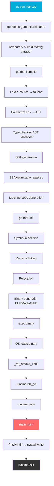

# Hello World in Go — Professional Level (Under the Hood)

## Table of Contents

1. [Introduction](#1-introduction)
2. [How It Works Internally](#2-how-it-works-internally)
3. [Runtime Deep Dive](#3-runtime-deep-dive)
4. [Compiler Perspective](#4-compiler-perspective)
5. [Memory Layout](#5-memory-layout)
6. [OS / Syscall Level](#6-os--syscall-level)
7. [Source Code Walkthrough](#7-source-code-walkthrough)
8. [Assembly Output Analysis](#8-assembly-output-analysis)
9. [Performance Internals](#9-performance-internals)
10. [Edge Cases at the Lowest Level](#10-edge-cases-at-the-lowest-level)
11. [Test](#11-test)
12. [Tricky Questions](#12-tricky-questions)
13. [Summary](#13-summary)
14. [Further Reading](#14-further-reading)

---

## 1. Introduction

Bu bo'limda Hello World dasturining **eng chuqur qatlamlarini** ko'rib chiqamiz — kompilyatordan OS kernelgacha. Oddiy `fmt.Println("Hello, World!")` qatorining ortida yuzlab qatorlik Go runtime kodi, syscall'lar va assembly instructionlar yashiringan.

Mavzular:
- `go run main.go` buyrug'ida nima sodir bo'ladi (bosqichma-bosqich)
- Go binary anatomiyasi (ELF/Mach-O/PE format)
- Runtime init — `main()` dan oldin nima ishlaydi
- Stack setup va main goroutine yaratish
- `runtime.main()` source code walkthrough
- Hello World ning assembly chiqishi
- `fmt.Println` ning syscall chain'i
- Binary hajm tahlili — 1.8MB qaerdan keladi

---

## 2. How It Works Internally

### 2.1 `go run main.go` — To'liq Pipeline

```go
// main.go
package main

import "fmt"

func main() {
    fmt.Println("Hello, World!")
}
```

Bu oddiy kodni `go run main.go` bilan ishga tushirganda quyidagi bosqichlar ketma-ket sodir bo'ladi:



### 2.2 Bosqichlar batafsil

#### Bosqich 1: Kompilyatsiya (`go tool compile`)

```bash
# Kompilyatsiya bosqichlarini ko'rish
go build -x main.go 2>&1 | head -30
```

```
WORK=/tmp/go-build4159381979
mkdir -p $WORK/b001/
cat >/tmp/go-build.../importcfg << 'EOF'
...
EOF
/usr/local/go/pkg/tool/linux_amd64/compile \
    -o $WORK/b001/_pkg_.a \
    -trimpath "$WORK/b001=>" \
    -p main \
    -complete \
    -buildid ... \
    -goversion go1.22.0 \
    ./main.go
/usr/local/go/pkg/tool/linux_amd64/link \
    -o $WORK/b001/exe/a.out \
    -importcfg $WORK/b001/importcfg.link \
    -buildmode=pie \
    -buildid=... \
    -extld=gcc \
    $WORK/b001/_pkg_.a
```

#### Bosqich 2: Lexer (Tokenization)

```
Source:    package main
Tokens:   [PACKAGE] [IDENT:"main"] [SEMICOLON]

Source:    import "fmt"
Tokens:   [IMPORT] [STRING:"fmt"] [SEMICOLON]

Source:    func main() {
Tokens:   [FUNC] [IDENT:"main"] [LPAREN] [RPAREN] [LBRACE]

Source:        fmt.Println("Hello, World!")
Tokens:   [IDENT:"fmt"] [PERIOD] [IDENT:"Println"] [LPAREN] [STRING:"Hello, World!"] [RPAREN] [SEMICOLON]

Source:    }
Tokens:   [RBRACE] [SEMICOLON]
```

**Muhim:** Lexer har qator oxirida avtomatik `SEMICOLON` token qo'shadi (agar qator identifier, literal, yoki `)`, `}`, `++`, `--` bilan tugasa).

#### Bosqich 3: AST (Abstract Syntax Tree)

```bash
# AST ni ko'rish
go build -gcflags="-W" main.go 2>&1
```

```
File{
  Package: main
  Imports: [
    ImportSpec{Path: "fmt"}
  ]
  Decls: [
    FuncDecl{
      Name: main
      Type: FuncType{Params: [], Results: []}
      Body: BlockStmt{
        List: [
          ExprStmt{
            X: CallExpr{
              Fun: SelectorExpr{X: "fmt", Sel: "Println"}
              Args: [BasicLit{Kind: STRING, Value: "Hello, World!"}]
            }
          }
        }
      }
    }
  ]
}
```

#### Bosqich 4: SSA (Static Single Assignment)

```bash
# SSA bosqichlarini ko'rish
GOSSAFUNC=main go build main.go
# ssa.html fayli yaratiladi — brauzerda oching
```

SSA Go kompilyatorining optimization pipeline:
```
1. Initial SSA generation
2. Early deadcode elimination
3. CSE (Common Subexpression Elimination)
4. Prove (bounds check elimination)
5. Lower (machine-specific lowering)
6. Register allocation
7. Stack frame layout
8. Machine code emission
```

#### Bosqich 5: Linking

```bash
# Linker nimalarni birlashtiradi
go build -ldflags="-v" main.go 2>&1
```

Linker quyidagilarni birlashtiradi:
- `main` package compiled object
- `fmt` package
- `runtime` package
- Barcha dependency'lar
- Go runtime (GC, scheduler, network poller)

---

## 3. Runtime Deep Dive

### 3.1 Runtime init — main() dan oldin

`main()` chaqirilishidan oldin Go runtime juda ko'p ish qiladi:

```
1. _rt0_amd64_linux (assembly)
   ├── argc, argv ni stack'dan olish
   └── runtime.rt0_go ga sakrash

2. runtime.rt0_go (assembly + Go)
   ├── CPU feature detection (SSE, AVX, etc.)
   ├── TLS (Thread Local Storage) setup
   ├── g0 stack setup (8KB, system stack)
   ├── m0 (main OS thread) init
   └── runtime.osinit() chaqirish

3. runtime.osinit()
   ├── CPU sonini aniqlash
   ├── Huge page hajmini aniqlash
   └── Physical memory hajmini o'qish

4. runtime.schedinit()
   ├── Stack pool init
   ├── Memory allocator init
   ├── GC init
   ├── GOMAXPROCS o'rnatish
   ├── Network poller init
   └── Timer init

5. runtime.newproc(runtime.main)
   └── Main goroutine yaratish

6. runtime.mstart()
   └── Scheduler ishga tushadi
```

### 3.2 runtime.main() Source Walkthrough

```go
// src/runtime/proc.go (simplified)
func main() {
    g := getg()

    // Max stack size: 64-bit da 1GB, 32-bit da 250MB
    if goarch.PtrSize == 8 {
        maxstacksize = 1000000000
    } else {
        maxstacksize = 250000000
    }

    // Main goroutine ni system stack da ishga tushirish
    // Signal handling setup
    mainStarted = true

    // Sysmon goroutine — preemption, network polling, GC trigger
    if GOARCH != "wasm" {
        systemstack(func() {
            newm(sysmon, nil, -1)
        })
    }

    // Runtime init funksiyalarini chaqirish
    doInit(runtime_inittasks)

    // GC ni yoqish
    gcenable()

    // main package init
    doInit(main_inittasks)

    // main.main() chaqirish
    fn := main_main // main.main linker tomonidan o'rnatiladi
    fn()

    // main tugadi — dasturni to'xtatish
    if raceenabled {
        racefini()
    }

    // Barcha goroutine'larni to'xtatish
    // os.Exit(0) ni chaqirish
    exit(0)
}
```

### 3.3 Goroutine Stack Layout

```
Main Goroutine Stack (initial 8KB, growable to 1GB):

    High Address
    ┌─────────────────────┐
    │   Stack guard        │
    ├─────────────────────┤
    │   main.main() frame │
    │   ├── local vars    │
    │   ├── return addr   │
    │   └── frame pointer │
    ├─────────────────────┤
    │   runtime.main()    │
    │   frame             │
    ├─────────────────────┤
    │   runtime.goexit()  │
    │   (return addr)     │
    ├─────────────────────┤
    │   ...               │
    ├─────────────────────┤
    │   Stack guard page  │
    └─────────────────────┘
    Low Address

g struct:
    ┌─────────────────────┐
    │ stack.lo             │ ← Stack boshlanishi
    │ stack.hi             │ ← Stack tugashi
    │ stackguard0          │ ← Stack overflow check
    │ stackguard1          │
    │ _panic               │
    │ _defer               │
    │ m                    │ ← Tegishli M (OS thread)
    │ sched                │ ← Scheduling info (SP, PC, etc.)
    │ goid                 │ ← Goroutine ID
    │ status               │ ← Running/Waiting/Dead/etc.
    └─────────────────────┘
```

---

## 4. Compiler Perspective

### 4.1 Escape Analysis

```bash
# Escape analysis ko'rish
go build -gcflags="-m -m" main.go 2>&1
```

```
./main.go:7:13: inlining call to fmt.Println
./main.go:7:14: "Hello, World!" escapes to heap:
./main.go:7:14:   flow: {storage for ... argument} = &{storage for "Hello, World!"}:
./main.go:7:14:     from "Hello, World!" (spill) at ./main.go:7:13
./main.go:7:14:   flow: {heap} = {storage for ... argument}:
./main.go:7:14:     from ... argument (passed to call[argument escapes]) at ./main.go:7:13
./main.go:7:13: ... argument does not escape
```

**Tahlil:**
- `"Hello, World!"` string literal — binary'ning `.rodata` seksiyasida
- `fmt.Println` argument sifatida `interface{}` ga wrap qilinadi
- `interface{}` — stack'da (escape qilmaydi)
- `Println` ichida `os.Stdout.Write()` chaqiriladi

### 4.2 Inlining

```bash
# Inlining qarorlarini ko'rish
go build -gcflags="-m" main.go 2>&1
```

```
./main.go:7:13: inlining call to fmt.Println
```

`fmt.Println` **inline** qilinishi mumkin (Go 1.21+ da budget kengaytirilgan). Lekin ichidagi `os.Stdout.Write()` inline qilinmaydi — bu runtime dispatch.

### 4.3 Bounds Check Elimination

```go
package main

import "fmt"

func main() {
    s := []int{1, 2, 3, 4, 5}

    // Bounds check BOR
    fmt.Println(s[3])

    // Bounds check OLIB TASHLANGAN (prove pass)
    for i := 0; i < len(s); i++ {
        fmt.Println(s[i]) // kompilyator len tekshirilganini biladi
    }
}
```

```bash
go build -gcflags="-d=ssa/prove/debug=1" main.go
```

---

## 5. Memory Layout

### 5.1 Go Binary Anatomiyasi (ELF format — Linux)

```bash
# ELF header ko'rish
readelf -h myapp

# Section'lar ro'yxati
readelf -S myapp

# Symbol table
go tool nm myapp | head -20
```

```
ELF Binary Layout:
┌──────────────────────────────────────┐
│ ELF Header                           │  64 bytes
├──────────────────────────────────────┤
│ Program Headers                       │  Segment info
├──────────────────────────────────────┤
│ .text                                 │  Machine code
│   ├── runtime.*                       │  ~500KB
│   ├── fmt.*                           │  ~200KB
│   ├── reflect.*                       │  ~100KB
│   ├── internal/*                      │  ~200KB
│   └── main.*                          │  ~1KB
├──────────────────────────────────────┤
│ .rodata                               │  Read-only data
│   ├── String literals                 │  "Hello, World!\n"
│   ├── Type descriptors                │
│   └── Function metadata               │
├──────────────────────────────────────┤
│ .data                                 │  Initialized global vars
├──────────────────────────────────────┤
│ .bss                                  │  Uninitialized global vars
├──────────────────────────────────────┤
│ .gopclntab                            │  Go PC-line table
│   (stack traces uchun)                │  ~300KB
├──────────────────────────────────────┤
│ .gosymtab                             │  Go symbol table
├──────────────────────────────────────┤
│ .noptrdata                            │  Pointer-free data
├──────────────────────────────────────┤
│ .typelink                             │  Type link table
├──────────────────────────────────────┤
│ Section Headers                       │
└──────────────────────────────────────┘
```

### 5.2 fmt.Println ning Memory Layout

```
fmt.Println("Hello, World!") chaqirilganda:

Stack Frame:
┌───────────────────────────┐
│ return address             │
├───────────────────────────┤
│ []interface{} header       │  ← 24 bytes (ptr + len + cap)
│   ptr → ─────────────┐    │
│   len = 1             │    │
│   cap = 1             │    │
├────────────────────┐  │    │
│ interface{} [0]    │  │    │
│   ├── type ptr ────│──│──→ reflect.Type for string
│   └── data ptr ────│──│──→ string header
│        ├── ptr ────│──│──→ .rodata "Hello, World!"
│        └── len = 13│  │    │
└────────────────────┘  │    │
                        │    │
Heap (agar escape qilsa):   │
┌───────────────────────┐   │
│ interface{} array     │ ◄─┘
│ [0] = {type, data}    │
└───────────────────────┘

.rodata section:
┌───────────────────────────┐
│ "Hello, World!"           │  13 bytes, compile-time constant
└───────────────────────────┘
```

### 5.3 Platform-Specific Binary Formats

| Format | OS | Magic bytes | Header |
|--------|-----|------------|--------|
| ELF | Linux, FreeBSD | `\x7fELF` | 64 bytes |
| Mach-O | macOS, iOS | `\xfe\xed\xfa\xcf` | Variable |
| PE | Windows | `MZ` | 64+ bytes |

```bash
# Linux (ELF)
file myapp-linux
# myapp-linux: ELF 64-bit LSB executable, x86-64, statically linked

# macOS (Mach-O)
file myapp-darwin
# myapp-darwin: Mach-O 64-bit x86_64 executable

# Windows (PE)
file myapp.exe
# myapp.exe: PE32+ executable (console) x86-64
```

---

## 6. OS / Syscall Level

### 6.1 fmt.Println ning Syscall Chain'i

```
fmt.Println("Hello, World!")
    │
    ├── fmt.Fprintln(os.Stdout, "Hello, World!")
    │
    ├── io.Writer.Write() (os.Stdout = *os.File)
    │
    ├── os.(*File).Write([]byte("Hello, World!\n"))
    │
    ├── os.(*File).write([]byte)
    │
    ├── internal/poll.(*FD).Write([]byte)
    │
    ├── syscall.Write(fd=1, p=[]byte("Hello, World!\n"))
    │
    ├── syscall.write(fd=1, p=[]byte) → RawSyscall6
    │
    └── Linux kernel: sys_write(1, "Hello, World!\n", 14)
            │
            └── VFS → terminal driver → ekranga chiqarish
```

### 6.2 strace bilan Syscall Monitoring

```bash
# Go binary ni strace bilan ishga tushirish
go build -o hello main.go
strace -f ./hello 2>&1 | grep -E "write|exit"
```

```
write(1, "Hello, World!\n", 14)         = 14
exit_group(0)                            = ?
```

**To'liq strace (filtrsiz):**

```bash
strace -c ./hello
```

```
Hello, World!
% time     seconds  usecs/call     calls    errors syscall
------ ----------- ----------- --------- --------- --------
 32.14    0.000128          14         9           mmap
 16.08    0.000064          64         1           clone3
 10.55    0.000042          21         2           openat
  8.54    0.000034          34         1           write
  7.54    0.000030          15         2           close
  6.28    0.000025          12         2           read
  5.53    0.000022          22         1           futex
  5.03    0.000020          20         1           sigaltstack
  4.02    0.000016           8         2           rt_sigaction
  2.51    0.000010          10         1           getpid
  1.76    0.000007           7         1           rt_sigprocmask
  0.00    0.000000           0         1           arch_prctl
  0.00    0.000000           0         1           set_tid_address
  0.00    0.000000           0         1           set_robust_list
  0.00    0.000000           0         1           rseq
  0.00    0.000000           0         1           getrandom
  0.00    0.000000           0         1           exit_group
------ ----------- ----------- --------- --------- --------
100.00    0.000398          13        30           total
```

**Tahlil:**
- `mmap` — Go runtime uchun memory mapping (stack, heap)
- `clone3` — sysmon goroutine uchun OS thread
- `write(1, "Hello, World!\n", 14)` — bizning asosiy chiqish
- `futex` — goroutine synchronization
- `sigaltstack` — signal handling stack
- `rt_sigaction` — signal handler registration
- `exit_group(0)` — dastur tugashi

### 6.3 Direct Syscall — fmt o'rniga

```go
package main

import "syscall"

func main() {
    msg := []byte("Hello, World!\n")
    syscall.Write(1, msg) // fd=1 = stdout
}
```

```bash
go build -o hello-syscall main.go
ls -lh hello-syscall
# ~1.2MB (fmt yo'q — ancha kichikroq)

strace -c ./hello-syscall
# write(1, "Hello, World!\n", 14)
# Jami ~20 syscall (fmt bilan ~30)
```

### 6.4 Eng Minimal Hello World

```go
package main

import (
    "os"
)

func main() {
    os.Stdout.WriteString("Hello, World!\n")
}
```

```bash
go build -o hello-minimal main.go
ls -lh hello-minimal
# ~1.3MB (fmt yo'q, reflect yo'q)
```

---

## 7. Source Code Walkthrough

### 7.1 runtime Entry Point (Linux AMD64)

```assembly
// src/runtime/rt0_linux_amd64.s
TEXT _rt0_amd64_linux(SB),NOSPLIT|NOFRAME,$0
    JMP _rt0_amd64(SB)

// src/runtime/asm_amd64.s
TEXT _rt0_amd64(SB),NOSPLIT|NOFRAME,$0
    MOVQ 0(SP), DI      // argc
    LEAQ 8(SP), SI      // argv
    JMP runtime·rt0_go(SB)
```

### 7.2 runtime.rt0_go (Simplified)

```assembly
// src/runtime/asm_amd64.s (simplified)
TEXT runtime·rt0_go(SB),NOSPLIT|TOPFRAME,$0
    // Stack setup
    MOVQ $runtime·g0(SB), DI
    LEAQ (-64*1024)(SP), BX
    MOVQ BX, g_stackguard0(DI)
    MOVQ BX, g_stackguard1(DI)
    MOVQ BX, (g_stack+stack_lo)(DI)
    MOVQ SP, (g_stack+stack_hi)(DI)

    // CPU feature detection
    CALL runtime·check(SB)

    // TLS setup
    LEAQ runtime·m0+m_tls(SB), DI
    CALL runtime·settls(SB)

    // OS init
    CALL runtime·osinit(SB)

    // Scheduler init
    CALL runtime·schedinit(SB)

    // Create main goroutine
    MOVQ $runtime·mainPC(SB), AX  // main goroutine entry
    PUSHQ AX
    CALL runtime·newproc(SB)
    POPQ AX

    // Start scheduler
    CALL runtime·mstart(SB)

    // Should never reach here
    CALL runtime·abort(SB)
```

### 7.3 runtime.main() Source (Go 1.22)

```go
// src/runtime/proc.go (key parts)
func main() {
    mp := getg().m

    // Worldsema = 1 means we can stop the world
    mp.g0.racectx = 0

    // Max stack size
    if goarch.PtrSize == 8 {
        maxstacksize = 1000000000 // 1GB on 64-bit
    } else {
        maxstacksize = 250000000  // 250MB on 32-bit
    }

    // Allow newproc to start new Ms
    mainStarted = true

    if GOARCH != "wasm" {
        // Start sysmon (background monitoring thread)
        systemstack(func() {
            newm(sysmon, nil, -1)
        })
    }

    // Lock main goroutine to main OS thread (for cgo, GUI, etc.)
    lockOSThread()

    // Run runtime init tasks
    doInit(runtime_inittasks) // runtime.init()

    // Enable GC
    gcenable()

    // Run main package init tasks
    doInit(main_inittasks) // main.init()

    // Unlock main goroutine (unless GOMAXPROCS is being used by cgo)
    unlockOSThread()

    // Call main.main
    fn := main_main
    fn()

    // Reaching here means main returned
    if raceenabled {
        runExitHooks(0)
        racefini()
    }

    // Panic if main goroutine exits normally but there are
    // other goroutines still running? No — they just get killed.

    exit(0) // this kills all goroutines
}
```

---

## 8. Assembly Output Analysis

### 8.1 Hello World Assembly

```bash
# Assembly chiqishini ko'rish
go build -gcflags="-S" main.go 2>&1 | head -80
```

```assembly
# main.main (simplified, amd64)
TEXT main.main(SB), ABIInternal, $56-0
    # Stack frame setup
    MOVQ (TLS), CX              # goroutine g pointer
    CMPQ SP, 16(CX)             # stack overflow check
    PCDATA $0, $-2
    JLS main_main_stack_grow     # grow stack if needed
    PCDATA $0, $-1

    # Frame pointer setup
    SUBQ $56, SP                 # allocate 56 bytes
    MOVQ BP, 48(SP)              # save frame pointer
    LEAQ 48(SP), BP              # new frame pointer

    # Prepare fmt.Println arguments
    # interface{} slice: {type, data}
    LEAQ type:string(SB), AX     # string type descriptor
    MOVQ AX, 24(SP)              # interface type pointer

    LEAQ go:string."Hello, World!"(SB), AX  # string data
    MOVQ AX, 32(SP)              # interface data pointer
    MOVQ $13, 40(SP)             # string length

    # Build []interface{} slice
    LEAQ 24(SP), AX              # slice data pointer
    MOVQ AX, (SP)                # arg 0: slice.ptr
    MOVQ $1, 8(SP)               # arg 1: slice.len
    MOVQ $1, 16(SP)              # arg 2: slice.cap

    # Call fmt.Println
    CALL fmt.Println(SB)

    # Frame teardown
    MOVQ 48(SP), BP              # restore frame pointer
    ADDQ $56, SP                 # deallocate frame
    RET

main_main_stack_grow:
    CALL runtime.morestack_noctxt(SB)
    JMP main.main(SB)           # retry
```

### 8.2 Stack Overflow Check

Har bir funksiya boshida Go **stack overflow check** qiladi:

```assembly
MOVQ (TLS), CX              # CX = current goroutine (g)
CMPQ SP, 16(CX)             # SP < g.stackguard0 ?
JLS grow_stack               # Ha → stack kengaytirish

# ...function body...

grow_stack:
    CALL runtime.morestack(SB)  # Yangi, kattaroq stack ajratish
    JMP function_start          # Funksiyani qayta boshlash
```

**Qanday ishlaydi:**
1. Go stack 8KB bilan boshlanadi (goroutine uchun)
2. Har bir funksiya SP ni `stackguard0` bilan solishtiradi
3. Agar joy yetmasa — `runtime.morestack` yangi stack ajratadi (2x katta)
4. Eski stack yangi stack'ga **ko'chiriladi** (pointer'lar yangilanadi)
5. Funksiya qaytadan boshlanadi

### 8.3 objdump bilan Binary Tahlili

```bash
# Barcha funksiyalar va hajmlari
go tool nm -size myapp | sort -rnk2 | head -20

# Disassemble
go tool objdump -s main.main myapp

# yoki
objdump -d -M intel myapp | grep -A 30 "main.main"
```

---

## 9. Performance Internals

### 9.1 Binary Size Breakdown

```bash
# Binary hajm tahlili
go build -o hello main.go
ls -lh hello
# 1.8MB

# Section hajmlari
size hello
#    text	   data	    bss	    dec	    hex	filename
# 1155072	 153600	 178976	1487648	 16b3a0	hello

# Eng katta symbollar
go tool nm -size hello | sort -rnk2 | head -15
```

**Taxminiy hajm taqsimoti (Hello World):**

| Komponent | Hajm | Foiz |
|-----------|------|------|
| `runtime` (scheduler, GC, memory) | ~600KB | 33% |
| `fmt` (formatting, reflection) | ~200KB | 11% |
| `reflect` | ~150KB | 8% |
| `.gopclntab` (stack traces) | ~300KB | 17% |
| `internal/*` packages | ~200KB | 11% |
| `.rodata` (strings, type info) | ~200KB | 11% |
| Boshqa | ~150KB | 9% |
| **Jami** | **~1.8MB** | **100%** |

### 9.2 fmt.Println Internal Cost

```go
// fmt.Println ichida nima sodir bo'ladi (simplified):
func Println(a ...any) (n int, err error) {
    // 1. pp (print state) pool'dan olish
    p := newPrinter()         // sync.Pool dan — alloc yo'q

    // 2. Har bir argument uchun
    for i, arg := range a {
        if i > 0 {
            p.buf.writeByte(' ')  // argumentlar orasiga bo'sh joy
        }
        p.printArg(arg, 'v')     // reflection-based formatting
    }
    p.buf.writeByte('\n')        // yangi qator

    // 3. os.Stdout ga yozish
    n, err = os.Stdout.Write(p.buf)

    // 4. pp ni pool'ga qaytarish
    p.free()                     // sync.Pool ga qaytarish

    return
}
```

**Performance xarajatlari:**
1. `sync.Pool.Get()` — ~10ns
2. `interface{}` type switch — ~5ns per arg
3. `reflect` (agar kerak bo'lsa) — ~50-200ns
4. Buffer write — ~5ns
5. `os.Stdout.Write` → syscall — ~500-2000ns
6. `sync.Pool.Put()` — ~10ns

**Jami:** ~600-2300ns bitta `fmt.Println` uchun

### 9.3 Startup Time Breakdown

```bash
# Startup vaqtini o'lchash
time ./hello
# real    0m0.002s
# user    0m0.001s
# sys     0m0.001s
```

**Startup bosqichlari va taxminiy vaqti:**

| Bosqich | Vaqt (taxminiy) |
|---------|----------------|
| OS binary yuklash (mmap) | ~200us |
| `_rt0_amd64_linux` → `rt0_go` | ~10us |
| CPU feature detection | ~5us |
| TLS setup | ~10us |
| `osinit` | ~20us |
| `schedinit` (GC, memory, etc.) | ~100us |
| `sysmon` thread yaratish | ~50us |
| `runtime.init` | ~50us |
| `main.init` | ~5us |
| `main.main` | ~1us (bizning kod) |
| `fmt.Println` → syscall | ~2us |
| **Jami** | **~500us - 2ms** |

---

## 10. Edge Cases at the Lowest Level

### 10.1 Stack Growth Chain

```go
package main

import (
    "fmt"
    "runtime"
)

func recursive(depth int) {
    var buf [1024]byte // 1KB stack alloc
    _ = buf
    if depth > 0 {
        recursive(depth - 1)
    }
}

func main() {
    var m1, m2 runtime.MemStats

    runtime.ReadMemStats(&m1)
    recursive(10000) // ~10MB stack kerak
    runtime.ReadMemStats(&m2)

    fmt.Printf("Stack sys: %d KB → %d KB\n",
        m1.StackSys/1024, m2.StackSys/1024)
    fmt.Printf("Stack inuse: %d KB → %d KB\n",
        m1.StackInuse/1024, m2.StackInuse/1024)
}
```

### 10.2 fmt.Println va nil interface

```go
package main

import "fmt"

func main() {
    var i interface{} = nil

    // nil interface — type = nil, value = nil
    fmt.Println(i)       // <nil>
    fmt.Printf("%v\n", i) // <nil>
    fmt.Printf("%T\n", i) // <nil> (type ham nil)

    // Non-nil interface with nil value
    var p *int = nil
    var j interface{} = p

    fmt.Println(j)       // <nil>
    fmt.Printf("%v\n", j) // <nil>
    fmt.Printf("%T\n", j) // *int (type bor!)
    fmt.Println(j == nil) // false! (type != nil)
}
```

### 10.3 Write Syscall partial write

```go
package main

import (
    "fmt"
    "os"
)

func main() {
    // fmt.Println ichida os.Stdout.Write chaqiriladi
    // Agar write syscall to'liq yozmasa (masalan, pipe broken),
    // Go runtime qayta urinadi

    n, err := fmt.Println("Hello, World!")
    if err != nil {
        fmt.Fprintf(os.Stderr, "write error: %v (wrote %d bytes)\n", err, n)
        os.Exit(1)
    }
}
```

```bash
# Broken pipe simulatsiyasi
./hello | head -c 5
# Hello — keyin SIGPIPE signal
```

### 10.4 GOMAXPROCS va Hello World

```go
package main

import (
    "fmt"
    "runtime"
)

func main() {
    fmt.Println("GOMAXPROCS:", runtime.GOMAXPROCS(0))
    fmt.Println("NumCPU:", runtime.NumCPU())
    fmt.Println("NumGoroutine:", runtime.NumGoroutine())
    // NumGoroutine = 1 (main) + agar sysmon ishlayotgan bo'lsa
}
```

```bash
GOMAXPROCS=1 ./hello
# GOMAXPROCS: 1
# NumCPU: 8
# NumGoroutine: 1
```

---

## 11. Test

### 1-savol
`go run main.go` buyrug'ining birinchi bosqichi nima?

- A) Assembly generation
- B) Lexing (tokenization)
- C) Linking
- D) Runtime init

<details>
<summary>Javob</summary>

**B)** Birinchi bosqich **Lexing (tokenization)** — source code tokenlar (PACKAGE, IDENT, STRING, etc.) ga ajratiladi. Keyin parsing → type checking → SSA → code gen → linking.

</details>

### 2-savol
Go binary (Hello World) ~1.8MB qayerdan keladi?

- A) Faqat main.go kodi
- B) Runtime (GC, scheduler) + fmt + reflect + metadata
- C) Debug symbols
- D) Source code binary ichida

<details>
<summary>Javob</summary>

**B)** Runtime (~600KB), fmt (~200KB), reflect (~150KB), .gopclntab (~300KB), boshqa internal paketlar. Go runtime to'liq statik linklanadi.

</details>

### 3-savol
`fmt.Println("Hello")` nechta syscall chaqiradi?

- A) 0
- B) 1 (write)
- C) 3 (open, write, close)
- D) 10+

<details>
<summary>Javob</summary>

**B)** Asosiy syscall faqat bitta — `write(1, "Hello\n", 6)`. `os.Stdout` dastur boshida ochilgan (fd=1), shuning uchun `open` kerak emas.

</details>

### 4-savol
Go goroutine stack hajmi qancha bilan boshlanadi?

- A) 1KB
- B) 8KB
- C) 64KB
- D) 1MB

<details>
<summary>Javob</summary>

**B)** Go 1.4+ da goroutine stack **8KB** bilan boshlanadi (oldingi versiyalarda 4KB edi). Kerak bo'lsa avtomatik kengayadi, 64-bit da 1GB gacha.

</details>

### 5-savol
`runtime.main()` `main.main()` dan oldin nima qiladi?

- A) Hech narsa
- B) Faqat GC init
- C) osinit, schedinit, sysmon, runtime init, GC enable, main init
- D) Faqat sysmon

<details>
<summary>Javob</summary>

**C)** To'liq tartib: `osinit()` → `schedinit()` → sysmon goroutine → `runtime_inittasks` → `gcenable()` → `main_inittasks` → `main.main()`.

</details>

### 6-savol
`.gopclntab` section nima uchun?

- A) GC uchun
- B) Stack trace va panic xabarlari uchun (PC → fayl:qator mapping)
- C) Network uchun
- D) Binary hajmini kamaytirish uchun

<details>
<summary>Javob</summary>

**B)** `.gopclntab` (Go PC-line table) — program counter'ni source fayl va qator raqamiga mapping qiladi. `panic`, `runtime.Stack()`, va profiling uchun ishlatiladi. ~300KB (~17% binary).

</details>

### 7-savol
Agar `fmt` o'rniga `syscall.Write(1, []byte("Hello\n"))` ishlatsak binary hajmi qanday o'zgaradi?

- A) O'zgarmaydi
- B) ~30% kamayadi (~1.2MB)
- C) ~90% kamayadi (~200KB)
- D) Kattaroq bo'ladi

<details>
<summary>Javob</summary>

**B)** `fmt` package ~200KB, `reflect` ~150KB, `strconv` va boshqalar kerak emas. Binary ~1.2-1.3MB ga tushadi. Runtime hali ham ~600KB.

</details>

### 8-savol
Go stack overflow check qachon amalga oshiriladi?

- A) Faqat main() da
- B) Har bir funksiya chaqiruvida (function prologue)
- C) Faqat recursive funksiyalarda
- D) GC paytida

<details>
<summary>Javob</summary>

**B)** Deyarli har bir funksiya boshida SP `stackguard0` bilan solishtiriladi. Agar yetmasa — `runtime.morestack` chaqiriladi. Ba'zi kichik `NOSPLIT` funksiyalar bundan mustasno.

</details>

### 9-savol
`strace ./hello` natijasida `clone3` syscall nima uchun?

- A) main goroutine uchun
- B) GC uchun
- C) sysmon OS thread uchun
- D) fmt uchun

<details>
<summary>Javob</summary>

**C)** `clone3` — **sysmon** uchun yangi OS thread yaratish. Sysmon preemptive scheduling, network polling, va GC trigger qilish uchun background'da ishlaydi. Main goroutine uchun alohida OS thread yaratilmaydi (m0 ishlatiladi).

</details>

### 10-savol
Go binary qaysi formatda yaratiladi (Linux)?

- A) PE
- B) Mach-O
- C) ELF
- D) COFF

<details>
<summary>Javob</summary>

**C)** Linux'da ELF (Executable and Linkable Format). macOS da Mach-O, Windows da PE (Portable Executable). Go cross-compilation paytida maqsadli OS format'ini yaratadi.

</details>

---

## 12. Tricky Questions

### 1-savol
Go binary `_rt0_amd64_linux` dan boshlanadi. Agar `main.main()` panic qilsa, `os.Exit` chaqirilmasdan dastur qanday tugaydi?

<details>
<summary>Javob</summary>

Panic holati:
1. `runtime.gopanic()` chaqiriladi
2. Defer'lar stack'dan teskari tartibda ishlatiladi
3. Agar `recover()` yo'q — `runtime.fatalpanic()` chaqiriladi
4. Stack trace stderr ga chiqariladi
5. `runtime.exit(2)` chaqiriladi — **exit code 2**
6. OS process'ni tugatadi

Muhim: panic da exit code **2**, `os.Exit(1)` da **1**, normal tugashda **0**.

</details>

### 2-savol
`sync.Pool` `fmt.Println` da qanday ishlatiladi va nima uchun muhim?

<details>
<summary>Javob</summary>

`fmt` package ichida `pp` (print state) struct'lari `sync.Pool` da saqlanadi:

```go
var ppFree = sync.Pool{
    New: func() any { return new(pp) },
}

func newPrinter() *pp {
    p := ppFree.Get().(*pp)
    p.panicking = false
    p.erroring = false
    p.wrapErrs = false
    p.fmt.init(&p.buf)
    return p
}
```

**Nima uchun muhim:**
- Har bir `Println` chaqiruvida yangi `pp` struct alloc qilmaslik
- GC pressure kamaytirish
- Hot path'da zero-allocation
- GC cycle'da pool tozalanadi — leak yo'q

</details>

### 3-savol
Go binary statik linklanadi deyiladi. Agar CGO ishlatilsa nima bo'ladi?

<details>
<summary>Javob</summary>

`CGO_ENABLED=1` holda Go binary **dynamic linking** ga o'tadi:
- `libc.so`, `libpthread.so` va boshqa C kutubxonalari dynamic link qilinadi
- Binary hajmi kichikroq, lekin **runtime dependency** paydo bo'ladi
- `ldd ./myapp` dependency'larni ko'rsatadi
- `scratch` Docker image'da ishlamaydi — `alpine` yoki `debian` kerak
- Cross-compilation murakkablashadi — target platformaning C compiler kerak

```bash
# CGO bilan
CGO_ENABLED=1 go build -o app .
ldd app  # libc.so.6, libpthread.so.0, ...

# CGO'siz
CGO_ENABLED=0 go build -o app .
ldd app  # not a dynamic executable
```

</details>

### 4-savol
`runtime.morestack` chaqirilganda eski stack'dagi pointer'lar nima bo'ladi?

<details>
<summary>Javob</summary>

Go **copying stack** ishlatadi (segmented stack emas):

1. Yangi stack ajratiladi (2x katta)
2. Eski stack **butunlay** yangi stack'ga ko'chiriladi
3. **Barcha pointer'lar yangilanadi** — Go runtime stack'dagi har bir pointer'ni biladi (GC metadata orqali)
4. Goroutine struct'dagi stack lo/hi yangilanadi
5. Eski stack free qilinadi

Bu Go'ning **garbage collector** bilan chambarchas bog'liq — GC stack'dagi pointer'larni allaqachon bilishi kerak (GC uchun), shuning uchun stack ko'chirish ham mumkin bo'ladi.

**Muhim:** C pointer'lari (CGO orqali) stack ko'chirishda **yangilanmaydi** — shuning uchun CGO chaqiruvlari system stack'da ishlaydi.

</details>

### 5-savol
Nima uchun Go Hello World ~30 ta syscall qiladi (strace), lekin C'da faqat ~5?

<details>
<summary>Javob</summary>

Go runtime C runtime'dan ko'ra ancha ko'p ish qiladi:

| Go Syscalls | Sabab |
|------------|-------|
| `mmap` x 9 | Stack, heap, GC bitmap, arena |
| `clone3` x 1 | sysmon OS thread |
| `sigaltstack` x 1 | Signal handling stack |
| `rt_sigaction` x 2 | SIGURG, SIGPIPE handler |
| `futex` x 1 | Thread synchronization |
| `openat` + `read` | `/proc/self/auxv` (CPU features) |
| `getrandom` x 1 | Crypto random seed |
| `write` x 1 | Bizning "Hello, World!" |
| `exit_group` x 1 | Dastur tugashi |

C'da:
```c
#include <unistd.h>
int main() { write(1, "Hello\n", 6); return 0; }
```
Faqat: `execve`, `brk`, `write`, `exit_group` — ~5 syscall.

Go'ning "bepul" runtime xarajati ~25 qo'shimcha syscall.

</details>

---

## 13. Summary

- **`go run`** = compile (lex → parse → type check → SSA → codegen) + link + exec
- **Binary anatomy** — ELF/Mach-O/PE format, runtime ~600KB statik linklanadi
- **Runtime init** — `_rt0_amd64_linux` → `rt0_go` → `osinit` → `schedinit` → `sysmon` → `runtime.init` → `gcenable` → `main.init` → `main.main`
- **Goroutine stack** — 8KB boshlanadi, 1GB gacha o'sadi, copying stack mexanizmi
- **`fmt.Println` chain** — `Println` → `Fprintln` → `os.File.Write` → `poll.FD.Write` → `syscall.Write` → kernel `sys_write`
- **Stack overflow check** — har bir funksiya boshida SP vs stackguard0
- **Binary hajm** — runtime (33%) + fmt/reflect (19%) + .gopclntab (17%) + boshqa
- **~30 syscall** oddiy Hello World uchun (runtime setup)
- **Startup** — ~500us-2ms (runtime init dominant)
- **`sync.Pool`** — fmt performance uchun, zero-alloc hot path

---

## 14. Further Reading

| Resurs | Havola |
|--------|--------|
| Go Runtime Source | [https://github.com/golang/go/tree/master/src/runtime](https://github.com/golang/go/tree/master/src/runtime) |
| Go Compiler Source | [https://github.com/golang/go/tree/master/src/cmd/compile](https://github.com/golang/go/tree/master/src/cmd/compile) |
| Go Assembly Guide | [https://go.dev/doc/asm](https://go.dev/doc/asm) |
| Go Internals (Book) | [https://github.com/teh-cmc/go-internals](https://github.com/teh-cmc/go-internals) |
| GC Design Doc | [https://go.dev/s/go15gcpacing](https://go.dev/s/go15gcpacing) |
| Stack Growth Design | [https://docs.google.com/document/d/1wAaf1rYoM4nBasGLerWwA_dxQcmm5iqanNbiv-RTSL0/](https://docs.google.com/document/d/1wAaf1rYoM4nBasGLerWwA_dxQcmm5iqanNbiv-RTSL0/) |
| SSA Intro | [https://go.dev/blog/ssa](https://go.dev/blog/ssa) |
| fmt Source Code | [https://github.com/golang/go/tree/master/src/fmt](https://github.com/golang/go/tree/master/src/fmt) |
| Scheduling in Go | [https://www.ardanlabs.com/blog/2018/08/scheduling-in-go-part1.html](https://www.ardanlabs.com/blog/2018/08/scheduling-in-go-part1.html) |
