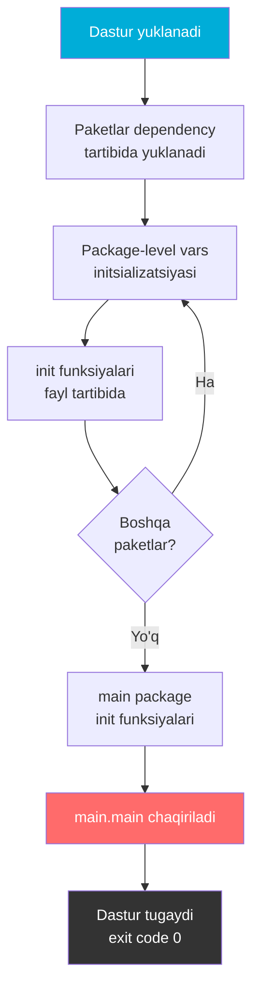
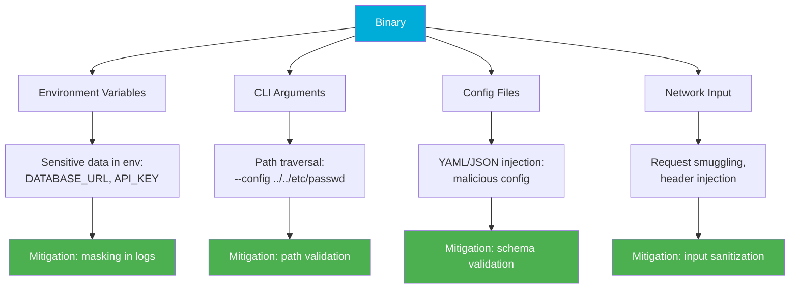
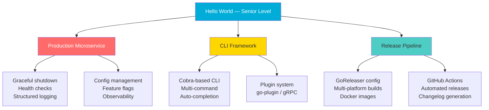

# Hello World in Go — Senior Level

## Table of Contents

1. [Introduction](#1-introduction)
2. [Core Concepts](#2-core-concepts)
3. [Pros & Cons](#3-pros--cons)
4. [Use Cases](#4-use-cases)
5. [Code Examples](#5-code-examples)
6. [Product Use / Feature](#6-product-use--feature)
7. [Error Handling](#7-error-handling)
8. [Security Considerations](#8-security-considerations)
9. [Performance Optimization](#9-performance-optimization)
10. [Debugging Guide](#10-debugging-guide)
11. [Best Practices](#11-best-practices)
12. [Edge Cases & Pitfalls](#12-edge-cases--pitfalls)
13. [Common Mistakes](#13-common-mistakes)
14. [Tricky Points](#14-tricky-points)
15. [Comparison with Other Languages](#15-comparison-with-other-languages)
16. [Test](#16-test)
17. [Tricky Questions](#17-tricky-questions)
18. [Cheat Sheet](#18-cheat-sheet)
19. [Summary](#19-summary)
20. [What You Can Build](#20-what-you-can-build)
21. [Further Reading](#21-further-reading)
22. [Related Topics](#22-related-topics)

---

## 1. Introduction

Senior darajada Hello World mavzusi **arxitektura** va **optimizatsiya** nuqtai nazaridan ko'rib chiqiladi. Bu bo'limda siz quyidagilarni o'rganasiz:

- Go spetsifikatsiyasidagi aniq initsializatsiya tartibi
- `main` package design patterns (thin main, run pattern, command pattern)
- Graceful shutdown mexanizmlari
- Build tags va conditional compilation strategiyalari
- `-ldflags` bilan version embedding
- Multi-platform build strategiyalari
- GoReleaser bilan professional release pipeline

**Fokus:** Optimize / Architect — production-grade dasturlar qanday tuziladi.

---

## 2. Core Concepts

### 2.1 Go Initialization Order — Specification Reference

Go spec ([Program initialization and execution](https://go.dev/ref/spec#Program_initialization_and_execution)) bo'yicha aniq tartib:

```
1. Barcha import qilingan packagelar dependency graph bo'yicha init qilinadi
   (har bir package faqat bir marta)
2. Har bir package ichida:
   a. Package-level o'zgaruvchilar deklaratsiya tartibida init qilinadi
      (lekin dependency bo'lsa — dependency birinchi)
   b. init() funksiyalari source fayl tartibida chaqiriladi
      (bitta faylda bir nechta init() bo'lsa — yozilish tartibida)
3. main package init() chaqiriladi
4. main.main() chaqiriladi
```



### Dependency tartibi bilan murakkab misol:

```go
// === pkg/database/db.go ===
package database

import "fmt"

var Connection = func() string {
    fmt.Println("1. database: var Connection init")
    return "postgres://localhost:5432"
}()

func init() {
    fmt.Println("2. database: init()")
}
```

```go
// === pkg/cache/cache.go ===
package cache

import (
    "fmt"
    "myapp/pkg/database" // database ga bog'liq
)

var Store = func() string {
    fmt.Println("3. cache: var Store init (uses db:", database.Connection, ")")
    return "redis://localhost:6379"
}()

func init() {
    fmt.Println("4. cache: init()")
}
```

```go
// === main.go ===
package main

import (
    "fmt"
    "myapp/pkg/cache"
)

func init() {
    fmt.Println("5. main: init()")
}

func main() {
    fmt.Println("6. main() — cache:", cache.Store)
}
```

```
1. database: var Connection init
2. database: init()
3. cache: var Store init (uses db: postgres://localhost:5432)
4. cache: init()
5. main: init()
6. main() — cache: redis://localhost:6379
```

### 2.2 Main Package Design Patterns

#### Pattern 1: Thin Main (tavsiya qilinadi)

```go
// cmd/server/main.go
package main

import (
    "fmt"
    "os"

    "myapp/internal/app"
)

func main() {
    if err := app.Run(os.Args[1:]); err != nil {
        fmt.Fprintf(os.Stderr, "error: %v\n", err)
        os.Exit(1)
    }
}
```

```go
// internal/app/app.go
package app

import "fmt"

func Run(args []string) error {
    fmt.Println("Dastur ishga tushdi")
    // Barcha logika shu yerda
    return nil
}
```

**Afzalliklari:**
- `main()` test qilinishi shart emas — barcha logika `app.Run()` da
- `app.Run()` ni test qilish oson — `os.Exit` yo'q
- defer'lar ishlaydi

#### Pattern 2: Command Pattern (Cobra-style)

```go
// cmd/myapp/main.go
package main

import (
    "context"
    "fmt"
    "os"
    "os/signal"
    "syscall"
)

type App struct {
    Version string
    Config  *Config
}

type Config struct {
    Port    int
    Debug   bool
    LogFile string
}

func main() {
    ctx, cancel := signal.NotifyContext(context.Background(),
        syscall.SIGINT, syscall.SIGTERM)
    defer cancel()

    app := &App{
        Version: "1.0.0",
        Config: &Config{
            Port:  8080,
            Debug: false,
        },
    }

    if err := app.Run(ctx); err != nil {
        fmt.Fprintf(os.Stderr, "error: %v\n", err)
        os.Exit(1)
    }
}

func (a *App) Run(ctx context.Context) error {
    fmt.Printf("Starting %s v%s on port %d\n", "myapp", a.Version, a.Config.Port)

    // Context bilan graceful wait
    <-ctx.Done()
    fmt.Println("\nShutting down...")
    return nil
}
```

#### Pattern 3: Multi-Command Binary

```
myapp/
├── cmd/
│   ├── server/
│   │   └── main.go      // go build -o server ./cmd/server
│   ├── worker/
│   │   └── main.go      // go build -o worker ./cmd/worker
│   └── cli/
│       └── main.go      // go build -o cli ./cmd/cli
├── internal/
│   ├── server/
│   ├── worker/
│   └── shared/
├── go.mod
└── Makefile
```

### 2.3 Graceful Shutdown

```go
package main

import (
    "context"
    "fmt"
    "net/http"
    "os"
    "os/signal"
    "syscall"
    "time"
)

func main() {
    // Signal kontekst
    ctx, stop := signal.NotifyContext(context.Background(),
        syscall.SIGINT, syscall.SIGTERM)
    defer stop()

    // HTTP server
    mux := http.NewServeMux()
    mux.HandleFunc("/", func(w http.ResponseWriter, r *http.Request) {
        fmt.Fprintln(w, "Hello, World!")
    })

    srv := &http.Server{
        Addr:    ":8080",
        Handler: mux,
    }

    // Serverning asinxron ishga tushirilishi
    go func() {
        fmt.Println("Server :8080 da ishga tushdi")
        if err := srv.ListenAndServe(); err != http.ErrServerClosed {
            fmt.Fprintf(os.Stderr, "server error: %v\n", err)
        }
    }()

    // Signal kutish
    <-ctx.Done()
    fmt.Println("\nSignal qabul qilindi, graceful shutdown...")

    // Shutdown timeout
    shutdownCtx, cancel := context.WithTimeout(context.Background(), 10*time.Second)
    defer cancel()

    if err := srv.Shutdown(shutdownCtx); err != nil {
        fmt.Fprintf(os.Stderr, "shutdown error: %v\n", err)
        os.Exit(1)
    }

    fmt.Println("Server muvaffaqiyatli to'xtadi")
}
```

### 2.4 Build Tags — Advanced

```go
// === feature_cache.go ===
//go:build feature_cache

package main

import "fmt"

func init() {
    fmt.Println("Cache feature yoqilgan")
    registerFeature("cache")
}
```

```go
// === feature_metrics.go ===
//go:build feature_metrics

package main

import "fmt"

func init() {
    fmt.Println("Metrics feature yoqilgan")
    registerFeature("metrics")
}
```

```go
// === features.go ===
package main

var enabledFeatures []string

func registerFeature(name string) {
    enabledFeatures = append(enabledFeatures, name)
}
```

```go
// === main.go ===
package main

import "fmt"

func main() {
    fmt.Println("Yoqilgan featurelar:", enabledFeatures)
}
```

```bash
# Hech qanday feature yo'q
go build -o app .
./app
# Yoqilgan featurelar: []

# Cache bilan
go build -tags feature_cache -o app .
./app
# Cache feature yoqilgan
# Yoqilgan featurelar: [cache]

# Ikkalasi bilan
go build -tags "feature_cache,feature_metrics" -o app .
./app
# Cache feature yoqilgan
# Metrics feature yoqilgan
# Yoqilgan featurelar: [cache metrics]
```

### 2.5 -ldflags bilan Version Embedding

```go
package main

import (
    "fmt"
    "os"
    "runtime"
)

// Bu o'zgaruvchilar -ldflags bilan to'ldiriladi
var (
    version   = "dev"
    commit    = "unknown"
    buildDate = "unknown"
    goVersion = runtime.Version()
)

func main() {
    if len(os.Args) > 1 && os.Args[1] == "version" {
        fmt.Printf("Version:    %s\n", version)
        fmt.Printf("Commit:     %s\n", commit)
        fmt.Printf("Build Date: %s\n", buildDate)
        fmt.Printf("Go Version: %s\n", goVersion)
        fmt.Printf("OS/Arch:    %s/%s\n", runtime.GOOS, runtime.GOARCH)
        return
    }

    fmt.Printf("MyApp %s\n", version)
    fmt.Println("Hello, World!")
}
```

```bash
# Development
go run main.go version
# Version:    dev
# Commit:     unknown
# Build Date: unknown

# Production build
go build -ldflags "\
  -X main.version=1.2.3 \
  -X main.commit=$(git rev-parse --short HEAD) \
  -X 'main.buildDate=$(date -u +%Y-%m-%dT%H:%M:%SZ)' \
  -s -w" \
  -o myapp main.go

./myapp version
# Version:    1.2.3
# Commit:     a1b2c3d
# Build Date: 2024-01-15T14:30:45Z
# Go Version: go1.22.0
# OS/Arch:    linux/amd64
```

**ldflags parametrlari:**

| Flag | Tavsif |
|------|--------|
| `-X main.var=val` | Package-level string o'zgaruvchiga qiymat berish |
| `-s` | Symbol table'ni o'chirish (binary kichikroq) |
| `-w` | DWARF debug info'ni o'chirish (binary kichikroq) |

### 2.6 Go 1.18+ embed bilan Version

```go
package main

import (
    _ "embed"
    "fmt"
    "strings"
)

//go:embed version.txt
var version string

func main() {
    fmt.Printf("Version: %s\n", strings.TrimSpace(version))
}
```

```bash
echo "1.2.3" > version.txt
go build -o app .
./app
# Version: 1.2.3
```

### 2.7 Multi-Platform Build Script

```makefile
# Makefile
APP_NAME := myapp
VERSION := $(shell git describe --tags --always --dirty)
COMMIT := $(shell git rev-parse --short HEAD)
BUILD_DATE := $(shell date -u +%Y-%m-%dT%H:%M:%SZ)
LDFLAGS := -s -w \
    -X main.version=$(VERSION) \
    -X main.commit=$(COMMIT) \
    -X main.buildDate=$(BUILD_DATE)

PLATFORMS := linux/amd64 linux/arm64 darwin/amd64 darwin/arm64 windows/amd64

.PHONY: build build-all clean test

build:
	go build -ldflags "$(LDFLAGS)" -o bin/$(APP_NAME) ./cmd/$(APP_NAME)

build-all:
	@for platform in $(PLATFORMS); do \
		os=$${platform%/*}; \
		arch=$${platform#*/}; \
		output=bin/$(APP_NAME)-$$os-$$arch; \
		if [ "$$os" = "windows" ]; then output=$$output.exe; fi; \
		echo "Building $$output..."; \
		GOOS=$$os GOARCH=$$arch go build -ldflags "$(LDFLAGS)" \
			-o $$output ./cmd/$(APP_NAME); \
	done

test:
	go test -v -race -count=1 ./...

clean:
	rm -rf bin/

lint:
	golangci-lint run ./...
```

### 2.8 GoReleaser Configuration

```yaml
# .goreleaser.yaml
version: 2

project_name: myapp

before:
  hooks:
    - go mod tidy
    - go test ./...

builds:
  - id: myapp
    main: ./cmd/myapp
    env:
      - CGO_ENABLED=0
    goos:
      - linux
      - darwin
      - windows
    goarch:
      - amd64
      - arm64
    ldflags:
      - -s -w
      - -X main.version={{.Version}}
      - -X main.commit={{.ShortCommit}}
      - -X main.buildDate={{.Date}}

archives:
  - id: default
    format: tar.gz
    format_overrides:
      - goos: windows
        format: zip
    name_template: "{{ .ProjectName }}_{{ .Version }}_{{ .Os }}_{{ .Arch }}"

checksum:
  name_template: "checksums.txt"

changelog:
  sort: asc
  filters:
    exclude:
      - "^docs:"
      - "^test:"
      - "^chore:"

release:
  github:
    owner: myorg
    name: myapp
```

```bash
# GoReleaser o'rnatish
go install github.com/goreleaser/goreleaser@latest

# Local test build
goreleaser build --snapshot --clean

# Release (CI/CD da)
goreleaser release --clean
```

---

## 3. Pros & Cons

### Strategik afzalliklar:

| Afzallik | Strategik ta'sir |
|----------|-----------------|
| **Yagona binary deployment** | Container image hajmi minimal, startup tez |
| **Cross-compilation built-in** | CI/CD pipeline sodda — bitta build step |
| **Deterministik build** | Reproducible builds — `go.sum` bilan dependency locking |
| **Fast compile** | Developer feedback loop tez — CI/CD vaqti kam |
| **Static linking default** | Runtime dependency yo'q — ops xarajati kam |
| **`-ldflags` embedding** | Binary ichida metadata — versiya, commit, build info |

### Strategik kamchiliklar:

| Kamchilik | Mitigatsiya |
|-----------|-------------|
| **Binary hajmi (2-15MB)** | `-s -w` flags, UPX compression, `scratch` Docker image |
| **`init()` implicit tartib** | Explicit init pattern, `wire` yoki `fx` DI |
| **CGO cross-compilation murakkab** | `CGO_ENABLED=0` yoki `zig cc` as cross-compiler |
| **No dynamic plugins (native)** | `plugin` package (Linux only), HashiCorp go-plugin (gRPC) |
| **No hot reload** | `air`, `CompileDaemon` development uchun |

---

## 4. Use Cases

| Use Case | Pattern | Misol |
|----------|---------|-------|
| **Microservice** | Thin main + graceful shutdown | Kubernetes pod |
| **CLI tool** | Command pattern + ldflags | kubectl, terraform |
| **System daemon** | Signal handling + PID file | systemd service |
| **Lambda/Serverless** | Single function entry | AWS Lambda Go runtime |
| **Multi-tenant SaaS** | Feature flags + build tags | Conditional compilation |
| **Embedded systems** | Minimal binary + GOARCH | IoT gateway |

---

## 5. Code Examples

### 5.1 Production-Ready Main Pattern

```go
package main

import (
    "context"
    "fmt"
    "log/slog"
    "net/http"
    "os"
    "os/signal"
    "runtime"
    "sync"
    "syscall"
    "time"
)

var (
    version   = "dev"
    commit    = "unknown"
    buildDate = "unknown"
)

type Application struct {
    logger *slog.Logger
    server *http.Server
    config *Config
}

type Config struct {
    Port            int
    ShutdownTimeout time.Duration
    ReadTimeout     time.Duration
    WriteTimeout    time.Duration
}

func main() {
    code := run()
    os.Exit(code)
}

func run() int {
    // Logger
    logger := slog.New(slog.NewJSONHandler(os.Stdout, &slog.HandlerOptions{
        Level: slog.LevelInfo,
    }))

    logger.Info("starting application",
        "version", version,
        "commit", commit,
        "build_date", buildDate,
        "go_version", runtime.Version(),
        "os_arch", fmt.Sprintf("%s/%s", runtime.GOOS, runtime.GOARCH),
    )

    // Config
    cfg := &Config{
        Port:            8080,
        ShutdownTimeout: 30 * time.Second,
        ReadTimeout:     5 * time.Second,
        WriteTimeout:    10 * time.Second,
    }

    // Application
    app := &Application{
        logger: logger,
        config: cfg,
    }

    // Signal context
    ctx, stop := signal.NotifyContext(context.Background(),
        syscall.SIGINT, syscall.SIGTERM)
    defer stop()

    // Start
    if err := app.Start(ctx); err != nil {
        logger.Error("application error", "error", err)
        return 1
    }

    return 0
}

func (a *Application) Start(ctx context.Context) error {
    mux := http.NewServeMux()
    mux.HandleFunc("GET /", a.handleRoot)
    mux.HandleFunc("GET /health", a.handleHealth)
    mux.HandleFunc("GET /version", a.handleVersion)

    a.server = &http.Server{
        Addr:         fmt.Sprintf(":%d", a.config.Port),
        Handler:      mux,
        ReadTimeout:  a.config.ReadTimeout,
        WriteTimeout: a.config.WriteTimeout,
    }

    // Asinxron server start
    serverErr := make(chan error, 1)
    go func() {
        a.logger.Info("server started", "port", a.config.Port)
        if err := a.server.ListenAndServe(); err != http.ErrServerClosed {
            serverErr <- err
        }
        close(serverErr)
    }()

    // Signal yoki xato kutish
    select {
    case err := <-serverErr:
        return fmt.Errorf("server error: %w", err)
    case <-ctx.Done():
        a.logger.Info("shutdown signal received")
    }

    return a.Shutdown()
}

func (a *Application) Shutdown() error {
    ctx, cancel := context.WithTimeout(context.Background(), a.config.ShutdownTimeout)
    defer cancel()

    a.logger.Info("starting graceful shutdown",
        "timeout", a.config.ShutdownTimeout)

    var wg sync.WaitGroup

    // HTTP server shutdown
    wg.Add(1)
    var shutdownErr error
    go func() {
        defer wg.Done()
        if err := a.server.Shutdown(ctx); err != nil {
            shutdownErr = err
        }
    }()

    wg.Wait()

    if shutdownErr != nil {
        return fmt.Errorf("shutdown error: %w", shutdownErr)
    }

    a.logger.Info("graceful shutdown completed")
    return nil
}

func (a *Application) handleRoot(w http.ResponseWriter, r *http.Request) {
    fmt.Fprintln(w, "Hello, World!")
}

func (a *Application) handleHealth(w http.ResponseWriter, r *http.Request) {
    w.Header().Set("Content-Type", "application/json")
    fmt.Fprintf(w, `{"status":"ok","version":"%s"}`, version)
}

func (a *Application) handleVersion(w http.ResponseWriter, r *http.Request) {
    w.Header().Set("Content-Type", "application/json")
    fmt.Fprintf(w, `{"version":"%s","commit":"%s","build_date":"%s","go_version":"%s"}`,
        version, commit, buildDate, runtime.Version())
}
```

### 5.2 Feature Toggle with Build Tags

```go
// === feature.go ===
package main

type Feature struct {
    Name    string
    Enabled bool
}

var features = make(map[string]Feature)

func RegisterFeature(name string) {
    features[name] = Feature{Name: name, Enabled: true}
}

func IsFeatureEnabled(name string) bool {
    f, ok := features[name]
    return ok && f.Enabled
}
```

```go
// === feature_experimental.go ===
//go:build experimental

package main

func init() {
    RegisterFeature("experimental-api")
    RegisterFeature("new-ui")
}
```

```go
// === main.go ===
package main

import "fmt"

func main() {
    fmt.Println("Enabled features:")
    for name, f := range features {
        fmt.Printf("  - %s: %v\n", name, f.Enabled)
    }

    if IsFeatureEnabled("experimental-api") {
        fmt.Println("Experimental API yoqilgan!")
    } else {
        fmt.Println("Standart rejim")
    }
}
```

```bash
go run .
# Enabled features:
# Standart rejim

go run -tags experimental .
# Enabled features:
#   - experimental-api: true
#   - new-ui: true
# Experimental API yoqilgan!
```

### 5.3 Docker Multi-Stage Build

```dockerfile
# === Dockerfile ===
# Build stage
FROM golang:1.22-alpine AS builder

WORKDIR /app
COPY go.mod go.sum ./
RUN go mod download

COPY . .

ARG VERSION=dev
ARG COMMIT=unknown

RUN CGO_ENABLED=0 GOOS=linux go build \
    -ldflags "-s -w -X main.version=${VERSION} -X main.commit=${COMMIT}" \
    -o /app/server ./cmd/server

# Runtime stage
FROM scratch

COPY --from=builder /app/server /server
COPY --from=builder /etc/ssl/certs/ca-certificates.crt /etc/ssl/certs/

EXPOSE 8080
ENTRYPOINT ["/server"]
```

```bash
docker build \
    --build-arg VERSION=$(git describe --tags) \
    --build-arg COMMIT=$(git rev-parse --short HEAD) \
    -t myapp:latest .

# Image hajmi: ~5-10MB (scratch based)
docker images myapp
# REPOSITORY  TAG     SIZE
# myapp       latest  8.2MB
```

---

## 6. Product Use / Feature

| Mahsulot | Scale | Main Pattern | Build Strategy |
|----------|-------|-------------|----------------|
| **Kubernetes** | 100M+ konteyner | Cobra commands, multi-binary | Bazel + make |
| **Docker** | 1B+ pull | Moby engine, CLI alohida | Makefile + CI |
| **Terraform** | 3000+ provider | Plugin architecture | GoReleaser |
| **Prometheus** | PB-scale metrics | Single binary + flags | Promu + Makefile |
| **Vault** | Enterprise secrets | Plugin + ldflags | GoReleaser + ENT tags |
| **etcd** | Trillions of ops | Raft consensus, embed mode | Makefile + CI |

### Career Impact:
- **Kubernetes contributor** — `cmd/` pattern bilish majburiy
- **Cloud Native** — CNCF loyihalarning 90%+ Go'da
- **DevOps/SRE** — CLI toollar yozish
- **Startup CTO** — Go bilan tez MVP

---

## 7. Error Handling

### 7.1 Enterprise Error Pattern

```go
package main

import (
    "errors"
    "fmt"
    "os"
    "runtime"
)

type ErrorSeverity int

const (
    SeverityInfo ErrorSeverity = iota
    SeverityWarning
    SeverityError
    SeverityCritical
)

type AppError struct {
    Code     string
    Message  string
    Severity ErrorSeverity
    Err      error
    Stack    string
}

func NewAppError(code, message string, severity ErrorSeverity, err error) *AppError {
    // Stack trace olish
    buf := make([]byte, 4096)
    n := runtime.Stack(buf, false)

    return &AppError{
        Code:     code,
        Message:  message,
        Severity: severity,
        Err:      err,
        Stack:    string(buf[:n]),
    }
}

func (e *AppError) Error() string {
    if e.Err != nil {
        return fmt.Sprintf("[%s] %s: %v", e.Code, e.Message, e.Err)
    }
    return fmt.Sprintf("[%s] %s", e.Code, e.Message)
}

func (e *AppError) Unwrap() error {
    return e.Err
}

func main() {
    if err := run(); err != nil {
        var appErr *AppError
        if errors.As(err, &appErr) {
            switch appErr.Severity {
            case SeverityCritical:
                fmt.Fprintf(os.Stderr, "CRITICAL: %v\n", appErr)
                fmt.Fprintf(os.Stderr, "Stack:\n%s\n", appErr.Stack)
                os.Exit(2)
            case SeverityError:
                fmt.Fprintf(os.Stderr, "ERROR: %v\n", appErr)
                os.Exit(1)
            default:
                fmt.Fprintf(os.Stderr, "WARNING: %v\n", appErr)
            }
        } else {
            fmt.Fprintf(os.Stderr, "unexpected error: %v\n", err)
            os.Exit(1)
        }
    }
}

func run() error {
    _, err := os.ReadFile("config.yaml")
    if err != nil {
        return NewAppError("CFG001", "konfiguratsiya yuklanmadi", SeverityCritical, err)
    }
    return nil
}
```

### 7.2 Startup Validation Pattern

```go
package main

import (
    "fmt"
    "os"
    "strconv"
    "strings"
)

type StartupError struct {
    Errors []string
}

func (e *StartupError) Error() string {
    return fmt.Sprintf("startup validation failed:\n  - %s", strings.Join(e.Errors, "\n  - "))
}

func (e *StartupError) Add(msg string) {
    e.Errors = append(e.Errors, msg)
}

func (e *StartupError) HasErrors() bool {
    return len(e.Errors) > 0
}

func validateStartup() error {
    errs := &StartupError{}

    // Required env vars
    required := map[string]string{
        "DATABASE_URL": "PostgreSQL ulanish stringi",
        "API_KEY":      "API kaliti",
        "PORT":         "Server porti",
    }

    for key, desc := range required {
        if os.Getenv(key) == "" {
            errs.Add(fmt.Sprintf("%s (%s) — o'rnatilmagan", key, desc))
        }
    }

    // Port validatsiyasi
    if port := os.Getenv("PORT"); port != "" {
        p, err := strconv.Atoi(port)
        if err != nil || p < 1 || p > 65535 {
            errs.Add(fmt.Sprintf("PORT=%q — noto'g'ri port raqami", port))
        }
    }

    if errs.HasErrors() {
        return errs
    }
    return nil
}

func main() {
    if err := validateStartup(); err != nil {
        fmt.Fprintln(os.Stderr, err)
        os.Exit(1)
    }

    fmt.Println("Barcha tekshiruvlar o'tdi, dastur ishga tushmoqda...")
}
```

---

## 8. Security Considerations

### 8.1 Threat Model for main()



### 8.2 Binary Security Hardening

```bash
# Strip debug symbols
go build -ldflags "-s -w" -o app main.go

# PIE (Position Independent Executable)
go build -buildmode=pie -o app main.go

# Race detector (development/test only)
go build -race -o app-race main.go

# Vulnerability check
go install golang.org/x/vuln/cmd/govulncheck@latest
govulncheck ./...
```

### 8.3 Sensitive Data Protection

```go
package main

import (
    "fmt"
    "log/slog"
    "os"
    "strings"
)

// MaskedString — log va fmt da maskalanadigan string
type MaskedString string

func (s MaskedString) String() string {
    if len(s) <= 4 {
        return "****"
    }
    return string(s[:2]) + strings.Repeat("*", len(s)-4) + string(s[len(s)-2:])
}

func (s MaskedString) GoString() string {
    return fmt.Sprintf("MaskedString(%q)", s.String())
}

// LogValue — slog uchun
func (s MaskedString) LogValue() slog.Value {
    return slog.StringValue(s.String())
}

// Actual qiymatni olish (faqat kerak bo'lganda)
func (s MaskedString) Reveal() string {
    return string(s)
}

func main() {
    apiKey := MaskedString("sk-1234567890abcdef")

    fmt.Println("API Key:", apiKey)               // API Key: sk**************ef
    fmt.Printf("Key: %v\n", apiKey)               // Key: sk**************ef
    fmt.Printf("Key: %#v\n", apiKey)              // Key: MaskedString("sk**************ef")

    logger := slog.New(slog.NewJSONHandler(os.Stdout, nil))
    logger.Info("config loaded", "api_key", apiKey) // "api_key":"sk**************ef"

    // Faqat haqiqatan kerak bo'lganda
    fmt.Println("Actual:", apiKey.Reveal())        // Actual: sk-1234567890abcdef
}
```

---

## 9. Performance Optimization

### 9.1 Binary Size Optimization

```bash
# Default build
go build -o app main.go
ls -lh app  # ~2.0MB

# Strip symbols
go build -ldflags "-s -w" -o app main.go
ls -lh app  # ~1.4MB

# UPX compression (qo'shimcha tool)
upx --best app
ls -lh app  # ~500KB

# Trimpath — reproducible builds va kichikroq binary
go build -ldflags "-s -w" -trimpath -o app main.go
```

### 9.2 Startup Time Profiling

```go
package main

import (
    "fmt"
    "runtime"
    "time"
)

var startTime = time.Now()

func init() {
    elapsed := time.Since(startTime)
    fmt.Printf("init() vaqti: %v\n", elapsed)
}

func main() {
    elapsed := time.Since(startTime)
    fmt.Printf("main() start vaqti: %v\n", elapsed)

    var m runtime.MemStats
    runtime.ReadMemStats(&m)
    fmt.Printf("Heap alloc: %d KB\n", m.HeapAlloc/1024)
    fmt.Printf("Goroutines: %d\n", runtime.NumGoroutine())
}
```

### 9.3 fmt vs Direct I/O Benchmark

```go
// bench_test.go
package main

import (
    "bufio"
    "fmt"
    "io"
    "strconv"
    "testing"
)

func BenchmarkFmtFprintf(b *testing.B) {
    w := io.Discard
    for i := 0; i < b.N; i++ {
        fmt.Fprintf(w, "count: %d\n", i)
    }
}

func BenchmarkBufioFprintf(b *testing.B) {
    bw := bufio.NewWriter(io.Discard)
    for i := 0; i < b.N; i++ {
        fmt.Fprintf(bw, "count: %d\n", i)
    }
    bw.Flush()
}

func BenchmarkDirectWrite(b *testing.B) {
    bw := bufio.NewWriter(io.Discard)
    for i := 0; i < b.N; i++ {
        bw.WriteString("count: ")
        bw.WriteString(strconv.Itoa(i))
        bw.WriteByte('\n')
    }
    bw.Flush()
}
```

```bash
go test -bench=. -benchmem
# BenchmarkFmtFprintf-8      5000000   240 ns/op   16 B/op   1 allocs/op
# BenchmarkBufioFprintf-8    8000000   180 ns/op   16 B/op   1 allocs/op
# BenchmarkDirectWrite-8    20000000    85 ns/op    8 B/op   0 allocs/op
```

---

## 10. Debugging Guide

### 10.1 Production Debugging

```go
package main

import (
    "fmt"
    "net/http"
    _ "net/http/pprof" // pprof handler'larni ro'yxatdan o'tkazadi
    "os"
    "runtime"
)

func main() {
    // pprof endpoint (faqat internal network'da!)
    go func() {
        fmt.Println("pprof: http://localhost:6060/debug/pprof/")
        http.ListenAndServe("localhost:6060", nil)
    }()

    // GODEBUG environment variable
    fmt.Println("GODEBUG:", os.Getenv("GODEBUG"))

    // Runtime statistika
    var m runtime.MemStats
    runtime.ReadMemStats(&m)
    fmt.Printf("Alloc: %d MB\n", m.Alloc/1024/1024)
    fmt.Printf("Sys: %d MB\n", m.Sys/1024/1024)
    fmt.Printf("NumGC: %d\n", m.NumGC)

    // Dastur davom etadi...
    select {}
}
```

```bash
# CPU profiling
go tool pprof http://localhost:6060/debug/pprof/profile?seconds=30

# Memory profiling
go tool pprof http://localhost:6060/debug/pprof/heap

# Goroutine dump
curl http://localhost:6060/debug/pprof/goroutine?debug=2

# GODEBUG bilan ishga tushirish
GODEBUG=gctrace=1 ./myapp    # GC trace
GODEBUG=schedtrace=1000 ./myapp  # Scheduler trace
```

### 10.2 Init Order Debugging

```go
package main

import (
    "fmt"
    "os"
    "runtime"
)

func debugInit(msg string) {
    _, file, line, _ := runtime.Caller(1)
    if os.Getenv("DEBUG_INIT") == "1" {
        fmt.Fprintf(os.Stderr, "[INIT] %s:%d — %s\n", file, line, msg)
    }
}

var dbConn = func() string {
    debugInit("database connection init")
    return "postgres://localhost"
}()

func init() {
    debugInit("main init()")
}

func main() {
    fmt.Println("DB:", dbConn)
}
```

```bash
DEBUG_INIT=1 go run main.go
# [INIT] /path/main.go:15 — database connection init
# [INIT] /path/main.go:20 — main init()
# DB: postgres://localhost
```

---

## 11. Best Practices

### Arxitektural:

1. **Thin main pattern** — `main()` faqat wiring va `os.Exit`
2. **`run()` function** — barcha logika bu yerda, testable
3. **Graceful shutdown** — signal handling + context + timeout
4. **Dependency injection** — `init()` da emas, explicit constructor
5. **Feature flags** — build tags vs runtime configuration

### Build va Deploy:

6. **`-ldflags`** — version, commit, build date embedding
7. **`-s -w`** — production binary'da debug info o'chirish
8. **`-trimpath`** — reproducible builds
9. **Multi-stage Docker** — `scratch` yoki `distroless` base
10. **GoReleaser** — release pipeline avtomatlashtiriladi

### Xavfsizlik:

11. **`govulncheck`** — dependency vulnerability scan
12. **Sensitive data masking** — `Stringer` va `slog.LogValuer`
13. **PIE build mode** — ASLR himoyasi
14. **Minimal Docker image** — attack surface kamaytirish

---

## 12. Edge Cases & Pitfalls

### 12.1 init() va TestMain muammosi

```go
// init() TestMain bilan conflict:
func init() {
    // Bu test paytida HAM ishlaydi
    db = connectDB() // Test da real DB'ga ulanadi!
}

// Yechim: explicit init
func setupDB() *sql.DB {
    return connectDB()
}

// main.go
func main() {
    db := setupDB()
    defer db.Close()
}
```

### 12.2 ldflags bilan string bo'sh joy

```bash
# NOTO'G'RI — bo'sh joy muammosi
go build -ldflags "-X main.version=1.0 beta"

# TO'G'RI — qoshtirnoq
go build -ldflags "-X 'main.version=1.0 beta'"
```

### 12.3 Goroutine leak graceful shutdown da

```go
// NOTO'G'RI — goroutine kutilmaydi
func main() {
    go worker() // Bu goroutine main tugaganda o'ladi
    // ...
}

// TO'G'RI — WaitGroup yoki context bilan
func main() {
    ctx, cancel := context.WithCancel(context.Background())
    defer cancel()

    var wg sync.WaitGroup
    wg.Add(1)
    go func() {
        defer wg.Done()
        worker(ctx)
    }()

    // Signal handling...
    cancel()
    wg.Wait() // Barcha goroutine'lar tugashini kutish
}
```

### 12.4 CGO va cross-compilation

```bash
# CGO=1 bo'lsa cross-compile ISHLAMAYDI (default holat)
GOOS=linux go build .
# Agar kod CGO ishlatsa — xato

# CGO o'chirish
CGO_ENABLED=0 GOOS=linux go build .

# Agar CGO kerak bo'lsa — cross-compiler
CC=x86_64-linux-musl-gcc CGO_ENABLED=1 GOOS=linux go build .
```

---

## 13. Common Mistakes

### 13.1 init() da heavy initialization

```go
// NOTO'G'RI
func init() {
    db, _ = sql.Open("postgres", os.Getenv("DB_URL"))
    db.Ping() // network call init() da!
    cache = redis.NewClient(...)
    cache.Ping(context.Background())
}

// TO'G'RI
func newApp() (*App, error) {
    db, err := sql.Open("postgres", os.Getenv("DB_URL"))
    if err != nil {
        return nil, fmt.Errorf("db open: %w", err)
    }
    if err := db.Ping(); err != nil {
        return nil, fmt.Errorf("db ping: %w", err)
    }
    return &App{db: db}, nil
}
```

### 13.2 Global state via init()

```go
// NOTO'G'RI — global, test qilish qiyin
var globalDB *sql.DB

func init() {
    globalDB = connectDB()
}

// TO'G'RI — dependency injection
type Service struct {
    db *sql.DB
}

func NewService(db *sql.DB) *Service {
    return &Service{db: db}
}
```

### 13.3 Missing graceful shutdown

```go
// NOTO'G'RI
func main() {
    http.ListenAndServe(":8080", handler)
    // SIGTERM = immediate death, active requests lost
}

// TO'G'RI — graceful shutdown (section 2.3 ga qarang)
```

---

## 14. Tricky Points

### 14.1 init() va goroutine

```go
package main

import (
    "fmt"
    "sync"
)

var wg sync.WaitGroup

func init() {
    // init() da goroutine boshlash MUMKIN, lekin tavsiya qilinmaydi
    wg.Add(1)
    go func() {
        defer wg.Done()
        fmt.Println("goroutine in init()")
    }()
}

func main() {
    wg.Wait()
    fmt.Println("main()")
}
```

Bu ishlaydi, lekin **anti-pattern** — init() da goroutine boshlamaslik kerak.

### 14.2 Build tags va testing

```go
//go:build integration

package main

import "testing"

func TestIntegration(t *testing.T) {
    // Faqat "-tags integration" bilan ishlaydi
    t.Log("Integration test")
}
```

```bash
go test ./...                    # Bu test ishlamaydi
go test -tags integration ./...  # Bu ishlaydi
```

### 14.3 -ldflags va embed farqi

| Xususiyat | `-ldflags -X` | `//go:embed` |
|-----------|---------------|-------------|
| Vaqt | Build vaqtida | Kompilyatsiya vaqtida |
| Ma'lumot turi | Faqat `string` | Fayllar, papkalar |
| Dinamik | Ha (CI/CD variables) | Yo'q (fayl kerak) |
| Binary hajmi | Minimal | Fayl hajmicha |
| Ishlatish | Version, commit | Templates, static assets |

---

## 15. Comparison with Other Languages

### Arxitektural Taqqoslash

| Xususiyat | Go | Java (Spring) | Python (FastAPI) | Rust |
|-----------|-----|---------------|------------------|------|
| Entry point | `func main()` | `@SpringBootApplication` | `uvicorn main:app` | `fn main()` |
| DI | Manual / wire | Spring IoC | Depends | Manual |
| Graceful shutdown | Signal + context | Spring lifecycle | uvicorn --timeout | tokio signal |
| Binary | Single static | JAR + JVM | .py + interpreter | Single static |
| Startup | ~1-5ms | ~2-10s | ~500ms | ~1-5ms |
| Docker image | ~5-10MB (scratch) | ~200-500MB | ~100-300MB | ~5-10MB (scratch) |
| Cross-compile | Built-in | JVM | N/A | Via target |
| Version embed | `-ldflags` | Maven/Gradle | `importlib.metadata` | `env!()` macro |

---

## 16. Test

### 1-savol
Go init tartibi qanday?

- A) main() → init() → vars
- B) vars → init() → main()
- C) imported pkg init → vars → init() → main()
- D) init() → vars → main()

<details>
<summary>Javob</summary>

**C)** To'liq tartib: 1) Import qilingan packagelar (dependency tartibida) 2) Joriy package vars 3) Joriy package init() 4) main()

</details>

### 2-savol
`-ldflags "-s -w"` nima qiladi?

- A) Debug mode yoqadi
- B) Symbol table va DWARF info o'chiradi
- C) Optimizatsiyani o'chiradi
- D) Race detector yoqadi

<details>
<summary>Javob</summary>

**B)** `-s` symbol table ni, `-w` DWARF debug info ni o'chiradi. Natijada binary ~30% kichikroq bo'ladi. Production build uchun tavsiya qilinadi.

</details>

### 3-savol
Graceful shutdown uchun qaysi signal'lar tutiladi?

- A) SIGKILL va SIGSTOP
- B) SIGINT va SIGTERM
- C) SIGHUP va SIGPIPE
- D) SIGUSR1 va SIGUSR2

<details>
<summary>Javob</summary>

**B)** `SIGINT` (Ctrl+C) va `SIGTERM` (Kubernetes pod stop). `SIGKILL` va `SIGSTOP` ni tutib bo'lmaydi — ular OS tomonidan majburiy.

</details>

### 4-savol
Quyidagi kodda muammo nima?

```go
func main() {
    defer cleanup()
    if err := run(); err != nil {
        log.Fatal(err)
    }
}
```

- A) Hech qanday muammo yo'q
- B) `log.Fatal` defer'ni o'tkazib yuboradi
- C) `cleanup` eksport qilinmagan
- D) `run()` xato qaytarishi kerak emas

<details>
<summary>Javob</summary>

**B)** `log.Fatal` ichida `os.Exit(1)` bor — `defer cleanup()` **hech qachon chaqirilmaydi**. To'g'ri: xatoni print qiling va `os.Exit` ni `main()` oxirida chaqiring:
```go
func main() {
    code := run()
    os.Exit(code)
}
```

</details>

### 5-savol
`//go:build !cgo` nima degani?

- A) CGO yoqilgan holda kompilyatsiya
- B) CGO o'chirilgan holda kompilyatsiya
- C) Faqat C kodi uchun
- D) Test uchun

<details>
<summary>Javob</summary>

**B)** `!cgo` — CGO **o'chirilgan** holda kompilyatsiya qilinadi. `!` — NOT operatori. `CGO_ENABLED=0` bo'lganda bu fayl kompilyatsiyaga kiritiladi.

</details>

### 6-savol
GoReleaser nima uchun ishlatiladi?

- A) Go kodni formatlash
- B) Go test ishga tushirish
- C) Multi-platform binary + GitHub release avtomatlashtiriladi
- D) Go module yaratish

<details>
<summary>Javob</summary>

**C)** GoReleaser — multi-platform binary yaratish, archive qilish, checksum hosil qilish va GitHub/GitLab release yuklashni avtomatlashtiradi. CI/CD pipeline da ishlatiladi.

</details>

### 7-savol
`scratch` Docker image nima?

- A) Ubuntu asosida
- B) Alpine asosida
- C) Bo'sh image — hech narsa yo'q
- D) Go uchun maxsus image

<details>
<summary>Javob</summary>

**C)** `scratch` — butunlay bo'sh Docker image. Shell, libc, hech narsa yo'q. Go static binary (CGO_ENABLED=0) uchun ideal — minimal attack surface, ~5-10MB image.

</details>

### 8-savol
`signal.NotifyContext` nima qaytaradi?

- A) `context.Context`
- B) `context.Context` va `context.CancelFunc`
- C) `os.Signal`
- D) `error`

<details>
<summary>Javob</summary>

**B)** `signal.NotifyContext` ikkita qiymat qaytaradi: `ctx` (signal kelganda cancel bo'ladi) va `stop` (cleanup funksiyasi). `defer stop()` chaqirish kerak.

</details>

### 9-savol
`-X main.version=1.0.0` ldflags da nimani o'zgartiradi?

- A) Ixtiyoriy turdagi o'zgaruvchini
- B) Faqat `string` turdagi package-level o'zgaruvchini
- C) Faqat `const` ni
- D) Faqat `int` turdagini

<details>
<summary>Javob</summary>

**B)** `-X` flagi faqat **string** turdagi **package-level** o'zgaruvchilarni o'zgartira oladi. `const` emas, `int` emas — faqat `var version string`.

</details>

### 10-savol
Quyidagi holatda binary hajmini kamaytirish uchun eng samarali usul?

- A) Faqat `-s` flag
- B) Faqat `-w` flag
- C) `-s -w` + UPX compression
- D) Faqat `go build`

<details>
<summary>Javob</summary>

**C)** `-s` (strip symbol table) + `-w` (strip DWARF) ~30% kamaytiradi. UPX compression qo'shimcha ~60% kamaytiradi. Natija: ~2MB → ~500KB.

</details>

### 11-savol
`GODEBUG=gctrace=1` nima qiladi?

- A) GC ni o'chiradi
- B) Har bir GC cycle haqida stderr ga info chiqaradi
- C) GC ni tezlashtiradi
- D) Memory leak topadi

<details>
<summary>Javob</summary>

**B)** `gctrace=1` har bir garbage collection cycle haqida batafsil ma'lumotni stderr ga chiqaradi: GC vaqti, heap hajmi, pause vaqti. Production debugging uchun ishlatiladi.

</details>

### 12-savol
Nima uchun `init()` da database ulanish ochish noto'g'ri?

- A) init() da import ishlatib bo'lmaydi
- B) init() da error return qilib bo'lmaydi, global state, test qilish qiyin
- C) init() faqat print uchun
- D) Database Go'da ishlamaydi

<details>
<summary>Javob</summary>

**B)** init() da xato qaytarib bo'lmaydi (faqat `log.Fatal` yoki `panic`), global state hosil bo'ladi, unit test da mock qilish juda qiyin, tartib implicit. Explicit constructor + DI yaxshiroq.

</details>

---

## 17. Tricky Questions

### 1-savol
Bu kod ishlaydi-mi?

```go
package main

import _ "unsafe"

//go:linkname runtimeMain runtime.main
func runtimeMain()

func main() {
    // standard main
}
```

<details>
<summary>Javob</summary>

Bu kompilyatsiya bo'lishi mumkin, lekin `//go:linkname` — **juda xavfli** pragma. U Go'ning internal funksiyalariga kirish imkonini beradi. Production kodda **hech qachon ishlatilmasligi kerak** — Go versiyalari o'rtasida buzilishi mumkin va Go jamoasi buni qo'llab-quvvatlamaydi.

</details>

### 2-savol
`os.Exit(0)` va `main()` ning normal tugashi farqi bormi?

<details>
<summary>Javob</summary>

**Ha, muhim farq:**

| | `return` (main oxirida) | `os.Exit(0)` |
|---|---|---|
| defer'lar | Ishlaydi | **Ishlamaydi** |
| Goroutine cleanup | Runtime boshqaradi | Darhol to'xtaydi |
| Finalizer'lar | Ishlashi mumkin | **Ishlamaydi** |
| Exit code | 0 | 0 |

Yagona farq — `os.Exit` defer va finalizer'larni o'tkazib yuboradi. Shuning uchun `run()` pattern ishlatiladi.

</details>

### 3-savol
Nima uchun Go binary hajmi katta (oddiy Hello World ~1.8MB)?

<details>
<summary>Javob</summary>

Go runtime **statik linklanadi** — binary ichiga quyidagilar kiradi:

1. **Goroutine scheduler** — lightweight thread management
2. **Garbage collector** — memory management
3. **Network poller** — epoll/kqueue integration
4. **Stack management** — growable stacks
5. **Reflection data** — type information
6. **fmt package** — format string parser, reflection heavy

`-s -w` bilan ~30% kamayadi. `fmt` o'rniga `os.Stdout.WriteString("Hello\n")` ishlatsangiz binary ~50% kichikroq.

</details>

### 4-savol
Build tags va fayl nomlash konvensiyasi bir vaqtda ishlatilsa nima bo'ladi?

```go
// file_linux.go
//go:build windows

package main
```

<details>
<summary>Javob</summary>

**Build tag ustunlik qiladi.** Fayl nomi `_linux.go` deydi, lekin `//go:build windows` bo'lgani uchun bu fayl faqat **Windows** da kompilyatsiya qilinadi. Build tag har doim fayl nomidan kuchliroq. Bu confusion yaratadi, shuning uchun **bunday qilmang**.

</details>

### 5-savol
`-ldflags "-X 'main.version=$(git describe --tags)'"` CI/CD da ishlamay qolishi mumkinmi?

<details>
<summary>Javob</summary>

**Ha, bir nechta sabab:**

1. **Shallow clone** — `git describe --tags` ishlashi uchun tag'lar kerak. CI da `git fetch --unshallow --tags` qilish kerak
2. **Dirty working tree** — `--dirty` flag qo'shilmasa aniq versiya bo'lmaydi
3. **No tags** — birinchi tag yaratilmagan bo'lsa `git describe` xato beradi

**Yechim:**
```bash
VERSION=$(git describe --tags --always --dirty 2>/dev/null || echo "dev")
```

</details>

### 6-savol
`init()` ning testdagi behavior?

<details>
<summary>Javob</summary>

`init()` **test paytida ham ishlaydi** — bu muhim muammo:

```go
func init() {
    db = connectToProductionDB() // TEST DA HAM production DB'ga ulanadi!
}
```

Yechimlar:
1. `init()` ni minimal tutish
2. `init()` ni testing mode tekshirish bilan
3. **Eng yaxshi:** `init()` ni umuman ishlatmaslik — explicit init pattern

```go
// Test-safe pattern
var initFunc = defaultInit

func init() {
    initFunc()
}

func defaultInit() {
    // production init
}

// test_helper_test.go
func TestMain(m *testing.M) {
    initFunc = func() { /* test init */ }
    os.Exit(m.Run())
}
```

</details>

### 7-savol
Nima uchun `signal.Notify` emas, `signal.NotifyContext` ishlatiladi?

<details>
<summary>Javob</summary>

| | `signal.Notify` | `signal.NotifyContext` (Go 1.16+) |
|---|---|---|
| Return | Channel | Context + CancelFunc |
| Context integration | Qo'lda | Avtomatik |
| Cleanup | `signal.Stop(ch)` | `stop()` |
| Goroutine leak | Ehtimol bor | Yo'q |
| Code complexity | Ko'proq | Kamroq |

`NotifyContext` Go'ning context pattern bilan integratsiyalashgan, shuning uchun **modern Go kodda tavsiya qilinadi**.

</details>

---

## 18. Cheat Sheet

### Design Pattern Decision Matrix

| Holat | Pattern | Misol |
|-------|---------|-------|
| Oddiy CLI | Thin main + `os.Exit` | Small utility |
| Web server | Graceful shutdown | HTTP service |
| Multi-command | Command pattern (Cobra) | kubectl, docker |
| Library + binary | `cmd/` va `pkg/` ajratish | Open source tool |
| Microservice | DI + context + shutdown | K8s pod |

### Build Flags Quick Reference

| Flag | Tavsif | Misol |
|------|--------|-------|
| `-o name` | Output fayl nomi | `-o myapp` |
| `-ldflags "-s -w"` | Strip debug info | Production |
| `-ldflags "-X pkg.Var=val"` | String var o'zgartirish | Version embed |
| `-trimpath` | Reproducible builds | CI/CD |
| `-race` | Race detector | Testing |
| `-tags "tag1,tag2"` | Build tags | Feature flags |
| `-buildmode=pie` | Position independent | Security |
| `-gcflags "-m"` | Escape analysis | Optimization |

### Code Review Checklist — main package

- [ ] `main()` thin — logika `run()` yoki `app.Run()` da
- [ ] `os.Exit` faqat `main()` da, `run()` `error` qaytaradi
- [ ] Graceful shutdown — SIGINT/SIGTERM handling
- [ ] defer'lar `os.Exit` dan oldin ishlaydi
- [ ] Version info — ldflags bilan embedded
- [ ] Logging — `slog` yoki structured logger
- [ ] Error messages — stderr ga, natijalar stdout ga
- [ ] Config validation — startup da barcha tekshiruvlar
- [ ] Sensitive data — log da maskalangan
- [ ] Binary — `-s -w -trimpath` bilan build

---

## 19. Summary

- **Initialization order** Go spec'da aniq belgilangan: imported pkgs → vars → init() → main()
- **Thin main pattern** — `main()` faqat wiring, barcha logika alohida package da
- **`run()` pattern** — `os.Exit` defer muammosini hal qiladi
- **Graceful shutdown** — `signal.NotifyContext` + context + timeout
- **Build tags** — feature flags va platform-specific code
- **`-ldflags -X`** — version, commit, build date binary ichiga embedding
- **`-s -w`** — binary hajmini ~30% kamaytirish
- **GoReleaser** — multi-platform release pipeline
- **Docker scratch** — minimal image (5-10MB)
- **`govulncheck`** — dependency vulnerability scanning
- **Sensitive data** — `Stringer` + `slog.LogValuer` bilan masking
- **pprof** — production debugging uchun

---

## 20. What You Can Build



---

## 21. Further Reading

| Resurs | Havola |
|--------|--------|
| Go Spec — Program Init | [https://go.dev/ref/spec#Program_initialization_and_execution](https://go.dev/ref/spec#Program_initialization_and_execution) |
| GoReleaser Docs | [https://goreleaser.com/](https://goreleaser.com/) |
| Go Build Constraints | [https://pkg.go.dev/cmd/go#hdr-Build_constraints](https://pkg.go.dev/cmd/go#hdr-Build_constraints) |
| Uber Go Style Guide | [https://github.com/uber-go/guide](https://github.com/uber-go/guide) |
| Go Project Layout | [https://github.com/golang-standards/project-layout](https://github.com/golang-standards/project-layout) |
| pprof Documentation | [https://pkg.go.dev/net/http/pprof](https://pkg.go.dev/net/http/pprof) |
| govulncheck | [https://pkg.go.dev/golang.org/x/vuln/cmd/govulncheck](https://pkg.go.dev/golang.org/x/vuln/cmd/govulncheck) |
| Effective Go | [https://go.dev/doc/effective_go](https://go.dev/doc/effective_go) |

---

## 22. Related Topics

| Mavzu | Bog'liqlik |
|-------|-----------|
| [Go Project Structure](/golang/project-structure/) | cmd/, internal/, pkg/ layout |
| [Go Context](/golang/context/) | Graceful shutdown, timeout, cancellation |
| [Go Concurrency](/golang/concurrency/) | Goroutine management, WaitGroup |
| [Go Testing](/golang/testing/) | TestMain, build tags, integration tests |
| [Go CI/CD](/golang/ci-cd/) | GitHub Actions, GoReleaser, Docker |
| [Go Observability](/golang/observability/) | pprof, tracing, metrics |
| [Go Security](/golang/security/) | govulncheck, SAST, binary hardening |
| [Go Modules](/golang/modules/) | go.mod, versioning, dependency management |
