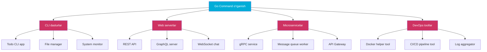

# Go Command — Junior Level

## Mundarija (Table of Contents)

1. [Introduction](#1-introduction)
2. [Prerequisites](#2-prerequisites)
3. [Glossary](#3-glossary)
4. [Core Concepts](#4-core-concepts)
5. [Pros & Cons](#5-pros--cons)
6. [Use Cases](#6-use-cases)
7. [Code Examples](#7-code-examples)
8. [Product Use / Feature](#8-product-use--feature)
9. [Error Handling](#9-error-handling)
10. [Security Considerations](#10-security-considerations)
11. [Performance Tips](#11-performance-tips)
12. [Best Practices](#12-best-practices)
13. [Edge Cases & Pitfalls](#13-edge-cases--pitfalls)
14. [Common Mistakes](#14-common-mistakes)
15. [Tricky Points](#15-tricky-points)
16. [Test](#16-test)
17. [Tricky Questions](#17-tricky-questions)
18. [Cheat Sheet](#18-cheat-sheet)
19. [Summary](#19-summary)
20. [What You Can Build](#20-what-you-can-build)
21. [Further Reading](#21-further-reading)
22. [Related Topics](#22-related-topics)

---

## 1. Introduction

**Go Command** — bu Go dasturlash tilining asosiy CLI (command-line interface) vositasi. U sizga kod yozishdan tortib, uni kompilyatsiya qilish, test qilish, formatlash va boshqa ko'p ishlarni bitta `go` buyrug'i orqali bajarishga imkon beradi.

Boshqa tillarda turli vositalar kerak bo'ladi (masalan, Node.js da `npm`, `npx`, `eslint`, `jest` alohida-alohida o'rnatiladi), Go'da esa hammasini `go` buyrug'i o'zi qiladi. Bu **unified toolchain** deb ataladi.

```bash
# Go o'rnatilganligini tekshirish
$ go version
go version go1.23.0 linux/amd64
```

Ushbu bo'limda biz quyidagi buyruqlarni o'rganamiz:

| Buyruq | Vazifasi |
|--------|----------|
| `go run` | Kodni kompilyatsiya qilib, darhol ishga tushirish |
| `go build` | Binary (bajariladigan fayl) yaratish |
| `go install` | Binary yaratib, `$GOPATH/bin` ga o'rnatish |
| `go mod init` | Yangi modul (loyiha) boshlash |
| `go mod tidy` | Keraksiz dependency'larni tozalash |
| `go fmt` | Kodni formatlash |
| `go vet` | Koddagi xatolarni statik tahlil qilish |
| `go test` | Testlarni ishga tushirish |
| `go doc` | Dokumentatsiyani ko'rish |
| `go version` | Go versiyasini ko'rish |
| `go env` | Go muhit o'zgaruvchilarini ko'rish |

---

## 2. Prerequisites

Go buyruqlari bilan ishlash uchun quyidagilar kerak:

### Kerakli dasturlar

| Dastur | Versiya | Tekshirish |
|--------|---------|------------|
| Go | 1.21+ | `go version` |
| Terminal | Har qanday | bash, zsh, PowerShell |
| Text editor | Har qanday | VS Code, Goland, vim |

### Go o'rnatilganligini tekshirish

```bash
# Go versiyasini tekshirish
$ go version
go version go1.23.0 linux/amd64

# Go qayerda joylashganligini tekshirish
$ which go
/usr/local/go/bin/go

# GOPATH ni tekshirish
$ go env GOPATH
/home/user/go
```

### Terminal asoslari

```bash
# Papka yaratish
$ mkdir -p ~/projects/hello

# Papkaga kirish
$ cd ~/projects/hello

# Fayl yaratish
$ touch main.go

# Joriy papkani ko'rish
$ pwd
/home/user/projects/hello
```

### PATH sozlash

Go binary'lari `$GOPATH/bin` da saqlanadi. Uni `PATH` ga qo'shish kerak:

```bash
# ~/.bashrc yoki ~/.zshrc ga qo'shing
export GOPATH=$HOME/go
export PATH=$PATH:$GOPATH/bin
```

---

## 3. Glossary

| Termin | Inglizcha | Tushuntirish |
|--------|-----------|--------------|
| **Binary** | Binary / Executable | Kompilyatsiya qilingan, bevosita ishga tushiriladigan fayl |
| **Module** | Module | Go loyihasining asosiy birligi. `go.mod` fayli bilan belgilanadi |
| **Package** | Package | Bir papkadagi Go fayllar to'plami. Har bir papka bitta paket |
| **Dependency** | Dependency | Loyihangiz ishlatadigan tashqi kutubxona (library) |
| **Lint** | Lint / Linter | Kod sifatini tekshiruvchi vosita (masalan, `go vet`) |
| **Vet** | Vet | Go'ning o'rnatilgan statik analizatori — xatolarni kompilyatsiyadan oldin topadi |
| **Build cache** | Build cache | Oldingi kompilyatsiya natijalarini saqlash — qayta build tezroq bo'ladi |
| **GOPATH** | GOPATH | Go ish papkasi — dependency va binary'lar shu yerda saqlanadi |
| **GOROOT** | GOROOT | Go o'rnatilgan papka (masalan, `/usr/local/go`) |
| **go.mod** | Module file | Loyihaning nomi, Go versiyasi va dependency'lar ro'yxati |
| **go.sum** | Checksum file | Dependency'larning xavfsizlik checksummlari |
| **Compile** | Compile | Kodni mashina tiliga o'girish jarayoni |
| **Statik analiz** | Static analysis | Kodni ishga tushirmasdan xatolarni topish |
| **Format** | Format | Kodni standart uslubda yozish (indentation, spacing) |

---

## 4. Core Concepts

### 4.1 go run — Darhol ishga tushirish

`go run` kodni kompilyatsiya qilib, **darhol** ishga tushiradi. Binary faylni saqlamaydi — vaqtinchalik papkada yaratadi va keyin o'chiradi.

```go
// main.go
package main

import "fmt"

func main() {
    fmt.Println("Salom, Go!")
}
```

```bash
$ go run main.go
Salom, Go!
```

Bir nechta fayl bilan:

```go
// main.go
package main

func main() {
    greet()
}
```

```go
// greet.go
package main

import "fmt"

func greet() {
    fmt.Println("Salom dunyo!")
}
```

```bash
# Barcha fayllarni ishga tushirish
$ go run .
Salom dunyo!

# Yoki aniq ko'rsatish
$ go run main.go greet.go
Salom dunyo!
```

### 4.2 go build — Binary yaratish

`go build` kodni kompilyatsiya qiladi va **binary fayl** yaratadi. Bu fayl mustaqil ishlaydi — Go o'rnatilmagan kompyuterda ham.

```bash
# Oddiy build
$ go build -o app main.go
$ ./app
Salom, Go!

# Fayl hajmini ko'rish
$ ls -lh app
-rwxr-xr-x 1 user user 1.8M app
```

Binary nomini belgilamasangiz, modul nomi bilan yaratadi:

```bash
$ go build .
$ ls
go.mod  main.go  myproject   # binary nomi = modul nomi
$ ./myproject
Salom, Go!
```

### 4.3 go install — Global o'rnatish

`go install` binary'ni kompilyatsiya qilib, `$GOPATH/bin` ga o'rnatadi. Shundan keyin uni istalgan joydan chaqirish mumkin.

```bash
# Loyiha ichidan
$ go install .
$ which myproject
/home/user/go/bin/myproject

# Tashqi paketni o'rnatish
$ go install golang.org/x/tools/cmd/goimports@latest
$ goimports --help
```

### 4.4 go mod init — Modul boshlash

Har bir Go loyiha **modul** sifatida boshlanadi. `go mod init` buyrug'i `go.mod` faylini yaratadi.

```bash
$ mkdir ~/projects/calculator && cd ~/projects/calculator
$ go mod init github.com/username/calculator
go: creating new go.mod: module github.com/username/calculator
```

```bash
$ cat go.mod
module github.com/username/calculator

go 1.23.0
```

### 4.5 go mod tidy — Dependency'larni tozalash

`go mod tidy` loyihadagi barcha `import` larni tekshiradi va:
- Kerak bo'lgan dependency'larni yuklab oladi
- Keraksiz dependency'larni o'chiradi

```bash
# Tashqi kutubxonani import qilganingizdan keyin
$ go mod tidy
go: finding module for package github.com/gin-gonic/gin
go: downloading github.com/gin-gonic/gin v1.9.1
```

```bash
$ cat go.mod
module github.com/username/calculator

go 1.23.0

require github.com/gin-gonic/gin v1.9.1
```

### 4.6 go fmt — Kodni formatlash

`go fmt` kodni Go standart uslubida formatlaydi. Barcha Go dasturchilari bir xil uslubda yozadi — bu Go'ning kuchli tomonlaridan biri.

```go
// Formatlashdan oldin (yomon uslub)
package main
import "fmt"
func main(){
fmt.Println("hello")
    x:=5
  y := 10
fmt.Println(x+y)
}
```

```bash
$ go fmt main.go
main.go
```

```go
// Formatlashdan keyin (go fmt natijasi)
package main

import "fmt"

func main() {
	fmt.Println("hello")
	x := 5
	y := 10
	fmt.Println(x + y)
}
```

### 4.7 go vet — Statik analiz

`go vet` kodni ishga tushirmasdan **potensial xatolarni** topadi. Bu kompilyator topmay qoladigan xatolarni aniqlaydi.

```go
// main.go
package main

import "fmt"

func main() {
    name := "Ali"
    fmt.Printf("Salom, %d\n", name) // %d raqam uchun, lekin name string!
}
```

```bash
$ go vet main.go
# command-line-arguments
./main.go:7:2: fmt.Printf format %d has arg name of wrong type string
```

### 4.8 go test — Testlarni ishga tushirish

`go test` loyihadagi barcha test fayllarini topib, ishga tushiradi. Test fayllar `_test.go` bilan tugashi kerak.

```go
// math.go
package math

func Add(a, b int) int {
    return a + b
}

func Multiply(a, b int) int {
    return a * b
}
```

```go
// math_test.go
package math

import "testing"

func TestAdd(t *testing.T) {
    result := Add(2, 3)
    if result != 5 {
        t.Errorf("Add(2, 3) = %d; want 5", result)
    }
}

func TestMultiply(t *testing.T) {
    result := Multiply(4, 5)
    if result != 20 {
        t.Errorf("Multiply(4, 5) = %d; want 20", result)
    }
}
```

```bash
$ go test ./...
ok  	github.com/username/calculator	0.003s
```

Batafsil natija uchun `-v` flag:

```bash
$ go test -v ./...
=== RUN   TestAdd
--- PASS: TestAdd (0.00s)
=== RUN   TestMultiply
--- PASS: TestMultiply (0.00s)
PASS
ok  	github.com/username/calculator	0.003s
```

### 4.9 go doc — Dokumentatsiya ko'rish

`go doc` paket yoki funksiya haqida ma'lumot beradi.

```bash
# Paket haqida
$ go doc fmt
package fmt // import "fmt"

Package fmt implements formatted I/O...

# Funksiya haqida
$ go doc fmt.Println
func Println(a ...any) (n int, err error)
    Println formats using the default formats...

# Barcha metodlarni ko'rish
$ go doc -all fmt.Stringer
type Stringer interface {
    String() string
}
```

### 4.10 go version — Versiyani ko'rish

```bash
$ go version
go version go1.23.0 linux/amd64
```

Binary faylning Go versiyasini ham tekshirish mumkin:

```bash
$ go version ./app
./app: go1.23.0
```

### 4.11 go env — Muhit o'zgaruvchilari

```bash
# Barcha o'zgaruvchilar
$ go env
GO111MODULE="on"
GOARCH="amd64"
GOBIN=""
GOCACHE="/home/user/.cache/go-build"
GOMODCACHE="/home/user/go/pkg/mod"
GOPATH="/home/user/go"
GOROOT="/usr/local/go"
GOOS="linux"
...

# Bitta o'zgaruvchi
$ go env GOPATH
/home/user/go

# O'zgaruvchini o'zgartirish
$ go env -w GOBIN=/home/user/go/bin
```

Muhim o'zgaruvchilar:

| O'zgaruvchi | Vazifasi | Misol |
|-------------|----------|-------|
| `GOPATH` | Go ish papkasi | `/home/user/go` |
| `GOROOT` | Go o'rnatilgan joy | `/usr/local/go` |
| `GOOS` | Target OS | `linux`, `darwin`, `windows` |
| `GOARCH` | Target architecture | `amd64`, `arm64` |
| `GOCACHE` | Build cache papkasi | `~/.cache/go-build` |
| `GOMODCACHE` | Module cache papkasi | `~/go/pkg/mod` |
| `CGO_ENABLED` | C interop yoqilgan/yo'q | `1` yoki `0` |

---

## 5. Pros & Cons

### Pros (Afzalliklar)

| Afzallik | Tushuntirish |
|----------|--------------|
| **Unified toolchain** | Bitta `go` buyrug'i bilan hamma narsa — build, test, format, vet |
| **Zero configuration** | Hech qanday config fayl kerak emas — `go build .` ishlaydi |
| **Cross-compilation** | `GOOS=windows go build .` bilan Windows binary yaratish mumkin |
| **Built-in formatting** | `go fmt` bilan barcha dasturchilar bir xil uslubda yozadi |
| **Built-in testing** | Alohida framework o'rnatish shart emas |
| **Fast compilation** | Go dunyodagi eng tez kompilyatsiya qilinadigan tillardan biri |
| **Static binary** | Yaratilgan binary mustaqil — dependency kerak emas |
| **Module system** | `go mod` bilan dependency management oson |

### Cons (Kamchiliklar)

| Kamchilik | Tushuntirish |
|-----------|--------------|
| **Flag'lar ko'p** | `go build` ning o'zi 20+ flag'ga ega — yangi dasturchilar uchun murakkab |
| **Error xabarlari** | Ba'zi xato xabarlari tushunarsiz (masalan, module graph xatolari) |
| **Global install** | `go install` global binary yaratadi — versiya conflict bo'lishi mumkin |
| **Slow first build** | Birinchi marta build qilish sekin — keyingilari cache'dan tez |
| **CGO murakkabligi** | C kutubxonalar bilan ishlash qiyin |

---

## 6. Use Cases

### 6.1 CLI dastur yaratish

```bash
$ mkdir ~/projects/mycli && cd ~/projects/mycli
$ go mod init github.com/username/mycli

# Kod yozish...

$ go build -o mycli .
$ ./mycli --help
```

### 6.2 Web server ishga tushirish (development)

```bash
# Tez test qilish uchun go run
$ go run cmd/server/main.go
Server running on :8080

# Production uchun go build
$ go build -o server cmd/server/main.go
$ ./server
```

### 6.3 Tashqi tool o'rnatish

```bash
# golangci-lint — kuchli linter
$ go install github.com/golangci/golangci-lint/cmd/golangci-lint@latest

# Air — hot reload
$ go install github.com/air-verse/air@latest

# swag — Swagger generator
$ go install github.com/swaggo/swag/cmd/swag@latest
```

### 6.4 Cross-compilation

```bash
# Linux server uchun build
$ GOOS=linux GOARCH=amd64 go build -o app-linux .

# macOS uchun build
$ GOOS=darwin GOARCH=arm64 go build -o app-mac .

# Windows uchun build
$ GOOS=windows GOARCH=amd64 go build -o app.exe .
```

---

## 7. Code Examples

### 7.1 To'liq loyiha yaratish

```bash
# 1. Loyiha papkasini yaratish
$ mkdir -p ~/projects/goapp && cd ~/projects/goapp

# 2. Modul boshlash
$ go mod init github.com/username/goapp
go: creating new go.mod: module github.com/username/goapp
```

```go
// main.go
package main

import (
	"fmt"
	"os"
	"runtime"
	"strings"
)

func main() {
	fmt.Println("=== Go App Info ===")
	fmt.Printf("Go version: %s\n", runtime.Version())
	fmt.Printf("OS/Arch:    %s/%s\n", runtime.GOOS, runtime.GOARCH)
	fmt.Printf("NumCPU:     %d\n", runtime.NumCPU())

	if len(os.Args) > 1 {
		fmt.Printf("Args:       %s\n", strings.Join(os.Args[1:], ", "))
	}
}
```

```bash
# 3. Ishga tushirish
$ go run main.go
=== Go App Info ===
Go version: go1.23.0
OS/Arch:    linux/amd64
NumCPU:     8

# 4. Argument bilan
$ go run main.go hello world
=== Go App Info ===
Go version: go1.23.0
OS/Arch:    linux/amd64
NumCPU:     8
Args:       hello, world

# 5. Binary yaratish
$ go build -o goapp .
$ ./goapp
=== Go App Info ===
Go version: go1.23.0
OS/Arch:    linux/amd64
NumCPU:     8
```

### 7.2 Dependency bilan ishlash

```go
// main.go
package main

import (
	"fmt"

	"github.com/fatih/color"
)

func main() {
	color.Green("Success: %s", "Go is awesome!")
	color.Red("Error: %s", "something went wrong")
	color.Yellow("Warning: %s", "be careful")
	fmt.Println("Normal text")
}
```

```bash
# Dependency'ni yuklab olish
$ go mod tidy
go: finding module for package github.com/fatih/color
go: downloading github.com/fatih/color v1.16.0

# go.mod ni tekshirish
$ cat go.mod
module github.com/username/goapp

go 1.23.0

require github.com/fatih/color v1.16.0

require (
	github.com/mattn/go-colorable v0.1.13 // indirect
	github.com/mattn/go-isatty v0.0.20 // indirect
	golang.org/x/sys v0.14.0 // indirect
)

# Ishga tushirish
$ go run main.go
Success: Go is awesome!    # (yashil rangda)
Error: something went wrong # (qizil rangda)
Warning: be careful         # (sariq rangda)
Normal text
```

### 7.3 Test yozish va ishga tushirish

```go
// calculator/calculator.go
package calculator

import "errors"

func Divide(a, b float64) (float64, error) {
	if b == 0 {
		return 0, errors.New("division by zero")
	}
	return a / b, nil
}

func Factorial(n int) int {
	if n <= 1 {
		return 1
	}
	return n * Factorial(n-1)
}
```

```go
// calculator/calculator_test.go
package calculator

import "testing"

func TestDivide(t *testing.T) {
	tests := []struct {
		a, b     float64
		expected float64
		hasError bool
	}{
		{10, 2, 5, false},
		{10, 3, 3.3333333333333335, false},
		{10, 0, 0, true},
		{0, 5, 0, false},
	}

	for _, tt := range tests {
		result, err := Divide(tt.a, tt.b)
		if tt.hasError {
			if err == nil {
				t.Errorf("Divide(%v, %v) expected error, got nil", tt.a, tt.b)
			}
		} else {
			if err != nil {
				t.Errorf("Divide(%v, %v) unexpected error: %v", tt.a, tt.b, err)
			}
			if result != tt.expected {
				t.Errorf("Divide(%v, %v) = %v; want %v", tt.a, tt.b, result, tt.expected)
			}
		}
	}
}

func TestFactorial(t *testing.T) {
	tests := []struct {
		input    int
		expected int
	}{
		{0, 1},
		{1, 1},
		{5, 120},
		{10, 3628800},
	}

	for _, tt := range tests {
		result := Factorial(tt.input)
		if result != tt.expected {
			t.Errorf("Factorial(%d) = %d; want %d", tt.input, result, tt.expected)
		}
	}
}
```

```bash
$ go test -v ./calculator/
=== RUN   TestDivide
--- PASS: TestDivide (0.00s)
=== RUN   TestFactorial
--- PASS: TestFactorial (0.00s)
PASS
ok  	github.com/username/goapp/calculator	0.002s
```

### 7.4 go fmt va go vet birgalikda

```bash
# Avval formatlash
$ go fmt ./...
calculator/calculator.go
main.go

# Keyin statik analiz
$ go vet ./...
# hech qanday xato topilmadi — yaxshi!
```

---

## 8. Product Use / Feature

### 8.1 Docker bilan Go build

```dockerfile
# Dockerfile
FROM golang:1.23-alpine AS builder
WORKDIR /app
COPY go.mod go.sum ./
RUN go mod download
COPY . .
RUN go build -o /server ./cmd/server

FROM alpine:3.19
COPY --from=builder /server /server
EXPOSE 8080
CMD ["/server"]
```

```bash
$ docker build -t myapp .
$ docker run -p 8080:8080 myapp
```

### 8.2 GitHub Actions bilan CI/CD

```yaml
# .github/workflows/ci.yml
name: CI
on: [push, pull_request]
jobs:
  build:
    runs-on: ubuntu-latest
    steps:
      - uses: actions/checkout@v4
      - uses: actions/setup-go@v5
        with:
          go-version: '1.23'
      - run: go fmt ./... && git diff --exit-code
      - run: go vet ./...
      - run: go test -v ./...
      - run: go build -o app .
```

### 8.3 Makefile bilan loyiha boshqarish

```makefile
# Makefile
.PHONY: run build test fmt vet clean

run:
	go run cmd/server/main.go

build:
	go build -o bin/server cmd/server/main.go

test:
	go test -v ./...

fmt:
	go fmt ./...

vet:
	go vet ./...

clean:
	rm -rf bin/

all: fmt vet test build
```

```bash
$ make all
go fmt ./...
go vet ./...
go test -v ./...
=== RUN   TestAdd
--- PASS: TestAdd (0.00s)
PASS
go build -o bin/server cmd/server/main.go
```

### 8.4 Pre-commit hook

```bash
#!/bin/bash
# .git/hooks/pre-commit

echo "Running go fmt..."
UNFMT=$(gofmt -l .)
if [ -n "$UNFMT" ]; then
    echo "Formatlangan emas: $UNFMT"
    exit 1
fi

echo "Running go vet..."
go vet ./...
if [ $? -ne 0 ]; then
    echo "go vet xato topdi!"
    exit 1
fi

echo "Running go test..."
go test ./...
if [ $? -ne 0 ]; then
    echo "Testlar fail bo'ldi!"
    exit 1
fi

echo "All checks passed!"
```

### 8.5 Air bilan hot reload (development)

```bash
# Air o'rnatish
$ go install github.com/air-verse/air@latest

# Loyiha ichida ishga tushirish
$ air
  __    _   ___
 / /\  | | | |_)
/_/--\ |_| |_| \_ v1.49.0

watching .
building...
running...
Server started on :8080
```

---

## 9. Error Handling

### 9.1 go build xatolari

**Xato 1: package not found**

```bash
$ go build .
main.go:5:2: no required module provides package github.com/gin-gonic/gin;
  to add it: go get github.com/gin-gonic/gin
```

**Yechim:**

```bash
$ go mod tidy
# yoki
$ go get github.com/gin-gonic/gin
```

**Xato 2: syntax error**

```bash
$ go build main.go
./main.go:10:1: syntax error: unexpected }, expected )
```

**Yechim:** Kod sintaksisini tekshiring — qavslar to'g'ri yopilganmi?

**Xato 3: undefined function**

```bash
$ go run main.go
./main.go:8:2: undefined: greet
```

**Yechim:** Barcha fayllarni ko'rsating yoki `.` ishlating:

```bash
$ go run .           # barcha fayllarni ishga tushiradi
$ go run *.go        # barcha .go fayllarni
```

### 9.2 go mod xatolari

**Xato 4: go.mod not found**

```bash
$ go build .
go: go.mod file not found in current directory or any parent directory;
    see 'go help modules'
```

**Yechim:**

```bash
$ go mod init github.com/username/myproject
```

**Xato 5: version mismatch**

```bash
$ go mod tidy
go: example.com/pkg@v1.2.3: missing go.sum entry for go.mod file;
    to add: go mod download example.com/pkg
```

**Yechim:**

```bash
$ go mod download
# yoki
$ go mod tidy
```

### 9.3 go test xatolari

**Xato 6: no test files**

```bash
$ go test ./...
?   	github.com/username/myapp	[no test files]
```

**Yechim:** `_test.go` bilan tugaydigan test fayl yarating.

**Xato 7: build failed in test**

```bash
$ go test ./...
# github.com/username/myapp
./main_test.go:10:15: undefined: SomeFunction
FAIL	github.com/username/myapp [build failed]
```

**Yechim:** Test fayldagi funksiya nomlari to'g'ri yozilganligini tekshiring.

---

## 10. Security Considerations

### 10.1 go vet — Xavfsizlik tekshiruvi

`go vet` potensial xavfsizlik xatolarini topadi:

```go
package main

import (
	"fmt"
	"os"
)

func main() {
	// Xavfli: foydalanuvchi kiritgan ma'lumot to'g'ridan-to'g'ri formatda
	input := os.Args[1]
	fmt.Printf(input) // go vet: Printf call has arguments but no formatting directives
}
```

```bash
$ go vet main.go
./main.go:11:2: fmt.Printf call has arguments but no formatting directives
```

### 10.2 govulncheck — Zaiflik skaneri

```bash
# O'rnatish
$ go install golang.org/x/vuln/cmd/govulncheck@latest

# Loyihani tekshirish
$ govulncheck ./...
No vulnerabilities found.
```

### 10.3 go.sum — Dependency tekshiruvi

`go.sum` fayli har bir dependency'ning **checksum**ini saqlaydi. Agar kimdir dependency'ni o'zgartirsa, Go buni aniqlaydi:

```bash
$ go mod verify
all modules verified
```

### 10.4 Xavfsiz build

```bash
# Trimpath — local path'larni yashirish
$ go build -trimpath -o app .

# Binary ichidagi ma'lumotni tekshirish
$ go version -m app
```

---

## 11. Performance Tips

### 11.1 Build cache

Go build natijalarini cache'laydi. Ikkinchi build ancha tez:

```bash
# Birinchi build — sekin
$ time go build -o app .
real    0m2.345s

# Ikkinchi build — tez (cache'dan)
$ time go build -o app .
real    0m0.123s
```

Cache'ni tozalash:

```bash
# Build cache'ni tozalash
$ go clean -cache

# Test cache'ni tozalash
$ go clean -testcache
```

### 11.2 Parallel build

Go avtomatik ravishda barcha CPU yadrolari ishlatadi:

```bash
# Nechta CPU ishlatilayotganini ko'rish
$ go env GOMAXPROCS
8

# Qo'lda belgilash
$ GOMAXPROCS=4 go build .
```

### 11.3 Race detector

`-race` flag data race'larni topadi, lekin build va runtime'ni sekinlashtiradi:

```bash
# Development uchun - race detector bilan
$ go run -race main.go

# Production uchun - race detector'siz
$ go build -o app .
```

### 11.4 go mod download

CI/CD da dependency'larni oldindan yuklash:

```bash
# Dependency'larni oldindan yuklash (cache uchun)
$ go mod download

# Keyin build tez bo'ladi
$ go build -o app .
```

---

## 12. Best Practices

### 12.1 Har doim go fmt ishlating

```bash
# Loyihaning barcha fayllarini formatlash
$ go fmt ./...

# Yoki goimports (import'larni ham tartibga soladi)
$ go install golang.org/x/tools/cmd/goimports@latest
$ goimports -w .
```

### 12.2 Build qilishdan oldin vet qiling

```bash
# To'g'ri tartib
$ go fmt ./...
$ go vet ./...
$ go test ./...
$ go build -o app .
```

### 12.3 go.sum ni version control ga qo'shing

```bash
# go.mod va go.sum ikkalasi ham git'da bo'lishi kerak
$ git add go.mod go.sum
$ git commit -m "update dependencies"
```

### 12.4 Aniq versiya ishlating

```bash
# Yaxshi — aniq versiya
$ go install golang.org/x/tools/cmd/goimports@v0.16.0

# Yomon — latest har doim o'zgarishi mumkin
$ go install golang.org/x/tools/cmd/goimports@latest
```

### 12.5 Loyiha strukturasi

```
myproject/
├── cmd/
│   └── server/
│       └── main.go       # Entry point
├── internal/
│   ├── handler/           # HTTP handlers
│   ├── service/           # Business logic
│   └── repository/        # Data access
├── pkg/                   # Public packages
├── go.mod
├── go.sum
├── Makefile
└── README.md
```

---

## 13. Edge Cases & Pitfalls

### 13.1 go run bilan relative path

```go
package main

import "os"

func main() {
    data, _ := os.ReadFile("config.json")
    // go run bilan — joriy papkadan o'qiydi (kutilganidek)
    // LEKIN: go run temp papkada binary yaratadi
    _ = data
}
```

`go run` binary'ni temp papkada yaratadi, lekin **working directory** o'zgarmaydi — relative path'lar to'g'ri ishlaydi.

### 13.2 go build multiple main packages

Bitta papkada ikkita `main` paket bo'lishi mumkin emas:

```bash
$ ls
main.go  another_main.go  # ikkalasi ham package main

# Bu ishlaydi - bitta papkada bitta paket
$ go build .

# LEKIN: ikki xil papkada bo'lishi kerak
cmd/
├── server/
│   └── main.go    # package main
└── worker/
    └── main.go    # package main
```

### 13.3 go mod tidy — test dependency'lari

`go mod tidy` test fayllaridagi import'larni ham qo'shadi:

```bash
$ go mod tidy
# go.mod ga test dependency'lari ham qo'shiladi
```

### 13.4 Build tag'lar bilan fayl

```go
//go:build ignore

package main
// Bu fayl go build da e'tiborga olinmaydi
```

---

## 14. Common Mistakes

### 14.1 go run da barcha fayllarni ko'rsatmaslik

```bash
# XATO — faqat main.go
$ go run main.go
./main.go:10: undefined: helper

# TO'G'RI — barcha fayllar yoki .
$ go run .
$ go run main.go helper.go
```

### 14.2 go.mod yaratmaslik

```bash
# XATO
$ go build main.go
go: go.mod file not found...

# TO'G'RI
$ go mod init myproject
$ go build .
```

### 14.3 go mod tidy ni unutish

```bash
# XATO — dependency qo'lda qo'shish
$ go get github.com/some/pkg  # faqat dependency qo'shadi

# TO'G'RI — keraksizlarni tozalash ham kerak
$ go mod tidy
```

### 14.4 go test da paket ko'rsatmaslik

```bash
# XATO — faqat joriy papka test qiladi
$ go test

# TO'G'RI — barcha paketlar
$ go test ./...
```

### 14.5 go fmt o'rniga qo'lda formatlash

```bash
# XATO — qo'lda formatlash
# Har bir dasturchi o'z uslubida yozadi

# TO'G'RI — go fmt yoki goimports
$ go fmt ./...
```

---

## 15. Tricky Points

### 15.1 go run binary'ni qayerda yaratadi?

`go run` binary'ni `$TMPDIR` (vaqtinchalik papka) da yaratadi:

```bash
# Binary qayerda ekanligini ko'rish
$ go run -work main.go
WORK=/tmp/go-build1234567890
Salom, Go!
```

### 15.2 go build vs go install

| Xususiyat | go build | go install |
|-----------|----------|------------|
| Binary joyi | Joriy papka | `$GOPATH/bin` |
| `-o` flag | Bor | Yo'q |
| Maqsad | Loyiha binary | Global tool |

### 15.3 go.sum nima uchun katta?

`go.sum` faqat to'g'ridan-to'g'ri dependency'lar emas, **barcha** transitive dependency'larning checksum'larini saqlaydi. Shuning uchun u katta bo'ladi.

### 15.4 go env -w vs export

```bash
# go env -w — doimiy (Go uchun)
$ go env -w GOBIN=/custom/bin

# export — faqat joriy terminal session
$ export GOBIN=/custom/bin
```

`go env -w` qiymatlari `~/.config/go/env` faylda saqlanadi.

---

## 16. Test

### 16.1 Savol

`go run main.go` va `go build -o app && ./app` o'rtasidagi asosiy farq nima?

- A) `go run` sekinroq
- B) `go run` binary faylni saqlamaydi
- C) `go build` faqat Linux'da ishlaydi
- D) Farqi yo'q

<details>
<summary>Javob</summary>

**B)** `go run` binary faylni vaqtinchalik papkada yaratadi va ishga tushirgandan keyin o'chiradi. `go build` esa binary'ni diskda saqlaydi.

</details>

### 16.2 Savol

Quyidagi buyruqlardan qaysi biri dependency'larni boshqaradi?

- A) `go fmt`
- B) `go vet`
- C) `go mod tidy`
- D) `go doc`

<details>
<summary>Javob</summary>

**C)** `go mod tidy` — kerak bo'lgan dependency'larni yuklab oladi va keraksizlarni o'chiradi.

</details>

### 16.3 Savol

`go vet` nima qiladi?

- A) Kodni formatlaydi
- B) Testlarni ishga tushiradi
- C) Kodni statik tahlil qiladi va xatolarni topadi
- D) Dokumentatsiya yaratadi

<details>
<summary>Javob</summary>

**C)** `go vet` kodni ishga tushirmasdan potensial xatolarni topadi (statik analiz). Masalan, noto'g'ri `Printf` formatlarini aniqlaydi.

</details>

### 16.4 Savol

Test fayl qanday nomlanishi kerak?

- A) `test_main.go`
- B) `main_test.go`
- C) `main.test.go`
- D) `main_spec.go`

<details>
<summary>Javob</summary>

**B)** Go'da test fayllar `_test.go` suffiks bilan tugashi kerak. Masalan, `main_test.go`, `handler_test.go`.

</details>

### 16.5 Savol

`go install golang.org/x/tools/cmd/goimports@latest` buyrug'i binary'ni qayerga o'rnatadi?

- A) Joriy papkaga
- B) `/usr/local/bin`
- C) `$GOPATH/bin`
- D) `$GOROOT/bin`

<details>
<summary>Javob</summary>

**C)** `go install` binary'ni `$GOPATH/bin` ga (yoki `$GOBIN` belgilangan bo'lsa, shu yerga) o'rnatadi.

</details>

### 16.6 Savol

Quyidagilardan qaysi biri `go.mod` faylda saqlanmaydi?

- A) Modul nomi
- B) Go versiyasi
- C) Dependency'lar
- D) Build cache

<details>
<summary>Javob</summary>

**D)** Build cache `go.mod` da emas, `$GOCACHE` papkasida saqlanadi. `go.mod` faqat modul nomi, Go versiyasi va dependency'lar ro'yxatini saqlaydi.

</details>

### 16.7 Savol

`go fmt ./...` buyrug'idagi `./...` nimani bildiradi?

- A) Faqat joriy papka
- B) Joriy papka va barcha ichki papkalar (recursive)
- C) Faqat main paket
- D) Faqat test fayllar

<details>
<summary>Javob</summary>

**B)** `./...` — joriy papka va uning barcha sub-papkalarini rekursiv ravishda ko'rsatadi. Bu Go'ning standart pattern'i.

</details>

### 16.8 Savol

Qaysi buyruq bilan boshqa OS uchun binary yaratish mumkin?

- A) `go build --os=windows`
- B) `GOOS=windows go build .`
- C) `go cross-build windows .`
- D) `go build -target windows .`

<details>
<summary>Javob</summary>

**B)** `GOOS` va `GOARCH` muhit o'zgaruvchilari orqali cross-compilation qilinadi. Masalan, `GOOS=windows GOARCH=amd64 go build -o app.exe .`

</details>

---

## 17. Tricky Questions

### 17.1 `go run .` va `go run main.go` — farqi bormi?

<details>
<summary>Javob</summary>

**Ha, farq bor!**

- `go run main.go` — faqat `main.go` faylni kompilyatsiya qiladi
- `go run .` — joriy papkadagi **barcha** `.go` fayllarni kompilyatsiya qiladi

Agar loyihangizda bir nechta fayl bo'lsa (masalan `main.go` va `helper.go`), `go run main.go` xato berishi mumkin chunki `helper.go` dagi funksiyalar topilmaydi.

```bash
# Xato
$ go run main.go
./main.go:10: undefined: helper

# To'g'ri
$ go run .
```

</details>

### 17.2 `go build` binary'si nima uchun katta (10MB+)?

<details>
<summary>Javob</summary>

Go **statically linked** binary yaratadi — barcha kerakli kutubxonalar (shu jumladan Go runtime) binary ichiga qo'shiladi. Shuning uchun:

1. Binary mustaqil ishlaydi — hech qanday dependency kerak emas
2. Lekin hajmi katta bo'ladi

Hajmini kamaytirish usullari:

```bash
# Debug info'ni o'chirish (~30% kichikroq)
$ go build -ldflags="-s -w" -o app .

# UPX bilan siqish (optional)
$ upx --best app
```

</details>

### 17.3 `go mod tidy` dependency qo'shadi, lekin `go.mod` da `// indirect` yozilgan. Bu nima?

<details>
<summary>Javob</summary>

`// indirect` — bu dependency sizning kodingiz to'g'ridan-to'g'ri import qilmaydi, lekin sizning dependency'laringiz ishlatadi.

```
require (
    github.com/gin-gonic/gin v1.9.1          // siz import qilasiz
    golang.org/x/sys v0.14.0 // indirect      // gin ishlatadi, siz emas
)
```

Bu **transitive dependency** deb ataladi. `go mod tidy` ularni avtomatik qo'shadi.

</details>

### 17.4 `go env -w` bilan o'rnatilgan qiymat qayerda saqlanadi?

<details>
<summary>Javob</summary>

`go env -w` qiymatlari `$HOME/.config/go/env` faylda saqlanadi (Linux/macOS) yoki `%APPDATA%\go\env` (Windows).

```bash
$ go env -w GOBIN=/custom/bin
$ cat ~/.config/go/env
GOBIN=/custom/bin
```

**Muhim:** Bu qiymatlar faqat Go tools uchun amal qiladi, boshqa dasturlar uchun emas.

Bekor qilish:

```bash
$ go env -u GOBIN  # qaytarish (unset)
```

</details>

### 17.5 Nima uchun `go test` ba'zan cache'dan natija qaytaradi?

<details>
<summary>Javob</summary>

Go test natijalarini cache'laydi. Agar kod o'zgarmasa, testlar qayta ishga tushmaydi:

```bash
$ go test ./...
ok  	myapp	(cached)   # <-- cache'dan

# Cache'ni tozalash
$ go clean -testcache
$ go test ./...
ok  	myapp	0.003s     # <-- qayta ishladi

# Yoki -count flag bilan
$ go test -count=1 ./...  # har doim qayta ishlaydi
```

</details>

---

## 18. Cheat Sheet

### Asosiy buyruqlar

| Buyruq | Vazifasi | Misol |
|--------|----------|-------|
| `go run` | Kompilyatsiya + ishga tushirish | `go run main.go` |
| `go run .` | Barcha fayllarni ishga tushirish | `go run .` |
| `go build` | Binary yaratish | `go build -o app .` |
| `go install` | Global binary o'rnatish | `go install ./...` |
| `go mod init` | Modul yaratish | `go mod init github.com/user/app` |
| `go mod tidy` | Dependency'larni tartibga solish | `go mod tidy` |
| `go fmt` | Kodni formatlash | `go fmt ./...` |
| `go vet` | Statik analiz | `go vet ./...` |
| `go test` | Testlarni ishga tushirish | `go test -v ./...` |
| `go doc` | Dokumentatsiya ko'rish | `go doc fmt.Println` |
| `go version` | Go versiyasi | `go version` |
| `go env` | Muhit o'zgaruvchilari | `go env GOPATH` |
| `go get` | Dependency qo'shish | `go get github.com/pkg@v1.0` |
| `go clean` | Cache tozalash | `go clean -cache` |

### Muhit o'zgaruvchilari

| O'zgaruvchi | Vazifasi |
|-------------|----------|
| `GOPATH` | Go workspace papkasi |
| `GOROOT` | Go o'rnatilgan papka |
| `GOOS` | Target OS (linux, darwin, windows) |
| `GOARCH` | Target arch (amd64, arm64) |
| `GOCACHE` | Build cache papkasi |
| `GOMODCACHE` | Module cache papkasi |
| `GOBIN` | Binary o'rnatish papkasi |
| `CGO_ENABLED` | C interop (1=on, 0=off) |
| `GOPROXY` | Module proxy URL |
| `GONOSUMCHECK` | Checksum tekshirishni o'chirish |

### Tez-tez ishlatiladigan pattern'lar

```bash
# Yangi loyiha boshlash
mkdir myproject && cd myproject
go mod init github.com/user/myproject

# Development workflow
go fmt ./... && go vet ./... && go test ./... && go run .

# Production build
go build -trimpath -ldflags="-s -w" -o app .

# Cross-compilation
GOOS=linux GOARCH=amd64 go build -o app-linux .
GOOS=darwin GOARCH=arm64 go build -o app-mac .
GOOS=windows GOARCH=amd64 go build -o app.exe .

# Tashqi tool o'rnatish
go install golang.org/x/tools/cmd/goimports@latest

# Cache tozalash
go clean -cache -testcache -modcache
```

---

## 19. Summary

- **`go run`** — kodni tez test qilish uchun (binary saqlamaydi)
- **`go build`** — production binary yaratish uchun
- **`go install`** — global tool o'rnatish uchun
- **`go mod init`** — yangi loyiha boshlash uchun
- **`go mod tidy`** — dependency'larni tartibga solish uchun
- **`go fmt`** — kodni standart formatda yozish uchun
- **`go vet`** — potensial xatolarni topish uchun
- **`go test`** — testlarni ishga tushirish uchun
- **`go doc`** — dokumentatsiya ko'rish uchun
- **`go version`** — versiya tekshirish uchun
- **`go env`** — muhit sozlamalarini ko'rish/o'zgartirish uchun

**Asosiy qoida:** Har doim `go fmt` → `go vet` → `go test` → `go build` tartibida ishlating.

---

## 20. What You Can Build



---

## 21. Further Reading

| Resurs | Link | Tavsif |
|--------|------|--------|
| Go Command docs | https://pkg.go.dev/cmd/go | Rasmiy dokumentatsiya |
| Go Modules Reference | https://go.dev/ref/mod | Module tizimi haqida |
| Effective Go | https://go.dev/doc/effective_go | Go yozish bo'yicha qo'llanma |
| Go by Example | https://gobyexample.com/ | Misollar bilan o'rganish |
| Go Wiki | https://go.dev/wiki | Community wiki |
| Go Playground | https://go.dev/play/ | Online Go muhiti |
| Go Blog | https://go.dev/blog/ | Rasmiy blog |

---

## 22. Related Topics

| Mavzu | Bog'liqlik |
|-------|------------|
| Go Modules | `go mod` buyruqlari bilan dependency management |
| Go Testing | `go test` bilan test yozish |
| Go Build Tags | Conditional compilation |
| Go Workspace | `go work` bilan multi-module loyihalar |
| Docker + Go | Multi-stage build bilan deployment |
| CI/CD | GitHub Actions/GitLab CI bilan avtomatlashtirish |
| Makefiles | Go loyihalar uchun build automation |
| Go Linters | `golangci-lint` va boshqa statik analiz vositalari |
