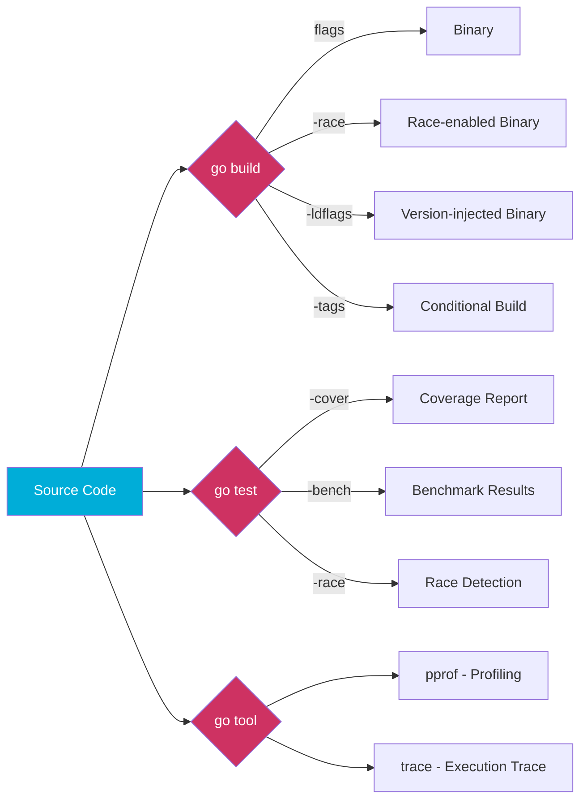
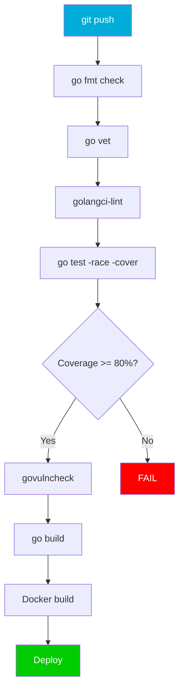
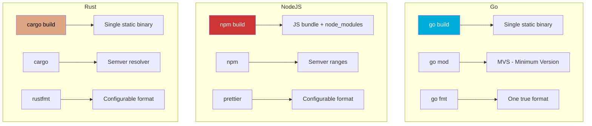
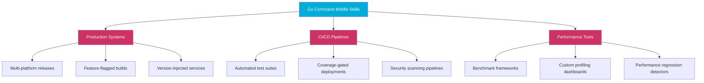

# Go Command — Middle Level

## Mundarija (Table of Contents)

1. [Introduction](#1-introduction)
2. [Core Concepts](#2-core-concepts)
3. [Pros & Cons](#3-pros--cons)
4. [Use Cases](#4-use-cases)
5. [Code Examples](#5-code-examples)
6. [Product Use / Feature](#6-product-use--feature)
7. [Error Handling](#7-error-handling)
8. [Security Considerations](#8-security-considerations)
9. [Performance Optimization](#9-performance-optimization)
10. [Debugging Guide](#10-debugging-guide)
11. [Best Practices](#11-best-practices)
12. [Edge Cases & Pitfalls](#12-edge-cases--pitfalls)
13. [Common Mistakes](#13-common-mistakes)
14. [Tricky Points](#14-tricky-points)
15. [Comparison with Other Languages](#15-comparison-with-other-languages)
16. [Test](#16-test)
17. [Tricky Questions](#17-tricky-questions)
18. [Cheat Sheet](#18-cheat-sheet)
19. [Summary](#19-summary)
20. [What You Can Build](#20-what-you-can-build)
21. [Further Reading](#21-further-reading)
22. [Related Topics](#22-related-topics)

---

## 1. Introduction

Middle daraja Go command'larida siz **nima uchun** va **qachon** har bir flag yoki buyruqni ishlatishni tushunishingiz kerak. Junior darajada `go build .` yetarli edi, endi biz build flag'lari, test strategyalari, profiling, module management va boshqa ilg'or mavzularni ko'rib chiqamiz.

Bu bo'limda o'rganiladigan mavzular:

| Mavzu | Buyruqlar |
|-------|-----------|
| Build flags | `-o`, `-v`, `-race`, `-ldflags`, `-gcflags`, `-tags` |
| Test flags | `-v`, `-run`, `-count`, `-cover`, `-bench`, `-benchmem` |
| Module management | `replace`, `retract`, `exclude` directives |
| Code generation | `go generate` |
| Profiling | `go tool pprof`, `go tool trace` |
| Cleanup | `go clean` |
| Global flags | `GOFLAGS` environment variable |



---

## 2. Core Concepts

### 2.1 go build Flags

#### -o (output) — Binary nomini belgilash

```bash
# Default: modul nomi bilan binary yaratadi
$ go build .
$ ls
myapp  main.go  go.mod

# Custom nom bilan
$ go build -o server ./cmd/api
$ ./server
Server running on :8080

# Boshqa papkaga
$ go build -o bin/server ./cmd/api
```

#### -v (verbose) — Kompilyatsiya jarayonini ko'rish

```bash
$ go build -v ./...
myapp/internal/config
myapp/internal/database
myapp/internal/handler
myapp/internal/service
myapp/cmd/api
```

#### -race — Data Race Detector

Goroutine'lar orasidagi data race'larni aniqlaydi. **Development va CI/CD da har doim ishlating.**

```go
// race_example.go
package main

import (
	"fmt"
	"sync"
)

func main() {
	counter := 0
	var wg sync.WaitGroup

	for i := 0; i < 1000; i++ {
		wg.Add(1)
		go func() {
			defer wg.Done()
			counter++ // DATA RACE!
		}()
	}

	wg.Wait()
	fmt.Println("Counter:", counter)
}
```

```bash
$ go run -race race_example.go
==================
WARNING: DATA RACE
Read at 0x00c0000b4010 by goroutine 8:
  main.main.func1()
      /home/user/race_example.go:16 +0x6e

Previous write at 0x00c0000b4010 by goroutine 7:
  main.main.func1()
      /home/user/race_example.go:16 +0x84

Goroutine 8 (running) created at:
  main.main()
      /home/user/race_example.go:14 +0x98
==================
Counter: 987
Found 1 data race(s)
exit status 66
```

#### -ldflags — Linker Flags

Compile-time da qiymatlar inject qilish. **Version, build time, commit hash** o'rnatish uchun eng ko'p ishlatiladi.

```go
// main.go
package main

import "fmt"

// Build vaqtida qiymat beriladigan o'zgaruvchilar
var (
	Version   = "dev"
	BuildTime = "unknown"
	CommitHash = "none"
)

func main() {
	fmt.Printf("Version:    %s\n", Version)
	fmt.Printf("Build Time: %s\n", BuildTime)
	fmt.Printf("Commit:     %s\n", CommitHash)
}
```

```bash
$ go build -ldflags "\
  -X main.Version=1.2.3 \
  -X main.BuildTime=$(date -u +%Y-%m-%dT%H:%M:%SZ) \
  -X main.CommitHash=$(git rev-parse --short HEAD)" \
  -o app .

$ ./app
Version:    1.2.3
Build Time: 2024-12-15T10:30:00Z
Commit:     a1b2c3d
```

`-ldflags` ning boshqa flag'lari:

| Flag | Vazifasi |
|------|----------|
| `-s` | Symbol table'ni o'chirish |
| `-w` | DWARF debug info'ni o'chirish |
| `-X` | String o'zgaruvchiga qiymat berish |

```bash
# Kichikroq binary (production uchun)
$ go build -ldflags="-s -w" -o app .
```

#### -gcflags — Compiler Flags

Go compiler'ga qo'shimcha ko'rsatmalar berish:

```bash
# Optimization'ni o'chirish (debugging uchun)
$ go build -gcflags="-N -l" -o app .

# Compiler nima qilayotganini ko'rish
$ go build -gcflags="-m" main.go
./main.go:10:13: inlining call to fmt.Println
./main.go:11:6: moved to heap: x

# Barcha paketlar uchun
$ go build -gcflags="all=-m" ./...
```

| Flag | Vazifasi |
|------|----------|
| `-N` | Optimization'ni o'chirish |
| `-l` | Inlining'ni o'chirish |
| `-m` | Escape analysis natijalarini ko'rish |
| `-S` | Assembly output |

#### -tags — Build Tags

Conditional compilation — turli muhitlar uchun turli kod:

```go
//go:build dev
// +build dev

// config_dev.go
package config

const (
    DBHost = "localhost"
    DBPort = "5432"
    Debug  = true
)
```

```go
//go:build prod
// +build prod

// config_prod.go
package config

const (
    DBHost = "db.production.com"
    DBPort = "5432"
    Debug  = false
)
```

```bash
# Development
$ go build -tags dev -o app .

# Production
$ go build -tags prod -o app .

# Bir nechta tag
$ go build -tags "prod,metrics" -o app .
```

### 2.2 go test Flags

#### -v (verbose)

```bash
$ go test -v ./...
=== RUN   TestAdd
--- PASS: TestAdd (0.00s)
=== RUN   TestDivide
--- PASS: TestDivide (0.00s)
=== RUN   TestDivideByZero
--- PASS: TestDivideByZero (0.00s)
PASS
ok  	myapp	0.003s
```

#### -run — Aniq test tanlash (regex)

```bash
# Faqat TestAdd ni ishga tushirish
$ go test -v -run TestAdd ./...

# "Divide" so'zi bor barcha testlar
$ go test -v -run "Divide" ./...

# TestAdd/positive faqat sub-test
$ go test -v -run "TestAdd/positive" ./...
```

#### -count — Cache'ni bypass qilish

```bash
# Har doim qayta ishga tushirish (cache'ni e'tiborsiz qoldirish)
$ go test -count=1 ./...

# 3 marta ishga tushirish (flaky test topish uchun)
$ go test -count=3 ./...
```

#### -cover — Code Coverage

```bash
# Coverage foizini ko'rish
$ go test -cover ./...
ok  	myapp	0.003s	coverage: 78.5% of statements

# HTML hisobot yaratish
$ go test -coverprofile=coverage.out ./...
$ go tool cover -html=coverage.out -o coverage.html
$ open coverage.html

# Paket bo'yicha coverage
$ go test -cover -coverprofile=coverage.out ./internal/...
$ go tool cover -func=coverage.out
myapp/internal/handler/user.go:15:	CreateUser	100.0%
myapp/internal/handler/user.go:35:	GetUser		75.0%
myapp/internal/service/auth.go:10:	Login		85.7%
total:					(statements)	82.4%
```

#### -bench — Benchmark

```go
// bench_test.go
package myapp

import "testing"

func BenchmarkAdd(b *testing.B) {
	for i := 0; i < b.N; i++ {
		Add(100, 200)
	}
}

func BenchmarkAddWithAlloc(b *testing.B) {
	for i := 0; i < b.N; i++ {
		result := make([]int, 100)
		for j := range result {
			result[j] = Add(j, j+1)
		}
	}
}
```

```bash
# Barcha benchmark'larni ishga tushirish
$ go test -bench=. ./...
goos: linux
goarch: amd64
pkg: myapp
cpu: Intel(R) Core(TM) i7-9750H CPU @ 2.60GHz
BenchmarkAdd-12                 1000000000     0.2840 ns/op
BenchmarkAddWithAlloc-12        2485789        482.1 ns/op
PASS

# Memory allocation bilan
$ go test -bench=. -benchmem ./...
BenchmarkAdd-12             1000000000   0.2840 ns/op   0 B/op   0 allocs/op
BenchmarkAddWithAlloc-12    2485789      482.1 ns/op    896 B/op 1 allocs/op

# Aniq benchmark
$ go test -bench=BenchmarkAdd -benchtime=5s ./...
```

### 2.3 go mod: replace, retract, exclude

#### replace — Dependency'ni almashtirish

```go
// go.mod
module myapp

go 1.23.0

require github.com/user/pkg v1.2.3

// Local papkadagi versiya bilan almashtirish (development uchun)
replace github.com/user/pkg => ../my-local-pkg

// Boshqa versiya bilan almashtirish
replace github.com/user/pkg v1.2.3 => github.com/user/pkg v1.2.4

// Fork bilan almashtirish
replace github.com/original/pkg => github.com/myfork/pkg v1.0.0
```

```bash
# Command line orqali
$ go mod edit -replace=github.com/user/pkg=../my-local-pkg
```

#### retract — Versiyani qaytarib olish

```go
// go.mod (kutubxona maintainer sifatida)
module github.com/user/mylib

go 1.23.0

// Xavfli versiyani qaytarib olish
retract (
    v1.0.0 // Critical bug — use v1.0.1
    [v1.1.0, v1.2.0] // Range retract
)
```

#### exclude — Dependency versiyasini chiqarib tashlash

```go
// go.mod
module myapp

go 1.23.0

// Bu versiyada bug bor, ishlatmaslik kerak
exclude github.com/user/pkg v1.1.0
```

### 2.4 go generate

`go generate` manba koddagi maxsus kommentlarni topib, ulardagi buyruqlarni ishga tushiradi.

```go
// types.go
package myapp

//go:generate stringer -type=Status
type Status int

const (
	StatusPending Status = iota
	StatusActive
	StatusInactive
	StatusDeleted
)
```

```bash
# stringer o'rnatish
$ go install golang.org/x/tools/cmd/stringer@latest

# Generate ishga tushirish
$ go generate ./...

# Yaratilgan faylni ko'rish
$ cat status_string.go
// Code generated by "stringer -type=Status"; DO NOT EDIT.
package myapp

func (i Status) String() string {
    switch i {
    case StatusPending:
        return "StatusPending"
    case StatusActive:
        return "StatusActive"
    case StatusInactive:
        return "StatusInactive"
    case StatusDeleted:
        return "StatusDeleted"
    }
    return "Status(" + strconv.FormatInt(int64(i), 10) + ")"
}
```

Boshqa generate misollar:

```go
//go:generate mockgen -source=repository.go -destination=mock_repository.go -package=myapp
//go:generate protoc --go_out=. --go-grpc_out=. proto/service.proto
//go:generate swag init -g cmd/api/main.go
```

### 2.5 go tool pprof — Profiling

```go
// main.go
package main

import (
	"log"
	"net/http"
	_ "net/http/pprof" // pprof endpoint'larini qo'shadi
)

func main() {
	// pprof endpoint'lari avtomatik ro'yxatdan o'tadi:
	// /debug/pprof/
	// /debug/pprof/heap
	// /debug/pprof/goroutine
	// /debug/pprof/profile (CPU)

	log.Println("Server with pprof on :6060")
	log.Fatal(http.ListenAndServe(":6060", nil))
}
```

```bash
# CPU profiling (30 soniya)
$ go tool pprof http://localhost:6060/debug/pprof/profile?seconds=30
(pprof) top 10
Showing nodes accounting for 2.5s, 83.33% of 3s total
      flat  flat%   sum%        cum   cum%
     1.2s 40.00% 40.00%      1.5s 50.00%  myapp/internal.ProcessData
     0.8s 26.67% 66.67%      0.8s 26.67%  runtime.mallocgc
     0.5s 16.67% 83.33%      2.0s 66.67%  myapp/internal.HandleRequest

(pprof) web    # Browser'da grafikni ochish

# Heap profiling
$ go tool pprof http://localhost:6060/debug/pprof/heap
(pprof) top
(pprof) list ProcessData   # funksiyaning qaysi qatori ko'p memory ishlatayotganini ko'rish

# Goroutine profiling
$ go tool pprof http://localhost:6060/debug/pprof/goroutine
(pprof) top
(pprof) tree
```

Test bilan profiling:

```bash
# CPU profile
$ go test -cpuprofile cpu.prof -bench=. ./...
$ go tool pprof cpu.prof
(pprof) top 10

# Memory profile
$ go test -memprofile mem.prof -bench=. ./...
$ go tool pprof mem.prof
(pprof) top 10
```

### 2.6 go tool trace — Execution Trace

```bash
# Trace ma'lumotlarini yig'ish
$ go test -trace trace.out ./...

# Trace'ni browser'da ko'rish
$ go tool trace trace.out
2024/01/15 10:30:00 Parsing trace...
2024/01/15 10:30:00 Splitting trace...
2024/01/15 10:30:00 Opening browser. Trace viewer is listening on http://127.0.0.1:53421
```

Kod orqali trace:

```go
package main

import (
	"os"
	"runtime/trace"
)

func main() {
	f, _ := os.Create("trace.out")
	defer f.Close()

	trace.Start(f)
	defer trace.Stop()

	// Sizning kodingiz...
	doWork()
}
```

### 2.7 go clean

```bash
# Build cache'ni tozalash
$ go clean -cache
$ du -sh $(go env GOCACHE)   # cache hajmini ko'rish

# Test cache'ni tozalash
$ go clean -testcache

# Module cache'ni tozalash (ehtiyot bo'ling!)
$ go clean -modcache

# Hammasini tozalash
$ go clean -cache -testcache -modcache

# Faqat ma'lumot ko'rish (o'chirmasdan)
$ go clean -n -cache    # -n = dry run
```

### 2.8 GOFLAGS — Global Flags

`GOFLAGS` barcha `go` buyruqlariga avtomatik flag qo'shadi:

```bash
# Barcha build'larga -race qo'shish
$ export GOFLAGS="-race"
$ go build .      # aslida: go build -race .
$ go test ./...   # aslida: go test -race ./...

# Bir nechta flag
$ export GOFLAGS="-race -v"

# Doimiy qilish
$ go env -w GOFLAGS="-race"

# Bekor qilish
$ go env -u GOFLAGS
```

---

## 3. Pros & Cons

### Build Flags

| Aspect | Pro | Con |
|--------|-----|-----|
| `-race` | Data race'larni topadi | 2-10x sekinroq, 5-10x ko'p memory |
| `-ldflags` | Version inject qilish oson | Sintaksis murakkab |
| `-gcflags` | Compiler behavior'ni nazorat qilish | Noto'g'ri ishlatilsa performance yomonlashadi |
| `-tags` | Flexible conditional compilation | Tag'lar ko'paysa, murakkablik oshadi |

### Module Management

| Aspect | Pro | Con |
|--------|-----|-----|
| `replace` | Local development oson | Production'ga push qilib qo'yish xavfi |
| `retract` | Xavfli versiyalarni qaytarish | Mavjud foydalanuvchilarga ta'sir qilmaydi |
| `exclude` | Muammoli versiyadan qochish | Faqat to'g'ridan-to'g'ri dependency'lar uchun |

### Testing & Profiling

| Aspect | Pro | Con |
|--------|-----|-----|
| `-cover` | Built-in coverage | Branch coverage emas, statement coverage |
| `-bench` | Benchmark o'rnatilgan | Noto'g'ri benchmark noto'g'ri natija beradi |
| `pprof` | Production profiling | O'zi ham resource ishlatadi |
| `trace` | Detailed execution trace | Katta trace fayllar yaratadi |

---

## 4. Use Cases

### 4.1 Microservice build pipeline

```bash
#!/bin/bash
# build.sh - Production build script

VERSION=$(git describe --tags --always)
BUILD_TIME=$(date -u +%Y-%m-%dT%H:%M:%SZ)
COMMIT=$(git rev-parse --short HEAD)

go build \
  -trimpath \
  -ldflags "-s -w \
    -X main.Version=$VERSION \
    -X main.BuildTime=$BUILD_TIME \
    -X main.CommitHash=$COMMIT" \
  -o bin/server \
  ./cmd/server
```

### 4.2 Multi-platform release

```bash
#!/bin/bash
# release.sh

PLATFORMS=("linux/amd64" "linux/arm64" "darwin/amd64" "darwin/arm64" "windows/amd64")
VERSION=$1

for PLATFORM in "${PLATFORMS[@]}"; do
    OS="${PLATFORM%/*}"
    ARCH="${PLATFORM#*/}"
    OUTPUT="bin/myapp-${VERSION}-${OS}-${ARCH}"
    [ "$OS" = "windows" ] && OUTPUT="${OUTPUT}.exe"

    echo "Building ${OS}/${ARCH}..."
    GOOS=$OS GOARCH=$ARCH go build \
        -ldflags="-s -w -X main.Version=$VERSION" \
        -o "$OUTPUT" ./cmd/myapp
done
```

### 4.3 Coverage-driven development

```bash
# 1. Test coverage tekshirish
$ go test -coverprofile=coverage.out ./...

# 2. Kam coverage bo'lgan joylarni topish
$ go tool cover -func=coverage.out | grep -v "100.0%"
myapp/internal/handler/user.go:45:   DeleteUser   0.0%
myapp/internal/service/auth.go:80:   RefreshToken  33.3%

# 3. HTML report
$ go tool cover -html=coverage.out -o coverage.html

# 4. CI/CD da minimum coverage talabi
$ COVERAGE=$(go test -cover ./... | grep -oP '\d+\.\d+(?=%)')
$ if (( $(echo "$COVERAGE < 80.0" | bc -l) )); then
    echo "Coverage $COVERAGE% < 80% - FAIL"
    exit 1
  fi
```

### 4.4 Benchmark regression testing

```bash
# Oldingi natijalarni saqlash
$ go test -bench=. -benchmem ./... > old_bench.txt

# Kod o'zgartirgandan keyin
$ go test -bench=. -benchmem ./... > new_bench.txt

# Solishtirish (benchstat o'rnatish kerak)
$ go install golang.org/x/perf/cmd/benchstat@latest
$ benchstat old_bench.txt new_bench.txt
name          old time/op  new time/op  delta
Process-12    482ns ± 2%   325ns ± 1%   -32.57% (p=0.000 n=10+10)
```

---

## 5. Code Examples

### 5.1 Build tags bilan muhit boshqarish

```go
// config.go
package config

type Config struct {
	Host     string
	Port     int
	Debug    bool
	LogLevel string
}
```

```go
//go:build dev

// config_dev.go
package config

func Load() *Config {
	return &Config{
		Host:     "localhost",
		Port:     8080,
		Debug:    true,
		LogLevel: "debug",
	}
}
```

```go
//go:build prod

// config_prod.go
package config

import "os"

func Load() *Config {
	return &Config{
		Host:     os.Getenv("HOST"),
		Port:     443,
		Debug:    false,
		LogLevel: "warn",
	}
}
```

```go
// main.go
package main

import (
	"fmt"
	"myapp/config"
)

func main() {
	cfg := config.Load()
	fmt.Printf("Running on %s:%d (debug=%v)\n", cfg.Host, cfg.Port, cfg.Debug)
}
```

```bash
$ go run -tags dev .
Running on localhost:8080 (debug=true)

$ go run -tags prod .
Running on :443 (debug=false)
```

### 5.2 ldflags bilan version endpoint

```go
package main

import (
	"encoding/json"
	"log"
	"net/http"
)

var (
	Version   = "dev"
	BuildTime = "unknown"
	Commit    = "none"
)

type VersionInfo struct {
	Version   string `json:"version"`
	BuildTime string `json:"build_time"`
	Commit    string `json:"commit"`
}

func main() {
	http.HandleFunc("/version", func(w http.ResponseWriter, r *http.Request) {
		info := VersionInfo{
			Version:   Version,
			BuildTime: BuildTime,
			Commit:    Commit,
		}
		w.Header().Set("Content-Type", "application/json")
		json.NewEncoder(w).Encode(info)
	})

	log.Printf("Server v%s starting on :8080", Version)
	log.Fatal(http.ListenAndServe(":8080", nil))
}
```

```bash
$ go build -ldflags "\
  -X main.Version=2.1.0 \
  -X 'main.BuildTime=$(date -u +%Y-%m-%dT%H:%M:%SZ)' \
  -X 'main.Commit=$(git rev-parse --short HEAD)'" \
  -o server .

$ ./server &
$ curl -s localhost:8080/version | jq .
{
  "version": "2.1.0",
  "build_time": "2024-12-15T10:30:00Z",
  "commit": "a1b2c3d"
}
```

### 5.3 go generate bilan mock yaratish

```go
// repository.go
package repository

//go:generate mockgen -source=repository.go -destination=mock_repository.go -package=repository

type UserRepository interface {
	GetByID(id int64) (*User, error)
	Create(user *User) error
	Update(user *User) error
	Delete(id int64) error
}

type User struct {
	ID    int64
	Name  string
	Email string
}
```

```bash
# mockgen o'rnatish
$ go install go.uber.org/mock/mockgen@latest

# Mock yaratish
$ go generate ./internal/repository/...

# Testlarda ishlatish
$ go test -v ./internal/service/...
```

### 5.4 Benchmark bilan performance tahlil

```go
// search_test.go
package search

import "testing"

func BenchmarkLinearSearch(b *testing.B) {
	data := make([]int, 10000)
	for i := range data {
		data[i] = i
	}

	b.ResetTimer()
	for i := 0; i < b.N; i++ {
		LinearSearch(data, 9999)
	}
}

func BenchmarkBinarySearch(b *testing.B) {
	data := make([]int, 10000)
	for i := range data {
		data[i] = i
	}

	b.ResetTimer()
	for i := 0; i < b.N; i++ {
		BinarySearch(data, 9999)
	}
}
```

```bash
$ go test -bench=. -benchmem -benchtime=3s ./...
goos: linux
goarch: amd64
pkg: myapp/search
BenchmarkLinearSearch-12     467823     7652 ns/op    0 B/op   0 allocs/op
BenchmarkBinarySearch-12   72483120    49.32 ns/op    0 B/op   0 allocs/op
PASS
```

---

## 6. Product Use / Feature

### 6.1 Kubernetes-style build (scale: 1000+ developers)

```makefile
# Makefile
VERSION ?= $(shell git describe --tags --always --dirty)
BUILD_TIME := $(shell date -u +%Y-%m-%dT%H:%M:%SZ)
COMMIT := $(shell git rev-parse HEAD)
LDFLAGS := -ldflags "-s -w \
  -X k8s.io/component-base/version.gitVersion=$(VERSION) \
  -X k8s.io/component-base/version.gitCommit=$(COMMIT) \
  -X k8s.io/component-base/version.buildDate=$(BUILD_TIME)"

.PHONY: build test verify

build:
	CGO_ENABLED=0 go build -trimpath $(LDFLAGS) -o bin/kube-apiserver ./cmd/kube-apiserver

test:
	go test -race -count=1 -cover -coverprofile=coverage.out ./...

verify: ## CI verification
	go fmt ./... && git diff --exit-code
	go vet ./...
	go test -race -count=1 ./...
```

### 6.2 Feature flag system bilan build tags

```go
//go:build premium

// premium_features.go
package features

func init() {
	RegisterFeature("advanced-analytics", true)
	RegisterFeature("custom-branding", true)
	RegisterFeature("sso-integration", true)
}
```

```bash
# Free version
$ go build -o app-free .

# Premium version
$ go build -tags premium -o app-premium .
```

### 6.3 CI/CD pipeline (GitHub Actions)

```yaml
# .github/workflows/ci.yml
name: CI/CD
on:
  push:
    branches: [main]
  pull_request:

jobs:
  test:
    runs-on: ubuntu-latest
    steps:
      - uses: actions/checkout@v4
      - uses: actions/setup-go@v5
        with:
          go-version: '1.23'

      - name: Format check
        run: |
          go fmt ./...
          git diff --exit-code

      - name: Vet
        run: go vet ./...

      - name: Test with race detector
        run: go test -race -count=1 -coverprofile=coverage.out ./...

      - name: Coverage check
        run: |
          TOTAL=$(go tool cover -func=coverage.out | grep total | awk '{print $3}' | sed 's/%//')
          echo "Total coverage: ${TOTAL}%"
          if (( $(echo "$TOTAL < 80" | bc -l) )); then
            echo "::error::Coverage ${TOTAL}% is below 80%"
            exit 1
          fi

      - name: Build
        run: |
          go build -trimpath -ldflags="-s -w \
            -X main.Version=${{ github.ref_name }} \
            -X main.Commit=${{ github.sha }}" \
            -o bin/app ./cmd/server

      - name: Vulnerability check
        run: |
          go install golang.org/x/vuln/cmd/govulncheck@latest
          govulncheck ./...
```

### 6.4 Monorepo bilan go workspace

```bash
# go.work yaratish
$ go work init
$ go work use ./service-a
$ go work use ./service-b
$ go work use ./shared-lib
```

```
// go.work
go 1.23.0

use (
    ./service-a
    ./service-b
    ./shared-lib
)
```

```bash
# Barcha service'larni build qilish
$ go build ./service-a/...
$ go build ./service-b/...

# Barcha testlar
$ go test ./...
```

---

## 7. Error Handling

### 7.1 Build errors at scale

**Module graph conflict:**

```bash
$ go build ./...
go: github.com/pkg/errors@v0.9.1: missing go.sum entry
```

**Yechim:**

```bash
$ go mod tidy
# yoki
$ go mod download
```

**Replace directive conflict (CI/CD da):**

```bash
$ go build ./...
go.mod has replace directive for github.com/user/pkg, but no require
```

**Yechim:** `go.mod` da replace va require mos kelishini tekshiring.

### 7.2 Test failures

**Race condition in tests:**

```bash
$ go test -race ./...
==================
WARNING: DATA RACE
...
FAIL	myapp/internal/cache	0.023s
```

**Yechim:** `sync.Mutex` yoki `sync.RWMutex` bilan himoyalash.

**Flaky tests (ba'zan pass, ba'zan fail):**

```bash
# Testni 100 marta ishga tushirish
$ go test -count=100 -run TestFlaky ./...
```

### 7.3 Module versioning errors

```bash
$ go get github.com/user/pkg@v2.0.0
go: github.com/user/pkg@v2.0.0: invalid version: module contains a
go.mod file, so module path must match major version ("github.com/user/pkg/v2")
```

**Yechim:** v2+ modullar uchun path'ga `/v2` qo'shish kerak:

```bash
$ go get github.com/user/pkg/v2@v2.0.0
```

---

## 8. Security Considerations

### 8.1 Supply chain security

```bash
# 1. Dependency'larning zaifliklarini tekshirish
$ go install golang.org/x/vuln/cmd/govulncheck@latest
$ govulncheck ./...

# 2. go.sum checksumlarni tekshirish
$ go mod verify
all modules verified

# 3. GONOSUMCHECK ni ISHLATMANG (development uchun ham)
# GONOSUMCHECK=* go mod tidy  # <-- XAVFLI!

# 4. Private module uchun GONOSUMDB
$ go env -w GONOSUMDB=github.com/mycompany/*
$ go env -w GOPRIVATE=github.com/mycompany/*
```

### 8.2 Binary security

```bash
# Production build — ma'lumotlarni minimallashtirish
$ go build \
  -trimpath \
  -ldflags="-s -w" \
  -o app .

# Binary ichidagi module ma'lumotlarini tekshirish
$ go version -m app
app: go1.23.0
	path    myapp
	mod     myapp (devel)
	dep     github.com/gin-gonic/gin v1.9.1 h1:...
	build   -buildmode=exe
	build   -compiler=gc
	build   -trimpath=true
	build   -ldflags=-s -w
```

### 8.3 GOVULNCHECK CI integration

```yaml
# CI da zaiflik tekshiruvi
- name: Vulnerability check
  run: |
    go install golang.org/x/vuln/cmd/govulncheck@latest
    govulncheck -json ./... > vulns.json
    if [ $(jq '.vulns | length' vulns.json) -gt 0 ]; then
      echo "Vulnerabilities found!"
      cat vulns.json
      exit 1
    fi
```

---

## 9. Performance Optimization

### 9.1 Build optimization

```bash
# 1. Parallel build (default: NumCPU)
$ go build -p 8 ./...

# 2. Cache status tekshirish
$ go env GOCACHE
/home/user/.cache/go-build

$ du -sh $(go env GOCACHE)
245M    /home/user/.cache/go-build

# 3. Build cache miss tekshirish
$ go build -x ./... 2>&1 | grep -c "compile"
15  # qancha paket compile bo'lganini ko'rish
```

### 9.2 Test optimization

```bash
# 1. Parallel test
$ go test -parallel 8 ./...

# 2. Short mode (uzoq testlarni skip qilish)
$ go test -short ./...
```

```go
func TestLongOperation(t *testing.T) {
    if testing.Short() {
        t.Skip("skipping long test in short mode")
    }
    // Uzoq test...
}
```

```bash
# 3. Faqat o'zgargan paketlarni test qilish
$ go test ./internal/handler/...  # bitta paket

# 4. Test timeout
$ go test -timeout 30s ./...     # default 10 min
```

### 9.3 Benchmark best practices

```go
func BenchmarkProcess(b *testing.B) {
	// Setup (benchmark vaqtiga kirmaydi)
	data := loadTestData()

	b.ResetTimer() // Timer'ni qayta boshlash

	for i := 0; i < b.N; i++ {
		Process(data)
	}
}

func BenchmarkProcessParallel(b *testing.B) {
	data := loadTestData()
	b.ResetTimer()

	b.RunParallel(func(pb *testing.PB) {
		for pb.Next() {
			Process(data)
		}
	})
}
```

```bash
# CPU profiling bilan benchmark
$ go test -bench=BenchmarkProcess -cpuprofile=cpu.prof ./...
$ go tool pprof -http=:8080 cpu.prof
```

---

## 10. Debugging Guide

### 10.1 go vet bilan xatolarni topish

```bash
# Barcha standart analyzers
$ go vet ./...

# Aniq analyzer bilan
$ go vet -printf ./...       # Printf xatolari
$ go vet -shadow ./...       # Variable shadowing (go1.23+)
$ go vet -copylocks ./...    # Mutex copy xatolari
```

### 10.2 Race detector bilan debug

```bash
# Test bilan race detection
$ go test -race -v ./...

# Run bilan race detection
$ go run -race main.go

# Build bilan
$ go build -race -o app .
$ ./app  # race xatolari runtime da chiqadi
```

Race detector environment variables:

```bash
# Race detector log'ini faylga yozish
$ GORACE="log_path=race.log" ./app

# Race topilganda dasturni to'xtatmaslik
$ GORACE="halt_on_error=0" ./app

# History size (default: 128KB per goroutine)
$ GORACE="history_size=2" ./app
```

### 10.3 Delve debugger bilan

```bash
# Delve o'rnatish
$ go install github.com/go-delve/delve/cmd/dlv@latest

# Debug mode build
$ go build -gcflags="all=-N -l" -o app .

# Delve bilan ishga tushirish
$ dlv exec ./app
(dlv) break main.main
(dlv) continue
(dlv) next
(dlv) print variableName
(dlv) goroutines
(dlv) stack

# Test debug
$ dlv test ./internal/handler/ -- -test.run TestCreateUser
```

### 10.4 Build debug

```bash
# Build jarayonini batafsil ko'rish
$ go build -x ./... 2>&1 | head -50

# Qaysi fayllar compile bo'layotganini ko'rish
$ go build -v ./...

# Compiler optimization natijalarini ko'rish
$ go build -gcflags="-m=2" ./... 2>&1 | head -30
./main.go:15:6: can inline init
./main.go:20:6: cannot inline main: function too complex
./handler.go:25:6: leaking param: w
```

---

## 11. Best Practices

### 11.1 CI/CD pipeline tartibi



### 11.2 Makefile pattern

```makefile
.PHONY: all build test lint clean

BINARY_NAME := myapp
VERSION := $(shell git describe --tags --always --dirty)
LDFLAGS := -ldflags "-s -w -X main.Version=$(VERSION)"

all: lint test build

build:
	CGO_ENABLED=0 go build -trimpath $(LDFLAGS) -o bin/$(BINARY_NAME) ./cmd/server

test:
	go test -race -count=1 -coverprofile=coverage.out ./...
	@echo "Coverage:"
	@go tool cover -func=coverage.out | tail -1

lint:
	go fmt ./...
	go vet ./...
	golangci-lint run ./...

clean:
	rm -rf bin/ coverage.out

docker:
	docker build -t $(BINARY_NAME):$(VERSION) .
```

### 11.3 go mod best practices

```bash
# 1. Har doim go mod tidy ishga tushiring
$ go mod tidy

# 2. go.sum ni git'da saqlang
$ git add go.mod go.sum

# 3. replace directive'ni production'ga push qilmang
# CI da tekshirish:
$ grep "replace" go.mod && echo "FAIL: replace found" && exit 1

# 4. Dependency update
$ go list -m -u all              # yangilanishlarni ko'rish
$ go get -u ./...                # hammasini yangilash
$ go get github.com/pkg@v1.5.0  # aniq versiya
$ go mod tidy                    # tozalash
```

### 11.4 Test naming convention

```go
// Test nomi: Test<Function>_<Scenario>
func TestCreateUser_ValidInput(t *testing.T) { ... }
func TestCreateUser_EmptyName(t *testing.T) { ... }
func TestCreateUser_DuplicateEmail(t *testing.T) { ... }

// Benchmark nomi: Benchmark<Function>
func BenchmarkCreateUser(b *testing.B) { ... }

// Table-driven test
func TestDivide(t *testing.T) {
    tests := []struct {
        name     string
        a, b     float64
        want     float64
        wantErr  bool
    }{
        {"positive", 10, 2, 5, false},
        {"negative", -10, 2, -5, false},
        {"zero divisor", 10, 0, 0, true},
    }

    for _, tt := range tests {
        t.Run(tt.name, func(t *testing.T) {
            got, err := Divide(tt.a, tt.b)
            if (err != nil) != tt.wantErr {
                t.Errorf("Divide(%v, %v) error = %v, wantErr %v", tt.a, tt.b, err, tt.wantErr)
            }
            if got != tt.want {
                t.Errorf("Divide(%v, %v) = %v, want %v", tt.a, tt.b, got, tt.want)
            }
        })
    }
}
```

---

## 12. Edge Cases & Pitfalls

### 12.1 Build tag syntax o'zgarishi

```go
// YANGI format (Go 1.17+) — buni ishlating
//go:build linux && amd64

// ESKI format — hali ishlaydi, lekin deprecated
// +build linux,amd64
```

**Pitfall:** Ikki format aralashtirilsa, kutilmagan natija bo'lishi mumkin.

### 12.2 -race flag production'da

```bash
# XATO — production'da race detector
$ go build -race -o app .  # 2-10x sekinroq!

# TO'G'RI — faqat development/CI da
$ go test -race ./...      # testlarda
$ go run -race main.go     # development'da
```

### 12.3 go mod replace va CI/CD

```go
// go.mod
replace github.com/user/pkg => ../local-pkg  // LOCAL DEVELOPMENT UCHUN

// CI/CD da xato beradi:
// go: github.com/user/pkg@v0.0.0-00010101000000-000000000000:
//   invalid version: unknown revision 000000000000
```

**Yechim:** CI/CD da replace borligini tekshirish:

```bash
if grep -q "=>" go.mod; then
  echo "ERROR: replace directive found in go.mod"
  exit 1
fi
```

### 12.4 go test cache va environment variables

```go
func TestWithEnv(t *testing.T) {
    // Bu test cache'lanmaydi — chunki env o'zgarishi mumkin
    dbHost := os.Getenv("DB_HOST")
    // ...
}
```

Go test environment variable o'qiydigan testlarni cache'lamaydi, lekin faqat `os.Getenv` to'g'ridan-to'g'ri test funksiyasida chaqirilsa.

### 12.5 -gcflags scope

```bash
# Faqat main paketga ta'sir qiladi
$ go build -gcflags="-m" .

# BARCHA paketlarga ta'sir qiladi
$ go build -gcflags="all=-m" .

# Aniq paketga
$ go build -gcflags="myapp/internal/handler=-m" .
```

---

## 13. Common Mistakes

### 13.1 go test -v ni CI/CD da ishlatish

```bash
# XATO — juda ko'p log, CI sekin
$ go test -v ./...   # minglab qator output

# TO'G'RI — faqat fail bo'lganlarni ko'rish
$ go test ./...

# Fail bo'lganda verbose
$ go test ./... || go test -v -run TestFailed ./...
```

### 13.2 go build -race ni production binary uchun ishlatish

```bash
# XATO
$ go build -race -o production-app .

# TO'G'RI — race faqat testlarda
$ go test -race ./...
$ go build -o production-app .
```

### 13.3 go mod tidy ishlatmaslik

```bash
# XATO — dependency qo'lda qo'shish va tidy qilmaslik
$ go get github.com/pkg/errors
# go.mod da keraksiz dependency'lar qoladi

# TO'G'RI
$ go mod tidy  # har doim tidy qiling
```

### 13.4 Coverage foiziga ko'r-ko'rona ishonish

```bash
# 100% coverage = xatosiz kod EMAS!
$ go test -cover ./...
coverage: 100.0% of statements
# Lekin edge case'lar test qilinmagan bo'lishi mumkin

# TO'G'RI — coverage + sifatli testlar
$ go test -cover -race -count=3 ./...
```

### 13.5 Benchmark'da setup vaqtini o'lchash

```go
// XATO — setup ham o'lchanadi
func BenchmarkProcess(b *testing.B) {
    for i := 0; i < b.N; i++ {
        data := loadLargeFile()  // setup!
        Process(data)
    }
}

// TO'G'RI — setup tashqarida
func BenchmarkProcess(b *testing.B) {
    data := loadLargeFile()
    b.ResetTimer()
    for i := 0; i < b.N; i++ {
        Process(data)
    }
}
```

---

## 14. Tricky Points

### 14.1 go build cache qanday ishlaydi?

Go build natijalarini `$GOCACHE` da saqlaydi. Cache key quyidagilardan tashkil topadi:

- Go versiyasi
- Build flags
- Source file content (hash)
- Import'lar
- Environment variables (`GOOS`, `GOARCH`, etc.)

```bash
# Cache hit/miss ko'rish
$ go build -x ./... 2>&1 | grep "cache"

# Cache hajmi
$ du -sh $(go env GOCACHE)
245M    /home/user/.cache/go-build
```

### 14.2 go test -count=1 vs go clean -testcache

```bash
# Ikkalasi ham cache'ni bypass qiladi, lekin:

# -count=1 — faqat shu test run uchun
$ go test -count=1 ./...

# go clean -testcache — BARCHA test cache'ni o'chiradi
$ go clean -testcache
$ go test ./...
```

### 14.3 -ldflags bilan space'li qiymat

```bash
# XATO — space'li qiymat
$ go build -ldflags "-X main.Name=John Doe" .
# "Doe" alohida argument sifatida qabul qilinadi

# TO'G'RI — ichki quote
$ go build -ldflags "-X 'main.Name=John Doe'" .
```

### 14.4 go generate va build

```bash
# go generate ALOHIDA ishga tushiriladi — go build uni ishga tushmaydi!
$ go generate ./...   # avval generate
$ go build ./...      # keyin build

# CI/CD da:
$ go generate ./...
$ git diff --exit-code  # generate natijasi commit qilinganmi?
```

---

## 15. Comparison with Other Languages

### Build Tools

| Feature | Go | Node.js (npm) | Rust (cargo) | Java (Maven) |
|---------|-----|---------------|--------------|---------------|
| Build | `go build` | `npm run build` | `cargo build` | `mvn compile` |
| Test | `go test` | `npm test` (jest) | `cargo test` | `mvn test` |
| Format | `go fmt` | `prettier` (3rd party) | `cargo fmt` | `google-java-format` (3rd party) |
| Lint | `go vet` | `eslint` (3rd party) | `cargo clippy` | `checkstyle` (3rd party) |
| Deps | `go mod` | `package.json` | `Cargo.toml` | `pom.xml` |
| Run | `go run` | `node app.js` | `cargo run` | `mvn exec:java` |
| Bench | `go test -bench` | `benchmark.js` (3rd party) | `cargo bench` | JMH (3rd party) |
| Coverage | `go test -cover` | `jest --coverage` | `cargo tarpaulin` (3rd party) | `jacoco` (3rd party) |
| Race detect | `go build -race` | N/A | N/A | N/A |
| Config files | **0** | 5+ (`package.json`, `.eslintrc`, `jest.config`, ...) | 1 (`Cargo.toml`) | 1 (`pom.xml`) |

### Dependency Management

| Feature | Go (go mod) | npm | cargo | Maven |
|---------|-------------|-----|-------|-------|
| Lock file | `go.sum` | `package-lock.json` | `Cargo.lock` | N/A |
| Registry | proxy.golang.org | npmjs.com | crates.io | Maven Central |
| Versioning | MVS | semver + range | semver | semver |
| Monorepo | `go work` | `workspaces` | `workspace` | Multi-module |
| Private | `GOPRIVATE` | `.npmrc` | `config.toml` | `settings.xml` |

### Key Differences



---

## 16. Test

### 16.1 Savol

`go build -ldflags "-X main.Version=1.0"` buyrug'i nima qiladi?

- A) `main` paketdagi `Version` funksiyasini chaqiradi
- B) `main` paketdagi `Version` string o'zgaruvchisiga "1.0" qiymat beradi
- C) Binary versiyasini 1.0 qilib belgilaydi
- D) Go compiler versiyasini tekshiradi

<details>
<summary>Javob</summary>

**B)** `-X` flag compile-time da string o'zgaruvchiga qiymat beradi. `main.Version` — bu `main` paketdagi `Version` nomli `var` (string tipidagi). Bu faqat `string` tipidagi package-level o'zgaruvchilar uchun ishlaydi.

</details>

### 16.2 Savol

`go test -race` flag'i qaysi muammoni topadi?

- A) Memory leak
- B) Data race (goroutine'lar orasidagi)
- C) Deadlock
- D) Stack overflow

<details>
<summary>Javob</summary>

**B)** `-race` flag data race'larni topadi — bir vaqtda bir nechta goroutine bir xil memory'ga yozish/o'qish. Memory leak va deadlock uchun boshqa toollar kerak (pprof, go vet).

</details>

### 16.3 Savol

`go mod replace` directive'ning asosiy xavfi nima?

- A) Performance yomonlashadi
- B) Binary hajmi oshadi
- C) Local path CI/CD da ishlamaydi
- D) Go versiyasi mos kelmaydi

<details>
<summary>Javob</summary>

**C)** `replace github.com/pkg => ../local-path` — local path faqat sizning kompyuteringizda bor. CI/CD server'da bu papka yo'q va build fail bo'ladi. Shuning uchun replace directive'ni production'ga push qilmaslik kerak.

</details>

### 16.4 Savol

`go test -cover` qaysi turdagi coverage o'lchaydi?

- A) Branch coverage
- B) Statement coverage
- C) Function coverage
- D) Line coverage

<details>
<summary>Javob</summary>

**B)** Go'ning default coverage'i **statement coverage** — qancha statement (ifoda) execute bo'lganini o'lchaydi. Branch coverage uchun qo'shimcha toollar kerak.

</details>

### 16.5 Savol

`go generate` haqida qaysi gap TO'G'RI?

- A) `go build` avtomatik `go generate` ni ishga tushiradi
- B) `go generate` faqat `//go:generate` kommentlari bo'lgan fayllarda ishlaydi
- C) `go generate` faqat test fayllarida ishlaydi
- D) `go generate` binary yaratadi

<details>
<summary>Javob</summary>

**B)** `go generate` faqat `//go:generate` kommentlari bo'lgan fayllarni skanerlaydi va ulardagi buyruqlarni ishga tushiradi. **Muhim:** `go build` hech qachon `go generate` ni avtomatik ishga tushmaydi — ularni alohida chaqirish kerak.

</details>

### 16.6 Savol

`-gcflags="all=-m"` dagi `all=` nimani bildiradi?

- A) Barcha fayllar
- B) Barcha paketlar (shu jumladan dependency'lar)
- C) Barcha flaglar
- D) Barcha OS'lar

<details>
<summary>Javob</summary>

**B)** `all=` prefiksi flag'ni barcha paketlarga (shu jumladan tashqi dependency'larga) qo'llaydi. `all=` siz faqat asosiy paketga ta'sir qiladi.

</details>

### 16.7 Savol

`go test -count=1` nima uchun ishlatiladi?

- A) Testni 1 marta ishga tushirish
- B) Test cache'ni bypass qilish
- C) Faqat birinchi testni ishga tushirish
- D) Parallel testlarni cheklash

<details>
<summary>Javob</summary>

**B)** `-count=1` test cache'ni bypass qiladi. Go test natijalarini cache'laydi va kod o'zgarmasa qayta ishga tushmaydi. `-count=1` har doim qayta ishga tushirishni majbur qiladi.

</details>

### 16.8 Savol

`go tool pprof` qaysi turdagi profiling qiladi?

- A) Faqat CPU
- B) Faqat Memory
- C) CPU, Memory, Goroutine, Block va boshqalar
- D) Faqat benchmark natijalarini ko'rsatadi

<details>
<summary>Javob</summary>

**C)** `pprof` ko'p turdagi profiling qiladi: CPU, heap (memory), goroutine, block (lock contention), mutex va threadcreate.

</details>

### 16.9 Savol

`GOFLAGS="-race"` environment variable o'rnatilsa nima bo'ladi?

- A) Faqat `go test` ga ta'sir qiladi
- B) Faqat `go build` ga ta'sir qiladi
- C) Barcha `go` buyruqlariga `-race` flag qo'shiladi
- D) Hech narsaga ta'sir qilmaydi

<details>
<summary>Javob</summary>

**C)** `GOFLAGS` barcha `go` buyruqlariga flag qo'shadi. `GOFLAGS="-race"` bo'lsa, `go build .` aslida `go build -race .` bo'ladi, `go test ./...` aslida `go test -race ./...` bo'ladi.

</details>

### 16.10 Savol

`go mod retract` nima uchun ishlatiladi?

- A) Dependency'ni o'chirish
- B) Module versiyasini "qaytarib olish" — boshqalarga bu versiya yomonligini bildirish
- C) Go.mod faylni qayta yaratish
- D) Cache'ni tozalash

<details>
<summary>Javob</summary>

**B)** `retract` directive module maintainer'ga xavfli yoki buggy versiyani "qaytarib olish" imkonini beradi. Bu versiyani o'chirmaydi, lekin `go get` yangi foydalanuvchilarga ogohlantirish beradi.

</details>

---

## 17. Tricky Questions

### 17.1 `-race` flag production binary hajmini qanday o'zgartiradi?

<details>
<summary>Javob</summary>

`-race` flag binary hajmini **sezilarli oshiradi** (2-3x) va ishlash tezligini 2-10x sekinlashtiradi.

```bash
$ go build -o app .
$ ls -lh app
-rwxr-xr-x 1 user user 6.2M app

$ go build -race -o app-race .
$ ls -lh app-race
-rwxr-xr-x 1 user user 14.8M app-race
```

Sabab: race detector runtime'ga qo'shimcha instrumentation qo'shadi — har bir memory access'da race tekshiruvi amalga oshiriladi.

**Qoida:** Production'da hech qachon `-race` ishlatmang. Faqat CI/CD testlarida.

</details>

### 17.2 `go build -gcflags="-m"` escape analysis nima ko'rsatadi?

<details>
<summary>Javob</summary>

Escape analysis qaysi o'zgaruvchilar **heap**ga "qochishini" ko'rsatadi:

```bash
$ go build -gcflags="-m" main.go
./main.go:10:6: moved to heap: x
./main.go:15:13: inlining call to fmt.Println
./main.go:15:13: ... argument does not escape
```

- `moved to heap` — o'zgaruvchi stack'da emas, heap'da yaratilyapti (GC pressure)
- `does not escape` — o'zgaruvchi stack'da qoladi (yaxshi)
- `inlining call` — funksiya inline qilinyapti (tezroq)

Bu performance optimization uchun muhim — heap allocation'lar GC'ni yuklab qo'yadi.

</details>

### 17.3 `go test -covermode=atomic` va `-covermode=count` farqi nima?

<details>
<summary>Javob</summary>

| Mode | Tezlik | Ma'lumot | Ishlatish |
|------|--------|----------|-----------|
| `set` (default) | Eng tez | Statement execute bo'ldimi yo'qmi (bool) | Oddiy coverage |
| `count` | O'rtacha | Har bir statement necha marta execute bo'lgan | Hot path topish |
| `atomic` | Eng sekin | `count` kabi, lekin goroutine-safe | `-race` bilan ishlash |

```bash
# Default (set mode)
$ go test -cover ./...

# Count mode — qaysi qatorlar ko'p execute bo'lgan
$ go test -covermode=count -coverprofile=count.out ./...

# Atomic mode — race detector bilan birgalikda
$ go test -race -covermode=atomic -coverprofile=atomic.out ./...
```

**Muhim:** `-race` bilan faqat `atomic` mode ishlating, aks holda data race bo'lishi mumkin.

</details>

### 17.4 `go build -tags` bilan fayl tanlanish tartibi qanday?

<details>
<summary>Javob</summary>

Go build tags bilan fayllarni **qo'shish/chiqarib tashlash** mantiqini quyidagicha aniqlaydi:

1. Fayl nomi bo'yicha: `*_linux.go`, `*_amd64.go`, `*_linux_amd64.go`
2. `//go:build` directive bo'yicha

```go
//go:build linux && amd64     // linux VA amd64 bo'lganda
//go:build linux || darwin    // linux YOKI darwin bo'lganda
//go:build !windows           // windows EMAS bo'lganda
//go:build ignore             // hech qachon compile bo'lmaydi
```

Fayl tanlash tartibi:
1. `//go:build` directive tekshiriladi
2. Fayl nomi suffix tekshiriladi (`_GOOS.go`, `_GOARCH.go`)
3. Ikkalasi ham mos kelsa — fayl compile bo'ladi

```bash
# Qaysi fayllar compile bo'lishini ko'rish
$ go list -f '{{.GoFiles}}' ./...
[main.go config_linux.go handler.go]
```

</details>

### 17.5 Nima uchun `go mod vendor` hali ham ishlatiladi?

<details>
<summary>Javob</summary>

`go mod vendor` barcha dependency'larni `vendor/` papkasiga ko'chiradi. Hali ishlatilishining sabablari:

1. **Offline build** — internet'siz build qilish mumkin
2. **Reproducibility** — proxy server'ga bog'liq emas
3. **Audit** — barcha dependency kodi ko'rinadigan joyda
4. **CI speed** — `go mod download` kerak emas

```bash
$ go mod vendor
$ go build -mod=vendor ./...
```

**Lekin:** Ko'pchilik loyihalar endi `go mod vendor` ishlatmaydi — `go mod download` va Go module proxy (GOPROXY) yetarli.

</details>

### 17.6 `go tool pprof` da `flat` va `cum` farqi nima?

<details>
<summary>Javob</summary>

```
(pprof) top 5
      flat  flat%   sum%        cum   cum%
     1.2s 40.00% 40.00%      2.5s 83.33%  main.processData
     0.8s 26.67% 66.67%      0.8s 26.67%  runtime.mallocgc
     0.5s 16.67% 83.33%      0.5s 16.67%  encoding/json.Unmarshal
```

- **flat** — funksiyaning **o'zi** qancha vaqt sarflagan (chaqirgan funksiyalar hisobga olinmaydi)
- **cum** (cumulative) — funksiya **va uning chaqirgan barcha funksiyalari** qancha vaqt sarflagan

Misol: `processData` funksiyasi 1.2s o'zi ishlagan, lekin u chaqirgan funksiyalar bilan birga 2.5s.

**Qoida:** `flat` yuqori bo'lsa — funksiyani optimize qiling. `cum` yuqori, `flat` past bo'lsa — chaqirilgan funksiyalarni tekshiring.

</details>

---

## 18. Cheat Sheet

### Build Flags Decision Matrix

| Maqsad | Flag | Misol |
|--------|------|-------|
| Binary nomini belgilash | `-o` | `go build -o server .` |
| Version inject | `-ldflags -X` | `go build -ldflags "-X main.V=1.0" .` |
| Binary hajmini kamaytirish | `-ldflags "-s -w"` | `go build -ldflags="-s -w" .` |
| Race detection | `-race` | `go test -race ./...` |
| Conditional build | `-tags` | `go build -tags prod .` |
| Debug mode | `-gcflags="-N -l"` | `go build -gcflags="all=-N -l" .` |
| Escape analysis | `-gcflags="-m"` | `go build -gcflags="-m" .` |
| Local path o'chirish | `-trimpath` | `go build -trimpath .` |

### Test Flags Decision Matrix

| Maqsad | Flag | Misol |
|--------|------|-------|
| Verbose output | `-v` | `go test -v ./...` |
| Aniq test | `-run` | `go test -run TestAdd ./...` |
| Cache bypass | `-count=1` | `go test -count=1 ./...` |
| Coverage | `-cover` | `go test -cover ./...` |
| Coverage report | `-coverprofile` | `go test -coverprofile=c.out ./...` |
| Benchmark | `-bench` | `go test -bench=. ./...` |
| Memory stats | `-benchmem` | `go test -bench=. -benchmem ./...` |
| Short mode | `-short` | `go test -short ./...` |
| Timeout | `-timeout` | `go test -timeout 30s ./...` |
| Parallel | `-parallel` | `go test -parallel 4 ./...` |
| CPU profile | `-cpuprofile` | `go test -cpuprofile=c.prof -bench=. .` |
| Mem profile | `-memprofile` | `go test -memprofile=m.prof -bench=. .` |

### go mod Directives

| Directive | Vazifasi | Misol |
|-----------|----------|-------|
| `require` | Dependency qo'shish | `require github.com/gin v1.9.1` |
| `replace` | Dependency almashtirish | `replace pkg => ../local-pkg` |
| `exclude` | Versiya chiqarish | `exclude pkg v1.1.0` |
| `retract` | Versiya qaytarish | `retract v1.0.0` |

### Profiling Quick Reference

```bash
# CPU profiling
go test -cpuprofile=cpu.prof -bench=. ./...
go tool pprof -http=:8080 cpu.prof

# Memory profiling
go test -memprofile=mem.prof -bench=. ./...
go tool pprof -http=:8080 mem.prof

# Live profiling
import _ "net/http/pprof"
go tool pprof http://localhost:6060/debug/pprof/profile?seconds=30
go tool pprof http://localhost:6060/debug/pprof/heap

# Trace
go test -trace=trace.out ./...
go tool trace trace.out
```

---

## 19. Summary

- **Build flags** (`-o`, `-v`, `-race`, `-ldflags`, `-gcflags`, `-tags`) — binary yaratish jarayonini nazorat qilish
- **Test flags** (`-v`, `-run`, `-count`, `-cover`, `-bench`) — test strategiyasini belgilash
- **go mod directives** (`replace`, `retract`, `exclude`) — dependency management
- **go generate** — kod generatsiya qilish (mock, stringer, protobuf)
- **go tool pprof** — CPU, memory, goroutine profiling
- **go tool trace** — execution trace visualization
- **go clean** — cache boshqaruvi
- **GOFLAGS** — global flag management

**Asosiy tamoyillar:**
1. CI/CD da `-race` har doim ishlating
2. Production build'da `-trimpath -ldflags="-s -w"` ishlating
3. `replace` directive'ni production'ga push qilmang
4. Coverage faqat raqam — sifatli testlar muhimroq
5. Profiling faqat muammo bo'lganda qiling — premature optimization'dan saqlaning

---

## 20. What You Can Build



---

## 21. Further Reading

| Resurs | Link | Tavsif |
|--------|------|--------|
| Go Build Constraints | https://pkg.go.dev/cmd/go#hdr-Build_constraints | Build tags haqida |
| Go Module Reference | https://go.dev/ref/mod | Module tizimi batafsil |
| pprof documentation | https://pkg.go.dev/net/http/pprof | Profiling qo'llanma |
| Data Race Detector | https://go.dev/doc/articles/race_detector | Race detector haqida |
| Go Test Flags | https://pkg.go.dev/cmd/go#hdr-Testing_flags | Test flag'lari |
| benchstat | https://pkg.go.dev/golang.org/x/perf/cmd/benchstat | Benchmark solishtirish |
| govulncheck | https://pkg.go.dev/golang.org/x/vuln/cmd/govulncheck | Zaiflik skaneri |

---

## 22. Related Topics

| Mavzu | Bog'liqlik |
|-------|------------|
| Go Build Tags | Conditional compilation batafsil |
| Go Testing | Table-driven tests, subtests, testcontainers |
| Go Profiling | pprof, trace, benchstat batafsil |
| Go Modules | MVS, proxy, workspace |
| Docker Multi-stage Build | Production deployment |
| GitHub Actions | CI/CD pipeline yaratish |
| golangci-lint | Ko'plab linterlarni birlashtirish |
| Delve Debugger | Go dasturlarni debug qilish |
| Makefile Patterns | Build automation |
| Go Workspace | Multi-module loyihalar |
