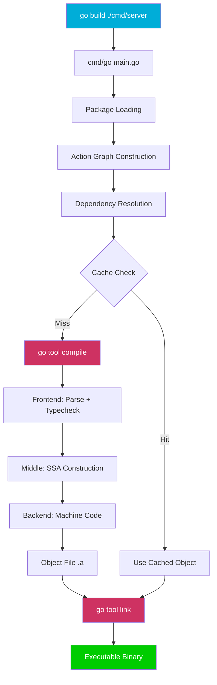
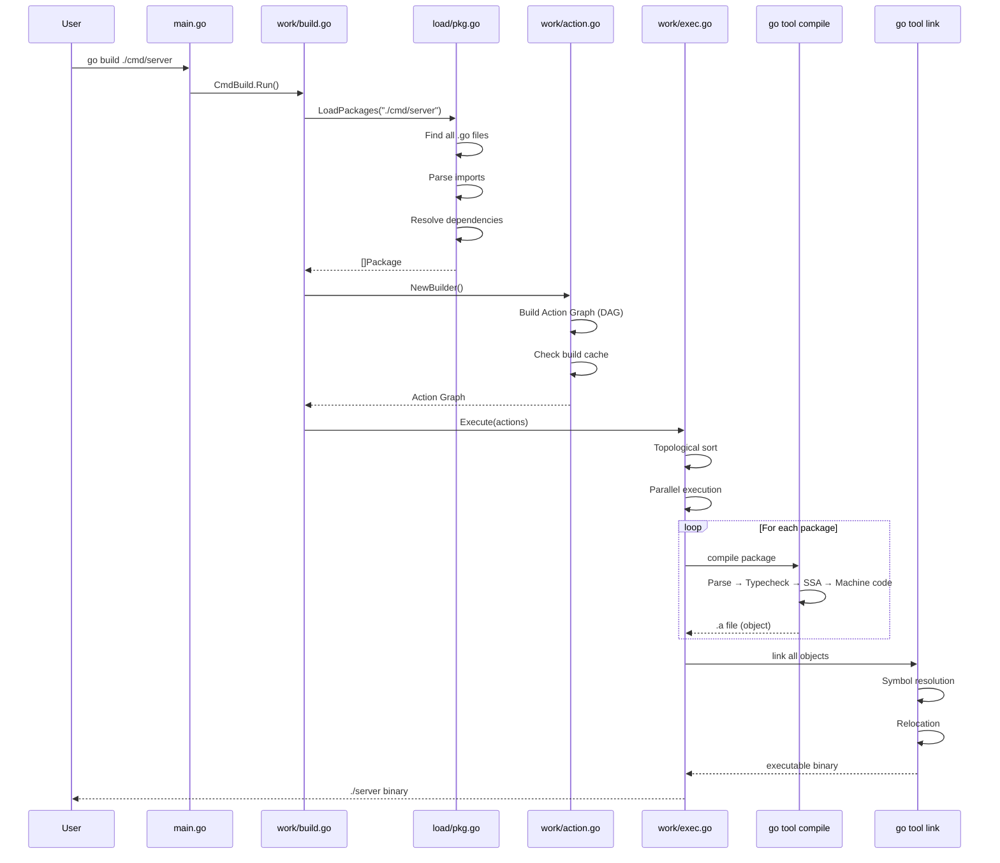
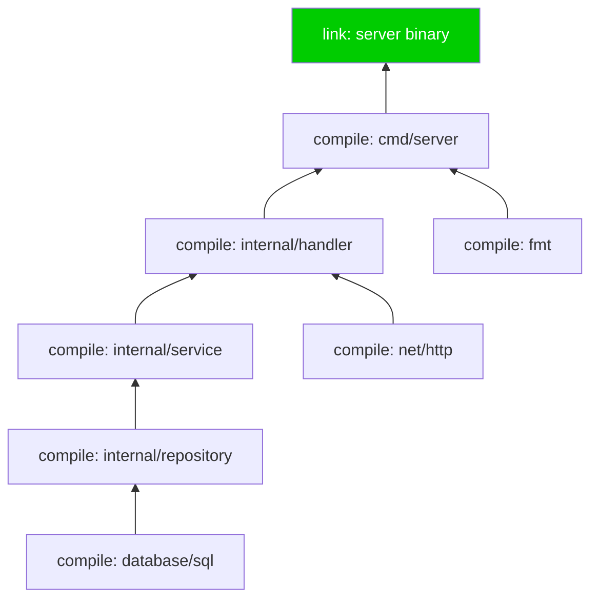
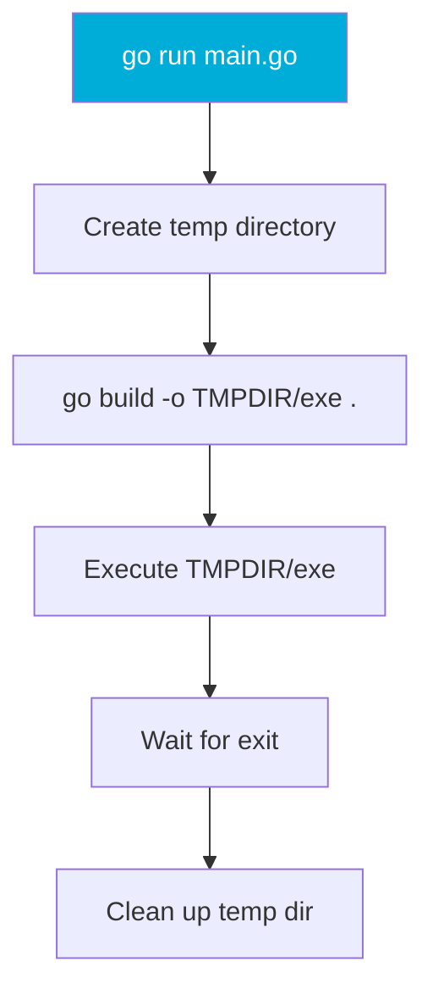
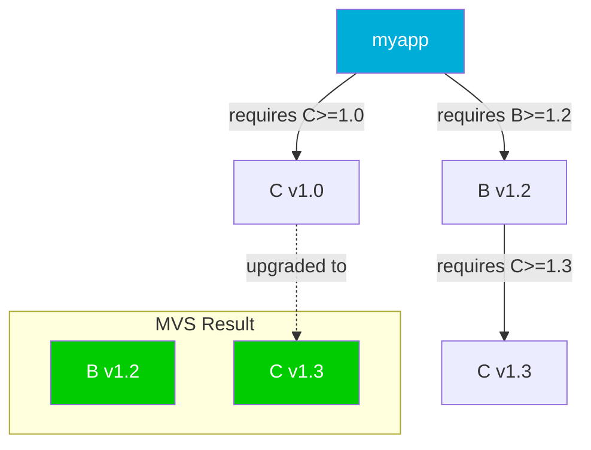
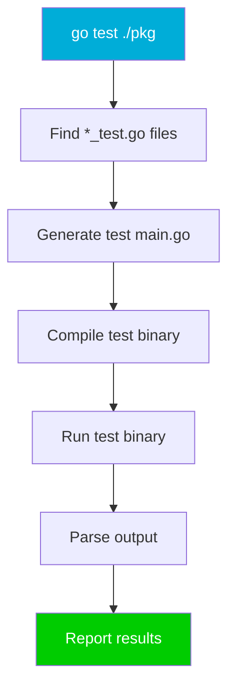

# Go Command — Professional Level (Under the Hood)

## Mundarija (Table of Contents)

1. [Introduction](#1-introduction)
2. [How It Works Internally](#2-how-it-works-internally)
3. [Runtime Deep Dive](#3-runtime-deep-dive)
4. [Compiler Perspective](#4-compiler-perspective)
5. [Memory Layout](#5-memory-layout)
6. [OS / Syscall Level](#6-os--syscall-level)
7. [Source Code Walkthrough](#7-source-code-walkthrough)
8. [Assembly Output Analysis](#8-assembly-output-analysis)
9. [Performance Internals](#9-performance-internals)
10. [Edge Cases at the Lowest Level](#10-edge-cases-at-the-lowest-level)
11. [Test](#11-test)
12. [Tricky Questions](#12-tricky-questions)
13. [Summary](#13-summary)
14. [Further Reading](#14-further-reading)

---

## 1. Introduction

Professional darajada biz Go command'ning **ichki ishlash mexanizmini** o'rganamiz — `go build` deyish oson, lekin uning ichida nima sodir bo'ladi? Source koddan binary'gacha bo'lgan yo'lni bosqichma-bosqich ko'rib chiqamiz.

Bu bo'limda biz:
- `cmd/go` source code tuzilmasini tahlil qilamiz
- Action graph (DAG) qanday qurilishini ko'ramiz
- Build cache algoritmini tushuntiramiz
- Minimum Version Selection (MVS) algoritmini o'rganamiz
- `go vet` analysis pass'larini ko'rib chiqamiz
- `go test` binary compilation jarayonini tahlil qilamiz
- `go tool compile` pipeline'ni bosqichma-bosqich ko'ramiz
- `go tool link` ichki mexanizmlarini o'rganamiz



---

## 2. How It Works Internally

### 2.1 cmd/go Source Code Structure

Go'ning `go` buyrug'ining source kodi `src/cmd/go/` papkasida joylashgan. Bu oddiy Go dastur — o'zi ham Go'da yozilgan.

```
src/cmd/go/
├── main.go                    # Entry point — command dispatch
├── alldocs.go                 # Auto-generated help text
├── internal/
│   ├── base/                  # Base command infrastructure
│   │   ├── base.go            # Command type definition
│   │   ├── env.go             # Environment variable handling
│   │   ├── flag.go            # Flag parsing utilities
│   │   ├── goflags.go         # GOFLAGS environment support
│   │   ├── path.go            # Path resolution
│   │   └── signal.go          # Signal handling (Ctrl+C)
│   │
│   ├── work/                  # Build system core
│   │   ├── build.go           # CmdBuild — "go build" entry point
│   │   ├── action.go          # Action graph (DAG) — KEY FILE
│   │   ├── exec.go            # Action execution engine
│   │   ├── gc.go              # Go compiler invocation
│   │   ├── gccgo.go           # GCC-Go compiler support
│   │   ├── buildid.go         # Build ID calculation
│   │   └── security.go        # Security policies
│   │
│   ├── load/                  # Package loading
│   │   ├── pkg.go             # Package discovery and loading
│   │   ├── search.go          # Pattern matching (./...)
│   │   ├── test.go            # Test package loading
│   │   └── flag.go            # Build flag handling
│   │
│   ├── modload/               # Module system
│   │   ├── init.go            # Module initialization
│   │   ├── load.go            # Module loading
│   │   ├── query.go           # Version queries
│   │   ├── mvs.go             # MVS algorithm wrapper
│   │   ├── vendor.go          # Vendor directory support
│   │   └── search.go          # Module search
│   │
│   ├── modfetch/              # Module fetching
│   │   ├── fetch.go           # Download logic
│   │   ├── cache.go           # Module cache
│   │   ├── coderepo.go        # VCS integration
│   │   ├── proxy.go           # GOPROXY client
│   │   └── sumdb.go           # Checksum database client
│   │
│   ├── modcmd/                # Module commands
│   │   ├── init.go            # "go mod init"
│   │   ├── tidy.go            # "go mod tidy"
│   │   ├── download.go        # "go mod download"
│   │   ├── edit.go            # "go mod edit"
│   │   ├── vendor.go          # "go mod vendor"
│   │   └── verify.go          # "go mod verify"
│   │
│   ├── test/                  # Test command
│   │   ├── test.go            # "go test" entry point
│   │   ├── testflag.go        # Test flag parsing
│   │   └── genflags.go        # Flag generation
│   │
│   ├── run/                   # Run command
│   │   └── run.go             # "go run" entry point
│   │
│   ├── vet/                   # Vet command
│   │   └── vet.go             # "go vet" entry point
│   │
│   ├── clean/                 # Clean command
│   │   └── clean.go           # "go clean" entry point
│   │
│   ├── doc/                   # Doc command
│   │   └── doc.go             # "go doc" entry point
│   │
│   ├── generate/              # Generate command
│   │   └── generate.go        # "go generate" entry point
│   │
│   ├── version/               # Version command
│   │   └── version.go         # "go version" entry point
│   │
│   └── envcmd/                # Env command
│       └── env.go             # "go env" entry point
```

### 2.2 Command Dispatch

`go build`, `go test`, `go run` — bularning barchasi bitta `go` binary'si orqali ishga tushadi. `main.go` command dispatch qiladi:

```go
// src/cmd/go/main.go (simplified)
package main

import (
    "cmd/go/internal/base"
    "cmd/go/internal/work"
    "cmd/go/internal/test"
    "cmd/go/internal/run"
    // ...
)

func init() {
    base.Go.Commands = []*base.Command{
        work.CmdBuild,     // go build
        run.CmdRun,        // go run
        test.CmdTest,      // go test
        // ... boshqa buyruqlar
    }
}

func main() {
    // 1. GOFLAGS'ni o'qish
    base.AppendFlags()

    // 2. Buyruq topish
    cmd := findCommand(os.Args[1:])

    // 3. Buyruqni ishga tushirish
    cmd.Run(cmd, args)
}
```

### 2.3 go build ishchi jarayoni (Step by Step)



---

## 3. Runtime Deep Dive

### 3.1 Action Graph (DAG)

`go build` barcha paketlar uchun **Directed Acyclic Graph (DAG)** quradi. Har bir node — bitta action (compile yoki link).

```go
// src/cmd/go/internal/work/action.go (simplified)

// Action represents a single build action.
type Action struct {
    Mode       string      // "build", "link", "install"
    Package    *load.Package
    Deps       []*Action   // This action depends on these
    Func       func(*Builder, context.Context, *Action) error
    built      string      // Output file path
    buildID    string      // Cache key

    // Execution state
    pending    int         // Number of deps not yet finished
    priority   int         // Execution priority
}

// Builder maintains the action graph.
type Builder struct {
    WorkDir    string
    actionCache map[cacheKey]*Action
}
```

Misol uchun quyidagi loyiha:

```
myapp/
├── cmd/server/main.go       # imports: myapp/internal/handler
├── internal/handler/         # imports: myapp/internal/service
├── internal/service/         # imports: myapp/internal/repository
└── internal/repository/      # imports: database/sql
```

Action Graph:



### 3.2 Action Execution

Action'lar **parallel** bajariladi. Dependency'si tugagan action darhol boshlanadi:

```go
// src/cmd/go/internal/work/exec.go (simplified)

func (b *Builder) Do(ctx context.Context, root *Action) {
    // Worker pool
    par := runtime.GOMAXPROCS(0) // CPU soni
    if par > 4 {
        par = 4 // Max 4 parallel compile
    }

    // Ready queue
    var ready []*Action
    for _, a := range allActions {
        if a.pending == 0 {
            ready = append(ready, a) // No deps → ready
        }
    }

    // Execute
    for len(ready) > 0 {
        a := ready[0]
        ready = ready[1:]

        go func(a *Action) {
            // Check cache first
            if cached := b.checkCache(a); cached {
                return
            }

            // Execute action
            a.Func(b, ctx, a)

            // Mark dependents as ready
            for _, dep := range a.triggers {
                dep.pending--
                if dep.pending == 0 {
                    ready = append(ready, dep)
                }
            }
        }(a)
    }
}
```

---

## 4. Compiler Perspective

### 4.1 go tool compile Pipeline

`go tool compile` Go source kodini **object file** (.a) ga aylantiradi. Bu jarayon bir necha bosqichdan iborat:


#### Stage 1: Lexing & Parsing

```go
// Source code
func Add(a, b int) int {
    return a + b
}
```

Lexer tokenlar yaratadi:

```
FUNC, IDENT("Add"), LPAREN, IDENT("a"), COMMA, IDENT("b"), IDENT("int"),
RPAREN, IDENT("int"), LBRACE, RETURN, IDENT("a"), ADD, IDENT("b"), RBRACE
```

Parser **AST (Abstract Syntax Tree)** yaratadi:

```
FuncDecl{
    Name: "Add"
    Type: FuncType{
        Params: [Field{Name:"a", Type:int}, Field{Name:"b", Type:int}]
        Results: [Field{Type:int}]
    }
    Body: BlockStmt{
        List: [ReturnStmt{
            Results: [BinaryExpr{X:a, Op:+, Y:b}]
        }]
    }
}
```

#### Stage 2: Type Checking

Type checker:
- Har bir expression'ning tipini aniqlaydi
- Tip mos kelishini tekshiradi
- Method set'larni hisoblaydi
- Interface satisfaction tekshiradi

```bash
# Type checker natijasini ko'rish
$ go build -gcflags="-W" main.go 2>&1 | head -20
```

#### Stage 3: SSA Construction & Optimization

**SSA (Static Single Assignment)** — har bir o'zgaruvchiga faqat **bir marta** qiymat beriladi:

```go
// Original Go code
func process(x int) int {
    y := x + 1
    y = y * 2
    return y
}
```

```
// SSA form
b1:
    v1 = Param{x}        // x parameter
    v2 = Const{1}
    v3 = Add v1, v2       // y = x + 1
    v4 = Const{2}
    v5 = Mul v3, v4       // y = y * 2
    Return v5
```

SSA Optimization passes:

```bash
# SSA passlarini ko'rish
$ GOSSAFUNC=process go build main.go
# ssa.html fayl yaratiladi — browser'da oching

# SSA pass'lar ro'yxati (partial):
# - opt: Generic optimization
# - deadcode: Dead code elimination
# - prove: Bounds check elimination
# - lower: Lower to machine-specific ops
# - regalloc: Register allocation
# - schedule: Instruction scheduling
```

```bash
# SSA html output yaratish
$ GOSSAFUNC=Add go build -gcflags="-d=ssa/check_bce/debug=1" main.go
# Dumped SSA to ssa.html
```

#### Stage 4: Machine Code Generation

SSA'dan mashina kodi yaratiladi:

```bash
# Assembly output
$ go tool compile -S main.go
"".Add STEXT nosplit size=10 args=0x18 locals=0x0
    0x0000 MOVQ "".a+8(SP), AX
    0x0005 ADDQ "".b+16(SP), AX
    0x000a MOVQ AX, "".~r2+24(SP)
    0x000f RET
```

### 4.2 Escape Analysis

Compiler har bir o'zgaruvchining **stack'da** qolishini yoki **heap'ga** ko'chishini aniqlaydi:

```go
package main

func stackOnly() int {
    x := 42           // stack'da — funksiya tugaganda yo'qoladi
    return x
}

func escapesToHeap() *int {
    x := 42           // heap'ga ko'chadi — pointer qaytarilyapti
    return &x
}

func noEscape(p *int) int {
    return *p          // p heap'ga ko'chmaydi — faqat o'qilyapti
}
```

```bash
$ go build -gcflags="-m=2" main.go
./main.go:3:6: can inline stackOnly with cost 2
./main.go:4:2: x does not escape
./main.go:8:6: can inline escapesToHeap with cost 4
./main.go:9:2: x escapes to heap:
./main.go:9:2:   flow: ~r0 = &x:
./main.go:9:2:     from &x (address-of) at ./main.go:10:9
./main.go:9:2:     from return &x (return) at ./main.go:10:2
./main.go:13:6: can inline noEscape with cost 3
./main.go:13:16: p does not escape
```

### 4.3 Inlining

Compiler kichik funksiyalarni **inline** qiladi — function call overhead'ni yo'qotadi:

```go
// Bu funksiya inline bo'ladi (cost kichik)
func add(a, b int) int {
    return a + b
}

// Bu inline bo'lmaydi (cost katta)
func complexProcess(data []byte) ([]byte, error) {
    // ... ko'p kod
}

// Inline bo'lishni oldini olish
//go:noinline
func mustNotInline(x int) int {
    return x * 2
}
```

```bash
$ go build -gcflags="-m" main.go
./main.go:3:6: can inline add
./main.go:8:6: cannot inline complexProcess: function too complex
./main.go:15:6: cannot inline mustNotInline: marked go:noinline
./main.go:20:10: inlining call to add
```

---

## 5. Memory Layout

### 5.1 Go Binary Memory Layout

```
+---------------------------+
|       ELF Header          |  Binary format header
+---------------------------+
|     Program Headers       |  Segment descriptions
+---------------------------+
|       .text               |  Executable code (machine instructions)
+---------------------------+
|       .rodata             |  Read-only data (string constants, etc.)
+---------------------------+
|       .data               |  Initialized global variables
+---------------------------+
|       .bss                |  Uninitialized global variables
+---------------------------+
|       .noptrdata          |  Go-specific: data without pointers
+---------------------------+
|       .noptrbss           |  Go-specific: bss without pointers
+---------------------------+
|       .gopclntab          |  Go-specific: PC-line table (stack traces)
+---------------------------+
|       .gosymtab           |  Go-specific: symbol table
+---------------------------+
|       .gostring           |  Go-specific: string data
+---------------------------+
|       .go.buildinfo       |  Module & version info
+---------------------------+
|       .note.go.buildid    |  Build ID
+---------------------------+
|       .symtab             |  Symbol table (if not stripped)
+---------------------------+
|       .strtab             |  String table (if not stripped)
+---------------------------+
|       .dwarf_*            |  Debug info (if not stripped)
+---------------------------+
```

```bash
# Binary section'larini ko'rish
$ go build -o app .
$ readelf -S app | head -30
  [Nr] Name              Type             Address           Off    Size
  [ 1] .text             PROGBITS         0000000000401000  001000 0a2e10
  [ 2] .rodata           PROGBITS         00000000004a4000  0a4000 042830
  [ 3] .gopclntab        PROGBITS         00000000004e7000  0e7000 058a40
  [ 4] .go.buildinfo     PROGBITS         0000000000540000  140000 000060
  ...

# Section hajmlarini ko'rish
$ size -A app
app  :
section            size      addr
.text              667152    4198400
.rodata            272432    4882432
.gopclntab         362048    5074944
.data              31488     5570560
.bss               178752    5603328
Total              1839008

# -s -w bilan solishtirish
$ go build -ldflags="-s -w" -o app_stripped .
$ size -A app_stripped
# .symtab va .dwarf_* yo'q — sezilarli kichikroq
```

### 5.2 .gopclntab — PC-Line Table

`.gopclntab` section Go'ning eng muhim metadata'si — u **program counter** dan **source file:line** mapping'ni saqlaydi. Bu panic stack trace'lar uchun kerak.

```go
// Runtime stack trace yaratish
package main

import "runtime"

func where() (string, int) {
    _, file, line, _ := runtime.Caller(0)
    return file, line
}
```

```bash
# .gopclntab ni o'qish
$ go tool objdump -s main.where app
TEXT main.where(SB)
  main.go:7  0x497e20  MOVQ $0, 0x8(SP)
  main.go:7  0x497e29  CALL runtime.Caller(SB)
```

### 5.3 Build ID Structure

Go binary'lari **build ID** saqlaydi — bu 4 qismdan iborat hash:

```bash
$ go tool buildid app
actionID1/contentID1/actionID2/contentID2
```

| Qism | Ma'nosi |
|------|---------|
| actionID1 | Compile action hash |
| contentID1 | Compiled content hash |
| actionID2 | Link action hash |
| contentID2 | Linked binary content hash |

```bash
# Build ID tuzilmasi
$ go tool buildid app
abcd1234/efgh5678/ijkl9012/mnop3456

# Bu cache key sifatida ishlatiladi
# Agar actionID mos kelsa → cache hit
```

---

## 6. OS / Syscall Level

### 6.1 go run ichki mexanizmi

`go run` aslida quyidagilarni qiladi:



```bash
# go run nimalar qilayotganini ko'rish
$ go run -x main.go 2>&1
WORK=/tmp/go-build3456789012
mkdir -p $WORK/b001/
cat >$WORK/b001/importcfg.link << 'EOF'
...
EOF
/usr/local/go/pkg/tool/linux_amd64/link -o $WORK/b001/exe/a.out ...
$WORK/b001/exe/a.out  # <-- binary'ni ishga tushirish
```

### 6.2 go build va exec syscall'lari

```bash
# Syscall'larni ko'rish (Linux)
$ strace -f -e trace=execve go build -o app . 2>&1 | grep tool
[pid 12345] execve("/usr/local/go/pkg/tool/linux_amd64/compile", ...)
[pid 12346] execve("/usr/local/go/pkg/tool/linux_amd64/compile", ...)
[pid 12347] execve("/usr/local/go/pkg/tool/linux_amd64/compile", ...)
[pid 12348] execve("/usr/local/go/pkg/tool/linux_amd64/link", ...)

# File operations
$ strace -f -e trace=openat,write go build -o app . 2>&1 | grep -E "\.go|\.a|a\.out"
openat(AT_FDCWD, "main.go", O_RDONLY) = 3
openat(AT_FDCWD, "/tmp/.../b001/_pkg_.a", O_WRONLY|O_CREAT) = 4
openat(AT_FDCWD, "/tmp/.../b001/exe/a.out", O_WRONLY|O_CREAT) = 5
```

### 6.3 Build Cache — Filesystem Level

```bash
# Cache papkasi
$ ls $(go env GOCACHE)
00/ 01/ 02/ ... fe/ ff/     # 256 sub-directory (hex)
log.txt                      # Cache log
README                       # Documentation

# Cache entry tuzilmasi
$ ls $(go env GOCACHE)/ab/
abcd1234567890abcdef-a    # Object file (compiled package)
abcd1234567890abcdef-d    # Build ID → action cache

# Cache key = SHA256(inputs)
# inputs = source files + compiler flags + Go version + imports
```

---

## 7. Source Code Walkthrough

### 7.1 go build — bosqichma-bosqich

**Step 1: CmdBuild.Run()**

```go
// src/cmd/go/internal/work/build.go (simplified)

var CmdBuild = &base.Command{
    UsageLine: "go build [-o output] [build flags] [packages]",
    Short:     "compile packages and dependencies",
    Run:       runBuild,
}

func runBuild(ctx context.Context, cmd *base.Command, args []string) {
    // 1. Load packages
    pkgs := load.PackagesAndErrors(ctx, load.PackageOpts{}, args)

    // 2. Create builder
    b := NewBuilder("")
    defer b.Close()

    // 3. Build action graph
    depMode := ModeBuild
    a := &Action{Mode: "go build"}
    for _, p := range pkgs {
        a.Deps = append(a.Deps, b.AutoAction(ModeInstall, depMode, p))
    }

    // 4. Execute
    b.Do(ctx, a)
}
```

**Step 2: Package Loading**

```go
// src/cmd/go/internal/load/pkg.go (simplified)

func LoadPackages(ctx context.Context, opts PackageOpts, patterns []string) []*Package {
    // 1. Resolve patterns (./... → actual packages)
    matches := search.MatchPackages(patterns)

    // 2. Load each package
    var pkgs []*Package
    for _, match := range matches {
        p := loadPackage(ctx, match)

        // 3. Parse Go files
        for _, file := range p.GoFiles {
            fset := token.NewFileSet()
            ast, _ := parser.ParseFile(fset, file, nil, parser.ImportsOnly)
            p.Imports = append(p.Imports, extractImports(ast)...)
        }

        pkgs = append(pkgs, p)
    }

    return pkgs
}
```

**Step 3: Action Graph Construction**

```go
// src/cmd/go/internal/work/action.go (simplified)

func (b *Builder) CompileAction(mode BuildMode, p *Package) *Action {
    // Check if already created
    if a := b.actionCache[p]; a != nil {
        return a
    }

    // Create compile action
    a := &Action{
        Mode:    "build",
        Package: p,
        Func:    (*Builder).build,
    }

    // Add dependencies
    for _, imp := range p.Imports {
        dep := b.CompileAction(mode, imp)
        a.Deps = append(a.Deps, dep)
        a.pending++
    }

    b.actionCache[p] = a
    return a
}
```

### 7.2 Build Cache Algorithm

Build cache **content-addressable** — cache key input'larning SHA256 hash'i:

```go
// Cache key computation (simplified)
func computeCacheKey(p *Package, flags BuildFlags) string {
    h := sha256.New()

    // 1. Go version
    h.Write([]byte(runtime.Version()))

    // 2. Build flags
    h.Write([]byte(flags.String()))

    // 3. Source file contents
    for _, file := range p.GoFiles {
        content, _ := os.ReadFile(file)
        h.Write(content)
    }

    // 4. Import config (dependency build IDs)
    for _, dep := range p.Deps {
        h.Write([]byte(dep.BuildID))
    }

    // 5. Environment (GOOS, GOARCH, etc.)
    h.Write([]byte(os.Getenv("GOOS")))
    h.Write([]byte(os.Getenv("GOARCH")))

    return hex.EncodeToString(h.Sum(nil))
}
```

```bash
# Cache hit/miss ko'rish
$ go build -x ./... 2>&1 | grep -E "cache|compile"
# cache hit → "reusing cached result"
# cache miss → "compile" command chaqiriladi

# Cache invalidation sabablari:
# - Source file o'zgargan
# - Build flags o'zgargan
# - Go version o'zgargan
# - Dependency o'zgargan
# - Environment variable o'zgargan
```

### 7.3 MVS (Minimum Version Selection) Algorithm

Go module tizimining asosi — **MVS** — barcha dependency'lar orasidan **eng kichik** mos keladigan versiyani tanlaydi.

```
Module A v1.0 requires:
  B >= v1.2
  C >= v1.0

Module B v1.2 requires:
  C >= v1.3

Module B v1.5 (latest) requires:
  C >= v1.4

MVS result:
  B = v1.2 (MINIMUM that satisfies A's requirement)
  C = v1.3 (MINIMUM that satisfies B v1.2's requirement)

NOT:
  B = v1.5 (latest) ← npm/cargo shunday qiladi
  C = v1.4 ← B v1.5 talab qiladi
```

```go
// src/cmd/go/internal/mvs/mvs.go (simplified)

// BuildList returns the build list for the given root module.
func BuildList(target module.Version, reqs Reqs) ([]module.Version, error) {
    // 1. Start with target
    list := []module.Version{target}
    visited := map[module.Version]bool{target: true}

    // 2. BFS — har bir module'ning requirement'larini to'plash
    queue := []module.Version{target}
    for len(queue) > 0 {
        m := queue[0]
        queue = queue[1:]

        required, _ := reqs.Required(m)
        for _, r := range required {
            // 3. Eng yuqori minimum versiyani tanlash
            if existing, ok := findInList(list, r.Path); ok {
                if semver.Compare(r.Version, existing.Version) > 0 {
                    // Yangi requirement yuqoriroq → yangilash
                    updateInList(list, r)
                }
            } else {
                list = append(list, r)
            }

            if !visited[r] {
                visited[r] = true
                queue = append(queue, r)
            }
        }
    }

    return list, nil
}
```



### 7.4 go vet Analysis Passes

`go vet` bir nechta **analysis pass** larni ishga tushiradi. Har bir pass muayyan turdagi xatolarni topadi:

```go
// go vet analysis pass'lari (src/cmd/vet/main.go)
var analyzers = []*analysis.Analyzer{
    // Format xatolari
    printf.Analyzer,       // Printf format string xatolari

    // Type xatolari
    assign.Analyzer,       // Useless assignments
    copylock.Analyzer,     // Mutex copy

    // Logic xatolari
    bools.Analyzer,        // Boolean expression xatolari
    nilfunc.Analyzer,      // nil function comparison

    // Performance
    loopclosure.Analyzer,  // Loop variable capture

    // Concurrency
    atomic.Analyzer,       // Atomic operation xatolari

    // Code quality
    unreachable.Analyzer,  // Unreachable code
    shadow.Analyzer,       // Variable shadowing
    structtag.Analyzer,    // Struct tag validation
    tests.Analyzer,        // Test function signature

    // ... va boshqalar (30+ analyzers)
}
```

Har bir analyzer `analysis.Analyzer` interface'ni implement qiladi:

```go
// golang.org/x/tools/go/analysis

type Analyzer struct {
    Name     string
    Doc      string
    Run      func(*Pass) (interface{}, error)
    Requires []*Analyzer  // Dependency analyzers
}

type Pass struct {
    Fset      *token.FileSet
    Files     []*ast.File
    TypesInfo *types.Info
    Report    func(Diagnostic)
}
```

```bash
# Barcha analyzers ro'yxati
$ go vet -help 2>&1 | head -30

# Aniq analyzer bilan
$ go vet -printf ./...
$ go vet -copylocks ./...
$ go vet -shadow ./...
```

### 7.5 go test — Test Binary Compilation

`go test` aslida maxsus binary yaratib ishga tushiradi:



```go
// Generated test main (simplified)
// $WORK/b001/_testmain.go
package main

import (
    "os"
    "testing"
    "testing/internal/testdeps"

    _test "myapp/internal/handler"
)

var tests = []testing.InternalTest{
    {"TestCreateUser", _test.TestCreateUser},
    {"TestGetUser", _test.TestGetUser},
    {"TestDeleteUser", _test.TestDeleteUser},
}

var benchmarks = []testing.InternalBenchmark{
    {"BenchmarkCreateUser", _test.BenchmarkCreateUser},
}

func main() {
    m := testing.MainStart(testdeps.TestDeps{}, tests, benchmarks, nil, nil)
    os.Exit(m.Run())
}
```

```bash
# Test binary'ni saqlash
$ go test -c -o handler.test ./internal/handler/
$ ls -lh handler.test
-rwxr-xr-x 1 user user 12M handler.test

# Test binary'ni to'g'ridan-to'g'ri ishga tushirish
$ ./handler.test -test.v -test.run TestCreateUser
=== RUN   TestCreateUser
--- PASS: TestCreateUser (0.00s)
PASS
```

---

## 8. Assembly Output Analysis

### 8.1 Simple function

```go
package main

func Add(a, b int) int {
    return a + b
}
```

```bash
$ go tool compile -S main.go
```

```asm
"".Add STEXT nosplit size=15 args=0x18 locals=0x0 funcid=0x0
    ; Function prologue
    0x0000 TEXT    "".Add(SB), NOSPLIT, $0-24
    ; a ni AX ga yuklash
    0x0000 MOVQ    "".a+8(SP), AX
    ; b ni AX ga qo'shish
    0x0005 ADDQ    "".b+16(SP), AX
    ; Natijani stack'ga yozish
    0x000a MOVQ    AX, "".~r0+24(SP)
    ; Return
    0x000f RET
```

| Instruction | Ma'nosi |
|-------------|---------|
| `TEXT` | Funksiya boshlanishi |
| `NOSPLIT` | Stack split tekshiruvi kerak emas |
| `$0-24` | 0 byte local, 24 byte arguments |
| `MOVQ` | 64-bit qiymat ko'chirish |
| `ADDQ` | 64-bit qo'shish |
| `RET` | Return |

### 8.2 Escape analysis assembly'da

```go
func heapAlloc() *int {
    x := 42
    return &x  // x heap'ga ko'chadi
}

func stackOnly() int {
    x := 42
    return x   // x stack'da qoladi
}
```

```bash
$ go tool compile -S main.go 2>&1
```

```asm
; heapAlloc — runtime.newobject chaqiradi (heap allocation)
"".heapAlloc STEXT size=60
    0x0000 TEXT    "".heapAlloc(SB), ABIInternal, $24-0
    0x0014 LEAQ    type.int(SB), AX
    0x001b CALL    runtime.newobject(SB)    ; <-- HEAP ALLOCATION
    0x0020 MOVQ    $42, (AX)
    0x0027 MOVQ    AX, "".~r0+32(SP)
    0x002c RET

; stackOnly — heap allocation yo'q
"".stackOnly STEXT nosplit size=7
    0x0000 TEXT    "".stackOnly(SB), NOSPLIT, $0-8
    0x0000 MOVQ    $42, "".~r0+8(SP)       ; <-- TO'G'RIDAN-TO'G'RI STACK
    0x0009 RET
```

### 8.3 Interface method dispatch

```go
type Stringer interface {
    String() string
}

type MyType struct {
    Name string
}

func (m MyType) String() string {
    return m.Name
}

func printString(s Stringer) {
    _ = s.String()
}
```

```asm
; Interface method dispatch — itab orqali
"".printString STEXT size=45
    0x0000 TEXT    "".printString(SB), ABIInternal, $16-16
    ; Interface value = (itab pointer, data pointer)
    0x000e MOVQ    "".s+24(SP), AX       ; data pointer
    0x0013 MOVQ    "".s+16(SP), CX       ; itab pointer
    0x0018 MOVQ    24(CX), CX            ; itab.fun[0] = String method
    0x001c CALL    CX                     ; <-- INDIRECT CALL (itab orqali)
    0x001e RET
```

---

## 9. Performance Internals

### 9.1 Build Cache Internals

```bash
# Cache directory tuzilmasi
$ tree $(go env GOCACHE) -L 1 | head -20
/home/user/.cache/go-build/
├── 00/
├── 01/
├── ...
├── fe/
├── ff/
├── log.txt    # Cache operations log
└── README

# Cache entry nimaligi
$ ls -la $(go env GOCACHE)/ab/ | head -5
-rw-r--r-- 1 user user  12345 Dec 15 10:30 abcdef1234567890-a  # Object file
-rw-r--r-- 1 user user    256 Dec 15 10:30 abcdef1234567890-d  # Action cache entry

# Cache hajmi
$ du -sh $(go env GOCACHE)
312M    /home/user/.cache/go-build
```

### 9.2 Parallel Compilation

```bash
# Default parallelism
$ go env GOMAXPROCS
8

# go build -p flag bilan nazorat
$ go build -p 1 ./...    # Sequential — sekin
$ go build -p 4 ./...    # 4 parallel
$ go build -p 16 ./...   # 16 parallel

# Amalda nechta compile process ishga tushganini ko'rish
$ go build -x ./... 2>&1 | grep compile | wc -l
15  # 15 ta compile command
```

### 9.3 Linker Performance

```bash
# Link vaqtini o'lchash
$ time go tool link -o app $WORK/b001/_pkg_.a
real    0m0.234s

# Link vaqtining asosiy qismlari:
# 1. Symbol resolution — barcha symbol'larni topish
# 2. Dead code elimination — ishlatilmagan kodlarni o'chirish
# 3. Relocation — address'larni to'g'rilash
# 4. DWARF generation — debug info (agar -w bo'lmasa)
# 5. ELF/Mach-O/PE generation — binary format

# -s -w bilan link tezroq (DWARF yaratmaydi)
$ time go build -ldflags="-s -w" -o app .
real    0m1.234s   # ~20% tezroq
```

### 9.4 Module Download Performance

```bash
# Module cache tuzilmasi
$ tree $(go env GOMODCACHE) -L 2 | head -20
/home/user/go/pkg/mod/
├── cache/
│   ├── download/           # Downloaded modules
│   │   ├── github.com/
│   │   └── golang.org/
│   └── lock/               # Download locks
├── github.com/
│   ├── gin-gonic/
│   └── fatih/
└── golang.org/
    └── x/

# Module download tezligini oshirish
$ go env -w GOPROXY=https://proxy.golang.org,direct
# GOPROXY — Google proxy'si orqali yuklab olish (tezroq va cache'langan)

# Parallel download
$ go mod download -x 2>&1 | wc -l
# Har bir module alohida goroutine'da yuklanadi
```

---

## 10. Edge Cases at the Lowest Level

### 10.1 Build ID collision

Build ID 4 ta SHA256 hash'dan tashkil topadi. **Theoretical collision** ehtimoli:

```
P(collision) = 1 - e^(-n^2 / (2 * 2^256))
```

Amalda collision deyarli mumkin emas (2^128 operatsiya kerak).

### 10.2 Cache race condition

Bir vaqtda ikki `go build` bir xil paketni compile qilsa:

```bash
# Terminal 1
$ go build ./...

# Terminal 2 (bir vaqtda)
$ go build ./...
```

Go cache **atomic write** ishlatadi — temporary file'ga yozib, keyin `rename()` syscall bilan almashtiradi. Bu POSIX'da atomic operatsiya.

### 10.3 CGO va compiler interaction

```bash
# CGO yoqilganda build jarayoni murakkablashadi
$ CGO_ENABLED=1 go build -x . 2>&1 | grep -E "gcc|compile"
# 1. Go compiler Go fayllarni compile qiladi
# 2. GCC C fayllarni compile qiladi
# 3. Go linker ikkalasini birlashtiradi

# Muammo: GCC turli platformalarda turlicha
# Shuning uchun CGO=0 reproducible build uchun afzal
```

### 10.4 .gopclntab hajmi

`.gopclntab` (PC-line table) binary'ning **katta qismini** egallaydi:

```bash
$ readelf -S app | grep gopclntab
  [ 4] .gopclntab        PROGBITS  00000000004e7000 0e7000 058a40 00   A  0   0  32

# 362KB — bu faqat PC→line mapping!
# -s flag buni o'chirmaydi — faqat .symtab o'chiradi
# .gopclntab har doim qoladi (runtime panic uchun kerak)
```

### 10.5 Floating point va cross-compilation

```go
// Bu kod turli platformalarda turli natija berishi mumkin
func calc() float64 {
    return 0.1 + 0.2  // IEEE 754
}
```

Go garchi barcha platformalarda IEEE 754 ishlatsa ham, **floating point intermediate precision** turli CPU'larda farq qilishi mumkin (x87 vs SSE).

```bash
# Turli GOARCH uchun assembly farqini ko'rish
$ GOARCH=amd64 go tool compile -S calc.go  # SSE instructions
$ GOARCH=386 go tool compile -S calc.go    # x87 instructions
```

---

## 11. Test

### 11.1 Savol

Go build jarayonida Action Graph (DAG) nima maqsadda quriladi?

- A) Fayllarni o'chirish tartibi
- B) Paketlarni parallel compile qilish tartibini aniqlash
- C) Test ishga tushirish tartibi
- D) Import tartibi

<details>
<summary>Javob</summary>

**B)** Action Graph (DAG) har bir paketning dependency'larini aniqlaydi va parallel compile qilish tartibini belgilaydi. Dependency'si tugagan paket darhol compile bo'lishi mumkin — bu build tezligini oshiradi.

</details>

### 11.2 Savol

Build cache key nimalardan tashkil topadi?

- A) Faqat source file hash
- B) Source hash + Go version + build flags + import config + environment
- C) Faqat Go version va file name
- D) Binary hash

<details>
<summary>Javob</summary>

**B)** Build cache key = SHA256(Go version + build flags + source content + import config (dependency build IDs) + environment variables). Shuning uchun istalgan o'zgarish cache miss'ga olib keladi.

</details>

### 11.3 Savol

MVS (Minimum Version Selection) algoritmining npm/cargo'dan asosiy farqi nima?

- A) MVS tezroq
- B) MVS eng kichik mos versiyani tanlaydi, boshqalar eng yangisini
- C) MVS faqat Go uchun ishlaydi
- D) Farqi yo'q

<details>
<summary>Javob</summary>

**B)** MVS har doim **minimum** mos keladigan versiyani tanlaydi. npm/cargo esa default holatda **latest** compatible versiyani tanlaydi. MVS'ning afzalligi: yangi versiya avtomatik kirmaydi, shuning uchun build barqarorroq.

</details>

### 11.4 Savol

`go vet` ichida nechta analysis pass bor (taxminan)?

- A) 5-10
- B) 30+
- C) 3
- D) 100+

<details>
<summary>Javob</summary>

**B)** `go vet` **30+** analysis pass ishga tushiradi: printf, copylocks, shadow, atomic, unreachable, structtag, tests va boshqalar. Har bir pass muayyan turdagi xatolarni topadi.

</details>

### 11.5 Savol

`go test` ichida nima sodir bo'ladi?

- A) Test fayllar to'g'ridan-to'g'ri interpret qilinadi
- B) Maxsus test main.go generate qilinadi, test binary compile va execute qilinadi
- C) Faqat assertion'lar tekshiriladi
- D) JVM-like virtual machine ishga tushadi

<details>
<summary>Javob</summary>

**B)** `go test` quyidagilarni qiladi: 1) `_test.go` fayllarni topadi, 2) `_testmain.go` generate qiladi (barcha test funksiyalar ro'yxati bilan), 3) test binary compile qiladi, 4) binary'ni ishga tushiradi, 5) natijalarni parse qiladi.

</details>

### 11.6 Savol

Escape analysis natijasida `moved to heap` nima degani?

- A) O'zgaruvchi global bo'ldi
- B) O'zgaruvchi stack'dan heap'ga ko'chdi — GC pressure oshdi
- C) O'zgaruvchi o'chirildi
- D) O'zgaruvchi register'ga ko'chdi

<details>
<summary>Javob</summary>

**B)** `moved to heap` — compiler aniqladi ki bu o'zgaruvchining lifetime funksiya lifetime'dan uzun (masalan, pointer qaytarilsa). Shuning uchun u stack'da emas, heap'da yaratiladi. Bu `runtime.newobject()` syscall va GC pressure oshishi demak.

</details>

### 11.7 Savol

`.gopclntab` section nima uchun kerak?

- A) Binary hajmini kamaytirish
- B) Program counter → source file:line mapping (stack traces uchun)
- C) Module dependency'lar ro'yxati
- D) Build cache

<details>
<summary>Javob</summary>

**B)** `.gopclntab` (PC-line table) har bir machine instruction'ning qaysi source fayl va qator raqamiga mos kelishini saqlaydi. Panic bo'lganda Go runtime bu jadvaldan foydalanib stack trace yaratadi. Bu section `-s` flag bilan ham o'chirilmaydi.

</details>

### 11.8 Savol

Go compiler inlining uchun funksiyaning "cost"ini qanday hisoblaydi?

- A) Source kod qatorlar soni
- B) AST node'lar soni va murakkabligi
- C) Execution vaqti
- D) Memory usage

<details>
<summary>Javob</summary>

**B)** Go compiler funksiyaning AST (Abstract Syntax Tree) node'lari sonini va turini hisoblab "cost" aniqlaydi. Default budget 80. Agar cost <= 80 bo'lsa, funksiya inline bo'ladi. `go build -gcflags="-m=2"` bilan har bir funksiyaning cost'ini ko'rish mumkin.

</details>

---

## 12. Tricky Questions

### 12.1 `go build` da cache hit bo'lsa ham, linker qayta ishga tushirish kerakmi?

<details>
<summary>Javob</summary>

**Har doim emas.** Go build cache ikki darajali:

1. **Package cache** — har bir paketning compile natijasi (`.a` file)
2. **Binary cache** — yakuniy binary

Agar barcha paket cache hit bo'lsa VA build flags o'zgarmagan bo'lsa, binary ham cache'dan olinadi — linker ishga tushmaydi.

```bash
# Birinchi build
$ time go build -o app .
real    0m2.345s

# Ikkinchi build (to'liq cache hit — linker ham skip)
$ time go build -o app .
real    0m0.089s  # Juda tez — faqat cache check

# Flag o'zgartirish — linker qayta ishlaydi
$ time go build -ldflags="-X main.V=new" -o app .
real    0m0.456s  # Linker ishladi, lekin compile skip
```

</details>

### 12.2 `go tool compile` ning `-S` flag'i va `go tool objdump` o'rtasidagi farq nima?

<details>
<summary>Javob</summary>

| Tool | Input | Output | Stage |
|------|-------|--------|-------|
| `go tool compile -S` | `.go` source | Plan9 assembly | Compile-time (optimization natijasi) |
| `go tool objdump` | binary/object | Real machine assembly | Post-link (yakuniy binary) |

```bash
# compile -S: Plan9 assembly (Go's abstract assembly)
$ go tool compile -S main.go
MOVQ    "".a+8(SP), AX

# objdump: Actual x86 assembly
$ go tool objdump -s main.Add app
  main.go:3   0x497e20   488b442408   MOVQ 0x8(SP), AX
```

`compile -S` **Plan9 assembly** ko'rsatadi — bu Go'ning abstract instruction set'i. `objdump` esa yakuniy **machine-specific** instruction'larni ko'rsatadi.

</details>

### 12.3 Nima uchun Go binary hajmining katta qismi `.text` emas?

<details>
<summary>Javob</summary>

Ko'pchilik `.text` (executable code) katta deb o'ylaydi, lekin aslida:

```bash
$ size -A app
section            size      addr
.text              667152    4198400    # 39% — executable code
.rodata            272432    4882432    # 16% — string constants, etc.
.gopclntab         362048    5074944    # 22% — PC-line table!
.data              31488     5570560    # 2%  — initialized globals
.bss               178752    5603328    # 11% — uninitialized globals
.symtab            120000    ...        # 7%  — symbol table
.dwarf_*           50000     ...        # 3%  — debug info
```

`.gopclntab` (22%) — stack trace uchun kerak. Bu o'chirilmaydi.
`.symtab` + `.dwarf_*` — `-s -w` bilan o'chiriladi.

Shuning uchun `-s -w` ~30% kamaytiradi (symtab + dwarf), lekin `.gopclntab` qoladi.

</details>

### 12.4 `GOSSAFUNC` environment variable nima qiladi?

<details>
<summary>Javob</summary>

`GOSSAFUNC` compiler'ga ma'lum funksiyaning SSA transformation'larini HTML faylga dump qilishni aytadi:

```bash
$ GOSSAFUNC=Add go build main.go
# Dumped SSA to ssa.html

# Browser'da ochsangiz:
# - Har bir SSA pass natijasi ko'rinadi
# - Optimizatsiya qanday sodir bo'lganini bosqichma-bosqich ko'rasiz
# - Qaysi qator qaysi instruction'ga aylangani ko'rinadi
```

SSA pass'lar tartibi:
1. `start` — initial SSA
2. `opt` — generic optimization
3. `deadcode` — dead code elimination
4. `prove` — bounds check elimination
5. `lower` — lower to machine ops
6. `regalloc` — register allocation
7. `schedule` — instruction scheduling
8. `final` — yakuniy natija

Bu Go compiler'ni debug qilishning eng kuchli vositasi.

</details>

### 12.5 Go binary'da `runtime.newobject` necha marta chaqirilishini compile-time'da qanday bilish mumkin?

<details>
<summary>Javob</summary>

Escape analysis orqali:

```bash
# Har bir "moved to heap" = bitta runtime.newobject potential call
$ go build -gcflags="all=-m" ./... 2>&1 | grep "moved to heap" | wc -l
42  # 42 ta variable heap'ga ko'chishi mumkin

# Aniq funksiya uchun
$ go build -gcflags="-m=2" main.go 2>&1 | grep "escapes to heap"
./main.go:15:2: x escapes to heap
./main.go:20:9: &Config{...} escapes to heap
```

**Muhim:** "moved to heap" har doim `runtime.newobject` demak emas — compiler ba'zan stack allocation'ga qayta optimize qiladi. Lekin worst-case estimate sifatida ishlatish mumkin.

Assembly'da aniq tekshirish:

```bash
$ go build -gcflags="-S" main.go 2>&1 | grep "newobject" | wc -l
3  # 3 ta haqiqiy heap allocation
```

</details>

---

## 13. Summary

Go command'ning ichki mexanizmlari:

1. **cmd/go** — Go'da yozilgan monolith CLI. Command dispatch, package loading, action graph, execution engine — barchasi `src/cmd/go/internal/` ichida.

2. **Action Graph (DAG)** — `go build` barcha paketlar uchun dependency graph quradi va parallel execute qiladi. `work/action.go` — kalit fayl.

3. **Build Cache** — Content-addressable cache. Key = SHA256(Go version + flags + source + deps + env). `$GOCACHE` da saqlanadi.

4. **MVS Algorithm** — Go module tizimining asosi. Minimum mos versiyani tanlaydi (npm/cargo'dan farqli — ular maximum tanlaydi).

5. **go vet Analysis** — 30+ analysis pass. Har biri `analysis.Analyzer` interface'ni implement qiladi. AST + type info ustida ishlaydi.

6. **go test Compilation** — `_testmain.go` generate → compile → execute → parse results.

7. **go tool compile** — Parse → Typecheck → SSA → Optimization (30+ passes) → Machine code. `GOSSAFUNC` bilan debug.

8. **go tool link** — Symbol resolution → dead code elimination → relocation → binary generation. `.gopclntab`, `.go.buildinfo` sections Go-specific.

---

## 14. Further Reading

| Resurs | Link | Tavsif |
|--------|------|--------|
| Go Compiler Documentation | https://github.com/golang/go/tree/master/src/cmd/compile | Compiler source va docs |
| Go Linker Documentation | https://github.com/golang/go/tree/master/src/cmd/link | Linker source |
| cmd/go Source | https://github.com/golang/go/tree/master/src/cmd/go | go command source |
| SSA Guide | https://github.com/golang/go/blob/master/src/cmd/compile/internal/ssa/README.md | SSA internals |
| MVS Algorithm | https://research.swtch.com/vgo-mvs | Russ Cox's original paper |
| Go Build Cache Design | https://github.com/golang/go/blob/master/src/cmd/go/internal/cache/cache.go | Cache implementation |
| Go Analysis Framework | https://pkg.go.dev/golang.org/x/tools/go/analysis | Analysis API |
| Escape Analysis | https://medium.com/a-journey-with-go/go-introduction-to-the-escape-analysis-f7610174e890 | Escape analysis guide |
| Go Assembly Primer | https://go.dev/doc/asm | Go assembly reference |
| ELF Format | https://en.wikipedia.org/wiki/Executable_and_Linkable_Format | Binary format |
| Plan 9 Assembly | https://9p.io/sys/doc/asm.html | Plan9 assembly reference |
