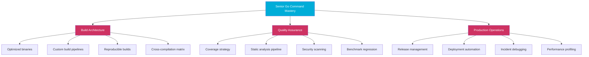
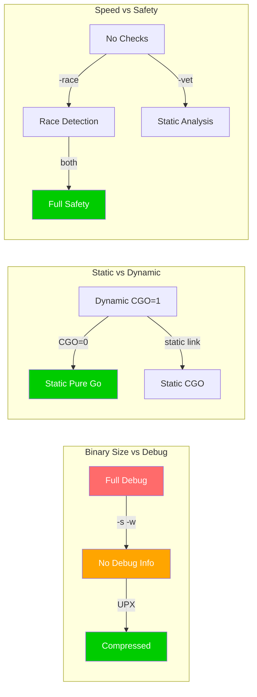
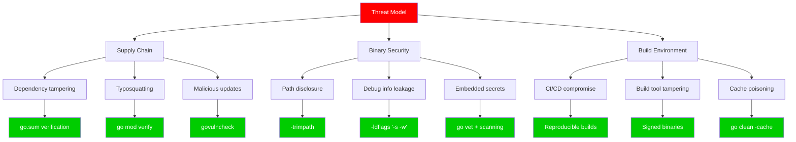
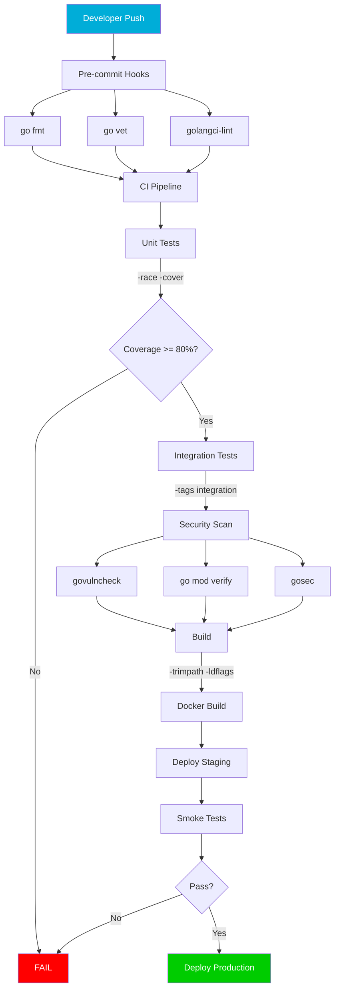
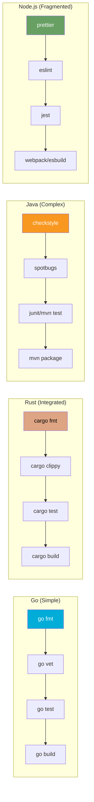
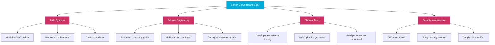

# Go Command — Senior Level

## Mundarija (Table of Contents)

1. [Introduction](#1-introduction)
2. [Core Concepts](#2-core-concepts)
3. [Pros & Cons](#3-pros--cons)
4. [Use Cases](#4-use-cases)
5. [Code Examples](#5-code-examples)
6. [Product Use / Feature](#6-product-use--feature)
7. [Error Handling](#7-error-handling)
8. [Security Considerations](#8-security-considerations)
9. [Performance Optimization](#9-performance-optimization)
10. [Debugging Guide](#10-debugging-guide)
11. [Best Practices](#11-best-practices)
12. [Edge Cases & Pitfalls](#12-edge-cases--pitfalls)
13. [Common Mistakes](#13-common-mistakes)
14. [Tricky Points](#14-tricky-points)
15. [Comparison with Other Languages](#15-comparison-with-other-languages)
16. [Test](#16-test)
17. [Tricky Questions](#17-tricky-questions)
18. [Cheat Sheet](#18-cheat-sheet)
19. [Summary](#19-summary)
20. [What You Can Build](#20-what-you-can-build)
21. [Further Reading](#21-further-reading)
22. [Related Topics](#22-related-topics)

---

## 1. Introduction

Senior darajada Go command — bu sizning **build pipeline arxitekturasi**, **production optimization**, va **enterprise-scale toolchain** strategiyangiz. Siz nafaqat buyruqlarni bilasiz, balki ularni qanday qilib **optimal**, **xavfsiz** va **takrorlanadigan** (reproducible) tarzda qo'llashni bilasiz.

Bu bo'limda o'rganiladigan mavzular:

| Mavzu | Maqsad |
|-------|--------|
| Build optimization | Binary hajmini minimallashtirish, build tezligini oshirish |
| Custom build tags | Feature flags, platform-specific code, enterprise licensing |
| Coverage analysis | Strategic coverage, mutation testing |
| go tool compile/link | Compiler va linker'ni to'g'ridan-to'g'ri boshqarish |
| Makefile patterns | Enterprise-grade build automation |
| CGO_ENABLED | C interop strategiyasi |
| Reproducible builds | Bit-for-bit bir xil binary yaratish |



---

## 2. Core Concepts

### 2.1 Build Optimization

#### -trimpath — Local path'larni o'chirish

Production binary'dan local fayl yo'llarini olib tashlaydi. **Security** va **reproducibility** uchun muhim.

```bash
# Trimpath'siz — binary ichida local yo'llar bor
$ go build -o app .
$ go tool objdump app | grep "main.go" | head -3
  main.go:10    0x497e20    MOVQ $0x0, 0x8(SP)
# Output: /home/user/projects/myapp/main.go:10

# Trimpath bilan — local yo'llar o'chirilgan
$ go build -trimpath -o app .
$ go tool objdump app | grep "main.go" | head -3
# Output: myapp/main.go:10 (module path)
```

#### -ldflags "-s -w" — Debug info o'chirish

```bash
# Oddiy build
$ go build -o app .
$ ls -lh app
-rwxr-xr-x 1 user user 7.2M app

# Symbol table o'chirilgan (-s)
$ go build -ldflags="-s" -o app_s .
$ ls -lh app_s
-rwxr-xr-x 1 user user 5.4M app_s

# Symbol + DWARF o'chirilgan (-s -w)
$ go build -ldflags="-s -w" -o app_sw .
$ ls -lh app_sw
-rwxr-xr-x 1 user user 4.8M app_sw

# To'liq production build
$ go build -trimpath -ldflags="-s -w" -o app_prod .
$ ls -lh app_prod
-rwxr-xr-x 1 user user 4.8M app_prod
```

**Ogohlantirish:** `-s -w` bilan debug qilish qiyinlashadi — panic stack trace'da fayl nomlari va qator raqamlari ko'rinmaydi. Production'da faqat agar binary hajmi muhim bo'lsa ishlating.

#### Build hajmini solishtirish

```bash
#!/bin/bash
# size_comparison.sh

echo "=== Binary Size Comparison ==="
echo ""

go build -o bin/default .
echo "Default:                $(ls -lh bin/default | awk '{print $5}')"

go build -ldflags="-s -w" -o bin/stripped .
echo "Stripped (-s -w):       $(ls -lh bin/stripped | awk '{print $5}')"

go build -trimpath -o bin/trimpath .
echo "Trimpath:               $(ls -lh bin/trimpath | awk '{print $5}')"

go build -trimpath -ldflags="-s -w" -o bin/production .
echo "Production (all):       $(ls -lh bin/production | awk '{print $5}')"

CGO_ENABLED=0 go build -trimpath -ldflags="-s -w" -o bin/static .
echo "Static (CGO=0):         $(ls -lh bin/static | awk '{print $5}')"

# UPX bilan (agar o'rnatilgan bo'lsa)
if command -v upx &> /dev/null; then
    cp bin/production bin/upx
    upx --best -q bin/upx > /dev/null
    echo "UPX compressed:         $(ls -lh bin/upx | awk '{print $5}')"
fi
```

```
=== Binary Size Comparison ===

Default:                7.2M
Stripped (-s -w):       4.8M
Trimpath:               7.2M
Production (all):       4.8M
Static (CGO=0):         4.6M
UPX compressed:         1.9M
```

### 2.2 Custom Build Tags

#### Feature flags bilan enterprise build

```go
// features/registry.go
package features

var registry = map[string]bool{}

func Register(name string, enabled bool) {
	registry[name] = enabled
}

func IsEnabled(name string) bool {
	return registry[name]
}

func List() map[string]bool {
	result := make(map[string]bool, len(registry))
	for k, v := range registry {
		result[k] = v
	}
	return result
}
```

```go
//go:build enterprise

// features/enterprise.go
package features

func init() {
	Register("sso", true)
	Register("audit-log", true)
	Register("rbac", true)
	Register("multi-tenant", true)
	Register("custom-branding", true)
}
```

```go
//go:build !enterprise

// features/community.go
package features

func init() {
	Register("sso", false)
	Register("audit-log", false)
	Register("rbac", false)
	Register("multi-tenant", false)
	Register("custom-branding", false)
}
```

```go
//go:build metrics

// features/metrics.go
package features

func init() {
	Register("prometheus", true)
	Register("opentelemetry", true)
}
```

```bash
# Community edition
$ go build -o app-community .

# Enterprise edition
$ go build -tags enterprise -o app-enterprise .

# Enterprise + metrics
$ go build -tags "enterprise,metrics" -o app-enterprise-full .
```

#### Platform-specific optimization

```go
//go:build linux && amd64 && !purego

// simd_amd64.go
package hash

import "unsafe"

// SIMD optimized hash (faqat linux/amd64 da)
func hashBlock(data []byte) uint64 {
	// Assembly-backed implementation
	return hashBlockASM(unsafe.Pointer(&data[0]), len(data))
}
```

```go
//go:build purego || !(linux && amd64)

// simd_generic.go
package hash

// Generic (portable) implementation
func hashBlock(data []byte) uint64 {
	var h uint64 = 14695981039346656037
	for _, b := range data {
		h ^= uint64(b)
		h *= 1099511628211
	}
	return h
}
```

### 2.3 Coverage Analysis

#### Strategic coverage — faqat muhim qismlarni cover qilish

```bash
# 1. Paket bo'yicha coverage
$ go test -coverprofile=coverage.out ./...
$ go tool cover -func=coverage.out | sort -t: -k3 -n
myapp/internal/handler/health.go:10:   HealthCheck   100.0%
myapp/internal/service/auth.go:25:     Login         92.3%
myapp/internal/service/user.go:40:     CreateUser    85.7%
myapp/internal/repository/db.go:15:    Connect       50.0%
myapp/internal/handler/admin.go:30:    DeleteAll     0.0%
total:                                 (statements)  72.4%

# 2. Faqat business logic coverage (infrastructure exclude)
$ go test -coverprofile=coverage.out \
    ./internal/service/... \
    ./internal/handler/...

# 3. Coverage by package
$ go test -cover ./internal/... | sort -t: -k2
myapp/internal/handler    coverage: 85.2% of statements
myapp/internal/repository coverage: 60.1% of statements
myapp/internal/service    coverage: 91.7% of statements
```

#### Coverage diff — PR da qo'shilgan kod uchun

```bash
#!/bin/bash
# coverage_diff.sh — faqat o'zgargan fayllardagi coverage

# O'zgargan Go fayllari
CHANGED_FILES=$(git diff --name-only origin/main...HEAD | grep '\.go$' | grep -v '_test.go')

# Ular joylashgan paketlar
PACKAGES=$(echo "$CHANGED_FILES" | xargs -I{} dirname {} | sort -u | sed 's|^|./|')

if [ -z "$PACKAGES" ]; then
    echo "No Go files changed"
    exit 0
fi

echo "Testing changed packages: $PACKAGES"
go test -coverprofile=coverage.out $PACKAGES

# Coverage foizini tekshirish
COVERAGE=$(go tool cover -func=coverage.out | tail -1 | awk '{print $3}' | sed 's/%//')
echo "Coverage of changed packages: ${COVERAGE}%"

if (( $(echo "$COVERAGE < 80.0" | bc -l) )); then
    echo "FAIL: Coverage ${COVERAGE}% is below 80%"
    exit 1
fi
```

### 2.4 go tool compile va go tool link

#### Direct compiler invocation

```bash
# go build ichida nima sodir bo'layotganini ko'rish
$ go build -x -o app . 2>&1 | head -30
WORK=/tmp/go-build1234567890
mkdir -p $WORK/b001/
cd /home/user/myapp
/usr/local/go/pkg/tool/linux_amd64/compile \
    -o $WORK/b001/_pkg_.a \
    -trimpath "$WORK/b001=>" \
    -p main \
    -complete \
    -buildid ... \
    -goversion go1.23.0 \
    -c=4 \
    -nolocalimports \
    -importcfg $WORK/b001/importcfg \
    -pack \
    ./main.go ./handler.go
/usr/local/go/pkg/tool/linux_amd64/link \
    -o $WORK/b001/exe/a.out \
    -importcfg $WORK/b001/importcfg.link \
    -buildmode=exe \
    -buildid=... \
    -extld=gcc \
    $WORK/b001/_pkg_.a
```

#### go tool compile — Compiler flags

```bash
# Assembly output ko'rish
$ go tool compile -S main.go

# Optimization natijalarini ko'rish
$ go tool compile -m=2 main.go 2>&1 | head -20
main.go:10:6: can inline Add with cost 4 as: func(int, int) int { return a + b }
main.go:15:6: cannot inline Process: function too complex: cost 120 exceeds budget 80
main.go:20:13: inlining call to fmt.Println

# Inlining budget'ni oshirish
$ go build -gcflags="-l=4" .  # aggressive inlining
```

#### go tool link — Linker options

```bash
# Linker flags
$ go tool link --help
  -s    disable symbol table
  -w    disable DWARF generation
  -X    set string variable value
  -buildmode    set build mode
  -extld        external linker
  -extldflags   flags for external linker
  -linkmode     internal or external linking

# External linker bilan static binary (CGO uchun)
$ CGO_ENABLED=1 go build -ldflags='-linkmode external -extldflags "-static"' -o app .
```

### 2.5 Makefile Patterns

#### Enterprise-grade Makefile

```makefile
# Makefile

# ==============================================================================
# Variables
# ==============================================================================

BINARY_NAME := myapp
MODULE := github.com/company/myapp
VERSION := $(shell git describe --tags --always --dirty 2>/dev/null || echo "dev")
COMMIT := $(shell git rev-parse --short HEAD 2>/dev/null || echo "unknown")
BUILD_TIME := $(shell date -u +%Y-%m-%dT%H:%M:%SZ)
GO_VERSION := $(shell go version | awk '{print $$3}')

# Build directories
BUILD_DIR := bin
DIST_DIR := dist

# Go build flags
LDFLAGS := -ldflags "\
	-s -w \
	-X $(MODULE)/internal/version.Version=$(VERSION) \
	-X $(MODULE)/internal/version.Commit=$(COMMIT) \
	-X $(MODULE)/internal/version.BuildTime=$(BUILD_TIME) \
	-X $(MODULE)/internal/version.GoVersion=$(GO_VERSION)"

BUILD_FLAGS := -trimpath $(LDFLAGS)

# Platform targets
PLATFORMS := linux/amd64 linux/arm64 darwin/amd64 darwin/arm64 windows/amd64

# ==============================================================================
# Development
# ==============================================================================

.PHONY: dev
dev: ## Run in development mode
	go run -tags dev -race ./cmd/server

.PHONY: generate
generate: ## Run code generation
	go generate ./...
	@echo "Checking generated files are committed..."
	@git diff --exit-code || (echo "ERROR: Generated files not committed" && exit 1)

# ==============================================================================
# Quality
# ==============================================================================

.PHONY: fmt
fmt: ## Format code
	goimports -w -local $(MODULE) .
	go fmt ./...

.PHONY: vet
vet: ## Run go vet
	go vet ./...

.PHONY: lint
lint: ## Run linter
	golangci-lint run --timeout 5m ./...

.PHONY: test
test: ## Run tests
	go test -race -count=1 -coverprofile=coverage.out ./...
	@echo ""
	@echo "=== Coverage Summary ==="
	@go tool cover -func=coverage.out | tail -1

.PHONY: test-short
test-short: ## Run short tests
	go test -short -count=1 ./...

.PHONY: test-integration
test-integration: ## Run integration tests
	go test -tags integration -race -count=1 -timeout 5m ./...

.PHONY: bench
bench: ## Run benchmarks
	go test -bench=. -benchmem -benchtime=3s -count=3 ./... | tee bench.txt

.PHONY: bench-compare
bench-compare: ## Compare benchmarks with previous run
	@if [ ! -f bench_old.txt ]; then echo "No previous benchmark found"; exit 1; fi
	benchstat bench_old.txt bench.txt

.PHONY: coverage
coverage: test ## Open coverage in browser
	go tool cover -html=coverage.out -o coverage.html
	@echo "Coverage report: coverage.html"

.PHONY: vuln
vuln: ## Run vulnerability check
	govulncheck ./...

.PHONY: verify
verify: fmt vet lint test vuln ## Run all verification checks
	@echo ""
	@echo "=== All checks passed ==="

# ==============================================================================
# Build
# ==============================================================================

.PHONY: build
build: ## Build binary
	CGO_ENABLED=0 go build $(BUILD_FLAGS) -o $(BUILD_DIR)/$(BINARY_NAME) ./cmd/server

.PHONY: build-debug
build-debug: ## Build debug binary
	go build -gcflags="all=-N -l" -o $(BUILD_DIR)/$(BINARY_NAME)-debug ./cmd/server

.PHONY: build-race
build-race: ## Build with race detector
	go build -race -o $(BUILD_DIR)/$(BINARY_NAME)-race ./cmd/server

.PHONY: build-all
build-all: ## Build for all platforms
	@mkdir -p $(DIST_DIR)
	@for platform in $(PLATFORMS); do \
		OS=$${platform%/*}; \
		ARCH=$${platform#*/}; \
		OUTPUT=$(DIST_DIR)/$(BINARY_NAME)-$(VERSION)-$${OS}-$${ARCH}; \
		[ "$$OS" = "windows" ] && OUTPUT="$${OUTPUT}.exe"; \
		echo "Building $${OS}/$${ARCH}..."; \
		CGO_ENABLED=0 GOOS=$$OS GOARCH=$$ARCH \
			go build $(BUILD_FLAGS) -o $$OUTPUT ./cmd/server; \
	done
	@echo "Build artifacts in $(DIST_DIR)/"
	@ls -lh $(DIST_DIR)/

# ==============================================================================
# Docker
# ==============================================================================

.PHONY: docker
docker: ## Build Docker image
	docker build \
		--build-arg VERSION=$(VERSION) \
		--build-arg COMMIT=$(COMMIT) \
		--build-arg BUILD_TIME=$(BUILD_TIME) \
		-t $(BINARY_NAME):$(VERSION) \
		-t $(BINARY_NAME):latest .

# ==============================================================================
# Clean
# ==============================================================================

.PHONY: clean
clean: ## Clean build artifacts
	rm -rf $(BUILD_DIR) $(DIST_DIR) coverage.out coverage.html

.PHONY: clean-cache
clean-cache: ## Clean Go caches
	go clean -cache -testcache

# ==============================================================================
# Info
# ==============================================================================

.PHONY: version
version: ## Show version info
	@echo "Version:    $(VERSION)"
	@echo "Commit:     $(COMMIT)"
	@echo "Build Time: $(BUILD_TIME)"
	@echo "Go:         $(GO_VERSION)"

.PHONY: help
help: ## Show this help
	@grep -E '^[a-zA-Z_-]+:.*?## .*$$' $(MAKEFILE_LIST) | \
		awk 'BEGIN {FS = ":.*?## "}; {printf "\033[36m%-20s\033[0m %s\n", $$1, $$2}'

.DEFAULT_GOAL := help
```

### 2.6 CGO_ENABLED

#### CGO strategiyasi

```bash
# CGO holati tekshirish
$ go env CGO_ENABLED
1

# Qachon CGO kerak:
# - SQLite (go-sqlite3)
# - System libraries (libc, libssl)
# - C/C++ kutubxonalar bilan ishlash

# Qachon CGO kerak EMAS:
# - Pure Go loyihalar
# - Docker scratch/distroless
# - Cross-compilation
# - Minimal attack surface
```

```bash
# CGO=0 bilan static binary (Docker scratch uchun ideal)
$ CGO_ENABLED=0 go build -trimpath -ldflags="-s -w" -o app .
$ file app
app: ELF 64-bit LSB executable, x86-64, version 1 (SYSV), statically linked, ...

# CGO=1 bilan dynamic binary
$ CGO_ENABLED=1 go build -o app .
$ file app
app: ELF 64-bit LSB executable, x86-64, version 1 (SYSV), dynamically linked, ...
$ ldd app
	linux-vdso.so.1
	libc.so.6 => /lib/x86_64-linux-gnu/libc.so.6
```

#### CGO bilan static binary (zarurat bo'lganda)

```bash
# CGO kerak lekin static binary ham kerak (masalan, SQLite + Docker scratch)
$ CGO_ENABLED=1 go build \
    -ldflags='-linkmode external -extldflags "-static" -s -w' \
    -tags 'sqlite_omit_load_extension netgo osusergo' \
    -trimpath \
    -o app .
```

### 2.7 Reproducible Builds

Reproducible build — bir xil source koddan **bit-for-bit bir xil** binary yaratish.

```bash
# Reproducible build uchun kerakli flaglar
$ CGO_ENABLED=0 go build \
    -trimpath \
    -ldflags="-s -w \
      -X main.Version=1.0.0 \
      -X main.BuildTime=2024-01-01T00:00:00Z \
      -buildid=" \
    -o app .

# Tekshirish — ikki marta build qilib solishtirish
$ sha256sum app
a1b2c3d4...  app

$ CGO_ENABLED=0 go build \
    -trimpath \
    -ldflags="-s -w \
      -X main.Version=1.0.0 \
      -X main.BuildTime=2024-01-01T00:00:00Z \
      -buildid=" \
    -o app2 .

$ sha256sum app2
a1b2c3d4...  app2   # BIR XIL!
```

Reproducible build'ga xalaqit beradigan narsalar:

| Muammo | Yechim |
|--------|--------|
| Local file paths | `-trimpath` |
| Build ID | `-buildid=` (empty) |
| Timestamps | `-X` bilan fixed vaqt |
| CGO | `CGO_ENABLED=0` |
| Go version | Docker'da aniq versiya |
| Module versions | `go.sum` lock file |

---

## 3. Pros & Cons

### Strategic Assessment

| Aspect | Pro | Con | Mitigation |
|--------|-----|-----|------------|
| Build optimization | 30-60% kichikroq binary | Debug qiyinlashadi | Staging'da debug binary ishlating |
| Custom build tags | Flexible feature management | Build matrix murakkabligi | CI/CD matrix strategy |
| Coverage analysis | Kod sifatini o'lchash | False sense of security | Mutation testing qo'shing |
| go tool compile/link | To'liq nazorat | Murakkab, fragile | Makefile'da abstrakt qiling |
| CGO_ENABLED=0 | Static, portable binary | C library'lar ishlamaydi | Pure Go alternative'lar toping |
| Reproducible builds | Supply chain security | Qo'shimcha effort | CI/CD pipeline'ga integrate |

### Architectural Trade-offs



---

## 4. Use Cases

### 4.1 Multi-tier SaaS build system

```bash
#!/bin/bash
# build_tiers.sh — SaaS tierlari uchun build

TIERS=("free" "pro" "enterprise")

for TIER in "${TIERS[@]}"; do
    echo "Building ${TIER} tier..."

    TAGS="${TIER}"
    [ "$TIER" = "enterprise" ] && TAGS="${TIER},metrics,audit"

    CGO_ENABLED=0 go build \
        -trimpath \
        -tags "${TAGS}" \
        -ldflags="-s -w \
          -X main.Version=${VERSION} \
          -X main.Tier=${TIER}" \
        -o "dist/app-${TIER}" \
        ./cmd/server

    echo "  Size: $(ls -lh dist/app-${TIER} | awk '{print $5}')"
done
```

### 4.2 Monorepo build orchestration

```makefile
# Makefile — Monorepo

SERVICES := api worker scheduler notifier
BUILD_FLAGS := -trimpath -ldflags="-s -w"

.PHONY: build-all
build-all: $(addprefix build-,$(SERVICES))

build-%:
	@echo "Building $*..."
	CGO_ENABLED=0 go build $(BUILD_FLAGS) \
		-o bin/$* ./services/$*/cmd

.PHONY: test-all
test-all:
	go test -race -count=1 -coverprofile=coverage.out ./...
	@go tool cover -func=coverage.out | tail -1

.PHONY: docker-all
docker-all: $(addprefix docker-,$(SERVICES))

docker-%: build-%
	docker build -f services/$*/Dockerfile \
		-t mycompany/$*:$(VERSION) \
		--build-arg BINARY=bin/$* .
```

### 4.3 Security-hardened build pipeline

```yaml
# .github/workflows/security-build.yml
name: Security Build
on:
  push:
    tags: ['v*']

jobs:
  build:
    runs-on: ubuntu-latest
    permissions:
      contents: write
      id-token: write # cosign uchun

    steps:
      - uses: actions/checkout@v4
      - uses: actions/setup-go@v5
        with:
          go-version: '1.23'

      - name: Verify dependencies
        run: |
          go mod verify
          go mod tidy
          git diff --exit-code go.mod go.sum

      - name: Security scan
        run: |
          go install golang.org/x/vuln/cmd/govulncheck@latest
          govulncheck ./...

      - name: Build reproducible binary
        run: |
          CGO_ENABLED=0 go build \
            -trimpath \
            -ldflags="-s -w \
              -X main.Version=${{ github.ref_name }} \
              -X main.Commit=${{ github.sha }} \
              -X main.BuildTime=$(date -u +%Y-%m-%dT%H:%M:%SZ) \
              -buildid=" \
            -o dist/app ./cmd/server

      - name: Generate SBOM
        run: |
          go version -m dist/app > dist/sbom.txt

      - name: Checksum
        run: |
          cd dist && sha256sum * > checksums.txt

      - name: Sign with cosign
        run: |
          cosign sign-blob --yes dist/app > dist/app.sig
```

---

## 5. Code Examples

### 5.1 Version package pattern

```go
// internal/version/version.go
package version

import (
	"fmt"
	"runtime"
	"runtime/debug"
)

// Build time da inject qilinadigan o'zgaruvchilar
var (
	Version   = "dev"
	Commit    = "unknown"
	BuildTime = "unknown"
	GoVersion = runtime.Version()
)

// Info returns formatted version information.
func Info() string {
	return fmt.Sprintf(
		"Version: %s\nCommit: %s\nBuilt: %s\nGo: %s\nOS/Arch: %s/%s",
		Version, Commit, BuildTime, GoVersion,
		runtime.GOOS, runtime.GOARCH,
	)
}

// Short returns short version string.
func Short() string {
	return Version
}

// BuildInfo returns Go module build info.
func BuildInfo() string {
	info, ok := debug.ReadBuildInfo()
	if !ok {
		return "no build info"
	}
	return info.String()
}
```

```go
// cmd/server/main.go
package main

import (
	"flag"
	"fmt"
	"os"

	"myapp/internal/version"
)

func main() {
	showVersion := flag.Bool("version", false, "Show version info")
	showBuildInfo := flag.Bool("build-info", false, "Show build info")
	flag.Parse()

	if *showVersion {
		fmt.Println(version.Info())
		os.Exit(0)
	}

	if *showBuildInfo {
		fmt.Println(version.BuildInfo())
		os.Exit(0)
	}

	// Normal application startup...
}
```

```bash
$ go build -ldflags "\
  -X myapp/internal/version.Version=2.1.0 \
  -X myapp/internal/version.Commit=$(git rev-parse --short HEAD) \
  -X 'myapp/internal/version.BuildTime=$(date -u +%Y-%m-%dT%H:%M:%SZ)'" \
  -o server ./cmd/server

$ ./server --version
Version: 2.1.0
Commit: a1b2c3d
Built: 2024-12-15T10:30:00Z
Go: go1.23.0
OS/Arch: linux/amd64
```

### 5.2 Build tags bilan integration test

```go
//go:build integration

// integration_test.go
package service_test

import (
	"context"
	"os"
	"testing"
	"time"

	"myapp/internal/service"
)

func TestUserService_Integration(t *testing.T) {
	dbURL := os.Getenv("DATABASE_URL")
	if dbURL == "" {
		t.Fatal("DATABASE_URL is required for integration tests")
	}

	ctx, cancel := context.WithTimeout(context.Background(), 30*time.Second)
	defer cancel()

	svc, err := service.NewUserService(ctx, dbURL)
	if err != nil {
		t.Fatalf("Failed to create service: %v", err)
	}
	defer svc.Close()

	t.Run("CreateAndGet", func(t *testing.T) {
		user, err := svc.Create(ctx, "test@example.com", "Test User")
		if err != nil {
			t.Fatalf("Create failed: %v", err)
		}

		got, err := svc.GetByID(ctx, user.ID)
		if err != nil {
			t.Fatalf("GetByID failed: %v", err)
		}

		if got.Email != "test@example.com" {
			t.Errorf("Email = %q, want %q", got.Email, "test@example.com")
		}
	})
}
```

```bash
# Unit tests (default — integration testlar skip bo'ladi)
$ go test ./...

# Integration tests
$ DATABASE_URL=postgres://localhost:5432/testdb \
  go test -tags integration -race -count=1 -timeout 5m ./...
```

### 5.3 Advanced Dockerfile

```dockerfile
# Dockerfile

# Stage 1: Build
FROM golang:1.23-alpine AS builder

# Build dependencies
RUN apk add --no-cache git ca-certificates tzdata

# Module cache
WORKDIR /app
COPY go.mod go.sum ./
RUN go mod download && go mod verify

# Build arguments
ARG VERSION=dev
ARG COMMIT=unknown
ARG BUILD_TIME=unknown

# Build
COPY . .
RUN CGO_ENABLED=0 GOOS=linux GOARCH=amd64 go build \
    -trimpath \
    -ldflags="-s -w \
      -X myapp/internal/version.Version=${VERSION} \
      -X myapp/internal/version.Commit=${COMMIT} \
      -X myapp/internal/version.BuildTime=${BUILD_TIME}" \
    -o /server ./cmd/server

# Stage 2: Security scan (optional)
FROM golang:1.23-alpine AS security
COPY --from=builder /app /app
WORKDIR /app
RUN go install golang.org/x/vuln/cmd/govulncheck@latest && \
    govulncheck ./...

# Stage 3: Production (scratch = minimal attack surface)
FROM scratch

# CA certificates (HTTPS uchun)
COPY --from=builder /etc/ssl/certs/ca-certificates.crt /etc/ssl/certs/
# Timezone data
COPY --from=builder /usr/share/zoneinfo /usr/share/zoneinfo

# Binary
COPY --from=builder /server /server

# Non-root user
USER 65534:65534

EXPOSE 8080
ENTRYPOINT ["/server"]
```

```bash
$ docker build \
    --build-arg VERSION=$(git describe --tags) \
    --build-arg COMMIT=$(git rev-parse --short HEAD) \
    --build-arg BUILD_TIME=$(date -u +%Y-%m-%dT%H:%M:%SZ) \
    -t myapp:latest .

$ docker images myapp
REPOSITORY   TAG       IMAGE ID       CREATED          SIZE
myapp        latest    abc123def456   10 seconds ago   8.2MB
```

### 5.4 Coverage enforcement

```bash
#!/bin/bash
# scripts/check_coverage.sh

set -e

MIN_COVERAGE=80
CRITICAL_PACKAGES=(
    "./internal/service/..."
    "./internal/handler/..."
)

echo "=== Running tests with coverage ==="
go test -race -count=1 -coverprofile=coverage.out ./...

echo ""
echo "=== Package Coverage ==="
go tool cover -func=coverage.out | grep -E "^(total|myapp)" | column -t

# Total coverage
TOTAL=$(go tool cover -func=coverage.out | grep total | awk '{print $3}' | sed 's/%//')
echo ""
echo "Total coverage: ${TOTAL}%"

if (( $(echo "$TOTAL < $MIN_COVERAGE" | bc -l) )); then
    echo "FAIL: Total coverage ${TOTAL}% is below minimum ${MIN_COVERAGE}%"
    exit 1
fi

# Critical package coverage
echo ""
echo "=== Critical Package Coverage ==="
for pkg in "${CRITICAL_PACKAGES[@]}"; do
    PKG_COV=$(go test -cover $pkg 2>/dev/null | awk '{print $NF}' | head -1)
    echo "${pkg}: ${PKG_COV}"
done

echo ""
echo "=== All checks passed ==="
```

---

## 6. Product Use / Feature

### 6.1 Kubernetes-like release process

```bash
#!/bin/bash
# release.sh — Production release process

set -euo pipefail

VERSION=$1
if [ -z "$VERSION" ]; then
    echo "Usage: ./release.sh v1.2.3"
    exit 1
fi

echo "=== Release ${VERSION} ==="

# 1. Verify
echo "Step 1: Verification..."
go mod verify
go vet ./...
go test -race -count=1 ./...
govulncheck ./...

# 2. Build
echo "Step 2: Building..."
PLATFORMS=("linux/amd64" "linux/arm64" "darwin/amd64" "darwin/arm64" "windows/amd64")
LDFLAGS="-s -w \
  -X myapp/internal/version.Version=${VERSION} \
  -X myapp/internal/version.Commit=$(git rev-parse HEAD) \
  -X 'myapp/internal/version.BuildTime=$(date -u +%Y-%m-%dT%H:%M:%SZ)' \
  -buildid="

mkdir -p dist/
for platform in "${PLATFORMS[@]}"; do
    OS="${platform%/*}"
    ARCH="${platform#*/}"
    OUTPUT="dist/myapp-${VERSION}-${OS}-${ARCH}"
    [ "$OS" = "windows" ] && OUTPUT="${OUTPUT}.exe"

    echo "  Building ${OS}/${ARCH}..."
    CGO_ENABLED=0 GOOS=$OS GOARCH=$ARCH go build \
        -trimpath -ldflags="${LDFLAGS}" \
        -o "$OUTPUT" ./cmd/server
done

# 3. Checksums
echo "Step 3: Generating checksums..."
cd dist && sha256sum myapp-* > checksums.txt && cd ..

# 4. Verify reproducibility
echo "Step 4: Verifying reproducibility..."
CGO_ENABLED=0 GOOS=linux GOARCH=amd64 go build \
    -trimpath -ldflags="${LDFLAGS}" \
    -o dist/myapp-verify ./cmd/server

HASH1=$(sha256sum dist/myapp-${VERSION}-linux-amd64 | awk '{print $1}')
HASH2=$(sha256sum dist/myapp-verify | awk '{print $1}')

if [ "$HASH1" = "$HASH2" ]; then
    echo "  Reproducible build verified!"
else
    echo "  WARNING: Build is not reproducible!"
    exit 1
fi
rm dist/myapp-verify

echo ""
echo "=== Release ${VERSION} ready ==="
ls -lh dist/
```

### 6.2 Continuous profiling pipeline

```go
// internal/profiling/profiling.go
package profiling

import (
	"fmt"
	"log"
	"net/http"
	_ "net/http/pprof"
	"os"
	"runtime"
	"runtime/pprof"
)

// StartCPUProfile starts CPU profiling to a file.
func StartCPUProfile(filename string) func() {
	f, err := os.Create(filename)
	if err != nil {
		log.Fatalf("could not create CPU profile: %v", err)
	}

	if err := pprof.StartCPUProfile(f); err != nil {
		f.Close()
		log.Fatalf("could not start CPU profile: %v", err)
	}

	return func() {
		pprof.StopCPUProfile()
		f.Close()
		log.Printf("CPU profile saved to %s", filename)
	}
}

// WriteHeapProfile writes a heap profile to a file.
func WriteHeapProfile(filename string) error {
	f, err := os.Create(filename)
	if err != nil {
		return fmt.Errorf("could not create heap profile: %w", err)
	}
	defer f.Close()

	runtime.GC() // GC before heap profile
	if err := pprof.WriteHeapProfile(f); err != nil {
		return fmt.Errorf("could not write heap profile: %w", err)
	}

	log.Printf("Heap profile saved to %s", filename)
	return nil
}

// ServePprof starts pprof HTTP server on given port.
func ServePprof(port int) {
	go func() {
		addr := fmt.Sprintf("localhost:%d", port)
		log.Printf("pprof server on http://%s/debug/pprof/", addr)
		if err := http.ListenAndServe(addr, nil); err != nil {
			log.Printf("pprof server error: %v", err)
		}
	}()
}
```

### 6.3 Build info API middleware

```go
// internal/middleware/buildinfo.go
package middleware

import (
	"encoding/json"
	"net/http"
	"runtime/debug"

	"myapp/internal/version"
)

type BuildInfoResponse struct {
	Version   string            `json:"version"`
	Commit    string            `json:"commit"`
	BuildTime string            `json:"build_time"`
	GoVersion string            `json:"go_version"`
	OS        string            `json:"os"`
	Arch      string            `json:"arch"`
	Deps      []DependencyInfo  `json:"dependencies,omitempty"`
}

type DependencyInfo struct {
	Path    string `json:"path"`
	Version string `json:"version"`
}

func BuildInfoHandler() http.HandlerFunc {
	// Build info'ni bir marta o'qish
	info := BuildInfoResponse{
		Version:   version.Version,
		Commit:    version.Commit,
		BuildTime: version.BuildTime,
		GoVersion: version.GoVersion,
	}

	if bi, ok := debug.ReadBuildInfo(); ok {
		for _, dep := range bi.Deps {
			info.Deps = append(info.Deps, DependencyInfo{
				Path:    dep.Path,
				Version: dep.Version,
			})
		}
	}

	return func(w http.ResponseWriter, r *http.Request) {
		w.Header().Set("Content-Type", "application/json")
		json.NewEncoder(w).Encode(info)
	}
}
```

---

## 7. Error Handling

### 7.1 Enterprise build errors

**Module authentication failure:**

```bash
$ go mod download
verifying github.com/company/internal-pkg@v1.2.3:
  checksum mismatch
```

**Yechim:**

```bash
# Private module uchun checksum tekshirishni o'chirish
$ go env -w GONOSUMCHECK=github.com/company/*
$ go env -w GOPRIVATE=github.com/company/*
$ go env -w GONOSUMDB=github.com/company/*
```

**Cross-compilation CGO error:**

```bash
$ GOOS=linux GOARCH=arm64 go build .
# runtime/cgo
gcc: error: unrecognized command-line option '-marm'
```

**Yechim:**

```bash
# 1. CGO o'chirish (eng oson)
$ CGO_ENABLED=0 GOOS=linux GOARCH=arm64 go build .

# 2. Cross-compiler o'rnatish
$ apt-get install gcc-aarch64-linux-gnu
$ CC=aarch64-linux-gnu-gcc CGO_ENABLED=1 GOOS=linux GOARCH=arm64 go build .
```

### 7.2 Build cache corruption

```bash
$ go build .
internal error: cannot find module providing package myapp/internal/handler

# Yechim: cache tozalash
$ go clean -cache
$ go build .
```

### 7.3 Module download timeout

```bash
$ go mod download
go: github.com/some/pkg@v1.0.0: reading https://proxy.golang.org/...:
  context deadline exceeded

# Yechim 1: Proxy o'zgartirish
$ go env -w GOPROXY=https://goproxy.io,direct

# Yechim 2: Direct download
$ go env -w GOPROXY=direct

# Yechim 3: Timeout oshirish
$ GOFLAGS="-modcacherw" go mod download
```

---

## 8. Security Considerations

### 8.1 Threat model



### 8.2 Security-hardened build checklist

```bash
#!/bin/bash
# security_build.sh

set -euo pipefail

echo "=== Security Build Checklist ==="

# 1. Module integrity
echo "[1/7] Verifying module integrity..."
go mod verify

# 2. Tidy check
echo "[2/7] Checking go.mod tidiness..."
cp go.mod go.mod.bak
go mod tidy
diff go.mod go.mod.bak || (echo "FAIL: go.mod is not tidy" && exit 1)
rm go.mod.bak

# 3. Vulnerability scan
echo "[3/7] Scanning for vulnerabilities..."
govulncheck ./...

# 4. Static analysis
echo "[4/7] Running static analysis..."
go vet ./...

# 5. No replace directives
echo "[5/7] Checking for replace directives..."
if grep -q "^replace" go.mod; then
    echo "FAIL: replace directive found in go.mod"
    exit 1
fi

# 6. Build
echo "[6/7] Building secure binary..."
CGO_ENABLED=0 go build \
    -trimpath \
    -ldflags="-s -w -buildid=" \
    -o app ./cmd/server

# 7. Verify
echo "[7/7] Verifying binary..."
go version -m app
sha256sum app

echo ""
echo "=== Security Build Complete ==="
```

### 8.3 SBOM (Software Bill of Materials)

```bash
# Go binary'dan SBOM yaratish
$ go version -m app
app: go1.23.0
	path    myapp
	mod     myapp (devel)
	dep     github.com/gin-gonic/gin v1.9.1 h1:4idEAncQnU...
	dep     github.com/go-playground/validator/v10 v10.16.0 h1:x+...
	dep     golang.org/x/crypto v0.16.0 h1:mMMrFzR...

# JSON formatda
$ go version -m -json app | jq '.Deps[] | {Path, Version}'
```

---

## 9. Performance Optimization

### 9.1 Build time optimization

```bash
# 1. Build time o'lchash
$ time go build ./...
real    0m4.523s

# 2. Cache statistikasi
$ go build -x ./... 2>&1 | grep -c "compile"
23  # 23 paket compile bo'ldi

# 3. Parallelism oshirish
$ go build -p 16 ./...

# 4. Module download'ni tezlashtirish
$ go env -w GOPROXY=https://proxy.golang.org,direct

# 5. CI/CD da cache
# GitHub Actions
- uses: actions/cache@v4
  with:
    path: |
      ~/go/pkg/mod
      ~/.cache/go-build
    key: ${{ runner.os }}-go-${{ hashFiles('**/go.sum') }}
```

### 9.2 Binary size optimization pipeline

```bash
#!/bin/bash
# optimize_binary.sh

APP_NAME="myapp"

echo "=== Binary Optimization Pipeline ==="

# Step 1: Default build
go build -o "${APP_NAME}-default" ./cmd/server
SIZE_DEFAULT=$(stat -c%s "${APP_NAME}-default")
echo "Default:     $(numfmt --to=iec $SIZE_DEFAULT)"

# Step 2: Strip debug info
go build -ldflags="-s -w" -o "${APP_NAME}-stripped" ./cmd/server
SIZE_STRIPPED=$(stat -c%s "${APP_NAME}-stripped")
echo "Stripped:    $(numfmt --to=iec $SIZE_STRIPPED) (-$(( (SIZE_DEFAULT - SIZE_STRIPPED) * 100 / SIZE_DEFAULT ))%)"

# Step 3: Trimpath
go build -trimpath -ldflags="-s -w" -o "${APP_NAME}-trimmed" ./cmd/server
SIZE_TRIMMED=$(stat -c%s "${APP_NAME}-trimmed")
echo "Trimmed:     $(numfmt --to=iec $SIZE_TRIMMED)"

# Step 4: CGO disabled
CGO_ENABLED=0 go build -trimpath -ldflags="-s -w" -o "${APP_NAME}-static" ./cmd/server
SIZE_STATIC=$(stat -c%s "${APP_NAME}-static")
echo "Static:      $(numfmt --to=iec $SIZE_STATIC)"

# Summary
echo ""
echo "Total reduction: $(( (SIZE_DEFAULT - SIZE_STATIC) * 100 / SIZE_DEFAULT ))%"
```

### 9.3 Test speed optimization

```bash
# 1. Parallel testlar (default: GOMAXPROCS)
$ go test -parallel 16 ./...

# 2. Faqat o'zgargan paketlar
$ go test $(go list ./... | grep -E "handler|service")

# 3. Short mode bilan tez feedback
$ go test -short -timeout 30s ./...

# 4. Cache ishlatish (default behavior)
$ go test ./...        # birinchi marta: 5s
$ go test ./...        # ikkinchi marta: 0.1s (cached)

# 5. Test binary'ni cache'lash (CI uchun)
$ go test -c -o test.bin ./internal/service
$ ./test.bin -test.v -test.run TestCreate
```

---

## 10. Debugging Guide

### 10.1 Production binary debugging

```bash
# 1. Production'da debug binary yo'q — lekin pprof bor
$ curl -s http://production:6060/debug/pprof/goroutine?debug=2 | head -50

# 2. Core dump analysis
$ GOTRACEBACK=crash ./app  # crash bo'lganda core dump yaratadi
$ dlv core app core.12345

# 3. Remote debugging (staging)
$ dlv exec --headless --listen=:2345 --api-version=2 ./app
# VS Code dan connect qilish
```

### 10.2 Build diagnostic

```bash
# 1. Qaysi fayllar compile bo'layotganini ko'rish
$ go build -v ./... 2>&1

# 2. Compiler nima qilayotganini ko'rish
$ go build -x ./... 2>&1 | less

# 3. Assembly output
$ go build -gcflags="-S" ./... 2>&1 | less

# 4. Escape analysis
$ go build -gcflags="all=-m=2" ./... 2>&1 | grep "escapes\|moved to heap" | head -20

# 5. Inlining decisions
$ go build -gcflags="all=-m" ./... 2>&1 | grep "inlining\|cannot inline" | head -20
```

### 10.3 Module debugging

```bash
# 1. Module graph
$ go mod graph | head -20

# 2. Nima uchun bu dependency kerak?
$ go mod why github.com/some/pkg
# myapp
# myapp/internal/handler
# github.com/gin-gonic/gin
# github.com/some/pkg

# 3. Available versions
$ go list -m -versions github.com/some/pkg

# 4. Module cache tekshirish
$ ls $(go env GOMODCACHE)/github.com/some/pkg@*
```

---

## 11. Best Practices

### 11.1 Build pipeline architecture



### 11.2 Go command standards for teams

```bash
# .golangci.yml — Team linting standards
linters:
  enable:
    - errcheck
    - govet
    - staticcheck
    - unused
    - gosimple
    - ineffassign
    - typecheck
    - gocritic
    - revive
    - gosec
    - prealloc
    - unconvert

linters-settings:
  govet:
    check-shadowing: true
  errcheck:
    check-type-assertions: true
  gocritic:
    enabled-tags:
      - diagnostic
      - performance
      - style
```

### 11.3 Release versioning strategy

```bash
# Semantic versioning + git tags
$ git tag -a v1.2.3 -m "Release v1.2.3"
$ git push origin v1.2.3

# Version'ni go build'dan olish
VERSION=$(git describe --tags --always --dirty)
# Natija: v1.2.3 yoki v1.2.3-5-gabc1234 yoki v1.2.3-dirty
```

### 11.4 Dependency management policy

```bash
# 1. Har hafta dependency yangilash
$ go list -m -u all | grep -v "indirect" | grep "\["
# [v1.5.0] — yangilash mavjud

# 2. Major version yangilash — alohida PR
$ go get github.com/pkg/v2@latest

# 3. Replace directive policy
# - Faqat local development uchun
# - CI da tekshirish: grep "replace" go.mod && exit 1
# - Merge qilishdan oldin olib tashlash

# 4. Dependency audit
$ go mod graph | wc -l  # dependency soni
$ govulncheck ./...       # zaifliklar
$ go mod why <pkg>        # nima uchun kerak?
```

---

## 12. Edge Cases & Pitfalls

### 12.1 -ldflags va special characters

```bash
# XATO — space'li qiymat
$ go build -ldflags "-X main.Name=My App" .

# TO'G'RI — quoting
$ go build -ldflags "-X 'main.Name=My App'" .

# XATO — dollar sign
$ go build -ldflags "-X main.Price=$100" .

# TO'G'RI — escaping
$ go build -ldflags "-X 'main.Price=\$100'" .
```

### 12.2 Build tags va file naming collision

```go
// config_linux.go — avtomatik linux build tag bor
// Agar //go:build tag ham qo'shsangiz, ikkalasi AND bo'ladi

//go:build dev

// config_linux.go
// Bu fayl faqat: linux AND dev tag bo'lganda compile bo'ladi
```

### 12.3 CGO va Alpine Linux

```bash
# Alpine'da CGO=1 binary ishlamaydi
$ CGO_ENABLED=1 go build -o app .
$ docker run alpine ./app
/bin/sh: ./app: not found  # glibc yo'q!

# Yechim 1: CGO o'chirish
$ CGO_ENABLED=0 go build -o app .

# Yechim 2: musl bilan build
$ docker run golang:1.23-alpine go build -o app .
```

### 12.4 go test timeout bilan hung test

```bash
# Default timeout: 10 daqiqa — juda uzoq!
$ go test ./...  # hung test 10 daqiqa kutadi

# TO'G'RI — qisqa timeout
$ go test -timeout 60s ./...
panic: test timed out after 60s
```

### 12.5 Reproducible build va embedded timestamps

```go
// XATO — binary ichida timestamp
var BuildTime = time.Now().String() // Har build'da farqli!

// TO'G'RI — tashqaridan inject
var BuildTime = "unknown" // -ldflags bilan belgilang
```

---

## 13. Common Mistakes

### 13.1 Production'da debug binary deploy qilish

```bash
# XATO
$ go build -o app . && scp app server:

# TO'G'RI
$ CGO_ENABLED=0 go build -trimpath -ldflags="-s -w" -o app . && scp app server:
```

### 13.2 Race detector'ni production'da ishlatish

```bash
# XATO — 10x sekin, 10x ko'p memory
$ go build -race -o production-app .

# TO'G'RI
$ go test -race ./...          # testlarda tekshirish
$ go build -o production-app . # production'da race'siz
```

### 13.3 go mod replace ni push qilish

```go
// XATO — production'da local path
replace github.com/company/pkg => ../local-pkg

// TO'G'RI — faqat development uchun, push qilmaslik
// CI check: grep "=>" go.mod && exit 1
```

### 13.4 Build tag'siz feature management

```go
// XATO — runtime check, barcha kod binary'da
func handleRequest() {
    if os.Getenv("ENABLE_PREMIUM") == "true" {
        premiumLogic() // Har doim binary'da!
    }
}

// TO'G'RI — build tags bilan exclude
//go:build premium
func premiumLogic() { ... }
```

### 13.5 Test coverage'ga ko'r-ko'rona ishonish

```bash
# 100% coverage = xatosiz kod EMAS
# Statement coverage faqat "qator execute bo'ldimi" deydi
# Branch, edge case, concurrent scenario — alohida tekshirish kerak

# TO'G'RI — Coverage + Race + Benchmark + Integration
$ go test -race -count=3 -cover ./...
$ go test -tags integration -race ./...
$ go test -bench=. -benchmem ./...
```

---

## 14. Tricky Points

### 14.1 -buildid="" nima uchun kerak?

Go har safar build qilganda unique **build ID** yaratadi. Bu reproducible build'ga xalaqit beradi.

```bash
# Build ID bor
$ go build -o app1 . && go tool buildid app1
abc123/def456/ghi789/jkl012

$ go build -o app2 . && go tool buildid app2
abc123/def456/ghi789/mno345  # FARQLI!

# Build ID o'chirilgan
$ go build -ldflags="-buildid=" -o app3 .
$ go build -ldflags="-buildid=" -o app4 .
$ sha256sum app3 app4
same_hash  app3
same_hash  app4  # BIR XIL!
```

### 14.2 -gcflags vs -ldflags scope

```bash
# -gcflags — compiler'ga (compile vaqtida)
# -ldflags — linker'ga (link vaqtida)

# Scope patterns:
# "all=..." — barcha paketlar (dependencies ham)
# "std=..." — standard library
# "myapp/...=..." — faqat o'z paketlaringiz
# "..." (default) — faqat main paket

$ go build -gcflags="all=-m" -ldflags="all=-s -w" .
```

### 14.3 CGO_ENABLED va net package

```go
import "net"
// net package default CGO=1 da C DNS resolver ishlatadi
// CGO=0 da pure Go DNS resolver ishlatadi

// Pure Go DNS uchun explicit tag:
// go build -tags netgo .
```

```bash
# CGO_ENABLED=1 (default)
$ strace ./app 2>&1 | grep resolv
openat(AT_FDCWD, "/etc/resolv.conf", O_RDONLY) = 3

# CGO_ENABLED=0 yoki -tags netgo
# Pure Go resolver — /etc/resolv.conf o'qiydi, lekin C library chaqirmaydi
```

---

## 15. Comparison with Other Languages

### Build Toolchain Comparison (Architectural)

| Criteria | Go | Rust | Java | C++ |
|----------|-----|------|------|-----|
| Build speed | Very fast (seconds) | Slow (minutes) | Medium | Varies |
| Binary type | Static | Static | JVM bytecode | Native |
| Cross-compile | Trivial (GOOS/GOARCH) | Via targets | JVM portability | Very complex |
| Build config | Zero config | Cargo.toml | pom.xml/build.gradle | CMakeLists/Makefile |
| Reproducible | Built-in | cargo --locked | Gradle --rerun-tasks | Difficult |
| Build cache | Automatic | Automatic | Gradle: yes | ccache |
| Feature flags | Build tags | Cargo features | Maven profiles | #ifdef |
| Profiling | Built-in pprof | External tools | JFR/VisualVM | perf/valgrind |
| SBOM | `go version -m` | `cargo sbom` | Maven plugins | Manual |

### Build Pipeline Maturity



---

## 16. Test

### 16.1 Savol

`go build -trimpath` nima qiladi?

- A) Binary hajmini kamaytiradi
- B) Local fayl yo'llarini binary'dan o'chiradi
- C) Unused code'ni o'chiradi
- D) Debug info'ni o'chiradi

<details>
<summary>Javob</summary>

**B)** `-trimpath` local fayl yo'llarini (masalan, `/home/user/projects/...`) binary'dan o'chirib, module path bilan almashtiradi. Bu security uchun muhim — production binary'dan developer'ning kompyuter tuzilmasi ko'rinmaydi.

</details>

### 16.2 Savol

Reproducible build uchun qaysi flaglar kerak?

- A) `-trimpath` va `-ldflags="-s -w"`
- B) `-trimpath`, `-ldflags="-buildid="` va `CGO_ENABLED=0`
- C) `-race` va `-v`
- D) `-trimpath` va `-tags prod`

<details>
<summary>Javob</summary>

**B)** Reproducible build uchun: `-trimpath` (local path'lar), `-buildid=` (unique build ID), `CGO_ENABLED=0` (C compiler farqlari), va fixed timestamps (-X bilan). `-s -w` reproducibility uchun emas, size uchun.

</details>

### 16.3 Savol

`CGO_ENABLED=0` qachon talab qilinadi?

- A) Har doim
- B) Docker scratch image ishlatganda
- C) Faqat Windows uchun build qilganda
- D) Test'lar uchun

<details>
<summary>Javob</summary>

**B)** Docker `scratch` (yoki `distroless`) image'da hech qanday C library yo'q. `CGO_ENABLED=0` statically linked binary yaratadi — u hech qanday external library'ga bog'liq emas va scratch image'da ishlaydi.

</details>

### 16.4 Savol

Custom build tags'ning enterprise loyihada asosiy foydalanish holatlari nimalar?

- A) Faqat OS-specific kod
- B) Feature flags, licensing tiers, environment config
- C) Faqat test separation
- D) Performance optimization

<details>
<summary>Javob</summary>

**B)** Enterprise loyihalarda build tags asosan: feature flags (free/premium), licensing tiers (community/enterprise), environment config (dev/staging/prod) va integration test separation uchun ishlatiladi.

</details>

### 16.5 Savol

`go tool cover -func=coverage.out` qanday ma'lumot beradi?

- A) Faqat total coverage foizi
- B) Har bir funksiya uchun alohida coverage foizi
- C) Branch coverage
- D) Test execution time

<details>
<summary>Javob</summary>

**B)** `-func` flag har bir funksiya uchun alohida coverage foizini ko'rsatadi. Bu kam test qilingan funksiyalarni topishga yordam beradi.

</details>

### 16.6 Savol

Makefile'da `CGO_ENABLED=0 go build -trimpath -ldflags="-s -w"` pattern'ini nima uchun ishlatamiz?

- A) Tez compile qilish uchun
- B) Minimal, xavfsiz, portable production binary yaratish uchun
- C) Debug qilish osonligi uchun
- D) Test coverage oshirish uchun

<details>
<summary>Javob</summary>

**B)** Bu pattern production-ready binary yaratadi: `CGO_ENABLED=0` — static binary (portable), `-trimpath` — local path'lar yashirilgan (security), `-s -w` — minimal hajm (debug info o'chirilgan).

</details>

### 16.7 Savol

`go version -m binary` buyrug'i nima ko'rsatadi?

- A) Go versiyasi
- B) Binary ichidagi barcha module dependency'lar va build settings
- C) Binary hajmi
- D) Build vaqti

<details>
<summary>Javob</summary>

**B)** `go version -m` binary ichidagi Go versiyasi, modul path, barcha dependency'lar (versiya va hash bilan), va build settings (flags, tags, etc.) ni ko'rsatadi. Bu SBOM (Software Bill of Materials) yaratish uchun ishlatiladi.

</details>

### 16.8 Savol

`-ldflags="-s -w"` dan keyin binary debug qilishning eng yaxshi usuli nima?

- A) Binary'ni qayta build qilish imkoni yo'q
- B) Debug binary'ni staging muhitida alohida deploy qilish
- C) `go tool objdump` ishlatish
- D) `-race` flag qo'shish

<details>
<summary>Javob</summary>

**B)** Staging muhitida `-gcflags="all=-N -l"` bilan debug binary deploy qilib, Delve debugger bilan ishlatish eng yaxshi usul. Production binary'dan debug info olib tashlanganida, stack trace'lar cheklangan bo'ladi.

</details>

### 16.9 Savol

Go'da SBOM (Software Bill of Materials) qanday yaratiladi?

- A) Tashqi tool kerak
- B) `go version -m binary` buyrug'i bilan
- C) `go mod graph` bilan
- D) `go doc` bilan

<details>
<summary>Javob</summary>

**B)** `go version -m` binary ichiga embed qilingan module ma'lumotlarini o'qiydi — bu built-in SBOM. Qo'shimcha tool shart emas. `go mod graph` esa source-based dependency graph ko'rsatadi.

</details>

### 16.10 Savol

Build tags bilan feature management'ning `runtime if/else` dan ustunligi nima?

- A) Tezroq compile
- B) Binary'da faqat kerakli kod bo'ladi — hajm kichik va attack surface kam
- C) Debug osonroq
- D) Farqi yo'q

<details>
<summary>Javob</summary>

**B)** Build tags bilan kerak bo'lmagan kod binary'ga umuman kiritilmaydi. Runtime `if/else` da esa barcha kod binary ichida — bu binary hajmini oshiradi va attack surface kengayadi (masalan, premium code free binary'da ham bor).

</details>

### 16.11 Savol

UPX bilan Go binary siqishning asosiy xavfi nima?

- A) Binary ishlamaydi
- B) Ba'zi antivirus'lar UPX-siqilgan binary'larni malware deb belgilaydi
- C) Performance yomonlashadi
- D) Go versiyasi mos kelmaydi

<details>
<summary>Javob</summary>

**B)** UPX binary'larni siqadi, lekin ko'plab antivirus dasturlari UPX-packed executable'larni suspicious deb belgilaydi chunki malware ham UPX ishlatadi. Shuning uchun production'da UPX ehtiyotkorlik bilan ishlatish kerak.

</details>

### 16.12 Savol

`go build -x` flag'ining asosiy maqsadi nima?

- A) Cross-compilation
- B) Build jarayonining har bir bosqichini (compile, link) batafsil ko'rsatish
- C) Extra optimization
- D) Binary'ga extra ma'lumot qo'shish

<details>
<summary>Javob</summary>

**B)** `-x` flag har bir compile va link buyrug'ini terminal'da ko'rsatadi. Bu build diagnostic uchun — qaysi flaglar ishlatilganini, qaysi fayllar compile bo'lganini ko'rish mumkin.

</details>

---

## 17. Tricky Questions

### 17.1 `-ldflags="-s -w"` bilan binary panic qilganda stack trace'da nima ko'rinadi?

<details>
<summary>Javob</summary>

`-s` symbol table'ni, `-w` DWARF debug info'ni o'chiradi. Panic bo'lganda:

```
# -s -w BILAN:
goroutine 1 [running]:
main.main()
        ???:0 +0x45    # Fayl nomi va qator raqami yo'q!

# -s -w SIZ:
goroutine 1 [running]:
main.main()
        /home/user/app/main.go:15 +0x45    # Aniq ko'rinadi
```

**Muhim:** Agar `-trimpath` ham ishlatilsa va `-s -w` ishlatilmasa, panic'da module path ko'rinadi (local path emas):

```
main.main()
        myapp/main.go:15 +0x45    # module path
```

**Tavsiya:** Production'da `-s -w` ishlatilsa, centralized logging (Sentry, Datadog) bilan stack trace'larni to'plang.

</details>

### 17.2 Go binary ichidan build info'ni runtime'da qanday o'qish mumkin?

<details>
<summary>Javob</summary>

`runtime/debug.ReadBuildInfo()` funksiyasi binary ichidagi module ma'lumotlarini runtime'da o'qiydi:

```go
package main

import (
    "fmt"
    "runtime/debug"
)

func main() {
    info, ok := debug.ReadBuildInfo()
    if !ok {
        fmt.Println("No build info available")
        return
    }

    fmt.Printf("Go: %s\n", info.GoVersion)
    fmt.Printf("Module: %s\n", info.Main.Path)
    fmt.Printf("Version: %s\n", info.Main.Version)

    for _, dep := range info.Deps {
        fmt.Printf("  Dep: %s@%s\n", dep.Path, dep.Version)
    }

    // Build settings (flags, tags, etc.)
    for _, setting := range info.Settings {
        fmt.Printf("  %s=%s\n", setting.Key, setting.Value)
    }
}
```

**Muhim:** Bu ma'lumot `go version -m binary` bilan tashqaridan ham o'qiladi. `-s` flag uni o'chirmaydi — faqat `-buildvcs=false` build settings'ni o'chiradi.

</details>

### 17.3 `go test -covermode=atomic` nima uchun `-race` bilan birga kerak?

<details>
<summary>Javob</summary>

Coverage counter'lari global o'zgaruvchilar — agar bir nechta goroutine ularni bir vaqtda yangilasa, data race bo'ladi.

| Mode | Thread-safe? | `-race` bilan |
|------|-------------|--------------|
| `set` | Yo'q | Data race mumkin |
| `count` | Yo'q | Data race mumkin |
| `atomic` | Ha | Xavfsiz |

```bash
# XATO — race + count = data race
$ go test -race -covermode=count ./...
WARNING: DATA RACE

# TO'G'RI — race + atomic
$ go test -race -covermode=atomic ./...
PASS
```

**Qiziq:** `-race` flag avtomatik `atomic` mode'ni yoqmaydi — uni qo'lda belgilash kerak.

</details>

### 17.4 Go compiler inlining budget nima va uni qanday o'zgartirish mumkin?

<details>
<summary>Javob</summary>

Go compiler har bir funksiyaning "cost"ini hisoblaydi. Agar cost **budget**dan (default: 80) past bo'lsa, funksiya inline qilinadi.

```bash
# Inlining qarorlarini ko'rish
$ go build -gcflags="-m=2" . 2>&1 | grep "cost"
./main.go:10:6: can inline Add with cost 4 as: func(int, int) int { return a + b }
./main.go:15:6: cannot inline Process: function too complex: cost 120 exceeds budget 80
```

Budget'ni o'zgartirish:

```bash
# -l=0 — inlining o'chirilgan
$ go build -gcflags="-l" .

# -l=4 — aggressive inlining (budget oshadi)
$ go build -gcflags="-l=4" .
```

**Amalda:** Inline qilingan funksiyalar tezroq ishlaydi (function call overhead yo'q), lekin binary hajmi oshadi. Production'da default budget optimal.

</details>

### 17.5 Docker scratch image bilan Go binary ishlatishning xavflari nimalar?

<details>
<summary>Javob</summary>

`scratch` image'da hech narsa yo'q — faqat sizning binary:

| Muammo | Yechim |
|--------|--------|
| TLS/HTTPS ishlamaydi | CA certificates COPY qiling |
| Timezone noto'g'ri | tzdata COPY qiling |
| DNS resolve ishlamaydi | `CGO_ENABLED=0` yoki `-tags netgo` |
| Shell yo'q — debug mumkin emas | `distroless/static` ishlatish |
| User yo'q | `USER 65534:65534` qo'shing |

```dockerfile
FROM scratch
COPY --from=builder /etc/ssl/certs/ca-certificates.crt /etc/ssl/certs/
COPY --from=builder /usr/share/zoneinfo /usr/share/zoneinfo
COPY --from=builder /server /server
USER 65534:65534
ENTRYPOINT ["/server"]
```

**Alternative:** `gcr.io/distroless/static:nonroot` — scratch'dan biroz kattaroq, lekin CA certs va tzdata ichida.

</details>

### 17.6 `go mod vendor` va `go mod download` — arxitektura qarorida qaysi birini tanlash kerak?

<details>
<summary>Javob</summary>

| Criteria | `go mod vendor` | `go mod download` |
|----------|----------------|-------------------|
| Repo hajmi | Katta (vendor/ ichida) | Kichik |
| Offline build | Ha | Yo'q (proxy kerak) |
| Build tezligi | Tezroq (local) | Network latency |
| Audit | Oson (vendor/ ko'rinadigan) | Qiyin (cache'da) |
| Go proxy dependency | Yo'q | Ha |
| CI reproducibility | Yuqori | GOPROXY'ga bog'liq |

**Tavsiya:**
- **Kichik loyiha:** `go mod download` + GOPROXY
- **Enterprise / Regulated:** `go mod vendor` (audit + offline)
- **Open source:** `go mod download` (repo kichik qoladi)

```bash
# Vendor mode
$ go mod vendor
$ go build -mod=vendor ./...

# Download mode (default)
$ go mod download
$ go build ./...
```

</details>

### 17.7 Go binary'da embedded secrets qanday topiladi?

<details>
<summary>Javob</summary>

Go binary'dagi string'lar `strings` buyrug'i bilan ko'rinadi:

```bash
# Binary ichidagi barcha string'larni ko'rish
$ strings app | grep -i "password\|secret\|key\|token"
DB_PASSWORD=supersecret123   # XAVF!

# -ldflags bilan inject qilingan qiymatlar ham ko'rinadi
$ strings app | grep "api_key"
main.apiKey=sk-12345         # XAVF!
```

**Yechim:**
1. Hech qachon secrets'ni koda yoki `-ldflags` ga qo'ymang
2. Environment variables yoki secrets manager ishlatish
3. `go vet` + `gosec` bilan tekshirish
4. CI/CD da `strings binary | grep -i secret` tekshiruvi

```bash
# CI/CD security check
$ strings app | grep -iE "password|secret|api.?key|token" && \
  echo "FAIL: Possible secret in binary" && exit 1
```

</details>

---

## 18. Cheat Sheet

### Decision Matrix

| Scenario | Command |
|----------|---------|
| Development | `go run -race .` |
| Unit test | `go test -race -count=1 -cover ./...` |
| Integration test | `go test -tags integration -race -timeout 5m ./...` |
| Benchmark | `go test -bench=. -benchmem -count=3 ./...` |
| Debug build | `go build -gcflags="all=-N -l" -o app .` |
| Production build | `CGO_ENABLED=0 go build -trimpath -ldflags="-s -w" -o app .` |
| Release build | `CGO_ENABLED=0 go build -trimpath -ldflags="-s -w -X ... -buildid=" -o app .` |
| Cross-compile | `GOOS=linux GOARCH=arm64 CGO_ENABLED=0 go build -trimpath -ldflags="-s -w" -o app .` |
| Docker scratch | `CGO_ENABLED=0 go build -trimpath -ldflags="-s -w" -o app .` |
| Security scan | `govulncheck ./... && go mod verify` |
| Coverage report | `go test -coverprofile=c.out ./... && go tool cover -html=c.out` |
| Profile CPU | `go test -cpuprofile=cpu.prof -bench=. . && go tool pprof cpu.prof` |

### Code Review Checklist

```
Build & Deploy:
[ ] CGO_ENABLED=0 for static binaries
[ ] -trimpath in production builds
[ ] -ldflags="-s -w" for size optimization
[ ] Version info injected via -ldflags -X
[ ] No replace directives in go.mod
[ ] go.sum committed and verified
[ ] Reproducible build verified

Quality:
[ ] go fmt ./... — no diff
[ ] go vet ./... — no issues
[ ] golangci-lint — no issues
[ ] go test -race -cover ./... — coverage >= 80%
[ ] govulncheck ./... — no vulnerabilities
[ ] Integration tests pass

Security:
[ ] No secrets in binary (strings check)
[ ] Private modules configured (GOPRIVATE)
[ ] SBOM generated (go version -m)
[ ] Dependencies audited
```

### Production Dockerfile Template

```dockerfile
FROM golang:1.23-alpine AS builder
RUN apk add --no-cache git ca-certificates tzdata
WORKDIR /app
COPY go.mod go.sum ./
RUN go mod download && go mod verify
COPY . .
ARG VERSION=dev COMMIT=unknown BUILD_TIME=unknown
RUN CGO_ENABLED=0 go build -trimpath \
    -ldflags="-s -w -X main.V=${VERSION} -X main.C=${COMMIT}" \
    -o /app/server ./cmd/server

FROM scratch
COPY --from=builder /etc/ssl/certs/ca-certificates.crt /etc/ssl/certs/
COPY --from=builder /usr/share/zoneinfo /usr/share/zoneinfo
COPY --from=builder /app/server /server
USER 65534:65534
EXPOSE 8080
ENTRYPOINT ["/server"]
```

---

## 19. Summary

Senior darajada Go command mastery quyidagilarni o'z ichiga oladi:

1. **Build optimization** — binary hajmini 30-60% kamaytirish, reproducible builds
2. **Custom build tags** — enterprise feature flags, platform-specific optimizations
3. **Coverage strategy** — sifatli coverage, mutation testing, CI enforcement
4. **Compiler/linker control** — escape analysis, inlining, assembly output
5. **Makefile patterns** — enterprise-grade build automation
6. **CGO management** — static vs dynamic, cross-compilation
7. **Security hardening** — supply chain, SBOM, vulnerability scanning

**Career impact:** Bu skilllar sizni "developer" dan "build/release engineer" va "platform engineer" darajasiga olib chiqadi. Enterprise loyihalarda build pipeline arxitekturasi kritik muhim.

---

## 20. What You Can Build



---

## 21. Further Reading

| Resurs | Link | Tavsif |
|--------|------|--------|
| Go Build Constraints | https://pkg.go.dev/cmd/go#hdr-Build_constraints | Build tags reference |
| Reproducible Builds | https://go.dev/blog/rebuild | Go team blog |
| Go Linker | https://pkg.go.dev/cmd/link | Linker documentation |
| Go Compiler | https://pkg.go.dev/cmd/compile | Compiler documentation |
| Supply Chain Security | https://go.dev/blog/vuln | govulncheck blog post |
| Go Module Proxy | https://go.dev/ref/mod#module-proxy | Proxy protocol |
| SLSA Framework | https://slsa.dev/ | Supply chain levels |
| Sigstore/cosign | https://www.sigstore.dev/ | Binary signing |
| ko (container builder) | https://ko.build/ | Go container builder |

---

## 22. Related Topics

| Mavzu | Bog'liqlik |
|-------|------------|
| Go Compiler Internals | SSA, escape analysis, inlining |
| Container Security | scratch, distroless, rootless |
| CI/CD Architecture | GitHub Actions, GitLab CI, ArgoCD |
| Supply Chain Security | SBOM, SLSA, Sigstore |
| Release Engineering | Semantic versioning, changelogs |
| Monorepo Management | go work, build orchestration |
| Performance Engineering | Profiling, benchmarking, optimization |
| Infrastructure as Code | Terraform, Pulumi (Go SDK) |
