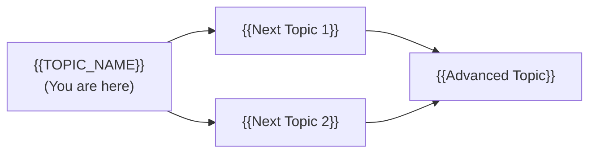
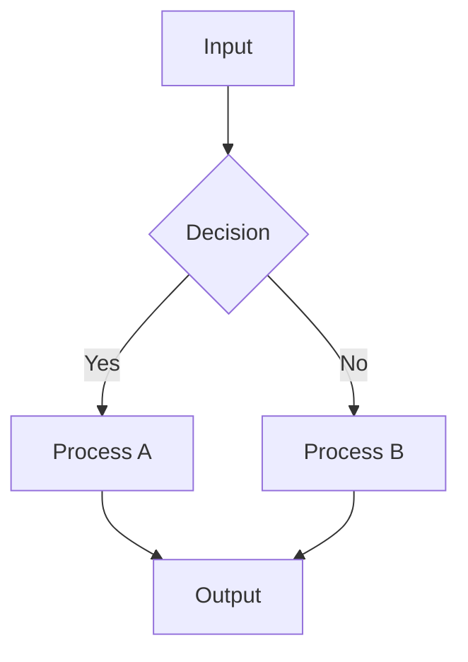
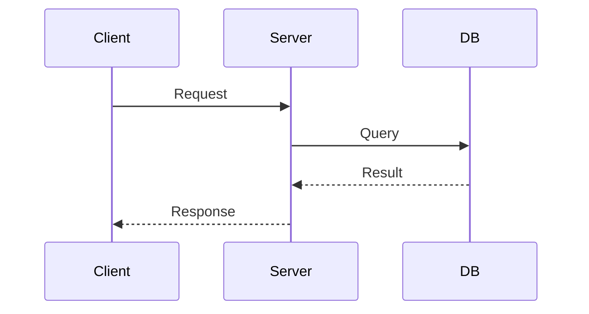
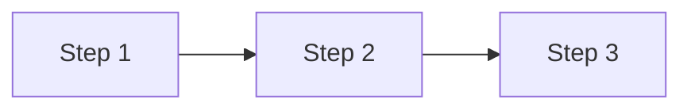
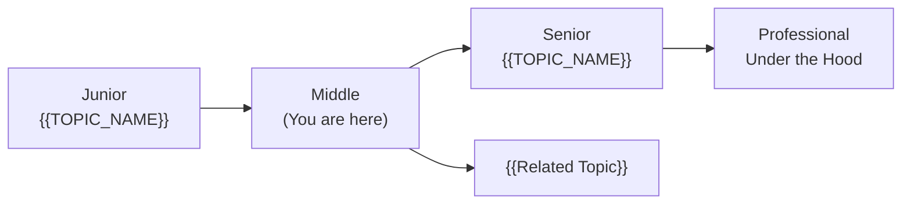
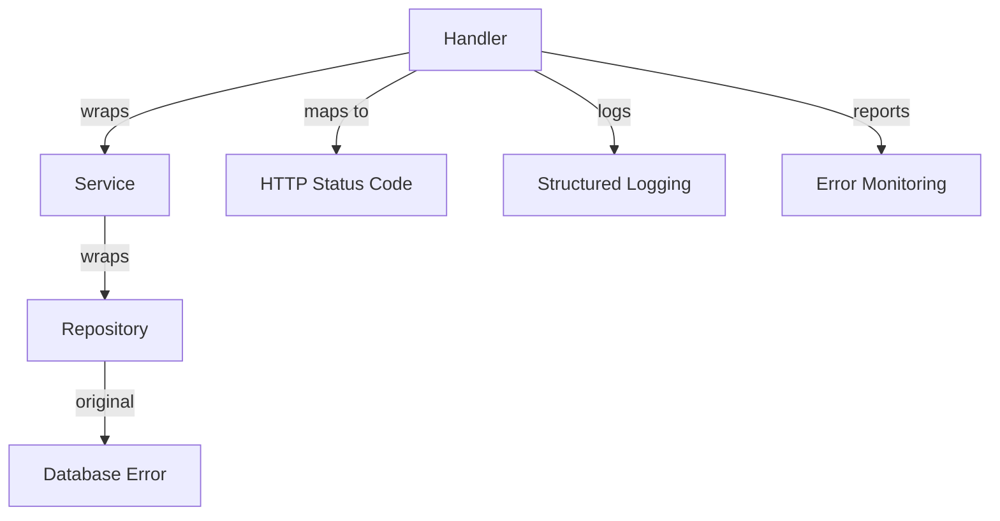
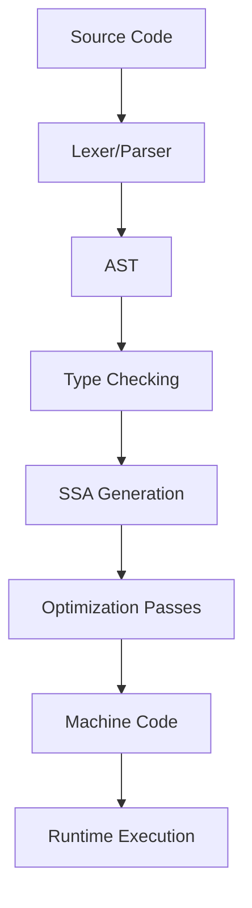

# Go Roadmap — Universal Template

> **A comprehensive template system for generating Go roadmap content across all skill levels.**

---

## Overview

| | Description |
|---|---|
| **Purpose** | Universal template for all Go roadmap topics |
| **Files per topic** | 8 files: `junior.md`, `middle.md`, `senior.md`, `professional.md`, `interview.md`, `tasks.md`, `find-bug.md`, `optimize.md` |
| **Language** | All content must be generated in **English** |

### Topic Structure

```
XX-topic-name/
├── junior.md          ← "What?" and "How?"
├── middle.md          ← "Why?" and "When?"
├── senior.md          ← "How to optimize?" and "How to architect?"
├── professional.md    ← "Under the Hood" — runtime, compiler, OS level
├── interview.md       ← Interview prep across all levels
├── tasks.md           ← Hands-on practice tasks
├── find-bug.md        ← Find and fix bugs in code (10+ exercises)
└── optimize.md        ← Optimize slow/inefficient code (10+ exercises)
```

---

## Level Comparison Matrix

| Aspect | Junior | Middle | Senior | Professional |
|:------:|:------:|:------:|:------:|:------------:|
| **Depth** | Basic concepts, simple examples | Practical usage, real-world cases | Architecture, optimization | Runtime, compiler, OS level |
| **Code** | Hello World level | Production-ready examples | Advanced patterns, benchmarks | Source code analysis, assembly output |
| **Tricky Points** | Syntax errors | Concurrency, memory pitfalls | Compiler internals | Go runtime source, syscall, scheduler |
| **Focus** | "What?" and "How?" | "Why?" and "When?" | "How to improve?" | "What happens under the hood?" |

---
---

# TEMPLATE 1 — `junior.md`

<details open>
<summary><strong>Template Content</strong></summary>

# {{TOPIC_NAME}} — Junior Level

## Table of Contents

1. [Introduction](#introduction)
2. [Prerequisites](#prerequisites)
3. [Glossary](#glossary)
4. [Core Concepts](#core-concepts)
5. [Pros & Cons](#pros--cons)
6. [Use Cases](#use-cases)
7. [Code Examples](#code-examples)
8. [Product Use / Feature](#product-use--feature)
9. [Error Handling](#error-handling)
10. [Security Considerations](#security-considerations)
11. [Performance Tips](#performance-tips)
12. [Best Practices](#best-practices)
13. [Edge Cases & Pitfalls](#edge-cases--pitfalls)
14. [Common Mistakes](#common-mistakes)
15. [Tricky Points](#tricky-points)
16. [Test](#test)
17. [Tricky Questions](#tricky-questions)
18. [Cheat Sheet](#cheat-sheet)
19. [Summary](#summary)
20. [What You Can Build](#what-you-can-build)
21. [Further Reading](#further-reading)
22. [Related Topics](#related-topics)
23. [Diagrams & Visual Aids](#diagrams--visual-aids)

---

## Introduction

> Focus: "What is it?" and "How to use it?"

Brief explanation of what {{TOPIC_NAME}} is and why a beginner needs to know it.
Keep it simple — assume the reader has basic programming knowledge but is new to Go.

---

## Prerequisites

What you should know before studying this topic:

- **Required:** {{concept 1}} — brief explanation of why
- **Required:** {{concept 2}} — brief explanation of why
- **Helpful but not required:** {{concept 3}}

> List 2-4 prerequisites. Link to related roadmap topics if available.

---

## Glossary

Key terms used in this topic:

| Term | Definition |
|------|-----------|
| **{{Term 1}}** | Simple, one-sentence definition |
| **{{Term 2}}** | Simple, one-sentence definition |
| **{{Term 3}}** | Simple, one-sentence definition |

> 5-10 terms. Keep definitions beginner-friendly.
> These terms will appear throughout the document.

---

## Core Concepts

### Concept 1: {{name}}

Simple explanation with analogy if helpful.

### Concept 2: {{name}}

...

> **Rules:**
> - Each concept should be explained in 3-5 sentences max.
> - Use bullet points for lists.
> - Include small code snippets inline where needed.

---

## Pros & Cons

| Pros | Cons |
|------|------|
| {{Advantage 1}} | {{Disadvantage 1}} |
| {{Advantage 2}} | {{Disadvantage 2}} |
| {{Advantage 3}} | {{Disadvantage 3}} |

### When to use:
- {{Scenario where this approach shines}}

### When NOT to use:
- {{Scenario where another approach is better}}

> 3-5 pros and cons each. Be honest — every feature has trade-offs.
> Help juniors make informed decisions about when to use this.

---

## Use Cases

When and where you would use this in real projects:

- **Use Case 1:** Description — e.g., "Building a REST API server"
- **Use Case 2:** Description
- **Use Case 3:** Description

> Keep it practical — things a junior developer would encounter.

---

## Code Examples

### Example 1: {{title}}

```go
// Full working example with comments
package main

import "fmt"

func main() {
    fmt.Println("Hello, World!")
}
```

**What it does:** Brief explanation of what happens.
**How to run:** `go run main.go`

### Example 2: {{title}}

```go
// Another practical example
```

> **Rules:**
> - Every example must be runnable. Include `package main` and `func main()`.
> - Add comments explaining each important line.

---

## Product Use / Feature

How this topic is used in real-world products and tools:

### 1. {{Product/Tool Name}}

- **How it uses {{TOPIC_NAME}}:** Brief description
- **Why it matters:** Practical impact

### 2. {{Product/Tool Name}}

- **How it uses {{TOPIC_NAME}}:** Brief description
- **Why it matters:** Practical impact

### 3. {{Product/Tool Name}}

- **How it uses {{TOPIC_NAME}}:** Brief description
- **Why it matters:** Practical impact

> 3-5 real products/tools. Show how the topic is applied in industry.
> Different from Use Cases — this shows WHERE it's used, not WHEN.

---

## Error Handling

How to handle errors when working with {{TOPIC_NAME}}:

### Error 1: {{Common error message or type}}

```go
// Code that produces this error
```

**Why it happens:** Simple explanation.
**How to fix:**

```go
// Corrected code with proper error handling
```

### Error 2: {{Another common error}}

...

### Error Handling Pattern

```go
// Recommended error handling pattern for this topic
result, err := someFunction()
if err != nil {
    // handle error appropriately
}
```

> 2-4 common errors. Show the error, explain why, and provide the fix.
> Teach the Go error handling idiom: check errors immediately.

---

## Security Considerations

Security aspects to keep in mind when using {{TOPIC_NAME}}:

### 1. {{Security concern}}

```go
// ❌ Insecure
...

// ✅ Secure
...
```

**Risk:** What could go wrong (data leak, injection, unauthorized access).
**Mitigation:** How to protect against it.

### 2. {{Another security concern}}

...

> 2-4 security considerations relevant to this topic.
> Even juniors should learn secure coding habits from the start.
> Focus on: input validation, data exposure, authentication, authorization.

---

## Performance Tips

Basic performance considerations for {{TOPIC_NAME}}:

### Tip 1: {{Performance optimization}}

```go
// ❌ Slow approach
...

// ✅ Faster approach
...
```

**Why it's faster:** Simple explanation (fewer allocations, less copying, etc.)

### Tip 2: {{Another tip}}

...

> 2-4 tips. Keep explanations simple — focus on "what" not "how the CPU works".
> Avoid premature optimization advice — only include tips that are always applicable.

---

## Best Practices

- **Do this:** Explanation
- **Do this:** Explanation
- **Do this:** Explanation

> 3-5 best practices. Keep them actionable and specific to juniors.

---

## Edge Cases & Pitfalls

### Pitfall 1: {{name}}

```go
// Code that demonstrates the pitfall
```

**What happens:** Explanation of unexpected behavior.
**How to fix:** Corrected code or approach.

### Pitfall 2: {{name}}

...

---

## Common Mistakes

### Mistake 1: {{description}}

```go
// ❌ Wrong way
...

// ✅ Correct way
...
```

### Mistake 2: {{description}}

...

> 3-5 mistakes that juniors commonly make with this topic.

---

## Tricky Points

Things that look simple but have subtle behavior:

### Tricky Point 1: {{name}}

```go
// Code that might surprise a junior
```

**Why it's tricky:** Explanation.
**Key takeaway:** One-line lesson.

---

## Test

### Multiple Choice

**1. {{Question}}?**

- A) Option A
- B) Option B
- C) Option C
- D) Option D

<details>
<summary>Answer</summary>
**C)** — Explanation why C is correct and why others are wrong.
</details>

**2. {{Question}}?**

...

### True or False

**3. {{Statement}}**

<details>
<summary>Answer</summary>
**False** — Explanation.
</details>

### What's the Output?

**4. What does this code print?**

```go
// code snippet
```

<details>
<summary>Answer</summary>
Output: `...`
Explanation: ...
</details>

> 5-8 test questions total. Mix of multiple choice, true/false, and "what's the output".

---

## Tricky Questions

Questions designed to confuse — with misleading options:

**1. {{Confusing question}}?**

- A) {{Looks correct but wrong}}
- B) {{Correct answer}}
- C) {{Common misconception}}
- D) {{Partially correct}}

<details>
<summary>Answer</summary>
**B)** — Explanation of why the "obvious" answers are wrong.
</details>

**2. {{Another tricky question}}?**

...

> 3-5 tricky questions. Each should have at least one very convincing wrong answer.

---

## Cheat Sheet

Quick reference for this topic:

| What | Syntax / Command | Example |
|------|-----------------|---------|
| {{Action 1}} | `{{syntax}}` | `{{example}}` |
| {{Action 2}} | `{{syntax}}` | `{{example}}` |
| {{Action 3}} | `{{syntax}}` | `{{example}}` |

> Keep it to 5-10 rows. This should fit on one screen.
> Useful for quick review before interviews or during coding.

---

## Summary

- Key point 1
- Key point 2
- Key point 3

**Next step:** What to learn after this topic.

---

## What You Can Build

Now that you understand {{TOPIC_NAME}}, here's what you can build or use it for:

### Projects you can create:
- **{{Project 1}}:** Brief description — uses {{specific concept from this topic}}
- **{{Project 2}}:** Brief description — combines with {{other topic}}
- **{{Project 3}}:** Brief description — practical daily-use tool

### Technologies / tools that use this:
- **{{Technology 1}}** — how knowing {{TOPIC_NAME}} helps you use it
- **{{Technology 2}}** — what becomes possible after learning this
- **{{Technology 3}}** — career opportunity or skill unlocked

### Learning path — what to study next:



> 3-5 projects and 2-4 technologies/tools.
> Show the practical value of what was learned.
> Include a visual learning path with mermaid diagram.

---

## Further Reading

- **Official docs:** [{{link title}}]({{url}})
- **Blog post:** [{{link title}}]({{url}}) — brief description of what you'll learn
- **Video:** [{{link title}}]({{url}}) — duration, what it covers
- **Book chapter:** {{book name}}, Chapter X — what it covers

> 3-5 resources. Mix of official docs, blog posts, videos, and books.
> Prioritize free, high-quality resources.

---

## Related Topics

Topics to explore next or that connect to this one:

- **[{{Related Topic 1}}](../XX-related-topic/)** — how it connects
- **[{{Related Topic 2}}](../XX-related-topic/)** — how it connects
- **[{{Related Topic 3}}](../XX-related-topic/)** — how it connects

> 2-4 related topics from the roadmap. Show the connection.

---

## Diagrams & Visual Aids

> Include **at least 2-3 visual aids** per document.

### Visual Type Reference

| Visual Type | Best For | Syntax |
|:----------:|:--------:|:------:|
| **Mermaid Flowchart** | Processes, workflows, decision trees | `graph TD` / `graph LR` |
| **Mermaid Sequence** | Request/response flows, lifecycle | `sequenceDiagram` |
| **Mermaid Class** | Type relationships, interfaces | `classDiagram` |
| **ASCII Diagram** | Memory layouts, stack/heap | Box-drawing characters |
| **Comparison Table** | Feature comparisons, trade-offs | Markdown table |

### Example — Flowchart



### Example — Sequence Diagram



### Example — ASCII Memory Layout

```
+------------------+
|   Stack Frame    |
|------------------|
| local_var1: 42   |  <- 8 bytes
| local_var2: &obj |  <- 8 bytes (pointer)
+------------------+
        |
        v
+------------------+
|   Heap Object    |
|------------------|
| field1: "hello"  |
| field2: 3.14     |
+------------------+
```

</details>

---
---

# TEMPLATE 2 — `middle.md`

<details open>
<summary><strong>Template Content</strong></summary>

# {{TOPIC_NAME}} — Middle Level

## Table of Contents

1. [Introduction](#introduction)
2. [Core Concepts](#core-concepts)
3. [Pros & Cons](#pros--cons)
4. [Use Cases](#use-cases)
5. [Code Examples](#code-examples)
6. [Product Use / Feature](#product-use--feature)
7. [Error Handling](#error-handling)
8. [Security Considerations](#security-considerations)
9. [Performance Optimization](#performance-optimization)
10. [Debugging Guide](#debugging-guide)
11. [Best Practices](#best-practices)
12. [Edge Cases & Pitfalls](#edge-cases--pitfalls)
13. [Common Mistakes](#common-mistakes)
14. [Tricky Points](#tricky-points)
15. [Comparison with Other Languages](#comparison-with-other-languages)
16. [Test](#test)
17. [Tricky Questions](#tricky-questions)
18. [Cheat Sheet](#cheat-sheet)
19. [Summary](#summary)
20. [What You Can Build](#what-you-can-build)
21. [Further Reading](#further-reading)
22. [Related Topics](#related-topics)
23. [Diagrams & Visual Aids](#diagrams--visual-aids)

---

## Introduction

> Focus: "Why?" and "When to use?"

Assumes the reader already knows the basics. This level covers:
- Deeper understanding of how {{TOPIC_NAME}} works
- Real-world application patterns
- Production considerations

---

## Core Concepts

### Concept 1: {{Advanced concept}}

Detailed explanation with diagrams (mermaid) where helpful.



### Concept 2: {{Another concept}}

- How it relates to other Go features
- Internal behavior differences
- Performance implications

> **Rules:**
> - Go deeper than junior. Explain "why" not just "what".
> - Compare different approaches and their trade-offs.
> - Include benchmarks or performance data where relevant.

---

## Pros & Cons

| Pros | Cons |
|------|------|
| {{Advantage 1 with production context}} | {{Disadvantage 1 with impact analysis}} |
| {{Advantage 2}} | {{Disadvantage 2}} |
| {{Advantage 3}} | {{Disadvantage 3}} |

### Trade-off analysis:

- **{{Trade-off 1}}:** When {{advantage}} outweighs {{disadvantage}} — decision criteria
- **{{Trade-off 2}}:** When to accept {{limitation}} for {{benefit}}

### Comparison with alternatives:

| Approach | Pros | Cons | Best for |
|----------|------|------|----------|
| {{Approach A}} | {{pros}} | {{cons}} | {{scenario}} |
| {{Approach B}} | {{pros}} | {{cons}} | {{scenario}} |

> More nuanced than junior — include trade-off analysis and alternative comparison.
> Help middle developers make informed architectural decisions.

---

## Use Cases

Real-world, production scenarios:

- **Use Case 1:** {{Production scenario}} — e.g., "Microservice communication patterns"
- **Use Case 2:** {{Scaling scenario}}
- **Use Case 3:** {{Integration scenario}}

> Focus on problems a middle developer solves at work.

---

## Code Examples

### Example 1: {{Production-ready pattern}}

```go
// Production-quality code with error handling, logging, etc.
```

**Why this pattern:** Explanation of design decisions.
**Trade-offs:** What you gain and what you sacrifice.

### Example 2: {{Comparison of approaches}}

```go
// Approach A
...

// Approach B (better for X reason)
...
```

**When to use which:** Decision criteria.

> **Rules:**
> - Code should be production-quality. Include error handling, context, timeouts.
> - Show comparisons between approaches.

---

## Product Use / Feature

How this topic is applied in production systems and popular tools:

### 1. {{Product/Tool Name}}

- **How it uses {{TOPIC_NAME}}:** Description with architectural context
- **Scale:** Numbers, traffic, data volume
- **Key insight:** What can be learned from their approach

### 2. {{Product/Tool Name}}

- **How it uses {{TOPIC_NAME}}:** Description
- **Why this approach:** Trade-offs they made

> 3-5 real products. Focus on production-scale usage and architectural decisions.

---

## Error Handling

Production-grade error handling patterns for {{TOPIC_NAME}}:

### Pattern 1: {{Error handling pattern}}

```go
// Production error handling with context, wrapping, and recovery
func doSomething() error {
    result, err := riskyOperation()
    if err != nil {
        return fmt.Errorf("doSomething failed: %w", err)
    }
    return nil
}
```

**When to use:** {{scenario}}
**Key principle:** Always wrap errors with context for debugging.

### Pattern 2: {{Custom error types}}

```go
// Custom error type for domain-specific errors
type {{CustomError}} struct {
    Code    int
    Message string
    Err     error
}

func (e *{{CustomError}}) Error() string { return e.Message }
func (e *{{CustomError}}) Unwrap() error { return e.Err }
```

### Common Error Patterns

| Situation | Pattern | Example |
|-----------|---------|---------|
| Wrapping errors | `fmt.Errorf("context: %w", err)` | Add context to errors |
| Checking error type | `errors.Is(err, target)` | Check specific error |
| Extracting error | `errors.As(err, &target)` | Get typed error info |
| Sentinel errors | `var ErrNotFound = errors.New("not found")` | Predefined errors |

> Focus on production patterns: error wrapping, custom types, sentinel errors.
> Show how proper error handling prevents debugging nightmares.

---

## Security Considerations

Security aspects when using {{TOPIC_NAME}} in production:

### 1. {{Security concern}}

**Risk level:** High / Medium / Low

```go
// ❌ Vulnerable code
...

// ✅ Secure code
...
```

**Attack vector:** How this vulnerability can be exploited.
**Impact:** What happens if exploited (data leak, unauthorized access, etc.)
**Mitigation:** Step-by-step fix.

### 2. {{Another security concern}}

...

### Security Checklist

- [ ] {{Check 1}} — why it matters
- [ ] {{Check 2}} — why it matters
- [ ] {{Check 3}} — why it matters

> 3-5 security concerns. Include OWASP-relevant issues.
> Show vulnerable vs secure code side by side.
> Include a security checklist for code review.

---

## Performance Optimization

Performance considerations and optimizations for {{TOPIC_NAME}}:

### Optimization 1: {{name}}

```go
// ❌ Slow — O(n²) / high allocations
...

// ✅ Fast — O(n) / zero allocations
...
```

**Benchmark results:**
```
BenchmarkSlow-8    100000    15234 ns/op    4096 B/op    10 allocs/op
BenchmarkFast-8    500000     2041 ns/op       0 B/op     0 allocs/op
```

**When to optimize:** Only when profiling shows this is a bottleneck.

### Optimization 2: {{name}}

...

### Performance Decision Matrix

| Scenario | Approach | Why |
|----------|----------|-----|
| {{Low traffic}} | {{Simple approach}} | Readability > performance |
| {{High traffic}} | {{Optimized approach}} | Performance critical |
| {{Memory constrained}} | {{Memory-efficient approach}} | Reduce allocations |

> Back every claim with benchmarks.
> Include "when NOT to optimize" — premature optimization is the root of all evil.
> Show the decision matrix for choosing the right approach.

---

## Debugging Guide

How to debug common issues related to {{TOPIC_NAME}}:

### Problem 1: {{Common symptom}}

**Symptoms:** What you see (error messages, unexpected behavior, performance degradation).

**Diagnostic steps:**
```bash
# Command or tool to identify the issue
```

**Root cause:** Why this happens.
**Fix:** How to resolve it.

### Problem 2: {{Another common issue}}

...

### Useful Tools

| Tool | Command | What it shows |
|------|---------|---------------|
| {{tool 1}} | `{{command}}` | {{description}} |
| {{tool 2}} | `{{command}}` | {{description}} |

> 2-4 debugging scenarios with concrete steps.
> Include relevant tools: delve, pprof, trace, race detector, etc.

---

## Best Practices

- **Practice 1:** Explanation + code snippet
- **Practice 2:** Explanation + why it matters in production
- **Practice 3:** Explanation + common violation example

> 5-7 practices. More nuanced than junior level.
> Include "it depends" scenarios with decision criteria.

---

## Edge Cases & Pitfalls

### Pitfall 1: {{Production pitfall}}

```go
// Code that causes issues in production
```

**Impact:** What goes wrong (data loss, memory leak, deadlock, etc.)
**Detection:** How to notice the problem.
**Fix:** Corrected approach.

### Pitfall 2: {{Concurrency/Performance pitfall}}

...

> Focus on pitfalls that appear under load, in concurrent code, or at scale.

---

## Common Mistakes

### Mistake 1: {{Middle-level mistake}}

```go
// ❌ Looks correct but has subtle issues
...

// ✅ Properly handles edge cases
...
```

**Why it's wrong:** Explanation of subtle issue.

> Mistakes that pass code review but fail in production.

---

## Tricky Points

### Tricky Point 1: {{Subtle behavior}}

```go
// Code with non-obvious behavior
```

**What actually happens:** Step-by-step explanation.
**Why:** Reference to Go spec or runtime behavior.

> More complex than junior tricky points. May involve goroutines, interfaces, memory.

---

## Comparison with Other Languages

How Go handles {{TOPIC_NAME}} compared to other languages:

| Aspect | Go | Python | Java | Rust |
|--------|-----|--------|------|------|
| {{Aspect 1}} | {{Go approach}} | {{Python approach}} | {{Java approach}} | {{Rust approach}} |
| {{Aspect 2}} | ... | ... | ... | ... |
| {{Aspect 3}} | ... | ... | ... | ... |

### Key differences:

- **Go vs Python:** {{main difference and why it matters}}
- **Go vs Java:** {{main difference and why it matters}}
- **Go vs Rust:** {{main difference and why it matters}}

> Focus on 2-3 languages most relevant to the topic.
> Highlight Go's unique design decisions and their trade-offs.

---

## Test

### Multiple Choice (harder)

**1. {{Question involving trade-offs or subtle behavior}}?**

- A) ...
- B) ...
- C) ...
- D) ...

<details>
<summary>Answer</summary>
**B)** — Detailed explanation with Go spec reference if applicable.
</details>

### Code Analysis

**2. What happens when this code runs with 1000 concurrent requests?**

```go
// concurrent code
```

<details>
<summary>Answer</summary>
Explanation of race condition / deadlock / correct behavior.
</details>

### Debug This

**3. This code has a bug. Find it.**

```go
// buggy code
```

<details>
<summary>Answer</summary>
Bug: ... Fix: ...
</details>

> 6-10 questions. Include code analysis, debugging, and "what happens under load" questions.

---

## Tricky Questions

**1. {{Question that tests deep understanding}}?**

- A) {{Extremely convincing wrong answer}}
- B) ...
- C) ...
- D) {{Correct but counter-intuitive}}

<details>
<summary>Answer</summary>
**D)** — Deep explanation of why the intuitive answer is wrong.
</details>

> 4-6 questions. Should require understanding of Go internals to answer correctly.

---

## Cheat Sheet

Quick reference for production use:

| Scenario | Pattern | Key consideration |
|----------|---------|-------------------|
| {{Scenario 1}} | `{{code pattern}}` | {{what to watch for}} |
| {{Scenario 2}} | `{{code pattern}}` | {{what to watch for}} |
| {{Scenario 3}} | `{{code pattern}}` | {{what to watch for}} |

### Decision Matrix

| If you need... | Use... | Because... |
|----------------|--------|------------|
| {{need 1}} | {{approach}} | {{reason}} |
| {{need 2}} | {{approach}} | {{reason}} |

> Include a decision matrix for choosing between approaches.

---

## Summary

- Key insight 1
- Key insight 2
- Key insight 3

**Key difference from Junior:** What deeper understanding was gained.
**Next step:** What to explore at Senior level.

---

## What You Can Build

With middle-level understanding of {{TOPIC_NAME}}, you can now:

### Production systems:
- **{{System 1}}:** Description — applies {{specific pattern from this level}}
- **{{System 2}}:** Description — combines {{TOPIC_NAME}} with {{other Go feature}}

### Career opportunities:
- **{{Role/Position}}** — this knowledge is required/valued
- **{{Technology/Framework}}** — builds on this foundation

### Technologies that become accessible:
- **{{Technology 1}}** — how this knowledge unlocks it
- **{{Technology 2}}** — production use case

### Learning path:



> Focus on production-level projects and career advancement.

---

## Further Reading

- **Official docs:** [{{link title}}]({{url}})
- **Blog post:** [{{link title}}]({{url}}) — what you'll learn
- **Conference talk:** [{{link title}}]({{url}}) — speaker, event, key takeaways
- **Open source:** [{{project name}}]({{url}}) — how it demonstrates this topic

> 4-6 resources. Include production-focused blog posts and conference talks.

---

## Related Topics

- **[{{Related Topic 1}}](../XX-related-topic/)** — how it connects
- **[{{Related Topic 2}}](../XX-related-topic/)** — how it connects

---

## Diagrams & Visual Aids

> Include **at least 2-3 visual aids** per document.

### Visual Type Reference

| Visual Type | Best For | Syntax |
|:----------:|:--------:|:------:|
| **Mermaid Flowchart** | Processes, workflows, decision trees | `graph TD` / `graph LR` |
| **Mermaid Sequence** | Request/response flows, lifecycle | `sequenceDiagram` |
| **Mermaid Class** | Type relationships, interfaces | `classDiagram` |
| **ASCII Diagram** | Memory layouts, stack/heap | Box-drawing characters |
| **Comparison Table** | Feature comparisons, trade-offs | Markdown table |

### Example — Flowchart


### Example — Sequence Diagram


### Example — ASCII Memory Layout

```
+------------------+
|   Stack Frame    |
|------------------|
| local_var1: 42   |  <- 8 bytes
| local_var2: &obj |  <- 8 bytes (pointer)
+------------------+
        |
        v
+------------------+
|   Heap Object    |
|------------------|
| field1: "hello"  |
| field2: 3.14     |
+------------------+
```

</details>

---
---

# TEMPLATE 3 — `senior.md`

<details open>
<summary><strong>Template Content</strong></summary>

# {{TOPIC_NAME}} — Senior Level

## Table of Contents

1. [Introduction](#introduction)
2. [Core Concepts](#core-concepts)
3. [Pros & Cons](#pros--cons)
4. [Use Cases](#use-cases)
5. [Code Examples](#code-examples)
6. [Product Use / Feature](#product-use--feature)
7. [Error Handling](#error-handling)
8. [Security Considerations](#security-considerations)
9. [Performance Optimization](#performance-optimization)
10. [Debugging Guide](#debugging-guide)
11. [Best Practices](#best-practices)
12. [Edge Cases & Pitfalls](#edge-cases--pitfalls)
13. [Common Mistakes](#common-mistakes)
14. [Tricky Points](#tricky-points)
15. [Comparison with Other Languages](#comparison-with-other-languages)
16. [Test](#test)
17. [Tricky Questions](#tricky-questions)
18. [Cheat Sheet](#cheat-sheet)
19. [Summary](#summary)
20. [What You Can Build](#what-you-can-build)
21. [Further Reading](#further-reading)
22. [Related Topics](#related-topics)
23. [Diagrams & Visual Aids](#diagrams--visual-aids)

---

## Introduction

> Focus: "How to optimize?" and "How to architect?"

For developers who:
- Design systems and make architectural decisions
- Optimize performance-critical code
- Mentor junior/middle developers
- Review and improve codebases

---

## Core Concepts

### Concept 1: {{Architecture-level concept}}

Deep dive with:
- Design patterns and when to apply them
- Performance characteristics (Big-O, memory, allocations)
- Comparison with alternative approaches in other languages

```go
// Advanced pattern with detailed annotations
```

### Concept 2: {{Optimization concept}}

Benchmark comparisons:

```go
func BenchmarkApproachA(b *testing.B) { ... }
func BenchmarkApproachB(b *testing.B) { ... }
```

Results:
```
BenchmarkApproachA-8    1000000    1024 ns/op    256 B/op    4 allocs/op
BenchmarkApproachB-8    5000000     205 ns/op      0 B/op    0 allocs/op
```

> **Rules:**
> - Every claim about performance must be backed by benchmarks.
> - Discuss trade-offs: readability vs performance, simplicity vs flexibility.

---

## Pros & Cons

### Strategic analysis for architectural decisions:

| Pros | Cons | Impact |
|------|------|--------|
| {{Advantage 1}} | {{Disadvantage 1}} | {{Impact on system architecture}} |
| {{Advantage 2}} | {{Disadvantage 2}} | {{Impact on team/maintenance}} |
| {{Advantage 3}} | {{Disadvantage 3}} | {{Impact on performance/scale}} |

### When Go's approach is the RIGHT choice:
- {{Scenario 1}} — why the pros outweigh the cons here
- {{Scenario 2}}

### When Go's approach is the WRONG choice:
- {{Scenario 1}} — what to use instead and why
- {{Scenario 2}}

### Real-world decision examples:
- **{{Company X}}** chose {{approach}} because {{reasoning}} — result: {{outcome}}
- **{{Company Y}}** avoided {{approach}} because {{reasoning}} — alternative: {{what they used}}

> Senior-level: include strategic impact, real-world examples, and alternative technologies.
> This section helps architects make informed decisions about when to use Go for this.

---

## Use Cases

Architectural and system-level scenarios:

- **Use Case 1:** {{System design scenario}} — e.g., "Designing a rate limiter for 100K rps"
- **Use Case 2:** {{Migration scenario}} — e.g., "Migrating from monolith to microservices"
- **Use Case 3:** {{Optimization scenario}} — e.g., "Reducing GC pressure in hot paths"

---

## Code Examples

### Example 1: {{Architecture pattern}}

```go
// Full implementation of a production pattern
// With interfaces, DI, error handling, graceful shutdown
```

**Architecture decisions:** Why this structure.
**Alternatives considered:** What else could work and why this was chosen.

### Example 2: {{Performance optimization}}

```go
// Before optimization
...

// After optimization (with benchmark proof)
...
```

> Show real optimization techniques: sync.Pool, buffer reuse, allocation avoidance.

---

## Product Use / Feature

How industry leaders use this topic at scale:

### 1. {{Company/Product Name}}

- **Architecture:** How they implement {{TOPIC_NAME}} at scale
- **Scale:** Specific numbers (rps, data volume, latency requirements)
- **Lessons learned:** What they changed and why
- **Source:** Blog post, talk, or open-source code reference

### 2. {{Company/Product Name}}

- **Architecture:** Description
- **Trade-offs:** What they sacrificed and gained

> 3-5 real-world examples from companies like Google, Uber, Cloudflare, etc.
> Include specific metrics and architectural decisions.
> Reference actual blog posts, conference talks, or open-source implementations.

---

## Error Handling

Enterprise-grade error handling strategies for {{TOPIC_NAME}}:

### Strategy 1: {{Error handling architecture}}

```go
// Domain-specific error hierarchy
type DomainError struct {
    Code       string
    Message    string
    StatusCode int
    Err        error
    Metadata   map[string]string
}

func (e *DomainError) Error() string { return e.Message }
func (e *DomainError) Unwrap() error { return e.Err }
```

**When to use:** Large codebases with multiple error domains.
**Trade-off:** More code vs better debugging and monitoring.

### Strategy 2: {{Error propagation pattern}}

```go
// Error propagation with observability
func (s *Service) Process(ctx context.Context, req Request) error {
    result, err := s.repo.Get(ctx, req.ID)
    if err != nil {
        // Structured logging for observability
        s.logger.Error("process failed",
            "request_id", req.ID,
            "error", err,
        )
        return fmt.Errorf("service.Process: %w", err)
    }
    return nil
}
```

### Error Handling Architecture



> Focus on error handling as architecture, not just syntax.
> Include: error hierarchies, propagation strategies, monitoring integration.

---

## Security Considerations

Security architecture for {{TOPIC_NAME}} at scale:

### 1. {{Critical security concern}}

**Risk level:** Critical
**OWASP category:** {{relevant OWASP category}}

```go
// ❌ Vulnerable — {{why it's dangerous}}
...

// ✅ Secure — {{what makes it safe}}
...
```

**Attack scenario:** Step-by-step of how an attacker could exploit this.
**Defense in depth:** Multiple layers of protection.
**Monitoring:** How to detect attempted exploits.

### 2. {{Another security concern}}

...

### Security Architecture Checklist

- [ ] **Input validation** — validate at system boundaries
- [ ] **Output encoding** — prevent injection in responses
- [ ] **Authentication** — verify identity correctly
- [ ] **Authorization** — check permissions at every level
- [ ] **Secrets management** — no hardcoded credentials
- [ ] **Audit logging** — track security-relevant events
- [ ] **Rate limiting** — prevent abuse
- [ ] **Dependency scanning** — check for vulnerable dependencies

### Threat Model

| Threat | Likelihood | Impact | Mitigation |
|--------|:---------:|:------:|------------|
| {{Threat 1}} | High | Critical | {{mitigation}} |
| {{Threat 2}} | Medium | High | {{mitigation}} |

> Senior-level security: include threat modeling, defense in depth, monitoring.
> Reference OWASP guidelines where applicable.

---

## Performance Optimization

Advanced performance optimization strategies for {{TOPIC_NAME}}:

### Optimization 1: {{name}}

```go
// Before — profiling shows this is a bottleneck
func slowFunction() {
    // ...
}

// After — 5x improvement
func fastFunction() {
    // ...
}
```

**Profiling evidence:**
```bash
go tool pprof -http=:8080 cpu.prof
```

**Benchmark proof:**
```
BenchmarkSlow-8    100000    15234 ns/op    4096 B/op    10 allocs/op
BenchmarkFast-8    500000     3041 ns/op     256 B/op     1 allocs/op
```

### Optimization 2: {{name}}

...

### Performance Architecture

| Layer | Optimization | Impact | Cost |
|:-----:|:------------|:------:|:----:|
| **Algorithm** | {{approach}} | Highest | Requires redesign |
| **Data structure** | {{approach}} | High | Moderate refactor |
| **Memory** | {{approach}} | Medium | Low effort |
| **I/O** | {{approach}} | Varies | May need infra changes |

### When NOT to optimize:
- {{Scenario where optimization hurts readability without measurable benefit}}
- {{Scenario where the bottleneck is elsewhere}}

> Every optimization must have profiling evidence and benchmark proof.
> Include a cost/benefit analysis — some optimizations aren't worth the complexity.

---

## Debugging Guide

Advanced debugging techniques for {{TOPIC_NAME}} at scale:

### Problem 1: {{Production issue}}

**Symptoms:** What monitoring/alerting shows.

**Diagnostic steps:**
```bash
# Advanced diagnostic commands
go tool pprof ...
go tool trace ...
```

**Root cause analysis:** Deep explanation.
**Fix:** Architecture-level solution.
**Prevention:** How to prevent this in the future (monitoring, tests, linters).

### Problem 2: {{Performance degradation}}

...

### Advanced Tools & Techniques

| Tool | Use case | When to use |
|------|----------|-------------|
| `go tool pprof` | CPU/memory profiling | Performance issues |
| `go tool trace` | Execution tracing | Concurrency issues |
| `go build -race` | Race detection | Data race debugging |
| `delve` | Step-by-step debugging | Complex logic bugs |

> Focus on production debugging scenarios.
> Include monitoring and observability considerations.

---

## Best Practices

- **Practice 1:** Explanation + impact on team/codebase
- **Practice 2:** Explanation + when to break this rule
- **Practice 3:** Explanation + how to enforce via tooling (linters, CI)

> 5-8 practices. Senior-level: includes team impact and governance.
> Include "when to break the rule" — seniors need judgment, not dogma.

---

## Edge Cases & Pitfalls

### Pitfall 1: {{Scale pitfall}}

```go
// Code that works fine until 10K connections / 1M records / etc.
```

**At what scale it breaks:** Specific numbers.
**Root cause:** Why it fails.
**Solution:** Architecture-level fix.

> Focus on pitfalls at scale, under high concurrency, in distributed systems.

---

## Common Mistakes

### Mistake 1: {{Architectural anti-pattern}}

```go
// ❌ Common but wrong architecture
...

// ✅ Better approach
...
```

**Why seniors still make this mistake:** Context.
**How to prevent:** Code review checklist item, linter rule, etc.

---

## Tricky Points

### Tricky Point 1: {{Go spec subtlety}}

```go
// Code that exploits a subtle Go specification detail
```

**Go spec reference:** Link or quote from spec.
**Why this matters:** Real-world impact.

> Reference Go spec, compiler behavior, runtime source code.

---

## Comparison with Other Languages

Deep architectural comparison:

| Aspect | Go | Rust | Java | C++ |
|--------|:---:|:----:|:----:|:---:|
| {{Aspect 1}} | {{approach}} | {{approach}} | {{approach}} | {{approach}} |
| {{Aspect 2}} | ... | ... | ... | ... |

### Architectural trade-offs:

- **Go vs Rust:** {{Go chose simplicity/GC, Rust chose zero-cost abstractions — impact on this topic}}
- **Go vs Java:** {{Go chose X, Java chose Y — performance and design implications}}

### When Go's approach wins:
- {{scenario where Go's design is ideal}}

### When Go's approach loses:
- {{scenario where another language handles this better, and why}}

> Focus on architectural decisions, not syntax differences.
> Be honest about Go's limitations — seniors need realistic assessments.

---

## Test

### Architecture Questions

**1. You're designing {{system}}. Which approach is best and why?**

- A) ...
- B) ...
- C) ...
- D) ...

<details>
<summary>Answer</summary>
**C)** — Full architectural reasoning.
</details>

### Performance Analysis

**2. This function allocates too much. How would you optimize it?**

```go
// code with allocation issues
```

<details>
<summary>Answer</summary>
Step-by-step optimization with benchmark results.
</details>

### Code Review

**3. Find 3 issues in this production code:**

```go
// code with subtle issues
```

<details>
<summary>Answer</summary>
Issue 1: ... Issue 2: ... Issue 3: ...
</details>

> 8-12 questions. Architecture, performance, code review, system design.

---

## Tricky Questions

**1. {{Question that even experienced developers get wrong}}?**

<details>
<summary>Answer</summary>
Detailed explanation with Go spec reference and benchmark proof.
</details>

> 5-7 questions. Should stump most developers. Require deep Go knowledge.

---

## Cheat Sheet

### Architecture Decision Matrix

| Scenario | Recommended pattern | Avoid | Why |
|----------|-------------------|-------|-----|
| {{scenario 1}} | {{pattern}} | {{anti-pattern}} | {{reasoning}} |
| {{scenario 2}} | {{pattern}} | {{anti-pattern}} | {{reasoning}} |

### Performance Quick Wins

| Optimization | When to apply | Expected improvement |
|-------------|---------------|---------------------|
| {{optimization 1}} | {{condition}} | {{improvement}} |
| {{optimization 2}} | {{condition}} | {{improvement}} |

### Code Review Checklist

- [ ] {{Check 1}} — why it matters
- [ ] {{Check 2}} — why it matters
- [ ] {{Check 3}} — why it matters

> Include decision matrices and checklists that seniors can use in daily work.

---

## Summary

- Key architectural insight 1
- Key performance insight 2
- Key leadership insight 3

**Senior mindset:** Not just "how" but "when", "why", and "what are the trade-offs".

---

## What You Can Build

With senior-level mastery of {{TOPIC_NAME}}, you can:

### Architect and lead:
- **{{System/Platform 1}}:** Large-scale system design — applies {{architectural pattern}}
- **{{System/Platform 2}}:** High-performance infrastructure — requires {{optimization knowledge}}

### Open source contributions:
- **{{Project 1}}** — contribute to {{specific area}}
- **Go standard library** — understand and contribute to {{relevant package}}

### Technologies and platforms:
- **{{Platform 1}}** — architect solutions using {{TOPIC_NAME}} at scale
- **{{Platform 2}}** — this knowledge is directly applicable

### Career impact:
- **Staff/Principal Engineer** — system design interviews require this depth
- **Tech Lead** — mentor others on {{TOPIC_NAME}} architectural decisions
- **Open Source Maintainer** — contribute to Go ecosystem

> Focus on leadership, architecture, and career-defining opportunities.

---

## Further Reading

- **Go proposal:** [{{proposal title}}]({{url}}) — context on why Go made this design decision
- **Conference talk:** [{{talk title}}]({{url}}) — speaker, key insights
- **Blog post:** [{{title}}]({{url}}) — production experience at scale
- **Source code:** [{{Go runtime file}}]({{url}}) — what to look for
- **Book:** {{book name}}, Chapter X — deep dive on this topic

> 5-8 resources. Include Go proposals, source code references, and production war stories.

---

## Related Topics

- **[{{Related Topic 1}}](../XX-related-topic/)** — architectural connection
- **[{{Related Topic 2}}](../XX-related-topic/)** — performance connection
- **[{{Related Topic 3}}](../XX-related-topic/)** — design pattern connection

---

## Diagrams & Visual Aids

> Include **at least 2-3 visual aids** per document.

### Visual Type Reference

| Visual Type | Best For | Syntax |
|:----------:|:--------:|:------:|
| **Mermaid Flowchart** | Processes, workflows, decision trees | `graph TD` / `graph LR` |
| **Mermaid Sequence** | Request/response flows, lifecycle | `sequenceDiagram` |
| **Mermaid Class** | Type relationships, interfaces | `classDiagram` |
| **ASCII Diagram** | Memory layouts, stack/heap | Box-drawing characters |
| **Comparison Table** | Feature comparisons, trade-offs | Markdown table |

### Example — Flowchart


### Example — Sequence Diagram


### Example — ASCII Memory Layout

```
+------------------+
|   Stack Frame    |
|------------------|
| local_var1: 42   |  <- 8 bytes
| local_var2: &obj |  <- 8 bytes (pointer)
+------------------+
        |
        v
+------------------+
|   Heap Object    |
|------------------|
| field1: "hello"  |
| field2: 3.14     |
+------------------+
```

</details>

---
---

# TEMPLATE 4 — `professional.md`

<details open>
<summary><strong>Template Content</strong></summary>

# {{TOPIC_NAME}} — Under the Hood

## Table of Contents

1. [Introduction](#introduction)
2. [How It Works Internally](#how-it-works-internally)
3. [Runtime Deep Dive](#runtime-deep-dive)
4. [Compiler Perspective](#compiler-perspective)
5. [Memory Layout](#memory-layout)
6. [OS / Syscall Level](#os--syscall-level)
7. [Source Code Walkthrough](#source-code-walkthrough)
8. [Assembly Output Analysis](#assembly-output-analysis)
9. [Performance Internals](#performance-internals)
10. [Edge Cases at the Lowest Level](#edge-cases-at-the-lowest-level)
11. [Test](#test)
12. [Tricky Questions](#tricky-questions)
13. [Summary](#summary)
14. [Further Reading](#further-reading)
15. [Diagrams & Visual Aids](#diagrams--visual-aids)

---

## Introduction

> Focus: "What happens under the hood?"

This document explores what Go does internally when you use {{TOPIC_NAME}}.
For developers who want to understand:
- What the compiler generates
- How the runtime manages it
- What syscalls are made
- How memory is laid out

---

## How It Works Internally

Step-by-step breakdown of what happens when Go executes {{feature}}:

1. **Source code** → What you write
2. **AST** → How compiler parses it
3. **SSA** → Intermediate representation
4. **Machine code** → What actually runs
5. **Runtime** → What manages it at runtime



---

## Runtime Deep Dive

### How Go Runtime handles {{feature}}

```go
// Reference to Go runtime source code
// e.g., runtime/proc.go, runtime/chan.go, runtime/slice.go
```

**Key runtime structures:**

```go
// From Go source: runtime/{{file}}.go
type {{internalStruct}} struct {
    // fields with explanations
}
```

**Key functions:**
- `runtime.{{func1}}()` — what it does
- `runtime.{{func2}}()` — when it's called

---

## Compiler Perspective

What the Go compiler does with this feature:

```bash
# View compiler decisions
go build -gcflags="-m -m" main.go

# View SSA
GOSSAFUNC=main go build main.go
```

**Compiler optimizations applied:**
- Inlining decisions
- Escape analysis results
- Dead code elimination

---

## Memory Layout

How this feature is represented in memory:

```
┌──────────┬──────────┬──────────┐
│  Field 1 │  Field 2 │  Field 3 │
│  8 bytes │  8 bytes │  8 bytes │
└──────────┴──────────┴──────────┘
```

**Key points:**
- Alignment and padding
- Stack vs heap allocation
- Pointer indirection cost

```go
// Verify with unsafe.Sizeof, unsafe.Alignof, unsafe.Offsetof
fmt.Println(unsafe.Sizeof(x))    // size in bytes
fmt.Println(unsafe.Alignof(x))   // alignment
```

---

## OS / Syscall Level

What system calls are involved:

```bash
# Trace syscalls
strace -f ./myprogram
```

**Key syscalls:**
- `{{syscall1}}` — when and why
- `{{syscall2}}` — when and why

---

## Source Code Walkthrough

Walking through the actual Go source code:

**File:** `src/runtime/{{file}}.go`

```go
// Annotated excerpt from Go source code
// with line-by-line explanation
```

**File:** `src/cmd/compile/internal/{{file}}.go`

```go
// How the compiler handles this feature
```

> Reference specific Go version (e.g., go1.22) since internals change.

---

## Assembly Output Analysis

```bash
go build -gcflags="-S" main.go
# or
go tool objdump -s "main.main" ./binary
```

```asm
; Key assembly instructions with explanations
TEXT main.main(SB)
    MOVQ    ...    ; explanation
    CALL    ...    ; explanation
```

**What to look for:**
- Number of instructions
- Stack frame size
- Heap allocations (calls to `runtime.newobject`)
- Function call overhead

---

## Performance Internals

### Benchmarks with profiling

```go
func BenchmarkFeature(b *testing.B) {
    for i := 0; i < b.N; i++ {
        // benchmark code
    }
}
```

```bash
go test -bench=. -benchmem -cpuprofile=cpu.prof
go tool pprof cpu.prof
```

**Internal performance characteristics:**
- Allocation count and size
- Cache line behavior
- Branch prediction impact
- GC pressure

---

## Edge Cases at the Lowest Level

### Edge Case 1: {{name}}

What happens internally when {{extreme scenario}}:

```go
// Code that pushes limits
```

**Internal behavior:** Step-by-step of what runtime does.
**Why it matters:** Impact on production systems.

---

## Test

### Internal Knowledge Questions

**1. What Go runtime function is called when {{action}}?**

<details>
<summary>Answer</summary>
`runtime.{{func}}()` — explanation of what it does and when it's triggered.
</details>

**2. What does this assembly output tell you?**

```asm
// assembly snippet
```

<details>
<summary>Answer</summary>
Analysis of the assembly instructions.
</details>

> 5-8 questions. Require knowledge of Go runtime, compiler, or assembly.

---

## Tricky Questions

**1. {{Question about internal behavior that contradicts common assumptions}}?**

<details>
<summary>Answer</summary>
Explanation with proof (benchmark, assembly output, or runtime source reference).
</details>

> 3-5 questions. Should require reading Go source code to answer definitively.

---

## Summary

- Internal mechanism 1
- Internal mechanism 2
- Internal mechanism 3

**Key takeaway:** Understanding internals helps you write faster, more predictable Go code.

---

## Further Reading

- **Go source:** [{{runtime file}}](https://github.com/golang/go/blob/master/src/runtime/{{file}}.go)
- **Design doc:** [{{proposal/design doc title}}]({{url}})
- **Conference talk:** [{{talk about Go internals}}]({{url}})
- **Book:** {{book name}} — chapter on Go internals

> 3-5 resources. Prioritize Go source code, design documents, and proposals.

---

## Diagrams & Visual Aids

> Include **at least 2-3 visual aids** per document.

### Visual Type Reference

| Visual Type | Best For | Syntax |
|:----------:|:--------:|:------:|
| **Mermaid Flowchart** | Processes, workflows, decision trees | `graph TD` / `graph LR` |
| **Mermaid Sequence** | Request/response flows, lifecycle | `sequenceDiagram` |
| **Mermaid Class** | Type relationships, interfaces | `classDiagram` |
| **ASCII Diagram** | Memory layouts, stack/heap | Box-drawing characters |
| **Comparison Table** | Feature comparisons, trade-offs | Markdown table |

### Example — Flowchart


### Example — Sequence Diagram


### Example — ASCII Memory Layout

```
+------------------+
|   Stack Frame    |
|------------------|
| local_var1: 42   |  <- 8 bytes
| local_var2: &obj |  <- 8 bytes (pointer)
+------------------+
        |
        v
+------------------+
|   Heap Object    |
|------------------|
| field1: "hello"  |
| field2: 3.14     |
+------------------+
```

</details>

---
---

# TEMPLATE 5 — `interview.md`

<details open>
<summary><strong>Template Content</strong></summary>

# {{TOPIC_NAME}} — Interview Questions

## Table of Contents

1. [Junior Level](#junior-level)
2. [Middle Level](#middle-level)
3. [Senior Level](#senior-level)
4. [Scenario-Based Questions](#scenario-based-questions)
5. [FAQ](#faq)

---

## Junior Level

### 1. {{Basic conceptual question}}?

**Answer:**
Clear, concise explanation that a junior should be able to give.

---

### 2. {{Another basic question}}?

**Answer:**
...

---

### 3. {{Practical basic question}}?

**Answer:**
...with code example if needed.

---

> 5-7 junior questions. Test basic understanding and terminology.

---

## Middle Level

### 4. {{Question about practical application}}?

**Answer:**
Detailed answer with real-world context.

```go
// Code example if applicable
```

---

### 5. {{Question about trade-offs}}?

**Answer:**
...

---

### 6. {{Question about debugging/troubleshooting}}?

**Answer:**
...

---

> 4-6 middle questions. Test practical experience and decision-making.

---

## Senior Level

### 7. {{Architecture/design question}}?

**Answer:**
Comprehensive answer covering trade-offs, alternatives, and decision criteria.

---

### 8. {{Performance/optimization question}}?

**Answer:**
...with benchmarks or profiling examples.

---

### 9. {{System design question involving this topic}}?

**Answer:**
...

---

> 4-6 senior questions. Test deep understanding and leadership ability.

---

## Scenario-Based Questions

### 10. {{Real-world scenario: something is broken/slow/wrong}}. How do you approach this?

**Answer:**
Step-by-step approach:
1. ...
2. ...
3. ...

---

### 11. {{Production incident scenario}}?

**Answer:**
...

---

> 3-5 scenario questions. Test problem-solving under realistic conditions.

---

## FAQ

Frequently asked questions about {{TOPIC_NAME}} in interviews:

### Q: {{Common question candidates ask}}?

**A:** Clear answer with context about what interviewers are looking for.

### Q: {{Another FAQ}}?

**A:** ...

### Q: {{What interviewers actually look for in answers about this topic}}?

**A:** Key evaluation criteria:
- {{What demonstrates junior-level understanding}}
- {{What demonstrates middle-level understanding}}
- {{What demonstrates senior-level understanding}}

> 3-5 FAQs. Help candidates understand what interviewers expect.
> Include "what makes a great answer" guidance.

</details>

---
---

# TEMPLATE 6 — `tasks.md`

<details open>
<summary><strong>Template Content</strong></summary>

# {{TOPIC_NAME}} — Practical Tasks

## Table of Contents

1. [Junior Tasks](#junior-tasks)
2. [Middle Tasks](#middle-tasks)
3. [Senior Tasks](#senior-tasks)
4. [Questions](#questions)
5. [Mini Projects](#mini-projects)
6. [Challenge](#challenge)

---

## Junior Tasks

### Task 1: {{Simple task title}}

**Goal:** {{What skill this practices}}

**Instructions:**
1. ...
2. ...
3. ...

**Starter code:**

```go
package main

// TODO: Complete this
```

**Expected output:**
```
...
```

**Evaluation criteria:**
- [ ] Code compiles and runs
- [ ] Output matches expected
- [ ] {{Specific check}}

---

### Task 2: {{Another simple task}}

...

---

> 3-4 junior tasks. Simple, guided, with starter code and clear expected output.

---

## Middle Tasks

### Task 3: {{Production-oriented task}}

**Goal:** {{What real-world skill this builds}}

**Scenario:** {{Brief context — e.g., "You're building a REST API and need to..."}}

**Requirements:**
- [ ] {{Requirement 1}}
- [ ] {{Requirement 2}}
- [ ] {{Requirement 3}}
- [ ] Write tests for your solution
- [ ] Handle errors properly

**Hints:**
<details>
<summary>Hint 1</summary>
...
</details>
<details>
<summary>Hint 2</summary>
...
</details>

**Evaluation criteria:**
- [ ] All requirements met
- [ ] Tests pass
- [ ] Error handling is proper
- [ ] Code follows Go conventions

---

### Task 4: {{Another middle task}}

...

---

> 2-3 middle tasks. Less guidance, real-world scenarios, must write tests.

---

## Senior Tasks

### Task 5: {{Architecture/optimization task}}

**Goal:** {{What architectural/leadership skill this practices}}

**Scenario:** {{Complex real-world problem — e.g., "Your service handles 50K rps and is experiencing..."}}

**Requirements:**
- [ ] {{High-level requirement 1}}
- [ ] {{High-level requirement 2}}
- [ ] Benchmark your solution
- [ ] Document trade-offs and design decisions
- [ ] Code review: identify 3 potential improvements in the provided code

**Provided code to review/optimize:**

```go
// Sub-optimal code that needs improvement
```

**Evaluation criteria:**
- [ ] Solution handles the scale described
- [ ] Benchmarks show measurable improvement
- [ ] Trade-offs are documented
- [ ] Code review findings are valid

---

### Task 6: {{System design task}}

...

---

> 2-3 senior tasks. Open-ended, architecture-focused, require documentation and benchmarks.

---

## Questions

Theoretical questions to test understanding (not coding tasks):

### 1. {{Conceptual question}}?

**Answer:**
Clear explanation covering the key concept.

---

### 2. {{Comparison question}}?

**Answer:**
Explanation comparing different approaches with trade-offs.

---

### 3. {{"Why" question}}?

**Answer:**
In-depth explanation of the reasoning behind a concept or design decision.

---

> 5-10 questions. Mix of conceptual, comparison, and "why" questions.
> Answers should be detailed enough to serve as study material.

---

## Mini Projects

### Project 1: {{Larger project combining concepts}}

**Goal:** {{What this project teaches end-to-end}}

**Description:**
Build a {{description}} that uses {{TOPIC_NAME}} concepts.

**Requirements:**
- [ ] {{Feature 1}}
- [ ] {{Feature 2}}
- [ ] {{Feature 3}}
- [ ] Tests with >80% coverage
- [ ] README with usage instructions

**Difficulty:** Junior / Middle / Senior (pick one)

**Estimated time:** X hours

---

## Challenge

### {{Competitive/Hard challenge}}

**Problem:** {{Difficult problem statement}}

**Constraints:**
- Must run in under X ms
- Memory usage under X MB
- No external libraries

**Scoring:**
- Correctness: 50%
- Performance: 30%
- Code quality: 20%

**Leaderboard criteria:** Fastest correct solution wins.

</details>

---
---

# TEMPLATE 7 — `find-bug.md`

<details open>
<summary><strong>Template Content</strong></summary>

# {{TOPIC_NAME}} — Find the Bug

> **Practice finding and fixing bugs in Go code related to {{TOPIC_NAME}}.**
> Each exercise contains buggy code — your job is to find the bug, explain why it happens, and fix it.

---

## How to Use

1. Read the buggy code carefully
2. Try to find the bug **without** looking at the hint
3. Write the fix yourself before checking the solution
4. Understand **why** the bug happens — not just how to fix it

### Difficulty Levels

| Level | Description |
|:-----:|:-----------|
| 🟢 | **Easy** — Common beginner mistakes, syntax-level bugs |
| 🟡 | **Medium** — Logic errors, subtle behavior, concurrency issues |
| 🔴 | **Hard** — Race conditions, memory issues, compiler/runtime edge cases |

---

## Bug 1: {{Bug title}} 🟢

**What the code should do:** {{Expected behavior}}

```go
package main

import "fmt"

func main() {
    // Buggy code here
    // The bug should be realistic and related to {{TOPIC_NAME}}
    fmt.Println("...")
}
```

**Expected output:**
```
...
```

**Actual output:**
```
...
```

<details>
<summary>💡 Hint</summary>

Look at {{specific area where the bug is}} — what happens when {{condition}}?

</details>

<details>
<summary>🐛 Bug Explanation</summary>

**Bug:** {{What exactly is wrong}}
**Why it happens:** {{Root cause — reference to Go spec or runtime behavior if relevant}}
**Impact:** {{What goes wrong — wrong output, panic, data race, memory leak, etc.}}

</details>

<details>
<summary>✅ Fixed Code</summary>

```go
package main

import "fmt"

func main() {
    // Fixed code with comments explaining the fix
    fmt.Println("...")
}
```

**What changed:** {{One-line summary of the fix}}

</details>

---

## Bug 2: {{Bug title}} 🟢

**What the code should do:** {{Expected behavior}}

```go
// Buggy code
```

**Expected output:**
```
...
```

**Actual output:**
```
...
```

<details>
<summary>💡 Hint</summary>
...
</details>

<details>
<summary>🐛 Bug Explanation</summary>

**Bug:** ...
**Why it happens:** ...
**Impact:** ...

</details>

<details>
<summary>✅ Fixed Code</summary>

```go
// Fixed code
```

**What changed:** ...

</details>

---

## Bug 3: {{Bug title}} 🟢

**What the code should do:** {{Expected behavior}}

```go
// Buggy code
```

<details>
<summary>💡 Hint</summary>
...
</details>

<details>
<summary>🐛 Bug Explanation</summary>

**Bug:** ...
**Why it happens:** ...
**Impact:** ...

</details>

<details>
<summary>✅ Fixed Code</summary>

```go
// Fixed code
```

**What changed:** ...

</details>

---

## Bug 4: {{Bug title}} 🟡

**What the code should do:** {{Expected behavior}}

```go
// Buggy code — medium difficulty
// Logic error or subtle behavior
```

**Expected output:**
```
...
```

**Actual output:**
```
...
```

<details>
<summary>💡 Hint</summary>
...
</details>

<details>
<summary>🐛 Bug Explanation</summary>

**Bug:** ...
**Why it happens:** ...
**Impact:** ...

</details>

<details>
<summary>✅ Fixed Code</summary>

```go
// Fixed code
```

**What changed:** ...

</details>

---

## Bug 5: {{Bug title}} 🟡

**What the code should do:** {{Expected behavior}}

```go
// Buggy code — involves {{TOPIC_NAME}} specific behavior
```

<details>
<summary>💡 Hint</summary>
...
</details>

<details>
<summary>🐛 Bug Explanation</summary>

**Bug:** ...
**Why it happens:** ...
**Impact:** ...

</details>

<details>
<summary>✅ Fixed Code</summary>

```go
// Fixed code
```

**What changed:** ...

</details>

---

## Bug 6: {{Bug title}} 🟡

**What the code should do:** {{Expected behavior}}

```go
// Buggy code — real-world production pattern with a bug
```

<details>
<summary>💡 Hint</summary>
...
</details>

<details>
<summary>🐛 Bug Explanation</summary>

**Bug:** ...
**Why it happens:** ...
**Impact:** ...

</details>

<details>
<summary>✅ Fixed Code</summary>

```go
// Fixed code
```

**What changed:** ...

</details>

---

## Bug 7: {{Bug title}} 🟡

**What the code should do:** {{Expected behavior}}

```go
// Buggy code — concurrency or memory related
```

<details>
<summary>💡 Hint</summary>
...
</details>

<details>
<summary>🐛 Bug Explanation</summary>

**Bug:** ...
**Why it happens:** ...
**Impact:** ...

</details>

<details>
<summary>✅ Fixed Code</summary>

```go
// Fixed code
```

**What changed:** ...

</details>

---

## Bug 8: {{Bug title}} 🔴

**What the code should do:** {{Expected behavior}}

```go
// Buggy code — hard to spot
// Involves race condition, compiler optimization, or runtime edge case
```

**Expected output:**
```
...
```

**Actual output:**
```
... (or: unpredictable / panic / deadlock)
```

<details>
<summary>💡 Hint</summary>

Run with `go run -race main.go` or think about {{specific Go runtime behavior}}.

</details>

<details>
<summary>🐛 Bug Explanation</summary>

**Bug:** ...
**Why it happens:** ...
**Impact:** ...
**Go spec reference:** {{link or quote if applicable}}

</details>

<details>
<summary>✅ Fixed Code</summary>

```go
// Fixed code with detailed comments
```

**What changed:** ...
**Alternative fix:** {{Another valid approach if exists}}

</details>

---

## Bug 9: {{Bug title}} 🔴

**What the code should do:** {{Expected behavior}}

```go
// Buggy code — architecture-level bug
// Works in tests but fails in production
```

<details>
<summary>💡 Hint</summary>
...
</details>

<details>
<summary>🐛 Bug Explanation</summary>

**Bug:** ...
**Why it happens:** ...
**Impact:** ...
**How to detect:** {{tool or technique — race detector, pprof, strace, etc.}}

</details>

<details>
<summary>✅ Fixed Code</summary>

```go
// Fixed code
```

**What changed:** ...

</details>

---

## Bug 10: {{Bug title}} 🔴

**What the code should do:** {{Expected behavior}}

```go
// Buggy code — the hardest one
// Multiple subtle issues or a single very tricky bug
```

<details>
<summary>💡 Hint</summary>
...
</details>

<details>
<summary>🐛 Bug Explanation</summary>

**Bug:** ...
**Why it happens:** ...
**Impact:** ...

</details>

<details>
<summary>✅ Fixed Code</summary>

```go
// Fixed code
```

**What changed:** ...

</details>

---

## Score Card

Track your progress:

| Bug | Difficulty | Found without hint? | Understood why? | Fixed correctly? |
|:---:|:---------:|:-------------------:|:---------------:|:----------------:|
| 1 | 🟢 | ☐ | ☐ | ☐ |
| 2 | 🟢 | ☐ | ☐ | ☐ |
| 3 | 🟢 | ☐ | ☐ | ☐ |
| 4 | 🟡 | ☐ | ☐ | ☐ |
| 5 | 🟡 | ☐ | ☐ | ☐ |
| 6 | 🟡 | ☐ | ☐ | ☐ |
| 7 | 🟡 | ☐ | ☐ | ☐ |
| 8 | 🔴 | ☐ | ☐ | ☐ |
| 9 | 🔴 | ☐ | ☐ | ☐ |
| 10 | 🔴 | ☐ | ☐ | ☐ |

### Rating:
- **10/10 without hints** → Senior-level debugging skills
- **7-9/10** → Solid middle-level understanding
- **4-6/10** → Good junior, keep practicing
- **< 4/10** → Review the topic fundamentals first

> **Rules for content generation:**
> - 10+ bugs per topic (minimum)
> - Distribution: 3 Easy (🟢), 4 Medium (🟡), 3 Hard (🔴)
> - Every bug must be **realistic** — something that actually happens in production
> - Every bug must be **related to {{TOPIC_NAME}}** — not generic Go mistakes
> - Buggy code must **compile** (no syntax errors) — the bug is in logic/behavior
> - Include expected vs actual output for every bug
> - Hard bugs should involve: race conditions, memory leaks, goroutine leaks, deadlocks, or compiler/runtime edge cases

</details>

---
---

# TEMPLATE 8 — `optimize.md`

<details open>
<summary><strong>Template Content</strong></summary>

# {{TOPIC_NAME}} — Optimize the Code

> **Practice optimizing slow, inefficient, or resource-heavy Go code related to {{TOPIC_NAME}}.**
> Each exercise contains working but suboptimal code — your job is to make it faster, leaner, or more efficient.

---

## How to Use

1. Read the slow code and understand what it does
2. Identify the performance bottleneck
3. Write your optimized version
4. Compare with the solution and benchmark results
5. Understand **why** the optimization works

### Difficulty Levels

| Level | Focus |
|:-----:|:------|
| 🟢 | **Easy** — Obvious inefficiencies, simple fixes |
| 🟡 | **Medium** — Algorithmic improvements, allocation reduction |
| 🔴 | **Hard** — Cache-aware code, zero-allocation patterns, runtime-level optimizations |

### Optimization Categories

| Category | Icon | Description |
|:--------:|:----:|:-----------|
| **Memory** | 📦 | Reduce allocations, reuse buffers, avoid copies |
| **CPU** | ⚡ | Better algorithms, fewer operations, cache efficiency |
| **Concurrency** | 🔄 | Better parallelism, reduce contention, avoid locks |
| **I/O** | 💾 | Batch operations, buffering, connection reuse |

---

## Exercise 1: {{Title}} 🟢 📦

**What the code does:** {{Brief description}}

**The problem:** {{What's slow/inefficient — e.g., "Too many allocations in a hot loop"}}

```go
package main

// Slow version — works correctly but wastes resources
func slowFunction() {
    // Inefficient code here
}
```

**Current benchmark:**
```
BenchmarkSlow-8    100000    15234 ns/op    4096 B/op    10 allocs/op
```

<details>
<summary>💡 Hint</summary>

Think about {{specific optimization technique}} — what gets allocated on every call?

</details>

<details>
<summary>⚡ Optimized Code</summary>

```go
package main

// Fast version — same behavior, better performance
func fastFunction() {
    // Optimized code with comments explaining each change
}
```

**What changed:**
- {{Change 1}} — why it helps
- {{Change 2}} — why it helps

**Optimized benchmark:**
```
BenchmarkFast-8    500000     2041 ns/op       0 B/op     0 allocs/op
```

**Improvement:** {{X}}x faster, {{Y}}% less memory, {{Z}} fewer allocations

</details>

<details>
<summary>📚 Learn More</summary>

**Why this works:** {{Detailed explanation of the optimization principle}}
**When to apply:** {{Scenarios where this optimization matters}}
**When NOT to apply:** {{Scenarios where readability is more important}}

</details>

---

## Exercise 2: {{Title}} 🟢 ⚡

**What the code does:** {{Brief description}}

**The problem:** {{What's slow}}

```go
// Slow version
```

**Current benchmark:**
```
BenchmarkSlow-8    ...
```

<details>
<summary>💡 Hint</summary>
...
</details>

<details>
<summary>⚡ Optimized Code</summary>

```go
// Fast version
```

**What changed:** ...

**Optimized benchmark:**
```
BenchmarkFast-8    ...
```

**Improvement:** ...

</details>

<details>
<summary>📚 Learn More</summary>
...
</details>

---

## Exercise 3: {{Title}} 🟢 📦

**What the code does:** {{Brief description}}

**The problem:** {{What's slow}}

```go
// Slow version
```

<details>
<summary>💡 Hint</summary>
...
</details>

<details>
<summary>⚡ Optimized Code</summary>

```go
// Fast version
```

**What changed:** ...
**Improvement:** ...

</details>

<details>
<summary>📚 Learn More</summary>
...
</details>

---

## Exercise 4: {{Title}} 🟡 📦

**What the code does:** {{Brief description}}

**The problem:** {{What's slow — medium difficulty}}

```go
// Slow version — allocation-heavy or algorithmically suboptimal
```

**Current benchmark:**
```
BenchmarkSlow-8    ...
```

<details>
<summary>💡 Hint</summary>
...
</details>

<details>
<summary>⚡ Optimized Code</summary>

```go
// Fast version
```

**What changed:** ...

**Optimized benchmark:**
```
BenchmarkFast-8    ...
```

**Improvement:** ...

</details>

<details>
<summary>📚 Learn More</summary>
...
</details>

---

## Exercise 5: {{Title}} 🟡 ⚡

**What the code does:** {{Brief description}}

**The problem:** {{What's slow}}

```go
// Slow version
```

<details>
<summary>💡 Hint</summary>
...
</details>

<details>
<summary>⚡ Optimized Code</summary>

```go
// Fast version
```

**What changed:** ...
**Improvement:** ...

</details>

<details>
<summary>📚 Learn More</summary>
...
</details>

---

## Exercise 6: {{Title}} 🟡 🔄

**What the code does:** {{Brief description}}

**The problem:** {{Concurrency inefficiency — lock contention, goroutine overhead, etc.}}

```go
// Slow version — bad concurrency pattern
```

<details>
<summary>💡 Hint</summary>
...
</details>

<details>
<summary>⚡ Optimized Code</summary>

```go
// Fast version — better concurrency pattern
```

**What changed:** ...
**Improvement:** ...

</details>

<details>
<summary>📚 Learn More</summary>
...
</details>

---

## Exercise 7: {{Title}} 🟡 💾

**What the code does:** {{Brief description}}

**The problem:** {{I/O inefficiency}}

```go
// Slow version — unbuffered or unbatched I/O
```

<details>
<summary>💡 Hint</summary>
...
</details>

<details>
<summary>⚡ Optimized Code</summary>

```go
// Fast version
```

**What changed:** ...
**Improvement:** ...

</details>

<details>
<summary>📚 Learn More</summary>
...
</details>

---

## Exercise 8: {{Title}} 🔴 📦

**What the code does:** {{Brief description}}

**The problem:** {{Deep optimization needed — zero-allocation, cache-line aware, etc.}}

```go
// Slow version — looks reasonable but has hidden performance issues
```

**Current benchmark:**
```
BenchmarkSlow-8    ...
```

**Profiling output:**
```
go tool pprof shows: {{what the profile reveals}}
```

<details>
<summary>💡 Hint</summary>

Use `sync.Pool`, pre-allocate, or restructure data for cache efficiency.

</details>

<details>
<summary>⚡ Optimized Code</summary>

```go
// Fast version — advanced optimization techniques
```

**What changed:**
- {{Change 1}} — detailed explanation
- {{Change 2}} — detailed explanation

**Optimized benchmark:**
```
BenchmarkFast-8    ...
```

**Improvement:** ...

</details>

<details>
<summary>📚 Learn More</summary>

**Advanced concept:** {{Explanation of the optimization at runtime/compiler level}}
**Go source reference:** {{Relevant runtime or compiler source}}

</details>

---

## Exercise 9: {{Title}} 🔴 ⚡

**What the code does:** {{Brief description}}

**The problem:** {{Algorithmic or architectural performance issue}}

```go
// Slow version — works at small scale, fails at large scale
```

<details>
<summary>💡 Hint</summary>
...
</details>

<details>
<summary>⚡ Optimized Code</summary>

```go
// Fast version
```

**What changed:** ...
**Improvement:** ...

</details>

<details>
<summary>📚 Learn More</summary>
...
</details>

---

## Exercise 10: {{Title}} 🔴 🔄

**What the code does:** {{Brief description}}

**The problem:** {{Complex optimization — requires rethinking the approach entirely}}

```go
// Slow version — the hardest optimization challenge
```

**Current benchmark:**
```
BenchmarkSlow-8    ...
```

<details>
<summary>💡 Hint</summary>
...
</details>

<details>
<summary>⚡ Optimized Code</summary>

```go
// Fast version — completely restructured for performance
```

**What changed:**
- {{Change 1}}
- {{Change 2}}
- {{Change 3}}

**Optimized benchmark:**
```
BenchmarkFast-8    ...
```

**Improvement:** ...

</details>

<details>
<summary>📚 Learn More</summary>
...
</details>

---

## Score Card

Track your progress:

| Exercise | Difficulty | Category | Found bottleneck? | Your improvement | Target improvement |
|:--------:|:---------:|:--------:|:-----------------:|:----------------:|:-----------------:|
| 1 | 🟢 | 📦 | ☐ | ___ x | {{X}}x |
| 2 | 🟢 | ⚡ | ☐ | ___ x | {{X}}x |
| 3 | 🟢 | 📦 | ☐ | ___ x | {{X}}x |
| 4 | 🟡 | 📦 | ☐ | ___ x | {{X}}x |
| 5 | 🟡 | ⚡ | ☐ | ___ x | {{X}}x |
| 6 | 🟡 | 🔄 | ☐ | ___ x | {{X}}x |
| 7 | 🟡 | 💾 | ☐ | ___ x | {{X}}x |
| 8 | 🔴 | 📦 | ☐ | ___ x | {{X}}x |
| 9 | 🔴 | ⚡ | ☐ | ___ x | {{X}}x |
| 10 | 🔴 | 🔄 | ☐ | ___ x | {{X}}x |

### Rating:
- **All targets met** → You understand Go performance deeply
- **7-9 targets met** → Solid optimization skills
- **4-6 targets met** → Good foundation, practice profiling more
- **< 4 targets met** → Start with `go tool pprof` basics

---

## Optimization Cheat Sheet

Quick reference for common Go optimizations:

| Problem | Solution | Impact |
|:--------|:---------|:------:|
| Too many allocations | Pre-allocate slices with `make([]T, 0, cap)` | High |
| String concatenation in loop | Use `strings.Builder` | High |
| Repeated object creation | Use `sync.Pool` | Medium-High |
| Map with known size | Pre-allocate with `make(map[K]V, size)` | Medium |
| Interface boxing | Use concrete types in hot paths | Medium |
| Slice copying | Use `append` with pre-allocated capacity | Medium |
| Unbuffered I/O | Use `bufio.Reader` / `bufio.Writer` | High |
| Lock contention | Use `sync.RWMutex` or atomic operations | High |
| GC pressure | Reduce pointer-heavy structures | Medium |
| Cache misses | Use struct-of-arrays instead of array-of-structs | Medium |

> **Rules for content generation:**
> - 10+ exercises per topic (minimum)
> - Distribution: 3 Easy (🟢), 4 Medium (🟡), 3 Hard (🔴)
> - Mix of categories: 📦 Memory, ⚡ CPU, 🔄 Concurrency, 💾 I/O
> - Every exercise must have **benchmark data** (before and after)
> - Slow code must be **correct** — it works, it's just slow
> - Every optimization must be **measurable** — no "this feels faster"
> - Hard exercises should involve: `sync.Pool`, cache-line optimization, escape analysis, zero-allocation patterns
> - Include "When NOT to apply" — premature optimization warnings
> - Include `go tool pprof` evidence for hard exercises

</details>
